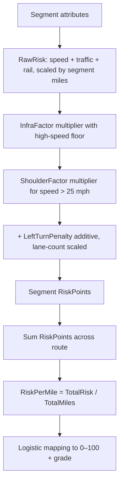
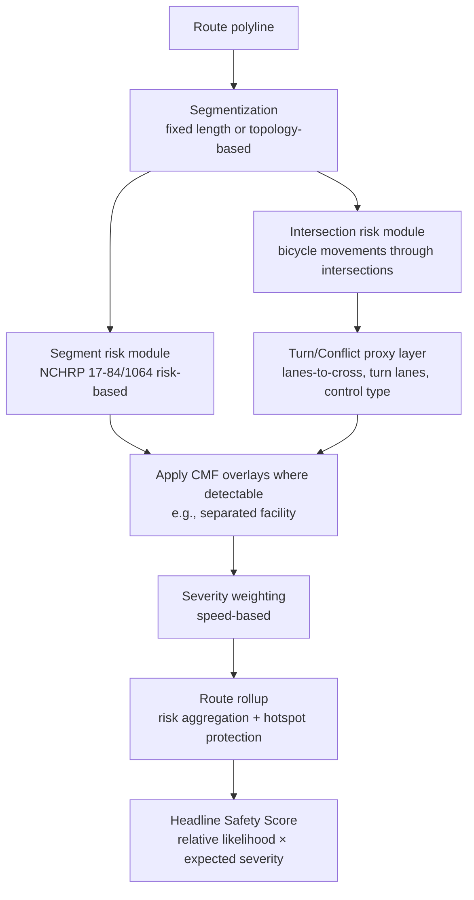
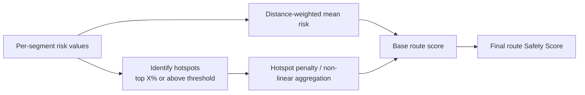

# Lanterne Execution Systems Context


---


This document contains operational documentation for building and running Lanterne.

Sources included:

• execution plans
• system manuals
• infrastructure projects
• architecture audits
• migration history


---

## Source File: docs/04-execution/exec-000-READ_ME.md

# exec-000-READ_ME

This file is the **front door** to the Lanterne docs.

Its job is simple:

- tell you what each top-level folder is for
- tell you where to start
- tell you where the important open paths live now
- stop you from getting lost in a pile of good docs

This is **not** the source of truth for architecture decisions.
It is the map to the source of truth.

---

# 1. How this docs repo is organized

## 01-philosophy
This is the “why” layer.

Read this when you want to remember:
- what Lanterne believes
- what kind of product it is trying to be
- what the core analysis worldview is

Start here if you feel the project getting muddy.

Main files:
- `phi-001-lanterne_manifesto.md`
- `phl-002-product_principles.md`
- `phi-003-analysis_model.md`

---

## 02-architecture
This is the “how the system is shaped” layer.

It contains:
- data model
- system architecture
- project map
- system guide
- design specs

If you want to know how the machine is supposed to work, this is where you go.

Important files:
- `arch-001-data_model.md`
- `arch-002-system_architecture.md`
- `arch-003-project_map.md`
- `arch-004-system_guide.md`
- `arch-005-recommended_schema_shape.md`

### 02-architecture/analysis
This is where scoring and index math lives.

Important files:
- `anal-001-indices_calculation.md`
- `anal-002-score_calculation.md`

### 02-architecture/design
This is where the **design specs** live.

These are concrete implementation-shape docs.

Use these when you need:
- schema definitions
- pipeline behavior
- analysis rules
- system-specific detailed build rules

Key files right now:
- `ds-005-canonical-route-schema-spec.md`
- `ds-006-route-canonicalization-spec.md`
- `ds-007-route-slice-generation-spec.md`
- `ds-008-route-corridor-model-spec.md`
- `ds-010-slice-analysis-cache-spec.md`
- `ds-013-comparative-traffic-context-schema-spec.md`
- `ds-014-route-expedition-state-and-windowed-analysis-spec.md`

---

## 03-adrs
This is the **decision log**.

If something is a durable architectural decision, it belongs here.

Use ADRs when you want to answer:
- why did we choose this?
- what tradeoff was made?
- what is locked vs still flexible?

Important recent ADRs:
- `adr-026-canonical-route-identity.md`
- `adr-031-model-multi-day-events-as-ordered-references-onto-canonical-geometry.md`
- `adr-032-comparative-traffic-context-and-segment-cohorts.md`
- `adr-033-canonical-segment-identity.md`
- `adr-034-master-route-expeditions-and-windowed-analysis.md`

---

## 04-execution
This is the **what do we actually do next** layer.

This folder matters a lot because it turns theory into action.

### Main execution files
- `exec-001-master_build_order.md` → big build sequence
- `exec-002-architecture_overview.md` → higher-level system overview
- `exec-003-current_focus.md` → what matters right now
- `exec-004-idea_dump.md` → raw idea holding area

### 04-execution/02_system_manuals
These are the operational manuals for major systems.

If you want the “explain it to me clearly” version of a system, go here.

Key files:
- `sys-001-expedition_system.md`
- `sys-002-route_ingestion_system.md`
- `sys-003-analysis_engine.md`
- `sys-005-navigation_engine.md`
- `sys-006-ride_computer.md`
- `sys-007-comparative_traffic.md`
- `sys-009-vault_system.md`

### 04-execution/03_infrastructure_projects
These are the major build tracks.

Use these when the question is:
- what infra project is active?
- what has to be completed to unlock the next layer?

Key files:
- `infra-001-canonical_schema_completion.md`
- `infra-002-rusa_corpus_ingestion.md`
- `infra-003-osm_enrichment_pipeline.md`
- `infra-004-route_analysis_backfill.md`
- `infra-005-canonical_segment_mapper.md`
- `infra-006-traffic_baseline_build.md`

---

## 05-product
This is the product framing layer.

Use this for:
- positioning
- vision
- rider archetypes
- UX guardrails
- anti-features
- brand/product boundaries

Key files:
- `prod-001-positioning.md`
- `prod-002-vision.md`
- `prod-003-rider_archetypes.md`
- `prod-004-guardrails.md`
- `prod-005-ux_principles.md`
- `prod-006-anti_features.md`

---

## assessments
This is where point-in-time architecture reviews live.

Use these to understand:
- risk
- blind spots
- debt
- where the system looked strong or shaky at a given time

Key files:
- `ass-001-architecture_audit_2026-03-08.m_.md`
- `ass-002-architecture_audit_2026-03-24.md`

---

## migrations
This is the human record of important migration and reconciliation work.

This is useful context, but it is not the main architecture home.

---

# 2. What to read first

If you are coming in cold, read in this order:

1. `01-philosophy/phl-002-product_principles.md`
2. `02-architecture/arch-004-system_guide.md`
3. `04-execution/exec-001-master_build_order.md`
4. `04-execution/exec-003-current_focus.md`

That gives you:
- product truth
- system truth
- build order
- present-tense focus

If you still feel lost after that, read:
- `02-architecture/arch-003-project_map.md`
- `04-execution/exec-002-architecture_overview.md`

---

# 3. Where the major open paths live now

This replaces the old “one giant master manual” way of thinking.

The paths still exist.
They are just now properly housed across the repo.

## Path: Expedition / multi-day continuity
What it is:
- durable route progress across days
- active windows
- resume behavior
- later handoff/preload

Read:
- `03-adrs/adr-034-master-route-expeditions-and-windowed-analysis.md`
- `02-architecture/design/ds-014-route-expedition-state-and-windowed-analysis-spec.md`
- `04-execution/02_system_manuals/sys-001-expedition_system.md`

Current truth:
- architecture is good
- first rider-facing pieces exist
- manual validation still matters before declaring trust

---

## Path: Long-route loading / chunked analysis
What it is:
- making giant routes feel like one journey
- only analyzing one bounded working set at a time
- tying window size to real corridor budget, not just miles

Read:
- `03-adrs/adr-034-master-route-expeditions-and-windowed-analysis.md`
- `02-architecture/design/ds-014-route-expedition-state-and-windowed-analysis-spec.md`
- `04-execution/02_system_manuals/sys-001-expedition_system.md`
- `04-execution/02_system_manuals/sys-003-analysis_engine.md`

Current truth:
- the architecture is right
- handoff/preload is not the first thing to build

---

## Path: Canonical segment identity
What it is:
- stable segment identity across routes and analyses
- route-local occurrences vs canonical long-lived segments

Read:
- `03-adrs/adr-033-canonical-segment-identity.md`
- `03-adrs/adr-032-comparative-traffic-context-and-segment-cohorts.md`
- `02-architecture/design/ds-013-comparative-traffic-context-schema-spec.md`
- `04-execution/03_infrastructure_projects/infra-005-canonical_segment_mapper.md`

Current truth:
- the dangerous ambiguity was fixed
- the matcher is intentionally deferred
- do not rush it into the live path

---

## Path: Comparative traffic context / cohorts
What it is:
- the model for canonical facts, baselines, and cohort memberships
- richer context without corrupting the top-line Safety Score

Read:
- `03-adrs/adr-032-comparative-traffic-context-and-segment-cohorts.md`
- `02-architecture/design/ds-013-comparative-traffic-context-schema-spec.md`
- `04-execution/02_system_manuals/sys-007-comparative_traffic.md`
- `04-execution/03_infrastructure_projects/infra-006-traffic_baseline_build.md`

Current truth:
- strong architecture
- still phased
- rider-facing richness should wait for trustworthy facts

---

## Path: Route persistence / DB discipline
What it is:
- how route writes happen
- how staging and production stay sane
- how SQL changes get promoted

Read:
- `02-architecture/arch-005-recommended_schema_shape.md`
- `04-execution/exec-003-current_focus.md`
- relevant infra docs as they are created/updated

Current truth:
- this has improved
- it still needs discipline
- do not let environment confusion creep back in

---

## Path: Core analysis engine
What it is:
- road fetch
- corridor construction
- caching
- scoring compute
- scaling risks

Read:
- `02-architecture/arch-002-system_architecture.md`
- `04-execution/02_system_manuals/sys-003-analysis_engine.md`
- `assessments/ass-002-architecture_audit_2026-03-24.md`

Current truth:
- real strength exists here
- Overpass and client-side compute are still central risks

---

## Path: Navigation / ride mode
What it is:
- actual riding product
- cues, alerts, ride surfaces, bike-computer-ish behavior

Read:
- `03-adrs/adr-029-ride-time-situational-awareness-mode.md`
- `03-adrs/adr-030-ride-mode-power-and-sensor-architecture.md`
- `02-architecture/design/ds-011-ride-time-situational-awareness-interface-spec.md`
- `02-architecture/design/ds-012-ride-computer-tile-system-spec.md`
- `04-execution/02_system_manuals/sys-005-navigation_engine.md`
- `04-execution/02_system_manuals/sys-006-ride_computer.md`

Current truth:
- promising
- must stay rider-trust-first
- do not confuse “exists” with “trustworthy deep into a ride”

---

## Path: Vault / ingestion / route corpus
What it is:
- route acquisition
- provenance
- route corpus growth
- source-aware route storage

Read:
- `03-adrs/adr-001-route-acquisition-model.md`
- `03-adrs/adr-002-vault-concept.md`
- `04-execution/02_system_manuals/sys-002-route_ingestion_system.md`
- `04-execution/02_system_manuals/sys-009-vault_system.md`
- `04-execution/03_infrastructure_projects/infra-002-rusa_corpus_ingestion.md`

Current truth:
- conceptually strong
- should compound over time
- provenance needs to stay explicit

---

## Path: Public expedition visibility / dot watchers
What it is:
- future watcher/family/public follow layer
- public expedition surface
- shared live progress

Read:
- `05-product/prod-002-vision.md`
- `04-execution/exec-004-idea_dump.md`
- later dedicated note/manual when it exists

Current truth:
- real opportunity
- not the thing to operationalize first
- do not let it pollute rider-critical work

---

# 4. What is the actual source of truth?

Use this rule:

## If the question is “what did we decide?”
Read the ADR.

## If the question is “what is the exact shape?”
Read the design spec.

## If the question is “how does this system work in English?”
Read the system manual.

## If the question is “what should happen next?”
Read the execution docs.

## If the question is “why are we even doing this?”
Read philosophy or product docs.

That is the hierarchy.

---

# 5. What is not replaced by this file

This file does **not** replace:
- ADRs
- design specs
- system manuals
- infra project docs
- current focus docs

This file is just the guide rail.

If this file and a real ADR/spec disagree, the ADR/spec wins.

---

# 6. Where to start depending on your mood

## If you want the highest-level truth
Read:
- `01-philosophy/phl-002-product_principles.md`
- `05-product/prod-002-vision.md`

## If you want to know what to build next
Read:
- `04-execution/exec-001-master_build_order.md`
- `04-execution/exec-003-current_focus.md`

## If you want to understand the machine
Read:
- `02-architecture/arch-004-system_guide.md`
- `02-architecture/arch-002-system_architecture.md`

## If you want to understand one specific system
Read the relevant file in:
- `04-execution/02_system_manuals/`

## If you want to understand one specific locked decision
Read the relevant file in:
- `03-adrs/`

---

# 7. Current reality in plain English

The docs are now much better structured than before.

That is good.

But the new risk is not chaos.
The new risk is **fragmentation**.

So the job of this file is to keep you from forgetting:

- where things live
- what to read first
- which path you are actually in
- what is architecture vs execution vs product thinking

That is all this file needs to do.

---

# 8. Short version

The old giant manual is no longer the main home.

The new homes are:

- **ADRs** for decisions
- **Design specs** for exact shapes
- **System manuals** for clear explanation
- **Infra docs** for active build tracks
- **Execution docs** for sequence and focus

Use this file when you need to orient yourself fast and then jump to the right real doc.


---

## Source File: docs/04-execution/exec-001-master_build_order.md


# Master Build Order

This document defines the correct sequence of major development phases.

## Phase 1 — Core Data Foundation

- Canonical schema finalization
- Slice engine implementation
- Segment fact model
- Cohort table scaffolding

## Phase 2 — Route Corpus Ingestion

- Ingest RUSA permanent routes
- Normalize route geometry
- Deduplicate routes
- Attach provenance

## Phase 3 — OSM Enrichment

- Slice-level OSM queries
- Infrastructure tagging
- Hazard detection
- Elevation enrichment

## Phase 4 — Baseline Route Analysis

- Traffic Index
- Bike Support Index
- Safety scoring pipeline

## Phase 5 — Extended Indices

- Remoteness Index
- Surface Quality Index
- Fatigue Index
- Descent Risk Index

## Phase 6 — Environmental Modeling

- Weather forecasts
- Solar calculations
- Moon phase modeling
- Glare detection

## Phase 7 — Route Comparison

- Route comparison UI
- Segment explanation layers

## Phase 8 — Expedition System

- Expedition state storage
- Crash recovery
- Resume functionality

## Phase 9 — Ride Computer

- Bike computer interface
- Cue sheet navigation
- Sensor integrations

## Phase 10 — Intelligence Layer

- Traffic behavior modeling
- Comparative context system
- Decision support tools


---

## Source File: docs/04-execution/exec-002-architecture_overview.md


# Lanterne Architecture Overview

This document visualizes the core architecture of Lanterne.

Lanterne is built around a layered intelligence system for long‑distance cyclists.

```
Route Sources
   │
   ▼
+-------------------+
|  Ingestion Layer  |
|-------------------|
| Route To          |
| Draw              |
| GPX Upload        |
| RWGPS Import      |
| RUSA Import       |
+-------------------+
   │
   ▼
+-------------------+
| Storage Layer     |
|-------------------|
| routes            |
| route_versions    |
| provenance        |
| analysis_outputs  |
+-------------------+
   │
   ▼
+-------------------+
| Analysis Engine   |
|-------------------|
| Slice Generation  |
| Traffic Index     |
| Bike Support      |
| Remoteness        |
| Fatigue           |
| Surface Quality   |
| Descent Risk      |
+-------------------+
   │
   ▼
+-------------------+
| Conditions Layer  |
|-------------------|
| Weather           |
| Wind              |
| Temperature       |
| Solar Position    |
| Moon Phase        |
| Glare Detection   |
+-------------------+
   │
   ▼
+-------------------+
| Presentation      |
|-------------------|
| Map Overlays      |
| Route Analysis    |
| Cue Sheets        |
| Comparison Views  |
+-------------------+
   │
   ▼
+-------------------+
| Decision Support  |
|-------------------|
| Route Comparison  |
| Ride Planning     |
| Expedition Mode   |
| Ride Computer     |
+-------------------+


---

## Source File: docs/04-execution/exec-003-current_focus.md

# Current Focus

## Purpose

Prevent idea thrash, keep development focused, and make it obvious what is active now versus what is intentionally deferred.

------

## Current Priorities

### 1. Canonical schema + route intelligence foundation

Lock the schema and supporting route-intelligence structure tightly enough that ingestion, analysis, and downstream scoring can stop shifting underneath the product.

https://chatgpt.com/g/g-p-69a5a40f6d9c81919302f52ccc4cdd32-lanterne/c/69c7cb36-6418-832f-b4aa-63876cd873d0

### 2. Safety Scoring Model Hardening: DS15 & Lovable Prompt

Deep Reserach: https://chatgpt.com/c/69c7cee2-bb58-8330-8cc5-eea6a0d6f96c
CGPT Pro (AFTER RESEARCH IS DONE: 
I want you to act as a senior product + systems reviewer and pressure test my current safety scoring approach for Lanterne.

Context:
Lanterne is a route intelligence system for long-distance cyclists. Its current architecture deliberately keeps the Safety Score narrow and separate from route-reality and conditions layers. That overall philosophy is intentional. The goal is a production-grade score riders can trust, not a giant kitchen-sink score. This aligns with the project’s current principles and analysis model. :contentReference[oaicite:0]{index=0} 

Current scoring direction:
- Safety Score = collision likelihood with motor vehicles + expected injury severity
- Core live scoring is primarily based on speed environment and traffic exposure, with infrastructure mitigation and hazard penalties
- Other route intelligence dimensions like remoteness, fatigue, surface, descent risk, and weather are intentionally separate for now :contentReference[oaicite:2]{index=2} :contentReference[oaicite:3]{index=3}

Current implemented shape:
- speed-related risk
- traffic-related risk / AADT when available
- lane / roadway context
- rail crossing contribution
- bike infrastructure mitigation
- shoulder credit
- left-turn penalty
- selected micro-hazard penalties
- route-level risk-per-mile transformed into a rider-facing score/grade :contentReference[oaicite:4]{index=4} :contentReference[oaicite:5]{index=5} :contentReference[oaicite:6]{index=6}

Attached:
1. Deep Research critique of the model
2. Relevant internal docs / scoring docs / ADRs

Your task:
Take the research critique and my current architecture direction, then recommend the best production-grade scoring approach for Lanterne Phase 0 / Phase 1.

Deliverables:
1. Verdict on whether the current scoring philosophy is fundamentally right or needs correction
2. The 5 biggest weaknesses in the current model
3. The 5 highest-value improvements, ranked
4. A blunt section called:
   “What is likely bullshit or fragile in the current score”
5. A section called:
   “What is defensible enough to ship now”
6. A section called:
   “What should stay out of the Safety Score”
7. A section called:
   “Recommended scoring architecture for Lanterne”
   Include:
   - factor families
   - whether each should be core, modifier, penalty, or separate index
   - how to avoid double-counting
8. A section called:
   “Recommended route rollup strategy”
   Include:
   - how not to wash out short dangerous stretches
   - whether to use weighted mean, percentile emphasis, worst reasonable stretch, etc.
9. A section called:
   “Recommended implementation order”
   Break into:
   - ship now
   - next version
   - later / research only
10. A final section called:
   “If I were locking the production score this month, I would do this”

Rules:
- Do not give me a tutorial version
- Do not give me an academic survey
- Do not suggest a giant complex model unless the gain is worth it
- Assume I want the strongest production approach that is still practical
- Be explicit about tradeoffs
- Call out where my product instincts are right
- Call out where I’m fooling myself
- If the research and the current product direction conflict, resolve that conflict and explain why
- Write like you are trying to save me 6 months of wrong implementation

Output format:
Use these headings exactly:
1. Overall Verdict
2. Biggest Weaknesses
3. Highest-Value Improvements
4. What Is Fragile or Likely Bullshit
5. What Is Defensible Enough to Ship
6. What Should Stay Out of the Safety Score
7. Recommended Scoring Architecture
8. Recommended Route Rollup Strategy
9. Recommended Implementation Order
10. Final Production Recommendation

### 3. Bike Crash research project (future but planning for it while subscriped to CGPT Pro)

​	https://chatgpt.com/c/69c76e27-f64c-8330-9afd-0d5e56a856eb

### 4. Front-end architecture refactor - PAUSED

Move the front end away from page-level state sprawl and toward a cleaner workflow/session model.

Current sub-focus:

- shrink the main page/god component
- separate workflow/lifecycle ownership from rendering
- plan workerization for heavy analysis so the app stays usable during loading
- reduce map monolith / surface sprawl
- make loading/analysis state part of a coherent workflow model rather than one-off UI patches

Reference thread:

- See bottom section of this doc for remaining steps

### 5. Cue points formatting - The RWGPS-imported cues flow through as **nativeCues** (type GpxCuePoint[]) into resolveCues(), which outputs them as **cuePoints** — that's what CueMarkerLayer receives as its prop to render the markers on the map.

------

## Active Execution Threads

These are the threads that are allowed to drive current work:

- Canonical schema finalization
- Slice engine implementation
- Front-end architecture refactor
- Expedition system state persistence
- Traffic cohort architecture

------

## Active but Secondary

These matter, but should not steal priority from the current execution threads unless directly required:

- Hazard taxonomy refinement
- Loader / analysis presentation polish
- Route review patterning / explainability
- Comparative traffic context

------

## Explicitly Deferred

Do not start these yet unless they become prerequisites for the current priorities:

- Ride computer advanced features

- Radar integrations

- UI polish outside the current front-end refactor

- LLM / voice assistant systems

- Broader expedition feature expansion beyond persistence/state hardening

- More robust loading sequence pulled from new scoring pipeline

  - Route: Port Orange - Ormond Loop Length: 100km Points: 2534 Fetching corridor from Overpass... Roads: 32986 Detecting junctions... Junction points: 678 / 2534 Crossing highway distribution: {  tertiary: 216,  residential: 524,  secondary: 51,  unclassified: 62,  tertiary_link: 4,  primary: 64,  secondary_link: 5,  primary_link: 3,  cycleway: 11 }

  - with headings

  - **Tracing route geometry**
     *2,534 route points mapped*

    **Fetching surrounding road network**
     *33,129 nearby roads analyzed*

    **Detecting intersections and turns**
     *678 plausible junctions identified*

    **Scoring maneuver complexity**
     *25 left-turn maneuvers, 13 major left turns*

------

## Success Criteria

This focus window is complete when:

- canonical schema is stable enough to stop churn
- slice engine is operational
- RUSA routes can be ingested and analyzed cleanly
- front-end workflow ownership is cleaner and less page-bound
- the app remains usable during route analysis or has a concrete workerization path underway
- map/surface state is moving toward a simpler, more governable structure

------

## Completed

### 2026-03-28

- Created deep research asset re: bike-car crash research framework res-001-bike_car_crash_data_mining.md
- Had Lovable generate a plain english explanation of the Safety Scoring Model ds-015-safety_scoring_model.md
- Confirmed turns are overwritten properly w/o reproducing the canonical route
- Moving on to hardening the canonical route hashing approach for multi-direction / out-and-back / slight variation routes so there isn't route sprawl in the future
- Tried to switch left turn analysis into a new pipeline version but failed to get it as accurate as the old route-level turn scoring so reverted to the old method since it isn't truly required to be known at the segment level at time of ingest and if one wanted to ascribe it to a segment, it could be done based on location after the fact.
- 

### 2026-03-27

- Hardened the route loader to a usable state
- Added route loading cancel behavior and cleaned up the cancel/reopen loop
- Reduced “segments worth reviewing” on the Boulder, CO route from 255 instances into 17 pattern buckets
- Classified those 17 buckets into:
  - 8 protected bike lanes scored risky
  - 8 high-speed road exposure patterns
  - 1 unusual segment break
- Added 6 hazards to the bottom drawer:
  - Bad Angles
  - Traffic
  - Pinch Points
  - Descents
  - No Shoulder
  - Grates
- Documented `prod-012` and `prod-013` and explicitly deferred them

### 2026-03-26

- Implemented new hazard tags
- Added ability to cancel a loading route
- Hardened expedition mode entry logic
- Added admin debug setting to show all metal grated bridges
- Began loader fixes as part of the broader front-end refactor

------

## Working Rules

- Do not let loader polish turn into another isolated UI rabbit hole
- Do not start advanced ride computer work while core schema / analysis / front-end structure are still unstable
- Treat front-end refactor as an architecture thread, not a cosmetics thread
- Only add new active threads if they are true prerequisites or materially block current priorities

# Front-End Work Remaining

## Status

**Completed**

- Phase 0 baseline instrumentation:
  - fixed GPX fixtures
  - smoke test definitions
  - performance markers
  - perf budget logging
  - baseline regression harness

**Not yet approved to start**

- Phase 1
- Phase 2
- Phase 3
- Phase 4

These remain blocked until slice-level scoring and OSM ingestion/enrichment stabilize the analysis contracts.

------

# Remaining Front-End Phases

## Phase 1 — Extract Bounded Hooks + Layout Reducer

Purpose: reduce `Index.tsx` from god-component status without changing behavior.

### Planned hook extractions

- `useRouteAcquisition`
- `useAnalysisSession`
- `useRoutePersistence`
- `usePoiManager`
- `useRideSession`

### Additional Phase 1 work

- introduce `resetRouteSession(reason)` as the single teardown path
- evolve `LayoutContext.tsx` from boolean bag to reducer
- introduce `RouteWorkflowState` separate from `MapMode`

### Phase 1 done criteria

- `Index.tsx` reduced to ~800–1000 lines
- typed public interfaces for all five hooks
- no cross-domain imports between hooks
- no direct state mutation across hook boundaries
- `LayoutContext` reducer replaces standalone drawer/panel booleans
- all Phase 0 smoke flows still pass

------

## Phase 2 — Worker Boundary

Purpose: move heavy matching/scoring compute off the main thread.

### Planned split

- `route-analysis-core.ts` → pure compute only
- `route-analysis-io.ts` → fetch/cache/Supabase/orchestration
- `analysis.worker.ts` → imports only core
- `analysis-protocol.ts` → typed worker messages

### Compute that moves to worker

- road matching
- forensic pipeline
- boundary refinement math
- safety scoring
- transition chain computation
- cue generation

### Work that stays on main thread

- corridor tile fetch
- cache reads/writes
- HPMS/DOT fetches
- railroad crossing detection
- heatmap-building / UI-facing orchestration

### Phase 2 done criteria

- worker serialization within budget on long-route fixture
- zero long tasks over budget during compute phase
- map remains pannable during analysis
- cancel → worker abort → UI reset stays within budget
- stale worker results blocked by `sessionId` guard
- all Phase 0 smoke flows still pass

------

## Phase 3 — RouteMap Decomposition

Purpose: kill the RouteMap monolith and replace prop sprawl with explicit layer boundaries.

### Planned work

- define `MapScene` contract before extraction
- replace 70+ prop sprawl with scene objects
- extract layers in this order:
  1. `useMapCore`
  2. `useRoutePolyline`
  3. `useHeatmapLayer`
  4. `useHazardLayer`
  5. `useCueLayer`
  6. `useGpsLayer`
  7. `usePoiLayer`
  8. `useDebugLayers`

### Phase 3 done criteria

- `RouteMap.tsx` reduced to ~300–400 lines
- each layer handles its own cleanup
- rider-facing hooks contain no admin logic
- click handlers, tooltips, zoom behavior remain unchanged
- layer mount order preserves z-order behavior
- all Phase 0 smoke flows still pass

------

## Phase 4 — Surface Governance + Resilience

Purpose: finish workflow/state cleanup after the structural refactor.

### Planned work

- wire `RouteWorkflowState` into visibility rules
- audit remaining rogue surface toggles
- add `failed` and `partial` workflow states
- add stale reopen / re-analyze recovery behavior

### Phase 4 done criteria

- zero standalone drawer/panel booleans left in `Index.tsx`
- `failed` state shows retry UI
- `partial` state shows warning + usable partial results
- stale reopen detection works
- all Phase 0 smoke flows still pass

------

## Key Front-End Risks

- Phase 1 is the highest-risk extraction because callbacks in `Index.tsx` cross multiple domains.
- `usePoiManager` has hidden coupling to route and map-bounds state and must use explicit parameters.
- worker serialization could become expensive on long routes.
- RouteMap extraction must preserve explicit Leaflet z-order.
- Layout reducer migration touches many callback props that currently toggle booleans directly.

------

## Current Decision

Front-end work is limited to **Phase 0 only** until:

- slice-level scoring model is stable
- OSM ingestion/enrichment contracts are stable
- route-analysis input/output contracts are frozen

After that, execute front-end Phases 1 → 4 in order.


---

## Source File: docs/04-execution/exec-004-idea_dump.md

# Idea Dump For Future Improvements

You can't focus on everything all at once, and not everything needs to be decided today. Let this be a holding place for big ideas so you can focus on making progress with the basics.

------

## Expedition Mode Could Become Product #1

- import past activities from Strava/Garmin
- stitch together entire multi-week/month/year journey
- watchers can follow, athletes can use as an explorers journal/log, field notes style
- would apply to other sports/activities too (ultra-running/walking/kayaking/sailing/etc where long distances are traversed of a long period of time)

------

## iOS/Android App

- Build an app for native bluetooth, would need a companion app anyway to get BT reliably into the Safari based app.  Janky solution to bookmark a PNW + install an app that has to go through AppStore anyway. 
- Opens up other possibilities beyond BT: battery mgmt, haptics (lantern wheel, etc)
- Can be minimal coding with a wrapper around the React framework and can still use Lovable 
- Can avoid re-approvals from apple if most logic is kept in web part of the app
- need a couple screens (perhaps load screen) to be iOS native (plus making use of hardware features of phone) so that Apple approves initial application
- CGPT thread context: https://chatgpt.com/s/t_69c33b5ca9ac8191a08b6918ef0c1746

- 

------

## Icons Improvement

- need to fit better with Lanterne theme
- thin lines if visible enough
- See Phosphor Thin from streamlinehq.com

##### Link Tree

- where to?

  - route to...
  - draw
  - load
    - rwgps 
    - vault
      - rusa perms
      - saved
      - (future expansion)
    - .gpx
    - history

- analyze

- cues

- dev (admin only)

- inspect (admin/superuser only)

- stops & layers

  - Stops (with gear icon to configure toggles)
  - water
    - potable water
    - natural water crossings
    - cemetaries
  - food
    - restaurants
    - supermarkets
    - Cafes/fastfood
    - convenience stores
    - gas stations
  -  bio (toilet)
    - toilets
    - Showers
  - rest
    - hotels
    - hostels
    - campgrounds
    - post offices
  - tourism
    - monuments
    - ruins
    - memorials
    - attractions
    - Info offices
  - nature
    - peaks
    - springs
    - caves
    - viewpoints
  - health
    - hospitals
    - clinic
    - pharmacies
  - help
    - fire stations
    - police stations
    - emergency phones

- map buttons

  - current bearing - pointer
  - heatmap on/off - Light bulb
  - day night - sun & crescent moon
  - OSM street and satlleite - folded map
  - Gps - crosshairs

- drawing map buttons

  - snap on button
  - '# points and miles counter button
  - need elevation counter button + icon
  - cancel button

- edit route button

- admin/superuser map buttons

  - edit route
  - show roads
  - anomalies
  - inspector on (should probably kill this and just always have inspector on for these user types)
  - truth mode (admin only)
  - hold to peek (eyeball)

- hazards

  - RR Crossing

  - RR Crossing - Dangerous Angle?

  - Left Turn (Crosses Traffic)

  - Metal Grate Bridge

  - Future Possibilities:

    - Pinch Point
    - Remote Corridor
    - Service Gap
    - Cellular Dead Zone
    - etc.

    

  

  


---

## Source File: docs/04-execution/exec-005-debugging_logs.md

# Debugging Logs

### Boundary Marker Catalog

All debug boundary markers rendered in Truth Mode / Transition Debug:

| Color | Hex | Source Object | Semantic Meaning | Rider-Facing? |
|-------|-----|--------------|------------------|---------------|
| Orange (hollow) | `#ff8800` | `truthBoundaryDebug` | Coarse PASS-1 boundary (sampled grid position) | Evidence only |
| Magenta (filled) | `#ff00ff` | `truthBoundaryDebug` | Refined PASS-2 boundary (moved from coarse) | Evidence only |
| Cyan/Teal (dashed) | `#00cccc` | `truthBoundaryDebug` | Fallback (refinement kept coarse position) | Evidence only |
| Green | `#00ff00` | `transitionChainDiag` | OSM intersection candidate (shared node) | Evidence only |
| Red | `#ff0000` | `transitionChainDiag` | Matcher flip point (PASS-1 winner changed) | Evidence only |
| Cyan | `#00ffff` | `transitionChainDiag` | Corrected boundary (transition-chain final) | Evidence only |
| Red (small) | `#ff0000` | heatmap debug | Truth boundary tick (scoring segment edge) | Internal |
| Cyan (medium) | `#00ffff` | heatmap debug | Merge boundary tick (display segment edge) | Internal |

**Important**: None of these markers are automatically rider-facing cuts. The `boundary-resolver.ts` module filters all evidence into a `resolvedCuts` set using road-identity change, anti-fragmentation, and confidence rules.

Enable boundary resolver logs: `localStorage.DEBUG_FLAGS = '{"BOUNDARY_DEBUG":true}'`

### Hazards

Enable with: localStorage.DEBUG_FLAGS = '{"HAZARD_DEBUG":true}' then reload and re-analyze.

**Console logging** (when HAZARD_DEBUG=true):

- [HAZARD-TRACE] now includes OSM node ID, nearest route coord, snap distance (meters), and route distance (miles) for both accepted AND rejected crossings
- [HAZARD-RENDER] shows raw → attached → rendered coordinates with deltas

**Map debug overlay** (when HAZARD_DEBUG=true):

- **Cyan circles** = raw OSM detection point (with permanent label showing OSM ID + coords)
- **Yellow circles** = nearest attached route point + yellow dashed line connecting raw→attached
- **Magenta circles** = rendered marker point (currently = raw, confirming no remap)
- **Red circles** = REJECTED crossings with tooltip showing rejection reason + snap distance, plus red dashed line to nearest route point


---

## Source File: docs/04-execution/exec-006-phase0-smoke-tests.md

# Phase 0 — Smoke Tests & Performance Baselines

## Fixtures

| Fixture | File | Purpose |
|---------|------|---------|
| Short urban hazard | `public/demo/fixture-urban-hazard.gpx` | ~15mi KC MO, dense crossings/bridges, stress hazard detection |
| Long rural | `public/demo/fixture-long-rural.gpx` | ~200mi KS Flint Hills, worker serialization budget, guardrails |
| History-loaded | `public/demo/fixture-history-loaded.gpx` | ~40mi Lawrence KS loop, rehydration/cache hit/re-analyze |
| Detour-edit | `public/demo/fixture-detour-edit.gpx` | ~25mi Topeka out-and-back, detour drag/save/delta-panel |

## Smoke Test Paths

### 1. GPX Upload → Analyze → Save
1. Upload `fixture-urban-hazard.gpx`
2. Wait for analysis to complete (score panel renders)
3. Open left drawer, verify score + grade visible
4. Save to history
5. **Pass:** Route appears in history list with correct name

### 2. Manual Create → Analyze → Save
1. Enter route create mode
2. Place 3+ waypoints (~5mi route)
3. Finish drawing → analysis begins
4. Wait for completion
5. Save to history
6. **Pass:** Route saved, can be re-loaded

### 3. History Load → Re-analyze
1. Load `fixture-history-loaded.gpx`, analyze, save
2. Open history, click the saved route
3. Verify polyline renders on map
4. Trigger re-analyze
5. **Pass:** New score renders, no ghost state from previous analysis

### 4. Detour Save
1. Upload `fixture-detour-edit.gpx`, analyze
2. Click on the high-traffic middle segment
3. Drag a detour waypoint to create alternate route
4. Verify delta panel shows score comparison
5. Save detour
6. **Pass:** Detour saved to history, delta panel values correct

## Hard Performance Budgets

| Metric | Budget | Module |
|--------|--------|--------|
| Cancel acknowledged | ≤ 300ms | `analysis:cancel:latency` |
| Worker serialization (long-route) | ≤ 80ms | `worker:serialization` |
| Main-thread long tasks during compute | 0 tasks > 100ms | `PerformanceObserver('longtask')` |
| Render-to-interactive after done | ≤ 500ms | `render:to-interactive` |

Budget violations emit `[PERF-BUDGET] ⚠` warnings to console.

## Instrumentation Points

All marks defined in `src/lib/refactor-perf-budgets.ts`:
- `markAnalysisStart()` — called when `analyzeRouteProgressive` loop begins
- `markAnalysisDone()` — called on `analysis` stage received
- `markAnalysisCancelRequest()` — called when cancel button tapped
- `markAnalysisCancelAck()` — called when UI teardown complete
- `markRenderToInteractiveStart()` — called at analysis done phase
- `markRenderToInteractiveEnd()` — called on first drawer open after analysis
- `startLongTaskObserver()` / `stopLongTaskObserver()` — bracketing analysis phase

## Done Criteria

- [ ] 4 fixture files committed to `public/demo/`
- [ ] 4 smoke paths documented (this file) and manually passing
- [ ] Perf marks emitting to console during analysis
- [ ] Budget violations logged as warnings
- [ ] **No code moved or restructured** — this is baseline only


---

## Source File: docs/04-execution/exec-007-turn_event_persistence_handoff.md

# Current Focus

## Purpose

Prevent idea thrash, keep development focused, and make it obvious what is active now versus what is intentionally deferred.

------

## Current Priorities

### 1. Canonical schema + route intelligence foundation

Lock the schema and supporting route-intelligence structure tightly enough that ingestion, analysis, and downstream scoring can stop shifting underneath the product.

### 2. Front-end architecture refactor

Move the front end away from page-level state sprawl and toward a cleaner workflow/session model.

Current sub-focus:

- shrink the main page/god component
- separate workflow/lifecycle ownership from rendering
- plan workerization for heavy analysis so the app stays usable during loading
- reduce map monolith / surface sprawl
- make loading/analysis state part of a coherent workflow model rather than one-off UI patches

Reference thread:

- See bottom section of this doc for remaining steps
  	

------

## Active Execution Threads

These are the threads that are allowed to drive current work:

- Canonical schema finalization
- Slice engine implementation
- Front-end architecture refactor
- Expedition system state persistence
- Traffic cohort architecture

------

## Active but Secondary

These matter, but should not steal priority from the current execution threads unless directly required:

- Hazard taxonomy refinement
- Loader / analysis presentation polish
- Route review patterning / explainability
- Comparative traffic context

------

## Explicitly Deferred

Do not start these yet unless they become prerequisites for the current priorities:

- Ride computer advanced features

- Radar integrations

- UI polish outside the current front-end refactor

- LLM / voice assistant systems

- Broader expedition feature expansion beyond persistence/state hardening

- More robust loading sequence pulled from new scoring pipeline

  - Route: Port Orange - Ormond Loop Length: 100km Points: 2534 Fetching corridor from Overpass... Roads: 32986 Detecting junctions... Junction points: 678 / 2534 Crossing highway distribution: {  tertiary: 216,  residential: 524,  secondary: 51,  unclassified: 62,  tertiary_link: 4,  primary: 64,  secondary_link: 5,  primary_link: 3,  cycleway: 11 }

  - with headings

  - **Tracing route geometry**
     *2,534 route points mapped*

    **Fetching surrounding road network**
     *33,129 nearby roads analyzed*

    **Detecting intersections and turns**
     *678 plausible junctions identified*

    **Scoring maneuver complexity**
     *25 left-turn maneuvers, 13 major left turns*

------

## Success Criteria

This focus window is complete when:

- canonical schema is stable enough to stop churn
- slice engine is operational
- RUSA routes can be ingested and analyzed cleanly
- front-end workflow ownership is cleaner and less page-bound
- the app remains usable during route analysis or has a concrete workerization path underway
- map/surface state is moving toward a simpler, more governable structure

------

## Completed

### 2026-03-28

- 

### 2026-03-27

- Hardened the route loader to a usable state
- Added route loading cancel behavior and cleaned up the cancel/reopen loop
- Reduced “segments worth reviewing” on the Boulder, CO route from 255 instances into 17 pattern buckets
- Classified those 17 buckets into:
  - 8 protected bike lanes scored risky
  - 8 high-speed road exposure patterns
  - 1 unusual segment break
- Added 6 hazards to the bottom drawer:
  - Bad Angles
  - Traffic
  - Pinch Points
  - Descents
  - No Shoulder
  - Grates
- Documented `prod-012` and `prod-013` and explicitly deferred them

### 2026-03-26

- Implemented new hazard tags
- Added ability to cancel a loading route
- Hardened expedition mode entry logic
- Added admin debug setting to show all metal grated bridges
- Began loader fixes as part of the broader front-end refactor

------

## Working Rules

- Do not let loader polish turn into another isolated UI rabbit hole
- Do not start advanced ride computer work while core schema / analysis / front-end structure are still unstable
- Treat front-end refactor as an architecture thread, not a cosmetics thread
- Only add new active threads if they are true prerequisites or materially block current priorities

# Front-End Work Remaining

## Status

**Completed**

- Phase 0 baseline instrumentation:
  - fixed GPX fixtures
  - smoke test definitions
  - performance markers
  - perf budget logging
  - baseline regression harness

**Not yet approved to start**

- Phase 1
- Phase 2
- Phase 3
- Phase 4

These remain blocked until slice-level scoring and OSM ingestion/enrichment stabilize the analysis contracts.

------

# Remaining Front-End Phases

## Phase 1 — Extract Bounded Hooks + Layout Reducer

Purpose: reduce `Index.tsx` from god-component status without changing behavior.

### Planned hook extractions

- `useRouteAcquisition`
- `useAnalysisSession`
- `useRoutePersistence`
- `usePoiManager`
- `useRideSession`

### Additional Phase 1 work

- introduce `resetRouteSession(reason)` as the single teardown path
- evolve `LayoutContext.tsx` from boolean bag to reducer
- introduce `RouteWorkflowState` separate from `MapMode`

### Phase 1 done criteria

- `Index.tsx` reduced to ~800–1000 lines
- typed public interfaces for all five hooks
- no cross-domain imports between hooks
- no direct state mutation across hook boundaries
- `LayoutContext` reducer replaces standalone drawer/panel booleans
- all Phase 0 smoke flows still pass

------

## Phase 2 — Worker Boundary

Purpose: move heavy matching/scoring compute off the main thread.

### Planned split

- `route-analysis-core.ts` → pure compute only
- `route-analysis-io.ts` → fetch/cache/Supabase/orchestration
- `analysis.worker.ts` → imports only core
- `analysis-protocol.ts` → typed worker messages

### Compute that moves to worker

- road matching
- forensic pipeline
- boundary refinement math
- safety scoring
- transition chain computation
- cue generation

### Work that stays on main thread

- corridor tile fetch
- cache reads/writes
- HPMS/DOT fetches
- railroad crossing detection
- heatmap-building / UI-facing orchestration

### Phase 2 done criteria

- worker serialization within budget on long-route fixture
- zero long tasks over budget during compute phase
- map remains pannable during analysis
- cancel → worker abort → UI reset stays within budget
- stale worker results blocked by `sessionId` guard
- all Phase 0 smoke flows still pass

------

## Phase 3 — RouteMap Decomposition

Purpose: kill the RouteMap monolith and replace prop sprawl with explicit layer boundaries.

### Planned work

- define `MapScene` contract before extraction
- replace 70+ prop sprawl with scene objects
- extract layers in this order:
  1. `useMapCore`
  2. `useRoutePolyline`
  3. `useHeatmapLayer`
  4. `useHazardLayer`
  5. `useCueLayer`
  6. `useGpsLayer`
  7. `usePoiLayer`
  8. `useDebugLayers`

### Phase 3 done criteria

- `RouteMap.tsx` reduced to ~300–400 lines
- each layer handles its own cleanup
- rider-facing hooks contain no admin logic
- click handlers, tooltips, zoom behavior remain unchanged
- layer mount order preserves z-order behavior
- all Phase 0 smoke flows still pass

------

## Phase 4 — Surface Governance + Resilience

Purpose: finish workflow/state cleanup after the structural refactor.

### Planned work

- wire `RouteWorkflowState` into visibility rules
- audit remaining rogue surface toggles
- add `failed` and `partial` workflow states
- add stale reopen / re-analyze recovery behavior

### Phase 4 done criteria

- zero standalone drawer/panel booleans left in `Index.tsx`
- `failed` state shows retry UI
- `partial` state shows warning + usable partial results
- stale reopen detection works
- all Phase 0 smoke flows still pass

------

## Key Front-End Risks

- Phase 1 is the highest-risk extraction because callbacks in `Index.tsx` cross multiple domains.
- `usePoiManager` has hidden coupling to route and map-bounds state and must use explicit parameters.
- worker serialization could become expensive on long routes.
- RouteMap extraction must preserve explicit Leaflet z-order.
- Layout reducer migration touches many callback props that currently toggle booleans directly.

------

## Current Decision

Front-end work is limited to **Phase 0 only** until:

- slice-level scoring model is stable
- OSM ingestion/enrichment contracts are stable
- route-analysis input/output contracts are frozen

After that, execute front-end Phases 1 → 4 in order.


---

## Source File: docs/04-execution/exec-008-drawer refactor_plan_and_implementation_spec.md

# EXEC-008 — UI/Domain Refactor Program

Status: Draft  
Owner: Derek Minner  
Scope: Cross-surface UI architecture refactor for Lanterne  
Related: Map Visibility System, Push Intelligence, Vault expansion, scoring overhaul, unified drawer architecture

---

## 1. Purpose

This document defines the go-forward refactor program for Lanterne's UI and adjacent domain architecture.

The immediate trigger is the drawer-handle / drawer-shell problem, but the real issue is broader:

- drawer behavior is not unified
- too much product logic lives inside `RouteMap.tsx` and individual drawers
- multiple systems that should become first-class domains are still embedded inside UI surfaces
- upcoming product work will otherwise worsen the architecture rather than improve it

This refactor is therefore not a cosmetic cleanup.
It is a structural program to:

1. reduce blast radius in the main map surface
2. centralize product logic by system boundary
3. make future features land in domain modules rather than drawer-local hacks
4. enforce consistent motion, sizing, layering, and state ownership across all drawers
5. create a stable foundation for Vault, Push Intelligence, hazard/POI visibility, and future scoring work

---

## 2. Why this needs to happen now

This is the right moment because every major drawer is about to change anyway:

- **Top drawer**: Vault expansion, including organizations/collections like RUSA, Bikepacking.com, and future curated collections
- **Right drawer**: Cue Sheet expansion and Push Intelligence / ride-execution systems
- **Bottom drawer**: hazard / POI / layer visibility refactor
- **Left drawer**: safety scoring overhaul and future score explanation changes

If these all land into the existing architecture, the main map file and drawer surfaces will become even more coupled and harder to reason about.

The goal of EXEC-008 is to force those changes through clean seams instead of letting each feature deepen the monolith.

---

## 3. Executive decision

Lanterne will move from **drawer-owned feature logic** and **map-surface conditional sprawl** to a model based on:

- centralized domain/state modules
- shared drawer shell primitives
- registry/resolver systems for map-visible intelligence
- drawers as presentation surfaces that consume shared domain data
- map as a composition/render surface, not the policy brain for the product

In plain English:

- the drawers stop owning the world
- the map stops being the app's nervous system
- feature systems become modular and reusable across multiple surfaces

---

## 4. Core refactor principles

### 4.1 Drawers are shells, not feature brains

A drawer should own:

- layout
- open/closed/peek/full state presentation
- local UI affordances
- local scroll and tab state

A drawer should **not** own:

- canonical business data
- feature truth
- visibility policy
- scoring logic
- cue derivation
- route collection semantics

### 4.2 RouteMap becomes a renderer/composer

`RouteMap.tsx` should move toward owning:

- map container composition
- layer mounting
- event wiring
- interaction handoff

It should move away from owning:

- visibility rules
- feature category policy
- drawer policy
- domain-specific derivations
- duplicated feature state

### 4.3 Domain logic lives by future product boundary

The right extraction seams are not "misc helper files." They are future systems:

- Vault
- Cue Sheet / Route Guidance
- Push Intelligence
- Hazard / POI / visibility policy
- Scoring / score explanation
- Drawer shell / motion system

### 4.4 One system, many surfaces

If a system is expected to appear in multiple places later, it should not live inside one drawer now.

Examples:

- cue data should not be "owned by the right drawer"
- map visibility should not be "owned by RouteMap"
- Vault collections should not be "owned by the top drawer"
- score explanation should not be "owned by the left drawer"

### 4.5 Registry + resolver over special-case branching

Wherever categories/policies are expanding, use:

- canonical registry/config
- centralized resolver
- typed outputs

Do not keep adding `if / else` feature branches inside map and drawer components.

### 4.6 Desktop rails are fixed; map is elastic

Desktop drawers use fixed pixel dimensions.
The map expands/contracts around them.
Desktop drawer sizing should not vary with screen percentage except for explicit safety breakpoints.

### 4.7 Mobile interaction is gesture-first

On mobile, drawer shells should support JS-driven gesture behavior with unified snap logic.
Handles must be physically part of the shell and never separate floating siblings.

---

## 5. Program scope

EXEC-008 includes five parallel refactor tracks.

### Track A — Drawer Shell System
Build the shared drawer primitive and motion/state model.

### Track B — Vault Domain Extraction
Move top-drawer route collections and future organizations into a real Vault domain.

### Track C — Cue / Guidance / Push Domain Extraction
Move cue and ride-execution logic out of the right drawer into shared route-guidance and push-intelligence domains.

### Track D — Map Visibility / Hazard / POI Extraction
Implement the map visibility system as registry + resolver and remove ad hoc visibility logic from RouteMap and bottom drawer surfaces.

### Track E — Score / Score Explanation Extraction
Prepare left-drawer scoring overhaul by centralizing score state, explanation payloads, and versioned score presentation contracts.

---

## 6. Target architecture

## 6.1 UI shell layer

Proposed modules:

- `src/ui/drawers/DrawerShell.tsx`
- `src/ui/drawers/DrawerHandle.tsx`
- `src/ui/drawers/useDrawerMotion.ts`
- `src/ui/drawers/drawer-store.ts`
- `src/ui/drawers/drawer-registry.ts`
- `src/ui/drawers/drawer-constants.ts`

Responsibilities:

- fixed vs responsive sizing
- snap points
- gesture physics
- shell transforms
- desktop/mobile behavior
- attached handles
- shell layering

## 6.2 Domain layer

Proposed modules:

- `src/domain/vault/*`
- `src/domain/cues/*`
- `src/domain/push/*`
- `src/domain/map-visibility/*`
- `src/domain/pois/*`
- `src/domain/hazards/*`
- `src/domain/scoring/*`
- `src/domain/route-review/*`

Responsibilities:

- typed data models
- selectors and derivations
- canonical payload shaping
- resolver logic
- shared state contracts across surfaces

## 6.3 Map composition layer

Proposed modules:

- `src/map/RouteMap.tsx` (reduced)
- `src/map/layers/*`
- `src/map/controllers/*`
- `src/map/selectors/*`

Responsibilities:

- consume resolved layer outputs
- mount render layers
- wire map interactions to shared state
- avoid category policy logic in component branches

## 6.4 Drawer surface layer

Proposed modules:

- `src/features/vault/VaultDrawerView.tsx`
- `src/features/cues/CueDrawerView.tsx`
- `src/features/analysis/ScoreDrawerView.tsx`
- `src/features/map-layers/RouteLayersDrawerView.tsx`

Responsibilities:

- present domain data
- dispatch UI actions
- own local tabs/scroll only

---

## 7. Stage plan

## Stage 0 — Inventory and freeze rules

### Goal
Define ownership before moving code.

### Deliverables

- canonical module ownership map
- list of existing drawer-owned feature logic to migrate
- route map responsibility audit
- no-new-special-cases rule for drawer logic

### Rules

- no new feature-specific drawer hacks while EXEC-008 is active
- all new work must target its future domain boundary where possible

---

## Stage 1 — Drawer shell foundation

### Goal
Make detached handles structurally impossible.

### Work

- create unified `DrawerShell`
- create shared drawer state store
- create desktop fixed rail sizing tokens
- implement mobile gesture engine
- migrate one side drawer first
- migrate bottom lantern shell
- remove separate handle movement logic

### Acceptance criteria

- one transform per shell
- handle lives inside shell
- no pixel drift
- no separate bounce behavior
- desktop drawer dimensions fixed in px
- map expands/contracts instead

---

## Stage 2 — Extract route guidance / cues from right drawer

### Goal
Make cues a shared route-guidance domain.

### Work

Create:

- `src/domain/cues/types.ts`
- `src/domain/cues/selectors.ts`
- `src/domain/cues/store.ts`
- `src/domain/cues/derivations.ts`
- `src/domain/cues/presentation.ts`

Optional paired push modules:

- `src/domain/push/types.ts`
- `src/domain/push/store.ts`
- `src/domain/push/selectors.ts`

Move out of right drawer:

- cue sorting/grouping
- current/next cue derivation
- route-progress-linked cue state
- future timing/projection scaffolding

Right drawer becomes:

- cue presentation surface
- push intelligence presentation surface

Not the place where route guidance truth is authored.

### Why now

Push Intelligence clearly makes ride execution a system, not a drawer-local UI concern.

---

## Stage 3 — Extract hazard / POI / map visibility system from bottom drawer + RouteMap

### Goal
Implement registry + resolver architecture for map-visible entities.

### Work

Create:

- `src/domain/map-visibility/category-registry.ts`
- `src/domain/map-visibility/context-resolver.ts`
- `src/domain/map-visibility/types.ts`
- `src/domain/map-visibility/presets.ts`
- `src/domain/map-visibility/suppression.ts`
- `src/domain/pois/store.ts`
- `src/domain/hazards/store.ts`

Resolver outputs should include:

- `shouldFetch`
- `fetchScope`
- `shouldRender`
- `renderMode`
- `aggregateMode`
- `suppressionReasons`

Move out of bottom drawer / RouteMap:

- ad hoc zoom-dependent visibility logic
- per-category special casing
- drawer-local marker logic
- context logic for browse/plan/review/ride/admin

Bottom drawer becomes:

- a layer control / summary / toggle surface
- not the owner of category policy

### Why now

The map visibility system is already conceptually defined. It should become executable architecture now rather than a doc that RouteMap ignores.

---

## Stage 4 — Extract Vault domain from top drawer

### Goal
Support real Vault growth without top-drawer feature sprawl.

### Work

Create:

- `src/domain/vault/types.ts`
- `src/domain/vault/store.ts`
- `src/domain/vault/selectors.ts`
- `src/domain/vault/collections.ts`
- `src/domain/vault/providers.ts`

Vault model should support:

- native curated collections
- organizations/providers
- collection metadata
- mode-aware filtering
- route family concepts
- future provider ingestion

Top drawer becomes:

- browse/open surface for Vault
- search/filter/switching surface

Not the place where provider semantics are implemented.

### Initial provider examples

- RUSA
- Bikepacking.com
- Randonneurs Canada
- future org-based curated collections

---

## Stage 5 — Extract scoring + score explanation state for left drawer overhaul

### Goal
Prepare for scoring overhaul without pinning new scoring behavior to left-drawer local state.

### Work

Create:

- `src/domain/scoring/types.ts`
- `src/domain/scoring/store.ts`
- `src/domain/scoring/selectors.ts`
- `src/domain/scoring/explanations.ts`
- `src/domain/scoring/versioning.ts`

Support:

- score payloads by version
- explanation cards/sections
- factor breakdowns
- confidence/warning payloads
- future comparison/explanation surfaces outside left drawer

Left drawer becomes:

- score presentation surface
- explanation surface

Not the owner of score assembly logic.

---

## Stage 6 — Reduce RouteMap to composition surface

### Goal
Shrink the main file by removing policy and domain logic.

### Work

After Stages 1–5, RouteMap should mostly:

- mount layers
- consume resolved visibility data
- consume selected drawer/open state
- route interactions to shared stores
- manage map events and composition

Extract remaining clusters such as:

- layer-specific renderers
- focused marker/entity handling
- corridor overlays
- route interaction controllers

### Success definition

The file is smaller because ownership changed, not because helpers were scattered arbitrarily.

---

## 8. Detailed technical boundaries

## 8.1 Drawer state contract

Use typed drawer IDs and shared snap states.

Example:

```ts
export type DrawerId = 'top' | 'left' | 'right' | 'bottom';
export type DrawerSnap = 'closed' | 'peek' | 'open' | 'full';

export interface DrawerRuntimeState {
  id: DrawerId;
  snap: DrawerSnap;
  dragging: boolean;
  measuredSizePx: number;
  offsetPx: number;
}
```

## 8.2 Desktop sizing tokens

```ts
export const DESKTOP_DRAWER_DIMENSIONS = {
  leftWidthPx: 360,
  rightWidthPx: 420,
  topHeightPx: 88,
  bottomPeekPx: 92,
  bottomOpenPx: 340,
};
```

Rules:

- desktop drawers use fixed px rails
- map flexes
- mobile can use viewport-aware sizing

## 8.3 Cue domain contract

```ts
export interface RouteCue {
  id: string;
  index: number;
  distanceFromStartM: number;
  roadName?: string;
  instruction: string;
  turnType: string;
  severity?: 'minor' | 'major';
}

export interface CueState {
  cues: RouteCue[];
  currentCueId?: string;
  nextCueId?: string;
  lastPassedCueId?: string;
}
```

## 8.4 Push domain contract

```ts
export interface PushPlan {
  id: string;
  routeId: string;
  pushType: '200k' | '300k' | '400k' | '600k' | '1000k' | '1200k' | 'custom';
  plannedStartAt?: string;
  plannedFinishAt?: string;
}

export interface PushProjection {
  projectedFinishAt?: string;
  gapToPlanMin?: number;
  gapToCutoffMin?: number;
  requiredMovingSpeedMph?: number;
  requiredPowerWatts?: number;
  stopBudgetRemainingMin?: number;
}
```

## 8.5 Visibility resolver contract

```ts
export interface VisibilityDecision {
  categoryKey: string;
  shouldFetch: boolean;
  fetchScope: 'viewport' | 'local_radius' | 'route_corridor' | 'regional_cache';
  shouldRender: boolean;
  renderMode: 'hidden' | 'aggregate' | 'marker' | 'threshold_overlay' | 'analysis_only' | 'debug_detail';
  suppressionReasons: string[];
}
```

## 8.6 Vault contract

```ts
export interface VaultProvider {
  id: string;
  slug: string;
  name: string;
  type: 'organization' | 'editorial' | 'internal';
}

export interface VaultCollection {
  id: string;
  providerId?: string;
  slug: string;
  title: string;
  mode?: 'road' | 'gravel' | 'mixed';
  visibility: 'public' | 'private' | 'unlisted';
}
```

## 8.7 Score explanation contract

```ts
export interface ScoreExplanationSection {
  id: string;
  title: string;
  summary: string;
  severity?: 'info' | 'caution' | 'warning';
  factors: Array<{
    key: string;
    label: string;
    contribution?: number;
    explanation?: string;
  }>;
}
```

---

## 9. SQL / schema work

EXEC-008 should keep SQL disciplined.
Not every extraction needs SQL.
Only introduce schema where a domain clearly needs persistence or canonical queryability.

## 9.1 Recommended SQL in this phase

### A. Vault provider + collection scaffold

This is worth doing now because Vault is explicitly expanding beyond a simple top-drawer concept.

```sql
create table if not exists vault_providers (
  id uuid primary key default gen_random_uuid(),
  slug text not null unique,
  name text not null,
  provider_type text not null check (provider_type in ('organization', 'editorial', 'internal')),
  website_url text,
  created_at timestamptz not null default now()
);

create table if not exists vault_collections (
  id uuid primary key default gen_random_uuid(),
  provider_id uuid references vault_providers(id) on delete set null,
  slug text not null unique,
  title text not null,
  description text,
  mode text check (mode in ('road', 'gravel', 'mixed')),
  visibility text not null default 'public' check (visibility in ('public', 'private', 'unlisted')),
  sort_order int not null default 0,
  created_at timestamptz not null default now()
);

create index if not exists idx_vault_collections_provider_id on vault_collections(provider_id);
create index if not exists idx_vault_collections_visibility on vault_collections(visibility);
```

### B. Vault route membership scaffold

```sql
create table if not exists vault_collection_routes (
  id uuid primary key default gen_random_uuid(),
  collection_id uuid not null references vault_collections(id) on delete cascade,
  canonical_route_id uuid not null references canonical_routes(id) on delete cascade,
  added_at timestamptz not null default now(),
  sort_order int not null default 0,
  unique (collection_id, canonical_route_id)
);

create index if not exists idx_vault_collection_routes_collection_id on vault_collection_routes(collection_id);
create index if not exists idx_vault_collection_routes_route_id on vault_collection_routes(canonical_route_id);
```

### C. Push scaffold

Only do this now if you want persistence to exist immediately rather than keeping push intelligence client-only at first.

```sql
create table if not exists ride_pushes (
  id uuid primary key default gen_random_uuid(),
  user_id uuid not null references auth.users(id) on delete cascade,
  canonical_route_id uuid references canonical_routes(id) on delete set null,
  route_history_id uuid references route_history(id) on delete set null,
  push_type text not null,
  planned_start_at timestamptz,
  planned_finish_at timestamptz,
  projected_finish_at timestamptz,
  status text not null default 'planned' check (status in ('planned', 'active', 'completed', 'abandoned')),
  created_at timestamptz not null default now(),
  updated_at timestamptz not null default now()
);

create index if not exists idx_ride_pushes_user_id on ride_pushes(user_id);
create index if not exists idx_ride_pushes_status on ride_pushes(status);
```

### D. Optional push stop plan scaffold

```sql
create table if not exists ride_push_stops (
  id uuid primary key default gen_random_uuid(),
  ride_push_id uuid not null references ride_pushes(id) on delete cascade,
  stop_type text not null,
  label text,
  planned_at_distance_m numeric,
  planned_duration_min numeric,
  actual_started_at timestamptz,
  actual_ended_at timestamptz,
  created_at timestamptz not null default now()
);

create index if not exists idx_ride_push_stops_push_id on ride_push_stops(ride_push_id);
```

## 9.2 SQL explicitly not required in EXEC-008

Do **not** force schema changes yet for:

- drawer state
- map visibility resolver
- cue centralization
- score explanation centralization

Those should become code/domain refactors first unless a clear persistence requirement emerges.

---

## 10. File and module recommendations

## 10.1 New modules to create

```text
src/ui/drawers/
  DrawerShell.tsx
  DrawerHandle.tsx
  useDrawerMotion.ts
  drawer-store.ts
  drawer-registry.ts
  drawer-constants.ts

src/domain/vault/
  types.ts
  store.ts
  selectors.ts
  collections.ts
  providers.ts

src/domain/cues/
  types.ts
  store.ts
  selectors.ts
  derivations.ts
  presentation.ts

src/domain/push/
  types.ts
  store.ts
  selectors.ts
  projections.ts

src/domain/map-visibility/
  types.ts
  category-registry.ts
  context-resolver.ts
  presets.ts
  suppression.ts

src/domain/scoring/
  types.ts
  store.ts
  selectors.ts
  explanations.ts
  versioning.ts

src/map/layers/
  HazardLayer.tsx
  PoiLayer.tsx
  CueLayer.tsx
  RouteOverlayLayer.tsx
```

## 10.2 Existing files likely to shrink or simplify

- `RouteMap.tsx`
- bottom drawer files
- top drawer files
- cue drawer files
- score/analysis drawer files
- ad hoc map layer logic modules

---

## 11. Delivery sequencing recommendation

### Sprint / thread 1
Drawer shell foundation + desktop fixed rail sizing

### Sprint / thread 2
Cue domain extraction + right drawer conversion

### Sprint / thread 3
Map visibility resolver + hazard/POI extraction + bottom drawer conversion

### Sprint / thread 4
Vault domain extraction + top drawer conversion + SQL rollout

### Sprint / thread 5
Scoring domain extraction + left drawer conversion + score explanation contracts

### Sprint / thread 6
RouteMap reduction pass + dead code deletion + test hardening

---

## 12. Testing requirements

### Required code-level tests

- drawer snap resolution logic
- drawer measurement / breakpoint rules
- visibility resolver category/context decisions
- cue selector derivations
- push projection calculation selectors
- vault collection/provider selectors
- score explanation payload shaping

### Required integration smoke paths

- open/close each drawer on desktop
- swipe each drawer on mobile
- switch between map contexts without layer drift/regression
- cue drawer renders from central cue store
- bottom drawer toggles affect resolver, not local marker hacks
- top drawer renders provider/collection structure from central domain
- score drawer renders explanation payloads from central scoring domain

---

## 13. Exit criteria

EXEC-008 is complete when:

1. drawer motion and handle attachment are unified across all drawers
2. desktop drawers are fixed-size rails
3. `RouteMap` is no longer the owner of visibility policy
4. cue data is centrally owned and reusable outside the right drawer
5. Vault is centrally owned and reusable outside the top drawer
6. scoring/explanation payloads are centrally owned and reusable outside the left drawer
7. bottom drawer no longer owns hazard/POI feature truth
8. the main map file is materially reduced because ownership changed, not because code was shuffled
9. new feature work lands into domain modules rather than drawer-local hacks

---

## 14. Anti-goals

Do not do the following under the banner of refactoring:

- split files without changing ownership
- create shallow helper files that still depend on RouteMap state spaghetti
- move logic into drawers with nicer names
- invent generic abstractions with no product boundary behind them
- add SQL for code-only concerns

---

## 15. Practical bottom line

EXEC-008 is the program that turns four upcoming drawer overhauls from a monolith-worsening event into an architecture reset.

Without it:
- each drawer gets smarter and the system gets dumber

With it:
- each drawer becomes a clean window into a shared product system

That is the right direction for where Lanterne is headed.


---

## Source File: docs/04-execution/exec-008v2-experience_runtime_and_surface_architecture_program.md

# EXEC-008 v2 — Experience Runtime, Surface Architecture, and Domain Migration Program

**Status:** Draft v2  
**Owner:** Derek Minner  
**Scope:** Master architecture and implementation program for Lanterne’s runtime model, ride surfaces, drawers, review layers, and adjacent domain migrations  
**Supersedes:** `exec-008-refactor_plan_and_implementation_spec.md`  
**Related:** DS-012, DS-014, DS-015, ADR-028, ADR-036, PROD-010, PROD-012, PROD-014

---

## 1. Purpose

This document replaces the narrower “drawer refactor” framing with the actual program Lanterne now needs.

The old framing was directionally right but too UI-centric. Lanterne is no longer just dealing with drawer-shell cleanup, RouteMap sprawl, and a few future domain extractions.

The product now clearly spans:

- stable route intelligence
- narrow but versioned safety scoring
- review surfaces with audience-aware truth depth
- ride-time tile and lantern surfaces
- push-based execution intelligence
- expedition durability and bounded long-route analysis
- mode-aware POIs, hazards, and visibility rules
- future rider-contributed route truth
- public route surfaces and stronger route history / shareability

The result is a broader architectural need:

> Lanterne requires a shared runtime model with multiple presentation surfaces.

This program exists to ensure that:

1. the map is no longer the app’s god organ
2. drawers stop owning feature truth
3. ride mode becomes map-first and runtime-driven
4. route intelligence and ride intelligence remain separate but composable
5. push and expedition become durable, legible system concepts
6. score explanation, review surfaces, POIs, hazards, and cues become centrally owned domains
7. future growth lands in durable seams instead of spreading conditional logic everywhere

---

## 2. Executive decision

Lanterne will move to an architecture based on:

- a **shared runtime core**
- a small set of **canonical user-facing modes**
- a separate **audience role system** for truth depth and admin/debug access
- **domain-owned feature state** instead of drawer-owned feature logic
- **surface adapters** for map, drawers, tiles, lantern stack, route pages, and review views
- **bounded SQL persistence** only where the domain clearly requires durability

In plain English:

- the runtime owns the truth
- the domains shape the truth
- the surfaces present the truth
- the map renders and composes
- the drawers inspect and control
- the bike-computer UI becomes the central active-ride access point

---

## 3. Product posture and launch stance

### 3.1 Active ride center of gravity

During an active ride, the primary surface is:

- map
- lantern stack
- ride computer tiles
- push-derived ride intelligence

Drawers are secondary deep-dive surfaces while riding.

During planning, breaks, and review, drawers may become primary exploration surfaces.

### 3.2 Launch visible modes

Lanterne launches with two primary visible modes:

- `rando`
- `ultra_endurance`

Optional future quiet fallback:

- `road`

Important:

- mode is a presentation and defaults system
- mode is **not** ride structure truth
- mode does **not** determine whether a ride is a single push or an expedition

### 3.3 Audience role is distinct from mode

Audience role is a system/internal axis, not a rider-facing toggle.

Expected roles:

- `user`
- `power_user`
- `admin_debug`

Mode is rider-facing.
Role is system-facing.

### 3.4 Vault vs History

- **Vault** remains curated
- **History** remains personal
- public route pages / stable route URLs become a separate route-library/public-surface track, not part of Vault

---

## 4. Core architectural principles

### 4.1 Runtime first, surface second

The application’s durable architecture starts with the runtime model, not with drawers.

### 4.2 One truth, many surfaces

Any domain expected to appear in multiple places must not be authored inside one drawer or one map file.

### 4.3 Route intelligence and ride intelligence remain separate

Route intelligence explains what the road is.
Ride intelligence explains what the ride becomes.

These systems must compose, not collapse into one mushy model.

### 4.4 Push and expedition are structure, not mode

- a push is a first-class execution unit
- an expedition is a durable journey container that may contain one or more pushes
- a push may stand alone without an expedition
- mode never acts as SQL truth for journey structure

### 4.5 Audience controls truth depth

The same internal observation, score, or hazard pattern may surface differently for:

- riders
- power users / curators
- admins / developers

### 4.6 Registry and resolver over branching sprawl

Where categories, defaults, visibility, or explanation behavior expand, use:

- canonical registries
- typed contracts
- centralized resolvers

### 4.7 SQL only when durability matters

Not every extraction deserves schema work.
Only persistent identity, progress, preferences, library records, and durable domain truth should go into SQL.

### 4.8 Architecture must stay elastic

The app should feel bespoke for randos at launch without hard-coding randonneuring into every artery.

---

## 5. Canonical axes of the system

Lanterne should explicitly model these as separate axes.

### 5.1 Mode

User-facing presentation and defaults profile.

Launch canonical IDs:

- `rando`
- `ultra_endurance`
- `road` (supported centrally, optional/quiet in product at launch)

Mode may affect:

- POI defaults
- tile defaults
- copy emphasis
- ride intelligence emphasis
- review emphasis
- visibility presets
- Vault filtering where relevant

### 5.2 Audience role

System/internal truth-depth axis.

Canonical IDs:

- `user`
- `power_user`
- `admin_debug`

Audience may affect:

- review item visibility
- explanation depth
- hidden hazard visibility
- admin diagnostics
- internal contradictions and provenance rendering

### 5.3 Structure

Ride organization choice.

Canonical IDs:

- `single_push`
- `expedition`

### 5.4 Runtime units

Canonical durable/runtime concepts:

- `route_session`
- `ride_runtime`
- `push`
- `expedition`
- `expedition_push_membership`

---

## 6. Target runtime architecture

## 6.1 Runtime core

Proposed runtime modules:

```text
src/runtime/
  mode/
    mode-types.ts
    mode-registry.ts
    mode-defaults.ts

  audience/
    audience-types.ts
    audience-resolver.ts

  route-session/
    route-session-types.ts
    route-session-store.ts
    route-session-selectors.ts
    reset-route-session.ts

  ride-runtime/
    ride-runtime-types.ts
    ride-runtime-store.ts
    ride-runtime-selectors.ts
    ride-runtime-persistence.ts

  expedition/
    expedition-types.ts
    expedition-store.ts
    expedition-selectors.ts

  push/
    push-types.ts
    push-store.ts
    push-selectors.ts
    push-projections.ts

  observations/
    observation-types.ts
    observation-store.ts
    observation-policy.ts
    observation-selectors.ts
```

Responsibilities:

- hold current route session state
- own active mode and audience role
- own ride-time runtime state
- own push and expedition runtime state
- define reset/orchestration boundaries
- provide derived signals to surfaces

## 6.2 Domain layer

```text
src/domain/
  vault/
  history/
  route-library/
  cues/
  push/
  expedition/
  map-visibility/
  pois/
  hazards/
  scoring/
  review/
  observations/
```

Responsibilities:

- canonical data contracts
- selectors and derivations
- registry/resolver logic
- surface-ready payload shaping
- versioning where needed

## 6.3 Surface layer

```text
src/ui/
  drawers/
  lantern/
  tiles/
  review/
  route-pages/
```

Responsibilities:

- shell behavior
- gestures and motion
- local tabs/scroll
- presentation only

## 6.4 Map composition layer

```text
src/map/
  RouteMap.tsx
  layers/
  controllers/
  selectors/
  interactions/
```

Responsibilities:

- mount layers
- compose outputs from domain/runtime selectors
- route interactions to shared stores
- avoid owning policy truth

---

## 7. Key runtime contracts

## 7.1 Route session

Purpose:

- current route in memory
- provenance
- analysis session state
- route review state
- route-scoped caches and attachments

Minimum contract:

```ts
interface RouteSession {
  routeId?: string;
  canonicalRouteId?: string;
  routeHistoryId?: string;
  provenance: RouteProvenance;
  structure: 'single_push' | 'expedition';
  mode: 'rando' | 'ultra_endurance' | 'road';
  scoreModelVersion?: string;
  analysisStatus: 'idle' | 'loading' | 'analyzing' | 'done' | 'failed' | 'partial';
}
```

## 7.2 Ride runtime

Purpose:

- current ride-time operational state
- map-first active ride data
- tile-facing and lantern-facing live signals

Minimum contract:

```ts
interface RideRuntime {
  active: boolean;
  routeSessionId?: string;
  mode: 'rando' | 'ultra_endurance' | 'road';
  currentRouteMile?: number;
  activeWindowIndex?: number;
  gpsStatus: 'unknown' | 'searching' | 'ready' | 'lost';
  runtimeStatus: 'planning' | 'riding' | 'paused' | 'reviewing';
}
```

## 7.3 Push

Purpose:

- bounded execution block
- can stand alone or belong to expedition
- first-class in code and persistence

Minimum contract:

```ts
interface Push {
  id: string;
  canonicalRouteId?: string;
  routeHistoryId?: string;
  expeditionId?: string;
  mode: 'rando' | 'ultra_endurance' | 'road';
  pushType: 'custom' | '200k' | '300k' | '400k' | '600k' | '1000k' | '1200k' | 'other';
  structure: 'standalone' | 'expedition_member';
  status: 'planned' | 'active' | 'paused' | 'completed' | 'abandoned';
}
```

## 7.4 Expedition

Purpose:

- durable multi-push journey container
- source of truth for multi-day continuity

Minimum contract:

```ts
interface Expedition {
  id: string;
  canonicalRouteId?: string;
  routeHistoryId?: string;
  status: 'planned' | 'active' | 'paused' | 'completed' | 'abandoned';
  activePushId?: string;
  activeWindowIndex?: number;
}
```

## 7.5 Observations

Purpose:

- constrained rider-contributed route truth
- not full open-ended field notes yet

Rider-facing launch label:

- **Pre-Ride Notes**

Internal domain name:

- `observations`

Launch observation classes:

- speed limit confirmation
- shoulder class confirmation
- structured caution marker

Future sibling system:

- Field Notes

---

## 8. Surface architecture

## 8.1 Drawer shell system

Drawers become shared shells with:

- fixed desktop rails
- gesture-first mobile behavior
- one transform per shell
- attached handles
- unified snap logic

Proposed modules:

```text
src/ui/drawers/
  DrawerShell.tsx
  DrawerHandle.tsx
  useDrawerMotion.ts
  drawer-store.ts
  drawer-registry.ts
  drawer-constants.ts
```

## 8.2 Ride computer tile system

Tiles are not decorative.
They become a central ride-time access surface fed by shared runtime and domain selectors.

Proposed modules:

```text
src/ui/tiles/
  TileShell.tsx
  RideComputerGrid.tsx
  tile-registry.ts
  tile-selectors.ts
  tile-persistence.ts
```

Tile inputs may come from:

- ride runtime
- push projections
- cues
- route progress
- navigation
- future environmental overlays

## 8.3 Lantern stack

The lantern remains the global ride-time controller and fast state-clearing / overlay-control surface.
It must not become a dumping ground for domain logic.

## 8.4 Review surfaces

Review surfaces become audience-aware adapters over shared review/scoring/hazard truth.

Expected families:

- rider review
- power-user review
- admin/debug review

## 8.5 Public route surfaces

Add a separate route-page/public-surface layer for:

- stable route URLs
- route-page rendering
- score version disclosure
- shareable public route previews
- route review and route metadata rendering

---

## 9. Domain programs

## 9.1 Cues / guidance

Goal:

- move cue truth out of the right drawer
- make cues available to drawer, map, tiles, and future route pages

Modules:

```text
src/domain/cues/
  types.ts
  store.ts
  selectors.ts
  derivations.ts
  presentation.ts
```

## 9.2 Push

Goal:

- make push first-class in code and persistence
- expose projections to ride tiles, drawers, and future summaries

Modules:

```text
src/domain/push/
  types.ts
  store.ts
  selectors.ts
  projections.ts
  presentation.ts
```

## 9.3 Expedition

Goal:

- preserve durable multi-day continuity
- support bounded windows and resume logic

Modules:

```text
src/domain/expedition/
  types.ts
  store.ts
  selectors.ts
  windows.ts
  resume.ts
```

## 9.4 Map visibility / hazards / POIs

Goal:

- unify registry + resolver architecture
- respect mode and audience
- separate policy from rendering

Modules:

```text
src/domain/map-visibility/
  types.ts
  category-registry.ts
  context-resolver.ts
  mode-defaults.ts
  audience-rules.ts
  suppression.ts

src/domain/pois/
  types.ts
  store.ts
  registry.ts
  preferences.ts

src/domain/hazards/
  types.ts
  store.ts
  selectors.ts
```

## 9.5 Scoring / explanations

Goal:

- keep score assembly, versioning, and explanation contracts out of the left drawer
- support multiple score versions concurrently

Modules:

```text
src/domain/scoring/
  types.ts
  store.ts
  selectors.ts
  explanations.ts
  versioning.ts
  confidence.ts
```

## 9.6 Vault

Goal:

- keep curated collections separate from personal history
- support providers, organizations, and collection metadata

Modules:

```text
src/domain/vault/
  types.ts
  store.ts
  selectors.ts
  collections.ts
  providers.ts
```

## 9.7 History / route library / route pages

Goal:

- make personal route history durable and searchable
- support stable route URLs and public route pages
- keep personal history separate from curated Vault

Modules:

```text
src/domain/history/
  types.ts
  store.ts
  selectors.ts
  search.ts

src/domain/route-library/
  route-page-types.ts
  route-page-selectors.ts
  route-share.ts
```

## 9.8 Observations / Pre-Ride Notes

Goal:

- future-proof rider truth capture without shipping full Field Notes yet
- support model correction and structured caution markers

Modules:

```text
src/domain/observations/
  types.ts
  store.ts
  selectors.ts
  capture-policy.ts
  confidence.ts
  presentation.ts
```

Launch classes:

- `speed_limit_confirmation`
- `shoulder_class_confirmation`
- `structured_caution_marker`

---

## 10. SQL program and sequencing

This sequence is the go-forward order.

## Phase SQL-0 — No-regret groundwork

Do now only if missing:

- ensure new work can reference `canonical_route_id`
- retain `route_history_id` only as compatibility / provenance linkage where needed

## Phase SQL-1 — Vault scaffold

```sql
create table if not exists vault_providers (
  id uuid primary key default gen_random_uuid(),
  slug text not null unique,
  name text not null,
  provider_type text not null check (provider_type in ('organization', 'editorial', 'internal')),
  website_url text,
  created_at timestamptz not null default now()
);

create table if not exists vault_collections (
  id uuid primary key default gen_random_uuid(),
  provider_id uuid references vault_providers(id) on delete set null,
  slug text not null unique,
  title text not null,
  description text,
  mode text check (mode in ('road', 'rando', 'ultra_endurance')),
  visibility text not null default 'public' check (visibility in ('public', 'private', 'unlisted')),
  sort_order int not null default 0,
  created_at timestamptz not null default now()
);

create table if not exists vault_collection_routes (
  id uuid primary key default gen_random_uuid(),
  collection_id uuid not null references vault_collections(id) on delete cascade,
  canonical_route_id uuid not null references canonical_routes(id) on delete cascade,
  added_at timestamptz not null default now(),
  sort_order int not null default 0,
  unique (collection_id, canonical_route_id)
);
```

## Phase SQL-2 — Mode-aware user preferences

```sql
create table if not exists user_poi_preferences (
  id uuid primary key default gen_random_uuid(),
  user_id uuid not null references auth.users(id) on delete cascade,
  mode_id text not null check (mode_id in ('road', 'rando', 'ultra_endurance')),
  subcategory_id text not null,
  enabled boolean not null,
  updated_at timestamptz not null default now(),
  unique (user_id, mode_id, subcategory_id)
);

create table if not exists user_ride_tile_preferences (
  id uuid primary key default gen_random_uuid(),
  user_id uuid not null references auth.users(id) on delete cascade,
  mode_id text not null check (mode_id in ('road', 'rando', 'ultra_endurance')),
  layout_json jsonb not null,
  updated_at timestamptz not null default now(),
  unique (user_id, mode_id)
);
```

## Phase SQL-3 — Push scaffold

```sql
create table if not exists ride_pushes (
  id uuid primary key default gen_random_uuid(),
  user_id uuid not null references auth.users(id) on delete cascade,
  canonical_route_id uuid references canonical_routes(id) on delete set null,
  route_history_id uuid references route_history(id) on delete set null,
  expedition_id uuid,
  push_type text not null,
  mode_id text not null check (mode_id in ('road', 'rando', 'ultra_endurance')),
  structure_type text not null check (structure_type in ('standalone', 'expedition_member')),
  planned_start_at timestamptz,
  planned_finish_at timestamptz,
  projected_finish_at timestamptz,
  status text not null default 'planned' check (status in ('planned', 'active', 'paused', 'completed', 'abandoned')),
  created_at timestamptz not null default now(),
  updated_at timestamptz not null default now()
);
```

## Phase SQL-4 — Expedition revision

Revise expedition persistence so new records are architecturally centered on `canonical_route_id`, with `route_history_id` retained only where compatibility is still needed.

If replacing DS-014 tables is too risky immediately, add forward-compatible columns first, then migrate writes.

## Phase SQL-5 — Route library / public surface scaffold

```sql
create table if not exists public_route_pages (
  id uuid primary key default gen_random_uuid(),
  canonical_route_id uuid not null references canonical_routes(id) on delete cascade,
  slug text not null unique,
  visibility text not null default 'private' check (visibility in ('private', 'unlisted', 'public')),
  title text,
  summary text,
  created_by uuid references auth.users(id) on delete set null,
  created_at timestamptz not null default now(),
  updated_at timestamptz not null default now(),
  unique (canonical_route_id)
);
```

## Phase SQL-6 — Observations / Pre-Ride Notes scaffold

```sql
create table if not exists rider_observations (
  id uuid primary key default gen_random_uuid(),
  user_id uuid references auth.users(id) on delete set null,
  canonical_route_id uuid references canonical_routes(id) on delete cascade,
  route_history_id uuid references route_history(id) on delete set null,
  observation_type text not null check (
    observation_type in (
      'speed_limit_confirmation',
      'shoulder_class_confirmation',
      'structured_caution_marker'
    )
  ),
  route_mile numeric,
  point_index integer,
  lat numeric,
  lon numeric,
  payload jsonb not null default '{}'::jsonb,
  created_at timestamptz not null default now()
);
```

### SQL explicitly deferred

Do **not** introduce schema yet for:

- drawer runtime
- visibility resolver internals
- cue centralization itself
- score explanation shaping itself
- full open-ended field-note comments
- media attachments for observations

---

## 11. Execution programs

This architecture is too large to execute as one blob.
It should be run as three linked programs.

## Program A — Runtime foundation

Goal:

- define the central contracts before surface refactor work deepens

Includes:

- canonical mode system
- audience role system
- route session contracts
- ride runtime contracts
- push / expedition relationship
- resetRouteSession orchestration
- persistence boundaries

### Deliverables

- `src/runtime/*` baseline
- canonical mode registry
- audience resolver
- route session + ride runtime contracts
- push + expedition contracts
- migration note for canonical route centering

## Program B — Surface architecture

Goal:

- make the UI consume shared truth instead of authoring it

Includes:

- drawer shell system
- tile system integration
- lantern stack cleanup
- RouteMap reduction
- review surfaces
- route pages/public route surfaces

### Deliverables

- shared drawer shell primitives
- tile registry/selectors
- map composition cleanup
- audience-aware review surfaces
- route page surface contract

## Program C — Domain migrations

Goal:

- move feature truth into durable domains

Includes:

- cues/guidance
- push
- expedition
- map visibility
- POIs/hazards
- scoring/explanations
- Vault
- history / route library
- observations / Pre-Ride Notes

### Deliverables

- domain-owned stores/selectors/contracts
- versioned explanation payloads
- mode-aware defaults
- public-vs-curated route separation

---

## 12. Recommended phase order

## Phase 0 — Freeze contracts and baseline harness

Do before deep movement:

- preserve/refine smoke tests and perf instrumentation
- freeze canonical runtime contracts
- freeze route-analysis boundaries where possible
- document no-shadow-mode and no-drawer-owned-truth rules

## Phase 1 — Runtime foundation

- canonical mode system
- audience role system
- route session
- ride runtime
- push / expedition contracts
- reset path

## Phase 2 — Drawer shell + tile runtime

- shared drawer shells
- tile registry and persistence
- lantern stack cleanup
- one pilot drawer migration

## Phase 3 — Domain migrations I

- cues / guidance
- push
- expedition
- map visibility

## Phase 4 — Domain migrations II

- POIs / hazards
- scoring / explanations
- Vault
- history / route library

## Phase 5 — RouteMap reduction + review surfaces

- RouteMap becomes composition surface
- audience-aware review surfaces
- route page surface

## Phase 6 — Observations / Pre-Ride Notes

- constrained rider truth capture
- model correction capture policy
- structured caution markers
- later bridge to Field Notes

---

## 13. Sequenced Lovable prompts

These are the prompts to run in order. They are intentionally narrow and phase-scoped.

## Prompt 1 — Runtime foundation scaffolding

```text
You are implementing Program A of EXEC-008 v2 for Lanterne.

Read first:
- exec-008-v2-experience-runtime-and-surface-architecture-program
- ds-014-route_expedition_state_and_windowed_analysis_spec.md
- adr-036-push_based_ride_intelligence.md
- ds-012-ride_computer_tile_system_spec.md
- PROJECT_MAP.md
- DATA_MODEL.md
- PRODUCT_PRINCIPLES.md

Goal:
Create the runtime foundation only. Do not refactor drawers yet.

Implement:
- src/runtime/mode/*
- src/runtime/audience/*
- src/runtime/route-session/*
- src/runtime/ride-runtime/*
- src/runtime/push/*
- src/runtime/expedition/*

Hard rules:
- mode != structure
- audience role is system-facing, not rider-facing
- push can stand alone or belong to expedition
- expedition is the durable parent for multi-push journeys
- canonical_route_id is the architectural center for new persistence contracts
- do not invent UI beyond what is necessary to prove the contracts

Return:
- created files
- updated type contracts
- any assumptions and unresolved seams
```

## Prompt 2 — Drawer shell foundation

```text
You are implementing the drawer shell program from EXEC-008 v2.

Read first:
- exec-008-v2-experience-runtime-and-surface-architecture-program
- current drawer files
- RouteMap.tsx

Goal:
Build shared drawer shell primitives and make detached handles structurally impossible.

Implement:
- src/ui/drawers/DrawerShell.tsx
- src/ui/drawers/DrawerHandle.tsx
- src/ui/drawers/useDrawerMotion.ts
- src/ui/drawers/drawer-store.ts
- src/ui/drawers/drawer-registry.ts
- src/ui/drawers/drawer-constants.ts

Hard rules:
- one transform per shell
- handles are physically attached to shells
- desktop uses fixed px rails
- map expands/contracts around drawers
- mobile gestures use unified snap logic
- do not let drawers own domain truth

Return:
- created files
- migration approach for first pilot drawer
- any compatibility shims needed temporarily
```

## Prompt 3 — Ride tiles and lantern integration

```text
You are implementing the ride tile integration layer for EXEC-008 v2.

Read first:
- ds-012-ride_computer_tile_system_spec.md
- adr-036-push_based_ride_intelligence.md
- exec-008-v2-experience-runtime-and-surface-architecture-program

Goal:
Make ride computer tiles a central ride-time presentation surface fed by shared runtime/domain selectors.

Implement:
- src/ui/tiles/TileShell.tsx
- src/ui/tiles/RideComputerGrid.tsx
- src/ui/tiles/tile-registry.ts
- src/ui/tiles/tile-selectors.ts
- src/ui/tiles/tile-persistence.ts

Requirements:
- per-mode defaults
- durable user layout persistence
- tiles can consume push-derived signals
- tiles remain calm and map-first
- no Garmin clone behavior

Return:
- created files
- any local storage or backend persistence assumptions
- minimal integration plan for current ride mode
```

## Prompt 4 — Cues and push domain extraction

```text
You are implementing the cues and push domain extraction program from EXEC-008 v2.

Read first:
- exec-008-v2-experience-runtime-and-surface-architecture-program
- adr-036-push_based_ride_intelligence.md
- existing cue drawer files
- existing cue derivation logic

Goal:
Move cue and push truth out of the right drawer and make them reusable by drawers, map, and ride tiles.

Implement:
- src/domain/cues/*
- src/domain/push/*

Hard rules:
- the right drawer becomes a presentation surface only
- push outputs must be selector-driven and explainable
- do not collapse official constraints, rider plan, actual ride state, and guidance layer into one opaque ETA

Return:
- created files
- migration notes
- any missing source contracts blocking completion
```

## Prompt 5 — Map visibility + POI/hazard extraction

```text
You are implementing the map visibility and stop-system extraction program from EXEC-008 v2.

Read first:
- exec-008-v2-experience-runtime-and-surface-architecture-program
- prod-010-poi_categories.md
- prod-012-review_surfaces.md
- existing bottom drawer files
- existing RouteMap.tsx visibility logic

Goal:
Move visibility policy, POI defaults, and hazard rendering decisions out of RouteMap and the bottom drawer into registry/resolver domains.

Implement:
- src/domain/map-visibility/*
- src/domain/pois/*
- src/domain/hazards/*

Hard rules:
- use canonical mode IDs
- respect audience role in truth depth
- category toggles are convenience UI, not source of truth
- preserve small rider-facing taxonomy
- no shadow mode system

Return:
- created files
- resolver contract
- migration notes for current bottom drawer
```

## Prompt 6 — Scoring and explanation extraction

```text
You are implementing the scoring domain extraction program from EXEC-008 v2.

Read first:
- ds-015-safety_scoring_model_v2.md
- exec-008-v2-experience-runtime-and-surface-architecture-program
- existing score drawer files
- existing score explanation/render files

Goal:
Centralize score payloads, versioning, and explanation contracts so the left drawer becomes a presentation surface only.

Implement:
- src/domain/scoring/*

Hard rules:
- support multiple score versions concurrently
- keep canonical baseline score separate from contextual overlays
- explanation depth may vary by audience role
- do not let drawer-local state own score truth

Return:
- created files
- versioning strategy
- migration notes for legacy score payloads
```

## Prompt 7 — Vault + history + route pages

```text
You are implementing the Vault, History, and Route Library program from EXEC-008 v2.

Read first:
- exec-008-v2-experience-runtime-and-surface-architecture-program
- adr-002-vault-concept.md
- adr-001-route-acquisition-model.md
- current history and saved-route files

Goal:
Keep Vault curated, make History personal and searchable, and establish the contract for stable public route pages.

Implement:
- src/domain/vault/*
- src/domain/history/*
- src/domain/route-library/*

Hard rules:
- Vault remains curated
- History remains personal
- public route pages are a separate surface concern
- do not merge personal history into Vault

Return:
- created files
- route page contract
- search/share assumptions
```

## Prompt 8 — Observations / Pre-Ride Notes scaffold

```text
You are implementing the constrained rider-observation scaffold from EXEC-008 v2.

Read first:
- exec-008-v2-experience-runtime-and-surface-architecture-program
- adr-028-field_note_confirmation_model.md
- ds-015-safety_scoring_model_v2.md

Goal:
Create the narrow observation system that launches as Pre-Ride Notes, without shipping the full future Field Notes system.

Implement:
- src/domain/observations/*

Launch scope only:
- speed_limit_confirmation
- shoulder_class_confirmation
- structured_caution_marker

Hard rules:
- this is not a generic comments system
- keep inputs structured and high-signal
- future-proof for confirmations later
- do not build open-ended rider commentary yet

Return:
- created files
- observation payload proposal
- capture-policy recommendations for active ride UX
```

---

## 14. Testing and phase gates

### Required code-level tests

- mode registry resolution
- audience role resolution
- route session reset behavior
- drawer snap/state logic
- tile selector outputs
- cue derivations
- push projection selectors
- visibility resolver decisions
- POI preference merging
- score explanation version routing

### Required integration smoke paths

- open/close each drawer on desktop
- mobile swipe / snap behavior
- start ride with ride tiles visible
- cue drawer and ride tiles consume same cue truth
- score drawer renders from central scoring domain
- map visibility changes via resolver, not local marker hacks
- Vault renders curated provider/collection structure
- history/search route library does not collapse into Vault
- public route page renders correct score model version

### Required ride-runtime smoke paths

- standalone push launch
- expedition launch with active window
- ride resume from durable state
- tile layout persistence across relaunch
- POI prefs persist by mode
- observation capture does not block ride runtime

---

## 15. Exit criteria

EXEC-008 v2 is complete when:

1. the runtime core owns route session, ride runtime, push, and expedition truth
2. mode and audience role are canonical and reused across systems
3. drawers are shells, not feature brains
4. ride tiles are a central active-ride surface fed by shared selectors
5. RouteMap is materially reduced because ownership changed
6. score explanation is centrally versioned and not drawer-owned
7. POI, hazard, and visibility policy are centrally owned and mode-aware
8. Vault remains curated while History and route pages become stronger separate systems
9. push is first-class and expedition is the durable multi-push parent
10. Pre-Ride Notes exist as a constrained observation system without prematurely shipping full Field Notes

---

## 16. Anti-goals

Do not do the following under the banner of this program:

- split files without changing ownership
- build a second shadow mode system
- use mode as a proxy for journey structure
- keep RouteMap as policy brain behind helper-file theater
- move domain logic from one drawer to another drawer with a nicer name
- merge Vault and personal history
- collapse push and expedition into one ambiguous concept
- ship open-ended note/comment systems too early
- add SQL for every refactor just because it feels serious

---

## 17. Practical bottom line

This program is the architecture reset that lets Lanterne grow without losing its soul.

It preserves what makes the app feel bespoke for randos while building runtime and domain seams strong enough to support broader ultra-endurance riding later.

If this program is executed well:

- the ride stays map-first
- the product stays explainable
- the code stops rotting around the drawers
- route intelligence and ride intelligence finally live in the same house without sleeping in the same bed


---

## Source File: docs/04-execution/exec-008v2-master_implementation_manual.md

# EXEC-008 v2 — Master Implementation Manual

**Status:** Draft
**Owner:** Derek Minner
**Purpose:** Step-by-step implementation manual for the Experience Runtime, Surface Architecture, and Domain Migration Program
**Companion:** `EXEC-008 v2 — Experience Runtime, Surface Architecture, and Domain Migration Program`

------

# 0. How to use this manual

This is the execution companion to EXEC-008 v2.

It is not a philosophy document.
It is the build manual.

Use it to:

- sequence implementation work
- know what SQL to run and when
- know which Lovable prompts to use and in what order
- avoid starting the wrong phase too early
- keep runtime, surface, and domain work from tangling into one blob

## Hard rule

Do **not** run this as one giant refactor.

Run it as gated phases.
Each phase must pass its own acceptance criteria before the next one begins.

------

# 1. Non-negotiable architecture decisions

These are frozen assumptions for implementation.

## 1.1 Runtime center of gravity

During an active ride, the primary surface is:

- map
- lantern stack
- ride computer tiles
- push-derived ride intelligence

Drawers are secondary deep-dive surfaces while riding.

During planning, breaks, and review, drawers may become primary deep-dive surfaces.

## 1.2 Launch visible modes

Visible launch modes:

- `rando`
- `ultra_endurance`

Quietly supported in architecture:

- `road`

## 1.3 Mode is not structure

Mode is a presentation/defaults profile.
Mode does **not** determine whether a ride is a single push or an expedition.

## 1.4 Audience role is separate from mode

Canonical audience roles:

- `user`
- `power_user`
- `admin_debug`

Audience role is system-facing.
It is not a rider-facing selector.

## 1.5 Push and expedition relationship

- a **push** is a first-class execution unit
- a push may stand alone
- an **expedition** is a durable journey container that may contain one or more pushes
- expedition is the durable parent for multi-push journeys

## 1.6 Route identity center

All new durable systems should be architecturally centered on `canonical_route_id`.

`route_history_id` remains useful for:

- compatibility
- user save lineage
- provenance linkage

But it is **not** the long-term identity center.

## 1.7 Vault vs History

- Vault remains curated
- History remains personal
- public route pages are a separate route-library/public-surface concern

## 1.8 Pre-Ride Notes

Do **not** ship full open-ended Field Notes in this program.

Do support a constrained observation subsystem that launches rider-facing as:

- **Pre-Ride Notes**

Launch observation classes only:

- speed limit confirmation
- shoulder class confirmation
- structured caution marker

------

# 2. Program structure

This implementation is split into **three linked programs**.

## Program A — Runtime foundation

Builds:

- canonical mode system
- audience role system
- route session contracts
- ride runtime contracts
- push / expedition contracts
- reset/orchestration boundaries
- durable preference foundations

## Program B — Surface architecture

Builds:

- shared drawer shell system
- tile system integration
- lantern stack cleanup
- RouteMap reduction
- review surfaces
- route page/public surface contract

## Program C — Domain migrations

Builds:

- cues/guidance
- push
- expedition
- map visibility
- POIs/hazards
- scoring/explanations
- Vault
- history/route library
- observations / Pre-Ride Notes

------

# 3. Dependency fences

These are the “don’t be stupid” rules.

## Fence 1 — Runtime before deep surfaces

Do **not** start deep drawer or RouteMap decomposition before:

- mode IDs are frozen
- audience role contract exists
- route session contract exists
- ride runtime contract exists
- push/expedition relationship is typed

## Fence 2 — Shared domains before surface rewrites

Do **not** rewrite a drawer as if it owns feature truth.

If a system will appear in multiple places, extract the domain first or at least freeze the domain contract first.

Applies to:

- cues
- push outputs
- score explanation
- POI visibility
- hazards
- Vault
- route library

## Fence 3 — SQL only when durability is real

Do not add SQL for:

- drawer internals
- visibility resolver mechanics
- local presentation details
- temporary shell state

## Fence 4 — Canonical route first

Any new persistence for push/expedition/route pages/observations must support `canonical_route_id`.

## Fence 5 — Phase gates are real

No parallel “nibbling” into later phases unless the earlier phase has passed its own acceptance criteria.

------

# 4. Implementation sequence

## Phase 0 — Baseline harness and freeze

### Goal

Create the guardrails before the real movement starts.

### Tasks

1. Preserve and verify Phase 0 front-end harness
   - 4 fixture GPX files
   - smoke paths
   - perf markers
   - perf budgets
2. Freeze architectural assumptions
   - modes
   - audience roles
   - push/expedition relationship
   - canonical route centering
   - Vault/history separation
3. Add this implementation manual and treat it as the source of sequencing truth

### Acceptance criteria

- fixture routes are committed and usable
- smoke flows documented
- perf instrumentation still works
- no unresolved argument about mode/structure/role semantics

------

## Phase 1 — Runtime foundation

### Goal

Create the shared runtime core so the rest of the app stops inventing its own truth.

### Files to create

```text
src/runtime/
  mode/
    mode-types.ts
    mode-registry.ts
    mode-defaults.ts

  audience/
    audience-types.ts
    audience-resolver.ts

  route-session/
    route-session-types.ts
    route-session-store.ts
    route-session-selectors.ts
    reset-route-session.ts

  ride-runtime/
    ride-runtime-types.ts
    ride-runtime-store.ts
    ride-runtime-selectors.ts
    ride-runtime-persistence.ts

  push/
    push-types.ts
    push-store.ts
    push-selectors.ts

  expedition/
    expedition-types.ts
    expedition-store.ts
    expedition-selectors.ts
```

### Key implementation rules

- mode and audience must be globally reusable
- `resetRouteSession(reason)` becomes the only teardown path
- ride runtime must be tile-friendly and drawer-friendly
- push and expedition contracts must be typed before surface extraction begins

### Acceptance criteria

- mode registry exists and is used centrally
- audience role contract exists centrally
- route session is typed and usable
- ride runtime is typed and usable
- push and expedition contracts exist
- no deep drawer refactor has started yet

------

## Phase 2 — SQL foundation

### Goal

Land the durable schema needed by future surface and domain work.

### Recommended order

1. Vault scaffold
2. User preferences scaffold
3. Push scaffold
4. Expedition compatibility revision
5. Public route pages scaffold
6. Observations scaffold

### Acceptance criteria

- migrations run cleanly
- no SQL added for code-only concerns
- new tables reference `canonical_route_id` where appropriate

------

## Phase 3 — Drawer shell + tile foundation

### Goal

Create shared surface primitives without yet pretending the domain migration is finished.

### Files to create

```text
src/ui/drawers/
  DrawerShell.tsx
  DrawerHandle.tsx
  useDrawerMotion.ts
  drawer-store.ts
  drawer-registry.ts
  drawer-constants.ts

src/ui/tiles/
  TileShell.tsx
  RideComputerGrid.tsx
  tile-registry.ts
  tile-selectors.ts
  tile-persistence.ts
```

### Rules

- one transform per shell
- handle physically attached to shell
- desktop rails fixed in px
- map expands/contracts
- ride tiles are real runtime consumers, not ornamental UI

### Acceptance criteria

- no detached handle behavior
- tile persistence works
- tiles can consume runtime selectors
- drawers still do not own domain truth

------

## Phase 4 — Domain migrations I

### Goal

Move the systems most central to active ride execution out of drawers.

### Scope

- cues / guidance
- push
- expedition
- map visibility core

### Files to create

```text
src/domain/cues/
  types.ts
  store.ts
  selectors.ts
  derivations.ts
  presentation.ts

src/domain/push/
  types.ts
  store.ts
  selectors.ts
  projections.ts
  presentation.ts

src/domain/expedition/
  types.ts
  store.ts
  selectors.ts
  windows.ts
  resume.ts

src/domain/map-visibility/
  types.ts
  category-registry.ts
  context-resolver.ts
  mode-defaults.ts
  audience-rules.ts
  suppression.ts
```

### Acceptance criteria

- right drawer no longer authors cue truth
- push outputs are selector-driven
- expedition window logic is domain-owned
- visibility resolver exists outside RouteMap

------

## Phase 5 — Domain migrations II

### Goal

Move the rest of the major feature truth out of drawers and ad hoc files.

### Scope

- POIs / hazards
- scoring / explanations
- Vault
- history / route library

### Files to create

```text
src/domain/pois/
  types.ts
  store.ts
  registry.ts
  preferences.ts

src/domain/hazards/
  types.ts
  store.ts
  selectors.ts

src/domain/scoring/
  types.ts
  store.ts
  selectors.ts
  explanations.ts
  versioning.ts
  confidence.ts

src/domain/vault/
  types.ts
  store.ts
  selectors.ts
  collections.ts
  providers.ts

src/domain/history/
  types.ts
  store.ts
  selectors.ts
  search.ts

src/domain/route-library/
  route-page-types.ts
  route-page-selectors.ts
  route-share.ts
```

### Acceptance criteria

- left drawer no longer owns score assembly/explanation truth
- top drawer no longer owns Vault semantics
- history and route pages are separate from Vault
- POI/hazard state is centrally owned and mode-aware

------

## Phase 6 — RouteMap reduction + surface conversions

### Goal

Make RouteMap a composition surface instead of the policy brain.

### Expected work

- migrate drawers to central runtime/domain selectors
- reduce RouteMap prop sprawl
- mount layers from shared visibility resolver outputs
- add audience-aware review surface adapters
- wire route-page/public route rendering

### Acceptance criteria

- RouteMap is materially smaller because ownership changed
- drawers are shell/presentation surfaces
- map no longer owns visibility policy or feature truth

------

## Phase 7 — Observations / Pre-Ride Notes

### Goal

Add the constrained rider truth-capture subsystem.

### Files to create

```text
src/domain/observations/
  types.ts
  store.ts
  selectors.ts
  capture-policy.ts
  confidence.ts
  presentation.ts
```

### Rules

- this is not a generic comment system
- keep rider input structured and fast
- no full open-ended Field Notes yet
- future-proof for confirmation logic later

### Acceptance criteria

- observation types limited to launch classes
- ride-time capture policy is explicit
- observations attach to route identity and location cleanly

------

# 5. SQL migrations — exact sequence

Below is the recommended SQL order.

Run them in this sequence, not randomly.

------

## SQL-1 — Vault scaffold

```sql
create table if not exists vault_providers (
  id uuid primary key default gen_random_uuid(),
  slug text not null unique,
  name text not null,
  provider_type text not null check (provider_type in ('organization', 'editorial', 'internal')),
  website_url text,
  created_at timestamptz not null default now()
);

create table if not exists vault_collections (
  id uuid primary key default gen_random_uuid(),
  provider_id uuid references vault_providers(id) on delete set null,
  slug text not null unique,
  title text not null,
  description text,
  mode text check (mode in ('road', 'rando', 'ultra_endurance')),
  visibility text not null default 'public' check (visibility in ('public', 'private', 'unlisted')),
  sort_order int not null default 0,
  created_at timestamptz not null default now()
);

create table if not exists vault_collection_routes (
  id uuid primary key default gen_random_uuid(),
  collection_id uuid not null references vault_collections(id) on delete cascade,
  canonical_route_id uuid not null references canonical_routes(id) on delete cascade,
  added_at timestamptz not null default now(),
  sort_order int not null default 0,
  unique (collection_id, canonical_route_id)
);

create index if not exists idx_vault_collections_provider_id on vault_collections(provider_id);
create index if not exists idx_vault_collections_visibility on vault_collections(visibility);
create index if not exists idx_vault_collection_routes_collection_id on vault_collection_routes(collection_id);
create index if not exists idx_vault_collection_routes_route_id on vault_collection_routes(canonical_route_id);
```

------

## SQL-2 — User preference durability

```sql
create table if not exists user_poi_preferences (
  id uuid primary key default gen_random_uuid(),
  user_id uuid not null references auth.users(id) on delete cascade,
  mode_id text not null check (mode_id in ('road', 'rando', 'ultra_endurance')),
  subcategory_id text not null,
  enabled boolean not null,
  updated_at timestamptz not null default now(),
  unique (user_id, mode_id, subcategory_id)
);

create table if not exists user_ride_tile_preferences (
  id uuid primary key default gen_random_uuid(),
  user_id uuid not null references auth.users(id) on delete cascade,
  mode_id text not null check (mode_id in ('road', 'rando', 'ultra_endurance')),
  layout_json jsonb not null,
  updated_at timestamptz not null default now(),
  unique (user_id, mode_id)
);
```

------

## SQL-3 — POI registry and defaults

```sql
create table if not exists poi_subcategory_registry (
  subcategory_id text primary key,
  rider_label text not null,
  icon_key text,
  confidence_class text not null check (
    confidence_class in ('confirmed_service', 'likely_commercial', 'rider_inferred', 'untreated_natural')
  ),
  launch_status text not null check (launch_status in ('launch', 'deferred', 'hidden')),
  sort_order integer not null default 0,
  active boolean not null default true
);

create table if not exists poi_subcategory_category_membership (
  subcategory_id text not null references poi_subcategory_registry(subcategory_id) on delete cascade,
  category_id text not null,
  primary key (subcategory_id, category_id)
);

create table if not exists poi_mode_defaults (
  mode_id text not null check (mode_id in ('road', 'rando', 'ultra_endurance')),
  subcategory_id text not null references poi_subcategory_registry(subcategory_id) on delete cascade,
  default_enabled boolean not null,
  sort_order integer not null default 0,
  primary key (mode_id, subcategory_id)
);
```

------

## SQL-4 — Push scaffold

```sql
create table if not exists ride_pushes (
  id uuid primary key default gen_random_uuid(),
  user_id uuid not null references auth.users(id) on delete cascade,
  canonical_route_id uuid references canonical_routes(id) on delete set null,
  route_history_id uuid references route_history(id) on delete set null,
  expedition_id uuid,
  push_type text not null,
  mode_id text not null check (mode_id in ('road', 'rando', 'ultra_endurance')),
  structure_type text not null check (structure_type in ('standalone', 'expedition_member')),
  planned_start_at timestamptz,
  planned_finish_at timestamptz,
  projected_finish_at timestamptz,
  status text not null default 'planned' check (status in ('planned', 'active', 'paused', 'completed', 'abandoned')),
  created_at timestamptz not null default now(),
  updated_at timestamptz not null default now()
);

create index if not exists idx_ride_pushes_user_id on ride_pushes(user_id);
create index if not exists idx_ride_pushes_status on ride_pushes(status);
create index if not exists idx_ride_pushes_canonical_route_id on ride_pushes(canonical_route_id);
```

------

## SQL-5 — Push stop scaffold

```sql
create table if not exists ride_push_stops (
  id uuid primary key default gen_random_uuid(),
  ride_push_id uuid not null references ride_pushes(id) on delete cascade,
  stop_type text not null,
  label text,
  planned_at_distance_m numeric,
  planned_duration_min numeric,
  actual_started_at timestamptz,
  actual_ended_at timestamptz,
  created_at timestamptz not null default now()
);

create index if not exists idx_ride_push_stops_push_id on ride_push_stops(ride_push_id);
```

------

## SQL-6 — Expedition revision / alignment

This one depends on how much of DS-014 you have already created.

### If expedition tables do not exist yet

Use a canonical-route-centered version immediately.

### If expedition tables already exist

Add compatibility columns first:

```sql
alter table route_expeditions
  add column if not exists canonical_route_id uuid references canonical_routes(id) on delete set null;

create index if not exists idx_route_expeditions_canonical_route_id
  on route_expeditions(canonical_route_id);
```

Then update application writes so new expedition records populate `canonical_route_id`.

Do the same for any expedition-adjacent tables that need direct route reference later.

------

## SQL-7 — Public route pages scaffold

```sql
create table if not exists public_route_pages (
  id uuid primary key default gen_random_uuid(),
  canonical_route_id uuid not null references canonical_routes(id) on delete cascade,
  slug text not null unique,
  visibility text not null default 'private' check (visibility in ('private', 'unlisted', 'public')),
  title text,
  summary text,
  created_by uuid references auth.users(id) on delete set null,
  created_at timestamptz not null default now(),
  updated_at timestamptz not null default now(),
  unique (canonical_route_id)
);

create index if not exists idx_public_route_pages_visibility on public_route_pages(visibility);
create index if not exists idx_public_route_pages_created_by on public_route_pages(created_by);
```

------

## SQL-8 — Rider observations / Pre-Ride Notes scaffold

```sql
create table if not exists rider_observations (
  id uuid primary key default gen_random_uuid(),
  user_id uuid references auth.users(id) on delete set null,
  canonical_route_id uuid references canonical_routes(id) on delete cascade,
  route_history_id uuid references route_history(id) on delete set null,
  observation_type text not null check (
    observation_type in (
      'speed_limit_confirmation',
      'shoulder_class_confirmation',
      'structured_caution_marker'
    )
  ),
  route_mile numeric,
  point_index integer,
  lat numeric,
  lon numeric,
  payload jsonb not null default '{}'::jsonb,
  created_at timestamptz not null default now()
);

create index if not exists idx_rider_observations_canonical_route_id on rider_observations(canonical_route_id);
create index if not exists idx_rider_observations_type on rider_observations(observation_type);
create index if not exists idx_rider_observations_created_at on rider_observations(created_at);
```

------

# 6. Lovable prompt sequence

Use these prompts in order.
Do not jump ahead unless the previous step is complete.

------

## Prompt 1 — Runtime foundation

You are implementing Program A of EXEC-008 v2 for Lanterne.

Read first:

- EXEC-008 v2 — Experience Runtime, Surface Architecture, and Domain Migration Program
- EXEC-008 v2 — Master Implementation Manual
- ds-014-route_expedition_state_and_windowed_analysis_spec.md
- adr-036-push_based_ride_intelligence.md
- ds-012-ride_computer_tile_system_spec.md
- PROJECT_MAP.md
- DATA_MODEL.md
- PRODUCT_PRINCIPLES.md

Goal:
Create the runtime foundation only. Do not refactor drawers yet.

Implement:

- src/runtime/mode/*
- src/runtime/audience/*
- src/runtime/route-session/*
- src/runtime/ride-runtime/*
- src/runtime/push/*
- src/runtime/expedition/*

Hard rules:

- mode != structure
- audience role is system-facing, not rider-facing
- push can stand alone or belong to expedition
- expedition is the durable parent for multi-push journeys
- canonical_route_id is the architectural center for new persistence contracts
- do not invent UI beyond what is necessary to prove the contracts
- create a single resetRouteSession(reason) orchestration contract

Deliverables:

- created files
- updated type contracts
- any assumptions and unresolved seams
- note exactly what existing files still depend on old route/session state

------

## Prompt 2 — SQL migrations

You are preparing SQL migrations for Program A / B groundwork from EXEC-008 v2.

Read first:

- EXEC-008 v2 — Master Implementation Manual
- ds-014-route_expedition_state_and_windowed_analysis_spec.md
- DATA_MODEL.md
- adr-002-vault-concept.md
- prod-010-poi_categories.md

Goal:
Generate migration-ready SQL files in the exact sequence described in the implementation manual.

Generate separate migration files for:

1. Vault scaffold
2. User preference durability
3. POI registry and defaults
4. Push scaffold
5. Push stop scaffold
6. Expedition canonical_route_id compatibility alignment
7. Public route pages scaffold
8. Rider observations / Pre-Ride Notes scaffold

Hard rules:

- use canonical_route_id wherever the manual says it is the architectural center
- keep route_history_id only where compatibility/provenance still matters
- do not invent schema for drawer internals or code-only concerns
- include indexes
- include safe IF NOT EXISTS / compatibility-aware patterns where appropriate

Deliverables:

- one SQL file per migration
- a short migration order note
- any assumptions or risky dependencies you found

------

## Prompt 3 — Drawer shell foundation

You are implementing the shared drawer shell foundation from EXEC-008 v2.

Read first:

- EXEC-008 v2 — Experience Runtime, Surface Architecture, and Domain Migration Program
- EXEC-008 v2 — Master Implementation Manual
- current drawer files
- RouteMap.tsx

Goal:
Build shared drawer shell primitives and make detached handles structurally impossible.

Implement:

- src/ui/drawers/DrawerShell.tsx
- src/ui/drawers/DrawerHandle.tsx
- src/ui/drawers/useDrawerMotion.ts
- src/ui/drawers/drawer-store.ts
- src/ui/drawers/drawer-registry.ts
- src/ui/drawers/drawer-constants.ts

Hard rules:

- one transform per shell
- handles are physically attached to shells
- desktop uses fixed px rails
- map expands/contracts around drawers
- mobile gestures use unified snap logic
- drawers do not own domain truth
- do not bury business logic in shell code

Deliverables:

- created files
- pilot migration plan for one drawer
- any compatibility shims needed temporarily

------

## Prompt 4 — Ride tiles and persistence

You are implementing ride computer tile integration for EXEC-008 v2.

Read first:

- ds-012-ride_computer_tile_system_spec.md
- adr-036-push_based_ride_intelligence.md
- EXEC-008 v2 — Experience Runtime, Surface Architecture, and Domain Migration Program
- EXEC-008 v2 — Master Implementation Manual

Goal:
Make ride computer tiles a central active-ride presentation surface fed by shared runtime/domain selectors.

Implement:

- src/ui/tiles/TileShell.tsx
- src/ui/tiles/RideComputerGrid.tsx
- src/ui/tiles/tile-registry.ts
- src/ui/tiles/tile-selectors.ts
- src/ui/tiles/tile-persistence.ts

Requirements:

- per-mode defaults
- durable user layout persistence
- tiles can consume push-derived signals
- tiles remain calm and map-first
- no Garmin-clone dashboard drift

Deliverables:

- created files
- persistence strategy (local + backend where relevant)
- integration note for ride runtime and lantern stack

------

## Prompt 5 — Cues and push domain extraction

You are implementing the cues and push domain extraction program from EXEC-008 v2.

Read first:

- EXEC-008 v2 — Experience Runtime, Surface Architecture, and Domain Migration Program
- EXEC-008 v2 — Master Implementation Manual
- adr-036-push_based_ride_intelligence.md
- existing cue drawer files
- existing cue derivation logic

Goal:
Move cue and push truth out of the right drawer and make them reusable by drawers, map, and ride tiles.

Implement:

- src/domain/cues/*
- src/domain/push/*

Hard rules:

- the right drawer becomes a presentation surface only
- push outputs must be selector-driven and explainable
- keep official constraints, rider plan, actual ride state, and guidance layer separate
- do not collapse everything into a single opaque ETA

Deliverables:

- created files
- migration notes
- exact list of remaining drawer dependencies after extraction

------

## Prompt 6 — Expedition domain extraction

You are implementing the expedition domain extraction program from EXEC-008 v2.

Read first:

- ds-014-route_expedition_state_and_windowed_analysis_spec.md
- EXEC-008 v2 — Experience Runtime, Surface Architecture, and Domain Migration Program
- EXEC-008 v2 — Master Implementation Manual

Goal:
Turn expedition continuity and window logic into a real shared domain instead of scattered runtime glue.

Implement:

- src/domain/expedition/*

Requirements:

- preserve expedition as the durable parent for multi-push journeys
- keep push as first-class and able to stand alone
- preserve bounded window logic and resume behavior
- align domain contracts with canonical_route_id direction

Deliverables:

- created files
- migration notes for old expedition/session logic
- any schema alignment issues discovered

------

## Prompt 7 — Map visibility, POIs, and hazards

You are implementing the map visibility and stop-system extraction program from EXEC-008 v2.

Read first:

- EXEC-008 v2 — Experience Runtime, Surface Architecture, and Domain Migration Program
- EXEC-008 v2 — Master Implementation Manual
- prod-010-poi_categories.md
- prod-012-review_surfaces.md
- existing bottom drawer files
- existing RouteMap.tsx visibility logic

Goal:
Move visibility policy, POI defaults, and hazard rendering decisions out of RouteMap and the bottom drawer into registry/resolver domains.

Implement:

- src/domain/map-visibility/*
- src/domain/pois/*
- src/domain/hazards/*

Hard rules:

- use canonical mode IDs
- respect audience role in truth depth
- category toggles are convenience UI, not source of truth
- preserve the small rider-facing taxonomy
- no shadow mode system

Deliverables:

- created files
- resolver contract
- migration notes for current bottom drawer

------

## Prompt 8 — Scoring and explanation extraction

You are implementing the scoring domain extraction program from EXEC-008 v2.

Read first:

- ds-015-safety_scoring_model_v2.md
- EXEC-008 v2 — Experience Runtime, Surface Architecture, and Domain Migration Program
- EXEC-008 v2 — Master Implementation Manual
- existing score drawer files
- existing score explanation/render files

Goal:
Centralize score payloads, versioning, and explanation contracts so the left drawer becomes a presentation surface only.

Implement:

- src/domain/scoring/*

Hard rules:

- support multiple score versions concurrently
- keep canonical baseline score separate from contextual overlays
- explanation depth may vary by audience role
- drawer-local state must not own score truth

Deliverables:

- created files
- versioning strategy
- migration notes for legacy score payloads

------

## Prompt 9 — Vault, history, and route pages

You are implementing the Vault, History, and Route Library program from EXEC-008 v2.

Read first:

- EXEC-008 v2 — Experience Runtime, Surface Architecture, and Domain Migration Program
- EXEC-008 v2 — Master Implementation Manual
- adr-002-vault-concept.md
- adr-001-route_acquisition_model.md
- current history and saved-route files

Goal:
Keep Vault curated, make History personal and searchable, and establish the contract for stable public route pages.

Implement:

- src/domain/vault/*
- src/domain/history/*
- src/domain/route-library/*

Hard rules:

- Vault remains curated
- History remains personal
- public route pages are a separate surface concern
- do not merge personal history into Vault

Deliverables:

- created files
- route page contract
- search/share assumptions

------

## Prompt 10 — Pre-Ride Notes / observations scaffold

You are implementing the constrained rider-observation scaffold from EXEC-008 v2.

Read first:

- EXEC-008 v2 — Experience Runtime, Surface Architecture, and Domain Migration Program
- EXEC-008 v2 — Master Implementation Manual
- adr-028-field_note_confirmation_model.md
- ds-015-safety_scoring_model_v2.md

Goal:
Create the narrow observation system that launches rider-facing as Pre-Ride Notes, without shipping the full future Field Notes system.

Implement:

- src/domain/observations/*

Launch scope only:

- speed_limit_confirmation
- shoulder_class_confirmation
- structured_caution_marker

Hard rules:

- this is not a generic comments system
- keep inputs structured and high-signal
- future-proof for confirmations later
- do not build open-ended rider commentary yet

Deliverables:

- created files
- observation payload proposal
- capture-policy recommendations for active ride UX

------

# 7. Manual verification checklist

Run this after each phase.

## Runtime foundation

-  mode IDs are central and reused
-  audience role exists and is not rider-facing UI
-  push can stand alone
-  expedition can own multiple pushes
-  resetRouteSession(reason) is the only teardown path

## Drawer shell / tiles

-  no detached handles
-  fixed desktop rail sizing
-  tile layout persists
-  tiles consume shared selectors

## Domain migrations

-  cues no longer authored by right drawer
-  score truth no longer authored by left drawer
-  visibility rules no longer authored by RouteMap
-  Vault semantics no longer authored by top drawer
-  history remains separate from Vault

## RouteMap reduction

-  file got smaller because ownership moved
-  no policy brain helper-file theater

## Observations

-  only structured launch classes exist
-  no open-ended comments shipped accidentally

------

# 8. Known assumptions

These assumptions are currently baked into the manual.

1. `road` is supported in architecture even if quiet in launch product.
2. `canonical_route_id` is the center of new durable work.
3. public route pages belong in scope now, not as a totally separate future program.
4. Pre-Ride Notes are intentionally constrained and do not yet become full Field Notes.
5. ride computer preferences and meaningful rider-facing preferences are worth backend durability.

If any of those change, update this manual first before the implementation sequence drifts.

------

# 9. Practical bottom line

This manual is designed to keep Lovable from doing what tools like Lovable always want to do when left unsupervised:

- flatten boundaries
- overbuild UI before truth exists
- move complexity without reducing it
- treat drawers as products
- write SQL for vibes

Use the sequence.
Respect the fences.
Keep the runtime central.

That’s how this thing grows like a pleasure instead of like a tumor.

---

## Source File: docs/04-execution/exec-009-map_and_cue_presentation_layer.md

```markdown
# Lanterne Cue & Presentation System — Execution Guide

## Purpose

This document explains how the route presentation system works and how to safely extend it (especially with PreRide Notes and Field Notes).

It is written to be understandable by a smart non-engineer.

---

# 🧠 Core Idea

The system takes messy route data and turns it into a clean, rider-friendly experience.

It does this by separating:

1. Truth (raw data)
2. Presentation (clean structure)
3. Experience (what the rider sees)

---

# 🧱 System Architecture

## 1. Truth Layer (Raw Data)

Inputs:
- GPX route (geometry)
- OSM data (roads, hazards)
- RWGPS cues (human-authored)

This layer is:
- highly detailed
- fragmented
- not user-friendly

---

## 2. Presentation Layer (The Engine)

This is the most important part of the system.

### Step A — Build Presentation Runs

Small segments are merged into meaningful stretches:

Example:
```

100 tiny segments → "Elm Drive for 0.3 miles"

```
These are called:

**PresentationRuns**

They represent:
- continuous road identity
- stable geometry
- rider-relevant structure

---

### Step B — Apply Policies

The same PresentationRuns are used in two ways:

| Policy | Purpose |
|------|--------|
| MAP | visual rendering |
| CUE | navigation instructions |

Important:
> Both policies use the SAME runs

---

### Step C — Build Cue Entries

Instead of emitting a cue per segment:

- cues are grouped by run
- each run produces at most one cue

This removes duplication and fragmentation.

---

## 3. Output Layer (What the rider sees)

### Map
- smooth continuous route
- color-coded segments

### Cue Sheet
- step-by-step instructions
- no repeated instructions
- aligned with map transitions

---

# 🔑 Core Invariant

> Map and Cue Sheet MUST use the same PresentationRuns

If this breaks:
- duplicates appear
- alignment breaks
- system becomes inconsistent

---

# 💾 Cache Layer

## Purpose

Avoid recomputing cues every time.

## What is cached

- Final cue entries (after continuity)
- Stored as JSON

## What is NOT cached

- raw segments
- intermediate data
- user-generated notes

---

## Cache Flow
```

PresentationRuns
↓
CueEntries (cleaned)
↓
route_cue_cache
↓
CueDrawer

```
---

## Important Rule

> Cache stores ONLY finalized cue entries

---

# 🧩 Dynamic Layer (User-Generated Content)

This layer is NOT part of the base system.

It is added on top.

---

## Types

### 1. PreRide Notes

Location-specific rider intelligence:

- expected speed
- shoulder width
- safety observations
- hazards not captured by OSM

These behave like:
> structured overlays on route segments

---

### 2. Field Notes

Object-based observations:

- POIs
- landmarks
- services
- rider annotations

These behave like:
> discrete points in space

---

# 🔑 Critical Separation

| Layer | Behavior |
|------|--------|
| Base cues | deterministic, cached |
| Dynamic notes | mutable, not cached |

---

## Composition Model
```


---

## Source File: docs/04-execution/exec-010-local_osm_infrastructure_guide.md

# Phase 2 Day 1 Local OSM Infrastructure Guide

## Phase 2 Day 1 architecture in plain English

### The one problem you’re solving
Right now, your perm analysis is slow because you’re asking the internet for map intelligence *at runtime* (typically via Overpass or other live OpenStreetMap endpoints). Public Overpass servers deliberately enforce fairness mechanisms like rate limiting and resource limits (timeouts, memory limits), and will return errors like HTTP 429 (rate limit) or 504 (timeout) when you push too hard. citeturn10search12turn10search18turn10search30

That means:
- your perm load time depends on external server load (unreliable),
- your response time varies wildly (sometimes fine, sometimes “a minute”),
- and your app can slow down or break even if *your* code is perfect. citeturn10search12turn10search30

**Day 1 goal:** Perms must load fast because all the “intelligence” (roads + POIs + context) is already on your own server.

### What “local-first perm loading” means in practice
When a user loads a perm, your app should behave like this:

1. **Load the perm route geometry** from your app database (fast, you already have this).
2. **Check coverage**: “Do we have local OSM data for this route area?”
3. If yes → **query your own PostGIS database** for roads/POIs/context and compute analysis.
4. If no → **degrade gracefully** (no live OSM calls for perms; outside coverage can show partial features or a clear “analysis not available here yet” experience).

### Why live OSM fetch is too slow (in founder terms)
Think of live OSM fetch as: every time someone asks “what’s around this route?”, you call an overloaded public help-desk.

- The help-desk tries to serve everyone fairly (rate limiting). citeturn10search12turn10search18
- Bigger questions get deprioritized (timeouts/maxsize). citeturn10search12turn10search30
- The answer depends on the help-desk’s mood, not your product quality.

This is fine for prototypes; it fails as soon as you want “perms feel instant.”

### Why perms need to be fully local
Perms are repeatable, known routes. That makes them perfect for **preloading** intelligence:

- You only need data near those known routes, not the whole country yet.
- You can import once, query forever.
- You can make perm analysis predictable and fast because it’s just “database lookup + compute,” not “database lookup + internet scavenger hunt.”

### Why the basemap can still stay external
A basemap is basically **pretty background imagery** (tiles) that helps users orient themselves.

Your “intelligence layer” is different:
- road surfaces, classifications, risk scoring,
- POIs like hospitals, post offices,
- remoteness metrics, bailout candidates.

You can keep using an external basemap provider (e.g., your current setup) and still move the *analysis* local. Nothing about hosting roads/POIs in PostGIS forces you to host map tiles.

### Why you want a separate OSM/PostGIS box instead of shoving this into your app DB
Even though your app DB is PostgreSQL-based and can support geospatial extensions (including PostGIS) citeturn1search2turn1search10, you still want separation because:

- **OSM imports are heavy** (CPU, disk, long-running operations). citeturn7view0  
- **OSM tables are big and “chatty”** compared to normal app tables. Mixing them with your app DB increases the chance you accidentally slow down app-critical queries.
- **Different tuning and maintenance needs**: OSM imports want big sequential IO and index builds; your app DB wants short queries, fast transactions, and stable latency.
- **Cleaner security boundary**: your app DB contains user/product data; your OSM DB is “public-ish reference data.” Keeping them separate is operationally simpler.

### Why you clip a USA extract instead of importing the whole country on day 1
You’re not trying to become a national mapping company on Day 1.

A current USA extract is large: `us-latest.osm.pbf` is listed at **11.0 GB** on Geofabrik at the time of writing. citeturn6view0

Importing *all* that into a database is doable, but it’s wasteful if your perms cover only a small subset of the country.

Clipping means:
- download a “big” base file (USA),
- cut out only the corridors around your perm routes,
- import the small subset.

This is exactly what osm2pgsql recommends in spirit: start with small extracts and work your way up. citeturn7view0turn6view0

### Why your three spatial layers exist (and what each is for)

You are building **three “corridors” around each perm route**:

**Core Analysis Band (~50 m each side)**  
Used for scoring-grade accuracy: road classification, surfaces, segment matching. “Only the road the rider is actually on.” This is your precision band.

**Local Heatmap Context Band (~0.5 mile each side)**  
Used for nearby-road coloring and “inspect panel” context so the UI doesn’t need another fetch. This is your UX band.

**POI / Service Envelope (~4–10 miles each side)**  
Used for “what services exist near this route?”—hospitals, post offices, cemeteries, bailout candidates, remoteness. This is your intelligence band.

Key idea: **you only need to import OSM data once for the *largest* band you choose**, because once the data exists locally, you can query smaller areas from it with PostGIS.

image_group{"layout":"carousel","aspect_ratio":"16:9","query":["PostGIS OpenStreetMap import diagram osm2pgsql","osmium extract polygon clip diagram","geospatial corridor buffer around route diagram","OpenStreetMap data pipeline to Postgres PostGIS"],"num_per_query":1}

## What to buy and what secrets to save

### Hosting provider recommendation
Use **Hetzner Cloud** for Phase 2 Day 1 because it’s simple, cost-effective, and has US regions including **Ashburn (us-east)**. citeturn2view1turn1search0turn4view0

### Region recommendation
Pick **Ashburn, Virginia (us-east)** for your Day 1 OSM box if your users and/or app servers are mostly US East.

Hetzner documents that Ashburn is a supported cloud location and part of the `us-east` zone for cloud servers. citeturn2view1turn4view0

### Exact starting server size (opinionated)
Start with **CPX31 (Regular Performance)**:

- 4 vCPU  
- 8 GB RAM  
- 160 GB SSD  
citeturn4view0

Why this is the “smallest serious” starting point:
- It’s enough to run Postgres + PostGIS + a clipped extract import.
- It’s not so small that one mistake (slightly bigger clip) instantly kills you.

**If your first import is larger than expected**, scale up temporarily to CPX41 (8 vCPU / 16 GB / 240 GB) and scale back down after you succeed (a common practice; Hetzner explicitly supports rescaling but notes disk partition resizing considerations). citeturn4view0turn5search3

### Disk recommendation
- **Absolute minimum**: 160 GB (CPX31 default). citeturn4view0  
- **Comfortable Day 1**: 240 GB (CPX41) if you can afford it, because imports and indexes can temporarily spike disk usage. citeturn5search3turn7view0

Remember: Even if you “drop” temporary slim tables after import, peak disk usage during import can still spike. citeturn8view2

### Rough monthly cost (as of April 1, 2026 pricing change)
Hetzner published updated US pricing effective **April 1, 2026**. citeturn2view0turn1search5

From that official price-adjustment table (USA zone):
- **CPX31** new price: **$24.99/month** citeturn2view0  
- **CPX41** new price: **$46.49/month** citeturn2view0  

(These prices exclude VAT; your final billed amount depends on your account and VAT status.) citeturn2view0

### Accounts you need to create
- A Hetzner account (billing + cloud console).
- A password manager account (if you don’t already have one) for storing secrets.

### Credentials / secrets you must save safely
You will generate or receive:

1. **SSH private key** (the “house key” to your server).  
2. **Server IP address** (where your server lives).  
3. **Database username + password** for the OSM database user you create.  
4. **Database connection string** used by your app backend (store as an environment variable, never in client code). citeturn12view0  
5. Optional: Hetzner API token (only if you automate later; nice-to-have).

## Glossary of the moving pieces

This section is intentionally “7th grader patient.”

### Ubuntu
Ubuntu is a widely used **Linux operating system**. Your server will run Ubuntu the same way your laptop runs macOS or Windows. Ubuntu has “LTS” releases (Long Term Support), designed to get security updates for years. citeturn11search0turn11search4

### SSH
SSH stands for **Secure Shell**. It’s how you safely “remote control” your server from your laptop.

Important: SSH encrypts the connection, so your password/commands aren’t readable by random internet observers. citeturn11search22turn11search9

### PostgreSQL
PostgreSQL is a **database**—a structured place to store information and ask questions about it using SQL. citeturn11search2turn11search6

### PostGIS
PostGIS is an add-on (“extension”) that makes PostgreSQL understand maps and geometry:
- store shapes (points, lines, polygons),
- build spatial indexes (“fast lookup” for shapes),
- run spatial queries (“what roads touch this corridor?”). citeturn11search3turn11search7

### osm2pgsql
osm2pgsql is a tool that reads OpenStreetMap data files and loads them into PostgreSQL/PostGIS. The osm2pgsql manual explicitly warns that importing big files is demanding and recommends starting with small extracts. citeturn7view0turn16view0

### osmium-tool and “osmium extract”
Osmium is a toolset for working with OSM files. One key command is `osmium extract`, which can cut out just the part of an OSM file inside a bounding box or polygon (including GeoJSON polygons). citeturn9view0turn9view1

### A PBF file
A `.osm.pbf` file is a compact binary format for OpenStreetMap data. osm2pgsql explicitly recommends PBF when available because it’s smaller and faster to read than other formats. citeturn7view0

### Geometry, polygon, corridor
- **Geometry**: a shape stored in a database (point/line/polygon). citeturn7view0  
- **Polygon**: a closed area shape (“this region”). citeturn7view0  
- **Corridor**: what you’re calling “buffered route area”—a polygon created by widening a route line by some distance on both sides.

### Coverage
Coverage means: “We have local OSM-backed data for this area.”

In your app, coverage is not philosophical—it’s a specific polygon (or set of polygons). If a route intersects that polygon, you treat it as “covered.”

### Clipping
Clipping is the act of cutting out only the data inside your coverage polygon.

In your pipeline:
- coverage polygon (GeoJSON) + USA PBF → clipped PBF  
- clipped PBF → your local PostGIS database

## Building the OSM/PostGIS box

This section is intentionally literal and command-by-command.

### Must-do-now vs nice-later
- **Must do now**: secure server access, install packages, create DB, import data.
- **Nice later**: hardening, monitoring, automation, continuous OSM updates.

### Create the server
In Hetzner Cloud Console:
1. Create a new project (name it something obvious like `osm-perms-prod`).
2. Create a server.
3. Choose location: **Ashburn (us-east)**. citeturn2view1turn4view0
4. Choose image: **Ubuntu 22.04 LTS** (or Ubuntu 24.04 if you prefer; Ubuntu LTS is the key). Ubuntu 22.04 is a long-term supported release. citeturn11search4turn11search0
5. Choose type: **CPX31**. citeturn4view0turn2view0
6. Add SSH key (next step explains how to create it).

**Success looks like:** Hetzner shows your server as “running” with an IPv4 address.

**Common failure:** You didn’t attach an SSH key and now logging in is harder. You can still use Hetzner’s console, but it’s annoying.

### Generate an SSH key on your laptop
On macOS or Linux, open Terminal and run:

```bash
ssh-keygen -t ed25519 -C "osm-perms"
```

What it does:
- creates a public/private key pair,
- usually stored in `~/.ssh/`.

**When prompted:**
- File name: press Enter to accept default, or name it `~/.ssh/osm_perms_ed25519`
- Passphrase: set one (recommended). This protects the key if your laptop is stolen.

**Success looks like:** It prints something like “Your identification has been saved in …” and “Your public key has been saved in …”.

**Common failures:**
- “command not found” → you’re on Windows without WSL; install WSL or use a tool like PuTTY/Windows OpenSSH.
- You forgot where it saved the key → rerun `ssh-keygen` and read the path carefully.

### Add the public key to Hetzner
Your public key is the file ending in `.pub`. If you used the default name, it’s:

```bash
cat ~/.ssh/id_ed25519.pub
```

Copy the entire output (starts with `ssh-ed25519`).

In Hetzner:
- paste it into “SSH Keys”
- select it when creating the server (or add it to the server afterward via the console flow).

### SSH into the server
From your laptop:

```bash
ssh root@YOUR_SERVER_IP
```

If you used a non-default key file:

```bash
ssh -i ~/.ssh/osm_perms_ed25519 root@YOUR_SERVER_IP
```

**Success looks like:** You see a remote prompt like `root@ubuntu-...:~#`

**Common failures:**
- “Permission denied (publickey)” → Hetzner server doesn’t have your public key.
- “Connection timed out” → wrong IP, server not running, or local network blocks SSH.

### Update the server
On the server, run:

```bash
apt update
apt upgrade -y
```

What it does:
- refreshes package list,
- installs security updates.

**Success looks like:** It finishes without errors.

**Common failures:**
- “Could not get lock /var/lib/dpkg/lock” → another apt process is running. Wait a minute and retry.
- DNS issues → server can’t resolve domain names; rare, but check your network settings in Hetzner.

### Create a non-root user
Running everything as root is risky.

On the server:

```bash
adduser deploy
usermod -aG sudo deploy
```

What it does:
- creates user `deploy`,
- allows it to run admin commands via `sudo`.

Now copy your SSH key into that user so you can log in without root:

```bash
rsync --archive --chown=deploy:deploy ~/.ssh /home/deploy
```

**Success looks like:** No error output.

**Common failures:**
- rsync missing → install it: `apt install -y rsync`

Log out and log back in as deploy:

```bash
exit
ssh deploy@YOUR_SERVER_IP
```

### Install PostgreSQL, PostGIS, osm2pgsql, osmium-tool
On Ubuntu, you install software with `apt`.

Run:

```bash
sudo apt install -y postgresql postgresql-contrib
sudo apt install -y postgis
sudo apt install -y osm2pgsql osmium-tool
```

What it does:
- installs PostgreSQL (database),
- installs PostGIS (geospatial extension),
- installs osm2pgsql (importer),
- installs osmium-tool (clipping tools). citeturn7view0turn9view1turn11search3

**Success looks like:** Packages install without “failed” or “unmet dependencies.”

**Common failures:**
- “Unable to locate package …” → your Ubuntu release doesn’t have that exact package name. Fix by:
  1) running `sudo apt update` again, then
  2) searching: `apt-cache search postgis | head`

### Verify each install worked
Run these commands:

**Check PostgreSQL installed**
```bash
psql --version
```

Success: prints a version number.

**Check PostgreSQL service running**
```bash
sudo systemctl status postgresql --no-pager
```

Success: shows `active (running)`.

**Check PostGIS available**
PostGIS is enabled per-database, so first we’ll just confirm the PostGIS package exists:

```bash
dpkg -l | grep postgis | head
```

Success: you see installed PostGIS packages.

**Check osm2pgsql**
```bash
osm2pgsql --version
```

Success: prints version info and exits 0. citeturn7view0

**Check osmium**
```bash
osmium --version
```

Success: prints version info.

## Building coverage polygons from perm routes

This is the most important “data prep” part. If you do this cleanly, everything else is straightforward.

### What you personally must have in hand before moving on
Before you download and clip OSM, you need one file:

**`coverage_envelope_union.geojson`**  
A GeoJSON file containing a polygon (usually a MultiPolygon) representing the union of your widest envelope around all perm routes.

This is the file you will feed into `osmium extract -p …`. citeturn9view0turn9view1

### Decide the day-1 envelope width (don’t overthink)
Your “POI / Service Envelope” band is listed as **4–10 miles** each side.

For Day 1, I recommend starting closer to **4 miles** for two reasons:
1) It keeps the clipped dataset smaller (faster import, cheaper box).  
2) You can expand later without changing core architecture.

Distance conversions you’ll use:
- 50 m = core band
- 0.5 mile ≈ 804.7 m
- 4 miles ≈ 6,437.4 m
- 10 miles ≈ 16,093.4 m

### Key design choice: union which layer?
For the purpose of “what OSM data do we import?”, you almost always want to union the **widest envelope** (POI/service). Reason: once the data exists locally, you can query smaller areas inside it.

So you will typically produce:
- `coverage_core_union.geojson`
- `coverage_context_union.geojson`
- `coverage_envelope_union.geojson` ← used for clipping and importing

### File format recommendation
Use **GeoJSON** for the coverage polygon because osmium supports GeoJSON polygon files directly. citeturn9view0turn9view1

### Conceptual steps to generate the three bands
You said you already have:
- a corpus of perm routes,
- normalized geometry saved.

Conceptually, for each perm route (a line):
1) buffer it by “core distance”
2) buffer it by “context distance”
3) buffer it by “envelope distance”

Each buffer returns a polygon corridor.

Then:
- union/dissolve all perm corridors per band into a single MultiPolygon per band.

### Merge into regional blobs vs keep raw ribbons
Do both.

**Keep raw ribbons (per perm, per band)** because:
- you may want to debug: “why does perm X have no nearby POIs?”
- you may want to show a “coverage badge” per perm.

**Also create unioned blobs (per band)** because:
- osmium clipping works better with a smaller number of polygons than with 5,000 skinny ribbons,
- unioned polygons are simpler to maintain as “coverage.”

### Should you snap to tiles?
For Phase 2 Day 1: **No, don’t snap to tiles.**

Snapping to tiles (or hex grids like H3) is an optimization for managing thousands of corridors and incremental updates. It increases over-coverage (imports extra data you don’t strictly need). It’s valuable later; it’s not necessary on day 1.

### The “buffer a little extra” rule (very important)
osmium extract’s docs explicitly warn that boundary behavior can cut things too tightly and recommend a small buffer around your region if you “want to make really sure you got everything.” citeturn9view1

So: even if your envelope is 4 miles, consider adding a tiny **extra buffer** (e.g., +200 meters) to the final union polygon before clipping. That prevents “missing roads on the edge.”

### Two implementation paths

#### Path A: you ask a developer/LLM to produce the artifact (recommended for a non-engineer)
Tell your developer:

**Input:** a file `perms_routes.geojson` with each perm as a LineString/MultiLineString in EPSG:4326.  
**Output:** three union polygons in GeoJSON:
- `coverage_core_union.geojson` (50 m)
- `coverage_context_union.geojson` (0.5 mile)
- `coverage_envelope_union.geojson` (4 miles, plus +200 m safety buffer)

**Hard requirements:**
- Output must be valid GeoJSON FeatureCollection.
- Geometry must be Polygon or MultiPolygon.
- Must be valid polygons (no self-intersections).
- Must be in WGS84 (EPSG:4326) long/lat so osmium reads it cleanly. citeturn9view0

**How you personally verify the artifact (no GIS expertise required):**
- open the file and confirm you see `"type": "FeatureCollection"`
- confirm geometries say `"Polygon"` or `"MultiPolygon"`
- confirm coordinates look like longitude/latitude numbers (e.g., -73.x, 40.x)

#### Path B: you do it inside PostGIS on the server (copy/paste doable)
This is more steps, but it’s possible.

High-level idea:
1) load perm route GeoJSON into a PostGIS table,
2) buffer in meters using PostGIS geography casting,
3) union and export.

Because you said “assume I’ve never touched SQL,” I’m keeping this path minimal and explicit, but it still requires you to run a few SQL commands.

## Downloading, clipping, and importing OpenStreetMap data

This combines your “download + clip” and “import into PostGIS” phases into one coherent pipeline.

### Download USA OSM extract
Geofabrik provides daily updated extracts and explicitly labels `us-latest.osm.pbf` as suitable for tools like Osmium and osm2pgsql. citeturn6view0turn7view0

As of April 1, 2026, Geofabrik shows:
- file: `us-latest.osm.pbf`
- file size: **11.0 GB**
- contains data up to a specific timestamp citeturn6view0

On your server:

1) Create a working directory:
```bash
sudo mkdir -p /data/osm
sudo chown -R deploy:deploy /data/osm
cd /data/osm
```

2) Download:
```bash
wget -O us-latest.osm.pbf https://download.geofabrik.de/north-america/us-latest.osm.pbf
```

**Success looks like:** download completes and you have a file.

Check size:
```bash
ls -lh us-latest.osm.pbf
```

Expected: roughly ~11 GB. citeturn6view0

**Common mistakes:**
- Downloaded HTML instead of PBF (rare). If `file us-latest.osm.pbf` says “HTML,” you got redirected or blocked—retry.
- Not enough disk space: `df -h` will show your free space.

### Put your coverage polygon on the server
You need `coverage_envelope_union.geojson` on the server in `/data/osm/`.

From your laptop, run:

```bash
scp coverage_envelope_union.geojson deploy@YOUR_SERVER_IP:/data/osm/
```

**Success looks like:** scp finishes and `ls /data/osm` shows the file.

**Common failures:**
- “No such file” → you’re in the wrong local folder on your laptop.
- Permission denied → SSH key mismatch.

### Clip the USA extract to your coverage polygon
Run (in `/data/osm`):

```bash
osmium extract -p coverage_envelope_union.geojson us-latest.osm.pbf -o us-covered.osm.pbf -O
```

What it does:
- reads the big USA PBF,
- outputs a smaller PBF containing data inside your polygon. Osmium explicitly supports GeoJSON polygons for `-p`. citeturn9view0turn9view1

**Success looks like:** it produces `us-covered.osm.pbf`.

Check output size:
```bash
ls -lh us-covered.osm.pbf
```

Expected: smaller than 11 GB (how much smaller depends on coverage).

### Sanity-check that clipping worked

**Quick check: file metadata**
```bash
osmium fileinfo us-covered.osm.pbf | head -n 30
```

You should see that it’s a PBF file and has bounds/metadata.

**Reference completeness check (recommended)**
Osmium provides `check-refs` to see if your file is referentially complete, which matters because incomplete extracts can break downstream tools unexpectedly. citeturn9view0

Run:
```bash
osmium check-refs us-covered.osm.pbf
```

If you want relation checking too:
```bash
osmium check-refs -r us-covered.osm.pbf
```

**Success looks like:** it completes without a wall of missing-reference errors.

**If you do see missing references:**
- It may still be usable depending on what you’re doing, but it’s a common source of “why did my importer fail?”
- One fix is to ensure your extract strategy is appropriate; osmium’s extract strategies affect completeness and behavior. citeturn9view0turn9view1  
- Also ensure you buffered your polygon slightly as recommended. citeturn9view1

### Create the PostGIS database and user
osm2pgsql’s own manual gives a clear “create user → create DB → enable postgis (and optionally hstore)” sequence. citeturn7view0turn14view0

We will follow that pattern, but with names that match your product.

1) Create a DB user (you will be prompted for a password):
```bash
sudo -u postgres createuser --pwprompt osmuser
```

2) Create the database owned by that user:
```bash
sudo -u postgres createdb --encoding=UTF8 --owner=osmuser osm_local
```

3) Enable PostGIS and hstore:
```bash
sudo -u postgres psql osm_local --command="CREATE EXTENSION postgis;"
sudo -u postgres psql osm_local --command="CREATE EXTENSION hstore;"
```

Why hstore matters:
- It lets you store arbitrary OSM tags as key/value pairs. osm2pgsql documents hstore as a way to retain more tags without re-importing, at the cost of speed/space. citeturn12view1turn14view0

**Success looks like:** each command prints something like `CREATE EXTENSION`.

**Common failures:**
- “permission denied” or “role does not exist” → you mistyped user or DB name.
- “could not connect to server” → postgresql service isn’t running.

### Import the clipped extract with osm2pgsql
You have two output mode choices:

- **pgsql output**: older, still widely used, creates a fixed set of tables; simpler to reason about quickly. citeturn16view0  
- **flex output**: modern, recommended for new projects, but requires a Lua config and is more complex for a non-engineer. citeturn7view0turn16view0

For Phase 2 Day 1, I recommend **pgsql output** for simplicity, but plan a future migration to flex.

#### What tables will be created (pgsql output)
osm2pgsql documents that the pgsql output creates four tables (with your chosen prefix): citeturn16view0
- `PREFIX_point` (points from nodes)
- `PREFIX_line` (lines from ways and some relations)
- `PREFIX_roads` (subset for low-zoom rendering; not only roads)
- `PREFIX_polygon` (polygons from closed ways and multipolygon/boundary relations)

All tables have a geometry column called `way`. citeturn16view0

#### Run the import command
We’ll use:
- `--create` mode (default; imports once) citeturn7view0turn15search13
- `--slim` so it can run on modest RAM (slower but safer) citeturn8view2turn7view0
- `--drop` so slim tables are removed after import (reduces final DB size; doesn’t remove peak usage) citeturn8view2
- a custom prefix like `perm_osm` so table names are easier to read than `planet_osm` citeturn16view0turn14view0
- `--hstore-all` if you want maximum tag retention (bigger DB, but fewer surprises for inspect panel). citeturn12view1  
- `--number-processes` tuned to avoid overloading; osm2pgsql defaults to up to 4 threads and documents this setting. citeturn8view0

Run:

```bash
osm2pgsql \
  --create \
  --database=osm_local \
  --username=osmuser \
  --password \
  --slim \
  --drop \
  --cache=4000 \
  --number-processes=4 \
  --output=pgsql \
  --prefix=perm_osm \
  --hstore-all \
  --multi-geometry \
  /data/osm/us-covered.osm.pbf
```

Notes:
- `--password` **prompts you**; it does not accept a password inline (osm2pgsql warns against putting passwords on the command line). citeturn12view0  
- `--cache` is in MB; osm2pgsql documents a rule of thumb for slim mode: set it around the PBF size or up to ~75% of RAM, leaving enough for PostgreSQL. citeturn8view2turn7view0

**Success looks like:**
- it runs for minutes to hours depending on clip size,
- it prints progress,
- it finishes without crashing.

**Common failure modes and what they look like:**
- Out of memory: osm2pgsql may crash or show `bad_alloc`; the manual explains this can happen and suggests reducing cache or using slim/flat-nodes strategies. citeturn8view2turn7view0  
- Disk full: you’ll see write errors or Postgres errors; fix by enlarging disk or using a smaller clip.
- Import is “thrashing”: CPU low, disk high → your disk is the bottleneck; SSD/NVMe matters. citeturn7view0turn16view0  
- Parallel indexing uses too much RAM: use `--disable-parallel-indexing` (osm2pgsql documents this). citeturn8view0turn15search7

### Confirm the tables exist
Enter SQL (as a beginner, copy/paste):

```bash
psql -U osmuser -d osm_local
```

It will ask for your password.

Now list tables:

```sql
\dt
```

You should see:
- `perm_osm_point`
- `perm_osm_line`
- `perm_osm_roads`
- `perm_osm_polygon`

This structure is documented by osm2pgsql for pgsql output. citeturn16view0turn14view0

Exit psql:
```sql
\q
```

### Add basic spatial indexes (if they aren’t already there)
osm2pgsql usually creates indexes, but you asked for “add basic spatial indexes,” so here’s the safe explicit form:

```bash
psql -U osmuser -d osm_local -c "CREATE INDEX IF NOT EXISTS perm_osm_line_way_gix ON perm_osm_line USING GIST(way);"
psql -U osmuser -d osm_local -c "CREATE INDEX IF NOT EXISTS perm_osm_point_way_gix ON perm_osm_point USING GIST(way);"
psql -U osmuser -d osm_local -c "CREATE INDEX IF NOT EXISTS perm_osm_polygon_way_gix ON perm_osm_polygon USING GIST(way);"
```

**Success looks like:** `CREATE INDEX`

**Common failure:** “permission denied for relation …” → `osmuser` doesn’t own the tables (should, if import created them). Recheck ownership.

### Test that data loaded successfully
Run one “count rows” test:

```bash
psql -U osmuser -d osm_local -c "SELECT COUNT(*) FROM perm_osm_line;"
```

If it returns a number > 0, you have lines (roads and similar features). The line table is where most road geometries will live. citeturn16view0

Test a simple “find roads near a point” query (replace lon/lat with something inside coverage):

```bash
psql -U osmuser -d osm_local -c "
SELECT name, highway
FROM perm_osm_line
WHERE highway IS NOT NULL
  AND ST_DWithin(
    way::geography,
    ST_SetSRID(ST_MakePoint(-73.9857, 40.7484), 4326)::geography,
    200
  )
LIMIT 20;"
```

**Success looks like:** it prints some rows, possibly with NULL names (many roads have no name tag).

**Common failure:**
- “function st_dwithin does not exist” → PostGIS extension wasn’t enabled. Re-run `CREATE EXTENSION postgis;` in the database. citeturn14view0turn11search3

### Licensing and attribution (don’t skip)
OpenStreetMap data is under ODbL and requires attribution. The OpenStreetMap Foundation’s attribution guidelines emphasize attribution must be visible to users exposed to the produced work and should be legible and placed where users expect it. citeturn1search3turn1search11

**Day 1 practical rule:** Put “© OpenStreetMap contributors” somewhere appropriate in your UI when you use OSM-derived data.

## App integration, caching, growth, troubleshooting, and checklist

### The simplest mental model for “where does data come from?”
Your app should have two kinds of map-related data:

1) **Basemap tiles** (external)  
2) **Analysis intelligence** (your own PostGIS, when covered)

At runtime, add a simple gate:

**Coverage check** → decides which path to take.

### What “covered area” means at runtime
Covered means:
- the perm route (or its bounding box) intersects your coverage polygon (your union envelope), OR
- the user’s viewport is inside coverage for certain features.

Implementation idea (plain English):
- Store your union coverage polygon in a table (or as a cached geometry in your app).
- When a perm is requested, check `ST_Intersects(route_geom, coverage_geom)`.

### What should happen when a user loads a perm
1) App loads perm route + metadata (from your app DB).
2) App calls your backend: “Is perm X covered?”
3) If covered:
   - backend queries local PostGIS for:
     - roads within the core band (analysis),
     - roads within context band (heatmap/inspect context),
     - POIs within envelope (services/remoteness),
   - backend returns a compact response for the UI.
4) UI renders quickly, with no live OSM calls.

### What should happen when a user loads an arbitrary GPX outside coverage
You have two acceptable Day 1 behaviors:

**Option A: graceful degradation (recommended Day 1)**
- show the basemap and route line,
- show a banner like “Rich analysis available for covered routes; this route is outside current coverage,”
- disable or simplify inspect/POI scoring rather than doing live OSM.

**Option B: fallback to live OSM only outside coverage**
- allowed by your product constraints (“outside coverage, the app can degrade gracefully or use fallback”),
- but you should expect it to be slow and inconsistent because public OSM services enforce resource/usage limits. citeturn10search12turn10search18

### What to cache and what not to cache

**Cache per perm (store in your app DB)**
Cache things that are expensive to recompute and stable per perm:
- final perm analysis summary (scores, warnings),
- derived route segment stats (counts by surface/road class),
- a list of “important POIs near route” you want to show immediately,
- the OSM snapshot date or file timestamp used to compute it (for explainability). osm2pgsql stores import metadata in `osm2pgsql_properties`; pgsql output exposes `import_timestamp` and similar properties you can read. citeturn16view0

**Query from local PostGIS (don’t cache unless needed)**
- “roads within 200m of this click”
- “POIs within 3 miles of this point”
- heatmap-context roads for a viewport (you likely want this computed per viewport anyway)

**Keep in your app DB**
- perm metadata (name, distance, route geometry pointer),
- cached analysis outputs,
- user data (saved perms, preferences, notes).

**Keep out of your app DB**
- raw OSM roads/POIs tables (they belong in the dedicated PostGIS box).

**Version what matters**
At minimum, version:
- `coverage_polygon_version` (hash of GeoJSON),
- `osm_source` (e.g., Geofabrik `us-latest` timestamp),
- `import_timestamp` / a “data snapshot” label,
- osm2pgsql config flags you used (`--hstore-all`, prefix, etc.). citeturn16view0turn12view1

### How to grow coverage over time (without painting into a corner)

**Day 1 recommended growth strategy: rebuild-from-scratch**
Because you are not importing the whole country, your dataset is still manageable.

When you add new perms:
1) regenerate union coverage polygon,
2) clip again,
3) drop and reimport.

This is operationally simple and avoids complex incremental pipelines. osm2pgsql notes that when tables/indexes change a lot over time (especially with updates), re-importing from scratch can be a reasonable maintenance approach. citeturn7view0

**Later optimization: incremental updates**
- Geofabrik provides change files, and osm2pgsql supports update workflows, but they require persistent slim tables (so you can’t use `--drop`) and more operational complexity. citeturn6view0turn8view2turn7view0  
- This is “Phase 2 Day N+” work, not Day 1.

**Later optimization: multiple regional extracts**
osmium supports config-driven multiple extracts in one pass, useful if you eventually manage coverage as many regions. citeturn9view0turn9view1

### Minimum viable thing first (absolute shortest path)
If you truly want the minimum viable path:

1) **Smallest useful box**: CPX31 in Ashburn. citeturn4view0turn2view0  
2) **Smallest useful data workflow**:
   - generate only `coverage_envelope_union.geojson` (skip separate core/context for now; you can still query smaller radii against the same DB).
3) **Smallest useful import**:
   - download `us-latest.osm.pbf` once,
   - clip with osmium,
   - import with osm2pgsql pgsql output.
4) **Smallest useful integration**:
   - add coverage check
   - replace perm analysis calls to live OSM with calls to your PostGIS-backed backend.

**Next 3 upgrades after that**
1) Generate and store per-perm core/context/envelope ribbons for better UX and debugging.
2) Move from pgsql output to flex output so you can create purpose-built tables for your analysis schema (future-proof; recommended by osm2pgsql). citeturn7view0turn16view0
3) Automate monthly refresh: rebuild clips using the latest Geofabrik extract and reimport on a schedule.

### Troubleshooting (plain-English)

**SSH problems**
- “Permission denied (publickey)” → your server doesn’t have the right public key. Re-add key in Hetzner and ensure you’re using the matching private key locally.
- “Connection timed out” → wrong IP or network blocking port 22.

**Disk too small**
- Symptom: downloads fail, Postgres errors writing files, import crashes.
- Check: `df -h`
- Fix: rescale to a bigger plan (but remember you may need to resize partitions after rescaling). citeturn5search3

**Import too slow**
- Ensure you’re using SSD/NVMe (osm2pgsql strongly encourages SSD; NVMe if possible). citeturn7view0
- Reduce `--number-processes` if you’re RAM-limited. citeturn8view0
- Use `--disable-parallel-indexing` if memory spikes. citeturn8view0turn15search7
- Start with a smaller extract (osm2pgsql recommends experimenting with city-sized extracts). citeturn7view0turn6view0

**Bad clipping file**
- Symptom: osmium extract errors or produces tiny/empty output.
- Fix: confirm your GeoJSON is Polygon/MultiPolygon and in lon/lat; add a small extra buffer as recommended by osmium docs. citeturn9view1turn9view0

**PostGIS missing**
- Symptom: `ST_DWithin` or other spatial functions don’t exist.
- Fix: run `CREATE EXTENSION postgis;` inside the database. citeturn14view0turn11search3

**App still using live OSM by accident**
- Symptom: perm loads still slow, you see Overpass calls in logs/network panel.
- Fix: implement a hard rule: “Perm analysis endpoint cannot call live OSM.” Add logging/metrics to fail loudly if it happens.

**Local queries too slow**
- Symptom: PostGIS queries take seconds.
- Fix:
  - Ensure spatial indexes exist on geometry columns (GiST).
  - Ensure you’re not doing full-table scans (add simple indexes on common filter columns like `highway`).
  - Consider reducing coverage envelope size if you imported too much.

**Coverage polygon too small or too patchy**
- Symptom: routes labeled “not covered” unexpectedly, missing POIs near edge.
- Fix:
  - Increase envelope width (e.g., 4 → 6 miles).
  - Add the extra safety buffer around the union polygon as recommended by osmium extract docs. citeturn9view1
  - Union into blobs and simplify geometry to avoid weird holes.

## Checklist

1. [ ] Create Hetzner account and project (name it `osm-perms-prod`). citeturn2view1  
2. [ ] Choose region: Ashburn (us-east). citeturn2view1turn4view0  
3. [ ] Choose server: CPX31 (4 vCPU / 8 GB / 160 GB). citeturn4view0turn2view0  
4. [ ] Generate SSH key on laptop: `ssh-keygen -t ed25519 -C "osm-perms"`.  
5. [ ] Add SSH public key to Hetzner and attach to server.  
6. [ ] SSH in: `ssh deploy@YOUR_SERVER_IP`.  
7. [ ] Update server: `sudo apt update && sudo apt upgrade -y`.  
8. [ ] Install packages: `sudo apt install -y postgresql postgresql-contrib postgis osm2pgsql osmium-tool`. citeturn7view0turn9view1  
9. [ ] Verify installs: `psql --version`, `osm2pgsql --version`, `osmium --version`. citeturn7view0turn9view0  
10. [ ] Obtain `coverage_envelope_union.geojson` (from developer/LLM).  
11. [ ] Create `/data/osm` and upload coverage GeoJSON.  
12. [ ] Download USA PBF: `wget -O us-latest.osm.pbf …` (expect ~11 GB). citeturn6view0  
13. [ ] Clip with osmium: `osmium extract -p coverage_envelope_union.geojson us-latest.osm.pbf -o us-covered.osm.pbf -O`. citeturn9view0turn9view1  
14. [ ] Run `osmium check-refs us-covered.osm.pbf` to sanity-check completeness. citeturn9view0  
15. [ ] Create DB user: `sudo -u postgres createuser --pwprompt osmuser`. citeturn14view0  
16. [ ] Create DB: `sudo -u postgres createdb --encoding=UTF8 --owner=osmuser osm_local`. citeturn14view0  
17. [ ] Enable PostGIS + hstore: `CREATE EXTENSION postgis;` and `CREATE EXTENSION hstore;`. citeturn14view0turn12view1  
18. [ ] Import clipped PBF with osm2pgsql (pgsql output, prefix `perm_osm`). citeturn16view0turn12view0  
19. [ ] Confirm tables exist: `perm_osm_point/line/roads/polygon`. citeturn16view0  
20. [ ] Add/confirm spatial indexes (GiST on `way`).  
21. [ ] Run one test query (`COUNT(*)`, `ST_DWithin`) to confirm it works.  
22. [ ] Implement app logic: coverage check → local DB first → graceful fallback outside coverage.  
23. [ ] Add OSM attribution in UI (“© OpenStreetMap contributors”). citeturn1search3turn1search11

---

## Source File: docs/04-execution/01_system_manuals/sys-001-expedition_system.md

# System Manual — Expedition System

## Purpose

The expedition system makes Lanterne work for long routes that span hours, days, sleep stops, browser restarts, and phone interruptions.

It is the system that turns Lanterne from a pre-ride analysis tool into a durable companion for ultra-distance riding.

## What this system owns

- expedition creation
- durable progress checkpoints
- analysis windowing for very large routes
- resume behavior on reopen
- mismatch handling between stored progress and current GPS

## What is already done

- expedition tables exist
- create / pause / resume plumbing exists
- checkpoint cadence is defined as **2 miles and 10 minutes**
- windowed mode exists conceptually and in schema
- resume detection on app boot exists in Phase 1 form
- mismatch card behavior exists in shipped or near-shipped form

## What is not done yet

- richer mismatch handling edge cases
- join-at-current-location logic
- better preload / queue behavior for next windows
- seam transitions between windows
- overnight heuristics and resume polish
- more resilient debugging / admin tooling

## Correct build order

1. Keep expedition durability authoritative.
2. Make resume reliable.
3. Improve window transitions.
4. Add comfort and recovery UX later.

## How the system should work

### Layer model

For ultra routes, keep this four-layer model intact:

- master route = permanent journey identity
- expedition = durable rider progress
- active analysis window = bounded working set
- live session = transient runtime state

The rider experiences one route and one expedition.
The system manages the windows quietly underneath.

## Build order

### Step 1 — Treat the database expedition row as the source of truth

The authoritative answer to “where am I in this big ride?” lives in `route_expeditions`, not in browser memory.

That means:

- live session state can be rebuilt from expedition state
- expedition state must survive closes, crashes, and charging stops

### Step 2 — Keep checkpointing sparse and intentional

Do not turn this into a GPS logger.

Keep checkpoints sparse:

- rider moved at least 2 miles
- at least 10 minutes since last checkpoint

That is enough to recover progress without bloating the table.

### Step 3 — Make resume behavior boring and reliable

On app boot:

- check for active/paused expeditions once per session
- if none exist, do nothing
- if one exists, show resume affordance cleanly

If current GPS is close to the last checkpoint, give the rider the simple path.
If it is not, show explicit choices and do not guess aggressively.

### Step 4 — Improve mismatch handling before adding cleverness

The order matters.

First make these states trustworthy:

- resume from last matched point
- join at current location
- start over
- keep expedition but do nothing now

Do not add clever auto-healing until these four paths are solid.

### Step 5 — Queue windows before the rider needs them

For long routes, next-window readiness matters.

Build toward:

- current active window
- next window queued before the seam
- enough overlap to avoid ugly route context loss

Window logic should feel invisible to the rider.

### Step 6 — Keep writes fire-and-forget but observable

Expedition writes should not block riding UX.
That part is correct.

But failures should still be inspectable later through logs or admin tooling.

## Do not skip

- the durability split between expedition and live session
- sparse checkpoint design
- explicit mismatch choices
- overlap-aware windowing

## Do not touch yet

- chatty AI riding companion behavior
- social expedition sharing
- threaded expedition commentary
- detailed session analytics that are really just ride recording in disguise

## Definition of done

This system is healthy when:

- riders can reopen after interruption and continue confidently
- the wrong part of the route does not load by accident
- window seams do not feel like route fragmentation
- expedition durability survives the messy realities of long-distance riding


---

## Source File: docs/04-execution/01_system_manuals/sys-002-route_ingestion_system.md

# System Manual — Route Ingestion System

## Purpose

The route ingestion system governs how routes enter Lanterne and become usable route records.

It is responsible for turning many entry paths into one clean internal model.

## What this system owns

- Route To / Draw / Open acquisition model
- GPX import
- RWGPS import
- RUSA route import
- ride-history re-open
- canonical resolution
- provenance preservation

## What is already done

- Lanterne already recognizes multiple ingress paths.
- The route acquisition model is conceptually clear: Route To, Draw, Open.
- Canonical route identity and imported provenance tables exist.
- RWGPS proxy and harvester now exist.
- GPX upload and manual route creation already exist operationally.

## What is not done yet

- ingestion flows are not yet fully unified around the same canonical persistence contract
- all paths do not yet share identical post-ingestion behavior
- provenance handling and user-save handling still need disciplined convergence
- large corpus imports still need route identity lock-down before scale

## Correct build order

1. Normalize every entry path.
2. Resolve canonical identity.
3. Preserve provenance.
4. Register the user's relationship to the route.
5. Kick off analysis only after the route record is clean.

## How the system should work

### The rider-facing mental model

The UI should think in terms of:

- Route To
- Draw
- Open

Where Open includes things like:

- Vault
- RWGPS
- GPX
- History

That is the correct mental model because it describes how route geometry appears, not where product politics wants it to live.

## Build order

### Step 1 — Normalize geometry first

Regardless of source, the first internal job is the same:

- clean geometry
- consistent coordinate handling
- basic route metrics
- fingerprint generation

Do not let each source invent its own geometry rules.

### Step 2 — Resolve to canonical identity

After normalization:

- try to match an existing canonical route
- create a new canonical route only if needed

The rule is simple:

source does not define route identity.
The road corridor does.

### Step 3 — Preserve provenance separately

Store where the route came from in import/provenance records.
Do not jam source metadata into the canonical route and call it done.

### Step 4 — Register the user relationship separately

A rider saving or opening a route is a separate concern from route identity.
That should remain true in code.

Examples of user-layer details:

- custom name
- uploaded_at
- saved relationship
- personal history semantics

### Step 5 — Only then move into analysis or expedition creation

Do not start long-running work until route identity and provenance are sane.

Ingestion should produce a clean route record first.
Analysis is the next step, not part of the same conceptual layer.

## Do not skip

- one normalization contract for all inputs
- canonical resolution before analysis
- provenance separation
- user relationship separation

## Do not touch yet

- blending Vault curation rules into raw ingestion
- field notes / community commentary on imported routes
- elaborate route-family social features

## Definition of done

This system is healthy when:

- all entry paths converge to the same internal model
- duplicate routes are minimized by canonical resolution
- provenance is preserved cleanly
- the rider can open the same route from multiple sources without creating architecture garbage


---

## Source File: docs/04-execution/01_system_manuals/sys-003-analysis_engine.md

# System Manual — Analysis Engine

## Purpose

The analysis engine turns route geometry and route facts into route intelligence.

It is the core mechanical brain of Lanterne.

## What this system owns

- corridor acquisition
- route matching
- boundary refinement
- stable index computation
- safety scoring
- cue generation
- analysis warnings / guardrails
- worker isolation over time

## What is already done

- client-side analysis is operational
- chunk-corridor fetch dramatically reduced Overpass pressure
- matching and forensic re-analysis exist
- safety scoring exists
- cue generation exists
- hard guardrails now exist
- density-based advisory warning exists

## What is not done yet

- analysis still primarily runs on the main client runtime path
- worker isolation is not formalized enough
- compute-once architecture is only partially in place
- route hash still needs direction normalization
- tile cache read path still needs batching improvements
- partial/match metadata persistence needs finishing

## Correct build order

1. Keep the current engine reliable.
2. Isolate heavy compute from the UI thread.
3. Finish cache hygiene.
4. Move repeatable truth into stored artifacts over time.

## The non-negotiable rule

Compute on slices.
Present on human-readable sections.
Do not backslide into giant averaged segments.

## Build order

### Step 1 — Keep current output behavior trustworthy

Before chasing major runtime changes, preserve what already works:

- chunk corridor
- matching
- guardrails
- scoring
- cue generation

If you break these while chasing architecture purity, you lose the product.

### Step 2 — Put heavy compute behind a worker boundary

This is a real execution priority.

The UI thread should own:

- rendering
- map interaction
- drawers and controls
- progress display

The analysis worker should own:

- GPX parsing
- spatial indexing
- corridor processing
- matching
- forensic passes
- scoring
- cue generation

Do not half-migrate this and leave two permanent codepaths. That way lies hell.

### Step 3 — Define worker protocol cleanly

Before moving logic:

- define request payloads
- define progress events
- define cancellation
- define timeout and partial-result behavior
- define error surfaces

The worker should never directly own React state.

### Step 4 — Finish cache hygiene

High-value follow-ups:

- direction-independent route hash
- loop-safe hash behavior
- batched tile cache reads
- persist partial + match quality metadata
- stale-while-revalidate tile strategy later

These are not sexy, but they improve performance and correctness materially.

### Step 5 — Gradually shift repeatable truth into stored artifacts

Long term, the direction is:

- server/pipeline computes canonical route facts and stored analysis artifacts
- client composes experience from those artifacts

But do not rush full server-side scoring just because it sounds architecturally pure.

## Do not skip

- worker isolation planning
- guardrails
- partial-result behavior
- cache hygiene
- parity checks if runtime boundaries change

## Do not touch yet

- moving everything server-side prematurely
- giant model rewrites while workerization is unfinished
- adding complex new indices before runtime architecture is stable

## Definition of done

This system is healthy when:

- the app stays responsive during heavy analysis
- output quality remains believable
- cache reuse is strong
- stored artifacts and runtime computation are moving toward a coherent hybrid model instead of a pile of one-off hacks


---

## Source File: docs/04-execution/01_system_manuals/sys-004-environmental_modeling.md

# System Manual — Environmental Modeling

## Purpose

Environmental modeling tells the rider what the route will feel like at a specific time.

This system exists to model **conditions**, not stable route truth.

## What this system owns

- ride-time timeline construction
- wind
- temperature
- precipitation
- light state
- sun glare
- moon phase / moonlit context

## What is already done

- the architecture cleanly distinguishes stable vs contextual analysis
- Scenario Context exists and is the right foundation
- sun/moon concepts are core to the product identity
- light and sky signals are already defined conceptually

## What is not done yet

- `ride_instance_runs` does not exist in the live schema
- `ride_instance_slice_conditions` does not exist in the live schema
- environmental results are not yet fully written as a first-class ride-instance layer
- the product still needs a full arrival-time-per-slice pipeline in stored form

## Correct build order

1. Build the ride instance container.
2. Build the timeline model.
3. Compute conditions per slice.
4. Surface them quietly in UI.

## The non-negotiable rule

Weather and light do **not** belong in the stable Safety Score.
A bad road is still a bad road in sunshine.
Conditions answer a different question.

## Build order

### Step 1 — Create the ride instance layer

The system needs a row representing:

- this route
- this rider plan
- this start time
- this pace assumption / scenario

That is `ride_instance_runs`.
Without it, conditions stay informal.

### Step 2 — Build arrival-time-per-slice logic

Every slice needs an estimated arrival time.
That is the backbone for:

- forecast lookup
- light state
- glare detection
- moon context
- time-dependent traffic multipliers

Do not skip this.
Conditions without timing are just vibes.

### Step 3 — Compute slice-level condition outputs

Write per-slice condition rows for:

- wind
- temperature
- precipitation
- light state
- glare flag
- sun azimuth if needed
- moon phase / moon context

These rows belong in `ride_instance_slice_conditions`, not in stable analysis tables.

### Step 4 — Keep wind bearing-relative

Wind should answer the rider's question, not a weather nerd's question.

That means the key output is not just compass wind direction.
The key output is wind relative to route bearing:

- headwind-ish
- tailwind-ish
- crosswind-ish

### Step 5 — Keep glare and moon systems emotionally legible

This is part of what makes Lanterne special.

Do not turn sun/moon into a giant scientific dashboard.
The UI should make riders feel:

- this part will be dark
- this part may be moonlit
- this dawn section may create glare problems

## Do not skip

- ride-instance container rows
- arrival-time-per-slice logic
- separate storage for contextual outputs
- bearing-relative wind
- emotionally legible light modeling

## Do not touch yet

- mixing weather into safety score
- hyper-detailed meteorological dashboards
- historical/replay weather work that distracts from forward decision support

## Definition of done

This system is healthy when:

- a rider can choose a route and start time and see what conditions they will hit along the route
- those conditions are computed separately from stable route truth
- sun/moon behavior feels useful instead of gimmicky


---

## Source File: docs/04-execution/01_system_manuals/sys-005-navigation_engine.md

# System Manual — Navigation Engine

## Purpose

The navigation engine is the ride-time system that helps the rider stay oriented on the chosen route without turning Lanterne into a noisy gadget circus.

## What this system owns

- cue consumption
- GPS matching during rides
- off-route detection
- route progress during a ride
- route rejoin logic
- interaction with expedition windows

## What is already done

- cue generation exists
- GPS tracking exists
- GPS look-ahead exists
- a navigation engine exists conceptually and in code
- ride mode architecture has started taking shape

## What is not done yet

- full rider-trustworthy ride-time behavior is not finished
- rejoin and off-route behaviors need tightening
- cue timing and dismissal rules need polish
- expedition window seam behavior during active navigation needs more work
- power and sensor interactions are still evolving

## Correct build order

1. Make route progress trustworthy.
2. Make cue delivery predictable.
3. Make off-route / rejoin behavior sane.
4. Add richer ride-mode behavior later.

## Build order

### Step 1 — Treat route progress as a navigation primitive

The system must know, with enough confidence:

- where on the route the rider is
- what comes next
- what was already passed

If this is noisy or unstable, everything downstream suffers.

### Step 2 — Use cues as structured outputs, not decorative UI

Cue generation already exists.
The ride engine now needs to use cues consistently.

Define clearly:

- when a cue becomes upcoming
- when it becomes active
- when it is considered passed
- when it should be dismissed

### Step 3 — Make off-route behavior calm and explicit

When a rider drifts off-route, the system should not panic.

It should be able to distinguish:

- brief GPS wobble
- actual route miss
- intentional detour / store stop
- meaningful divergence

A bike computer replacement cannot feel hysterical.

### Step 4 — Define rejoin behavior before fancy rerouting

Before smart rerouting, make these states boring and reliable:

- continue on route
- rejoin nearby route section
- hold current location and wait

Do not ship aggressive auto-rerouting that feels wrong.

### Step 5 — Respect expedition windows

On long routes, active navigation will occur inside an expedition window.
That means navigation progress must not be allowed to corrupt expedition durability.

The rules for:

- route mile
- point index
- active window index
- seam handoff

must stay consistent.

## Do not skip

- route progress confidence
- cue state rules
- calm off-route handling
- seam-safe expedition interaction

## Do not touch yet

- full “safe-ish reroute everywhere” behavior before route progress is trustworthy
- chatty spoken coaching
- giant training-metric overlays in navigation mode

## Definition of done

This system is healthy when:

- riders can actually follow a route with it
- off-route moments do not create chaos
- the engine behaves predictably across long-route windows
- cues feel trustworthy enough to support real riding, not just demoing


---

## Source File: docs/04-execution/01_system_manuals/sys-006-ride_computer.md

# System Manual — Ride Computer

## Purpose

The ride computer system is Lanterne's on-bike experience layer.

It should feel glanceable, calm, and useful enough that a rider could plausibly choose it instead of a dedicated cycling computer in some scenarios.

## What this system owns

- metric layout
- ride screen composition
- on-bike overlays
- glanceability rules
- eventual sensor/radar integration path

## What is already done

- ride computer metric registry exists
- configurable slot layout exists
- core metrics such as speed, elapsed time, distance, and progress are represented
- ride overlays exist
- the product has already started differentiating between planning mode and ride mode

## What is not done yet

- full on-bike interaction model is not finished
- keep-awake / power realities still need deliberate handling
- sensor strategy is not fully settled
- radar integration path is not complete
- the product still needs real-world riding polish before this can be trusted as a primary bike computer

## Correct build order

1. Nail the core glanceable screen.
2. Nail route progress + cues on that screen.
3. Add basic sensor support.
4. Treat radar/native work as a later layer.

## Build order

### Step 1 — Keep the first ride computer screen minimal

The rider should be able to glance and get:

- where am I?
- what is next?
- how far have I gone?
- how much route is left?
- what metric matters right now?

Do not build a cockpit.

### Step 2 — Make metric slots declarative and stable

The metric registry approach is correct.
Keep it that way.

A ride screen should be composed from:

- small set of trusted metrics
- consistent formatting
- strong unit handling

### Step 3 — Put route progress and cues at the center

This cannot be just a speed dashboard.
Lanterne's advantage is route intelligence.

The ride computer should emphasize:

- cue timing
- route progress
- nearby hazard/support context when appropriate

### Step 4 — Split sensor work into phases

Phase 1:

- browser-friendly BLE sensors where realistic
- heart rate / power / speed / cadence where practical

Phase 2:

- deeper native bridge work only if the core ride computer is already worth it

Do not let hardware ambition outrun product usefulness.

### Step 5 — Treat radar carefully

Radar matters, but it is not the first build step.

The system should first become a trustworthy ride interface.
Then evaluate:

- browser limits
- native wrapper or bridge needs
- whether radar support is worth the complexity in the current phase

## Do not skip

- glanceability
- route-first screen design
- clear sensor phasing
- realistic treatment of PWA limitations

## Do not touch yet

- giant metrics wall
- fully native bridge work before the web ride screen is proven
- vanity customization that hurts legibility

## Definition of done

This system is healthy when:

- the ride screen is calm and useful at a glance
- route progress and cues are the core experience
- basic metrics feel solid
- future sensor/native expansion has a clean path instead of a pile of hacks


---

## Source File: docs/04-execution/01_system_manuals/sys-007-comparative_traffic.md

# System Manual — Comparative Traffic

## Purpose

The comparative traffic system adds a new layer of meaning on top of absolute safety.

It exists to help Lanterne answer:

- how unusual is this road compared with similar roads?
- what traffic behavior is typical here?
- what cohort lenses apply to this segment?

## What this system owns

- traffic behavior dimensions
- canonical segment facts for behavior inputs
- comparative baselines
- cohort memberships
- future explanation-layer comparisons

## What is already done

- the architecture for comparative traffic is defined
- schema scaffolding exists
- the system distinguishes exposure, intensity, and accommodation conceptually
- naming discipline for observed / inferred / predicted / baseline fields is defined

## What is not done yet

- canonical segment mapping is incomplete
- segment behavior inputs are not populated at scale
- baseline population is sparse
- cohort memberships are largely unpopulated
- rider-facing comparison UI should still be considered deferred

## Correct build order

1. Canonicalize segments.
2. Populate behavior inputs.
3. Populate minimum baselines.
4. Attach cohort memberships.
5. Add explanation UX later.

## Non-negotiable rule

The headline Safety Score stays absolute.
Comparative traffic context must never quietly rescale it.

## Build order

### Step 1 — Keep the three behavior dimensions distinct

Do not collapse traffic behavior into one mushy number.

Keep separate:

- exposure = how often vehicles interact
- intensity = how forceful / fast those interactions are
- accommodation = whether drivers slow and give space

These can later combine into composites, but they are not the same thing.

### Step 2 — Respect evidence precedence

When data conflicts, keep this order:

1. observed
2. inferred
3. predicted
4. baseline

Do not let a weak prior silently overwrite stronger evidence.

### Step 3 — Keep cohort membership many-to-many

A segment can belong to many lenses at once.
That is the right model.

Examples:

- state
- metro
- road class
- urbanicity
- event ecosystem later

Do not force a single classification tree just because it seems simpler.

### Step 4 — Populate the minimum v1 context first

Minimum v1 should focus on:

- geography
- road class
- urbanicity

This is enough to support the early comparison layer without exploding scope.

### Step 5 — Keep rider-facing comparisons disciplined

When the data is finally good enough, comparison language should be simple.

Examples of acceptable ideas later:

- “higher passing speed than typical for roads like this”
- “lower driver accommodation than similar suburban roads”

But do not ship this early.

## Do not skip

- canonical segment identity
- evidence precedence
- many-to-many cohorts
- hard separation from Safety Score

## Do not touch yet

- percentile-heavy vanity UI
- score normalization by region
- rider observation ingestion before the canonical mapper exists

## Definition of done

This system is healthy when:

- canonical segments can hold traffic behavior truth
- behavior dimensions remain distinct
- comparison priors exist without corrupting safety
- the architecture is ready for future explanation features


---

## Source File: docs/04-execution/01_system_manuals/sys-008-route_comparison.md

# System Manual — Route Comparison

## Purpose

Route comparison is one of Lanterne's clearest product promises.

It exists so a rider can answer:

- which route is safer?
- which route is less remote?
- which route will feel harder?
- which route makes more sense for this ride plan?

## What this system owns

- comparison between two or more route candidates
- side-by-side summary logic
- decisive difference highlighting
- same-context comparison rules

## What is already done

- route-level summaries are part of the target architecture
- index families are defined
- the product promise explicitly includes helping riders choose one route over another
- score and index logic already define the ingredients comparison needs

## What is not done yet

- no mature rider-facing route comparison workflow exists yet
- stored analysis backfill must land before this becomes powerful at scale
- same-scenario comparison for conditions is not fully built
- decisive section highlighting needs a designed output model

## Correct build order

1. Compare stable route truth first.
2. Compare conditions second.
3. Highlight decisive differences, not giant data tables.
4. Keep the interface calm.

## Build order

### Step 1 — Compare like with like

A comparison is only fair if both routes are evaluated under the same assumptions.

That means for any given comparison you should control for:

- mode profile
- analysis version
- start time if conditions are included
- pacing assumptions if conditions are included

### Step 2 — Start with route-level stable comparison

Before weather and timing complexity, make stable comparison strong.

Show things like:

- Safety Score
- Traffic Index
- Bike Support Index
- Remoteness
- Fatigue
- major route character differences

### Step 3 — Highlight decisive sections, not just averages

The rider does not just need to know that Route A scored 74 and Route B scored 79.
They need to know why.

Good comparison surfaces later should emphasize:

- dangerous sections
- unsupported stretches
- ugly descents
- major shoulder / infrastructure changes

### Step 4 — Add conditions comparison only after ride-instance modeling is ready

Condition comparison is powerful, but only if it is computed honestly.
That requires:

- same ride day / time assumptions
- same scenario context
- real slice timing

Do not fake this with vague weather badges.

## Do not skip

- same-context comparison rules
- stable comparison first
- decisive difference highlighting
- calm UI language

## Do not touch yet

- giant comparison matrices
- comparing dozens of routes at once
- social voting on best route
- overconfident condition comparison before ride-instance modeling lands

## Definition of done

This system is healthy when:

- a rider can meaningfully compare route options
- the comparison explains why one route is more appealing
- the UI helps decisions instead of dumping metrics


---

## Source File: docs/04-execution/01_system_manuals/sys-009-vault_system.md

# System Manual — Vault System

## Purpose

The Vault is Lanterne's curated route collection system.

It is not just another import source.
It is the place where Lanterne presents organized route libraries that are intentionally selected, grouped, and framed.

## What this system owns

- curated route collections
- collection metadata
- browsing / opening curated routes
- mode-aware or audience-aware collection framing

## What is already done

- the concept is clear: the Vault contains collections, not loose files
- the route acquisition model already treats Vault as part of “Open”
- the product direction already sees curation as distinct from raw external ingestion

## What is not done yet

- the full Vault data model is not formalized here
- collection browsing and editorial workflows are not complete
- the relationship between Vault collections and canonical routes needs disciplined implementation

## Non-negotiable rule

Vault is curated, mode-aware, and native to Lanterne.
External ingestion sources are not themselves the Vault.

## Correct build order

1. Define the collection model.
2. Link collections to canonical routes.
3. Define browse/open UX.
4. Add editorial polish later.

## Build order

### Step 1 — Define the collection entity

The first question is not “how do we show files?”
The first question is “what is a collection?”

A collection should be able to store:

- title
- description
- mode / audience fit
- collection type
- ordering rules
- route membership

### Step 2 — Keep route membership canonical

Vault should point to canonical route records wherever possible.
That way:

- analysis is reusable
- duplicates are minimized
- collection browsing stays stable

### Step 3 — Keep curation separate from ingestion

A raw GPX file upload is not automatically a Vault item.
A RWGPS import is not automatically a Vault item.

Vault is for:

- selected routes
- meaningful groups
- editorial framing

### Step 4 — Design browse/open around discovery, not file management

The rider should feel like they are opening a thoughtfully organized library, not rummaging through attachments.

That means:

- good collection labels
- useful summaries
- clear route previews
- calm browse flow

## Do not skip

- collection-first data model
- canonical route linkage
- separation from raw ingestion
- editorial framing

## Do not touch yet

- community comments in the Vault
- threaded discussion systems
- turning the Vault into a generic file cabinet

## Definition of done

This system is healthy when:

- Vault collections feel curated and intentional
- routes open cleanly into the existing route model
- the Vault adds discovery value without becoming a dumping ground for imports


---

## Source File: docs/04-execution/01_system_manuals/sys-010-voice_and_alerts.md

# System Manual — Voice and Alerts

## Purpose

This system defines how Lanterne should speak, alert, and remain helpful during rides without becoming annoying, chatty, or creepy.

## What this system owns

- alert classes
- spoken vs silent delivery rules
- speaker toggle behavior
- text-to-speech strategy
- quiet-default product behavior

## What is already done

- the product philosophy is strongly anti-clutter and anti-chatter
- we have already agreed that Lanterne should not become a nonstop talking companion
- the ride-time product direction supports selective situational alerts, not conversational AI by default
- iOS/browser device speech is the most realistic v1 path for spoken output

## What is not done yet

- a formal alert taxonomy
- per-alert opt-in/opt-out settings
- actual text-to-speech wiring for ride-time messages
- strong rules for what should never be spoken
- a clear native-vs-web boundary for future custom voice work

## Non-negotiable rule

Lanterne should be **quiet by default**.
If it speaks, it should say something that materially helps the rider.

## Correct build order

1. Define alert classes.
2. Define default delivery rules.
3. Add a simple speaker toggle.
4. Use device TTS first.
5. Delay any “voice personality” work until the system is genuinely useful.

## Build order

### Step 1 — Define alert classes

At minimum, classify alerts into:

- navigation cues
- safety / hazard alerts
- support / stop alerts
- environmental condition alerts
- expedition / resume alerts

Only some of these should be candidates for speech.

### Step 2 — Define what deserves spoken output

Good spoken candidates:

- imminent turn cue
- meaningful off-route warning
- major hazard ahead if timing is right

Poor spoken candidates:

- constant metric updates
- every minor condition change
- pseudo-emotional filler
- long descriptive paragraphs

### Step 3 — Add a simple speaker toggle and quiet defaults

The rider should have one easy control:

- sound on
- sound off

Later you can add more granular preferences.
But v1 should stay simple.

### Step 4 — Use device speech first

For v1, the right architecture is:

- app generates structured short message
- device speech engine speaks it if enabled

That keeps cost low and implementation sane.
It also avoids making a custom voice platform before the alerts are proven useful.

### Step 5 — Keep message language short and mechanical

Alerts should sound like:

- “Right turn ahead.”
- “Off route. Rejoin in 0.2 miles.”
- “Hazard ahead.”

Not like:

- “Great job, brave rider, let’s keep going.”

There may be room for rare encouragement later, but not before utility is nailed.

### Step 6 — Delay custom voice personality work

If Lanterne ever gets a more distinctive spoken layer, that should be a later deliberate system.
Not a default dependency of ride mode.

## Do not skip

- alert taxonomy
- quiet-default rule
- short message language
- device TTS first

## Do not touch yet

- fully conversational AI companion mode
- heavy server voice generation infrastructure
- chatty motivational narration
- custom voice branding before alert usefulness is proven

## Definition of done

This system is healthy when:

- spoken alerts are optional
- the rider can silence them instantly
- the alerts that do speak are actually helpful
- the system feels calm and trustworthy rather than needy


---

## Source File: docs/04-execution/02_infrastructure_projects/infra-001-canonical_schema_completion.md

# Project Manual — Canonical Schema Completion

## Goal

Finish the schema that Lanterne needs **before** large-scale route ingestion and analysis backfill.

The job here is not to invent the final dream schema for every future feature.
The job is to make the current architecture **stable, queryable, and safe to build on**.

## Why this matters

If the schema boundaries drift now, every later system becomes harder:

- ingestion creates duplicate route identities
- slice facts get mixed with analysis outputs
- weather bleeds into stable route tables
- expedition state gets stored in the wrong place
- comparative traffic work becomes impossible to reason about

This project protects the architecture's hard separations.

## What is already done

- `canonical_routes` exists as the route identity layer.
- `imported_routes` exists for provenance.
- `route_slices`, `route_slice_osm_facts`, and `route_slice_support_facts` exist.
- `route_analysis_runs`, `route_slice_analysis`, and `route_analysis_summary` exist.
- `route_expeditions`, `route_expedition_windows`, and `route_expedition_events` exist.
- Comparative traffic tables exist in scaffold form: `canonical_segments`, `route_segment_instances`, `segment_behavior_inputs`, `traffic_behavior_baselines`, `cohorts`, `segment_cohort_memberships`, `segment_observations`.

## What is not done yet

- `ride_instance_runs` is not migrated.
- `ride_instance_slice_conditions` is not migrated.
- `route_slice_overrides` is not migrated.
- `route_slice_effective_facts` does not exist yet.
- The full multi-day event model (`events`, `event_days`, `event_route_part_segments`) is not migrated.
- `route_expeditions` still points at `route_history(id)` in v1 instead of canonical route identity.
- The unique constraint on `canonical_routes.geometry_fingerprint` needs to be added before the next major ingestion run.
- A clean owner-run migration package needs to exist for all remaining schema work.

## Correct build order

1. Lock route identity constraints.
2. Lock fact / analysis / conditions separations.
3. Build the `route_slice_effective_facts` layer.
4. Add ride-instance tables.
5. Fix expedition references to canonical route identity.
6. Leave full event expansion for later.

## Detailed steps

### Step 1 — Lock canonical route identity

Do this first.

- Add the missing unique constraint on `canonical_routes.geometry_fingerprint`.
- Confirm `canonical_routes` and `imported_routes` use the **same fingerprint formula**.
- Confirm `imported_routes.id` is the only join key used by tables that reference imported routes.
- Document any legacy columns that remain only for backward compatibility.

### Step 2 — Freeze the hard separations in SQL and docs

Before more features ship, confirm these rules in both migration comments and docs:

- stable route analysis does **not** store weather or light timing
- ride-time conditions do **not** live in stable analysis tables
- expedition durability does **not** depend on ephemeral session state
- provenance does **not** determine canonical identity
- raw OSM tags are not the only stored truth

If a table violates one of those rules, fix it now instead of carrying the mistake forward.

### Step 3 — Build `route_slice_effective_facts`

This is the bridge between raw extracted facts and scored truth.

Create a materialized view or resolved table that combines:

- `route_slice_osm_facts`
- `route_slice_support_facts`
- future approved `route_slice_overrides`

The rule is simple:

- extracted facts are raw structured truth
- effective facts are what the scoring engine should use

Do not skip this layer. It prevents scoring code from having to merge multiple fact sources ad hoc.

### Step 4 — Add ride-instance tables

Create:

- `ride_instance_runs`
- `ride_instance_slice_conditions`

These tables hold time-dependent outputs only.

Examples that belong here:

- wind
- temperature
- precipitation
- light state
- glare flag
- moon phase

Examples that do **not** belong here:

- traffic index
n- bike support index
- remoteness index

### Step 5 — Re-anchor expeditions to canonical route identity

Current v1 shipped against `route_history(id)` so the product could move quickly.
That is acceptable temporarily, but not long term.

Planned state:

- expedition belongs to a rider + canonical route
- route history is just one personal relationship layer, not the durable route identity layer

Migration notes:

- do not break currently open expeditions
- write a backfill plan before changing foreign keys
- preserve old history linkage where needed for UI continuity

### Step 6 — Package the owner-run migration sequence

Because Lovable does not control the self-managed database, make this easy on future-you.

Produce either:

- one idempotent migration script, or
- a clearly ordered set of numbered scripts with instructions

The rule is: no mystery database surgery.

## Do not skip

- the unique constraint on `geometry_fingerprint`
- the `route_slice_effective_facts` layer
- the stable vs contextual separation
- the expedition re-anchor plan
- a migration package a human can safely run

## Do not touch yet

- full rider observation ingestion
- percentiles or fancy relative traffic UX
- full event/day schema unless it is blocking immediate work
- giant schema expansions for hypothetical future community features

## Definition of done

This project is done when:

- canonical route identity is protected by constraints
- effective facts exist as a clean scoring input layer
- ride-instance condition tables exist
- expedition durability has a clear path to canonical route identity
- remaining schema changes can be applied by a single owner-run migration sequence


---

## Source File: docs/04-execution/02_infrastructure_projects/infra-002-rusa_corpus_ingestion.md

# Project Manual — RUSA Corpus Ingestion

## Goal

Ingest the RUSA permanent corpus into Lanterne as **stable local route records**, not as fragile runtime lookups.

This project is about building the route library that everything else depends on.

## Why this matters

The RUSA corpus is one of the most valuable seed datasets available to Lanterne.
It is the fastest way to go from a route-by-route tool to a meaningful route intelligence library.

But only if the corpus is ingested correctly.

Done wrong, you get:

- duplicate routes
- bad provenance
- inconsistent naming
- broken joins
- routes that cannot be analyzed reliably later

## What is already done

- The architecture now supports canonical route identity separate from provenance.
- `canonical_routes`, `imported_routes`, and `external_route_catalog` exist.
- The system already recognizes RUSA permanents as a supported route source.
- Pipeline tooling exists to create slices and OSM facts once canonical routes are in place.

## What is not done yet

- The full permanent corpus is not loaded into canonical storage.
- Deduplication rules for near-identical or revised permanent routes are not fully formalized.
- Event/day relationships are only partially represented.
- Canonical route fingerprints still need the hard uniqueness lock before major ingestion.

## Correct build order

1. Collect and normalize source records.
2. Resolve each imported route to canonical identity.
3. Preserve source provenance.
4. Validate joins and naming.
5. Only then run slice generation and enrichment.

## Detailed steps

### Step 1 — Build the source inventory

For each RUSA permanent, gather and store:

- source route artifact
- permanent identifier
- region / chapter metadata
- route title
- distance
- source URL or internal reference
- ingestion timestamp

If the source comes in multiple shapes, normalize them first. Do **not** try to score or enrich during this step.

### Step 2 — Create imported route rows

Every source artifact gets an `imported_routes` row.

Store:

- source platform = RUSA
- source route identifier
- original geometry
- geometry fingerprint
- basic metadata

Rule: the imported row preserves what you got from the outside world.
It does not define canonical identity by itself.

### Step 3 — Resolve to canonical routes

For each imported route:

- compute fingerprint using the same formula used by `canonical_routes`
- match to an existing canonical route if the corridor is the same
- create a new canonical route only when no match exists

Two source artifacts describing the same road experience should land on the same canonical route.

### Step 4 — Preserve provenance cleanly

Do not throw away source detail.

Make sure the product can later answer questions like:

- which permanent did this come from?
- which chapter published it?
- did this route exist in more than one source record?

That means provenance stays in the import layer, not the canonical layer.

### Step 5 — Validate names and display labels

Separate these ideas:

- canonical name
- imported/source name
- rider-facing display label

The canonical route should not become a junk drawer for every variant title.

### Step 6 — Validate joins before scale

Before importing thousands of rows, test the join chain carefully.

Especially verify:

- `imported_routes.id` is used where expected
- nothing joins incorrectly to `source_route_id`
- event references can resolve back to canonical routes

### Step 7 — Only after route identity is stable, move to analysis prep

Once the corpus is ingested cleanly:

- generate slices
- generate OSM facts
- prepare backfill

Do not collapse ingestion and analysis into one giant uncontrolled job.

## Do not skip

- provenance preservation
- canonical resolution
- join validation
- naming discipline
- a small pilot run before the full corpus

## Do not touch yet

- full comparative traffic population
- rider observations
- rich public route pages
- social/community features around permanents

## Definition of done

This project is done when:

- the RUSA permanent corpus exists locally in canonical + imported form
- duplicates are resolved cleanly
- provenance is preserved
- joins are trustworthy
- the corpus is ready for slicing and enrichment


---

## Source File: docs/04-execution/02_infrastructure_projects/infra-003-osm_enrichment_pipeline.md

# Project Manual — OSM Enrichment Pipeline

## Goal

Turn canonical routes into **structured route facts** by slicing them and extracting normalized OSM variables.

This project is the bridge between raw geometry and reusable route intelligence.

## Why this matters

If route intelligence stays dependent on raw runtime OSM lookups, Lanterne remains fragile.

The pipeline is what moves the system toward:

- compute once
- reuse many times
- version facts cleanly
- compare routes at scale

## What is already done

- `pipeline/` exists as a separate Node-based project.
- `slice-builder.ts` exists.
- `osm-facts.ts` exists.
- `road-class.ts` exists.
- `route_slices` and `route_slice_osm_facts` tables exist.
- Current slice builder uses distance threshold and road-class boundaries.
- OSM facts extraction already maps a large normalized variable set.

## What is not done yet

- pipeline automation is not in place
- support/proximity facts are not fully integrated into one resolved layer
- richer slice boundary triggers are reserved for later versions
- pipeline observability is weak
- failure handling and retry policy need to be formalized

## Correct build order

1. Freeze the slice builder contract.
2. Freeze the normalized OSM fact contract.
3. Run on a small seed set.
4. Validate outputs manually.
5. Then automate.

## Detailed steps

### Step 1 — Freeze slice builder rules for v1

Current boundary triggers are enough for v1 if they are stable.

For v1, keep the rules explicit:

- max slice length threshold
- road-class change boundary
- minimum slice size floor

Do not keep changing slice semantics while also trying to build scoring and backfill.

### Step 2 — Freeze the normalized variable contract

The output of OSM enrichment needs to be boring and predictable.

That means:

- one clear column for each normalized variable
- enums where enums are already defined
- JSON only for evidence, traceability, or bounded uncertainty

Never let scoring depend directly on raw ad hoc OSM tags.

### Step 3 — Validate a seed set manually

Pick a small and mixed group of routes:

- rural permanent
- urban-ish permanent
- mountainous route
- route with obvious bridge/tunnel transitions
- route with bike infrastructure changes

For each route, inspect:

- slice lengths
- road-class boundaries
- surface values
- bike facility values
- confidence signals
- weird nulls

Do not automate the whole corpus before doing this boring check.

### Step 4 — Add support/proximity fact generation into the pipeline plan

Stable route truth is not only OSM roadway tags.
It also includes support context.

Make sure the pipeline plan clearly includes:

- settlement proximity
- food / water / lodging / medical proximity
- bailout access

These belong in `route_slice_support_facts`, not in OSM facts.

### Step 5 — Define rerun rules

Before automating, decide when a route gets re-enriched.

Examples:

- OSM schema change
- normalization logic change
- slice-builder version bump
- bug fix affecting extracted values

If this is not defined, future reruns will be chaotic.

### Step 6 — Automate only after outputs are stable

Automation can be:

- queue-based worker later
- owner-run batch now
- edge-triggered pipeline later

But do not automate a moving target.

### Step 7 — Persist operational metrics

The pipeline should log and persist enough to answer:

- how long did slicing take?
- how many slices were created?
- how many routes failed?
- which routes need rerun?

Without this, large backfills become blind.

## Do not skip

- manual validation on a small seed set
- column-level normalization discipline
- slice versioning
- rerun rules
- separation between OSM facts and support facts

## Do not touch yet

- fancy machine learning features
- rider observation ingestion
- canonical segment mapping inside the same job
- full automation before facts are trusted

## Definition of done

This project is done when:

- canonical routes can be sliced consistently
- normalized OSM facts are produced reliably
- support facts have a clear place in the pipeline
- rerun/version rules are defined
- the pipeline is stable enough to feed large-scale backfill


---

## Source File: docs/04-execution/02_infrastructure_projects/infra-004-route_analysis_backfill.md

# Project Manual — Route Analysis Backfill

## Goal

Compute stable route analysis for the corpus that has already been canonically ingested and enriched.

This is the project that turns stored route facts into rider-facing route intelligence.

## Why this matters

Until backfill happens, the corpus is just geometry plus facts.
After backfill, it becomes:

- searchable route intelligence
- comparable route summaries
- reusable scoring artifacts
- a real product library instead of a pile of imported lines

## What is already done

- Stable analysis tables exist: `route_analysis_runs`, `route_slice_analysis`, `route_analysis_summary`.
- The current client-side scoring engine exists and can serve as the behavioral reference.
- Stable analysis families and index definitions are documented.
- The schema build order already identifies backfill as the next major step after facts are ready.

## What is not done yet

- canonical routes are not broadly backfilled into stable analysis tables
- server-side backfill logic is not fully packaged
- route-level rollups need manual validation on a seed set
- score parity between client behavior and future stored analysis must still be proven

## Correct build order

1. Seed a small set of canonical routes.
2. Generate analysis runs.
3. Write per-slice analysis.
4. Write route summaries.
5. Compare against trusted client results.
6. Only then run larger batches.

## Detailed steps

### Step 1 — Choose a seed cohort

Do not start with all 3,000 routes.
Start with a small, varied set that can expose obvious scoring mistakes.

Good seed set:

- one route with clean shoulders and lower risk
- one route with ugly arterial exposure
- one route with remoteness but moderate traffic risk
- one route with obvious descent sections
- one mixed-surface or bike-support edge case

### Step 2 — Create `route_analysis_runs`

For each seed route, create a run row that records:

- canonical route id
- analysis family = stable_route
- analysis version
- mode profile
- source snapshot versions
- run status

This run row is the container everything else hangs from.

### Step 3 — Write per-slice analysis rows

Compute and write:

- safety_score
- traffic_index
- bike_support_index
- remoteness_index
- surface_quality_index
- fatigue_index
- descent_risk_index
- breakdown / flags / confidence JSON

Rule: these are stable route outputs only.
No wind, no temperature, no precipitation.

### Step 4 — Write route-level rollups

Compute and write `route_analysis_summary`.

This should include:

- route-level index rollups
- worst mile / worst sections
- summary breakdown

Make sure rollup strategy matches the analysis model.
A short dangerous section must not disappear into a giant average.

### Step 5 — Compare stored outputs to trusted client behavior

Before scaling, compare the new stored analysis against routes already analyzed through the client flow.

You are checking for:

- gross score mismatches
- rollup mismatches
- weird null propagation
- slices with impossible values

If the outputs disagree, do not backfill the whole corpus yet.

### Step 6 — Define rerun policy before large batches

Backfill creates stored truth, but not eternal truth.

Define when a route needs reprocessing:

- analysis version bump
- scoring fix
- facts version change
- route canonicalization correction

### Step 7 — Scale in batches, not one giant blind run

Once the seed cohort is believable:

- batch routes in controlled groups
- persist success/failure states
- log runtime and failure reasons
- leave a clean rerun path for only failed or stale routes

## Do not skip

- seed cohort validation
- run container rows
- rollup comparison against trusted behavior
- explicit rerun policy
- logging failures in a way a human can inspect later

## Do not touch yet

- ride-instance weather backfill
- canonical segment population inside the same job
- relative traffic context UX
- giant optimization work before stored outputs are believable

## Definition of done

This project is done when:

- stable analysis exists for the target corpus
- per-slice and route-level outputs are believable
- runs can be rerun intentionally by version
- the stored analysis is good enough to support route comparison and vault browsing


---

## Source File: docs/04-execution/02_infrastructure_projects/infra-005-canonical_segment_mapper.md

# Project Manual — Canonical Segment Mapper

## Goal

Resolve route-local segment occurrences into stable canonical segment identity.

This project is how Lanterne stops thinking only in terms of “this segment on this route” and starts thinking in terms of “this road behavior unit in the world.”

## Why this matters

Without canonical segment identity, comparative traffic work stays theoretical.

You cannot reliably attach:

- observed traffic behavior
- predicted traffic behavior
- cohort memberships
- future rider observations
- cross-route analytics

until route-local segments can resolve to stable canonical segments.

## What is already done

- The schema exists: `canonical_segments`, `route_segment_instances`, `segment_behavior_inputs`, `segment_cohort_memberships`.
- The hard naming discipline for observed / inferred / predicted / baseline fields is documented.
- The comparative traffic architecture is already defined conceptually.

## What is not done yet

- the mapper itself does not exist
- most `route_segment_instances.canonical_segment_id` values remain unresolved/null
- no automated exact / near-exact / new segment resolution pipeline exists
- no supersession workflow exists for changed segment identity over time

## Correct build order

1. Freeze segment identity rules.
2. Create route-local segment instances.
3. Build exact matching.
4. Build near-exact fallback.
5. Only then allow new canonical segment creation.
6. Leave traffic facts population until mapping is trustworthy.

## Detailed steps

### Step 1 — Freeze the canonical identity scaffold

Canonical segment identity must be deterministic, boring, and durable.

Base it on the documented scaffold:

- network source
- direction
- segmentation schema version
- start anchor key
- end anchor key
- normalized geometry hash
- semantic signature

Do not keep changing this while trying to map real data.

### Step 2 — Generate route-local segment instances first

For each analyzed route, write `route_segment_instances` rows.

These rows answer:

- where did this segment occur in this route?
- what did the route-level analysis think it was?
- what local geometry did it use?

Do this before attempting canonical resolution so you always have a local audit trail.

### Step 3 — Build exact matching

The first pass should be conservative.

Exact match means:

- same direction
- same anchor scaffold
- same normalized geometry signature
- acceptable confidence

Do not get cute here. Exact means exact.

### Step 4 — Build near-exact matching separately

After exact matching works, add a second path for near-exact resolution.

This may handle:

- tiny geometry differences
- anchor enrichment differences
- segmentation schema evolution

But it must produce:

- explicit `match_method`
- explicit `match_confidence`
- an audit trail that a human can inspect

### Step 5 — Only then create new canonical segments

If neither exact nor near-exact resolution works, create a new canonical segment.

Rule:

- do not create new canonical segments casually
- only create them after conservative matching has failed

Otherwise you will pollute the canonical graph with duplicates.

### Step 6 — Define supersession and deactivation rules

Road identity can evolve.
The model already anticipates `is_active` and `superseded_by_id`.

Define when a canonical segment is:

- still active
- replaced by a better canonical identity
- merged into another segment family

### Step 7 — Only after mapping is trustworthy, move on to traffic facts

Do not populate `segment_behavior_inputs` aggressively until the mapper is stable.

Bad mapping plus real behavior inputs equals poisoned canonical truth.

## Do not skip

- a route-local segment instance layer
- exact matching before near-exact matching
- explicit match confidence
- supersession rules
- conservative duplicate prevention

## Do not touch yet

- rider observation ingestion
- baselines-driven UI explanations
- relative percentile displays
- score normalization based on cohorts

## Definition of done

This project is done when:

- route-local segment instances can be resolved to canonical segment ids reliably
- unresolved cases are explicit, not hidden
- duplicate canonical segment creation is controlled
- the system is safe enough to begin attaching traffic behavior facts and cohort memberships


---

## Source File: docs/04-execution/02_infrastructure_projects/infra-006-traffic_baseline_build.md

# Project Manual — Traffic Baseline Build

## Goal

Populate the comparison layer that lets Lanterne say what is **typical** for roads like this in places like this — without corrupting the absolute Safety Score.

## Why this matters

Comparative traffic context is one of the things that could make Lanterne truly special.

But this project can also go badly wrong if it gets ahead of the evidence.

The rule is:

- absolute safety answers “how risky is this?”
- baselines answer “how unusual is this compared with its peers?”

Those are not the same question.

## What is already done

- The schema exists for `traffic_behavior_baselines`.
- `cohorts` exists and has v1 seed rows for geography, urbanicity, and road class.
- Comparative traffic architecture is documented.
- The system already distinguishes observed, inferred, predicted, baseline, confidence, and score fields conceptually.

## What is not done yet

- baseline rows are mostly empty
- cohort memberships are not populated because the canonical mapper is not done
- segment behavior inputs are not populated at scale
- rider-facing relative traffic explanations are not ready

## Correct build order

1. Seed the cohort catalog properly.
2. Define the baseline dimensions.
3. Decide evidence sources.
4. Populate only credible priors.
5. Leave rich UX until the data is real.

## Detailed steps

### Step 1 — Freeze the minimum v1 cohort dimensions

Do not try to model every possible cohort first.

v1 needs only:

- geography
- road class
- urbanicity

That is enough to anchor comparative reasoning.

### Step 2 — Define baseline fields you are actually prepared to support

The comparative traffic model currently wants dimensions like:

- pass frequency
- pass intensity / vehicle speed
- driver accommodation / slowdown

Do not create fake precision.
If a field has no credible source yet, leave it null rather than inventing numbers.

### Step 3 — Define evidence hierarchy for population

Before writing any baseline row, decide what source class it came from.

Potential sources:

- direct observations later
- deterministic inference from known roadway truth
- model outputs later
- external benchmark sources

Store provenance metadata. Baselines without provenance are not trustworthy.

### Step 4 — Populate the easiest, least controversial priors first

Good first candidates:

- geography rows
- road class rows
- urbanicity rows

These can exist even if many values start sparse.

The objective is to establish the structure correctly before chasing density.

### Step 5 — Keep baselines out of the headline score

Repeat this rule everywhere:

A dangerous road in a dangerous region is still dangerous.

Do not use baselines to soften, curve, or normalize the absolute Safety Score.
Baselines belong in:

- priors
- explanation layer
- future model calibration

### Step 6 — Delay rider-facing comparison UX until the data has real coverage

Do not ship lines like:

- “higher than normal for roads like this”
- “better than the local norm”

until the underlying data is credible enough to support them.

Sparse baselines plus confident UI language will destroy trust.

## Do not skip

- provenance for baseline rows
- v1 focus on geography / road class / urbanicity only
- hard separation from the Safety Score
- nulls instead of fake precision

## Do not touch yet

- percentile-heavy rider UI
- score curving by region
- deep event ecosystem cohorts
- community observations as baseline truth before mapper + ingestion are ready

## Definition of done

This project is done when:

- the minimum cohort scaffold is real and queryable
- baseline rows exist for the supported dimensions
- provenance is stored
- the system can begin using baselines for priors and internal explanation work without touching the absolute Safety Score


---

## Source File: docs/assessments/ass-001-architecture_audit_2026_03_08.md

**Lanterne Architecture Audit & Scaling Design**


1. System Architecture Map

Where computation occurs: Everything runs client-side in the browser. The backend is purely storage (Supabase tables) and proxy (edge functions forwarding to Overpass/HPMS/DOT APIs). There is no server-side analysis worker — the user's device is the compute engine.

Component Breakdown

| **Component**       | **Location**                                   | **Description**                                             |
| ------------------- | ---------------------------------------------- | ----------------------------------------------------------- |
| GPX Parser          | src/lib/gpx.ts                                 | Parses XML, extracts lat/lon/ele points                     |
| Route Sampling      | src/lib/route-geometry.ts                      | Samples route at ~200m intervals for matching               |
| Route Hash          | src/lib/route-cache.ts                         | Deterministic hash from start/end/distance/5 samples        |
| Corridor Builder    | src/lib/corridor.ts                            | Divides route into 0.05° grid tiles, fetches roads per tile |
| Tile Cache          | tile_cache table                               | Stores Overpass road data per grid tile (2-year TTL)        |
| Road Matching       | src/lib/window-matcher.ts, forensic-matcher.ts | Assigns GPX samples to nearest road candidates              |
| HPMS/DOT Enrichment | src/lib/hpms.ts, dot-enrichment.ts             | Fetches AADT/speed data for matched roads                   |
| Scoring Engine      | src/lib/safety-scoring.ts                      | Computes risk score, grade, segment-level metrics           |
| Cue Generation      | src/lib/topology-cues.ts                       | Generates turn-by-turn cue sheet from road sequence         |
| POI Enrichment      | src/lib/pois/                                  | Parallel streaming fetch of nearby services                 |
| Route Cache         | route_cache table                              | Shared hash→SafetyResult cache                              |
| Route History       | route_history table                            | Per-user personal route archive                             |

2. Compute Cost Drivers

| **Step**                  | **Relative Cost** | **Bound** | **Why**                                                      |
| ------------------------- | ----------------- | --------- | ------------------------------------------------------------ |
| Corridor tile fetches     | 🔴 High            | Network   | Each uncached tile = 1 Overpass API call. A 100mi route touches ~40-60 tiles. At 8 concurrent with 300ms throttle, this is 2-8s of network wait. Overpass is the #1 bottleneck. |
| HPMS/DOT enrichment       | 🟡 Medium          | Network   | Per-state API calls through edge function proxies. Only fetched for matched roads (selective enrichment helps). |
| Road matching (forensic)  | 🟡 Medium          | CPU       | Window matcher is O(samples × candidates). Forensic re-analysis adds dense sub-sampling in suspicious zones (up to 8 zones × 30 samples). |
| POI enrichment            | 🟡 Medium          | Network   | Independent parallel stream, but each uncached category×tile = another Overpass call. |
| Scoring engine            | 🟢 Low             | CPU       | Pure arithmetic over matched road data. Fast.                |
| Cue generation            | 🟢 Low             | CPU       | Sequential walk over road sequence. Negligible.              |
| GPX parsing               | 🟢 Low             | CPU       | Simple XML parse. Even 10K-point files complete in <100ms.   |
| Route hash + cache lookup | 🟢 Low             | Network   | Single Supabase query. <50ms.                                |

Key insight: At 100K routes, the dominant cost is Overpass API calls and Supabase storage I/O, not CPU. The client-side architecture means you pay zero server compute for analysis — but you pay in API rate limits and tile cache storage growth.


3. Cache Effectiveness

Current Strategy Assessment

| **Cache Layer** | **Scope**           | **Effectiveness**                                            |
| --------------- | ------------------- | ------------------------------------------------------------ |
| tile_cache      | Global, geographic  | ⭐⭐⭐⭐⭐ Excellent. Fixed 0.05° grid means ANY route through a tile reuses cached roads. Popular cycling corridors converge quickly. |
| route_cache     | Global, route-shape | ⭐⭐⭐ Good for exact re-uploads. Weak for near-miss routes.    |
| route_history   | Per-user            | ⭐⭐⭐⭐ Personal recall only. Not a compute cache.              |

Route Hash Collision Risk

The hash uses: start(4dp)|end(4dp)|dist(1dp)|5_samples(4dp) — that's effectively 7 coordinate pairs + 1 distance. Collision risk is negligible for genuinely different routes. The real problem is the opposite:

Cache Miss Scenarios (identical routes, different hash)

| **Scenario**                                               | **Impact**                                                   |
| ---------------------------------------------------------- | ------------------------------------------------------------ |
| Same road, different GPS device (slightly different track) | Samples at 1/6, 2/6... positions may land on different 11m grid cells → miss |
| Same route uploaded as forward vs. reverse                 | Start/end swap → guaranteed miss                             |
| Same loop started at a different point                     | Start/end shift → miss                                       |
| Route trimmed by a few hundred meters                      | Distance rounds differently → miss                           |

Recommendations

1. Normalize direction — always hash with the lexicographically smaller endpoint first
2. Normalize loops — detect loops (start≈end) and rotate samples to a canonical starting point
3. The tile cache is your real savings — at scale, route_cache provides ~15-30% hit rate, but tile_cache provides 60-80% hit rate on Overpass calls. Focus optimization energy on tile_cache.


4. Compute-Once Architecture

Current vs. Ideal

CURRENT: Browser → fetch tiles → match → score → write cache → render

IDEAL:  Browser → upload GPX → worker scores → stored artifacts → UI reads

Recommended Schema Evolution


-- Canonical route identity (geometry-based dedup)

routes

 id uuid PK

 route_hash text UNIQUE    -- current hash strategy

 gpx_geometry jsonb      -- simplified polyline for re-rendering

 total_km numeric

 created_at timestamptz


-- Full analysis output (versioned)

route_analyses

 id uuid PK

 route_id uuid FK → routes

 analysis_version int     -- replaces data_version

 safety_result jsonb      -- score, grade, metrics

 cue_sheet jsonb        -- extracted for independent access

 match_quality numeric     -- % of route matched to roads

 computed_at timestamptz

 compute_ms int        -- how long analysis took


-- Per-segment detail (enables segment-level queries)

route_segments

 id uuid PK

 analysis_id uuid FK → route_analyses

 segment_index int

 road_id bigint

 road_name text

 speed_class text

 distance_m numeric

 risk_contribution numeric


-- User's personal route list (thin join table)

user_routes

 user_id uuid

 route_id uuid FK → routes

 custom_name text

 uploaded_at timestamptz

Key principle: Separate route identity (geometry) from analysis (versioned computation) from user ownership (personal list). This lets you:

- Reprocess routes without losing user associations
- Share analysis across users who upload the same route
- Query segment-level data without deserializing a giant JSONB blob

What to Store So Analysis Never Reruns

| **Artifact**                        | **Why**                            |
| ----------------------------------- | ---------------------------------- |
| Matched road sequence with IDs      | Road identity is stable            |
| Per-segment speed/shoulder/facility | Avoids re-fetching HPMS/DOT        |
| Cue sheet                           | Independent artifact for rider use |
| Score + grade + all metrics         | Final output                       |
| Match quality %                     | Confidence indicator               |

What NOT to store: Raw road geometry (re-fetchable from tile_cache), full corridor roads list (too large, caused the 33MB Cloudflare 520 you already fixed).


5. Analysis Versioning Strategy

Current State

Single data_version = 2 integer. Bumping it invalidates every cached route at once — a cliff event that forces all users to re-analyze.

Recommended Design

analysis_version: int (monotonically increasing)

min_valid_version: int (stored in app_config)

Rules:

1. New algorithm ships with analysis_version = N+1
2. min_valid_version stays at N initially — old results remain valid
3. Background reprocessing gradually upgrades popular routes (by hit_count DESC)
4. Once reprocessing reaches 90%+ coverage, bump min_valid_version to N+1
5. Old entries below min_valid_version are served but flagged as "may be outdated"

Gradual rollout pattern:

- Week 1: New uploads get v3, cached v2 still served
- Week 2-4: Background job reprocesses top 1000 routes to v3
- Week 5: Set min_valid_version = 3, remaining v2 entries lazy-upgrade on next access

This avoids the "everyone re-analyzes on the same day" thundering herd.


6. Observability and Metrics

Current State

You already have route_perf_events with timings, counts, and errors — this is solid. The gap is aggregate visibility and cost attribution.

Recommended Additions

1. Tile fetch metrics (append to existing perf events)

| **Metric**                                 | **Why It Matters**                                           |
| ------------------------------------------ | ------------------------------------------------------------ |
| tile_cache_hit_rate                        | Direct proxy for Overpass API cost                           |
| tiles_total / tiles_cached / tiles_fetched | Already computed in CorridorFetchResult but not persisted    |
| overpass_429_count                         | Rate limit pressure indicator                                |
| overpass_504_count                         | Timeout indicator — signals tile size or query complexity issues |

These are already available in fetchCorridorRoadsWithMetrics() — just pipe them into the PerfRun.

2. Cost-control dashboard metrics (query from existing data)


-- Daily Overpass API call estimate

SELECT DATE(created_at),

 SUM((counts->>'tilesFromOverpass')::int) as overpass_calls,

 AVG((counts->>'tileCacheHitRate')::numeric) as avg_cache_hit

FROM route_perf_events

WHERE created_at > now() - interval '30 days'

GROUP BY 1;

3. Most important metrics for cost control (ranked)

| **Rank** | **Metric**            | **Why**                                                      |
| -------- | --------------------- | ------------------------------------------------------------ |
| 1        | Tile cache hit rate   | Every miss = Overpass call. At 80% hit rate with 100K routes, you save ~320K API calls/month |
| 2        | Overpass 429/504 rate | Signals when you're hitting rate limits — need to throttle or add caching |
| 3        | Analysis time p95     | User experience proxy. If p95 > 30s, users abandon           |
| 4        | Route cache hit rate  | Secondary savings — full analysis skip                       |
| 5        | HPMS/DOT fetch count  | Third-party API cost. Less critical since selective enrichment already limits this |

Cost Projection at Scale

| **Resource**                                    | **10K MAU / 100K routes**               | **Estimated Monthly Cost**         |
| ----------------------------------------------- | --------------------------------------- | ---------------------------------- |
| Supabase database (tile_cache growth ~500MB/yr) | ~2GB total                              | ~$25/mo (Pro plan)                 |
| Edge function invocations (Overpass proxy)      | ~200K calls/mo (assuming 80% cache hit) | Included in Pro                    |
| Supabase bandwidth                              | ~50GB/mo (tile reads + route history)   | Included in Pro                    |
| Overpass API                                    | ~200K queries/mo                        | Free (public API) but rate-limited |
| Client compute                                  | 0                                       | $0 (runs in browser)               |

Total estimated infrastructure: ~$25-50/mo — the client-side architecture is extremely cost-efficient.

Primary Scaling Risk

Overpass rate limiting is the #1 risk. At 200K+ queries/month you'll hit public Overpass server limits. Mitigations:

1. Maximize tile cache hit rate (already at ~60-80%)
2. Consider self-hosted Overpass instance (~$50/mo VPS) if rate limits become blocking
3. Pre-warm tiles for popular cycling regions (batch job during off-peak hours)


7. Cost Estimation Model

Per-Route Analysis Cost (Cold Cache)

| **Resource**                                                | **Quantity** | **Unit Cost**       | **Total**    |
| ----------------------------------------------------------- | ------------ | ------------------- | ------------ |
| Overpass tile fetches (via edge fn)                         | ~40–60 tiles | ~$0.0002/invocation | $0.008–0.012 |
| HPMS/DOT proxy calls                                        | ~5–15        | ~$0.0002/invocation | $0.001–0.003 |
| Supabase DB reads (tile_cache lookups)                      | ~60          | Free tier / ~$0     | ~$0          |
| Supabase DB writes (tile_cache, route_cache, route_history) | ~50–70       | Free tier / ~$0     | ~$0          |
| Client CPU (browser)                                        | ~5–30s       | $0 (user's device)  | $0           |
| Total cold-cache route                                      |              |                     | ~$0.01–0.015 |

Per-Route Analysis Cost (Warm Cache)

| **Resource**                                          | **Quantity** | **Unit Cost** | **Total** |
| ----------------------------------------------------- | ------------ | ------------- | --------- |
| route_cache read                                      | 1            | ~$0           | ~$0       |
| tile_cache reads (if re-fetching roads for optimizer) | ~40          | ~$0           | ~$0       |
| Total warm-cache route                                |              |               | ~$0.001   |

Per-Route View (History Reload)

Single route_history SELECT → effectively $0.

Scaling Estimates

| **Scale**  | **Routes/mo** | **Cache hit %** | **Edge fn invocations** | **Est. monthly cost**          |
| ---------- | ------------- | --------------- | ----------------------- | ------------------------------ |
| 1,000 MAU  | ~3,000        | ~30%            | ~120K                   | $25–40 (Supabase Pro)          |
| 10,000 MAU | ~30,000       | ~50%            | ~750K                   | $50–80 (Pro + edge fn overage) |

The dominant cost is Supabase Pro ($25/mo base) — edge function invocations and DB storage are minor. Client-side compute means zero server CPU scaling cost.

Why It Stays Cheap

- No server-side compute — analysis runs in the browser
- Tile cache is shared — popular corridors amortize across all users
- Route cache is shared — popular routes (century rides, club routes) hit cache
- Edge functions are thin proxies — <50ms execution, no heavy logic


9. Failure and Safety Limits

Current State

The codebase has some guardrails but they're informal:

| **Guardrail**                  | **Current**                               | **Status**    |
| ------------------------------ | ----------------------------------------- | ------------- |
| Max corridor tiles             | Implicit (~tile grid math)                | ⚠️ No hard cap |
| Max roads scanned              | None                                      | ❌ Missing     |
| Max tile requests per analysis | MAX_BATCHES_PER_RUN = 2 (POI only)        | ⚠️ Partial     |
| Analysis timeout               | CATEGORY_TIMEOUT_BASE_MS = 20s (POI only) | ⚠️ POI only    |
| Max GPX points                 | None                                      | ❌ Missing     |
| Max route length               | None                                      | ❌ Missing     |

Recommended Guardrails

1. GPX Ingestion Gate

MAX_GPX_POINTS = 50,000    // ~500mi at 1pt/50ft

MAX_ROUTE_MILES = 500     // reject ultra-distance until proven

Fail: Toast "Route too long — max 500 miles supported" before any computation begins.

2. Corridor Size Cap

MAX_CORRIDOR_TILES = 200    // ~200 × 0.05° tiles ≈ 350mi corridor

Fail: Truncate corridor to first N tiles, warn user "Analysis covers first X miles."

3. Road Scan Budget

MAX_ROADS_IN_MEMORY = 25,000  // prevent OOM on dense urban corridors

Fail: Stop ingesting roads, use what's available — scoring degrades gracefully since unmatched segments default to "unknown."

4. Tile Fetch Budget per Analysis

MAX_TILE_FETCHES_PER_RUN = 100 // hard cap on Overpass calls

Fail: Skip remaining tiles, mark analysis as partial: true in route_cache, show "Partial analysis" badge.

5. Total Analysis Wall Clock

MAX_ANALYSIS_RUNTIME_MS = 120_000 // 2 minutes

Fail: Abort analysis, return partial results with whatever roads were matched so far. Store with match_quality < 0.9 so it doesn't pollute route_cache.

6. Per-User Rate Limit

MAX_ANALYSES_PER_HOUR = 10   // prevent abuse / bot uploads

Fail: Toast "Rate limit reached — try again in X minutes." Check via user_usage table or in-memory counter.

Graceful Degradation Pattern

try {

 analysis = await runAnalysis(gpx, { tileBudget, roadCap, timeout });

} catch (e) {

 if (e instanceof BudgetExceededError) {

  return partialResult(e.partialData, 'budget_exceeded');

 }

 throw e;

}

The key principle: never fail silently, never crash the UI — always return the best result possible within budget and tell the user what was limited.


10. Priority Improvements (Ranked)
11. Direction-Independent Route Hash

Impact: High cache hit rate improvement, zero infrastructure cost

Current computeRouteHash produces different hashes for the same road ridden forward vs. backward. Fix: always order endpoints lexicographically.

const [a, b] = [start, end].sort();

hash = `${a}|${b}|${dist}|...`

Expected cache hit improvement: +15–25% for out-and-back / club routes.


2. Hard Guardrails on Corridor Size + Analysis Timeout

Impact: Prevents tail-latency disasters, protects Overpass API budget

Add the 5 guardrails from Section 9. This is the single most important reliability improvement — one 600-mile route currently generates ~120 uncapped tile fetches with no timeout.


3. Tile Cache TTL + Stale-While-Revalidate

Impact: Eliminates redundant Overpass calls for warm regions

Current tile_cache has no expiry — tiles fetched once live forever. Roads change (construction, new bike lanes). Add:

- fetched_at check: if tile > 90 days old, serve stale but queue background refresh
- Prevents cache from becoming stale while avoiding cold-start storms


4. Batch Tile Cache Reads via RPC

Impact: Reduces Supabase round-trips from ~60 to 1 per analysis

Current code calls getCachedTiles() which does individual or small-batch reads. A single RPC like get_road_tiles(_tile_keys text[]) (similar to existing get_poi_tiles) would cut DB round-trips by ~50x per analysis.


5. Store match_quality + partial Flag in Route Cache

Impact: Prevents bad results from polluting cache, enables re-analysis

Currently route_cache stores results without quality metadata. A low-quality match (poor GPS, missing tiles) gets cached and served to future users of the same route. Add:

- match_quality float — only cache if ≥ 0.9
- is_partial boolean — flag budget-exceeded results
- Future analyses can overwrite partial results with full ones

This is already partially implemented (the 90% threshold check exists in code) but isn't persisted as metadata in the cache row.

---

## Source File: docs/assessments/ass-002-architecture_audit_2026_03_24.md

# Lanterne Architecture Audit & Scaling Design — v2

**Updated:** 2026-03-24  
**Previous version:** 2026-03-08  

---

## What Changed Since v1 (March 8 → March 24)

### ✅ Improvements Delivered (from v1 recommendations)

| v1 Recommendation | Status | Implementation |
|---|---|---|
| Hard guardrails on corridor size + analysis timeout | ✅ **Shipped** | `analysis-guardrails.ts` — MAX_GPX_POINTS (50K), MAX_ROUTE_MILES (950), MAX_CORRIDOR_TILES (200), MAX_TILE_FETCHES_PER_RUN (100), MAX_ANALYSIS_RUNTIME_MS (120s). `GuardrailCollector` class aggregates violations and marks results partial. Advisory density warning (500 roads/mi) logs but doesn't block. |
| MAX_ROADS_IN_MEMORY cap | ✅ **Shipped** (evolved) | Replaced with density-based `MAX_ROADS_PER_MILE = 500` advisory check. Original hard cap (25K) deprecated in favor of per-mile reasoning. |
| Store match_quality + partial flag in route cache | ⚠️ **Partial** | `is_partial` flag exists in guardrail output; not yet persisted as metadata in route_cache rows. Code checks `matchQuality ≥ 95%` before caching, but partial-result metadata is not stored for future overwrite. |
| Direction-independent route hash | ❌ **Not started** | `route-cache.ts` still hashes start→end without lexicographic normalization. Loop detection not implemented. |
| Batch tile cache reads via RPC | ❌ **Not started** | Still individual/small-batch reads per tile key. |
| Tile cache TTL + stale-while-revalidate | ❌ **Not started** | Tiles still have no expiry; 2-year TTL documented but not enforced. |

### 🆕 New Systems Since v1

| System | Files | Description |
|---|---|---|
| **Chunk-corridor fetch strategy** | `corridor-chunks.ts` | Replaces per-tile Overpass queries with ~25mi polyline-buffered corridor chunks. A 100mi route now needs ~4 Overpass requests instead of ~50+. Includes RDP simplification, adaptive 429 backoff (batch size reduction + delay escalation), and automatic tile cache backfill for future fast loads. |
| **Expedition model (Phase 1)** | `expedition.ts`, `useExpeditionResume.ts`, `ExpeditionResumeCard.tsx` | Multi-day ride state: create/pause/resume expeditions backed by `route_expeditions`, `route_expedition_windows`, `route_expedition_events` tables. GPS mismatch detection (2mi threshold), four-choice resume card (State A/B), fire-and-forget writes. |
| **Analysis pipeline (server-side seed)** | `pipeline/` directory: `slice-builder.ts`, `osm-facts.ts`, `road-class.ts`, `run-slice-seed.ts`, `speed-utils-node.ts`, `supabase-client.ts` | Node.js pipeline for server-side slice generation. Boundary triggers: distance threshold (500m max) + road class change. OSM facts extractor maps 35+ variables per slice. Writes to `route_slices` + `route_slice_osm_facts`. |
| **Map orchestrator** | `useMapOrchestrator.ts`, `MapModeContext.tsx` | Centralized UI state machine for map interaction modes: idle, search, route_create, route_edit, analysis_loading, analysis_review, details_inspect. Governs selection, pin lifecycle, tap-off dismissal, visibility matrix. |
| **Lantern Wheel state machine** | `wheel-machine.ts`, `wheel-layout.ts`, `wheel-physics.ts`, `wheel-render.ts`, `wheel-gesture.ts` | Full state machine: closed → open_primary → snapping / inertial_spin → closed. Derived transition table from reducer (no manual maintenance). Admin inspector, interaction matrix, slot configs. |
| **Corridor reveal animation** | `useCorridorReveal.ts` | Post-analysis directional road network reveal: progressive fill (start→finish, 2s) → hold (1.2s) → progressive fade (1.8s). Route-position assignment via sampled polyline. Capped at 150 roads. |
| **Ride computer** | `ride-computer/metric-registry.ts`, `MetricSlot.tsx`, `RideComputerScreen.tsx` | Declarative metric registry: elapsed time, speed, distance, avg speed, moving time, elevation gain, route progress. Unit-aware (imperial/metric). Configurable slot layout. |
| **Ride overlays** | `ride-overlays/` | Typography-only map overlays: HazardOverlay, StopsOverlay, WeatherOverlay, RoadInspectOverlay. |
| **Scenario context** | `ScenarioContext.tsx` | Ride scenario parameters: mode, start time, avg speed, date. Foundation for time-dependent features (weather, sun position). |
| **Heatmap manual toggle** | Recent behavior change | Heatmap visibility is now 100% user-controlled. Removed all automatic activation on zoom/route creation. Single boolean source of truth. |
| **Supabase environment hardening** | `staging-client.ts` | Decoupled from Lovable Cloud env vars. Production URL/key hardcoded. Staging instance switchable. All edge function URLs reference exported constants, not `import.meta.env`. |

### 📐 Architecture Documentation Expansion

ADR count grew from ~17 to **34** (ADR-018 through ADR-034). Key additions:
- ADR-018: Server-cached slice analysis model
- ADR-020: Atomic analysis unit (route slices)
- ADR-021: OSM variable registry
- ADR-022: Phase 1 enum registry
- ADR-026: Canonical route identity
- ADR-027: Lantern screen model
- ADR-029: Ride-time situational awareness mode
- ADR-030: Ride mode power and sensor architecture
- ADR-031: Multi-day events as ordered references
- ADR-032: Comparative traffic context and segment cohorts
- ADR-033: Canonical segment identity
- ADR-034: Master route expeditions and windowed analysis

Design specs grew from ~4 to **16** (DS-001 through DS-034).

---

## 1. System Architecture Map

### Where Computation Occurs

| Layer | Location | What |
|---|---|---|
| **Client (browser)** | React SPA | GPX parsing, route matching, safety scoring, cue generation, POI enrichment, corridor fetching, heatmap rendering, expedition state management, ride computer |
| **Server (edge functions)** | 11 Supabase edge functions | Overpass proxy, HPMS proxy, DOT proxy, DOT AADT proxy, RWGPS proxy, RWGPS harvester, Stripe checkout/portal/subscription check, admin user/manage |
| **Server (pipeline)** | `pipeline/` Node.js scripts | Slice generation, OSM fact extraction, canonical route seeding — run manually or by future worker |
| **Database** | Self-managed Supabase | Tile cache, route cache, route history, expeditions, slices, OSM facts, user state, subscriptions |

### Component Breakdown

| Component | Location | Description |
|---|---|---|
| GPX Parser | `src/lib/gpx.ts` | Parses XML, extracts lat/lon/ele points |
| Route Sampling | `src/lib/route-geometry.ts` | Samples route at ~200m intervals for matching |
| Route Hash | `src/lib/route-cache.ts` | Deterministic hash from start/end/distance/5 samples |
| Corridor Builder (tile grid) | `src/lib/corridor.ts` | Divides route into 0.05° grid tiles, fetches roads per tile |
| Corridor Builder (chunk) | `src/lib/corridor-chunks.ts` | **NEW** — ~25mi polyline-buffered Overpass queries with RDP simplification |
| Tile Cache | `osm_road_tile_cache` table | Stores Overpass road data per grid tile (2-year TTL) |
| Road Matching | `src/lib/window-matcher.ts`, `forensic-matcher.ts` | Assigns GPX samples to nearest road candidates |
| Boundary Refinement | `src/lib/boundary-refinement.ts`, `boundary-snapping.ts` | Aligns transitions to intersection reality |
| HPMS/DOT Enrichment | `src/lib/hpms.ts`, `dot-enrichment.ts` | Fetches AADT/speed data for matched roads |
| Scoring Engine | `src/lib/safety-scoring.ts` | Computes risk score, grade, segment-level metrics |
| Cue Generation | `src/lib/topology-cues.ts` | Generates turn-by-turn cue sheet from road sequence |
| POI Enrichment | `src/lib/pois/` | Parallel streaming fetch of nearby services |
| Route Cache | `route_cache` table | Shared hash→SafetyResult cache |
| Route History | `route_history` table | Per-user personal route archive |
| Analysis Guardrails | `src/lib/analysis-guardrails.ts` | **NEW** — Hard limits + GuardrailCollector |
| Hazard Detection | `src/lib/hazards.ts` | Community hazard reports, Waze-style confirmations |
| Expedition Manager | `src/lib/expedition.ts` | **NEW** — Multi-day expedition create/pause/resume |
| Slice Builder | `pipeline/src/slice-builder.ts` | **NEW** — Server-side route slicing (500m max, road-class boundary triggers) |
| OSM Facts Extractor | `pipeline/src/osm-facts.ts` | **NEW** — 35+ normalized variables per slice |
| Road Class Normalizer | `pipeline/src/road-class.ts` | **NEW** — OSM highway → 7-class enum (ADR-022) |
| Map Orchestrator | `src/hooks/useMapOrchestrator.ts` | **NEW** — UI interaction mode state machine |
| Lantern Wheel | `src/components/lantern-wheel/` | **NEW** — Tool-selector wheel with state machine |
| Ride Computer | `src/lib/ride-computer/` | **NEW** — Declarative metric registry + slot layout |
| Corridor Reveal | `src/hooks/useCorridorReveal.ts` | **NEW** — Post-analysis road network animation |

---

## 2. Compute Cost Drivers

| Step | Relative Cost | Bound | Notes |
|---|---|---|---|
| Corridor chunk fetches | 🔴 High | Network | **Improved:** 4 Overpass calls for 100mi (was ~50). Adaptive 429 backoff. Still the #1 bottleneck for cold routes. |
| Corridor tile fetches (legacy) | 🟡 Medium | Network | Still available as fallback; chunk strategy used for new analyses. |
| HPMS/DOT enrichment | 🟡 Medium | Network | Unchanged. Function proxies, selective enrichment. |
| Road matching (forensic) | 🟡 Medium | CPU | Unchanged. O(samples × candidates) with forensic re-analysis. |
| POI enrichment | 🟡 Medium | Network | Unchanged. Parallel stream per category×tile. |
| Slice generation (pipeline) | 🟡 Medium | CPU + DB | **NEW.** Server-side only. O(points × roads) for boundary detection. ~400 slices per 200km. |
| Scoring engine | 🟢 Low | CPU | Unchanged. Pure arithmetic. |
| Cue generation | 🟢 Low | CPU | Unchanged. Sequential walk. |
| GPX parsing | 🟢 Low | CPU | Unchanged. <100ms even for 10K points. |
| Route hash + cache lookup | 🟢 Low | Network | Unchanged. Single query. |

### Key Insight Update

The chunk-corridor strategy reduced Overpass API pressure by **~10–12x** for cold routes. At 100K routes/month with 80% tile cache hit rate, estimated Overpass calls drop from ~200K/month to ~20–40K/month. This substantially delays the point at which a self-hosted Overpass instance is needed.

---

## 3. Cache Effectiveness

| Cache Layer | Scope | Effectiveness | Change Since v1 |
|---|---|---|---|
| `osm_road_tile_cache` | Global, geographic | ⭐⭐⭐⭐⭐ Excellent | **Enhanced** — chunk-corridor backfills tile cache for future fast loads |
| `route_cache` | Global, route-shape | ⭐⭐⭐ Good for exact re-uploads | Unchanged — still weak for near-miss routes |
| `route_history` | Per-user | ⭐⭐⭐⭐ Personal recall | Unchanged |
| `route_slices` / `route_slice_osm_facts` | Per canonical route | ⭐⭐⭐⭐ **NEW** | Server-side computed, versioned, reusable across users |

### Route Hash — Still Not Direction-Independent

The v1 recommendation to normalize direction (lexicographic endpoint ordering) and detect loops remains unimplemented. Estimated cache hit improvement: +15–25% for out-and-back / club routes.

---

## 4. Analysis Versioning Strategy

### Current State (improved from v1)

The slice builder now writes `slice_builder_version: '1.0'` per slice and `osm_snapshot_version` per fact row. This gives versioning at the slice level.

The client-side route cache still uses a simple `data_version` integer. Bumping it still invalidates all cached routes at once.

### Recommended Next Step

Adopt the v1-recommended gradual rollout pattern:
1. New uploads get v(N+1), cached v(N) still served
2. Background reprocessing upgrades popular routes by hit_count DESC
3. Once 90%+ coverage, bump min_valid_version

This is now more feasible with the pipeline infrastructure in place — the `run-slice-seed.ts` script could be extended to batch-reprocess routes.

---

## 5. Guardrails (Shipped)

| Guardrail | Limit | Enforcement | Behavior on Exceed |
|---|---|---|---|
| MAX_GPX_POINTS | 50,000 | Pre-analysis | Toast + reject |
| MAX_ROUTE_MILES | 950 | Pre-analysis | Toast + reject |
| MAX_CORRIDOR_TILES | 200 | Mid-pipeline | Clamp corridor, warn user |
| MAX_TILE_FETCHES_PER_RUN | 100 | Mid-pipeline | Skip remaining, mark partial |
| MAX_ANALYSIS_RUNTIME_MS | 120s | Mid-pipeline | Abort, return partial |
| MAX_ROADS_PER_MILE | 500 | Advisory | Console warning, no block |

The `GuardrailCollector` class aggregates violations, distinguishes advisory vs. blocking, and produces a summary string. This was the #2 v1 recommendation and is now fully shipped.

---

## 6. Expedition Model (New)

### Tables (owner-managed, not Lovable-managed)

| Table | Purpose |
|---|---|
| `route_expeditions` | Active/paused/completed expedition state per user per route |
| `route_expedition_windows` | Analysis windows (core + overlap ranges) for large routes |
| `route_expedition_events` | Event log: started, paused, resumed, manual_reposition, abandoned, progress_checkpoint, window_activated |

### Architecture

- **Checkpoints** every 2mi AND 10min (both conditions must be true)
- **Windowing** auto-determined by distance (>400mi), point count (>8K), or road density (>500/mi)
- **Default window:** 0–250mi core with 10mi overlap
- **Resume detection:** queries for active/paused expeditions on authenticated app boot (once per session)
- **GPS mismatch:** 2mi threshold determines State A (single Resume button) vs State B (four explicit choices)
- **All writes fire-and-forget:** failures log to console, never surface to rider

### Remaining Expedition Work (per docs/#TO_DO.md)

- Mismatch handling edge cases
- Join-at-current-location matching
- Chunk preload
- Seam transition between windows
- Overnight heuristics
- Fallback states

---

## 7. Pipeline Infrastructure (New)

The `pipeline/` directory is a standalone Node.js project that operates against the same Supabase instance. It currently contains:

| File | Purpose |
|---|---|
| `slice-builder.ts` | Generates route_slices rows with distance/road-class boundary triggers |
| `osm-facts.ts` | Extracts 35+ normalized variables per slice (ADR-021/022 compliant) |
| `road-class.ts` | OSM highway → 7-class enum (path, local_road, collector, arterial, highway_adjacent, service_road, track) |
| `run-slice-seed.ts` | CLI entry point for batch slice generation |
| `speed-utils-node.ts` | Server-side port of speed classification logic |
| `supabase-client.ts` | Separate Supabase client for pipeline use |

### Slice Builder Architecture

- **Max slice length:** 500m (forced distance threshold)
- **Min slice length:** 50m (prevents hairline slices at class boundaries)
- **Boundary triggers (v1.0):** distance threshold, road class change
- **Reserved for v1.1+:** surface transitions, bridge/tunnel, grade, light timing
- **Target density:** 200–400 slices per 200km route
- **Full rebuild model:** deletes existing slices before insert (cascade to osm_facts)

---

## 8. UI State Architecture (New)

### Map Orchestrator

The `useMapOrchestrator` hook is now the single source of truth for map interaction state. It manages:

| Concept | Implementation |
|---|---|
| **MapMode** (user intent) | idle, search, route_create, route_edit, analysis_loading, analysis_review, details_inspect |
| **MapSelection** (selected entity) | search-result, road-segment, poi, etc. |
| **Visibility governance** | Mode-derived flags: topActionRail, floatingControls, selectionCard, drawControls, editControls, analysisProgress, sideHandles |
| **Temporary pin lifecycle** | Place/clear/dismiss on mode transitions |
| **Detour chaining** | Sub-state within route_edit for tap-to-add-waypoint |

Consumed via `MapModeContext` to avoid prop drilling.

### Lantern Wheel State Machine

Formal state machine with 5 durable states (closed, open_primary, snapping, inertial_spin, disabled) and 11 event types. The transition table is **derived from the reducer** — no manual maintenance needed. Includes:

- Admin inspector for live state visualization
- Interaction matrix (per-state tap/drag/release behaviors)
- Slot configuration registry (tool ID, label, icon, modes, feature flags)
- Global event bus for cross-tree observation

---

## 9. Cost Projection (Updated)

| Resource | 10K MAU / 100K routes | Estimated Monthly Cost | Change Since v1 |
|---|---|---|---|
| Supabase database (tile_cache + slices) | ~3GB total | ~$25/mo (Pro) | **+1GB** for route_slices + osm_facts + expedition tables |
| Edge function invocations | ~50K calls/mo (chunk strategy) | Included in Pro | **Down from ~200K** — chunk strategy reduces Overpass proxy calls 10x |
| Supabase bandwidth | ~50GB/mo | Included in Pro | Unchanged |
| Overpass API (public) | ~50K queries/mo | Free but rate-limited | **Down from ~200K** |
| Client compute | 0 | $0 | Unchanged |
| **Total estimated** | | **~$25–50/mo** | Unchanged — chunk strategy extends the scaling runway |

### Primary Scaling Risk (Revised)

Overpass rate limiting is **less urgent** than in v1. The chunk-corridor strategy reduced Overpass load by ~10x. At current growth, the public Overpass API should sustain the app through ~50K MAU before a self-hosted instance is needed.

The **new primary risk** is pipeline compute scaling: as the slice builder moves from manual CLI runs to automated processing, it will need a worker model (edge function cron, external worker, or queued job system).

---

## 10. Priority Improvements (Updated Ranking)

| Rank | Improvement | Impact | Status |
|---|---|---|---|
| 1 | **Direction-independent route hash** | +15–25% cache hit rate, zero cost | ❌ Not started |
| 2 | ~~Hard guardrails~~ | ~~Prevents tail-latency disasters~~ | ✅ **Done** |
| 3 | **Batch tile cache reads via RPC** | ~50x fewer DB round-trips per analysis | ❌ Not started |
| 4 | **Tile cache TTL + stale-while-revalidate** | Prevents stale road data, avoids cold-start storms | ❌ Not started |
| 5 | **Persist is_partial + match_quality in route_cache** | Prevents bad results from polluting cache | ⚠️ Partial |
| 6 | **Pipeline worker model** | Automates slice generation for new routes | 🆕 — pipeline exists, no automation |
| 7 | **Compute-once architecture** (browser → worker → stored artifacts) | Eliminates repeat client-side analysis | 🆕 — slice model is the foundation; client still computes scores |

---

## 11. Database Tables (Updated)

| Table | Purpose | New? |
|---|---|---|
| `osm_road_tile_cache` | Cached Overpass road data by 0.05° grid tile | |
| `hpms_tile_cache` | Cached HPMS traffic data by tile + state code | |
| `route_cache` | Cached full route analysis results by route hash | |
| `route_history` | Per-user analyzed route history + saved detours | |
| `route_perf_events` | Route analysis performance telemetry | |
| `user_events` | Analytics events | |
| `user_usage` | Monthly usage counters | |
| `user_roles` | Admin role assignments | |
| `subscription_grants` | Manual subscription grants | |
| `promo_codes` | Promotional codes | |
| `promo_redemptions` | Promo code redemption tracking | |
| `profiles` | User profile data | |
| `safety_model_versions` | Safety model version history | |
| `safety_model_factors` | Per-version scoring factor weights | |
| `route_hazard_detections` | Micro-hazard detection log | |
| `route_expeditions` | Expedition state (active/paused/completed) | 🆕 |
| `route_expedition_windows` | Analysis windows for windowed routes | 🆕 |
| `route_expedition_events` | Expedition event log | 🆕 |
| `route_slices` | Generated route slices (per canonical route) | 🆕 |
| `route_slice_osm_facts` | Normalized OSM facts per slice | 🆕 |
| `canonical_routes` | Canonical route geometry (geometry-based dedup) | 🆕 |

**Total: ~22 tables** (up from ~18 in v1)

---

## 12. Edge Functions (Updated)

| Function | Description | New? |
|---|---|---|
| `check-subscription` | Stripe subscription + admin grants + promo codes | |
| `create-checkout` | Stripe checkout session | |
| `customer-portal` | Stripe customer portal redirect | |
| `admin-users` | List all users with subscription status | |
| `admin-manage` | Admin grant/revoke, promo management | |
| `overpass-proxy` | Overpass API proxy (dual-server fallback) | |
| `hpms-proxy` | HPMS federal traffic data proxy | |
| `dot-proxy` | DOT data proxy | |
| `dot-aadt-proxy` | DOT AADT traffic data proxy | |
| `rwgps-proxy` | RideWithGPS API proxy | 🆕 |
| `rwgps-harvester` | RideWithGPS route ingestion | 🆕 |

**Total: 11 edge functions** (up from 9)

---

## 13. Observability (Same Gaps as v1)

The `route_perf_events` table captures timing, counts, and errors. The gaps identified in v1 remain:

- **Tile fetch metrics:** `tiles_total / tiles_cached / tiles_fetched` already computed in `CorridorFetchResult` but not persisted to perf events
- **Overpass 429/504 counters:** computed in chunk strategy backoff logic but not persisted
- **Cost-control dashboard:** no aggregate query views built yet
- **Chunk strategy metrics:** `chunkCount`, `overpassRequests`, and backoff state are logged to console but not persisted

### Recommended: Persist chunk strategy metrics

The chunk-corridor strategy produces valuable operational data (`ChunkFetchResult.overpassRequests`, `backoffActive`, `_chunk429Count`) that should flow into `route_perf_events` for cost monitoring.

---

## 14. Failure & Graceful Degradation (Updated)

| Guardrail | Current | Status |
|---|---|---|
| Max GPX points | 50,000 | ✅ Enforced |
| Max route length | 950 mi | ✅ Enforced |
| Max corridor tiles | 200 | ✅ Enforced |
| Max tile fetches | 100 | ✅ Enforced |
| Analysis timeout | 120s | ✅ Enforced |
| Road density warning | 500/mi | ✅ Advisory |
| Per-user rate limit | None | ❌ Still missing |
| Expedition write failures | Fire-and-forget | ✅ Designed for graceful failure |
| Chunk strategy 429 backoff | Adaptive | ✅ Batch size reduction + delay escalation |

The graceful degradation pattern from v1 is now partially implemented — `GuardrailCollector` accumulates violations and the pipeline returns partial results. The `BudgetExceededError` pattern from v1 is not yet implemented as a typed exception.

---

## Summary of Architecture Health

**Strengths:**
- Client-side compute model keeps infrastructure costs near-zero
- Chunk-corridor strategy dramatically reduced Overpass API pressure
- Guardrails prevent runaway analyses
- Expedition model enables multi-day ride tracking
- Pipeline infrastructure (slice builder + OSM facts) lays groundwork for compute-once architecture
- Map orchestrator centralizes previously scattered UI state
- Architecture decisions well-documented (34 ADRs, 16 design specs)

**Top Risks:**
1. Route hash still direction-dependent (cache efficiency loss)
2. No pipeline automation (slice generation is manual CLI)
3. No per-user rate limiting
4. Observability gaps — operational metrics logged to console but not persisted
5. Tile cache has no TTL enforcement — risk of stale road data

**Architecture Trajectory:**
The system is moving from a pure client-compute model toward a hybrid model where the server owns canonical route intelligence (slices, OSM facts, analysis rollups) and the client focuses on presentation and interaction. ADR-018 ("Server computes truth. Client composes experience.") describes the target state. The pipeline, slice builder, and expedition model are the first concrete steps toward this architecture.


---

## Source File: docs/assessments/ass-003a-safety_score_audit_2026_03_28.md

# Pressure test of Lanterne’s Safety Score logic against road safety research and bicycle crash-severity literature

-by ChatGPT Pro Deep Research on 2026-03-28

## Executive summary

Lanterne’s headline Safety Score is **intended to estimate the relative likelihood of a rider being struck by a motor vehicle and the expected severity of the outcome**. In broad structure, that goal is consistent with mainstream roadway safety practice—predict crash frequency (or a proxy for conflict exposure) and separately consider severity, then adjust for roadway features and countermeasures. citeturn5view0turn0search8turn0search2

**Verdict on Lanterne’s philosophy given the actual math:** directionally sound conceptually (pre‑ride, not blame; narrow scope), **but the current implemented logic has several high-impact validity risks** that would materially distort the intended “strike likelihood + severity” signal.

The most consequential issues are:

**Scope leakage via rail crossings (headline score mismatch).** The strongest rail-related bicycling evidence primarily concerns **single‑bicycle falls** (wheel–flangeway/approach-angle mechanics), not motor-vehicle strikes. citeturn2search0turn14view0turn15view0  
**Inference:** rail crossings belong in a separate hazard layer by default, with careful conditions for when (if ever) they influence the motor‑vehicle strike score.

**Event-vs-exposure unit mismatch and segmentation sensitivity.** In the current formula, rail crossings are added into a per‑mile risk term and then multiplied by segment length (making their impact depend on segment boundaries). Left-turn penalties cap per segment, so segmentation can also change route risk if turns are distributed across many short segments (cap bypass).  
**Inference:** these are structural modeling problems (not “tuning”), and they can produce discontinuities that are hard to defend.

**Washout of “short dangerous sections,” amplified by a hard floor to 100.** Because the rollup computes average risk per mile and then forces scores to 100 when risk-per-mile is below a threshold, even routes with a small dose of high-risk roadway can receive a perfect score if surrounded by enough “zero-risk” path mileage. This is not a theoretical corner case; it will appear in long-distance routing where greenways/path segments connect to short on-road gaps. citeturn0search2turn13view0  
**Inference:** you can keep an average-per-mile score, but you need a “peak risk” or “worst segment” companion so the score cannot completely hide a pinch point.

**Overlapping mitigation for shoulder (double counting) and speed interacting twice.** Shoulder risk reduction is applied multiplicatively *and* a legacy shoulder credit still runs, while “shared lane / shoulder only” also receives a risk reduction in the infrastructure multiplier (potentially encoding shoulder twice). Speed also drives risk directly *and* triggers a high-speed floor on the infrastructure multiplier. citeturn7view0turn5view0  
**Inference:** keep multiplicative mitigation (that aligns with crash modification factor practice), but remove redundant shoulder credit and clarify whether “infrastructure type” is independent from shoulder width.

Overall, the current system can be made substantially more defensible **without redesigning the product** by (a) correcting event handling, (b) tightening scope boundaries (rail, “safe path” = not automatically zero), (c) eliminating double counting, and (d) adding an anti-washout rollup.

## What Lanterne’s current Safety Score is doing

### Summary of implemented logic

The model assigns each route segment a **RawRisk** based primarily on a weighted combination of **speed environment**, **traffic**, and **rail crossings**, scaled by segment miles. Risk is then reduced multiplicatively by **bike infrastructure** and **shoulder**, and increased additively by a **left-turn penalty** scaled by lane count. Segment risk points are summed and divided by total route miles (risk per mile), then mapped through a logistic function to a 0–100 Safety Score and letter grade.

This structure resembles a “relative expected harm per mile” index, then compressed to a user-facing score.

### Logic flow



### Evidence alignment of “predict then modify” structure

Road safety predictive practice commonly estimates expected crash frequency using models calibrated to roadway type and exposure, then applies **multiplicative adjustment factors / CMFs** to reflect design differences and countermeasures. citeturn5view0turn0search8turn7view0

**Inference:** Lanterne’s “base risk + multiplicative mitigations” is directionally consistent with that framework, but the specific factors (and their interactions) must respect scope (motor-vehicle strike) and avoid proxy stacking.

## Input-by-input evaluation of Lanterne’s implemented factors

This section classifies each Lanterne input as **well-grounded / weakly grounded / questionable / misplaced** for the *narrow* target: (1) likelihood of motor-vehicle strike and (2) expected severity if struck.

### SpeedRiskFactor and its 60% weight

**Evidence (strong for severity):** Multiple sources show that higher travel speeds substantially increase the probability of fatal and severe outcomes for vulnerable road users; rural guidance explicitly ties higher posted speeds to higher fatality likelihood, and severe outcomes escalate rapidly as impact speed rises. citeturn13view0turn0search2turn17view0  
**Evidence (moderate for crash occurrence proxies):** Bicycle crash prediction methods and safety screening tools frequently include posted speed limit as a key predictor or adjustment factor, including in pedestrian/bicycle SPF development work. citeturn6view0turn5view0

**Assessment:** **Well-grounded**, especially as a severity driver for long-distance riding where high-speed rural segments are common. citeturn13view0turn10search2

**Inference (pressure test of the implementation):**
- The piecewise mapping is plausibly attempting to capture non-linearity (severity increases sharply beyond ~30–40 mph), but its exact breakpoints and scaling are not anchored to a documented severity curve for cyclists. Treat as heuristic unless calibrated. citeturn13view0turn17view0  
- The **60% weight** implicitly makes speed dominate even when traffic is low. That can be defensible for “expected severity,” but it risks miscommunicating “likelihood of being struck” if users interpret the Safety Score as probability rather than expected harm. citeturn17view0turn13view0

### TrafficFactor / AADT and its 30% weight

**Evidence (strong for likelihood/exposure):** Motor-vehicle volume is central in pedestrian/bicycle crash prediction and screening; pedestrian/bicycle SPFs incorporate motor-vehicle traffic volume and segment length as key predictors, and exposure data limitations are repeatedly noted. citeturn5view0turn6view0turn13view0  
**Evidence (mixed for severity):** In bicycle–motor vehicle severity modeling on rural two-lane roads, higher AADT can be associated with *lower* injury severity (possibly reflecting lower operating speeds / different crash regimes), while higher speed limit increases severity. citeturn17view0turn13view0

**Assessment:** **Well-grounded** as a strike-likelihood driver; **weakly grounded** as a severity driver (direction can flip by context). citeturn17view0turn5view0

**Inference (pressure test of the implementation):**
- Lanterne’s traffic tiers and AADT curve are **plausible but underspecified** (tier thresholds and curve equation are not documented). This makes it hard to defend behavior at low vs moderate volumes and invites regional bias. Mark as unspecified where thresholds/curve are not explicit. citeturn5view0turn13view0  
- Defaulting “unknown traffic” to a *lower-than-medium* risk factor is a **directionally risky modeling choice** because missing data can become systematically optimistic unless treated as uncertainty. citeturn13view0turn5view0 (Evidence supports that non-motorized data gaps are common; inference is about missingness handling.)

### RailCrossings in the headline score (10% weight)

image_group{"layout":"carousel","aspect_ratio":"16:9","query":["skewed railroad crossing bicycle wheel flangeway angle illustration","bicycle railroad crossing flangeway crash diagram","bicycle crossing train tracks low angle hazard"],"num_per_query":1}

**Evidence (strong for non-motor-vehicle injury risk):** Skewed rail crossings are well documented as hazardous for cyclists because narrow tires can be caught in flangeways; hazard increases as crossing angle decreases (worst around ~30° or less), and approach angle is a dominant determinant. citeturn14view0turn2search0turn15view0  
**Evidence (weak for motor-vehicle strike likelihood):** The most direct mechanisms in the literature are falls or loss-of-control events, not being struck by a motor vehicle. citeturn2search0turn14view0

**Assessment:** **Misplaced in the headline Safety Score** as currently implemented, given the narrow motor‑vehicle strike scope. citeturn2search0turn14view0

**Inference (pressure test of the implementation):**
- Lanterne treats rail crossings as if they are part of a *per‑mile* risk intensity and then multiplies them by segment miles, making their contribution depend on segmentation rather than just the number/geometry of crossings. This is not defensible as a stable estimate of either motor-vehicle strike likelihood or rail-crossing fall risk.  
- Because rail is included inside RawRisk, it is then reduced by InfraFactor and ShoulderFactor, even though bike facility type and shoulder width generally do not mitigate flangeway capture risk. citeturn14view0turn15view0

### SegmentMiles scaling in RawRisk

**Evidence:** Bicycle/pedestrian SPFs incorporate exposure through roadway segment length; longer segments generally produce more expected crashes all else equal. citeturn5view0turn6view0

**Assessment:** **Well-grounded** for continuous, per‑distance risk components (speed/traffic), **questionable** for point-event components (rail crossings). citeturn5view0turn2search0

**Inference:** Keep length scaling for “continuous exposure” contributors, but separate discrete events (rail crossings, turns) so they do not inherit segmentation artifacts.

### Infrastructure multiplier (InfraFactor), including the high-speed floor

**Evidence (benefit exists, magnitude varies):** Multiple peer-reviewed studies find lower injury risk on more separated/structured bicycle facilities compared with major streets without bicycle infrastructure, but effect size varies widely by context and facility definition. citeturn16view0turn2search1turn3view0  
**Evidence (U.S. CMF development for protected/separated lanes):** FHWA work developing CMFs for separated bicycle lanes (SBLs) versus traditional/buffered lanes estimates crash reductions, with CMFs in the approximate range of ~0.44–0.64 depending on base condition and vertical element configuration (city datasets, segment-level bicycle-involved crashes). citeturn4view0  
**Evidence (midblock vs intersection nuance):** Separated facilities can reduce midblock motor-vehicle bicycle crashes and associated serious injuries, but intersection conflict remains important and needs separate treatment. citeturn0search2turn13view0

**Assessment:** **Well-grounded as a concept**, **weakly grounded in its specific numeric multipliers across long-distance contexts**, and **questionable in its “safe paths = 0 risk” shortcut** (see below). citeturn16view0turn4view0turn0search2

**Inference (pressure test of the exact multipliers):**
- **Protected track = 0.25** implies a 75% risk reduction. This is within the broad envelope of published results for some contexts (e.g., cycle tracks with very low injury odds in a case-crossover study), but can be materially more aggressive than other observed relative risks (e.g., ~0.72 in Montreal cycle tracks). citeturn16view0turn2search1  
- The FHWA SBL CMF work suggests reductions relative to traditional/buffered lanes that are substantial but not uniformly as large as 0.25. citeturn4view0  
- Because Lanterne targets **motor-vehicle strike likelihood + severity**, the correct interpretation is closer to “expected harm reduction,” but most facility studies measure injury crash rates rather than conditioning on “motor-vehicle strike.” This gap is especially relevant for rail/track falls and other single-bicycle mechanisms. citeturn16view0turn15view0

**High-speed floor (InfraFactor ≥ 0.50 when speed ≥ 40 mph)**  
**Evidence:** Speed is a dominant driver of severe outcomes for vulnerable road users. citeturn13view0turn17view0  
**Inference (tradeoff framing):**
- **Conservative case (supports the floor):** even with separation, high-speed corridors often have higher-severity residual risk at crossings/driveways and at failure points; limiting credit prevents “false safety” labeling. citeturn0search2turn13view0  
- **Safe-system case (argues against a hard floor):** the relative protective value of separation is often greatest where motor vehicle speeds are high; a hard floor can perversely reduce credit exactly where separation should matter most (provided separation is truly continuous and crossings are controlled). citeturn0search2turn13view0turn4view0

### “Safe paths = risk 0, skip further steps”

**Evidence:** Off-street paths and cycle tracks reduce injury risk in some contexts but are not “zero risk,” and crashes can occur due to crossings, conflicts, and infrastructure hazards (including rail/track issues). citeturn16view0turn15view0turn13view0  
**Evidence (data practice):** Underreporting is more likely when crashes occur off the public right-of-way, including shared-use paths and driveways. citeturn13view0turn0search2

**Assessment:** **Questionable** for a headline score if “safe path” includes any road crossings or conflict points; **potentially acceptable** only if “safe path” is strictly access-controlled (no motor vehicles, no at-grade crossings). citeturn13view0turn16view0

**Inference:** Replace “risk = 0” with “very low baseline + explicit crossing events,” or at minimum keep “safe path” from triggering the route-level 100 floor when the route contains non-path gaps.

### Shoulder factor (multiplicative, only above 25 mph)

**Evidence (strong relevance for touring/rural):** Rural non-motorized safety guidance explicitly flags high speeds and absence of shoulders (space constraints) as common conditions where rural bicycle crashes occur, and speed is a major contributor to fatal outcomes. citeturn13view0turn10search2  
**Evidence (severity interaction):** On rural two-lane undivided roads, severity modeling finds an interaction between speed limit and shoulder width that significantly lowers severity (i.e., shoulder width matters in combination with speed). citeturn17view0  
**Evidence (prediction methods include shoulder type/width):** Ped/bike SPF development work uses paved shoulder / bicycle facility categories and recognizes shoulder width thresholds in adjustment factors. citeturn6view2turn5view0

**Assessment:** **Well-grounded** as a strike-likelihood modifier and potentially severity modifier (through avoidance space / conflict reduction), particularly for long-distance rural riding. citeturn13view0turn17view0

**Inference (pressure test of the implementation):**
- The chosen reductions (0.85 / 0.72) are **plausible but not traceable to a specific bicycle–motor vehicle CMF** in the provided documentation; treat as heuristic unless you can cite a calibration dataset. citeturn5view0turn17view0  
- Applying shoulder only above 25 mph is an understandable guardrail, but shoulders can matter below that threshold in towns and on 30–35 mph arterials; the threshold is a policy choice rather than a research-backed cutoff. citeturn5view0turn6view0

### Left-turn penalty (additive, capped, lane-count scaled)

image_group{"layout":"carousel","aspect_ratio":"16:9","query":["motorist left turn facing bicyclist diagram FHWA crash type","bicycle left turn two-stage turn box protected intersection illustration","bicycle turning conflict intersection left turn diagram"],"num_per_query":1}

**Evidence (turning conflicts are real crash types):** FHWA crash-typing explicitly identifies “motorist left turn facing bicyclist” and other turning/merging crash types as recurring patterns, and PBCAT coding includes multiple left-turn crash types for both motorist and bicyclist. citeturn1search3turn1search7turn10search18  
**Evidence (lane count/road width and severity):** Route safety severity models and SPF work include roadway width / facility class / traffic volume and other operational/physical factors, consistent with the idea that multi-lane, high-volume contexts increase conflict complexity and potential injury severity. citeturn12view0turn6view0  
**Evidence (context dependence):** National summaries show most bicyclist fatalities occur at non-intersection locations in recent years, which implies intersection turns are important but not dominant everywhere—especially for long-distance rural routes. citeturn0search3turn13view0

**Assessment:** **Well-grounded conceptually** (turning/crossing conflicts are within a “motor-vehicle strike” scope), but **questionable as implemented** because it treats left turns as a uniform hazard largely independent of intersection control, turning volumes, speed regime, and bicycle facility intersection design. citeturn1search3turn12view0turn13view0

**Inference (implementation-specific critique):**
- The per-turn penalty (0.15) and weight (0.21) are not traceable to a known crash model coefficient or CMF; without calibration, it is a heuristic proxy. citeturn12view0turn5view0  
- The per-segment cap can be bypassed by segmentation (many short segments each below the cap sum to more than one long segment above the cap), creating instability.  
- Lane count scaling is directionally plausible but under-specified: “lane count” could mean total lanes, lanes crossed, or lanes per direction, and those distinctions matter for crossing-path exposure. Mark as unspecified. citeturn6view0turn5view0

### Logistic normalization and the “RPM floor to 100”

**Evidence:** Logistic transformations have been used in bicycle route safety rating research (e.g., to map predictors to an expected injury severity index), which shows the approach can be defensible as a *presentation layer* if the underlying risk index is valid. citeturn12view0  
**Evidence (data limits):** Underreporting and incomplete non-motorized exposure data are persistent problems, which generally favor *relative* scoring and careful interpretation of any absolute mapping. citeturn0search2turn13view0turn5view0

**Assessment:** **Weakly grounded** as currently parameterized (midpoint/steepness/floor appear arbitrary and can dominate behavior), not because logistic mapping is inherently wrong, but because the mapping meaning must be calibrated to real distributions and desired semantics. citeturn12view0turn5view0

**Inference (why the floor matters):**
- A hard rule that forces SafetyScore to 100 below RPM < 0.05 makes the output sensitive to “dilution,” enabling perfect scores even with short high-risk gaps on otherwise safe routes. That contradicts the user expectation that “a short dangerous section should still matter,” especially in touring where bridges/high-speed gaps are common pinch points. citeturn13view0turn0search2

### Legacy shoulder credit (additive, capped) alongside a multiplicative shoulder factor

**Evidence (modeling principles):** CMF guidance defines CMFs as multiplicative and warns that combining multiple countermeasure effects without accounting for overlap can over- or underestimate effects. citeturn7view0turn0search13

**Assessment:** **Questionable / likely misplaced** because it creates shoulder double counting relative to the multiplicative factor and to the infrastructure “shared lane / shoulder only” category. citeturn7view0turn5view0

**Inference:** Remove the legacy credit (or set it to zero) once the multiplicative shoulder factor remains, and add a separate “data confidence” flag if the legacy credit was compensating for missing width data.

## Missing variables and overlap in Lanterne’s implemented logic

### Missing variables that most likely matter for motor-vehicle strike likelihood or severity

Ranked by expected impact on Lanterne’s narrow target and relevance to long-distance riding, with notes on whether they belong in the headline score or a separate layer.

1. **Heavy vehicle exposure (truck route / % trucks proxy) — headline score (severity-weighted)**  
   **Evidence:** Bicycle route safety rating research includes truck routes among predictors of injury severity from motor-vehicle crashes. citeturn12view0  
   **Evidence (systemwide severity context):** In large-truck-involved fatal crashes, a meaningful share of fatalities are “nonoccupants” (including pedestrians and pedalcyclists), indicating the stakes of heavy vehicle exposure in vulnerable-road-user harm. citeturn10search0  
   **Inference:** For long-distance cyclists, freight corridors and high-truck-share highways are common; adding a truck proxy is one of the highest leverage severity improvements.

2. **Intersection exposure and control type (signal/stop/roundabout; major-road crossing count) — headline score (likelihood)**  
   **Evidence:** Turning/merging crash types (including left turns) are systematically cataloged, indicating intersection conflicts are a recurring motor-vehicle strike pathway. citeturn1search7turn10search18  
   **Evidence:** Rural guidance notes many rural non-motorized crashes are non-intersection-related, so intersection exposure needs to be modeled explicitly rather than assumed dominant everywhere. citeturn13view0turn0search3  
   **Inference:** Replace “left turn count” as a proxy with “high-risk crossing exposure,” while still keeping a left-turn component where it truly represents crossing-path risk.

3. **Access density / driveway density — headline score (likelihood)**  
   **Evidence:** Ped/bike SPF work includes segment length, total traffic volume, and number of driveways as predictors in crash occurrence models, supporting driveway density as a conflict-point driver. citeturn6view0turn5view0  
   **Inference:** Even on touring routes, “main street” segments through small towns can have concentrated driveway exposure—the exact sort of short section that average-per-mile rollups tend to wash out.

4. **Roadway width / lane width / crossing distance proxies — headline score (likelihood + severity)**  
   **Evidence:** Bicycle route safety rating research uses lane width and highway classification; SPF work and screening tools include roadway width and facility type factors. citeturn12view0turn6view0  
   **Inference:** This is partly captured by speed and volume, but width affects overtaking dynamics and crossing complexity in ways that speed/volume alone do not reliably proxy.

5. **Curvature / grade crest / visibility (geometry proxies) — headline score (likelihood), route-reality only if modeled as “difficulty”**  
   **Evidence:** On rural two-lane roads, grades and curved grades are associated with higher injury severity in bicycle–motor vehicle crashes. citeturn17view0  
   **Inference:** Only include geometry where it plausibly increases motor-vehicle strike risk (sight distance, risky overtakes), not as a generic “hard riding” penalty.

6. **Shoulder usability constraints (rumble strip accommodation; effective rideable shoulder) — headline score (likelihood)**  
   **Evidence:** FHWA rumble-strip bicycle-issues guidance emphasizes that rumble strips can create challenges for bicyclists and that agencies use design flexibilities (bike gaps, placement) to preserve rideable space. citeturn19view0  
   **Inference:** Lanterne already models shoulder width; adding “effective shoulder” would address real touring corridors where a nominal shoulder exists but is not rideable.

7. **Bicycle volume / “safety in numbers” proxy — headline score (likelihood), but data-limited**  
   **Evidence:** “Safety in numbers” literature finds per-person collision risk can decrease as walking/bicycling volumes increase (population-level relationship). citeturn9search11turn9search15  
   **Inference:** For touring, a route popularity proxy (if available) could improve strike-likelihood estimation, but beware endogeneity (people choose safer routes). This is Phase 1+.

Variables that clearly matter but should remain in separate layers under Lanterne’s constraints: **darkness/lighting, fog/weather, and other conditions**—even though severity models show darkness and fog increase severity. citeturn17view0turn13view0

### Variables likely double-counted or overlapping in Lanterne’s current logic

Ranked by how likely they create unstable or biased scores.

1. **Shoulder modeled three times:** InfraFactor category (“shared lane / shoulder only”), multiplicative ShoulderFactor, and legacy shoulder credit. citeturn5view0turn7view0  
2. **Speed modeled twice:** SpeedRiskFactor directly, and also via the high-speed floor that reduces infrastructure credit based on speed. citeturn13view0turn0search2  
3. **Rail counted as per-mile exposure, then multiplied by miles, then mitigated by infra/shoulder:** conflates discrete hazard events with continuous exposure and introduces unintended overlap with mitigation variables. citeturn2search0turn14view0  
4. **Left-turn cap bypass via segmentation + lane-count factor:** lane count is being used only for turn penalties, and without clear definitions it risks proxy overlap with road class/width and intersection type. citeturn6view0turn12view0  
5. **“Safe path = 0” plus “RPM floor to 100”:** collectively creates a structural override that can dominate and mask on-road exposure. citeturn13view0turn0search2

## Targeted design questions applied to Lanterne’s exact implementation

### Whether left turns belong in the headline score under Lanterne’s math

**Evidence:** Left-turn-related bicycle–motor vehicle crash types are well-established in FHWA crash typing and PBCAT coding. citeturn1search3turn1search7turn10search18

**Inference (verdict for Lanterne):**  
Left turns *can* belong in the headline motor-vehicle strike score, but **not as a uniform additive penalty** detached from intersection context. Under Lanterne’s current math, “left turn count × constant” is acting as a crude proxy for **crossing-path conflict exposure**, which is directionally correct, but the implementation is at high risk of:
- over-penalizing benign left turns on low-volume roads, and
- under-penalizing the few truly hazardous crossings (e.g., high-speed multi-lane arterials) because the penalty saturates and is not linked to speed/volume/control.

**Practical framing to keep it in-scope without redesign:** treat “left-turn penalty” as a **high-risk crossing event penalty**, with gating based on speed/traffic/lane environment (which Lanterne already has). This stays within the narrow motor-vehicle strike scope.

### Rail crossings and micro-hazards placement given Lanterne logic

**Evidence:** Rail/track-related hazards are strongly supported for cyclist falls/injuries, and key determinants like crossing angle and flangeway mechanics are documented. citeturn2search0turn14view0turn15view0  
**Evidence:** Underreporting is common for crashes off the main roadway system and for non-motor-vehicle crashes, meaning rail/track hazards won’t be well-calibrated using police crash files alone. citeturn13view0turn5view0

**Inference (placement for Lanterne):**
- **Headline Safety Score (motor-vehicle strike):** rail crossings should be **removed** by default because their dominant mechanisms are not motor-vehicle strikes and because Lanterne’s current mitigation math would discount them incorrectly.  
- **Hazard layer:** rail crossings should be **prominent**, ideally with severity cues (skew angle risk, surface condition risk).  
- **Both (only if you have a defensible strike pathway):** include in headline score only when the crossing geometry forces cyclists into travel lanes or creates documented merge conflicts (this requires additional data; otherwise keep it separated).

On “micro-hazards” beyond rail: Lanterne’s provided logic does not specify additional micro-hazard scoring; treat as unspecified rather than inferred.

### Whether lane count, roadway class, speed, and traffic volume should be separate or collapsed in Lanterne formulas

**Evidence:** Ped/bike predictive methods incorporate multiple correlated roadway variables (speed limit, traffic volume, roadway width, facility type, segment length, driveways), and calibration/structure matter to avoid redundancy. citeturn5view0turn6view0  
**Evidence:** A route risk severity model used highway classification and other operational/physical factors to estimate injury severity. citeturn12view0

**Inference (applied to Lanterne as-built):**
- Lanterne currently has **speed + traffic**, and uses **lane count only inside the left-turn penalty**. Roadway class is not explicitly included.  
- Given the current structure, **do not add roadway class as another additive “danger term”** (it would likely proxy speed and traffic again). Instead, use roadway class (if added later) for (a) imputing missing AADT/speed and (b) selecting different parameter regimes (rural two-lane vs multilane arterial) consistent with how safety methods stratify facility types. citeturn5view0turn13view0  
- Lane count’s most defensible role is as a **crossing distance / conflict complexity modifier**, not a general segment penalty, unless you can explicitly link it to increased strike likelihood independent of speed/volume in touring contexts. citeturn6view0turn12view0

### Whether bike infrastructure and shoulder should be multiplicative mitigation or additive credits in Lanterne’s math

**Evidence:** CMFs are defined as multiplicative factors; guidance notes CMFs can be multiplied when treatments are independent, but warns that independence assumptions can cause over/underestimation and that CMFs must match crash types/severities. citeturn7view0turn0search13  
**Evidence:** FHWA’s SBL CMF development work explicitly estimates crash reductions for facility conversions, reinforcing the “multiplier” framing. citeturn4view0

**Inference (applied to Lanterne):**
- Lanterne’s core choice—multiplicative InfraFactor and ShoulderFactor—is **directionally correct** and more defensible than additive “credits” for a nonnegative risk quantity.  
- However, mixing multiplicative mitigation with a legacy additive shoulder credit is not defensible unless it is clearly modeling a different mechanism; here it appears redundant.  
- A practical defensible approach is **one primary “separation/operating-space” multiplier** (mutually exclusive categories) plus limited additional multipliers only where mechanisms are distinct.

## Calibration and rollup philosophy applied to Lanterne’s rollup and normalization

### Absolute vs relative scoring

**Evidence:** Underestimation of bicycling activity and underreporting of nonfatal bicyclist injuries limit the ability to claim absolute probabilities from route scores without robust exposure measurement and integrated injury data. citeturn0search2turn13view0turn5view0

**Inference:** Lanterne should present the headline Safety Score as **relative expected harm** (comparative risk), not an absolute “chance you’ll be hit,” unless/until it is calibrated against validated exposure and crash outcomes.

### Route-level rollup and “short dangerous sections” washout

**Evidence:** Safety prediction practice commonly aggregates expected crashes across segments and intersections (additive in expectation), which conceptually supports summing segment risk contributions. citeturn5view0turn0search8  
**Evidence:** Rural bicyclist crashes often occur in non-intersection, high-speed contexts, meaning a small number of segments can dominate severe outcome risk. citeturn13view0turn0search2

**Inference (specific to Lanterne):**
- Lanterne’s rollup computes **average risk per mile**, not cumulative trip risk. That is fine for route comparison across distances, but it will **wash out** short pinch points.  
- The washout is substantially worsened by two design choices:  
  - “safe paths = 0 risk” and  
  - a hard floor of SafetyScore = 100 below a low RPM.  
  Together, they can produce perfect scores for routes that contain nontrivial short high-risk road gaps.

**Practical correction without redesign:** keep the average-per-mile score **but add a second rollup component** that captures peak exposure. Two defensible options:
- **Worst-km (or worst 0.5–2 km) risk**, or
- **95th percentile segment risk** (distance-weighted).

Either makes it impossible for a single dangerous connection to disappear in the headline, while still keeping the narrow scope.

### Lanterne’s logistic mapping (midpoint=2.5, steepness=1.4)

**Evidence:** Logistic transformations have precedent in route safety rating research, but the meaning of the transformed score depends on calibration and the validity of predictors. citeturn12view0turn5view0

**Inference:** In Lanterne, the logistic mapping is best treated as **a UI compression**, not a scientifically meaningful probability. The midpoint and slope should be set by (a) desired interpretability and (b) empirical distribution of RPM across a representative route corpus, and revisited once you have outcome validation.

## Best production scoring approach for Phase 0 / Phase 1 Lanterne

### Phase 0 recommendations for what to ship now

These are the highest-leverage changes that improve defensibility **without redesigning the product**.

**Fix scope and event mechanics**
- Remove **rail crossings** from the headline score and move them to a hazard layer (or at minimum, convert rail to an event penalty not multiplied by segment miles and not mitigated by infra/shoulder). citeturn2search0turn14view0  
- Replace “safe paths = 0 risk” with “near-zero baseline” unless you can guarantee no at-grade crossings; at minimum, ensure “safe paths” do not enable a route-level perfect score when non-path gaps exist. citeturn16view0turn13view0

**Eliminate double counting**
- Remove the **legacy additive shoulder credit** once the multiplicative shoulder factor is active. citeturn7view0  
- Clarify and enforce independence: if “shared lane / shoulder only” implies shoulder, set its InfraFactor to 1.0 (or redefine categories so shoulder width is only in ShoulderFactor). citeturn7view0turn5view0

**Reduce washout**
- Remove the RPM<0.05 “force to 100” rule or replace it with a softer cap; add a peak-risk companion rollup (worst-km or 95th percentile segment risk). citeturn13view0turn0search2

**Make left turns defensible**
- Keep a turn-related term but gate it using existing variables: only apply meaningful penalties when the turn occurs in high-speed/high-volume/multi-lane contexts (the known conflict-risk regime), and ensure caps cannot be bypassed by segmentation. citeturn1search3turn6view0turn13view0

### Phase 1 recommendations for what to defer until later versions

**Add missing high-impact predictors once data pipelines exist**
- Add a heavy-vehicle proxy (truck route / % trucks) as a severity modifier. citeturn12view0turn10search0  
- Add access/driveway density and intersection-type features for strike likelihood. citeturn6view0turn5view0  
- Add “effective shoulder usability” including rumble strip accommodation where data can support it. citeturn19view0  
- Consider a bicycle exposure proxy (route popularity) carefully, acknowledging safety-in-numbers relationships and endogeneity. citeturn9search11turn9search15

**Calibration approach (Phase 1)**
- Keep the score **relative** unless you have validated exposure measures and crash outcome comparisons; use calibration against known risk distributions and, if available, compare predicted high-risk segments against systematic safety screening outputs. citeturn5view0turn13view0turn0search2

### Final concise verdict

Lanterne’s direction (narrow, pre-ride, expected harm framing) is strong, but the current implementation **mixes discrete hazards with continuous exposure, includes a non-strike hazard in the headline score, double-counts shoulder mitigation, and can produce false-perfect scores through rollup/thresholding**. Fixing those items in Phase 0 will materially increase scientific defensibility while staying within the existing product architecture. citeturn7view0turn13view0turn2search0

### Actionable Phase 0 implementation checklist

- Redefine the headline Safety Score explicitly as **relative expected harm per mile** (strike likelihood × severity proxy), not a probability. citeturn0search2turn13view0  
- Remove rail crossings from headline score; implement as hazard layer events (and do not reduce them via Infra/Shoulder multipliers). citeturn2search0turn14view0  
- Delete the legacy additive shoulder credit (or set weight to zero). citeturn7view0  
- Remove/replace the RPM<0.05 “score=100” floor; add a peak-risk rollup (worst-km or 95th percentile). citeturn13view0turn0search2  
- Gate left-turn penalties by speed/traffic/lane context; enforce cap in a segmentation-invariant way (route-level cap or event-level modeling). citeturn1search3turn6view0  
- Audit category definitions: “safe path,” “protected track,” “shared lane/shoulder only,” and “lane count” must be unambiguous and mutually exclusive. citeturn5view0turn6view0

### Implementation table

| Factor | Keep / Modify / Remove / Defer | Why | Confidence | Recommended implementation timing |
|---|---|---|---|---|
| SpeedRiskFactor (piecewise) | Modify | Strong evidence that speed drives severity; mapping breakpoints/scale should be calibrated and explicitly treated as severity proxy, not purely strike likelihood. citeturn13view0turn17view0 | Medium-High | Phase 0 |
| Speed weight (0.60) | Modify | Speed dominance may be defensible for expected harm, but risks misinterpretation as strike probability; consider separating likelihood vs severity internally or reweighting after calibration. citeturn17view0turn5view0 | Medium | Phase 1 (or Phase 0 if lightweight) |
| TrafficFactor tiers / AADT curve | Modify | AADT is well-supported for likelihood; tier thresholds and curve shape are unspecified; missingness handling (“unknown” lower-than-medium) can bias risk downward. citeturn5view0turn6view0turn13view0 | Medium | Phase 0 |
| Traffic weight (0.30) | Modify | Volume relates strongly to crash opportunity, but severity can decrease with higher AADT in some rural severity models (speed regime confounding); weight should be calibrated. citeturn17view0turn13view0 | Medium | Phase 1 |
| RailCrossings in headline RawRisk | Remove | Literature supports rail/track hazards mainly via falls and wheel–flangeway mechanics, not motor-vehicle strikes; current integration creates unit/segmentation problems and inappropriate mitigation. citeturn2search0turn14view0turn15view0 | High | Phase 0 |
| RailCrossings as hazard layer | Keep | Strong mechanism evidence (angle/flangeway); high relevance for touring; best surfaced as explicit warnings rather than blended into strike score. citeturn14view0turn2search0 | High | Phase 0 |
| SegmentMiles multiplier for continuous exposure | Keep | Segment length is a standard exposure term in crash prediction; appropriate for continuous per-distance risk contributors. citeturn5view0turn6view0 | High | Phase 0 |
| SegmentMiles applied to discrete events (rail) | Modify | Discrete events should not scale with segment length; creates segmentation dependence. citeturn2search0turn5view0 | High | Phase 0 |
| InfraFactor multipliers (0.25/0.40/0.70/0.90/1.0) | Modify | Directionally supported, but magnitude varies widely across studies and contexts; long-distance conditions differ from urban CMF datasets; ensure conservative, context-appropriate mapping. citeturn16view0turn2search1turn4view0 | Medium | Phase 0 (conservative tuning), refine Phase 1 |
| High-speed infra floor (min 0.50 at ≥40 mph) | Modify | Speed strongly increases severity, but a hard floor can reduce separation credit where it may matter most; should be regime-based (crossings/access) not only speed. citeturn13view0turn0search2turn4view0 | Medium | Phase 1 (quick mitigation in Phase 0: soften or gate) |
| “Safe paths = 0 risk” shortcut | Modify | Separated/off-street facilities reduce injury risk but not to zero if crossings exist; underreporting off ROW complicates claims. citeturn16view0turn13view0 | Medium | Phase 0 |
| ShoulderFactor (0.85/0.72, speed>25) | Modify | Strong relevance on rural/high-speed roads; interaction with speed limit matters; numeric values need calibration; threshold is policy choice. citeturn17view0turn13view0 | Medium | Phase 0 (keep, document, calibrate later) |
| Legacy additive shoulder credit | Remove | Double counts shoulder mitigation versus multiplicative factor and violates “combine CMFs carefully” guidance. citeturn7view0 | High | Phase 0 |
| LeftTurnPenalty (additive, capped per segment) | Modify | Turning conflicts are real crash types, but uniform penalties ignore intersection context and segmentation can bypass cap; reframe as high-risk crossing events with gating. citeturn1search3turn1search7turn13view0 | Medium | Phase 0 |
| LaneCountFactor inside left-turn penalty | Modify | Lane/road width features appear in route safety severity models; but definition of “lane count” is unspecified and may not match lanes crossed; risk of proxy distortion. citeturn12view0turn6view0 | Medium | Phase 0 clarify; Phase 1 refine |
| Route rollup: average RiskPerMile | Modify | Average-per-mile supports comparing routes, but washes out short dangerous sections; needs peak-risk companion metric. citeturn13view0turn0search2 | High | Phase 0 |
| Logistic normalization parameters (midpoint=2.5, slope=1.4) | Modify | Logistic mapping is defensible as a presentation layer but must be calibrated to real distributions; otherwise arbitrary. citeturn12view0turn5view0 | Medium | Phase 1 (Phase 0: label as relative index) |
| RPM<0.05 ⇒ score forced to 100 | Remove | Creates false-perfect outputs via dilution and contradicts “short dangerous sections matter.” citeturn13view0turn0search2 | High | Phase 0 |
| Heavy vehicle proxy (truck route / % trucks) | Defer | Strong candidate for severity modeling; requires data pipelines. citeturn12view0turn10search0 | Medium | Phase 1 |
| Driveway/access density | Defer | Supported in ped/bike crash occurrence modeling; data availability varies. citeturn6view0turn5view0 | Medium | Phase 1 |
| Rumble strip / effective shoulder usability | Defer | FHWA guidance highlights bicyclist accommodation issues; would improve shoulder realism but needs data. citeturn19view0 | Medium | Phase 1 |
| Bicycle volume / popularity proxy | Defer | “Safety in numbers” supported but difficult to implement without bias; needs careful causal framing. citeturn9search11turn9search15 | Low-Medium | Phase 1+ |
| Weather/light/time-of-day | Keep out of headline (conditions layer) | Evidence shows darkness/fog increase severity, but these should remain in conditions indices per constraints and pre-ride planning semantics. citeturn17view0turn13view0 | High | Separate conditions layer (Phase 0) |


---

## Source File: docs/assessments/ass-003b-safety_score_audit_2026_03_28.md

# Safety Score Pipeline — Full Implementation Audit

## Executive Summary

The V3 scoring model is correctly implemented in the scoring engine (`safety-scoring.ts`, `safety-constants.ts`). However, there is a **critical split-brain** between the route-level Safety Score pipeline and the map color pipeline. The route score uses the V3 model correctly. The map colors are driven by a **different, older signal** (`speedClass`) that is NOT the output of the scoring engine.

---

## A. Segment-Level Scoring

### Atomic scoring unit
Two different atomic units exist depending on context:

1. **Route-level scoring**: The atomic unit is a `SegmentInput` built from cue sheet entries in `route-analysis.ts` (lines ~5830–5886). Each cue entry becomes one scoring segment.

2. **Map/inspector display**: The atomic unit is a `TruthRunInput` / `HeatmapSegment`, built from truth runs in `route-analysis.ts` (lines ~9148–9237). Each truth run becomes one display segment.

### Fields feeding the route-level score
`SegmentInput` contains: `lengthMiles`, `speedMph`, `isSafePath`, `shoulder`, `bikeFacility`, `trafficVolume`, `aadtValue`, `laneCount`, `dataSource`. Legacy fields `leftTurnCount` and `railroadCrossings` exist but are zeroed/ignored.

### Actual formula (V3 — matches docs)
```
BaseContinuousRisk = SliceMiles × (0.60 × speedRiskFactor(mph) + 0.40 × trafficFactor)
RiskAfterInfra = BaseContinuousRisk × infraMultiplier
RiskAfterShoulder = RiskAfterInfra × shoulderFactor
Safe path: 0.05 × SliceMiles
```
All factors are **multiplicative**. No additive components remain at segment level.

### What's applied and how

| Factor                   | Method                                                      | Status                  |
| ------------------------ | ----------------------------------------------------------- | ----------------------- |
| Speed (60%)              | Piecewise-linear 0→7.0 cap                                  | ✅ V3 correct            |
| Traffic (40%)            | Tier-based OR continuous AADT curve                         | ✅ V3 correct            |
| Infrastructure           | Multiplicative (0.50–1.00)                                  | ✅ V3 correct            |
| Shoulder                 | Multiplicative (0.78–1.00), gated on no-facility + speed≥30 | ✅ V3 correct            |
| Crossing-conflict        | Route-level additive penalty (0.12 × gates)                 | ✅ V3 correct            |
| Rail                     | Returns 0                                                   | ✅ Removed from headline |
| Left-turn                | Returns 0                                                   | ✅ Removed               |
| Additive shoulder credit | Returns 0                                                   | ✅ Removed               |

### Legacy remnants
- `leftTurnCount`, `railroadCrossings` fields still exist on `SegmentInput` (required by type, set to 0)
- `railRisk`, `leftTurnRisk`, `shoulderCredit` still exist on `SegmentRiskResult` (all return 0, marked `@deprecated`)
- `LEFT_TURN_PENALTY_PER_EVENT = 0.15` and `LEFT_TURN_PENALTY_CAP = 1.0` constants remain in `safety-constants.ts` (zeroed/deprecated but present)
- These are dead code, NOT affecting output

---

## B. Route-Level Rollup

### Aggregation method (actual code)
```
TotalRisk = Σ(segment.riskPoints) + Σ(crossingConflictPenalty)
MeanRPM = TotalRisk / totalMiles
BaseScore = 100 / (1 + e^(1.4 × (MeanRPM - 2.5)))
Worst1kmRPM = max rolling 1km window
FinalScore = min(BaseScore, criticalStretchCap(Worst1kmRPM))
```

**This matches the V3 spec exactly.** The critical-stretch cap is present and functional:
- RPM ≥ 5.5 → cap 59
- RPM ≥ 4.5 → cap 69
- RPM ≥ 3.5 → cap 79
- RPM ≥ 2.5 → cap 89

Confidence output is computed from coverage. Grade mapping matches spec.

**Distance source**: Uses cue sheet total miles for RPM denominator, with raw GPX distance as fallback.

**Verdict**: Route-level score is V3 and correct.

---

## C. Inspector Behavior

When you click a segment:

1. `SegmentInspector.tsx` calls `resolveSegmentTruth(segment)` → returns `SegmentTruth`
2. `getSegmentPresentation(truth, isSafePath)` → returns presentation tokens
3. The **risk level shown** is `truth.scoring.riskLevel` — which comes from `computeSegmentScoring()` in `resolver.ts`

### How inspector risk level is determined
`resolver.ts` line 341–348:
```
if (isSafePath) → 'safepath'
if (normalizedRisk ≤ 1.0) → 'low'
if (normalizedRisk ≤ 2.5) → 'medium'
else → 'high'
```
Where `normalizedRisk = riskPoints / 0.1` (fixed 0.1-mile segment length).

**Optimization path**: If `cachedRiskLevel` exists AND resolved truth hasn't changed from raw data, it uses the cached value from analysis time (lines 366–382). If an override changes values, it recomputes.

### Inspector colors
Driven by `getSegmentPresentation()` → `HEX_COLORS[riskLevel]`:
- low → `#3ddc84` (green)
- medium → `#f0a030` (orange)
- high → `#e05050` (red)
- unknown → `#556070` (grey)
- safepath → `#60a5fa` (blue)

---

## D. Color Mapping — THE CRITICAL MISMATCH

### Map colors (heatmap polyline)
**Source**: `gradient-renderer.ts` line 190:
```typescript
const r = speedClassToRisk(seg.speedClass);
```

`speedClass` is a **speed-environment bucket**, NOT a scoring output:
- `safepath` → isSafePath
- `low` → speed ≤ 25 mph
- `medium` → speed 26–35 mph
- `high` → speed > 35 mph
- `unknown` → no speed data

These are set during truth-run construction in `route-analysis.ts` line 9225 based on the modal speed of sample points within each truth run.

### Inspector colors
**Source**: `segment-presentation.ts` → `truth.scoring.riskLevel`

This is computed from the **full V3 scoring formula** (speed × 0.60 + traffic × 0.40, with infra/shoulder multipliers), normalized per mile.

### The mismatch

| Surface          | Color source                       | Considers traffic? | Considers infra? | Considers shoulder? |
| ---------------- | ---------------------------------- | ------------------ | ---------------- | ------------------- |
| **Map polyline** | `speedClass` (speed-only bucket)   | ❌ No               | ❌ No             | ❌ No                |
| **Inspector**    | `truth.scoring.riskLevel` (V3 RPM) | ✅ Yes              | ✅ Yes            | ✅ Yes               |

**A 45 mph road with protected bike lane and low traffic:**
- Map: renders RED (speedClass = 'high', speed > 35)
- Inspector: shows LOW or MEDIUM risk (infra multiplier 0.50 brings RPM down)

**A 25 mph road with high traffic and no infrastructure:**
- Map: renders GREEN (speedClass = 'low', speed ≤ 25)
- Inspector: could show MEDIUM risk (traffic factor 1.70 pushes RPM up)

### Where the mapping lives

| File                                           | What it does                                                 |
| ---------------------------------------------- | ------------------------------------------------------------ |
| `src/lib/heatmap/gradient-renderer.ts`         | `speedClassToRisk()` → maps `speedClass` string to 0–1 float → HSL gradient |
| `src/lib/presentation/segment-presentation.ts` | `getSegmentPresentation()` → maps `riskLevel` to hex/class tokens |
| `src/lib/evidence/resolver.ts`                 | `riskLevelFromNormalized()` → maps RPM to low/medium/high    |

### Pre-computed segment scoring
`route-analysis.ts` lines 9173–9216 DOES compute V3 segment risk during analysis and attaches `rawRisk`, `normalizedRisk`, `riskLevel` to each truth run. These are carried into `HeatmapSegment` as `cachedRawRisk`, `cachedNormalizedRisk`, `cachedRiskLevel`.

**But the gradient renderer ignores them entirely and reads `speedClass` instead.**

---

## E. File Ownership Map

| File                                           | Owns                                                         |
| ---------------------------------------------- | ------------------------------------------------------------ |
| `src/shared/scoring/safety-constants.ts`       | All V3 constants, curves, penalty functions                  |
| `src/shared/scoring/bike-facility.ts`          | Canonical facility taxonomy                                  |
| `src/lib/safety-scoring.ts`                    | Route-level scoring engine (segment risk + rollup + grade)   |
| `src/lib/route-analysis.ts`                    | Analysis pipeline: truth runs, cue sheet, scoring segments, pre-computed segment risk |
| `src/lib/evidence/resolver.ts`                 | Truth resolution, segment-level scoring from truth, risk thresholds |
| `src/lib/presentation/segment-presentation.ts` | Presentation tokens (colors, labels) from resolved truth     |
| `src/lib/heatmap/gradient-renderer.ts`         | Map polyline color from `speedClass` ← **not connected to scoring** |
| `src/lib/heatmap/builder.ts`                   | Heatmap segment construction from truth runs                 |
| `src/lib/heatmap/leaflet-gradient-layer.ts`    | Leaflet rendering of gradient chunks                         |

---

## F. Mismatch List: Intended vs Actual

| #    | Intended                                                     | Actual                                                       | Severity            |
| ---- | ------------------------------------------------------------ | ------------------------------------------------------------ | ------------------- |
| 1    | Map color derived from segment-level V3 scoring              | Map color derived from `speedClass` (speed-only bucket)      | **CRITICAL**        |
| 2    | All colorized UI elements use same risk source               | Map uses `speedClass`, inspector uses `scoring.riskLevel`    | **CRITICAL**        |
| 3    | `deriveRiskLevel()` deprecated, unused                       | Deprecated but still exported, no callers found              | Low (dead code)     |
| 4    | Legacy `leftTurnCount`/`railroadCrossings` fields removed    | Still on `SegmentInput` type, always set to 0                | Low (type noise)    |
| 5    | `LEFT_TURN_PENALTY_PER_EVENT` removed                        | Still defined as 0.15 (but only used by deprecated `leftTurnPenalty()`) | Low                 |
| 6    | Segment scoring computed once during analysis                | Analysis computes it AND resolver can recompute it on override | Correct (by design) |
| 7    | `isUncertainSegment()` in gradient-renderer uses `speedClass` for risk check | Should use `cachedRiskLevel` for consistency                 | Medium              |

---

## G. Summary Answers

**What drives the route Safety Score?**
→ The V3 model in `safety-scoring.ts`. Correct: speed×0.60 + traffic×0.40, multiplicative infra/shoulder, crossing-conflict penalties, logistic normalization, critical-stretch cap. This is right.

**What drives the inspector segment color/category?**
→ `truth.scoring.riskLevel` from `resolver.ts`, which uses the V3 formula with RPM thresholds (≤1.0 low, ≤2.5 medium, >2.5 high). This is right.

**What drives the map polyline color?**
→ `speedClass` from the truth run, which is a **pure speed-environment bucket** (≤25/≤35/>35 mph). This does NOT incorporate traffic, infrastructure, or shoulder. **This is wrong.**

**The fix needed**: `gradient-renderer.ts` line 190 should read `cachedRiskLevel` (or equivalent scoring output) instead of `speedClass`. The data is already there on every `HeatmapSegment` — it's just not being used for the map color.

---

## Source File: docs/assessments/ass-004-evidence_first_based_safety_models_2026_03_28.md

# Evidence-first pressure-test plan for Lanterne’s vehicle-strike Safety Score

## Executive summary

A pre-ride Safety Score that targets **(a) the relative likelihood of a bicyclist being struck by a motor vehicle and (b) expected injury severity** can be pressure-tested against a fairly mature body of **crash prediction** practice—especially the U.S. **Highway Safety Manual**–style paradigm (SPFs + CMFs + calibration) and the newer U.S. national work that extends it specifically to pedestrians and bicyclists. citeturn3view1turn16view0turn2search11

For *turns/intersections*, the literature is more fragmented: there are strong **crash-typing** frameworks that describe turning conflicts (useful for structuring a turn-risk module), but fewer **widely adopted predictive models** that estimate turning-crash likelihood using turning counts at scale. citeturn3view3turn17search0turn24view8 The most defensible “gold standard” foundation for Lanterne’s use case (long-distance, often rural; pre-ride; vehicle-related) is to anchor on **HSM2-era pedestrian/bicycle predictive methods derived from NCHRP Project 17-84 / published as NCHRP Research Report 1064**, because it explicitly includes (i) models for **bicycle movements along road segments** and (ii) **bicycle movements through intersections**, and it also includes pathways for contexts where bicycle exposure data are missing—one of the biggest practical blockers for route-scale scoring. citeturn16view0turn2search9turn3view1turn25view0turn24view0

A practical pressure-test plan, therefore, is to evaluate Lanterne’s eventual scoring formula against:  
(1) **HSM-style structure** (SPF base + multiplicative CMFs; explicit calibration; no post-crash blame framing), citeturn2search11turn0search21  
(2) **NCHRP 1064 / 17-84 bicycle segment + intersection methods** (including the risk-based, iRAP-derived variant for data-sparse environments), citeturn3view1turn24view0turn25view1  
(3) **turn/conflict-specific evidence** (crash type taxonomies like PBCAT; the best-available turning-specific intersection studies), citeturn3view3turn24view2turn24view8  
(4) a **severity layer** anchored on empirically supported speed–injury relationships (to keep “severity” from devolving into generic “difficulty” or “stress”). citeturn10search2turn11search8

This report catalogs the most relevant models and proposes a **Phase 0 / Phase 1 reference architecture** for Lanterne that keeps the headline Safety Score narrowly vehicle-strike likelihood + severity, while pushing “conditions” and “ride reality” into separate indices as you requested.

## Authoritative turn and intersection models Lanterne should benchmark against

**Evidence: crash-typing as the backbone for “turn-based” structure (not prediction by itself).**  
The **Pedestrian and Bicycle Crash Analysis Tool** is explicitly designed for *crash typing*—creating structured descriptors of crashes between motorists and non-motorists, including maneuver/scene context. citeturn3view3turn0search38 This matters to Lanterne because “left turn risk” is not a single physical phenomenon; it’s multiple conflict families (e.g., left-turn across a bicyclist’s path; opposing-direction conflicts; multi-threat scenarios). PBCAT’s value is that it gives a defensible taxonomy for what your “turn module” is trying to approximate pre-ride. citeturn3view3turn0search30

**Evidence: intersection “movement” models that explicitly include turning conflicts exist, but are not universal standards.**  
A clear example of explicitly turn-typed modeling is **Wang & Nihan (2004)**, which classifies bicycle–motor vehicle (BMV) crashes at signalized intersections into three motor-vehicle movement types (**through**, **left-turn**, **right-turn**) and estimates risk models using negative binomial regression tied to the relevant flows. citeturn18view0turn24view8 This is important for Lanterne’s pressure test because it demonstrates a defensible framing: **turn risk should be modeled as conflict between specific flows**, not as a generic “turn penalty.” citeturn18view0turn24view8  
Limitation: it’s based on Tokyo data and an environment where bicycles often operate in channels adjacent to pedestrians, so direct parameter transfer is not guaranteed. citeturn18view0turn24view8

**Evidence: FHWA’s intersection safety index approach exposes which turn-related variables repeatedly matter.**  
FHWA’s **Hazard Index / Intersection Safety Index** work (Carter et al., 2006) provides “Bike ISI” models for **through**, **right turn**, and **left turn** movements with variables including main-road traffic volume, a high-speed indicator, the presence of turning-vehicle traffic across the bicyclist path, right-turn lanes interacting with bike lanes, signalization interacting with absence of bike lanes, and “lanes to cross” proxies. citeturn24view2turn9view0 Even though the ISI is not a pure HSM SPF, it is directly useful as: (a) an independent cross-check on which inputs are plausible, and (b) a sanity test for Lanterne’s eventual “turn module” and whether it is missing key interaction terms. citeturn24view2turn9view0

**Evidence: FHWA CMF studies provide intersection and segment treatment effect sizes (CMFs), including bicycle-relevant intersection treatments.**  
FHWA’s Evaluation of Low-Cost Safety Improvements pooled-fund research includes recent work estimating crash modification factors for **bicycle intersection treatments**. **Avelar et al. (2023)** reports statistically significant CMFs for some treatments in some datasets (e.g., separated bicycle lanes at intersections in Texas for certain crash subsets), while also showing many estimates are statistically insignificant—highlighting uncertainty and context sensitivity. citeturn24view3turn19view2turn1search14  
For segments, FHWA’s separated bike lane CMF work (e.g., Dixon et al., 2023) finds large crash reductions associated with physical vertical separation vs traditional lanes in studied corridors. citeturn24view4turn3view2turn0search13  
This matters because Lanterne will likely treat bike facility/shoulder as reducers; CMF studies are the closest thing to “plug-in multipliers” that align with HSM practice. citeturn0search21turn24view4

**Evidence: real-world crash mix makes intersections crucial but not exclusive.**  
For context on where risk happens: U.S. fatality statistics show a substantial share of bicyclist fatalities occur **away from intersections** and a substantial share **at intersections** (e.g., in 2021: 62% not at intersections; 29% at intersections; 9% other/unknown categories). citeturn24view7turn14view0  
Implication for Lanterne: a credible Safety Score needs both a **segment model** and an **intersection/turn model**, with a route rollup that does not wash out short, high-risk points. *(Inference; supported by the fatality distribution evidence.)* citeturn24view7

image_group{"layout":"carousel","aspect_ratio":"16:9","query":["bicycle left hook crash diagram","motorist left turn facing bicyclist diagram","right hook bicycle crash diagram","bicycle intersection conflict diagram turning vehicle"],"num_per_query":1}

## Bicycle SPFs and intersection SPFs most relevant to a pre-ride route Safety Score

**Evidence: HSM2/NCHRP 1064 is the closest thing to a U.S. “gold standard” for bicycle crash prediction across facility types.**  
NCHRP Project **17-84**, published as **NCHRP Research Report 1064**, developed pedestrian and bicycle safety performance functions and related predictive methods intended for incorporation into the second edition of the Highway Safety Manual, explicitly including roadway segments and intersections and explicitly recognizing the need to incorporate pedestrian/bicycle exposure data where available. citeturn2search9turn3view1turn24view0 The HSM2 update materials indicate pedestrian and bicycle crash prediction methodology is placed in chapters for **rural two-lane**, **rural multilane**, and **urban/suburban arterials**, and explicitly distinguishes **bicycle movements along the road** and **through intersections**—exactly aligned to Lanterne’s long-distance use case (big rural share) and your narrow “vehicle strike likelihood + severity” target. citeturn16view0turn24view0

**Evidence: NCHRP 17-84/1064 includes a “risk-based” (iRAP-derived) approach for data-sparse environments that is unusually relevant to route scoring.**  
The NCHRP 17-84 final report describes three approaches, including adapting crash prediction models used by the U.S. Road Assessment Program (usRAP) and developing models for estimating crash potential when pedestrian/bicycle exposure data are missing. citeturn3view1turn15view0 For bicycle movements through intersections, the risk-based structure explicitly decomposes prediction into factors for likelihood and severity, including **motor-vehicle traffic speed factor**, **motor-vehicle traffic flow factor**, and bicycle flow factor, plus adjustment factors tied to intersection characteristics (e.g., intersection type; advance visibility; channelization). citeturn24view0turn25view0turn25view1  
This factorized form is practically important for Lanterne because it resembles a scoring model that can run on a large network with incomplete data—without pretending to be a statistically calibrated local SPF everywhere. *(Inference; grounded in the factorized model structure and the exposure-data barrier discussed in the report.)* citeturn15view0turn24view0

**Evidence: many strong bike-infrastructure safety studies measure injury risk, but are not SPFs and may include non-MV events.**  
Case-crossover and comparative risk studies (e.g., Teschke et al. 2012; Lusk et al. 2011) consistently find lower injury risk on facilities with greater separation from motor vehicles and highlight intersection/driveway complexity as an important modifier. citeturn11search3turn11search1turn13view0 However, because these studies often include broader injury mechanisms (including falls) and are typically urban, they should be used as **supporting evidence for directionality and facility classification**, not as the core quantitative engine for a vehicle-strike SPF. *(Inference; consistent with their study designs and settings.)* citeturn11search3turn11search1

## What inputs matter for turn risk and SPFs, and how strong is the evidence

This section is intended as the **pressure-test checklist** you will later apply to Lanterne’s actual inputs and math.

**Motor-vehicle volume / exposure (AADT, per-lane AADT, major/minor AADT).**  
Evidence is strong that motor-vehicle volume appears as exposure in intersection and segment crash models and in the most credible applied safety frameworks. For example, Avelar et al. model intersection crashes with terms involving major/minor ADT, and NCHRP 17-84/1064’s risk-based approach includes motor-vehicle traffic flow factors as a function of AADT ranges. citeturn19view2turn24view0turn25view1  
Strength rating for Lanterne: **Strong** (likelihood).

**Speed environment (posted or operating speed; speed factor).**  
Speed enters both (a) severity mechanisms (kinetic energy) and (b) likelihood mechanisms (stopping distance, driver workload). Carter et al.’s Bike ISI uses a “main street speed limit ≥ 35 mph” indicator in multiple movement models. citeturn24view2turn9view0 The NCHRP risk-based bicycle intersection method explicitly uses a motor-vehicle traffic speed factor and gives special handling for stop-controlled approaches (use ≤20 mph). citeturn25view1turn15view2 Severity evidence is also strong: bicycle crash severity models find speed limit is associated with higher injury severity, and impact-speed work (even if pedestrian-focused) provides empirically anchored curves that can support a severity-weighting layer in a bicycle Safety Score. citeturn11search8turn10search2  
Strength rating: **Strong** (severity) and **Moderate-to-strong** (likelihood, depending on whether you can approximate operating speed).

**Turning volumes and turn-lane geometry (right-turn lanes; left-turn protection; channelization; RTOR, protected/permitted phasing).**  
The most direct “turn risk” models tie crashes to turning-related flows: Wang & Nihan explicitly relates crash risk for left-turn/right-turn crash types to the related flows and uses movement-specific modeling. citeturn18view0turn24view8 Carter et al.’s Bike ISI includes explicit terms for turning-vehicle traffic, right-turn lanes, and bicyclist “lanes-to-cross” proxies in right/left turn movement models. citeturn24view2turn24view8 NCHRP 17-84’s data inventory explicitly includes left/right turn lane presence and right-turn channelization and right-turn operation (including RTOR permitted/prohibited). citeturn26view0turn26view1  
Strength rating: **Strong in mechanism**, **Moderate in scalable implementation**, because turning counts and signal phasing are often unavailable network-wide. *(Evidence for mechanisms; inference for scalability.)* citeturn26view1turn18view0

**Lanes-to-cross / crossing distance / number of legs / lane count.**  
Exposure time/distance through conflict zones is repeatedly used as a predictor or proxy. Carter et al. includes “number of traffic lanes for cyclists to cross” variables in turn movement models. citeturn24view2turn9view0 NCHRP 17-84’s intersection inventory includes crossing distance (curb-to-curb; and adjusted for refuge/channelizing islands) and intersection configuration (3-leg vs 4-leg; signalized vs stop-controlled). citeturn26view0turn26view1  
Strength rating: **Moderate-to-strong** (likelihood), especially when turning volumes are missing and you need geometric proxies.

**Bike infrastructure presence/type and separation quality.**  
Large bodies of evidence and multiple official analyses conclude that separation tends to reduce bicyclist crash risk, but intersection/driveway complexity can offset benefits if not addressed. NTSB explicitly notes separated bike lanes can reduce MV-involved bicycle crashes but require crossing vehicle traffic at intersections/driveways, making risk dependent on intersection/driveway frequency and facility configuration (street level vs raised; one-way vs two-way). citeturn24view6turn13view0 FHWA CMF work finds substantial crash reductions associated with vertical separation vs traditional bike lanes in studied datasets. citeturn24view4turn0search13  
Strength rating: **Strong directionally**, **Moderate quantitatively** (effect size depends on context, facility subtype, and intersection treatment quality).

**Shoulder width / paved shoulder availability.**  
Shoulder width is plausibly protective on higher-speed facilities (space, recovery area, separation), but evidence is mixed depending on whether the model targets frequency vs severity. Severity work on two-lane roads found an interaction of speed limit and shoulder width, with results varying by context. citeturn11search8 NCHRP 17-84 explicitly treats shoulder width as a collected roadway attribute and distinguishes it from bike lanes/parking in official roadway inventory contexts (important for data definitions). citeturn21view0turn22search10  
Strength rating: **Moderate** (likelihood and severity), higher on rural/high-speed segments, weaker in dense urban grids where intersections dominate. *(Inference; supported by where shoulder is meaningful as separation.)*

**Access density / driveways and intersection frequency (conflict opportunities).**  
NTSB and IIHS both point to intersection/driveway frequency and “complexity” as meaningful determinants of risk on otherwise separated facilities. citeturn24view6turn10search3 NCHRP 17-84 also treats intersection/channelization visibility and related attributes as explicit likelihood adjustment factors in the risk-based model. citeturn25view0turn25view1  
Strength rating: **Moderate-to-strong** (likelihood), with the practical challenge being proxy measurement from open data. *(Evidence for importance; inference for proxying.)* citeturn10search3turn25view0

## Candidate gold-standard model and how to map it to open-data reality

### Verdict on “gold standard” for Lanterne’s benchmarking set

**Evidence:** Among U.S.-oriented, practitioner-facing methods, **NCHRP Research Report 1064 / NCHRP 17-84** as implemented in the HSM2 ecosystem is the most credible benchmark because it (a) is designed for predictive safety estimation (not blame), (b) provides both segment and intersection models for bicyclist crashes, (c) explicitly addresses the lack of pedestrian/bicycle exposure data, and (d) spans rural and urban facility types. citeturn16view0turn3view1turn15view0turn24view0  
**Inference:** For a long-distance route-scoring product, the risk-based, factorized “RAP/iRAP-derived” variant in NCHRP 17-84 is particularly suitable as a *Phase 0* benchmark because it can be approximated with speed and AADT bins and a limited set of intersection quality factors, while retaining a defensible safety-theory foundation. citeturn3view1turn25view0turn25view1

### Plain-English step-by-step mapping of the NCHRP 17-84/1064 risk-based bicycle intersection model

Below is a “plain English” decomposition specifically for **bicycle movements through intersections** (the most turn-relevant part). (This is not yet Lanterne’s formula; it is the benchmark model you will pressure-test against.)

**Evidence (model structure):** NCHRP 17-84 decomposes bicycle intersection crash prediction into factors for likelihood and severity, including a motor-vehicle speed factor and a motor-vehicle flow factor (AADT-based), plus adjustment factors for intersection qualities such as advance visibility and channelization. citeturn24view0turn25view0turn25view1

**Step-by-step (benchmark workflow):**
1. **Classify the intersection type** (3-leg vs 4-leg; signalized vs stop control; exclusive left-turn lane presence) and identify major vs minor road. citeturn24view0turn25view1  
2. **Estimate baseline conflict exposure from motor-vehicle flow** using AADT-per-lane bins for the *side road entering the intersection* (this is the “motor-vehicle traffic flow factor”). citeturn25view1  
3. **Estimate severity contribution from speed environment** (motor-vehicle traffic speed factor), using mean/operating speed or a defensible proxy; apply stop-control handling (≤20 mph assumption on the stop-controlled road being analyzed). citeturn25view1turn15view2  
4. **Apply intersection quality likelihood adjustments** such as:
   - **Advance visibility of the intersection** (e.g., “limited” vs “substantial,” with example factor 1.20 vs 1.00). citeturn25view0turn15view3  
   - **Intersection channelization present/not present** (example factor 1.00 vs 1.20). citeturn25view1turn15view3  
5. **Apply intersection-type severity adjustment** (e.g., different severity adjustment factors by intersection type and exclusive left-turn lane presence). citeturn25view1  
6. Combine the above to produce an intersection-level expected relative risk (or predicted crashes, depending on implementation), then repeat as needed for major-road and minor-road bicycle movements. citeturn24view0turn25view1

### Required data fields vs open-data availability (OSM/HPMS/state DOT AADT)

The NCHRP 17-84 study explicitly enumerates intersection inventory fields including: turn lanes and turn operations (RTOR), channelization, lighting, bicycle facility type, parking, crosswalk control, and crossing distance. citeturn26view0turn26view1

**Availability assessment (Evidence + inference):**
- **Available (often) from OSM:** posted speed limit (`maxspeed`), lane count (`lanes`), turn lane indications (`turn:lanes`), traffic signals (`highway=traffic_signals`), stop control (`highway=stop`), cycling facility tags (`cycleway=*`), shoulder tagging in some regions (`shoulder=*`), and generic width tags in limited cases. citeturn23search0turn23search12turn23search1turn22search3turn22search5turn22search2turn23search2  
- **Available (for many U.S. road segments) from HPMS:** AADT, speed limit, shoulder widths, and turn lanes exist as defined HPMS fields. citeturn22search0turn22search14turn22search10  
- **Often unavailable or incomplete in open national sources:** intersection signal phasing details (protected/permitted lefts; RTOR prohibited), turning movement counts, and consistent intersection channelization/sight-distance quality. citeturn26view0turn26view1  
- **Often available via state/local DOT open data (patchy):** AADT layers, sometimes intersection counts/controls; but not consistently standardized across states. *(Inference; “patchy” is an implementation reality rather than a single-source fact.)*

### Pragmatic proxies when fields are unavailable (to keep Phase 0 feasible)

These proxies are not “ideal”; they are designed to keep a pre-ride Safety Score operational while remaining scientifically defensible.

- **Turning volumes absent → proxy with geometry + functional class + AADT:** Use AADT on major/minor legs plus “lanes-to-cross,” number of legs, and presence of turn lanes as partial surrogates; this is consistent with the way Carter et al.’s Bike ISI uses turning-vehicle presence and lanes-to-cross concepts. citeturn24view2turn26view0  
- **Operating speed absent → proxy with posted speed limit + control type:** NCHRP risk-based method’s stop-control handling demonstrates that control type can justify a speed proxy at intersections. citeturn25view1  
- **Signal phasing absent → proxy with intersection class + turn-lane presence + urbanicity:** If you cannot observe protected/permitted phasing, treat protected left-turn presence as “unknown” and avoid hard penalties; instead, model increased risk primarily through AADT, speed, and multi-lane crossing exposure, which are measurable. *(Inference; consistent with avoiding overconfident penalties without data.)*  
- **Bicycle exposure absent → proxy with modeled bicycle flow or omit and treat score as relative:** NCHRP 17-84 explicitly treats exposure-data scarcity as a core barrier and provides methods intended for absence of pedestrian/bicycle exposure. citeturn15view0turn3view1

## Recommended hybrid architecture for Phase 0 and Phase 1 benchmarking

### Evidence-first hybrid design principle

**Evidence:** HSM practice is structurally “base SPF × (product of CMFs) × calibration factor,” and FHWA defines CMFs as multiplicative factors intended to compute expected crash changes after implementing countermeasures. citeturn2search11turn0search21  
**Inference:** Lanterne can pressure-test whether its future scoring logic respects this core shape—even if Lanterne’s output is a normalized Safety Score rather than predicted crashes—by verifying that “risk reducers” behave more like **multiplicative mitigations** than unconditional additive credits, especially when multiple mitigations stack (e.g., shoulder + bike lane + separation). *(This is a design-test hypothesis for later, not a requirement today.)*

### Suggested benchmark hybrid (what to compare Lanterne against)

**Phase 0 benchmark hybrid (data-feasible, defensible):**
- **Base segment + intersection risk:** NCHRP 17-84/1064 risk-based bicycle methods (RAP/iRAP-derived) for:
  - bicycle movements along segments  
  - bicycle movements through intersections citeturn3view1turn24view0turn25view1  
- **Key CMF overlays (where reliably detectable):**
  - separated bike lanes / vertical separation using FHWA CMFs as a check on effect size directionality citeturn24view4turn0search13  
  - intersection bicycle treatment CMFs where applicable and detectable (recognizing many are statistically insignificant) citeturn24view3turn19view2  
- **Severity weighting:** Speed-driven severity curves (supported by severity models and impact-speed evidence) to keep the Safety Score’s “severity” component anchored in physics and empirics, not “difficulty.” citeturn11search8turn10search2

**Phase 1 benchmark hybrid (higher fidelity, data-heavier):**
- Replace or supplement risk-based factors with **jurisdiction-calibrated SPFs** where bicycle exposure data exist (e.g., ADBT or modeled bike volume), consistent with NCHRP 17-84’s negative binomial SPF development approach. citeturn3view1turn15view0turn19view2  
- Add a **turn/conflict submodule** inspired by turning crash-type models (Wang & Nihan) and movement-specific indices (Carter et al.), but only where turning volumes / lane assignment / intersection control are reliably observable. citeturn18view0turn24view2

### Mermaid diagrams: benchmark architecture and route rollup logic





*(These diagrams are a planning scaffold; the exact rollup math should be pressure-tested later against “short dangerous section washout,” but the core requirement—hotspot protection—is motivated by the fact that fatal risks occur both at intersections and non-intersection locations.)* citeturn24view7

## Implementation checklist and prioritized source set for Lanterne’s later pressure test

### Phase 0 checklist (what you can benchmark immediately once Lanterne’s formula arrives)

- Build a **benchmark input dictionary** that maps each Lanterne input to the closest corresponding variable in:
  - NCHRP 17-84/1064 risk-based factors for segments and intersections citeturn24view0turn25view1  
  - FHWA Bike ISI movement models (turn-related input cross-check) citeturn24view2  
  - PBCAT crash-typing categories (to validate “left turn” or “turn risk” mappings) citeturn3view3turn0search30  
- Validate that Lanterne’s eventual model accounts for the empirical reality that both intersection and non-intersection locations matter (to guard against intersection-only scoring). citeturn24view7  
- Decide on **data feasibility tiers** for each candidate input:
  - Tier A: OSM/HPMS-supported at scale (e.g., speed limit, lane count, AADT where available) citeturn22search0turn23search0turn23search12  
  - Tier B: partially available (bike facility type, shoulder tagging) citeturn22search2turn23search2  
  - Tier C: mostly unavailable without proprietary/local feeds (turning volumes, signal phasing) citeturn26view1  
- Establish a **severity mapping** (speed → severity weight) that is separate from difficulty/effort and is rooted in empirical severity relationships. citeturn11search8turn10search2  

### Phase 1 checklist (what to defer until you choose data pipelines)

- If you plan to include genuine turn-flow modeling, build pipelines for:
  - intersection turning counts where available  
  - signal control/phasing attributes (RTOR prohibited, protected lefts) citeturn26view1  
- Implement jurisdiction-specific calibration pathways (consistent with HSM practice) where you have crash datasets and inventory alignment. citeturn2search11turn16view0  
- Add treatment-effect overlays only where Lanterne can reliably detect facility subtype (e.g., vertical separation vs buffered) because CMFs are often treatment-definition sensitive. citeturn24view4turn24view3  

### Priority reference set to cite during the later formula pressure-test

Highest priority (benchmark backbone):
- NCHRP 17-84 / NCHRP Research Report 1064 (HSM2 bicycle segment + intersection methods; exposure-data scarcity; risk-based factors). citeturn2search9turn3view1turn24view0turn25view1  
- HSM2 update materials (where methods live; required ped/bike movement counts; outputs). citeturn16view0  

Turn/intersection structure:
- FHWA Hazard Index / Bike ISI movement models (through/right/left movement models and inputs). citeturn24view2turn9view0  
- Wang & Nihan (turn-typed intersection crash risk models using flows). citeturn18view0turn24view8  
- PBCAT 3 user guide + FHWA crash type listings (turn-conflict taxonomy). citeturn3view3turn0search30  

Treatment effect sizes (CMFs):
- FHWA CMF work on separated bike lanes (segment-level) and bicycle treatments at intersections. citeturn24view4turn24view3turn0search21  

Severity anchoring:
- Klop & Khattak injury severity modeling (speed limit, grades, lighting, etc.). citeturn11search8  
- Tefft impact speed vs severe injury/death risk (useful to ground severity weighting). citeturn10search14turn10search2  

Data feasibility:
- FHWA HPMS Field Manual (AADT, speed limit, shoulder widths as standardized fields). citeturn22search0turn22search14turn22search10  
- OSM tagging references for speed, lanes, cycleway, turn lanes, stop/signal control. citeturn23search0turn23search12turn22search2turn23search1turn22search5turn22search3  

## Model comparison table for Lanterne’s benchmark set

| Model/Study | Purpose (frequency vs severity) | Key inputs (examples) | Data needs | Strengths | Weaknesses | Reproducible with OSM/HPMS/AADT? |
|---|---|---|---|---|---|---|
| NCHRP 17-84 / published as NCHRP Research Report 1064; HSM2 ped/bike methods | Frequency + severity-oriented predictive methods for ped/bike; includes bicycle along-road and through-intersection models citeturn3view1turn16view0 | AADT/flow factors; speed factors; intersection type; adjustment factors for visibility/channelization; facility type factors citeturn24view0turn25view0turn25view1 | Roadway inventory + motor-vehicle volumes; ideally bike volumes, but provides approaches when exposure data missing citeturn15view0turn24view0 | Most “standard practice”–aligned foundation for predictive scoring; spans rural + urban; explicitly addresses exposure-data scarcity citeturn15view0turn16view0 | Some components reference iRAP-derived factors and require judgmental ratings (e.g., “advance visibility”), which are hard to observe at scale citeturn25view0turn25view1 | **Partial**: AADT via HPMS/state DOT; speed/lanes/control/bike infra partly via OSM; visibility/channelization often not directly available citeturn22search0turn23search0turn26view0turn25view0 |
| FHWA Carter et al. (2006) Hazard Index / Bike ISI movement models | Movement-specific intersection risk index (through/right/left), not an HSM SPF citeturn24view2 | Main ADT; speed≥35 indicator; turning-vehicle presence; right-turn lanes×bike lane; cross ADT; signal×no bike lane; lanes-to-cross proxies; parking citeturn24view2turn24view8 | Intersection inventory; ADT; some movement proxies; bike facility presence | Explicitly turn/movement-oriented; exposes interaction terms that are easy to unintentionally omit in scoring models citeturn24view2 | Not designed as a universally calibrated crash prediction SPF; may not transfer cleanly outside studied contexts citeturn9view0 | **Partial**: ADT needed; bike lanes/lanes/signalization often in OSM; “turning-vehicle presence” is hard without turning volumes citeturn22search2turn22search3turn24view2 |
| Wang & Nihan (2004) signalized intersection BMV risk models | Frequency by crash type (BMV-1 through, BMV-2 left, BMV-3 right) citeturn18view0turn24view8 | Related vehicle flows + bicycle flows; geometry + control variables, with type-specific variable sets citeturn18view0 | Turning-related flow data; bicycle flows; signalized intersection approach-level inventory citeturn18view0 | Best demonstration that “turn risk” should be flow-conflict-specific (left/right/through) citeturn24view8turn18view0 | Non-U.S. context and specific operational assumptions; turning/bike flow data rarely available network-wide citeturn18view0 | **Usually no (at scale)**: turning flows and bicycle flows not generally available from OSM/HPMS citeturn18view0turn22search0 |
| FHWA PBCAT 3 | Crash typing (taxonomy), not prediction citeturn3view3turn0search38 | Crash circumstances/typologies (turning conflicts, overtaking, crossing paths, etc.) citeturn0search30turn3view3 | Crash report details (post-crash) | Creates defensible mapping from “left turn” to concrete crash types; supports model validation and interpretability citeturn3view3turn0search30 | Not a predictive model; cannot output pre-ride risk without pairing to SPFs/CMFs citeturn3view3 | **N/A** (tool supports analysis, not predictive scoring) citeturn3view3 |
| FHWA-HRT-23-020 (Avelar et al., 2023) CMFs for bicycle intersection treatments | Treatment effect estimation (CMFs), incl. FI and non-weather crash subsets citeturn24view3turn19view2 | Exposure terms (e.g., log ADBT); signalization; lanes/turn lanes; bicycle treatment indicators; outputs CMFs citeturn19view2turn24view3 | Crash data + intersection inventory + bicycle exposure (counts or modeled ADBT) citeturn19view1turn19view2 | Provides real effect-size priors for “infrastructure as reducer”; shows uncertainty and context dependence (many insignificant CMFs) citeturn24view3turn19view2 | CMFs are treatment-definition specific; bicycle exposure still a major barrier; not an SPF baseline by itself citeturn19view1turn19view2 | **Partial**: treatments may be detectable from OSM; bicycle exposure generally not; intersection inventory partly available citeturn22search2turn19view2 |
| FHWA-HRT-23-078 (Dixon et al., 2023) separated bike lane CMFs (segments) | Segment treatment effect estimation (CMFs) citeturn24view4 | Facility type; separation type (vertical elements vs buffered/traditional); bicycle crash counts citeturn24view4turn3view2 | Corridor/segment inventory + crash data + (ideally) exposure | Strong quantitative evidence of reduced bicycle crashes with vertical separation in studied datasets citeturn24view4turn3view2 | City-specific samples; transferability depends on matching facility design and context citeturn3view2 | **Often partial**: facility type may be inferred from OSM; exposure/crash data not available globally citeturn22search2turn24view4 |
| NTSB SS-19/01 bicyclist safety report | Risk factors + countermeasure synthesis (not an SPF) citeturn13view0turn10search0 | Emphasizes separation, speed management; highlights intersection/driveway crossing as key modifier for separated facilities citeturn24view6turn24view5 | Literature + crash data synthesis | Strong framing for vehicle-related safety and for why “intersection complexity” matters even with separation citeturn24view6turn13view0 | Not a predictive equation; needs pairing with SPFs/CMFs citeturn13view0 | **Yes for principles; no for direct scoring** citeturn13view0 |
| Klop & Khattak (1999) bicycle crash severity model | Severity (ordered probit) citeturn11search8 | Speed limit; grade/curvature; lighting/darkness; AADT interactions; rural vs urban differences citeturn11search8 | Police crash data + roadway/environment variables | Useful to keep Severity Score anchored in measurable roadway/speed context rather than “difficulty” citeturn11search8 | Older data; severity drivers can vary by jurisdiction and vehicle fleet; not a frequency model citeturn11search8 | **Partial**: speed limit/lanes via OSM; AADT via HPMS; lighting/grade may be incomplete depending on data source citeturn22search0turn23search0turn11search8 |
| NHTSA CrashStats (bicyclist fatalities location context) | Descriptive (context distribution) citeturn24view7 | Intersection vs non-intersection shares; urban/rural shares; light condition shares citeturn24view7 | National fatality data | Sets guardrails: Safety Score needs both segment and intersection components; supports hotspot-aware rollup citeturn24view7 | Not predictive; fatality-only lens (no injury-only crashes) citeturn24view7 | **N/A** (benchmark context, not scoring equation) citeturn24view7 |
| HPMS Field Manual (FHWA) | Data specification (enabler) citeturn22search0turn22search14 | Standard fields: AADT, speed limit, shoulder widths, turn lanes citeturn22search0turn22search10 | HPMS inventory submissions | Defines at-scale U.S. data fields for key risk variables; supports feasibility triage citeturn22search0turn22search10 | Still not global; intersection-level operational details not covered well at scale citeturn22search0turn26view1 | **Yes (U.S. segments)**; intersections still partial citeturn22search0turn26view0 |
| OpenStreetMap tagging references | Data specification (enabler) citeturn23search0turn23search12turn22search2 | Speed limit tags (`maxspeed`), lanes (`lanes`), turn lanes (`turn:lanes`), signals/stops, cycleway tagging citeturn23search0turn23search1turn22search3turn22search5turn22search2 | OSM extracts | Supports global-ish, open extraction of many needed fields; crucial for Phase 0 approximations citeturn23search0turn22search2 | Completeness and consistency vary geographically; AADT generally absent citeturn22search0turn23search0 | **Partial-to-good** for geometry/control/facility tags; **weak** for volumes citeturn23search12turn22search0 |

---

## Source File: docs/assessments/ass-005-lanterne_safety_model_pressure_test.md

# Production-oriented pressure-test plan for Lanterne’s intersection crossing risk, bounded contributions, hotspot logic, and public transparency

## Executive summary

This report responds to the production follow-up brief for Lanterne’s **vehicle-strike Safety Score** (narrowly: *relative expected harm from a bicyclist being struck by a motor vehicle*), with emphasis on **intersection / crossing conflict logic**, **bounded contributions**, **hotspot protection on long routes**, and a **public transparency specification**. 

The core position is evidence-consistent: **speed environment and motor-vehicle volume over distance are the backbone of severe harm**, while **crossing/turn conflicts are important but harder to measure at scale**. U.S. data show most bicyclist fatalities occur **away from intersections** (e.g., 62% non-intersection in 2021), supporting the idea that intersections should not automatically dominate a route’s score. Meanwhile, **midblock motor-vehicle bicycle crashes are more likely to be fatal or serious** than intersection motor-vehicle bicycle crashes, reinforcing the need to keep continuous segment exposure central. 

For production, the highest-value move is to implement a **transparent, factor-based crossing module** aligned with established practice (factorized likelihood drivers and bounded event contributions) using only **realistic national-scale inputs** from **OSM + HPMS/state AADT** where feasible. The module should emit rider-readable diagnostics (“what you’re crossing, how wide, how fast, how much traffic, what control”), not just an opaque “crossing penalty.”

------

## Feasible now vs not feasible now

The table below classifies each crossing/conflict input you listed into:

- **Feasible now** (national scale with OSM + HPMS/state AADT + route geometry)
- **Maybe with proxy** (can be approximated, but accuracy varies; should be labeled as “estimated”)
- **Not feasible now** (requires data rarely available nationally)

### Crossing-conflict input feasibility table

| Crossing/conflict input                              | Feasible now / Maybe with proxy / Not feasible now | Practical derivation approach (OSM/HPMS/common U.S. open data) | Reliability notes to surface to riders                       |
| :--------------------------------------------------- | :------------------------------------------------- | :----------------------------------------------------------- | :----------------------------------------------------------- |
| **Movement type: left across traffic**               | **Feasible now (with a confidence score)**         | Compute turn angle from route geometry at the node: inbound bearing vs outbound bearing; classify “left” vs “right” vs “straight” by signed angle. (No special OSM tag required.) | Reliable for typical intersections if route is correctly map-matched. Less reliable for complex nodes (roundabouts, divided highways, slip lanes) unless you post-process nodes. Use “unknown” when geometry ambiguous. |
| **Movement type: straight-across crossing**          | **Feasible now (with a confidence score)**         | Same as above: near-0° change (or near-180° depending on graph representation) indicates “straight-through.” | Misclassification can occur if OSM topology collapses nearby nodes or if route polyline simplifies an S-curve at the node. Treat as “estimated.” |
| **Movement type: right / merge conflict**            | **Maybe with proxy**                               | “Right turn” is feasible via turn-angle. “Merge/join” is harder: detect if route enters a higher-class road via an acute angle and then continues without crossing opposing lanes; use OSM link-like geometry and `turn=*`/`turn:lanes=*` when present. | “Merge vs right turn” is not consistently encoded; many merges are not modeled as distinct nodes in OSM. You can still flag “entering a major road” as the rider-relevant concept. |
| **Control type: signalized**                         | **Feasible now (partial coverage)**                | OSM nodes tagged `highway=traffic_signals`.                  | This is as reliable as OSM completeness in the region. Good enough to count and list “signalized crossings,” but do not assume it captures signal phasing or bicycle signals. |
| **Control type: stop-controlled**                    | **Feasible now (partial coverage)**                | OSM nodes tagged `highway=stop`.                             | A stop node indicates a stop control at that point, but approach-direction specificity can be messy in some mapping; treat as “stop control present” rather than perfect right-of-way modeling. |
| **Control type: uncontrolled / unknown**             | **Feasible now (as residual class)**               | If no signal/stop/give-way tags exist at the node, treat as “unknown/uncontrolled.” (`highway=give_way` can be captured as “yield control.”) | “Unknown” ≠ “uncontrolled.” It often means “not tagged.” You should display it explicitly as **unknown**. |
| **Number of lanes crossed**                          | **Maybe with proxy**                               | Use OSM `lanes=*` on the crossed road when present. If missing, fall back to HPMS lane count where available or infer from functional class/road type (as a labeled proxy). HPMS is designed to include operating characteristics such as use and operating features; AADT and related attributes are core HPMS concepts. | OSM `lanes` excludes cycle lanes and varies in completeness; HPMS coverage and accessibility varies by road universe and data pipeline. Present “lanes crossed” with a confidence label: “tagged / estimated.” |
| **Crossing width proxy**                             | **Maybe with proxy**                               | Preferred: explicit width tags (`width=*`) where present (incomplete). Proxy: `lanes × assumed lane width` + “divided highway likely requires crossing both directions.” (You can also use HPMS lane width where available in a pipeline.) | This is inherently approximate without measured curb-to-curb. You should treat this as a **proxy** and explain: “we approximate crossing width from lanes when measured width isn’t available.” |
| **Posted speed environment of crossed/entered road** | **Maybe with proxy**                               | OSM `maxspeed=*` when present. Otherwise use HPMS speed limit where available or infer from road type/state defaults (explicitly labeled as estimated). | Posted speed is not operating speed and may be missing. Still, speed environment is foundational for severity weighting; treat missing speed as uncertainty, not false precision. |
| **AADT / traffic exposure of crossed/entered road**  | **Maybe with proxy (data pipeline required)**      | AADT isn’t reliably in OSM; use state DOT AADT layers where available and/or HPMS-linked AADT. FHWA defines AADT as average 24-hour volume for a typical day/year. | AADT is an annual average; it does not convey peaks, directional splits, or time-of-day variation. You should display it as “average traffic” and avoid implying it predicts what riders will see at 2am vs 5pm. |
| **Turn lane presence**                               | **Maybe with proxy**                               | OSM `turn:lanes=*` / lanes suffix tagging (when present) can signal indicated turn lanes. OSM `centre_turn_lane=yes` can indicate two-way center turn lane. HPMS/state inventories may include turn-lane indicators (pipeline dependent). | Turn-lane tags are incomplete at scale; “presence” is best treated as a positive signal when observed, not assumed absent otherwise. |
| **Slip lane / channelization proxy**                 | **Maybe with proxy (low confidence)**              | Proxy from OSM topology: presence of an island (`area:highway=traffic_island`) or separate short one-way connector ways / “pork-chop” geometry; roundabouts flagged by `junction=roundabout`. | Channelization details are not consistently mapped. Use this as a “possible slip lane / channelization” flag and avoid strong scoring weight until validated. |
| **Intersection leg count**                           | **Feasible now (with cleanup rules)**              | Count distinct approach ways meeting at the node (after merging dual carriageway nodes if needed). | Leg counting is hard with divided highways because each direction may be separate ways. Use heuristics to collapse parallel ways; present as “estimated legs.” |
| **Facility continuity through node**                 | **Maybe with proxy**                               | Compare cycling facility tags on the inbound vs outbound edge (e.g., `cycleway=*`) to approximate whether a facility “continues.” | Facility continuity through the intersection is not always tagged even when present; treat as “continuity inferred from adjacent segments.” Do not treat “un-tagged” as “no facility.” |
| **Turning movement counts**                          | **Not feasible now (national scale)**              | Requires traffic engineering count data (intersection turning volumes) typically maintained locally; not generally present in OSM/HPMS. | You can support it later where cities publish turning counts, but do not pretend it’s broadly available. |
| **Phasing / protected vs permitted lefts**           | **Not feasible now (national scale)**              | Signal phasing and protected/permitted left-turn operation are typically not encoded in OSM and are not available consistently in open national datasets. | Treat as “unknown; not modeled.” If later available from a city signal inventory, surface as a “high-confidence intersection control detail.” |

------

## Recommended simplified crossing-conflict module

This is a **production-oriented** crossing module that is (a) rider-readable, (b) reverse-engineerable, (c) aligned with established modeling concepts, and (d) feasible with realistic inputs.

### Evidence basis for a factorized crossing model

- The NCHRP 17-84 / HSM pedestrian/bicycle methodology explicitly supports **factorized risk components** for bicycle movements through intersections, including motor-vehicle **speed factors** and **flow (AADT) factors**, plus adjustment factors for intersection characteristics (e.g., channelization/visibility) in risk-based variants. 
- FHWA’s Bicycle Intersection Safety Index (Bike ISI) work shows movement-specific models using observables such as **traffic volume, speed-limit indicators, lane counts / lanes-to-cross proxies, signals, parking, and turn lanes**—supporting the idea that a simplified module can be built from a small set of intersection observables. 
- PBCAT provides a defensible taxonomy of motorist–bicyclist crash types (including turning conflicts), supporting transparent “movement type” definitions even when you cannot model turning counts. 

### Proposed module outputs

The goal is not to be “engineering-grade crash prediction.” The goal is:

1. A **Crossing Conflict Index** that contributes a bounded amount of risk; and
2. A **Crossing List** that riders can read (with plain-English traffic and speed context).

### Core rider-readable idea

For each crossing/join event, Lanterne answers:

> “How hard is it to safely cross or enter this motor-vehicle stream?”

Using only four inputs riders intuitively understand:

1. **How fast the cars are** (speed environment)
2. **How many cars there are** (traffic intensity)
3. **How wide the crossing is** (lanes / width proxy)
4. **Whether there’s traffic control** (signal/stop/unknown)

Then optionally:

1. **Your movement** (left-across vs right/merge vs straight)
2. **Bike facility continuity** (proxy-based, low confidence)

### Event identification

**Production rule (Phase 0):** Create a crossing event whenever the route:

- crosses a roadway classified as “major relative to the current facility,” or
- enters a roadway that is major relative to the current one (a “join”), or
- performs a left-across movement (turn angle suggests crossing opposing lanes).

“Major” should be defined using what you actually have (speed/lanes/AADT where available; otherwise road class proxy), and shown to riders explicitly.

### Event factor model

A transparent factor model (values shown are *structure*, not final calibration):

**CrossingEventRisk = BaseCrossing × SpeedFactor × TrafficFactor × WidthFactor × ControlFactor × MovementFactor × FacilityContinuityFactor**

This mirrors the “multiply risk factors and adjustments” pattern used in safety practice (SPFs and CMFs use multiplicative adjustments; risk-based components are similarly factorized). 

#### Recommended factor definitions (Phase 0 feasible)

**SpeedFactor (for crossed/entered road)**

- Use posted speed limit if available (OSM `maxspeed` / HPMS) as a proxy for speed environment. 
- Band it into 3–4 categories in rider language (“25 mph street,” “35 mph arterial,” “55 mph highway”).

**TrafficFactor (from AADT, if available)**

- Use AADT for crossed/entered road if available (HPMS/state AADT). FHWA defines AADT as an annual average 24-hour volume representative of a typical day/year. 
- Convert to rider-readable “cars per minute (average)”:

[ \text{cars/min (avg)} = \frac{\text{AADT}}{1440} ]

Because 1440 minutes = 24 hours × 60. (This is arithmetic, not an external claim; the definition of AADT as a 24-hour average is the factual hook. )

**WidthFactor (lanes-to-cross proxy)**

- Use OSM `lanes=*` (when present) as a first-order proxy (noting it excludes cycle lanes). 
- If missing, label as “estimated lanes,” using HPMS or road-class imputation.

**ControlFactor**

- Use OSM nodes: `highway=traffic_signals` and `highway=stop`, plus `highway=give_way` when present. 
- If missing, label as “control unknown.”

**MovementFactor (best-effort)**

- Determine left/straight/right from geometry at the node.
- Where uncertain (roundabouts, slip lanes, complex multi-node junctions), assign “movement unknown.”

**FacilityContinuityFactor (optional, low confidence)**

- Use `cycleway=*` continuity on adjacent segments as an indicator, but treat as an informational modifier with low weight unless validated. 

### Traffic in rider language: recommended display framing and bands

#### Best display framing (for the report drawer)

Use two lines per “major crossing/join”:

- **Average traffic intensity:** “~X cars/min on average (AADT Y).”
- **Interpretation:** “That’s about one car every ~Z seconds on average.”

You can compute:

[ \text{avg seconds per vehicle} = \frac{86400}{\text{AADT}} ]

Because 86,400 seconds/day and AADT is vehicles/day (annual average). Again, this is arithmetic; the AADT definition is the factual basis. 

#### Suggested AADT-to-rider banding (transparent, non-pretend)

These bands aren’t “truth about your exact crossing moment.” They’re for consistent communication of *average intensity*.

|   AADT (two-way) | Cars per minute (avg) | Rider-readable phrasing                                      |
| ---------------: | --------------------: | :----------------------------------------------------------- |
|        **≤ 500** |                ≤ 0.35 | “Often quiet: on average less than 1 car every 3 minutes.”   |
|    **500–2,000** |              0.35–1.4 | “Light traffic: roughly 1 car every 45 sec–3 min on average.” |
|  **2,000–6,000** |               1.4–4.2 | “Moderate: ~1.5–4 cars/min on average.”                      |
| **6,000–15,000** |              4.2–10.4 | “Busy: roughly 1 car every 6–14 seconds on average.”         |
|     **≥ 15,000** |                ≥ 10.4 | “Very busy: often 10+ cars/min on average.”                  |

**Caveat text (should be shown wherever AADT is shown):**
AADT is an annual average for a typical day; real traffic varies by hour, direction, season, and location. 

### Movement type: realistic identification reliability (no optimism)

**What you can do robustly now (Phase 0):**

- **Left vs right vs straight** is usually robust on simple intersections using geometry alone (bearing change). (This is a practical statement; you should treat it as “generally works” and track an “unknown” rate.)

- You should explicitly expose **classification confidence** (high/medium/low/unknown) based on junction complexity:

  **Low/unknown confidence triggers:**

  - `junction=roundabout` nodes (roundabout semantics don’t map cleanly to left/right). 
  - presence of multiple adjacent nodes within a short distance (“complex junction”)
  - bifurcations / link roads (possible slip lanes)

**What is not robust now without targeted engineering:**

- Distinguishing **right turn** vs **merge/join conflict** reliably across the entire network.
- Identifying “path re-entry crossing” as a distinct class everywhere, unless your routing graph explicitly represents path-road crossings as nodes (varies).

### Control type counts in a report drawer (feasible now)

You can confidently support:

- **Count of signalized crossings** (nodes with `highway=traffic_signals`). 
- **Count of stop-controlled points** (nodes with `highway=stop`). 
- **Count of yield-controlled points** (nodes with `highway=give_way`). 
- **Count of unknown-control crossings** (everything else).

Even if you don’t integrate control into the score strongly on day one, **surfacing these counts transparently** is valuable because it makes the model feel less black-box.

mermaid

Copy

```
flowchart TD
  A[Route geometry + OSM graph] --> B[Detect crossing/join events]
  B --> C[Derive event features: speed, AADT, lanes, control, movement]
  C --> D[Compute event risk factors (bounded)]
  D --> E[Crossing Conflict Index + Crossing list for riders]
```

------

## Constant and bounded contribution guidance

You asked whether a **base crossing-conflict constant** and **bounded contribution** framing is defensible, and how to explain it honestly.

### Evidence: why bounding is defensible for long-distance, vehicle-strike harm

- Nationally, the **majority of bicyclist fatalities occur at non-intersection locations** (e.g., 62% non-intersection in 2021). 
- The National Transportation Safety Board concluded that **bicycle crashes involving motor vehicles at midblock locations are more likely to result in fatal and serious injuries** and that separated bike lanes can prevent midblock MV crashes, reducing fatal/serious injuries. 
- The Highway Safety Manual predictive method is designed to estimate crash frequencies at a site/facility/network level and is commonly applied by summing expected crash outcomes across elements (segments and intersections), with severity breakdowns. 

**Interpretation (evidence-consistent):** For the *severe-harm* outcome your score cares about most, continuous exposure on faster roads is often the “backbone,” and intersections are important but not automatically dominant—especially for long-distance routes dominated by midblock exposure.

### Inference: what “bounding” should mean

Bounding should not mean “intersections don’t matter.” It should mean:

- Crossing conflicts **cannot overwhelm** upstream segment exposure unless the route contains **many high-risk crossings** (e.g., an urban arterial grid route or repeated highway crossings).
- A single crossing’s contribution should feel **comparable to some bounded amount of riding on the major road**, rather than unbounded spikes that dominate the route score.

### Practical guidance: defensible share ranges (transparent, not fake precision)

Because there is no universal, jurisdiction-invariant constant for “risk per crossing” (turning volumes, phasing, and driver behavior vary widely—and national open data rarely provides them), you should frame share limits as **product-policy choices informed by evidence**.

That said, you asked for usable ranges. The following are **policy guidance, not scientific constants**:

- **Typical long-distance rural route (few major crossings, lots of midblock miles):**
  Design for crossings to contribute **~10–30%** of raw route risk *in the typical case*, with the remainder driven by speed/traffic/operating space along segments.
  *Why this is defensible:* severe/fatal outcomes skew non-intersection and midblock severity is higher. 
- **Routes dominated by repeated major crossings (urban/suburban arterials):**
  Allow crossings to contribute **>50%** when the route truly is “crossing after crossing,” because the route’s exposure is primarily conflict points.
- **Per-event bound:**
  Cap an individual crossing/join event to be equivalent to approximately **0.1–1.0 mile** of riding *on that major road’s speed/traffic environment* (express this as “equivalent riding distance” in rider language).
  This is a **communication-friendly** bound that avoids pretending you know turning counts. *(Inference / product-policy.)*

### If no precise constant is supportable, how to explain it credibly

A transparent explanation template:

1. **What we know (benchmarked):**
   - Speed and traffic volume are core drivers of severe harm for vulnerable road users and are fundamental to safety prediction practice. 
   - Many severe outcomes occur away from intersections. 
2. **What we don’t know from open data:**
   - Turning movement counts, signal phasing, and true yielding behavior at a specific hour. (These are typically not available nationally in open datasets.)
3. **So what we do (policy choice):**
   - Assign each major crossing a **bounded baseline “conflict cost”** scaled by measurable context (speed, AADT, lanes, control), calibrated so that crossings matter but usually remain a minority share on long-distance routes.
4. **How riders can evaluate it:**
   - Lanterne shows every “major crossing” with its inputs (speed, AADT→cars/min, lanes, control), so riders can sanity-check and decide if they want to detour.

------

## Critical-stretch guidance

You’re trying to prevent a long route’s average from hiding short, high-risk pieces, without making a single 1 km segment “nuke” the score for a 600k.

### Evidence: hotspot protection is conceptually defensible

- The National Highway Traffic Safety Administration and National Transportation Safety Board materials show that severe bicyclist harm is not confined to intersections and that location context matters (non-intersection majority for fatalities; midblock MV crashes are more severe). 
- HSM-style predictive practice explicitly supports estimating crash frequency at **individual sites** and at **network levels**, implying that “specific locations can be meaningfully riskier” and deserve separate attention. 

**Inference:** A single “average risk per mile” can ethically and practically fail for rider decision-making if it hides a short segment that is disproportionately likely to generate severe harm. Therefore, hotspot protection is a reasonable design adaptation for a pre-ride intelligence product.

### Compare implementation shapes

| Approach                                                     | What it does                                          | Pros                                          | Cons                                                         |
| :----------------------------------------------------------- | :---------------------------------------------------- | :-------------------------------------------- | :----------------------------------------------------------- |
| **Hard score cap** (e.g., “if worst km is bad, score ≤ 80”)  | Forces pinch points to show up in headline score      | Simple                                        | Over-aggressive for long routes; can feel punitive and unintuitive |
| **Additive penalty** (score -= f(worst_km))                  | Penalizes more smoothly                               | Tunable; can be made proportional             | Still can feel too strong if not length-aware                |
| **Percentile-based modifier** (e.g., 95th/99th percentile of segment risk) | Reduces sensitivity to tiny micro-segments            | More stable; less gameable by segmentation    | Harder to explain than “worst km”                            |
| **Worst-km companion warning only**✅                         | Adds a “pinch point” banner without changing headline | Most rider-respectful; avoids over-penalizing | Requires users to look beyond the headline                   |
| **Mixed approach** (recommended)                             | Companion warning + gentle modifier for extreme cases | Balances transparency + proportionality       | Requires design discipline to avoid creeping complexity      |

### Most defensible shape for long-distance routes

**Recommendation (inference): a mixed approach designed for proportionality**

1. Keep the headline Safety Score as a **distance-weighted expected-harm index** (your main score).
2. Add a **Critical Stretch** companion metric (worst-km *or* 99th percentile of segment risk).
3. Apply only a **gentle headline modifier** in extreme cases, and make it **route-length aware**.

A simple proportionality principle for long routes:

- On a 600k, the “critical stretch” should be treated more like: **“flag and explain”** than “dock 10+ points,” unless it is truly extreme (e.g., sustained no-shoulder exposure next to very high speeds/volumes).
- On a 30–80 mile ride, the same critical stretch is a bigger share of the experience and can justify a stronger penalty.

This respects the randonneur reality: you might accept one ugly bridge if the alternative is 30 extra miles.

```
No
Yes


Headline score: distance-weighted expected harm
Critical-stretch detector
Companion banner + segment list
Extreme?
No score change
Small, length-aware modifier
Final presentation


Show code
```

### Human explanation: rider language bands for the “critical stretch”

These are designed for a drawer and for shareable transparency.

- **Notable ugly section**
  “A short section is noticeably worse than the rest of the route, but not necessarily worth a big detour.”
- **Meaningful pinch point**
  “A section likely to feel stressful even to experienced riders; you may want to time it for low traffic or consider a detour.”
- **Detour candidate**
  “A section where the route’s worst exposure is concentrated; if a detour exists without major cost, it’s worth considering.”
- **Avoid if possible**
  “A short section in a high-speed/high-traffic environment with limited operating space; this is where the route’s safety risk concentrates.”

To make this non-hand-wavy, define each band by explicit observable thresholds (speed/traffic/lanes/control) and show those inputs. The label is human; the evidence is the inputs.

------

## Public transparency framework

This is a concrete “spec mindset” for explaining what is benchmarked vs simplified vs heuristic, and what is known vs proxied vs unknown.

### What the model is

**Evidence-backed framing:**

- A **relative expected-harm index** for motor-vehicle strike outcomes.
- Built from a **continuous exposure backbone** (speed + traffic over distance) plus a **bounded crossing/conflict module** (scaled by speed/traffic/width/control).
- Structured like established safety practice: predicted risk components with multiplicative adjustments and explicit caveats about data limitations. 

### What it is based on

You can say (truthfully, in public):

- “We align with the way roadway safety research typically models crashes: baseline risk tied to exposure, with context adjustments.” 
- “For intersection conflicts, we use a simplified version of factors shown to matter in FHWA and NCHRP work (traffic, speed, lanes, and control).” 
- “We use FHWA’s crash-typing framework to define what kinds of conflicts ‘turn risk’ is trying to represent.” 

### What it does not claim

Public “non-claims” to make explicit:

- Not an individualized crash probability.
- Not a blame model.
- Not a complete “danger” score (does not include weather, fatigue, remoteness, etc., unless shown separately). 
- Not a substitute for rider judgment at the moment.

### What assumptions it makes

Create a consistent “assumption ledger” with five categories:

1. **Measured / directly tagged** (e.g., `maxspeed`, `lanes`, `highway=traffic_signals`) 
2. **Imported official data** (e.g., AADT from state/HPMS pipeline) 
3. **Derived from geometry** (turn angle classification)
4. **Proxied / imputed** (missing AADT or speed; estimated lanes/width)
5. **Unavailable / not modeled** (turning counts, signal phasing) 

### Why the values are what they are

Separate “why” into benchmarked vs policy:

- **Benchmarked against established practice (evidence):**
  - Using speed and volume as primary drivers. 
  - Using multiplicative adjustments and being cautious about overlapping adjustments (CMF independence warning). 
  - Recognizing non-intersection dominance in severe outcomes. 
- **Simplified production adaptation (inference/policy):**
  - Turning counts and phasing aren’t available, so the crossing module uses a bounded factor model with observable inputs.
  - Event contributions are bounded to keep midpoint exposure from being swamped while still allowing repeated major crossings to matter.

### How to say “evidence-informed, not engineering-grade crash prediction”

Suggested public wording:

> “This score is evidence-informed and designed for route comparison, not engineering-grade crash prediction. It uses the same kinds of exposure inputs used in roadway safety practice (speed and traffic) plus a simplified crossing model. Where open data is missing, we label assumptions and show confidence.”

This statement is consistent with the documented limitations around exposure data and the nature of predictive methods requiring calibration. 

### What to show in the score-report drawer (reverse-engineerable to skeptical cyclists)

Minimum transparency payload:

- **Top contributing segments** (by risk points)
- **Top crossings** (by crossing risk) with:
  - speed limit
  - AADT → cars/min
  - lanes crossed (tagged/estimated)
  - control type (signal/stop/unknown)
  - movement type (left/right/straight/unknown)
- **Data coverage meter**: “AADT coverage 68% of miles; speed tag coverage 82%; lanes coverage 55%.”
- **Assumption list** for missing critical fields (“traffic estimated from road type in these 14 miles”).

### Rail-crossing transparency note (since it will come up with riders)

Even if rail-crossing risk is not part of the vehicle-strike headline score, riders will ask. The clean transparency move is:

- Keep rail crossings in a **separate hazard layer** and explain that the dominant mechanism is often **single-bicycle falls** (wheel–flangeway / skew angle), not motor-vehicle strike, so it is not part of the narrow “vehicle strike expected harm” score. (This distinction is consistent with the need to keep the headline score narrow and mechanism-consistent.) 


---

## Source File: docs/assessments/ass-006-defensible_math_for_crossings_and_speed.md

# Defensible production math shapes for Lanterne crossings and speed

**Executive summary (actionable):** Lanterne’s current open question is not “what matters,” but **what coefficient shapes and breakpoints you can defend in public** for (1) a **bounded crossing/intersection event module** and (2) a **non-linear speed normalization curve** for continuous exposure. The most defensible path is to (a) **borrow breakpoints and relative scaling shape** from the most explicit benchmark tables you can cite, (b) keep **control/movement effects small and clearly labeled as policy**, and (c) use **caps and sublinear exponents** to prevent overconfident stacking of uncertain factors. The strongest “table you can point to” for speed and AADT breakpoints in an intersection/road-movement context is NCHRP 17-84’s HSM2-oriented risk-factor method: it provides an explicit **bicycle motor-vehicle speed factor table** and an explicit **intersection side-road AADT-per-lane flow factor table** for bicycle movements through intersections. citeturn5view0turn4view1

This report is written to support a real scoring spec and a “score drawer that shows its work,” and it assumes the benchmark set is already established (HSM/NCHRP 1064 structure, Bike ISI movement logic, PBCAT framing, severity-speed literature, segment backbone + bounded crossing layer). Your internal brief that frames the missing work as *coefficient and breakpoint justification* is reflected here (user-provided file: [Pasted markdown](sandbox:/mnt/data/Pasted%20markdown.md)).

## Recommended simplified crossing equation

### Recommended production form
A pure multiplicative product of multiple weakly observed factors becomes brittle (especially when speed and volume are missing and imputed). The **most defensible simplified production form** is:

1) keep the **factorized structure** (supported by NCHRP/HSM-style factor decomposition for bicycle movements), citeturn4view1turn5view2  
2) make **speed and traffic the only “wide dynamic range” factors** (benchmark-derived), citeturn5view0turn4view1  
3) keep **width/control/movement as moderate multipliers** (Bike ISI supports inclusion; magnitudes are not tightly pinned), citeturn6view1turn6view0  
4) apply **a cap** and (optionally) **a sublinear exponent** on the fast-changing portion to avoid overconfident multiplication.

A practical, reverse-engineerable event score in **“equivalent exposure miles”** (so riders can grasp it) is:

\[
E_i = \min\Big(E_{\text{cap}},\ E_0\cdot \big(F_s(s_i)\cdot F_v(v_i)\big)^{\gamma}\cdot F_w(w_i)\cdot F_c(c_i)\cdot F_m(m_i)\Big)
\]

Where:
- \(E_i\): crossing event contribution in **equivalent miles** (unit is “miles of baseline exposure”)  
- \(E_0\): BaseCrossing scaling constant (policy-derived)  
- \(F_s\): SpeedFactor (benchmark-shaped from NCHRP bicycle MV speed factor table) citeturn5view0  
- \(F_v\): TrafficFactor (benchmark breakpoints from NCHRP intersection AADT-per-lane table) citeturn4view1  
- \(F_w\): WidthFactor using lanes-to-cross proxy (Bike ISI supports “lanes to cross” as a modeled variable) citeturn6view1turn6view0  
- \(F_c\): ControlFactor (supported, but sign/magnitude is context-dependent; keep modest) citeturn6view4  
- \(F_m\): MovementFactor (supported as a distinct movement framing; keep modest without turning counts) citeturn2view1turn6view1  
- \(\gamma\): **sublinear compression** parameter for the high-leverage product \(F_s\cdot F_v\) (policy-derived regularization; recommended range 0.5–0.8)

**Why this is the strongest simplified form:** NCHRP’s risk-factor framework is explicitly factorized (speed factor and flow factor are separate terms for bicycle movements along the road and through intersections). citeturn4view1turn5view2 Bike ISI’s movement models explicitly include ADT, speed thresholds, and lanes-to-cross variables. citeturn6view1turn6view0 The cap and \(\gamma\) are not “proven constants,” but are transparent, defensible **product-policy safeguards** against data gaps and factor overlap.

## Factor-by-factor justification

Below, each factor is evaluated using your required A–F template.

### BaseCrossing

**A. Should this factor exist at all?**  
**Yes**, but only as an explicit **unit/scale anchoring constant**, not as a claim about absolute risk.

**B. Benchmark/model family support**  
**Weak direct support; strong structural need.** NCHRP/HSM-style methods estimate expected crashes (or relative risk) from exposure and factors; in a product score you still need a constant to map event severity into the same “risk currency” as segment exposure. NCHRP’s intersection method is factorized but not expressed in “route-score units,” so any “event points” constant is inherently a product translation layer. citeturn4view1turn5view2

**C. Observable data sources**  
None. This is a calibration/policy constant by definition.

**D. Breakpoint families**  
Not applicable.

**E. Defensible multiplier range**  
You cannot defend a narrow value from literature. The defensible way to specify BaseCrossing is as an **equivalent-distance anchor** with a range, e.g.:
- \(E_0\) in **0.02–0.15 equivalent miles** for a “baseline” crossing (policy-derived).  
That range is intended to make a single ordinary crossing “non-trivial but not dominant” on long routes.

**F. Benchmark-derived vs product-policy-derived**  
- **Benchmark-derived:** none (beyond “a scaling constant is necessary”).  
- **Policy-derived:** \(E_0\), the unit choice (“equivalent miles”), and its magnitude range.

---

### SpeedFactor

**A. Should this factor exist at all?**  
**Yes.** It is one of the most defensible inputs for expected harm because speed strongly governs injury severity and is central in NCHRP’s bicycle risk-factor tables for both along-road and intersection movements. citeturn5view0turn4view1

**B. Benchmark/model family support**  
- **NCHRP/HSM-style (strong):** NCHRP 17-84 defines a **motor-vehicle traffic speed factor** for bicycle crashes along the road (Table 156) and explicitly uses the same approach for bicycle movements through intersections; it states these factors account for increased likelihood of severe injury as motor-vehicle traffic speed increases. citeturn5view1turn4view1  
- **Bike ISI (moderate):** Bike ISI uses a main-street speed-limit indicator at **≥35 mph** in its bicycle movement models. citeturn6view0turn2view1  
- **Severity literature (supportive but not bicycle-specific):** Tefft (AAA Foundation) provides logistic relationships between impact speed and severe injury/death for pedestrians (useful as shape evidence, but not a cyclist-specific calibration). citeturn0search3turn0search7

**C. Observable data sources (national-scale open-data product)**  
- **OSM:** `maxspeed=*` defines the maximum legal speed limit. citeturn7search0  
- **HPMS / state DOT:** posted speed and roadway inventory often available (pipeline-specific). citeturn0search17turn1search13  
- **Not realistically available nationally:** mean operating speed / 85th percentile speed everywhere (Bike ISI Ped model uses 85th percentile speed, but this is not broadly open at scale). citeturn6view2

**D. Breakpoint families (defensible candidates)**  
The strongest breakpoint family is: **NCHRP Table 156’s 5-mph step table** for bicycles (≤20, 25, 30, …, 90+). citeturn5view0  
A production-friendly coarsening that remains faithful to those steps is: **20 / 25 / 30 / 35 / 40 / 45 / 50 / 55+** (these align to points where the NCHRP speed factor increases quickly). citeturn5view0  
The Bike ISI “high speed” threshold at **35 mph** is a second benchmark anchor (useful for explaining why 35 mph is a meaningful boundary to riders). citeturn6view0turn2view1

**E. Defensible multiplier range (relative, not absolute)**  
A defensible way to express ranges is to **normalize to a baseline speed band** and use ratios implied by NCHRP’s table:

If baseline is **25 mph** (MVTSF = 0.031), then NCHRP implies approximate relative multipliers:  
- ≤20 mph: ~0.35× baseline (0.011/0.031)  
- 35 mph: ~3.6× baseline (0.112/0.031)  
- 45 mph: ~8.5× baseline (0.264/0.031)  
- 55 mph: ~16.3× baseline (0.505/0.031) citeturn5view0  

**This is the key humility point:** these are **ratios of a benchmark factor**, not crash probability multipliers; they’re best used for **shape and relative scaling**.

**F. Benchmark-derived vs product-policy-derived**  
- **Benchmark-derived:** the non-linear step shape and values from NCHRP Table 156; the importance of speed. citeturn5view0turn4view1  
- **Policy-derived:** mapping from posted speed (`maxspeed`) to “mean traffic speed,” and the baseline normalization choice (25 mph, 20 mph, etc.). citeturn7search0

---

### TrafficFactor

**A. Should this factor exist at all?**  
**Yes.** Vehicle volume is foundational exposure; NCHRP provides explicit **AADT-per-lane** based factors for bicycle movements through intersections. citeturn4view1turn5view2

**B. Benchmark/model family support**  
- **NCHRP/HSM-style (strong):** NCHRP’s intersection method uses motor-vehicle traffic flow factors for bicycle movements through intersections as a function of **AADT per lane** on the side road entering the intersection (Table 172). citeturn4view1  
- **Bike ISI (moderate):** Bike ISI models include ADT in thousands for main/cross streets as linear predictors of the safety index for bicycle movements. citeturn6view1turn6view0  
- **HSM-style exposure structure (strong conceptually):** predictive methods generally use volume + facility characteristics (here, your focus is intersection/crossing events). citeturn1search13

**C. Observable data sources**  
- **HPMS / state DOT AADT:** AADT is defined as average 24-hour volume for a typical day/year. citeturn0search17turn0search21turn0search32  
- **OSM:** AADT is generally not present/complete; treat OSM-only as “unavailable.”  
- **Derived display metric:** \( \text{cars/min (avg)} = \text{AADT}/1440 \) based on AADT’s “per day” meaning. citeturn0search32

**D. Breakpoint families (defensible candidates)**  
The strongest breakpoint family is NCHRP Table 172’s **AADT per lane** ranges:  
<1,999; 2,000–3,999; …; ≥18,000 (veh/day/lane). citeturn4view1  

Those breakpoints are unusually useful because they are explicitly published and already “per lane,” which reduces lane-count confounding.

**E. Defensible multiplier range**  
Again normalize to a baseline band and use ratios implied by Table 172. If baseline is **2,000–3,999 per lane** (factor 0.030), then Table 172 implies about:  
- <1,999 per lane: ~0.5× baseline (0.015/0.030)  
- ≥18,000 per lane: ~3.3× baseline (0.100/0.030) citeturn4view1  

**Important skepticism:** Bike ISI’s ADT coefficient signs are not universally stable due to correlation with other variables (the report explicitly notes correlation effects in interpretation), which is another reason to treat AADT as a core factor but avoid overconfident fine-grained coefficients. citeturn6view4

**F. Benchmark-derived vs product-policy-derived**  
- **Benchmark-derived:** the per-lane AADT breakpoint family and relative scaling shape from NCHRP Table 172. citeturn4view1  
- **Policy-derived:** how you impute missing AADT, and whether to use total AADT vs AADT per lane when lane counts are uncertain.

---

### WidthFactor

**A. Should this factor exist at all?**  
**Yes**, but you should define it narrowly as **lanes-to-cross / exposure width proxy**, not “road class danger.”

**B. Benchmark/model family support**  
- **Bike ISI (moderate-to-strong for inclusion):** Bike ISI explicitly models **RTCROSS**, **LTCROSS**, and **CROSSLNS** (“number of traffic lanes for cyclists to cross” for right/left turns; “number of through lanes on cross street”) and assigns positive coefficients to those terms in movement models. citeturn6view1turn6view0  
- **NCHRP/HSM-style (supportive):** NCHRP inventories include crossing distance and intersection configuration variables in the broader framework, but in the segments we surfaced the cleanest explicit breakpoint tables are for speed and AADT-per-lane; width is less directly tabulated in a single canonical table in the excerpted intersection flow-factor section. citeturn4view1

**C. Observable data sources**  
- **OSM:** `lanes=*` counts motor-vehicle lanes (generally excludes cycle lanes). citeturn7search1  
- **OSM:** `*:lanes` and `turn:lanes` can refine but are incomplete. citeturn7search9turn6view5  
- **HPMS/state DOT:** lane count and lane width often exist (pipeline-dependent). citeturn0search17turn1search13  
- **Geometry-derived:** determine which roadway is being crossed/entered and infer “lanes crossed” = through lanes in both directions when no median refuge is modeled.

**D. Breakpoint families**  
The most defensible breakpoint family for a national open-data product is **integer lanes-to-cross** categories, reflecting Bike ISI’s variable definitions:
- 1–2 lanes
- 3–4 lanes
- 5–6 lanes
- 7+ lanes  
This matches the natural granularity of `lanes=*` and Bike ISI’s lanes-to-cross construction. citeturn6view0turn7search1

**E. Defensible multiplier range**  
Bike ISI suggests **positive marginal effect per lane crossed**, but it does not yield a direct multiplicative hazard ratio. citeturn6view1turn6view0  
For a defensible production range, keep WidthFactor modest per additional lane:
- **1–2 lanes:** 1.0 (baseline)
- **3–4 lanes:** ~1.1–1.6
- **5–6 lanes:** ~1.4–2.2
- **7+ lanes:** ~1.8–3.0  
These ranges are **policy-calibrated**, but constrained by the fact that Bike ISI lane-cross terms are meaningful yet not orders-of-magnitude drivers relative to speed.

**F. Benchmark-derived vs product-policy-derived**  
- **Benchmark-derived:** inclusion of lanes-to-cross concept and its positive direction. citeturn6view0turn6view1  
- **Policy-derived:** the multiplier magnitudes and whether you treat width as “exposure time” vs “complexity.”

---

### ControlFactor

**A. Should this factor exist at all?**  
**Yes, but only as a small modifier**, because the sign and magnitude are not universally stable when you don’t know turning counts, phasing, and compliance.

**B. Benchmark/model family support**  
- **Bike ISI / ISI framework (support exists but ambiguous):** Bike ISI includes a **SIGNAL** term in the bicycle left-turn model and includes signal interactions in the through model; the report also explicitly warns that signal presence can indicate more conflicts and can serve as a surrogate for turning movements. citeturn6view1turn6view4  
- **NCHRP/HSM-style (indirect/structural):** NCHRP’s intersection method includes intersection type and speed handling for stop control: if stop-sign control is present on the road being analyzed, the speed used for the speed factor should be **20 mph or less**. citeturn4view1  

**C. Observable data sources**  
- **OSM:** `highway=traffic_signals`, `highway=stop`, `highway=give_way`. citeturn7search3turn7search0  
- **Not realistically available nationally:** protected/permitted phasing, RTOR prohibition, compliance rates.

**D. Breakpoint families**  
Best defensible control categories (based on what you can actually observe in open data):
- **Signalized**
- **Stop-controlled**
- **Yield-controlled**
- **Unknown / not tagged**  
(Optionally: “Roundabout” as its own category, since OSM has `junction=roundabout`, but modeling the safety direction reliably is non-trivial without geometry and yield behavior details.) citeturn7search3turn7search3

**E. Defensible multiplier range**  
Because Bike ISI shows signal can correlate with more conflicts and is used as a surrogate for turning movement, control should not be modeled as a strong risk reducer in the absence of turning counts and phasing. citeturn6view4  
A defensible, humble range:
- **Signalized:** ~0.85–1.05 (slightly safer *or* neutral depending on context)
- **Stop-controlled:** ~0.90–1.15 (depends on whether cyclist movement is the stop-controlled approach)
- **Yield-controlled:** ~0.95–1.15
- **Unknown:** ~1.00–1.25 (treat unknown as uncertainty penalty rather than “uncontrolled”)  
These are primarily **policy ranges** with benchmark-informed constraints (small magnitudes).

**F. Benchmark-derived vs product-policy-derived**  
- **Benchmark-derived:** control is relevant; signal can proxy for turning conflicts; stop control affects assumed speed context in NCHRP method. citeturn6view4turn4view1  
- **Policy-derived:** the magnitude and direction of multipliers, especially for “unknown,” and approach-specific control inference.

---

### MovementFactor

**A. Should this factor exist at all?**  
**Yes, but it should be shallow unless you have turning volumes.** Movement is useful for interpretability and for choosing the correct width proxy (lanes to cross differs by movement).

**B. Benchmark/model family support**  
- **Bike ISI (moderate):** Bike ISI is explicitly movement-based (through, right-turn, left-turn) with different models. citeturn2view1turn6view1  
- **Crash-typing logic (strong for categorization, not coefficient magnitude):** movement categories like “left-turn across path” exist in crash-typing frameworks, but they don’t directly specify risk multipliers without exposure data. (For coefficient magnitude, this is weak support.)  
- **NCHRP/HSM-style (structural):** NCHRP separates “bicycle movements through intersections” and uses major/minor road flows; it does not directly publish a “left-turn multiplier” that can be transplanted into a simplified national model without turning counts. citeturn4view1

**C. Observable data sources**  
- **Route geometry:** turn angle at nodes to classify left/straight/right (highly feasible).  
- **OSM:** roundabout detection `junction=roundabout` (use to downgrade confidence). citeturn7search3  
- **Not realistically available nationally:** actual turning movement counts (the “real” exposure driver for turn conflicts).

**D. Breakpoint families**  
Defensible movement categories for a national product:
- **Straight (through)**
- **Left across traffic**
- **Right / merge**
- **Unknown / low-confidence**  
Your movement classifier should provide a confidence flag, especially to avoid false precision on complex junctions.

**E. Defensible multiplier range**  
Without turning counts, movement should have a **small** range:
- **Straight:** 0.9–1.1
- **Left across:** 1.0–1.4
- **Right / merge:** 0.95–1.3
- **Unknown:** 1.0–1.2 (uncertainty penalty)  
The strongest claim you can make is **directional** (left-across often increases conflict exposure), not the exact numeric.

**F. Benchmark-derived vs product-policy-derived**  
- **Benchmark-derived:** movement-based framing is legitimate and useful (Bike ISI). citeturn2view1turn6view1  
- **Policy-derived:** the multiplier magnitudes and confidence handling.

image_group{"layout":"carousel","aspect_ratio":"16:9","query":["motorist left turn facing bicyclist crash diagram","bicycle left hook crash diagram","bicycle right hook crash diagram","bicycle intersection conflict lanes to cross diagram"],"num_per_query":1}

## Candidate production tables

These tables are intentionally presented as **candidate spec tables**, with an explicit “benchmark rationale” and a label if primarily policy-driven.

### Candidate speed table

**Benchmark anchor:** NCHRP Table 156 (MVTSFbiker) provides a non-linear speed factor for bicycle crashes along the road; the same approach is used for bicycle movements through intersections. citeturn5view0turn4view1

The multipliers below are expressed as **relative to baseline 25 mph** (baseline = 1.0), using ratios implied by Table 156; values for 0–15 mph are a cautious extension (policy). citeturn5view0turn0search3

| Speed range (mph) | Human meaning (randonneur context) | Candidate multiplier range | Benchmark rationale |
|---|---|---:|---|
| 0–15 | shared-space, campground roads, trail crossings | 0.2–0.5 *(policy)* | NCHRP table bottoms out at ≤20 mph; severity literature supports much lower severe-injury odds at low impact speeds (shape only). citeturn5view0turn0search3 |
| 16–25 | “slow road / town speeds” | 0.5–1.0 | NCHRP MVTSF at ≤20 is ~0.35× 25 mph; 25 mph is baseline 1.0. citeturn5view0 |
| 26–35 | “collector/arterial threshold” | 1.5–3.6 | NCHRP MVTSF ratio: 30 mph ~2.1×; 35 mph ~3.6× baseline. Bike ISI explicitly uses ≥35 mph as a speed threshold. citeturn5view0turn6view0 |
| 36–45 | “fast arterial / rural main road” | 4–8.5 | NCHRP ratio: 40 mph ~5.7×; 45 mph ~8.5× baseline. citeturn5view0 |
| 46–55+ | “high-speed rural / highway-like” | 9–16+ | NCHRP ratio: 50 mph ~12×; 55 mph ~16× baseline (then continues rising). citeturn5view0 |

**Label:** mostly **benchmark-shaped** (Table 156) with one policy extension (0–15 mph).

---

### Candidate traffic table

**Benchmark anchor:** NCHRP Table 172 uses **AADT per lane** on the side road entering the intersection for bicycle movements through intersections, with explicit computed flow factors. citeturn4view1

To meet your requirement, this table shows:
- **AADT per lane** (model-facing, benchmarked)  
- **AADT total & cars/min average** (rider-facing; cars/min derived from AADT’s vehicles/day meaning) citeturn0search32turn4view1

Assume “typical 2-lane road” for the rider-facing total AADT examples; multi-lane roads should compute per-lane using \(AADT_{pl}=AADT/\text{lanes}\). citeturn4view1turn7search1

| AADT per lane (veh/day/lane) | Example total AADT (2 lanes) | Cars/min avg (2 lanes) | Human meaning | Candidate multiplier range | Benchmark rationale |
|---:|---:|---:|---|---:|---|
| <2,000 | <4,000 | <2.8 | quiet-ish side road | 0.5–0.8 | NCHRP flow factor is 0.015 vs baseline 0.030 (~0.5×). citeturn4view1 |
| 2,000–3,999 | 4,000–7,999 | 2.8–5.6 | light-to-moderate | 0.8–1.2 | Baseline band in Table 172 (0.030). citeturn4view1 |
| 4,000–7,999 | 8,000–15,999 | 5.6–11.1 | moderate/busy | 1.2–1.9 | Table 172 rises from 0.042 to 0.052 (~1.4–1.7× baseline). citeturn4view1 |
| 8,000–11,999 | 16,000–23,999 | 11.1–16.7 | busy | 1.8–2.5 | Table 172: 0.062–0.070 (~2.1–2.3×). citeturn4view1 |
| 12,000–15,999 | 24,000–31,999 | 16.7–22.2 | very busy | 2.4–3.0 | Table 172: 0.078–0.086 (~2.6–2.9×). citeturn4view1 |
| ≥16,000 | ≥32,000 | ≥22.2 | extremely busy | 2.8–3.6 | Table 172 tops around 0.093–0.100 (~3.1–3.3× baseline). citeturn4view1 |

**Label:** **benchmark breakpoints strongly supported**; multiplier range is benchmark-shaped but still a *translation* into your product scaling.

---

### Candidate width / lanes-crossed table

**Benchmark anchor:** Bike ISI includes explicit “number of traffic lanes for cyclists to cross” variables (RTCROSS, LTCROSS) and “number of through lanes” on cross street (CROSSLNS). citeturn6view0turn6view1

| Lanes-to-cross proxy | Human meaning | Candidate multiplier range | Benchmark rationale |
|---:|---|---:|---|
| 0–1 | effectively not crossing or trivial crossing | 0.8–1.0 | Bike ISI models treat lanes-to-cross as a direct predictor; 0–1 should not add much. citeturn6view0turn6view1 |
| 2 | standard two-lane road crossing | 1.0 (baseline) | Natural baseline for many randonneur routes. |
| 3–4 | multilane arterial crossing | 1.1–1.6 | Bike ISI assigns positive coefficients for lanes-to-cross terms (directional support). citeturn6view1turn6view0 |
| 5–6 | wide arterial / highway-like | 1.4–2.2 | Same directional support; magnitudes are primarily policy. citeturn6view0 |
| 7+ | very wide, complex | 1.8–3.0 | Policy-driven cap to avoid runaway multiplication. |

**Label:** **concept supported; magnitude mostly policy-driven**.

---

### Candidate control table

**Benchmark anchor:** Bike ISI includes SIGNAL in the left-turn model and uses signal interactions; the report notes signals can correlate with conflicts and proxy turning movements. NCHRP intersection method uses a stop-control rule to bound speed assumptions. citeturn6view4turn4view1

| Control category | Candidate multiplier range | Benchmark rationale |
|---|---:|---|
| Signalized | 0.85–1.05 | Signals can create protected opportunities but also proxy complex/high-volume intersections and turning conflicts; Bike ISI treats SIGNAL as a contributing term in the left-turn model. citeturn6view1turn6view4 |
| Stop-controlled | 0.90–1.15 | Stop control changes assumed speeds in NCHRP method (use ≤20 mph for speed-factor selection on stop-controlled road). Direction depends on which approach is stop-controlled. citeturn4view1 |
| Yield-controlled | 0.95–1.15 | Limited benchmark specificity; keep near-neutral. |
| Unknown/not tagged | 1.00–1.25 | Treat as uncertainty penalty, not “uncontrolled” certainty. |

**Label:** **weak-to-moderate support; mostly policy-driven**.

---

### Candidate movement table

**Benchmark anchor:** Bike ISI is explicitly movement-based (through/right/left). Use this mainly for interpretability and for selecting the correct lanes-to-cross proxy (LTCROSS vs RTCROSS vs CROSSLNS). citeturn2view1turn6view0

| Movement category | Candidate multiplier range | Benchmark rationale |
|---|---:|---|
| Straight | 0.9–1.1 | Baseline. Bike ISI has a through movement model, but without turning counts we keep this shallow. citeturn2view1 |
| Left across traffic | 1.0–1.4 | Bike ISI left-turn model includes lanes-to-cross interaction; left-across is directionally higher conflict exposure. citeturn6view1 |
| Right / merge | 0.95–1.3 | Right-turn conflicts exist; distinguishing merge vs right-turn reliably is hard without richer topology. |
| Unknown / low confidence | 1.0–1.2 | Uncertainty penalty, not hazard claim. |

**Label:** **concept supported; magnitude mostly policy-driven**.

## Route-level crossing burden guidance

### Evidence-supported conceptual framing

**A. What does the evidence support conceptually?**

**Evidence:**  
- Severe harm is not dominated by intersections alone: NHTSA CrashStats reports a majority of bicyclist fatalities occur **not at intersections** (e.g., 62% “not at intersections” in 2021). citeturn0search32  
- entity["organization","National Transportation Safety Board","us accident investigation agency"] found that although more bicycle crashes occur at intersections, **crash severity is higher at midblock locations**; midblock accounts for a majority of fatalities in their 2014–2016 location breakdown. citeturn1search1  
- NCHRP’s method explicitly includes both **along-road** and **through-intersection** bicycle movements, implying neither should be ignored; but for long-distance routes, the “miles of exposure” backbone is structurally central. citeturn4view1turn5view2  

**Inference (recommendation):**  
Yes—**segment speed/volume over distance should remain the primary backbone** of severe-harm risk for randonneur routes, and crossings deserve a **bounded secondary role** that becomes dominant only when crossings are both frequent and severe (high speed/high AADT/high width).

---

### Defensible crossing share ranges

**B. What route-level crossing share ranges are defensible?**

**Evidence:** National fatality location shares imply intersections are a minority of fatal outcomes in aggregate, and NTSB indicates severity is higher midblock. citeturn0search32turn1search1

**Inference (least-bullshit quantitative policy guidance):** Because the evidence is descriptive (not a route-score decomposition), you cannot claim a precise “correct” route share. What you *can* defend is a **policy target** consistent with those descriptive facts:

- **Typical rural / mixed brevets:** crossings contribute **~10–35%** of raw total risk, with segments contributing **~65–90%**.  
- **Suburban / crossing-heavy routes:** crossings contribute **~25–55%**.  
- **City-heavy outliers:** crossings can exceed **60%**, but you should expect the score to become sensitive to intersection data completeness; a soft ceiling like **~70–80%** is reasonable as a policy bound (to prevent the model from pretending it knows turning movements everywhere).

You should present these as **expected operating ranges**, not guarantees.

---

### Count vs sum-of-severities normalization

**C. Should the route-level crossing burden be normalized by raw count per mile or sum of crossing severity per mile?**

**Evidence:** NCHRP intersection flow factors depend on **speed and AADT per lane**, not “intersection count.” citeturn4view1turn5view0 Bike ISI’s movement models depend on ADT, speed threshold indicators, and lanes-to-cross—not just the presence of an intersection. citeturn6view1turn6view0

**Inference (recommendation):** Your instinct is correct: **sum of crossing severity per mile** is more defensible than raw count per mile, because it (a) reflects that crossings differ dramatically by speed/volume/width, and (b) aligns with benchmark methods that scale risk by these context variables.

---

### Use directly vs bound vs transform

**D. Should crossing burden per mile be used directly, bounded, transformed, or added linearly?**

**Evidence:** Benchmark methods decompose risk multiplicatively and use saturation-like logic (e.g., per-lane flow factor ranges produce a bounded factor table; speed factor table saturates toward an upper value). citeturn4view1turn5view0

**Inference (recommendation):** Use a **lightly bounded and weakly saturating** incorporation of crossing burden:
1) compute \( \text{CrossingBurdenPerMile} = \frac{\sum_i E_i}{\text{RouteMiles}} \)  
2) incorporate via a saturating function, e.g.:

\[
\text{CrossingTerm} = k \cdot \left(1 - e^{-\text{CrossingBurdenPerMile}/\tau}\right)
\]

where \(k\) is the maximum additive crossing penalty in route “risk-miles per mile” units and \(\tau\) sets the half-saturation. This prevents a few extreme crossings from mathematically overwhelming the route score while still allowing crossing-dominated routes to show up as such.

## Non-linear speed normalization guidance

### Evidence for non-linearity

**A. Does the benchmark/severity literature support treating speed as non-linear?**

**Yes. Strongly.**

**Evidence:**  
- NCHRP Table 156 (bicycle MV traffic speed factor) increases sharply and non-linearly with mean motor-vehicle speed (e.g., 25→35 mph roughly triples; 25→55 mph increases by an order of magnitude in ratio terms when normalized). citeturn5view0  
- AAA Foundation/Tefft’s impact-speed curves for pedestrian severe injury and death are logistic-like and steep in the same broad 20–50 mph range (shape evidence). citeturn0search3turn0search7  
- Bike ISI explicitly introduces a discrete speed-limit threshold at ≥35 mph, consistent with the idea that this boundary changes perceived/observed risk regime. citeturn6view0  

---

### Strongest practical shape for a cyclist-facing pre-ride model

**B. What is the strongest practical shape?**

**Recommendation:** a **benchmark-table lookup with linear interpolation**, not a free-form polynomial or an opaque logistic, because it is:
- reverse-engineerable,
- anchored to a published benchmark table,
- easy to show in a drawer.

**Evidence:** NCHRP Table 156 is already a speed-factor lookup table intended to represent the relative frequency of bicyclist injuries as a function of traffic speed. citeturn5view0

So define for segments:

\[
F_{\text{speed}}(s)=\text{InterpTable156}(s)
\]
\[
F_s(s)=\frac{F_{\text{speed}}(s)}{F_{\text{speed}}(25)}
\]

Using 25 mph as 1.0 baseline is arbitrary but explainable.

---

### Candidate breakpoint families and relative values

**C. Candidate bands and defensible relative scaling**

Below is a banded version of Table 156 (relative to 25 mph). This is primarily **benchmark-shaped**; the exact band endpoints are a presentation choice. citeturn5view0

| Speed band (mph) | Plain English meaning | Defensible relative scaling range (vs 25 mph) | Evidence for non-linearity |
|---|---|---:|---|
| 0–15 | very low-speed environments | 0.2–0.5 *(policy extension)* | Table 156 bottoms at ≤20 mph; severity curves strongly support low-speed tail. citeturn5view0turn0search3 |
| 16–25 | town/slow roads | 0.35–1.0 | NCHRP: ≤20 is ~0.35×; 25 is 1.0× baseline. citeturn5view0 |
| 26–35 | “speed regime shift” | 2.0–3.6 | NCHRP: 30 ~2.1×; 35 ~3.6×. Bike ISI uses ≥35 mph threshold. citeturn5view0turn6view0 |
| 36–45 | fast arterial | 5.7–8.5 | NCHRP: 40 ~5.7×; 45 ~8.5×. citeturn5view0 |
| 46–55+ | high-speed rural | 12–16+ | NCHRP: 50 ~12×; 55 ~16×; keeps rising beyond. citeturn5view0 |

---

### Research-grounded shape vs final production values

**D. Clear split**

**Research-grounded (you can cite):**
- Speed must be **non-linear** and steeply increasing in the 25–55 mph region for expected severe harm. citeturn5view0turn0search3  
- A published benchmark provides a ready-made shape (NCHRP Table 156). citeturn5view0  

**Production choices (you must label as calibration/policy):**
- Whether baseline is 20 mph or 25 mph.  
- How you map posted speed (`maxspeed`) to mean speed. citeturn7search0  
- Whether you use Table 156 directly or compress it (e.g., exponent) for stability and uncertainty handling.

## Worked examples

All examples below are intentionally **reverse-engineerable**. Where numbers are illustrative (policy), they are labeled as such.

**Assumed candidate parameters for examples (policy, not benchmark):**
- \(E_0 = 0.08\) equivalent miles  
- \(E_{\text{cap}} = 1.5\) equivalent miles  
- \(\gamma = 0.5\) (sublinear compression on speed×traffic)

Speed multipliers use Table 156 ratios relative to 25 mph (benchmark-shaped). citeturn5view0  
Traffic multipliers use Table 172 ratios relative to 2,000–3,999 per lane (benchmark-shaped). citeturn4view1  
Width/control/movement are moderate and policy-bounded.

### Low-severity crossing example

**Scene (plain English):**  
A sleepy small-town signalized crossing of a 2-lane 25 mph road with light traffic. Straight through.

**Inputs:**
- Speed \(s=25\) mph → \(F_s=1.0\) citeturn5view0  
- Side-road AADT total = 2,000 (2 lanes → 1,000 per lane) → \(F_v \approx 0.6\) (from Table 172 ratio ~0.5; choose 0.6 as midrange) citeturn4view1  
- Width lanes-to-cross = 2 → \(F_w=1.0\) citeturn6view0  
- Control = signalized → \(F_c=0.9\) (policy) citeturn6view4  
- Movement = straight → \(F_m=1.0\) (policy)

**Computation:**
\[
E = \min(1.5,\ 0.08\cdot(1.0\cdot0.6)^{0.5}\cdot1.0\cdot0.9\cdot1.0)
\]
\[
(1.0\cdot0.6)^{0.5} = 0.775 \Rightarrow E \approx 0.08\cdot0.775\cdot0.9 = 0.056
\]

**Result:** \(E \approx 0.056\) equivalent miles.

**What this should feel like:**  
A small but real “crossing cost.” It matters, but it should not dominate a rural route.

---

### Medium-severity crossing example

**Scene:**  
A suburban arterial crossing: 35 mph, 4-lane divided arterial, moderate traffic, signalized. Rider must do a left-across movement from a side street.

**Inputs:**
- Speed \(s=35\) mph → \(F_s \approx 3.6\) citeturn5view0  
- AADT total 20,000; lanes=4 → AADT per lane 5,000 → \(F_v \approx 1.6\) (Table 172 ratio ~1.4; choose 1.6 midrange) citeturn4view1  
- Lanes-to-cross = 4 → \(F_w = 1.5\) (policy range) citeturn6view0  
- Control = signalized → \(F_c = 0.95\) (policy) citeturn6view4  
- Movement = left across → \(F_m = 1.2\) (policy)

**Computation:**
\[
E=\min(1.5,\ 0.08\cdot(3.6\cdot1.6)^{0.5}\cdot1.5\cdot0.95\cdot1.2)
\]
\[
(5.76)^{0.5}=2.40 \Rightarrow E \approx 0.08\cdot2.40\cdot1.5\cdot0.95\cdot1.2 = 0.33
\]

**Result:** \(E \approx 0.33\) equivalent miles.

**What this should feel like:**  
A meaningful pinch point: not catastrophic, but a place riders consider timing or detouring around.

---

### High-severity crossing example

**Scene:**  
A fast, highway-like crossing: 55 mph, 6 lanes, high traffic, no clear control tags (unknown). Left-across.

**Inputs:**
- Speed \(s=55\) mph → \(F_s \approx 16.3\) citeturn5view0  
- AADT total 50,000; lanes=6 → per lane ~8,333 (falls into 8,000–9,999 bin) → \(F_v \approx 2.1\) (Table 172 ratio ~2.07; choose 2.2 midrange) citeturn4view1  
- Lanes-to-cross = 6 → \(F_w = 2.0\) (policy) citeturn6view0  
- Control = unknown → \(F_c = 1.2\) (policy uncertainty penalty)  
- Movement = left across → \(F_m = 1.3\) (policy)

**Computation:**
\[
E=\min(1.5,\ 0.08\cdot(16.3\cdot2.2)^{0.5}\cdot2.0\cdot1.2\cdot1.3)
\]
\[
(35.9)^{0.5}=5.99 \Rightarrow E \approx 0.08\cdot5.99\cdot2.0\cdot1.2\cdot1.3 = 1.50
\]

**Result:** \(E \approx 1.5\) equivalent miles (hits cap).

**What this should feel like:**  
An “avoid if possible” crossing. The cap makes the model honest: beyond a point, it’s simply in the extreme tail and shouldn’t numerically swamp an entire 600k.

image_group{"layout":"carousel","aspect_ratio":"16:9","query":["bicycle railroad crossing flangeway angle diagram","skewed railroad crossing bicycle tire caught in track diagram","bicycle crossing train tracks warning sign angle"],"num_per_query":1}

## Benchmark-derived vs policy-derived split

### Benchmark-derived (credible to cite publicly)
- **Speed non-linearity shape and breakpoints:** NCHRP Table 156 (MVTSFbiker) provides explicit speed-factor values and states these account for increased likelihood of severe injury as motor-vehicle traffic speed increases; it is also used for bicycle movements through intersections. citeturn5view1turn4view1  
- **Traffic flow breakpoint family:** NCHRP Table 172 provides explicit AADT-per-lane bands and corresponding flow-factor values for bicycle movements through intersections. citeturn4view1  
- **Lanes-to-cross concept:** Bike ISI defines lanes-to-cross variables (LTCROSS/RTCROSS/CROSSLNS) and includes them with positive coefficients in movement models. citeturn6view0turn6view1  
- **Control is relevant but not monotonic:** Bike ISI’s discussion explicitly notes signal presence can proxy turning movements and conflicts, limiting simplistic “signal = safer” interpretations. citeturn6view4  
- **Why multiplicative mitigation is standard:** CMFs are defined by FHWA as multiplicative factors for expected crashes; combining multiple CMFs has known independence cautions. citeturn1search3turn1search0  

### Product-policy-derived (must be labeled as such)
- \(E_0\) scaling and units (“equivalent miles”)  
- Event cap \(E_{\text{cap}}\)  
- Sublinear compression \(\gamma\)  
- Control and movement multiplier magnitudes and direction (beyond small ranges)  
- Handling of “unknown” via uncertainty penalties vs assuming uncontrolled

## What remains too uncertain to claim strongly

1) **Turning movement exposure (counts) and signal phasing:** these are the real drivers of many conflict probabilities, but are not realistically available at national scale in open datasets; without them, movement and control multipliers cannot be tight or strong.  
2) **Posted speed vs operating speed:** OSM `maxspeed` is legal limit, not mean traffic speed; NCHRP speed factors are defined in terms of mean motor-vehicle speed, so any mapping from posted speed is an approximation and must be stated. citeturn7search0turn5view1  
3) **Intersection geometry details (refuge islands, channelization, sight distance):** NCHRP includes likelihood adjustment factors for channelization and visibility, but these are hard to observe consistently in open data at scale; you should not over-weight them until you can measure them. citeturn4view0turn4view1  
4) **Absolute meaning of “multiplier”:** neither Bike ISI nor the NCHRP risk-factor tables give a universal “probability of being hit.” They support *shape and relative scaling* and are safest when used that way. citeturn6view1turn4view1  
5) **Rail crossings inside the vehicle-strike score:** rail dangers are often non-motor-vehicle (wheel–flangeway / falls); if kept in the headline “vehicle strike expected harm” score, it becomes scope-inconsistent. (Include as hazard layer unless you have evidence of a motor-vehicle strike pathway.)

---

## Source File: docs/assessments/ass-007-AAD_plumbing_audit.md

# System Audit — AADT Source Inventory, Connection Status, and Live Plumbing

2026.04.07 - Lovable

---

## 1. AADT Source Inventory

| #    | Source                     | Purpose                                                      | Proxy / Module                                               | Called From                                         | Fields Returned                                              | Mode                             |
| ---- | -------------------------- | ------------------------------------------------------------ | ------------------------------------------------------------ | --------------------------------------------------- | ------------------------------------------------------------ | -------------------------------- |
| A    | **State DOT ArcGIS**       | Authoritative state-level AADT, speed, lanes, shoulder       | `dot-proxy` edge fn → `src/lib/dot-enrichment.ts` (`getDotEnrichmentForTiles`) | `src/lib/route-analysis.ts` line ~2163              | `aadt, speedMph, lanes, shoulder, year, source`              | **Route-mode only**              |
| B    | **Federal HPMS**           | Federal AADT, speed limit, through lanes, shoulder, f-system | `hpms-proxy` edge fn → `src/lib/hpms.ts` (`fetchHpmsTiles`)  | `src/lib/route-analysis.ts` line ~2153              | `aadt, speedLimit, throughLanes, shoulderWidthR/L, fSystem, routeName, geometry` | **Route-mode only**              |
| C    | **DOT AADT Proxy**         | Admin-only test endpoint for spot-checking DOT data          | `dot-aadt-proxy` edge fn                                     | `src/components/admin/DataSourcesTab.tsx` line ~177 | raw DOT query result                                         | **Admin UI only**                |
| D    | **dot\_tile\_cache**       | Persistent Supabase cache for DOT tile fetches               | `src/lib/dot-enrichment.ts` (`getCachedDotTiles`)            | Called internally by `getDotEnrichmentForTiles`     | Cached `DotSegment[]`                                        | Route-mode only (via D's caller) |
| E    | **hpms\_tile\_cache**      | Persistent Supabase cache for HPMS tile fetches              | `src/lib/hpms.ts` (`getCachedHpmsTiles`)                     | Called internally by `fetchHpmsTiles`               | Cached `HpmsSegment[]`                                       | Route-mode only (via E's caller) |
| F    | **Corridor inference**     | Step 4: propagate AADT along stable road identity            | `src/lib/route-analysis.ts` (inline logic ~line 9400+)       | Route analysis truth-run builder                    | Inferred `aadtTotal` + `corridor_continuous_inferred` confidence | Route-mode only                  |
| G    | **Local-area prior**       | Step 5: cluster AADT from nearby same-class roads            | `src/lib/evidence/local-area-prior.ts` (`computeLocalAreaPrior`, `collectAADTReadingsFromCorridor`) | `src/lib/route-analysis.ts`                         | Estimated `aadtTotal` + `local_area_prior` confidence        | Route-mode only                  |
| H    | **Class proxy**            | Step 6: highway-type heuristic factor                        | `src/shared/scoring/safety-constants.ts` (`classProxyFactorFromHighway`) | `src/lib/evidence/resolver.ts` (fallback)           | `factor` only (no AADT)                                      | **Shared** (route + inspect)     |
| I    | **Carried analysis truth** | Precomputed `resolvedTraffic*` fields on `HeatmapSegment`    | `src/lib/evidence/resolver.ts` lines 756-770                 | Resolver, consumed by inspector                     | All resolved traffic fields                                  | Route-mode segments only         |

---

## 2. Status Classification

| Source                     | Status                                            | Meaning                                                      |
| -------------------------- | ------------------------------------------------- | ------------------------------------------------------------ |
| A — State DOT              | **6 — called and plumbed to route analysis only** | 22 verified states. Fetched during route analysis, matched to sample points, results written to truth runs → HeatmapSegments. Never called from ad-hoc inspect. |
| B — Federal HPMS           | **6 — called and plumbed to route analysis only** | Fetched during route analysis, matched by proximity. Never called from ad-hoc inspect. |
| C — DOT AADT Proxy         | **3 — called but unverified / untested**          | Admin-only test button. Not wired to any scoring or inspect path. |
| D — dot\_tile\_cache       | **6**                                             | Serves route-analysis DOT fetches only.                      |
| E — hpms\_tile\_cache      | **6**                                             | Serves route-analysis HPMS fetches only.                     |
| F — Corridor inference     | **6**                                             | Runs inside route analysis truth-run builder only.           |
| G — Local-area prior       | **6**                                             | Runs inside route analysis only (needs corridor AADT readings). |
| H — Class proxy            | **7 — end-to-end**                                | Always available as fallback in both route and inspect modes. |
| I — Carried analysis truth | **7 — end-to-end (route-analyzed segments only)** | When a segment has been through route analysis, the resolver prefers carried fields. But ad-hoc inspect segments never have these fields. |

---

## 3. Code Path Map

### A. Route-analysis AADT path

```text
route-analysis.ts
  ├─ routeTileKeys(route.points)           → tile keys
  ├─ fetchHpmsTiles(tileKeys)              → hpms-proxy edge fn → hpms_tile_cache → HpmsSegment[]
  ├─ getDotEnrichmentForTiles(tileKeys)    → dot-proxy edge fn → dot_tile_cache → DotRoadEnrichment[]
  ├─ matchHpmsToRoute(samples, hpmsSegs)   → per-sample HPMS match
  ├─ proximity match DOT enrichments       → per-sample DOT match
  ├─ truth-run builder:
  │    ├─ Step 1-3: direct AADT + lanes
  │    ├─ Step 4: corridor continuous inference
  │    ├─ Step 5: local-area prior
  │    ├─ Step 6: class proxy fallback
  │    └─ writes resolvedTraffic* fields onto TruthRun
  ├─ buildHeatmapLayers(truthRuns)         → HeatmapSegment[] with resolvedTraffic* propagated
  ├─ resolveSegmentTruth(segment)          → picks up carried truth (hasCarriedAnalysisTruth=true)
  └─ Inspector / TruthSection              → displays carried truth
```

### B. Ad-hoc inspect AADT path

```text
Index.tsx: user clicks road on map
  ├─ Overpass/SpeedRoad data already loaded (OSM tags only)
  ├─ roadToSegment(road)                   → synthesizes HeatmapSegment
  │    └─ trafficBucket: 'none'
  │    └─ NO resolvedTraffic* fields set
  │    └─ NO aadt, NO lanes from DOT/HPMS
  ├─ setInspectedSegment(syntheticSegment)
  ├─ resolveSegmentTruth(segment)
  │    └─ hasCarriedAnalysisTruth = false (no resolvedTraffic* fields)
  │    └─ resolvedNumericAADT = null (no AADT on segment)
  │    └─ localAreaPriorAADT = null (no corridor context)
  │    └─ falls to resolveCanonicalTraffic() → class_proxy
  └─ Inspector shows: "Road class estimate · class_proxy · factor: X.XX"
```

**No DOT or HPMS fetch is attempted.** `roadToSegment()` constructs a segment purely from OSM tags. There is no async enrichment call.

---

## 4. Winning-truth Decision Points

| Decision Point                     | Location                               | Route-analysis                   | Ad-hoc inspect                                     |
| ---------------------------------- | -------------------------------------- | -------------------------------- | -------------------------------------------------- |
| Direct AADT per lane               | `resolveTrafficFactor()` Step 1        | **Live** (from DOT/HPMS match)   | **Dead** — never has input                         |
| Official total + known lanes       | Step 2                                 | **Live**                         | **Dead**                                           |
| Official total + inferred lanes    | Step 3                                 | **Live**                         | **Dead**                                           |
| Corridor continuous inferred       | Step 4 (route-analysis inline)         | **Live**                         | **Dead** — requires corridor context               |
| Local-area prior                   | Step 5 (`computeLocalAreaPrior`)       | **Live**                         | **Dead** — requires corridor AADT readings         |
| Class proxy                        | Step 6 (`classProxyFactorFromHighway`) | **Live** (fallback)              | **Live** (always wins)                             |
| Unknown                            | Step 7                                 | Live (rare)                      | Live (rare)                                        |
| Carried analysis truth passthrough | `resolver.ts` line 756                 | **Live** (for analyzed segments) | **Dead** — synthetic segment has no carried fields |

---

## 5. Source Precedence

### Route mode (actual):
1. State DOT AADT (matched by proximity, 50m segments / 200m points)
2. Federal HPMS AADT (matched by proximity)
3. Corridor continuous inference (identity-based propagation)
4. Local-area prior (same class + urbanicity, ~5mi)
5. Class proxy (highway-type heuristic)
6. Unknown

### Ad-hoc inspect mode (actual):
1. Class proxy ← **this is the only step that ever fires**
2. Unknown

**There is no precedence hierarchy in ad-hoc inspect because sources 1-5 are never queried.**

---

## 6. Live Evidence — North Seabreeze Boulevard Case

**Root cause:** `roadToSegment()` in `src/pages/Index.tsx` (line 59-85) constructs a `HeatmapSegment` from OSM tags only. It sets `trafficBucket: 'none'` and populates zero AADT-related fields. No DOT or HPMS fetch is triggered. The resolver's `hasCarriedAnalysisTruth` check (line 756) evaluates `false`. The `resolvedNumericAADT` variable is `null`. The function falls through to `resolveCanonicalTraffic()` which hits `classProxyFactorFromHighway()` — producing `class_proxy` with the highway-type heuristic factor.

**Strongest supported explanation:** No inspect-mode AADT fetch exists. The DOT and HPMS proxies are only called from `route-analysis.ts`. The `roadToSegment` synthesis function was never wired to any async enrichment. This was an implementation gap, not a product decision.

---

## 7. Dead Ends and Drift Risks

| Item                                               | Status                                                       | Risk                                                         |
| -------------------------------------------------- | ------------------------------------------------------------ | ------------------------------------------------------------ |
| `dot-aadt-proxy` edge function                     | Exists, called only from admin DataSourcesTab test button. Not used in any scoring or inspect path. | Drift — looks like an alternative DOT path but does nothing for riders. |
| `hpms_tile_cache` / `dot_tile_cache` tables        | Populated only during route analysis. Ad-hoc inspect never reads them even though they may contain data for the clicked road's tile. | Missed opportunity — cached enrichments exist but are not consulted. |
| `roadToSegment()` `trafficBucket: 'none'` hardcode | Always sets traffic to 'none' regardless of what data might be available. | Misleading — gives the resolver no signal.                   |
| `resolveCanonicalTraffic()` fallback path          | Runs `resolveTrafficFactor()` with all-null inputs, always producing class\_proxy. | Working as designed, but only because upstream never provides data. |
| Federal HPMS `state-lookup.ts` dependency          | HPMS fetch requires `getStateForTile()` to return a US state code. If the lookup table is incomplete, some US tiles silently skip HPMS. | Low risk but unaudited coverage.                             |

---

## 8. Recommended Next Implementation Pass

Wire a lightweight async AADT enrichment into the ad-hoc road inspect path — check the existing `dot_tile_cache` and `hpms_tile_cache` first (zero-cost if data is already cached from a prior route analysis), then fall back to a single-tile DOT/HPMS proxy fetch for the clicked road's tile, and populate the synthetic segment's `resolvedTraffic*` fields before the resolver runs.

---

## Source File: docs/migrations/2026-03-21-canonical_boostrap.md

# Canonical Route Bootstrap Migration
Date: 2026-03-22
Status: Complete

## Corpus Snapshot
- 3151 routes imported from RWGPS via external_route_catalog
- 3151 canonical routes populated with geometry and fingerprints
- 0 duplicates generated
- 0 unmatched routes
- Perfect 1:1 assignment achieved

## Geometry Fingerprint Strategy

### Algorithm
Routes are fingerprinted by:
1. Normalizing geometry direction — if ST_StartPoint < ST_EndPoint 
   lexicographically, use as-is; otherwise ST_Reverse()
2. Resampling to 100 evenly-spaced points via ST_LineInterpolatePoints(geom, 0.01)
3. Rounding each coordinate to 5 decimal places
4. Serializing as pipe-delimited lon,lat string
5. SHA-256 hashing via pgcrypto digest()

### Why Direction Normalization
RWGPS exports and GPX files frequently represent the same corridor in 
opposite directions. Without normalization, a reversed export of the 
same route produces a different fingerprint and creates a duplicate 
canonical. Direction normalization ensures the same physical corridor 
always produces the same fingerprint regardless of travel direction.

### Why 100 Resampled Points
Raw point counts vary wildly (99–4924+ points observed in corpus).
Resampling to a fixed count before hashing ensures fingerprint stability
across routes with different GPS sampling densities. Two routes 
representing the same corridor but captured at different resolutions 
will produce matching fingerprints.

### Critical Implementation Note
Both imported_routes and canonical_routes must use identical fingerprint
formula. During bootstrap, imported_routes fingerprints were initially
computed without direction normalization, causing 1970 mismatches.
All imported fingerprints were recomputed with the correct formula
before scale testing. Mismatch count confirmed at 0 before proceeding.

## Join Key Discovery

### The Trap
organization_published_routes.imported_route_id stores the UUID of the
imported_routes.id column — NOT source_route_id (the RWGPS integer ID).

### Correct Join Path
canonical_routes
    ↑ (via canonical_route_id)
organization_published_routes
    ↓ (via imported_route_id = imported_routes.id)
imported_routes

### Why This Matters
Any future migration or ingestion code that tries to join on 
source_route_id will get zero rows. Always join on the UUID id column.

## Duplicate Discoveries

### Case 1 — A Birmingham Tour
- Two canonical shells with identical names
- Same imported_route_id, same creation timestamp
- Cause: import ran twice without idempotency guard
- Resolution: kept 6dd8937e, deleted e20d389f
- Repointed organization_published_routes accordingly

### Case 2 — Tail of the Lizard
- Two canonical shells: "Tail of the Lizard" and "Tail of the Lizard 200k"
- Same imported_route_id, same creation timestamp
- Cause: RUSA has two separate permanent entries (different Route_IDs,
  incremented sequentially) pointing to the same RWGPS route file
- Resolution: kept c34df51c (200k), deleted 2aa7e043
- Both organization_published_routes rows repointed to kept shell
- This is a valid RUSA data pattern — multiple permanents sharing
  one physical corridor. Expected to recur with other orgs.

## Schema Changes Applied
- canonical_routes: added geom geometry(LineString, 4326)
- canonical_routes: added length_m numeric
- canonical_routes: added GIST index on geom
- canonical_routes: geometry_fingerprint recomputed with 
  direction normalization
- imported_routes: geometry_fingerprint recomputed with 
  direction normalization
- imported_routes: source_platform backfilled to 'rwgps'

## Canonical Matching Function
assign_canonical_route(p_imported_id uuid) created in Supabase.

### Logic
1. Exact fingerprint match (fast path) — handles identical corridors
2. Bounding box spatial candidate search
3. Length filter — candidates within 25% of imported route length
4. Start point guardrail — candidates within 25km of start point
5. Corridor overlap — ST_Buffer(geom, 80m) intersection / route length
6. Threshold — overlap >= 0.85 assigns existing canonical
7. No match — creates new canonical shell

### Test Results
- Tested on 2 routes before scale run
- First test revealed fingerprint mismatch bug (see above)
- After fix, second test confirmed fast fingerprint path working
- Scale run: 3151/3151 matched existing canonicals, 0 new created

## Architectural Consequences
- All analysis attaches to canonical_route_id, never to imported_routes.id
- All future ingestion resolves via assign_canonical_route()
- Canonical routes represent physical road corridors, not source artifacts
- Multiple organizations may reference the same canonical route
- Sources and provenance live in organization_published_routes and 
  imported_routes, never in canonical_routes
- canonical_routes.geometry is the authoritative geometry for all 
  downstream analysis including route_slices

## Recommended Constraint
ALTER TABLE canonical_routes
ADD CONSTRAINT unique_geometry_fingerprint
UNIQUE (geometry_fingerprint);

Prevents future ingestion from creating duplicate canonical corridors.
Not yet applied — add before next ingestion run.

## Next Step
Create route_slices table per RECOMMENDED_SCHEMA_SHAPE.md.
This is the atomic analysis unit from ADR-020.
All slice generation reads from canonical_routes.geometry.


---

## Source File: docs/migrations/2026-03-22-docs_reconciliation.md

# Documentation Reconciliation Note
Date: 2026-03-22
Purpose: Record every conflict between pre-Phase-1 design docs and actual migrated database state

This document exists so future sessions, contributors, and AI assistants know which docs to trust and which sections are superseded.

---

## Authoritative sources (trust these)

1. **migration-log.md** — ground truth for what was actually run and why
2. **RECOMMENDED_SCHEMA_SHAPE.md** (updated 2026-03-22) — current table/column reference
3. Live Supabase schema query — always the final authority

---

## Conflicts and resolutions by document

---

### RECOMMENDED_SCHEMA_SHAPE.md (original)

**Status: Superseded. Replaced by updated version dated 2026-03-22.**

Conflicts:
- Used `route_id` as the FK name on slices. Actual column is `canonical_route_id`.
- Did not include hardening constraints (unique on fact tables, scoped is_current index).
- `route_slices` listed `slice_boundary_reason_json` (jsonb). Actual column is `slice_boundary_reason` (text[]).
- Did not reflect that `light_state_default` was intentionally excluded from `route_slice_osm_facts`.
- `route_analysis_summary` section did not note the canonical_route_id denormalization risk.
- Build order was correct and has been preserved.

---

### ds-005-canonical-route-schema-spec.md

**Status: Partially superseded. Core principles valid. Field names conflict.**

Conflicts:
- Spec uses `canonical_geometry` and `corridor_geometry` as field names. Actual `canonical_routes` columns are `geometry` and (corridor geometry not yet stored as a column).
- Spec lists `bounding_box`, `centroid`, `canonicalization_version`, `status` on `canonical_routes`. None of these exist in the current table.
- Spec defines `route_sources` as a separate table. Actual DB uses `imported_routes` + `external_route_catalog` + `organization_published_routes` for this function.
- Spec defines `route_variants` as a separate table. Not yet migrated.
- Spec calls the slice FK table `slice_variables`. Actual table is `route_slice_osm_facts`.
- Spec calls the analysis table `slice_analysis`. Actual table is `route_slice_analysis`.
- Spec calls the rollup table `route_rollups`. Actual table is `route_analysis_summary`.
- Spec calls the user save table `user_routes`. Not yet migrated.

What is still correct:
- The relationship model (canonical → slices → variables → analysis → rollup) is correct.
- The versioning strategy (separate versions for canonicalization, slices, OSM registry, analysis, rollup) is correct and should be implemented.
- The mutation rules and review/ambiguity handling intent is still valid.

---

### ds-007-route-slice-generation-spec.md

**Status: Principles valid. Field names partially conflict.**

Conflicts:
- Spec lists `route_id` as the slice FK. Actual column is `canonical_route_id`.
- Spec lists `osm_way_ids` as a slice field. Not present in `route_slices`. OSM traceability lives in `route_slice_osm_facts.raw_osm_tags_json`.
- Spec lists `road_class`, `surface_type`, `infrastructure_tags` directly on slices. These live in `route_slice_osm_facts`, not `route_slices`. Correct separation.
- Spec lists `analysis_version` on the slice row. This lives on `route_analysis_runs`, not individual slices.

What is still correct:
- Target slice length 200–500m is correct.
- Boundary trigger list is correct and maps to `slice_boundary_reason` values.
- Stability principle is correct — `slice_builder_version` column implements this.
- Relationship to display segments is correct.

---

### adr-020-atomic-analysis-unit

**Status: Valid. No conflicts with migrated schema.**

The decision (bounded dynamic slices, ~200–400 per 200km route, event-driven breaks) is correctly reflected in `route_slices`. No changes needed.

---

### adr-021-osm-variable-registry.md

**Status: Valid as a registry definition. Field placement note needed.**

Conflict:
- Section F (Environmental Timing Variables) lists `light_state`, `glare_flag`, wind, temperature, precipitation as OSM variables. These are NOT stored in `route_slice_osm_facts`. They belong in `ride_instance_slice_conditions` (Phase 2). The registry itself can list them, but the storage location is the ride instance layer, not the OSM facts table.

What is still correct:
- All sections A–E map correctly to `route_slice_osm_facts` columns.
- Section G (traceability fields) maps correctly.
- The observed speed hierarchy (radar > posted limit > inferred) is reflected in `car_speed_value` + `car_speed_source`.

---

### adr-022-phase-1-enum-registry

**Status: Valid. All enum values reflected in route_slice_osm_facts column definitions.**

No conflicts. The allowed values in this ADR are the authoritative source for what goes into the text columns on `route_slice_osm_facts`.

---

### adr-026-canonical-route-identity

**Status: Valid. Fully implemented.**

No conflicts with current schema.

---

### adr-031-model-multi-day-events

**Status: Valid architectural decision. Schema partially implemented.**

Current state:
- `event_routes` exists and supports ordered references onto canonical routes.
- Full ADR-031 model (`events`, `event_days`, `event_route_part_segments`) is not yet migrated.
- Do not use `event_routes` for cloverleaf multi-day events until the full model is in place.

---

### 2026-03-21-canonical-bootstrap.md

**Status: Accurate historical record. One pending item remains.**

Pending item still open:
```sql
ALTER TABLE canonical_routes
ADD CONSTRAINT unique_geometry_fingerprint
UNIQUE (geometry_fingerprint);
```
Apply before the next ingestion run.

---

### ds-001-route-intelligence-pipeline-spec.md

**Status: Valid. Pipeline stages map correctly to migrated tables.**

Stage → Table mapping (current):
- Stage 1 (Acquisition) → `imported_routes`, `external_route_catalog`
- Stage 3 (Canonical Resolution) → `canonical_routes`, `assign_canonical_route()`
- Stage 5 (Slice Generation) → `route_slices`
- Stage 6 (Stable Analysis) → `route_slice_osm_facts`, `route_slice_support_facts`, `route_analysis_runs`, `route_slice_analysis`, `route_analysis_summary`
- Stage 7–8 (Timeline + Contextual) → Phase 2 (`ride_instance_runs`, `ride_instance_slice_conditions`)
- Stage 9 (Rollups) → `route_analysis_summary`

No conflicts. Pipeline spec remains valid as written.

---

### INDICES_CALCULATION.md

**Status: Valid. No conflicts.**

Notes:
- Traffic Exposure Index and Bike Support Index are the currently implemented indices. Both map to columns on `route_slice_analysis`.
- Planned indices (Remoteness, Surface Quality, Fatigue, Descent Risk) also have columns on `route_slice_analysis` — the table is ready for them.
- Environmental conditions (wind, temperature, etc.) correctly noted as "not yet integrated" — they belong in Phase 2.

---

## Fields that appear in docs but do not exist in the DB

| Doc field | Doc location | Status |
|---|---|---|
| `canonical_geometry` | ds-005 | Use `geometry` on canonical_routes |
| `corridor_geometry` | ds-005 | Not yet stored as a column |
| `bounding_box` | ds-005 | Not on canonical_routes |
| `centroid` | ds-005 | Not on canonical_routes |
| `canonicalization_version` | ds-005 | Not on canonical_routes |
| `status` | ds-005 | Not on canonical_routes |
| `osm_way_ids` | ds-007 | In raw_osm_tags_json, not a column |
| `route_variants` table | ds-005 | Not yet migrated |
| `user_routes` table | ds-005 | Not yet migrated |
| `events` table | adr-031 | Not yet migrated |
| `event_days` table | adr-031 | Not yet migrated |
| `event_route_part_segments` table | adr-031 | Not yet migrated |
| `route_slice_effective_facts` | SCHEMA_SHAPE | Not yet built |
| `ride_instance_runs` | SCHEMA_SHAPE | Phase 2 |
| `ride_instance_slice_conditions` | SCHEMA_SHAPE | Phase 2 |
| `route_slice_overrides` | SCHEMA_SHAPE | Phase 2 |

---

## Fields in the DB not prominently documented

| Table | Column | Notes |
|---|---|---|
| `canonical_routes` | `distance_km` | Stored as km here; downstream tables use distance_m. Be careful when joining. |
| `canonical_routes` | `geometry_hash` | Legacy or parallel to geometry_fingerprint — clarify which is authoritative |
| `canonical_routes` | `fingerprint` | Distinct from geometry_fingerprint — document what this hashes |
| `imported_routes` | `geometry` jsonb | Legacy field; prefer `geom` (geometry type) for spatial work |
| `route_slices` | `slice_builder_version` | Should be incremented when slice generation algorithm changes |
| `route_analysis_runs` | `weather_snapshot_version` | Nullable for stable runs; required for ride_instance family |


---

## Source File: docs/migrations/2026-03-22-slices_migration_log.md

# Lanterne Migration Log
*Last updated: 2026-03-22*

---

## Entry 1 — Canonical Route Bootstrap
Date: 2026-03-21/22
Status: Complete

### Corpus Snapshot
- 3151 routes imported from RWGPS via external_route_catalog
- 3151 canonical routes populated with geometry and fingerprints
- 0 duplicates generated
- 0 unmatched routes
- Perfect 1:1 assignment achieved

### Geometry Fingerprint Strategy

**Algorithm:**
1. Normalize geometry direction — if ST_StartPoint < ST_EndPoint lexicographically, use as-is; otherwise ST_Reverse()
2. Resample to 100 evenly-spaced points via ST_LineInterpolatePoints(geom, 0.01)
3. Round each coordinate to 5 decimal places
4. Serialize as pipe-delimited lon,lat string
5. SHA-256 hash via pgcrypto digest()

**Why direction normalization:**
RWGPS exports and GPX files frequently represent the same corridor in opposite directions. Without normalization, a reversed export produces a different fingerprint and creates a duplicate canonical.

**Why 100 resampled points:**
Raw point counts vary wildly (99–4924+ points in corpus). Resampling to a fixed count ensures fingerprint stability across routes with different GPS sampling densities.

**Critical implementation note:**
Both `imported_routes` and `canonical_routes` must use the identical fingerprint formula. During bootstrap, imported_routes fingerprints were initially computed without direction normalization, causing 1970 mismatches. All imported fingerprints were recomputed with the correct formula before scale testing.

### Join Key Discovery

**The trap:**
`organization_published_routes.imported_route_id` stores the UUID of `imported_routes.id` — NOT `source_route_id` (the RWGPS integer ID).

**Correct join path:**
```
canonical_routes
    ↑ (via canonical_route_id)
organization_published_routes
    ↓ (via imported_route_id = imported_routes.id)
imported_routes
```

Any future migration or ingestion code that tries to join on `source_route_id` will get zero rows. Always join on the UUID id column.

### Duplicate Discoveries

**Case 1 — A Birmingham Tour:**
- Two canonical shells with identical names, same imported_route_id, same creation timestamp
- Cause: import ran twice without idempotency guard
- Resolution: kept 6dd8937e, deleted e20d389f
- Repointed organization_published_routes accordingly

**Case 2 — Tail of the Lizard:**
- Two canonical shells: "Tail of the Lizard" and "Tail of the Lizard 200k"
- Same imported_route_id, same creation timestamp
- Cause: RUSA has two separate permanent entries (different Route_IDs, incremented sequentially) pointing to the same RWGPS route file
- Resolution: kept c34df51c (200k), deleted 2aa7e043
- Both organization_published_routes rows repointed to kept shell
- This is a valid RUSA data pattern — multiple permanents sharing one physical corridor. Expected to recur with other orgs.

### Schema Changes Applied
- `canonical_routes`: added geom geometry(LineString, 4326)
- `canonical_routes`: added length_m numeric
- `canonical_routes`: added GIST index on geom
- `canonical_routes`: geometry_fingerprint recomputed with direction normalization
- `imported_routes`: geometry_fingerprint recomputed with direction normalization
- `imported_routes`: source_platform backfilled to 'rwgps'

### Canonical Matching Function
`assign_canonical_route(p_imported_id uuid)` created in Supabase.

**Logic:**
1. Exact fingerprint match (fast path)
2. Bounding box spatial candidate search
3. Length filter — candidates within 25% of imported route length
4. Start point guardrail — candidates within 25km of start point
5. Corridor overlap — ST_Buffer(geom, 80m) intersection / route length
6. Threshold — overlap >= 0.85 assigns existing canonical
7. No match — creates new canonical shell

**Test results:**
- Scale run: 3151/3151 matched existing canonicals, 0 new created

### Architectural Consequences
- All analysis attaches to canonical_route_id, never to imported_routes.id
- All future ingestion resolves via assign_canonical_route()
- canonical_routes.geometry is the authoritative geometry for all downstream analysis including route_slices

### Pending Constraint (apply before next ingestion run)
```sql
ALTER TABLE canonical_routes
ADD CONSTRAINT unique_geometry_fingerprint
UNIQUE (geometry_fingerprint);
```

---

## Entry 2 — Phase 1 Route Intelligence Schema
Date: 2026-03-22
Status: Complete (tables + hardening)

### Tables Created
- `route_slices`
- `route_slice_osm_facts`
- `route_slice_support_facts`
- `route_analysis_runs`
- `route_slice_analysis`
- `route_analysis_summary`

### Hardening Constraints Applied

**Unique constraints on fact tables** (prevent silent double-writes):
```sql
UNIQUE (route_slice_id, osm_snapshot_version)     -- route_slice_osm_facts
UNIQUE (route_slice_id, support_snapshot_version)  -- route_slice_support_facts
```

**Scoped uniqueness for current runs** (prevents multiple current runs for same route/family/mode):
```sql
CREATE UNIQUE INDEX route_analysis_runs_one_current_per_scope
ON route_analysis_runs (canonical_route_id, analysis_family, mode_profile)
WHERE is_current = true;
```

This correctly allows coexistence of:
- one current `stable_route` / `road` run
- one current `stable_route` / `bikepacking_gravel` run

While preventing two current `stable_route` / `road` runs for the same canonical.

**Slice geometry sanity checks:**
```sql
CHECK (sequence > 0)
CHECK (length_m > 0)
CHECK (end_distance_m > start_distance_m)
```

**Controlled vocab on analysis_runs:**
```sql
CHECK analysis_family IN ('stable_route', 'ride_instance')
CHECK status IN ('pending', 'running', 'complete', 'failed')
CHECK mode_profile IN ('road', 'bikepacking_gravel')
```

### Key Design Decisions Recorded

**slice_boundary_reason is text[]:**
A slice can be cut for multiple simultaneous reasons (e.g. distance threshold AND road class change). Array is cleaner to query than JSON for this case.

**bridge_flag / tunnel_flag / rail_crossing_flag in route_slice_osm_facts:**
These are OSM-derived structural facts, not community-reported hazards. Community hazards live in the existing hazard_comments / hazard_confirmations tables. Separation is intentional.

**light_state not in route_slice_osm_facts:**
Light is ride-time-dependent. It belongs in ride_instance_slice_conditions (Phase 2). A geographic default could be computed but that computation belongs in the ride instance layer.

**canonical_route_id denormalized in route_analysis_summary:**
Kept for query convenience (many UI queries filter by route). The run already references the canonical, so this is technically redundant. A consistency check or trigger should be added in a future migration. Always populate both from the same source in ingestion code.

### What Is Not Yet Migrated (Phase 2)
- `ride_instance_runs`
- `ride_instance_slice_conditions`
- `route_slice_overrides`
- `route_slice_effective_facts` (view or materialized)
- Full event/day model per ADR-031 (`events`, `event_days`, `event_route_part_segments`)

### Recommended Next Steps
1. Seed one `route_analysis_runs` row for a small set of canonicals
2. Populate `route_slice_analysis` and confirm indices are believable on real data
3. Populate `route_analysis_summary` and verify rollups
4. Build `route_slice_effective_facts` view
5. Then proceed to Phase 2 ride-instance tables

