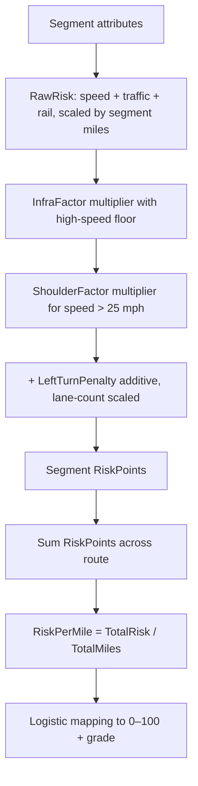
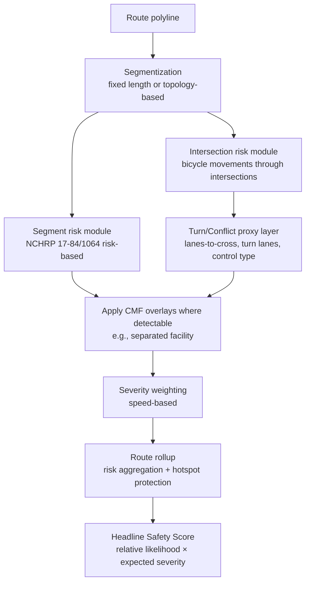
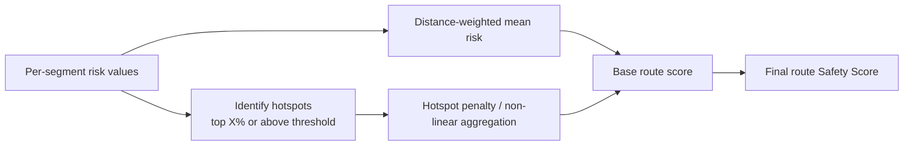

# Lanterne Execution Systems Context


---


This document contains operational documentation for building and running Lanterne.

Sources included:

• execution plans
• system manuals
• infrastructure projects
• architecture audits
• migration history


---

## Source File: docs/04-execution/exec-000-READ_ME.md

# exec-000-READ_ME

This file is the **front door** to the Lanterne docs.

Its job is simple:

- tell you what each top-level folder is for
- tell you where to start
- tell you where the important open paths live now
- stop you from getting lost in a pile of good docs

This is **not** the source of truth for architecture decisions.
It is the map to the source of truth.

---

# 1. How this docs repo is organized

## 01-philosophy
This is the “why” layer.

Read this when you want to remember:
- what Lanterne believes
- what kind of product it is trying to be
- what the core analysis worldview is

Start here if you feel the project getting muddy.

Main files:
- `phi-001-lanterne_manifesto.md`
- `phl-002-product_principles.md`
- `phi-003-analysis_model.md`

---

## 02-architecture
This is the “how the system is shaped” layer.

It contains:
- data model
- system architecture
- project map
- system guide
- design specs

If you want to know how the machine is supposed to work, this is where you go.

Important files:
- `arch-001-data_model.md`
- `arch-002-system_architecture.md`
- `arch-003-project_map.md`
- `arch-004-system_guide.md`
- `arch-005-recommended_schema_shape.md`

### 02-architecture/analysis
This is where scoring and index math lives.

Important files:
- `anal-001-indices_calculation.md`
- `anal-002-score_calculation.md`

### 02-architecture/design
This is where the **design specs** live.

These are concrete implementation-shape docs.

Use these when you need:
- schema definitions
- pipeline behavior
- analysis rules
- system-specific detailed build rules

Key files right now:
- `ds-005-canonical-route-schema-spec.md`
- `ds-006-route-canonicalization-spec.md`
- `ds-007-route-slice-generation-spec.md`
- `ds-008-route-corridor-model-spec.md`
- `ds-010-slice-analysis-cache-spec.md`
- `ds-013-comparative-traffic-context-schema-spec.md`
- `ds-014-route-expedition-state-and-windowed-analysis-spec.md`

---

## 03-adrs
This is the **decision log**.

If something is a durable architectural decision, it belongs here.

Use ADRs when you want to answer:
- why did we choose this?
- what tradeoff was made?
- what is locked vs still flexible?

Important recent ADRs:
- `adr-026-canonical-route-identity.md`
- `adr-031-model-multi-day-events-as-ordered-references-onto-canonical-geometry.md`
- `adr-032-comparative-traffic-context-and-segment-cohorts.md`
- `adr-033-canonical-segment-identity.md`
- `adr-034-master-route-expeditions-and-windowed-analysis.md`

---

## 04-execution
This is the **what do we actually do next** layer.

This folder matters a lot because it turns theory into action.

### Main execution files
- `exec-001-master_build_order.md` → big build sequence
- `exec-002-architecture_overview.md` → higher-level system overview
- `exec-003-current_focus.md` → what matters right now
- `exec-004-idea_dump.md` → raw idea holding area

### 04-execution/02_system_manuals
These are the operational manuals for major systems.

If you want the “explain it to me clearly” version of a system, go here.

Key files:
- `sys-001-expedition_system.md`
- `sys-002-route_ingestion_system.md`
- `sys-003-analysis_engine.md`
- `sys-005-navigation_engine.md`
- `sys-006-ride_computer.md`
- `sys-007-comparative_traffic.md`
- `sys-009-vault_system.md`

### 04-execution/03_infrastructure_projects
These are the major build tracks.

Use these when the question is:
- what infra project is active?
- what has to be completed to unlock the next layer?

Key files:
- `infra-001-canonical_schema_completion.md`
- `infra-002-rusa_corpus_ingestion.md`
- `infra-003-osm_enrichment_pipeline.md`
- `infra-004-route_analysis_backfill.md`
- `infra-005-canonical_segment_mapper.md`
- `infra-006-traffic_baseline_build.md`

---

## 05-product
This is the product framing layer.

Use this for:
- positioning
- vision
- rider archetypes
- UX guardrails
- anti-features
- brand/product boundaries

Key files:
- `prod-001-positioning.md`
- `prod-002-vision.md`
- `prod-003-rider_archetypes.md`
- `prod-004-guardrails.md`
- `prod-005-ux_principles.md`
- `prod-006-anti_features.md`

---

## assessments
This is where point-in-time architecture reviews live.

Use these to understand:
- risk
- blind spots
- debt
- where the system looked strong or shaky at a given time

Key files:
- `ass-001-architecture_audit_2026-03-08.m_.md`
- `ass-002-architecture_audit_2026-03-24.md`

---

## migrations
This is the human record of important migration and reconciliation work.

This is useful context, but it is not the main architecture home.

---

# 2. What to read first

If you are coming in cold, read in this order:

1. `01-philosophy/phl-002-product_principles.md`
2. `02-architecture/arch-004-system_guide.md`
3. `04-execution/exec-001-master_build_order.md`
4. `04-execution/exec-003-current_focus.md`

That gives you:
- product truth
- system truth
- build order
- present-tense focus

If you still feel lost after that, read:
- `02-architecture/arch-003-project_map.md`
- `04-execution/exec-002-architecture_overview.md`

---

# 3. Where the major open paths live now

This replaces the old “one giant master manual” way of thinking.

The paths still exist.
They are just now properly housed across the repo.

## Path: Expedition / multi-day continuity
What it is:
- durable route progress across days
- active windows
- resume behavior
- later handoff/preload

Read:
- `03-adrs/adr-034-master-route-expeditions-and-windowed-analysis.md`
- `02-architecture/design/ds-014-route-expedition-state-and-windowed-analysis-spec.md`
- `04-execution/02_system_manuals/sys-001-expedition_system.md`

Current truth:
- architecture is good
- first rider-facing pieces exist
- manual validation still matters before declaring trust

---

## Path: Long-route loading / chunked analysis
What it is:
- making giant routes feel like one journey
- only analyzing one bounded working set at a time
- tying window size to real corridor budget, not just miles

Read:
- `03-adrs/adr-034-master-route-expeditions-and-windowed-analysis.md`
- `02-architecture/design/ds-014-route-expedition-state-and-windowed-analysis-spec.md`
- `04-execution/02_system_manuals/sys-001-expedition_system.md`
- `04-execution/02_system_manuals/sys-003-analysis_engine.md`

Current truth:
- the architecture is right
- handoff/preload is not the first thing to build

---

## Path: Canonical segment identity
What it is:
- stable segment identity across routes and analyses
- route-local occurrences vs canonical long-lived segments

Read:
- `03-adrs/adr-033-canonical-segment-identity.md`
- `03-adrs/adr-032-comparative-traffic-context-and-segment-cohorts.md`
- `02-architecture/design/ds-013-comparative-traffic-context-schema-spec.md`
- `04-execution/03_infrastructure_projects/infra-005-canonical_segment_mapper.md`

Current truth:
- the dangerous ambiguity was fixed
- the matcher is intentionally deferred
- do not rush it into the live path

---

## Path: Comparative traffic context / cohorts
What it is:
- the model for canonical facts, baselines, and cohort memberships
- richer context without corrupting the top-line Safety Score

Read:
- `03-adrs/adr-032-comparative-traffic-context-and-segment-cohorts.md`
- `02-architecture/design/ds-013-comparative-traffic-context-schema-spec.md`
- `04-execution/02_system_manuals/sys-007-comparative_traffic.md`
- `04-execution/03_infrastructure_projects/infra-006-traffic_baseline_build.md`

Current truth:
- strong architecture
- still phased
- rider-facing richness should wait for trustworthy facts

---

## Path: Route persistence / DB discipline
What it is:
- how route writes happen
- how staging and production stay sane
- how SQL changes get promoted

Read:
- `02-architecture/arch-005-recommended_schema_shape.md`
- `04-execution/exec-003-current_focus.md`
- relevant infra docs as they are created/updated

Current truth:
- this has improved
- it still needs discipline
- do not let environment confusion creep back in

---

## Path: Core analysis engine
What it is:
- road fetch
- corridor construction
- caching
- scoring compute
- scaling risks

Read:
- `02-architecture/arch-002-system_architecture.md`
- `04-execution/02_system_manuals/sys-003-analysis_engine.md`
- `assessments/ass-002-architecture_audit_2026-03-24.md`

Current truth:
- real strength exists here
- Overpass and client-side compute are still central risks

---

## Path: Navigation / ride mode
What it is:
- actual riding product
- cues, alerts, ride surfaces, bike-computer-ish behavior

Read:
- `03-adrs/adr-029-ride-time-situational-awareness-mode.md`
- `03-adrs/adr-030-ride-mode-power-and-sensor-architecture.md`
- `02-architecture/design/ds-011-ride-time-situational-awareness-interface-spec.md`
- `02-architecture/design/ds-012-ride-computer-tile-system-spec.md`
- `04-execution/02_system_manuals/sys-005-navigation_engine.md`
- `04-execution/02_system_manuals/sys-006-ride_computer.md`

Current truth:
- promising
- must stay rider-trust-first
- do not confuse “exists” with “trustworthy deep into a ride”

---

## Path: Vault / ingestion / route corpus
What it is:
- route acquisition
- provenance
- route corpus growth
- source-aware route storage

Read:
- `03-adrs/adr-001-route-acquisition-model.md`
- `03-adrs/adr-002-vault-concept.md`
- `04-execution/02_system_manuals/sys-002-route_ingestion_system.md`
- `04-execution/02_system_manuals/sys-009-vault_system.md`
- `04-execution/03_infrastructure_projects/infra-002-rusa_corpus_ingestion.md`

Current truth:
- conceptually strong
- should compound over time
- provenance needs to stay explicit

---

## Path: Public expedition visibility / dot watchers
What it is:
- future watcher/family/public follow layer
- public expedition surface
- shared live progress

Read:
- `05-product/prod-002-vision.md`
- `04-execution/exec-004-idea_dump.md`
- later dedicated note/manual when it exists

Current truth:
- real opportunity
- not the thing to operationalize first
- do not let it pollute rider-critical work

---

# 4. What is the actual source of truth?

Use this rule:

## If the question is “what did we decide?”
Read the ADR.

## If the question is “what is the exact shape?”
Read the design spec.

## If the question is “how does this system work in English?”
Read the system manual.

## If the question is “what should happen next?”
Read the execution docs.

## If the question is “why are we even doing this?”
Read philosophy or product docs.

That is the hierarchy.

---

# 5. What is not replaced by this file

This file does **not** replace:
- ADRs
- design specs
- system manuals
- infra project docs
- current focus docs

This file is just the guide rail.

If this file and a real ADR/spec disagree, the ADR/spec wins.

---

# 6. Where to start depending on your mood

## If you want the highest-level truth
Read:
- `01-philosophy/phl-002-product_principles.md`
- `05-product/prod-002-vision.md`

## If you want to know what to build next
Read:
- `04-execution/exec-001-master_build_order.md`
- `04-execution/exec-003-current_focus.md`

## If you want to understand the machine
Read:
- `02-architecture/arch-004-system_guide.md`
- `02-architecture/arch-002-system_architecture.md`

## If you want to understand one specific system
Read the relevant file in:
- `04-execution/02_system_manuals/`

## If you want to understand one specific locked decision
Read the relevant file in:
- `03-adrs/`

---

# 7. Current reality in plain English

The docs are now much better structured than before.

That is good.

But the new risk is not chaos.
The new risk is **fragmentation**.

So the job of this file is to keep you from forgetting:

- where things live
- what to read first
- which path you are actually in
- what is architecture vs execution vs product thinking

That is all this file needs to do.

---

# 8. Short version

The old giant manual is no longer the main home.

The new homes are:

- **ADRs** for decisions
- **Design specs** for exact shapes
- **System manuals** for clear explanation
- **Infra docs** for active build tracks
- **Execution docs** for sequence and focus

Use this file when you need to orient yourself fast and then jump to the right real doc.


---

## Source File: docs/04-execution/exec-001-master_build_order.md


# Master Build Order

This document defines the correct sequence of major development phases.

## Phase 1 — Core Data Foundation

- Canonical schema finalization
- Slice engine implementation
- Segment fact model
- Cohort table scaffolding

## Phase 2 — Route Corpus Ingestion

- Ingest RUSA permanent routes
- Normalize route geometry
- Deduplicate routes
- Attach provenance

## Phase 3 — OSM Enrichment

- Slice-level OSM queries
- Infrastructure tagging
- Hazard detection
- Elevation enrichment

## Phase 4 — Baseline Route Analysis

- Traffic Index
- Bike Support Index
- Safety scoring pipeline

## Phase 5 — Extended Indices

- Remoteness Index
- Surface Quality Index
- Fatigue Index
- Descent Risk Index

## Phase 6 — Environmental Modeling

- Weather forecasts
- Solar calculations
- Moon phase modeling
- Glare detection

## Phase 7 — Route Comparison

- Route comparison UI
- Segment explanation layers

## Phase 8 — Expedition System

- Expedition state storage
- Crash recovery
- Resume functionality

## Phase 9 — Ride Computer

- Bike computer interface
- Cue sheet navigation
- Sensor integrations

## Phase 10 — Intelligence Layer

- Traffic behavior modeling
- Comparative context system
- Decision support tools


---

## Source File: docs/04-execution/exec-002-architecture_overview.md


# Lanterne Architecture Overview

This document visualizes the core architecture of Lanterne.

Lanterne is built around a layered intelligence system for long‑distance cyclists.

```
Route Sources
   │
   ▼
+-------------------+
|  Ingestion Layer  |
|-------------------|
| Route To          |
| Draw              |
| GPX Upload        |
| RWGPS Import      |
| RUSA Import       |
+-------------------+
   │
   ▼
+-------------------+
| Storage Layer     |
|-------------------|
| routes            |
| route_versions    |
| provenance        |
| analysis_outputs  |
+-------------------+
   │
   ▼
+-------------------+
| Analysis Engine   |
|-------------------|
| Slice Generation  |
| Traffic Index     |
| Bike Support      |
| Remoteness        |
| Fatigue           |
| Surface Quality   |
| Descent Risk      |
+-------------------+
   │
   ▼
+-------------------+
| Conditions Layer  |
|-------------------|
| Weather           |
| Wind              |
| Temperature       |
| Solar Position    |
| Moon Phase        |
| Glare Detection   |
+-------------------+
   │
   ▼
+-------------------+
| Presentation      |
|-------------------|
| Map Overlays      |
| Route Analysis    |
| Cue Sheets        |
| Comparison Views  |
+-------------------+
   │
   ▼
+-------------------+
| Decision Support  |
|-------------------|
| Route Comparison  |
| Ride Planning     |
| Expedition Mode   |
| Ride Computer     |
+-------------------+


---

## Source File: docs/04-execution/exec-003-current_focus.md

# Current Focus

## Purpose

Prevent idea thrash, keep development focused, and make it obvious what is active now versus what is intentionally deferred.

------

## Current Priorities

### 1. RUSA Events 

- ingest, json download to storage, extract to normalized json and table structure (route info, hazards, cues, POIs,etc)

- Set up vault to have 2 sections at first: perms and rides

  - Perms - table that is filterable and sortable by every important field - 

  - | Starting location: *(or ending location) * | --all locations-- AK AL AR AS AZ CA CO CT DC DE FL GA GU HI IA ID IL IN KS KY LA MA MD ME MI MN MO MP MS MT NC ND NE NH NJ NM NV NY OH OK ON OR PA PR RI SC SD TN TX UT VA VI VT WA WI WV WY |
    | ------------------------------------------ | ------------------------------------------------------------ |
    | Distance:                                  | --all distances-- 100-199 km 200-299 km 300-399 km 400-599 km 600+ km |
    | Climbing:                                  | to  feet meters                                              |

    Shape: loop out & back point-to-point

    | Within or through: | --all states-- AK AL AR AS AZ CA CO CT DC DE FL GA GU HI IA ID IL IN KS KY LA MA MD ME MI MN MO MP MS MT NC ND NE NH NJ NM NV NY OH OK ON OR PA PR QC RI SC SD TN TX UT VA VI VT WA WI WV WY |
    | :----------------: | ------------------------------------------------------------ |
    |   Name includes:   |                                                              |
    |                    |                                                              |
    |      Sort by:      | starting location distance distance (unpaved) climbing       |

     Contains unpaved sections

    

     Missing unpaved data

    

     Only show SR 600K routes

    

     Include inactive routes

    Safety rank, any lanterne specific value adds etc. - need to come up iwht a master list for events and then a subset of that list of filters/sorts will be perms

  - Rides - are essentially perms + club + date/time/location (start address)

- Harden seed routes (back to DC)

- Harden safety score.  

  - Did we drop crossings as a factor or are we really calculating?  
  - Scorecard/method receipt structure, format, and accuracy

- Traffic issues

  - AADT #s not showing up consistently
  - how to represent on map itself

- Toggles: Stops, Hazards, Overlays

- UX redo/refactor

  - state machine
  - extractinng code from index, routemap and drawers and into central system
  - building interdependencies of state to avoid drawers opening over one another etc.
  - Hiding lantern, disappearing lantern - keep map clean
  - Bottom slide up info (like cancel button) - keep map clean
  - 


### 4. Front-end architecture refactor - PAUSED

- 

### 5. Cue points formatting - The RWGPS-imported cues flow through as **nativeCues** (type GpxCuePoint[]) into resolveCues(), which outputs them as **cuePoints** — that's what CueMarkerLayer receives as its prop to render the markers on the map.

------

## Active Execution Threads

These are the threads that are allowed to drive current work:

- #### Canonical schema finalization - PAUSED

- FAILED to stabilize enough to get routes to recognize even the exact same route if generated through a different tool or any deviation in route whatsoever

- Canonical schema + route intelligence foundation

  Lock the schema and supporting route-intelligence structure tightly enough that ingestion, analysis, and downstream scoring can stop shifting underneath the product.

  https://chatgpt.com/g/g-p-69a5a40f6d9c81919302f52ccc4cdd32-lanterne/c/69c7cb36-6418-832f-b4aa-63876cd873d0

- #### Slice engine implementation - FAILED

- #### Front-end architecture refactor - PAUSED

- Move the front end away from page-level state sprawl and toward a cleaner workflow/session model.

  Current sub-focus:

  - shrink the main page/god component
  - separate workflow/lifecycle ownership from rendering
  - plan workerization for heavy analysis so the app stays usable during loading
  - reduce map monolith / surface sprawl
  - make loading/analysis state part of a coherent workflow model rather than one-off UI patches

  Reference thread:

  - See bottom section of this doc for remaining steps

- #### Expedition system state persistence - PAUSED

- #### Traffic cohort architecture - PAUSED

------

## Active but Secondary

These matter, but should not steal priority from the current execution threads unless directly required:

- Hazard taxonomy refinement - PAUSED
- Route review patterning / explainability - PAUSED
- Comparative traffic context - PAUSED

------

## Explicitly Deferred

Do not start these yet unless they become prerequisites for the current priorities:

- Ride computer advanced features

- Radar integrations

- UI polish outside the current front-end refactor

- LLM / voice assistant systems

- Broader expedition feature expansion beyond persistence/state hardening

- More robust loading sequence pulled from new scoring pipeline

  - Route: Port Orange - Ormond Loop Length: 100km Points: 2534 Fetching corridor from Overpass... Roads: 32986 Detecting junctions... Junction points: 678 / 2534 Crossing highway distribution: {  tertiary: 216,  residential: 524,  secondary: 51,  unclassified: 62,  tertiary_link: 4,  primary: 64,  secondary_link: 5,  primary_link: 3,  cycleway: 11 }

  - with headings

  - **Tracing route geometry**
     *2,534 route points mapped*

    **Fetching surrounding road network**
     *33,129 nearby roads analyzed*

    **Detecting intersections and turns**
     *678 plausible junctions identified*

    **Scoring maneuver complexity**
     *25 left-turn maneuvers, 13 major left turns*

------

## Success Criteria

This focus window is complete when:

- canonical schema is stable enough to stop churn
- slice engine is operational
- RUSA routes can be ingested and analyzed cleanly
- front-end workflow ownership is cleaner and less page-bound
- the app remains usable during route analysis or has a concrete workerization path underway
- map/surface state is moving toward a simpler, more governable structure

------

## Completed

### 2026-04-24 

- Loader / analysis presentation polish - COMPLETE

### 2026-03-28

- Created deep research asset re: bike-car crash research framework res-001-bike_car_crash_data_mining.md
- Had Lovable generate a plain english explanation of the Safety Scoring Model ds-015-safety_scoring_model.md
- Confirmed turns are overwritten properly w/o reproducing the canonical route
- Moving on to hardening the canonical route hashing approach for multi-direction / out-and-back / slight variation routes so there isn't route sprawl in the future
- Tried to switch left turn analysis into a new pipeline version but failed to get it as accurate as the old route-level turn scoring so reverted to the old method since it isn't truly required to be known at the segment level at time of ingest and if one wanted to ascribe it to a segment, it could be done based on location after the fact.
- 

### 2026-03-27

- Hardened the route loader to a usable state
- Added route loading cancel behavior and cleaned up the cancel/reopen loop
- Reduced “segments worth reviewing” on the Boulder, CO route from 255 instances into 17 pattern buckets
- Classified those 17 buckets into:
  - 8 protected bike lanes scored risky
  - 8 high-speed road exposure patterns
  - 1 unusual segment break
- Added 6 hazards to the bottom drawer:
  - Bad Angles
  - Traffic
  - Pinch Points
  - Descents
  - No Shoulder
  - Grates
- Documented `prod-012` and `prod-013` and explicitly deferred them

### 2026-03-26

- Implemented new hazard tags
- Added ability to cancel a loading route
- Hardened expedition mode entry logic
- Added admin debug setting to show all metal grated bridges
- Began loader fixes as part of the broader front-end refactor

------

## Working Rules

- Do not let loader polish turn into another isolated UI rabbit hole
- Do not start advanced ride computer work while core schema / analysis / front-end structure are still unstable
- Treat front-end refactor as an architecture thread, not a cosmetics thread
- Only add new active threads if they are true prerequisites or materially block current priorities

# Front-End Work Remaining

## Status

**Completed**

- Phase 0 baseline instrumentation:
  - fixed GPX fixtures
  - smoke test definitions
  - performance markers
  - perf budget logging
  - baseline regression harness

**Not yet approved to start**

- Phase 1
- Phase 2
- Phase 3
- Phase 4

These remain blocked until slice-level scoring and OSM ingestion/enrichment stabilize the analysis contracts.

------

# Remaining Front-End Phases

## Phase 1 — Extract Bounded Hooks + Layout Reducer

Purpose: reduce `Index.tsx` from god-component status without changing behavior.

### Planned hook extractions

- `useRouteAcquisition`
- `useAnalysisSession`
- `useRoutePersistence`
- `usePoiManager`
- `useRideSession`

### Additional Phase 1 work

- introduce `resetRouteSession(reason)` as the single teardown path
- evolve `LayoutContext.tsx` from boolean bag to reducer
- introduce `RouteWorkflowState` separate from `MapMode`

### Phase 1 done criteria

- `Index.tsx` reduced to ~800–1000 lines
- typed public interfaces for all five hooks
- no cross-domain imports between hooks
- no direct state mutation across hook boundaries
- `LayoutContext` reducer replaces standalone drawer/panel booleans
- all Phase 0 smoke flows still pass

------

## Phase 2 — Worker Boundary

Purpose: move heavy matching/scoring compute off the main thread.

### Planned split

- `route-analysis-core.ts` → pure compute only
- `route-analysis-io.ts` → fetch/cache/Supabase/orchestration
- `analysis.worker.ts` → imports only core
- `analysis-protocol.ts` → typed worker messages

### Compute that moves to worker

- road matching
- forensic pipeline
- boundary refinement math
- safety scoring
- transition chain computation
- cue generation

### Work that stays on main thread

- corridor tile fetch
- cache reads/writes
- HPMS/DOT fetches
- railroad crossing detection
- heatmap-building / UI-facing orchestration

### Phase 2 done criteria

- worker serialization within budget on long-route fixture
- zero long tasks over budget during compute phase
- map remains pannable during analysis
- cancel → worker abort → UI reset stays within budget
- stale worker results blocked by `sessionId` guard
- all Phase 0 smoke flows still pass

------

## Phase 3 — RouteMap Decomposition

Purpose: kill the RouteMap monolith and replace prop sprawl with explicit layer boundaries.

### Planned work

- define `MapScene` contract before extraction
- replace 70+ prop sprawl with scene objects
- extract layers in this order:
  1. `useMapCore`
  2. `useRoutePolyline`
  3. `useHeatmapLayer`
  4. `useHazardLayer`
  5. `useCueLayer`
  6. `useGpsLayer`
  7. `usePoiLayer`
  8. `useDebugLayers`

### Phase 3 done criteria

- `RouteMap.tsx` reduced to ~300–400 lines
- each layer handles its own cleanup
- rider-facing hooks contain no admin logic
- click handlers, tooltips, zoom behavior remain unchanged
- layer mount order preserves z-order behavior
- all Phase 0 smoke flows still pass

------

## Phase 4 — Surface Governance + Resilience

Purpose: finish workflow/state cleanup after the structural refactor.

### Planned work

- wire `RouteWorkflowState` into visibility rules
- audit remaining rogue surface toggles
- add `failed` and `partial` workflow states
- add stale reopen / re-analyze recovery behavior

### Phase 4 done criteria

- zero standalone drawer/panel booleans left in `Index.tsx`
- `failed` state shows retry UI
- `partial` state shows warning + usable partial results
- stale reopen detection works
- all Phase 0 smoke flows still pass

------

## Key Front-End Risks

- Phase 1 is the highest-risk extraction because callbacks in `Index.tsx` cross multiple domains.
- `usePoiManager` has hidden coupling to route and map-bounds state and must use explicit parameters.
- worker serialization could become expensive on long routes.
- RouteMap extraction must preserve explicit Leaflet z-order.
- Layout reducer migration touches many callback props that currently toggle booleans directly.

------

## Current Decision

Front-end work is limited to **Phase 0 only** until:

- slice-level scoring model is stable
- OSM ingestion/enrichment contracts are stable
- route-analysis input/output contracts are frozen

After that, execute front-end Phases 1 → 4 in order.


---

## Source File: docs/04-execution/exec-004-idea_dump.md

# Idea Dump For Future Improvements

You can't focus on everything all at once, and not everything needs to be decided today. Let this be a holding place for big ideas so you can focus on making progress with the basics.

------

## Expedition Mode Could Become Product #1

- import past activities from Strava/Garmin
- stitch together entire multi-week/month/year journey
- watchers can follow, athletes can use as an explorers journal/log, field notes style
- would apply to other sports/activities too (ultra-running/walking/kayaking/sailing/etc where long distances are traversed of a long period of time)

------

## iOS/Android App

- Build an app for native bluetooth, would need a companion app anyway to get BT reliably into the Safari based app.  Janky solution to bookmark a PNW + install an app that has to go through AppStore anyway. 
- Opens up other possibilities beyond BT: battery mgmt, haptics (lantern wheel, etc)
- Can be minimal coding with a wrapper around the React framework and can still use Lovable 
- Can avoid re-approvals from apple if most logic is kept in web part of the app
- need a couple screens (perhaps load screen) to be iOS native (plus making use of hardware features of phone) so that Apple approves initial application
- CGPT thread context: https://chatgpt.com/s/t_69c33b5ca9ac8191a08b6918ef0c1746

- 

------

## Icons Improvement

- need to fit better with Lanterne theme
- thin lines if visible enough
- See Phosphor Thin from streamlinehq.com

##### Link Tree

- where to?

  - route to...
  - draw
  - load
    - rwgps 
    - vault
      - rusa perms
      - saved
      - (future expansion)
    - .gpx
    - history

- analyze

- cues

- dev (admin only)

- inspect (admin/superuser only)

- stops & layers

  - Stops (with gear icon to configure toggles)
  - water
    - potable water
    - natural water crossings
    - cemetaries
  - food
    - restaurants
    - supermarkets
    - Cafes/fastfood
    - convenience stores
    - gas stations
  -  bio (toilet)
    - toilets
    - Showers
  - rest
    - hotels
    - hostels
    - campgrounds
    - post offices
  - tourism
    - monuments
    - ruins
    - memorials
    - attractions
    - Info offices
  - nature
    - peaks
    - springs
    - caves
    - viewpoints
  - health
    - hospitals
    - clinic
    - pharmacies
  - help
    - fire stations
    - police stations
    - emergency phones

- map buttons

  - current bearing - pointer
  - heatmap on/off - Light bulb
  - day night - sun & crescent moon
  - OSM street and satlleite - folded map
  - Gps - crosshairs

- drawing map buttons

  - snap on button
  - '# points and miles counter button
  - need elevation counter button + icon
  - cancel button

- edit route button

- admin/superuser map buttons

  - edit route
  - show roads
  - anomalies
  - inspector on (should probably kill this and just always have inspector on for these user types)
  - truth mode (admin only)
  - hold to peek (eyeball)

- hazards

  - RR Crossing

  - RR Crossing - Dangerous Angle?

  - Left Turn (Crosses Traffic)

  - Metal Grate Bridge

  - Future Possibilities:

    - Pinch Point
    - Remote Corridor
    - Service Gap
    - Cellular Dead Zone
    - etc.

    

  

  


---

## Source File: docs/04-execution/exec-005-debugging_logs.md

# Debugging Logs

### Boundary Marker Catalog

All debug boundary markers rendered in Truth Mode / Transition Debug:

| Color | Hex | Source Object | Semantic Meaning | Rider-Facing? |
|-------|-----|--------------|------------------|---------------|
| Orange (hollow) | `#ff8800` | `truthBoundaryDebug` | Coarse PASS-1 boundary (sampled grid position) | Evidence only |
| Magenta (filled) | `#ff00ff` | `truthBoundaryDebug` | Refined PASS-2 boundary (moved from coarse) | Evidence only |
| Cyan/Teal (dashed) | `#00cccc` | `truthBoundaryDebug` | Fallback (refinement kept coarse position) | Evidence only |
| Green | `#00ff00` | `transitionChainDiag` | OSM intersection candidate (shared node) | Evidence only |
| Red | `#ff0000` | `transitionChainDiag` | Matcher flip point (PASS-1 winner changed) | Evidence only |
| Cyan | `#00ffff` | `transitionChainDiag` | Corrected boundary (transition-chain final) | Evidence only |
| Red (small) | `#ff0000` | heatmap debug | Truth boundary tick (scoring segment edge) | Internal |
| Cyan (medium) | `#00ffff` | heatmap debug | Merge boundary tick (display segment edge) | Internal |

**Important**: None of these markers are automatically rider-facing cuts. The `boundary-resolver.ts` module filters all evidence into a `resolvedCuts` set using road-identity change, anti-fragmentation, and confidence rules.

Enable boundary resolver logs: `localStorage.DEBUG_FLAGS = '{"BOUNDARY_DEBUG":true}'`

### Hazards

Enable with: localStorage.DEBUG_FLAGS = '{"HAZARD_DEBUG":true}' then reload and re-analyze.

**Console logging** (when HAZARD_DEBUG=true):

- [HAZARD-TRACE] now includes OSM node ID, nearest route coord, snap distance (meters), and route distance (miles) for both accepted AND rejected crossings
- [HAZARD-RENDER] shows raw → attached → rendered coordinates with deltas

**Map debug overlay** (when HAZARD_DEBUG=true):

- **Cyan circles** = raw OSM detection point (with permanent label showing OSM ID + coords)
- **Yellow circles** = nearest attached route point + yellow dashed line connecting raw→attached
- **Magenta circles** = rendered marker point (currently = raw, confirming no remap)
- **Red circles** = REJECTED crossings with tooltip showing rejection reason + snap distance, plus red dashed line to nearest route point


---

## Source File: docs/04-execution/exec-006-phase0-smoke-tests.md

# Phase 0 — Smoke Tests & Performance Baselines

## Fixtures

| Fixture | File | Purpose |
|---------|------|---------|
| Short urban hazard | `public/demo/fixture-urban-hazard.gpx` | ~15mi KC MO, dense crossings/bridges, stress hazard detection |
| Long rural | `public/demo/fixture-long-rural.gpx` | ~200mi KS Flint Hills, worker serialization budget, guardrails |
| History-loaded | `public/demo/fixture-history-loaded.gpx` | ~40mi Lawrence KS loop, rehydration/cache hit/re-analyze |
| Detour-edit | `public/demo/fixture-detour-edit.gpx` | ~25mi Topeka out-and-back, detour drag/save/delta-panel |

## Smoke Test Paths

### 1. GPX Upload → Analyze → Save
1. Upload `fixture-urban-hazard.gpx`
2. Wait for analysis to complete (score panel renders)
3. Open left drawer, verify score + grade visible
4. Save to history
5. **Pass:** Route appears in history list with correct name

### 2. Manual Create → Analyze → Save
1. Enter route create mode
2. Place 3+ waypoints (~5mi route)
3. Finish drawing → analysis begins
4. Wait for completion
5. Save to history
6. **Pass:** Route saved, can be re-loaded

### 3. History Load → Re-analyze
1. Load `fixture-history-loaded.gpx`, analyze, save
2. Open history, click the saved route
3. Verify polyline renders on map
4. Trigger re-analyze
5. **Pass:** New score renders, no ghost state from previous analysis

### 4. Detour Save
1. Upload `fixture-detour-edit.gpx`, analyze
2. Click on the high-traffic middle segment
3. Drag a detour waypoint to create alternate route
4. Verify delta panel shows score comparison
5. Save detour
6. **Pass:** Detour saved to history, delta panel values correct

## Hard Performance Budgets

| Metric | Budget | Module |
|--------|--------|--------|
| Cancel acknowledged | ≤ 300ms | `analysis:cancel:latency` |
| Worker serialization (long-route) | ≤ 80ms | `worker:serialization` |
| Main-thread long tasks during compute | 0 tasks > 100ms | `PerformanceObserver('longtask')` |
| Render-to-interactive after done | ≤ 500ms | `render:to-interactive` |

Budget violations emit `[PERF-BUDGET] ⚠` warnings to console.

## Instrumentation Points

All marks defined in `src/lib/refactor-perf-budgets.ts`:
- `markAnalysisStart()` — called when `analyzeRouteProgressive` loop begins
- `markAnalysisDone()` — called on `analysis` stage received
- `markAnalysisCancelRequest()` — called when cancel button tapped
- `markAnalysisCancelAck()` — called when UI teardown complete
- `markRenderToInteractiveStart()` — called at analysis done phase
- `markRenderToInteractiveEnd()` — called on first drawer open after analysis
- `startLongTaskObserver()` / `stopLongTaskObserver()` — bracketing analysis phase

## Done Criteria

- [ ] 4 fixture files committed to `public/demo/`
- [ ] 4 smoke paths documented (this file) and manually passing
- [ ] Perf marks emitting to console during analysis
- [ ] Budget violations logged as warnings
- [ ] **No code moved or restructured** — this is baseline only


---

## Source File: docs/04-execution/exec-007-turn_event_persistence_handoff.md

# Current Focus

## Purpose

Prevent idea thrash, keep development focused, and make it obvious what is active now versus what is intentionally deferred.

------

## Current Priorities

### 1. Canonical schema + route intelligence foundation

Lock the schema and supporting route-intelligence structure tightly enough that ingestion, analysis, and downstream scoring can stop shifting underneath the product.

### 2. Front-end architecture refactor

Move the front end away from page-level state sprawl and toward a cleaner workflow/session model.

Current sub-focus:

- shrink the main page/god component
- separate workflow/lifecycle ownership from rendering
- plan workerization for heavy analysis so the app stays usable during loading
- reduce map monolith / surface sprawl
- make loading/analysis state part of a coherent workflow model rather than one-off UI patches

Reference thread:

- See bottom section of this doc for remaining steps
  	

------

## Active Execution Threads

These are the threads that are allowed to drive current work:

- Canonical schema finalization
- Slice engine implementation
- Front-end architecture refactor
- Expedition system state persistence
- Traffic cohort architecture

------

## Active but Secondary

These matter, but should not steal priority from the current execution threads unless directly required:

- Hazard taxonomy refinement
- Loader / analysis presentation polish
- Route review patterning / explainability
- Comparative traffic context

------

## Explicitly Deferred

Do not start these yet unless they become prerequisites for the current priorities:

- Ride computer advanced features

- Radar integrations

- UI polish outside the current front-end refactor

- LLM / voice assistant systems

- Broader expedition feature expansion beyond persistence/state hardening

- More robust loading sequence pulled from new scoring pipeline

  - Route: Port Orange - Ormond Loop Length: 100km Points: 2534 Fetching corridor from Overpass... Roads: 32986 Detecting junctions... Junction points: 678 / 2534 Crossing highway distribution: {  tertiary: 216,  residential: 524,  secondary: 51,  unclassified: 62,  tertiary_link: 4,  primary: 64,  secondary_link: 5,  primary_link: 3,  cycleway: 11 }

  - with headings

  - **Tracing route geometry**
     *2,534 route points mapped*

    **Fetching surrounding road network**
     *33,129 nearby roads analyzed*

    **Detecting intersections and turns**
     *678 plausible junctions identified*

    **Scoring maneuver complexity**
     *25 left-turn maneuvers, 13 major left turns*

------

## Success Criteria

This focus window is complete when:

- canonical schema is stable enough to stop churn
- slice engine is operational
- RUSA routes can be ingested and analyzed cleanly
- front-end workflow ownership is cleaner and less page-bound
- the app remains usable during route analysis or has a concrete workerization path underway
- map/surface state is moving toward a simpler, more governable structure

------

## Completed

### 2026-03-28

- 

### 2026-03-27

- Hardened the route loader to a usable state
- Added route loading cancel behavior and cleaned up the cancel/reopen loop
- Reduced “segments worth reviewing” on the Boulder, CO route from 255 instances into 17 pattern buckets
- Classified those 17 buckets into:
  - 8 protected bike lanes scored risky
  - 8 high-speed road exposure patterns
  - 1 unusual segment break
- Added 6 hazards to the bottom drawer:
  - Bad Angles
  - Traffic
  - Pinch Points
  - Descents
  - No Shoulder
  - Grates
- Documented `prod-012` and `prod-013` and explicitly deferred them

### 2026-03-26

- Implemented new hazard tags
- Added ability to cancel a loading route
- Hardened expedition mode entry logic
- Added admin debug setting to show all metal grated bridges
- Began loader fixes as part of the broader front-end refactor

------

## Working Rules

- Do not let loader polish turn into another isolated UI rabbit hole
- Do not start advanced ride computer work while core schema / analysis / front-end structure are still unstable
- Treat front-end refactor as an architecture thread, not a cosmetics thread
- Only add new active threads if they are true prerequisites or materially block current priorities

# Front-End Work Remaining

## Status

**Completed**

- Phase 0 baseline instrumentation:
  - fixed GPX fixtures
  - smoke test definitions
  - performance markers
  - perf budget logging
  - baseline regression harness

**Not yet approved to start**

- Phase 1
- Phase 2
- Phase 3
- Phase 4

These remain blocked until slice-level scoring and OSM ingestion/enrichment stabilize the analysis contracts.

------

# Remaining Front-End Phases

## Phase 1 — Extract Bounded Hooks + Layout Reducer

Purpose: reduce `Index.tsx` from god-component status without changing behavior.

### Planned hook extractions

- `useRouteAcquisition`
- `useAnalysisSession`
- `useRoutePersistence`
- `usePoiManager`
- `useRideSession`

### Additional Phase 1 work

- introduce `resetRouteSession(reason)` as the single teardown path
- evolve `LayoutContext.tsx` from boolean bag to reducer
- introduce `RouteWorkflowState` separate from `MapMode`

### Phase 1 done criteria

- `Index.tsx` reduced to ~800–1000 lines
- typed public interfaces for all five hooks
- no cross-domain imports between hooks
- no direct state mutation across hook boundaries
- `LayoutContext` reducer replaces standalone drawer/panel booleans
- all Phase 0 smoke flows still pass

------

## Phase 2 — Worker Boundary

Purpose: move heavy matching/scoring compute off the main thread.

### Planned split

- `route-analysis-core.ts` → pure compute only
- `route-analysis-io.ts` → fetch/cache/Supabase/orchestration
- `analysis.worker.ts` → imports only core
- `analysis-protocol.ts` → typed worker messages

### Compute that moves to worker

- road matching
- forensic pipeline
- boundary refinement math
- safety scoring
- transition chain computation
- cue generation

### Work that stays on main thread

- corridor tile fetch
- cache reads/writes
- HPMS/DOT fetches
- railroad crossing detection
- heatmap-building / UI-facing orchestration

### Phase 2 done criteria

- worker serialization within budget on long-route fixture
- zero long tasks over budget during compute phase
- map remains pannable during analysis
- cancel → worker abort → UI reset stays within budget
- stale worker results blocked by `sessionId` guard
- all Phase 0 smoke flows still pass

------

## Phase 3 — RouteMap Decomposition

Purpose: kill the RouteMap monolith and replace prop sprawl with explicit layer boundaries.

### Planned work

- define `MapScene` contract before extraction
- replace 70+ prop sprawl with scene objects
- extract layers in this order:
  1. `useMapCore`
  2. `useRoutePolyline`
  3. `useHeatmapLayer`
  4. `useHazardLayer`
  5. `useCueLayer`
  6. `useGpsLayer`
  7. `usePoiLayer`
  8. `useDebugLayers`

### Phase 3 done criteria

- `RouteMap.tsx` reduced to ~300–400 lines
- each layer handles its own cleanup
- rider-facing hooks contain no admin logic
- click handlers, tooltips, zoom behavior remain unchanged
- layer mount order preserves z-order behavior
- all Phase 0 smoke flows still pass

------

## Phase 4 — Surface Governance + Resilience

Purpose: finish workflow/state cleanup after the structural refactor.

### Planned work

- wire `RouteWorkflowState` into visibility rules
- audit remaining rogue surface toggles
- add `failed` and `partial` workflow states
- add stale reopen / re-analyze recovery behavior

### Phase 4 done criteria

- zero standalone drawer/panel booleans left in `Index.tsx`
- `failed` state shows retry UI
- `partial` state shows warning + usable partial results
- stale reopen detection works
- all Phase 0 smoke flows still pass

------

## Key Front-End Risks

- Phase 1 is the highest-risk extraction because callbacks in `Index.tsx` cross multiple domains.
- `usePoiManager` has hidden coupling to route and map-bounds state and must use explicit parameters.
- worker serialization could become expensive on long routes.
- RouteMap extraction must preserve explicit Leaflet z-order.
- Layout reducer migration touches many callback props that currently toggle booleans directly.

------

## Current Decision

Front-end work is limited to **Phase 0 only** until:

- slice-level scoring model is stable
- OSM ingestion/enrichment contracts are stable
- route-analysis input/output contracts are frozen

After that, execute front-end Phases 1 → 4 in order.


---

## Source File: docs/04-execution/exec-008-drawer refactor_plan_and_implementation_spec.md

# EXEC-008 — Unified Surface Runtime and Domain Refactor Program

Status: Draft
Owner: Derek Minner
Scope: Cross-surface UI/runtime refactor for Lanterne
Related: Map Visibility System, Push Intelligence, Vault expansion, scoring overhaul, unified surface architecture

---

## 1. Purpose

This document defines the go-forward refactor program for Lanterne's UI shell architecture and adjacent domain boundaries.

The old problem statement was too narrow:

- detached drawer handles
- RouteMap sprawl
- floating cards colliding with drawers
- one-off mobile exceptions

Those were symptoms, not the actual system boundary problem.

The real issue is that Lanterne currently has too many competing surface primitives:

- side drawers
- bottom drawers
- floating cards
- info overlays
- route edit cards
- mobile exceptions layered on top of desktop assumptions

At the same time, too much product logic still lives inside `RouteMap.tsx`, `Index.tsx`, and surface-local components.

This refactor is therefore not a drawer cleanup. It is a structural program to:

1. establish a unified surface-state system
2. centralize product logic by domain boundary
3. make future features land in domain/runtime modules rather than surface-local hacks
4. enforce consistent motion, docking, escalation, layering, and state ownership across all surfaces
5. create a stable foundation for Vault, Push Intelligence, hazard/POI visibility, score explanation, route editing, and future ride-time UX

---

## 2. Why this needs to happen now

This is the right moment because every major surface is already under pressure:

- **Vault / top entry surface**: expanding to curated organizations, event listings, and public route access
- **Cue / inspect / analysis surfaces**: increasingly need different mobile vs desktop behavior without diverging truth
- **Bottom controls / lantern / stops & layers**: already behave like a proto surface host rather than a simple drawer
- **Route editing / detour preview / commit flow**: exposes the cost of ad hoc cards and local state
- **Future score explanation and review surfaces**: will multiply the problem if they keep inventing their own shells

If this work lands into the current architecture, Lanterne will deepen the monolith and harden the wrong interaction grammar.

The goal of EXEC-008 is to force those changes through clean seams instead of letting each feature bolt on another overlay.

---

## 3. Executive decision

Lanterne will move from **drawer-owned feature logic**, **floating-card proliferation**, and **map-surface conditional sprawl** to a model based on:

- centralized runtime and domain state
- a unified surface-state model
- shared shell primitives for docked panels and bottom sheets
- registry/resolver systems for map-visible and route-visible intelligence
- surfaces as presentation adapters that consume shared domain/runtime data
- map as composition/render surface, not the policy brain for the product

In plain English:

- the drawers stop owning the world
- the floating cards stop inventing their own behavior
- the map stops being the app's nervous system
- feature systems become modular and reusable across multiple surfaces
- mobile and desktop can diverge in behavior without diverging in truth

---

## 4. Core refactor principles

### 4.1 Surfaces are shells, not feature brains

A surface should own:

- docking behavior
- peek/compact/medium/full presentation
- local UI affordances
- local scroll and tab state
- motion and dismissal behavior

A surface should **not** own:

- canonical business data
- feature truth
- visibility policy
- scoring logic
- cue derivation
- route collection semantics

### 4.2 One surface-state model, many shells

Lanterne needs one interaction framework, not one literal visual container.

The system should unify:

- hidden / peek / compact / medium / full / pinned states
- escalation rules
- dismissal rules
- mobile vs desktop policy
- shell layering and collision rules

It should **not** force every surface to look identical.

Expected shell families:

- bottom sheet / mobile primary surface
- side rail / desktop primary deep-dive surface
- lightweight inline overlays only where truly justified

### 4.3 RouteMap becomes a renderer/composer

`RouteMap.tsx` should move toward owning:

- map container composition
- layer mounting
- event wiring
- interaction handoff into shared surface/runtime state

It should move away from owning:

- visibility rules
- drawer/sheet policy
- domain-specific derivations
- duplicated feature state
- ad hoc inspection and overlay semantics

### 4.4 Domain logic lives by future product boundary

The right extraction seams are future systems, not helper-file junk drawers:

- Vault
- Cue Sheet / Route Guidance
- Push Intelligence
- Hazard / POI / visibility policy
- Scoring / score explanation
- Route editing and route preview
- Surface runtime / motion system

### 4.5 One system, many surfaces

If a system is expected to appear in multiple places later, it should not live inside one drawer or one card now.

Examples:

- cue data should not be owned by the right drawer
- map visibility should not be owned by RouteMap
- Vault collections should not be owned by a top drawer implementation detail
- score explanation should not be owned by the left drawer
- detour preview should not be owned by a transient bottom card

### 4.6 Registry + resolver over special-case branching

Wherever categories, policies, or defaults are expanding, use:

- canonical registry/config
- centralized resolver
- typed outputs

Do not keep adding `if / else` branches inside map and surface components.

### 4.7 Desktop rails are fixed; mobile surfaces are elastic

Desktop should support fixed and deliberate rails where that improves side-by-side work.

Mobile should support gesture-first elastic surfaces with unified snap logic.

The key rule is not “everything is a drawer.”
The rule is:

- one surface-state contract
- device-aware shell policy
- no detached handles or orphan overlays

### 4.8 Surface policy is centralized

Interaction differences such as:

- mobile segment click should not open a full inspect surface
- desktop segment click should open inspect
- Street View return should restore the same surface target

must live in a centralized surface/interaction policy seam, not spread through map event handlers.

---

## 5. Program scope

EXEC-008 includes six parallel refactor tracks.

### Track A — Surface Runtime System
Build the shared surface-state model, shell primitives, and motion/policy contracts.

### Track B — Vault Domain Extraction
Move curated route/event/library logic into a real Vault domain.

### Track C — Cue / Guidance / Push Domain Extraction
Move cue and ride-execution logic out of local surfaces into shared route-guidance and push-intelligence domains.

### Track D — Map Visibility / Hazard / POI Extraction
Implement the visibility system as registry + resolver and remove ad hoc visibility logic from RouteMap and local control surfaces.

### Track E — Score / Score Explanation Extraction
Prepare score overhaul by centralizing score state, explanation payloads, and versioned score presentation contracts.

### Track F — Route Edit / Preview Surface Extraction
Split cheap edit preview surfaces from canonical committed analysis, and make route editing consume the shared surface runtime instead of local cards.

---

## 6. Target architecture

## 6.1 Surface runtime layer

Proposed modules:

- `src/ui/surfaces/SurfaceHost.tsx`
- `src/ui/surfaces/SurfaceShell.tsx`
- `src/ui/surfaces/SurfaceHandle.tsx`
- `src/ui/surfaces/useSurfaceMotion.ts`
- `src/ui/surfaces/surface-store.ts`
- `src/ui/surfaces/surface-registry.ts`
- `src/ui/surfaces/surface-policy.ts`
- `src/ui/surfaces/surface-constants.ts`

Responsibilities:

- canonical surface states
- mobile vs desktop shell selection
- fixed vs elastic sizing
- snap points
- gesture physics
- shell transforms
- attached handles
- shell layering and collision management
- shared dismissal/escalation rules

Note:
this does **not** require immediate deletion of all drawers. The first step is to place drawers and bottom sheets under one runtime contract.

## 6.2 Domain layer

Proposed modules:

- `src/domain/vault/*`
- `src/domain/cues/*`
- `src/domain/push/*`
- `src/domain/map-visibility/*`
- `src/domain/pois/*`
- `src/domain/hazards/*`
- `src/domain/scoring/*`
- `src/domain/route-review/*`
- `src/domain/route-edit/*`

Responsibilities:

- typed data models
- selectors and derivations
- canonical payload shaping
- resolver logic
- shared state contracts across surfaces

## 6.3 Map composition layer

Proposed modules:

- `src/map/RouteMap.tsx` (reduced)
- `src/map/layers/*`
- `src/map/controllers/*`
- `src/map/selectors/*`
- `src/map/interactions/*`

Responsibilities:

- consume resolved layer outputs
- mount render layers
- wire map interactions to shared surface/runtime state
- avoid category policy logic in component branches

## 6.4 Surface adapter layer

Proposed modules:

- `src/features/vault/VaultSurfaceView.tsx`
- `src/features/cues/CueSurfaceView.tsx`
- `src/features/analysis/ScoreSurfaceView.tsx`
- `src/features/map-layers/RouteLayersSurfaceView.tsx`
- `src/features/inspect/InspectSurfaceView.tsx`
- `src/features/route-edit/DetourPreviewSurfaceView.tsx`

Responsibilities:

- present domain/runtime data
- dispatch UI actions
- own local tabs/scroll only
- remain agnostic to whether they are mounted in a side rail or bottom sheet

---

## 7. Stage plan

## Stage 0 — Inventory and freeze rules

### Goal
Define ownership before moving code.

### Deliverables

- canonical module ownership map
- list of existing surface-owned feature logic to migrate
- RouteMap responsibility audit
- current card/drawer/overlay inventory
- no-new-special-cases rule for surface logic

### Rules

- no new feature-specific surface hacks while EXEC-008 is active
- all new work must target its future domain boundary where possible
- no new floating card primitive unless it is explicitly temporary and documented

---

## Stage 1 — Surface runtime foundation

### Goal
Make detached handles, orphan cards, and shell-specific motion logic structurally impossible.

### Work

- create unified `SurfaceHost`
- create shared surface state store
- define canonical `hidden/peek/compact/medium/full/pinned` states
- create desktop fixed rail tokens
- implement mobile gesture engine
- migrate one side surface first
- migrate the bottom lantern shell under the same runtime
- remove separate handle movement logic
- define centralized interaction policy seam

### Acceptance criteria

- one transform per shell
- handle lives inside shell
- no pixel drift
- no separate bounce behavior
- desktop deep-dive surfaces use fixed px rails where intended
- mobile surfaces use unified snap logic
- map interactions dispatch through shared surface policy

---

## Stage 2 — Extract route guidance / cues from local surfaces

### Goal
Make cues a shared route-guidance domain.

### Work

Create:

- `src/domain/cues/types.ts`
- `src/domain/cues/selectors.ts`
- `src/domain/cues/store.ts`
- `src/domain/cues/derivations.ts`
- `src/domain/cues/presentation.ts`

Optional paired push modules:

- `src/domain/push/types.ts`
- `src/domain/push/store.ts`
- `src/domain/push/selectors.ts`

Move out of cue/inspect surfaces:

- cue sorting/grouping
- current/next cue derivation
- route-progress-linked cue state
- future timing/projection scaffolding

Cue surfaces become:

- cue presentation surfaces
- push intelligence presentation surfaces

Not the place where route guidance truth is authored.

---

## Stage 3 — Extract hazard / POI / map visibility system

### Goal
Implement registry + resolver architecture for map-visible entities.

### Work

Create:

- `src/domain/map-visibility/category-registry.ts`
- `src/domain/map-visibility/context-resolver.ts`
- `src/domain/map-visibility/types.ts`
- `src/domain/map-visibility/presets.ts`
- `src/domain/map-visibility/suppression.ts`
- `src/domain/pois/store.ts`
- `src/domain/hazards/store.ts`

Resolver outputs should include:

- `shouldFetch`
- `fetchScope`
- `shouldRender`
- `renderMode`
- `aggregateMode`
- `suppressionReasons`

Move out of RouteMap / local control surfaces:

- ad hoc zoom-dependent visibility logic
- per-category special casing
- surface-local marker logic
- context logic for browse/plan/review/ride/admin

Layer-control surfaces become:

- a control / summary / toggle surface
- not the owner of category policy

---

## Stage 4 — Extract Vault domain

### Goal
Support real Vault growth without surface-local feature sprawl.

### Work

Create:

- `src/domain/vault/types.ts`
- `src/domain/vault/store.ts`
- `src/domain/vault/selectors.ts`
- `src/domain/vault/collections.ts`
- `src/domain/vault/providers.ts`

Vault model should support:

- native curated collections
- organizations/providers
- collection metadata
- mode-aware filtering
- route family concepts
- future provider ingestion

Vault surfaces become:

- browse/open surfaces
- search/filter/switching surfaces

Not the place where provider semantics are implemented.

---

## Stage 5 — Extract scoring + score explanation state

### Goal
Prepare for scoring overhaul without pinning new scoring behavior to a single surface's local state.

### Work

Create:

- `src/domain/scoring/types.ts`
- `src/domain/scoring/store.ts`
- `src/domain/scoring/selectors.ts`
- `src/domain/scoring/explanations.ts`
- `src/domain/scoring/versioning.ts`

Support:

- score payloads by version
- explanation cards/sections
- factor breakdowns
- confidence/warning payloads
- future comparison/explanation surfaces outside one desktop rail

Score surfaces become:

- score presentation surfaces
- explanation surfaces

Not the owner of score assembly logic.

---

## Stage 6 — Extract route edit / preview surface system

### Goal
Split cheap edit preview from canonical committed analysis and get route editing onto the shared surface runtime.

### Work

Create:

- `src/domain/route-edit/types.ts`
- `src/domain/route-edit/store.ts`
- `src/domain/route-edit/selectors.ts`
- `src/domain/route-edit/preview-facts.ts`
- `src/domain/route-edit/commit-analysis.ts`
- `src/features/route-edit/DetourPreviewSurfaceView.tsx`

Rules:

- live drag/add preview uses cheap preview facts only
- committed edits trigger canonical analysis
- preview surfaces never pretend to be canonical risk truth
- preview surfaces mount through the shared surface host, not bespoke cards

---

## Stage 7 — Reduce RouteMap to composition surface

### Goal
Shrink the main file by removing policy and domain logic.

### Work

After Stages 1–6, RouteMap should mostly:

- mount layers
- consume resolved visibility data
- consume shared surface/open state
- route interactions to shared stores
- manage map events and composition

Extract remaining clusters such as:

- layer-specific renderers
- focused marker/entity handling
- corridor overlays
- route interaction controllers

### Success definition

The file is smaller because ownership changed, not because helpers were scattered arbitrarily.

---

## 8. Detailed technical boundaries

## 8.1 Surface state contract

Use typed surface IDs, shell kinds, and shared snap states.

Example:

```ts
export type SurfaceId =
  | 'vault'
  | 'analysis'
  | 'cues'
  | 'inspect'
  | 'layers'
  | 'route_edit_preview';

export type SurfaceSnap = 'hidden' | 'peek' | 'compact' | 'medium' | 'full' | 'pinned';
export type SurfaceShellKind = 'left_rail' | 'right_rail' | 'bottom_sheet' | 'top_strip';

export interface SurfaceRuntimeState {
  id: SurfaceId;
  shellKind: SurfaceShellKind;
  snap: SurfaceSnap;
  dragging: boolean;
  measuredSizePx: number;
  offsetPx: number;
}
```

## 8.2 Desktop sizing tokens

```ts
export const DESKTOP_SURFACE_DIMENSIONS = {
  leftRailWidthPx: 360,
  rightRailWidthPx: 420,
  topStripHeightPx: 88,
  bottomPeekPx: 92,
  bottomOpenPx: 340,
};
```

Rules:

- desktop deep-dive rails use fixed px dimensions
- map flexes
- mobile uses viewport-aware sizing and shared snap logic

## 8.3 Interaction policy seam

A centralized interaction policy must answer things like:

- does segment click open inspect on this device/context?
- does a tap create a peek surface or a full surface?
- does Street View return restore a surface target?
- when does a bottom sheet supersede a side rail?

This policy must live outside `RouteMap` event handlers.

## 8.4 Route edit preview contract

Cheap preview outputs should be facts, not canonical score truth.

Example:

```ts
export interface RouteEditPreviewDelta {
  distanceDeltaMiles: number;
  elevationDeltaFt: number;
  avgSpeedDeltaMph?: number;
  bikeLaneMilesDelta?: number;
  shoulderMilesDelta?: number;
  highSpeedMilesDelta?: number;
  potentialCrossingsDelta?: number;
}
```

Canonical committed analysis remains a separate contract.

---

## 9. What success looks like

When EXEC-008 is done:

- Lanterne has one shared surface runtime instead of competing drawers/cards/overlays
- mobile and desktop differ in behavior through policy, not duplicated truth systems
- RouteMap is a composition surface rather than a policy monolith
- Vault, cues, visibility, score explanation, and route editing are domain-owned
- transient info panes no longer invent their own shell behavior
- future ride-time and review UX can expand without adding more UI grammar debt


---

## Source File: docs/04-execution/exec-008v2-experience_runtime_and_surface_architecture_program.md

# EXEC-008 v2 — Experience Runtime, Unified Surface Architecture, and Domain Migration Program

**Status:** Draft v2
**Owner:** Derek Minner
**Scope:** Master architecture and implementation program for Lanterne’s runtime model, unified surface system, ride surfaces, review layers, and adjacent domain migrations
**Supersedes:** `exec-008-refactor_plan_and_implementation_spec.md`
**Related:** DS-012, DS-014, DS-015, ADR-028, ADR-036, PROD-010, PROD-012, PROD-014

---

## 1. Purpose

This document replaces the narrower drawer-refactor framing with the actual program Lanterne now needs.

The old framing was directionally right but too shell-centric. Lanterne is no longer just dealing with drawer cleanup, RouteMap sprawl, and a few future domain extractions.

The product now clearly spans:

- stable route intelligence
- narrow but versioned safety scoring
- review surfaces with audience-aware truth depth
- ride-time tile and lantern surfaces
- push-based execution intelligence
- expedition durability and bounded long-route analysis
- mode-aware POIs, hazards, and visibility rules
- route editing and cheap preview vs committed analysis
- public route surfaces and stronger route history / shareability

The architectural need is therefore broader and more precise:

> Lanterne requires a shared runtime core and one unified surface-state system with multiple shell adapters.

This program exists to ensure that:

1. the map is no longer the app’s god organ
2. drawers stop owning feature truth
3. floating cards stop inventing their own UX rules
4. mobile and desktop diverge through policy, not duplicated data flows
5. route intelligence and ride intelligence remain separate but composable
6. push and expedition become durable, legible system concepts
7. score explanation, review surfaces, POIs, hazards, cues, and route editing become centrally owned domains
8. future growth lands in durable seams instead of spreading conditional logic everywhere

---

## 2. Executive decision

Lanterne will move to an architecture based on:

- a **shared runtime core**
- a small set of **canonical user-facing modes**
- a separate **audience role system** for truth depth and admin/debug access
- **domain-owned feature state** instead of surface-owned feature logic
- a **unified surface-state model** with multiple shell adapters
- **surface adapters** for map, rails, bottom sheets, tiles, lantern stack, route pages, and review views
- **bounded SQL persistence** only where the domain clearly requires durability

In plain English:

- the runtime owns the truth
- the domains shape the truth
- the surfaces present the truth
- the map renders and composes
- the rails and bottom sheets inspect, control, and explain
- ride-time UI becomes map-first and runtime-driven
- cards and drawers no longer compete as separate interaction grammars

---

## 3. Product posture and launch stance

### 3.1 Active ride center of gravity

During an active ride, the primary surface is:

- map
- lantern stack
- ride computer tiles
- push-derived ride intelligence

Rails and bottom sheets are secondary deep-dive surfaces while riding.

During planning, breaks, and review, those surfaces may become primary exploration surfaces.

### 3.2 Launch visible modes

Lanterne launches with two primary visible modes:

- `rando`
- `ultra_endurance`

Optional future quiet fallback:

- `road`

Important:

- mode is a presentation and defaults system
- mode is **not** ride structure truth
- mode does **not** determine whether a ride is a single push or an expedition

### 3.3 Audience role is distinct from mode

Audience role is a system/internal axis, not a rider-facing toggle.

Expected roles:

- `user`
- `power_user`
- `admin_debug`

Mode is rider-facing.
Role is system-facing.

### 3.4 Vault vs History

- **Vault** remains curated
- **History** remains personal
- public route pages / stable route URLs remain a separate route-library/public-surface track, not part of Vault

---

## 4. Core architectural principles

### 4.1 Runtime first, surface second

The application’s durable architecture starts with the runtime model, not with drawers, cards, or map overlays.

### 4.2 One truth, many surfaces

Any domain expected to appear in multiple places must not be authored inside one rail, one sheet, or one map file.

### 4.3 One surface-state system, many shells

The app needs one interaction framework that can express:

- hidden
- peek
- compact
- medium
- full
- pinned

That system should support multiple shell kinds:

- desktop side rails
- mobile bottom sheets
- top strips where justified

The goal is to unify state, motion, escalation, and dismissal rules without forcing every surface to look identical.

### 4.4 Route intelligence and ride intelligence remain separate

Route intelligence explains what the road is.
Ride intelligence explains what the ride becomes.

These systems must compose, not collapse into one mushy model.

### 4.5 Push and expedition are structure, not mode

- a push is a first-class execution unit
- an expedition is a durable journey container that may contain one or more pushes
- a push may stand alone without an expedition
- mode never acts as SQL truth for journey structure

### 4.6 Audience controls truth depth

The same internal observation, score, or hazard pattern may surface differently for:

- riders
- power users / curators
- admins / developers

### 4.7 Registry and resolver over branching sprawl

Where categories, defaults, visibility, or explanation behavior expand, use:

- canonical registries
- typed contracts
- centralized resolvers

### 4.8 SQL only when durability matters

Not every extraction deserves schema work.
Only persistent identity, progress, preferences, library records, and durable domain truth should go into SQL.

### 4.9 Architecture must stay elastic

The app should feel bespoke for randos at launch without hard-coding randonneuring into every artery.

### 4.10 Interaction policy is centralized

Differences such as:

- desktop segment click opens inspect
- mobile segment click sets inspect context but does not expand a full surface
- Street View return restores the same target surface

must be resolved through shared interaction policy, not repeated in event handlers.

---

## 5. Canonical axes of the system

Lanterne should explicitly model these as separate axes.

### 5.1 Mode

User-facing presentation and defaults profile.

Launch canonical IDs:

- `rando`
- `ultra_endurance`
- `road` (supported centrally, optional/quiet in product at launch)

Mode may affect:

- POI defaults
- tile defaults
- copy emphasis
- ride intelligence emphasis
- review emphasis
- visibility presets
- Vault filtering where relevant

### 5.2 Audience role

System/internal truth-depth axis.

Canonical IDs:

- `user`
- `power_user`
- `admin_debug`

Audience may affect:

- review item visibility
- explanation depth
- hidden hazard visibility
- admin diagnostics
- internal contradictions and provenance rendering

### 5.3 Structure

Ride organization choice.

Canonical IDs:

- `single_push`
- `expedition`

### 5.4 Runtime units

Canonical durable/runtime concepts:

- `route_session`
- `ride_runtime`
- `push`
- `expedition`
- `expedition_push_membership`

### 5.5 Surface units

Canonical surface/runtime concepts:

- `surface_id`
- `surface_shell_kind`
- `surface_snap`
- `surface_target`
- `interaction_policy`

These are runtime concerns, not durable domain truth.

---

## 6. Target runtime architecture

## 6.1 Runtime core

Proposed runtime modules:

```text
src/runtime/
  mode/
    mode-types.ts
    mode-registry.ts
    mode-defaults.ts

  audience/
    audience-types.ts
    audience-resolver.ts

  route-session/
    route-session-types.ts
    route-session-store.ts
    route-session-selectors.ts
    reset-route-session.ts

  ride-runtime/
    ride-runtime-types.ts
    ride-runtime-store.ts
    ride-runtime-selectors.ts
    ride-runtime-persistence.ts

  expedition/
    expedition-types.ts
    expedition-store.ts
    expedition-selectors.ts

  push/
    push-types.ts
    push-store.ts
    push-selectors.ts
    push-projections.ts

  observations/
    observation-types.ts
    observation-store.ts
    observation-policy.ts
    observation-selectors.ts
```

Responsibilities:

- hold current route session state
- own active mode and audience role
- own ride-time runtime state
- own push and expedition runtime state
- define reset/orchestration boundaries
- provide derived signals to surfaces

## 6.2 Surface runtime layer

```text
src/ui/surfaces/
  SurfaceHost.tsx
  SurfaceShell.tsx
  SurfaceHandle.tsx
  useSurfaceMotion.ts
  surface-store.ts
  surface-registry.ts
  surface-policy.ts
  surface-constants.ts
```

Responsibilities:

- hold canonical surface states
- map surface ids to shell kinds by device/context
- own motion and snap rules
- keep handles physically attached to shells
- define layering and collision policy
- support restoration of surface targets after route/session restores

## 6.3 Domain layer

```text
src/domain/
  vault/
  history/
  route-library/
  cues/
  push/
  expedition/
  map-visibility/
  pois/
  hazards/
  scoring/
  review/
  observations/
  route-edit/
```

Responsibilities:

- canonical data contracts
- selectors and derivations
- registry/resolver logic
- surface-ready payload shaping
- versioning where needed

## 6.4 Surface adapter layer

```text
src/features/
  vault/
  cues/
  analysis/
  inspect/
  map-layers/
  route-edit/
```

Responsibilities:

- bind domain/runtime outputs into surface views
- remain agnostic to rail vs sheet when possible
- own local tabs and scroll only

## 6.5 Map composition layer

```text
src/map/
  RouteMap.tsx
  layers/
  controllers/
  selectors/
  interactions/
```

Responsibilities:

- mount layers
- compose outputs from domain/runtime selectors
- route interactions to shared stores and policies
- avoid owning policy truth

---

## 7. Key runtime contracts

## 7.1 Route session

Purpose:

- current route in memory
- provenance
- analysis session state
- route review state
- route-scoped caches and attachments

Minimum contract:

```ts
interface RouteSession {
  routeId?: string;
  canonicalRouteId?: string;
  routeHistoryId?: string;
  provenance: RouteProvenance;
  structure: 'single_push' | 'expedition';
  mode: 'rando' | 'ultra_endurance' | 'road';
  scoreModelVersion?: string;
  analysisStatus: 'idle' | 'loading' | 'analyzing' | 'done' | 'failed' | 'partial';
}
```

## 7.2 Ride runtime

Purpose:

- current ride-time operational state
- map-first active ride data
- tile-facing and lantern-facing live signals

Minimum contract:

```ts
interface RideRuntime {
  active: boolean;
  routeSessionId?: string;
  mode: 'rando' | 'ultra_endurance' | 'road';
  currentRouteMile?: number;
  activeWindowIndex?: number;
  gpsStatus: 'unknown' | 'searching' | 'ready' | 'lost';
  runtimeStatus: 'planning' | 'riding' | 'paused' | 'reviewing';
}
```

## 7.3 Push

Purpose:

- bounded execution block
- can stand alone or belong to expedition
- first-class in code and persistence

Minimum contract:

```ts
interface Push {
  id: string;
  canonicalRouteId?: string;
  routeHistoryId?: string;
  expeditionId?: string;
  mode: 'rando' | 'ultra_endurance' | 'road';
  pushType: 'custom' | '200k' | '300k' | '400k' | '600k' | '1000k' | '1200k' | 'other';
  structure: 'standalone' | 'expedition_member';
  status: 'planned' | 'active' | 'paused' | 'completed' | 'abandoned';
}
```

## 7.4 Expedition

Purpose:

- durable multi-push journey container
- source of truth for multi-day continuity

Minimum contract:

```ts
interface Expedition {
  id: string;
  canonicalRouteId?: string;
  routeHistoryId?: string;
  status: 'planned' | 'active' | 'paused' | 'completed' | 'abandoned';
  activePushId?: string;
  activeWindowIndex?: number;
}
```

## 7.5 Surface runtime

Purpose:

- track which surfaces exist, where they are mounted, and how they are expanded
- enable device-aware behavior without duplicating domain truth

Minimum contract:

```ts
interface SurfaceRuntimeState {
  id: string;
  shellKind: 'left_rail' | 'right_rail' | 'bottom_sheet' | 'top_strip';
  snap: 'hidden' | 'peek' | 'compact' | 'medium' | 'full' | 'pinned';
  target?: { kind: string; id?: string; lat?: number; lng?: number };
  dragging: boolean;
}
```

## 7.6 Observations

Purpose:

- constrained rider-contributed route truth
- not full open-ended field notes yet

Rider-facing launch label:

- **Pre-Ride Notes**

Internal domain name:

- `observations`

Launch observation classes:

- speed limit confirmation
- shoulder class confirmation
- structured caution marker

Future sibling system:

- Field Notes

---

## 8. Surface architecture

## 8.1 Unified surface system

Surfaces become shared shells with:

- fixed desktop rails where side-by-side work is appropriate
- gesture-first mobile behavior
- one transform per shell
- attached handles
- unified snap logic
- centralized dismissal and escalation rules

Important:

- a bottom sheet on mobile and a side rail on desktop may present the same feature view
- this is one interaction system with multiple shells, not separate UX stacks

## 8.2 Ride computer tile system

Tiles are not decorative.
They become a central ride-time access surface fed by shared runtime and domain selectors.

Proposed modules:

```text
src/ui/tiles/
  TileShell.tsx
  RideComputerGrid.tsx
  tile-registry.ts
  tile-selectors.ts
  tile-persistence.ts
```

Tile inputs may come from:

- ride runtime
- push projections
- cues
- route progress
- navigation
- future environmental overlays

## 8.3 Route edit preview surfaces

Route editing should use two distinct contracts:

- cheap preview facts while dragging or exploring
- canonical committed analysis after commit/save

Preview surfaces should show:

- distance delta
- elevation delta
- speed/facility/shoulder deltas where cheaply available
- potential crossing candidates only if clearly labeled as preview facts

Preview surfaces should **not** pretend to be canonical safety truth.

## 8.4 Surface policy examples

The architecture must support policy choices like:

- desktop segment click opens inspect rail
- mobile segment click records inspect context but does not auto-expand a full surface
- Street View return restores the same popup/surface target
- route edit preview appears as a bottom-sheet family surface rather than a bespoke floating card

---

## 9. Program migration posture

The point of this program is not to immediately delete every drawer.

The migration sequence should be:

1. unify runtime and surface state
2. put current drawers/sheets under that runtime
3. migrate feature truth out of local surfaces
4. only then converge on cleaner long-term shells and reduce ad hoc overlays

That is how Lanterne gets the long-term benefit without attempting a one-shot rewrite.


---

## Source File: docs/04-execution/exec-008v2-master_implementation_manual.md

# EXEC-008 v2 — Master Implementation Manual

**Status:** Draft
**Owner:** Derek Minner
**Purpose:** Step-by-step implementation manual for the Experience Runtime, Unified Surface Architecture, and Domain Migration Program
**Companion:** `EXEC-008 v2 — Experience Runtime, Unified Surface Architecture, and Domain Migration Program`

------

# 0. How to use this manual

This is the execution companion to EXEC-008 v2.

It is not a philosophy document.
It is the build manual.

Use it to:

- sequence implementation work
- know what SQL to run and when
- keep runtime, surface, and domain work from tangling into one blob
- avoid starting the wrong phase too early
- avoid accidentally treating cards/drawers as the architecture

## Hard rule

Do **not** run this as one giant refactor.

Run it as gated phases.
Each phase must pass its own acceptance criteria before the next one begins.

The immediate goal is not “replace every drawer.”
The immediate goal is to establish one shared runtime and one shared surface-state system, then migrate existing surfaces under it.

------

# 1. Non-negotiable architecture decisions

These are frozen assumptions for implementation.

## 1.1 Runtime center of gravity

During an active ride, the primary surface is:

- map
- lantern stack
- ride computer tiles
- push-derived ride intelligence

Rails and bottom sheets are secondary deep-dive surfaces while riding.

During planning, breaks, and review, those surfaces may become primary deep-dive surfaces.

## 1.2 Launch visible modes

Visible launch modes:

- `rando`
- `ultra_endurance`

Quietly supported in architecture:

- `road`

## 1.3 Mode is not structure

Mode is a presentation/defaults profile.
Mode does **not** determine whether a ride is a single push or an expedition.

## 1.4 Audience role is separate from mode

Canonical audience roles:

- `user`
- `power_user`
- `admin_debug`

Audience role is system-facing.
It is not a rider-facing selector.

## 1.5 Push and expedition relationship

- a **push** is a first-class execution unit
- a push may stand alone
- an **expedition** is a durable journey container that may contain one or more pushes
- expedition is the durable parent for multi-push journeys

## 1.6 Route identity center

All new durable systems should be architecturally centered on `canonical_route_id`.

`route_history_id` remains useful for:

- compatibility
- user save lineage
- provenance linkage

But it is **not** the long-term identity center.

## 1.7 Vault vs History

- Vault remains curated
- History remains personal
- public route pages are a separate route-library/public-surface concern

## 1.8 Surface runtime is the new shell contract

The app will converge on one shared surface-state system that supports multiple shells.

At minimum this system must centralize:

- surface ids
- snap states
- shell kinds
- motion rules
- dismissal rules
- restoration targets
- mobile vs desktop interaction policy

This does **not** mean every surface becomes visually identical.
It means shell behavior stops being reinvented per feature.

## 1.9 Pre-Ride Notes

Do **not** ship full open-ended Field Notes in this program.

Do support a constrained observation subsystem that launches rider-facing as:

- **Pre-Ride Notes**

Launch observation classes only:

- speed limit confirmation
- shoulder class confirmation
- structured caution marker

------

# 2. Program structure

This implementation is split into **four linked programs**.

## Program A — Runtime foundation

Builds:

- canonical mode system
- audience role system
- route session contracts
- ride runtime contracts
- push / expedition contracts
- reset/orchestration boundaries
- durable preference foundations

## Program B — Surface runtime foundation

Builds:

- shared surface host
- shell registry and shell policy
- rail/sheet motion system
- handle docking rules
- restoration targets and interaction policy
- tile system integration
- lantern stack cleanup

## Program C — Domain migrations

Builds:

- cues/guidance
- push
- expedition
- map visibility
- POIs/hazards
- scoring/explanations
- Vault
- history/route library
- route edit preview/commit contracts
- observations / Pre-Ride Notes

## Program D — Surface conversions

Builds:

- rail/sheet adapters for existing drawers
- inspect and analysis conversions
- route-edit preview surface conversion
- RouteMap reduction
- route page/public surface contract

------

# 3. Dependency fences

These are the “don’t be stupid” rules.

## Fence 1 — Runtime before deep surfaces

Do **not** start deep rail/sheet decomposition before:

- mode IDs are frozen
- audience role contract exists
- route session contract exists
- ride runtime contract exists
- push/expedition relationship is typed

## Fence 2 — Surface runtime before shell proliferation cleanup

Do **not** rewrite cards/drawers individually as if each one defines its own shell semantics.

Before broad surface conversion, freeze:

- surface ids
- shell kinds
- snap states
- interaction policy seam
- restoration target contract

## Fence 3 — Shared domains before surface rewrites

Do **not** rewrite a surface as if it owns feature truth.

If a system will appear in multiple places, extract the domain first or at least freeze the domain contract first.

Applies to:

- cues
- push outputs
- score explanation
- POI visibility
- hazards
- Vault
- route library
- route edit preview facts

## Fence 4 — SQL only when durability is real

Do not add SQL for:

- shell internals
- visibility resolver mechanics
- local presentation details
- temporary surface state

## Fence 5 — Canonical route first

Any new persistence for push/expedition/route pages/observations must support `canonical_route_id`.

## Fence 6 — Phase gates are real

No parallel “nibbling” into later phases unless the earlier phase has passed its own acceptance criteria.

------

# 4. Implementation sequence

## Phase 0 — Baseline harness and freeze

### Goal

Create the guardrails before the real movement starts.

### Tasks

1. Preserve and verify front-end harness
   - fixture GPX files
   - smoke paths
   - perf markers
   - perf budgets
2. Freeze architectural assumptions
   - modes
   - audience roles
   - push/expedition relationship
   - canonical route centering
   - Vault/history separation
   - shared surface-state direction
3. Inventory current shell sprawl
   - rails
   - bottom controls
   - floating cards
   - route edit surfaces
   - inspect overlays
4. Add this implementation manual and treat it as the source of sequencing truth

### Acceptance criteria

- fixture routes are committed and usable
- smoke flows documented
- perf instrumentation still works
- no unresolved argument about mode/structure/role semantics
- no unresolved argument about the shared surface-state direction

------

## Phase 1 — Runtime foundation

### Goal

Create the shared runtime core so the rest of the app stops inventing its own truth.

### Files to create

```text
src/runtime/
  mode/
    mode-types.ts
    mode-registry.ts
    mode-defaults.ts

  audience/
    audience-types.ts
    audience-resolver.ts

  route-session/
    route-session-types.ts
    route-session-store.ts
    route-session-selectors.ts
    reset-route-session.ts

  ride-runtime/
    ride-runtime-types.ts
    ride-runtime-store.ts
    ride-runtime-selectors.ts
    ride-runtime-persistence.ts

  push/
    push-types.ts
    push-store.ts
    push-selectors.ts

  expedition/
    expedition-types.ts
    expedition-store.ts
    expedition-selectors.ts
```

### Key implementation rules

- mode and audience must be globally reusable
- `resetRouteSession(reason)` becomes the only teardown path
- ride runtime must be tile-friendly and surface-friendly
- push and expedition contracts must be typed before surface extraction begins

### Acceptance criteria

- mode registry exists and is used centrally
- audience role contract exists centrally
- route session is typed and usable
- ride runtime is typed and usable
- push and expedition contracts exist
- no deep surface refactor has started yet

------

## Phase 2 — Surface runtime foundation

### Goal

Create the shared shell system before trying to “fix” individual cards or drawers.

### Files to create

```text
src/ui/surfaces/
  SurfaceHost.tsx
  SurfaceShell.tsx
  SurfaceHandle.tsx
  useSurfaceMotion.ts
  surface-store.ts
  surface-registry.ts
  surface-policy.ts
  surface-constants.ts

src/ui/tiles/
  TileShell.tsx
  RideComputerGrid.tsx
  tile-registry.ts
  tile-selectors.ts
  tile-persistence.ts
```

### Rules

- one transform per shell
- handle physically attached to shell
- desktop rails fixed in px where side-by-side work is intended
- mobile bottom sheets use shared snap logic
- map expands/contracts around active desktop rails
- tiles are real runtime consumers, not ornamental UI
- restoration targets are part of the surface runtime, not bespoke per feature

### Acceptance criteria

- no detached handle behavior in migrated shells
- tile persistence works
- tiles can consume runtime selectors
- one migrated desktop shell and the bottom lantern shell share the same motion contract
- drawers still do not own domain truth

------

## Phase 3 — SQL foundation

### Goal

Land the durable schema needed by future runtime and domain work.

### Recommended order

1. Vault scaffold
2. User preferences scaffold
3. Push scaffold
4. Expedition compatibility revision
5. Public route pages scaffold
6. Observations scaffold

### Acceptance criteria

- migrations run cleanly
- no SQL added for code-only concerns
- new tables reference `canonical_route_id` where appropriate

------

## Phase 4 — Domain migrations I

### Goal

Move the systems most central to active ride execution out of local surfaces.

### Scope

- cues / guidance
- push
- expedition
- map visibility core
- route edit preview facts contract

### Files to create

```text
src/domain/cues/
  types.ts
  store.ts
  selectors.ts
  derivations.ts
  presentation.ts

src/domain/push/
  types.ts
  store.ts
  selectors.ts
  projections.ts
  presentation.ts

src/domain/expedition/
  types.ts
  store.ts
  selectors.ts
  windows.ts
  resume.ts

src/domain/map-visibility/
  types.ts
  category-registry.ts
  context-resolver.ts
  mode-defaults.ts
  audience-rules.ts
  suppression.ts

src/domain/route-edit/
  types.ts
  store.ts
  selectors.ts
  preview-facts.ts
```

### Acceptance criteria

- cue surfaces no longer author cue truth
- push outputs are selector-driven
- expedition window logic is domain-owned
- visibility resolver exists outside RouteMap
- route edit preview facts are domain-owned and reusable

------

## Phase 5 — Domain migrations II

### Goal

Move the rest of the major feature truth out of local surfaces and ad hoc files.

### Scope

- POIs / hazards
- scoring / explanations
- Vault
- history / route library
- route edit commit-analysis contract

### Files to create

```text
src/domain/pois/
  types.ts
  store.ts
  registry.ts
  preferences.ts

src/domain/hazards/
  types.ts
  store.ts
  selectors.ts

src/domain/scoring/
  types.ts
  store.ts
  selectors.ts
  explanations.ts
  versioning.ts
  confidence.ts

src/domain/vault/
  types.ts
  store.ts
  selectors.ts
  collections.ts
  providers.ts

src/domain/history/
  types.ts
  store.ts
  selectors.ts
  search.ts

src/domain/route-library/
  route-page-types.ts
  route-page-selectors.ts
  route-share.ts

src/domain/route-edit/
  commit-analysis.ts
```

### Acceptance criteria

- score surfaces no longer own score assembly/explanation truth
- Vault surfaces no longer own Vault semantics
- history and route pages are separate from Vault
- POI/hazard state is centrally owned and mode-aware
- committed route edits have a domain-owned canonical analysis path

------

## Phase 6 — Surface conversions

### Goal

Migrate existing rails, sheets, and transient panes onto the shared surface runtime.

### Expected work

- migrate current drawers to central runtime/domain selectors
- convert small floating cards into bottom-sheet or rail-family surfaces where appropriate
- route inspect, analysis, layers, and route-edit preview through surface host
- reduce local shell logic in `Index.tsx` and `RouteMap.tsx`

### Acceptance criteria

- current major surfaces mount through the shared surface runtime
- detour preview no longer relies on a bespoke card shell
- inspect and analysis are policy-driven by device/context
- cards no longer invent their own motion and collision rules

------

## Phase 7 — RouteMap reduction + public/review adapters

### Goal

Make RouteMap a composition surface instead of the policy brain.

### Expected work

- reduce RouteMap prop sprawl
- mount layers from shared visibility resolver outputs
- add audience-aware review surface adapters
- wire route-page/public route rendering
- keep interaction policy outside direct map event branching

### Acceptance criteria

- RouteMap is materially smaller because ownership changed
- surfaces are presentation adapters, not policy owners
- map no longer owns visibility policy or feature truth

------

## Phase 8 — Observations / Pre-Ride Notes

### Goal

Add the constrained rider truth-capture subsystem.

### Files to create

```text
src/domain/observations/
  types.ts
  store.ts
  selectors.ts
  policy.ts
  validation.ts
  presentation.ts
```

### Acceptance criteria

- rider-facing label is Pre-Ride Notes
- only constrained launch classes exist
- no full Field Notes surface ships in this program

------

# 5. Immediate implementation posture

Before any broader UX refactor implementation begins, use these rules:

1. no new ad hoc floating-card systems
2. no new feature-owned shell logic if the surface runtime equivalent is obvious
3. route-edit preview stays cheap until commit
4. committed route edits use canonical analysis
5. mobile/desktop differences should be introduced through policy seams whenever feasible

This keeps current product work aligned with the long-term surface architecture instead of fighting it.


---

## Source File: docs/04-execution/exec-009-map_and_cue_presentation_layer.md

```markdown
# Lanterne Cue & Presentation System — Execution Guide

## Purpose

This document explains how the route presentation system works and how to safely extend it (especially with PreRide Notes and Field Notes).

It is written to be understandable by a smart non-engineer.

---

# 🧠 Core Idea

The system takes messy route data and turns it into a clean, rider-friendly experience.

It does this by separating:

1. Truth (raw data)
2. Presentation (clean structure)
3. Experience (what the rider sees)

---

# 🧱 System Architecture

## 1. Truth Layer (Raw Data)

Inputs:
- GPX route (geometry)
- OSM data (roads, hazards)
- RWGPS cues (human-authored)

This layer is:
- highly detailed
- fragmented
- not user-friendly

---

## 2. Presentation Layer (The Engine)

This is the most important part of the system.

### Step A — Build Presentation Runs

Small segments are merged into meaningful stretches:

Example:
```

100 tiny segments → "Elm Drive for 0.3 miles"

```
These are called:

**PresentationRuns**

They represent:
- continuous road identity
- stable geometry
- rider-relevant structure

---

### Step B — Apply Policies

The same PresentationRuns are used in two ways:

| Policy | Purpose |
|------|--------|
| MAP | visual rendering |
| CUE | navigation instructions |

Important:
> Both policies use the SAME runs

---

### Step C — Build Cue Entries

Instead of emitting a cue per segment:

- cues are grouped by run
- each run produces at most one cue

This removes duplication and fragmentation.

---

## 3. Output Layer (What the rider sees)

### Map
- smooth continuous route
- color-coded segments

### Cue Sheet
- step-by-step instructions
- no repeated instructions
- aligned with map transitions

---

# 🔑 Core Invariant

> Map and Cue Sheet MUST use the same PresentationRuns

If this breaks:
- duplicates appear
- alignment breaks
- system becomes inconsistent

---

# 💾 Cache Layer

## Purpose

Avoid recomputing cues every time.

## What is cached

- Final cue entries (after continuity)
- Stored as JSON

## What is NOT cached

- raw segments
- intermediate data
- user-generated notes

---

## Cache Flow
```

PresentationRuns
↓
CueEntries (cleaned)
↓
route_cue_cache
↓
CueDrawer

```
---

## Important Rule

> Cache stores ONLY finalized cue entries

---

# 🧩 Dynamic Layer (User-Generated Content)

This layer is NOT part of the base system.

It is added on top.

---

## Types

### 1. PreRide Notes

Location-specific rider intelligence:

- expected speed
- shoulder width
- safety observations
- hazards not captured by OSM

These behave like:
> structured overlays on route segments

---

### 2. Field Notes

Object-based observations:

- POIs
- landmarks
- services
- rider annotations

These behave like:
> discrete points in space

---

# 🔑 Critical Separation

| Layer | Behavior |
|------|--------|
| Base cues | deterministic, cached |
| Dynamic notes | mutable, not cached |

---

## Composition Model
```


---

## Source File: docs/04-execution/exec-010-local_osm_infrastructure_guide.md

# Phase 2 Day 1 Local OSM Infrastructure Guide

## Phase 2 Day 1 architecture in plain English

### The one problem you’re solving
Right now, your perm analysis is slow because you’re asking the internet for map intelligence *at runtime* (typically via Overpass or other live OpenStreetMap endpoints). Public Overpass servers deliberately enforce fairness mechanisms like rate limiting and resource limits (timeouts, memory limits), and will return errors like HTTP 429 (rate limit) or 504 (timeout) when you push too hard. citeturn10search12turn10search18turn10search30

That means:
- your perm load time depends on external server load (unreliable),
- your response time varies wildly (sometimes fine, sometimes “a minute”),
- and your app can slow down or break even if *your* code is perfect. citeturn10search12turn10search30

**Day 1 goal:** Perms must load fast because all the “intelligence” (roads + POIs + context) is already on your own server.

### What “local-first perm loading” means in practice
When a user loads a perm, your app should behave like this:

1. **Load the perm route geometry** from your app database (fast, you already have this).
2. **Check coverage**: “Do we have local OSM data for this route area?”
3. If yes → **query your own PostGIS database** for roads/POIs/context and compute analysis.
4. If no → **degrade gracefully** (no live OSM calls for perms; outside coverage can show partial features or a clear “analysis not available here yet” experience).

### Why live OSM fetch is too slow (in founder terms)
Think of live OSM fetch as: every time someone asks “what’s around this route?”, you call an overloaded public help-desk.

- The help-desk tries to serve everyone fairly (rate limiting). citeturn10search12turn10search18
- Bigger questions get deprioritized (timeouts/maxsize). citeturn10search12turn10search30
- The answer depends on the help-desk’s mood, not your product quality.

This is fine for prototypes; it fails as soon as you want “perms feel instant.”

### Why perms need to be fully local
Perms are repeatable, known routes. That makes them perfect for **preloading** intelligence:

- You only need data near those known routes, not the whole country yet.
- You can import once, query forever.
- You can make perm analysis predictable and fast because it’s just “database lookup + compute,” not “database lookup + internet scavenger hunt.”

### Why the basemap can still stay external
A basemap is basically **pretty background imagery** (tiles) that helps users orient themselves.

Your “intelligence layer” is different:
- road surfaces, classifications, risk scoring,
- POIs like hospitals, post offices,
- remoteness metrics, bailout candidates.

You can keep using an external basemap provider (e.g., your current setup) and still move the *analysis* local. Nothing about hosting roads/POIs in PostGIS forces you to host map tiles.

### Why you want a separate OSM/PostGIS box instead of shoving this into your app DB
Even though your app DB is PostgreSQL-based and can support geospatial extensions (including PostGIS) citeturn1search2turn1search10, you still want separation because:

- **OSM imports are heavy** (CPU, disk, long-running operations). citeturn7view0  
- **OSM tables are big and “chatty”** compared to normal app tables. Mixing them with your app DB increases the chance you accidentally slow down app-critical queries.
- **Different tuning and maintenance needs**: OSM imports want big sequential IO and index builds; your app DB wants short queries, fast transactions, and stable latency.
- **Cleaner security boundary**: your app DB contains user/product data; your OSM DB is “public-ish reference data.” Keeping them separate is operationally simpler.

### Why you clip a USA extract instead of importing the whole country on day 1
You’re not trying to become a national mapping company on Day 1.

A current USA extract is large: `us-latest.osm.pbf` is listed at **11.0 GB** on Geofabrik at the time of writing. citeturn6view0

Importing *all* that into a database is doable, but it’s wasteful if your perms cover only a small subset of the country.

Clipping means:
- download a “big” base file (USA),
- cut out only the corridors around your perm routes,
- import the small subset.

This is exactly what osm2pgsql recommends in spirit: start with small extracts and work your way up. citeturn7view0turn6view0

### Why your three spatial layers exist (and what each is for)

You are building **three “corridors” around each perm route**:

**Core Analysis Band (~50 m each side)**  
Used for scoring-grade accuracy: road classification, surfaces, segment matching. “Only the road the rider is actually on.” This is your precision band.

**Local Heatmap Context Band (~0.5 mile each side)**  
Used for nearby-road coloring and “inspect panel” context so the UI doesn’t need another fetch. This is your UX band.

**POI / Service Envelope (~4–10 miles each side)**  
Used for “what services exist near this route?”—hospitals, post offices, cemeteries, bailout candidates, remoteness. This is your intelligence band.

Key idea: **you only need to import OSM data once for the *largest* band you choose**, because once the data exists locally, you can query smaller areas from it with PostGIS.

image_group{"layout":"carousel","aspect_ratio":"16:9","query":["PostGIS OpenStreetMap import diagram osm2pgsql","osmium extract polygon clip diagram","geospatial corridor buffer around route diagram","OpenStreetMap data pipeline to Postgres PostGIS"],"num_per_query":1}

## What to buy and what secrets to save

### Hosting provider recommendation
Use **Hetzner Cloud** for Phase 2 Day 1 because it’s simple, cost-effective, and has US regions including **Ashburn (us-east)**. citeturn2view1turn1search0turn4view0

### Region recommendation
Pick **Ashburn, Virginia (us-east)** for your Day 1 OSM box if your users and/or app servers are mostly US East.

Hetzner documents that Ashburn is a supported cloud location and part of the `us-east` zone for cloud servers. citeturn2view1turn4view0

### Exact starting server size (opinionated)
Start with **CPX31 (Regular Performance)**:

- 4 vCPU  
- 8 GB RAM  
- 160 GB SSD  
citeturn4view0

Why this is the “smallest serious” starting point:
- It’s enough to run Postgres + PostGIS + a clipped extract import.
- It’s not so small that one mistake (slightly bigger clip) instantly kills you.

**If your first import is larger than expected**, scale up temporarily to CPX41 (8 vCPU / 16 GB / 240 GB) and scale back down after you succeed (a common practice; Hetzner explicitly supports rescaling but notes disk partition resizing considerations). citeturn4view0turn5search3

### Disk recommendation
- **Absolute minimum**: 160 GB (CPX31 default). citeturn4view0  
- **Comfortable Day 1**: 240 GB (CPX41) if you can afford it, because imports and indexes can temporarily spike disk usage. citeturn5search3turn7view0

Remember: Even if you “drop” temporary slim tables after import, peak disk usage during import can still spike. citeturn8view2

### Rough monthly cost (as of April 1, 2026 pricing change)
Hetzner published updated US pricing effective **April 1, 2026**. citeturn2view0turn1search5

From that official price-adjustment table (USA zone):
- **CPX31** new price: **$24.99/month** citeturn2view0  
- **CPX41** new price: **$46.49/month** citeturn2view0  

(These prices exclude VAT; your final billed amount depends on your account and VAT status.) citeturn2view0

### Accounts you need to create
- A Hetzner account (billing + cloud console).
- A password manager account (if you don’t already have one) for storing secrets.

### Credentials / secrets you must save safely
You will generate or receive:

1. **SSH private key** (the “house key” to your server).  
2. **Server IP address** (where your server lives).  
3. **Database username + password** for the OSM database user you create.  
4. **Database connection string** used by your app backend (store as an environment variable, never in client code). citeturn12view0  
5. Optional: Hetzner API token (only if you automate later; nice-to-have).

## Glossary of the moving pieces

This section is intentionally “7th grader patient.”

### Ubuntu
Ubuntu is a widely used **Linux operating system**. Your server will run Ubuntu the same way your laptop runs macOS or Windows. Ubuntu has “LTS” releases (Long Term Support), designed to get security updates for years. citeturn11search0turn11search4

### SSH
SSH stands for **Secure Shell**. It’s how you safely “remote control” your server from your laptop.

Important: SSH encrypts the connection, so your password/commands aren’t readable by random internet observers. citeturn11search22turn11search9

### PostgreSQL
PostgreSQL is a **database**—a structured place to store information and ask questions about it using SQL. citeturn11search2turn11search6

### PostGIS
PostGIS is an add-on (“extension”) that makes PostgreSQL understand maps and geometry:
- store shapes (points, lines, polygons),
- build spatial indexes (“fast lookup” for shapes),
- run spatial queries (“what roads touch this corridor?”). citeturn11search3turn11search7

### osm2pgsql
osm2pgsql is a tool that reads OpenStreetMap data files and loads them into PostgreSQL/PostGIS. The osm2pgsql manual explicitly warns that importing big files is demanding and recommends starting with small extracts. citeturn7view0turn16view0

### osmium-tool and “osmium extract”
Osmium is a toolset for working with OSM files. One key command is `osmium extract`, which can cut out just the part of an OSM file inside a bounding box or polygon (including GeoJSON polygons). citeturn9view0turn9view1

### A PBF file
A `.osm.pbf` file is a compact binary format for OpenStreetMap data. osm2pgsql explicitly recommends PBF when available because it’s smaller and faster to read than other formats. citeturn7view0

### Geometry, polygon, corridor
- **Geometry**: a shape stored in a database (point/line/polygon). citeturn7view0  
- **Polygon**: a closed area shape (“this region”). citeturn7view0  
- **Corridor**: what you’re calling “buffered route area”—a polygon created by widening a route line by some distance on both sides.

### Coverage
Coverage means: “We have local OSM-backed data for this area.”

In your app, coverage is not philosophical—it’s a specific polygon (or set of polygons). If a route intersects that polygon, you treat it as “covered.”

### Clipping
Clipping is the act of cutting out only the data inside your coverage polygon.

In your pipeline:
- coverage polygon (GeoJSON) + USA PBF → clipped PBF  
- clipped PBF → your local PostGIS database

## Building the OSM/PostGIS box

This section is intentionally literal and command-by-command.

### Must-do-now vs nice-later
- **Must do now**: secure server access, install packages, create DB, import data.
- **Nice later**: hardening, monitoring, automation, continuous OSM updates.

### Create the server
In Hetzner Cloud Console:
1. Create a new project (name it something obvious like `osm-perms-prod`).
2. Create a server.
3. Choose location: **Ashburn (us-east)**. citeturn2view1turn4view0
4. Choose image: **Ubuntu 22.04 LTS** (or Ubuntu 24.04 if you prefer; Ubuntu LTS is the key). Ubuntu 22.04 is a long-term supported release. citeturn11search4turn11search0
5. Choose type: **CPX31**. citeturn4view0turn2view0
6. Add SSH key (next step explains how to create it).

**Success looks like:** Hetzner shows your server as “running” with an IPv4 address.

**Common failure:** You didn’t attach an SSH key and now logging in is harder. You can still use Hetzner’s console, but it’s annoying.

### Generate an SSH key on your laptop
On macOS or Linux, open Terminal and run:

```bash
ssh-keygen -t ed25519 -C "osm-perms"
```

What it does:
- creates a public/private key pair,
- usually stored in `~/.ssh/`.

**When prompted:**
- File name: press Enter to accept default, or name it `~/.ssh/osm_perms_ed25519`
- Passphrase: set one (recommended). This protects the key if your laptop is stolen.

**Success looks like:** It prints something like “Your identification has been saved in …” and “Your public key has been saved in …”.

**Common failures:**
- “command not found” → you’re on Windows without WSL; install WSL or use a tool like PuTTY/Windows OpenSSH.
- You forgot where it saved the key → rerun `ssh-keygen` and read the path carefully.

### Add the public key to Hetzner
Your public key is the file ending in `.pub`. If you used the default name, it’s:

```bash
cat ~/.ssh/id_ed25519.pub
```

Copy the entire output (starts with `ssh-ed25519`).

In Hetzner:
- paste it into “SSH Keys”
- select it when creating the server (or add it to the server afterward via the console flow).

### SSH into the server
From your laptop:

```bash
ssh root@YOUR_SERVER_IP
```

If you used a non-default key file:

```bash
ssh -i ~/.ssh/osm_perms_ed25519 root@YOUR_SERVER_IP
```

**Success looks like:** You see a remote prompt like `root@ubuntu-...:~#`

**Common failures:**
- “Permission denied (publickey)” → Hetzner server doesn’t have your public key.
- “Connection timed out” → wrong IP, server not running, or local network blocks SSH.

### Update the server
On the server, run:

```bash
apt update
apt upgrade -y
```

What it does:
- refreshes package list,
- installs security updates.

**Success looks like:** It finishes without errors.

**Common failures:**
- “Could not get lock /var/lib/dpkg/lock” → another apt process is running. Wait a minute and retry.
- DNS issues → server can’t resolve domain names; rare, but check your network settings in Hetzner.

### Create a non-root user
Running everything as root is risky.

On the server:

```bash
adduser deploy
usermod -aG sudo deploy
```

What it does:
- creates user `deploy`,
- allows it to run admin commands via `sudo`.

Now copy your SSH key into that user so you can log in without root:

```bash
rsync --archive --chown=deploy:deploy ~/.ssh /home/deploy
```

**Success looks like:** No error output.

**Common failures:**
- rsync missing → install it: `apt install -y rsync`

Log out and log back in as deploy:

```bash
exit
ssh deploy@YOUR_SERVER_IP
```

### Install PostgreSQL, PostGIS, osm2pgsql, osmium-tool
On Ubuntu, you install software with `apt`.

Run:

```bash
sudo apt install -y postgresql postgresql-contrib
sudo apt install -y postgis
sudo apt install -y osm2pgsql osmium-tool
```

What it does:
- installs PostgreSQL (database),
- installs PostGIS (geospatial extension),
- installs osm2pgsql (importer),
- installs osmium-tool (clipping tools). citeturn7view0turn9view1turn11search3

**Success looks like:** Packages install without “failed” or “unmet dependencies.”

**Common failures:**
- “Unable to locate package …” → your Ubuntu release doesn’t have that exact package name. Fix by:
  1) running `sudo apt update` again, then
  2) searching: `apt-cache search postgis | head`

### Verify each install worked
Run these commands:

**Check PostgreSQL installed**
```bash
psql --version
```

Success: prints a version number.

**Check PostgreSQL service running**
```bash
sudo systemctl status postgresql --no-pager
```

Success: shows `active (running)`.

**Check PostGIS available**
PostGIS is enabled per-database, so first we’ll just confirm the PostGIS package exists:

```bash
dpkg -l | grep postgis | head
```

Success: you see installed PostGIS packages.

**Check osm2pgsql**
```bash
osm2pgsql --version
```

Success: prints version info and exits 0. citeturn7view0

**Check osmium**
```bash
osmium --version
```

Success: prints version info.

## Building coverage polygons from perm routes

This is the most important “data prep” part. If you do this cleanly, everything else is straightforward.

### What you personally must have in hand before moving on
Before you download and clip OSM, you need one file:

**`coverage_envelope_union.geojson`**  
A GeoJSON file containing a polygon (usually a MultiPolygon) representing the union of your widest envelope around all perm routes.

This is the file you will feed into `osmium extract -p …`. citeturn9view0turn9view1

### Decide the day-1 envelope width (don’t overthink)
Your “POI / Service Envelope” band is listed as **4–10 miles** each side.

For Day 1, I recommend starting closer to **4 miles** for two reasons:
1) It keeps the clipped dataset smaller (faster import, cheaper box).  
2) You can expand later without changing core architecture.

Distance conversions you’ll use:
- 50 m = core band
- 0.5 mile ≈ 804.7 m
- 4 miles ≈ 6,437.4 m
- 10 miles ≈ 16,093.4 m

### Key design choice: union which layer?
For the purpose of “what OSM data do we import?”, you almost always want to union the **widest envelope** (POI/service). Reason: once the data exists locally, you can query smaller areas inside it.

So you will typically produce:
- `coverage_core_union.geojson`
- `coverage_context_union.geojson`
- `coverage_envelope_union.geojson` ← used for clipping and importing

### File format recommendation
Use **GeoJSON** for the coverage polygon because osmium supports GeoJSON polygon files directly. citeturn9view0turn9view1

### Conceptual steps to generate the three bands
You said you already have:
- a corpus of perm routes,
- normalized geometry saved.

Conceptually, for each perm route (a line):
1) buffer it by “core distance”
2) buffer it by “context distance”
3) buffer it by “envelope distance”

Each buffer returns a polygon corridor.

Then:
- union/dissolve all perm corridors per band into a single MultiPolygon per band.

### Merge into regional blobs vs keep raw ribbons
Do both.

**Keep raw ribbons (per perm, per band)** because:
- you may want to debug: “why does perm X have no nearby POIs?”
- you may want to show a “coverage badge” per perm.

**Also create unioned blobs (per band)** because:
- osmium clipping works better with a smaller number of polygons than with 5,000 skinny ribbons,
- unioned polygons are simpler to maintain as “coverage.”

### Should you snap to tiles?
For Phase 2 Day 1: **No, don’t snap to tiles.**

Snapping to tiles (or hex grids like H3) is an optimization for managing thousands of corridors and incremental updates. It increases over-coverage (imports extra data you don’t strictly need). It’s valuable later; it’s not necessary on day 1.

### The “buffer a little extra” rule (very important)
osmium extract’s docs explicitly warn that boundary behavior can cut things too tightly and recommend a small buffer around your region if you “want to make really sure you got everything.” citeturn9view1

So: even if your envelope is 4 miles, consider adding a tiny **extra buffer** (e.g., +200 meters) to the final union polygon before clipping. That prevents “missing roads on the edge.”

### Two implementation paths

#### Path A: you ask a developer/LLM to produce the artifact (recommended for a non-engineer)
Tell your developer:

**Input:** a file `perms_routes.geojson` with each perm as a LineString/MultiLineString in EPSG:4326.  
**Output:** three union polygons in GeoJSON:
- `coverage_core_union.geojson` (50 m)
- `coverage_context_union.geojson` (0.5 mile)
- `coverage_envelope_union.geojson` (4 miles, plus +200 m safety buffer)

**Hard requirements:**
- Output must be valid GeoJSON FeatureCollection.
- Geometry must be Polygon or MultiPolygon.
- Must be valid polygons (no self-intersections).
- Must be in WGS84 (EPSG:4326) long/lat so osmium reads it cleanly. citeturn9view0

**How you personally verify the artifact (no GIS expertise required):**
- open the file and confirm you see `"type": "FeatureCollection"`
- confirm geometries say `"Polygon"` or `"MultiPolygon"`
- confirm coordinates look like longitude/latitude numbers (e.g., -73.x, 40.x)

#### Path B: you do it inside PostGIS on the server (copy/paste doable)
This is more steps, but it’s possible.

High-level idea:
1) load perm route GeoJSON into a PostGIS table,
2) buffer in meters using PostGIS geography casting,
3) union and export.

Because you said “assume I’ve never touched SQL,” I’m keeping this path minimal and explicit, but it still requires you to run a few SQL commands.

## Downloading, clipping, and importing OpenStreetMap data

This combines your “download + clip” and “import into PostGIS” phases into one coherent pipeline.

### Download USA OSM extract
Geofabrik provides daily updated extracts and explicitly labels `us-latest.osm.pbf` as suitable for tools like Osmium and osm2pgsql. citeturn6view0turn7view0

As of April 1, 2026, Geofabrik shows:
- file: `us-latest.osm.pbf`
- file size: **11.0 GB**
- contains data up to a specific timestamp citeturn6view0

On your server:

1) Create a working directory:
```bash
sudo mkdir -p /data/osm
sudo chown -R deploy:deploy /data/osm
cd /data/osm
```

2) Download:
```bash
wget -O us-latest.osm.pbf https://download.geofabrik.de/north-america/us-latest.osm.pbf
```

**Success looks like:** download completes and you have a file.

Check size:
```bash
ls -lh us-latest.osm.pbf
```

Expected: roughly ~11 GB. citeturn6view0

**Common mistakes:**
- Downloaded HTML instead of PBF (rare). If `file us-latest.osm.pbf` says “HTML,” you got redirected or blocked—retry.
- Not enough disk space: `df -h` will show your free space.

### Put your coverage polygon on the server
You need `coverage_envelope_union.geojson` on the server in `/data/osm/`.

From your laptop, run:

```bash
scp coverage_envelope_union.geojson deploy@YOUR_SERVER_IP:/data/osm/
```

**Success looks like:** scp finishes and `ls /data/osm` shows the file.

**Common failures:**
- “No such file” → you’re in the wrong local folder on your laptop.
- Permission denied → SSH key mismatch.

### Clip the USA extract to your coverage polygon
Run (in `/data/osm`):

```bash
osmium extract -p coverage_envelope_union.geojson us-latest.osm.pbf -o us-covered.osm.pbf -O
```

What it does:
- reads the big USA PBF,
- outputs a smaller PBF containing data inside your polygon. Osmium explicitly supports GeoJSON polygons for `-p`. citeturn9view0turn9view1

**Success looks like:** it produces `us-covered.osm.pbf`.

Check output size:
```bash
ls -lh us-covered.osm.pbf
```

Expected: smaller than 11 GB (how much smaller depends on coverage).

### Sanity-check that clipping worked

**Quick check: file metadata**
```bash
osmium fileinfo us-covered.osm.pbf | head -n 30
```

You should see that it’s a PBF file and has bounds/metadata.

**Reference completeness check (recommended)**
Osmium provides `check-refs` to see if your file is referentially complete, which matters because incomplete extracts can break downstream tools unexpectedly. citeturn9view0

Run:
```bash
osmium check-refs us-covered.osm.pbf
```

If you want relation checking too:
```bash
osmium check-refs -r us-covered.osm.pbf
```

**Success looks like:** it completes without a wall of missing-reference errors.

**If you do see missing references:**
- It may still be usable depending on what you’re doing, but it’s a common source of “why did my importer fail?”
- One fix is to ensure your extract strategy is appropriate; osmium’s extract strategies affect completeness and behavior. citeturn9view0turn9view1  
- Also ensure you buffered your polygon slightly as recommended. citeturn9view1

### Create the PostGIS database and user
osm2pgsql’s own manual gives a clear “create user → create DB → enable postgis (and optionally hstore)” sequence. citeturn7view0turn14view0

We will follow that pattern, but with names that match your product.

1) Create a DB user (you will be prompted for a password):
```bash
sudo -u postgres createuser --pwprompt osmuser
```

2) Create the database owned by that user:
```bash
sudo -u postgres createdb --encoding=UTF8 --owner=osmuser osm_local
```

3) Enable PostGIS and hstore:
```bash
sudo -u postgres psql osm_local --command="CREATE EXTENSION postgis;"
sudo -u postgres psql osm_local --command="CREATE EXTENSION hstore;"
```

Why hstore matters:
- It lets you store arbitrary OSM tags as key/value pairs. osm2pgsql documents hstore as a way to retain more tags without re-importing, at the cost of speed/space. citeturn12view1turn14view0

**Success looks like:** each command prints something like `CREATE EXTENSION`.

**Common failures:**
- “permission denied” or “role does not exist” → you mistyped user or DB name.
- “could not connect to server” → postgresql service isn’t running.

### Import the clipped extract with osm2pgsql
You have two output mode choices:

- **pgsql output**: older, still widely used, creates a fixed set of tables; simpler to reason about quickly. citeturn16view0  
- **flex output**: modern, recommended for new projects, but requires a Lua config and is more complex for a non-engineer. citeturn7view0turn16view0

For Phase 2 Day 1, I recommend **pgsql output** for simplicity, but plan a future migration to flex.

#### What tables will be created (pgsql output)
osm2pgsql documents that the pgsql output creates four tables (with your chosen prefix): citeturn16view0
- `PREFIX_point` (points from nodes)
- `PREFIX_line` (lines from ways and some relations)
- `PREFIX_roads` (subset for low-zoom rendering; not only roads)
- `PREFIX_polygon` (polygons from closed ways and multipolygon/boundary relations)

All tables have a geometry column called `way`. citeturn16view0

#### Run the import command
We’ll use:
- `--create` mode (default; imports once) citeturn7view0turn15search13
- `--slim` so it can run on modest RAM (slower but safer) citeturn8view2turn7view0
- `--drop` so slim tables are removed after import (reduces final DB size; doesn’t remove peak usage) citeturn8view2
- a custom prefix like `perm_osm` so table names are easier to read than `planet_osm` citeturn16view0turn14view0
- `--hstore-all` if you want maximum tag retention (bigger DB, but fewer surprises for inspect panel). citeturn12view1  
- `--number-processes` tuned to avoid overloading; osm2pgsql defaults to up to 4 threads and documents this setting. citeturn8view0

Run:

```bash
osm2pgsql \
  --create \
  --database=osm_local \
  --username=osmuser \
  --password \
  --slim \
  --drop \
  --cache=4000 \
  --number-processes=4 \
  --output=pgsql \
  --prefix=perm_osm \
  --hstore-all \
  --multi-geometry \
  /data/osm/us-covered.osm.pbf
```

Notes:
- `--password` **prompts you**; it does not accept a password inline (osm2pgsql warns against putting passwords on the command line). citeturn12view0  
- `--cache` is in MB; osm2pgsql documents a rule of thumb for slim mode: set it around the PBF size or up to ~75% of RAM, leaving enough for PostgreSQL. citeturn8view2turn7view0

**Success looks like:**
- it runs for minutes to hours depending on clip size,
- it prints progress,
- it finishes without crashing.

**Common failure modes and what they look like:**
- Out of memory: osm2pgsql may crash or show `bad_alloc`; the manual explains this can happen and suggests reducing cache or using slim/flat-nodes strategies. citeturn8view2turn7view0  
- Disk full: you’ll see write errors or Postgres errors; fix by enlarging disk or using a smaller clip.
- Import is “thrashing”: CPU low, disk high → your disk is the bottleneck; SSD/NVMe matters. citeturn7view0turn16view0  
- Parallel indexing uses too much RAM: use `--disable-parallel-indexing` (osm2pgsql documents this). citeturn8view0turn15search7

### Confirm the tables exist
Enter SQL (as a beginner, copy/paste):

```bash
psql -U osmuser -d osm_local
```

It will ask for your password.

Now list tables:

```sql
\dt
```

You should see:
- `perm_osm_point`
- `perm_osm_line`
- `perm_osm_roads`
- `perm_osm_polygon`

This structure is documented by osm2pgsql for pgsql output. citeturn16view0turn14view0

Exit psql:
```sql
\q
```

### Add basic spatial indexes (if they aren’t already there)
osm2pgsql usually creates indexes, but you asked for “add basic spatial indexes,” so here’s the safe explicit form:

```bash
psql -U osmuser -d osm_local -c "CREATE INDEX IF NOT EXISTS perm_osm_line_way_gix ON perm_osm_line USING GIST(way);"
psql -U osmuser -d osm_local -c "CREATE INDEX IF NOT EXISTS perm_osm_point_way_gix ON perm_osm_point USING GIST(way);"
psql -U osmuser -d osm_local -c "CREATE INDEX IF NOT EXISTS perm_osm_polygon_way_gix ON perm_osm_polygon USING GIST(way);"
```

**Success looks like:** `CREATE INDEX`

**Common failure:** “permission denied for relation …” → `osmuser` doesn’t own the tables (should, if import created them). Recheck ownership.

### Test that data loaded successfully
Run one “count rows” test:

```bash
psql -U osmuser -d osm_local -c "SELECT COUNT(*) FROM perm_osm_line;"
```

If it returns a number > 0, you have lines (roads and similar features). The line table is where most road geometries will live. citeturn16view0

Test a simple “find roads near a point” query (replace lon/lat with something inside coverage):

```bash
psql -U osmuser -d osm_local -c "
SELECT name, highway
FROM perm_osm_line
WHERE highway IS NOT NULL
  AND ST_DWithin(
    way::geography,
    ST_SetSRID(ST_MakePoint(-73.9857, 40.7484), 4326)::geography,
    200
  )
LIMIT 20;"
```

**Success looks like:** it prints some rows, possibly with NULL names (many roads have no name tag).

**Common failure:**
- “function st_dwithin does not exist” → PostGIS extension wasn’t enabled. Re-run `CREATE EXTENSION postgis;` in the database. citeturn14view0turn11search3

### Licensing and attribution (don’t skip)
OpenStreetMap data is under ODbL and requires attribution. The OpenStreetMap Foundation’s attribution guidelines emphasize attribution must be visible to users exposed to the produced work and should be legible and placed where users expect it. citeturn1search3turn1search11

**Day 1 practical rule:** Put “© OpenStreetMap contributors” somewhere appropriate in your UI when you use OSM-derived data.

## App integration, caching, growth, troubleshooting, and checklist

### The simplest mental model for “where does data come from?”
Your app should have two kinds of map-related data:

1) **Basemap tiles** (external)  
2) **Analysis intelligence** (your own PostGIS, when covered)

At runtime, add a simple gate:

**Coverage check** → decides which path to take.

### What “covered area” means at runtime
Covered means:
- the perm route (or its bounding box) intersects your coverage polygon (your union envelope), OR
- the user’s viewport is inside coverage for certain features.

Implementation idea (plain English):
- Store your union coverage polygon in a table (or as a cached geometry in your app).
- When a perm is requested, check `ST_Intersects(route_geom, coverage_geom)`.

### What should happen when a user loads a perm
1) App loads perm route + metadata (from your app DB).
2) App calls your backend: “Is perm X covered?”
3) If covered:
   - backend queries local PostGIS for:
     - roads within the core band (analysis),
     - roads within context band (heatmap/inspect context),
     - POIs within envelope (services/remoteness),
   - backend returns a compact response for the UI.
4) UI renders quickly, with no live OSM calls.

### What should happen when a user loads an arbitrary GPX outside coverage
You have two acceptable Day 1 behaviors:

**Option A: graceful degradation (recommended Day 1)**
- show the basemap and route line,
- show a banner like “Rich analysis available for covered routes; this route is outside current coverage,”
- disable or simplify inspect/POI scoring rather than doing live OSM.

**Option B: fallback to live OSM only outside coverage**
- allowed by your product constraints (“outside coverage, the app can degrade gracefully or use fallback”),
- but you should expect it to be slow and inconsistent because public OSM services enforce resource/usage limits. citeturn10search12turn10search18

### What to cache and what not to cache

**Cache per perm (store in your app DB)**
Cache things that are expensive to recompute and stable per perm:
- final perm analysis summary (scores, warnings),
- derived route segment stats (counts by surface/road class),
- a list of “important POIs near route” you want to show immediately,
- the OSM snapshot date or file timestamp used to compute it (for explainability). osm2pgsql stores import metadata in `osm2pgsql_properties`; pgsql output exposes `import_timestamp` and similar properties you can read. citeturn16view0

**Query from local PostGIS (don’t cache unless needed)**
- “roads within 200m of this click”
- “POIs within 3 miles of this point”
- heatmap-context roads for a viewport (you likely want this computed per viewport anyway)

**Keep in your app DB**
- perm metadata (name, distance, route geometry pointer),
- cached analysis outputs,
- user data (saved perms, preferences, notes).

**Keep out of your app DB**
- raw OSM roads/POIs tables (they belong in the dedicated PostGIS box).

**Version what matters**
At minimum, version:
- `coverage_polygon_version` (hash of GeoJSON),
- `osm_source` (e.g., Geofabrik `us-latest` timestamp),
- `import_timestamp` / a “data snapshot” label,
- osm2pgsql config flags you used (`--hstore-all`, prefix, etc.). citeturn16view0turn12view1

### How to grow coverage over time (without painting into a corner)

**Day 1 recommended growth strategy: rebuild-from-scratch**
Because you are not importing the whole country, your dataset is still manageable.

When you add new perms:
1) regenerate union coverage polygon,
2) clip again,
3) drop and reimport.

This is operationally simple and avoids complex incremental pipelines. osm2pgsql notes that when tables/indexes change a lot over time (especially with updates), re-importing from scratch can be a reasonable maintenance approach. citeturn7view0

**Later optimization: incremental updates**
- Geofabrik provides change files, and osm2pgsql supports update workflows, but they require persistent slim tables (so you can’t use `--drop`) and more operational complexity. citeturn6view0turn8view2turn7view0  
- This is “Phase 2 Day N+” work, not Day 1.

**Later optimization: multiple regional extracts**
osmium supports config-driven multiple extracts in one pass, useful if you eventually manage coverage as many regions. citeturn9view0turn9view1

### Minimum viable thing first (absolute shortest path)
If you truly want the minimum viable path:

1) **Smallest useful box**: CPX31 in Ashburn. citeturn4view0turn2view0  
2) **Smallest useful data workflow**:
   - generate only `coverage_envelope_union.geojson` (skip separate core/context for now; you can still query smaller radii against the same DB).
3) **Smallest useful import**:
   - download `us-latest.osm.pbf` once,
   - clip with osmium,
   - import with osm2pgsql pgsql output.
4) **Smallest useful integration**:
   - add coverage check
   - replace perm analysis calls to live OSM with calls to your PostGIS-backed backend.

**Next 3 upgrades after that**
1) Generate and store per-perm core/context/envelope ribbons for better UX and debugging.
2) Move from pgsql output to flex output so you can create purpose-built tables for your analysis schema (future-proof; recommended by osm2pgsql). citeturn7view0turn16view0
3) Automate monthly refresh: rebuild clips using the latest Geofabrik extract and reimport on a schedule.

### Troubleshooting (plain-English)

**SSH problems**
- “Permission denied (publickey)” → your server doesn’t have the right public key. Re-add key in Hetzner and ensure you’re using the matching private key locally.
- “Connection timed out” → wrong IP or network blocking port 22.

**Disk too small**
- Symptom: downloads fail, Postgres errors writing files, import crashes.
- Check: `df -h`
- Fix: rescale to a bigger plan (but remember you may need to resize partitions after rescaling). citeturn5search3

**Import too slow**
- Ensure you’re using SSD/NVMe (osm2pgsql strongly encourages SSD; NVMe if possible). citeturn7view0
- Reduce `--number-processes` if you’re RAM-limited. citeturn8view0
- Use `--disable-parallel-indexing` if memory spikes. citeturn8view0turn15search7
- Start with a smaller extract (osm2pgsql recommends experimenting with city-sized extracts). citeturn7view0turn6view0

**Bad clipping file**
- Symptom: osmium extract errors or produces tiny/empty output.
- Fix: confirm your GeoJSON is Polygon/MultiPolygon and in lon/lat; add a small extra buffer as recommended by osmium docs. citeturn9view1turn9view0

**PostGIS missing**
- Symptom: `ST_DWithin` or other spatial functions don’t exist.
- Fix: run `CREATE EXTENSION postgis;` inside the database. citeturn14view0turn11search3

**App still using live OSM by accident**
- Symptom: perm loads still slow, you see Overpass calls in logs/network panel.
- Fix: implement a hard rule: “Perm analysis endpoint cannot call live OSM.” Add logging/metrics to fail loudly if it happens.

**Local queries too slow**
- Symptom: PostGIS queries take seconds.
- Fix:
  - Ensure spatial indexes exist on geometry columns (GiST).
  - Ensure you’re not doing full-table scans (add simple indexes on common filter columns like `highway`).
  - Consider reducing coverage envelope size if you imported too much.

**Coverage polygon too small or too patchy**
- Symptom: routes labeled “not covered” unexpectedly, missing POIs near edge.
- Fix:
  - Increase envelope width (e.g., 4 → 6 miles).
  - Add the extra safety buffer around the union polygon as recommended by osmium extract docs. citeturn9view1
  - Union into blobs and simplify geometry to avoid weird holes.

## Checklist

1. [ ] Create Hetzner account and project (name it `osm-perms-prod`). citeturn2view1  
2. [ ] Choose region: Ashburn (us-east). citeturn2view1turn4view0  
3. [ ] Choose server: CPX31 (4 vCPU / 8 GB / 160 GB). citeturn4view0turn2view0  
4. [ ] Generate SSH key on laptop: `ssh-keygen -t ed25519 -C "osm-perms"`.  
5. [ ] Add SSH public key to Hetzner and attach to server.  
6. [ ] SSH in: `ssh deploy@YOUR_SERVER_IP`.  
7. [ ] Update server: `sudo apt update && sudo apt upgrade -y`.  
8. [ ] Install packages: `sudo apt install -y postgresql postgresql-contrib postgis osm2pgsql osmium-tool`. citeturn7view0turn9view1  
9. [ ] Verify installs: `psql --version`, `osm2pgsql --version`, `osmium --version`. citeturn7view0turn9view0  
10. [ ] Obtain `coverage_envelope_union.geojson` (from developer/LLM).  
11. [ ] Create `/data/osm` and upload coverage GeoJSON.  
12. [ ] Download USA PBF: `wget -O us-latest.osm.pbf …` (expect ~11 GB). citeturn6view0  
13. [ ] Clip with osmium: `osmium extract -p coverage_envelope_union.geojson us-latest.osm.pbf -o us-covered.osm.pbf -O`. citeturn9view0turn9view1  
14. [ ] Run `osmium check-refs us-covered.osm.pbf` to sanity-check completeness. citeturn9view0  
15. [ ] Create DB user: `sudo -u postgres createuser --pwprompt osmuser`. citeturn14view0  
16. [ ] Create DB: `sudo -u postgres createdb --encoding=UTF8 --owner=osmuser osm_local`. citeturn14view0  
17. [ ] Enable PostGIS + hstore: `CREATE EXTENSION postgis;` and `CREATE EXTENSION hstore;`. citeturn14view0turn12view1  
18. [ ] Import clipped PBF with osm2pgsql (pgsql output, prefix `perm_osm`). citeturn16view0turn12view0  
19. [ ] Confirm tables exist: `perm_osm_point/line/roads/polygon`. citeturn16view0  
20. [ ] Add/confirm spatial indexes (GiST on `way`).  
21. [ ] Run one test query (`COUNT(*)`, `ST_DWithin`) to confirm it works.  
22. [ ] Implement app logic: coverage check → local DB first → graceful fallback outside coverage.  
23. [ ] Add OSM attribution in UI (“© OpenStreetMap contributors”). citeturn1search3turn1search11

---

## Source File: docs/04-execution/exec-011-codex_route_loader_improvement_plan.md

ROUTE LOADER IMPROVEMENTS - CODEX**Pass 2 Sequence**


 **Goal**

 Make route load fast and smooth, keep the loader alive through the

 full pipeline, align safety structure to docs/02-architecture/

 design/ds-015-safety_scoring_model.md, and start pulling

 orchestration out of Index.tsx / RouteMap.tsx into worker/

 controller-friendly modules.


 **Core rules**


 \- Fastest route load wins.

 \- Only core scoring roads enter matching/scoring.

 \- Nearby context is lazy.

 \- Expanded edit context is lazy and incremental.

 \- No global exploration hard cap.

 \- Each expansion step is bounded.

 \- Zoom gates detail level.

 \- Persist only route-level aggregate outputs, not giant geometry

  universes.

 \- Progress is event-driven, reportable, and visually smoothed.


 **Canonical safety alignment**


 \- Keep scoring architecture aligned to V3:

   \- continuous segment exposure

   \- crossing risk contribution

 \- Hazards is the subsystem name for broader safety evidence.

 \- Hazard evidence may feed canonical scoring lanes or remain UI/

  intelligence-only until formally scored.

 \- Do not invent a competing safety taxonomy.


 **Implementation order**


1. **Create route-load telemetry contract**


 \- New:

   \- src/lib/route-load/RouteLoadTelemetry.ts

 \- Defines:

   \- progress events

   \- cumulative telemetry snapshot

   \- stage metrics that can always be reported

 \- Includes counters like:

   \- route miles

   \- elevation gain

   \- corridor tiles/groups

   \- fetched/cached roads

   \- scoring roads retained

   \- hazard stage status

   \- enrichment counts

   \- payload size

   \- truth runs / cues / segment stats


2. **Create route-load controller**


 \- New:

   \- src/lib/route-load/RouteLoadController.ts

 \- Responsibilities:

   \- lifecycle

   \- cancellation

   \- stage orchestration

   \- event emission

 \- First pass:

   \- wrap existing analyzeRouteProgressive() rather than rewriting

​    it all at once


3. **Create smoothed progress model**


 \- New:

   \- src/lib/route-load/RouteLoadProgressModel.ts

 \- Responsibilities:

   \- convert truthful telemetry into smooth loader state

   \- weighted phases

   \- never freeze descriptive text

   \- visually smooth percentage without faking completed work


4. **Create road-band controller**


 \- New:

   \- src/lib/route-load/RoadBandController.ts

 \- Owns three road bands:

   \- coreScoringRoads

   \- nearbyContextRoads

   \- expandedEditRoads

 \- Hard rules:

   \- only coreScoringRoads enter matching/scoring

   \- nearbyContextRoads are lazy

   \- expandedEditRoads are lazy and incremental


5. **Define band policies**


 \- **Core scoring band**

   \- route-adjacent

   \- smallest viable universe for matching/scoring

 \- **Nearby context band**

   \- lazy

   \- initial inspect/heatmap support

   \- modest proximity to route

 \- **Expanded edit band**

   \- triggered on edit-mode entry

   \- initial preload is viewport-aware but hard-capped

   \- per-load cap around 30 miles max added context radius

   \- on pan beyond loaded extent: fetch another bounded increment

   \- no absolute distance wall for user exploration

   \- at very zoomed-out levels: suppress or coarsen detail rather

​    than loading huge context universes


6. **Stabilize hazard stage**


 \- Existing:

   \- src/lib/route-analysis.ts

 \- Immediate goal:

   \- hard timeout / fail-open for current hazard fetch path

 \- Naming:

   \- telemetry and status should say Hazards, not railroad

 \- Later:

   \- broaden hazard pipeline without breaking canonical scoring

​    structure


7. **Refactor corridor output into explicit scoring subset**


 \- Existing:

   \- src/lib/corridor.ts

   \- src/lib/route-analysis.ts

 \- Goal:

   \- fetched road universe may still be broader for backend

​    compatibility

   \- but only explicit coreScoringRoads continue downstream


8. **Constrain matching/scoring to core band only**


 \- Existing:

   \- src/lib/route-analysis.ts

 \- Canonical purpose:

   \- this is the universe for continuous segment exposure

 \- Outcome:

   \- no broad context roads in matching/scoring grids


9. **Separate hazards/intersection lane from generic enrichment**


 \- Existing:

   \- src/lib/route-analysis.ts

 \- Goal:

   \- make Hazards its own pipeline lane

   \- keep crossing/intersection analysis distinguishable from

​    generic road enrichment

 \- Canonical alignment:

   \- crossing-event logic stays aligned to crossing risk

​    contribution


10. **Strip final analysis payload aggressively**


 \- Existing:

   \- src/lib/route-analysis.ts

   \- route result assembly / persistence call sites

 \- Rules:

   \- keep route-level aggregate metrics

   \- keep minimal UI-facing derivatives

   \- remove full fetched-road universes

   \- remove broad nearby/edit geometries from persisted/final

​    route payload

 \- Persistence target:

   \- safety score

   \- elevation gain

   \- hazard counts

   \- route-level sortable summary stats

 \- Do not store large client-derived geometry universes in DB


11. **Move orchestration out of** Index.tsx


 \- Existing:

   \- src/pages/Index.tsx

 \- Goal:

   \- Index.tsx becomes consumer of controller + progress model

   \- not the place where the entire route-load pipeline lives


12. **Move map context behavior out of** RouteMap.tsx


 \- Existing:

   \- src/components/RouteMap.tsx

 \- Goal:

   \- map becomes consumer of context-band data

   \- not owner of fetch strategy/orchestration


13. **Introduce worker-ready adapter**


 \- New:

   \- src/lib/route-load/AnalysisWorkerAdapter.ts

 \- First pass:

   \- main-thread adapter with worker-like contract

 \- Later:

   \- move heavy work to Web Worker without changing orchestration/

​    UI contracts


 **Suggested file targets**


 \- New:

   \- src/lib/route-load/RouteLoadTelemetry.ts

   \- src/lib/route-load/RouteLoadController.ts

   \- src/lib/route-load/RouteLoadProgressModel.ts

   \- src/lib/route-load/RoadBandController.ts

   \- src/lib/route-load/AnalysisWorkerAdapter.ts

 \- Existing likely to slim down:

   \- src/pages/Index.tsx

   \- src/components/RouteMap.tsx

   \- src/lib/route-analysis.ts

   \- src/lib/corridor.ts


 **Acceptance criteria**


 \- Loader stays alive for the whole route-load lifecycle.

 \- Percent is smooth, but based on truthful stage telemetry.

 \- No long silent freeze at 27% or similar.

 \- Core route load is faster.

 \- Core matching/scoring only sees core scoring roads.

 \- Nearby/edit context is lazy and incremental.

 \- User can explore arbitrarily far, but no single huge context

  fetch happens because of zoom.

 \- Hazard stage fails open temporarily when needed.

 \- Final/persisted route payload is summary-oriented, not geometry-

  bloated.

 \- Safety/crossing structure remains aligned to DS-015.


 **Execution priority**


1. telemetry
2. controller
3. progress model
4. hazard fail-open
5. road-band split
6. payload trimming
7. Index.tsx extraction
8. RouteMap.tsx extraction
9. worker adapter


 This is the approved Pass 2 plan I’d implement against.

---

## Source File: docs/04-execution/exec-012a-cgpt_pro_safety_score_improvement_plan.md

# EXEC-012a — CGPT Pro Safety Score Improvement Plan

**Status:** Draft for review  
**Date:** April 13, 2026  
**Filename:** `exec-012-cgpt_pro_safety_score_improvement_plan.md`

## 1. Purpose

This document translates:
- the Codex current-state scoring audit
- the GPT-5.4 Pro architecture review
- the target documents:
  - DS-015 — Safety Scoring Model
  - DS-019 — Score Tracing
  - ADR-043 — Confidence and Provenance Model

  into an execution-grade implementation plan.

  This is not a brainstorming memo. It is the plan to get from the current live scoring system to a canonical V5 implementation without shipping another split-brain scoring dialect.

## 2. Current-state summary

The current system has a real, working browser score path, but it is not the only score-like path in the product.

### What is already strong

- There is a real canonical browser route-analysis path today: `route-analysis.ts` builds scoring segments and crossing conflicts, then calls `computeRouteSafetyScore(...)`.
- The current scorer is not ad hoc; it has shared constants, tested traffic fallback ladders, route-level crossing accounting, and separate route-level confidence output.
- The app already has a high-value analysis pipeline:
  - route matching
  - boundary refinement
  - HPMS/DOT enrichment
  - truth-ish segments
  - route cache and tile cache
- The system is already compute-capable on the client and cost-efficient enough to support this refactor without a server-side worker architecture change first.

### What is most broken

The main problem is split-brain score ownership.

Today there are multiple overlapping score or score-adjacent paths:
- primary browser route scorer
- inspect / truth resolver path
- heatmap speed-paint path
- detour approximation scorer
- admin simulator path
- pipeline scorer / rollup path

That means the codebase does not currently have one clean rider-facing scoring truth. If V5 is layered on top of that without first unifying score ownership, the result will be another scoring dialect instead of a canonical model.

## 3. What V5 actually changes

V5 is not a constants swap inside the existing weighted blend.

It is a structural rewrite from:
> weighted blended route risk

to:
> local expected serious harm

For each route element:
- incident likelihood
- multiplied by
- conditional severity

summed across the route.

At the conceptual level:

H_route = Σe λe · se

### V5 launch model intent

#### Continuous-road likelihood owns:
- traffic / AADT-per-lane backbone
- operating space / separation
- horizontal curvature
- zero continuous-road likelihood for path-like / MUP-like slices

#### Crossing-event likelihood owns:
- crossed-road traffic
- width
- control
- movement
- non-intersection crossing events:
  - path / MUP road crossings
  - path / MUP joins onto roads
  - path / MUP exits from roads
  - bounded launch-scope access-road / driveway-like crossings

#### Severity owns:
- speed
- benchmark-shaped nonlinear severity weighting
- no regression to a smoothed substitute if the benchmark is already stronger

### Explicit launch decisions already made

These are not open questions anymore:

1. Street parking / door-zone friction
   - not part of launch canonical V5 score math
   - must be built as a hazard/context feature

2. Horizontal curvature
   - is part of launch canonical V5 likelihood
   - requires a new geometry-derived measurement and category-mapping step

3. Non-intersection crossing events
   - must not be ignored
   - should be treated as ordinary crossing events for launch
   - signed but non-signalized crossings can use the stop-controlled launch bucket
   - signalized remains signalized
   - ambiguous / untagged remains unknown

4. Driveway / access density
   - is acknowledged as a real future likelihood candidate
   - but is deferred from launch canonical score until a defensible national measurement method exists

5. Shoulder values
   - shoulder is a meaningful operating-space reducer
   - launch V5 does not assume even a wide shoulder is better than a dedicated painted bike lane
   - shoulder values remain bounded launch policy constants sized relative to stronger bike-lane benchmarks

6. State-level variation
   - is not a canonical score multiplier
   - if useful at all, it belongs in comparative context or calibration

7. Traceability
   - full rider-facing trace UI is deferred
   - analysis-time structure must preserve enough information to support it later

8. Confidence / provenance
   - must remain separate from score math
   - missingness must not silently soften or inflate canonical risk

## 4. Execution goals

This pass should achieve seven things.

### A. Create one rider-facing canonical score truth
The browser route-analysis scorer must become the sole canonical rider-facing source of Safety Score.

### B. Upgrade the scoring architecture to V5
The score must become local expected serious harm, not a tuned variant of the old weighted soup.

### C. Add new upstream analysis primitives required by V5
Most importantly:
- horizontal curvature
- non-intersection crossing synthesis
- explicit path/MUP score-domain classification

### D. Preserve confidence and provenance as first-class analysis outputs
Without letting them leak into score math.

### E. Preserve future score tracing viability
By emitting enough structured analysis-time artifact data.

### F. Align dependent score consumers
Heatmap, inspect, explanation, detour, and cache semantics must stop quietly disagreeing.

### G. Avoid re-solving unrelated architecture debt
This is a scoring refactor, not a full app cleanup crusade.

## 5. What must happen before code changes

Before implementation begins, the following decisions must be frozen:

### 5.1 Path-like / MUP-like classification fallback
V5 uses a launch proxy of relevant OSM speed limit <= 15 mph, but launch behavior for missing `maxspeed` still needs explicit signoff.

Recommended launch rule:
Treat a slice as path-like / MUP-like only if:
- the facility classification is explicitly path/MUP-like, or
- the OSM speed environment is <= 15 mph and the facility context is clearly separated / non-roadway

Do not let Codex improvise this from partial tags.

### 5.2 Launch inclusion rule for meaningful access-road / driveway-like crossings
The requirement is “do not ignore them,” but launch scope must be bounded.

Recommended launch rule:
Include only:
- path/MUP road crossings
- path joins onto roads
- path exits from roads
- access-road-like crossings that are clearly represented as routable road links in the matched linework

Do not try to count every tiny residential driveway throat in launch canon.

### 5.3 Curve-radius measurement method
The category thresholds and factors are fixed by the benchmark family. The implementation method is not.

Recommended launch rule:
Derive local radius from matched road geometry using a smoothing/windowing method robust to noisy polyline vertices, then classify into buckets only when the tighter radius persists for at least 50 m.

### 5.4 Launch logistic shell
V5 leaves the rider-facing score shell symbolic.

Recommended launch policy:
Keep the current midpoint / steepness shell for the first V5 implementation pass:
- midpoint = 2.5
- steepness = 1.4

Then recalibrate after a first full V5 corpus scoring pass.

### 5.5 Detour / admin / pipeline policy
Decide whether those paths are:
- brought to parity in this pass
- or explicitly downgraded / labeled / hidden as non-canonical

Recommended policy:
Detour and admin can temporarily remain adapter-based / non-canonical during the math rewrite, but rider-facing inspect, explanation, and heatmap must align to the frozen analysis artifact. Pipeline parity can be explicitly deferred if not launch-critical.

### 5.6 DS-019 update for V5
DS-019 still needs a V5-consistent interpretation.

Required policy:
Trace requirements must no longer assume a route-level crossing-saturation branch. V5 tracing must follow local harm contributions.

## 6. Prescriptive implementation sequence

### Step 1 — Declare one canonical score owner
Goal: establish `route-analysis -> canonical scorer` as the sole rider-facing source of Safety Score.

Why first:
If multiple score owners remain live, every later change becomes ambiguous.

Work:
- identify every score-like consumer
- classify each as canonical, adapter, debug/admin-only, or deprecated
- formally demote alternate scorers

### Step 2 — Define the new canonical analysis artifact
Goal: create the structured analysis-time object model that V5 depends on.

The artifact must represent:

#### Continuous score-bearing slices
Each slice should include:
- slice id / index
- distance / length
- chosen speed input
- chosen traffic input
- facility class
- shoulder class
- path-like / MUP-like flag
- horizontal curvature category
- provenance + confidence for each load-bearing field
- local likelihood contribution
- local severity weight
- local harm contribution

#### Crossing score-bearing events
Each event should include:
- event id / index
- event type
- location
- crossed-road speed
- crossed-road traffic
- width class
- control class
- movement class
- provenance + confidence for chosen inputs
- local crossing likelihood contribution
- local severity weight
- local harm contribution

#### Route-level analysis outputs
- total route harm
- harm per mile
- rider-facing score
- grade
- aggregate confidence summary
- evidence mix / fallback counts
- score-model version
- analysis artifact version

### Step 3 — Add path/MUP score-domain classification
Goal: separate path-like / MUP-like from mere protected-facility semantics.

Required behavior:
- path-like / MUP-like slices contribute zero continuous roadway likelihood
- they can still contribute through crossing events

### Step 4 — Implement horizontal curvature as a real upstream primitive
Goal: derive a benchmark-backed curvature likelihood input from matched geometry.

Required behavior:
- estimate local radius from matched road geometry
- classify into launch buckets
- enforce the 50 m sustained rule
- emit the chosen curvature category into the canonical artifact

### Step 5 — Expand the crossing-event builder
Goal: make crossing-event synthesis match V5 scope.

Required launch support:
- formal intersections
- path-road crossings
- path joins onto roads
- path exits onto roads
- signed but non-signalized crossings
- bounded launch-scope access-road / driveway-like crossings

Launch simplification rule:
Non-intersection crossings should be treated as ordinary crossing events for launch. Do not build a giant subtype taxonomy.

### Step 6 — Rewrite the canonical scorer to V5 math
Goal: replace the weighted blended V3/V4-style route risk model with local expected serious harm.

Required launch formulas:

Continuous-road likelihood:
λroad = 0 for path/MUP-like slices, otherwise m * TF * CurvF * FF * ShF

Crossing-event likelihood:
λcross = min(0.050, 0.025 * sqrt(TFcross) * WF * CF * MF)

Local harm:
hroad = λroad * σ(v)
hcross = λcross * σ(vcross)

Route harm:
Hroute = sum(hroad) + sum(hcross)
Hrpm = Hroute / M

Rider-facing score shell:
SafetyScore = 100 / (1 + e^(1.4(Hrpm - 2.5)))

Important:
- speed leaves continuous-road likelihood
- speed remains the severity weight
- there is no route-level crossing saturation branch

### Step 7 — Thread confidence and provenance through the full result
Goal: meet ADR-043 without contaminating score math.

Required behavior:
- unknowns use bounded neutral score fallbacks
- confidence takes the penalty
- provenance classes are explicit
- route-level evidence mix is stored

### Step 8 — Emit trace-friendly derivation metadata at analysis time
Goal: keep DS-019 future-viable without building the full trace UI now.

Required behavior:
- preserve chosen inputs
- preserve local contributions
- preserve route rollup ingredients
- avoid having to reconstruct score logic later

### Step 9 — Do cache and persistence migration before trusting UI outputs
Goal: prevent stale score semantics from masquerading as V5.

Required behavior:
- dual gate by score-model version and analysis artifact version
- old cached results must be rejected, flagged stale, or lazily upgraded
- old route-history score blobs must not silently present as fresh V5 truth

### Step 10 — Align truth surfaces before pretty surfaces
Correct order:
1. inspect / audit / explanation surfaces read frozen analysis artifact
2. then align heatmap
3. then align summary / drawer / explanation
4. then align detour delta if in scope

### Step 11 — Remove or quarantine stale consumers
Goal: prevent future confusion and hidden regressions.

## 7. Explicit deferrals

These should be explicitly out of scope for this pass:

- full rider-facing score trace UI
- driveway / access density in canonical score math
- state-based canonical multipliers
- heavy-vehicle canonical severity factor
- lane-width canonical factor
- street-lighting canonical factor
- endurance-relative score implementation
- broad RouteMap cleanup outside what is necessary for score truth
- full worker/server-side compute architecture migration

Still required outside canonical score:
- street parking / door-zone hazard/context feature
- hazard tooltip / explanation support
- hazard boundary tests proving these do not contaminate canonical score

## 8. Required test plan

### Math tests
- V5 severity table values and interpolation
- traffic interpolation anchor behavior
- continuous-road likelihood excludes speed
- local harm multiplies by speed severity once, not twice
- shoulder suppression when dedicated facility exists
- neutral unknown control/movement behavior
- no route-level crossing saturation
- rider-facing logistic shell

### Curvature tests
- straight geometry remains CurvF = 1.00
- moderate / sharp / very-sharp categories classify correctly
- a noisy kink under 50 m does not trigger
- a sustained curve over 50 m does trigger
- slice-boundary behavior is deterministic

### Non-intersection crossing tests
- path crossing a motor road
- path joining a motor road
- path exiting onto a road
- signed but non-signalized crossing
- bounded access-road-like inclusion
- exclusion of trivial junk events per launch rule

### Path/MUP tests
- path-like slices contribute zero continuous roadway likelihood
- path routes still score via crossings
- no fake perfect score if crossings remain

### Hazard boundary tests
- rail / grates / cattle grids / bridges do not change canonical Safety Score
- street parking hazard object does not change canonical Safety Score
- hazard summaries still populate correctly

### Provenance / confidence tests
- precedence ordering works
- unknown uses neutral fallback + confidence loss
- field / slice / crossing / route confidence summaries are emitted
- fallback counts are stored
- low-confidence crossings are visible as such

### Alignment tests
- inspect surfaces match frozen analysis artifact
- heatmap color derives from canonical score-bearing truth, not legacy speed bands
- route summary / explanation derives from canonical artifact
- detour/admin/pipeline are either parity-correct or explicitly marked non-canonical

### Cache/version tests
- V5 writes new score-model version
- old cache rows are rejected or flagged stale by dual gating
- old route-history analyses do not silently render as V5
- stale semantics cannot survive model bump unnoticed

### Integration tests
- GPX upload → analyze → cache → reload preserves score + confidence + explanation
- model version bump updates surfaces consistently
- a crossing-heavy path route behaves plausibly
- a long brevet with both midblock and crossing exposure behaves plausibly

## 9. SWOT — where the project stands right now

### Strengths
- The architectural insight is finally right.
- The score is now being redefined around expected serious harm, which is much closer to research-grounded safety logic than the old weighted soup.
- You have enough real system infrastructure already in place to support the change.
- The project has a strong philosophical center:
  - narrow safety
  - long-distance focus
  - distrust of black-box bullshit
  - separation between canonical score and comparative context

### Weaknesses
- The live system is split-brained.
- The current codebase still has too many score-like surfaces and too many ways for old semantics to leak into new ones.
- You are doing major score-model surgery in a product where map paint, inspect truth, detour delta, and stored results all have some claim on “truth.”
- The implementation risk is increasingly upstream:
  - event synthesis
  - canonical artifact shape
  - geometry-derived curve measurement
  - cache semantics

### Opportunities
- If this lands cleanly, Lanterne will have a much more defensible and distinctive safety model than most route tools.
- Horizontal curvature is a real opportunity because it is benchmark-backed, measurable from your geometry, and differentiated.
- The path/MUP treatment, non-intersection crossing handling, and hazard boundary discipline can become part of what makes the score feel trustworthy.
- The trace/provenance scaffolding, if done now, can save enormous future pain.

### Threats
- The biggest threat is not bad math. It is bad ownership.
- If formulas change before score owner, analysis artifact, and alignment are nailed down, you will get a world of iterative pain.
- The second biggest threat is under-scoping upstream analysis primitives and then trying to patch them later from the presentation layer.
- The third biggest threat is stale cache / stale route-history semantics fooling you into thinking the new score is wrong when the real problem is old blobs wearing new clothes.

## 10. Advice to get this right in one decisive pass

### A. Treat this as an analysis-artifact refactor, not just a scorer refactor
That is the biggest lever.

If you only change formulas, you will still be arguing with:
- recomputed inspect truth
- old heatmap paint assumptions
- stale cached score blobs
- detour approximations
- pipeline leftovers

The real win is:
freeze the canonical analysis artifact first, then make everything read from it.

### B. Do not let Codex widen scope
This pass should not become:
- driveway density canon
- truck factor canon
- state calibration layer
- urban mode rethink
- RouteMap cleanup crusade

### C. Make inspect the oracle before heatmap
If inspect / audit truth is not frozen to the canonical artifact first, you will never know whether the score is wrong or the UI is lying.

### D. Ship the launch version of curve measurement, not the perfect one
You need:
- a radius derivation method
- benchmark bucket mapping
- sustained 50 m rule
- tests

That is enough.

### E. Be ruthless about hazard boundaries
Street parking, rail, grates, bridges, pinch points — all real, all useful, all tempting to smuggle back into canonical score.

Do not.

### F. Version everything that matters
At minimum:
- score-model version
- analysis artifact version
- cache schema version

### G. The one-swing version
1. freeze the launch decisions
2. define the canonical analysis artifact
3. make one score owner
4. implement curve + non-intersection crossing synthesis
5. rewrite scorer to V5
6. wire confidence/provenance
7. migrate cache/history
8. align inspect → heatmap → summary
9. do not ship until tests are green

## 11. Final implementation brief

The implementation team should be told, plainly:

1. Do not implement V5 as a constants swap inside the current model.
2. Do not touch presentation first.
3. Do not ignore non-intersection crossings.
4. Do not fake driveway/access density.
5. Do not let street parking leak into canonical score.
6. Do not keep multiple score owners alive.
7. Do not trust cache/history semantics unless version migration is explicit.
8. Do not ship without the new test plan green.

The right sequence is:
- decisions
- artifact
- owner
- primitives
- formulas
- provenance
- migration
- alignment
- cleanup
- tests

That is the plan.


---

## Source File: docs/04-execution/exec-012b-codex_safety_score_v5_execution_plan.md

# EXEC-012b — Codex Safety Score v5 Execution Plan

- **# A. Planning assumptions**

  

  \- The canonical target is **V5**, not V4. The implementation plan

   assumes the score is rewritten around **local expected serious**

   **harm**:

    \- continuous slice harm: h_road = λ_road * σ(speed)

    \- crossing event harm: h_cross = λ_cross * σ(crossed_speed)

    \- route harm: H_route = Σ h_road + Σ h_cross

    \- route shell: current launch logistic shell remains

  ​    midpoint=2.5, steepness=1.4 per DS-015 and the fixed launch

  ​    decision.

   \- The existing browser route-analysis path remains the only

    acceptable canonical score owner:

     \- src/lib/route-analysis.ts:6501

     \- src/lib/safety-scoring.ts:420

   \- The current codebase is still split-brained. Planning assumes

    that **multiple score owners cannot survive** the transition:

     \- detour scorer in src/lib/routing.ts:219

     \- pipeline rollup in pipeline/src/route-rollup.ts:213

     \- heatmap speed paint in src/lib/heatmap/gradient-

  ​    renderer.ts:167

     \- inspect recompute path in src/lib/evidence/resolver.ts:572

   \- DS-019 requires trace-ready artifacts to be generated **at analysis**

    **time**, not reconstructed later:

     \- docs/02-architecture/design/ds-019-score_tracing.md:31

   \- ADR-043 requires provenance, confidence, and precedence to be

    first-class and **separate from score math**:

     \- docs/03-adrs/adr-043-confidence_and_provenance_model.md:29

   \- Fixed launch constraints from the prompt are treated as frozen:

     \- door-zone / parking is hazard-only

     \- curvature is canonical launch likelihood

     \- non-intersection crossings are in launch scope

     \- driveway density is deferred

     \- shoulder remains bounded and below dedicated bike lane

  ​    benchmarks

     \- state is not a canonical multiplier

     \- confidence/provenance remain outside canonical math

     \- trace UI is deferred, trace-ready artifact is not

   \- Two implementation details still require explicit human freeze

    before coding:

     \- path/MUP classification fallback for missing speed /

  ​    ambiguous separation

     \- bounded inclusion rule for access-road-like non-intersection

  ​    crossings

  ​    These were also flagged in the execution plan at docs/04-

  ​    execution/exec-012-

  ​    cgpt_pro_safety_score_improvement_plan.md:124.

  

   **# B. Proposed phase-by-phase implementation plan**

  

   **## Phase 0. Freeze policy decisions and score ownership**

  

   Goal:

  

   \- Freeze the remaining V5 launch rules before code moves.

   \- Declare one canonical score owner and demote all others to

    adapters, debug-only, or deferred.

  

   Why first:

  

   \- Formula work before ownership freeze guarantees another split-

    brain rollout.

  

   Work:

  

   \- Confirm path/MUP classification rule.

   \- Confirm launch inclusion rule for non-intersection / access-road-

    like crossings.

   \- Confirm curve measurement method and sustained-length handling.

   \- Confirm parity policy for detour, admin, and pipeline paths.

   \- Confirm DS-019 interpretation for V5 local-harm tracing.

  

   **## Phase 1. Define the canonical V5 analysis artifact**

  

   Goal:

  

   \- Introduce the canonical score-bearing artifact that all

    downstream consumers must read.

  

   Why this phase comes before scorer rewrite:

  

   \- V5 is an analysis-artifact refactor, not just a formula swap.

   \- Without frozen units, inspect/heatmap/explanation will keep

    inventing their own truths.

  

   Work:

  

   \- Define route-level artifact versioning.

   \- Define continuous slice artifact.

   \- Define crossing-event artifact.

   \- Define route rollup artifact.

   \- Define provenance/confidence attachment shape on every load-

    bearing input.

   \- Define trace-ready storage fields now, even if rider UI is

    deferred.

  

   **## Phase 2. Build upstream V5 analysis primitives**

  

   Goal:

  

   \- Add the primitives V5 needs before math can be rewritten.

  

   Work:

  

   \- Path/MUP score-domain classification primitive.

   \- Horizontal curvature measurement + bucket assignment + 50 m

    sustained rule.

   \- Expanded crossing-event synthesis:

     \- formal intersections

     \- path/MUP road crossings

     \- path joins onto roads

     \- path exits onto roads

     \- bounded access-road-like crossings

   \- Chosen-input freezing for slice and crossing artifacts.

  

   **## Phase 3. Rewrite the canonical scorer to V5 local-harm math**

  

   Goal:

  

   \- Replace the blended-risk model with local likelihood × severity

    accumulation.

  

   Work:

  

   \- Severity module becomes explicit benchmark-shaped σ(speed).

   \- Continuous likelihood excludes speed entirely.

   \- Crossing likelihood becomes explicit event-level λ_cross.

   \- Remove route-level crossing saturation branch.

   \- Roll route harm to H_route, H_rpm, logistic shell, grade.

  

   **## Phase 4. Thread confidence, provenance, and trace-ready metadata**

   **through outputs**

  

   Goal:

  

   \- Make ADR-043 and DS-019 real at analysis time.

  

   Work:

  

   \- Provenance classes aligned to ADR-043.

   \- Field/slice/crossing/route confidence summaries emitted.

   \- Evidence precedence made explicit in chosen inputs.

   \- Store fallback counts, low-confidence hotspot counts, and route-

    level evidence mix.

   \- Preserve chosen values and local contributions for later trace

    UI.

  

   **## Phase 5. Align truth surfaces before presentation polish**

  

   Goal:

  

   \- Make inspect, admin audit, and explanation surfaces read the

    frozen canonical artifact first.

  

   Why before heatmap:

  

   \- Inspect/audit must become the oracle; otherwise heatmap bugs will

    mask scorer bugs.

  

   Work:

  

   \- Inspect panel stops recomputing alternate scoring truth.

   \- Admin audit reads new V5 artifact fields.

   \- Explanation drawer derives from canonical artifact, not legacy

    bucket summaries.

  

   **## Phase 6. Align heatmap and route paint with canonical score-**

   **bearing units**

  

   Goal:

  

   \- Stop map color from using legacy speed-band ownership.

  

   Work:

  

   \- Heatmap color derives from canonical score-bearing slice truth.

   \- Display segments become a presentation merge over canonical

    slices, not a separate risk model.

   \- Safe-path/presentation invariants are reconciled with V5 path/MUP

    classification.

  

   **## Phase 7. Cache, persistence, and version migration**

  

   Goal:

  

   \- Prevent stale V3/V4 semantics from presenting as V5.

  

   Work:

  

   \- Introduce analysis artifact version alongside score model

    version.

   \- Dual gate cache and history reads by both.

   \- Reject, stale-mark, or lazily reanalyze old blobs.

   \- Persist enough new artifact data for reload, inspect, and future

    tracing.

  

   **## Phase 8. Quarantine or adapt non-canonical score consumers**

  

   Goal:

  

   \- Ensure no rider-facing score-like path survives outside the

    canonical artifact.

  

   Work:

  

   \- Detour scorer explicitly adapter-based or marked non-canonical

    until parity work is scheduled.

   \- Admin simulator either updated to canonical artifact inputs or

    labeled non-canonical.

   \- Pipeline scorer/rollup either deferred explicitly or brought to

    parity in a later contained pass.

   \- Remove or quarantine dead legacy score surfaces.

  

   **## Phase 9. Final V5 rollout verification**

  

   Goal:

  

   \- Validate end-to-end semantics before release.

  

   Work:

  

   \- Upload → analyze → inspect → cache → reload → explanation

    consistency.

   \- Crossing-heavy path route sanity.

   \- Midblock-heavy brevet sanity.

   \- Low-confidence route caveat sanity.

   \- Explicit stale-cache behavior after model-version bump.

  

   **# C. Likely files/modules touched by phase**

  

   **## Phase 0**

  

   \- docs/04-execution/exec-012-

    cgpt_pro_safety_score_improvement_plan.md:124

   \- docs/02-architecture/design/ds-015-safety_scoring_model.md:117

   \- docs/02-architecture/design/ds-019-score_tracing.md:49

   \- docs/03-adrs/adr-043-confidence_and_provenance_model.md:55

  

   **## Phase 1**

  

   \- src/lib/route-analysis.ts:719

   \- src/lib/safety-scoring.ts:58

   \- src/lib/evidence/types.ts:133

   \- src/domain/adminScoreAudit.ts:1

   \- likely new type module under src/shared/scoring/ or src/lib/

    analysis/

  

   **## Phase 2**

  

   \- src/lib/route-analysis.ts:6337

   \- src/shared/scoring/bike-facility.ts:17

   \- src/lib/safe-path-invariant.ts:20

   \- src/lib/route-geometry.ts:1 if suitable, or new geometry helper

   \- src/lib/hazards.ts:1 only if needed as an event input source, not

    canonical hazard math

   \- src/lib/cue-resolver.ts:1 if turn/join semantics are reused

  

   **## Phase 3**

  

   \- src/lib/safety-scoring.ts:420

   \- src/shared/scoring/safety-constants.ts:27

   \- likely new V5-specific helpers under src/shared/scoring/

   \- src/lib/route-analysis.ts:6501

  

   **## Phase 4**

  

   \- src/lib/evidence/types.ts:22

   \- src/lib/evidence/resolver.ts:476

   \- src/lib/route-analysis.ts:10006

   \- src/domain/adminScoreAudit.ts:1

   \- src/components/AdminScoreAuditBlock.tsx:29

  

   **## Phase 5**

  

   \- src/lib/evidence/resolver.ts:572

   \- src/components/inspection/TruthSection.tsx:1

   \- src/domain/routeScoreExplanation.ts:343

   \- src/components/RouteAndAnalysisDrawer.tsx:102

   \- src/components/RouteScoreExplanationPanel.tsx:1

  

   **## Phase 6**

  

   \- src/lib/heatmap/builder.ts:134

   \- src/lib/heatmap/gradient-renderer.ts:167

   \- src/lib/presentation/speed-presentation-controller.ts:94

   \- src/lib/presentation/segment-presentation.ts:158

   \- src/components/RouteMap.tsx:1856

   \- src/lib/display-continuity.ts:167

  

   **## Phase 7**

  

   \- src/lib/route-cache.ts:9

   \- src/lib/route-analysis-canonical.ts:1

   \- src/lib/route-persistence.ts:76

  

   **## Phase 8**

  

   \- src/lib/routing.ts:219

   \- src/lib/detour-routing.ts:665

   \- src/components/DetourDeltaPanel.tsx:17

   \- src/pages/SafetyModelAdmin.tsx:239

   \- pipeline/src/slice-scorer.ts:251

   \- pipeline/src/route-rollup.ts:213

   \- src/components/SafetyScore.tsx:1

  

   **## Phase 9**

  

   \- end-to-end route load / analysis surfaces centered on:

     \- src/pages/Index.tsx:970

     \- src/lib/route-cache.ts:52

     \- src/lib/route-persistence.ts:76

  

   **# D. New analysis primitives required**

  

  1. **Canonical V5 score-bearing slice artifact**

  

   \- One immutable analysis-time unit for continuous roadway harm.

   \- Must carry length, chosen traffic, chosen speed, facility,

    shoulder, path/MUP classification, curvature class, provenance,

    confidence, λ_road, σ, and h_road.

  

  2. **Canonical V5 crossing-event artifact**

  

   \- One immutable analysis-time unit for crossing harm.

   \- Must cover formal intersections and launch-scope non-intersection

    events.

   \- Must carry location, event type, crossed-road truth, width/

    control/movement classes, provenance, confidence, λ_cross, σ, and

    h_cross.

  

  3. **Path/MUP score-domain classification primitive**

  

   \- Must distinguish score-domain path/MUP slices from merely

    “protected facility” semantics.

   \- This is required before formula changes because V5 gives them

    zero continuous roadway likelihood.

  

  4. **Horizontal curvature measurement primitive**

  

   \- Geometry-derived local radius estimate.

   \- Bucket mapping to launch categories.

   \- Sustained-length rule of at least 50 m.

   \- Must be deterministic and reusable in trace/audit surfaces.

  

  5. **Non-intersection crossing synthesis primitive**

  

   \- Must emit ordinary crossing events for:

     \- path-road crossings

     \- path joins onto roads

     \- path exits onto roads

     \- bounded launch-scope access-road-like crossings

   \- Must not explode into a subtype system beyond what launch needs.

  

  6. **Chosen-input freezing primitive**

  

   \- For each slice/event, freeze the winning value plus provenance/

    confidence at analysis time.

   \- Required by DS-019 to avoid post-hoc reconstruction drift.

  

  7. **Route-level evidence mix / confidence summary primitive**

  

   \- Route-wide aggregation of official/imported/geometry/inferred/

    baseline/unknown usage.

   \- Needed for ADR-043 route-level confidence and later trace

    headers.

  

  8. **Artifact version primitive**

  

   \- Distinct from score-model version.

   \- Needed for cache/persistence gating and future migrations.

  

   **# E. Review checkpoints before moving forward**

  

   **## Checkpoint 1. Artifact definition approval**

  

   Required before any formula rewrite.

   Review:

  

   \- slice artifact

   \- crossing artifact

   \- route rollup artifact

   \- provenance/confidence shape

   \- artifact versioning

    Reject if:

   \- any downstream consumer would still need to recompute score truth

    independently

  

   **## Checkpoint 2. Path/MUP classification approval**

  

   Required before continuous likelihood implementation.

   Review:

  

   \- exact launch rule for explicit path/MUP vs ambiguous separated

    facilities

   \- missing maxspeed fallback behavior

    Reject if:

   \- classification can drift between scoring and map/inspect surfaces

  

   **## Checkpoint 3. Curvature primitive approval**

  

   Required before V5 likelihood math lands.

   Review:

  

   \- radius derivation method

   \- smoothing/windowing choice

   \- 50 m sustained trigger

   \- bucket thresholds and deterministic behavior

    Reject if:

   \- noisy polyline vertices can create unstable category flips

  

   **## Checkpoint 4. Crossing synthesis approval**

  

   Required before crossing math rewrite.

   Review:

  

   \- event inclusion rules

   \- non-intersection event coverage

   \- bounded access-road-like inclusion

   \- unknown / signed non-signalized handling

    Reject if:

   \- launch scope creeps into a driveway-density pseudo-model

  

   **## Checkpoint 5. Canonical scorer rewrite approval**

  

   Required before UI alignment.

   Review:

  

   \- continuous likelihood excludes speed

   \- severity only multiplies once

   \- no route-level crossing saturation branch

   \- route harm rollup and logistic shell

    Reject if:

   \- any V4 weighted-blend semantics still survive in canonical math

  

   **## Checkpoint 6. Provenance/confidence approval**

  

   Required before cache migration.

   Review:

  

   \- ADR-043 class mapping

   \- precedence handling

   \- neutral unknown fallback handling

   \- field/slice/crossing/route confidence outputs

    Reject if:

   \- confidence leaks into canonical score math

  

   **## Checkpoint 7. Inspect/audit alignment approval**

  

   Required before heatmap alignment.

   Review:

  

   \- inspect surfaces read frozen artifact

   \- admin audit reads frozen artifact

   \- explanation derives from frozen artifact

    Reject if:

   \- inspect still recomputes score-adjacent truth separately

  

   **## Checkpoint 8. Cache/persistence approval**

  

   Required before release.

   Review:

  

   \- score model version

   \- artifact version

   \- stale blob handling

   \- route-history semantics

    Reject if:

   \- old analyses can silently render as fresh V5

  

   **## Checkpoint 9. Heatmap and consumer quarantine approval**

  

   Required before final rollout.

   Review:

  

   \- canonical slice ownership of map color

   \- detour/admin/pipeline explicit status

   \- dead/stale score surfaces removed or labeled

    Reject if:

   \- rider-facing map/summary can disagree with canonical artifact

  

   **# F. Explicit deferrals / out-of-scope items**

  

   \- Door-zone / street parking in canonical score math

   \- Driveway / access density as canonical likelihood

   \- Heavy-vehicle canonical severity factor

   \- Lane-width canonical factor

   \- State-based canonical multiplier

   \- Lighting canonical factor

   \- Endurance-relative score in canonical math

   \- Full rider-facing score trace UI

   \- Broad RouteMap cleanup beyond what is required for canonical

    ownership

   \- Full server-side / worker architecture migration

   \- Pipeline parity if not launch-critical, provided it is explicitly

    labeled/deferred

   \- Detour canonical parity in the same pass, if it blocks canonical

    browser rollout

  

   Still required outside canonical score:

  

   \- door-zone / parking as hazard/context feature

   \- hazard boundary tests proving hazard/context data does not alter

    canonical score

  

   **# G. Test plan by phase**

  

   **## Phase 1 tests**

  

   Likely files:

  

   \- new artifact tests near src/lib/route-analysis.test.ts or src/

    lib/__tests__/...

    Add:

   \- artifact shape serialization / rehydration

   \- artifact version presence

   \- chosen-input freezing tests

   \- route-level evidence-mix summary tests

  

   **## Phase 2 tests**

  

   Likely files:

  

   \- src/lib/__tests__/...

    Add:

   \- path/MUP classification:

     \- explicit path classified as path-like

     \- protected lane not automatically path-like

     \- ambiguous/missing-speed fallback follows frozen rule

   \- curvature:

     \- straight line => neutral curvature

     \- sustained curve > 50 m => bucketed

     \- short noisy kink < 50 m => ignored

     \- slice-boundary determinism

   \- crossing synthesis:

     \- formal intersection event

     \- path-road crossing

     \- path join onto road

     \- path exit onto road

     \- signed non-signalized treated as stop-controlled

     \- ambiguous event stays unknown

     \- trivial junk access crossings excluded

  

   **## Phase 3 tests**

  

   Likely files:

  

   \- src/lib/safety-scoring.test.ts:1

   \- new V5-specific tests under src/lib/__tests__/

    Add:

   \- severity table values / interpolation match V5

   \- continuous likelihood contains traffic/curvature/facility/

    shoulder only

   \- continuous harm multiplies by severity once

   \- crossing likelihood formula matches V5 launch formula

   \- no route-level crossing saturation branch

   \- path/MUP zero continuous likelihood but nonzero crossing harm

    allowed

   \- logistic shell remains midpoint 2.5 / steepness 1.4

  

   **## Phase 4 tests**

  

   Likely files:

  

   \- src/lib/evidence/__tests__/...

   \- src/lib/__tests__/...

    Add:

   \- precedence ordering by ADR-043 class

   \- unknown uses neutral fallback plus confidence loss

   \- provenance classes survive into slice/event artifacts

   \- field/slice/crossing/route confidence summaries emitted

   \- low-confidence crossing counts and fallback counts stored

  

   **## Phase 5 tests**

  

   Likely files:

  

   \- src/components/inspection/__tests__/traffic-truth-

    preference.test.ts:1

   \- src/domain/routeScoreExplanation.test.ts:1

    Add:

   \- inspect reads frozen canonical artifact, not local recompute

   \- admin audit reflects artifact values

   \- explanation surfaces derive from artifact rollup and local

    contributions

   \- route-level confidence caveats appear from artifact summaries

  

   **## Phase 6 tests**

  

   Likely files:

  

   \- src/lib/heatmap/__tests__/...

   \- src/lib/__tests__/safe-path-invariant.test.ts

    Add:

   \- heatmap color derives from canonical score-bearing truth

   \- legacy speed-band path no longer owns canonical map paint

   \- display continuity does not change underlying score-bearing

    classifications

   \- path/MUP map treatment remains aligned with canonical slice type

  

   **## Phase 7 tests**

  

   Likely files:

  

   \- cache/persistence tests near src/lib/__tests__/...

    Add:

   \- old CURRENT_DATA_VERSION or old artifact version rejected

   \- old route-history analyses flagged stale or excluded

   \- V5 analysis persists score-model version and artifact version

   \- reload preserves canonical artifact, confidence, provenance,

    explanation inputs

  

   **## Phase 8 tests**

  

   Likely files:

  

   \- src/lib/routing.test.ts if present, else new

   \- pipeline tests

    Add:

   \- detour/admin explicitly marked non-canonical if not updated

   \- pipeline outputs either parity-tested or explicitly excluded from

    canonical assertions

   \- dead legacy SafetyScore path not referenced by live UI

  

   **## Phase 9 integration tests**

  

   Likely files:

  

   \- higher-level integration tests under src/lib/__tests__/ / src/

    pages/__tests__/

    Add:

   \- GPX upload -> analyze -> inspect -> cache -> reload consistency

   \- model bump invalidates stale semantics

   \- crossing-heavy MUP route behaves plausibly

   \- long brevet with mixed midblock + crossing exposure behaves

    plausibly

   \- hazard-only features do not change canonical score

  

   **# H. Final planning brief to approve before code changes**

  

   This should be executed as an **artifact-first V5 rewrite**, not as a

   scorer-only tweak. The required order is:

  

  1. freeze the remaining launch policies and declare one canonical

     score owner

  2. define the canonical V5 analysis artifact
  3. add the upstream primitives V5 depends on:

     \- path/MUP classification

     \- curvature measurement

     \- non-intersection crossing synthesis

  4. rewrite the canonical scorer to local expected serious harm
  5. thread provenance, confidence, and trace-ready metadata through

     the artifact

  6. make inspect/audit/explanation read the frozen artifact first
  7. then align heatmap and other presentation surfaces
  8. then gate cache/history by model version and artifact version
  9. then quarantine or adapt detour/admin/pipeline consumers

  

   The key approval questions before coding are:

  

   \- Is the proposed artifact shape the single source of truth for

    rider-facing score semantics?

   \- Is the launch path/MUP rule frozen tightly enough to avoid

    downstream drift?

   \- Is the non-intersection crossing inclusion rule bounded tightly

    enough to avoid scope creep?

   \- Is pipeline/detour/admin explicitly treated as secondary until

    proven canonical?

   \- Is cache/history migration part of the implementation, not a

    cleanup afterward?

  

   If those are approved, the implementation can proceed in one

   decisive pass without creating another split-brain score dialect.


---

## Source File: docs/04-execution/exec-013-profile_based_routing_implementation_plan.md

# EXEC-013 — Profile-Based Routing Implementation Plan

**Status:** Accepted  
**Date:** 2026-04-17  
**Filename:** `exec-013-profile_based_routing_implementation_plan.md`  
**Related:** [ADR-044](../03-adrs/adr-044-profile_based_routing_and_alternate_route_policies.md), [DS-021](../02-architecture/design/ds-021-profile_based_routing_and_alternate_route_policy_spec.md), ADR-001, ADR-002, ADR-005, EXEC-008v2, EXEC-012b, [ASS-010](../assessments/ass-010-phase0_routing_audit.md)

---

## 1. Purpose

This document turns the profile-based routing decision into an execution-grade implementation program for Codex.

This is not a brainstorming memo.  
It is the build sequence for launching:

- Direct baseline routing
- Safer alternates
- Lower Traffic alternates
- Bike Support alternates
- Draw leg recompute using the same policy engine

while keeping the implementation:

- clean-architecture-friendly
- bounded in compute cost
- honest about no-result cases
- resistant to `RouteMap.tsx` bloat
- compatible with future brevet-aware policy work

---

## 2. Why this exists

This feature touches three layers at once:

1. **decision layer**
   - what the product contract is
   - what the visible choices mean
   - what must not change semantically

2. **spec layer**
   - where the code should live
   - how policies are shaped
   - how search budgets and stop rules work

3. **execution layer**
   - what order to implement things
   - how to audit and quarantine legacy routing code
   - how to avoid fake alternatives and split-brain behavior

Without this separation, implementation will drift toward:

- improvised routing policy semantics
- `RouteMap.tsx` ownership bloat
- accidental reuse of stale optimizer logic
- fake alternatives
- unbounded compute behavior

---

## 3. Read-first package for Codex

Before coding:

1. `docs/03-adrs/adr-044-profile_based_routing_and_alternate_route_policies.md`
2. `docs/02-architecture/design/ds-021-profile_based_routing_and_alternate_route_policy_spec.md`
3. `docs/assessments/ass-010-phase0_routing_audit.md`
4. `docs/03-adrs/adr-001-route-acquisition-model.md`
5. `docs/02-architecture/arch-004-system_guide.md`
6. `docs/04-execution/exec-008v2-experience_runtime_and_surface_architecture_program.md`
7. `docs/04-execution/exec-012b-codex_safety_score_v5_execution_plan.md`
8. relevant current files:
   - `src/lib/detour-routing.ts`
   - root-level `detour-routing.ts` if still present
   - `src/components/RouteOptimizer.tsx`
   - `src/lib/routing.ts`
   - `src/hooks/useDetourHistory.ts`
   - `src/hooks/useRouteCreation.ts`
   - `src/components/RouteMap.tsx`

Hard rule:

- ADRs override implementation assumptions
- DS fixes the shape
- EXEC fixes the sequence

---

## 4. Implementation posture

### 4.1 Launch bias

Bias toward:

- 4 clear rider-facing route choices total
- clean module boundaries
- real alternatives only
- bounded search cost
- conservative heavy-compute behavior

### 4.2 Do not build

Do not build at launch:

- freeform preference sliders
- rider-editable policy weights
- giant optimization dashboards
- magical “AI route optimization” language
- a second routing engine for Draw mode
- giant new state machines inside surface components

### 4.3 Preserve

Preserve the **brevet policy concept** if useful.  
Discard the old optimizer implementation if it conflicts with the new contract.  
The concept matters more than the legacy architecture.

### 4.4 Approval boundary

This execution document is accepted as the source of truth, but implementation approval is currently limited to:

- **Phase 1 — Shared policy foundation only**

This document does **not** approve an end-to-end sprint through Phases 2–7 in one shot.

Because DS-021 still leaves real implementation questions open around:

- best graph-adapter foundation
- how much current detour splice logic survives
- which preview scoring helpers survive temporarily during migration

the implementation must stop and report after Phase 1 before proceeding further.

---

## 5. Phase-by-phase plan

## Phase 0 — Legacy routing audit and policy freeze

### Goal

Audit what already exists and freeze what the launch feature actually is.

### Work

1. Audit these areas:
   - `src/lib/detour-routing.ts`
   - stale root-level `detour-routing.ts`
   - `src/components/RouteOptimizer.tsx`
   - `src/lib/routing.ts`
   - any hidden or debug route-optimization surface

2. For each major module/function, classify:
   - `reuse_directly`
   - `reuse_with_refactor`
   - `do_not_reuse`
   - `remove`

3. Freeze launch visible routing choices:
   - Direct
   - Safer
   - Lower Traffic
   - Bike Support

4. Freeze semantic rules:
   - Safety Score meaning does not change
   - profile routing affects path choice, not score semantics
   - `balanced` is not visible
   - brevet is preserved as a specialized constraint capability, not a launch Route To button

### Deliverables

- concise routing audit report
- explicit reuse/remove table
- explicit verdict on stale root-level `detour-routing.ts`
- explicit brevet-mode assessment

### Why first

If this phase is skipped, implementation will almost certainly build on routing ghosts or silently fork route logic.

Reference: [ass-010-phase0_routing_audit.md](../assessments/ass-010-phase0_routing_audit.md)

---

## Phase 1 — Shared policy foundation

### Goal

Create the canonical routing-profile policy layer.

### Work

Implement or extend clean modules for:

- routing profile types
- centralized config
- edge-cost policies
- route comparison
- suppression rules
- search budgets / route-size buckets
- no-result structured reasons
- heavy-compute trigger helper

### Hard rules

- no profile math in `RouteMap.tsx`
- no profile constants in components
- no second routing truth model
- no presentation-only speed paint reused as pathfinding truth

### Deliverables

- created/updated files under routing policy modules
- tests for policy logic
- config summary

### Stop rule

At the end of Phase 1, stop and report before beginning:

- Phase 2 — Routing-engine adapter and normalized route-cost contract
- Phase 3 — Route To orchestration
- Phase 4 — Draw leg recompute using the same engine

The next implementation pass must explicitly confirm how the remaining DS-021 open questions will be handled.

---

## Phase 2 — Routing-engine adapter and normalized route-cost contract

### Goal

Thread a reusable routing-facing integration layer without inventing a second fact universe.

### Work

1. Define the normalized routing integration shape
2. Create adapter modules that map the chosen routing engine’s outputs and Lanterne route truth into policy-facing burdens
3. Keep this layer independent from UI and surface concerns

### Hard rules

- use one shared normalized integration model for all profiles
- do not bury derivation logic into request handlers or map components
- keep policy-friendly normalized burdens readable and testable

### Deliverables

- routing-engine adapter modules
- edge-normalization helpers
- test coverage for representative edges

---

## Phase 3 — Route To orchestration

### Goal

Make `Route To` use Direct first, then support alternate profile requests.

### Work

1. Compute Direct as baseline
2. Compute requested alternate profile route using bounded search
3. Compare alternate against Direct
4. Suppress trivial alternates
5. Return deltas and status metadata

### Hard rules

- visible buttons may not map to fake/trivial alternates
- “no better route found” must be explicit and bounded
- route comparison must use shared comparison helpers

### Deliverables

- route-to hook/service
- Direct + alternate orchestration
- comparison + suppression plumbing
- basic Route To UI surface wiring

---

## Phase 4 — Draw leg recompute using the same engine

### Goal

Allow the same routing engine to recompute a selected anchor-to-anchor leg in Draw mode.

### Work

1. Add a leg-recompute hook/service on top of the same policy layer
2. Limit working scope to the selected leg
3. Preserve route composition outside the selected leg
4. Reuse the same comparison / no-result / budget machinery

### Hard rules

- do not build a second route-optimization engine for Draw
- do not duplicate policy code
- do not conflate draw detour preview math with canonical route analysis semantics

### Deliverables

- draw leg recompute integration
- local route replacement contract
- regression checks against existing draw/edit workflows

---

## Phase 5 — Search-budget discipline and heavy-compute UX

### Goal

Prevent the feature from becoming a performance grenade.

### Work

1. Finalize route-size buckets
2. Finalize per-bucket compute/search budgets
3. Implement early-stop logic
4. Implement max extra distance / time tolerance logic
5. Implement conservative heavy-compute notice triggers

### Hard rules

- stop searching when bounded tolerances are exhausted
- do not spin forever chasing tiny improvements
- heavy-compute notice is only for genuinely large workloads
- no melodramatic “thinking” UI

### Deliverables

- stop-rule implementation
- no-result reason mapping
- busy-notice trigger helper
- performance logs for budget use

---

## Phase 6 — Legacy cleanup and quarantine

### Goal

Remove or quarantine stale routing code so the new system is not undermined by ghost logic.

### Work

1. Remove stale root-level `detour-routing.ts` if audit confirms it is dead
2. Quarantine preview-only scoring / optimization logic if it survives temporarily
3. Mark any remaining non-canonical route scorers clearly as non-canonical until parity or deletion
4. Ensure `RouteOptimizer.tsx` is either:
   - retired
   - adapted intentionally
   - or kept hidden with explicit status, not accidental semi-life

### Hard rules

- no zombie files
- no hidden “maybe still used someday” routing codepaths
- no reuse of preview scorer as canonical route-selection truth

### Deliverables

- cleanup PR changes
- comments/docs only where needed to prevent future confusion
- clear note on what survived and why

---

## Phase 7 — Validation and regression review

### Goal

Prove the feature is real and not a UI illusion.

### Required checks

1. Short city Route To case
   - Direct vs Safer visibly differ
2. Medium urban/suburban case
   - Lower Traffic chooses meaningfully calmer path or is honestly suppressed
3. Bike Support case
   - chooses meaningfully more supportive roads where system truth exists
4. Draw leg case
   - selected leg recomputes without corrupting the rest of the route
5. No-result case
   - clear bounded message appears
6. Heavy-compute case
   - notice appears only when justified
7. Regression case
   - existing manual detour editing still works
8. Brevet concept check
   - preserved brevet-distance rules are not accidentally lost

### Acceptance questions

- are visible alternates meaningfully different?
- are compute costs bounded?
- is `RouteMap.tsx` still a composition surface rather than the owner of routing policy?
- is any legacy optimizer/scorer still creating semantic confusion?

---

## 8. Explicit guardrails for Codex

### Must do

- keep routing policy logic centralized
- preserve Safety Score semantics
- separate display corridor limits from routing-search corridor limits
- audit old optimizer code before extending it
- preserve brevet concept if valuable
- use honest suppression and no-result behavior
- add tests for policy/comparison/budget logic

### Must not do

- add large profile logic into `RouteMap.tsx`
- create a separate Draw-only routing stack
- add sliders at launch
- force bike-support profile to promise perfect bike lane continuity
- keep dead optimizer code out of fear
- present nearly identical routes as meaningful alternatives

---

## 9. Open implementation notes from Phase 0

These do not change the plan, but they should shape implementation:

- `src/lib/detour-routing.ts` is live and may contribute splice/diverge/merge concepts
- `useDetourHistory` is a plausible integration surface for draw-leg replacement
- `src/lib/routing.ts` is a mixed legacy module and should not become the new policy home
- `RouteOptimizer.tsx` encodes the wrong public contract and should not define launch architecture
- `realtime-detour.ts` is runtime suggestion logic, not the launch Route To foundation

---

## 10. Deliverables expected from the next implementation pass

Return:

1. code changes
2. files added/changed
3. legacy routing audit summary
4. reuse/remove table
5. routing policy summary
6. search-budget summary
7. no-result rule summary
8. performance assumptions
9. remaining constraints that could still limit alternate discovery


---

## Source File: docs/04-execution/exec-014-analyze_drawer_scorecard_method_receipts_launch_plan.md

# Analyze Drawer Launch Plan

This document defines the launch-phase plan for restructuring the Analyze drawer into three collapsible tabs:

1. `Scorecard`
2. `Method`
3. `Receipts`

Shared drawer rules:
- remove the old `views` switch (`Normal`, `Randonneuring`, `Bikepacking/Gravel`)
- all three tabs use collapsible sections
- all three tabs share one compact common route header:
  - route name
  - miles
  - score
  - grade
- `Receipts` breaks down into collapsible roads/sections

Bucket definitions:
- `Ship Immediately`: already present or very low-friction derivation/plumbing
- `Phase 2`: valuable and likely feasible next, but requires non-trivial aggregation or UI/plumbing work
- `Hold`: requires formalization, missing network/plumbing, or math we do not yet trust enough to ship

---

## Network Selector

### Ship Immediately
- city
- state
- national

### Phase 2
- metro
- networks list display if memberships already exist in route metadata

### Hold
- `RUSA Perms for launch`
- full network switcher that rebinds all drawer rankings and route tables live
- network-linked route tables if network membership is not already first-class

---

## Scorecard

### Scorecard

#### Ship Immediately
- Rank within selected network
- Overall grade
- Route characterization sentence

#### Phase 2
- `Safer than X% of comparable routes` phrasing if not already cleanly exposed from percentile/rank UI copy

#### Hold
- none

---

### Route Identity

#### Ship Immediately
- States: listed

#### Phase 2
- Dominant riding environment:
  - urban
  - suburban
  - rural
  - mixed
- Networks: list all (linkable where possible)

#### Hold
- none

---

### Ride Stats

#### Ship Immediately
- Total mileage
- Elevation gain

#### Phase 2
- number of climbs
- Maximum sustained climb

#### Hold
- none

---

### Safety Snapshot

#### Ship Immediately
- Percent low-stress miles
- Percent moderate-stress miles
- Percent high-stress miles
- Number of high-stress sections

#### Phase 2
- Longest high-stress stretch (distance, start & why)
- “Pushed up by” factor
- “Brought down by” factor

#### Hold
- Risk per mile
  - belongs in Method, not Scorecard

---

### Infrastructure Snapshot

#### Ship Immediately
- Bike support: xx mi.
- Percent on bike paths
- Percent on protected lanes
- Percent on painted lanes
- Shoulder support: xx mi.
- Percent narrow
- Percent normal
- Percent wide
- Surface mix summary
- Road Types
  - Percent on trails / cycleways
  - Percent on locals
  - Percent on secondaries
  - Percent on primaries
  - Percent on trunks
  - Percent on service roads

#### Phase 2
- none

#### Hold
- none

---

### Speed & Traffic Snapshot

#### Ship Immediately
- Percent of route in each speed band
- Percent of route in each traffic band
- Highest posted / inferred speed encountered
- Longest high-speed corridor
- Longest low-traffic corridor
- Number of high-speed no-infra miles
- Number of high-traffic no-infra miles

#### Phase 2
- none

#### Hold
- none

---

### Hazards & Friction

#### Ship Immediately
- Number of hazards
- Hazard count by type
- Number of crossings

#### Phase 2
- Percent of signalized intersections
- Percent of unsignalized crossings
- Percent of stop-controlled crossings
- Percent of major-road crossings

#### Hold
- none

---

### Confidence / Trust Snapshot

#### Ship Immediately
- Percent exact vs inferred
- Percent prior / baseline-backed
- Number of admin overrides
- Number of rider observations
- Whether official feeds contributed

#### Phase 2
- Whether priors materially affected the result

#### Hold
- Whether uncertainty likely changes the verdict or not
- Confidence summary label:
  - mostly verified
  - mapped majority
  - mixed confidence
  - estimate-heavy
  - better suited to Method unless we formalize a compact scorecard-friendly trust pulse

---

## Method

### Analysis Scope

#### Ship Immediately
- Total route miles analyzed
- Total route points
- Total road sections analyzed
- Total cue entries
- Total matched roads
- Total fetched roads
- States crossed

#### Phase 2
- Urban / suburban / rural mileage mix
- Road class mix encountered
- Facility type mix encountered

#### Hold
- none

---

### Source Coverage

#### Ship Immediately
- Number of source families used
- Provenance mix by section count
- Provenance mix by mileage
- Exact vs inferred vs estimated mileage
- Admin-verified miles
- Official-posted miles
- OSM-posted miles
- OSM-inferred miles
- Regional-prior miles
- Area-baseline miles
- Class-baseline miles
- Segments with no strong source
- Official feed coverage present / absent
- Government source families present
- States with government enrichments applied

#### Phase 2
- Segments with mixed evidence

#### Hold
- Segments with conflicting evidence

---

### Speed Inputs

#### Ship Immediately
- Segments with exact posted speed
- Segments with official posted speed
- Segments with OSM posted speed
- Segments with mapped inferred speed
- Segments with regional prior
- Segments with area baseline
- Segments with class baseline
- Distribution of chosen speed source types
- Speed band mileage mix
- Highest speed encountered
- Longest high-speed corridor
- Number of high-speed segments with low confidence
- Number of segments whose speed source came from priors
- Number of segments whose speed source came from baselines

#### Phase 2
- none

#### Hold
- none

---

### Traffic Inputs

#### Ship Immediately
- Official traffic segments
- Estimated traffic segments
- Class-proxy traffic segments
- Unknown/unavailable traffic segments
- Traffic band mileage mix
- Highest traffic band encountered
- Number of high-traffic segments with no infra
- Number of low-confidence traffic segments

#### Phase 2
- Number of segments where traffic materially shifted tier

#### Hold
- none

---

### Infrastructure Inputs

#### Ship Immediately
- Bike facility distribution by mileage
- Shoulder distribution by mileage
- Surface distribution by mileage
- Number of separated path miles
- Number of protected lane miles
- Number of painted lane miles
- Number of sharrow/shared-lane miles
- Number of no-bike-infra miles
- Number of wide/standard/narrow/no shoulder miles
- Number of paved/unpaved/rough surface miles
- Unknown bike infra miles
- Unknown shoulder miles
- Unknown surface miles

#### Phase 2
- none

#### Hold
- none

---

### Hazards / Crossings / Friction

#### Ship Immediately
- Hazard count by type
- Crossing count by type
- Signalized crossing count
- Stop-controlled crossing count
- Unsignalized crossing count
- Number of continuity breaks
- Number of long uninterrupted low-stress stretches

#### Phase 2
- Hazard count by severity
- Major-road crossing count
- Narrow bridge / underpass / rail / merge / blind-curve type counts
- Number of high-risk chokepoints

#### Hold
- Number of high-friction segments

---

### Scoring Ingredients

#### Ship Immediately
- Formula version
- Prior dataset version
- Number of factor families modeled
- Speed-only baseline score
- Final composite score
- Total Risk points
- Risk points per mile

#### Phase 2
- Number of distinct variables modeled
- Delta from speed baseline
- Delta from traffic
- Delta from bike infrastructure
- Delta from shoulder
- Delta from hazards / crossings
- Positive mitigation points
- Negative exposure points
- Largest upward contributor
- Largest downward contributor
- Number of sections that changed tier due to non-speed factors
- Number of sections that remained speed-determined

#### Hold
- Number of sections where uncertainty could move tier

---

### Route Composition

#### Ship Immediately
- Mileage by road class:
  - cycleway
  - residential / local
  - tertiary
  - secondary
  - primary
  - trunk
  - service
- Mileage on one-way roads
- Mileage on bridges
- Mileage in tunnels
- Mileage on safe paths
- Mileage on on-street infrastructure
- Mileage with no dedicated support

#### Phase 2
- Mileage on divided roads
- Mileage on access-controlled roads
- Mileage on major arterials

#### Hold
- none

---

### Receipts-Adjacent Preview

#### Ship Immediately
- Number of contributing sections in final receipt
- Top 5 harmful sections by points
- Top 5 beneficial sections by reduction
- Top 5 longest sections
- Number of sections with admin/user overrides

#### Phase 2
- Number of sections with exact data and high impact
- Number of sections with low-confidence data and high impact
- Whether one crux section dominates total score

#### Hold
- Number of sections materially changed by inferred data

---

### Confidence / Trust

#### Ship Immediately
- Confidence distribution across route
- Highest-confidence harmful section
- Lowest-confidence harmful section
- Miles where priors were required
- Miles where baselines were required
- Whether the route is source-rich or source-thin

#### Phase 2
- Whether government feeds meaningfully contributed
- Whether regional priors meaningfully contributed
- Whether class baselines were only a fallback or a substantial share

#### Hold
- Whether verdict is robust to uncertainty
- Whether the route would likely remain same tier under conservative assumptions

---

## Receipts

Receipts is intentionally dense and collapsible by road/section.

### Ship Immediately
- master score / formula header
- collapsible roads or sections
- section miles
- section points
- section tier
- contribution to total route score
- total points at bottom
- final normalized route score
- final grade

### Phase 2
- per-road factor deltas inside each collapsible section
- inline deepcuts back into inspector section receipt

### Hold
- giant explicit “300 equations” machine-style expansion if it requires a bespoke serialization layer rather than reusing the canonical receipt

---

## Recommended Launch Shape

### Launch `Scorecard`
- keep it verdict-heavy
- use collapsible groups
- bias toward route identity, stress mix, infrastructure, speed/traffic, and hazards

### Launch `Method`
- keep it as the credible “what did we analyze?” tab
- prioritize source coverage, factor families, route composition, and scoring ingredients

### Launch `Receipts`
- make it dense, collapsible, and obviously computed
- do not over-design it
- the point is proof, not pedagogy


---

## Source File: docs/04-execution/exec-015-analyze_drawer_component_migration_plan.md

# Analyze Drawer Component Migration Plan

This document maps the current Analyze drawer implementation onto the new target structure:

1. `Scorecard`
2. `Method`
3. `Receipts`

It identifies:
- what already exists and can be reused
- what should be split out of the current monolith
- what should be deleted
- what new view-models or summary builders are needed

The intent is to replace the current hybrid of:
- old mode/view switching
- one monolithic score card
- partially duplicated summary/math layers

with a single drawer shell built around three collapsible tabs.

---

## Current State

### Current Drawer Shell

Primary shell:
- [src/components/RouteAndAnalysisDrawer.tsx](/Users/derekminner/lanterne/src/components/RouteAndAnalysisDrawer.tsx)

What it does today:
- renders `ModeSelector`
- renders one `RouteScoreExplanationPanel`
- optionally renders:
  - `PreRideReviewPanel`
  - GPX export button
  - admin score audit block
- builds `scoreExplanation` from:
  - existing `providedScoreExplanation`, or
  - `buildExplanationFromSafetyResult(gpxAnalysis, heatmapOutput)`

Architectural smell:
- shell already knows the explanation object exists
- but still routes everything through a mode-driven monolithic panel
- this is where the old “two generations” problem begins

### Current Main Analysis Card

Primary card:
- [src/components/RouteScoreExplanationPanel.tsx](/Users/derekminner/lanterne/src/components/RouteScoreExplanationPanel.tsx)

What it does today:
- owns the full rider-facing Analyze presentation
- contains:
  - Relative Safety Grade hero
  - canonical risk summary box
  - mode lens copy
  - confidence/match quality badges
  - collapsible sections:
    - route summary
    - traffic exposure
    - speed environment
    - bike infrastructure
    - penalties & hazards
    - support & services
    - surface
    - isolation / remoteness
- supports map highlighting by metric
- already contains collapsible section mechanics

Architectural smell:
- it is already partly a `Scorecard`
- partly a `Method`
- and partly a placeholder future mode lens

### Current Explanation View-Model

Primary view-model:
- [src/domain/routeScoreExplanation.ts](/Users/derekminner/lanterne/src/domain/routeScoreExplanation.ts)

What it does today:
- maps `SafetyResult` into a deterministic rider-facing object
- provides:
  - route-level traffic buckets
  - route-level infrastructure buckets
  - many metrics:
    - safe path miles
    - shoulder coverage
    - high-speed exposure
    - low-speed miles
    - railroad crossings
    - unknown coverage
    - left turns
    - average speed
    - elevation gain
    - estimated gravel
    - crossing counts
  - score breakdown
  - confidence summary
  - comparative summary
  - segment IDs by metric for highlighting

Architectural opportunity:
- this is already the right seed for `Scorecard`
- but it is too thin for `Method`
- and too abstract for `Receipts`

### Current Canonical Artifact

Primary canonical source:
- [src/lib/v5-analysis-artifact.ts](/Users/derekminner/lanterne/src/lib/v5-analysis-artifact.ts)

What it gives us:
- `analysisReceipt`
- `evidenceSummary`
- `scoreTrace.continuousSlices`
- `scoreTrace.crossingEvents`
- `scoreRollup`
- `comparativeInterpretation`

Architectural opportunity:
- `Scorecard` should remain mostly fed by `RouteScoreExplanation`
- `Method` should primarily read from `analysisReceipt` + `evidenceSummary`
- `Receipts` should primarily read from `scoreTrace`

This is the clean split the current UI does not yet honor.

---

## Target Drawer Architecture

### New Shell

New Analyze drawer shell responsibilities:
- own common route header:
  - route name
  - miles
  - score
  - grade
- own top network selector
- own top-level tabs:
  - `Scorecard`
  - `Method`
  - `Receipts`
- pass the correct view-models to each tab
- continue to render:
  - `PreRideReviewPanel`
  - GPX export
  - admin-only audit blocks

The shell should stop owning:
- mode-driven view switching
- interpretive lens copy
- monolithic all-in-one card rendering

### New View-Model Split

#### `Scorecard`
Primary source:
- `RouteScoreExplanation`

Secondary source:
- selected network/rank metadata
- lightweight canonical receipt fields where needed

#### `Method`
Primary source:
- `canonicalAnalysis.analysisReceipt`
- `canonicalAnalysis.evidenceSummary`

Secondary source:
- `RouteScoreExplanation`
- top-level `SafetyResult`

#### `Receipts`
Primary source:
- `canonicalAnalysis.scoreTrace.continuousSlices`
- `canonicalAnalysis.scoreTrace.crossingEvents`
- `canonicalAnalysis.scoreRollup`

Secondary source:
- road naming / route section grouping helpers

---

## File-by-File Migration

### 1. RouteAndAnalysisDrawer.tsx

File:
- [src/components/RouteAndAnalysisDrawer.tsx](/Users/derekminner/lanterne/src/components/RouteAndAnalysisDrawer.tsx)

#### Reuse
- all current shell states:
  - no route
  - analyzing
  - scored route
  - incomplete analysis
- `scoreExplanation` memo
- admin audit memo
- GPX export logic
- `PreRideReviewPanel`

#### Remove
- `ModeSelector`

#### Replace With
- shared Analyze drawer header block
- network selector block
- `Tabs` shell:
  - `Scorecard`
  - `Method`
  - `Receipts`

#### New Props / State Needed
- selected network id / key
- maybe route table deep-link callback
- maybe inspected segment deepcut routing remains as-is

#### Verdict
- **Keep this file**
- convert from “route shell + mode selector + monolithic card” to “route shell + tabs”

---

### 2. RouteScoreExplanationPanel.tsx

File:
- [src/components/RouteScoreExplanationPanel.tsx](/Users/derekminner/lanterne/src/components/RouteScoreExplanationPanel.tsx)

#### Reuse
- section collapse mechanics
- section row styling
- map highlighting behavior
- hero-grade visual language
- some existing grouped content:
  - route summary
  - traffic exposure
  - speed environment
  - bike infrastructure
  - penalties & hazards
  - surface

#### Remove
- ride-mode logic
- mode-config-driven default expansion
- mode lens copy
- support/remoteness placeholder sections as active product surface

#### Split Into
- `AnalyzeScorecardTab.tsx`
- maybe shared row/section primitives kept local or extracted

#### What Survives As Scorecard Content
- Relative Safety Grade hero
- canonical risk summary box
- traffic exposure section
- speed environment section
- bike infrastructure section
- penalties & hazards section
- surface section

#### What Does Not Belong Here Long-Term
- `Method` details
- `Receipts` data
- mode abstraction

#### Verdict
- **Do not keep this file as the final monolith**
- split it
- preserve styling patterns and row primitives

---

### 3. routeScoreExplanation.ts

File:
- [src/domain/routeScoreExplanation.ts](/Users/derekminner/lanterne/src/domain/routeScoreExplanation.ts)

#### Reuse
- keep as the core `Scorecard` summary builder
- keep segment highlight IDs
- keep comparative summary mapping
- keep route-level distributions already exposed here

#### Extend
- add the missing scorecard launch metrics that are easy derivations, such as:
  - number of high-stress sections
  - longest high-stress stretch
  - more direct infrastructure and road-type summaries
- avoid putting `Method`-only metrics here if they are cleaner in canonical receipt space

#### Avoid
- turning this into the full kitchen-sink view-model for all tabs

#### Verdict
- **Keep and expand modestly**
- this remains the `Scorecard` builder, not the global Analyze builder

---

### 4. v5-analysis-artifact.ts

File:
- [src/lib/v5-analysis-artifact.ts](/Users/derekminner/lanterne/src/lib/v5-analysis-artifact.ts)

#### Reuse
- `analysisReceipt` for `Method`
- `evidenceSummary` for `Method`
- `scoreTrace` for `Receipts`
- `scoreRollup` for shared header and receipts footer

#### Extend
- only if some `Method` metrics are missing and belong canonically at artifact level

#### Avoid
- UI-specific formatting here

#### Verdict
- **Keep as canonical source**
- extend only when the canonical analysis artifact itself is missing real route-analysis facts

---

### 5. config/modes.ts

File:
- [src/config/modes.ts](/Users/derekminner/lanterne/src/config/modes.ts)

#### Remove From Analyze Drawer
- `RideModeId`
- `ModeConfig`
- `ALL_MODES`
- section expansion defaults tied to modes
- lens copy

#### Keep Elsewhere Only If Needed
- if some other surface still needs POI defaults or mode concepts

#### Verdict
- **Analyze drawer should stop depending on this file**
- likely safe to fully decouple from Analyze

---

### 6. ModeSelector.tsx

File:
- [src/components/ModeSelector.tsx](/Users/derekminner/lanterne/src/components/ModeSelector.tsx)

#### Analyze Drawer Status
- remove from Analyze drawer immediately

#### Broader Product Status
- may still survive elsewhere if route planning wants mode-like defaults

#### Verdict
- **Delete from Analyze drawer integration**

---

### 7. Section Receipt / Deepcut

Files:
- [src/components/inspection/SectionReceiptSection.tsx](/Users/derekminner/lanterne/src/components/inspection/SectionReceiptSection.tsx)
- [src/components/RouteAndAnalysisDrawer.tsx](/Users/derekminner/lanterne/src/components/RouteAndAnalysisDrawer.tsx)
- [src/pages/Index.tsx](/Users/derekminner/lanterne/src/pages/Index.tsx)

#### Reuse
- current deepcut path from Analyze to Inspect
- section-level receipt logic

#### New Role
- `Receipts` tab should become the route-level sibling of this section receipt

#### Verdict
- **Keep**
- use it as the conceptual template for the route-level `Receipts` tab

---

## New Components To Add

### 1. AnalyzeDrawerHeader.tsx

Purpose:
- shared header for all tabs

Contents:
- route name
- route miles
- score
- grade
- maybe match quality / confidence pill if desired

### 2. AnalyzeNetworkSelector.tsx

Purpose:
- top selector above tabs

Launch values:
- `RUSA Perms`
- city
- metro
- state
- national

Notes:
- network switching can launch with limited real coverage if selector state is honest

### 3. AnalyzeScorecardTab.tsx

Purpose:
- human-facing route verdict

Primary input:
- `RouteScoreExplanation`

Behavior:
- collapsible sections
- metric highlighting preserved where useful

### 4. AnalyzeMethodTab.tsx

Purpose:
- “what did we analyze?” tab

Primary input:
- `canonicalAnalysis.analysisReceipt`
- `canonicalAnalysis.evidenceSummary`
- selected easy-derive summaries from `RouteScoreExplanation`

Behavior:
- collapsible grouped sections
- little to no highlight behavior required at launch

### 5. AnalyzeReceiptsTab.tsx

Purpose:
- route-total proof tab

Primary input:
- `canonicalAnalysis.scoreTrace`
- `scoreRollup`

Behavior:
- collapsible roads or sections
- sticky or strong footer total
- intentionally dense

### 6. analyzeMethodSummary.ts

Purpose:
- pure summary builder for `Method`

Inputs:
- `SafetyResult`
- `CanonicalV5AnalysisArtifact`

Outputs:
- grouped route-level method facts
- no UI

### 7. analyzeReceiptGrouping.ts

Purpose:
- group `continuousSlices` and `crossingEvents` into route-level collapsible receipt units

Possible grouping keys:
- road name
- route section ordering
- fallback unnamed road buckets

---

## What Gets Deleted or Retired

### Immediate Deletions From Active Drawer
- `ModeSelector` inside Analyze
- ride-mode lens copy in `RouteScoreExplanationPanel`
- `support_services` placeholder section from active launch design
- `isolation_remoteness` placeholder section from active launch design

### Retire From Active UI, Keep on Disk Temporarily
- monolithic `RouteScoreExplanationPanel` as the only Analyze surface
- mode-based expansion config

### Candidate Full Removal After Migration Settles
- analyze-specific dependency on `config/modes.ts`
- any now-dead mode-only section logic in the old score explanation panel

---

## Recommended Data Ownership

### Scorecard Tab Owns
- rank within selected network
- overall grade
- route characterization sentence
- route identity
- ride stats
- stress mix
- infrastructure snapshot
- speed/traffic snapshot
- hazard snapshot
- compact confidence pulse

Primary model:
- `RouteScoreExplanation`

### Method Tab Owns
- analysis scope
- source coverage
- speed inputs
- traffic inputs
- infrastructure inputs
- hazards / crossings / friction
- scoring ingredients
- route composition
- confidence / trust framing

Primary model:
- canonical receipt + evidence summary

### Receipts Tab Owns
- formula header
- route section contributions
- road/section collapsibles
- top harmful / top beneficial contributors
- total route score rollup

Primary model:
- canonical score trace

---

## Launch Sequence

### Phase 1
- remove `ModeSelector`
- add Analyze tab shell
- split current monolith into `Scorecard` first
- keep current deepcut section receipt behavior untouched

### Phase 2
- add `Method` tab with receipt/evidence-summary-backed grouped sections
- surface network selector state even if only some networks are fully wired

### Phase 3
- add `Receipts` tab with collapsible route section math
- then delete the old monolithic scorecard implementation

---

## Recommended First Coding Pass

1. Create `AnalyzeDrawerHeader`
2. Add tabs to `RouteAndAnalysisDrawer`
3. Extract `Scorecard` content out of `RouteScoreExplanationPanel`
4. Remove `ModeSelector`
5. Leave `Method` and `Receipts` as scaffold tabs initially if needed

This gives the user the new drawer architecture immediately without forcing a full rebuild in one patch.


---

## Source File: docs/04-execution/exec-016-analyze_drawer_architecture_spec.md

# EXEC-016 — Analyze Drawer Architecture Spec

**Status:** Accepted  
**Date:** 2026-04-19  
**Filename:** `exec-016-analyze_drawer_architecture_spec.md`  
**Related:** [EXEC-014](./exec-014-analyze_drawer_scorecard_method_receipts_launch_plan.md), [EXEC-015](./exec-015-analyze_drawer_component_migration_plan.md), [ADR-042](../03-adrs/adr-042-evidence_resolution_and_truth_propagation_model.md), [ASS-012](../assessments/ass-012-inspector_truth_flow_and_rider_honesty_audit_2026_04_19.md), [ASS-013](../assessments/ass-013-inspector_truth_contract_deep_audit_2026_04_19.md), [ASS-014](../assessments/ass-014-inspector_value_color_chart_2026_04_19.md)

---

## 1. Purpose

This document defines the future-minded architecture for the Analyze drawer rewrite.

It exists to prevent the new drawer from becoming:

- another monolithic React component
- another mix of canonical facts and improvised presentation logic
- another place where heavy compute lands on the hot path
- another “two generations welded together” surface

The drawer must be rebuilt as:

1. a shell
2. tab-specific pure view-model builders
3. shared presentation primitives
4. lazy, post-handoff hydration for heavy derivations

This is not a styling note.  
It is the architectural contract for the rewrite.

---

## 2. Core rule

**Pull logic out of the drawer itself.**

The drawer may render, expand, collapse, tab-switch, and deep-link.

The drawer may not:

- classify routes
- compute ranking logic
- derive stress mix
- aggregate provenance coverage
- rank drivers
- group receipts
- decide “largest contributor”
- interpret canonical math on the fly

Those responsibilities belong to pure builder modules.

React components must consume already-decided view-models.

---

## 3. New Analyze surface

The Analyze drawer will consist of:

1. shared route header
2. shared network selector
3. tab shell
4. three tabs:
   - `Scorecard`
   - `Method`
   - `Receipts`

All three tabs use collapsible sections.

`Receipts` uses collapsible roads or route sections.

---

## 4. Architectural layers

## 4.1 Canonical analysis layer

Canonical sources remain:

- `SafetyResult`
- `CanonicalV5AnalysisArtifact`
- `RouteScoreExplanation` as a rider-facing summary builder

These are the facts.

This layer may not know about:

- tabs
- disclosure state
- network selector UI
- drawer styling

## 4.2 Analyze domain builder layer

This is the new layer that must be introduced or expanded.

It owns:

- route-level interpretation for `Scorecard`
- route-level scope/source/math summaries for `Method`
- route-level grouped trace projection for `Receipts`

This layer must be:

- pure
- deterministic
- testable
- UI-agnostic

## 4.3 Presentation layer

This is the drawer and tab component tree.

It owns:

- layout
- tabs
- collapsibles
- click targets
- formatting
- disclosure state
- map/deepcut interactions

It must not own route-analysis interpretation.

---

## 5. Builder contract

The Analyze drawer will use three primary builders:

- `buildScorecardViewModel(...)`
- `buildMethodViewModel(...)`
- `buildReceiptsViewModel(...)`

These builders may depend on smaller pure summarizers, for example:

- `summarizeRouteIdentity(...)`
- `summarizeStressMix(...)`
- `summarizeInfrastructure(...)`
- `summarizeSpeedAndTraffic(...)`
- `summarizeHazardsAndCrossings(...)`
- `summarizeSourceCoverage(...)`
- `summarizeScoreIngredients(...)`
- `groupReceiptSections(...)`

Hard rule:

- the shell must not call a pile of tiny helpers inline
- the shell calls one builder per tab
- builder internals stay outside React

---

## 6. View-model ownership

## 6.1 Scorecard

Primary source:

- `RouteScoreExplanation`

Secondary source:

- `comparativeInterpretation`
- selected route metadata
- selected canonical receipt facts where already stable

Owns:

- rank within selected network
- overall grade
- route characterization sentence
- route identity
- ride stats
- safety snapshot
- infrastructure snapshot
- speed & traffic snapshot
- hazards & friction snapshot
- compact confidence/trust pulse

Does not own:

- detailed source accounting
- full formula explanation
- per-road contribution table

## 6.2 Method

Primary source:

- `canonicalAnalysis.analysisReceipt`
- `canonicalAnalysis.evidenceSummary`

Secondary source:

- selected route-level summaries from `RouteScoreExplanation`
- selected `SafetyResult` fields where still stable

Owns:

- analysis scope
- source coverage
- speed inputs
- traffic inputs
- infrastructure inputs
- hazards / crossings / friction
- scoring ingredients
- route composition
- confidence / trust framing

Does not own:

- rider verdict framing
- comparative narrative
- raw section receipts

## 6.3 Receipts

Primary source:

- `canonicalAnalysis.scoreTrace.continuousSlices`
- `canonicalAnalysis.scoreTrace.crossingEvents`
- `canonicalAnalysis.scoreRollup`

Owns:

- formula header
- grouped section receipts
- collapsible roads or sections
- contribution tables
- route total rollup

Does not own:

- rider summary language
- confidence prose
- broad method explanation

---

## 7. UI primitives

All three tabs should compose from shared primitives rather than custom one-offs.

Required primitives:

- `AnalyzeDrawerHeader`
- `AnalyzeNetworkSelector`
- `AnalyzeTabShell`
- `AnalyzeSection`
- `AnalyzeStatRow`
- `AnalyzeMeter`
- `AnalyzeBadge`
- `AnalyzeDisclosureTable`

Receipts-specific:

- `ReceiptGroup`
- `ReceiptRow`
- `ReceiptTotalFooter`

Hard rule:

- one visual language
- no special-case panel system per tab

---

## 8. Lazy hydration and runtime safety

The loader work we just fixed must not be undone.

Hard rules:

- do not compute heavy tab models during first route handoff
- do not group receipts during analysis completion
- do not attach big new derivations to the hot path in `Index.tsx`

Allowed:

- route becomes usable first
- light top-level summary can exist on initial handoff
- heavy tab-specific builders run:
  - after first interactive paint
  - on first tab open
  - or in deferred post-analysis work

Recommended policy:

- `Scorecard` can hydrate first because it is the default tab
- `Method` hydrates deferred after route usability
- `Receipts` hydrates lazily on first open unless already cheap enough from canonical trace

If a tab model becomes expensive:

- move its builder off the initial interaction path
- never push that complexity back into the shell

---

## 9. Network selector architecture

The network selector must be modeled as a provider boundary, not a hardcoded branch.

Use a network abstraction shaped like:

- selected network key
- available memberships for this route
- rank/percentile summary for each available network

Launch values:

- `RUSA Perms`
- city
- metro
- state
- national

Hard rule:

- the drawer should not contain corpus-specific ranking logic
- ranking resolution belongs in provider/builders

This prevents future drawer rewrites when new ranking corpora are added.

---

## 10. Receipts architecture

Receipts must be a projection of canonical math, not a hand-authored explanation layer.

That means:

- grouping
- sorting
- labeling
- collapsing

are acceptable UI operations

but:

- recomputing contributions
- inventing driver priority
- narrating fake causal stories

is not acceptable in the Receipts tab.

The canonical trace remains the source of truth.

If a receipt needs a grouped road or route-section abstraction, create a pure grouping module:

- `groupReceiptSections(...)`

That grouping may not change the underlying math.

---

## 11. Launch-tier handling

Not every desired field is equally trustworthy or equally ready.

Each builder must be able to classify fields internally as:

- ready now
- deferred
- unavailable

The UI should:

- omit unavailable fields cleanly
- avoid fake precision
- avoid “coming soon” noise unless intentional

This keeps the drawer honest while still future-proof.

---

## 12. Module map

Recommended target modules:

### Drawer shell

- `src/components/analyze/AnalyzeDrawerShell.tsx`
- `src/components/analyze/AnalyzeDrawerHeader.tsx`
- `src/components/analyze/AnalyzeNetworkSelector.tsx`

### Tabs

- `src/components/analyze/tabs/AnalyzeScorecardTab.tsx`
- `src/components/analyze/tabs/AnalyzeMethodTab.tsx`
- `src/components/analyze/tabs/AnalyzeReceiptsTab.tsx`

### Shared primitives

- `src/components/analyze/primitives/AnalyzeSection.tsx`
- `src/components/analyze/primitives/AnalyzeStatRow.tsx`
- `src/components/analyze/primitives/AnalyzeMeter.tsx`
- `src/components/analyze/primitives/AnalyzeBadge.tsx`
- `src/components/analyze/primitives/AnalyzeDisclosureTable.tsx`

### Builders

- `src/domain/analyze/scorecard/buildScorecardViewModel.ts`
- `src/domain/analyze/method/buildMethodViewModel.ts`
- `src/domain/analyze/receipts/buildReceiptsViewModel.ts`

### Summarizers

- `src/domain/analyze/scorecard/summarizeRouteIdentity.ts`
- `src/domain/analyze/scorecard/summarizeStressMix.ts`
- `src/domain/analyze/scorecard/summarizeInfrastructure.ts`
- `src/domain/analyze/method/summarizeSourceCoverage.ts`
- `src/domain/analyze/method/summarizeScoreIngredients.ts`
- `src/domain/analyze/receipts/groupReceiptSections.ts`

This exact file split can vary slightly, but the layer split may not.

---

## 13. Migration rule

Do not try to “improve the existing drawer in place” forever.

Instead:

1. keep current shell behavior working
2. extract pure builders
3. introduce new tab shell
4. move current scorecard logic into `Scorecard`
5. build `Method`
6. build `Receipts`
7. delete old mode/view plumbing

This avoids preserving architectural confusion under new labels.

---

## 14. Non-goals

This rewrite is not the place to:

- redesign the safety model
- change canonical route scoring semantics
- add new ride modes
- add new ranking corpora without provider plumbing
- add huge interactive analytics dashboards

It is specifically about:

- clean boundaries
- honest presentation
- future-proof builder architecture
- lazy and safe runtime behavior

---

## 15. Acceptance standard

The rewrite is successful when:

1. no route-analysis interpretation lives in the drawer components
2. each tab consumes a dedicated pure view-model
3. the old ride-mode view switch is gone
4. `Method` and `Receipts` are fed from the right canonical sources
5. heavy receipt/method derivation does not regress route-load responsiveness
6. the drawer is easier to extend without touching the shell


---

## Source File: docs/04-execution/exec-017-transition_ownership_rebuild_plan.md

# EXEC-017 — Transition Ownership Rebuild Plan

**Status:** Draft  
**Date:** 2026-04-21  
**Related:** [DS-025](../02-architecture/design/ds-025-transition_candidate_claim_and_projection_spec.md), [DS-017](../02-architecture/design/ds-017-truth_resolution_and_propagation_spec.md), [EXEC-005](./exec-005-debugging_logs.md)

---

## 1. Purpose

This execution plan turns DS-025 into an implementation order that avoids another round of ad hoc seam hardening.

The immediate goal is:

- stop adding local seam ownership hacks
- introduce a central transition model
- migrate truth, display, cue, and debug to consume it

This is not a “small fix” plan.
It is the plan for replacing seam ownership.

---

## 2. Current state at plan start

Already done:

- white-dot route-corner baseline exists
- a shared geometry-first resolver exists
- truth boundary canonicalization now uses geometry-first logic
- presentation boundary snapping now uses geometry-first logic
- transition debug/cue correction now prefers geometry-first logic

What remains wrong:

- multiple adjacent seams can still surround one real corner
- some corners remain unclaimed
- truth/display/cue/debug still do not share one canonical transition object
- downstream modules can still act like seam owners

So this plan starts from a better scaffold, not from zero.

---

## 3. Core delivery principle

### Shadow mode first

Do not replace the whole seam pipeline blind.

Instead:

1. build the new transition layer
2. run it alongside the existing system
3. compare outputs explicitly
4. switch ownership only when the comparisons are stable

---

## 4. Deliverables

## Phase 0 — Replay corpus, taxonomies, and governance freeze

Create before implementation begins:

- a golden route corpus for seam replay
- a shadow diff harness
- route-measure normalization rules
- candidate / claim / resolution reason-code enums
- deterministic identity rules for:
  - `candidateId`
  - `claimId`
  - `zoneId`
  - `transitionId`
- a versioned machine-readable trace schema
- a freeze on new local seam heuristics unless they are audit-only

Outcome:

- shadow mode becomes decisive, not just informative

Acceptance:

- at least one stable machine-readable trace artifact exists per replay route
- the migration has explicit pass/fail metrics rather than “looks better”
- identity and trace contracts are fixed before zone builder work begins

---

## Phase 1 — Core types and candidate builder

Create:

- `src/lib/transitions/transition-types.ts`
- `src/lib/transitions/transition-candidates.ts`
- `src/lib/transitions/transition-zone-builder.ts`

Move or wrap:

- `src/lib/route-boundary-geometry.ts`

Outcome:

- one reusable candidate builder
- one type system for candidates, claims, zones, and canonical transitions

Acceptance:

- white-dot logic is no longer scattered
- route-corner candidates can be generated without touching truth/display/cue modules
- zones are first-class types before ownership swaps begin

---

## Phase 2 — Claim adapters and claim normalization in shadow mode

Create:

- `src/lib/transitions/transition-claim-adapters/`
- `src/lib/transitions/transition-claim-normalizer.ts`

Emit shadow claims from:

- truth/name boundary logic
- display/color seam logic
- cue/transition logic
- matcher / road identity logic

Do not change current production ownership yet.

Outcome:

- each subsystem says what changed and where it thinks it happened
- nothing else
- claims share normalized domains, windows, and reason codes

Acceptance:

- logs can show claims from each source
- claims include normalized delta state
- no claim mutates seams directly

---

## Phase 3A — Zone construction in shadow mode

Create / implement:

- `src/lib/transitions/transition-zone-builder.ts`

Implement:

- claim clustering into transition zones
- candidate attachment
- complex / ambiguous area classification

Outcome:

- zones exist in memory
- legacy outputs still render

Acceptance:

- zones can be inspected independently of canonical transitions
- every claim is attached to or dismissed from a zone with a reason
- zones do not yet need transition ids to exist

---

## Phase 3B — Central transition resolver in shadow mode

Create / implement:

- `src/lib/transitions/transition-resolver.ts`

Implement:

- canonical transition creation from zones
- non-corner transition handling
- split / ambiguous zone handling

Outcome:

- canonical transitions exist in memory
- legacy outputs still render

Acceptance:

- one route can emit:
  - candidates
  - claims
  - zones
  - canonical transitions
  - legacy seams
- all are inspectable together

---

## Phase 4 — Canonical debug readout

Refactor:

- `route-map-transition-debug-overlay.ts`

Goal:

- debug becomes a pure readout of:
  - candidates
  - claims
  - zones
  - canonical transitions
  - projections

Remove:

- reconstructed “alternative truth” debug ownership

Acceptance:

- white/green/cyan/yellow/pink style markers all map back to canonical objects
- no debug-only seam invention remains

---

## Phase 5 — Shadow projectors before ownership swaps

Create:

- `src/lib/transitions/projectors/truth.ts`
- `src/lib/transitions/projectors/display.ts`
- `src/lib/transitions/projectors/cue.ts`

Goal:

- all projectors run in shadow mode first
- compare projected outputs vs legacy outputs numerically and visually
- all projected seams carry `transitionId`

Acceptance:

- every projected seam maps to a canonical transition id
- projectors stay within their owning zone unless explicit offset is allowed
- projector modules do not import raw candidate or claim modules

---

## Phase 6 — Truth projection ownership swap

Refactor:

- `route-analysis.ts`

Goal:

- truth runs derive transition boundaries from canonical transitions
- route-analysis emits claims, not final seam truth

Acceptance:

- truth/name seams are projections of canonical transitions
- local seam ownership logic is deleted or reduced to claim emission

---

## Phase 7 — Display projection ownership swap

This phase must land in two substeps:

1. physical display seam projection from canonical transitions
2. presentation suppression cleanup so suppression is presentation-only

Refactor:

- `heatmap/builder.ts`
- `display-continuity.ts`

Goal:

- display/color seams derive from canonical transitions
- continuity suppression becomes presentation-only

Acceptance:

- display continuity can hide or merge visible seams
- it cannot discover or relocate physical transitions

---

## Phase 8 — Cue projection ownership swap

Refactor:

- `transition-chain.ts`
- `cue-continuity.ts`

Goal:

- cues anchor from canonical transitions
- cue offsets become explicit projection rules, not separate corrected seam ownership

Acceptance:

- cue logic consumes canonical transitions
- cue-only offsets are visible and justified

---

## Phase 9 — Legacy seam-owner deletion

Delete or neutralize:

- remaining local seam ownership rules in truth, display, cue, and debug modules

Acceptance:

- central transition resolver is the only physical transition owner

---

## 5. Required instrumentation

Before ownership swaps, add logs or dev-readouts for:

- candidate id, kind, idx, strength
- claim id, source, nominal idx, before/after state
- zone id, claim ids, candidate ids, classification, resolution status
- canonical transition id, anchor idx, zone, reason codes
- projected truth seam idx
- projected display seam idx
- projected cue seam idx
- legacy seam idx for comparison

Also emit:

- machine-readable per-route trace artifacts
- dismissals
- offset distances from anchor / zone center
- stable ids for candidates, claims, zones, transitions, and projected seams

This instrumentation is not optional.

It is the only way to keep the migration honest.

---

## 6. Required invariants

Enforce during migration:

1. every projected seam maps to a canonical transition id
2. every canonical transition belongs to exactly one zone id
3. every claim ends attached or dismissed with a reason
4. every dismissed strong candidate has a reason
5. every non-corner transition has an explicit reason code
6. no consumer invents a transition outside the central resolver
7. no projector reads raw claims or raw candidates directly
8. every projector stays within zone unless explicit offset is allowed
9. presentation suppression never mutates physical transition ownership
10. ambiguous zone rate stays below agreed replay-corpus threshold
11. unresolved zone rate stays below agreed replay-corpus threshold
12. projector out-of-zone violations remain zero on the replay corpus

---

## 7. Review loop

Before Phase 1 implementation begins in earnest:

1. review DS-025
2. get external critique on the candidate/claim/transition split
3. revise the design if needed
4. then implement

This is intentional.

The system is now architectural enough that one more good design pass is worth more than another fast local cut.

---

## 8. Do not do this during migration

Do not:

- add another display-only force-seam rule
- add another cue-only corrected-boundary rule
- cluster raw truth seams instead of claims
- cluster proximity-only without state/delta awareness
- skip shadow mode
- let debug remain a canonical seam inventor
- let audit payloads become normative logic inputs
- compare only seam indices in shadow mode; compare the decision trace
- allow projectors to convenience-import resolver internals, raw claims, or raw candidates

If a new bug appears during migration, prefer:

- instrumenting candidates / claims / zones / transitions / projections

over:

- adding another local seam heuristic

---

## 9. Definition of success

This migration is successful when:

- white-dot geometry remains the backbone candidate substrate
- road changes, color changes, cues, and debug all resolve against one canonical transition model
- seams can still differ by projection where justified
- and recurring drift stops being a layered ownership problem


---

## Source File: docs/04-execution/exec-018-route_annotation_archive_and_hydration_contract.md

# EXEC-018 — Route Annotation Archive and Hydration Contract

**Status:** Binding implementation contract  
**Date:** 2026-04-23  
**Related:** [DS-005](../02-architecture/design/ds-005-canonical_route_schema_spec.md), [DS-027](../02-architecture/design/ds-027-poi_ingestion_selection_and_cluster_interaction_spec.md), [DS-028](../02-architecture/design/ds-028-hazard_ingestion_normalization_and_presentation_spec.md), [ADR-026](../03-adrs/adr-026-canonical_route_identity.md)

---

## 1. Purpose

Define the exact implementation contract for RWGPS corpus ingestion, archival storage, hydration, and backfill so that:

- no RWGPS route data or metadata is lost during harvest
- POIs, cues, and controls are related but independent first-class entities
- rider-useful route narrative and route-owner annotations are preserved
- point-level route attributes such as elevation and surface/road codes remain queryable
- backfill and new ingest use the same parser and produce the same schema
- no source field is silently discarded because the app does not currently use it

This contract exists because the previous RWGPS pipeline was selective and therefore brittle.

The new rule is:

> Preserve everything first. Project second. Simplify only at the consumption layer.

---

## 2. Core Principles

### 2.1 Raw source must remain recoverable

The exact upstream RWGPS route JSON remains stored in Supabase Storage and addressable by `raw_json_path`.

This is the archival source of truth.

### 2.2 A source mirror must exist

The ingest pipeline must build a full-fidelity parsed mirror of the RWGPS route JSON so future fields are not silently discarded.

This mirror may live in JSONB, but it is not sufficient by itself.

### 2.3 Full-fidelity preservation is mandatory

The system must assume every field in the upstream RWGPS payload is important until proven otherwise.

That means:

- every top-level key must be preserved
- every nested key must be preserved
- every array member object must be preserved without field trimming
- unknown or newly appearing keys must still be stored

No implementation step may discard a field merely because the current app does not use it.

### 2.4 Core entities must also be relational

The following must be materialized into first-class relational tables:

- route points
- route cues
- route controls
- shared POIs
- shared hazards
- route-to-POI links
- route-to-hazard links

These entities must not be available only through `normalized_data` JSONB.

### 2.5 Controls are related to cues and POIs, but not reducible to either

Controls often appear in:

- `course_points`
- `points_of_interest`

The system must:

- preserve both original source entities independently
- also create first-class canonical route controls
- preserve provenance links back to the cue and/or POI rows that implied them

### 2.6 Hazard-like RWGPS annotations are hints, not canonical hazard truth

RWGPS route-owner annotations are valuable and must be preserved, but they do not replace the canonical hazard model.

RWGPS-derived hazard-like data is:

- curated
- route-specific
- semantically useful
- lower-confidence than canonical OSM/DOT hazard truth

Therefore RWGPS hazard signals are stored as:

- POI / cue metadata
- optional derived hazard hints

but not merged directly into canonical hazards without corroboration.

---

## 3. Canonical RWGPS Storage Layers

## 3.1 Layer A — Raw archive

Existing:

- `external_route_catalog.raw_json_path`

Contract:

- every successful RWGPS harvest writes the full unmodified upstream JSON to storage
- backfill always reads from this archive, never from a re-fetched remote response

## 3.2 Layer B — Source mirror

Purpose:

- full-fidelity parsed RWGPS-shaped representation
- protects against future regret when fields become important later

Contract:

- `external_route_catalog.normalized_data.source_mirror` must preserve the complete upstream payload
- no top-level key may be dropped
- no nested key may be dropped
- no array member fields may be dropped
- if a new upstream field appears, it must still be preserved automatically

This layer is allowed to be JSONB.
This layer is not allowed to be selective.

## 3.3 Layer C — Relational projection

Purpose:

- scalable access
- indexed filtering
- straightforward hydration
- no dependency on ad hoc JSON traversal for core entities

Contract:

The following must be materialized into dedicated tables:

- `route_points`
- `route_cues`
- `route_controls`
- `route_control_sources`
- `pois`
- `hazards`
- `route_poi_links`
- `route_hazard_links`
- `route_aggregates`

This is mandatory.

---

## 4. Existing Table Responsibilities

## 4.1 `external_route_catalog`

This remains the authoritative harvested RWGPS route catalog.

Keep using it for:

- source route identity
- harvest state
- route-level summary columns
- `raw_json_path`
- source mirror JSON
- route-level projection summary

Do not overload `canonical_routes` with RWGPS-specific metadata.

## 4.2 `canonical_routes`

This remains lean and geometry-identity oriented.

It is not the archival home for:

- RWGPS POIs
- RWGPS controls
- RWGPS cues
- route narrative
- route-owner notes

## 4.3 `imported_routes`

This remains the user/import runtime route table.

It may continue to store `raw_json` for imported objects, but it is not the authoritative corpus archive for harvested RWGPS routes.

## 4.4 Existing Lanterne-native route and hazard tables

The following existing tables remain authoritative for Lanterne-native route analysis and rider/runtime state:

- `canonical_routes`
- `route_sources`
- `route_analysis_runs`
- `route_analysis_summary`
- `route_slices`
- `route_hazard_detections`
- `route_hazards`

RWGPS ingest must integrate with these tables without collapsing source identity.

That means:

- RWGPS data remains source-scoped and traceable
- canonical route identity remains geometry-centric
- Lanterne-derived hazards remain canonical hazard truth
- RWGPS annotations may inform presentation and future corroboration workflows, but do not replace canonical hazard records by default

## 4.5 Naming normalization and scaffold consolidation

The current schema contains early scaffold names that should be normalized now, before they accumulate production data.

The key naming rule moving forward is:

- shared world/location entities use plain plural nouns:
  - `pois`
  - `hazards`
- route-native entities use `route_` prefixes:
  - `route_points`
  - `route_cues`
  - `route_controls`
  - `route_aggregates`
- many-to-many or contextual route attachments use `route_<entity>_links`:
  - `route_poi_links`
  - `route_hazard_links`
- user interaction tables hang off the shared entity noun:
  - `poi_comments`
  - `hazard_comments`
  - `hazard_confirmations`

This is the optimal convention because it tells the truth about ownership:

- POIs and many hazards are not route-owned
- cues and controls are route-owned
- route membership and applicability are separate relationships, not embedded identity

### 4.5.1 Hazard scaffold remap

Given the current empty scaffold, the contract adopts this remap:

- `route_hazards` should be renamed/reworked into `hazards`
- `route_hazard_detections` should be renamed/reworked into `route_hazard_links`
- `hazard_comments` should remain `hazard_comments`, but its foreign key target should be `hazards(id)`
- `hazard_confirmations` should remain `hazard_confirmations`, but its foreign key target should be `hazards(id)`

Why:

- current `route_hazards` already has the shape of a shared locatable entity:
  - lat/lon
  - snapped point
  - hazard type
  - severity
  - description
- current `route_hazard_detections` already has the shape of route-contextual applicability:
  - route id
  - hazard kind
  - segment index
  - road name
  - metadata

So the current names are backwards relative to the long-term model.

Because these tables do not yet contain production data, the correct move is to rename/reform them now rather than preserve misleading names.

### 4.5.2 POI scaffold remap

The current schema has:

- `poi_comments`

but no canonical shared `pois` table yet.

The contract therefore adopts:

- `poi_comments` remains the right table name
- but it should eventually reference `pois(id)`, not only raw `osm_id` / `osm_type`

Reason:

- the app is moving toward a unified shared POI entity model
- OSM is one source of POI truth, not the only one
- RWGPS-curated POIs, future Komoot/Garmin POIs, and Lanterne-native POIs must all be able to land on the same shared `pois` entity layer

### 4.5.3 Source naming rule

Source should not appear in primary table names unless the table is explicitly an archive or source-specific staging layer.

Therefore:

- `external_route_catalog` may remain source-shaped because it is a harvest/archive table
- `raw_json_path` and `source_mirror` may remain source-shaped because they are archive layers
- operational entity tables should not be named:
  - `rwgps_*`
  - `route_source_*`

Instead, source distinction belongs in columns such as:

- `source_platform`
- `source_kind`
- `source_route_id`
- `source_entity_id`

This avoids schema sprawl such as:

- `rwgps_pois`
- `garmin_pois`
- `komoot_pois`

and keeps feature code querying one entity table per concept.

### 4.5.4 The “forever clean mode” rule

Because the current scaffold tables are effectively empty, this contract explicitly chooses clean long-term names now rather than preserving transitional names for compatibility.

The rule is:

- if an existing scaffold name does not match the long-term ownership model, rename/rework it now
- do not preserve a misleading table name just because it already exists
- do not add a second better-named table beside an empty worse-named one

This applies not only to hazards, but to all future route annotation and evidence tables, including:

- POIs
- route points
- point-level elevation evidence
- point-level surface/road-code evidence
- controls
- cues
- route aggregates

The goal is to enter a stable naming regime once and avoid another schema cleanup later.

### 4.5.5 Elevation and surface naming implications

Point-level elevation and surface information should not receive their own source-branded table family.

Instead:

- route-owned point evidence lives in `route_points`
- route-level summary metrics live in `route_aggregates`
- source distinction for RWGPS, GPX, Garmin, Komoot, or Lanterne-derived point evidence lives in columns, not table names

Therefore future additions should prefer:

- `route_points.ele_m`
- `route_points.surface_code`
- `route_points.road_code`
- `route_points.raw_point`

and should avoid fragmenting into separate table families such as:

- `rwgps_route_points`
- `gpx_route_points`
- `surface_points`
- `elevation_points`

Those distinctions belong in:

- source columns
- raw payload columns
- projection contracts

not in table proliferation.

### 4.5.6 POI naming implications

The same pattern applies to POIs.

The clean permanent model is:

- shared entity table: `pois`
- route attachment table: `route_poi_links`
- user interaction tables: `poi_comments`
- future source or equivalence tables only if later proven necessary

Not:

- `rwgps_pois`
- `route_source_pois`
- `osm_pois`

as separate operational entity tables.

This keeps the app aligned with the likely product future:

- one POI concept
- many provenance sources
- route-specific attachment/context modeled separately

### 4.5.7 Canonical model summary

The long-term schema model is:

| Model class | Meaning | Naming pattern | Current / target examples |
|---|---|---|---|
| Shared world entity | A thing in the world that may be referenced by many routes | plain plural noun | `pois`, `hazards` |
| Route-owned entity | A thing that belongs to one route definition | `route_<noun>` | `route_points`, `route_cues`, `route_controls`, `route_aggregates` |
| Route link / applicability | A relationship between a route and a shared world entity | `route_<entity>_links` | `route_poi_links`, `route_hazard_links` |
| User interaction | User-generated conversation, confirmation, moderation, or review attached to an entity | `<entity>_<interaction>` | `poi_comments`, `hazard_comments`, `hazard_confirmations` |
| Archive / source staging | Raw source archive or source-shaped mirror used for ingest/backfill fidelity | source-shaped name allowed | `external_route_catalog`, `raw_json_path`, `normalized_data.source_mirror` |
| Source identity | Provenance that explains where a row came from | columns, not table family | `source_platform`, `source_kind`, `source_route_id`, `source_entity_id` |

This table is normative.

When introducing a new table, the first question must be:

- is this a shared entity?
- a route-owned entity?
- a route link?
- a user interaction table?
- or an archive/source-staging table?

The answer determines the name.

It should never be necessary to invent a new source-branded operational table family if the model is being followed correctly.

---

## 5. Required Relational Tables

## 5.1 `route_points`

Purpose:

- preserve point-level route truth
- keep per-point elevation and point-level codes queryable
- keep route geometry source-specific while still using neutral table naming

Required columns:

- `id uuid primary key`
- `external_route_catalog_id uuid references public.external_route_catalog(id) on delete cascade`
- `canonical_route_id uuid references public.canonical_routes(id) on delete cascade`
- `source_platform text not null`
- `source_kind text not null default 'route'`
- `source_route_id bigint not null`
- `source_entity_id text`
- `point_index integer not null`
- `lat double precision not null`
- `lng double precision not null`
- `ele_m numeric`
- `dist_m numeric`
- `road_code integer`
- `surface_code integer`
- `raw_point jsonb not null default '{}'::jsonb`
- `created_at timestamptz not null default now()`

Unique key:

- `(source_platform, source_route_id, point_index)`

Important:

- route-level elevation gain/loss is not a substitute for `ele_m`
- route-level `surface` is not a substitute for `surface_code`

## 5.2 `route_cues`

Purpose:

- store all source route cues as independent route-native entities
- allow future multi-source cue ingestion without new tables

Required columns:

- `id uuid primary key`
- `external_route_catalog_id uuid references public.external_route_catalog(id) on delete cascade`
- `canonical_route_id uuid references public.canonical_routes(id) on delete cascade`
- `source_platform text not null`
- `source_kind text not null default 'route'`
- `source_route_id bigint not null`
- `source_entity_id text`
- `cue_index integer not null`
- `lat double precision not null`
- `lng double precision not null`
- `dist_m numeric`
- `track_point_index integer`
- `cue_type text`
- `cue_name text`
- `cue_description text`
- `extra_code integer`
- `visibility integer`
- `privacy_code text`
- `raw_cue jsonb not null default '{}'::jsonb`
- `created_at timestamptz not null default now()`

Unique key:

- `(source_platform, source_route_id, cue_index)`

## 5.3 `pois`

Purpose:

- represent reusable world/location POIs that may be discovered through RWGPS, OSM, Lanterne, or future sources
- keep POIs distinct from route membership

Required columns:

- `id uuid primary key`
- `source_platform text not null`
- `source_kind text not null`
- `source_route_id bigint`
- `source_entity_id text`
- `source_poi_id bigint`
- `lat double precision not null`
- `lng double precision not null`
- `poi_name text`
- `poi_description text`
- `poi_type_id integer`
- `poi_type_name text`
- `website text`
- `phone text`
- `full_address text`
- `parent_id bigint`
- `parent_type text`
- `community_poi_id bigint`
- `visibility integer`
- `privacy_code text`
- `locality text`
- `administrative_area text`
- `country_code text`
- `location_hex text`
- `photo_ids jsonb not null default '[]'::jsonb`
- `source_created_at timestamptz`
- `source_updated_at timestamptz`
- `canonical_status text not null default 'source_observation'`
- `confidence numeric`
- `raw_poi jsonb not null default '{}'::jsonb`
- `created_at timestamptz not null default now()`

Indexes:

- `(source_platform, source_poi_id)`
- `(poi_type_name)`
- `(parent_type, parent_id)`
- `gist` or spatial index on coordinates if later materialized as geometry

Important:

- source/provenance columns live directly on `pois` in v1
- a separate `poi_sources` table is explicitly deferred unless multi-source merge pressure proves it necessary

## 5.4 `route_poi_links`

Purpose:

- link shared POIs to routes without making POIs route-owned
- preserve route-specific notes, mileage, role, and visibility context

Required columns:

- `id uuid primary key`
- `external_route_catalog_id uuid references public.external_route_catalog(id) on delete cascade`
- `canonical_route_id uuid references public.canonical_routes(id) on delete cascade`
- `source_platform text not null`
- `source_route_id bigint not null`
- `poi_id uuid not null references public.pois(id) on delete cascade`
- `route_role text`
- `route_note text`
- `dist_m numeric`
- `mile_mark numeric`
- `is_control boolean not null default false`
- `is_finish boolean not null default false`
- `created_at timestamptz not null default now()`

Unique key:

- `(source_platform, source_route_id, poi_id)`

## 5.5 `route_controls`

Purpose:

- represent official route controls/checkpoints/finish markers as first-class route entities
- independent of whether they originated from cues, POIs, or both

Required columns:

- `id uuid primary key`
- `external_route_catalog_id uuid references public.external_route_catalog(id) on delete cascade`
- `canonical_route_id uuid references public.canonical_routes(id) on delete cascade`
- `source_platform text not null`
- `source_kind text not null`
- `source_route_id bigint not null`
- `source_entity_id text`
- `control_key text not null`
- `lat double precision not null`
- `lng double precision not null`
- `dist_m numeric`
- `control_name text not null`
- `control_type text`
- `control_description text`
- `is_finish boolean not null default false`
- `visibility integer`
- `privacy_code text`
- `raw_resolution jsonb not null default '{}'::jsonb`
- `created_at timestamptz not null default now()`

Unique key:

- `(source_platform, source_route_id, control_key)`

`control_key` must be deterministic, built from:

- normalized name/type
- coarse location

## 5.6 `route_control_sources`

Purpose:

- preserve the relationship between route controls and the source rows that implied them

Required columns:

- `id uuid primary key`
- `control_id uuid not null references public.route_controls(id) on delete cascade`
- `source_kind text not null check (source_kind in ('cue','poi'))`
- `source_row_id uuid not null`
- `source_route_id bigint not null`
- `confidence text not null default 'direct'`
- `created_at timestamptz not null default now()`

Unique key:

- `(control_id, source_kind, source_row_id)`

This is the key to “related but independent.”

## 5.7 `hazards`

Purpose:

- represent locatable hazard entities that can be referenced across many routes
- preserve source hazard hints and future canonical promotion in the same durable location model

Required columns:

- `id uuid primary key`
- `source_platform text not null`
- `source_kind text not null`
- `source_route_id bigint`
- `source_entity_id text`
- `lat double precision not null`
- `lng double precision not null`
- `hazard_class text not null`
- `severity text`
- `title text`
- `description text`
- `visibility integer`
- `privacy_code text`
- `canonical_status text not null default 'source_hint'`
- `confidence numeric`
- `osm_way_id bigint`
- `osm_node_id bigint`
- `osm_relation_id bigint`
- `osm_tags jsonb not null default '{}'::jsonb`
- `raw_hazard jsonb not null default '{}'::jsonb`
- `created_at timestamptz not null default now()`

Important:

- source/provenance columns live directly on `hazards` in v1
- a separate `hazard_sources` table is explicitly deferred unless one hazard routinely needs many independent source rows

## 5.8 `route_hazard_links`

Purpose:

- preserve route-contextual applicability of shared hazards
- support directionality, segment applicability, and route-specific caution notes

Required columns:

- `id uuid primary key`
- `external_route_catalog_id uuid references public.external_route_catalog(id) on delete cascade`
- `canonical_route_id uuid references public.canonical_routes(id) on delete cascade`
- `source_platform text not null`
- `source_route_id bigint not null`
- `hazard_id uuid not null references public.hazards(id) on delete cascade`
- `direction text`
- `applies_from_mile numeric`
- `applies_to_mile numeric`
- `approach_context text`
- `route_note text`
- `created_at timestamptz not null default now()`

Unique key:

- `(source_platform, source_route_id, hazard_id, coalesce(direction, 'both'))`

## 5.9 `route_aggregates`

Purpose:

- preserve route-level aggregates and metadata in a stable relational form rather than only top-level catalog columns or JSON

Required columns:

- `id uuid primary key`
- `external_route_catalog_id uuid references public.external_route_catalog(id) on delete cascade`
- `canonical_route_id uuid references public.canonical_routes(id) on delete cascade`
- `source_platform text not null`
- `source_kind text not null default 'route'`
- `source_route_id bigint not null unique`
- `source_entity_id text`
- `route_name text`
- `route_description text`
- `distance_m numeric`
- `distance_km numeric`
- `elevation_gain_m numeric`
- `elevation_loss_m numeric`
- `surface_type text`
- `terrain_type text`
- `difficulty text`
- `track_type text`
- `unpaved_pct numeric`
- `visibility integer`
- `privacy_code text`
- `locality text`
- `postal_code text`
- `administrative_area text`
- `country_code text`
- `track_id text`
- `user_id bigint`
- `has_course_points boolean`
- `pavement_type text`
- `pavement_type_id integer`
- `recreation_type_ids jsonb not null default '[]'::jsonb`
- `activity_types jsonb not null default '[]'::jsonb`
- `tag_names jsonb not null default '[]'::jsonb`
- `photo_ids jsonb not null default '[]'::jsonb`
- `bounding_box jsonb`
- `first_lat double precision`
- `first_lng double precision`
- `last_lat double precision`
- `last_lng double precision`
- `source_created_at timestamptz`
- `source_updated_at timestamptz`
- `raw_route_meta jsonb not null default '{}'::jsonb`
- `created_at timestamptz not null default now()`

Reason:

- `external_route_catalog` is the harvest control table
- `route_aggregates` is the durable cross-source route metadata table
- this avoids overloading the harvest table with every future route-level read concern

---

## 6. JSON Contract Inside `external_route_catalog.normalized_data`

`normalized_data` must contain two top-level objects:

```json
{
  "schema_version": "rwgps.v2",
  "source_mirror": {},
  "projection": {}
}
```

## 6.1 `source_mirror`

Full-fidelity parsed RWGPS structure.

Must include the entire upstream RWGPS route payload.

Binding requirement:

```json
{
  "schema_version": "rwgps.v2",
  "source_mirror": {
    "raw_route_json": {
      "...": "entire parsed upstream JSON payload with no field trimming"
    }
  },
  "projection": {}
}
```

The exact wrapper may evolve, but `source_mirror` must always retain a complete untrimmed representation of the upstream route JSON.

## 6.2 `projection`

App-facing normalized representation.

Must include:

- `geometry`
- `cue_points`
- `points_of_interest`
- `control_points`
- `waypoints`
- `route_meta`
- `tags`

Important:

- `projection` is not allowed to replace `source_mirror`
- `projection` may omit some source-specific fields
- `source_mirror` must not

## 6.3 Projection minimums

Even though source fidelity is complete, `projection` must expose a stable app-friendly contract for:

- `geometry`
- `cue_points`
- `points_of_interest`
- `control_points`
- `hazard_hints`
- `route_meta`
- `tags`

This is the compatibility layer that lets product code evolve without learning raw RWGPS structure.

---

## 7. Point-Level Route Contract

The ingest system must preserve point-level data for each RWGPS track point when present.

At minimum:

- `lat/lng`
- `ele_m`
- `dist_m`
- `road_code`
- `surface_code`

And also:

- every additional raw point key exactly as supplied upstream
- preserved in `source_mirror.raw_route_json.track_points[*]`
- copied into `raw_point` in the relational table row

If a source route has route aggregates like:

- `surface`
- `terrain`
- `unpaved_pct`
- `elevation_gain`

those must be preserved too, but they are not substitutes for per-point data.

This is a hard requirement.

RWGPS point-level attributes remain source truth, not canonical road truth.

They must stay:

- distinct from Lanterne-derived road truth
- queryable at scale
- available for future product features such as:
  - source-aware elevation profiles
  - source-aware surface transition views
  - source-versus-derived route audits

---

## 8. POI Contract

POIs must preserve both:

- robust archival provenance
- app-facing normalized fields

### 8.1 Raw/mirror fields that must not be dropped

For every RWGPS POI, preserve every source field exactly as supplied upstream.

Known example fields from sampled routes include:

- `id`
- `user_id`
- `visibility`
- `poi_type`
- `poi_type_name`
- `lng`
- `lat`
- `name`
- `url`
- `description`
- `mongo_id`
- `parent_id`
- `parent_type`
- `created_at`
- `updated_at`
- `community_poi_id`
- `locality`
- `administrative_area`
- `country_code`
- `location_hex`
- `photo_ids`

But this list is illustrative, not limiting.

The binding rule is:

- no POI key may be dropped, even if it appears only rarely

### 8.2 Projection fields

For app use, normalize to:

- `lat/lng`
- `name`
- `type`
- `type_id`
- `description`
- `website`
- `phone`
- `full_address`
- `parent_id`
- `parent_type`
- `community_poi_id`
- `visibility`
- `locality`
- `administrative_area`
- `country_code`
- `location_hex`
- `photo_ids`
- `is_control`
- `is_finish`
- `hazard_hint_class`

`hazard_hint_class` is optional and advisory only.

### 8.3 RWGPS POIs versus Lanterne POIs

RWGPS-curated POIs and Lanterne/OSM POIs must remain distinct source classes even when they eventually point at the same shared `pois` row.

Rules:

- RWGPS-curated POIs are route-curated source annotations
- Lanterne POIs are nearby amenity inventory
- they may be co-presented
- they may be correlated
- they may not be silently merged into one undifferentiated POI pool

Future subscriber surfaces may present:

- `Official Route POI`
- `Nearby POI`

---

## 9. Cue Contract

Cues are not controls.

Every RWGPS `course_point` must be preserved independently even if:

- it is also a control
- it duplicates a POI
- it is later transformed into rider-facing cues differently

Preserve:

- source index
- lat/lng
- distance along route
- track point reference
- cue type
- cue name
- cue description
- extra source code fields
- every additional raw cue key in `raw_cue`

No cue may be discarded solely because it “looks like a control.”

### 9.1 Cue integration with Lanterne cue systems

RWGPS cues are source cues.

They are not automatically equivalent to:

- generated rider-facing cues
- route-analysis-derived turn cues
- cue-sheet arbitration output

The system must preserve them separately and allow later arbitration or presentation layers to decide how to use them.

---

## 10. Control Contract

Controls are independent entities derived from route-owner-authored route meaning.

They may be inferred from:

- POIs
- cues
- both

They must:

- live in their own relational table
- have provenance links to source POIs/cues
- be queryable directly without JSON traversal

Controls are not a subset of:

- `route_poi_links`
- `route_cues`

They are a separate route entity class.

### 10.1 Controls versus POIs versus cues

Controls must support all of these truths simultaneously:

- the source route had a POI
- the source route had a cue
- the route conceptually has an official control/checkpoint

That is why:

- `pois`
- `route_poi_links`
- `route_cues`
- `route_controls`
- `route_control_sources`

all exist together.

---

## 11. Hazard Hint Contract

RWGPS may contain hazard-like annotations through:

- `poi_type_name`
- POI `name`
- POI `description`
- cue `name`
- cue `description`

These are valuable but non-canonical.

If hazard hints are derived, they must be stored as:

- hint metadata on POI/cue projection rows
- or as source/provenance columns on shared `hazards` rows plus `route_hazard_links`

They must not overwrite canonical hazard truth.

### 11.1 RWGPS hazard hints versus Lanterne hazards

Lanterne canonical hazards remain in:

- `route_hazard_detections`
- `route_hazards`

RWGPS-derived hazard hints remain source-scoped even when stored in shared `hazards` rows.

They may later contribute to:

- rider messaging
- admin review
- hazard confirmation workflows
- cross-source corroboration

But they must stay explicitly typed as RWGPS-derived hints unless independently promoted.

---

## 12. Canonical Integration Contract

RWGPS-derived route data must remain distinct from but operate seamlessly with Lanterne-native data.

This means:

- `route_sources` continues to identify the canonical route’s source lineage
- `canonical_routes` remains the geometry identity layer
- RWGPS harvest rows continue to hang off `external_route_catalog`
- route-native tables (`route_points`, `route_cues`, `route_controls`, `route_aggregates`) map directly to canonical routes through existing source relationships
- shared entities (`pois`, `hazards`) remain reusable across many routes
- route links (`route_poi_links`, `route_hazard_links`) preserve route membership and context
- runtime readers can join:
  - canonical geometry
  - route aggregates
  - route description
  - route controls
  - route-linked curated POIs
  - route-linked hazards
  - Lanterne-native hazards
  - Lanterne-generated cues

without collapsing these concepts into one table

### 12.1 Distinct-but-seamless rule

The binding rule is:

- distinct in storage
- unified in consumption only through explicit domain/presentation layers

That is the same architectural pattern already used successfully for speed and traffic.

---

## 13. Hydration Contract

Any route reconstructed from harvested RWGPS data must be able to access:

- route description
- cue points
- POIs
- controls
- point-level elevation
- point-level surface/road codes
- full cue/POI/control provenance when needed

without needing to fetch and reparsed `raw_json_path` at read time.

Hydration should read primarily from:

- relational tables for entities
- top-level route summary columns
- `normalized_data.projection` only as a fallback or convenience layer

Hydration must not depend on `source_mirror` for ordinary runtime access.

---

## 14. Backfill Contract

Backfill must:

- read raw JSON from existing `raw_json_path`
- run the same singular RWGPS normalizer used by new ingest
- rebuild:
  - `normalized_data`
  - `route_points`
  - `route_cues`
  - `pois`
  - `route_poi_links`
  - `route_controls`
  - `route_control_sources`
  - `hazards` when source hazard hints are derived
  - `route_hazard_links` when source hazard hints are derived

Backfill is not allowed to use a separate parsing codepath.

---

## 15. Migration Sequence

## Phase 1 — Parser and JSON contract

Implement:

- singular shared RWGPS normalizer
- `normalized_data.schema_version = 'rwgps.v2'`
- `source_mirror` + `projection`

## Phase 2 — Relational tables

Add:

- `route_points`
- `route_cues`
- `pois`
- `route_poi_links`
- `route_controls`
- `route_control_sources`
- `hazards` if source hazard hint derivation is enabled now
- `route_hazard_links` if source hazard hint derivation is enabled now
- `route_aggregates`

## Phase 3 — Dual write

Harvester and hydrator must both:

- write `external_route_catalog` summaries
- write `normalized_data`
- write the relational entity tables
- maintain distinct source identity for all route-derived and shared entities

## Phase 4 — Backfill

Run backfill from `raw_json_path` for existing corpus rows.

## Phase 5 — Runtime hydration migration

Shift runtime hydration to prefer:

- relational entity tables
- top-level route summary columns

and stop depending on ad hoc JSON structure.

## Phase 6 — Presentation and domain subscriber migration

Subscribers must move to canonical domain readers that can combine:

- canonical route identity
- route aggregates
- route description
- route controls
- route-linked POIs
- route-linked hazards
- Lanterne-native hazards
- generated cues

without source confusion.

---

## 16. Non-Negotiable Rules

1. Every field and subfield in the upstream RWGPS payload must be preserved somewhere durable.
2. POIs, cues, and controls must be stored as separate but related entity classes.
3. Point-level elevation and point-level route codes must be preserved.
4. New ingest and backfill must share the same parser.
5. Canonical route geometry tables remain lean; RWGPS archive richness lives in the harvest layer.
6. The implementation must assume every raw RWGPS field is important until proven otherwise.
7. RWGPS source entities must remain distinct from Lanterne-native entities in storage.
8. Seamless rider-facing consumption must happen through explicit domain/presentation layers, not by collapsing source models prematurely.
9. Route-level aggregates, point-level data, POIs, cues, controls, and hazard hints must all be queryable without raw JSON reparse.

---

## 17. Immediate Recommendation

Implement this contract against `external_route_catalog` rather than redesigning the route corpus architecture.

That means:

- keep `raw_json_path`
- upgrade `normalized_data`
- add the relational child tables
- backfill from storage

This is the lowest-risk path that avoids having to redo RWGPS ingest again later.

## 17A. Implementation Appendix — Exact Migration Map

This appendix is binding.

Its purpose is to convert the model above into a concrete build contract against the schema that exists today.

This section answers four questions only:

- what existing tables stay as they are
- what existing tables are renamed or reworked
- what new tables are added
- what ideas are explicitly deferred

If implementation work is proposed that does not fit this appendix, the appendix must be updated first.

### 17A.1 Keep as-is

These tables keep their current names and primary role:

- `external_route_catalog`
  - remains the source harvest/archive control table
  - remains the owner of `raw_json_path`
  - remains the owner of `normalized_data`
- `canonical_routes`
  - remains the geometry/canonical identity table
- `route_sources`
  - remains the source-lineage join between external/corpus routes and canonical routes
- `imported_routes`
  - remains the user/import runtime table
- `hazard_comments`
  - remains the user discussion table attached to the shared hazard entity layer
- `hazard_confirmations`
  - remains the user confirmation table attached to the shared hazard entity layer
- `poi_comments`
  - remains the user discussion table attached to the shared POI entity layer

### 17A.2 Rename or rework existing scaffold

Because the current scaffold is empty, these are not “eventual” ideas. They are the intended first migration moves.

#### A. `route_hazards` -> `hazards`

Reason:

- current structure is that of a shared locatable entity, not a route-owned row
- it already stores:
  - location
  - snapped location
  - type/class
  - severity
  - description

Target role after rename/rework:

- shared hazard/world entity table
- may contain:
  - RWGPS-derived hazard hints
  - Lanterne-derived hazards
  - future corroborated hazard entities

Required follow-on:

- `hazard_comments.hazard_id` must reference `hazards(id)`
- `hazard_confirmations.hazard_id` must reference `hazards(id)`

#### B. `route_hazard_detections` -> `route_hazard_links`

Reason:

- current structure is route-contextual applicability, not a standalone hazard entity
- it already stores:
  - route id
  - kind
  - segment index
  - road name
  - metadata

Target role after rename/rework:

- route-to-hazard attachment/applicability table
- stores:
  - route membership
  - direction/applicability
  - approach context
  - route-specific notes
  - derived/detected linkage metadata

Important:

- this table should not pretend to be the canonical hazard itself
- it is the route context for a hazard

#### C. `poi_comments` foreign-key model -> shared `pois`

Current issue:

- `poi_comments` points at raw OSM identity concepts (`osm_id`, `osm_type`)
- that blocks unified POI identity across RWGPS, OSM, and future sources

Target role after rework:

- `poi_comments` should reference `pois(id)`
- any raw OSM identifiers should move into:
  - `pois.source_platform`
  - `pois.source_entity_id`
  - `pois.raw_poi`

The table name stays.
Its foreign-key semantics change.

### 17A.3 New tables to add in v1

These are the tables the first implementation pass should add:

- `route_points`
- `route_cues`
- `route_controls`
- `route_control_sources`
- `pois`
- `route_poi_links`
- `route_aggregates`

These should be created immediately, not deferred, because they are required for:

- point-level route truth
- route-native cues
- route-native controls
- shared POIs
- route-to-POI membership
- route-level aggregate hydration

### 17A.4 Hazard table strategy in v1

Hazards should use the reworked existing scaffold, not a parallel fresh table family.

So in v1:

- do not add a brand-new second hazard entity table beside `route_hazards`
- instead rename/rework `route_hazards` into `hazards`
- rename/rework `route_hazard_detections` into `route_hazard_links`

This keeps the schema clean and avoids carrying both:

- an old wrong name
- and a new right name

### 17A.5 Optional hazard payload expansion in v1

When `route_hazards` is reworked into `hazards`, it should gain the fields needed by the long-term model rather than remaining minimal scaffold.

That includes at minimum:

- `source_platform`
- `source_kind`
- `source_route_id`
- `source_entity_id`
- `canonical_status`
- `confidence`
- `visibility`
- `privacy_code`
- `osm_way_id`
- `osm_node_id`
- `osm_relation_id`
- `osm_tags`
- `raw_hazard`

So the rename is not cosmetic.
It is a semantic rework.

### 17A.6 `route_hazard_links` minimum shape

When `route_hazard_detections` is reworked into `route_hazard_links`, the target shape should include:

- `hazard_id`
- `canonical_route_id`
- `source_platform`
- `source_route_id`
- `direction`
- `applies_from_mile`
- `applies_to_mile`
- `approach_context`
- `route_note`
- `metadata`

Legacy fields like:

- `segment_index`
- `road_name`

may remain if useful, but only as part of route applicability context, not as a substitute for the link model.

### 17A.7 Deferred in v1

These are explicitly deferred and should not block the first migration set:

- `poi_sources`
- `hazard_sources`
- cue-source provenance tables beyond what is already in `route_cues`
- POI equivalence/dedupe tables
- hazard equivalence/dedupe tables
- generalized route annotation equivalence tables
- canonical cross-source arbitration tables

Reason:

- source identity is already preserved in columns
- the corpus needs the core entity model first
- provenance tables can be added later only if the single-row-per-entity model proves insufficient

### 17A.8 Sequence of physical database work

The migration/build order must be:

1. Add new route-native tables:
   - `route_points`
   - `route_cues`
   - `route_controls`
   - `route_control_sources`
   - `route_aggregates`
2. Add shared POI tables:
   - `pois`
   - `route_poi_links`
3. Rename/rework hazard scaffold:
   - `route_hazards` -> `hazards`
   - `route_hazard_detections` -> `route_hazard_links`
4. Repoint interaction tables:
   - `hazard_comments` -> `hazards`
   - `hazard_confirmations` -> `hazards`
   - `poi_comments` -> `pois`
5. Update harvester/hydrator dual-write paths
6. Run backfill from `raw_json_path`
7. Migrate runtime readers to relational hydration

### 17A.9 Naming veto rule

While building this contract, the following names are now prohibited for operational tables:

- `rwgps_*`
- `route_source_*`
- `*_source_rows`
- `*_archive_rows`

unless the table is explicitly an archive/staging table.

That veto exists to prevent implementation drift during buildout.

---

## 18. Future-Proofing Addendum — Concerns That Must Be Designed Now

This addendum captures the structural concerns that are easy to defer during implementation and painful to retrofit later.

It exists because the immediate temptation in ingestion work is always:

- get the parser working
- get the fields into storage
- move on

That is not sufficient here.

The RWGPS redo is not just a parser rewrite.
It is the foundation for a future cross-source route annotation model.

So the following concerns are part of the contract even if they are not all implemented in phase 1.

## 18.1 Source schema is product research, not just import payload

The upstream RWGPS schema is itself a source of product intelligence.

Fields such as:

- `privacy`
- `visibility`
- `parent_type`
- `community_poi_id`
- `poi_type`
- `poi_type_name`
- `track_type`
- `difficulty`
- `tag_names`
- `activity_types`
- `photo_ids`

do not merely carry values.

They reveal:

- what entity distinctions RWGPS found necessary over time
- what user permissions and sharing models emerged in real use
- what they considered route-level versus point-level
- what they considered personal versus shared
- what they considered author-curated versus system-derived

This matters because future Lanterne product design should be able to learn from those distinctions.

Therefore:

- preserving source structure is not only about data completeness
- it is also about preserving source product semantics

The contract must continue to treat the full source schema as a design artifact worth studying later.

## 18.2 The system must support round-trip growth, not only one-way ingest

This redo must not assume Lanterne is only a passive importer.

If Lanterne later becomes capable of:

- authoring route descriptions
- editing official controls
- adding curated route POIs
- adding route-specific caution notes
- managing private versus shared annotations

then the schema should not block future export or synchronization models.

That does not mean we must implement full RWGPS-compatible export now.

It does mean:

- we should preserve distinctions that would make future export possible
- we should not flatten the model in ways that destroy authoring semantics

Examples:

- `controls` should remain distinct from generic `POIs`
- `visibility` and `privacy` should be preserved even when unused
- `parent_type` and `community_poi_id` should be kept because they hint at source hierarchy and sharing models

The design principle is:

> ingestion should preserve enough shape that authoring remains possible later.

## 18.3 Parser versioning and row-level schema versioning are required

The corpus will not be trustworthy long-term unless every harvested/backfilled route can answer:

- which parser version produced this row?
- which normalization schema version produced this row?
- which backfill pass touched this row?
- which raw payload fingerprint was used?

Without that, future audits become guesswork.

So the system should support, either as columns or as stable JSON metadata:

- `source_payload_fingerprint`
- `source_mirror_schema_version`
- `projection_schema_version`
- `ingest_parser_version`
- `hydrator_version`
- `last_hydrated_at`
- `last_hydrated_from_raw_json_path`

These fields do not need to all be top-level table columns in phase 1, but they must exist somewhere durable and queryable.

The preferred rule is:

- anything used for operations or debugging at scale should become top-level or indexed
- anything used mainly for artifact traceability may begin inside JSON

But the absence of versioning is not acceptable.

## 18.4 Diffability is a first-class requirement

Backfill and rehydration are not safe if the operator can only see:

- success
- failure

That is insufficient.

The system should eventually support route-level diff summaries such as:

- route description changed
- cue count changed from `N` to `M`
- POI count changed from `N` to `M`
- control count changed from `N` to `M`
- point count changed from `N` to `M`
- bounding box changed
- source fields newly discovered

And preferably also:

- a sample of new POIs
- a sample of removed POIs
- newly-derived controls
- changed hazard hints

This is especially important because:

- raw source may remain constant
- but parser logic may evolve
- projection rules may evolve
- control derivation rules may evolve

Therefore the system needs a way to compare old versus new normalized/projection results.

The hydrator preview added during this redo is a start, not the finished answer.

The contract should assume:

- rehydration is an auditable transformation
- not a black box mutation

## 18.5 Identity and dedupe strategy must be designed before multi-source fusion

This is one of the largest future risks.

The system is moving toward neutral route-native tables plus shared world-entity tables, which is correct.
But neutral storage alone does not solve identity.

At some point the system must decide:

- when is a cue from source A the “same” as a cue from source B?
- when is a POI from source A the “same place” as a POI from source B?
- when is a control implied by a cue the same as a control implied by a POI?
- when does a RWGPS-derived hazard hint correspond to a canonical hazard?

These are not trivial questions.

So the contract should anticipate a future identity model with distinct concepts:

- `source row identity`
- `cross-source equivalence`
- `canonical promoted entity`

For example:

- `pois.id` is an entity identity, not a full source-history model
- `route_poi_links.id` is a route-membership identity
- a future `route_annotation_equivalences` table could express likely sameness across sources
- a future canonical route control could be promoted from several source rows

The mistake to avoid is:

- assuming storage unification solves semantic identity

It does not.

The contract must therefore preserve enough raw and provenance detail to support later identity modeling.

## 18.6 Searchability and admin ergonomics must be designed into the schema

One reason to avoid hiding everything in JSON is operational usefulness.

The future admin/operator should be able to ask questions like:

- show all routes with controls but no finish
- show all routes with private POIs
- show all routes whose POI count changed after rehydration
- show all routes with hazard-like source annotations
- show all routes missing point-level elevation
- show all routes where `source_mirror` contains a field not yet projected
- show all routes where the parser detected new upstream keys

That means the schema should be designed with:

- queryable summary columns
- indexed provenance fields
- entity-class tables
- route-level counts

The contract therefore favors:

- top-level summary columns on `external_route_catalog`
- dedicated entity tables
- explicit source metadata columns

over:

- JSON-only discovery for everything

## 18.7 Provenance and trust layers must become explicit

Source provenance is not just `source_platform`.

Eventually the system should be able to distinguish:

- RWGPS route-owner annotation
- RWGPS community/shared POI
- Lanterne-derived canonical hazard
- Lanterne-generated cue
- organization-published official route metadata
- future user-private route annotation

These are different trust classes.

So the contract should leave room for provenance attributes like:

- `source_platform`
- `source_kind`
- `source_visibility`
- `source_curation_level`
- `source_trust_class`
- `source_review_status`

Not all of these must exist now.
But the system must not collapse source rows into a model that cannot later express them.

The big design principle is:

> provenance is multi-dimensional, not a single string field.

## 18.8 Export symmetry matters

If the ingest becomes high-fidelity, but every export remains lossy, the system will still be structurally weak.

Future export surfaces may include:

- GPX export
- route JSON export
- API responses
- admin review exports
- route sharing bundles

Those exports should be able to preserve, when desired:

- route description
- route controls
- curated route POIs
- source cues
- hazard hints
- point-level elevation
- point-level source surface codes

The contract does not require implementing all exports now.
It does require designing storage so that future export is possible without another redo.

## 18.9 Multi-source arbitration policy will eventually be required

Once the route annotation model becomes multi-source, the system will need explicit arbitration rules.

Examples:

- RWGPS has one description, organization-published route page has another
- RWGPS has 4 controls, committee admin overrides one
- RWGPS has a POI marked `control`, Lanterne admin marks it deprecated
- RWGPS hazard hint conflicts with canonical hazard truth

The system should not answer these questions ad hoc in random UI code.

So the schema and contract must leave room for:

- source coexistence
- override layers
- promoted/canonical entities
- subscriber-specific resolution rules

This means:

- source tables preserve independent facts
- resolution happens later in explicit domain layers

which is the same pattern already validated by speed and traffic truth.

## 18.10 Upstream change, deletion, and supersession must be modeled

Source routes will change.

Over time:

- POIs will disappear
- controls will move
- route descriptions will be edited
- privacy semantics may change
- community POIs may be detached or replaced

The schema must be able to represent:

- present upstream
- removed upstream
- superseded locally
- hidden locally
- overridden by a more authoritative source

If we only model the latest snapshot, we lose too much context.

This does not require full temporal history on day one.
But the contract should anticipate:

- `is_active`
- `superseded_by`
- `source_deleted_at`
- `local_override_state`

especially for source entity tables.

## 18.11 Projection completeness audits should be built in

Because the parser will never be perfect forever, the system should be able to detect:

- raw keys present but not projected
- projected entities missing expected source rows
- routes whose `source_mirror` evolved after a parser update

So the contract should assume future audit artifacts such as:

- `raw_keys_present`
- `projection_coverage_summary`
- `unknown_key_count`
- `unmapped_key_paths`

This makes the system self-auditing instead of relying on memory and occasional spot checks.

## 18.12 The archive and the projection have different jobs

This is worth stating plainly.

The archive exists to answer:

- what did the source say?

The projection exists to answer:

- how should Lanterne work with that source today?

Those are not the same question.

The system gets into trouble when projection concerns overwrite archival concerns.

So the contract should maintain a hard separation:

- archive must be complete
- projection may be simplified
- relational entities must be queryable
- canonical integration must stay explicit

## 18.13 Final design posture

The system should be built with the assumption that:

- additional route sources will come
- future product features will use currently-ignored source concepts
- canonical route intelligence will coexist with source-specific route intelligence
- archival completeness is cheaper now than rediscovery later

So the correct posture is not:

- “what do we need today?”

It is:

- “what structure will prevent us from ever having to redo this again?”

That is the bar this EXEC is intended to enforce.


---

## Source File: docs/04-execution/exec-019-ds015_full_hardening_and_hydration_gate.md

# EXEC-019 — DS-015 Full Hardening and Hydration Gate

**Status:** Draft  
**Owner:** Derek Minner  
**Purpose:** Drive the remaining DS-015 hardening work from partially complete implementation to fully canonical scoring, paint, projection, and hydration gates  
**Related:** [DS-015](/Users/derekminner/lanterne/docs/02-architecture/design/ds-015-safety_scoring_model.md), [ASS-016](/Users/derekminner/lanterne/docs/assessments/ass-016-ds015_spec_to_code_trace_audit_2026_04_25.md)

---

## 1. Why this program exists

The app is no longer architecturally lost, but it is still not at true DS-015 completion.

The current state is mixed:

- the browser canonical scorer is much closer to DS-015
- canonical route risk fields exist
- crossing eligibility was materially improved
- some tests already enforce DS-015 expectations
- some surfaces already read canonical totals instead of 0–100 score

But the system is still not cleanly finished because:

- canonical artifact naming is still partially legacy
- canonical and legacy constants still coexist
- route paint is not yet hard-separated from speed-based presentation fallback
- preview and pipeline scorers are not yet fully fenced from canonical truth
- analyze surfaces still carry mixed score language
- hydration is ahead of the formal invariant gate

This execution plan exists to finish the job.

---

## 2. Program objective

Bring all ten DS-015 hardening goals to true completion:

1. canonical scoring types module
2. DS-015 traffic constants everywhere canonical scoring can touch
3. DS-015 facility and shoulder constants everywhere canonical scoring can touch
4. crossing eligibility parity between trace and score math
5. canonical risk vocabulary cleanup
6. no canonical 0–100 score truth
7. hard separation of Route Risk Paint and Road-Stress Overlay
8. quarantine of pipeline and preview scorers from canonical cache/rank writes
9. seed invariant suite as a hard gate
10. staged hydration only after invariant success
11. first-class field parity across all inspectable factors

---

## 3. Definition of done

This program is only complete when all of the following are true:

- no canonical path imports legacy scoring constants
- no canonical artifact exposes 0–100 score truth
- no excluded crossing event can contribute risk
- analyzed route paint cannot silently fall back to speed paint
- preview and pipeline scorers cannot write canonical cache or rank truth
- scorecard, method, and receipts are projections of canonical trace only
- all inspectable factors use a consistent first-class field contract for value, provenance, confidence, and rider-facing detail
- DS-015 invariant suite is green
- seed hydration passes before any broad corpus hydration

---

## 4. Delivery posture

This program should be shipped in clean checkpoints, not held locally until the entire DS-015 hardening effort is complete.

Publish a checkpoint when all of the following are true for that slice:

- the slice is internally coherent
- `npx tsc --noEmit` passes
- relevant tests for the slice pass
- the user-facing app is not left in a mixed-semantic halfway state

Recommended checkpoint boundaries:

- Phase A1 as its own low-risk internal checkpoint
- Phase A2 and A3 together
- Phase A4, A5, and A6 together
- Phase A7 as its own canonical parity checkpoint unless it is safely folded into a nearby slice
- Phase B1 as its own visible paint-contract checkpoint
- Phase B2 and B3 together unless one is strictly non-production
- Phase C1 as its own analyze-surface checkpoint

The goal is to keep main and production continuously trustworthy while avoiding a large local divergence blob.

---

## 5. Execution phases

## Phase A — Freeze canonical truth

### Goal
Finish the canonical artifact, constants, vocabulary, and crossing parity work.

### Step A1 — Canonical artifact/type rename

**Goal:** replace legacy `V5` conceptual naming with DS-015-first canonical names.

**Primary files:**
- [src/lib/v5-analysis-artifact.ts](/Users/derekminner/lanterne/src/lib/v5-analysis-artifact.ts)
- potential new canonical file, e.g. `src/lib/canonical-analysis-artifact.ts`

**Actions:**
- define the real canonical types:
  - `CanonicalRouteRiskArtifact`
  - `ScoreTraceRoadSlice`
  - `ScoreTraceCrossingEvent`
  - `ScoreRollup`
  - `ProjectionMetadata`
- migrate the codebase to use those names as the canonical source of truth
- leave compatibility aliases only at boundary points if still needed

**Done means:**
- no canonical type name contains `V5`
- canonical artifact fields are DS-015-first names
- legacy aliases are outside the canonical type system

### Step A2 — Canonical constant isolation

**Goal:** make DS-015 contract constants the only canonical scoring constant source.

**Primary files:**
- [src/shared/scoring/ds015-contract.ts](/Users/derekminner/lanterne/src/shared/scoring/ds015-contract.ts)
- [src/shared/scoring/safety-constants.ts](/Users/derekminner/lanterne/src/shared/scoring/safety-constants.ts)

**Actions:**
- keep all canonical scoring constants in `ds015-contract.ts`
- explicitly mark `safety-constants.ts` as legacy or non-canonical only
- remove canonical imports from legacy constants

**Done means:**
- canonical scoring code cannot import from `safety-constants.ts`

### Step A3 — Canonical traffic/facility/shoulder migration

**Goal:** ensure every canonical-touching path uses DS-015 numeric tables.

**Primary files:**
- [src/lib/safety-scoring.ts](/Users/derekminner/lanterne/src/lib/safety-scoring.ts)
- [src/lib/route-analysis.ts](/Users/derekminner/lanterne/src/lib/route-analysis.ts)
- [src/domain/comparativeSnapshotBuilder.ts](/Users/derekminner/lanterne/src/domain/comparativeSnapshotBuilder.ts)
- [src/domain/canonicalCorpusHydration.ts](/Users/derekminner/lanterne/src/domain/canonicalCorpusHydration.ts)

**Required constants:**
- facility:
  - protected `0.50`
  - buffered `0.75`
  - painted `0.80`
  - none `1.00`
- shoulder:
  - usable `0.85`
  - wide `0.80`
- traffic:
  - DS-015 exact interpolation and high-volume tail

**Done means:**
- no canonical path can silently use older traffic/facility/shoulder constants

### Step A4 — Vocabulary cleanup

**Goal:** remove legacy score vocabulary from canonical paths.

**Primary files:**
- [src/lib/route-analysis.ts](/Users/derekminner/lanterne/src/lib/route-analysis.ts)
- [src/lib/safety-scoring.ts](/Users/derekminner/lanterne/src/lib/safety-scoring.ts)
- [src/domain/routeScoreExplanation.ts](/Users/derekminner/lanterne/src/domain/routeScoreExplanation.ts)
- [src/domain/analyze/method/buildMethodViewModel.ts](/Users/derekminner/lanterne/src/domain/analyze/method/buildMethodViewModel.ts)
- [src/domain/analyze/scorecard/buildScorecardViewModel.ts](/Users/derekminner/lanterne/src/domain/analyze/scorecard/buildScorecardViewModel.ts)

**Actions:**
- eliminate canonical use of:
  - `localHarm`
  - `finalSafetyScore`
  - `effectiveCrossingRPM`
  - canonical `grade`
- rename critical-stretch “cap” language to report/diagnostic language only

**Done means:**
- canonical artifacts and analyze surfaces no longer present V3/V5 score vocabulary as truth

### Step A5 — Crossing inclusion parity lock

**Goal:** make it impossible for excluded crossing events to affect score math.

**Primary files:**
- [src/lib/route-analysis.ts](/Users/derekminner/lanterne/src/lib/route-analysis.ts)
- [src/lib/safety-scoring.ts](/Users/derekminner/lanterne/src/lib/safety-scoring.ts)
- [src/lib/safety-scoring.test.ts](/Users/derekminner/lanterne/src/lib/safety-scoring.test.ts)

**Actions:**
- filter excluded events before scorer inputs are built
- keep scorer-side defensive exclusion
- add invariant that included crossing count in trace equals scored crossing count in math

**Done means:**
- excluded left turns and controlled crossings cannot contribute risk in any canonical path

### Step A6 — Remove canonical 0–100 score truth

**Goal:** eliminate 0–100 score from all canonical outputs and storage.

**Primary files:**
- [src/lib/route-analysis.ts](/Users/derekminner/lanterne/src/lib/route-analysis.ts)
- [src/domain/canonicalCorpusHydration.ts](/Users/derekminner/lanterne/src/domain/canonicalCorpusHydration.ts)
- any persistence layer touching canonical scoring fields

**Actions:**
- canonical outputs store:
  - `totalRouteRisk`
  - `routeRiskPerMile`
  - `roadRiskTotal`
  - `crossingRiskTotal`
  - confidence
  - comparative metadata if projected
- if shell scores are retained temporarily, rename them explicitly as preview or non-canonical

**Done means:**
- canonical artifacts and canonical cache rows do not expose a 0–100 score as truth

### Step A7 — First-class field parity contract

**Goal:** ensure every inspectable factor is modeled and projected as the same kind of first-class object.

This is not safety-only cleanup. It is an architectural rule for Lanterne generally.

Current in-scope safety fields:
- speed
- traffic
- shoulder
- bike lanes

Future factor families must follow the same contract shape:
- weather
- remoteness
- surface quality
- effort / exertion
- and any later rider-facing factor domain

**Primary files:**
- [src/lib/evidence/types.ts](/Users/derekminner/lanterne/src/lib/evidence/types.ts)
- [src/lib/evidence/resolver.ts](/Users/derekminner/lanterne/src/lib/evidence/resolver.ts)
- [src/components/inspection/TruthSection.tsx](/Users/derekminner/lanterne/src/components/inspection/TruthSection.tsx)
- [src/components/inspection/ConfidenceSection.tsx](/Users/derekminner/lanterne/src/components/inspection/ConfidenceSection.tsx)
- any shared rider-facing field-row / inspector presentation layer

**Actions:**
- define one consistent first-class field contract for inspectable factors:
  - resolved value
  - provenance/source family
  - confidence
  - structured rider-facing provenance/detail payload
  - optional propagation/anchor metadata when applicable
- define one shared presentation contract for inspectable factors that is derived centrally, not per-surface:
  - display value text
  - unit choice / normalization
  - approximation markering
  - semantic tone / color
  - compact and expanded provenance/confidence labels
- remove special-case downgraded field models where one factor has flatter or weaker provenance treatment than its peers
- ensure rider-facing inspection surfaces project every in-scope factor through the same provenance/confidence contract
- require the rider-facing confidence tab to show provenance/source family and confidence for every in-scope factor, not just a selected subset
- require rider-facing surfaces to consume the shared presentation contract rather than recomputing field display semantics locally
- prohibit field rows from suppressing provenance detail for one factor while presenting it as available for its peers, unless the surface is explicitly debug-only and labeled as such
- require new non-safety factor systems to adopt the same object contract instead of inventing bespoke per-factor evidence shapes

**Done means:**
- speed, traffic, shoulder, and bike lanes are all first-class inspectable objects with equivalent provenance/confidence/detail treatment
- the confidence tab shows provenance for speed, traffic, shoulder, and bike lanes using the same rider-facing contract
- inspector, road card, receipts, and future rider-facing surfaces are consumers of centrally-derived field presentation outputs rather than re-implementing per-field display logic
- the rider-facing inspector does not provide materially richer provenance UX for one canonical factor than another without an explicit spec exception
- future factor domains have a declared extension path through the same field-object contract

---

## Phase B — Separate canonical from preview

### Goal
Hard-separate route risk truth from display and preview proxies.

### Step B1 — Route Risk Paint vs Road-Stress Overlay

**Goal:** make paint contracts explicit in code, not just docs.

**Primary files:**
- [src/lib/heatmap/gradient-renderer.ts](/Users/derekminner/lanterne/src/lib/heatmap/gradient-renderer.ts)
- route-line paint selectors/controllers feeding it

**Actions:**
- create explicit modes:
  - `route_risk_paint`
  - `road_stress_overlay`
- `route_risk_paint` must use only:
  - canonical score-bearing trace normalized risk
  - cached normalized route risk
- remove speed-presentation fallback in canonical analyzed-route paint mode
- keep viewport overlay as fast proxy layer

**Done means:**
- analyzed route paint cannot become speed paint
- overlay paint remains clearly proxy-labeled and separate

### Step B2 — Fence preview scorers

**Goal:** keep preview scoring usable without letting it masquerade as DS-015 truth.

**Primary files:**
- [src/lib/noncanonical-score-projection.ts](/Users/derekminner/lanterne/src/lib/noncanonical-score-projection.ts)
- [src/lib/routing.ts](/Users/derekminner/lanterne/src/lib/routing.ts)
- [src/lib/detour-routing.ts](/Users/derekminner/lanterne/src/lib/detour-routing.ts)
- [src/components/RouteOptimizer.tsx](/Users/derekminner/lanterne/src/components/RouteOptimizer.tsx)
- [src/lib/realtime-detour.ts](/Users/derekminner/lanterne/src/lib/realtime-detour.ts)

**Actions:**
- rename and label preview outputs explicitly as non-canonical
- block preview outputs from:
  - canonical artifact generation
  - canonical cache writes
  - comparative ranking writes

**Done means:**
- preview math can exist without contaminating canonical scoring artifacts

### Step B3 — Fence pipeline scorer

**Goal:** prevent offline legacy scoring from writing canonical truth until migrated.

**Primary files:**
- [pipeline/src/slice-scorer.ts](/Users/derekminner/lanterne/pipeline/src/slice-scorer.ts)
- [pipeline/src/route-rollup.ts](/Users/derekminner/lanterne/pipeline/src/route-rollup.ts)

**Actions:**
- either migrate pipeline to DS-015 now
- or explicitly flag it non-canonical and prevent canonical cache/rank writes

**Done means:**
- pipeline cannot populate canonical route cache or rankings with legacy math

---

## Phase C — Surface convergence

### Goal
Make rider-facing analyze surfaces pure DS-015 projections.

### Step C1 — Analyze drawer cleanup

**Primary files:**
- [src/domain/analyze/scorecard/buildScorecardViewModel.ts](/Users/derekminner/lanterne/src/domain/analyze/scorecard/buildScorecardViewModel.ts)
- [src/domain/analyze/method/buildMethodViewModel.ts](/Users/derekminner/lanterne/src/domain/analyze/method/buildMethodViewModel.ts)
- [src/domain/analyze/receipts/buildReceiptsViewModel.ts](/Users/derekminner/lanterne/src/domain/analyze/receipts/buildReceiptsViewModel.ts)

**Actions:**
- Scorecard leads with:
  - rank
  - curved grade
  - route risk per mile
  - total route risk
  - confidence
- Method explains the DS-015 model directly:
  - road risk = likelihood × severity
  - crossing risk = likelihood × severity
- Receipts remain projection-only and do not recompute alternate truth

**Done means:**
- scorecard, method, and receipts all tell the same DS-015 story from the same canonical trace

---

## Phase D — Invariant gate

### Goal
Turn DS-015 from a best-effort implementation into a gated system.

### Step D1 — Seed invariant suite

**Primary files:**
- [src/lib/safety-scoring.test.ts](/Users/derekminner/lanterne/src/lib/safety-scoring.test.ts)
- [src/lib/__tests__/*](/Users/derekminner/lanterne/src/lib/__tests__)
- domain-level projection tests as needed

**Required invariants:**
- exact AADT interpolation
- high-AADT tail behavior
- path/MUP zero road risk with preserved crossing risk
- left-turn exclusion
- controlled-crossing exclusion
- sustained high-risk stretch behavior
- provenance family rollup including `relationship_inferred`
- canonical artifact contains no 0–100 score
- route paint consumes canonical risk when present
- scored crossing count equals included crossing count

**Done means:**
- regressions in DS-015 behavior fail the suite immediately

### Step D2 — Remove legacy-contract tests

**Actions:**
- rewrite or remove tests that still encode:
  - old crossing caps
  - old 0–100 canonical semantics
  - mixed V3/V5 route cache expectations

**Done means:**
- the test suite enforces DS-015 and nothing else as canonical truth

---

## Phase E — Hydration gate

### Goal
Only hydrate the corpus after DS-015 invariants are green.

### Step E1 — Cache eligibility/version gate

**Primary files:**
- [src/domain/canonicalCorpusHydration.ts](/Users/derekminner/lanterne/src/domain/canonicalCorpusHydration.ts)
- any route-analysis cache writer

**Actions:**
- canonical cache write allowed only when:
  - score model version matches DS-015
  - artifact version matches canonical artifact schema
  - evidence/provenance schema version matches
  - paint contract version matches current rule set
  - invariant suite passes

**Done means:**
- stale or non-canonical math cannot silently hydrate the corpus

### Step E2 — Staged hydration rollout

**Stages:**
1. seed corpus
2. medium batch
3. broad corpus

**At each stage verify:**
- route totals
- receipts
- method
- scorecard
- route paint
- comparative rank

**Done means:**
- full hydration is a controlled DS-015 rollout, not a blind batch job

---

## 5.5 End-of-hardening cleanup note

Before the UX refactor begins, circle back on preview history persistence naming in
[src/pages/Index.tsx](/Users/derekminner/lanterne/src/pages/Index.tsx) and any adjacent
route-history save path that still stores preview outputs under generic `score` / `grade`
fields. This is not canonical-truth debt, but it is naming-consistency debt and should be
cleaned up before the UX surface refactor broadens the persistence footprint.

---

## 6. Suggested execution order

Do the work in this exact order:

1. canonical artifact/type rename
2. canonical constant isolation
3. traffic/facility/shoulder migration across canonical paths
4. vocabulary cleanup
5. crossing inclusion parity lock
6. canonical 0–100 removal
7. route paint contract split
8. preview scorer quarantine
9. pipeline scorer quarantine or migration
10. analyze drawer convergence
11. seed invariant suite
12. legacy-contract test removal/rewrite
13. cache eligibility/version gate
14. staged hydration rollout

---

## 7. Practical bottom line

This program is not complete when the scorer looks mostly correct.

It is only complete when:

- canonical types are clean
- canonical math is isolated
- route paint tells canonical truth
- previews are visibly non-canonical
- analyze surfaces project from one trace
- tests enforce DS-015 behavior
- hydration is gated by those tests

That is the difference between “mostly hardened” and actually done.


---

## Source File: docs/04-execution/exec-020-receipts_redesign_math_and_provenance_spec.md

# EXEC-020 — Receipts Redesign Math and Provenance Spec

## 1. Why this exists

The current analyze-drawer `Receipts` tab is canonical enough to avoid mixed-truth drift, but it does not yet behave like a real receipts surface.

It currently blends:

- partial arithmetic
- generic explanation language
- lossy grouping
- incomplete provenance disclosure

That leaves it weak against the actual DS-015 contract. If the product calls this surface `Receipts`, it should be the most math-forward, provenance-explicit screen in the analyze drawer.

## 2. Objective

Redesign the analyze-drawer `Receipts` tab so it is:

- a pure projection of canonical DS-015 trace truth
- math-first rather than narrative-first
- provenance-complete for score-bearing inputs
- explicit about observed vs inferred vs baseline inputs
- readable enough for riders and rigorous enough for audit

## 3. Current critique

### 3.1 What is working

- It is sourced from canonical trace, not legacy truth reconstruction.
- It includes both road-slice and crossing-event receipts.
- It preserves total route risk, route miles, and risk-per-mile at the route level.

### 3.2 What is failing

- Road receipts do not expose speed source, traffic source/AADT basis, facility basis, shoulder basis, or confidence caveats clearly enough.
- The tab is too interpretive for something called `Receipts`.
- Road groups are merged too aggressively and erase real causal boundaries.
- The top formula block is generic model prose, not route math.
- UI filtering hides zeros that matter for receipt-style arithmetic.
- Provenance is implicit or flattened when it should be explicit and inspectable.

## 4. Product role

The analyze drawer should have a clear division of labor:

- `Scorecard`: route summary and characterization
- `Method`: how DS-015 works
- `Receipts`: exact route math and score-bearing basis

`Receipts` should not try to double as a scorecard or a prose explanation card.

## 5. Target structure

### 5.1 Totals

Lead with a compact arithmetic block:

- `Total road risk`
- `Total crossing risk`
- `Total route risk = road risk + crossing risk`
- `Route miles`
- `Risk per mile = total route risk / route miles`
- `Rank`

This should be literal arithmetic, not descriptive prose.

### 5.2 Road receipts

Each road receipt group should show:

- road identity
- start / end mile
- distance
- total road risk points
- risk per mile
- exact factor contributions:
  - speed
  - traffic
  - facility
  - shoulder
  - curvature
- score-bearing basis for each factor:
  - resolved value
  - source family / basis label
  - approximation status where relevant
- confidence caveat when inference or baseline logic materially affected the group

### 5.3 Crossing receipts

Each crossing receipt should show:

- crossing identity
- crossed road
- local crossing risk
- exact component contributions:
  - crossed-road speed
  - crossed-road traffic
  - width
  - control
  - movement
- basis labels for those components
- disposition and inclusion reason

### 5.4 Provenance summary

Add a dedicated provenance summary block with route-level aggregation such as:

- road miles by traffic source family
- road miles by speed source family
- road miles by facility source family
- crossing evidence mix
- inferred / baseline share

### 5.5 Caveats

Add a blunt caveat block showing:

- percent of route miles using class or baseline traffic
- percent of route miles using mapped-estimate speed
- percent of route miles using inferred facility / shoulder truth
- any route-level uncertainty flags worth surfacing

## 6. Content model requirements

The receipts view model should stop being mostly preformatted display strings and become a richer receipt contract.

### 6.1 Road receipt fields

Each road receipt group should carry explicit fields such as:

- `speedValue`
- `speedSourceLabel`
- `speedConfidenceLabel`
- `trafficValue`
- `trafficSourceLabel`
- `trafficApproximate`
- `facilityValue`
- `facilitySourceLabel`
- `shoulderValue`
- `shoulderSourceLabel`
- raw numeric factor contributions
- route-mile span
- route focus coordinate

### 6.2 Crossing receipt fields

Each crossing receipt group should carry:

- `crossedRoadSpeedSourceLabel`
- `crossedRoadTrafficSourceLabel`
- `widthSourceLabel`
- `controlSourceLabel`
- `movementSourceLabel`
- raw numeric contribution fields
- inclusion / exclusion disposition data

### 6.3 Route summary fields

The route-level receipt summary should carry:

- `roadRiskTotal`
- `crossingRiskTotal`
- `totalRouteRisk`
- `routeMiles`
- `routeRiskPerMile`
- evidence mix percentages or miles

## 7. Grouping rules

Current road receipt merging is too loose.

Road slices should merge only when all materially score-bearing basis aligns:

- same road identity / highway / domain
- same speed source family
- same traffic source family
- same facility value and basis
- same shoulder value and basis
- no meaningful factor-contribution shift

If those differ, split the receipt group. Receipts should preserve causal boundaries rather than smoothing them away.

## 8. Presentation rules

### 8.1 What to remove or demote

Demote or remove these as primary receipt content:

- generic `Formula` prose
- `Factor contribution mix`
- `Biggest push / reduction`
- generic traffic/facility labels without basis
- hidden zero rows when zero is mathematically relevant

### 8.2 What to emphasize

Each receipt row should read more like arithmetic plus basis:

- `1st Street NE · 0.42 mi · 1.84 pts`
- expanded:
  - `Speed: 30 mph · OSM posted · +0.72`
  - `Traffic: ~3 cars/min · class estimate · +0.61`
  - `Bike facility: protected track · OSM mapped · -0.38`
  - `Shoulder: none · OSM mapped · +0.00`
  - `Curvature: low · +0.03`

That is a receipt. The current mix-oriented phrasing is not.

## 9. Acceptance standard

The redesigned receipts tab should let a skeptical reviewer answer:

- why is this route’s total risk what it is?
- how much came from roads vs crossings?
- which roads and crossings contributed most?
- what exact factors drove those contributions?
- what was observed vs inferred vs baseline?
- where did uncertainty matter?

without having to infer hidden arithmetic or reverse-engineer generic labels.

## 10. Implementation focus

Primary files:

- [src/domain/analyze/receipts/buildReceiptsViewModel.ts](/Users/derekminner/lanterne/src/domain/analyze/receipts/buildReceiptsViewModel.ts)
- [src/components/analyze/tabs/AnalyzeReceiptsTab.tsx](/Users/derekminner/lanterne/src/components/analyze/tabs/AnalyzeReceiptsTab.tsx)

Secondary references:

- [docs/02-architecture/design/ds-015-safety_scoring_model.md](/Users/derekminner/lanterne/docs/02-architecture/design/ds-015-safety_scoring_model.md)
- [docs/04-execution/exec-019-ds015_full_hardening_and_hydration_gate.md](/Users/derekminner/lanterne/docs/04-execution/exec-019-ds015_full_hardening_and_hydration_gate.md)

## 11. Bottom line

The current tab is canonical, but not receipt-grade.

The redesign should make it:

- more literal
- more numeric
- less editorial
- less lossy
- more explicit about provenance

If `Receipts` remains the product name, the surface should earn it.

---

## Appendix A — Phased implementation plan

### Phase A — Replace the current contract

#### Goal

Turn receipts from a display-string summary into a real receipt data model.

#### A1 — Expand the view-model contract

Update [src/domain/analyze/receipts/buildReceiptsViewModel.ts](/Users/derekminner/lanterne/src/domain/analyze/receipts/buildReceiptsViewModel.ts) so road, crossing, and route-summary receipts carry explicit numeric and provenance fields instead of mostly preformatted labels.

Required outcomes:

- road receipts carry raw contribution values
- road receipts carry speed / traffic / facility / shoulder basis labels
- crossing receipts carry component basis labels
- route summary carries distinct road-risk and crossing-risk totals

#### A2 — Stop flattening traffic/facility/shoulder basis

Keep the rider-facing display values, but also expose:

- traffic source family
- traffic approximation flag
- traffic AADT basis
- speed source label
- facility source label
- shoulder source label

Required outcomes:

- receipts can say not just `~3 cars/min`
- but also whether that came from authoritative, inferred, local prior, or class proxy logic

#### A3 — Preserve exact factor arithmetic

Do not reduce factor arithmetic to generic “mix” phrases.

Required outcomes:

- speed contribution is shown explicitly
- traffic contribution is shown explicitly
- facility contribution is shown explicitly
- shoulder contribution is shown explicitly
- curvature contribution is shown explicitly

### Phase B — Fix grouping and route math

#### Goal

Preserve causal boundaries and make totals visibly additive.

#### B1 — Tighten road-slice merge rules

Revise grouping so adjacent slices merge only when materially score-bearing basis aligns.

At minimum, prevent merging across changes in:

- speed source family
- traffic source family
- facility basis
- shoulder basis
- meaningful contribution shifts

Required outcomes:

- receipts stop hiding score-bearing transitions behind oversized road groups

#### B2 — Promote route-level arithmetic

At the route summary layer, explicitly show:

- total road risk
- total crossing risk
- total route risk
- route miles
- route risk per mile

Required outcomes:

- the route header reads like arithmetic, not a slogan

#### B3 — Stop hiding meaningful zeros

Revisit [src/components/analyze/tabs/AnalyzeReceiptsTab.tsx](/Users/derekminner/lanterne/src/components/analyze/tabs/AnalyzeReceiptsTab.tsx) filtering logic so zeros that matter to the math can still appear.

Required outcomes:

- a factor contributing `0.00` can remain visible when it clarifies the arithmetic

### Phase C — Redesign the tab UI

#### Goal

Make the tab feel like receipts, not a narrative card.

#### C1 — Replace the generic formula block

Remove the current generic formula prose as the leading artifact.

Replace it with:

- route-level arithmetic
- provenance summary
- caveat summary

Required outcomes:

- the first screen tells the user how risk was actually built for this route

#### C2 — Redesign expandable receipt rows

Each receipt row should show:

- identity
- distance or crossing identity
- total points

Expansion should show:

- explicit contributions
- basis labels
- approximation / caveat flags

Required outcomes:

- a rider or analyst can open one row and immediately understand the math and basis

#### C3 — Separate provenance from narrative

Keep receipt rows math-first.

Move higher-level prose interpretation out of the receipts rows themselves.

Required outcomes:

- the tab stops mixing method explanation into receipt content

### Phase D — Validation and regression coverage

#### Goal

Keep the redesign canonical, math-complete, and auditable.

#### D1 — Add projection tests

Add or extend tests so receipts verify:

- road-risk totals sum correctly
- crossing-risk totals sum correctly
- route totals reconcile with score rollup
- provenance labels remain aligned with canonical basis
- merging does not erase meaningful basis changes

#### D2 — Add UX-level assertions where practical

Cover at least:

- inferred traffic still shows exact numeric traffic display plus basis label
- crossing receipts show explicit component math
- road receipts surface source and approximation state

#### D3 — Audit against DS-015 contract

Before closing, explicitly verify the final tab satisfies:

- top road-slice contributors
- top crossing contributors
- traffic source and AADT basis
- speed source
- facility / shoulder basis
- crossing width / control / movement basis
- confidence caveats
- benchmark-derived versus Lanterne-calibrated distinctions where applicable

### Done means

- receipts are still pure canonical projections
- the tab is math-first rather than generic
- provenance is explicit for score-bearing fields
- route totals visibly reconcile
- grouping no longer hides important basis changes
- the surface earns the name `Receipts`


---

## Source File: docs/04-execution/exec-021-roadway_truth_platform_implementation_plan.md

# EXEC-021 — Roadway Truth Platform Implementation Plan

**Status:** Draft  
**Owner:** Derek Minner  
**Purpose:** Convert the roadway-truth architecture research into a repo-specific implementation program that replaces runtime DOT API enrichment with deterministic, versioned, internal truth releases  
**Related:** [RES-007](/Users/derekminner/lanterne/docs/research/res-007-us_roadway_truth_architecture_design_memo.md), [dot-enrichment.ts](/Users/derekminner/lanterne/src/lib/dot-enrichment.ts), [docs/traffic-data-accounting.md](/Users/derekminner/lanterne/docs/traffic-data-accounting.md), [exec-003-current_focus.md](/Users/derekminner/lanterne/docs/04-execution/exec-003-current_focus.md)

---

## 1. Why this program exists

The current route-analysis architecture still treats state and federal roadway truth as a live dependency.

That creates three classes of product failure:

- route load latency depends on third-party API responsiveness
- route score stability depends on whether enrichment sources happen to be available that day
- explainability suffers because the same route can resolve against different truth ladders across runs

The NJ testing work made the problem obvious. The app historically used federal `geo.dot.gov` HPMS-hosted layers for NJ, not a true NJDOT-native speed API, and both the old and new endpoints were unhealthy during live testing. That is not just a reliability issue. It means route rank can move for operational reasons unrelated to the road itself.

The permanent fix is to promote roadway truth into a first-class internal dataset with:

- immutable source artifacts
- deterministic normalization and conflict resolution
- published truth releases
- runtime reads against local released truth only

This program exists to design and implement that migration in this repo.

---

## 2. Program objective

Build a batch-first roadway-truth platform that:

1. removes runtime dependence on live DOT APIs for canonical scoring
2. gives every route analysis a pinned `truth_release_id`
3. improves route-load speed by replacing live enrichment with local lookup
4. supports richer state-native datasets than the current live API path
5. preserves field-level provenance and conflict resolution
6. allows HPMS to serve as a national minimum layer rather than the sole backbone

The target state is:

- source ingestion jobs populate internal truth build tables
- truth builds publish immutable releases
- route analysis reads only from release-scoped truth tables
- any live external data becomes optional overlay behavior, not canonical score input

---

## 3. Definition of done

This program is only complete when all of the following are true:

- canonical route scoring no longer requires live `dot-enrichment.ts` runtime fetches
- a route analysis persists the exact `truth_release_id` used
- the runtime lookup path reads local truth rows by route segment / routing edge
- at least one pilot state with rich batch data is fully ingested end to end
- HPMS national ingestion exists as a federal fallback layer
- field-level precedence rules exist for speed, AADT, lanes, shoulders, bike facility, and curvature
- provenance for each resolved field is queryable after the fact
- the app can diff truth releases and explain score changes between releases
- the legacy live DOT path is either removed from canonical scoring or fenced behind a non-canonical debug/overlay mode

---

## 4. Delivery posture

This should be delivered as a staged infrastructure program, not as one giant rewrite.

The correct rollout pattern is:

1. build the truth platform alongside existing runtime enrichment
2. prove parity or better quality in one pilot state
3. gate release publication and scoring reads behind explicit release IDs
4. cut canonical scoring over to local truth
5. keep live DOT fetches only for debugging, exploratory overlays, or emergency backfill

That means the program should publish usable checkpoints:

- schema + raw artifact registry
- first ingestion pilot
- first published truth release
- runtime read-path migration
- legacy DOT fetch retirement

---

## 5. Repo-specific target architecture

The research memo’s architecture needs to be adapted to the current Lanterne codebase and product boundaries.

### Current runtime path

Today, route analysis does roughly this:

- fetch route-adjacent OSM geometry
- build matched roads and route truth
- fetch HPMS and DOT enrichment on demand
- resolve score inputs from a mixture of direct truth, propagated truth, and priors

Relevant files:

- [src/lib/route-analysis.ts](/Users/derekminner/lanterne/src/lib/route-analysis.ts)
- [src/lib/hpms.ts](/Users/derekminner/lanterne/src/lib/hpms.ts)
- [src/lib/dot-enrichment.ts](/Users/derekminner/lanterne/src/lib/dot-enrichment.ts)
- [src/lib/evidence/resolver.ts](/Users/derekminner/lanterne/src/lib/evidence/resolver.ts)
- [supabase/functions/dot-proxy/index.ts](/Users/derekminner/lanterne/supabase/functions/dot-proxy/index.ts)

### Target path

The target architecture for this repo should be:

```text
external roadway sources
  -> raw source artifacts
  -> normalized roadway events
  -> canonical reference segments
  -> field candidate resolution
  -> published truth releases
  -> runtime edge/segment lookup
  -> canonical scoring
```

### Hard boundary changes

The most important architectural boundary changes are:

- `src/lib/dot-enrichment.ts` stops being canonical runtime truth input
- `src/lib/hpms.ts` stops being canonical runtime truth input
- runtime scoring consumes local released truth records instead
- any external fetch remains ingestion-only or explicitly non-canonical

### Proposed system layers

1. **Raw acquisition layer**
- fetches ZIP/GDB/SHP/CSV/PDF/HTML artifacts
- stores immutable copies and metadata

2. **Normalization layer**
- converts source-shaped rows into normalized roadway events

3. **Reference network layer**
- stores canonical per-state roadway segments with route identity and geometry

4. **Resolution layer**
- applies field-specific precedence rules and writes release-bound resolved truth

5. **Runtime serving layer**
- projects released truth onto runtime routing edges or canonical matched road segments

6. **Audit layer**
- stores provenance, conflicts, review cases, and release diffs

---

## 6. Minimum viable phase 1

This is the smallest meaningful implementation that fixes score stability without waiting for a full national platform.

### Phase 1 objective

Replace live runtime DOT truth for one pilot state with an internal truth release and prove the end-to-end pattern.

### Recommended pilot state

**Kentucky** should be the first pilot.

Why:

- rich, already available batch files under `/Users/derekminner/Documents/State Road Data`
- split-domain datasets map cleanly into the proposed normalized event model
- better proof of architecture than NJ, where legal speed information is authoritative but harder to operationalize

### Phase 1 scope

Build:

- raw artifact registry
- ingestion for the Kentucky batch ZIPs
- normalized events for:
  - speed limit
  - AADT / traffic
  - shoulders
  - bike lanes / bike facility
  - curves
- a Kentucky reference network
- a first release publication path
- runtime lookup integration for Kentucky only

### Phase 1 explicit non-goals

Do not attempt in phase 1:

- all 50 states
- full municipal/local-road legal-order ingestion
- perfect national conflation
- retirement of every legacy enrichment path
- universal backfill of all historic analyses

### Phase 1 success criteria

Phase 1 is successful when:

- a Kentucky route can score entirely from local published truth
- the analysis result records `truth_release_id`
- re-running the same route against the same release is deterministic
- route-load latency no longer includes external DOT fetch time for Kentucky
- provenance for each resolved Kentucky field is inspectable

---

## 7. Initial schema proposal

This section is the repo-specific first draft schema needed to begin implementation. It is intentionally narrower than the full research memo.

### 7.1 Metadata and raw artifact tables

Add new schemas:

- `meta`
- `raw`
- `norm`
- `ref`
- `truth`
- `pub`
- `audit`

Initial tables:

#### `meta.source_registry`

Purpose: one row per source feed or source pack

Suggested columns:

- `source_id uuid primary key`
- `source_key text unique not null`
- `state_code text null`
- `source_name text not null`
- `source_family text not null`
- `authority_class text not null`
- `format text not null`
- `cadence text null`
- `license text null`
- `url text null`
- `parser_key text not null`
- `active boolean not null default true`
- `created_at timestamptz not null default now()`

#### `raw.source_artifact`

Purpose: immutable record of downloaded source artifacts

Suggested columns:

- `artifact_id uuid primary key`
- `source_id uuid not null references meta.source_registry(source_id)`
- `artifact_name text not null`
- `storage_path text not null`
- `content_type text null`
- `byte_size bigint not null`
- `checksum_sha256 text not null`
- `upstream_modified_at timestamptz null`
- `retrieved_at timestamptz not null default now()`
- `manifest_json jsonb not null default '{}'::jsonb`

### 7.2 Normalized event tables

#### `norm.linear_event`

Purpose: normalized field-specific roadway observations over a route interval or geometry interval

Suggested columns:

- `event_id uuid primary key`
- `artifact_id uuid not null references raw.source_artifact(artifact_id)`
- `state_code text not null`
- `field_name text not null`
- `route_key_native text null`
- `route_key_norm text null`
- `begin_measure numeric null`
- `end_measure numeric null`
- `direction text null`
- `side text null`
- `geom geometry(MultiLineString, 4326) null`
- `value_num numeric null`
- `value_text text null`
- `value_json jsonb not null default '{}'::jsonb`
- `native_pk text null`
- `native_attrs_json jsonb not null default '{}'::jsonb`
- `effective_from date null`
- `effective_to date null`
- `created_at timestamptz not null default now()`

Recommended indexes:

- btree `(state_code, field_name)`
- btree `(route_key_norm, begin_measure, end_measure)`
- gist `(geom)`

### 7.3 Reference network tables

#### `ref.reference_segment`

Purpose: canonical per-state roadway reference segment network

Suggested columns:

- `reference_segment_id uuid primary key`
- `state_code text not null`
- `reference_network_release_id uuid not null`
- `route_key_norm text null`
- `route_number text null`
- `route_name text null`
- `direction text null`
- `begin_measure numeric null`
- `end_measure numeric null`
- `functional_class text null`
- `ownership text null`
- `geom geometry(MultiLineString, 4326) not null`
- `length_m numeric not null`
- `source_artifact_id uuid null references raw.source_artifact(artifact_id)`
- `created_at timestamptz not null default now()`

Recommended indexes:

- btree `(reference_network_release_id, state_code)`
- btree `(route_key_norm, begin_measure, end_measure)`
- gist `(geom)`

### 7.4 Matching tables

#### `truth.event_segment_match`

Purpose: bridge between normalized events and canonical reference segments

Suggested columns:

- `match_id uuid primary key`
- `event_id uuid not null references norm.linear_event(event_id)`
- `reference_segment_id uuid not null references ref.reference_segment(reference_segment_id)`
- `match_method text not null`
- `match_score numeric not null`
- `overlap_fraction numeric null`
- `begin_measure_ref numeric null`
- `end_measure_ref numeric null`
- `created_at timestamptz not null default now()`

### 7.5 Candidate and resolution tables

#### `truth.field_candidate`

Purpose: candidate truth values during a truth build

Suggested columns:

- `candidate_id uuid primary key`
- `truth_build_id uuid not null`
- `reference_segment_id uuid not null references ref.reference_segment(reference_segment_id)`
- `field_name text not null`
- `candidate_value_num numeric null`
- `candidate_value_text text null`
- `candidate_value_json jsonb not null default '{}'::jsonb`
- `authority_tier text not null`
- `specificity_tier text not null`
- `freshness_score numeric null`
- `match_score numeric null`
- `resolution_rank numeric null`
- `candidate_status text not null default 'candidate'`

#### `truth.field_resolution`

Purpose: release-bound resolved field value per segment

Suggested columns:

- `resolution_id uuid primary key`
- `truth_release_id uuid not null`
- `reference_segment_id uuid not null references ref.reference_segment(reference_segment_id)`
- `field_name text not null`
- `resolved_value_num numeric null`
- `resolved_value_text text null`
- `resolved_value_json jsonb not null default '{}'::jsonb`
- `winner_candidate_id uuid null references truth.field_candidate(candidate_id)`
- `confidence numeric null`
- `conflict_state text not null default 'resolved'`
- `quality_mask jsonb not null default '{}'::jsonb`

Unique constraint:

- `(truth_release_id, reference_segment_id, field_name)`

### 7.6 Runtime publication tables

#### `pub.routing_edge_truth_release`

Purpose: hot runtime table already projected onto Lanterne’s routing graph or canonical route-analysis edge IDs

Suggested columns:

- `truth_release_id uuid not null`
- `routing_graph_release_id uuid not null`
- `routing_edge_id text not null`
- `state_code text not null`
- `speed_limit_mph numeric null`
- `aadt numeric null`
- `through_lanes numeric null`
- `shoulder_width_ft numeric null`
- `shoulder_type text null`
- `bike_facility_type text null`
- `curve_class text null`
- `curve_degree numeric null`
- `provenance_group_id uuid null`
- `quality_mask jsonb not null default '{}'::jsonb`
- `primary key (truth_release_id, routing_graph_release_id, routing_edge_id)`

Recommended indexes:

- btree `(routing_graph_release_id, routing_edge_id)`
- btree `(truth_release_id, state_code)`

### 7.7 Audit tables

#### `audit.field_provenance`

Purpose: explain why a field resolved the way it did

Suggested columns:

- `provenance_id uuid primary key`
- `provenance_group_id uuid not null`
- `truth_release_id uuid not null`
- `reference_segment_id uuid not null`
- `field_name text not null`
- `artifact_id uuid not null references raw.source_artifact(artifact_id)`
- `role text not null`
- `source_row_locator text null`
- `why_code text not null`
- `why_text text null`
- `created_at timestamptz not null default now()`

---

## 8. Source strategy for this repo

The memo’s “state-centered reference network with federal minimum coverage” is correct and should become the actual repo rule.

### Rule

Use:

- best official state reference network when available
- HPMS as a fallback and QA baseline
- legal orders for legally governed fields like posted speed
- internal releases as the only runtime score source

### What HPMS should do here

HPMS should be:

- national minimum coverage
- fallback for states not yet onboarded
- normalization baseline
- QA cross-check against richer state datasets

HPMS should not be:

- the sole national truth backbone for cycling-relevant detail
- the only source of speed, shoulder, bike facility, or curvature truth

### What state-native datasets should do here

State-native batch datasets should override HPMS where they are:

- more specific
- more current
- more authoritative for the field

Kentucky is the first obvious implementation case.
New Jersey likely becomes a later mixed-source state:

- roadway network from NJDOT downloads
- speed legal orders parsed from NJDOT traffic-order pages
- HPMS only as fallback / QA

---

## 9. Ingestion pipeline for the current repo

This repo currently has runtime-oriented road enrichment helpers, but not a dedicated roadway-truth ingestion system. The cleanest implementation path is to add a new ingestion surface rather than overloading route-analysis code.

### Proposed code locations

- `scripts/roadway_truth/`
  - one-off and repeatable acquisition scripts
- `pipeline/src/roadway-truth/`
  - normalization, matching, and publication jobs
- `src/lib/roadway-truth/`
  - runtime lookup client and release metadata access
- `supabase/migrations/`
  - schema creation and indexes

### Suggested job boundaries

1. `acquire-source-artifacts`
- download ZIP/GDB/SHP/PDF/HTML inputs
- compute checksums
- insert `raw.source_artifact`

2. `normalize-state-source`
- parse one source pack into `norm.linear_event`

3. `build-reference-network`
- create release-scoped canonical state reference segments

4. `match-events-to-reference`
- create `truth.event_segment_match`

5. `build-truth-candidates`
- create `truth.field_candidate`

6. `resolve-truth-release`
- create `truth.field_resolution`
- create `audit.field_provenance`

7. `publish-routing-edge-truth`
- project segment truth onto runtime routing edges
- populate `pub.routing_edge_truth_release`

### Matching order

Use strict preference order:

1. direct LRS match
2. route + milepost match
3. route + geometry overlap match
4. geometry-only fallback

Anything below a confidence threshold should not silently publish for safety-critical fields.

---

## 10. Runtime integration plan

The runtime migration should be additive first, then subtractive.

### Step 1

Add a release-aware lookup module:

- `src/lib/roadway-truth/runtime.ts`

Responsibilities:

- resolve active `truth_release_id`
- batch fetch released truth by routing edge IDs
- return typed values for scoring and inspect surfaces

### Step 2

Thread `truth_release_id` through analysis result objects and persistence.

Targets:

- [src/lib/route-analysis.ts](/Users/derekminner/lanterne/src/lib/route-analysis.ts)
- canonical analysis artifact types
- any persisted route-analysis records

### Step 3

Replace canonical speed/AADT/lane/shoulder reads from live enrichment with released local truth reads.

### Step 4

Fence the legacy live enrichment path:

- canonical scoring path cannot call live DOT enrichment
- live enrichment may remain as debug/admin overlay only

---

## 11. Field precedence rules for initial implementation

The first implementation should hard-code field-specific resolution rules rather than over-generalize too early.

### Speed limit

Initial precedence:

1. legal order backed state-native speed data
2. state-native operational speed GIS
3. HPMS / federal speed field
4. product priors / defaults

### AADT

Initial precedence:

1. state-native traffic-count sections
2. HPMS AADT
3. local-area predicted / derived estimate

### Through lanes

Initial precedence:

1. state-native lane inventory
2. HPMS through lanes
3. geometry / OSM fallback only if necessary

### Shoulder

Initial precedence:

1. state-native shoulder inventory
2. HPMS shoulder if available and sufficiently trusted
3. none / unknown

### Bike facility

Initial precedence:

1. state-native bike/ped inventory
2. local bikeway inventory if introduced later
3. OSM-derived evidence as a separate non-authoritative or lower-tier source

### Curvature

Initial precedence:

1. state-native curve inventory
2. geometry-derived curvature metrics
3. HPMS curve class if later ingested

---

## 12. Hard technical risks

### 12.1 Reference network mismatch

State datasets may not align cleanly with the current routing graph or matched-road model.

Mitigation:

- separate reference network from runtime routing graph
- publish truth onto runtime edges only after offline conflation

### 12.2 Over-generalizing HPMS

HPMS is tempting as a universal answer, but it is not full-fidelity truth for all cycling-relevant fields.

Mitigation:

- treat HPMS as fallback and QA floor
- make field-level precedence explicit

### 12.3 Legal-order parsing complexity

NJ-style speed orders are authoritative but not machine-ready.

Mitigation:

- do not make NJ the phase 1 implementation state
- build parser tooling only after the release framework exists

### 12.4 Score-regression confusion across releases

A new truth release can legitimately change route scores.

Mitigation:

- persist `truth_release_id` on every analysis
- build release-diff tooling
- never re-score old results silently against a new release

### 12.5 Scope explosion

“All 50 states now” will stall the program.

Mitigation:

- pilot state first
- one federal fallback ingestion
- phased rollout by state packs

---

## 13. Phased implementation plan

## Phase A — Foundation

Goal: create the schemas, artifact registry, and basic build pipeline boundaries.

Deliverables:

- migrations for `meta`, `raw`, `norm`, `ref`, `truth`, `pub`, `audit`
- source registry seed rows
- raw artifact acquisition script
- basic release metadata tables

Done means:

- the repo can store immutable roadway source artifacts and release metadata

## Phase B — Kentucky pilot

Goal: prove the architecture on a rich state-native batch source pack.

Deliverables:

- parsers for:
  - `KY-SpeedLimits.zip`
  - `KY-Traffic.zip`
  - `KY-Shoulders.zip`
  - `KY-BikeLanes.zip`
  - `KY-Curves.zip`
- Kentucky reference network build
- event-to-segment matching
- first Kentucky truth release

Done means:

- a Kentucky route can score deterministically from local truth only

## Phase C — Runtime cutover

Goal: switch canonical scoring from live DOT fetch to local truth releases for pilot state coverage.

Deliverables:

- runtime truth lookup module
- analysis artifact release pinning
- canonical scoring path reads from `pub.routing_edge_truth_release`
- live DOT enrichment fenced off from canonical path

Done means:

- canonical Kentucky scoring no longer depends on DOT APIs

## Phase D — National floor

Goal: add HPMS national ingestion as fallback and federal QA layer.

Deliverables:

- HPMS acquisition and normalization pipeline
- federal fallback precedence rules
- mixed-state build support

Done means:

- uncovered states can still resolve against internal federal truth

## Phase E — Hard states and richer authority

Goal: onboard states that require legal-order parsing or mixed-source joins.

Candidates:

- New Jersey
- other states with roadway network + legal regulation pages

Deliverables:

- legal-order parsers
- route/milepost join logic
- authority override workflow

Done means:

- a difficult state can publish a release without live APIs

---

## 14. Concrete next actions

The most leverage comes from starting with infrastructure, not with another round of research.

Recommended immediate sequence:

1. create schema migrations for the new roadway-truth tables
2. add source-registry seeds for Kentucky batch files and HPMS
3. build Kentucky artifact acquisition + normalization scripts
4. define the first `truth_release` metadata table and release manifest shape
5. wire `truth_release_id` into route-analysis results

---

## 15. Final recommendation

Use the RES-007 architecture as the target state, but execute it here as a staged infrastructure program.

The correct repo-specific strategy is:

- Kentucky first as pilot
- HPMS second as national minimum
- runtime local truth lookup third
- NJ-style legal-order states after the platform exists

That ordering gets the product the thing it most needs soonest:

- **score stability**

It also keeps the program technically honest:

- we do not pretend HPMS is enough for everything
- we do not block on the hardest legal-order states first
- we do not keep canonical scoring hostage to live third-party APIs

This program should now become an active execution thread after current DS-015 and route-loader hardening work is sufficiently stable to absorb a new infrastructure slice.

---

## Appendix A — Actionable Checklist

This appendix is intentionally operational. It is the concrete punch list for turning the plan into implementation.

### A.1 Program setup

- [ ] Confirm this program is active and not deferred behind other infrastructure work
- [ ] Decide whether Kentucky is officially the pilot state
- [ ] Decide whether HPMS national ingestion starts in parallel with Kentucky or after Kentucky pilot release
- [ ] Identify the initial owner for:
  - schema and migrations
  - source acquisition
  - normalization parsers
  - reference-network build
  - runtime integration

### A.2 Database foundation

- [ ] Add migration creating schemas:
  - `meta`
  - `raw`
  - `norm`
  - `ref`
  - `truth`
  - `pub`
  - `audit`
- [ ] Add migration creating tables:
  - `meta.source_registry`
  - `raw.source_artifact`
  - `norm.linear_event`
  - `ref.reference_segment`
  - `truth.event_segment_match`
  - `truth.field_candidate`
  - `truth.field_resolution`
  - `pub.routing_edge_truth_release`
  - `audit.field_provenance`
- [ ] Add primary indexes described in this doc
- [ ] Add release metadata tables if split out separately:
  - `truth_release`
  - `reference_network_release`
  - `routing_graph_release`
  - `truth_build`

### A.3 Source registry and artifact handling

- [ ] Seed `meta.source_registry` with Kentucky source packs:
  - `ky_speed_limits`
  - `ky_traffic`
  - `ky_shoulders`
  - `ky_bike_lanes`
  - `ky_curves`
- [ ] Seed `meta.source_registry` with HPMS source definitions
- [ ] Add a script to register a local ZIP or remote artifact into `raw.source_artifact`
- [ ] Store checksum, byte size, retrieval timestamp, and source metadata for each artifact
- [ ] Decide storage location for immutable source artifacts

### A.4 Kentucky pilot ingestion

- [ ] Create parser for `KY-SpeedLimits.zip`
- [ ] Create parser for `KY-Traffic.zip`
- [ ] Create parser for `KY-Shoulders.zip`
- [ ] Create parser for `KY-BikeLanes.zip`
- [ ] Create parser for `KY-Curves.zip`
- [ ] Normalize each parser output into `norm.linear_event`
- [ ] Preserve native fields needed for provenance in `native_attrs_json`
- [ ] Preserve route/LRS identifiers in normalized form

### A.5 Reference network build

- [ ] Identify the Kentucky reference network source
- [ ] Build first `ref.reference_segment` release for Kentucky
- [ ] Document route-key normalization rules for Kentucky
- [ ] Document directionality rules for Kentucky
- [ ] Add geometry and LRS sanity checks on the built reference network

### A.6 Matching and conflation

- [ ] Implement event-to-segment matching using:
  - direct LRS match
  - route + measure match
  - route + geometry overlap fallback
  - geometry-only last-resort fallback
- [ ] Write match quality score per `truth.event_segment_match`
- [ ] Add low-confidence thresholds that block automatic publication for safety-critical fields
- [ ] Produce a match-audit report for the Kentucky pilot

### A.7 Field candidate and resolution logic

- [ ] Implement field-candidate generation for:
  - `speed_limit`
  - `aadt`
  - `through_lanes`
  - `shoulder`
  - `bike_facility`
  - `curvature`
- [ ] Implement first-pass resolution rules for each field
- [ ] Persist winning and losing candidates
- [ ] Persist field-level provenance rows in `audit.field_provenance`
- [ ] Add release-time conflict counts and unresolved conflict reporting

### A.8 Truth release publication

- [ ] Create release manifest format
- [ ] Add `truth_release_id` generation and publication workflow
- [ ] Publish resolved truth onto `pub.routing_edge_truth_release`
- [ ] Define how routing edges are mapped from reference segments
- [ ] Add “active truth release” pointer
- [ ] Ensure releases are immutable after publication

### A.9 Runtime integration

- [ ] Add `src/lib/roadway-truth/runtime.ts` or equivalent lookup module
- [ ] Add release-aware truth fetch by routing edge ID
- [ ] Thread `truth_release_id` through route analysis result objects
- [ ] Persist `truth_release_id` alongside analysis outputs
- [ ] Replace canonical runtime DOT truth reads with local truth reads for pilot-state coverage
- [ ] Fence `dot-enrichment.ts` and `hpms.ts` out of canonical scoring for pilot-state segments

### A.10 QA and regression gates

- [ ] Build a fixed benchmark route corpus for pilot-state regression
- [ ] Add release-to-release diff report:
  - changed segments
  - changed fields
  - changed route scores
- [ ] Add coverage metrics for each field
- [ ] Add provenance completeness checks
- [ ] Add determinism test:
  - same route
  - same truth release
  - same scoring output

### A.11 HPMS national floor

- [ ] Identify the exact national HPMS artifact(s) to ingest
- [ ] Define HPMS normalization mapping into `norm.linear_event`
- [ ] Explicitly list fields where HPMS is trusted vs fallback-only
- [ ] Add HPMS as fallback in field precedence rules
- [ ] Keep HPMS out of bike-facility primary resolution

### A.12 NJ follow-up

- [ ] Ingest NJ roadway network as reference-network candidate
- [ ] Inventory NJ traffic-order speed pages by route family
- [ ] Design parser for NJ speed-order legal zones
- [ ] Prove route + milepost joins against NJ reference network
- [ ] Decide whether NJ enters production only after legal-order parsing is stable

### A.13 Legacy-runtime retirement

- [ ] Decide whether live DOT fetch stays available in admin/debug mode
- [ ] Remove canonical dependence on live DOT APIs once pilot-state cutover is validated
- [ ] Add explicit guardrail preventing canonical scoring from silently falling back to live DOT fetch
- [ ] Update docs to state that roadway truth is release-based, not runtime-fetched

### A.14 Exit criteria for phase transitions

- [ ] Do not start HPMS national cutover before Kentucky truth release is functioning end to end
- [ ] Do not retire live DOT enrichment from canonical paths before runtime local truth is validated
- [ ] Do not onboard NJ legal-order parsing until the release and provenance system is already working


---

## Source File: docs/04-execution/exec-022-road_focus_runtime_and_surface_routing_cutover.md

# EXEC-022 — Road Focus Runtime and Surface Routing Cutover

**Status:** Draft  
**Owner:** Derek Minner  
**Scope:** Replace `road click -> open Inspect` behavior with a centralized road-focus runtime that routes the click into whichever surface is currently active and capable of consuming it  
**Related:** [EXEC-008 v2](./exec-008v2-experience_runtime_and_surface_architecture_program.md), [EXEC-016](./exec-016-analyze_drawer_architecture_spec.md), [DS-016](../02-architecture/design/ds-016-experience_policy_layer.md), [src/pages/Index.tsx](../../src/pages/Index.tsx), [src/lib/ux-interaction-policy.ts](../../src/lib/ux-interaction-policy.ts)

---

## 1. Purpose

This document defines the cutover needed to stop treating a route-segment click as an Inspect command.

Today, the click path is still effectively:

- click route segment
- set inspect state
- open Inspect

That is the wrong long-term contract.

The correct contract is:

- click route segment
- emit a canonical road-focus intent
- update shared focus state
- let the active surface decide how to express that focus

This is not yet the right time to do the full shell migration from right rail to bottom surface.

This document exists to do the narrower but necessary first cut:

1. centralize road-focus intent
2. decouple map clicks from Inspect auto-open behavior
3. make surfaces consumers of focus rather than owners of click policy
4. create the seam that later allows the same focus event to render in a rail, bottom surface, review surface, or admin surface

---

## 2. Why this is a separate execution doc

This work should not be folded into [EXEC-021](./exec-021-roadway_truth_platform_implementation_plan.md).

`EXEC-021` is about roadway truth ingestion, release publication, and canonical runtime truth reads.
This program is about UI/runtime interaction ownership.

This work also should not be combined with a full shell relocation in one pass.

The correct sequence is:

1. build shared road-focus runtime
2. cut route clicks over to that runtime
3. let current surfaces consume focus through adapters
4. only then move presentation between right rail, bottom surface, or future review shells

That means this doc is `EXEC-022`, and a future follow-on doc can own the broader shell migration:

- `EXEC-023` → unified foreground surface shell / right-rail-to-bottom migration

---

## 3. Current failure

The current codebase already points toward centralized interaction policy, but the implementation is still too shell-bound.

### 3.1 Current seam

The immediate click path lives in:

- [src/pages/Index.tsx](../../src/pages/Index.tsx)

The relevant behavior today:

- `handleSegmentInspect(...)` sets inspected segment state
- then immediately checks `interactionPolicy.segmentInspect.openDrawer`
- then closes other surfaces and opens the Inspect drawer

This means the route click event is not neutral.
It is already pre-decided as an Inspect action.

### 3.2 Policy contract is too primitive

The current policy layer lives in:

- [src/lib/ux-interaction-policy.ts](../../src/lib/ux-interaction-policy.ts)

It only knows:

- `openDrawer`
- `showRoadCard`

That is enough to decide whether a click opens Inspect.
It is not enough to support:

- `Receipts` focus
- `Cues` focus
- admin-audit focus
- latent focus with no shell change
- future bottom-surface focus routing

### 3.3 Surface state is still local and fragmented

Today, foreground surface behavior is effectively derived from a collection of booleans and local shell state such as:

- `activeDrawer === 'right'`
- `inspectorDrawerOpen`
- `devPanelOpen`
- `sequencePanelOpen`
- `candidatesDrawerOpen`
- `rawRoadsDrawerOpen`
- `fragmentsDrawerOpen`

That is manageable for showing a shell.
It is not a durable interaction-routing model.

### 3.4 Product failure

The rider experience problem is straightforward:

- if the rider is looking at `Receipts`, route click should deepen that same surface
- if the rider is looking at `Cues`, route click should jump to the relevant cue
- if the rider is in admin audit, route click should deepen the audit target
- route click should not force the app back into Inspect just because the click came from the map

Right now the app still behaves as though the map owns the meaning of the click.

It should not.

---

## 4. Executive decision

Lanterne will treat route-segment clicks as **road-focus intents**, not as **Inspect-open commands**.

From this point forward:

1. the map may emit a road-focus request
2. the runtime owns canonical focused-road state
3. surfaces consume road focus through adapters
4. shell expansion is a separate decision from focus acquisition

This document explicitly supersedes the older interim policy language in [EXEC-008 v2](./exec-008v2-experience_runtime_and_surface_architecture_program.md) and related docs that described desktop segment click as “open inspect.”

The replacement policy is:

- route click always updates canonical road focus
- the active surface is given first chance to consume that focus
- no route click inherently implies opening Inspect

---

## 5. Target behavior

### 5.1 Canonical behavior

Replace:

- `road click -> open Inspect`

With:

- `road click -> emit road focus intent`
- `runtime -> update canonical road focus`
- `surface routing -> dispatch focus to active compatible surface`
- `surface adapter -> interpret the focus locally`

### 5.2 Expected user-visible results

If the user is in:

- `Inspect`
  - clicked road becomes the new focused inspected segment
- `Receipts`
  - clicked road jumps the receipts view to the relevant grouped section
- `Cues`
  - clicked road jumps to the nearest relevant cue entry
- `Candidates` / `Raw` / `Fragments`
  - clicked road re-targets that audit surface to the same local area
- no focus-aware foreground surface
  - the click updates latent road focus and map highlight only
  - no panel is forced open

### 5.3 Phase-1 rule

Phase 1 should not try to make route click magically open the “best” panel.

The rule is narrower:

- **whatever panel is currently showing gets the focus if it can consume it**

That avoids a new wave of arbitrary shell-opening heuristics.

---

## 6. Core architectural rule

**Road focus is a shared runtime concept, not a drawer concern.**

That means:

- `RouteMap` emits focus intent
- runtime owns focused-road state
- surfaces subscribe to focus
- surface adapters translate generic focus into local presentation behavior

No panel should own the canonical meaning of a road click.

---

## 7. Runtime contract

## 7.1 New canonical types

Introduce a new runtime contract for road focus.

Suggested types:

### `RoadFocusTarget`

Canonical focus payload.

Suggested fields:

- `segmentId?: string`
- `roadId?: number | string`
- `roadName?: string | null`
- `startIdx?: number`
- `endIdx?: number`
- `lat?: number`
- `lon?: number`
- `clickContext?: ClickContext`
- `source: 'map_segment_click' | 'receipt_click' | 'cue_click' | 'audit_click' | 'programmatic'`
- `nonce: number`
- `requestedAt: number`

### `RoadFocusRequest`

The runtime-facing event.

Suggested fields:

- `target: RoadFocusTarget`
- `preferredSurface?: SurfaceId`
- `allowSurfaceChange: boolean`
- `reason?: string`

### `RoadFocusResult`

The routing outcome.

Suggested fields:

- `handled: boolean`
- `handledBySurfaceId?: SurfaceId`
- `surfaceChanged: boolean`
- `latentOnly: boolean`

## 7.2 Surface capability contract

Each surface that wants to consume road focus should declare:

- `surfaceId`
- `canHandleRoadFocus(request, runtimeState): boolean`
- `applyRoadFocus(request, runtimeState): void`
- `priority`

This must be adapter-owned, not buried in panel JSX.

---

## 8. Surface routing rules

## 8.1 Foreground-first routing

Road focus should route in this order:

1. currently active foreground surface if it can handle focus
2. currently visible secondary diagnostic surface if policy explicitly allows it
3. otherwise latent-only focus

Phase 1 should **not** auto-open Inspect as a fallback.

## 8.2 No silent cross-surface interpretation

Do not let unrelated surfaces guess road focus semantics from raw props.

Examples:

- `Receipts` should use a pure receipt-focus resolver
- `Cues` should use a pure cue-focus resolver
- admin audit surfaces should use local audit-target resolvers

Each one may interpret the same canonical `RoadFocusTarget`, but the interpretation logic belongs in pure modules, not inline in components.

## 8.3 Surface change policy

In this cutover:

- route click updates focus
- route click does **not** automatically promote another surface to foreground

Future policies may allow explicit cross-surface routing, but phase 1 should stay conservative.

---

## 9. Phase-1 surface mapping

The first wave should support these surfaces:

### 9.1 Inspect

Resolution strategy:

- primary: `segmentId`
- fallback: nearest segment from click lat/lon

Expected behavior:

- refresh inspected segment content
- preserve current Inspect shell state
- do not reopen if currently closed

### 9.2 Receipts

Resolution strategy:

- primary: segment overlap with grouped receipt section
- fallback: nearest `focusLat` / `focusLon`

Expected behavior:

- scroll/open the relevant receipt group
- update map cross-highlight if already supported

### 9.3 Cues

Resolution strategy:

- primary: nearest cue by route index / associated segment
- fallback: nearest cue by coordinate / route distance

Expected behavior:

- scroll the cue surface to the matching cue
- preserve cue shell state

### 9.4 Candidates / Raw / Fragments

Resolution strategy:

- primary: current click context and local route sample neighborhood
- fallback: nearest route sample index

Expected behavior:

- retarget the audit panel to the clicked area
- preserve whichever audit surface is active

---

## 10. Proposed file/module breakdown

The exact file names can be adjusted, but the shape should look like this.

## 10.1 Runtime layer

- `src/lib/surface-focus/types.ts`
- `src/lib/surface-focus/store.ts`
- `src/lib/surface-focus/router.ts`
- `src/hooks/useRoadFocusRuntime.ts`

## 10.2 Resolver layer

- `src/domain/inspect/focus/resolveInspectTarget.ts`
- `src/domain/analyze/receipts/resolveReceiptFocus.ts`
- `src/domain/cues/resolveCueFocus.ts`
- `src/domain/admin-audit/resolveAuditFocus.ts`

These should be pure and testable.

## 10.3 Adapter layer

- `src/adapters/surfaces/inspect-focus-adapter.ts`
- `src/adapters/surfaces/receipts-focus-adapter.ts`
- `src/adapters/surfaces/cues-focus-adapter.ts`
- `src/adapters/surfaces/admin-audit-focus-adapter.ts`

Adapters translate canonical focus into surface-local view state.
They must not recompute interaction policy.

---

## 11. Staged implementation plan

## Stage 1 — Define the road-focus runtime seam

Goal:

- create typed canonical focus state
- create request/result contract
- create routing entry point

Deliverables:

- focus types
- focus store/runtime
- routing function
- no UI behavior change yet except internal wiring availability

Hard rule:

- do not start by rewriting every drawer boolean

## Stage 2 — Convert route clicks to emit focus intent

Goal:

- stop letting `handleSegmentInspect(...)` directly decide shell behavior

Primary files:

- [src/pages/Index.tsx](../../src/pages/Index.tsx)
- [src/components/RouteMap.tsx](../../src/components/RouteMap.tsx)

Deliverables:

- map click path emits `RoadFocusRequest`
- current inspect payload is normalized into canonical focus target
- runtime receives focus request

Hard rule:

- no direct `setInspectorDrawerOpen(true)` from the route click path

## Stage 3 — Add adapter registration for focus-capable surfaces

Goal:

- make current surfaces consume canonical focus without owning click semantics

First-wave adapters:

- Inspect
- Receipts
- Cues
- Candidates / Raw / Fragments

Deliverables:

- adapter registry or equivalent centralized registration
- active-surface-first focus routing

## Stage 4 — Wire latent focus and non-disruptive fallback

Goal:

- preserve clicked road context even when no foreground surface consumes it

Deliverables:

- canonical latent focus state
- map highlight persistence
- no forced shell expansion

## Stage 5 — Add pure jump resolvers for Analyze and Cues

Goal:

- avoid per-component bespoke lookup behavior

Deliverables:

- receipt focus resolver
- cue focus resolver
- tests proving deterministic mapping from road focus to view target

## Stage 6 — Delete legacy inspect-open assumptions

Goal:

- remove the old `segmentInspect.openDrawer` mental model

Deliverables:

- shrink or replace `ux-interaction-policy.ts`
- remove local assumptions that road click equals Inspect open
- update docs to reflect canonical road-focus policy

---

## 12. Acceptance criteria

This cutover is complete when all of the following are true:

1. clicking a route segment no longer forces the Inspect surface open
2. if Inspect is active, route click refreshes Inspect to the clicked road
3. if Receipts is active, route click jumps the receipts surface to the relevant section
4. if Cues is active, route click jumps the cue surface to the relevant cue
5. if Candidates, Raw, or Fragments is active, route click retargets that audit surface
6. if no focus-aware surface is active, route click updates latent focus and map highlight only
7. route-click behavior is decided in shared runtime/surface routing, not in drawer-local JSX
8. the same canonical focus payload can later be rendered in a right rail or bottom surface without changing map click semantics

---

## 13. Non-goals

This program does **not** include:

- full right-rail to bottom-surface migration
- unified shell visual redesign
- truth/scoring changes
- receipt grouping redesign
- cue-sheet architecture rewrite beyond the minimal focus seam needed here
- generalized focus runtime for POIs, stops, or hazards in phase 1

Those may follow later, but they are not required to land this cutover correctly.

---

## 14. Risks

### 14.1 Analyze and cue jumps are not yet first-class contracts

`Inspect` already has a strong notion of selected segment.
`Receipts` and `Cues` are weaker.

That means this program must create pure jump resolvers instead of improvising inside component scroll logic.

### 14.2 Surface state is still fragmented

Current shell state is distributed across multiple booleans.

That is acceptable for this cutover only if the new focus runtime remains the single place where routing decisions are made.

### 14.3 Scope creep into shell migration

The temptation will be to solve:

- focus routing
- rail unification
- bottom-surface migration
- shell registry

all at once.

That should be resisted.

The correct move is:

- centralize focus intent first
- then move shells later

---

## 15. Follow-on work

After this cutover lands, the next major step should be a broader shell program:

- `EXEC-023` — foreground surface registry, shell-state unification, and right-rail/bottom-surface migration

That later program should consume the focus runtime built here rather than reintroducing surface-owned click logic.

---

## 16. Summary

The current issue is not just that Inspect opens too aggressively.

The deeper problem is that map clicks still carry surface meaning.

This cutover fixes that by establishing one rule:

> a route click means “focus this road,” not “open Inspect.”

That is the correct architectural seam for:

- current right-rail behavior
- future bottom-surface behavior
- deeper cross-surface navigation
- central app logic that is not buried inside presentation shells


---

## Source File: docs/04-execution/exec-023-foreground_surface_registry_and_shell_unification_program.md

# EXEC-023 — Foreground Surface Registry and Shell Unification Program

**Status:** Draft Outline  
**Owner:** Derek Minner  
**Scope:** Follow-on program after [EXEC-022](./exec-022-road_focus_runtime_and_surface_routing_cutover.md) to unify right-rail, bottom-surface, and future review-shell behavior behind one foreground-surface runtime  
**Related:** [EXEC-008 v2](./exec-008v2-experience_runtime_and_surface_architecture_program.md), [EXEC-016](./exec-016-analyze_drawer_architecture_spec.md), [EXEC-022](./exec-022-road_focus_runtime_and_surface_routing_cutover.md), [DS-016](../02-architecture/design/ds-016-experience_policy_layer.md)

---

## 1. Purpose

`EXEC-022` establishes the first necessary seam:

- route click means `focus this road`
- not `open Inspect`

That fixes interaction ownership, but it does not yet solve the broader shell problem.

Lanterne still has surface state spread across:

- right-rail booleans
- bottom-sheet booleans
- top-drawer state
- admin/debug special cases
- surface-specific toggle handlers

This document defines the next program:

1. introduce one canonical foreground-surface registry
2. replace scattered shell booleans with one shared surface-state model
3. allow the same domain surface to render in different shells without changing app logic
4. prepare the eventual migration of key right-drawer content into bottom or mixed shells

---

## 2. Why this follows EXEC-022

This program should not land before `EXEC-022`.

If shell unification happens before road-focus routing is centralized, the codebase will just move current local logic into a fancier shell abstraction.

The correct order is:

1. centralize click intent and focus routing
2. then centralize shell state and presentation routing

`EXEC-022` makes surfaces consumers of focus.
`EXEC-023` makes shells consumers of surface state.

That sequencing matters.

---

## 3. Problem statement

Today, Lanterne has a shell architecture that is functionally useful but structurally fragmented.

### 3.1 Current symptoms

- the same conceptual surface can only live in one shell path at a time
- opening/closing logic is distributed through `Index.tsx`
- right-side tools are modeled as toggles, not as canonical surfaces
- surface promotion, dismissal, and coexistence rules are not centrally expressed
- mobile and desktop differ through conditionals instead of one foreground-surface model with different shell adapters

### 3.2 Structural issue

The current app still treats shell choice as part of feature logic.

It should instead treat:

- domain state
- focus state
- foreground surface selection
- shell adapter selection

as separate layers.

---

## 4. Executive decision

Lanterne will move toward:

- one canonical **foreground surface registry**
- one canonical **surface-state runtime**
- device-aware **shell adapters**
- surfaces that render from shared runtime state rather than owning local shell truth

In plain English:

- the runtime decides what the active surface is
- adapters decide how that surface appears on desktop vs mobile
- feature code stops deciding whether it belongs in a right drawer or bottom sheet

---

## 5. Scope

This program is about shell unification.

It includes:

- foreground surface registry
- surface-state model
- shell adapter model
- right-rail / bottom-surface coexistence rules
- staged migration of major surfaces onto the shared system

It does **not** include:

- route-truth or scoring changes
- road-focus routing itself
- redesigning every surface’s content model
- final visual polish of every shell

---

## 6. Canonical concepts

## 6.1 Surface

A **surface** is a domain-level interaction target such as:

- `analyze`
- `inspect`
- `cues`
- `stops_layers`
- `dev`
- `candidates`
- `raw_roads`
- `fragments`
- future `review`
- future `push_guidance`

A surface is not a drawer.

## 6.2 Shell

A **shell** is the presentation container used to host a surface, for example:

- right rail
- bottom sheet
- top sheet
- docked review pane

A shell is not a domain.

## 6.3 Foreground surface

The **foreground surface** is the primary currently active deep-dive surface.

At most one foreground surface should own primary attention at a time.

Secondary surfaces may exist for diagnostics or persistent controls, but they must not invent their own interaction rules outside the registry.

## 6.4 Surface state

Surface state should be modeled independently from shell kind.

Suggested canonical states:

- `hidden`
- `peek`
- `compact`
- `medium`
- `full`
- `pinned`

---

## 7. Target architecture

The target model should look like this:

```text
domain state
  -> focus/runtime state
  -> foreground surface selection
  -> shell adapter selection
  -> rendered shell
```

The key separation is:

- domains own truth
- runtime owns active surface
- shell adapters own layout and docking

Not:

- surface component owns truth + state + shell + motion + routing

---

## 8. Core design rules

1. one domain surface may render in multiple shell families over time
2. no feature module may assume “I live in the right drawer”
3. shell choice is adapter policy, not feature truth
4. mobile and desktop should diverge through shell adapters, not duplicated feature logic
5. the app should have one primary foreground-surface decision at a time
6. shell motion, dismissal, and exclusivity should be centrally expressed

---

## 9. Proposed registry model

Introduce a typed surface registry.

Suggested concepts:

### `SurfaceId`

Canonical ids such as:

- `analyze`
- `inspect`
- `cues`
- `stops_layers`
- `dev`
- `candidates`
- `raw_roads`
- `fragments`
- `review`
- `push_guidance`

### `SurfaceDefinition`

Suggested fields:

- `id`
- `label`
- `domain`
- `defaultShellByPlatform`
- `supportsRoadFocus`
- `supportsDeepLink`
- `allowsPinned`
- `priority`
- `visibilityPolicy`

### `ForegroundSurfaceState`

Suggested fields:

- `surfaceId | null`
- `state`
- `shellKind`
- `lastFocusedAt`
- `payload`

---

## 10. Proposed file/module breakdown

## 10.1 Runtime

- `src/lib/surface-runtime/types.ts`
- `src/lib/surface-runtime/registry.ts`
- `src/lib/surface-runtime/store.ts`
- `src/lib/surface-runtime/router.ts`
- `src/lib/surface-runtime/policy.ts`

## 10.2 Adapters

- `src/adapters/surfaces/right-rail-adapter.ts`
- `src/adapters/surfaces/bottom-sheet-adapter.ts`
- `src/adapters/surfaces/top-sheet-adapter.ts`
- future `review-pane-adapter.ts`

## 10.3 Hooks

- `src/hooks/useSurfaceRuntime.ts`

## 10.4 Migration seam

- `src/pages/Index.tsx` becomes a host/composer rather than the shell policy brain

---

## 11. Migration tracks

## Track A — Registry and runtime skeleton

Build:

- `SurfaceId`
- registry
- foreground-surface store
- shell-kind selection

Do not migrate all surfaces yet.

## Track B — Wrap current shells with adapters

Preserve current UI while moving logic behind:

- right-rail adapter
- bottom-sheet adapter

This should be compatibility-first, not a redesign pass.

## Track C — Migrate first-wave surfaces

First-wave targets:

- `analyze`
- `inspect`
- `cues`
- `stops_layers`

Reason:

- they are core rider-facing surfaces
- they already feel like parts of one family

## Track D — Migrate admin/debug surfaces

Second-wave targets:

- `dev`
- `candidates`
- `raw_roads`
- `fragments`

These should enter the same runtime, but may retain some special visibility policy.

## Track E — Introduce mixed-shell support

After registry migration is stable:

- allow some surfaces to render in different shell kinds by platform or mode
- test selective bottom migration without changing domain logic

---

## 12. Recommended rollout order

1. land `EXEC-022`
2. introduce registry/runtime with no user-visible redesign
3. move `analyze`, `inspect`, and `cues` onto the runtime
4. stabilize shell adapters
5. then experiment with moving selected surfaces from right rail to bottom

This keeps behavior changes separate from shell relocation changes.

---

## 13. Acceptance criteria

This program is successful when:

1. foreground surface selection is represented in one canonical runtime
2. shell kind is adapter-selected, not feature-owned
3. `Index.tsx` no longer owns the main surface toggle logic as a pile of booleans
4. `analyze`, `inspect`, and `cues` can be reasoned about as surfaces, not drawers
5. the app can move a surface between right rail and bottom shell without rewriting its domain logic
6. admin/debug surfaces can participate in the same runtime without forking shell behavior

---

## 14. Risks

### 14.1 Over-abstracting too early

The registry should be real and typed, but it should not attempt to predict every future surface behavior on day one.

### 14.2 Mixing shell migration with content redesign

If this program also tries to redesign Analyze, Inspect, and Cues content models, scope will blow up.

### 14.3 Recreating local state under a new name

If the result is just:

- old booleans
- wrapped by one runtime object

then the program has failed.

The real goal is to move decision-making out of local surface handlers.

---

## 15. Immediate next docs follow-up

After this outline is accepted, the next refinement pass should add:

- concrete `SurfaceId` inventory
- current-to-target mapping table for each existing surface
- shell exclusivity rules
- migration checklist by file

That refinement can happen once `EXEC-022` begins implementation and the exact road-focus runtime shape is known.

---

## 16. Summary

`EXEC-022` fixes what a route click means.

`EXEC-023` fixes where an active surface lives.

That separation is intentional.

The app should first learn:

- clicks mean focus

Then it should learn:

- surfaces are domain concepts
- shells are presentation adapters

That is the right order for centralizing app logic without burying it in presentation surfaces again.


---

## Source File: docs/04-execution/01_system_manuals/sys-001-expedition_system.md

# System Manual — Expedition System

## Purpose

The expedition system makes Lanterne work for long routes that span hours, days, sleep stops, browser restarts, and phone interruptions.

It is the system that turns Lanterne from a pre-ride analysis tool into a durable companion for ultra-distance riding.

## What this system owns

- expedition creation
- durable progress checkpoints
- analysis windowing for very large routes
- resume behavior on reopen
- mismatch handling between stored progress and current GPS

## What is already done

- expedition tables exist
- create / pause / resume plumbing exists
- checkpoint cadence is defined as **2 miles and 10 minutes**
- windowed mode exists conceptually and in schema
- resume detection on app boot exists in Phase 1 form
- mismatch card behavior exists in shipped or near-shipped form

## What is not done yet

- richer mismatch handling edge cases
- join-at-current-location logic
- better preload / queue behavior for next windows
- seam transitions between windows
- overnight heuristics and resume polish
- more resilient debugging / admin tooling

## Correct build order

1. Keep expedition durability authoritative.
2. Make resume reliable.
3. Improve window transitions.
4. Add comfort and recovery UX later.

## How the system should work

### Layer model

For ultra routes, keep this four-layer model intact:

- master route = permanent journey identity
- expedition = durable rider progress
- active analysis window = bounded working set
- live session = transient runtime state

The rider experiences one route and one expedition.
The system manages the windows quietly underneath.

## Build order

### Step 1 — Treat the database expedition row as the source of truth

The authoritative answer to “where am I in this big ride?” lives in `route_expeditions`, not in browser memory.

That means:

- live session state can be rebuilt from expedition state
- expedition state must survive closes, crashes, and charging stops

### Step 2 — Keep checkpointing sparse and intentional

Do not turn this into a GPS logger.

Keep checkpoints sparse:

- rider moved at least 2 miles
- at least 10 minutes since last checkpoint

That is enough to recover progress without bloating the table.

### Step 3 — Make resume behavior boring and reliable

On app boot:

- check for active/paused expeditions once per session
- if none exist, do nothing
- if one exists, show resume affordance cleanly

If current GPS is close to the last checkpoint, give the rider the simple path.
If it is not, show explicit choices and do not guess aggressively.

### Step 4 — Improve mismatch handling before adding cleverness

The order matters.

First make these states trustworthy:

- resume from last matched point
- join at current location
- start over
- keep expedition but do nothing now

Do not add clever auto-healing until these four paths are solid.

### Step 5 — Queue windows before the rider needs them

For long routes, next-window readiness matters.

Build toward:

- current active window
- next window queued before the seam
- enough overlap to avoid ugly route context loss

Window logic should feel invisible to the rider.

### Step 6 — Keep writes fire-and-forget but observable

Expedition writes should not block riding UX.
That part is correct.

But failures should still be inspectable later through logs or admin tooling.

## Do not skip

- the durability split between expedition and live session
- sparse checkpoint design
- explicit mismatch choices
- overlap-aware windowing

## Do not touch yet

- chatty AI riding companion behavior
- social expedition sharing
- threaded expedition commentary
- detailed session analytics that are really just ride recording in disguise

## Definition of done

This system is healthy when:

- riders can reopen after interruption and continue confidently
- the wrong part of the route does not load by accident
- window seams do not feel like route fragmentation
- expedition durability survives the messy realities of long-distance riding


---

## Source File: docs/04-execution/01_system_manuals/sys-002-route_ingestion_system.md

# System Manual — Route Ingestion System

## Purpose

The route ingestion system governs how routes enter Lanterne and become usable route records.

It is responsible for turning many entry paths into one clean internal model.

## What this system owns

- Route To / Draw / Open acquisition model
- GPX import
- RWGPS import
- RUSA route import
- ride-history re-open
- canonical resolution
- provenance preservation

## What is already done

- Lanterne already recognizes multiple ingress paths.
- The route acquisition model is conceptually clear: Route To, Draw, Open.
- Canonical route identity and imported provenance tables exist.
- RWGPS proxy and harvester now exist.
- GPX upload and manual route creation already exist operationally.

## What is not done yet

- ingestion flows are not yet fully unified around the same canonical persistence contract
- all paths do not yet share identical post-ingestion behavior
- provenance handling and user-save handling still need disciplined convergence
- large corpus imports still need route identity lock-down before scale

## Correct build order

1. Normalize every entry path.
2. Resolve canonical identity.
3. Preserve provenance.
4. Register the user's relationship to the route.
5. Kick off analysis only after the route record is clean.

## How the system should work

### The rider-facing mental model

The UI should think in terms of:

- Route To
- Draw
- Open

Where Open includes things like:

- Vault
- RWGPS
- GPX
- History

That is the correct mental model because it describes how route geometry appears, not where product politics wants it to live.

## Build order

### Step 1 — Normalize geometry first

Regardless of source, the first internal job is the same:

- clean geometry
- consistent coordinate handling
- basic route metrics
- fingerprint generation

Do not let each source invent its own geometry rules.

### Step 2 — Resolve to canonical identity

After normalization:

- try to match an existing canonical route
- create a new canonical route only if needed

The rule is simple:

source does not define route identity.
The road corridor does.

### Step 3 — Preserve provenance separately

Store where the route came from in import/provenance records.
Do not jam source metadata into the canonical route and call it done.

### Step 4 — Register the user relationship separately

A rider saving or opening a route is a separate concern from route identity.
That should remain true in code.

Examples of user-layer details:

- custom name
- uploaded_at
- saved relationship
- personal history semantics

### Step 5 — Only then move into analysis or expedition creation

Do not start long-running work until route identity and provenance are sane.

Ingestion should produce a clean route record first.
Analysis is the next step, not part of the same conceptual layer.

## Do not skip

- one normalization contract for all inputs
- canonical resolution before analysis
- provenance separation
- user relationship separation

## Do not touch yet

- blending Vault curation rules into raw ingestion
- field notes / community commentary on imported routes
- elaborate route-family social features

## Definition of done

This system is healthy when:

- all entry paths converge to the same internal model
- duplicate routes are minimized by canonical resolution
- provenance is preserved cleanly
- the rider can open the same route from multiple sources without creating architecture garbage


---

## Source File: docs/04-execution/01_system_manuals/sys-003-analysis_engine.md

# System Manual — Analysis Engine

## Purpose

The analysis engine turns route geometry and route facts into route intelligence.

It is the core mechanical brain of Lanterne.

## What this system owns

- corridor acquisition
- route matching
- boundary refinement
- stable index computation
- safety scoring
- cue generation
- analysis warnings / guardrails
- worker isolation over time

## What is already done

- client-side analysis is operational
- chunk-corridor fetch dramatically reduced Overpass pressure
- matching and forensic re-analysis exist
- safety scoring exists
- cue generation exists
- hard guardrails now exist
- density-based advisory warning exists

## What is not done yet

- analysis still primarily runs on the main client runtime path
- worker isolation is not formalized enough
- compute-once architecture is only partially in place
- route hash still needs direction normalization
- tile cache read path still needs batching improvements
- partial/match metadata persistence needs finishing

## Correct build order

1. Keep the current engine reliable.
2. Isolate heavy compute from the UI thread.
3. Finish cache hygiene.
4. Move repeatable truth into stored artifacts over time.

## The non-negotiable rule

Compute on slices.
Present on human-readable sections.
Do not backslide into giant averaged segments.

## Build order

### Step 1 — Keep current output behavior trustworthy

Before chasing major runtime changes, preserve what already works:

- chunk corridor
- matching
- guardrails
- scoring
- cue generation

If you break these while chasing architecture purity, you lose the product.

### Step 2 — Put heavy compute behind a worker boundary

This is a real execution priority.

The UI thread should own:

- rendering
- map interaction
- drawers and controls
- progress display

The analysis worker should own:

- GPX parsing
- spatial indexing
- corridor processing
- matching
- forensic passes
- scoring
- cue generation

Do not half-migrate this and leave two permanent codepaths. That way lies hell.

### Step 3 — Define worker protocol cleanly

Before moving logic:

- define request payloads
- define progress events
- define cancellation
- define timeout and partial-result behavior
- define error surfaces

The worker should never directly own React state.

### Step 4 — Finish cache hygiene

High-value follow-ups:

- direction-independent route hash
- loop-safe hash behavior
- batched tile cache reads
- persist partial + match quality metadata
- stale-while-revalidate tile strategy later

These are not sexy, but they improve performance and correctness materially.

### Step 5 — Gradually shift repeatable truth into stored artifacts

Long term, the direction is:

- server/pipeline computes canonical route facts and stored analysis artifacts
- client composes experience from those artifacts

But do not rush full server-side scoring just because it sounds architecturally pure.

## Do not skip

- worker isolation planning
- guardrails
- partial-result behavior
- cache hygiene
- parity checks if runtime boundaries change

## Do not touch yet

- moving everything server-side prematurely
- giant model rewrites while workerization is unfinished
- adding complex new indices before runtime architecture is stable

## Definition of done

This system is healthy when:

- the app stays responsive during heavy analysis
- output quality remains believable
- cache reuse is strong
- stored artifacts and runtime computation are moving toward a coherent hybrid model instead of a pile of one-off hacks


---

## Source File: docs/04-execution/01_system_manuals/sys-004-environmental_modeling.md

# System Manual — Environmental Modeling

## Purpose

Environmental modeling tells the rider what the route will feel like at a specific time.

This system exists to model **conditions**, not stable route truth.

## What this system owns

- ride-time timeline construction
- wind
- temperature
- precipitation
- light state
- sun glare
- moon phase / moonlit context

## What is already done

- the architecture cleanly distinguishes stable vs contextual analysis
- Scenario Context exists and is the right foundation
- sun/moon concepts are core to the product identity
- light and sky signals are already defined conceptually

## What is not done yet

- `ride_instance_runs` does not exist in the live schema
- `ride_instance_slice_conditions` does not exist in the live schema
- environmental results are not yet fully written as a first-class ride-instance layer
- the product still needs a full arrival-time-per-slice pipeline in stored form

## Correct build order

1. Build the ride instance container.
2. Build the timeline model.
3. Compute conditions per slice.
4. Surface them quietly in UI.

## The non-negotiable rule

Weather and light do **not** belong in the stable Safety Score.
A bad road is still a bad road in sunshine.
Conditions answer a different question.

## Build order

### Step 1 — Create the ride instance layer

The system needs a row representing:

- this route
- this rider plan
- this start time
- this pace assumption / scenario

That is `ride_instance_runs`.
Without it, conditions stay informal.

### Step 2 — Build arrival-time-per-slice logic

Every slice needs an estimated arrival time.
That is the backbone for:

- forecast lookup
- light state
- glare detection
- moon context
- time-dependent traffic multipliers

Do not skip this.
Conditions without timing are just vibes.

### Step 3 — Compute slice-level condition outputs

Write per-slice condition rows for:

- wind
- temperature
- precipitation
- light state
- glare flag
- sun azimuth if needed
- moon phase / moon context

These rows belong in `ride_instance_slice_conditions`, not in stable analysis tables.

### Step 4 — Keep wind bearing-relative

Wind should answer the rider's question, not a weather nerd's question.

That means the key output is not just compass wind direction.
The key output is wind relative to route bearing:

- headwind-ish
- tailwind-ish
- crosswind-ish

### Step 5 — Keep glare and moon systems emotionally legible

This is part of what makes Lanterne special.

Do not turn sun/moon into a giant scientific dashboard.
The UI should make riders feel:

- this part will be dark
- this part may be moonlit
- this dawn section may create glare problems

## Do not skip

- ride-instance container rows
- arrival-time-per-slice logic
- separate storage for contextual outputs
- bearing-relative wind
- emotionally legible light modeling

## Do not touch yet

- mixing weather into safety score
- hyper-detailed meteorological dashboards
- historical/replay weather work that distracts from forward decision support

## Definition of done

This system is healthy when:

- a rider can choose a route and start time and see what conditions they will hit along the route
- those conditions are computed separately from stable route truth
- sun/moon behavior feels useful instead of gimmicky


---

## Source File: docs/04-execution/01_system_manuals/sys-005-navigation_engine.md

# System Manual — Navigation Engine

## Purpose

The navigation engine is the ride-time system that helps the rider stay oriented on the chosen route without turning Lanterne into a noisy gadget circus.

## What this system owns

- cue consumption
- GPS matching during rides
- off-route detection
- route progress during a ride
- route rejoin logic
- interaction with expedition windows

## What is already done

- cue generation exists
- GPS tracking exists
- GPS look-ahead exists
- a navigation engine exists conceptually and in code
- ride mode architecture has started taking shape

## What is not done yet

- full rider-trustworthy ride-time behavior is not finished
- rejoin and off-route behaviors need tightening
- cue timing and dismissal rules need polish
- expedition window seam behavior during active navigation needs more work
- power and sensor interactions are still evolving

## Correct build order

1. Make route progress trustworthy.
2. Make cue delivery predictable.
3. Make off-route / rejoin behavior sane.
4. Add richer ride-mode behavior later.

## Build order

### Step 1 — Treat route progress as a navigation primitive

The system must know, with enough confidence:

- where on the route the rider is
- what comes next
- what was already passed

If this is noisy or unstable, everything downstream suffers.

### Step 2 — Use cues as structured outputs, not decorative UI

Cue generation already exists.
The ride engine now needs to use cues consistently.

Define clearly:

- when a cue becomes upcoming
- when it becomes active
- when it is considered passed
- when it should be dismissed

### Step 3 — Make off-route behavior calm and explicit

When a rider drifts off-route, the system should not panic.

It should be able to distinguish:

- brief GPS wobble
- actual route miss
- intentional detour / store stop
- meaningful divergence

A bike computer replacement cannot feel hysterical.

### Step 4 — Define rejoin behavior before fancy rerouting

Before smart rerouting, make these states boring and reliable:

- continue on route
- rejoin nearby route section
- hold current location and wait

Do not ship aggressive auto-rerouting that feels wrong.

### Step 5 — Respect expedition windows

On long routes, active navigation will occur inside an expedition window.
That means navigation progress must not be allowed to corrupt expedition durability.

The rules for:

- route mile
- point index
- active window index
- seam handoff

must stay consistent.

## Do not skip

- route progress confidence
- cue state rules
- calm off-route handling
- seam-safe expedition interaction

## Do not touch yet

- full “safe-ish reroute everywhere” behavior before route progress is trustworthy
- chatty spoken coaching
- giant training-metric overlays in navigation mode

## Definition of done

This system is healthy when:

- riders can actually follow a route with it
- off-route moments do not create chaos
- the engine behaves predictably across long-route windows
- cues feel trustworthy enough to support real riding, not just demoing


---

## Source File: docs/04-execution/01_system_manuals/sys-006-ride_computer.md

# System Manual — Ride Computer

## Purpose

The ride computer system is Lanterne's on-bike experience layer.

It should feel glanceable, calm, and useful enough that a rider could plausibly choose it instead of a dedicated cycling computer in some scenarios.

## What this system owns

- metric layout
- ride screen composition
- on-bike overlays
- glanceability rules
- eventual sensor/radar integration path

## What is already done

- ride computer metric registry exists
- configurable slot layout exists
- core metrics such as speed, elapsed time, distance, and progress are represented
- ride overlays exist
- the product has already started differentiating between planning mode and ride mode

## What is not done yet

- full on-bike interaction model is not finished
- keep-awake / power realities still need deliberate handling
- sensor strategy is not fully settled
- radar integration path is not complete
- the product still needs real-world riding polish before this can be trusted as a primary bike computer

## Correct build order

1. Nail the core glanceable screen.
2. Nail route progress + cues on that screen.
3. Add basic sensor support.
4. Treat radar/native work as a later layer.

## Build order

### Step 1 — Keep the first ride computer screen minimal

The rider should be able to glance and get:

- where am I?
- what is next?
- how far have I gone?
- how much route is left?
- what metric matters right now?

Do not build a cockpit.

### Step 2 — Make metric slots declarative and stable

The metric registry approach is correct.
Keep it that way.

A ride screen should be composed from:

- small set of trusted metrics
- consistent formatting
- strong unit handling

### Step 3 — Put route progress and cues at the center

This cannot be just a speed dashboard.
Lanterne's advantage is route intelligence.

The ride computer should emphasize:

- cue timing
- route progress
- nearby hazard/support context when appropriate

### Step 4 — Split sensor work into phases

Phase 1:

- browser-friendly BLE sensors where realistic
- heart rate / power / speed / cadence where practical

Phase 2:

- deeper native bridge work only if the core ride computer is already worth it

Do not let hardware ambition outrun product usefulness.

### Step 5 — Treat radar carefully

Radar matters, but it is not the first build step.

The system should first become a trustworthy ride interface.
Then evaluate:

- browser limits
- native wrapper or bridge needs
- whether radar support is worth the complexity in the current phase

## Do not skip

- glanceability
- route-first screen design
- clear sensor phasing
- realistic treatment of PWA limitations

## Do not touch yet

- giant metrics wall
- fully native bridge work before the web ride screen is proven
- vanity customization that hurts legibility

## Definition of done

This system is healthy when:

- the ride screen is calm and useful at a glance
- route progress and cues are the core experience
- basic metrics feel solid
- future sensor/native expansion has a clean path instead of a pile of hacks


---

## Source File: docs/04-execution/01_system_manuals/sys-007-comparative_traffic.md

# System Manual — Comparative Traffic

## Purpose

The comparative traffic system adds a new layer of meaning on top of absolute safety.

It exists to help Lanterne answer:

- how unusual is this road compared with similar roads?
- what traffic behavior is typical here?
- what cohort lenses apply to this segment?

## What this system owns

- traffic behavior dimensions
- canonical segment facts for behavior inputs
- comparative baselines
- cohort memberships
- future explanation-layer comparisons

## What is already done

- the architecture for comparative traffic is defined
- schema scaffolding exists
- the system distinguishes exposure, intensity, and accommodation conceptually
- naming discipline for observed / inferred / predicted / baseline fields is defined

## What is not done yet

- canonical segment mapping is incomplete
- segment behavior inputs are not populated at scale
- baseline population is sparse
- cohort memberships are largely unpopulated
- rider-facing comparison UI should still be considered deferred

## Correct build order

1. Canonicalize segments.
2. Populate behavior inputs.
3. Populate minimum baselines.
4. Attach cohort memberships.
5. Add explanation UX later.

## Non-negotiable rule

The headline Safety Score stays absolute.
Comparative traffic context must never quietly rescale it.

## Build order

### Step 1 — Keep the three behavior dimensions distinct

Do not collapse traffic behavior into one mushy number.

Keep separate:

- exposure = how often vehicles interact
- intensity = how forceful / fast those interactions are
- accommodation = whether drivers slow and give space

These can later combine into composites, but they are not the same thing.

### Step 2 — Respect evidence precedence

When data conflicts, keep this order:

1. observed
2. inferred
3. predicted
4. baseline

Do not let a weak prior silently overwrite stronger evidence.

### Step 3 — Keep cohort membership many-to-many

A segment can belong to many lenses at once.
That is the right model.

Examples:

- state
- metro
- road class
- urbanicity
- event ecosystem later

Do not force a single classification tree just because it seems simpler.

### Step 4 — Populate the minimum v1 context first

Minimum v1 should focus on:

- geography
- road class
- urbanicity

This is enough to support the early comparison layer without exploding scope.

### Step 5 — Keep rider-facing comparisons disciplined

When the data is finally good enough, comparison language should be simple.

Examples of acceptable ideas later:

- “higher passing speed than typical for roads like this”
- “lower driver accommodation than similar suburban roads”

But do not ship this early.

## Do not skip

- canonical segment identity
- evidence precedence
- many-to-many cohorts
- hard separation from Safety Score

## Do not touch yet

- percentile-heavy vanity UI
- score normalization by region
- rider observation ingestion before the canonical mapper exists

## Definition of done

This system is healthy when:

- canonical segments can hold traffic behavior truth
- behavior dimensions remain distinct
- comparison priors exist without corrupting safety
- the architecture is ready for future explanation features


---

## Source File: docs/04-execution/01_system_manuals/sys-008-route_comparison.md

# System Manual — Route Comparison

## Purpose

Route comparison is one of Lanterne's clearest product promises.

It exists so a rider can answer:

- which route is safer?
- which route is less remote?
- which route will feel harder?
- which route makes more sense for this ride plan?

## What this system owns

- comparison between two or more route candidates
- side-by-side summary logic
- decisive difference highlighting
- same-context comparison rules

## What is already done

- route-level summaries are part of the target architecture
- index families are defined
- the product promise explicitly includes helping riders choose one route over another
- score and index logic already define the ingredients comparison needs

## What is not done yet

- no mature rider-facing route comparison workflow exists yet
- stored analysis backfill must land before this becomes powerful at scale
- same-scenario comparison for conditions is not fully built
- decisive section highlighting needs a designed output model

## Correct build order

1. Compare stable route truth first.
2. Compare conditions second.
3. Highlight decisive differences, not giant data tables.
4. Keep the interface calm.

## Build order

### Step 1 — Compare like with like

A comparison is only fair if both routes are evaluated under the same assumptions.

That means for any given comparison you should control for:

- mode profile
- analysis version
- start time if conditions are included
- pacing assumptions if conditions are included

### Step 2 — Start with route-level stable comparison

Before weather and timing complexity, make stable comparison strong.

Show things like:

- Safety Score
- Traffic Index
- Bike Support Index
- Remoteness
- Fatigue
- major route character differences

### Step 3 — Highlight decisive sections, not just averages

The rider does not just need to know that Route A scored 74 and Route B scored 79.
They need to know why.

Good comparison surfaces later should emphasize:

- dangerous sections
- unsupported stretches
- ugly descents
- major shoulder / infrastructure changes

### Step 4 — Add conditions comparison only after ride-instance modeling is ready

Condition comparison is powerful, but only if it is computed honestly.
That requires:

- same ride day / time assumptions
- same scenario context
- real slice timing

Do not fake this with vague weather badges.

## Do not skip

- same-context comparison rules
- stable comparison first
- decisive difference highlighting
- calm UI language

## Do not touch yet

- giant comparison matrices
- comparing dozens of routes at once
- social voting on best route
- overconfident condition comparison before ride-instance modeling lands

## Definition of done

This system is healthy when:

- a rider can meaningfully compare route options
- the comparison explains why one route is more appealing
- the UI helps decisions instead of dumping metrics


---

## Source File: docs/04-execution/01_system_manuals/sys-009-vault_system.md

# System Manual — Vault System

## Purpose

The Vault is Lanterne's curated route collection system.

It is not just another import source.
It is the place where Lanterne presents organized route libraries that are intentionally selected, grouped, and framed.

## What this system owns

- curated route collections
- collection metadata
- browsing / opening curated routes
- mode-aware or audience-aware collection framing

## What is already done

- the concept is clear: the Vault contains collections, not loose files
- the route acquisition model already treats Vault as part of “Open”
- the product direction already sees curation as distinct from raw external ingestion

## What is not done yet

- the full Vault data model is not formalized here
- collection browsing and editorial workflows are not complete
- the relationship between Vault collections and canonical routes needs disciplined implementation

## Non-negotiable rule

Vault is curated, mode-aware, and native to Lanterne.
External ingestion sources are not themselves the Vault.

## Correct build order

1. Define the collection model.
2. Link collections to canonical routes.
3. Define browse/open UX.
4. Add editorial polish later.

## Build order

### Step 1 — Define the collection entity

The first question is not “how do we show files?”
The first question is “what is a collection?”

A collection should be able to store:

- title
- description
- mode / audience fit
- collection type
- ordering rules
- route membership

### Step 2 — Keep route membership canonical

Vault should point to canonical route records wherever possible.
That way:

- analysis is reusable
- duplicates are minimized
- collection browsing stays stable

### Step 3 — Keep curation separate from ingestion

A raw GPX file upload is not automatically a Vault item.
A RWGPS import is not automatically a Vault item.

Vault is for:

- selected routes
- meaningful groups
- editorial framing

### Step 4 — Design browse/open around discovery, not file management

The rider should feel like they are opening a thoughtfully organized library, not rummaging through attachments.

That means:

- good collection labels
- useful summaries
- clear route previews
- calm browse flow

## Do not skip

- collection-first data model
- canonical route linkage
- separation from raw ingestion
- editorial framing

## Do not touch yet

- community comments in the Vault
- threaded discussion systems
- turning the Vault into a generic file cabinet

## Definition of done

This system is healthy when:

- Vault collections feel curated and intentional
- routes open cleanly into the existing route model
- the Vault adds discovery value without becoming a dumping ground for imports


---

## Source File: docs/04-execution/01_system_manuals/sys-010-voice_and_alerts.md

# System Manual — Voice and Alerts

## Purpose

This system defines how Lanterne should speak, alert, and remain helpful during rides without becoming annoying, chatty, or creepy.

## What this system owns

- alert classes
- spoken vs silent delivery rules
- speaker toggle behavior
- text-to-speech strategy
- quiet-default product behavior

## What is already done

- the product philosophy is strongly anti-clutter and anti-chatter
- we have already agreed that Lanterne should not become a nonstop talking companion
- the ride-time product direction supports selective situational alerts, not conversational AI by default
- iOS/browser device speech is the most realistic v1 path for spoken output

## What is not done yet

- a formal alert taxonomy
- per-alert opt-in/opt-out settings
- actual text-to-speech wiring for ride-time messages
- strong rules for what should never be spoken
- a clear native-vs-web boundary for future custom voice work

## Non-negotiable rule

Lanterne should be **quiet by default**.
If it speaks, it should say something that materially helps the rider.

## Correct build order

1. Define alert classes.
2. Define default delivery rules.
3. Add a simple speaker toggle.
4. Use device TTS first.
5. Delay any “voice personality” work until the system is genuinely useful.

## Build order

### Step 1 — Define alert classes

At minimum, classify alerts into:

- navigation cues
- safety / hazard alerts
- support / stop alerts
- environmental condition alerts
- expedition / resume alerts

Only some of these should be candidates for speech.

### Step 2 — Define what deserves spoken output

Good spoken candidates:

- imminent turn cue
- meaningful off-route warning
- major hazard ahead if timing is right

Poor spoken candidates:

- constant metric updates
- every minor condition change
- pseudo-emotional filler
- long descriptive paragraphs

### Step 3 — Add a simple speaker toggle and quiet defaults

The rider should have one easy control:

- sound on
- sound off

Later you can add more granular preferences.
But v1 should stay simple.

### Step 4 — Use device speech first

For v1, the right architecture is:

- app generates structured short message
- device speech engine speaks it if enabled

That keeps cost low and implementation sane.
It also avoids making a custom voice platform before the alerts are proven useful.

### Step 5 — Keep message language short and mechanical

Alerts should sound like:

- “Right turn ahead.”
- “Off route. Rejoin in 0.2 miles.”
- “Hazard ahead.”

Not like:

- “Great job, brave rider, let’s keep going.”

There may be room for rare encouragement later, but not before utility is nailed.

### Step 6 — Delay custom voice personality work

If Lanterne ever gets a more distinctive spoken layer, that should be a later deliberate system.
Not a default dependency of ride mode.

## Do not skip

- alert taxonomy
- quiet-default rule
- short message language
- device TTS first

## Do not touch yet

- fully conversational AI companion mode
- heavy server voice generation infrastructure
- chatty motivational narration
- custom voice branding before alert usefulness is proven

## Definition of done

This system is healthy when:

- spoken alerts are optional
- the rider can silence them instantly
- the alerts that do speak are actually helpful
- the system feels calm and trustworthy rather than needy


---

## Source File: docs/04-execution/02_infrastructure_projects/infra-001-canonical_schema_completion.md

# Project Manual — Canonical Schema Completion

## Goal

Finish the schema that Lanterne needs **before** large-scale route ingestion and analysis backfill.

The job here is not to invent the final dream schema for every future feature.
The job is to make the current architecture **stable, queryable, and safe to build on**.

## Why this matters

If the schema boundaries drift now, every later system becomes harder:

- ingestion creates duplicate route identities
- slice facts get mixed with analysis outputs
- weather bleeds into stable route tables
- expedition state gets stored in the wrong place
- comparative traffic work becomes impossible to reason about

This project protects the architecture's hard separations.

## What is already done

- `canonical_routes` exists as the route identity layer.
- `imported_routes` exists for provenance.
- `route_slices`, `route_slice_osm_facts`, and `route_slice_support_facts` exist.
- `route_analysis_runs`, `route_slice_analysis`, and `route_analysis_summary` exist.
- `route_expeditions`, `route_expedition_windows`, and `route_expedition_events` exist.
- Comparative traffic tables exist in scaffold form: `canonical_segments`, `route_segment_instances`, `segment_behavior_inputs`, `traffic_behavior_baselines`, `cohorts`, `segment_cohort_memberships`, `segment_observations`.

## What is not done yet

- `ride_instance_runs` is not migrated.
- `ride_instance_slice_conditions` is not migrated.
- `route_slice_overrides` is not migrated.
- `route_slice_effective_facts` does not exist yet.
- The full multi-day event model (`events`, `event_days`, `event_route_part_segments`) is not migrated.
- `route_expeditions` still points at `route_history(id)` in v1 instead of canonical route identity.
- The unique constraint on `canonical_routes.geometry_fingerprint` needs to be added before the next major ingestion run.
- A clean owner-run migration package needs to exist for all remaining schema work.

## Correct build order

1. Lock route identity constraints.
2. Lock fact / analysis / conditions separations.
3. Build the `route_slice_effective_facts` layer.
4. Add ride-instance tables.
5. Fix expedition references to canonical route identity.
6. Leave full event expansion for later.

## Detailed steps

### Step 1 — Lock canonical route identity

Do this first.

- Add the missing unique constraint on `canonical_routes.geometry_fingerprint`.
- Confirm `canonical_routes` and `imported_routes` use the **same fingerprint formula**.
- Confirm `imported_routes.id` is the only join key used by tables that reference imported routes.
- Document any legacy columns that remain only for backward compatibility.

### Step 2 — Freeze the hard separations in SQL and docs

Before more features ship, confirm these rules in both migration comments and docs:

- stable route analysis does **not** store weather or light timing
- ride-time conditions do **not** live in stable analysis tables
- expedition durability does **not** depend on ephemeral session state
- provenance does **not** determine canonical identity
- raw OSM tags are not the only stored truth

If a table violates one of those rules, fix it now instead of carrying the mistake forward.

### Step 3 — Build `route_slice_effective_facts`

This is the bridge between raw extracted facts and scored truth.

Create a materialized view or resolved table that combines:

- `route_slice_osm_facts`
- `route_slice_support_facts`
- future approved `route_slice_overrides`

The rule is simple:

- extracted facts are raw structured truth
- effective facts are what the scoring engine should use

Do not skip this layer. It prevents scoring code from having to merge multiple fact sources ad hoc.

### Step 4 — Add ride-instance tables

Create:

- `ride_instance_runs`
- `ride_instance_slice_conditions`

These tables hold time-dependent outputs only.

Examples that belong here:

- wind
- temperature
- precipitation
- light state
- glare flag
- moon phase

Examples that do **not** belong here:

- traffic index
n- bike support index
- remoteness index

### Step 5 — Re-anchor expeditions to canonical route identity

Current v1 shipped against `route_history(id)` so the product could move quickly.
That is acceptable temporarily, but not long term.

Planned state:

- expedition belongs to a rider + canonical route
- route history is just one personal relationship layer, not the durable route identity layer

Migration notes:

- do not break currently open expeditions
- write a backfill plan before changing foreign keys
- preserve old history linkage where needed for UI continuity

### Step 6 — Package the owner-run migration sequence

Because Lovable does not control the self-managed database, make this easy on future-you.

Produce either:

- one idempotent migration script, or
- a clearly ordered set of numbered scripts with instructions

The rule is: no mystery database surgery.

## Do not skip

- the unique constraint on `geometry_fingerprint`
- the `route_slice_effective_facts` layer
- the stable vs contextual separation
- the expedition re-anchor plan
- a migration package a human can safely run

## Do not touch yet

- full rider observation ingestion
- percentiles or fancy relative traffic UX
- full event/day schema unless it is blocking immediate work
- giant schema expansions for hypothetical future community features

## Definition of done

This project is done when:

- canonical route identity is protected by constraints
- effective facts exist as a clean scoring input layer
- ride-instance condition tables exist
- expedition durability has a clear path to canonical route identity
- remaining schema changes can be applied by a single owner-run migration sequence


---

## Source File: docs/04-execution/02_infrastructure_projects/infra-002-rusa_corpus_ingestion.md

# Project Manual — RUSA Corpus Ingestion

## Goal

Ingest the RUSA permanent corpus into Lanterne as **stable local route records**, not as fragile runtime lookups.

This project is about building the route library that everything else depends on.

## Why this matters

The RUSA corpus is one of the most valuable seed datasets available to Lanterne.
It is the fastest way to go from a route-by-route tool to a meaningful route intelligence library.

But only if the corpus is ingested correctly.

Done wrong, you get:

- duplicate routes
- bad provenance
- inconsistent naming
- broken joins
- routes that cannot be analyzed reliably later

## What is already done

- The architecture now supports canonical route identity separate from provenance.
- `canonical_routes`, `imported_routes`, and `external_route_catalog` exist.
- The system already recognizes RUSA permanents as a supported route source.
- Pipeline tooling exists to create slices and OSM facts once canonical routes are in place.

## What is not done yet

- The full permanent corpus is not loaded into canonical storage.
- Deduplication rules for near-identical or revised permanent routes are not fully formalized.
- Event/day relationships are only partially represented.
- Canonical route fingerprints still need the hard uniqueness lock before major ingestion.

## Correct build order

1. Collect and normalize source records.
2. Resolve each imported route to canonical identity.
3. Preserve source provenance.
4. Validate joins and naming.
5. Only then run slice generation and enrichment.

## Detailed steps

### Step 1 — Build the source inventory

For each RUSA permanent, gather and store:

- source route artifact
- permanent identifier
- region / chapter metadata
- route title
- distance
- source URL or internal reference
- ingestion timestamp

If the source comes in multiple shapes, normalize them first. Do **not** try to score or enrich during this step.

### Step 2 — Create imported route rows

Every source artifact gets an `imported_routes` row.

Store:

- source platform = RUSA
- source route identifier
- original geometry
- geometry fingerprint
- basic metadata

Rule: the imported row preserves what you got from the outside world.
It does not define canonical identity by itself.

### Step 3 — Resolve to canonical routes

For each imported route:

- compute fingerprint using the same formula used by `canonical_routes`
- match to an existing canonical route if the corridor is the same
- create a new canonical route only when no match exists

Two source artifacts describing the same road experience should land on the same canonical route.

### Step 4 — Preserve provenance cleanly

Do not throw away source detail.

Make sure the product can later answer questions like:

- which permanent did this come from?
- which chapter published it?
- did this route exist in more than one source record?

That means provenance stays in the import layer, not the canonical layer.

### Step 5 — Validate names and display labels

Separate these ideas:

- canonical name
- imported/source name
- rider-facing display label

The canonical route should not become a junk drawer for every variant title.

### Step 6 — Validate joins before scale

Before importing thousands of rows, test the join chain carefully.

Especially verify:

- `imported_routes.id` is used where expected
- nothing joins incorrectly to `source_route_id`
- event references can resolve back to canonical routes

### Step 7 — Only after route identity is stable, move to analysis prep

Once the corpus is ingested cleanly:

- generate slices
- generate OSM facts
- prepare backfill

Do not collapse ingestion and analysis into one giant uncontrolled job.

## Do not skip

- provenance preservation
- canonical resolution
- join validation
- naming discipline
- a small pilot run before the full corpus

## Do not touch yet

- full comparative traffic population
- rider observations
- rich public route pages
- social/community features around permanents

## Definition of done

This project is done when:

- the RUSA permanent corpus exists locally in canonical + imported form
- duplicates are resolved cleanly
- provenance is preserved
- joins are trustworthy
- the corpus is ready for slicing and enrichment


---

## Source File: docs/04-execution/02_infrastructure_projects/infra-003-osm_enrichment_pipeline.md

# Project Manual — OSM Enrichment Pipeline

## Goal

Turn canonical routes into **structured route facts** by slicing them and extracting normalized OSM variables.

This project is the bridge between raw geometry and reusable route intelligence.

## Why this matters

If route intelligence stays dependent on raw runtime OSM lookups, Lanterne remains fragile.

The pipeline is what moves the system toward:

- compute once
- reuse many times
- version facts cleanly
- compare routes at scale

## What is already done

- `pipeline/` exists as a separate Node-based project.
- `slice-builder.ts` exists.
- `osm-facts.ts` exists.
- `road-class.ts` exists.
- `route_slices` and `route_slice_osm_facts` tables exist.
- Current slice builder uses distance threshold and road-class boundaries.
- OSM facts extraction already maps a large normalized variable set.

## What is not done yet

- pipeline automation is not in place
- support/proximity facts are not fully integrated into one resolved layer
- richer slice boundary triggers are reserved for later versions
- pipeline observability is weak
- failure handling and retry policy need to be formalized

## Correct build order

1. Freeze the slice builder contract.
2. Freeze the normalized OSM fact contract.
3. Run on a small seed set.
4. Validate outputs manually.
5. Then automate.

## Detailed steps

### Step 1 — Freeze slice builder rules for v1

Current boundary triggers are enough for v1 if they are stable.

For v1, keep the rules explicit:

- max slice length threshold
- road-class change boundary
- minimum slice size floor

Do not keep changing slice semantics while also trying to build scoring and backfill.

### Step 2 — Freeze the normalized variable contract

The output of OSM enrichment needs to be boring and predictable.

That means:

- one clear column for each normalized variable
- enums where enums are already defined
- JSON only for evidence, traceability, or bounded uncertainty

Never let scoring depend directly on raw ad hoc OSM tags.

### Step 3 — Validate a seed set manually

Pick a small and mixed group of routes:

- rural permanent
- urban-ish permanent
- mountainous route
- route with obvious bridge/tunnel transitions
- route with bike infrastructure changes

For each route, inspect:

- slice lengths
- road-class boundaries
- surface values
- bike facility values
- confidence signals
- weird nulls

Do not automate the whole corpus before doing this boring check.

### Step 4 — Add support/proximity fact generation into the pipeline plan

Stable route truth is not only OSM roadway tags.
It also includes support context.

Make sure the pipeline plan clearly includes:

- settlement proximity
- food / water / lodging / medical proximity
- bailout access

These belong in `route_slice_support_facts`, not in OSM facts.

### Step 5 — Define rerun rules

Before automating, decide when a route gets re-enriched.

Examples:

- OSM schema change
- normalization logic change
- slice-builder version bump
- bug fix affecting extracted values

If this is not defined, future reruns will be chaotic.

### Step 6 — Automate only after outputs are stable

Automation can be:

- queue-based worker later
- owner-run batch now
- edge-triggered pipeline later

But do not automate a moving target.

### Step 7 — Persist operational metrics

The pipeline should log and persist enough to answer:

- how long did slicing take?
- how many slices were created?
- how many routes failed?
- which routes need rerun?

Without this, large backfills become blind.

## Do not skip

- manual validation on a small seed set
- column-level normalization discipline
- slice versioning
- rerun rules
- separation between OSM facts and support facts

## Do not touch yet

- fancy machine learning features
- rider observation ingestion
- canonical segment mapping inside the same job
- full automation before facts are trusted

## Definition of done

This project is done when:

- canonical routes can be sliced consistently
- normalized OSM facts are produced reliably
- support facts have a clear place in the pipeline
- rerun/version rules are defined
- the pipeline is stable enough to feed large-scale backfill


---

## Source File: docs/04-execution/02_infrastructure_projects/infra-004-route_analysis_backfill.md

# Project Manual — Route Analysis Backfill

## Goal

Compute stable route analysis for the corpus that has already been canonically ingested and enriched.

This is the project that turns stored route facts into rider-facing route intelligence.

## Why this matters

Until backfill happens, the corpus is just geometry plus facts.
After backfill, it becomes:

- searchable route intelligence
- comparable route summaries
- reusable scoring artifacts
- a real product library instead of a pile of imported lines

## What is already done

- Stable analysis tables exist: `route_analysis_runs`, `route_slice_analysis`, `route_analysis_summary`.
- The current client-side scoring engine exists and can serve as the behavioral reference.
- Stable analysis families and index definitions are documented.
- The schema build order already identifies backfill as the next major step after facts are ready.

## What is not done yet

- canonical routes are not broadly backfilled into stable analysis tables
- server-side backfill logic is not fully packaged
- route-level rollups need manual validation on a seed set
- score parity between client behavior and future stored analysis must still be proven

## Correct build order

1. Seed a small set of canonical routes.
2. Generate analysis runs.
3. Write per-slice analysis.
4. Write route summaries.
5. Compare against trusted client results.
6. Only then run larger batches.

## Detailed steps

### Step 1 — Choose a seed cohort

Do not start with all 3,000 routes.
Start with a small, varied set that can expose obvious scoring mistakes.

Good seed set:

- one route with clean shoulders and lower risk
- one route with ugly arterial exposure
- one route with remoteness but moderate traffic risk
- one route with obvious descent sections
- one mixed-surface or bike-support edge case

### Step 2 — Create `route_analysis_runs`

For each seed route, create a run row that records:

- canonical route id
- analysis family = stable_route
- analysis version
- mode profile
- source snapshot versions
- run status

This run row is the container everything else hangs from.

### Step 3 — Write per-slice analysis rows

Compute and write:

- safety_score
- traffic_index
- bike_support_index
- remoteness_index
- surface_quality_index
- fatigue_index
- descent_risk_index
- breakdown / flags / confidence JSON

Rule: these are stable route outputs only.
No wind, no temperature, no precipitation.

### Step 4 — Write route-level rollups

Compute and write `route_analysis_summary`.

This should include:

- route-level index rollups
- worst mile / worst sections
- summary breakdown

Make sure rollup strategy matches the analysis model.
A short dangerous section must not disappear into a giant average.

### Step 5 — Compare stored outputs to trusted client behavior

Before scaling, compare the new stored analysis against routes already analyzed through the client flow.

You are checking for:

- gross score mismatches
- rollup mismatches
- weird null propagation
- slices with impossible values

If the outputs disagree, do not backfill the whole corpus yet.

### Step 6 — Define rerun policy before large batches

Backfill creates stored truth, but not eternal truth.

Define when a route needs reprocessing:

- analysis version bump
- scoring fix
- facts version change
- route canonicalization correction

### Step 7 — Scale in batches, not one giant blind run

Once the seed cohort is believable:

- batch routes in controlled groups
- persist success/failure states
- log runtime and failure reasons
- leave a clean rerun path for only failed or stale routes

## Do not skip

- seed cohort validation
- run container rows
- rollup comparison against trusted behavior
- explicit rerun policy
- logging failures in a way a human can inspect later

## Do not touch yet

- ride-instance weather backfill
- canonical segment population inside the same job
- relative traffic context UX
- giant optimization work before stored outputs are believable

## Definition of done

This project is done when:

- stable analysis exists for the target corpus
- per-slice and route-level outputs are believable
- runs can be rerun intentionally by version
- the stored analysis is good enough to support route comparison and vault browsing


---

## Source File: docs/04-execution/02_infrastructure_projects/infra-005-canonical_segment_mapper.md

# Project Manual — Canonical Segment Mapper

## Goal

Resolve route-local segment occurrences into stable canonical segment identity.

This project is how Lanterne stops thinking only in terms of “this segment on this route” and starts thinking in terms of “this road behavior unit in the world.”

## Why this matters

Without canonical segment identity, comparative traffic work stays theoretical.

You cannot reliably attach:

- observed traffic behavior
- predicted traffic behavior
- cohort memberships
- future rider observations
- cross-route analytics

until route-local segments can resolve to stable canonical segments.

## What is already done

- The schema exists: `canonical_segments`, `route_segment_instances`, `segment_behavior_inputs`, `segment_cohort_memberships`.
- The hard naming discipline for observed / inferred / predicted / baseline fields is documented.
- The comparative traffic architecture is already defined conceptually.

## What is not done yet

- the mapper itself does not exist
- most `route_segment_instances.canonical_segment_id` values remain unresolved/null
- no automated exact / near-exact / new segment resolution pipeline exists
- no supersession workflow exists for changed segment identity over time

## Correct build order

1. Freeze segment identity rules.
2. Create route-local segment instances.
3. Build exact matching.
4. Build near-exact fallback.
5. Only then allow new canonical segment creation.
6. Leave traffic facts population until mapping is trustworthy.

## Detailed steps

### Step 1 — Freeze the canonical identity scaffold

Canonical segment identity must be deterministic, boring, and durable.

Base it on the documented scaffold:

- network source
- direction
- segmentation schema version
- start anchor key
- end anchor key
- normalized geometry hash
- semantic signature

Do not keep changing this while trying to map real data.

### Step 2 — Generate route-local segment instances first

For each analyzed route, write `route_segment_instances` rows.

These rows answer:

- where did this segment occur in this route?
- what did the route-level analysis think it was?
- what local geometry did it use?

Do this before attempting canonical resolution so you always have a local audit trail.

### Step 3 — Build exact matching

The first pass should be conservative.

Exact match means:

- same direction
- same anchor scaffold
- same normalized geometry signature
- acceptable confidence

Do not get cute here. Exact means exact.

### Step 4 — Build near-exact matching separately

After exact matching works, add a second path for near-exact resolution.

This may handle:

- tiny geometry differences
- anchor enrichment differences
- segmentation schema evolution

But it must produce:

- explicit `match_method`
- explicit `match_confidence`
- an audit trail that a human can inspect

### Step 5 — Only then create new canonical segments

If neither exact nor near-exact resolution works, create a new canonical segment.

Rule:

- do not create new canonical segments casually
- only create them after conservative matching has failed

Otherwise you will pollute the canonical graph with duplicates.

### Step 6 — Define supersession and deactivation rules

Road identity can evolve.
The model already anticipates `is_active` and `superseded_by_id`.

Define when a canonical segment is:

- still active
- replaced by a better canonical identity
- merged into another segment family

### Step 7 — Only after mapping is trustworthy, move on to traffic facts

Do not populate `segment_behavior_inputs` aggressively until the mapper is stable.

Bad mapping plus real behavior inputs equals poisoned canonical truth.

## Do not skip

- a route-local segment instance layer
- exact matching before near-exact matching
- explicit match confidence
- supersession rules
- conservative duplicate prevention

## Do not touch yet

- rider observation ingestion
- baselines-driven UI explanations
- relative percentile displays
- score normalization based on cohorts

## Definition of done

This project is done when:

- route-local segment instances can be resolved to canonical segment ids reliably
- unresolved cases are explicit, not hidden
- duplicate canonical segment creation is controlled
- the system is safe enough to begin attaching traffic behavior facts and cohort memberships


---

## Source File: docs/04-execution/02_infrastructure_projects/infra-006-traffic_baseline_build.md

# Project Manual — Traffic Baseline Build

## Goal

Populate the comparison layer that lets Lanterne say what is **typical** for roads like this in places like this — without corrupting the absolute Safety Score.

## Why this matters

Comparative traffic context is one of the things that could make Lanterne truly special.

But this project can also go badly wrong if it gets ahead of the evidence.

The rule is:

- absolute safety answers “how risky is this?”
- baselines answer “how unusual is this compared with its peers?”

Those are not the same question.

## What is already done

- The schema exists for `traffic_behavior_baselines`.
- `cohorts` exists and has v1 seed rows for geography, urbanicity, and road class.
- Comparative traffic architecture is documented.
- The system already distinguishes observed, inferred, predicted, baseline, confidence, and score fields conceptually.

## What is not done yet

- baseline rows are mostly empty
- cohort memberships are not populated because the canonical mapper is not done
- segment behavior inputs are not populated at scale
- rider-facing relative traffic explanations are not ready

## Correct build order

1. Seed the cohort catalog properly.
2. Define the baseline dimensions.
3. Decide evidence sources.
4. Populate only credible priors.
5. Leave rich UX until the data is real.

## Detailed steps

### Step 1 — Freeze the minimum v1 cohort dimensions

Do not try to model every possible cohort first.

v1 needs only:

- geography
- road class
- urbanicity

That is enough to anchor comparative reasoning.

### Step 2 — Define baseline fields you are actually prepared to support

The comparative traffic model currently wants dimensions like:

- pass frequency
- pass intensity / vehicle speed
- driver accommodation / slowdown

Do not create fake precision.
If a field has no credible source yet, leave it null rather than inventing numbers.

### Step 3 — Define evidence hierarchy for population

Before writing any baseline row, decide what source class it came from.

Potential sources:

- direct observations later
- deterministic inference from known roadway truth
- model outputs later
- external benchmark sources

Store provenance metadata. Baselines without provenance are not trustworthy.

### Step 4 — Populate the easiest, least controversial priors first

Good first candidates:

- geography rows
- road class rows
- urbanicity rows

These can exist even if many values start sparse.

The objective is to establish the structure correctly before chasing density.

### Step 5 — Keep baselines out of the headline score

Repeat this rule everywhere:

A dangerous road in a dangerous region is still dangerous.

Do not use baselines to soften, curve, or normalize the absolute Safety Score.
Baselines belong in:

- priors
- explanation layer
- future model calibration

### Step 6 — Delay rider-facing comparison UX until the data has real coverage

Do not ship lines like:

- “higher than normal for roads like this”
- “better than the local norm”

until the underlying data is credible enough to support them.

Sparse baselines plus confident UI language will destroy trust.

## Do not skip

- provenance for baseline rows
- v1 focus on geography / road class / urbanicity only
- hard separation from the Safety Score
- nulls instead of fake precision

## Do not touch yet

- percentile-heavy rider UI
- score curving by region
- deep event ecosystem cohorts
- community observations as baseline truth before mapper + ingestion are ready

## Definition of done

This project is done when:

- the minimum cohort scaffold is real and queryable
- baseline rows exist for the supported dimensions
- provenance is stored
- the system can begin using baselines for priors and internal explanation work without touching the absolute Safety Score


---

## Source File: docs/assessments/ass-001-architecture_audit_2026_03_08.md

**Lanterne Architecture Audit & Scaling Design**


1. System Architecture Map

Where computation occurs: Everything runs client-side in the browser. The backend is purely storage (Supabase tables) and proxy (edge functions forwarding to Overpass/HPMS/DOT APIs). There is no server-side analysis worker — the user's device is the compute engine.

Component Breakdown

| **Component**       | **Location**                                   | **Description**                                             |
| ------------------- | ---------------------------------------------- | ----------------------------------------------------------- |
| GPX Parser          | src/lib/gpx.ts                                 | Parses XML, extracts lat/lon/ele points                     |
| Route Sampling      | src/lib/route-geometry.ts                      | Samples route at ~200m intervals for matching               |
| Route Hash          | src/lib/route-cache.ts                         | Deterministic hash from start/end/distance/5 samples        |
| Corridor Builder    | src/lib/corridor.ts                            | Divides route into 0.05° grid tiles, fetches roads per tile |
| Tile Cache          | tile_cache table                               | Stores Overpass road data per grid tile (2-year TTL)        |
| Road Matching       | src/lib/window-matcher.ts, forensic-matcher.ts | Assigns GPX samples to nearest road candidates              |
| HPMS/DOT Enrichment | src/lib/hpms.ts, dot-enrichment.ts             | Fetches AADT/speed data for matched roads                   |
| Scoring Engine      | src/lib/safety-scoring.ts                      | Computes risk score, grade, segment-level metrics           |
| Cue Generation      | src/lib/topology-cues.ts                       | Generates turn-by-turn cue sheet from road sequence         |
| POI Enrichment      | src/lib/pois/                                  | Parallel streaming fetch of nearby services                 |
| Route Cache         | route_cache table                              | Shared hash→SafetyResult cache                              |
| Route History       | route_history table                            | Per-user personal route archive                             |

2. Compute Cost Drivers

| **Step**                  | **Relative Cost** | **Bound** | **Why**                                                      |
| ------------------------- | ----------------- | --------- | ------------------------------------------------------------ |
| Corridor tile fetches     | 🔴 High            | Network   | Each uncached tile = 1 Overpass API call. A 100mi route touches ~40-60 tiles. At 8 concurrent with 300ms throttle, this is 2-8s of network wait. Overpass is the #1 bottleneck. |
| HPMS/DOT enrichment       | 🟡 Medium          | Network   | Per-state API calls through edge function proxies. Only fetched for matched roads (selective enrichment helps). |
| Road matching (forensic)  | 🟡 Medium          | CPU       | Window matcher is O(samples × candidates). Forensic re-analysis adds dense sub-sampling in suspicious zones (up to 8 zones × 30 samples). |
| POI enrichment            | 🟡 Medium          | Network   | Independent parallel stream, but each uncached category×tile = another Overpass call. |
| Scoring engine            | 🟢 Low             | CPU       | Pure arithmetic over matched road data. Fast.                |
| Cue generation            | 🟢 Low             | CPU       | Sequential walk over road sequence. Negligible.              |
| GPX parsing               | 🟢 Low             | CPU       | Simple XML parse. Even 10K-point files complete in <100ms.   |
| Route hash + cache lookup | 🟢 Low             | Network   | Single Supabase query. <50ms.                                |

Key insight: At 100K routes, the dominant cost is Overpass API calls and Supabase storage I/O, not CPU. The client-side architecture means you pay zero server compute for analysis — but you pay in API rate limits and tile cache storage growth.


3. Cache Effectiveness

Current Strategy Assessment

| **Cache Layer** | **Scope**           | **Effectiveness**                                            |
| --------------- | ------------------- | ------------------------------------------------------------ |
| tile_cache      | Global, geographic  | ⭐⭐⭐⭐⭐ Excellent. Fixed 0.05° grid means ANY route through a tile reuses cached roads. Popular cycling corridors converge quickly. |
| route_cache     | Global, route-shape | ⭐⭐⭐ Good for exact re-uploads. Weak for near-miss routes.    |
| route_history   | Per-user            | ⭐⭐⭐⭐ Personal recall only. Not a compute cache.              |

Route Hash Collision Risk

The hash uses: start(4dp)|end(4dp)|dist(1dp)|5_samples(4dp) — that's effectively 7 coordinate pairs + 1 distance. Collision risk is negligible for genuinely different routes. The real problem is the opposite:

Cache Miss Scenarios (identical routes, different hash)

| **Scenario**                                               | **Impact**                                                   |
| ---------------------------------------------------------- | ------------------------------------------------------------ |
| Same road, different GPS device (slightly different track) | Samples at 1/6, 2/6... positions may land on different 11m grid cells → miss |
| Same route uploaded as forward vs. reverse                 | Start/end swap → guaranteed miss                             |
| Same loop started at a different point                     | Start/end shift → miss                                       |
| Route trimmed by a few hundred meters                      | Distance rounds differently → miss                           |

Recommendations

1. Normalize direction — always hash with the lexicographically smaller endpoint first
2. Normalize loops — detect loops (start≈end) and rotate samples to a canonical starting point
3. The tile cache is your real savings — at scale, route_cache provides ~15-30% hit rate, but tile_cache provides 60-80% hit rate on Overpass calls. Focus optimization energy on tile_cache.


4. Compute-Once Architecture

Current vs. Ideal

CURRENT: Browser → fetch tiles → match → score → write cache → render

IDEAL:  Browser → upload GPX → worker scores → stored artifacts → UI reads

Recommended Schema Evolution


-- Canonical route identity (geometry-based dedup)

routes

 id uuid PK

 route_hash text UNIQUE    -- current hash strategy

 gpx_geometry jsonb      -- simplified polyline for re-rendering

 total_km numeric

 created_at timestamptz


-- Full analysis output (versioned)

route_analyses

 id uuid PK

 route_id uuid FK → routes

 analysis_version int     -- replaces data_version

 safety_result jsonb      -- score, grade, metrics

 cue_sheet jsonb        -- extracted for independent access

 match_quality numeric     -- % of route matched to roads

 computed_at timestamptz

 compute_ms int        -- how long analysis took


-- Per-segment detail (enables segment-level queries)

route_segments

 id uuid PK

 analysis_id uuid FK → route_analyses

 segment_index int

 road_id bigint

 road_name text

 speed_class text

 distance_m numeric

 risk_contribution numeric


-- User's personal route list (thin join table)

user_routes

 user_id uuid

 route_id uuid FK → routes

 custom_name text

 uploaded_at timestamptz

Key principle: Separate route identity (geometry) from analysis (versioned computation) from user ownership (personal list). This lets you:

- Reprocess routes without losing user associations
- Share analysis across users who upload the same route
- Query segment-level data without deserializing a giant JSONB blob

What to Store So Analysis Never Reruns

| **Artifact**                        | **Why**                            |
| ----------------------------------- | ---------------------------------- |
| Matched road sequence with IDs      | Road identity is stable            |
| Per-segment speed/shoulder/facility | Avoids re-fetching HPMS/DOT        |
| Cue sheet                           | Independent artifact for rider use |
| Score + grade + all metrics         | Final output                       |
| Match quality %                     | Confidence indicator               |

What NOT to store: Raw road geometry (re-fetchable from tile_cache), full corridor roads list (too large, caused the 33MB Cloudflare 520 you already fixed).


5. Analysis Versioning Strategy

Current State

Single data_version = 2 integer. Bumping it invalidates every cached route at once — a cliff event that forces all users to re-analyze.

Recommended Design

analysis_version: int (monotonically increasing)

min_valid_version: int (stored in app_config)

Rules:

1. New algorithm ships with analysis_version = N+1
2. min_valid_version stays at N initially — old results remain valid
3. Background reprocessing gradually upgrades popular routes (by hit_count DESC)
4. Once reprocessing reaches 90%+ coverage, bump min_valid_version to N+1
5. Old entries below min_valid_version are served but flagged as "may be outdated"

Gradual rollout pattern:

- Week 1: New uploads get v3, cached v2 still served
- Week 2-4: Background job reprocesses top 1000 routes to v3
- Week 5: Set min_valid_version = 3, remaining v2 entries lazy-upgrade on next access

This avoids the "everyone re-analyzes on the same day" thundering herd.


6. Observability and Metrics

Current State

You already have route_perf_events with timings, counts, and errors — this is solid. The gap is aggregate visibility and cost attribution.

Recommended Additions

1. Tile fetch metrics (append to existing perf events)

| **Metric**                                 | **Why It Matters**                                           |
| ------------------------------------------ | ------------------------------------------------------------ |
| tile_cache_hit_rate                        | Direct proxy for Overpass API cost                           |
| tiles_total / tiles_cached / tiles_fetched | Already computed in CorridorFetchResult but not persisted    |
| overpass_429_count                         | Rate limit pressure indicator                                |
| overpass_504_count                         | Timeout indicator — signals tile size or query complexity issues |

These are already available in fetchCorridorRoadsWithMetrics() — just pipe them into the PerfRun.

2. Cost-control dashboard metrics (query from existing data)


-- Daily Overpass API call estimate

SELECT DATE(created_at),

 SUM((counts->>'tilesFromOverpass')::int) as overpass_calls,

 AVG((counts->>'tileCacheHitRate')::numeric) as avg_cache_hit

FROM route_perf_events

WHERE created_at > now() - interval '30 days'

GROUP BY 1;

3. Most important metrics for cost control (ranked)

| **Rank** | **Metric**            | **Why**                                                      |
| -------- | --------------------- | ------------------------------------------------------------ |
| 1        | Tile cache hit rate   | Every miss = Overpass call. At 80% hit rate with 100K routes, you save ~320K API calls/month |
| 2        | Overpass 429/504 rate | Signals when you're hitting rate limits — need to throttle or add caching |
| 3        | Analysis time p95     | User experience proxy. If p95 > 30s, users abandon           |
| 4        | Route cache hit rate  | Secondary savings — full analysis skip                       |
| 5        | HPMS/DOT fetch count  | Third-party API cost. Less critical since selective enrichment already limits this |

Cost Projection at Scale

| **Resource**                                    | **10K MAU / 100K routes**               | **Estimated Monthly Cost**         |
| ----------------------------------------------- | --------------------------------------- | ---------------------------------- |
| Supabase database (tile_cache growth ~500MB/yr) | ~2GB total                              | ~$25/mo (Pro plan)                 |
| Edge function invocations (Overpass proxy)      | ~200K calls/mo (assuming 80% cache hit) | Included in Pro                    |
| Supabase bandwidth                              | ~50GB/mo (tile reads + route history)   | Included in Pro                    |
| Overpass API                                    | ~200K queries/mo                        | Free (public API) but rate-limited |
| Client compute                                  | 0                                       | $0 (runs in browser)               |

Total estimated infrastructure: ~$25-50/mo — the client-side architecture is extremely cost-efficient.

Primary Scaling Risk

Overpass rate limiting is the #1 risk. At 200K+ queries/month you'll hit public Overpass server limits. Mitigations:

1. Maximize tile cache hit rate (already at ~60-80%)
2. Consider self-hosted Overpass instance (~$50/mo VPS) if rate limits become blocking
3. Pre-warm tiles for popular cycling regions (batch job during off-peak hours)


7. Cost Estimation Model

Per-Route Analysis Cost (Cold Cache)

| **Resource**                                                | **Quantity** | **Unit Cost**       | **Total**    |
| ----------------------------------------------------------- | ------------ | ------------------- | ------------ |
| Overpass tile fetches (via edge fn)                         | ~40–60 tiles | ~$0.0002/invocation | $0.008–0.012 |
| HPMS/DOT proxy calls                                        | ~5–15        | ~$0.0002/invocation | $0.001–0.003 |
| Supabase DB reads (tile_cache lookups)                      | ~60          | Free tier / ~$0     | ~$0          |
| Supabase DB writes (tile_cache, route_cache, route_history) | ~50–70       | Free tier / ~$0     | ~$0          |
| Client CPU (browser)                                        | ~5–30s       | $0 (user's device)  | $0           |
| Total cold-cache route                                      |              |                     | ~$0.01–0.015 |

Per-Route Analysis Cost (Warm Cache)

| **Resource**                                          | **Quantity** | **Unit Cost** | **Total** |
| ----------------------------------------------------- | ------------ | ------------- | --------- |
| route_cache read                                      | 1            | ~$0           | ~$0       |
| tile_cache reads (if re-fetching roads for optimizer) | ~40          | ~$0           | ~$0       |
| Total warm-cache route                                |              |               | ~$0.001   |

Per-Route View (History Reload)

Single route_history SELECT → effectively $0.

Scaling Estimates

| **Scale**  | **Routes/mo** | **Cache hit %** | **Edge fn invocations** | **Est. monthly cost**          |
| ---------- | ------------- | --------------- | ----------------------- | ------------------------------ |
| 1,000 MAU  | ~3,000        | ~30%            | ~120K                   | $25–40 (Supabase Pro)          |
| 10,000 MAU | ~30,000       | ~50%            | ~750K                   | $50–80 (Pro + edge fn overage) |

The dominant cost is Supabase Pro ($25/mo base) — edge function invocations and DB storage are minor. Client-side compute means zero server CPU scaling cost.

Why It Stays Cheap

- No server-side compute — analysis runs in the browser
- Tile cache is shared — popular corridors amortize across all users
- Route cache is shared — popular routes (century rides, club routes) hit cache
- Edge functions are thin proxies — <50ms execution, no heavy logic


9. Failure and Safety Limits

Current State

The codebase has some guardrails but they're informal:

| **Guardrail**                  | **Current**                               | **Status**    |
| ------------------------------ | ----------------------------------------- | ------------- |
| Max corridor tiles             | Implicit (~tile grid math)                | ⚠️ No hard cap |
| Max roads scanned              | None                                      | ❌ Missing     |
| Max tile requests per analysis | MAX_BATCHES_PER_RUN = 2 (POI only)        | ⚠️ Partial     |
| Analysis timeout               | CATEGORY_TIMEOUT_BASE_MS = 20s (POI only) | ⚠️ POI only    |
| Max GPX points                 | None                                      | ❌ Missing     |
| Max route length               | None                                      | ❌ Missing     |

Recommended Guardrails

1. GPX Ingestion Gate

MAX_GPX_POINTS = 50,000    // ~500mi at 1pt/50ft

MAX_ROUTE_MILES = 500     // reject ultra-distance until proven

Fail: Toast "Route too long — max 500 miles supported" before any computation begins.

2. Corridor Size Cap

MAX_CORRIDOR_TILES = 200    // ~200 × 0.05° tiles ≈ 350mi corridor

Fail: Truncate corridor to first N tiles, warn user "Analysis covers first X miles."

3. Road Scan Budget

MAX_ROADS_IN_MEMORY = 25,000  // prevent OOM on dense urban corridors

Fail: Stop ingesting roads, use what's available — scoring degrades gracefully since unmatched segments default to "unknown."

4. Tile Fetch Budget per Analysis

MAX_TILE_FETCHES_PER_RUN = 100 // hard cap on Overpass calls

Fail: Skip remaining tiles, mark analysis as partial: true in route_cache, show "Partial analysis" badge.

5. Total Analysis Wall Clock

MAX_ANALYSIS_RUNTIME_MS = 120_000 // 2 minutes

Fail: Abort analysis, return partial results with whatever roads were matched so far. Store with match_quality < 0.9 so it doesn't pollute route_cache.

6. Per-User Rate Limit

MAX_ANALYSES_PER_HOUR = 10   // prevent abuse / bot uploads

Fail: Toast "Rate limit reached — try again in X minutes." Check via user_usage table or in-memory counter.

Graceful Degradation Pattern

try {

 analysis = await runAnalysis(gpx, { tileBudget, roadCap, timeout });

} catch (e) {

 if (e instanceof BudgetExceededError) {

  return partialResult(e.partialData, 'budget_exceeded');

 }

 throw e;

}

The key principle: never fail silently, never crash the UI — always return the best result possible within budget and tell the user what was limited.


10. Priority Improvements (Ranked)
11. Direction-Independent Route Hash

Impact: High cache hit rate improvement, zero infrastructure cost

Current computeRouteHash produces different hashes for the same road ridden forward vs. backward. Fix: always order endpoints lexicographically.

const [a, b] = [start, end].sort();

hash = `${a}|${b}|${dist}|...`

Expected cache hit improvement: +15–25% for out-and-back / club routes.


2. Hard Guardrails on Corridor Size + Analysis Timeout

Impact: Prevents tail-latency disasters, protects Overpass API budget

Add the 5 guardrails from Section 9. This is the single most important reliability improvement — one 600-mile route currently generates ~120 uncapped tile fetches with no timeout.


3. Tile Cache TTL + Stale-While-Revalidate

Impact: Eliminates redundant Overpass calls for warm regions

Current tile_cache has no expiry — tiles fetched once live forever. Roads change (construction, new bike lanes). Add:

- fetched_at check: if tile > 90 days old, serve stale but queue background refresh
- Prevents cache from becoming stale while avoiding cold-start storms


4. Batch Tile Cache Reads via RPC

Impact: Reduces Supabase round-trips from ~60 to 1 per analysis

Current code calls getCachedTiles() which does individual or small-batch reads. A single RPC like get_road_tiles(_tile_keys text[]) (similar to existing get_poi_tiles) would cut DB round-trips by ~50x per analysis.


5. Store match_quality + partial Flag in Route Cache

Impact: Prevents bad results from polluting cache, enables re-analysis

Currently route_cache stores results without quality metadata. A low-quality match (poor GPS, missing tiles) gets cached and served to future users of the same route. Add:

- match_quality float — only cache if ≥ 0.9
- is_partial boolean — flag budget-exceeded results
- Future analyses can overwrite partial results with full ones

This is already partially implemented (the 90% threshold check exists in code) but isn't persisted as metadata in the cache row.

---

## Source File: docs/assessments/ass-002-architecture_audit_2026_03_24.md

# Lanterne Architecture Audit & Scaling Design — v2

**Updated:** 2026-03-24  
**Previous version:** 2026-03-08  

---

## What Changed Since v1 (March 8 → March 24)

### ✅ Improvements Delivered (from v1 recommendations)

| v1 Recommendation | Status | Implementation |
|---|---|---|
| Hard guardrails on corridor size + analysis timeout | ✅ **Shipped** | `analysis-guardrails.ts` — MAX_GPX_POINTS (50K), MAX_ROUTE_MILES (950), MAX_CORRIDOR_TILES (200), MAX_TILE_FETCHES_PER_RUN (100), MAX_ANALYSIS_RUNTIME_MS (120s). `GuardrailCollector` class aggregates violations and marks results partial. Advisory density warning (500 roads/mi) logs but doesn't block. |
| MAX_ROADS_IN_MEMORY cap | ✅ **Shipped** (evolved) | Replaced with density-based `MAX_ROADS_PER_MILE = 500` advisory check. Original hard cap (25K) deprecated in favor of per-mile reasoning. |
| Store match_quality + partial flag in route cache | ⚠️ **Partial** | `is_partial` flag exists in guardrail output; not yet persisted as metadata in route_cache rows. Code checks `matchQuality ≥ 95%` before caching, but partial-result metadata is not stored for future overwrite. |
| Direction-independent route hash | ❌ **Not started** | `route-cache.ts` still hashes start→end without lexicographic normalization. Loop detection not implemented. |
| Batch tile cache reads via RPC | ❌ **Not started** | Still individual/small-batch reads per tile key. |
| Tile cache TTL + stale-while-revalidate | ❌ **Not started** | Tiles still have no expiry; 2-year TTL documented but not enforced. |

### 🆕 New Systems Since v1

| System | Files | Description |
|---|---|---|
| **Chunk-corridor fetch strategy** | `corridor-chunks.ts` | Replaces per-tile Overpass queries with ~25mi polyline-buffered corridor chunks. A 100mi route now needs ~4 Overpass requests instead of ~50+. Includes RDP simplification, adaptive 429 backoff (batch size reduction + delay escalation), and automatic tile cache backfill for future fast loads. |
| **Expedition model (Phase 1)** | `expedition.ts`, `useExpeditionResume.ts`, `ExpeditionResumeCard.tsx` | Multi-day ride state: create/pause/resume expeditions backed by `route_expeditions`, `route_expedition_windows`, `route_expedition_events` tables. GPS mismatch detection (2mi threshold), four-choice resume card (State A/B), fire-and-forget writes. |
| **Analysis pipeline (server-side seed)** | `pipeline/` directory: `slice-builder.ts`, `osm-facts.ts`, `road-class.ts`, `run-slice-seed.ts`, `speed-utils-node.ts`, `supabase-client.ts` | Node.js pipeline for server-side slice generation. Boundary triggers: distance threshold (500m max) + road class change. OSM facts extractor maps 35+ variables per slice. Writes to `route_slices` + `route_slice_osm_facts`. |
| **Map orchestrator** | `useMapOrchestrator.ts`, `MapModeContext.tsx` | Centralized UI state machine for map interaction modes: idle, search, route_create, route_edit, analysis_loading, analysis_review, details_inspect. Governs selection, pin lifecycle, tap-off dismissal, visibility matrix. |
| **Lantern Wheel state machine** | `wheel-machine.ts`, `wheel-layout.ts`, `wheel-physics.ts`, `wheel-render.ts`, `wheel-gesture.ts` | Full state machine: closed → open_primary → snapping / inertial_spin → closed. Derived transition table from reducer (no manual maintenance). Admin inspector, interaction matrix, slot configs. |
| **Corridor reveal animation** | `useCorridorReveal.ts` | Post-analysis directional road network reveal: progressive fill (start→finish, 2s) → hold (1.2s) → progressive fade (1.8s). Route-position assignment via sampled polyline. Capped at 150 roads. |
| **Ride computer** | `ride-computer/metric-registry.ts`, `MetricSlot.tsx`, `RideComputerScreen.tsx` | Declarative metric registry: elapsed time, speed, distance, avg speed, moving time, elevation gain, route progress. Unit-aware (imperial/metric). Configurable slot layout. |
| **Ride overlays** | `ride-overlays/` | Typography-only map overlays: HazardOverlay, StopsOverlay, WeatherOverlay, RoadInspectOverlay. |
| **Scenario context** | `ScenarioContext.tsx` | Ride scenario parameters: mode, start time, avg speed, date. Foundation for time-dependent features (weather, sun position). |
| **Heatmap manual toggle** | Recent behavior change | Heatmap visibility is now 100% user-controlled. Removed all automatic activation on zoom/route creation. Single boolean source of truth. |
| **Supabase environment hardening** | `staging-client.ts` | Decoupled from Lovable Cloud env vars. Production URL/key hardcoded. Staging instance switchable. All edge function URLs reference exported constants, not `import.meta.env`. |

### 📐 Architecture Documentation Expansion

ADR count grew from ~17 to **34** (ADR-018 through ADR-034). Key additions:
- ADR-018: Server-cached slice analysis model
- ADR-020: Atomic analysis unit (route slices)
- ADR-021: OSM variable registry
- ADR-022: Phase 1 enum registry
- ADR-026: Canonical route identity
- ADR-027: Lantern screen model
- ADR-029: Ride-time situational awareness mode
- ADR-030: Ride mode power and sensor architecture
- ADR-031: Multi-day events as ordered references
- ADR-032: Comparative traffic context and segment cohorts
- ADR-033: Canonical segment identity
- ADR-034: Master route expeditions and windowed analysis

Design specs grew from ~4 to **16** (DS-001 through DS-034).

---

## 1. System Architecture Map

### Where Computation Occurs

| Layer | Location | What |
|---|---|---|
| **Client (browser)** | React SPA | GPX parsing, route matching, safety scoring, cue generation, POI enrichment, corridor fetching, heatmap rendering, expedition state management, ride computer |
| **Server (edge functions)** | 11 Supabase edge functions | Overpass proxy, HPMS proxy, DOT proxy, DOT AADT proxy, RWGPS proxy, RWGPS harvester, Stripe checkout/portal/subscription check, admin user/manage |
| **Server (pipeline)** | `pipeline/` Node.js scripts | Slice generation, OSM fact extraction, canonical route seeding — run manually or by future worker |
| **Database** | Self-managed Supabase | Tile cache, route cache, route history, expeditions, slices, OSM facts, user state, subscriptions |

### Component Breakdown

| Component | Location | Description |
|---|---|---|
| GPX Parser | `src/lib/gpx.ts` | Parses XML, extracts lat/lon/ele points |
| Route Sampling | `src/lib/route-geometry.ts` | Samples route at ~200m intervals for matching |
| Route Hash | `src/lib/route-cache.ts` | Deterministic hash from start/end/distance/5 samples |
| Corridor Builder (tile grid) | `src/lib/corridor.ts` | Divides route into 0.05° grid tiles, fetches roads per tile |
| Corridor Builder (chunk) | `src/lib/corridor-chunks.ts` | **NEW** — ~25mi polyline-buffered Overpass queries with RDP simplification |
| Tile Cache | `osm_road_tile_cache` table | Stores Overpass road data per grid tile (2-year TTL) |
| Road Matching | `src/lib/window-matcher.ts`, `forensic-matcher.ts` | Assigns GPX samples to nearest road candidates |
| Boundary Refinement | `src/lib/boundary-refinement.ts`, `boundary-snapping.ts` | Aligns transitions to intersection reality |
| HPMS/DOT Enrichment | `src/lib/hpms.ts`, `dot-enrichment.ts` | Fetches AADT/speed data for matched roads |
| Scoring Engine | `src/lib/safety-scoring.ts` | Computes risk score, grade, segment-level metrics |
| Cue Generation | `src/lib/topology-cues.ts` | Generates turn-by-turn cue sheet from road sequence |
| POI Enrichment | `src/lib/pois/` | Parallel streaming fetch of nearby services |
| Route Cache | `route_cache` table | Shared hash→SafetyResult cache |
| Route History | `route_history` table | Per-user personal route archive |
| Analysis Guardrails | `src/lib/analysis-guardrails.ts` | **NEW** — Hard limits + GuardrailCollector |
| Hazard Detection | `src/lib/hazards.ts` | Community hazard reports, Waze-style confirmations |
| Expedition Manager | `src/lib/expedition.ts` | **NEW** — Multi-day expedition create/pause/resume |
| Slice Builder | `pipeline/src/slice-builder.ts` | **NEW** — Server-side route slicing (500m max, road-class boundary triggers) |
| OSM Facts Extractor | `pipeline/src/osm-facts.ts` | **NEW** — 35+ normalized variables per slice |
| Road Class Normalizer | `pipeline/src/road-class.ts` | **NEW** — OSM highway → 7-class enum (ADR-022) |
| Map Orchestrator | `src/hooks/useMapOrchestrator.ts` | **NEW** — UI interaction mode state machine |
| Lantern Wheel | `src/components/lantern-wheel/` | **NEW** — Tool-selector wheel with state machine |
| Ride Computer | `src/lib/ride-computer/` | **NEW** — Declarative metric registry + slot layout |
| Corridor Reveal | `src/hooks/useCorridorReveal.ts` | **NEW** — Post-analysis road network animation |

---

## 2. Compute Cost Drivers

| Step | Relative Cost | Bound | Notes |
|---|---|---|---|
| Corridor chunk fetches | 🔴 High | Network | **Improved:** 4 Overpass calls for 100mi (was ~50). Adaptive 429 backoff. Still the #1 bottleneck for cold routes. |
| Corridor tile fetches (legacy) | 🟡 Medium | Network | Still available as fallback; chunk strategy used for new analyses. |
| HPMS/DOT enrichment | 🟡 Medium | Network | Unchanged. Function proxies, selective enrichment. |
| Road matching (forensic) | 🟡 Medium | CPU | Unchanged. O(samples × candidates) with forensic re-analysis. |
| POI enrichment | 🟡 Medium | Network | Unchanged. Parallel stream per category×tile. |
| Slice generation (pipeline) | 🟡 Medium | CPU + DB | **NEW.** Server-side only. O(points × roads) for boundary detection. ~400 slices per 200km. |
| Scoring engine | 🟢 Low | CPU | Unchanged. Pure arithmetic. |
| Cue generation | 🟢 Low | CPU | Unchanged. Sequential walk. |
| GPX parsing | 🟢 Low | CPU | Unchanged. <100ms even for 10K points. |
| Route hash + cache lookup | 🟢 Low | Network | Unchanged. Single query. |

### Key Insight Update

The chunk-corridor strategy reduced Overpass API pressure by **~10–12x** for cold routes. At 100K routes/month with 80% tile cache hit rate, estimated Overpass calls drop from ~200K/month to ~20–40K/month. This substantially delays the point at which a self-hosted Overpass instance is needed.

---

## 3. Cache Effectiveness

| Cache Layer | Scope | Effectiveness | Change Since v1 |
|---|---|---|---|
| `osm_road_tile_cache` | Global, geographic | ⭐⭐⭐⭐⭐ Excellent | **Enhanced** — chunk-corridor backfills tile cache for future fast loads |
| `route_cache` | Global, route-shape | ⭐⭐⭐ Good for exact re-uploads | Unchanged — still weak for near-miss routes |
| `route_history` | Per-user | ⭐⭐⭐⭐ Personal recall | Unchanged |
| `route_slices` / `route_slice_osm_facts` | Per canonical route | ⭐⭐⭐⭐ **NEW** | Server-side computed, versioned, reusable across users |

### Route Hash — Still Not Direction-Independent

The v1 recommendation to normalize direction (lexicographic endpoint ordering) and detect loops remains unimplemented. Estimated cache hit improvement: +15–25% for out-and-back / club routes.

---

## 4. Analysis Versioning Strategy

### Current State (improved from v1)

The slice builder now writes `slice_builder_version: '1.0'` per slice and `osm_snapshot_version` per fact row. This gives versioning at the slice level.

The client-side route cache still uses a simple `data_version` integer. Bumping it still invalidates all cached routes at once.

### Recommended Next Step

Adopt the v1-recommended gradual rollout pattern:
1. New uploads get v(N+1), cached v(N) still served
2. Background reprocessing upgrades popular routes by hit_count DESC
3. Once 90%+ coverage, bump min_valid_version

This is now more feasible with the pipeline infrastructure in place — the `run-slice-seed.ts` script could be extended to batch-reprocess routes.

---

## 5. Guardrails (Shipped)

| Guardrail | Limit | Enforcement | Behavior on Exceed |
|---|---|---|---|
| MAX_GPX_POINTS | 50,000 | Pre-analysis | Toast + reject |
| MAX_ROUTE_MILES | 950 | Pre-analysis | Toast + reject |
| MAX_CORRIDOR_TILES | 200 | Mid-pipeline | Clamp corridor, warn user |
| MAX_TILE_FETCHES_PER_RUN | 100 | Mid-pipeline | Skip remaining, mark partial |
| MAX_ANALYSIS_RUNTIME_MS | 120s | Mid-pipeline | Abort, return partial |
| MAX_ROADS_PER_MILE | 500 | Advisory | Console warning, no block |

The `GuardrailCollector` class aggregates violations, distinguishes advisory vs. blocking, and produces a summary string. This was the #2 v1 recommendation and is now fully shipped.

---

## 6. Expedition Model (New)

### Tables (owner-managed, not Lovable-managed)

| Table | Purpose |
|---|---|
| `route_expeditions` | Active/paused/completed expedition state per user per route |
| `route_expedition_windows` | Analysis windows (core + overlap ranges) for large routes |
| `route_expedition_events` | Event log: started, paused, resumed, manual_reposition, abandoned, progress_checkpoint, window_activated |

### Architecture

- **Checkpoints** every 2mi AND 10min (both conditions must be true)
- **Windowing** auto-determined by distance (>400mi), point count (>8K), or road density (>500/mi)
- **Default window:** 0–250mi core with 10mi overlap
- **Resume detection:** queries for active/paused expeditions on authenticated app boot (once per session)
- **GPS mismatch:** 2mi threshold determines State A (single Resume button) vs State B (four explicit choices)
- **All writes fire-and-forget:** failures log to console, never surface to rider

### Remaining Expedition Work (per docs/#TO_DO.md)

- Mismatch handling edge cases
- Join-at-current-location matching
- Chunk preload
- Seam transition between windows
- Overnight heuristics
- Fallback states

---

## 7. Pipeline Infrastructure (New)

The `pipeline/` directory is a standalone Node.js project that operates against the same Supabase instance. It currently contains:

| File | Purpose |
|---|---|
| `slice-builder.ts` | Generates route_slices rows with distance/road-class boundary triggers |
| `osm-facts.ts` | Extracts 35+ normalized variables per slice (ADR-021/022 compliant) |
| `road-class.ts` | OSM highway → 7-class enum (path, local_road, collector, arterial, highway_adjacent, service_road, track) |
| `run-slice-seed.ts` | CLI entry point for batch slice generation |
| `speed-utils-node.ts` | Server-side port of speed classification logic |
| `supabase-client.ts` | Separate Supabase client for pipeline use |

### Slice Builder Architecture

- **Max slice length:** 500m (forced distance threshold)
- **Min slice length:** 50m (prevents hairline slices at class boundaries)
- **Boundary triggers (v1.0):** distance threshold, road class change
- **Reserved for v1.1+:** surface transitions, bridge/tunnel, grade, light timing
- **Target density:** 200–400 slices per 200km route
- **Full rebuild model:** deletes existing slices before insert (cascade to osm_facts)

---

## 8. UI State Architecture (New)

### Map Orchestrator

The `useMapOrchestrator` hook is now the single source of truth for map interaction state. It manages:

| Concept | Implementation |
|---|---|
| **MapMode** (user intent) | idle, search, route_create, route_edit, analysis_loading, analysis_review, details_inspect |
| **MapSelection** (selected entity) | search-result, road-segment, poi, etc. |
| **Visibility governance** | Mode-derived flags: topActionRail, floatingControls, selectionCard, drawControls, editControls, analysisProgress, sideHandles |
| **Temporary pin lifecycle** | Place/clear/dismiss on mode transitions |
| **Detour chaining** | Sub-state within route_edit for tap-to-add-waypoint |

Consumed via `MapModeContext` to avoid prop drilling.

### Lantern Wheel State Machine

Formal state machine with 5 durable states (closed, open_primary, snapping, inertial_spin, disabled) and 11 event types. The transition table is **derived from the reducer** — no manual maintenance needed. Includes:

- Admin inspector for live state visualization
- Interaction matrix (per-state tap/drag/release behaviors)
- Slot configuration registry (tool ID, label, icon, modes, feature flags)
- Global event bus for cross-tree observation

---

## 9. Cost Projection (Updated)

| Resource | 10K MAU / 100K routes | Estimated Monthly Cost | Change Since v1 |
|---|---|---|---|
| Supabase database (tile_cache + slices) | ~3GB total | ~$25/mo (Pro) | **+1GB** for route_slices + osm_facts + expedition tables |
| Edge function invocations | ~50K calls/mo (chunk strategy) | Included in Pro | **Down from ~200K** — chunk strategy reduces Overpass proxy calls 10x |
| Supabase bandwidth | ~50GB/mo | Included in Pro | Unchanged |
| Overpass API (public) | ~50K queries/mo | Free but rate-limited | **Down from ~200K** |
| Client compute | 0 | $0 | Unchanged |
| **Total estimated** | | **~$25–50/mo** | Unchanged — chunk strategy extends the scaling runway |

### Primary Scaling Risk (Revised)

Overpass rate limiting is **less urgent** than in v1. The chunk-corridor strategy reduced Overpass load by ~10x. At current growth, the public Overpass API should sustain the app through ~50K MAU before a self-hosted instance is needed.

The **new primary risk** is pipeline compute scaling: as the slice builder moves from manual CLI runs to automated processing, it will need a worker model (edge function cron, external worker, or queued job system).

---

## 10. Priority Improvements (Updated Ranking)

| Rank | Improvement | Impact | Status |
|---|---|---|---|
| 1 | **Direction-independent route hash** | +15–25% cache hit rate, zero cost | ❌ Not started |
| 2 | ~~Hard guardrails~~ | ~~Prevents tail-latency disasters~~ | ✅ **Done** |
| 3 | **Batch tile cache reads via RPC** | ~50x fewer DB round-trips per analysis | ❌ Not started |
| 4 | **Tile cache TTL + stale-while-revalidate** | Prevents stale road data, avoids cold-start storms | ❌ Not started |
| 5 | **Persist is_partial + match_quality in route_cache** | Prevents bad results from polluting cache | ⚠️ Partial |
| 6 | **Pipeline worker model** | Automates slice generation for new routes | 🆕 — pipeline exists, no automation |
| 7 | **Compute-once architecture** (browser → worker → stored artifacts) | Eliminates repeat client-side analysis | 🆕 — slice model is the foundation; client still computes scores |

---

## 11. Database Tables (Updated)

| Table | Purpose | New? |
|---|---|---|
| `osm_road_tile_cache` | Cached Overpass road data by 0.05° grid tile | |
| `hpms_tile_cache` | Cached HPMS traffic data by tile + state code | |
| `route_cache` | Cached full route analysis results by route hash | |
| `route_history` | Per-user analyzed route history + saved detours | |
| `route_perf_events` | Route analysis performance telemetry | |
| `user_events` | Analytics events | |
| `user_usage` | Monthly usage counters | |
| `user_roles` | Admin role assignments | |
| `subscription_grants` | Manual subscription grants | |
| `promo_codes` | Promotional codes | |
| `promo_redemptions` | Promo code redemption tracking | |
| `profiles` | User profile data | |
| `safety_model_versions` | Safety model version history | |
| `safety_model_factors` | Per-version scoring factor weights | |
| `route_hazard_detections` | Micro-hazard detection log | |
| `route_expeditions` | Expedition state (active/paused/completed) | 🆕 |
| `route_expedition_windows` | Analysis windows for windowed routes | 🆕 |
| `route_expedition_events` | Expedition event log | 🆕 |
| `route_slices` | Generated route slices (per canonical route) | 🆕 |
| `route_slice_osm_facts` | Normalized OSM facts per slice | 🆕 |
| `canonical_routes` | Canonical route geometry (geometry-based dedup) | 🆕 |

**Total: ~22 tables** (up from ~18 in v1)

---

## 12. Edge Functions (Updated)

| Function | Description | New? |
|---|---|---|
| `check-subscription` | Stripe subscription + admin grants + promo codes | |
| `create-checkout` | Stripe checkout session | |
| `customer-portal` | Stripe customer portal redirect | |
| `admin-users` | List all users with subscription status | |
| `admin-manage` | Admin grant/revoke, promo management | |
| `overpass-proxy` | Overpass API proxy (dual-server fallback) | |
| `hpms-proxy` | HPMS federal traffic data proxy | |
| `dot-proxy` | DOT data proxy | |
| `dot-aadt-proxy` | DOT AADT traffic data proxy | |
| `rwgps-proxy` | RideWithGPS API proxy | 🆕 |
| `rwgps-harvester` | RideWithGPS route ingestion | 🆕 |

**Total: 11 edge functions** (up from 9)

---

## 13. Observability (Same Gaps as v1)

The `route_perf_events` table captures timing, counts, and errors. The gaps identified in v1 remain:

- **Tile fetch metrics:** `tiles_total / tiles_cached / tiles_fetched` already computed in `CorridorFetchResult` but not persisted to perf events
- **Overpass 429/504 counters:** computed in chunk strategy backoff logic but not persisted
- **Cost-control dashboard:** no aggregate query views built yet
- **Chunk strategy metrics:** `chunkCount`, `overpassRequests`, and backoff state are logged to console but not persisted

### Recommended: Persist chunk strategy metrics

The chunk-corridor strategy produces valuable operational data (`ChunkFetchResult.overpassRequests`, `backoffActive`, `_chunk429Count`) that should flow into `route_perf_events` for cost monitoring.

---

## 14. Failure & Graceful Degradation (Updated)

| Guardrail | Current | Status |
|---|---|---|
| Max GPX points | 50,000 | ✅ Enforced |
| Max route length | 950 mi | ✅ Enforced |
| Max corridor tiles | 200 | ✅ Enforced |
| Max tile fetches | 100 | ✅ Enforced |
| Analysis timeout | 120s | ✅ Enforced |
| Road density warning | 500/mi | ✅ Advisory |
| Per-user rate limit | None | ❌ Still missing |
| Expedition write failures | Fire-and-forget | ✅ Designed for graceful failure |
| Chunk strategy 429 backoff | Adaptive | ✅ Batch size reduction + delay escalation |

The graceful degradation pattern from v1 is now partially implemented — `GuardrailCollector` accumulates violations and the pipeline returns partial results. The `BudgetExceededError` pattern from v1 is not yet implemented as a typed exception.

---

## Summary of Architecture Health

**Strengths:**
- Client-side compute model keeps infrastructure costs near-zero
- Chunk-corridor strategy dramatically reduced Overpass API pressure
- Guardrails prevent runaway analyses
- Expedition model enables multi-day ride tracking
- Pipeline infrastructure (slice builder + OSM facts) lays groundwork for compute-once architecture
- Map orchestrator centralizes previously scattered UI state
- Architecture decisions well-documented (34 ADRs, 16 design specs)

**Top Risks:**
1. Route hash still direction-dependent (cache efficiency loss)
2. No pipeline automation (slice generation is manual CLI)
3. No per-user rate limiting
4. Observability gaps — operational metrics logged to console but not persisted
5. Tile cache has no TTL enforcement — risk of stale road data

**Architecture Trajectory:**
The system is moving from a pure client-compute model toward a hybrid model where the server owns canonical route intelligence (slices, OSM facts, analysis rollups) and the client focuses on presentation and interaction. ADR-018 ("Server computes truth. Client composes experience.") describes the target state. The pipeline, slice builder, and expedition model are the first concrete steps toward this architecture.


---

## Source File: docs/assessments/ass-003a-safety_score_audit_2026_03_28.md

# Pressure test of Lanterne’s Safety Score logic against road safety research and bicycle crash-severity literature

-by ChatGPT Pro Deep Research on 2026-03-28

## Executive summary

Lanterne’s headline Safety Score is **intended to estimate the relative likelihood of a rider being struck by a motor vehicle and the expected severity of the outcome**. In broad structure, that goal is consistent with mainstream roadway safety practice—predict crash frequency (or a proxy for conflict exposure) and separately consider severity, then adjust for roadway features and countermeasures. citeturn5view0turn0search8turn0search2

**Verdict on Lanterne’s philosophy given the actual math:** directionally sound conceptually (pre‑ride, not blame; narrow scope), **but the current implemented logic has several high-impact validity risks** that would materially distort the intended “strike likelihood + severity” signal.

The most consequential issues are:

**Scope leakage via rail crossings (headline score mismatch).** The strongest rail-related bicycling evidence primarily concerns **single‑bicycle falls** (wheel–flangeway/approach-angle mechanics), not motor-vehicle strikes. citeturn2search0turn14view0turn15view0  
**Inference:** rail crossings belong in a separate hazard layer by default, with careful conditions for when (if ever) they influence the motor‑vehicle strike score.

**Event-vs-exposure unit mismatch and segmentation sensitivity.** In the current formula, rail crossings are added into a per‑mile risk term and then multiplied by segment length (making their impact depend on segment boundaries). Left-turn penalties cap per segment, so segmentation can also change route risk if turns are distributed across many short segments (cap bypass).  
**Inference:** these are structural modeling problems (not “tuning”), and they can produce discontinuities that are hard to defend.

**Washout of “short dangerous sections,” amplified by a hard floor to 100.** Because the rollup computes average risk per mile and then forces scores to 100 when risk-per-mile is below a threshold, even routes with a small dose of high-risk roadway can receive a perfect score if surrounded by enough “zero-risk” path mileage. This is not a theoretical corner case; it will appear in long-distance routing where greenways/path segments connect to short on-road gaps. citeturn0search2turn13view0  
**Inference:** you can keep an average-per-mile score, but you need a “peak risk” or “worst segment” companion so the score cannot completely hide a pinch point.

**Overlapping mitigation for shoulder (double counting) and speed interacting twice.** Shoulder risk reduction is applied multiplicatively *and* a legacy shoulder credit still runs, while “shared lane / shoulder only” also receives a risk reduction in the infrastructure multiplier (potentially encoding shoulder twice). Speed also drives risk directly *and* triggers a high-speed floor on the infrastructure multiplier. citeturn7view0turn5view0  
**Inference:** keep multiplicative mitigation (that aligns with crash modification factor practice), but remove redundant shoulder credit and clarify whether “infrastructure type” is independent from shoulder width.

Overall, the current system can be made substantially more defensible **without redesigning the product** by (a) correcting event handling, (b) tightening scope boundaries (rail, “safe path” = not automatically zero), (c) eliminating double counting, and (d) adding an anti-washout rollup.

## What Lanterne’s current Safety Score is doing

### Summary of implemented logic

The model assigns each route segment a **RawRisk** based primarily on a weighted combination of **speed environment**, **traffic**, and **rail crossings**, scaled by segment miles. Risk is then reduced multiplicatively by **bike infrastructure** and **shoulder**, and increased additively by a **left-turn penalty** scaled by lane count. Segment risk points are summed and divided by total route miles (risk per mile), then mapped through a logistic function to a 0–100 Safety Score and letter grade.

This structure resembles a “relative expected harm per mile” index, then compressed to a user-facing score.

### Logic flow


```mermaid
flowchart TD
  A[Segment attributes] --> B[RawRisk: speed + traffic + rail, scaled by segment miles]
  B --> C[InfraFactor multiplier with high-speed floor]
  C --> D[ShoulderFactor multiplier for speed > 25 mph]
  D --> E[+ LeftTurnPenalty additive, lane-count scaled]
  E --> F[Segment RiskPoints]
  F --> G[Sum RiskPoints across route]
  G --> H[RiskPerMile = TotalRisk / TotalMiles]
  H --> I[Logistic mapping to 0–100 + grade]
```

### Evidence alignment of “predict then modify” structure

Road safety predictive practice commonly estimates expected crash frequency using models calibrated to roadway type and exposure, then applies **multiplicative adjustment factors / CMFs** to reflect design differences and countermeasures. citeturn5view0turn0search8turn7view0

**Inference:** Lanterne’s “base risk + multiplicative mitigations” is directionally consistent with that framework, but the specific factors (and their interactions) must respect scope (motor-vehicle strike) and avoid proxy stacking.

## Input-by-input evaluation of Lanterne’s implemented factors

This section classifies each Lanterne input as **well-grounded / weakly grounded / questionable / misplaced** for the *narrow* target: (1) likelihood of motor-vehicle strike and (2) expected severity if struck.

### SpeedRiskFactor and its 60% weight

**Evidence (strong for severity):** Multiple sources show that higher travel speeds substantially increase the probability of fatal and severe outcomes for vulnerable road users; rural guidance explicitly ties higher posted speeds to higher fatality likelihood, and severe outcomes escalate rapidly as impact speed rises. citeturn13view0turn0search2turn17view0  
**Evidence (moderate for crash occurrence proxies):** Bicycle crash prediction methods and safety screening tools frequently include posted speed limit as a key predictor or adjustment factor, including in pedestrian/bicycle SPF development work. citeturn6view0turn5view0

**Assessment:** **Well-grounded**, especially as a severity driver for long-distance riding where high-speed rural segments are common. citeturn13view0turn10search2

**Inference (pressure test of the implementation):**
- The piecewise mapping is plausibly attempting to capture non-linearity (severity increases sharply beyond ~30–40 mph), but its exact breakpoints and scaling are not anchored to a documented severity curve for cyclists. Treat as heuristic unless calibrated. citeturn13view0turn17view0  
- The **60% weight** implicitly makes speed dominate even when traffic is low. That can be defensible for “expected severity,” but it risks miscommunicating “likelihood of being struck” if users interpret the Safety Score as probability rather than expected harm. citeturn17view0turn13view0

### TrafficFactor / AADT and its 30% weight

**Evidence (strong for likelihood/exposure):** Motor-vehicle volume is central in pedestrian/bicycle crash prediction and screening; pedestrian/bicycle SPFs incorporate motor-vehicle traffic volume and segment length as key predictors, and exposure data limitations are repeatedly noted. citeturn5view0turn6view0turn13view0  
**Evidence (mixed for severity):** In bicycle–motor vehicle severity modeling on rural two-lane roads, higher AADT can be associated with *lower* injury severity (possibly reflecting lower operating speeds / different crash regimes), while higher speed limit increases severity. citeturn17view0turn13view0

**Assessment:** **Well-grounded** as a strike-likelihood driver; **weakly grounded** as a severity driver (direction can flip by context). citeturn17view0turn5view0

**Inference (pressure test of the implementation):**
- Lanterne’s traffic tiers and AADT curve are **plausible but underspecified** (tier thresholds and curve equation are not documented). This makes it hard to defend behavior at low vs moderate volumes and invites regional bias. Mark as unspecified where thresholds/curve are not explicit. citeturn5view0turn13view0  
- Defaulting “unknown traffic” to a *lower-than-medium* risk factor is a **directionally risky modeling choice** because missing data can become systematically optimistic unless treated as uncertainty. citeturn13view0turn5view0 (Evidence supports that non-motorized data gaps are common; inference is about missingness handling.)

### RailCrossings in the headline score (10% weight)

image_group{"layout":"carousel","aspect_ratio":"16:9","query":["skewed railroad crossing bicycle wheel flangeway angle illustration","bicycle railroad crossing flangeway crash diagram","bicycle crossing train tracks low angle hazard"],"num_per_query":1}

**Evidence (strong for non-motor-vehicle injury risk):** Skewed rail crossings are well documented as hazardous for cyclists because narrow tires can be caught in flangeways; hazard increases as crossing angle decreases (worst around ~30° or less), and approach angle is a dominant determinant. citeturn14view0turn2search0turn15view0  
**Evidence (weak for motor-vehicle strike likelihood):** The most direct mechanisms in the literature are falls or loss-of-control events, not being struck by a motor vehicle. citeturn2search0turn14view0

**Assessment:** **Misplaced in the headline Safety Score** as currently implemented, given the narrow motor‑vehicle strike scope. citeturn2search0turn14view0

**Inference (pressure test of the implementation):**
- Lanterne treats rail crossings as if they are part of a *per‑mile* risk intensity and then multiplies them by segment miles, making their contribution depend on segmentation rather than just the number/geometry of crossings. This is not defensible as a stable estimate of either motor-vehicle strike likelihood or rail-crossing fall risk.  
- Because rail is included inside RawRisk, it is then reduced by InfraFactor and ShoulderFactor, even though bike facility type and shoulder width generally do not mitigate flangeway capture risk. citeturn14view0turn15view0

### SegmentMiles scaling in RawRisk

**Evidence:** Bicycle/pedestrian SPFs incorporate exposure through roadway segment length; longer segments generally produce more expected crashes all else equal. citeturn5view0turn6view0

**Assessment:** **Well-grounded** for continuous, per‑distance risk components (speed/traffic), **questionable** for point-event components (rail crossings). citeturn5view0turn2search0

**Inference:** Keep length scaling for “continuous exposure” contributors, but separate discrete events (rail crossings, turns) so they do not inherit segmentation artifacts.

### Infrastructure multiplier (InfraFactor), including the high-speed floor

**Evidence (benefit exists, magnitude varies):** Multiple peer-reviewed studies find lower injury risk on more separated/structured bicycle facilities compared with major streets without bicycle infrastructure, but effect size varies widely by context and facility definition. citeturn16view0turn2search1turn3view0  
**Evidence (U.S. CMF development for protected/separated lanes):** FHWA work developing CMFs for separated bicycle lanes (SBLs) versus traditional/buffered lanes estimates crash reductions, with CMFs in the approximate range of ~0.44–0.64 depending on base condition and vertical element configuration (city datasets, segment-level bicycle-involved crashes). citeturn4view0  
**Evidence (midblock vs intersection nuance):** Separated facilities can reduce midblock motor-vehicle bicycle crashes and associated serious injuries, but intersection conflict remains important and needs separate treatment. citeturn0search2turn13view0

**Assessment:** **Well-grounded as a concept**, **weakly grounded in its specific numeric multipliers across long-distance contexts**, and **questionable in its “safe paths = 0 risk” shortcut** (see below). citeturn16view0turn4view0turn0search2

**Inference (pressure test of the exact multipliers):**
- **Protected track = 0.25** implies a 75% risk reduction. This is within the broad envelope of published results for some contexts (e.g., cycle tracks with very low injury odds in a case-crossover study), but can be materially more aggressive than other observed relative risks (e.g., ~0.72 in Montreal cycle tracks). citeturn16view0turn2search1  
- The FHWA SBL CMF work suggests reductions relative to traditional/buffered lanes that are substantial but not uniformly as large as 0.25. citeturn4view0  
- Because Lanterne targets **motor-vehicle strike likelihood + severity**, the correct interpretation is closer to “expected harm reduction,” but most facility studies measure injury crash rates rather than conditioning on “motor-vehicle strike.” This gap is especially relevant for rail/track falls and other single-bicycle mechanisms. citeturn16view0turn15view0

**High-speed floor (InfraFactor ≥ 0.50 when speed ≥ 40 mph)**  
**Evidence:** Speed is a dominant driver of severe outcomes for vulnerable road users. citeturn13view0turn17view0  
**Inference (tradeoff framing):**
- **Conservative case (supports the floor):** even with separation, high-speed corridors often have higher-severity residual risk at crossings/driveways and at failure points; limiting credit prevents “false safety” labeling. citeturn0search2turn13view0  
- **Safe-system case (argues against a hard floor):** the relative protective value of separation is often greatest where motor vehicle speeds are high; a hard floor can perversely reduce credit exactly where separation should matter most (provided separation is truly continuous and crossings are controlled). citeturn0search2turn13view0turn4view0

### “Safe paths = risk 0, skip further steps”

**Evidence:** Off-street paths and cycle tracks reduce injury risk in some contexts but are not “zero risk,” and crashes can occur due to crossings, conflicts, and infrastructure hazards (including rail/track issues). citeturn16view0turn15view0turn13view0  
**Evidence (data practice):** Underreporting is more likely when crashes occur off the public right-of-way, including shared-use paths and driveways. citeturn13view0turn0search2

**Assessment:** **Questionable** for a headline score if “safe path” includes any road crossings or conflict points; **potentially acceptable** only if “safe path” is strictly access-controlled (no motor vehicles, no at-grade crossings). citeturn13view0turn16view0

**Inference:** Replace “risk = 0” with “very low baseline + explicit crossing events,” or at minimum keep “safe path” from triggering the route-level 100 floor when the route contains non-path gaps.

### Shoulder factor (multiplicative, only above 25 mph)

**Evidence (strong relevance for touring/rural):** Rural non-motorized safety guidance explicitly flags high speeds and absence of shoulders (space constraints) as common conditions where rural bicycle crashes occur, and speed is a major contributor to fatal outcomes. citeturn13view0turn10search2  
**Evidence (severity interaction):** On rural two-lane undivided roads, severity modeling finds an interaction between speed limit and shoulder width that significantly lowers severity (i.e., shoulder width matters in combination with speed). citeturn17view0  
**Evidence (prediction methods include shoulder type/width):** Ped/bike SPF development work uses paved shoulder / bicycle facility categories and recognizes shoulder width thresholds in adjustment factors. citeturn6view2turn5view0

**Assessment:** **Well-grounded** as a strike-likelihood modifier and potentially severity modifier (through avoidance space / conflict reduction), particularly for long-distance rural riding. citeturn13view0turn17view0

**Inference (pressure test of the implementation):**
- The chosen reductions (0.85 / 0.72) are **plausible but not traceable to a specific bicycle–motor vehicle CMF** in the provided documentation; treat as heuristic unless you can cite a calibration dataset. citeturn5view0turn17view0  
- Applying shoulder only above 25 mph is an understandable guardrail, but shoulders can matter below that threshold in towns and on 30–35 mph arterials; the threshold is a policy choice rather than a research-backed cutoff. citeturn5view0turn6view0

### Left-turn penalty (additive, capped, lane-count scaled)

image_group{"layout":"carousel","aspect_ratio":"16:9","query":["motorist left turn facing bicyclist diagram FHWA crash type","bicycle left turn two-stage turn box protected intersection illustration","bicycle turning conflict intersection left turn diagram"],"num_per_query":1}

**Evidence (turning conflicts are real crash types):** FHWA crash-typing explicitly identifies “motorist left turn facing bicyclist” and other turning/merging crash types as recurring patterns, and PBCAT coding includes multiple left-turn crash types for both motorist and bicyclist. citeturn1search3turn1search7turn10search18  
**Evidence (lane count/road width and severity):** Route safety severity models and SPF work include roadway width / facility class / traffic volume and other operational/physical factors, consistent with the idea that multi-lane, high-volume contexts increase conflict complexity and potential injury severity. citeturn12view0turn6view0  
**Evidence (context dependence):** National summaries show most bicyclist fatalities occur at non-intersection locations in recent years, which implies intersection turns are important but not dominant everywhere—especially for long-distance rural routes. citeturn0search3turn13view0

**Assessment:** **Well-grounded conceptually** (turning/crossing conflicts are within a “motor-vehicle strike” scope), but **questionable as implemented** because it treats left turns as a uniform hazard largely independent of intersection control, turning volumes, speed regime, and bicycle facility intersection design. citeturn1search3turn12view0turn13view0

**Inference (implementation-specific critique):**
- The per-turn penalty (0.15) and weight (0.21) are not traceable to a known crash model coefficient or CMF; without calibration, it is a heuristic proxy. citeturn12view0turn5view0  
- The per-segment cap can be bypassed by segmentation (many short segments each below the cap sum to more than one long segment above the cap), creating instability.  
- Lane count scaling is directionally plausible but under-specified: “lane count” could mean total lanes, lanes crossed, or lanes per direction, and those distinctions matter for crossing-path exposure. Mark as unspecified. citeturn6view0turn5view0

### Logistic normalization and the “RPM floor to 100”

**Evidence:** Logistic transformations have been used in bicycle route safety rating research (e.g., to map predictors to an expected injury severity index), which shows the approach can be defensible as a *presentation layer* if the underlying risk index is valid. citeturn12view0  
**Evidence (data limits):** Underreporting and incomplete non-motorized exposure data are persistent problems, which generally favor *relative* scoring and careful interpretation of any absolute mapping. citeturn0search2turn13view0turn5view0

**Assessment:** **Weakly grounded** as currently parameterized (midpoint/steepness/floor appear arbitrary and can dominate behavior), not because logistic mapping is inherently wrong, but because the mapping meaning must be calibrated to real distributions and desired semantics. citeturn12view0turn5view0

**Inference (why the floor matters):**
- A hard rule that forces SafetyScore to 100 below RPM < 0.05 makes the output sensitive to “dilution,” enabling perfect scores even with short high-risk gaps on otherwise safe routes. That contradicts the user expectation that “a short dangerous section should still matter,” especially in touring where bridges/high-speed gaps are common pinch points. citeturn13view0turn0search2

### Legacy shoulder credit (additive, capped) alongside a multiplicative shoulder factor

**Evidence (modeling principles):** CMF guidance defines CMFs as multiplicative and warns that combining multiple countermeasure effects without accounting for overlap can over- or underestimate effects. citeturn7view0turn0search13

**Assessment:** **Questionable / likely misplaced** because it creates shoulder double counting relative to the multiplicative factor and to the infrastructure “shared lane / shoulder only” category. citeturn7view0turn5view0

**Inference:** Remove the legacy credit (or set it to zero) once the multiplicative shoulder factor remains, and add a separate “data confidence” flag if the legacy credit was compensating for missing width data.

## Missing variables and overlap in Lanterne’s implemented logic

### Missing variables that most likely matter for motor-vehicle strike likelihood or severity

Ranked by expected impact on Lanterne’s narrow target and relevance to long-distance riding, with notes on whether they belong in the headline score or a separate layer.

1. **Heavy vehicle exposure (truck route / % trucks proxy) — headline score (severity-weighted)**  
   **Evidence:** Bicycle route safety rating research includes truck routes among predictors of injury severity from motor-vehicle crashes. citeturn12view0  
   **Evidence (systemwide severity context):** In large-truck-involved fatal crashes, a meaningful share of fatalities are “nonoccupants” (including pedestrians and pedalcyclists), indicating the stakes of heavy vehicle exposure in vulnerable-road-user harm. citeturn10search0  
   **Inference:** For long-distance cyclists, freight corridors and high-truck-share highways are common; adding a truck proxy is one of the highest leverage severity improvements.

2. **Intersection exposure and control type (signal/stop/roundabout; major-road crossing count) — headline score (likelihood)**  
   **Evidence:** Turning/merging crash types (including left turns) are systematically cataloged, indicating intersection conflicts are a recurring motor-vehicle strike pathway. citeturn1search7turn10search18  
   **Evidence:** Rural guidance notes many rural non-motorized crashes are non-intersection-related, so intersection exposure needs to be modeled explicitly rather than assumed dominant everywhere. citeturn13view0turn0search3  
   **Inference:** Replace “left turn count” as a proxy with “high-risk crossing exposure,” while still keeping a left-turn component where it truly represents crossing-path risk.

3. **Access density / driveway density — headline score (likelihood)**  
   **Evidence:** Ped/bike SPF work includes segment length, total traffic volume, and number of driveways as predictors in crash occurrence models, supporting driveway density as a conflict-point driver. citeturn6view0turn5view0  
   **Inference:** Even on touring routes, “main street” segments through small towns can have concentrated driveway exposure—the exact sort of short section that average-per-mile rollups tend to wash out.

4. **Roadway width / lane width / crossing distance proxies — headline score (likelihood + severity)**  
   **Evidence:** Bicycle route safety rating research uses lane width and highway classification; SPF work and screening tools include roadway width and facility type factors. citeturn12view0turn6view0  
   **Inference:** This is partly captured by speed and volume, but width affects overtaking dynamics and crossing complexity in ways that speed/volume alone do not reliably proxy.

5. **Curvature / grade crest / visibility (geometry proxies) — headline score (likelihood), route-reality only if modeled as “difficulty”**  
   **Evidence:** On rural two-lane roads, grades and curved grades are associated with higher injury severity in bicycle–motor vehicle crashes. citeturn17view0  
   **Inference:** Only include geometry where it plausibly increases motor-vehicle strike risk (sight distance, risky overtakes), not as a generic “hard riding” penalty.

6. **Shoulder usability constraints (rumble strip accommodation; effective rideable shoulder) — headline score (likelihood)**  
   **Evidence:** FHWA rumble-strip bicycle-issues guidance emphasizes that rumble strips can create challenges for bicyclists and that agencies use design flexibilities (bike gaps, placement) to preserve rideable space. citeturn19view0  
   **Inference:** Lanterne already models shoulder width; adding “effective shoulder” would address real touring corridors where a nominal shoulder exists but is not rideable.

7. **Bicycle volume / “safety in numbers” proxy — headline score (likelihood), but data-limited**  
   **Evidence:** “Safety in numbers” literature finds per-person collision risk can decrease as walking/bicycling volumes increase (population-level relationship). citeturn9search11turn9search15  
   **Inference:** For touring, a route popularity proxy (if available) could improve strike-likelihood estimation, but beware endogeneity (people choose safer routes). This is Phase 1+.

Variables that clearly matter but should remain in separate layers under Lanterne’s constraints: **darkness/lighting, fog/weather, and other conditions**—even though severity models show darkness and fog increase severity. citeturn17view0turn13view0

### Variables likely double-counted or overlapping in Lanterne’s current logic

Ranked by how likely they create unstable or biased scores.

1. **Shoulder modeled three times:** InfraFactor category (“shared lane / shoulder only”), multiplicative ShoulderFactor, and legacy shoulder credit. citeturn5view0turn7view0  
2. **Speed modeled twice:** SpeedRiskFactor directly, and also via the high-speed floor that reduces infrastructure credit based on speed. citeturn13view0turn0search2  
3. **Rail counted as per-mile exposure, then multiplied by miles, then mitigated by infra/shoulder:** conflates discrete hazard events with continuous exposure and introduces unintended overlap with mitigation variables. citeturn2search0turn14view0  
4. **Left-turn cap bypass via segmentation + lane-count factor:** lane count is being used only for turn penalties, and without clear definitions it risks proxy overlap with road class/width and intersection type. citeturn6view0turn12view0  
5. **“Safe path = 0” plus “RPM floor to 100”:** collectively creates a structural override that can dominate and mask on-road exposure. citeturn13view0turn0search2

## Targeted design questions applied to Lanterne’s exact implementation

### Whether left turns belong in the headline score under Lanterne’s math

**Evidence:** Left-turn-related bicycle–motor vehicle crash types are well-established in FHWA crash typing and PBCAT coding. citeturn1search3turn1search7turn10search18

**Inference (verdict for Lanterne):**  
Left turns *can* belong in the headline motor-vehicle strike score, but **not as a uniform additive penalty** detached from intersection context. Under Lanterne’s current math, “left turn count × constant” is acting as a crude proxy for **crossing-path conflict exposure**, which is directionally correct, but the implementation is at high risk of:
- over-penalizing benign left turns on low-volume roads, and
- under-penalizing the few truly hazardous crossings (e.g., high-speed multi-lane arterials) because the penalty saturates and is not linked to speed/volume/control.

**Practical framing to keep it in-scope without redesign:** treat “left-turn penalty” as a **high-risk crossing event penalty**, with gating based on speed/traffic/lane environment (which Lanterne already has). This stays within the narrow motor-vehicle strike scope.

### Rail crossings and micro-hazards placement given Lanterne logic

**Evidence:** Rail/track-related hazards are strongly supported for cyclist falls/injuries, and key determinants like crossing angle and flangeway mechanics are documented. citeturn2search0turn14view0turn15view0  
**Evidence:** Underreporting is common for crashes off the main roadway system and for non-motor-vehicle crashes, meaning rail/track hazards won’t be well-calibrated using police crash files alone. citeturn13view0turn5view0

**Inference (placement for Lanterne):**
- **Headline Safety Score (motor-vehicle strike):** rail crossings should be **removed** by default because their dominant mechanisms are not motor-vehicle strikes and because Lanterne’s current mitigation math would discount them incorrectly.  
- **Hazard layer:** rail crossings should be **prominent**, ideally with severity cues (skew angle risk, surface condition risk).  
- **Both (only if you have a defensible strike pathway):** include in headline score only when the crossing geometry forces cyclists into travel lanes or creates documented merge conflicts (this requires additional data; otherwise keep it separated).

On “micro-hazards” beyond rail: Lanterne’s provided logic does not specify additional micro-hazard scoring; treat as unspecified rather than inferred.

### Whether lane count, roadway class, speed, and traffic volume should be separate or collapsed in Lanterne formulas

**Evidence:** Ped/bike predictive methods incorporate multiple correlated roadway variables (speed limit, traffic volume, roadway width, facility type, segment length, driveways), and calibration/structure matter to avoid redundancy. citeturn5view0turn6view0  
**Evidence:** A route risk severity model used highway classification and other operational/physical factors to estimate injury severity. citeturn12view0

**Inference (applied to Lanterne as-built):**
- Lanterne currently has **speed + traffic**, and uses **lane count only inside the left-turn penalty**. Roadway class is not explicitly included.  
- Given the current structure, **do not add roadway class as another additive “danger term”** (it would likely proxy speed and traffic again). Instead, use roadway class (if added later) for (a) imputing missing AADT/speed and (b) selecting different parameter regimes (rural two-lane vs multilane arterial) consistent with how safety methods stratify facility types. citeturn5view0turn13view0  
- Lane count’s most defensible role is as a **crossing distance / conflict complexity modifier**, not a general segment penalty, unless you can explicitly link it to increased strike likelihood independent of speed/volume in touring contexts. citeturn6view0turn12view0

### Whether bike infrastructure and shoulder should be multiplicative mitigation or additive credits in Lanterne’s math

**Evidence:** CMFs are defined as multiplicative factors; guidance notes CMFs can be multiplied when treatments are independent, but warns that independence assumptions can cause over/underestimation and that CMFs must match crash types/severities. citeturn7view0turn0search13  
**Evidence:** FHWA’s SBL CMF development work explicitly estimates crash reductions for facility conversions, reinforcing the “multiplier” framing. citeturn4view0

**Inference (applied to Lanterne):**
- Lanterne’s core choice—multiplicative InfraFactor and ShoulderFactor—is **directionally correct** and more defensible than additive “credits” for a nonnegative risk quantity.  
- However, mixing multiplicative mitigation with a legacy additive shoulder credit is not defensible unless it is clearly modeling a different mechanism; here it appears redundant.  
- A practical defensible approach is **one primary “separation/operating-space” multiplier** (mutually exclusive categories) plus limited additional multipliers only where mechanisms are distinct.

## Calibration and rollup philosophy applied to Lanterne’s rollup and normalization

### Absolute vs relative scoring

**Evidence:** Underestimation of bicycling activity and underreporting of nonfatal bicyclist injuries limit the ability to claim absolute probabilities from route scores without robust exposure measurement and integrated injury data. citeturn0search2turn13view0turn5view0

**Inference:** Lanterne should present the headline Safety Score as **relative expected harm** (comparative risk), not an absolute “chance you’ll be hit,” unless/until it is calibrated against validated exposure and crash outcomes.

### Route-level rollup and “short dangerous sections” washout

**Evidence:** Safety prediction practice commonly aggregates expected crashes across segments and intersections (additive in expectation), which conceptually supports summing segment risk contributions. citeturn5view0turn0search8  
**Evidence:** Rural bicyclist crashes often occur in non-intersection, high-speed contexts, meaning a small number of segments can dominate severe outcome risk. citeturn13view0turn0search2

**Inference (specific to Lanterne):**
- Lanterne’s rollup computes **average risk per mile**, not cumulative trip risk. That is fine for route comparison across distances, but it will **wash out** short pinch points.  
- The washout is substantially worsened by two design choices:  
  - “safe paths = 0 risk” and  
  - a hard floor of SafetyScore = 100 below a low RPM.  
  Together, they can produce perfect scores for routes that contain nontrivial short high-risk road gaps.

**Practical correction without redesign:** keep the average-per-mile score **but add a second rollup component** that captures peak exposure. Two defensible options:
- **Worst-km (or worst 0.5–2 km) risk**, or
- **95th percentile segment risk** (distance-weighted).

Either makes it impossible for a single dangerous connection to disappear in the headline, while still keeping the narrow scope.

### Lanterne’s logistic mapping (midpoint=2.5, steepness=1.4)

**Evidence:** Logistic transformations have precedent in route safety rating research, but the meaning of the transformed score depends on calibration and the validity of predictors. citeturn12view0turn5view0

**Inference:** In Lanterne, the logistic mapping is best treated as **a UI compression**, not a scientifically meaningful probability. The midpoint and slope should be set by (a) desired interpretability and (b) empirical distribution of RPM across a representative route corpus, and revisited once you have outcome validation.

## Best production scoring approach for Phase 0 / Phase 1 Lanterne

### Phase 0 recommendations for what to ship now

These are the highest-leverage changes that improve defensibility **without redesigning the product**.

**Fix scope and event mechanics**
- Remove **rail crossings** from the headline score and move them to a hazard layer (or at minimum, convert rail to an event penalty not multiplied by segment miles and not mitigated by infra/shoulder). citeturn2search0turn14view0  
- Replace “safe paths = 0 risk” with “near-zero baseline” unless you can guarantee no at-grade crossings; at minimum, ensure “safe paths” do not enable a route-level perfect score when non-path gaps exist. citeturn16view0turn13view0

**Eliminate double counting**
- Remove the **legacy additive shoulder credit** once the multiplicative shoulder factor is active. citeturn7view0  
- Clarify and enforce independence: if “shared lane / shoulder only” implies shoulder, set its InfraFactor to 1.0 (or redefine categories so shoulder width is only in ShoulderFactor). citeturn7view0turn5view0

**Reduce washout**
- Remove the RPM<0.05 “force to 100” rule or replace it with a softer cap; add a peak-risk companion rollup (worst-km or 95th percentile segment risk). citeturn13view0turn0search2

**Make left turns defensible**
- Keep a turn-related term but gate it using existing variables: only apply meaningful penalties when the turn occurs in high-speed/high-volume/multi-lane contexts (the known conflict-risk regime), and ensure caps cannot be bypassed by segmentation. citeturn1search3turn6view0turn13view0

### Phase 1 recommendations for what to defer until later versions

**Add missing high-impact predictors once data pipelines exist**
- Add a heavy-vehicle proxy (truck route / % trucks) as a severity modifier. citeturn12view0turn10search0  
- Add access/driveway density and intersection-type features for strike likelihood. citeturn6view0turn5view0  
- Add “effective shoulder usability” including rumble strip accommodation where data can support it. citeturn19view0  
- Consider a bicycle exposure proxy (route popularity) carefully, acknowledging safety-in-numbers relationships and endogeneity. citeturn9search11turn9search15

**Calibration approach (Phase 1)**
- Keep the score **relative** unless you have validated exposure measures and crash outcome comparisons; use calibration against known risk distributions and, if available, compare predicted high-risk segments against systematic safety screening outputs. citeturn5view0turn13view0turn0search2

### Final concise verdict

Lanterne’s direction (narrow, pre-ride, expected harm framing) is strong, but the current implementation **mixes discrete hazards with continuous exposure, includes a non-strike hazard in the headline score, double-counts shoulder mitigation, and can produce false-perfect scores through rollup/thresholding**. Fixing those items in Phase 0 will materially increase scientific defensibility while staying within the existing product architecture. citeturn7view0turn13view0turn2search0

### Actionable Phase 0 implementation checklist

- Redefine the headline Safety Score explicitly as **relative expected harm per mile** (strike likelihood × severity proxy), not a probability. citeturn0search2turn13view0  
- Remove rail crossings from headline score; implement as hazard layer events (and do not reduce them via Infra/Shoulder multipliers). citeturn2search0turn14view0  
- Delete the legacy additive shoulder credit (or set weight to zero). citeturn7view0  
- Remove/replace the RPM<0.05 “score=100” floor; add a peak-risk rollup (worst-km or 95th percentile). citeturn13view0turn0search2  
- Gate left-turn penalties by speed/traffic/lane context; enforce cap in a segmentation-invariant way (route-level cap or event-level modeling). citeturn1search3turn6view0  
- Audit category definitions: “safe path,” “protected track,” “shared lane/shoulder only,” and “lane count” must be unambiguous and mutually exclusive. citeturn5view0turn6view0

### Implementation table

| Factor | Keep / Modify / Remove / Defer | Why | Confidence | Recommended implementation timing |
|---|---|---|---|---|
| SpeedRiskFactor (piecewise) | Modify | Strong evidence that speed drives severity; mapping breakpoints/scale should be calibrated and explicitly treated as severity proxy, not purely strike likelihood. citeturn13view0turn17view0 | Medium-High | Phase 0 |
| Speed weight (0.60) | Modify | Speed dominance may be defensible for expected harm, but risks misinterpretation as strike probability; consider separating likelihood vs severity internally or reweighting after calibration. citeturn17view0turn5view0 | Medium | Phase 1 (or Phase 0 if lightweight) |
| TrafficFactor tiers / AADT curve | Modify | AADT is well-supported for likelihood; tier thresholds and curve shape are unspecified; missingness handling (“unknown” lower-than-medium) can bias risk downward. citeturn5view0turn6view0turn13view0 | Medium | Phase 0 |
| Traffic weight (0.30) | Modify | Volume relates strongly to crash opportunity, but severity can decrease with higher AADT in some rural severity models (speed regime confounding); weight should be calibrated. citeturn17view0turn13view0 | Medium | Phase 1 |
| RailCrossings in headline RawRisk | Remove | Literature supports rail/track hazards mainly via falls and wheel–flangeway mechanics, not motor-vehicle strikes; current integration creates unit/segmentation problems and inappropriate mitigation. citeturn2search0turn14view0turn15view0 | High | Phase 0 |
| RailCrossings as hazard layer | Keep | Strong mechanism evidence (angle/flangeway); high relevance for touring; best surfaced as explicit warnings rather than blended into strike score. citeturn14view0turn2search0 | High | Phase 0 |
| SegmentMiles multiplier for continuous exposure | Keep | Segment length is a standard exposure term in crash prediction; appropriate for continuous per-distance risk contributors. citeturn5view0turn6view0 | High | Phase 0 |
| SegmentMiles applied to discrete events (rail) | Modify | Discrete events should not scale with segment length; creates segmentation dependence. citeturn2search0turn5view0 | High | Phase 0 |
| InfraFactor multipliers (0.25/0.40/0.70/0.90/1.0) | Modify | Directionally supported, but magnitude varies widely across studies and contexts; long-distance conditions differ from urban CMF datasets; ensure conservative, context-appropriate mapping. citeturn16view0turn2search1turn4view0 | Medium | Phase 0 (conservative tuning), refine Phase 1 |
| High-speed infra floor (min 0.50 at ≥40 mph) | Modify | Speed strongly increases severity, but a hard floor can reduce separation credit where it may matter most; should be regime-based (crossings/access) not only speed. citeturn13view0turn0search2turn4view0 | Medium | Phase 1 (quick mitigation in Phase 0: soften or gate) |
| “Safe paths = 0 risk” shortcut | Modify | Separated/off-street facilities reduce injury risk but not to zero if crossings exist; underreporting off ROW complicates claims. citeturn16view0turn13view0 | Medium | Phase 0 |
| ShoulderFactor (0.85/0.72, speed>25) | Modify | Strong relevance on rural/high-speed roads; interaction with speed limit matters; numeric values need calibration; threshold is policy choice. citeturn17view0turn13view0 | Medium | Phase 0 (keep, document, calibrate later) |
| Legacy additive shoulder credit | Remove | Double counts shoulder mitigation versus multiplicative factor and violates “combine CMFs carefully” guidance. citeturn7view0 | High | Phase 0 |
| LeftTurnPenalty (additive, capped per segment) | Modify | Turning conflicts are real crash types, but uniform penalties ignore intersection context and segmentation can bypass cap; reframe as high-risk crossing events with gating. citeturn1search3turn1search7turn13view0 | Medium | Phase 0 |
| LaneCountFactor inside left-turn penalty | Modify | Lane/road width features appear in route safety severity models; but definition of “lane count” is unspecified and may not match lanes crossed; risk of proxy distortion. citeturn12view0turn6view0 | Medium | Phase 0 clarify; Phase 1 refine |
| Route rollup: average RiskPerMile | Modify | Average-per-mile supports comparing routes, but washes out short dangerous sections; needs peak-risk companion metric. citeturn13view0turn0search2 | High | Phase 0 |
| Logistic normalization parameters (midpoint=2.5, slope=1.4) | Modify | Logistic mapping is defensible as a presentation layer but must be calibrated to real distributions; otherwise arbitrary. citeturn12view0turn5view0 | Medium | Phase 1 (Phase 0: label as relative index) |
| RPM<0.05 ⇒ score forced to 100 | Remove | Creates false-perfect outputs via dilution and contradicts “short dangerous sections matter.” citeturn13view0turn0search2 | High | Phase 0 |
| Heavy vehicle proxy (truck route / % trucks) | Defer | Strong candidate for severity modeling; requires data pipelines. citeturn12view0turn10search0 | Medium | Phase 1 |
| Driveway/access density | Defer | Supported in ped/bike crash occurrence modeling; data availability varies. citeturn6view0turn5view0 | Medium | Phase 1 |
| Rumble strip / effective shoulder usability | Defer | FHWA guidance highlights bicyclist accommodation issues; would improve shoulder realism but needs data. citeturn19view0 | Medium | Phase 1 |
| Bicycle volume / popularity proxy | Defer | “Safety in numbers” supported but difficult to implement without bias; needs careful causal framing. citeturn9search11turn9search15 | Low-Medium | Phase 1+ |
| Weather/light/time-of-day | Keep out of headline (conditions layer) | Evidence shows darkness/fog increase severity, but these should remain in conditions indices per constraints and pre-ride planning semantics. citeturn17view0turn13view0 | High | Separate conditions layer (Phase 0) |


---

## Source File: docs/assessments/ass-003b-safety_score_audit_2026_03_28.md

# Safety Score Pipeline — Full Implementation Audit

## Executive Summary

The V3 scoring model is correctly implemented in the scoring engine (`safety-scoring.ts`, `safety-constants.ts`). However, there is a **critical split-brain** between the route-level Safety Score pipeline and the map color pipeline. The route score uses the V3 model correctly. The map colors are driven by a **different, older signal** (`speedClass`) that is NOT the output of the scoring engine.

---

## A. Segment-Level Scoring

### Atomic scoring unit
Two different atomic units exist depending on context:

1. **Route-level scoring**: The atomic unit is a `SegmentInput` built from cue sheet entries in `route-analysis.ts` (lines ~5830–5886). Each cue entry becomes one scoring segment.

2. **Map/inspector display**: The atomic unit is a `TruthRunInput` / `HeatmapSegment`, built from truth runs in `route-analysis.ts` (lines ~9148–9237). Each truth run becomes one display segment.

### Fields feeding the route-level score
`SegmentInput` contains: `lengthMiles`, `speedMph`, `isSafePath`, `shoulder`, `bikeFacility`, `trafficVolume`, `aadtValue`, `laneCount`, `dataSource`. Legacy fields `leftTurnCount` and `railroadCrossings` exist but are zeroed/ignored.

### Actual formula (V3 — matches docs)
```
BaseContinuousRisk = SliceMiles × (0.60 × speedRiskFactor(mph) + 0.40 × trafficFactor)
RiskAfterInfra = BaseContinuousRisk × infraMultiplier
RiskAfterShoulder = RiskAfterInfra × shoulderFactor
Safe path: 0.05 × SliceMiles
```
All factors are **multiplicative**. No additive components remain at segment level.

### What's applied and how

| Factor                   | Method                                                      | Status                  |
| ------------------------ | ----------------------------------------------------------- | ----------------------- |
| Speed (60%)              | Piecewise-linear 0→7.0 cap                                  | ✅ V3 correct            |
| Traffic (40%)            | Tier-based OR continuous AADT curve                         | ✅ V3 correct            |
| Infrastructure           | Multiplicative (0.50–1.00)                                  | ✅ V3 correct            |
| Shoulder                 | Multiplicative (0.78–1.00), gated on no-facility + speed≥30 | ✅ V3 correct            |
| Crossing-conflict        | Route-level additive penalty (0.12 × gates)                 | ✅ V3 correct            |
| Rail                     | Returns 0                                                   | ✅ Removed from headline |
| Left-turn                | Returns 0                                                   | ✅ Removed               |
| Additive shoulder credit | Returns 0                                                   | ✅ Removed               |

### Legacy remnants
- `leftTurnCount`, `railroadCrossings` fields still exist on `SegmentInput` (required by type, set to 0)
- `railRisk`, `leftTurnRisk`, `shoulderCredit` still exist on `SegmentRiskResult` (all return 0, marked `@deprecated`)
- `LEFT_TURN_PENALTY_PER_EVENT = 0.15` and `LEFT_TURN_PENALTY_CAP = 1.0` constants remain in `safety-constants.ts` (zeroed/deprecated but present)
- These are dead code, NOT affecting output

---

## B. Route-Level Rollup

### Aggregation method (actual code)
```
TotalRisk = Σ(segment.riskPoints) + Σ(crossingConflictPenalty)
MeanRPM = TotalRisk / totalMiles
BaseScore = 100 / (1 + e^(1.4 × (MeanRPM - 2.5)))
Worst1kmRPM = max rolling 1km window
FinalScore = min(BaseScore, criticalStretchCap(Worst1kmRPM))
```

**This matches the V3 spec exactly.** The critical-stretch cap is present and functional:
- RPM ≥ 5.5 → cap 59
- RPM ≥ 4.5 → cap 69
- RPM ≥ 3.5 → cap 79
- RPM ≥ 2.5 → cap 89

Confidence output is computed from coverage. Grade mapping matches spec.

**Distance source**: Uses cue sheet total miles for RPM denominator, with raw GPX distance as fallback.

**Verdict**: Route-level score is V3 and correct.

---

## C. Inspector Behavior

When you click a segment:

1. `SegmentInspector.tsx` calls `resolveSegmentTruth(segment)` → returns `SegmentTruth`
2. `getSegmentPresentation(truth, isSafePath)` → returns presentation tokens
3. The **risk level shown** is `truth.scoring.riskLevel` — which comes from `computeSegmentScoring()` in `resolver.ts`

### How inspector risk level is determined
`resolver.ts` line 341–348:
```
if (isSafePath) → 'safepath'
if (normalizedRisk ≤ 1.0) → 'low'
if (normalizedRisk ≤ 2.5) → 'medium'
else → 'high'
```
Where `normalizedRisk = riskPoints / 0.1` (fixed 0.1-mile segment length).

**Optimization path**: If `cachedRiskLevel` exists AND resolved truth hasn't changed from raw data, it uses the cached value from analysis time (lines 366–382). If an override changes values, it recomputes.

### Inspector colors
Driven by `getSegmentPresentation()` → `HEX_COLORS[riskLevel]`:
- low → `#3ddc84` (green)
- medium → `#f0a030` (orange)
- high → `#e05050` (red)
- unknown → `#556070` (grey)
- safepath → `#60a5fa` (blue)

---

## D. Color Mapping — THE CRITICAL MISMATCH

### Map colors (heatmap polyline)
**Source**: `gradient-renderer.ts` line 190:
```typescript
const r = speedClassToRisk(seg.speedClass);
```

`speedClass` is a **speed-environment bucket**, NOT a scoring output:
- `safepath` → isSafePath
- `low` → speed ≤ 25 mph
- `medium` → speed 26–35 mph
- `high` → speed > 35 mph
- `unknown` → no speed data

These are set during truth-run construction in `route-analysis.ts` line 9225 based on the modal speed of sample points within each truth run.

### Inspector colors
**Source**: `segment-presentation.ts` → `truth.scoring.riskLevel`

This is computed from the **full V3 scoring formula** (speed × 0.60 + traffic × 0.40, with infra/shoulder multipliers), normalized per mile.

### The mismatch

| Surface          | Color source                       | Considers traffic? | Considers infra? | Considers shoulder? |
| ---------------- | ---------------------------------- | ------------------ | ---------------- | ------------------- |
| **Map polyline** | `speedClass` (speed-only bucket)   | ❌ No               | ❌ No             | ❌ No                |
| **Inspector**    | `truth.scoring.riskLevel` (V3 RPM) | ✅ Yes              | ✅ Yes            | ✅ Yes               |

**A 45 mph road with protected bike lane and low traffic:**
- Map: renders RED (speedClass = 'high', speed > 35)
- Inspector: shows LOW or MEDIUM risk (infra multiplier 0.50 brings RPM down)

**A 25 mph road with high traffic and no infrastructure:**
- Map: renders GREEN (speedClass = 'low', speed ≤ 25)
- Inspector: could show MEDIUM risk (traffic factor 1.70 pushes RPM up)

### Where the mapping lives

| File                                           | What it does                                                 |
| ---------------------------------------------- | ------------------------------------------------------------ |
| `src/lib/heatmap/gradient-renderer.ts`         | `speedClassToRisk()` → maps `speedClass` string to 0–1 float → HSL gradient |
| `src/lib/presentation/segment-presentation.ts` | `getSegmentPresentation()` → maps `riskLevel` to hex/class tokens |
| `src/lib/evidence/resolver.ts`                 | `riskLevelFromNormalized()` → maps RPM to low/medium/high    |

### Pre-computed segment scoring
`route-analysis.ts` lines 9173–9216 DOES compute V3 segment risk during analysis and attaches `rawRisk`, `normalizedRisk`, `riskLevel` to each truth run. These are carried into `HeatmapSegment` as `cachedRawRisk`, `cachedNormalizedRisk`, `cachedRiskLevel`.

**But the gradient renderer ignores them entirely and reads `speedClass` instead.**

---

## E. File Ownership Map

| File                                           | Owns                                                         |
| ---------------------------------------------- | ------------------------------------------------------------ |
| `src/shared/scoring/safety-constants.ts`       | All V3 constants, curves, penalty functions                  |
| `src/shared/scoring/bike-facility.ts`          | Canonical facility taxonomy                                  |
| `src/lib/safety-scoring.ts`                    | Route-level scoring engine (segment risk + rollup + grade)   |
| `src/lib/route-analysis.ts`                    | Analysis pipeline: truth runs, cue sheet, scoring segments, pre-computed segment risk |
| `src/lib/evidence/resolver.ts`                 | Truth resolution, segment-level scoring from truth, risk thresholds |
| `src/lib/presentation/segment-presentation.ts` | Presentation tokens (colors, labels) from resolved truth     |
| `src/lib/heatmap/gradient-renderer.ts`         | Map polyline color from `speedClass` ← **not connected to scoring** |
| `src/lib/heatmap/builder.ts`                   | Heatmap segment construction from truth runs                 |
| `src/lib/heatmap/leaflet-gradient-layer.ts`    | Leaflet rendering of gradient chunks                         |

---

## F. Mismatch List: Intended vs Actual

| #    | Intended                                                     | Actual                                                       | Severity            |
| ---- | ------------------------------------------------------------ | ------------------------------------------------------------ | ------------------- |
| 1    | Map color derived from segment-level V3 scoring              | Map color derived from `speedClass` (speed-only bucket)      | **CRITICAL**        |
| 2    | All colorized UI elements use same risk source               | Map uses `speedClass`, inspector uses `scoring.riskLevel`    | **CRITICAL**        |
| 3    | `deriveRiskLevel()` deprecated, unused                       | Deprecated but still exported, no callers found              | Low (dead code)     |
| 4    | Legacy `leftTurnCount`/`railroadCrossings` fields removed    | Still on `SegmentInput` type, always set to 0                | Low (type noise)    |
| 5    | `LEFT_TURN_PENALTY_PER_EVENT` removed                        | Still defined as 0.15 (but only used by deprecated `leftTurnPenalty()`) | Low                 |
| 6    | Segment scoring computed once during analysis                | Analysis computes it AND resolver can recompute it on override | Correct (by design) |
| 7    | `isUncertainSegment()` in gradient-renderer uses `speedClass` for risk check | Should use `cachedRiskLevel` for consistency                 | Medium              |

---

## G. Summary Answers

**What drives the route Safety Score?**
→ The V3 model in `safety-scoring.ts`. Correct: speed×0.60 + traffic×0.40, multiplicative infra/shoulder, crossing-conflict penalties, logistic normalization, critical-stretch cap. This is right.

**What drives the inspector segment color/category?**
→ `truth.scoring.riskLevel` from `resolver.ts`, which uses the V3 formula with RPM thresholds (≤1.0 low, ≤2.5 medium, >2.5 high). This is right.

**What drives the map polyline color?**
→ `speedClass` from the truth run, which is a **pure speed-environment bucket** (≤25/≤35/>35 mph). This does NOT incorporate traffic, infrastructure, or shoulder. **This is wrong.**

**The fix needed**: `gradient-renderer.ts` line 190 should read `cachedRiskLevel` (or equivalent scoring output) instead of `speedClass`. The data is already there on every `HeatmapSegment` — it's just not being used for the map color.

---

## Source File: docs/assessments/ass-004-evidence_first_based_safety_models_2026_03_28.md

# Evidence-first pressure-test plan for Lanterne’s vehicle-strike Safety Score

## Executive summary

A pre-ride Safety Score that targets **(a) the relative likelihood of a bicyclist being struck by a motor vehicle and (b) expected injury severity** can be pressure-tested against a fairly mature body of **crash prediction** practice—especially the U.S. **Highway Safety Manual**–style paradigm (SPFs + CMFs + calibration) and the newer U.S. national work that extends it specifically to pedestrians and bicyclists. citeturn3view1turn16view0turn2search11

For *turns/intersections*, the literature is more fragmented: there are strong **crash-typing** frameworks that describe turning conflicts (useful for structuring a turn-risk module), but fewer **widely adopted predictive models** that estimate turning-crash likelihood using turning counts at scale. citeturn3view3turn17search0turn24view8 The most defensible “gold standard” foundation for Lanterne’s use case (long-distance, often rural; pre-ride; vehicle-related) is to anchor on **HSM2-era pedestrian/bicycle predictive methods derived from NCHRP Project 17-84 / published as NCHRP Research Report 1064**, because it explicitly includes (i) models for **bicycle movements along road segments** and (ii) **bicycle movements through intersections**, and it also includes pathways for contexts where bicycle exposure data are missing—one of the biggest practical blockers for route-scale scoring. citeturn16view0turn2search9turn3view1turn25view0turn24view0

A practical pressure-test plan, therefore, is to evaluate Lanterne’s eventual scoring formula against:  
(1) **HSM-style structure** (SPF base + multiplicative CMFs; explicit calibration; no post-crash blame framing), citeturn2search11turn0search21  
(2) **NCHRP 1064 / 17-84 bicycle segment + intersection methods** (including the risk-based, iRAP-derived variant for data-sparse environments), citeturn3view1turn24view0turn25view1  
(3) **turn/conflict-specific evidence** (crash type taxonomies like PBCAT; the best-available turning-specific intersection studies), citeturn3view3turn24view2turn24view8  
(4) a **severity layer** anchored on empirically supported speed–injury relationships (to keep “severity” from devolving into generic “difficulty” or “stress”). citeturn10search2turn11search8

This report catalogs the most relevant models and proposes a **Phase 0 / Phase 1 reference architecture** for Lanterne that keeps the headline Safety Score narrowly vehicle-strike likelihood + severity, while pushing “conditions” and “ride reality” into separate indices as you requested.

## Authoritative turn and intersection models Lanterne should benchmark against

**Evidence: crash-typing as the backbone for “turn-based” structure (not prediction by itself).**  
The **Pedestrian and Bicycle Crash Analysis Tool** is explicitly designed for *crash typing*—creating structured descriptors of crashes between motorists and non-motorists, including maneuver/scene context. citeturn3view3turn0search38 This matters to Lanterne because “left turn risk” is not a single physical phenomenon; it’s multiple conflict families (e.g., left-turn across a bicyclist’s path; opposing-direction conflicts; multi-threat scenarios). PBCAT’s value is that it gives a defensible taxonomy for what your “turn module” is trying to approximate pre-ride. citeturn3view3turn0search30

**Evidence: intersection “movement” models that explicitly include turning conflicts exist, but are not universal standards.**  
A clear example of explicitly turn-typed modeling is **Wang & Nihan (2004)**, which classifies bicycle–motor vehicle (BMV) crashes at signalized intersections into three motor-vehicle movement types (**through**, **left-turn**, **right-turn**) and estimates risk models using negative binomial regression tied to the relevant flows. citeturn18view0turn24view8 This is important for Lanterne’s pressure test because it demonstrates a defensible framing: **turn risk should be modeled as conflict between specific flows**, not as a generic “turn penalty.” citeturn18view0turn24view8  
Limitation: it’s based on Tokyo data and an environment where bicycles often operate in channels adjacent to pedestrians, so direct parameter transfer is not guaranteed. citeturn18view0turn24view8

**Evidence: FHWA’s intersection safety index approach exposes which turn-related variables repeatedly matter.**  
FHWA’s **Hazard Index / Intersection Safety Index** work (Carter et al., 2006) provides “Bike ISI” models for **through**, **right turn**, and **left turn** movements with variables including main-road traffic volume, a high-speed indicator, the presence of turning-vehicle traffic across the bicyclist path, right-turn lanes interacting with bike lanes, signalization interacting with absence of bike lanes, and “lanes to cross” proxies. citeturn24view2turn9view0 Even though the ISI is not a pure HSM SPF, it is directly useful as: (a) an independent cross-check on which inputs are plausible, and (b) a sanity test for Lanterne’s eventual “turn module” and whether it is missing key interaction terms. citeturn24view2turn9view0

**Evidence: FHWA CMF studies provide intersection and segment treatment effect sizes (CMFs), including bicycle-relevant intersection treatments.**  
FHWA’s Evaluation of Low-Cost Safety Improvements pooled-fund research includes recent work estimating crash modification factors for **bicycle intersection treatments**. **Avelar et al. (2023)** reports statistically significant CMFs for some treatments in some datasets (e.g., separated bicycle lanes at intersections in Texas for certain crash subsets), while also showing many estimates are statistically insignificant—highlighting uncertainty and context sensitivity. citeturn24view3turn19view2turn1search14  
For segments, FHWA’s separated bike lane CMF work (e.g., Dixon et al., 2023) finds large crash reductions associated with physical vertical separation vs traditional lanes in studied corridors. citeturn24view4turn3view2turn0search13  
This matters because Lanterne will likely treat bike facility/shoulder as reducers; CMF studies are the closest thing to “plug-in multipliers” that align with HSM practice. citeturn0search21turn24view4

**Evidence: real-world crash mix makes intersections crucial but not exclusive.**  
For context on where risk happens: U.S. fatality statistics show a substantial share of bicyclist fatalities occur **away from intersections** and a substantial share **at intersections** (e.g., in 2021: 62% not at intersections; 29% at intersections; 9% other/unknown categories). citeturn24view7turn14view0  
Implication for Lanterne: a credible Safety Score needs both a **segment model** and an **intersection/turn model**, with a route rollup that does not wash out short, high-risk points. *(Inference; supported by the fatality distribution evidence.)* citeturn24view7

image_group{"layout":"carousel","aspect_ratio":"16:9","query":["bicycle left hook crash diagram","motorist left turn facing bicyclist diagram","right hook bicycle crash diagram","bicycle intersection conflict diagram turning vehicle"],"num_per_query":1}

## Bicycle SPFs and intersection SPFs most relevant to a pre-ride route Safety Score

**Evidence: HSM2/NCHRP 1064 is the closest thing to a U.S. “gold standard” for bicycle crash prediction across facility types.**  
NCHRP Project **17-84**, published as **NCHRP Research Report 1064**, developed pedestrian and bicycle safety performance functions and related predictive methods intended for incorporation into the second edition of the Highway Safety Manual, explicitly including roadway segments and intersections and explicitly recognizing the need to incorporate pedestrian/bicycle exposure data where available. citeturn2search9turn3view1turn24view0 The HSM2 update materials indicate pedestrian and bicycle crash prediction methodology is placed in chapters for **rural two-lane**, **rural multilane**, and **urban/suburban arterials**, and explicitly distinguishes **bicycle movements along the road** and **through intersections**—exactly aligned to Lanterne’s long-distance use case (big rural share) and your narrow “vehicle strike likelihood + severity” target. citeturn16view0turn24view0

**Evidence: NCHRP 17-84/1064 includes a “risk-based” (iRAP-derived) approach for data-sparse environments that is unusually relevant to route scoring.**  
The NCHRP 17-84 final report describes three approaches, including adapting crash prediction models used by the U.S. Road Assessment Program (usRAP) and developing models for estimating crash potential when pedestrian/bicycle exposure data are missing. citeturn3view1turn15view0 For bicycle movements through intersections, the risk-based structure explicitly decomposes prediction into factors for likelihood and severity, including **motor-vehicle traffic speed factor**, **motor-vehicle traffic flow factor**, and bicycle flow factor, plus adjustment factors tied to intersection characteristics (e.g., intersection type; advance visibility; channelization). citeturn24view0turn25view0turn25view1  
This factorized form is practically important for Lanterne because it resembles a scoring model that can run on a large network with incomplete data—without pretending to be a statistically calibrated local SPF everywhere. *(Inference; grounded in the factorized model structure and the exposure-data barrier discussed in the report.)* citeturn15view0turn24view0

**Evidence: many strong bike-infrastructure safety studies measure injury risk, but are not SPFs and may include non-MV events.**  
Case-crossover and comparative risk studies (e.g., Teschke et al. 2012; Lusk et al. 2011) consistently find lower injury risk on facilities with greater separation from motor vehicles and highlight intersection/driveway complexity as an important modifier. citeturn11search3turn11search1turn13view0 However, because these studies often include broader injury mechanisms (including falls) and are typically urban, they should be used as **supporting evidence for directionality and facility classification**, not as the core quantitative engine for a vehicle-strike SPF. *(Inference; consistent with their study designs and settings.)* citeturn11search3turn11search1

## What inputs matter for turn risk and SPFs, and how strong is the evidence

This section is intended as the **pressure-test checklist** you will later apply to Lanterne’s actual inputs and math.

**Motor-vehicle volume / exposure (AADT, per-lane AADT, major/minor AADT).**  
Evidence is strong that motor-vehicle volume appears as exposure in intersection and segment crash models and in the most credible applied safety frameworks. For example, Avelar et al. model intersection crashes with terms involving major/minor ADT, and NCHRP 17-84/1064’s risk-based approach includes motor-vehicle traffic flow factors as a function of AADT ranges. citeturn19view2turn24view0turn25view1  
Strength rating for Lanterne: **Strong** (likelihood).

**Speed environment (posted or operating speed; speed factor).**  
Speed enters both (a) severity mechanisms (kinetic energy) and (b) likelihood mechanisms (stopping distance, driver workload). Carter et al.’s Bike ISI uses a “main street speed limit ≥ 35 mph” indicator in multiple movement models. citeturn24view2turn9view0 The NCHRP risk-based bicycle intersection method explicitly uses a motor-vehicle traffic speed factor and gives special handling for stop-controlled approaches (use ≤20 mph). citeturn25view1turn15view2 Severity evidence is also strong: bicycle crash severity models find speed limit is associated with higher injury severity, and impact-speed work (even if pedestrian-focused) provides empirically anchored curves that can support a severity-weighting layer in a bicycle Safety Score. citeturn11search8turn10search2  
Strength rating: **Strong** (severity) and **Moderate-to-strong** (likelihood, depending on whether you can approximate operating speed).

**Turning volumes and turn-lane geometry (right-turn lanes; left-turn protection; channelization; RTOR, protected/permitted phasing).**  
The most direct “turn risk” models tie crashes to turning-related flows: Wang & Nihan explicitly relates crash risk for left-turn/right-turn crash types to the related flows and uses movement-specific modeling. citeturn18view0turn24view8 Carter et al.’s Bike ISI includes explicit terms for turning-vehicle traffic, right-turn lanes, and bicyclist “lanes-to-cross” proxies in right/left turn movement models. citeturn24view2turn24view8 NCHRP 17-84’s data inventory explicitly includes left/right turn lane presence and right-turn channelization and right-turn operation (including RTOR permitted/prohibited). citeturn26view0turn26view1  
Strength rating: **Strong in mechanism**, **Moderate in scalable implementation**, because turning counts and signal phasing are often unavailable network-wide. *(Evidence for mechanisms; inference for scalability.)* citeturn26view1turn18view0

**Lanes-to-cross / crossing distance / number of legs / lane count.**  
Exposure time/distance through conflict zones is repeatedly used as a predictor or proxy. Carter et al. includes “number of traffic lanes for cyclists to cross” variables in turn movement models. citeturn24view2turn9view0 NCHRP 17-84’s intersection inventory includes crossing distance (curb-to-curb; and adjusted for refuge/channelizing islands) and intersection configuration (3-leg vs 4-leg; signalized vs stop-controlled). citeturn26view0turn26view1  
Strength rating: **Moderate-to-strong** (likelihood), especially when turning volumes are missing and you need geometric proxies.

**Bike infrastructure presence/type and separation quality.**  
Large bodies of evidence and multiple official analyses conclude that separation tends to reduce bicyclist crash risk, but intersection/driveway complexity can offset benefits if not addressed. NTSB explicitly notes separated bike lanes can reduce MV-involved bicycle crashes but require crossing vehicle traffic at intersections/driveways, making risk dependent on intersection/driveway frequency and facility configuration (street level vs raised; one-way vs two-way). citeturn24view6turn13view0 FHWA CMF work finds substantial crash reductions associated with vertical separation vs traditional bike lanes in studied datasets. citeturn24view4turn0search13  
Strength rating: **Strong directionally**, **Moderate quantitatively** (effect size depends on context, facility subtype, and intersection treatment quality).

**Shoulder width / paved shoulder availability.**  
Shoulder width is plausibly protective on higher-speed facilities (space, recovery area, separation), but evidence is mixed depending on whether the model targets frequency vs severity. Severity work on two-lane roads found an interaction of speed limit and shoulder width, with results varying by context. citeturn11search8 NCHRP 17-84 explicitly treats shoulder width as a collected roadway attribute and distinguishes it from bike lanes/parking in official roadway inventory contexts (important for data definitions). citeturn21view0turn22search10  
Strength rating: **Moderate** (likelihood and severity), higher on rural/high-speed segments, weaker in dense urban grids where intersections dominate. *(Inference; supported by where shoulder is meaningful as separation.)*

**Access density / driveways and intersection frequency (conflict opportunities).**  
NTSB and IIHS both point to intersection/driveway frequency and “complexity” as meaningful determinants of risk on otherwise separated facilities. citeturn24view6turn10search3 NCHRP 17-84 also treats intersection/channelization visibility and related attributes as explicit likelihood adjustment factors in the risk-based model. citeturn25view0turn25view1  
Strength rating: **Moderate-to-strong** (likelihood), with the practical challenge being proxy measurement from open data. *(Evidence for importance; inference for proxying.)* citeturn10search3turn25view0

## Candidate gold-standard model and how to map it to open-data reality

### Verdict on “gold standard” for Lanterne’s benchmarking set

**Evidence:** Among U.S.-oriented, practitioner-facing methods, **NCHRP Research Report 1064 / NCHRP 17-84** as implemented in the HSM2 ecosystem is the most credible benchmark because it (a) is designed for predictive safety estimation (not blame), (b) provides both segment and intersection models for bicyclist crashes, (c) explicitly addresses the lack of pedestrian/bicycle exposure data, and (d) spans rural and urban facility types. citeturn16view0turn3view1turn15view0turn24view0  
**Inference:** For a long-distance route-scoring product, the risk-based, factorized “RAP/iRAP-derived” variant in NCHRP 17-84 is particularly suitable as a *Phase 0* benchmark because it can be approximated with speed and AADT bins and a limited set of intersection quality factors, while retaining a defensible safety-theory foundation. citeturn3view1turn25view0turn25view1

### Plain-English step-by-step mapping of the NCHRP 17-84/1064 risk-based bicycle intersection model

Below is a “plain English” decomposition specifically for **bicycle movements through intersections** (the most turn-relevant part). (This is not yet Lanterne’s formula; it is the benchmark model you will pressure-test against.)

**Evidence (model structure):** NCHRP 17-84 decomposes bicycle intersection crash prediction into factors for likelihood and severity, including a motor-vehicle speed factor and a motor-vehicle flow factor (AADT-based), plus adjustment factors for intersection qualities such as advance visibility and channelization. citeturn24view0turn25view0turn25view1

**Step-by-step (benchmark workflow):**
1. **Classify the intersection type** (3-leg vs 4-leg; signalized vs stop control; exclusive left-turn lane presence) and identify major vs minor road. citeturn24view0turn25view1  
2. **Estimate baseline conflict exposure from motor-vehicle flow** using AADT-per-lane bins for the *side road entering the intersection* (this is the “motor-vehicle traffic flow factor”). citeturn25view1  
3. **Estimate severity contribution from speed environment** (motor-vehicle traffic speed factor), using mean/operating speed or a defensible proxy; apply stop-control handling (≤20 mph assumption on the stop-controlled road being analyzed). citeturn25view1turn15view2  
4. **Apply intersection quality likelihood adjustments** such as:
   - **Advance visibility of the intersection** (e.g., “limited” vs “substantial,” with example factor 1.20 vs 1.00). citeturn25view0turn15view3  
   - **Intersection channelization present/not present** (example factor 1.00 vs 1.20). citeturn25view1turn15view3  
5. **Apply intersection-type severity adjustment** (e.g., different severity adjustment factors by intersection type and exclusive left-turn lane presence). citeturn25view1  
6. Combine the above to produce an intersection-level expected relative risk (or predicted crashes, depending on implementation), then repeat as needed for major-road and minor-road bicycle movements. citeturn24view0turn25view1

### Required data fields vs open-data availability (OSM/HPMS/state DOT AADT)

The NCHRP 17-84 study explicitly enumerates intersection inventory fields including: turn lanes and turn operations (RTOR), channelization, lighting, bicycle facility type, parking, crosswalk control, and crossing distance. citeturn26view0turn26view1

**Availability assessment (Evidence + inference):**
- **Available (often) from OSM:** posted speed limit (`maxspeed`), lane count (`lanes`), turn lane indications (`turn:lanes`), traffic signals (`highway=traffic_signals`), stop control (`highway=stop`), cycling facility tags (`cycleway=*`), shoulder tagging in some regions (`shoulder=*`), and generic width tags in limited cases. citeturn23search0turn23search12turn23search1turn22search3turn22search5turn22search2turn23search2  
- **Available (for many U.S. road segments) from HPMS:** AADT, speed limit, shoulder widths, and turn lanes exist as defined HPMS fields. citeturn22search0turn22search14turn22search10  
- **Often unavailable or incomplete in open national sources:** intersection signal phasing details (protected/permitted lefts; RTOR prohibited), turning movement counts, and consistent intersection channelization/sight-distance quality. citeturn26view0turn26view1  
- **Often available via state/local DOT open data (patchy):** AADT layers, sometimes intersection counts/controls; but not consistently standardized across states. *(Inference; “patchy” is an implementation reality rather than a single-source fact.)*

### Pragmatic proxies when fields are unavailable (to keep Phase 0 feasible)

These proxies are not “ideal”; they are designed to keep a pre-ride Safety Score operational while remaining scientifically defensible.

- **Turning volumes absent → proxy with geometry + functional class + AADT:** Use AADT on major/minor legs plus “lanes-to-cross,” number of legs, and presence of turn lanes as partial surrogates; this is consistent with the way Carter et al.’s Bike ISI uses turning-vehicle presence and lanes-to-cross concepts. citeturn24view2turn26view0  
- **Operating speed absent → proxy with posted speed limit + control type:** NCHRP risk-based method’s stop-control handling demonstrates that control type can justify a speed proxy at intersections. citeturn25view1  
- **Signal phasing absent → proxy with intersection class + turn-lane presence + urbanicity:** If you cannot observe protected/permitted phasing, treat protected left-turn presence as “unknown” and avoid hard penalties; instead, model increased risk primarily through AADT, speed, and multi-lane crossing exposure, which are measurable. *(Inference; consistent with avoiding overconfident penalties without data.)*  
- **Bicycle exposure absent → proxy with modeled bicycle flow or omit and treat score as relative:** NCHRP 17-84 explicitly treats exposure-data scarcity as a core barrier and provides methods intended for absence of pedestrian/bicycle exposure. citeturn15view0turn3view1

## Recommended hybrid architecture for Phase 0 and Phase 1 benchmarking

### Evidence-first hybrid design principle

**Evidence:** HSM practice is structurally “base SPF × (product of CMFs) × calibration factor,” and FHWA defines CMFs as multiplicative factors intended to compute expected crash changes after implementing countermeasures. citeturn2search11turn0search21  
**Inference:** Lanterne can pressure-test whether its future scoring logic respects this core shape—even if Lanterne’s output is a normalized Safety Score rather than predicted crashes—by verifying that “risk reducers” behave more like **multiplicative mitigations** than unconditional additive credits, especially when multiple mitigations stack (e.g., shoulder + bike lane + separation). *(This is a design-test hypothesis for later, not a requirement today.)*

### Suggested benchmark hybrid (what to compare Lanterne against)

**Phase 0 benchmark hybrid (data-feasible, defensible):**
- **Base segment + intersection risk:** NCHRP 17-84/1064 risk-based bicycle methods (RAP/iRAP-derived) for:
  - bicycle movements along segments  
  - bicycle movements through intersections citeturn3view1turn24view0turn25view1  
- **Key CMF overlays (where reliably detectable):**
  - separated bike lanes / vertical separation using FHWA CMFs as a check on effect size directionality citeturn24view4turn0search13  
  - intersection bicycle treatment CMFs where applicable and detectable (recognizing many are statistically insignificant) citeturn24view3turn19view2  
- **Severity weighting:** Speed-driven severity curves (supported by severity models and impact-speed evidence) to keep the Safety Score’s “severity” component anchored in physics and empirics, not “difficulty.” citeturn11search8turn10search2

**Phase 1 benchmark hybrid (higher fidelity, data-heavier):**
- Replace or supplement risk-based factors with **jurisdiction-calibrated SPFs** where bicycle exposure data exist (e.g., ADBT or modeled bike volume), consistent with NCHRP 17-84’s negative binomial SPF development approach. citeturn3view1turn15view0turn19view2  
- Add a **turn/conflict submodule** inspired by turning crash-type models (Wang & Nihan) and movement-specific indices (Carter et al.), but only where turning volumes / lane assignment / intersection control are reliably observable. citeturn18view0turn24view2

### Mermaid diagrams: benchmark architecture and route rollup logic


```mermaid
flowchart TB
  A[Route polyline] --> B[Segmentization<br/>fixed length or topology-based]
  B --> C1[Segment risk module<br/>NCHRP 17-84/1064 risk-based]
  B --> C2[Intersection risk module<br/>bicycle movements through intersections]
  C2 --> D1[Turn/Conflict proxy layer<br/>lanes-to-cross, turn lanes, control type]
  C1 --> E[Apply CMF overlays where detectable<br/>e.g., separated facility]
  D1 --> E
  E --> F[Severity weighting<br/>speed-based]
  F --> G[Route rollup<br/>risk aggregation + hotspot protection]
  G --> H[Headline Safety Score<br/>relative likelihood × expected severity]
```


```mermaid
flowchart LR
  A[Per-segment risk values] --> B[Identify hotspots<br/>top X% or above threshold]
  A --> C[Distance-weighted mean risk]
  B --> D[Hotspot penalty / non-linear aggregation]
  C --> E[Base route score]
  D --> E
  E --> F[Final route Safety Score]
```

*(These diagrams are a planning scaffold; the exact rollup math should be pressure-tested later against “short dangerous section washout,” but the core requirement—hotspot protection—is motivated by the fact that fatal risks occur both at intersections and non-intersection locations.)* citeturn24view7

## Implementation checklist and prioritized source set for Lanterne’s later pressure test

### Phase 0 checklist (what you can benchmark immediately once Lanterne’s formula arrives)

- Build a **benchmark input dictionary** that maps each Lanterne input to the closest corresponding variable in:
  - NCHRP 17-84/1064 risk-based factors for segments and intersections citeturn24view0turn25view1  
  - FHWA Bike ISI movement models (turn-related input cross-check) citeturn24view2  
  - PBCAT crash-typing categories (to validate “left turn” or “turn risk” mappings) citeturn3view3turn0search30  
- Validate that Lanterne’s eventual model accounts for the empirical reality that both intersection and non-intersection locations matter (to guard against intersection-only scoring). citeturn24view7  
- Decide on **data feasibility tiers** for each candidate input:
  - Tier A: OSM/HPMS-supported at scale (e.g., speed limit, lane count, AADT where available) citeturn22search0turn23search0turn23search12  
  - Tier B: partially available (bike facility type, shoulder tagging) citeturn22search2turn23search2  
  - Tier C: mostly unavailable without proprietary/local feeds (turning volumes, signal phasing) citeturn26view1  
- Establish a **severity mapping** (speed → severity weight) that is separate from difficulty/effort and is rooted in empirical severity relationships. citeturn11search8turn10search2  

### Phase 1 checklist (what to defer until you choose data pipelines)

- If you plan to include genuine turn-flow modeling, build pipelines for:
  - intersection turning counts where available  
  - signal control/phasing attributes (RTOR prohibited, protected lefts) citeturn26view1  
- Implement jurisdiction-specific calibration pathways (consistent with HSM practice) where you have crash datasets and inventory alignment. citeturn2search11turn16view0  
- Add treatment-effect overlays only where Lanterne can reliably detect facility subtype (e.g., vertical separation vs buffered) because CMFs are often treatment-definition sensitive. citeturn24view4turn24view3  

### Priority reference set to cite during the later formula pressure-test

Highest priority (benchmark backbone):
- NCHRP 17-84 / NCHRP Research Report 1064 (HSM2 bicycle segment + intersection methods; exposure-data scarcity; risk-based factors). citeturn2search9turn3view1turn24view0turn25view1  
- HSM2 update materials (where methods live; required ped/bike movement counts; outputs). citeturn16view0  

Turn/intersection structure:
- FHWA Hazard Index / Bike ISI movement models (through/right/left movement models and inputs). citeturn24view2turn9view0  
- Wang & Nihan (turn-typed intersection crash risk models using flows). citeturn18view0turn24view8  
- PBCAT 3 user guide + FHWA crash type listings (turn-conflict taxonomy). citeturn3view3turn0search30  

Treatment effect sizes (CMFs):
- FHWA CMF work on separated bike lanes (segment-level) and bicycle treatments at intersections. citeturn24view4turn24view3turn0search21  

Severity anchoring:
- Klop & Khattak injury severity modeling (speed limit, grades, lighting, etc.). citeturn11search8  
- Tefft impact speed vs severe injury/death risk (useful to ground severity weighting). citeturn10search14turn10search2  

Data feasibility:
- FHWA HPMS Field Manual (AADT, speed limit, shoulder widths as standardized fields). citeturn22search0turn22search14turn22search10  
- OSM tagging references for speed, lanes, cycleway, turn lanes, stop/signal control. citeturn23search0turn23search12turn22search2turn23search1turn22search5turn22search3  

## Model comparison table for Lanterne’s benchmark set

| Model/Study | Purpose (frequency vs severity) | Key inputs (examples) | Data needs | Strengths | Weaknesses | Reproducible with OSM/HPMS/AADT? |
|---|---|---|---|---|---|---|
| NCHRP 17-84 / published as NCHRP Research Report 1064; HSM2 ped/bike methods | Frequency + severity-oriented predictive methods for ped/bike; includes bicycle along-road and through-intersection models citeturn3view1turn16view0 | AADT/flow factors; speed factors; intersection type; adjustment factors for visibility/channelization; facility type factors citeturn24view0turn25view0turn25view1 | Roadway inventory + motor-vehicle volumes; ideally bike volumes, but provides approaches when exposure data missing citeturn15view0turn24view0 | Most “standard practice”–aligned foundation for predictive scoring; spans rural + urban; explicitly addresses exposure-data scarcity citeturn15view0turn16view0 | Some components reference iRAP-derived factors and require judgmental ratings (e.g., “advance visibility”), which are hard to observe at scale citeturn25view0turn25view1 | **Partial**: AADT via HPMS/state DOT; speed/lanes/control/bike infra partly via OSM; visibility/channelization often not directly available citeturn22search0turn23search0turn26view0turn25view0 |
| FHWA Carter et al. (2006) Hazard Index / Bike ISI movement models | Movement-specific intersection risk index (through/right/left), not an HSM SPF citeturn24view2 | Main ADT; speed≥35 indicator; turning-vehicle presence; right-turn lanes×bike lane; cross ADT; signal×no bike lane; lanes-to-cross proxies; parking citeturn24view2turn24view8 | Intersection inventory; ADT; some movement proxies; bike facility presence | Explicitly turn/movement-oriented; exposes interaction terms that are easy to unintentionally omit in scoring models citeturn24view2 | Not designed as a universally calibrated crash prediction SPF; may not transfer cleanly outside studied contexts citeturn9view0 | **Partial**: ADT needed; bike lanes/lanes/signalization often in OSM; “turning-vehicle presence” is hard without turning volumes citeturn22search2turn22search3turn24view2 |
| Wang & Nihan (2004) signalized intersection BMV risk models | Frequency by crash type (BMV-1 through, BMV-2 left, BMV-3 right) citeturn18view0turn24view8 | Related vehicle flows + bicycle flows; geometry + control variables, with type-specific variable sets citeturn18view0 | Turning-related flow data; bicycle flows; signalized intersection approach-level inventory citeturn18view0 | Best demonstration that “turn risk” should be flow-conflict-specific (left/right/through) citeturn24view8turn18view0 | Non-U.S. context and specific operational assumptions; turning/bike flow data rarely available network-wide citeturn18view0 | **Usually no (at scale)**: turning flows and bicycle flows not generally available from OSM/HPMS citeturn18view0turn22search0 |
| FHWA PBCAT 3 | Crash typing (taxonomy), not prediction citeturn3view3turn0search38 | Crash circumstances/typologies (turning conflicts, overtaking, crossing paths, etc.) citeturn0search30turn3view3 | Crash report details (post-crash) | Creates defensible mapping from “left turn” to concrete crash types; supports model validation and interpretability citeturn3view3turn0search30 | Not a predictive model; cannot output pre-ride risk without pairing to SPFs/CMFs citeturn3view3 | **N/A** (tool supports analysis, not predictive scoring) citeturn3view3 |
| FHWA-HRT-23-020 (Avelar et al., 2023) CMFs for bicycle intersection treatments | Treatment effect estimation (CMFs), incl. FI and non-weather crash subsets citeturn24view3turn19view2 | Exposure terms (e.g., log ADBT); signalization; lanes/turn lanes; bicycle treatment indicators; outputs CMFs citeturn19view2turn24view3 | Crash data + intersection inventory + bicycle exposure (counts or modeled ADBT) citeturn19view1turn19view2 | Provides real effect-size priors for “infrastructure as reducer”; shows uncertainty and context dependence (many insignificant CMFs) citeturn24view3turn19view2 | CMFs are treatment-definition specific; bicycle exposure still a major barrier; not an SPF baseline by itself citeturn19view1turn19view2 | **Partial**: treatments may be detectable from OSM; bicycle exposure generally not; intersection inventory partly available citeturn22search2turn19view2 |
| FHWA-HRT-23-078 (Dixon et al., 2023) separated bike lane CMFs (segments) | Segment treatment effect estimation (CMFs) citeturn24view4 | Facility type; separation type (vertical elements vs buffered/traditional); bicycle crash counts citeturn24view4turn3view2 | Corridor/segment inventory + crash data + (ideally) exposure | Strong quantitative evidence of reduced bicycle crashes with vertical separation in studied datasets citeturn24view4turn3view2 | City-specific samples; transferability depends on matching facility design and context citeturn3view2 | **Often partial**: facility type may be inferred from OSM; exposure/crash data not available globally citeturn22search2turn24view4 |
| NTSB SS-19/01 bicyclist safety report | Risk factors + countermeasure synthesis (not an SPF) citeturn13view0turn10search0 | Emphasizes separation, speed management; highlights intersection/driveway crossing as key modifier for separated facilities citeturn24view6turn24view5 | Literature + crash data synthesis | Strong framing for vehicle-related safety and for why “intersection complexity” matters even with separation citeturn24view6turn13view0 | Not a predictive equation; needs pairing with SPFs/CMFs citeturn13view0 | **Yes for principles; no for direct scoring** citeturn13view0 |
| Klop & Khattak (1999) bicycle crash severity model | Severity (ordered probit) citeturn11search8 | Speed limit; grade/curvature; lighting/darkness; AADT interactions; rural vs urban differences citeturn11search8 | Police crash data + roadway/environment variables | Useful to keep Severity Score anchored in measurable roadway/speed context rather than “difficulty” citeturn11search8 | Older data; severity drivers can vary by jurisdiction and vehicle fleet; not a frequency model citeturn11search8 | **Partial**: speed limit/lanes via OSM; AADT via HPMS; lighting/grade may be incomplete depending on data source citeturn22search0turn23search0turn11search8 |
| NHTSA CrashStats (bicyclist fatalities location context) | Descriptive (context distribution) citeturn24view7 | Intersection vs non-intersection shares; urban/rural shares; light condition shares citeturn24view7 | National fatality data | Sets guardrails: Safety Score needs both segment and intersection components; supports hotspot-aware rollup citeturn24view7 | Not predictive; fatality-only lens (no injury-only crashes) citeturn24view7 | **N/A** (benchmark context, not scoring equation) citeturn24view7 |
| HPMS Field Manual (FHWA) | Data specification (enabler) citeturn22search0turn22search14 | Standard fields: AADT, speed limit, shoulder widths, turn lanes citeturn22search0turn22search10 | HPMS inventory submissions | Defines at-scale U.S. data fields for key risk variables; supports feasibility triage citeturn22search0turn22search10 | Still not global; intersection-level operational details not covered well at scale citeturn22search0turn26view1 | **Yes (U.S. segments)**; intersections still partial citeturn22search0turn26view0 |
| OpenStreetMap tagging references | Data specification (enabler) citeturn23search0turn23search12turn22search2 | Speed limit tags (`maxspeed`), lanes (`lanes`), turn lanes (`turn:lanes`), signals/stops, cycleway tagging citeturn23search0turn23search1turn22search3turn22search5turn22search2 | OSM extracts | Supports global-ish, open extraction of many needed fields; crucial for Phase 0 approximations citeturn23search0turn22search2 | Completeness and consistency vary geographically; AADT generally absent citeturn22search0turn23search0 | **Partial-to-good** for geometry/control/facility tags; **weak** for volumes citeturn23search12turn22search0 |

---

## Source File: docs/assessments/ass-005-lanterne_safety_model_pressure_test.md

# Production-oriented pressure-test plan for Lanterne’s intersection crossing risk, bounded contributions, hotspot logic, and public transparency

## Executive summary

This report responds to the production follow-up brief for Lanterne’s **vehicle-strike Safety Score** (narrowly: *relative expected harm from a bicyclist being struck by a motor vehicle*), with emphasis on **intersection / crossing conflict logic**, **bounded contributions**, **hotspot protection on long routes**, and a **public transparency specification**. 

The core position is evidence-consistent: **speed environment and motor-vehicle volume over distance are the backbone of severe harm**, while **crossing/turn conflicts are important but harder to measure at scale**. U.S. data show most bicyclist fatalities occur **away from intersections** (e.g., 62% non-intersection in 2021), supporting the idea that intersections should not automatically dominate a route’s score. Meanwhile, **midblock motor-vehicle bicycle crashes are more likely to be fatal or serious** than intersection motor-vehicle bicycle crashes, reinforcing the need to keep continuous segment exposure central. 

For production, the highest-value move is to implement a **transparent, factor-based crossing module** aligned with established practice (factorized likelihood drivers and bounded event contributions) using only **realistic national-scale inputs** from **OSM + HPMS/state AADT** where feasible. The module should emit rider-readable diagnostics (“what you’re crossing, how wide, how fast, how much traffic, what control”), not just an opaque “crossing penalty.”

------

## Feasible now vs not feasible now

The table below classifies each crossing/conflict input you listed into:

- **Feasible now** (national scale with OSM + HPMS/state AADT + route geometry)
- **Maybe with proxy** (can be approximated, but accuracy varies; should be labeled as “estimated”)
- **Not feasible now** (requires data rarely available nationally)

### Crossing-conflict input feasibility table

| Crossing/conflict input                              | Feasible now / Maybe with proxy / Not feasible now | Practical derivation approach (OSM/HPMS/common U.S. open data) | Reliability notes to surface to riders                       |
| :--------------------------------------------------- | :------------------------------------------------- | :----------------------------------------------------------- | :----------------------------------------------------------- |
| **Movement type: left across traffic**               | **Feasible now (with a confidence score)**         | Compute turn angle from route geometry at the node: inbound bearing vs outbound bearing; classify “left” vs “right” vs “straight” by signed angle. (No special OSM tag required.) | Reliable for typical intersections if route is correctly map-matched. Less reliable for complex nodes (roundabouts, divided highways, slip lanes) unless you post-process nodes. Use “unknown” when geometry ambiguous. |
| **Movement type: straight-across crossing**          | **Feasible now (with a confidence score)**         | Same as above: near-0° change (or near-180° depending on graph representation) indicates “straight-through.” | Misclassification can occur if OSM topology collapses nearby nodes or if route polyline simplifies an S-curve at the node. Treat as “estimated.” |
| **Movement type: right / merge conflict**            | **Maybe with proxy**                               | “Right turn” is feasible via turn-angle. “Merge/join” is harder: detect if route enters a higher-class road via an acute angle and then continues without crossing opposing lanes; use OSM link-like geometry and `turn=*`/`turn:lanes=*` when present. | “Merge vs right turn” is not consistently encoded; many merges are not modeled as distinct nodes in OSM. You can still flag “entering a major road” as the rider-relevant concept. |
| **Control type: signalized**                         | **Feasible now (partial coverage)**                | OSM nodes tagged `highway=traffic_signals`.                  | This is as reliable as OSM completeness in the region. Good enough to count and list “signalized crossings,” but do not assume it captures signal phasing or bicycle signals. |
| **Control type: stop-controlled**                    | **Feasible now (partial coverage)**                | OSM nodes tagged `highway=stop`.                             | A stop node indicates a stop control at that point, but approach-direction specificity can be messy in some mapping; treat as “stop control present” rather than perfect right-of-way modeling. |
| **Control type: uncontrolled / unknown**             | **Feasible now (as residual class)**               | If no signal/stop/give-way tags exist at the node, treat as “unknown/uncontrolled.” (`highway=give_way` can be captured as “yield control.”) | “Unknown” ≠ “uncontrolled.” It often means “not tagged.” You should display it explicitly as **unknown**. |
| **Number of lanes crossed**                          | **Maybe with proxy**                               | Use OSM `lanes=*` on the crossed road when present. If missing, fall back to HPMS lane count where available or infer from functional class/road type (as a labeled proxy). HPMS is designed to include operating characteristics such as use and operating features; AADT and related attributes are core HPMS concepts. | OSM `lanes` excludes cycle lanes and varies in completeness; HPMS coverage and accessibility varies by road universe and data pipeline. Present “lanes crossed” with a confidence label: “tagged / estimated.” |
| **Crossing width proxy**                             | **Maybe with proxy**                               | Preferred: explicit width tags (`width=*`) where present (incomplete). Proxy: `lanes × assumed lane width` + “divided highway likely requires crossing both directions.” (You can also use HPMS lane width where available in a pipeline.) | This is inherently approximate without measured curb-to-curb. You should treat this as a **proxy** and explain: “we approximate crossing width from lanes when measured width isn’t available.” |
| **Posted speed environment of crossed/entered road** | **Maybe with proxy**                               | OSM `maxspeed=*` when present. Otherwise use HPMS speed limit where available or infer from road type/state defaults (explicitly labeled as estimated). | Posted speed is not operating speed and may be missing. Still, speed environment is foundational for severity weighting; treat missing speed as uncertainty, not false precision. |
| **AADT / traffic exposure of crossed/entered road**  | **Maybe with proxy (data pipeline required)**      | AADT isn’t reliably in OSM; use state DOT AADT layers where available and/or HPMS-linked AADT. FHWA defines AADT as average 24-hour volume for a typical day/year. | AADT is an annual average; it does not convey peaks, directional splits, or time-of-day variation. You should display it as “average traffic” and avoid implying it predicts what riders will see at 2am vs 5pm. |
| **Turn lane presence**                               | **Maybe with proxy**                               | OSM `turn:lanes=*` / lanes suffix tagging (when present) can signal indicated turn lanes. OSM `centre_turn_lane=yes` can indicate two-way center turn lane. HPMS/state inventories may include turn-lane indicators (pipeline dependent). | Turn-lane tags are incomplete at scale; “presence” is best treated as a positive signal when observed, not assumed absent otherwise. |
| **Slip lane / channelization proxy**                 | **Maybe with proxy (low confidence)**              | Proxy from OSM topology: presence of an island (`area:highway=traffic_island`) or separate short one-way connector ways / “pork-chop” geometry; roundabouts flagged by `junction=roundabout`. | Channelization details are not consistently mapped. Use this as a “possible slip lane / channelization” flag and avoid strong scoring weight until validated. |
| **Intersection leg count**                           | **Feasible now (with cleanup rules)**              | Count distinct approach ways meeting at the node (after merging dual carriageway nodes if needed). | Leg counting is hard with divided highways because each direction may be separate ways. Use heuristics to collapse parallel ways; present as “estimated legs.” |
| **Facility continuity through node**                 | **Maybe with proxy**                               | Compare cycling facility tags on the inbound vs outbound edge (e.g., `cycleway=*`) to approximate whether a facility “continues.” | Facility continuity through the intersection is not always tagged even when present; treat as “continuity inferred from adjacent segments.” Do not treat “un-tagged” as “no facility.” |
| **Turning movement counts**                          | **Not feasible now (national scale)**              | Requires traffic engineering count data (intersection turning volumes) typically maintained locally; not generally present in OSM/HPMS. | You can support it later where cities publish turning counts, but do not pretend it’s broadly available. |
| **Phasing / protected vs permitted lefts**           | **Not feasible now (national scale)**              | Signal phasing and protected/permitted left-turn operation are typically not encoded in OSM and are not available consistently in open national datasets. | Treat as “unknown; not modeled.” If later available from a city signal inventory, surface as a “high-confidence intersection control detail.” |

------

## Recommended simplified crossing-conflict module

This is a **production-oriented** crossing module that is (a) rider-readable, (b) reverse-engineerable, (c) aligned with established modeling concepts, and (d) feasible with realistic inputs.

### Evidence basis for a factorized crossing model

- The NCHRP 17-84 / HSM pedestrian/bicycle methodology explicitly supports **factorized risk components** for bicycle movements through intersections, including motor-vehicle **speed factors** and **flow (AADT) factors**, plus adjustment factors for intersection characteristics (e.g., channelization/visibility) in risk-based variants. 
- FHWA’s Bicycle Intersection Safety Index (Bike ISI) work shows movement-specific models using observables such as **traffic volume, speed-limit indicators, lane counts / lanes-to-cross proxies, signals, parking, and turn lanes**—supporting the idea that a simplified module can be built from a small set of intersection observables. 
- PBCAT provides a defensible taxonomy of motorist–bicyclist crash types (including turning conflicts), supporting transparent “movement type” definitions even when you cannot model turning counts. 

### Proposed module outputs

The goal is not to be “engineering-grade crash prediction.” The goal is:

1. A **Crossing Conflict Index** that contributes a bounded amount of risk; and
2. A **Crossing List** that riders can read (with plain-English traffic and speed context).

### Core rider-readable idea

For each crossing/join event, Lanterne answers:

> “How hard is it to safely cross or enter this motor-vehicle stream?”

Using only four inputs riders intuitively understand:

1. **How fast the cars are** (speed environment)
2. **How many cars there are** (traffic intensity)
3. **How wide the crossing is** (lanes / width proxy)
4. **Whether there’s traffic control** (signal/stop/unknown)

Then optionally:

1. **Your movement** (left-across vs right/merge vs straight)
2. **Bike facility continuity** (proxy-based, low confidence)

### Event identification

**Production rule (Phase 0):** Create a crossing event whenever the route:

- crosses a roadway classified as “major relative to the current facility,” or
- enters a roadway that is major relative to the current one (a “join”), or
- performs a left-across movement (turn angle suggests crossing opposing lanes).

“Major” should be defined using what you actually have (speed/lanes/AADT where available; otherwise road class proxy), and shown to riders explicitly.

### Event factor model

A transparent factor model (values shown are *structure*, not final calibration):

**CrossingEventRisk = BaseCrossing × SpeedFactor × TrafficFactor × WidthFactor × ControlFactor × MovementFactor × FacilityContinuityFactor**

This mirrors the “multiply risk factors and adjustments” pattern used in safety practice (SPFs and CMFs use multiplicative adjustments; risk-based components are similarly factorized). 

#### Recommended factor definitions (Phase 0 feasible)

**SpeedFactor (for crossed/entered road)**

- Use posted speed limit if available (OSM `maxspeed` / HPMS) as a proxy for speed environment. 
- Band it into 3–4 categories in rider language (“25 mph street,” “35 mph arterial,” “55 mph highway”).

**TrafficFactor (from AADT, if available)**

- Use AADT for crossed/entered road if available (HPMS/state AADT). FHWA defines AADT as an annual average 24-hour volume representative of a typical day/year. 
- Convert to rider-readable “cars per minute (average)”:

[ \text{cars/min (avg)} = \frac{\text{AADT}}{1440} ]

Because 1440 minutes = 24 hours × 60. (This is arithmetic, not an external claim; the definition of AADT as a 24-hour average is the factual hook. )

**WidthFactor (lanes-to-cross proxy)**

- Use OSM `lanes=*` (when present) as a first-order proxy (noting it excludes cycle lanes). 
- If missing, label as “estimated lanes,” using HPMS or road-class imputation.

**ControlFactor**

- Use OSM nodes: `highway=traffic_signals` and `highway=stop`, plus `highway=give_way` when present. 
- If missing, label as “control unknown.”

**MovementFactor (best-effort)**

- Determine left/straight/right from geometry at the node.
- Where uncertain (roundabouts, slip lanes, complex multi-node junctions), assign “movement unknown.”

**FacilityContinuityFactor (optional, low confidence)**

- Use `cycleway=*` continuity on adjacent segments as an indicator, but treat as an informational modifier with low weight unless validated. 

### Traffic in rider language: recommended display framing and bands

#### Best display framing (for the report drawer)

Use two lines per “major crossing/join”:

- **Average traffic intensity:** “~X cars/min on average (AADT Y).”
- **Interpretation:** “That’s about one car every ~Z seconds on average.”

You can compute:

[ \text{avg seconds per vehicle} = \frac{86400}{\text{AADT}} ]

Because 86,400 seconds/day and AADT is vehicles/day (annual average). Again, this is arithmetic; the AADT definition is the factual basis. 

#### Suggested AADT-to-rider banding (transparent, non-pretend)

These bands aren’t “truth about your exact crossing moment.” They’re for consistent communication of *average intensity*.

|   AADT (two-way) | Cars per minute (avg) | Rider-readable phrasing                                      |
| ---------------: | --------------------: | :----------------------------------------------------------- |
|        **≤ 500** |                ≤ 0.35 | “Often quiet: on average less than 1 car every 3 minutes.”   |
|    **500–2,000** |              0.35–1.4 | “Light traffic: roughly 1 car every 45 sec–3 min on average.” |
|  **2,000–6,000** |               1.4–4.2 | “Moderate: ~1.5–4 cars/min on average.”                      |
| **6,000–15,000** |              4.2–10.4 | “Busy: roughly 1 car every 6–14 seconds on average.”         |
|     **≥ 15,000** |                ≥ 10.4 | “Very busy: often 10+ cars/min on average.”                  |

**Caveat text (should be shown wherever AADT is shown):**
AADT is an annual average for a typical day; real traffic varies by hour, direction, season, and location. 

### Movement type: realistic identification reliability (no optimism)

**What you can do robustly now (Phase 0):**

- **Left vs right vs straight** is usually robust on simple intersections using geometry alone (bearing change). (This is a practical statement; you should treat it as “generally works” and track an “unknown” rate.)

- You should explicitly expose **classification confidence** (high/medium/low/unknown) based on junction complexity:

  **Low/unknown confidence triggers:**

  - `junction=roundabout` nodes (roundabout semantics don’t map cleanly to left/right). 
  - presence of multiple adjacent nodes within a short distance (“complex junction”)
  - bifurcations / link roads (possible slip lanes)

**What is not robust now without targeted engineering:**

- Distinguishing **right turn** vs **merge/join conflict** reliably across the entire network.
- Identifying “path re-entry crossing” as a distinct class everywhere, unless the underlying routing/topology representation explicitly models path-road crossings as nodes (varies).

### Control type counts in a report drawer (feasible now)

You can confidently support:

- **Count of signalized crossings** (nodes with `highway=traffic_signals`). 
- **Count of stop-controlled points** (nodes with `highway=stop`). 
- **Count of yield-controlled points** (nodes with `highway=give_way`). 
- **Count of unknown-control crossings** (everything else).

Even if you don’t integrate control into the score strongly on day one, **surfacing these counts transparently** is valuable because it makes the model feel less black-box.

mermaid

Copy

```
flowchart TD
  A[Route geometry + OSM graph] --> B[Detect crossing/join events]
  B --> C[Derive event features: speed, AADT, lanes, control, movement]
  C --> D[Compute event risk factors (bounded)]
  D --> E[Crossing Conflict Index + Crossing list for riders]
```

------

## Constant and bounded contribution guidance

You asked whether a **base crossing-conflict constant** and **bounded contribution** framing is defensible, and how to explain it honestly.

### Evidence: why bounding is defensible for long-distance, vehicle-strike harm

- Nationally, the **majority of bicyclist fatalities occur at non-intersection locations** (e.g., 62% non-intersection in 2021). 
- The National Transportation Safety Board concluded that **bicycle crashes involving motor vehicles at midblock locations are more likely to result in fatal and serious injuries** and that separated bike lanes can prevent midblock MV crashes, reducing fatal/serious injuries. 
- The Highway Safety Manual predictive method is designed to estimate crash frequencies at a site/facility/network level and is commonly applied by summing expected crash outcomes across elements (segments and intersections), with severity breakdowns. 

**Interpretation (evidence-consistent):** For the *severe-harm* outcome your score cares about most, continuous exposure on faster roads is often the “backbone,” and intersections are important but not automatically dominant—especially for long-distance routes dominated by midblock exposure.

### Inference: what “bounding” should mean

Bounding should not mean “intersections don’t matter.” It should mean:

- Crossing conflicts **cannot overwhelm** upstream segment exposure unless the route contains **many high-risk crossings** (e.g., an urban arterial grid route or repeated highway crossings).
- A single crossing’s contribution should feel **comparable to some bounded amount of riding on the major road**, rather than unbounded spikes that dominate the route score.

### Practical guidance: defensible share ranges (transparent, not fake precision)

Because there is no universal, jurisdiction-invariant constant for “risk per crossing” (turning volumes, phasing, and driver behavior vary widely—and national open data rarely provides them), you should frame share limits as **product-policy choices informed by evidence**.

That said, you asked for usable ranges. The following are **policy guidance, not scientific constants**:

- **Typical long-distance rural route (few major crossings, lots of midblock miles):**
  Design for crossings to contribute **~10–30%** of raw route risk *in the typical case*, with the remainder driven by speed/traffic/operating space along segments.
  *Why this is defensible:* severe/fatal outcomes skew non-intersection and midblock severity is higher. 
- **Routes dominated by repeated major crossings (urban/suburban arterials):**
  Allow crossings to contribute **>50%** when the route truly is “crossing after crossing,” because the route’s exposure is primarily conflict points.
- **Per-event bound:**
  Cap an individual crossing/join event to be equivalent to approximately **0.1–1.0 mile** of riding *on that major road’s speed/traffic environment* (express this as “equivalent riding distance” in rider language).
  This is a **communication-friendly** bound that avoids pretending you know turning counts. *(Inference / product-policy.)*

### If no precise constant is supportable, how to explain it credibly

A transparent explanation template:

1. **What we know (benchmarked):**
   - Speed and traffic volume are core drivers of severe harm for vulnerable road users and are fundamental to safety prediction practice. 
   - Many severe outcomes occur away from intersections. 
2. **What we don’t know from open data:**
   - Turning movement counts, signal phasing, and true yielding behavior at a specific hour. (These are typically not available nationally in open datasets.)
3. **So what we do (policy choice):**
   - Assign each major crossing a **bounded baseline “conflict cost”** scaled by measurable context (speed, AADT, lanes, control), calibrated so that crossings matter but usually remain a minority share on long-distance routes.
4. **How riders can evaluate it:**
   - Lanterne shows every “major crossing” with its inputs (speed, AADT→cars/min, lanes, control), so riders can sanity-check and decide if they want to detour.

------

## Critical-stretch guidance

You’re trying to prevent a long route’s average from hiding short, high-risk pieces, without making a single 1 km segment “nuke” the score for a 600k.

### Evidence: hotspot protection is conceptually defensible

- The National Highway Traffic Safety Administration and National Transportation Safety Board materials show that severe bicyclist harm is not confined to intersections and that location context matters (non-intersection majority for fatalities; midblock MV crashes are more severe). 
- HSM-style predictive practice explicitly supports estimating crash frequency at **individual sites** and at **network levels**, implying that “specific locations can be meaningfully riskier” and deserve separate attention. 

**Inference:** A single “average risk per mile” can ethically and practically fail for rider decision-making if it hides a short segment that is disproportionately likely to generate severe harm. Therefore, hotspot protection is a reasonable design adaptation for a pre-ride intelligence product.

### Compare implementation shapes

| Approach                                                     | What it does                                          | Pros                                          | Cons                                                         |
| :----------------------------------------------------------- | :---------------------------------------------------- | :-------------------------------------------- | :----------------------------------------------------------- |
| **Hard score cap** (e.g., “if worst km is bad, score ≤ 80”)  | Forces pinch points to show up in headline score      | Simple                                        | Over-aggressive for long routes; can feel punitive and unintuitive |
| **Additive penalty** (score -= f(worst_km))                  | Penalizes more smoothly                               | Tunable; can be made proportional             | Still can feel too strong if not length-aware                |
| **Percentile-based modifier** (e.g., 95th/99th percentile of segment risk) | Reduces sensitivity to tiny micro-segments            | More stable; less gameable by segmentation    | Harder to explain than “worst km”                            |
| **Worst-km companion warning only**✅                         | Adds a “pinch point” banner without changing headline | Most rider-respectful; avoids over-penalizing | Requires users to look beyond the headline                   |
| **Mixed approach** (recommended)                             | Companion warning + gentle modifier for extreme cases | Balances transparency + proportionality       | Requires design discipline to avoid creeping complexity      |

### Most defensible shape for long-distance routes

**Recommendation (inference): a mixed approach designed for proportionality**

1. Keep the headline Safety Score as a **distance-weighted expected-harm index** (your main score).
2. Add a **Critical Stretch** companion metric (worst-km *or* 99th percentile of segment risk).
3. Apply only a **gentle headline modifier** in extreme cases, and make it **route-length aware**.

A simple proportionality principle for long routes:

- On a 600k, the “critical stretch” should be treated more like: **“flag and explain”** than “dock 10+ points,” unless it is truly extreme (e.g., sustained no-shoulder exposure next to very high speeds/volumes).
- On a 30–80 mile ride, the same critical stretch is a bigger share of the experience and can justify a stronger penalty.

This respects the randonneur reality: you might accept one ugly bridge if the alternative is 30 extra miles.

```
No
Yes


Headline score: distance-weighted expected harm
Critical-stretch detector
Companion banner + segment list
Extreme?
No score change
Small, length-aware modifier
Final presentation


Show code
```

### Human explanation: rider language bands for the “critical stretch”

These are designed for a drawer and for shareable transparency.

- **Notable ugly section**
  “A short section is noticeably worse than the rest of the route, but not necessarily worth a big detour.”
- **Meaningful pinch point**
  “A section likely to feel stressful even to experienced riders; you may want to time it for low traffic or consider a detour.”
- **Detour candidate**
  “A section where the route’s worst exposure is concentrated; if a detour exists without major cost, it’s worth considering.”
- **Avoid if possible**
  “A short section in a high-speed/high-traffic environment with limited operating space; this is where the route’s safety risk concentrates.”

To make this non-hand-wavy, define each band by explicit observable thresholds (speed/traffic/lanes/control) and show those inputs. The label is human; the evidence is the inputs.

------

## Public transparency framework

This is a concrete “spec mindset” for explaining what is benchmarked vs simplified vs heuristic, and what is known vs proxied vs unknown.

### What the model is

**Evidence-backed framing:**

- A **relative expected-harm index** for motor-vehicle strike outcomes.
- Built from a **continuous exposure backbone** (speed + traffic over distance) plus a **bounded crossing/conflict module** (scaled by speed/traffic/width/control).
- Structured like established safety practice: predicted risk components with multiplicative adjustments and explicit caveats about data limitations. 

### What it is based on

You can say (truthfully, in public):

- “We align with the way roadway safety research typically models crashes: baseline risk tied to exposure, with context adjustments.” 
- “For intersection conflicts, we use a simplified version of factors shown to matter in FHWA and NCHRP work (traffic, speed, lanes, and control).” 
- “We use FHWA’s crash-typing framework to define what kinds of conflicts ‘turn risk’ is trying to represent.” 

### What it does not claim

Public “non-claims” to make explicit:

- Not an individualized crash probability.
- Not a blame model.
- Not a complete “danger” score (does not include weather, fatigue, remoteness, etc., unless shown separately). 
- Not a substitute for rider judgment at the moment.

### What assumptions it makes

Create a consistent “assumption ledger” with five categories:

1. **Measured / directly tagged** (e.g., `maxspeed`, `lanes`, `highway=traffic_signals`) 
2. **Imported official data** (e.g., AADT from state/HPMS pipeline) 
3. **Derived from geometry** (turn angle classification)
4. **Proxied / imputed** (missing AADT or speed; estimated lanes/width)
5. **Unavailable / not modeled** (turning counts, signal phasing) 

### Why the values are what they are

Separate “why” into benchmarked vs policy:

- **Benchmarked against established practice (evidence):**
  - Using speed and volume as primary drivers. 
  - Using multiplicative adjustments and being cautious about overlapping adjustments (CMF independence warning). 
  - Recognizing non-intersection dominance in severe outcomes. 
- **Simplified production adaptation (inference/policy):**
  - Turning counts and phasing aren’t available, so the crossing module uses a bounded factor model with observable inputs.
  - Event contributions are bounded to keep midpoint exposure from being swamped while still allowing repeated major crossings to matter.

### How to say “evidence-informed, not engineering-grade crash prediction”

Suggested public wording:

> “This score is evidence-informed and designed for route comparison, not engineering-grade crash prediction. It uses the same kinds of exposure inputs used in roadway safety practice (speed and traffic) plus a simplified crossing model. Where open data is missing, we label assumptions and show confidence.”

This statement is consistent with the documented limitations around exposure data and the nature of predictive methods requiring calibration. 

### What to show in the score-report drawer (reverse-engineerable to skeptical cyclists)

Minimum transparency payload:

- **Top contributing segments** (by risk points)
- **Top crossings** (by crossing risk) with:
  - speed limit
  - AADT → cars/min
  - lanes crossed (tagged/estimated)
  - control type (signal/stop/unknown)
  - movement type (left/right/straight/unknown)
- **Data coverage meter**: “AADT coverage 68% of miles; speed tag coverage 82%; lanes coverage 55%.”
- **Assumption list** for missing critical fields (“traffic estimated from road type in these 14 miles”).

### Rail-crossing transparency note (since it will come up with riders)

Even if rail-crossing risk is not part of the vehicle-strike headline score, riders will ask. The clean transparency move is:

- Keep rail crossings in a **separate hazard layer** and explain that the dominant mechanism is often **single-bicycle falls** (wheel–flangeway / skew angle), not motor-vehicle strike, so it is not part of the narrow “vehicle strike expected harm” score. (This distinction is consistent with the need to keep the headline score narrow and mechanism-consistent.) 


---

## Source File: docs/assessments/ass-006-defensible_math_for_crossings_and_speed.md

# Defensible production math shapes for Lanterne crossings and speed

**Executive summary (actionable):** Lanterne’s current open question is not “what matters,” but **what coefficient shapes and breakpoints you can defend in public** for (1) a **bounded crossing/intersection event module** and (2) a **non-linear speed normalization curve** for continuous exposure. The most defensible path is to (a) **borrow breakpoints and relative scaling shape** from the most explicit benchmark tables you can cite, (b) keep **control/movement effects small and clearly labeled as policy**, and (c) use **caps and sublinear exponents** to prevent overconfident stacking of uncertain factors. The strongest “table you can point to” for speed and AADT breakpoints in an intersection/road-movement context is NCHRP 17-84’s HSM2-oriented risk-factor method: it provides an explicit **bicycle motor-vehicle speed factor table** and an explicit **intersection side-road AADT-per-lane flow factor table** for bicycle movements through intersections. citeturn5view0turn4view1

This report is written to support a real scoring spec and a “score drawer that shows its work,” and it assumes the benchmark set is already established (HSM/NCHRP 1064 structure, Bike ISI movement logic, PBCAT framing, severity-speed literature, segment backbone + bounded crossing layer). Your internal brief that frames the missing work as *coefficient and breakpoint justification* is reflected here (user-provided file: [Pasted markdown](sandbox:/mnt/data/Pasted%20markdown.md)).

## Recommended simplified crossing equation

### Recommended production form
A pure multiplicative product of multiple weakly observed factors becomes brittle (especially when speed and volume are missing and imputed). The **most defensible simplified production form** is:

1) keep the **factorized structure** (supported by NCHRP/HSM-style factor decomposition for bicycle movements), citeturn4view1turn5view2  
2) make **speed and traffic the only “wide dynamic range” factors** (benchmark-derived), citeturn5view0turn4view1  
3) keep **width/control/movement as moderate multipliers** (Bike ISI supports inclusion; magnitudes are not tightly pinned), citeturn6view1turn6view0  
4) apply **a cap** and (optionally) **a sublinear exponent** on the fast-changing portion to avoid overconfident multiplication.

A practical, reverse-engineerable event score in **“equivalent exposure miles”** (so riders can grasp it) is:

\[
E_i = \min\Big(E_{\text{cap}},\ E_0\cdot \big(F_s(s_i)\cdot F_v(v_i)\big)^{\gamma}\cdot F_w(w_i)\cdot F_c(c_i)\cdot F_m(m_i)\Big)
\]

Where:
- \(E_i\): crossing event contribution in **equivalent miles** (unit is “miles of baseline exposure”)  
- \(E_0\): BaseCrossing scaling constant (policy-derived)  
- \(F_s\): SpeedFactor (benchmark-shaped from NCHRP bicycle MV speed factor table) citeturn5view0  
- \(F_v\): TrafficFactor (benchmark breakpoints from NCHRP intersection AADT-per-lane table) citeturn4view1  
- \(F_w\): WidthFactor using lanes-to-cross proxy (Bike ISI supports “lanes to cross” as a modeled variable) citeturn6view1turn6view0  
- \(F_c\): ControlFactor (supported, but sign/magnitude is context-dependent; keep modest) citeturn6view4  
- \(F_m\): MovementFactor (supported as a distinct movement framing; keep modest without turning counts) citeturn2view1turn6view1  
- \(\gamma\): **sublinear compression** parameter for the high-leverage product \(F_s\cdot F_v\) (policy-derived regularization; recommended range 0.5–0.8)

**Why this is the strongest simplified form:** NCHRP’s risk-factor framework is explicitly factorized (speed factor and flow factor are separate terms for bicycle movements along the road and through intersections). citeturn4view1turn5view2 Bike ISI’s movement models explicitly include ADT, speed thresholds, and lanes-to-cross variables. citeturn6view1turn6view0 The cap and \(\gamma\) are not “proven constants,” but are transparent, defensible **product-policy safeguards** against data gaps and factor overlap.

## Factor-by-factor justification

Below, each factor is evaluated using your required A–F template.

### BaseCrossing

**A. Should this factor exist at all?**  
**Yes**, but only as an explicit **unit/scale anchoring constant**, not as a claim about absolute risk.

**B. Benchmark/model family support**  
**Weak direct support; strong structural need.** NCHRP/HSM-style methods estimate expected crashes (or relative risk) from exposure and factors; in a product score you still need a constant to map event severity into the same “risk currency” as segment exposure. NCHRP’s intersection method is factorized but not expressed in “route-score units,” so any “event points” constant is inherently a product translation layer. citeturn4view1turn5view2

**C. Observable data sources**  
None. This is a calibration/policy constant by definition.

**D. Breakpoint families**  
Not applicable.

**E. Defensible multiplier range**  
You cannot defend a narrow value from literature. The defensible way to specify BaseCrossing is as an **equivalent-distance anchor** with a range, e.g.:
- \(E_0\) in **0.02–0.15 equivalent miles** for a “baseline” crossing (policy-derived).  
That range is intended to make a single ordinary crossing “non-trivial but not dominant” on long routes.

**F. Benchmark-derived vs product-policy-derived**  
- **Benchmark-derived:** none (beyond “a scaling constant is necessary”).  
- **Policy-derived:** \(E_0\), the unit choice (“equivalent miles”), and its magnitude range.

---

### SpeedFactor

**A. Should this factor exist at all?**  
**Yes.** It is one of the most defensible inputs for expected harm because speed strongly governs injury severity and is central in NCHRP’s bicycle risk-factor tables for both along-road and intersection movements. citeturn5view0turn4view1

**B. Benchmark/model family support**  
- **NCHRP/HSM-style (strong):** NCHRP 17-84 defines a **motor-vehicle traffic speed factor** for bicycle crashes along the road (Table 156) and explicitly uses the same approach for bicycle movements through intersections; it states these factors account for increased likelihood of severe injury as motor-vehicle traffic speed increases. citeturn5view1turn4view1  
- **Bike ISI (moderate):** Bike ISI uses a main-street speed-limit indicator at **≥35 mph** in its bicycle movement models. citeturn6view0turn2view1  
- **Severity literature (supportive but not bicycle-specific):** Tefft (AAA Foundation) provides logistic relationships between impact speed and severe injury/death for pedestrians (useful as shape evidence, but not a cyclist-specific calibration). citeturn0search3turn0search7

**C. Observable data sources (national-scale open-data product)**  
- **OSM:** `maxspeed=*` defines the maximum legal speed limit. citeturn7search0  
- **HPMS / state DOT:** posted speed and roadway inventory often available (pipeline-specific). citeturn0search17turn1search13  
- **Not realistically available nationally:** mean operating speed / 85th percentile speed everywhere (Bike ISI Ped model uses 85th percentile speed, but this is not broadly open at scale). citeturn6view2

**D. Breakpoint families (defensible candidates)**  
The strongest breakpoint family is: **NCHRP Table 156’s 5-mph step table** for bicycles (≤20, 25, 30, …, 90+). citeturn5view0  
A production-friendly coarsening that remains faithful to those steps is: **20 / 25 / 30 / 35 / 40 / 45 / 50 / 55+** (these align to points where the NCHRP speed factor increases quickly). citeturn5view0  
The Bike ISI “high speed” threshold at **35 mph** is a second benchmark anchor (useful for explaining why 35 mph is a meaningful boundary to riders). citeturn6view0turn2view1

**E. Defensible multiplier range (relative, not absolute)**  
A defensible way to express ranges is to **normalize to a baseline speed band** and use ratios implied by NCHRP’s table:

If baseline is **25 mph** (MVTSF = 0.031), then NCHRP implies approximate relative multipliers:  
- ≤20 mph: ~0.35× baseline (0.011/0.031)  
- 35 mph: ~3.6× baseline (0.112/0.031)  
- 45 mph: ~8.5× baseline (0.264/0.031)  
- 55 mph: ~16.3× baseline (0.505/0.031) citeturn5view0  

**This is the key humility point:** these are **ratios of a benchmark factor**, not crash probability multipliers; they’re best used for **shape and relative scaling**.

**F. Benchmark-derived vs product-policy-derived**  
- **Benchmark-derived:** the non-linear step shape and values from NCHRP Table 156; the importance of speed. citeturn5view0turn4view1  
- **Policy-derived:** mapping from posted speed (`maxspeed`) to “mean traffic speed,” and the baseline normalization choice (25 mph, 20 mph, etc.). citeturn7search0

---

### TrafficFactor

**A. Should this factor exist at all?**  
**Yes.** Vehicle volume is foundational exposure; NCHRP provides explicit **AADT-per-lane** based factors for bicycle movements through intersections. citeturn4view1turn5view2

**B. Benchmark/model family support**  
- **NCHRP/HSM-style (strong):** NCHRP’s intersection method uses motor-vehicle traffic flow factors for bicycle movements through intersections as a function of **AADT per lane** on the side road entering the intersection (Table 172). citeturn4view1  
- **Bike ISI (moderate):** Bike ISI models include ADT in thousands for main/cross streets as linear predictors of the safety index for bicycle movements. citeturn6view1turn6view0  
- **HSM-style exposure structure (strong conceptually):** predictive methods generally use volume + facility characteristics (here, your focus is intersection/crossing events). citeturn1search13

**C. Observable data sources**  
- **HPMS / state DOT AADT:** AADT is defined as average 24-hour volume for a typical day/year. citeturn0search17turn0search21turn0search32  
- **OSM:** AADT is generally not present/complete; treat OSM-only as “unavailable.”  
- **Derived display metric:** \( \text{cars/min (avg)} = \text{AADT}/1440 \) based on AADT’s “per day” meaning. citeturn0search32

**D. Breakpoint families (defensible candidates)**  
The strongest breakpoint family is NCHRP Table 172’s **AADT per lane** ranges:  
<1,999; 2,000–3,999; …; ≥18,000 (veh/day/lane). citeturn4view1  

Those breakpoints are unusually useful because they are explicitly published and already “per lane,” which reduces lane-count confounding.

**E. Defensible multiplier range**  
Again normalize to a baseline band and use ratios implied by Table 172. If baseline is **2,000–3,999 per lane** (factor 0.030), then Table 172 implies about:  
- <1,999 per lane: ~0.5× baseline (0.015/0.030)  
- ≥18,000 per lane: ~3.3× baseline (0.100/0.030) citeturn4view1  

**Important skepticism:** Bike ISI’s ADT coefficient signs are not universally stable due to correlation with other variables (the report explicitly notes correlation effects in interpretation), which is another reason to treat AADT as a core factor but avoid overconfident fine-grained coefficients. citeturn6view4

**F. Benchmark-derived vs product-policy-derived**  
- **Benchmark-derived:** the per-lane AADT breakpoint family and relative scaling shape from NCHRP Table 172. citeturn4view1  
- **Policy-derived:** how you impute missing AADT, and whether to use total AADT vs AADT per lane when lane counts are uncertain.

---

### WidthFactor

**A. Should this factor exist at all?**  
**Yes**, but you should define it narrowly as **lanes-to-cross / exposure width proxy**, not “road class danger.”

**B. Benchmark/model family support**  
- **Bike ISI (moderate-to-strong for inclusion):** Bike ISI explicitly models **RTCROSS**, **LTCROSS**, and **CROSSLNS** (“number of traffic lanes for cyclists to cross” for right/left turns; “number of through lanes on cross street”) and assigns positive coefficients to those terms in movement models. citeturn6view1turn6view0  
- **NCHRP/HSM-style (supportive):** NCHRP inventories include crossing distance and intersection configuration variables in the broader framework, but in the segments we surfaced the cleanest explicit breakpoint tables are for speed and AADT-per-lane; width is less directly tabulated in a single canonical table in the excerpted intersection flow-factor section. citeturn4view1

**C. Observable data sources**  
- **OSM:** `lanes=*` counts motor-vehicle lanes (generally excludes cycle lanes). citeturn7search1  
- **OSM:** `*:lanes` and `turn:lanes` can refine but are incomplete. citeturn7search9turn6view5  
- **HPMS/state DOT:** lane count and lane width often exist (pipeline-dependent). citeturn0search17turn1search13  
- **Geometry-derived:** determine which roadway is being crossed/entered and infer “lanes crossed” = through lanes in both directions when no median refuge is modeled.

**D. Breakpoint families**  
The most defensible breakpoint family for a national open-data product is **integer lanes-to-cross** categories, reflecting Bike ISI’s variable definitions:
- 1–2 lanes
- 3–4 lanes
- 5–6 lanes
- 7+ lanes  
This matches the natural granularity of `lanes=*` and Bike ISI’s lanes-to-cross construction. citeturn6view0turn7search1

**E. Defensible multiplier range**  
Bike ISI suggests **positive marginal effect per lane crossed**, but it does not yield a direct multiplicative hazard ratio. citeturn6view1turn6view0  
For a defensible production range, keep WidthFactor modest per additional lane:
- **1–2 lanes:** 1.0 (baseline)
- **3–4 lanes:** ~1.1–1.6
- **5–6 lanes:** ~1.4–2.2
- **7+ lanes:** ~1.8–3.0  
These ranges are **policy-calibrated**, but constrained by the fact that Bike ISI lane-cross terms are meaningful yet not orders-of-magnitude drivers relative to speed.

**F. Benchmark-derived vs product-policy-derived**  
- **Benchmark-derived:** inclusion of lanes-to-cross concept and its positive direction. citeturn6view0turn6view1  
- **Policy-derived:** the multiplier magnitudes and whether you treat width as “exposure time” vs “complexity.”

---

### ControlFactor

**A. Should this factor exist at all?**  
**Yes, but only as a small modifier**, because the sign and magnitude are not universally stable when you don’t know turning counts, phasing, and compliance.

**B. Benchmark/model family support**  
- **Bike ISI / ISI framework (support exists but ambiguous):** Bike ISI includes a **SIGNAL** term in the bicycle left-turn model and includes signal interactions in the through model; the report also explicitly warns that signal presence can indicate more conflicts and can serve as a surrogate for turning movements. citeturn6view1turn6view4  
- **NCHRP/HSM-style (indirect/structural):** NCHRP’s intersection method includes intersection type and speed handling for stop control: if stop-sign control is present on the road being analyzed, the speed used for the speed factor should be **20 mph or less**. citeturn4view1  

**C. Observable data sources**  
- **OSM:** `highway=traffic_signals`, `highway=stop`, `highway=give_way`. citeturn7search3turn7search0  
- **Not realistically available nationally:** protected/permitted phasing, RTOR prohibition, compliance rates.

**D. Breakpoint families**  
Best defensible control categories (based on what you can actually observe in open data):
- **Signalized**
- **Stop-controlled**
- **Yield-controlled**
- **Unknown / not tagged**  
(Optionally: “Roundabout” as its own category, since OSM has `junction=roundabout`, but modeling the safety direction reliably is non-trivial without geometry and yield behavior details.) citeturn7search3turn7search3

**E. Defensible multiplier range**  
Because Bike ISI shows signal can correlate with more conflicts and is used as a surrogate for turning movement, control should not be modeled as a strong risk reducer in the absence of turning counts and phasing. citeturn6view4  
A defensible, humble range:
- **Signalized:** ~0.85–1.05 (slightly safer *or* neutral depending on context)
- **Stop-controlled:** ~0.90–1.15 (depends on whether cyclist movement is the stop-controlled approach)
- **Yield-controlled:** ~0.95–1.15
- **Unknown:** ~1.00–1.25 (treat unknown as uncertainty penalty rather than “uncontrolled”)  
These are primarily **policy ranges** with benchmark-informed constraints (small magnitudes).

**F. Benchmark-derived vs product-policy-derived**  
- **Benchmark-derived:** control is relevant; signal can proxy for turning conflicts; stop control affects assumed speed context in NCHRP method. citeturn6view4turn4view1  
- **Policy-derived:** the magnitude and direction of multipliers, especially for “unknown,” and approach-specific control inference.

---

### MovementFactor

**A. Should this factor exist at all?**  
**Yes, but it should be shallow unless you have turning volumes.** Movement is useful for interpretability and for choosing the correct width proxy (lanes to cross differs by movement).

**B. Benchmark/model family support**  
- **Bike ISI (moderate):** Bike ISI is explicitly movement-based (through, right-turn, left-turn) with different models. citeturn2view1turn6view1  
- **Crash-typing logic (strong for categorization, not coefficient magnitude):** movement categories like “left-turn across path” exist in crash-typing frameworks, but they don’t directly specify risk multipliers without exposure data. (For coefficient magnitude, this is weak support.)  
- **NCHRP/HSM-style (structural):** NCHRP separates “bicycle movements through intersections” and uses major/minor road flows; it does not directly publish a “left-turn multiplier” that can be transplanted into a simplified national model without turning counts. citeturn4view1

**C. Observable data sources**  
- **Route geometry:** turn angle at nodes to classify left/straight/right (highly feasible).  
- **OSM:** roundabout detection `junction=roundabout` (use to downgrade confidence). citeturn7search3  
- **Not realistically available nationally:** actual turning movement counts (the “real” exposure driver for turn conflicts).

**D. Breakpoint families**  
Defensible movement categories for a national product:
- **Straight (through)**
- **Left across traffic**
- **Right / merge**
- **Unknown / low-confidence**  
Your movement classifier should provide a confidence flag, especially to avoid false precision on complex junctions.

**E. Defensible multiplier range**  
Without turning counts, movement should have a **small** range:
- **Straight:** 0.9–1.1
- **Left across:** 1.0–1.4
- **Right / merge:** 0.95–1.3
- **Unknown:** 1.0–1.2 (uncertainty penalty)  
The strongest claim you can make is **directional** (left-across often increases conflict exposure), not the exact numeric.

**F. Benchmark-derived vs product-policy-derived**  
- **Benchmark-derived:** movement-based framing is legitimate and useful (Bike ISI). citeturn2view1turn6view1  
- **Policy-derived:** the multiplier magnitudes and confidence handling.

image_group{"layout":"carousel","aspect_ratio":"16:9","query":["motorist left turn facing bicyclist crash diagram","bicycle left hook crash diagram","bicycle right hook crash diagram","bicycle intersection conflict lanes to cross diagram"],"num_per_query":1}

## Candidate production tables

These tables are intentionally presented as **candidate spec tables**, with an explicit “benchmark rationale” and a label if primarily policy-driven.

### Candidate speed table

**Benchmark anchor:** NCHRP Table 156 (MVTSFbiker) provides a non-linear speed factor for bicycle crashes along the road; the same approach is used for bicycle movements through intersections. citeturn5view0turn4view1

The multipliers below are expressed as **relative to baseline 25 mph** (baseline = 1.0), using ratios implied by Table 156; values for 0–15 mph are a cautious extension (policy). citeturn5view0turn0search3

| Speed range (mph) | Human meaning (randonneur context) | Candidate multiplier range | Benchmark rationale |
|---|---|---:|---|
| 0–15 | shared-space, campground roads, trail crossings | 0.2–0.5 *(policy)* | NCHRP table bottoms out at ≤20 mph; severity literature supports much lower severe-injury odds at low impact speeds (shape only). citeturn5view0turn0search3 |
| 16–25 | “slow road / town speeds” | 0.5–1.0 | NCHRP MVTSF at ≤20 is ~0.35× 25 mph; 25 mph is baseline 1.0. citeturn5view0 |
| 26–35 | “collector/arterial threshold” | 1.5–3.6 | NCHRP MVTSF ratio: 30 mph ~2.1×; 35 mph ~3.6× baseline. Bike ISI explicitly uses ≥35 mph as a speed threshold. citeturn5view0turn6view0 |
| 36–45 | “fast arterial / rural main road” | 4–8.5 | NCHRP ratio: 40 mph ~5.7×; 45 mph ~8.5× baseline. citeturn5view0 |
| 46–55+ | “high-speed rural / highway-like” | 9–16+ | NCHRP ratio: 50 mph ~12×; 55 mph ~16× baseline (then continues rising). citeturn5view0 |

**Label:** mostly **benchmark-shaped** (Table 156) with one policy extension (0–15 mph).

---

### Candidate traffic table

**Benchmark anchor:** NCHRP Table 172 uses **AADT per lane** on the side road entering the intersection for bicycle movements through intersections, with explicit computed flow factors. citeturn4view1

To meet your requirement, this table shows:
- **AADT per lane** (model-facing, benchmarked)  
- **AADT total & cars/min average** (rider-facing; cars/min derived from AADT’s vehicles/day meaning) citeturn0search32turn4view1

Assume “typical 2-lane road” for the rider-facing total AADT examples; multi-lane roads should compute per-lane using \(AADT_{pl}=AADT/\text{lanes}\). citeturn4view1turn7search1

| AADT per lane (veh/day/lane) | Example total AADT (2 lanes) | Cars/min avg (2 lanes) | Human meaning | Candidate multiplier range | Benchmark rationale |
|---:|---:|---:|---|---:|---|
| <2,000 | <4,000 | <2.8 | quiet-ish side road | 0.5–0.8 | NCHRP flow factor is 0.015 vs baseline 0.030 (~0.5×). citeturn4view1 |
| 2,000–3,999 | 4,000–7,999 | 2.8–5.6 | light-to-moderate | 0.8–1.2 | Baseline band in Table 172 (0.030). citeturn4view1 |
| 4,000–7,999 | 8,000–15,999 | 5.6–11.1 | moderate/busy | 1.2–1.9 | Table 172 rises from 0.042 to 0.052 (~1.4–1.7× baseline). citeturn4view1 |
| 8,000–11,999 | 16,000–23,999 | 11.1–16.7 | busy | 1.8–2.5 | Table 172: 0.062–0.070 (~2.1–2.3×). citeturn4view1 |
| 12,000–15,999 | 24,000–31,999 | 16.7–22.2 | very busy | 2.4–3.0 | Table 172: 0.078–0.086 (~2.6–2.9×). citeturn4view1 |
| ≥16,000 | ≥32,000 | ≥22.2 | extremely busy | 2.8–3.6 | Table 172 tops around 0.093–0.100 (~3.1–3.3× baseline). citeturn4view1 |

**Label:** **benchmark breakpoints strongly supported**; multiplier range is benchmark-shaped but still a *translation* into your product scaling.

---

### Candidate width / lanes-crossed table

**Benchmark anchor:** Bike ISI includes explicit “number of traffic lanes for cyclists to cross” variables (RTCROSS, LTCROSS) and “number of through lanes” on cross street (CROSSLNS). citeturn6view0turn6view1

| Lanes-to-cross proxy | Human meaning | Candidate multiplier range | Benchmark rationale |
|---:|---|---:|---|
| 0–1 | effectively not crossing or trivial crossing | 0.8–1.0 | Bike ISI models treat lanes-to-cross as a direct predictor; 0–1 should not add much. citeturn6view0turn6view1 |
| 2 | standard two-lane road crossing | 1.0 (baseline) | Natural baseline for many randonneur routes. |
| 3–4 | multilane arterial crossing | 1.1–1.6 | Bike ISI assigns positive coefficients for lanes-to-cross terms (directional support). citeturn6view1turn6view0 |
| 5–6 | wide arterial / highway-like | 1.4–2.2 | Same directional support; magnitudes are primarily policy. citeturn6view0 |
| 7+ | very wide, complex | 1.8–3.0 | Policy-driven cap to avoid runaway multiplication. |

**Label:** **concept supported; magnitude mostly policy-driven**.

---

### Candidate control table

**Benchmark anchor:** Bike ISI includes SIGNAL in the left-turn model and uses signal interactions; the report notes signals can correlate with conflicts and proxy turning movements. NCHRP intersection method uses a stop-control rule to bound speed assumptions. citeturn6view4turn4view1

| Control category | Candidate multiplier range | Benchmark rationale |
|---|---:|---|
| Signalized | 0.85–1.05 | Signals can create protected opportunities but also proxy complex/high-volume intersections and turning conflicts; Bike ISI treats SIGNAL as a contributing term in the left-turn model. citeturn6view1turn6view4 |
| Stop-controlled | 0.90–1.15 | Stop control changes assumed speeds in NCHRP method (use ≤20 mph for speed-factor selection on stop-controlled road). Direction depends on which approach is stop-controlled. citeturn4view1 |
| Yield-controlled | 0.95–1.15 | Limited benchmark specificity; keep near-neutral. |
| Unknown/not tagged | 1.00–1.25 | Treat as uncertainty penalty, not “uncontrolled” certainty. |

**Label:** **weak-to-moderate support; mostly policy-driven**.

---

### Candidate movement table

**Benchmark anchor:** Bike ISI is explicitly movement-based (through/right/left). Use this mainly for interpretability and for selecting the correct lanes-to-cross proxy (LTCROSS vs RTCROSS vs CROSSLNS). citeturn2view1turn6view0

| Movement category | Candidate multiplier range | Benchmark rationale |
|---|---:|---|
| Straight | 0.9–1.1 | Baseline. Bike ISI has a through movement model, but without turning counts we keep this shallow. citeturn2view1 |
| Left across traffic | 1.0–1.4 | Bike ISI left-turn model includes lanes-to-cross interaction; left-across is directionally higher conflict exposure. citeturn6view1 |
| Right / merge | 0.95–1.3 | Right-turn conflicts exist; distinguishing merge vs right-turn reliably is hard without richer topology. |
| Unknown / low confidence | 1.0–1.2 | Uncertainty penalty, not hazard claim. |

**Label:** **concept supported; magnitude mostly policy-driven**.

## Route-level crossing burden guidance

### Evidence-supported conceptual framing

**A. What does the evidence support conceptually?**

**Evidence:**  
- Severe harm is not dominated by intersections alone: NHTSA CrashStats reports a majority of bicyclist fatalities occur **not at intersections** (e.g., 62% “not at intersections” in 2021). citeturn0search32  
- entity["organization","National Transportation Safety Board","us accident investigation agency"] found that although more bicycle crashes occur at intersections, **crash severity is higher at midblock locations**; midblock accounts for a majority of fatalities in their 2014–2016 location breakdown. citeturn1search1  
- NCHRP’s method explicitly includes both **along-road** and **through-intersection** bicycle movements, implying neither should be ignored; but for long-distance routes, the “miles of exposure” backbone is structurally central. citeturn4view1turn5view2  

**Inference (recommendation):**  
Yes—**segment speed/volume over distance should remain the primary backbone** of severe-harm risk for randonneur routes, and crossings deserve a **bounded secondary role** that becomes dominant only when crossings are both frequent and severe (high speed/high AADT/high width).

---

### Defensible crossing share ranges

**B. What route-level crossing share ranges are defensible?**

**Evidence:** National fatality location shares imply intersections are a minority of fatal outcomes in aggregate, and NTSB indicates severity is higher midblock. citeturn0search32turn1search1

**Inference (least-bullshit quantitative policy guidance):** Because the evidence is descriptive (not a route-score decomposition), you cannot claim a precise “correct” route share. What you *can* defend is a **policy target** consistent with those descriptive facts:

- **Typical rural / mixed brevets:** crossings contribute **~10–35%** of raw total risk, with segments contributing **~65–90%**.  
- **Suburban / crossing-heavy routes:** crossings contribute **~25–55%**.  
- **City-heavy outliers:** crossings can exceed **60%**, but you should expect the score to become sensitive to intersection data completeness; a soft ceiling like **~70–80%** is reasonable as a policy bound (to prevent the model from pretending it knows turning movements everywhere).

You should present these as **expected operating ranges**, not guarantees.

---

### Count vs sum-of-severities normalization

**C. Should the route-level crossing burden be normalized by raw count per mile or sum of crossing severity per mile?**

**Evidence:** NCHRP intersection flow factors depend on **speed and AADT per lane**, not “intersection count.” citeturn4view1turn5view0 Bike ISI’s movement models depend on ADT, speed threshold indicators, and lanes-to-cross—not just the presence of an intersection. citeturn6view1turn6view0

**Inference (recommendation):** Your instinct is correct: **sum of crossing severity per mile** is more defensible than raw count per mile, because it (a) reflects that crossings differ dramatically by speed/volume/width, and (b) aligns with benchmark methods that scale risk by these context variables.

---

### Use directly vs bound vs transform

**D. Should crossing burden per mile be used directly, bounded, transformed, or added linearly?**

**Evidence:** Benchmark methods decompose risk multiplicatively and use saturation-like logic (e.g., per-lane flow factor ranges produce a bounded factor table; speed factor table saturates toward an upper value). citeturn4view1turn5view0

**Inference (recommendation):** Use a **lightly bounded and weakly saturating** incorporation of crossing burden:
1) compute \( \text{CrossingBurdenPerMile} = \frac{\sum_i E_i}{\text{RouteMiles}} \)  
2) incorporate via a saturating function, e.g.:

\[
\text{CrossingTerm} = k \cdot \left(1 - e^{-\text{CrossingBurdenPerMile}/\tau}\right)
\]

where \(k\) is the maximum additive crossing penalty in route “risk-miles per mile” units and \(\tau\) sets the half-saturation. This prevents a few extreme crossings from mathematically overwhelming the route score while still allowing crossing-dominated routes to show up as such.

## Non-linear speed normalization guidance

### Evidence for non-linearity

**A. Does the benchmark/severity literature support treating speed as non-linear?**

**Yes. Strongly.**

**Evidence:**  
- NCHRP Table 156 (bicycle MV traffic speed factor) increases sharply and non-linearly with mean motor-vehicle speed (e.g., 25→35 mph roughly triples; 25→55 mph increases by an order of magnitude in ratio terms when normalized). citeturn5view0  
- AAA Foundation/Tefft’s impact-speed curves for pedestrian severe injury and death are logistic-like and steep in the same broad 20–50 mph range (shape evidence). citeturn0search3turn0search7  
- Bike ISI explicitly introduces a discrete speed-limit threshold at ≥35 mph, consistent with the idea that this boundary changes perceived/observed risk regime. citeturn6view0  

---

### Strongest practical shape for a cyclist-facing pre-ride model

**B. What is the strongest practical shape?**

**Recommendation:** a **benchmark-table lookup with linear interpolation**, not a free-form polynomial or an opaque logistic, because it is:
- reverse-engineerable,
- anchored to a published benchmark table,
- easy to show in a drawer.

**Evidence:** NCHRP Table 156 is already a speed-factor lookup table intended to represent the relative frequency of bicyclist injuries as a function of traffic speed. citeturn5view0

So define for segments:

\[
F_{\text{speed}}(s)=\text{InterpTable156}(s)
\]
\[
F_s(s)=\frac{F_{\text{speed}}(s)}{F_{\text{speed}}(25)}
\]

Using 25 mph as 1.0 baseline is arbitrary but explainable.

---

### Candidate breakpoint families and relative values

**C. Candidate bands and defensible relative scaling**

Below is a banded version of Table 156 (relative to 25 mph). This is primarily **benchmark-shaped**; the exact band endpoints are a presentation choice. citeturn5view0

| Speed band (mph) | Plain English meaning | Defensible relative scaling range (vs 25 mph) | Evidence for non-linearity |
|---|---|---:|---|
| 0–15 | very low-speed environments | 0.2–0.5 *(policy extension)* | Table 156 bottoms at ≤20 mph; severity curves strongly support low-speed tail. citeturn5view0turn0search3 |
| 16–25 | town/slow roads | 0.35–1.0 | NCHRP: ≤20 is ~0.35×; 25 is 1.0× baseline. citeturn5view0 |
| 26–35 | “speed regime shift” | 2.0–3.6 | NCHRP: 30 ~2.1×; 35 ~3.6×. Bike ISI uses ≥35 mph threshold. citeturn5view0turn6view0 |
| 36–45 | fast arterial | 5.7–8.5 | NCHRP: 40 ~5.7×; 45 ~8.5×. citeturn5view0 |
| 46–55+ | high-speed rural | 12–16+ | NCHRP: 50 ~12×; 55 ~16×; keeps rising beyond. citeturn5view0 |

---

### Research-grounded shape vs final production values

**D. Clear split**

**Research-grounded (you can cite):**
- Speed must be **non-linear** and steeply increasing in the 25–55 mph region for expected severe harm. citeturn5view0turn0search3  
- A published benchmark provides a ready-made shape (NCHRP Table 156). citeturn5view0  

**Production choices (you must label as calibration/policy):**
- Whether baseline is 20 mph or 25 mph.  
- How you map posted speed (`maxspeed`) to mean speed. citeturn7search0  
- Whether you use Table 156 directly or compress it (e.g., exponent) for stability and uncertainty handling.

## Worked examples

All examples below are intentionally **reverse-engineerable**. Where numbers are illustrative (policy), they are labeled as such.

**Assumed candidate parameters for examples (policy, not benchmark):**
- \(E_0 = 0.08\) equivalent miles  
- \(E_{\text{cap}} = 1.5\) equivalent miles  
- \(\gamma = 0.5\) (sublinear compression on speed×traffic)

Speed multipliers use Table 156 ratios relative to 25 mph (benchmark-shaped). citeturn5view0  
Traffic multipliers use Table 172 ratios relative to 2,000–3,999 per lane (benchmark-shaped). citeturn4view1  
Width/control/movement are moderate and policy-bounded.

### Low-severity crossing example

**Scene (plain English):**  
A sleepy small-town signalized crossing of a 2-lane 25 mph road with light traffic. Straight through.

**Inputs:**
- Speed \(s=25\) mph → \(F_s=1.0\) citeturn5view0  
- Side-road AADT total = 2,000 (2 lanes → 1,000 per lane) → \(F_v \approx 0.6\) (from Table 172 ratio ~0.5; choose 0.6 as midrange) citeturn4view1  
- Width lanes-to-cross = 2 → \(F_w=1.0\) citeturn6view0  
- Control = signalized → \(F_c=0.9\) (policy) citeturn6view4  
- Movement = straight → \(F_m=1.0\) (policy)

**Computation:**
\[
E = \min(1.5,\ 0.08\cdot(1.0\cdot0.6)^{0.5}\cdot1.0\cdot0.9\cdot1.0)
\]
\[
(1.0\cdot0.6)^{0.5} = 0.775 \Rightarrow E \approx 0.08\cdot0.775\cdot0.9 = 0.056
\]

**Result:** \(E \approx 0.056\) equivalent miles.

**What this should feel like:**  
A small but real “crossing cost.” It matters, but it should not dominate a rural route.

---

### Medium-severity crossing example

**Scene:**  
A suburban arterial crossing: 35 mph, 4-lane divided arterial, moderate traffic, signalized. Rider must do a left-across movement from a side street.

**Inputs:**
- Speed \(s=35\) mph → \(F_s \approx 3.6\) citeturn5view0  
- AADT total 20,000; lanes=4 → AADT per lane 5,000 → \(F_v \approx 1.6\) (Table 172 ratio ~1.4; choose 1.6 midrange) citeturn4view1  
- Lanes-to-cross = 4 → \(F_w = 1.5\) (policy range) citeturn6view0  
- Control = signalized → \(F_c = 0.95\) (policy) citeturn6view4  
- Movement = left across → \(F_m = 1.2\) (policy)

**Computation:**
\[
E=\min(1.5,\ 0.08\cdot(3.6\cdot1.6)^{0.5}\cdot1.5\cdot0.95\cdot1.2)
\]
\[
(5.76)^{0.5}=2.40 \Rightarrow E \approx 0.08\cdot2.40\cdot1.5\cdot0.95\cdot1.2 = 0.33
\]

**Result:** \(E \approx 0.33\) equivalent miles.

**What this should feel like:**  
A meaningful pinch point: not catastrophic, but a place riders consider timing or detouring around.

---

### High-severity crossing example

**Scene:**  
A fast, highway-like crossing: 55 mph, 6 lanes, high traffic, no clear control tags (unknown). Left-across.

**Inputs:**
- Speed \(s=55\) mph → \(F_s \approx 16.3\) citeturn5view0  
- AADT total 50,000; lanes=6 → per lane ~8,333 (falls into 8,000–9,999 bin) → \(F_v \approx 2.1\) (Table 172 ratio ~2.07; choose 2.2 midrange) citeturn4view1  
- Lanes-to-cross = 6 → \(F_w = 2.0\) (policy) citeturn6view0  
- Control = unknown → \(F_c = 1.2\) (policy uncertainty penalty)  
- Movement = left across → \(F_m = 1.3\) (policy)

**Computation:**
\[
E=\min(1.5,\ 0.08\cdot(16.3\cdot2.2)^{0.5}\cdot2.0\cdot1.2\cdot1.3)
\]
\[
(35.9)^{0.5}=5.99 \Rightarrow E \approx 0.08\cdot5.99\cdot2.0\cdot1.2\cdot1.3 = 1.50
\]

**Result:** \(E \approx 1.5\) equivalent miles (hits cap).

**What this should feel like:**  
An “avoid if possible” crossing. The cap makes the model honest: beyond a point, it’s simply in the extreme tail and shouldn’t numerically swamp an entire 600k.

image_group{"layout":"carousel","aspect_ratio":"16:9","query":["bicycle railroad crossing flangeway angle diagram","skewed railroad crossing bicycle tire caught in track diagram","bicycle crossing train tracks warning sign angle"],"num_per_query":1}

## Benchmark-derived vs policy-derived split

### Benchmark-derived (credible to cite publicly)
- **Speed non-linearity shape and breakpoints:** NCHRP Table 156 (MVTSFbiker) provides explicit speed-factor values and states these account for increased likelihood of severe injury as motor-vehicle traffic speed increases; it is also used for bicycle movements through intersections. citeturn5view1turn4view1  
- **Traffic flow breakpoint family:** NCHRP Table 172 provides explicit AADT-per-lane bands and corresponding flow-factor values for bicycle movements through intersections. citeturn4view1  
- **Lanes-to-cross concept:** Bike ISI defines lanes-to-cross variables (LTCROSS/RTCROSS/CROSSLNS) and includes them with positive coefficients in movement models. citeturn6view0turn6view1  
- **Control is relevant but not monotonic:** Bike ISI’s discussion explicitly notes signal presence can proxy turning movements and conflicts, limiting simplistic “signal = safer” interpretations. citeturn6view4  
- **Why multiplicative mitigation is standard:** CMFs are defined by FHWA as multiplicative factors for expected crashes; combining multiple CMFs has known independence cautions. citeturn1search3turn1search0  

### Product-policy-derived (must be labeled as such)
- \(E_0\) scaling and units (“equivalent miles”)  
- Event cap \(E_{\text{cap}}\)  
- Sublinear compression \(\gamma\)  
- Control and movement multiplier magnitudes and direction (beyond small ranges)  
- Handling of “unknown” via uncertainty penalties vs assuming uncontrolled

## What remains too uncertain to claim strongly

1) **Turning movement exposure (counts) and signal phasing:** these are the real drivers of many conflict probabilities, but are not realistically available at national scale in open datasets; without them, movement and control multipliers cannot be tight or strong.  
2) **Posted speed vs operating speed:** OSM `maxspeed` is legal limit, not mean traffic speed; NCHRP speed factors are defined in terms of mean motor-vehicle speed, so any mapping from posted speed is an approximation and must be stated. citeturn7search0turn5view1  
3) **Intersection geometry details (refuge islands, channelization, sight distance):** NCHRP includes likelihood adjustment factors for channelization and visibility, but these are hard to observe consistently in open data at scale; you should not over-weight them until you can measure them. citeturn4view0turn4view1  
4) **Absolute meaning of “multiplier”:** neither Bike ISI nor the NCHRP risk-factor tables give a universal “probability of being hit.” They support *shape and relative scaling* and are safest when used that way. citeturn6view1turn4view1  
5) **Rail crossings inside the vehicle-strike score:** rail dangers are often non-motor-vehicle (wheel–flangeway / falls); if kept in the headline “vehicle strike expected harm” score, it becomes scope-inconsistent. (Include as hazard layer unless you have evidence of a motor-vehicle strike pathway.)

---

## Source File: docs/assessments/ass-007-AAD_plumbing_audit.md

# System Audit — AADT Source Inventory, Connection Status, and Live Plumbing

2026.04.07 - Lovable

---

## 1. AADT Source Inventory

| #    | Source                     | Purpose                                                      | Proxy / Module                                               | Called From                                         | Fields Returned                                              | Mode                             |
| ---- | -------------------------- | ------------------------------------------------------------ | ------------------------------------------------------------ | --------------------------------------------------- | ------------------------------------------------------------ | -------------------------------- |
| A    | **State DOT ArcGIS**       | Authoritative state-level AADT, speed, lanes, shoulder       | `dot-proxy` edge fn → `src/lib/dot-enrichment.ts` (`getDotEnrichmentForTiles`) | `src/lib/route-analysis.ts` line ~2163              | `aadt, speedMph, lanes, shoulder, year, source`              | **Route-mode only**              |
| B    | **Federal HPMS**           | Federal AADT, speed limit, through lanes, shoulder, f-system | `hpms-proxy` edge fn → `src/lib/hpms.ts` (`fetchHpmsTiles`)  | `src/lib/route-analysis.ts` line ~2153              | `aadt, speedLimit, throughLanes, shoulderWidthR/L, fSystem, routeName, geometry` | **Route-mode only**              |
| C    | **DOT AADT Proxy**         | Admin-only test endpoint for spot-checking DOT data          | `dot-aadt-proxy` edge fn                                     | `src/components/admin/DataSourcesTab.tsx` line ~177 | raw DOT query result                                         | **Admin UI only**                |
| D    | **dot\_tile\_cache**       | Persistent Supabase cache for DOT tile fetches               | `src/lib/dot-enrichment.ts` (`getCachedDotTiles`)            | Called internally by `getDotEnrichmentForTiles`     | Cached `DotSegment[]`                                        | Route-mode only (via D's caller) |
| E    | **hpms\_tile\_cache**      | Persistent Supabase cache for HPMS tile fetches              | `src/lib/hpms.ts` (`getCachedHpmsTiles`)                     | Called internally by `fetchHpmsTiles`               | Cached `HpmsSegment[]`                                       | Route-mode only (via E's caller) |
| F    | **Corridor inference**     | Step 4: propagate AADT along stable road identity            | `src/lib/route-analysis.ts` (inline logic ~line 9400+)       | Route analysis truth-run builder                    | Inferred `aadtTotal` + `corridor_continuous_inferred` confidence | Route-mode only                  |
| G    | **Local-area prior**       | Step 5: cluster AADT from nearby same-class roads            | `src/lib/evidence/local-area-prior.ts` (`computeLocalAreaPrior`, `collectAADTReadingsFromCorridor`) | `src/lib/route-analysis.ts`                         | Estimated `aadtTotal` + `local_area_prior` confidence        | Route-mode only                  |
| H    | **Class proxy**            | Step 6: highway-type heuristic factor                        | `src/shared/scoring/safety-constants.ts` (`classProxyFactorFromHighway`) | `src/lib/evidence/resolver.ts` (fallback)           | `factor` only (no AADT)                                      | **Shared** (route + inspect)     |
| I    | **Carried analysis truth** | Precomputed `resolvedTraffic*` fields on `HeatmapSegment`    | `src/lib/evidence/resolver.ts` lines 756-770                 | Resolver, consumed by inspector                     | All resolved traffic fields                                  | Route-mode segments only         |

---

## 2. Status Classification

| Source                     | Status                                            | Meaning                                                      |
| -------------------------- | ------------------------------------------------- | ------------------------------------------------------------ |
| A — State DOT              | **6 — called and plumbed to route analysis only** | 22 verified states. Fetched during route analysis, matched to sample points, results written to truth runs → HeatmapSegments. Never called from ad-hoc inspect. |
| B — Federal HPMS           | **6 — called and plumbed to route analysis only** | Fetched during route analysis, matched by proximity. Never called from ad-hoc inspect. |
| C — DOT AADT Proxy         | **3 — called but unverified / untested**          | Admin-only test button. Not wired to any scoring or inspect path. |
| D — dot\_tile\_cache       | **6**                                             | Serves route-analysis DOT fetches only.                      |
| E — hpms\_tile\_cache      | **6**                                             | Serves route-analysis HPMS fetches only.                     |
| F — Corridor inference     | **6**                                             | Runs inside route analysis truth-run builder only.           |
| G — Local-area prior       | **6**                                             | Runs inside route analysis only (needs corridor AADT readings). |
| H — Class proxy            | **7 — end-to-end**                                | Always available as fallback in both route and inspect modes. |
| I — Carried analysis truth | **7 — end-to-end (route-analyzed segments only)** | When a segment has been through route analysis, the resolver prefers carried fields. But ad-hoc inspect segments never have these fields. |

---

## 3. Code Path Map

### A. Route-analysis AADT path

```text
route-analysis.ts
  ├─ routeTileKeys(route.points)           → tile keys
  ├─ fetchHpmsTiles(tileKeys)              → hpms-proxy edge fn → hpms_tile_cache → HpmsSegment[]
  ├─ getDotEnrichmentForTiles(tileKeys)    → dot-proxy edge fn → dot_tile_cache → DotRoadEnrichment[]
  ├─ matchHpmsToRoute(samples, hpmsSegs)   → per-sample HPMS match
  ├─ proximity match DOT enrichments       → per-sample DOT match
  ├─ truth-run builder:
  │    ├─ Step 1-3: direct AADT + lanes
  │    ├─ Step 4: corridor continuous inference
  │    ├─ Step 5: local-area prior
  │    ├─ Step 6: class proxy fallback
  │    └─ writes resolvedTraffic* fields onto TruthRun
  ├─ buildHeatmapLayers(truthRuns)         → HeatmapSegment[] with resolvedTraffic* propagated
  ├─ resolveSegmentTruth(segment)          → picks up carried truth (hasCarriedAnalysisTruth=true)
  └─ Inspector / TruthSection              → displays carried truth
```

### B. Ad-hoc inspect AADT path

```text
Index.tsx: user clicks road on map
  ├─ Overpass/SpeedRoad data already loaded (OSM tags only)
  ├─ roadToSegment(road)                   → synthesizes HeatmapSegment
  │    └─ trafficBucket: 'none'
  │    └─ NO resolvedTraffic* fields set
  │    └─ NO aadt, NO lanes from DOT/HPMS
  ├─ setInspectedSegment(syntheticSegment)
  ├─ resolveSegmentTruth(segment)
  │    └─ hasCarriedAnalysisTruth = false (no resolvedTraffic* fields)
  │    └─ resolvedNumericAADT = null (no AADT on segment)
  │    └─ localAreaPriorAADT = null (no corridor context)
  │    └─ falls to resolveCanonicalTraffic() → class_proxy
  └─ Inspector shows: "Road class estimate · class_proxy · factor: X.XX"
```

**No DOT or HPMS fetch is attempted.** `roadToSegment()` constructs a segment purely from OSM tags. There is no async enrichment call.

---

## 4. Winning-truth Decision Points

| Decision Point                     | Location                               | Route-analysis                   | Ad-hoc inspect                                     |
| ---------------------------------- | -------------------------------------- | -------------------------------- | -------------------------------------------------- |
| Direct AADT per lane               | `resolveTrafficFactor()` Step 1        | **Live** (from DOT/HPMS match)   | **Dead** — never has input                         |
| Official total + known lanes       | Step 2                                 | **Live**                         | **Dead**                                           |
| Official total + inferred lanes    | Step 3                                 | **Live**                         | **Dead**                                           |
| Corridor continuous inferred       | Step 4 (route-analysis inline)         | **Live**                         | **Dead** — requires corridor context               |
| Local-area prior                   | Step 5 (`computeLocalAreaPrior`)       | **Live**                         | **Dead** — requires corridor AADT readings         |
| Class proxy                        | Step 6 (`classProxyFactorFromHighway`) | **Live** (fallback)              | **Live** (always wins)                             |
| Unknown                            | Step 7                                 | Live (rare)                      | Live (rare)                                        |
| Carried analysis truth passthrough | `resolver.ts` line 756                 | **Live** (for analyzed segments) | **Dead** — synthetic segment has no carried fields |

---

## 5. Source Precedence

### Route mode (actual):
1. State DOT AADT (matched by proximity, 50m segments / 200m points)
2. Federal HPMS AADT (matched by proximity)
3. Corridor continuous inference (identity-based propagation)
4. Local-area prior (same class + urbanicity, ~5mi)
5. Class proxy (highway-type heuristic)
6. Unknown

### Ad-hoc inspect mode (actual):
1. Class proxy ← **this is the only step that ever fires**
2. Unknown

**There is no precedence hierarchy in ad-hoc inspect because sources 1-5 are never queried.**

---

## 6. Live Evidence — North Seabreeze Boulevard Case

**Root cause:** `roadToSegment()` in `src/pages/Index.tsx` (line 59-85) constructs a `HeatmapSegment` from OSM tags only. It sets `trafficBucket: 'none'` and populates zero AADT-related fields. No DOT or HPMS fetch is triggered. The resolver's `hasCarriedAnalysisTruth` check (line 756) evaluates `false`. The `resolvedNumericAADT` variable is `null`. The function falls through to `resolveCanonicalTraffic()` which hits `classProxyFactorFromHighway()` — producing `class_proxy` with the highway-type heuristic factor.

**Strongest supported explanation:** No inspect-mode AADT fetch exists. The DOT and HPMS proxies are only called from `route-analysis.ts`. The `roadToSegment` synthesis function was never wired to any async enrichment. This was an implementation gap, not a product decision.

---

## 7. Dead Ends and Drift Risks

| Item                                               | Status                                                       | Risk                                                         |
| -------------------------------------------------- | ------------------------------------------------------------ | ------------------------------------------------------------ |
| `dot-aadt-proxy` edge function                     | Exists, called only from admin DataSourcesTab test button. Not used in any scoring or inspect path. | Drift — looks like an alternative DOT path but does nothing for riders. |
| `hpms_tile_cache` / `dot_tile_cache` tables        | Populated only during route analysis. Ad-hoc inspect never reads them even though they may contain data for the clicked road's tile. | Missed opportunity — cached enrichments exist but are not consulted. |
| `roadToSegment()` `trafficBucket: 'none'` hardcode | Always sets traffic to 'none' regardless of what data might be available. | Misleading — gives the resolver no signal.                   |
| `resolveCanonicalTraffic()` fallback path          | Runs `resolveTrafficFactor()` with all-null inputs, always producing class\_proxy. | Working as designed, but only because upstream never provides data. |
| Federal HPMS `state-lookup.ts` dependency          | HPMS fetch requires `getStateForTile()` to return a US state code. If the lookup table is incomplete, some US tiles silently skip HPMS. | Low risk but unaudited coverage.                             |

---

## 8. Recommended Next Implementation Pass

Wire a lightweight async AADT enrichment into the ad-hoc road inspect path — check the existing `dot_tile_cache` and `hpms_tile_cache` first (zero-cost if data is already cached from a prior route analysis), then fall back to a single-tile DOT/HPMS proxy fetch for the clicked road's tile, and populate the synthetic segment's `resolvedTraffic*` fields before the resolver runs.

---

## Source File: docs/assessments/ass-008-inspect-aadt-pilot.md

# ASS-008 Pilot — Ad Hoc Inspect Government AADT Hydration

## What is now live
- Explore / bare-map inspect now hydrates clicked synthetic segments with government traffic truth when available.
- Loaded-route inspect now hydrates only when the clicked segment does not already carry analysis-time `resolvedTraffic*` truth.
- Hydration path reuses existing DOT and HPMS tile caches first, then performs bounded on-demand fetch over the clicked tile + immediate neighbors.
- Matched government records populate canonical `resolvedTraffic*` fields before inspector truth resolution.
- Matching remains geometry-first, with lightweight metadata-aware rejectors/tiebreakers (road name, route ref, highway class) when metadata is present.
- Source precedence is explicit:
  - AADT: DOT > HPMS > fallback
  - Lanes: DOT > HPMS > existing segment lane value
- Added inspect debug logs for cache hit/miss, fetch success/no result, and winning source.

## What still falls back
- If neither DOT nor HPMS yields a matched record, inspect remains on honest fallback behavior (`class_proxy` / unknown via existing resolver).
- Modes outside this pilot scope are unchanged (verify-only in this pass).

## Intentionally deferred
- Full viewport hydration parity architecture.
- Draw-route / detour / route-to-address wiring changes.
- Route score redesign, crossing rewiring, and map color redesign.


---

## Source File: docs/assessments/ass-009-codex_safety_scoring_audit.md

# ASS-08-CODEX Safety Scoring Audit

• **# A. Current-state inventory**


 **## 1. File-by-file map of live scoring logic**


 | Area | Live / legacy | Evidence |

 | --- | --- | --- |

 | Canonical browser route scoring entrypoint | **Live** | src/lib/route-

 analysis.ts:6337 analyzeRoute builds scoringSegments and crossingConflicts,

 then calls computeRouteSafetyScore(...) at src/lib/route-analysis.ts:6501.

 Final SafetyResult fields are assembled at src/lib/route-analysis.ts:9623. |

 | Core segment + route score math | **Live** | src/lib/safety-scoring.ts:271

 computeSegmentRisk; src/lib/safety-scoring.ts:420 computeRouteSafetyScore;

 src/lib/safety-scoring.ts:344 gradeFromScore; src/lib/safety-scoring.ts:404

 computeConfidence. |

 | Shared constants / traffic ladder / crossing math | **Live** | src/shared/

 scoring/safety-constants.ts:27 SCORE_MODEL_VERSION; src/shared/scoring/safety-

 constants.ts:288 trafficFactorFromAADTPerLane; src/shared/scoring/safety-

 constants.ts:352 resolveTrafficFactor; src/shared/scoring/safety-

 constants.ts:453 isCrossingScoreEligible; src/shared/scoring/safety-

 constants.ts:522 crossingRiskContribution; src/shared/scoring/safety-

 constants.ts:593 safetyScoreFromRPM. |

 | Bike facility normalization | **Live** | src/shared/scoring/bike-facility.ts:17

 normalizeBikeFacility maps bike_path and multiuse_path to protected_track. |

 | Inspect / truth resolver / segment scoring | **Live, separate from route**

 **rollup** | src/lib/evidence/resolver.ts:476 resolveCanonicalTraffic; src/lib/

 evidence/resolver.ts:572 computeSegmentScoring; src/lib/evidence/

 resolver.ts:644 resolveSegmentTruth. |

 | Evidence data model / provenance labels | **Live** | src/lib/evidence/

 types.ts:22 SourceType; src/lib/evidence/types.ts:133 ResolvedTrafficTruth /

 SegmentTruth. |

 | Local-area traffic prior | **Live** | src/lib/evidence/local-area-prior.ts:65

 computeLocalAreaPrior. |

 | Heatmap truth segment model | **Live** | src/lib/heatmap/types.ts:11

 HeatmapSegment; src/lib/heatmap/types.ts:160 traffic / shoulder / infra

 buckets. |

 | Heatmap truth builder | **Live** | src/lib/heatmap/builder.ts:134

 buildHeatmapOutput; cached scoring fields propagated at src/lib/heatmap/

 builder.ts:158. |

 | Safe-path UI guard | **Live** | src/lib/safe-path-invariant.ts:20

 enforceSafePathInvariant. |

 | Segment presentation colors | **Live** | src/lib/presentation/segment-

 presentation.ts:158 getSegmentPresentation; uses truth.scoring.riskLevel.

 Deprecated helper remains at src/lib/presentation/segment-presentation.ts:27.

 |

 | Route map rendering | **Live** | src/components/RouteMap.tsx:1856 heatmap route

 selection; src/components/RouteMap.tsx:1891 map paint driven by shared speed

 color. |

 | Gradient renderer | **Live, split-brain** | src/lib/heatmap/gradient-

 renderer.ts:89 segmentToRisk prefers cached risk, but src/lib/heatmap/

 gradient-renderer.ts:167 buildGradientColors uses speed presentation path. |

 | Speed-based display controller | **Live** | src/lib/presentation/speed-

 presentation-controller.ts:38 speedToDisplayClass; src/lib/presentation/speed-

 presentation-controller.ts:94 resolveRouteSegmentSpeedPresentation. |

 | Display continuity suppression | **Live, presentation-only** | src/lib/display-

 continuity.ts:167 post-processes speedClass, infra, traffic buckets. |

 | Score explanation adapter | **Live** | src/domain/routeScoreExplanation.ts:343

 buildExplanationFromSafetyResult; highlight grouping from heatmap buckets at

 src/domain/routeScoreExplanation.ts:300. |

 | Main drawer consumer | **Live** | src/components/RouteAndAnalysisDrawer.tsx:102

 builds explanation from gpxAnalysis. |

 | Drawer panel | **Live** | src/components/RouteScoreExplanationPanel.tsx:1

 consumes explanation object and score fields. |

 | Cue drawer | **Live, score-adjacent** | src/components/CueDrawer.tsx:195 shows

 miles and grade only. |

 | Admin score audit UI | **Live** | src/domain/adminScoreAudit.ts:1 and src/

 components/AdminScoreAuditBlock.tsx:29 expose diagnostics from SafetyResult. |

 | Detour / optimizer scorer | **Live, alternate path** | src/lib/routing.ts:219

 scoreOsrmPath; src/lib/detour-routing.ts:665 computeDetourRoute; src/

 components/DetourDeltaPanel.tsx:17. |

 | Admin simulator | **Live, alternate path** | src/pages/SafetyModelAdmin.tsx:239

 computes sample route scores manually. |

 | Offline pipeline slice scorer | **Dead for browser path / still present** |

 pipeline/src/slice-scorer.ts:251 scoreSlice; no crossing rollup parity. |

 | Offline pipeline route rollup | **Dead for browser path / still present** |

 pipeline/src/route-rollup.ts:213 rollupRoute; logistic diverges from shared

 browser scorer. |

 | Stale score UI component | **Dead / unused** | src/components/

 SafetyScore.tsx:251 still describes railroad and left-turn contribution

 semantics; no live imports found. |


 **## 2. Constants and formulas currently in use**


 | Category | Current live behavior | Evidence |

 | --- | --- | --- |

 | Model version | v3.1-launch | src/shared/scoring/safety-constants.ts:27 |

 | Segment continuous weights | 0.60*speed + 0.40*traffic | src/lib/safety-

 scoring.ts:307 |

 | Safe path continuous risk | Non-zero baseline SAFE_PATH_BASELINE_RPM=0.05 |

 src/shared/scoring/safety-constants.ts:44, src/lib/safety-scoring.ts:274 |

 | Speed factor table | 10:0.35, 20:0.8, 25:1.0, 30:1.4, 35:1.9, 40:2.6,

 45:3.4, 50:4.6, 55+:6.2 | src/shared/scoring/safety-constants.ts:228

 speedRiskFactor |

 | Traffic midpoint anchors | 0/2000/4000/8000/12000/16000 ->

 0.60/1.0/1.5/2.0/2.5/3.0 | src/shared/scoring/safety-constants.ts:288 |

 | Bike facility multipliers | protected 0.50, buffered 0.68, painted 0.82,

 shared/shoulder/none/unknown 1.0 | src/shared/scoring/safety-constants.ts:47 |

 | High-speed infra floor | At >=40 mph, infra factor floored at 0.50 | src/

 shared/scoring/safety-constants.ts:60 |

 | Shoulder multipliers | Wide 0.78, usable fallback 0.88, else 1.0; only at

 \>=30 mph and suppressed if dedicated bike facility exists | src/shared/

 scoring/safety-constants.ts:64, src/lib/safety-scoring.ts:189 |

 | Crossing base and cap | E0=0.05, Ecap=0.75 | src/shared/scoring/safety-

 constants.ts:198 |

 | Crossing width factors | 1-2 lanes 1.0, 3-4 lanes 1.25, 5-6 lanes 1.60, 7+

 lanes 2.0 | src/shared/scoring/safety-constants.ts:208, src/shared/scoring/

 safety-constants.ts:433 |

 | Crossing control factors | signal 1.0, stop 1.05, unknown 1.10 | src/shared/

 scoring/safety-constants.ts:215, src/shared/scoring/safety-constants.ts:440 |

 | Crossing movement factors | straight 1.0, right_merge 1.05, left_across

 1.20, unknown 1.10 | src/shared/scoring/safety-constants.ts:221, src/shared/

 scoring/safety-constants.ts:445 |

 | Crossing event formula | min(Ecap, E0 +

 sqrt(speedFactor*trafficFactor)*width*control*movement) for eligible events

 only | src/shared/scoring/safety-constants.ts:522 |

 | Crossing route aggregation | Sum event penalties, divide by route miles,

 then hard cap: effectiveCrossingRPM=min(rawCrossingRPM, continuousRPM*0.6667)

 | src/lib/safety-scoring.ts:468, src/lib/safety-scoring.ts:482 |

 | Final route rollup | rawRPM = continuousRPM + effectiveCrossingRPM; score =

 logistic of RPM | src/lib/safety-scoring.ts:485, src/shared/scoring/safety-

 constants.ts:593 |

 | Logistic params | midpoint 2.5, steepness 1.4 | src/shared/scoring/safety-

 constants.ts:40 |

 | Grade thresholds | A+..F, 13 bands, e.g. >=97 A+, <45 F | src/lib/safety-

 scoring.ts:344 |

 | Legacy constants still present | W_RAIL=0, W_LEFT_TURN=0, shoulder additive

 credits zeroed, traffic tier buckets retained | src/shared/scoring/safety-

 constants.ts:34, src/shared/scoring/safety-constants.ts:83 |


 **## 3. Input sources actually wired**


 \- Speed: entry.speedLimit ?? defaultSpeedForHighway(entry.highway) in src/lib/

  route-analysis.ts:6363 analyzeRoute.

 \- Traffic: direct cue aadtValue / laneCount, else local-area prior from src/

  lib/evidence/local-area-prior.ts:65 computeLocalAreaPrior, else class proxy

  inside src/shared/scoring/safety-constants.ts:352 resolveTrafficFactor.

 \- Facility: cue bikeFacility, normalized by src/shared/scoring/bike-

  facility.ts:17 normalizeBikeFacility.

 \- Shoulder: cue shoulder object passed through from src/lib/route-

  analysis.ts:6367.

 \- Crossing movement/control: synthesized from left-turn cues and controlled-

  crossing hazards in src/lib/route-analysis.ts:6425 and src/lib/route-

  analysis.ts:6455.

 \- Crossing width / lanes crossed: nearest cue laneCount only, from src/lib/

  route-analysis.ts:6434 and src/lib/route-analysis.ts:6482.

 \- Inspect-panel truth path additionally uses resolved evidence bundles and

  provenance in src/lib/evidence/resolver.ts:644 resolveSegmentTruth.


 **## 4. Fallback ladders actually wired**


 | Input | Actual fallback order | Evidence |

 | --- | --- | --- |

 | Speed | cue speed limit -> defaultSpeedForHighway(highway) -> safe-path

 special case 0 mph | src/lib/route-analysis.ts:6363 |

 | Traffic factor | aadtPerLane -> aadtTotal + known lanes -> aadtTotal +

 inferred lanes -> localAreaPriorAADT -> classProxyFactor -> unknown factor

 1.10 | src/shared/scoring/safety-constants.ts:352 resolveTrafficFactor |

 | Facility | raw OSM-ish facility string -> normalized canonical bucket;

 bike_path / multiuse_path collapse to protected_track | src/shared/scoring/

 bike-facility.ts:17 |

 | Shoulder | dedicated bike facility present => no shoulder credit; else if

 speed <30 => none; else explicit width if available; else any shoulder

 presence => usable factor 0.88; else none | src/lib/safety-scoring.ts:189

 shoulderFactor |

 | Crossing movement | left-turn events => left_across; controlled hazards =>

 straight; otherwise no alternate inference | src/lib/route-analysis.ts:6442,

 src/lib/route-analysis.ts:6487 |

 | Crossing control | left-turn events => unknown; hazard type => signalized or

 stop_controlled | src/lib/route-analysis.ts:6450, src/lib/route-

 analysis.ts:6492 |

 | Crossing width / lanes | nearest cue lane count -> undefined; scorer

 supports richer fallback inputs, but route scorer does not pass them through |

 src/lib/route-analysis.ts:6434, src/lib/safety-scoring.ts:471 |


 **## 5. Route rollup math actually wired**


1. **Primary live route-analysis path**

   \- Segment continuous risk is summed in src/lib/safety-scoring.ts:440

​    computeRouteSafetyScore.

   \- Crossing risk is summed per event at src/lib/safety-scoring.ts:468.

   \- Crossing contribution is then hard-capped relative to continuous RPM at

​    src/lib/safety-scoring.ts:482.

   \- Final score is logistic-normalized at src/lib/safety-scoring.ts:488.

2. **Detour / optimizer path**

   \- src/lib/routing.ts:219 scoreOsrmPath scores sampled path segments with

​    computeSegmentRisk(...), ignores route-level crossing model, then

​    logistic-normalizes riskPerMile directly at src/lib/routing.ts:328.

   \- This is a distinct score path.

3. **Offline pipeline path**

   \- pipeline/src/slice-scorer.ts:251 scoreSlice handles continuous slice

​    scoring only.

   \- pipeline/src/route-rollup.ts:213 rollupRoute applies its own logistic

​    transform and no crossing-event model.

   \- This is another distinct score path.


 **## 6. UI / inspect / heatmap dependencies**


 | Surface | Dependency | Divergence risk |

 | --- | --- | --- |

 | Route summary / drawer headline | Uses SafetyResult.score, grade,

 riskPerMile, counts via src/domain/routeScoreExplanation.ts:343

 buildExplanationFromSafetyResult | Close to canonical route score, but

 highlight groups come from heatmap buckets, not canonical scoring slices. |

 | Map color logic | Uses speed presentation bands via src/lib/presentation/

 speed-presentation-controller.ts:94 and src/lib/heatmap/gradient-

 renderer.ts:167 | **Split-brain**: map color is speed-driven, not canonical

 segment score-driven. |

 | Inspect panel | Uses resolveSegmentTruth(...) in src/lib/evidence/

 resolver.ts:644 and may reuse cached segment scoring or recompute | Can

 disagree with route-level score path because it is segment-truth-centric and

 independently resolved. |

 | Cue drawer | Shows grade only from analysis object at src/components/

 CueDrawer.tsx:195 | Low risk, but grade comes from primary route score path

 only. |

 | Admin audit | Uses diagnostics from SafetyResult in src/components/

 AdminScoreAuditBlock.tsx:29 | Faithful to route scorer, but only admin-

 visible. |

 | Detour delta UI | Uses alternate detour scorer outputs in src/components/

 DetourDeltaPanel.tsx:17 | **Split-brain** against canonical route-analysis score

 path. |

 | Caching | Cached safety_result blobs via src/lib/route-cache.ts:117 | Model-

 version drift can persist stale score semantics if cache version not bumped. |


 **## 7. Current tests**


 | Test file | What it verifies | Gaps |

 | --- | --- | --- |

 | src/lib/safety-scoring.test.ts:1 | Speed factors, traffic ladder, facility/

 shoulder logic, crossing formula, route cap, logistic score, grades | No V4

 benchmark speed table, no soft saturation, no zero-road-risk MUP path. |

 | src/lib/__tests__/crossing-browser-integration.test.ts:1 | Crossings lower

 score and are bounded by current cap | Bakes in current V3 cap behavior. |

 | src/lib/__tests__/controlled-crossing-integration.test.ts:1 | Controlled

 crossing effects | No V4 unknown-neutrality checks. |

 | src/lib/__tests__/crossing-breakdown-counts.test.ts:1 | Breakdown counts in

 SafetyResult | Does not validate traceability architecture. |

 | src/lib/evidence/__tests__/traffic-ladder-integration.test.ts:1 | Traffic

 fallback ladder | No ADR-043 provenance class parity. |

 | src/lib/evidence/__tests__/resolver-traffic-parity.test.ts:1 | Inspector

 traffic truth parity | No route-score parity check. |

 | src/lib/evidence/__tests__/traffic-confidence-mapping.test.ts:1 | Legacy

 confidence-to-source mapping | Confirms current legacy vocabulary, not ADR-043

 target. |

 | src/lib/heatmap/__tests__/resolved-traffic-propagation.test.ts:1 | Heatmap

 preserves resolved traffic truth | No test that map coloring aligns with

 canonical score. |

 | src/domain/routeScoreExplanation.test.ts:1 | Explanation adapter preserves

 score fields | No trace-generation coverage. |

 | src/components/inspection/__tests__/traffic-truth-preference.test.ts:1 |

 Inspector prefers precomputed traffic truth | No end-to-end route/inspect

 consistency test. |

 | src/lib/__tests__/safe-path-invariant.test.ts:1 | UI safe-path guard | UI-

 only; does not assert route-score zero-risk semantics. |

 | pipeline/src/__tests__/slice-scorer-real.test.ts:1 | Pipeline scorer

 fallbacks | Does not prove parity with browser route scorer. |


 **# B. Gap analysis against V4**


 | Requirement | Classification | Evidence in code | Impacted files | Notes on

 mismatch |

 | --- | --- | --- | --- | --- |

 | 1. Canonical narrow score definition | **implemented but inconsistent with**

 **spec** | Current scorer excludes rail/weather in core math, matching the narrow

 scope, but still carries legacy fields and stale UI semantics: src/lib/safety-

 scoring.ts:1, src/components/SafetyScore.tsx:251 | src/lib/safety-scoring.ts,

 src/components/SafetyScore.tsx, src/lib/route-analysis.ts | Narrow intent

 exists, but codebase still contains stale score consumers and legacy fields. |

 | 2. Continuous speed / traffic backbone | **already implemented** |

 computeSegmentRisk is 0.60*speed + 0.40*traffic, then infra/shoulder

 multipliers: src/lib/safety-scoring.ts:307 | src/lib/safety-scoring.ts |

 Backbone exists. Constants differ from V4. |

 | 3. Direct benchmark-normalized speed treatment | **implemented but**

 **inconsistent with spec** | Current speed table tops out at 6.2 at 55+, not V4

 launch table: src/shared/scoring/safety-constants.ts:228 | src/shared/scoring/

 safety-constants.ts | V4 doc requires materially steeper benchmark-normalized

 curve. |

 | 4. Traffic factor interpolation from midpoint anchors | **implemented but**

 **inconsistent with spec** | Current anchors are 0/2000/4000/8000/12000/16000, not

 V4 1000/3000/6000/10000/14000/18000: src/shared/scoring/safety-

 constants.ts:288 | src/shared/scoring/safety-constants.ts | Live ladder is

 real and tested, but not V4. |

 | 5. Infra / shoulder application logic | **implemented but inconsistent with**

 **spec** | Dedicated facility suppresses shoulder credit; safe-paths still receive

 baseline risk; bike_path/multiuse_path normalize to protected_track: src/lib/

 safety-scoring.ts:189, src/shared/scoring/bike-facility.ts:17 | src/lib/

 safety-scoring.ts, src/shared/scoring/bike-facility.ts | V4 wants zero

 continuous road risk for bike paths/MUPs, not just a facility multiplier. |

 | 6. Crossing event eligibility | **implemented but inconsistent with spec** |

 Eligibility is hardcoded by speed/AADT/lane rules at src/shared/scoring/

 safety-constants.ts:453 | src/shared/scoring/safety-constants.ts, src/lib/

 route-analysis.ts | Broadly similar conceptually, but actual thresholds/

 fallback threading need V4 review. |

 | 7. Crossing event formula | **implemented but inconsistent with spec** | Formula

 exists at src/shared/scoring/safety-constants.ts:522 | src/shared/scoring/

 safety-constants.ts | Width/control/movement constants differ from V4. |

 | 8. Width / control / movement factors | **implemented but inconsistent with**

 **spec** | Width/control/movement factors are more punitive than V4, especially

 unknowns: src/shared/scoring/safety-constants.ts:208, [215], [221] | src/

 shared/scoring/safety-constants.ts | Unknown factors are punitive 1.10, not

 neutral means. |

 | 9. Unknown handling | **implemented but inconsistent with spec** | Traffic

 unknown falls back to factor 1.10; route confidence is a coarse coverage

 heuristic: src/shared/scoring/safety-constants.ts:397, src/lib/safety-

 scoring.ts:404 | src/shared/scoring/safety-constants.ts, src/lib/safety-

 scoring.ts, src/lib/evidence/resolver.ts | Unknowns are bounded, but

 confidence/provenance separation is incomplete and vocabulary is non-ADR. |

 | 10. Route-level crossing saturation | **implemented but inconsistent with spec**

 | Hard min-cap at src/lib/safety-scoring.ts:482 | src/lib/safety-scoring.ts |

 V4 requires soft saturation, not a hard cap. |

 | 11. Final route rollup + logistic normalization | **implemented but**

 **inconsistent with spec** | Browser primary path uses RPM logistic with midpoint

 2.5 / steepness 1.4: src/lib/safety-scoring.ts:485, src/shared/scoring/safety-

 constants.ts:593 | src/lib/safety-scoring.ts, src/shared/scoring/safety-

 constants.ts | Primary path matches shape, but detour and pipeline paths

 diverge. |

 | 12. Bike path / MUP treatment | **absent** | Safe paths receive baseline

 continuous risk, not zero; bike_path/multiuse_path collapse into

 protected_track: src/lib/safety-scoring.ts:274, src/shared/scoring/bike-

 facility.ts:17 | src/lib/safety-scoring.ts, src/shared/scoring/bike-

 facility.ts, src/lib/route-analysis.ts | This is a direct V4 miss. |

 | 13. Confidence separated from score | **partially scaffolded** | Route

 confidence exists separately in SafetyResult.scoreConfidence: src/lib/safety-

 scoring.ts:503, src/lib/route-analysis.ts:10006 | src/lib/safety-scoring.ts,

 src/lib/route-analysis.ts, src/lib/evidence/types.ts | Separate field exists,

 but model is shallow and mostly traffic-centric. |

 | 14. Provenance expectations | **partially scaffolded** | Traffic provenance

 strings and source types exist for segment truth: src/lib/evidence/

 types.ts:22, src/lib/evidence/resolver.ts:517 | src/lib/evidence/types.ts,

 src/lib/evidence/resolver.ts, src/components/inspection/TruthSection.tsx |

 Provenance exists for traffic, not as ADR-043’s required canonical model

 across all score inputs and events. |

 | 15. Score tracing readiness / architecture friendliness | **partially**

 **scaffolded** | SafetyResult already carries diagnostics like continuousRPM,

 effectiveCrossingRPM, counts, traffic coverage: src/lib/route-analysis.ts:836,

 src/lib/route-analysis.ts:10006 | src/lib/route-analysis.ts, src/domain/

 adminScoreAudit.ts | Some ingredients exist, but no canonical trace artifact

 generated at analysis time. |

 | 16. Endurance-relative score separation from canonical score | **already**

 **implemented** | No canonical score math includes endurance weighting; current

 score is route-risk only: src/lib/safety-scoring.ts:420 | src/lib/safety-

 scoring.ts | This is already true in live canonical browser math. |

 | 17. Heatmap alignment with canonical score | **implemented but inconsistent**

 **with spec** | Map coloring is speed-band driven in src/lib/presentation/speed-

 presentation-controller.ts:94 and src/lib/heatmap/gradient-renderer.ts:167 |

 src/lib/heatmap/gradient-renderer.ts, src/lib/presentation/speed-presentation-

 controller.ts, src/components/RouteMap.tsx | Heatmap is not aligned to

 canonical score slices. |

 | 18. Inspect-panel alignment with canonical score | **implemented but**

 **inconsistent with spec** | Inspect panel uses resolveSegmentTruth(...) and may

 recompute per-segment scoring with local truth data: src/lib/evidence/

 resolver.ts:572, src/lib/evidence/resolver.ts:644 | src/lib/evidence/

 resolver.ts, src/components/inspection/* | It is adjacent to score math but

 not guaranteed to reflect the same final canonical route path. |

 | 19. Cache / persistence implications | **partially scaffolded** | Cache

 versioning exists: src/lib/route-cache.ts:9; persisted route history stores

 score fields and full analysis blob: src/lib/route-persistence.ts:94 | src/

 lib/route-cache.ts, src/lib/route-analysis-canonical.ts, src/lib/route-

 persistence.ts | Mechanisms exist, but no V4 migration/version strategy yet. |

 | 20. Test coverage relative to V4 changes | **implemented but inconsistent with**

 **spec** | Current tests strongly lock in V3 behavior, especially crossing cap and

 ladder constants: src/lib/safety-scoring.test.ts:1, src/lib/__tests__/

 crossing-browser-integration.test.ts:1 | src/lib/*.test.ts, src/lib/evidence/

 __tests__/*, pipeline/src/__tests__/* | Coverage is decent for current V3

 logic, weak for V4 migration risks and split-brain consumers. |


 **# C. Ambiguity / decision register**


 | Issue | Files involved | Why ambiguous | Options | Recommended option |

 Signoff |

 | --- | --- | --- | --- | --- | --- |

 | Canonical source of truth for all score consumers | src/lib/route-

 analysis.ts, src/lib/routing.ts, pipeline/src/*, src/pages/

 SafetyModelAdmin.tsx | There are at least three scoring paths in code. | Keep

 multiple paths; or define one canonical scorer and force all consumers through

 adapters. | Make computeRouteSafetyScore the sole canonical route scorer and

 demote others to explicit approximations or remove them. | **Yes** |

 | Safe path vs bike path semantics | src/shared/scoring/bike-facility.ts, src/

 lib/safety-scoring.ts, src/lib/safe-path-invariant.ts | Current code conflates

 facility type and safe-path routing state. V4 wants zero continuous road risk

 for bike path/MUP. | Treat bike_path/multiuse_path as special facility only;

 or elevate to explicit score-domain category. | Add explicit score-domain

 “path/MUP” treatment, not just facility normalization. | **Yes** |

 | Crossing event input fallback richness | src/lib/route-analysis.ts, src/lib/

 safety-scoring.ts, src/shared/scoring/safety-constants.ts | Scorer supports

 richer crossing fallback inputs than route-analysis currently passes. | Keep

 direct-only event fields; or extend event synthesis to pass total AADT,

 inferred lanes, provenance. | Extend event model to carry chosen traffic basis

 and provenance explicitly. | **Yes** |

 | Heatmap precedence | src/lib/heatmap/gradient-renderer.ts, src/lib/

 presentation/speed-presentation-controller.ts, src/lib/presentation/segment-

 presentation.ts | Cached risk exists, but map rendering still prioritizes

 speed bands. | Keep speed heatmap; switch fully to score heatmap; support both

 with explicit modes. | If V4 calls it score-aligned, render from canonical

 score slices or clearly label speed view as separate. | **Yes** |

 | Inspect panel precedence | src/lib/evidence/resolver.ts, src/components/

 inspection/* | Inspect may reuse cached scoring or recompute from current

 truth, which can differ from route result. | Show route-analysis frozen truth

 only; or show live recompute with explicit badge. | Freeze to analysis-time

 chosen inputs for score explanation surfaces. | **Yes** |

 | Confidence storage shape | src/lib/safety-scoring.ts, src/lib/evidence/

 types.ts, src/lib/route-analysis.ts | Current confidence is categorical and

 route-wide. ADR-043 implies layered confidence. | Keep single string; add

 structured confidence object; store both. | Add structured object and retain

 headline label as derived presentation. | **Yes** |

 | Provenance vocabulary migration | src/lib/evidence/types.ts, src/lib/

 evidence/resolver.ts | Current source types do not match ADR-043 classes. |

 Map old vocabulary forward; or replace in-place. | Introduce canonical

 provenance enum and map legacy labels into it. | **Yes** |

 | Trace artifact storage | src/lib/route-analysis.ts, src/lib/route-cache.ts,

 src/lib/route-persistence.ts | DS-019 requires analysis-time trace artifact;

 no storage shape exists. | Inline in SafetyResult; separate persisted trace

 blob; lazy reconstruction. | Persist explicit analysis-time trace blob keyed

 to score model version. | **Yes** |

 | Cache/version invalidation strategy | src/lib/route-cache.ts, src/lib/route-

 persistence.ts | Score model version and cache version are separate today. |

 Bump cache only; rely on model version in blob; dual gating. | Dual gate with

 cache schema version plus score-model version. | **Yes** |


 **# D. Migration and implementation risks**


 \- **Formula drift risk:** V3 constants are spread across browser scorer, detour

  scorer, admin simulator, and pipeline rollup. Changing only one path will

  create silent disagreement. Evidence: src/lib/safety-scoring.ts:420, src/

  lib/routing.ts:219, pipeline/src/route-rollup.ts:213, src/pages/

  SafetyModelAdmin.tsx:239.

 \- **UI / score mismatch risk:** map heatmap is speed-based while drawer headline

  is route-score-based. Evidence: src/lib/heatmap/gradient-renderer.ts:167,

  src/domain/routeScoreExplanation.ts:343.

 \- **Cache invalidation risk:** cached SafetyResult blobs persist old semantics

  unless versioning is coordinated. Evidence: src/lib/route-cache.ts:9, src/

  lib/route-cache.ts:117.

 \- **Stale route analysis risk:** persisted route history stores score fields and

  full trimmed analysis; old routes may continue showing pre-V4 scores.

  Evidence: src/lib/route-persistence.ts:94.

 \- **Dead-code confusion risk:** stale SafetyScore.tsx and pipeline scorer imply

  obsolete score semantics and will mislead future changes. Evidence: src/

  components/SafetyScore.tsx:251.

 \- **Presentation regression risk:** safe-path UI guards and continuity suppression

  operate independently of canonical score logic. Evidence: src/lib/safe-path-

  invariant.ts:20, src/lib/display-continuity.ts:167.

 \- **Line-color vs score disagreement risk:** route map may still show a “good”

  green segment because of speed band even if canonical risk changed due to

  traffic/crossing semantics.

 \- **Inspect panel disagreement risk:** inspect can display recomputed or cached

  segment truth that is not the exact route-score input basis. Evidence: src/

  lib/evidence/resolver.ts:580, src/lib/evidence/resolver.ts:763.

 \- **Test blind spots:** no tests prove canonical/browser/pipeline/detour parity,

  no V4-specific path/MUP, soft saturation, trace, provenance, or migration

  tests.

 \- **Rollout/versioning risk:** SCORE_MODEL_VERSION exists, but many consumers do

  not branch on it. Evidence: src/shared/scoring/safety-constants.ts:27.


 **# E. Recommended implementation order**


 | Step | Goal | Why now | Likely files | Regression risk |

 | --- | --- | --- | --- | --- |

 | 1 | Declare one canonical V4 score path and isolate non-canonical scorers |

 Current split-brain must be contained before formula work | src/lib/safety-

 scoring.ts, src/lib/route-analysis.ts, src/lib/routing.ts, pipeline/src/*,

 src/pages/SafetyModelAdmin.tsx | High |

 | 2 | Implement V4 continuous segment math and explicit path/MUP treatment in

 canonical scorer only | Canonical score correctness is first priority | src/

 shared/scoring/safety-constants.ts, src/shared/scoring/bike-facility.ts, src/

 lib/safety-scoring.ts | High |

 | 3 | Implement V4 crossing eligibility, event math, and route-level soft

 saturation | Crossing math is the largest current semantic mismatch | src/

 shared/scoring/safety-constants.ts, src/lib/safety-scoring.ts, src/lib/route-

 analysis.ts | High |

 | 4 | Thread explicit chosen inputs, provenance, and confidence through route-

 analysis result | Needed for ADR-043 compliance and later trace generation |

 src/lib/route-analysis.ts, src/lib/evidence/types.ts, src/lib/evidence/

 resolver.ts | Medium |

 | 5 | Add canonical score-trace hooks at analysis time | DS-019 says trace

 should be generated from the real pipeline, not reconstructed later | src/lib/

 route-analysis.ts, cache/persistence files, new trace types | Medium |

 | 6 | Align dependent UI surfaces to canonical score output | Prevent map/

 drawer/inspect split-brain after math changes | src/lib/heatmap/gradient-

 renderer.ts, src/lib/presentation/*, src/domain/routeScoreExplanation.ts,

 inspection components | High |

 | 7 | Decide fate of detour, admin simulator, and pipeline parity | They

 currently compute different scores and will rot further after V4 | src/lib/

 routing.ts, src/lib/detour-routing.ts, src/pages/SafetyModelAdmin.tsx,

 pipeline/src/* | Medium |

 | 8 | Add migration-safe cache and persistence versioning | Prevent stale V3

 artifacts from surfacing as V4 | src/lib/route-cache.ts, src/lib/route-

 persistence.ts, src/lib/route-analysis-canonical.ts | Medium |

 | 9 | Replace V3 tests with canonical V4 coverage and add split-brain

 regression tests | Needed before rollout, not after | src/lib/*.test.ts, src/

 lib/evidence/__tests__/*, src/lib/heatmap/__tests__/*, pipeline/src/__tests__/

 \* | Medium |


 **# F. Final verdict**


 Most broken today is the **split-brain architecture**. The primary browser route

 score is a coherent V3.1 scorer, but the map heatmap is largely speed-colored,

 the inspect panel runs through a separate truth-resolution path, detour

 scoring uses an approximation, and the pipeline has yet another rollup model.

 That is not a clean foundation for a user-facing V4 release.


 What is already in decent shape is the existence of a real canonical browser

 scorer with shared constants, a tested traffic fallback ladder, route-level

 crossing accounting, and separate headline confidence/provenance scaffolding.

 The codebase is not empty or ad hoc; it has a usable center.


 What absolutely must be fixed before any V4 release is:


 \- path/MUP zero continuous-risk handling,

 \- V4 speed and traffic constants,

 \- V4 crossing constants and soft saturation,

 \- heatmap alignment with canonical score semantics,

 \- explicit confidence/provenance threading,

 \- cache/version migration,

 \- isolation or removal of conflicting alternate scorers.


 Structural readiness is **mixed**. The codebase is ready for a clean V4

 implementation only if the team first **unifies score ownership and isolates**

 **legacy paths**. If that unification does not happen first, V4 will land as

 another scoring dialect rather than a canonical model.


 **## Appendix: files inspected**


 \- docs/02-architecture/design/ds-015-safety_scoring_model.md

 \- docs/03-adrs/adr-043-confidence_and_provenance_model.md

 \- docs/02-architecture/design/ds-019-score_tracing.md

 \- src/lib/route-analysis.ts

 \- src/lib/safety-scoring.ts

 \- src/shared/scoring/safety-constants.ts

 \- src/shared/scoring/bike-facility.ts

 \- src/lib/evidence/types.ts

 \- src/lib/evidence/resolver.ts

 \- src/lib/evidence/local-area-prior.ts

 \- src/lib/heatmap/types.ts

 \- src/lib/heatmap/builder.ts

 \- src/lib/heatmap/gradient-renderer.ts

 \- src/lib/safe-path-invariant.ts

 \- src/lib/presentation/segment-presentation.ts

 \- src/lib/presentation/speed-presentation-controller.ts

 \- src/lib/display-continuity.ts

 \- src/components/RouteMap.tsx

 \- src/domain/routeScoreExplanation.ts

 \- src/components/RouteAndAnalysisDrawer.tsx

 \- src/components/RouteScoreExplanationPanel.tsx

 \- src/components/CueDrawer.tsx

 \- src/domain/adminScoreAudit.ts

 \- src/components/AdminScoreAuditBlock.tsx

 \- src/lib/routing.ts

 \- src/lib/detour-routing.ts

 \- src/components/DetourDeltaPanel.tsx

 \- src/pages/SafetyModelAdmin.tsx

 \- src/lib/route-cache.ts

 \- src/lib/route-analysis-canonical.ts

 \- src/lib/route-persistence.ts

 \- src/components/SafetyScore.tsx

 \- src/components/inspection/TruthSection.tsx

 \- src/lib/safety-scoring.test.ts

 \- src/lib/__tests__/crossing-browser-integration.test.ts

 \- src/lib/__tests__/controlled-crossing-integration.test.ts

 \- src/lib/__tests__/crossing-breakdown-counts.test.ts

 \- src/lib/__tests__/inspect-traffic-hydration.test.ts

 \- src/lib/__tests__/safe-path-invariant.test.ts

 \- src/lib/evidence/__tests__/traffic-ladder-integration.test.ts

 \- src/lib/evidence/__tests__/resolver-traffic-parity.test.ts

 \- src/lib/evidence/__tests__/traffic-confidence-mapping.test.ts

 \- src/lib/heatmap/__tests__/resolved-traffic-propagation.test.ts

 \- src/domain/routeScoreExplanation.test.ts

 \- src/components/inspection/__tests__/traffic-truth-preference.test.ts

 \- src/shared/scoring/__tests__/slice-scorer-parity.test.ts

 \- src/shared/scoring/__tests__/pipeline-traffic-parity.test.ts

 \- pipeline/src/slice-scorer.ts

 \- pipeline/src/route-rollup.ts

 \- pipeline/src/run-analysis.ts

 \- pipeline/src/__tests__/slice-scorer-real.test.ts

---

## Source File: docs/assessments/ass-010-phase0_routing_audit.md

# Phase 0 — Routing Audit

**Status:** Completed audit, docs-only pass  
**Date:** 2026-04-17  
**Related:** [ADR-044](../03-adrs/adr-044-profile_based_routing_and_alternate_route_policies.md), [DS-021](../02-architecture/design/ds-021-profile_based_routing_and_alternate_route_policy_spec.md), [EXEC-013](exec-013-profile_based_routing_implementation_plan.md)

---

## 1. Purpose

This document records the required Phase 0 audit for profile-based routing implementation.

It is a repo-specific assessment of current routing, detour, and optimizer code. It does **not** change the product contract established by ADR-044 / DS-021 / EXEC-013.

It should now be read with one explicit implementation constraint:

- Lanterne is not pursuing a custom self-developed routing graph engine as the long-term foundation
- the likely future direction is an external routing engine integration, with GraphHopper as the leading candidate

Its job is to:

- name the current routing worlds
- classify reuse vs removal candidates
- prevent implementation from building on dead or semantically misleading code
- preserve valuable concepts such as brevet constraints without preserving the wrong architecture

---

## 2. Files reviewed

Primary files reviewed:

- `src/lib/detour-routing.ts`
- `detour-routing.ts` (repo root)
- `src/lib/routing.ts`
- `src/components/RouteOptimizer.tsx`
- `src/lib/realtime-detour.ts`
- `src/hooks/useRealtimeDetour.ts`
- `src/lib/detour-candidates.ts`
- `src/hooks/useDetourHistory.ts`
- `src/hooks/useRouteCreation.ts`
- `src/lib/corridor-graph.ts`
- `src/components/route-map-candidate-audit-overlay.ts`
- `src/pages/Index.tsx`
- `src/components/RouteMap.tsx`
- `src/components/RouteAndAnalysisDrawer.tsx`

---

## 3. Current routing architecture summary

The repo currently contains **three overlapping routing worlds**.

### 3.1 Route creation / Route To world

Primary characteristics:

- driven by `routeWithWaypoints(...)`
- used by `useRouteCreation.ts`
- waypoint-based OSRM routing
- draw/create route focus

This is the most obvious integration surface for future Route To and Draw leg recompute, but it is not currently a shared routing-policy engine.

### 3.2 Detour editing world

Primary characteristics:

- lives in `src/lib/detour-routing.ts`
- orchestrated by `useDetourHistory.ts`
- supports manual detour waypoints, splice/rejoin logic, and route replacement
- explicitly uses **non-canonical preview scoring**

This world is active and useful, but it is not the correct architecture for launch profile routing as-is.

### 3.3 Legacy optimizer / local detour world

Primary characteristics:

- `src/lib/routing.ts`
- `src/components/RouteOptimizer.tsx`
- `src/lib/realtime-detour.ts`
- `src/hooks/useRealtimeDetour.ts`

This world mixes:

- preview path rescoring
- OSRM alternative enumeration
- old visible modes (`explore`, `brevet`, `race`)
- local corridor-graph BFS detours
- POI insertion flows

This is the largest semantic risk area. It contains useful concepts, but it is not the correct shared policy foundation for ADR-044 / DS-021.

---

## 4. Reuse / refactor / do-not-reuse / remove table

| Area | Current role | Verdict | Notes |
|---|---|---|---|
| `src/lib/detour-routing.ts` | Live manual detour splice/recompute pipeline | `reuse_with_refactor` | Preserve diverge/merge/splice ideas and local edit semantics where useful. Do not preserve preview scoring ownership as canonical routing truth. |
| `detour-routing.ts` (repo root) | Stale duplicate detour pipeline | `remove` | Dead duplicate of the canonical `src/lib/detour-routing.ts`. High ghost-code risk. |
| `src/hooks/useDetourHistory.ts` | Undo/redo orchestration for detour edits | `reuse_with_refactor` | Good integration surface for Draw leg recompute and route editing, provided it delegates to the new shared profile route service. |
| `src/lib/detour-candidates.ts` | Circle-of-offset candidates for first detour drop | `do_not_reuse` | UI convenience for current detour editing. Not part of the new routing-policy foundation. |
| `src/lib/realtime-detour.ts` | Local corridor-graph BFS detour suggestion engine | `do_not_reuse` | Separate runtime detour world with its own scoring and search behavior. Not the launch Route To / Draw profile engine. |
| `src/hooks/useRealtimeDetour.ts` | React wrapper around local detour engine | `do_not_reuse` | Same reasoning as above. |
| `src/lib/corridor-graph.ts` | Corridor graph builder for local detour engine | `reuse_with_refactor` | Local path/topology ideas may still be useful for edit workflows, but this exact local-detour shape is not the launch routing architecture. |
| `src/lib/routing.ts` `scoreOsrmPath()` | Preview rescoring of arbitrary OSRM paths | `reuse_with_refactor` | May survive as an evaluation helper during migration. Must not become canonical route-policy truth. |
| `src/lib/routing.ts` optimizer pipeline | OSRM alternative enumeration + density heuristics + preview optimization | `do_not_reuse` | Wrong public contract and wrong architecture for Direct / Safer / Lower Traffic / Bike Support. |
| `src/lib/routing.ts` POI insertion helpers | Add-a-POI rerouting | `reuse_with_refactor` | Useful workflow concept. Should migrate behind the new shared routing-engine integration instead of remaining in the legacy optimizer module. |
| `src/components/RouteOptimizer.tsx` | Hidden optimizer UI | `remove` | Already hidden. Encodes the wrong launch contract and old mode taxonomy. |
| `src/components/route-map-candidate-audit-overlay.ts` | Candidate debug overlay | `reuse_directly` | Debug/instrumentation only. Safe to keep outside routing policy ownership. |
| `src/hooks/useRouteCreation.ts` | Draw/create route surface using OSRM waypoint routing | `reuse_with_refactor` | Strong candidate integration surface for Draw leg recompute once backed by the new shared routing service. |

---

## 5. Explicit stale-file verdict

### `detour-routing.ts` at repo root

**Verdict:** `remove`

Reason:

- it is a stale duplicate of `src/lib/detour-routing.ts`
- it overlaps in naming and intent
- it increases the likelihood of accidental reuse during implementation
- it has no defensible long-term ownership under the new routing architecture

This file should be removed in the cleanup phase, not preserved out of caution.

---

## 6. RouteOptimizer / legacy optimizer assessment

`RouteOptimizer.tsx` and the surrounding optimizer logic in `src/lib/routing.ts` are not an acceptable foundation for launch profile routing.

### Why

They encode the wrong rider-facing worldview:

- `explore`
- `brevet`
- `race`

They also rely on:

- waypoint densification
- OSRM alternative enumeration
- preview rescoring
- distance-window heuristics

That is not the same thing as:

- one shared routing-engine integration contract
- one normalized route-cost boundary at the Lanterne layer
- multiple policy cost functions
- one shared comparison/suppression contract

### Conclusion

- preserve any valuable concepts
- do not preserve the optimizer architecture
- do not let this module family define launch semantics

---

## 7. Brevet Mode Assessment

Brevet should survive as a **policy concept**, not as a visible launch routing mode or as a justification for preserving the old optimizer structure.

### 7.1 What is worth preserving

- route-distance floor semantics
- control-aware route validity semantics
- the idea that some route adjustments must not invalidate a brevet effort
- buffer / penalty concepts from brevet-aware detour logic

### 7.2 What should not survive as-is

- `brevet` as a default visible Route To button at launch
- the old `explore / brevet / race` public mode taxonomy
- distance-window heuristics as the main routing architecture
- the hidden optimizer UI as the policy owner

### 7.3 Assessment

The audit confirms ADR-044 / DS-021 direction:

- **preserve brevet semantics**
- **discard old optimizer structure**

---

## 8. Recommendation for the new routing foundation

### 8.1 Reuse

Reuse these as the most promising foundations:

- `useRouteCreation.ts` as a Draw / route-creation integration surface
- `useDetourHistory.ts` as a route-edit history surface
- selected splice/diverge/merge ideas from `src/lib/detour-routing.ts`
- selected local-topology ideas from `src/lib/corridor-graph.ts`
- selected evaluation helpers from `scoreOsrmPath()` only as temporary migration aids

### 8.2 Refactor

Refactor these heavily before they participate in the new system:

- `src/lib/detour-routing.ts`
- `useDetourHistory.ts`
- `useRouteCreation.ts`
- `src/lib/corridor-graph.ts`
- `src/lib/routing.ts` POI helpers

### 8.3 Remove

Remove or retire these in the cleanup phase:

- root-level `detour-routing.ts`
- `RouteOptimizer.tsx`
- legacy optimizer mode ownership

### 8.4 Do not reuse as the launch routing foundation

Do not use these as the basis of the new profile-routing engine:

- `src/lib/realtime-detour.ts`
- `src/hooks/useRealtimeDetour.ts`
- old optimizer distance-window heuristics
- preview scoring as canonical route-policy truth

---

## 9. Audit notes

This audit does not identify a contradiction with the locked architecture package.

The main repo-specific sharpening is:

- the new profile-routing system should not be built on top of the hidden optimizer stack
- the stale root-level duplicate should be deleted during cleanup
- draw/edit history concepts are worth preserving, but only under the new shared routing-engine integration

---

## 10. Recommendation for the next pass

The next implementation pass should begin with **Phase 1 — Shared policy foundation**.

That pass should:

- create the canonical routing profile types/config/cost modules
- stay outside `RouteMap.tsx`
- avoid reusing preview scoring as canonical truth
- treat this audit document as the reuse/remove gate before touching legacy routing code


---

## Source File: docs/assessments/ass-011-speed_truth_feed_audit_2026_04_19.md

# ASS-011 — Speed Truth Feed Audit

Date: 2026-04-19
Status: Working assessment
Scope: Audit the live speed-truth ladder, the actual feeds entering it, where those feeds are robust vs thin vs theoretical, and how much trusted government speed data is truly being used.

## Executive Summary

Lanterne has a clean, explicit evidence ladder for truth resolution on paper, but speed is not yet using that full ladder in practice.

For speed today, the pipeline is mostly driven by:

- `observed` founder/admin overrides
- `osm_posted`
- `osm_inferred`
- `highway_baseline`

Regional priors exist in code but are underwired in the rider-facing resolver path. Government speed data also exists upstream in enrichment, but it is not preserved cleanly enough through canonical speed resolution. That means the current live speed system is materially thinner than the type system and ADRs imply.

This is especially visible on `trunk`, where the system still falls back to blunt class defaults too often.

## Audit Goal

Answer these questions for speed truth:

1. What are the evidence levels?
2. What feeds each one today?
3. Is each level robust, thin, scaffolding, or mostly theoretical?
4. Are trusted government speed sources actually entering the live scoring/review path?
5. What is being used well, poorly, or not really at all?

## Canonical Ladder On Paper

The canonical precedence order is defined in [src/lib/evidence/types.ts](/Users/derekminner/lanterne/src/lib/evidence/types.ts):

1. `measured`
2. `observed`
3. `authoritative_posted`
4. `osm_posted`
5. `user_observation`
6. `observation_inferred`
7. `authoritative_inferred`
8. `osm_inferred`
9. `regional_prior`
10. `highway_area_baseline`
11. `highway_baseline`

Related architectural references:

- [docs/03-adrs/adr-042-evidence_resolution_and_truth_propagation_model.md](/Users/derekminner/lanterne/docs/03-adrs/adr-042-evidence_resolution_and_truth_propagation_model.md)
- [src/lib/evidence/types.ts](/Users/derekminner/lanterne/src/lib/evidence/types.ts)
- [src/lib/evidence/resolver.ts](/Users/derekminner/lanterne/src/lib/evidence/resolver.ts)

## What Is Actually Live For Speed

The live speed path is materially narrower than the ladder above.

Today, the practical speed pipeline is:

- `observed`
- `osm_posted`
- `osm_inferred`
- `highway_baseline`

With partial or underwired support for:

- `observation_inferred`
- `regional_prior`
- `authoritative_posted`
- `authoritative_inferred`

And effectively non-live support for:

- `measured`

## Level-By-Level Audit

### 1. `measured`

Intended feed:

- radar / sensor / direct measured events

Code:

- [src/lib/evidence/measured-events.ts](/Users/derekminner/lanterne/src/lib/evidence/measured-events.ts)

Reality:

- raw event storage exists
- aggregate logic exists
- the resolver explicitly excludes measured evidence from canonical truth today

Assessment:

- scaffolding only
- not live for speed truth

Quality:

- not usable yet

### 2. `observed`

Intended feed:

- founder/admin direct overrides

Code:

- [src/lib/evidence/store.ts](/Users/derekminner/lanterne/src/lib/evidence/store.ts)
- [src/lib/evidence/resolver.ts](/Users/derekminner/lanterne/src/lib/evidence/resolver.ts)

Reality:

- live
- clear precedence
- reliably enters canonical resolution

Assessment:

- robust

Quality:

- great use

### 3. `authoritative_posted`

Intended feed:

- DOT / HPMS / federal official speed limits

Relevant code:

- [src/lib/hpms.ts](/Users/derekminner/lanterne/src/lib/hpms.ts)
- [src/lib/dot-enrichment.ts](/Users/derekminner/lanterne/src/lib/dot-enrichment.ts)
- [src/lib/route-analysis.ts](/Users/derekminner/lanterne/src/lib/route-analysis.ts)
- [src/lib/evidence/resolver.ts](/Users/derekminner/lanterne/src/lib/evidence/resolver.ts)

Reality:

- government speed data exists upstream
- route analysis can inject HPMS/DOT speed into `resolvedSpeedLimit`
- but the canonical speed resolver does not explicitly collect HPMS/DOT speed as `authoritative_posted`
- so government speed exists in the pipeline, but provenance is not preserved cleanly through the canonical speed truth path

Assessment:

- partially real upstream
- under-realized downstream

Quality:

- thin / messy

### 4. `osm_posted`

Intended feed:

- OSM `maxspeed`

Code:

- [src/lib/corridor.ts](/Users/derekminner/lanterne/src/lib/corridor.ts)
- [src/lib/evidence/resolver.ts](/Users/derekminner/lanterne/src/lib/evidence/resolver.ts)

Reality:

- direct
- clear
- robustly used

Assessment:

- fully live

Quality:

- great use

### 5. `user_observation`

Intended feed:

- community/session observation overlay

Reality:

- explicitly not canonical
- used for presentation/session overlay only

Assessment:

- live as overlay
- not part of canonical speed truth

Quality:

- intentionally non-canonical

### 6. `observation_inferred`

Intended feed:

- propagated observed/admin speed from nearby continuous corridor segments

Code:

- [src/lib/evidence/propagation.ts](/Users/derekminner/lanterne/src/lib/evidence/propagation.ts)
- [src/lib/evidence/types.ts](/Users/derekminner/lanterne/src/lib/evidence/types.ts)

Reality:

- propagation system is real
- relabeling rules are real
- but rider-facing speed resolution is not yet receiving the full context needed for propagation to consistently carry the load it should

Assessment:

- partially live

Quality:

- okay in theory, weaker in practice

### 7. `authoritative_inferred`

Intended feed:

- DOT / HPMS inferred speed

Reality:

- more meaningful on traffic than speed
- no strong, explicit live speed path here today

Assessment:

- mostly weak / mostly theoretical for speed

Quality:

- poor current use

### 8. `osm_inferred`

Intended feed:

- non-posted speed inferred from OSM road data and analysis assumptions

Code:

- [src/lib/corridor.ts](/Users/derekminner/lanterne/src/lib/corridor.ts)
- [src/lib/speed-utils.ts](/Users/derekminner/lanterne/src/lib/speed-utils.ts)
- [src/lib/evidence/resolver.ts](/Users/derekminner/lanterne/src/lib/evidence/resolver.ts)

Reality:

- very live
- this is one of the main ways speed enters the system when `maxspeed` is absent

Assessment:

- robustly used

Quality:

- good to great

### 9. `regional_prior`

Intended feed:

- state + urbanicity + highway-type prior

Code:

- [src/lib/evidence/regional-prior.ts](/Users/derekminner/lanterne/src/lib/evidence/regional-prior.ts)
- [src/lib/evidence/resolver.ts](/Users/derekminner/lanterne/src/lib/evidence/resolver.ts)

Reality:

- database-backed
- cached
- minimum sample threshold exists
- contribution path exists
- but rider-facing speed resolution often does not receive the state/context needed to actually apply it

Important finding:

- `collectSpeedEvidence(segment, state?, urbanicity?)` supports regional priors
- but the live resolver path often calls it without state
- so regional priors are underused in practice

Assessment:

- implemented
- underwired

Quality:

- promising but weak current use

### 10. `highway_area_baseline`

Intended feed:

- highway class + area type baseline

Reality:

- exists in the type system and semantics
- not strongly distinct in the live speed resolver path
- speed resolution still tends to collapse toward plain baseline behavior rather than a clearly separate area-sensitive canonical source

Assessment:

- mostly conceptual / placeholder for speed

Quality:

- weak

### 11. `highway_baseline`

Intended feed:

- last-resort class baseline

Code:

- [src/lib/speed-utils.ts](/Users/derekminner/lanterne/src/lib/speed-utils.ts)

Reality:

- very live
- historically overused
- especially visible for `trunk`

Assessment:

- fully live
- too dominant

Quality:

- necessary fallback, but currently doing too much work

## Trusted Government Sources For Speed

### Federal

HPMS in [src/lib/hpms.ts](/Users/derekminner/lanterne/src/lib/hpms.ts) includes:

- `aadt`
- `speedLimit`
- `throughLanes`
- `shoulderWidthR`
- `shoulderWidthL`

So yes: federal speed is present in code.

### State DOT

Configured state DOT sources live in [src/lib/dot-enrichment.ts](/Users/derekminner/lanterne/src/lib/dot-enrichment.ts).

Configured states:

- AL
- AZ
- CO
- FL
- IA
- IL
- IN
- KS
- LA
- MD
- MI
- MO
- NC
- NH
- NJ
- NM
- NY
- OH
- OR
- PA
- TX
- WA

States with a configured speed field:

- MO
- NH
- NJ
- NY

Field notes:

- MO uses `SPEED_LIMIT`
- NH uses `speed_limit`
- NJ uses `speed_limit`
- NY uses `AvgSpeed`, which is not the same thing as a posted limit

Conclusion:

- trusted government traffic data is broad
- trusted government speed data is much narrower

## Where Government Speed Actually Enters

In [src/lib/route-analysis.ts](/Users/derekminner/lanterne/src/lib/route-analysis.ts), route analysis does use enrichment speed:

- HPMS speed can seed `resolvedSpeedLimit`
- DOT speed can override `resolvedSpeedLimit` when OSM `maxspeed` is absent

This is real.

But the problem is provenance continuity:

- that speed may enter route analysis
- yet the canonical evidence resolver does not treat it as a first-class `authoritative_posted` speed source in the same clean way the ladder implies

So government speed is:

- present upstream
- somewhat used
- not cleanly represented in final canonical speed truth

## What Feeds The Scoring Pipeline Well vs Poorly

### Great use

- `observed`
- `osm_posted`
- shared speed policy module in [src/lib/speed-utils.ts](/Users/derekminner/lanterne/src/lib/speed-utils.ts)
- HPMS / DOT for traffic and AADT

### Good use

- `osm_inferred`
- analysis-time HPMS/DOT speed overlay

### Thin use

- `regional_prior`
- `observation_inferred`
- `authoritative_posted` for speed provenance

### Crap use

- `measured` as canonical speed
- distinct `highway_area_baseline` as a real speed layer
- `trunk` rider-facing truth still falling too quickly to class baseline

## Special Note On `trunk`

The main behavioral problem is not just the numeric baseline.

The real issue is that:

- stronger layers above baseline are not fully carrying their weight
- so `trunk` too often resolves to a highway-class default

This is why `~55` has shown up too often.

The intended precedence for rider-facing `trunk` should be:

1. observed/admin override
2. authoritative posted speed
3. OSM posted speed
4. propagated same-road truth
5. authoritative inferred / nearby corridor truth
6. regional prior
7. area-sensitive baseline
8. class baseline last

Today, the system reaches class baseline too early.

## Architectural Gap

The most important current gap is:

- the evidence ladder is richer than the live speed path

Specifically:

- regional priors exist, but the resolver path is underwired
- government speed exists, but provenance is flattened before it becomes clean canonical truth
- area-sensitive baseline is more notional than real

That means the current system is not actually making full use of the feeds it already has.

## Current Rating

For speed specifically:

- architecture: improving
- policy centralization: now strong
- evidence richness on paper: strong
- actual live feed usage: medium at best
- provenance fidelity: weak
- baseline overreach: still too high

## Recommended Next Steps

1. Wire HPMS / state DOT speed into canonical speed resolution as explicit `authoritative_posted` or `authoritative_inferred`.
2. Thread state and carry context through rider-facing speed resolution so `regional_prior` becomes truly live.
3. Decide whether `highway_area_baseline` should become a real live layer or be removed as fake precision.
4. Reduce rider-facing exposure of raw highway-class baseline for `trunk`.
5. Make same-road and same-corridor propagation dominate before class fallback.

## Final Assessment

Lanterne does not currently have a fake speed system, but it does have an overstated one.

The codebase suggests a rich, evidence-first, government-aware speed truth model.
The live behavior is closer to:

- OSM posted when available
- OSM inferred when not
- admin override when present
- regional prior only sometimes
- government speed not yet fully honored as canonical provenance
- highway baseline too often doing the final job

That is the core truth of the current speed pipeline.


---

## Source File: docs/assessments/ass-012-inspector_truth_flow_and_rider_honesty_audit_2026_04_19.md

# ASS-012 — Inspector Truth Flow and Rider-Honesty Audit

**Date:** 2026-04-19  
**Scope:** Rider-facing truth panel, decision panel, value coloring, provenance/confidence semantics, and safe-path handling  
**Context:** Audit prompted by Las Vegas route review after speed-waterfall hardening and prior-dataset integration

---

## 1. Summary

The system is materially stronger than it was before the speed prior work, but the rider-facing truth flow is still not honest enough.

The main failure pattern is not one bug. It is a **semantic split-brain**:

- canonical truth may be reasonable
- but the bullets, labels, confidence copy, decision sentence, and path handling still communicate a different story

In practice, this produces rider-visible contradictions such as:

- green bullet for `shoulder = unknown`
- grey bullet for `Traffic = Moderate (est.)`
- red decision sentence for a `35 mph` or `45 mph` road whose speed color is orange
- safe paths showing `~30 mph` and “primarily due to 30 mph speed limit”
- separate bike paths showing traffic and shoulder context that should likely be suppressed

This audit focuses on what is confirmed from code and what remains unresolved.

---

## 2. Findings

## Finding 1 — Bullets encode provenance confidence, not the meaning of the value

**Severity:** High  
**Status:** Confirmed root cause

### Symptom

Examples from the route review:

- `shoulder = unknown` shows a green bullet
- `bike lanes = separated path` can show a green bullet even when other surrounding truth is ambiguous
- `Traffic = Moderate (est.)` shows a neutral grey bullet instead of a risk/estimate-aware indicator

### Root cause

[src/components/inspection/FieldRow.tsx](/Users/derekminner/lanterne/src/components/inspection/FieldRow.tsx) does not color the bullet based on the semantic meaning of the displayed value.

Instead:

- risk-driver rows use `RISK_CONFIDENCE_DOT_CLASS[confidence]`
- metadata/confidence rows use `CONFIDENCE_DOT_CLASS[confidence]`

That means:

- high-confidence unknowns can look green/good
- estimated traffic can look neutral grey because the row is marked `confidence_info`
- the bullet is communicating source confidence, not the rider meaning of the field

### Why this is dishonest

The bullet is visually dominant and looks like a state-of-road signal.

But in the current implementation it often means:

- “we trust the source”

not:

- “this road condition is good”

Those are not the same thing.

### Evidence

- [src/components/inspection/FieldRow.tsx](/Users/derekminner/lanterne/src/components/inspection/FieldRow.tsx:45)
- [src/lib/presentation/semantic-tokens.ts](/Users/derekminner/lanterne/src/lib/presentation/semantic-tokens.ts:197)

---

## Finding 2 — Traffic row is intentionally neutral even when it is rider-meaningful

**Severity:** High  
**Status:** Confirmed root cause

### Symptom

Examples from the route review:

- `Traffic = Moderate (est.)` shows a grey bullet
- `Low-Moderate (est.)` does not read as `~Low-Moderate`
- rider sees a meaningful traffic statement, but the dot communicates “metadata”

### Root cause

[src/components/inspection/TruthSection.tsx](/Users/derekminner/lanterne/src/components/inspection/TruthSection.tsx) renders traffic like this:

- `semantic="confidence_info"`

That forces `FieldRow` to use neutral confidence dots rather than risk-driver semantics.

### Why this is dishonest

Traffic is not metadata.  
It is a rider-facing risk driver.

If the system says:

- `Moderate (est.)`
- `Low-Moderate (est.)`

then the row is already communicating rider consequence and should not visually downgrade itself into a neutral informational line.

### Evidence

- [src/components/inspection/TruthSection.tsx](/Users/derekminner/lanterne/src/components/inspection/TruthSection.tsx:367)
- [src/components/inspection/FieldRow.tsx](/Users/derekminner/lanterne/src/components/inspection/FieldRow.tsx:48)

---

## Finding 3 — Decision summary uses overall risk color with a non-quantitative dominant driver

**Severity:** High  
**Status:** Confirmed root cause

### Symptom

Examples from the route review:

- `South Desert Foothills Drive is rated high risk — primarily due to 35 mph speed limit`
- `West Charleston Boulevard is rated high risk — primarily due to 45 mph speed limit`

This reads as if:

- `35 mph` or `45 mph` alone caused the red classification

even though the speed color itself is orange and other drivers may be contributing materially.

### Root cause

[src/components/inspection/DecisionSection.tsx](/Users/derekminner/lanterne/src/components/inspection/DecisionSection.tsx):

- colors the summary using `truth.scoring.riskLevel`
- then chooses the first `severe` or `negative` driver
- then renders:
  - `primarily due to ${dominant.label}`

This is not a weighted dominance calculation.

It is:

- overall risk color from the full score
- paired with the first sufficiently-negative driver

So the sentence can sound more definitive than the underlying logic actually is.

### Why this is dishonest

The sentence strongly implies causality and primacy, but the implementation is not ranking quantitative contribution.

### Evidence

- [src/components/inspection/DecisionSection.tsx](/Users/derekminner/lanterne/src/components/inspection/DecisionSection.tsx:151)

---

## Finding 4 — Safe paths still participate in the speed prior waterfall

**Severity:** High  
**Status:** Confirmed root cause

### Symptom

Examples from the route review:

- `Western Beltway Trail` shows `~30 mph`
- source: `Area estimate`
- decision says:
  - `safe path — primarily due to 30 mph speed limit`

This is absurd for a separated bike path.

### Root cause

The current canonical speed resolver does not explicitly suppress speed priors for safe paths.

[src/lib/evidence/resolver.ts](/Users/derekminner/lanterne/src/lib/evidence/resolver.ts):

- `collectSpeedEvidence(...)` still adds:
  - `regional_prior`
  - `highway_area_baseline`
  - `highway_baseline`

for any segment with highway type / state / urbanicity context.

There is no early rule like:

- “if `segment.isSafePath`, speed truth is not sourced from roadway priors”

So safe-path segments can still inherit area/class speed assumptions.

### Why this is dishonest

Separated paths should not be framed as if their primary truth is a motor-road-style speed limit.

At minimum:

- speed on safe paths should be treated differently
- and decision copy should not foreground “30 mph speed limit” on a cycleway

### Evidence

- [src/lib/evidence/resolver.ts](/Users/derekminner/lanterne/src/lib/evidence/resolver.ts:162)

---

## Finding 5 — Traffic and shoulder are not suppressed on safe paths

**Severity:** High  
**Status:** Confirmed product/semantic issue, not just a cosmetic bug

### Symptom

Examples from the route review:

- `Western Beltway Trail` shows:
  - `Shoulder: Unknown`
  - `Traffic: Low-Moderate (est.)`

for a cycleway / separated bike path

### Root cause

[src/components/inspection/TruthSection.tsx](/Users/derekminner/lanterne/src/components/inspection/TruthSection.tsx) always renders:

- speed
- shoulder
- bike lanes
- traffic

It does not special-case:

- `segment.isSafePath`
- `segment.highwayType === cycleway/path/...`

So rider-facing path semantics are not being respected at the panel level.

### Why this is dishonest

For a true separated path:

- shoulder is often not a meaningful dimension
- motor-traffic context should be hidden or reframed unless the path is truly sharing roadway exposure

### Evidence

- [src/components/inspection/TruthSection.tsx](/Users/derekminner/lanterne/src/components/inspection/TruthSection.tsx:266)

---

## Finding 6 — Traffic estimate language is inconsistent and under-explained

**Severity:** Medium  
**Status:** Confirmed root cause

### Symptom

Examples from the route review:

- `Moderate (est.)`
- `Low-Moderate (est.)`
- `No data available · unknown`
- `factor: 1.10`
- `factor: 1.50`

The rider can see:

- a label
- a factor
- a provenance string

but not a coherent explanation of how they relate.

### Root cause

[src/lib/evidence/resolver.ts](/Users/derekminner/lanterne/src/lib/evidence/resolver.ts):

- `trafficConfidenceToLabel(...)` returns strings like:
  - `Moderate (est.)`
  - `Low-Moderate (est.)`
- `trafficConfidenceToProvenance(...)` returns:
  - `Road class estimate`
  - `Local area estimate`
  - `No data available`

Then [src/components/inspection/TruthSection.tsx](/Users/derekminner/lanterne/src/components/inspection/TruthSection.tsx) surfaces the rider label and, for admin, the factor.

That means:

- estimate semantics are carried by suffix text, not by a consistent provenance grammar
- `factor` is surfaced without rider-facing meaning

### Why this is dishonest

The system looks more precise than it is.

The user sees:

- a category label
- a factor
- a provenance phrase

without a clear contract for what each means.

### Evidence

- [src/lib/evidence/resolver.ts](/Users/derekminner/lanterne/src/lib/evidence/resolver.ts:644)
- [src/components/inspection/TruthSection.tsx](/Users/derekminner/lanterne/src/components/inspection/TruthSection.tsx:388)

---

## Finding 7 — Decision logic and map speed-band logic are not the same semantic machine

**Severity:** Medium  
**Status:** Confirmed architecture gap

### Symptom

Examples from the route review:

- map speed color says orange
- decision summary says high risk in red due primarily to speed

### Root cause

Different subsystems are answering different questions:

- map speed band:
  - [src/lib/presentation/speed-presentation-controller.ts](/Users/derekminner/lanterne/src/lib/presentation/speed-presentation-controller.ts)
  - `<=30 green`, `<=45 orange`, `>45 red`
- segment scoring / decision:
  - [src/lib/evidence/resolver.ts](/Users/derekminner/lanterne/src/lib/evidence/resolver.ts)
  - full score from speed + shoulder + infra + traffic
- decision summary:
  - [src/components/inspection/DecisionSection.tsx](/Users/derekminner/lanterne/src/components/inspection/DecisionSection.tsx)
  - simplified dominant-driver language

The problem is not that these are different.

The problem is that the UI presents them as if they were one coherent semantic story.

### Why this is dishonest

The rider sees:

- one color on the route line
- another tone in the decision sentence
- no clear boundary between:
  - speed color
  - overall segment risk
  - source confidence

### Evidence

- [src/lib/presentation/speed-presentation-controller.ts](/Users/derekminner/lanterne/src/lib/presentation/speed-presentation-controller.ts:34)
- [src/components/inspection/DecisionSection.tsx](/Users/derekminner/lanterne/src/components/inspection/DecisionSection.tsx:151)

---

## Finding 8 — Bike-lane assignment onto side/service/parking-lot context still appears leaky

**Severity:** Medium  
**Status:** Product symptom confirmed; exact root cause still needs targeted forensic pass

### Symptom

Example from the route review:

- parking/service road showing `Painted Lane`
- OSM appears to have the bike lane only on the adjacent main road

### What is likely happening

This looks like either:

- nearby continuity/propagation contamination
- or route matching assigning adjacent-road bike facility to a side/service segment

I have not fully proven the exact offending stage in this pass.

### Why it matters

Even if not fatal numerically, it undermines trust because the user can verify the mismatch immediately.

### Next forensic target

- bike-infra evidence collection
- bike-infra propagation carry rules
- truth-run export on short service/parking-lot runs

---

## Finding 9 — False “Admin verified” state is not fully dead

**Severity:** Medium  
**Status:** Symptom confirmed by user; exact remaining path not proven in this pass

### Symptom

User still observed false `Admin verified` states after earlier fixes.

### Current understanding

Previous fixes blocked:

- unchanged selections
- drag-browse clicks

But the remaining symptom suggests one of:

- a different picker interaction path still emits a selection
- persisted override state from a previous accidental confirmation still survives
- another component is writing founder/admin overrides outside the guarded path

### Next forensic target

- speed picker interaction event path
- override persistence + rehydration path
- any implicit write on focus/select/scroll settle

---

## 3. Priority order

### P0 — semantic honesty

1. Make bullets reflect field semantics, not source confidence.
2. Stop safe paths from resolving speed via roadway priors.
3. Suppress or reframe shoulder and traffic on true separated paths.
4. Make decision summaries use quantified dominance or more cautious wording.

### P1 — explanation integrity

5. Unify traffic estimate language and stop exposing factor without context.
6. Make the map/decision/inspector distinction explicit:
   - speed color
   - overall segment risk
   - provenance confidence

### P2 — remaining forensics

7. Trace bike-lane contamination on service/parking-lot segments.
8. Trace remaining false admin-verified path.

---

## 4. Most important conclusion

The current system is no longer primarily suffering from “bad data only.”

It is now suffering from:

- **gooder data**
- flowing through a **dishonest presentation contract**

That means the next phase should not be framed as:

- “improve some labels”

It should be framed as:

- **truth-flow hardening**
- so that every visible element:
  - value
  - bullet
  - source label
  - confidence copy
  - decision sentence

is telling the same story.


---

## Source File: docs/assessments/ass-013-inspector_truth_contract_deep_audit_2026_04_19.md

# ASS-013 — Inspector Truth Contract Deep Audit

**Date:** 2026-04-19  
**Scope:** End-to-end truth-to-presentation contract for the inspect panel, decision panel, and speed/traffic/bike/shoulder rider-facing semantics  
**Relationship to ASS-012:** `ASS-012` was symptom-led. This pass is contract-led and identifies exact breakpoints plus the concrete fix shape for each.

---

## 1. Bottom line

The previous audit was directionally right, but it was not deep enough.

The main problem is not just "some UI colors are off." The system currently has **three competing semantic machines**:

1. canonical truth resolution
2. speed-only display presentation
3. decision-summary storytelling

Those three machines are not aligned, and the inspect panel stitches them together as if they were one coherent truth system.

That is why close inspection still reveals contradictions even after the upstream speed waterfall work improved substantially.

This pass confirms that there are at least **five distinct breakpoints**:

1. value bullet semantics are derived from provenance confidence rather than value meaning
2. safe paths still flow through motor-road speed priors and motor-road context rows
3. decision summaries overclaim causality
4. traffic rider language and provenance language are internally inconsistent
5. at least one remaining false-override path still exists by design in the carousel interaction model

There is also one likely upstream contamination issue:

6. bike-lane attribution can leak onto service / connector context because facility detection has no road-type guard and route-analysis stamps the result too early

---

## 2. What the previous pass missed

The earlier audit mostly described visible contradictions from the screenshots the user surfaced.

What it did **not** fully pin down was:

- which layer owns which meaning
- whether the contradictions originate in resolution, formatting, or storytelling
- whether any of the remaining bad outputs are caused by true bad data or by post-resolution reinterpretation
- whether the remaining `Admin verified` issue is still an event-handling bug or something deeper

This pass resolves those questions more precisely.

---

## 3. The actual contract, as implemented today

### 3.1 Canonical truth resolution

The canonical source is:

- [src/lib/evidence/resolver.ts](/Users/derekminner/lanterne/src/lib/evidence/resolver.ts)

This layer resolves:

- `speed`
- `shoulder`
- `bikeInfra`
- `trafficResolved`
- `scoring`

It is the closest thing the app has to "what the system actually believes."

### 3.2 Rider-facing speed formatting

The rider-facing speed chip / color band logic is:

- [src/lib/presentation/speed-presentation-controller.ts](/Users/derekminner/lanterne/src/lib/presentation/speed-presentation-controller.ts)

This is **not** the same thing as:

- canonical truth resolution
- scoring
- decision explanation

It is a speed-only presentation heuristic.

### 3.3 Inspector row semantics

The inspect rows are rendered by:

- [src/components/inspection/TruthSection.tsx](/Users/derekminner/lanterne/src/components/inspection/TruthSection.tsx)
- [src/components/inspection/FieldRow.tsx](/Users/derekminner/lanterne/src/components/inspection/FieldRow.tsx)
- [src/lib/presentation/semantic-tokens.ts](/Users/derekminner/lanterne/src/lib/presentation/semantic-tokens.ts)

This layer currently mixes:

- risk meaning
- confidence meaning
- provenance meaning

without a single explicit ownership rule.

### 3.4 Decision storytelling

The "Decision" section is:

- [src/components/inspection/DecisionSection.tsx](/Users/derekminner/lanterne/src/components/inspection/DecisionSection.tsx)

This uses:

- overall segment scoring color
- a first-negative-driver heuristic

and presents the combination as if it were a quantified causal explanation.

That is the deepest rider-facing honesty break in the current system.

---

## 4. Finding A — Bullets are still lying about what a row means

**Severity:** P0  
**Status:** Confirmed root cause

### What is broken

`FieldRow` uses:

- `RISK_CONFIDENCE_DOT_CLASS`
- `CONFIDENCE_DOT_CLASS`

driven by:

- `provenanceToConfidence(sourceType)`

That means the bullet primarily communicates:

- how "trustworthy" the source family is

not:

- whether the displayed road state is good, bad, unknown, or neutral

### Why this matters

The bullet is visually dominant and appears before the value text.

So a rider naturally interprets it as:

- "green means good"
- "grey means neutral/unknown"
- "red means bad"

But the implementation means:

- high-confidence unknown shoulder can look green-ish
- estimated traffic can look neutral grey because the row is marked informational
- a field can be semantically bad while visually calm if its provenance is "good"

### Evidence

- [src/components/inspection/FieldRow.tsx](/Users/derekminner/lanterne/src/components/inspection/FieldRow.tsx:43)
- [src/lib/presentation/semantic-tokens.ts](/Users/derekminner/lanterne/src/lib/presentation/semantic-tokens.ts:189)

### Fix shape

Split bullet semantics from confidence semantics completely.

Recommended contract:

1. row bullet = **value meaning**
2. provenance confidence = secondary text/icon only
3. unknown remains unknown-colored, not "trusted" colored

Concretely:

- `FieldRow` should accept a required `meaningTone`
  - `good`
  - `caution`
  - `danger`
  - `neutral`
  - `unknown`
- rows should no longer derive bullet tone from `sourceType`
- confidence should move into the expanded metadata line only

---

## 5. Finding B — Traffic is treated like metadata in the inspector even though it drives risk

**Severity:** P0  
**Status:** Confirmed root cause

### What is broken

`TruthSection` renders traffic with:

- `semantic="confidence_info"`

So `FieldRow` renders traffic using neutral confidence-dot logic rather than rider-meaningful logic.

### Why this matters

Traffic is not metadata.  
It is a primary risk dimension.

If the row says:

- `Moderate (est.)`
- `Low-Moderate (est.)`

then the UI has already made a rider-facing traffic claim.

Rendering it as a neutral informational row contradicts that claim.

### Evidence

- [src/components/inspection/TruthSection.tsx](/Users/derekminner/lanterne/src/components/inspection/TruthSection.tsx:289)

### Fix shape

Traffic row must become a risk-driver row with separate handling for:

- value tone
- estimate marker
- provenance detail

Concretely:

1. change traffic row to semantic/risk mode
2. map:
   - `Low` -> green
   - `Low-Moderate` -> chartreuse/green-caution bridge
   - `Moderate` -> orange
   - `High` -> red
   - `Unavailable/Unknown` -> unknown
3. estimate-ness should be shown in text, not by demoting the row into metadata

---

## 6. Finding C — Safe paths still run through the wrong truth contract

**Severity:** P0  
**Status:** Confirmed root cause

### What is broken

In `collectSpeedEvidence(...)`, safe paths are not excluded from:

- `regional_prior`
- `highway_area_baseline`
- `highway_baseline`

So a cycleway/path can still acquire a motor-road-style `speed` truth.

Then `TruthSection` and `DecisionSection` faithfully display that value.

This is how a separated path can end up with:

- `~30 mph`
- `Area estimate`
- `safe path — primarily due to 30 mph speed limit`

### Evidence

- [src/lib/evidence/resolver.ts](/Users/derekminner/lanterne/src/lib/evidence/resolver.ts:260)
- [src/lib/evidence/resolver.ts](/Users/derekminner/lanterne/src/lib/evidence/resolver.ts:305)

### Why this matters

This is not just bad wording. It is a category error.

A separated bike path should not inherit motor-road speed priors as if it were a roadway risk segment.

### Fix shape

Hard rule:

- if `segment.isSafePath === true`, do not admit:
  - `regional_prior`
  - `highway_area_baseline`
  - `highway_baseline`
for speed

Instead:

1. `truth.speed.value` should be `null` unless there is real path-specific speed truth
2. `DecisionSection` should not narrate safe paths in terms of motor speed limit
3. safe-path scoring should remain path-domain driven

---

## 7. Finding D — Safe paths still show roadway-only context rows

**Severity:** P0  
**Status:** Confirmed root cause

### What is broken

`TruthSection` always renders:

- speed
- shoulder
- bike lanes
- traffic

There is no branch for:

- `segment.isSafePath`

### Why this matters

For a separated path:

- `shoulder` is usually irrelevant or misleading
- `bike lanes` is the wrong framing for the facility itself
- `traffic` may be irrelevant unless the path is directly roadway-exposed

The inspector is currently using a roadway template for path-domain truth.

### Evidence

- [src/components/inspection/TruthSection.tsx](/Users/derekminner/lanterne/src/components/inspection/TruthSection.tsx:211)

### Fix shape

Split the inspector contract by score domain:

1. **road domain**
   - speed
   - shoulder
   - bike lanes
   - traffic
   - surface

2. **path domain**
   - facility type / path separation
   - surface
   - crossings / interruptions if available
   - nearby road exposure only if real and separately framed

At minimum:

- suppress `speed`, `shoulder`, and `traffic` on true separated paths
- replace `Bike Lanes` label with `Facility` or `Path Type`

---

## 8. Finding E — The decision summary is not a causal explanation, but it is written like one

**Severity:** P0  
**Status:** Confirmed root cause

### What is broken

`DecisionSection` computes:

- overall risk color from full scoring
- then picks:
  - first `severe` driver
  - else first `negative` driver

and writes:

- `primarily due to ...`

That is not a dominance calculation.

It is a narrative shortcut.

### Evidence

- [src/components/inspection/DecisionSection.tsx](/Users/derekminner/lanterne/src/components/inspection/DecisionSection.tsx:147)

### Why this matters

This is exactly how the app ends up saying:

- `high risk — primarily due to 35 mph speed limit`

even when:

- speed color is orange
- traffic and infra also materially contribute

The summary sentence overstates causal confidence.

### Fix shape

Replace the sentence contract.

Do **not** say:

- `primarily due to X`

unless quantitative contribution actually supports it.

Safer alternatives:

- `High risk with contributing factors: 35 mph speed, no bike lanes, and moderate traffic.`
- `High risk. Strongest visible concerns: 35 mph speed and lack of separation.`

If keeping singular dominant-driver language:

- compute ranked contribution magnitudes from scoring terms first

---

## 9. Finding F — Traffic estimate language is semantically muddy

**Severity:** P1  
**Status:** Confirmed root cause

### What is broken

`trafficConfidenceToLabel(...)` returns labels like:

- `Low-Moderate (est.)`
- `Moderate (est.)`

while `trafficConfidenceToProvenance(...)` returns:

- `Local area estimate`
- `Road class estimate`
- `No data available`

and the admin details can show:

- `factor: 1.50`

This creates multiple unaligned interpretations:

- rider label
- provenance phrase
- numeric factor

### Evidence

- [src/lib/evidence/resolver.ts](/Users/derekminner/lanterne/src/lib/evidence/resolver.ts:631)
- [src/lib/evidence/resolver.ts](/Users/derekminner/lanterne/src/lib/evidence/resolver.ts:646)
- [src/components/inspection/TruthSection.tsx](/Users/derekminner/lanterne/src/components/inspection/TruthSection.tsx:301)

### Why this matters

The app currently mixes:

- categorical language
- estimate markers
- hidden numeric score factor

without explaining how they relate.

So riders see phrases like:

- `No data available · unknown`
- `Moderate (est.)`
- `factor: 1.5`

that do not resolve into a clear single claim.

### Fix shape

Define one rider-facing traffic contract:

1. visible label
   - `~Moderate`
   - `~Low-Moderate`
   - `Unknown`
2. visible provenance descriptor
   - `Road class estimate`
   - `Local area estimate`
   - `Government data`
3. hide raw factor from non-debug rider-facing UI
4. if `confidence === unknown`, do not show an apparently meaningful traffic band

---

## 10. Finding G — Remaining false `Admin verified` path is still real

**Severity:** P1  
**Status:** Confirmed likely root cause

### What is broken

The earlier picker fix suppressed:

- click-after-drag accidental commit
- unchanged direct click re-commit

But `SpeedSignCarousel` still passes:

- `commitOnScroll`

to `RealityPicker`.

That means scroll-settle itself is a commit path by design.

So merely browsing to a newly centered speed and stopping can still call:

- `onSelect(...)`
-> `handleOverride(...)`
-> `setOverride(...)`

for admin/founder contexts.

### Evidence

- [src/components/inspection/SpeedSignCarousel.tsx](/Users/derekminner/lanterne/src/components/inspection/SpeedSignCarousel.tsx:69)
- [src/components/inspection/RealityPicker.tsx](/Users/derekminner/lanterne/src/components/inspection/RealityPicker.tsx:92)
- [src/components/inspection/TruthSection.tsx](/Users/derekminner/lanterne/src/components/inspection/TruthSection.tsx:229)

### Why this matters

This is not just a UX annoyance. It pollutes truth provenance by turning browse gestures into canonical overrides.

### Fix shape

For canonical truth fields, remove `commitOnScroll` entirely.

Recommended contract:

1. browse/scroll only changes the preview focus
2. explicit tap/click confirms selection
3. admin override is never created by passive scroll settlement

If a fast workflow is still desired:

- use an explicit confirm button for admin mode

---

## 11. Finding H — Bike-lane contamination onto service/parking-lot context likely originates upstream

**Severity:** P1  
**Status:** Likely root cause, not yet proven with a route-specific reproducer

### What is broken

`route-analysis` stamps:

- `bikeFacility: detectBikeFacility(nearestRoad?.tags)`

for any non-safe-path matched road.

`detectBikeFacility(...)` has no road-type guard against:

- `service`
- `parking_aisle`
- driveway/service-like connector context

So if the matched road tags carry cycleway metadata, the facility gets stamped before later bucketing/continuity.

Then:

- `infraToBucket(...)`
- truth-run export
- display continuity

can preserve that facility as if it belonged to the service segment itself.

### Evidence

- [src/lib/route-analysis.ts](/Users/derekminner/lanterne/src/lib/route-analysis.ts:6449)
- [src/lib/speed-utils.ts](/Users/derekminner/lanterne/src/lib/speed-utils.ts:678)
- [src/lib/heatmap/types.ts](/Users/derekminner/lanterne/src/lib/heatmap/types.ts:220)

### Why this matters

This creates exactly the sort of dishonesty the user noticed:

- bike lane shown on a parking-lot/service segment because the adjacent main road had it

### Fix shape

Add an upstream guard before facility attribution.

Recommended rule:

- if `highway === service`
- or `service in {parking_aisle, driveway, alley, drive-through}`
- or score domain / connector heuristics identify parking-lot-like context

then:

- do not inherit bike-facility tags from generic `cycleway=*` lane detection
- require explicit segment-local facility evidence to keep a bike lane on that segment

This should be fixed in:

- `detectBikeFacility(...)`
or at the call site in:
- `route-analysis.ts`

preferably both:

1. detection helper becomes road-type aware
2. route-analysis explicitly blocks facility stamping on excluded service contexts

---

## 12. Finding I — Safe-path and roadway semantics are being mixed even before the inspector

**Severity:** P1  
**Status:** Confirmed architectural issue

### What is broken

`speed-presentation-controller` still has a generic fallback path:

- if truth speed is null, use `getPresentationFallbackSpeed(highwayType)`

That is reasonable for roads.
It is not automatically reasonable for paths.

### Evidence

- [src/lib/presentation/speed-presentation-controller.ts](/Users/derekminner/lanterne/src/lib/presentation/speed-presentation-controller.ts:57)
- [src/lib/presentation/speed-presentation-controller.ts](/Users/derekminner/lanterne/src/lib/presentation/speed-presentation-controller.ts:107)

### Why this matters

Even after canonical truth improves, a rider-facing fallback layer can silently reintroduce a weaker story.

### Fix shape

Presentation fallback must respect score domain.

If `segment.isSafePath`:

- no motor-road speed fallback
- no roadway speed band

If road domain:

- fallback remains allowed

---

## 13. Prescriptive fix order

### P0 — honesty before nuance

1. **Remove `commitOnScroll` from admin truth pickers**
   - `SpeedSignCarousel`
   - any other canonical override pickers using it

2. **Stop safe paths from resolving speed via priors/baselines**
   - resolver hard rule

3. **Suppress/reframe roadway-only rows on safe paths**
   - `TruthSection`
   - likely `DecisionSection` too

4. **Replace confidence-colored bullets with value-meaning bullets**
   - `FieldRow`
   - row-specific tone mapping in `TruthSection`

5. **Rewrite decision summary contract**
   - no more fake causal `primarily due to ...` without real ranking

### P1 — truth-language hardening

6. **Traffic labeling cleanup**
   - unify visible label + provenance descriptor
   - hide raw factor outside debug

7. **Road/path presentation split**
   - speed presentation controller
   - inspector labels
   - decision copy

8. **Bike-facility service-road guard**
   - `detectBikeFacility(...)`
   - `route-analysis` call-site guard

### P2 — cleanup and consistency

9. **Audit remaining uses of provenance-confidence color in rider-facing surfaces**
10. **Add tests for safe-path suppression and admin browse-without-commit**
11. **Add tests for service-road bike-facility false-positive prevention**

---

## 14. Recommended tests before shipping

### Admin picker

- browsing the speed carousel without explicit confirm does not create override
- same for shoulder/bike infra if any use commit-on-scroll

### Safe path

- `highway=cycleway` with no explicit speed does not resolve to:
  - `regional_prior`
  - `highway_area_baseline`
  - `highway_baseline`
- separated path does not render shoulder/traffic rows in inspector
- decision text for safe path never says `primarily due to XX mph speed limit`

### Bike-facility contamination

- `service=parking_aisle` with adjacent main-road bike lane does not inherit painted/buffered lane
- service connectors only show bike infra when explicit on that segment

### Decision summary

- `35 mph + no bike lane + moderate traffic` does not claim speed is primary unless scoring contribution ranking proves it

---

## 15. Final assessment

The system is now much healthier upstream than it was before the speed prior work.

The current problem is no longer mainly:

- bad data in

It is now:

- bad truth storytelling out

That is actually progress, because it means the next work is narrower and more defensible.

But it is also more dangerous reputationally, because the system now has enough real grounding that the remaining dishonesty is easier for a careful user to notice.

The right next step is not another broad audit.

It is a targeted P0 honesty hardening pass on:

1. admin picker commit semantics
2. safe-path suppression
3. bullet semantics
4. decision summary contract

Then follow immediately with:

5. service-road bike-facility guardrails


---

## Source File: docs/assessments/ass-014-inspector_value_color_chart_2026_04_19.md

# Inspector Value Color Chart

This document is the rider-facing value-to-color contract for inspection rows and route-card display.

Rule:
- Color must encode the meaning of the shown value.
- Color must not encode provenance confidence.
- If a value is unknown or suppressed, render it neutral.

Inspector structure:
- top block = two tabs over the same four fields:
  - `Data` = current believed values only
  - `Confidence` = provenance/source quality only
- `Verification` = external links and contribution actions
- `Data` and `Confidence` must render the same field order:
  - speed
  - traffic
  - bike lanes
  - shoulder
- `Data` rows are actionable/editable
- `Confidence` rows are explanatory and expand into user-readable source meaning

## Canonical Color Asset

All rider-facing color, arrow, and severity behavior must derive from the single shared semantic asset in:

- [src/lib/presentation/semantic-tokens.ts](/Users/derekminner/lanterne/src/lib/presentation/semantic-tokens.ts)

The generic extensible layer is:

- `IndicatorTone = good | caution | danger | neutral | info`

Current tone mapping:

| Tone | Meaning | Color |
| --- | --- | --- |
| `good` | favorable / beneficial / lower concern | <span style="color:#3ddc84;">Green</span> |
| `caution` | moderate concern / caution | <span style="color:#f0a030;">Orange</span> |
| `danger` | high concern / harmful / severe | <span style="color:#e05050;">Red</span> |
| `neutral` | unknown / unavailable / metadata / no judgment | <span style="color:#556070;">Gray</span> |
| `info` | separated-path / informational / non-risk roadway state | <span style="color:#60a5fa;">Blue</span> |

Architectural rule:
- rider-facing components must not hardcode local hex colors for semantic meaning
- rider-facing components must not invent local severity tiers
- they must ask the shared semantic asset for:
  - tone
  - text class
  - background class
  - hex

This is intentionally broader than roads. The same asset is meant to support future rider-facing semantics such as:
- weather
- heart-rate zones
- route alerts
- operational warnings
- other non-road indicators

## Provenance Confidence

The middle `Confidence` section uses the same shared semantic asset, but with provenance-tone mapping rather than road-state mapping.

| Provenance family | Tone | Color |
| --- | --- | --- |
| `observed`, `authoritative_posted`, `osm_posted`, `user_observation`, `measured` | `good` | <span style="color:#3ddc84;">Green</span> |
| `observation_inferred`, `authoritative_inferred`, `osm_inferred` | `caution` | <span style="color:#f0a030;">Orange</span> |
| `regional_prior`, `highway_area_baseline`, `highway_baseline` | `danger` | <span style="color:#e05050;">Red</span> |
| `unknown` | `neutral` | <span style="color:#556070;">Gray</span> |

This is intentionally a trust/quality scale, not a risk scale.

## Data Readability Override

In the top `Data` section:
- bullets still follow the semantic meaning of the shown value
- but neutral/unknown text values may render in foreground/white for readability in the dark drawer
- gray should not make the primary value unreadable at a glance

## Current Rider-Facing Migration Scope

As of this audit, the shared semantic asset is the active source for:

- inspect truth bullets and value colors
- inspect decision summary colors, arrows, and impact text
- speed presentation colors
- segment risk presentation colors
- cue-sheet speed color
- cue-sheet semantic warning/info states
- rider-facing road cards / HUD speed color
- segment inspector warning and action tones
- analyze drawer grade-themed card chrome and risk-colored receipt rows
- `Segments Worth Reviewing` category, priority, and review-action colors

Debug, admin, and audit-only panels are not part of this contract yet.

Interaction-only styling may remain local:
- selected tabs
- active rings
- hover states
- neutral layout chrome

## Speed

| Value / band | Color |
| --- | --- |
| Safe path / separated path speed suppressed | <span style="color:#60a5fa;">Blue</span> |
| 0-15 mph | <span style="color:#60a5fa;">Blue</span> |
| 16-30 mph | <span style="color:#3ddc84;">Green</span> |
| 31-45 mph | <span style="color:#f0a030;">Orange</span> |
| 46+ mph | <span style="color:#e05050;">Red</span> |
| Unknown / unavailable | <span style="color:#556070;">Gray</span> |

## Shoulder

| Value | Color |
| --- | --- |
| Wide | <span style="color:#3ddc84;">Green</span> |
| Standard / normal | <span style="color:#3ddc84;">Green</span> |
| Narrow | <span style="color:#f0a030;">Orange</span> |
| None | <span style="color:#e05050;">Red</span> |
| Unknown | <span style="color:#556070;">Gray</span> |

## Bike Infrastructure

| Value | Color |
| --- | --- |
| Safe path / separated path | <span style="color:#60a5fa;">Blue</span> |
| Protected lane / protected track | <span style="color:#60a5fa;">Blue</span> |
| Buffered lane | <span style="color:#3ddc84;">Green</span> |
| Painted lane | <span style="color:#3ddc84;">Green</span> |
| Shared lane / sharrow | <span style="color:#f0a030;">Orange</span> |
| None | <span style="color:#e05050;">Red</span> |
| Unknown | <span style="color:#556070;">Gray</span> |

## Traffic

| Value | Color |
| --- | --- |
| Low | <span style="color:#3ddc84;">Green</span> |
| ~Low | <span style="color:#3ddc84;">Green</span> |
| Low-Moderate | <span style="color:#3ddc84;">Green</span> |
| ~Low-Moderate | <span style="color:#3ddc84;">Green</span> |
| Moderate | <span style="color:#f0a030;">Orange</span> |
| ~Moderate | <span style="color:#f0a030;">Orange</span> |
| High | <span style="color:#e05050;">Red</span> |
| ~High | <span style="color:#e05050;">Red</span> |
| Very High | <span style="color:#e05050;">Red</span> |
| ~Very High | <span style="color:#e05050;">Red</span> |
| Unknown / unavailable / suppressed | <span style="color:#556070;">Gray</span> |

## Surface

| Value | Color |
| --- | --- |
| Paved | <span style="color:#3ddc84;">Green</span> |
| Unpaved / gravel | <span style="color:#f0a030;">Orange</span> |
| Unknown | <span style="color:#556070;">Gray</span> |

## Decision Summary Language

Allowed:
- `safe path`
- `low risk`
- `moderate risk`
- `high risk`
- `notable risk driver`

Not allowed:
- `primarily due to ...` unless contribution ranking is explicitly computed and defensible

## Safe Path Overrides

When `isSafePath === true`:
- speed may be suppressed
- traffic may be suppressed
- shoulder may be suppressed
- the segment must still render as <span style="color:#60a5fa;">Blue</span> unless an exact contrary speed truth is intentionally being shown

## Decision Section Logic Appendix

This section documents the current logic chain that produces the Decision row and its driver list.

### Source Files

- Scoring engine: [src/lib/safety-scoring.ts](/Users/derekminner/lanterne/src/lib/safety-scoring.ts)
- Resolver thresholds: [src/lib/evidence/resolver.ts](/Users/derekminner/lanterne/src/lib/evidence/resolver.ts)
- Decision UI: [src/components/inspection/DecisionSection.tsx](/Users/derekminner/lanterne/src/components/inspection/DecisionSection.tsx)
- Shared semantic contract: [src/lib/presentation/semantic-tokens.ts](/Users/derekminner/lanterne/src/lib/presentation/semantic-tokens.ts)

### Canonical Scoring Formula

For ordinary road segments, the scorer computes:

`riskPoints = localLikelihood * localSeverity`

Where:

- `localSeverity = speedRiskFactor(speedMph)`
- `localLikelihood = lengthMiles * trafficFactor * infraFactor * shoulderFactor`

If the segment has curvature subspans, curvature multiplies only the curved portion. If the segment is a safe path, the scorer short-circuits to near-zero risk and `safepath`.

### Speed Severity Breakpoints

These come from `V5_SEVERITY_BREAKPOINTS` in `safety-scoring.ts`.

| Speed | Severity |
| --- | --- |
| 20 mph | 0.35 |
| 25 mph | 1.0 |
| 30 mph | 2.1 |
| 35 mph | 3.6 |
| 40 mph | 5.7 |
| 45 mph | 8.5 |
| 50 mph | 12.0 |
| 55 mph | 16.3 |

This is the first key reason the Decision section can look harsher than the speed color chart: a `35 mph` speed value is visually <span style="color:#f0a030;">Orange</span>, but the scorer treats `35 mph` as severity `3.6`, which is already a materially elevated harm term.

### Traffic Factor Inputs

Traffic is resolved before scoring. The main branches are:

- authoritative per-lane / total
- corridor inferred
- local area prior
- class proxy

When numeric AADT is not available, the scorer falls back to `classProxyFactorFromHighway(...)`.

Current class-proxy breakpoints in practice:

- low proxy: about `0.60`
- unknown: about `1.00`
- medium proxy: about `1.50`
- high proxy: about `2.50`

### Bike Infrastructure Factor

From `V5_FACILITY_FACTORS`:

| Facility | Factor |
| --- | --- |
| Protected track | `0.50` |
| Buffered lane | `0.68` |
| Painted lane | `0.82` |
| Shared lane | `1.00` |
| Shoulder only | `1.00` |
| None | `1.00` |
| Unknown | `1.00` |

Important:
- `none` and `unknown` are both neutral in the canonical scorer right now.
- this means “no bike lane” does not directly add penalty; it simply fails to reduce risk.

### Shoulder Factor

The scorer only gives shoulder benefit when:

- speed is at least `30 mph`
- there is no dedicated bike facility
- and shoulder data is present

Current factors:

| Shoulder | Factor |
| --- | --- |
| Wide | `0.85` |
| Usable | `0.90` |
| Sub-usable | `1.00` |
| None / unknown | `1.00` |

Important:
- shoulder currently reduces likelihood through `shoulderFactor`
- `shoulderCredit` displayed in the Decision panel is always `0`
- so the UI field `shoulder credit` is currently not the real mechanism

### Risk-Level Thresholds

After scoring, the resolver converts to normalized risk:

`normalizedRisk = riskPoints / lengthMiles`

Current thresholds:

- `<= 3.15` => low
- `<= 12.75` => medium
- `> 12.75` => high

These thresholds are anchored to the speed-severity breakpoints multiplied by the canonical `Moderate traffic = 1.5x` factor:

- `30 mph => 2.1 * 1.5 = 3.15`
- `45 mph => 8.5 * 1.5 = 12.75`

This means the classifier is effectively operating on risk-per-mile style values, not the raw segment color bands used in the speed UI.

### Worked Example: 35 mph Road With Inferred No Bike Lane, Unknown Shoulder, Low-Moderate Traffic

If a segment is roughly `0.1 mi`, with:

- speed `35 mph`
- traffic factor `1.0`
- bike infra factor `1.0`
- shoulder factor `1.0`

Then:

- `localSeverity = 3.6`
- `localLikelihood = 0.1 * 1.0 * 1.0 * 1.0 = 0.1`
- `riskPoints = 0.36`
- `normalizedRisk = 0.36 / 0.1 = 3.6`

Because `3.6` is greater than `3.15` but less than or equal to `12.75`, the segment becomes `medium risk`.

So the current scorer is internally consistent, but the resulting rider-facing output can feel dishonest because:

- speed color says <span style="color:#f0a030;">Orange</span>
- traffic may say <span style="color:#3ddc84;">Green</span> or <span style="color:#f0a030;">Orange</span>
- and the normalized thresholding now keeps the overall decision in <span style="color:#f0a030;">Medium risk</span> unless additional factors push it above the `45 mph @ moderate traffic` threshold

### Current Decision Driver Logic

The Decision section does **not** compute exact contribution shares, but it now derives its visible impact semantics from the shared semantic contract instead of private local thresholds.

It now builds driver labels as follows:

- speed driver impact:
  - `<= 25 mph` => positive
  - `26-30 mph` => neutral
  - `31-45 mph` => negative
  - `46+ mph` => escalates using the `25 mph` what-if reduction
- traffic driver impact:
  - `<= 0.7` => positive
  - `< 1.5` => neutral
  - `>= 1.5` => negative
  - `>= 2.0` => severe
- bike lanes:
  - when missing, uses the reduction from a `protected lane` counterfactual
- shoulder:
  - when `none` or `unknown`, uses the reduction from a `wide shoulder` counterfactual
  - positive only when the actual `shoulderFactor` is already reducing risk

So the current “notable risk driver” line is still a heuristic summary, but it is now aligned to the same shared tone/impact contract used by the visible Decision arrows and text.

### Decision Contract Rule

The Decision section must not run its own private color contract.

Allowed:
- deriving composite risk from the scorer
- deriving impact levels from the shared semantic contract
- rendering tones/classes/hex from the shared semantic contract

Not allowed:
- local `green/orange/red` hex tables inside the Decision component
- local “severe if X > arbitrary threshold” color logic that bypasses the shared semantic layer
- provenance-driven bullet or arrow colors

### Red Flags Still Present

1. The Decision section still does not expose exact contribution percentages by driver.

2. Traffic impact is still based on factor bands, not a true traffic counterfactual delta.

3. Bike infra `none` and `unknown` are both neutral in the scorer, which can make rider-facing “no bike lanes” language sound stronger than the actual scoring effect.

4. Overall decision color is derived from normalized composite risk, not the visible speed band.

### Practical Interpretation

Today the Decision section means:

- the segment’s overall normalized composite risk exceeded the threshold for its current band
- speed is one of the strongest multiplicative inputs in that composite

It does **not** yet mean:

- speed alone determined the final band
- or that the visible orange speed band should itself have been red

That distinction must remain explicit in the UI and future decision-summary wording.


---

## Source File: docs/assessments/ass-015-systems_hardening_architecture_assessment_2026_04_24.md

# ASS-015 — Systems Hardening Architecture Assessment

**Date:** 2026-04-24  
**Status:** Working assessment  
**Scope:** Beta-to-production hardening for RWGPS / RUSA corpus ingestion, seed-route scoring correctness, safety-score finalization, route-analysis backfill, and cache-first route loading.

## 1. Executive Summary

Lanterne is moving from a beta route-analysis tool into a route intelligence system with a large route corpus.

The documentation points to a coherent target architecture:

- preserve source data first
- normalize route geometry through a single ingestion contract
- resolve geometry to canonical route identity
- preserve source provenance separately
- compute stable route intelligence once
- emit traceable canonical scoring artifacts
- persist versioned route summaries
- rank routes through explicitly versioned comparative snapshots
- serve route loads cache-first with route core separated from context and diagnostics

The current implementation is moving in that direction, but still carries beta-era split ownership in several places:

- route cache is still mostly one route-result blob instead of layered route-core / context / diagnostics payloads
- runtime analysis, persisted summaries, route paint, admin calibration, and explanation surfaces are not fully governed by one artifact contract
- comparative scoring has real snapshot persistence, but runtime still includes a static seed-corpus fallback
- route-paint and viewport-overlay paint have different performance contracts, but this distinction is not yet named clearly enough everywhere
- tests already show version-discipline drift around cache compatibility and scoring precision

The practical conclusion:

> Do not run the full 4,000-route cache/backfill as a final production artifact until seed correctness, scorer versioning, cache gates, and route-paint semantics are locked.

The system should first use the seed corpus as a correctness harness, then scale in controlled batches.

## 2. Current Strengths

### 2.1 Documentation direction is mostly right

The docs consistently separate:

- canonical route identity
- source provenance
- stable route analysis
- contextual ride-time analysis
- presentation
- comparative interpretation

This is the correct foundation for an extensible architecture.

### 2.2 RWGPS archival model is strong

The route annotation archive contract correctly says:

> Preserve everything first. Project second. Simplify only at the consumption layer.

The current RWGPS ingest path preserves raw JSON, normalized source mirror data, relational route points, cues, controls, POIs, and route aggregates.

This is the right architecture for corpus-scale ingestion because it avoids losing source fields before the product knows their future value.

### 2.3 Canonical scoring artifacts now exist

The V5/V7 direction is visible in code:

- score-bearing trace slices
- crossing-event trace rows
- route-level evidence summaries
- score rollup
- comparative interpretation metadata

This gives the system a credible path away from one-off score explanations and toward traceable route intelligence.

### 2.4 Corpus hydration and comparative snapshots have real scaffolding

The admin corpus runner and comparative snapshot builder already support the right high-level flow:

1. run canonical route analysis
2. persist route-level analysis summaries
3. rank hydrated routes inside cohorts
4. write comparative snapshot rows

That is the right launch architecture for V7-style relative safety grades.

## 3. Main Architecture Risks

### 3.1 Full-corpus backfill before seed correctness would bake bugs into cache

The user is now ingesting a large corpus with rich RWGPS data. That creates leverage, but it also increases the cost of a wrong scoring or cache contract.

If seed-route bugs remain, a full backfill can produce thousands of rows that look current but encode incorrect:

- safe-path handling
- crossing counts
- AADT / traffic truth
- route risk per mile
- comparative ranks
- cache compatibility metadata

The correct order is:

1. seed correctness
2. scorer freeze
3. cache/version gates
4. staged corpus backfill

Not the reverse.

### 3.2 Cache is still too blunt

The current cache gate is based on route hash and `CURRENT_DATA_VERSION`, with additional artifact/model compatibility checks.

That is not enough long-term.

A production cache should distinguish:

- route identity / geometry version
- canonical model version
- artifact version
- analysis family
- mode profile
- route-core payload
- route-context payload
- diagnostics payload
- source snapshot versions
- match quality
- partial/degraded status

Without that, stale or incomplete artifacts can be reused too easily.

### 3.3 Route paint and viewport overlays need explicit contracts

A previous draft assessment called route paint "split-brained" because route-risk paint and speed/proxy overlay paint use different paths.

That needs a sharper distinction.

The user's performance constraint is valid:

- computing full risk for every visible road when the heatmap is toggled on is prohibitive
- viewport overlays need to stay budgeted, progressive, and cheap
- full route risk belongs to selected/analyzed routes, not every visible road

The correct architectural distinction is:

- **route risk paint**: canonical, analyzed-route, score-bearing truth
- **road-stress / road-environment overlay**: fast viewport proxy, budgeted and progressively hydrated

This clarification has been appended to DS-018.

### 3.4 Comparative layer must stop relying on static seed fallback for real corpus outputs

The V7 docs are clear:

- rank and grade are relative
- relative outputs require a named reference corpus
- corpus version, model version, and grade mapping version must be known

The static seed corpus is useful for benchmarking and calibration, but production route interpretation should come from stored comparative snapshots once the target corpus is hydrated.

### 3.5 Tests already show version drift

Focused test run:

```text
npm test -- route-cache v5-compat safety-scoring
```

Result:

- `src/lib/__tests__/route-cache.test.ts` failed because the test expected an older accepted artifact shape/version
- `src/lib/safety-scoring.test.ts` failed on a rounding precision assertion around route RPM

The first failure is an actual version-discipline smell. The second is likely test tolerance / rounding drift, but it still matters because score artifacts and summaries must be deterministic.

## 4. Clarified Paint Architecture

The heatmap / overlay architecture should use two intentionally different contracts.

### 4.1 Analyzed route paint

Analyzed route paint should read canonical score-bearing truth.

It can communicate risk because analysis has:

- route direction
- route continuity
- matched road identity
- selected route geometry
- crossing events
- chosen speed / traffic / infrastructure inputs
- confidence and provenance
- route-level rollup

### 4.2 Viewport road overlay

Viewport road overlays should not compute canonical route risk for every visible road.

They answer:

> What kind of road environment is visible in this area?

They may use:

- speed class
- traffic availability
- bike facility class
- road class
- cheap road-stress heuristics
- precomputed tile values when available

They should stay:

- viewport-first
- budgeted
- progressively hydrated
- mobile-safe
- cancellable

### 4.3 Rule

The product should not call a viewport proxy a canonical risk heatmap unless the result is backed by canonical score-bearing artifacts.

## 5. Recommended 10-Step Course Of Action

1. Freeze the active scoring/version contract before more corpus-scale runs. Confirm the current `scoreModelVersion`, `artifactVersion`, crossing inclusion rules, crossing cap/no-cap behavior, safe-path domain handling, and V7 relative-output semantics.

2. Add a corpus ingestion readiness gate. A route should not enter analysis unless it has canonical route identity, route points, usable geometry, source archive, relational projection, and source provenance.

3. Define a seed validation set of 25-50 routes. It should include trails, arterials, trunk roads, urban grids, long rural routes, heavy crossings, controls, loops, reverse routes, bridge/rail hazards, and RWGPS annotation-heavy examples.

4. Run seed hydration with cache bypass. Use `skipCache: true` for correctness validation so old route-cache blobs cannot hide current scorer or ingestion bugs.

5. Fix seed-route bugs at the canonical artifact boundary. Scorecard, method, receipts, admin audit, route paint, and cache should consume `canonicalAnalysis`, not independently reinterpret route truth.

6. Formalize route paint into two named layers. Route risk paint is canonical analyzed-route truth. Viewport overlays are budgeted road-stress / road-environment proxies unless backed by precomputed score-bearing artifacts.

7. Harden cache versioning and payload shape. Cache rows should carry route identity, route hash, score model version, artifact version, analysis family, mode profile, source snapshot versions, match quality, partial/degraded flags, and payload layer.

8. Split route-load cache into route core, context, and diagnostics. First review should depend only on route core; nearby/edit context should hydrate after first usable route review; diagnostics should remain opt-in.

9. Promote corpus hydration from admin convenience to resumable batch infrastructure. It needs idempotency, failure classes, retry policy, batch controls, current-run promotion rules, and clear rerun/stale behavior.

10. Scale backfill only after seed validation passes. Run batches at 50, 250, 1,000, then the full corpus. Build comparative snapshots only after current canonical route summaries are trustworthy.

## 6. Definition Of Done For This Hardening Phase

This phase is healthy when:

- seed routes have believable score traces, scorecards, method text, receipts, and map paint
- cache compatibility tests pass and reject stale model/artifact combinations
- route analysis summaries are versioned and rerunnable
- viewport overlays stay responsive without pretending to be canonical route risk
- full-corpus hydration is resumable and inspectable
- comparative snapshots rank only current, compatible route summaries
- route loads prefer cache-first route core and do not block on diagnostics

## 7. Immediate Recommendation

Do not treat the 4,000-route run as a final cache-warming pass yet.

Use the first corpus batches as a validation harness:

- prove seed correctness
- fix version drift
- lock cache gates
- then hydrate at scale

That sequence protects Lanterne from turning beta-era semantics into durable production artifacts.


---

## Source File: docs/assessments/ass-016-ds015_spec_to_code_trace_audit_2026_04_25.md

# ASS-016 - DS-015 Spec-To-Code Trace Audit

**Date:** 2026-04-25  
**Status:** Initial hardening assessment  
**Scope:** Canonical DS-015 safety scoring contract versus live scorer, route analysis artifact, analyze drawer scorecard/method/receipts, route paint, viewport overlay, truth/provenance plumbing, and corpus/pipeline scoring paths.  
**Non-scope:** Code changes. This assessment identifies divergence and bug areas only.

## 1. Executive Summary

The current system is not architecturally lost. It has the right major scaffolding:

- `Risk = Likelihood x Severity` is present in the main browser segment scorer.
- `Total Risk = road risk + crossing risk` is present in the main browser route scorer.
- path-domain continuous road risk is zeroed in the main browser route scorer.
- `scoreTrace`, receipts, confidence summaries, and comparative interpretation already exist.
- viewport hydration is correctly treated as a budgeted, progressive overlay problem rather than a full route-risk scoring problem for every visible road.

The gap is that the system is not yet governed by one canonical DS-015 contract. It still carries V3/V5/V7 mixed semantics across constants, artifact schema, route paint, tests, pipeline, corpus hydration, and drawer surfaces.

The highest-risk problems before the 4,000-route cache run are:

- traffic factors are materially underweighted versus DS-015, especially above 18k AADT per lane.
- facility and shoulder factors still use older constants.
- excluded left-turn and controlled-crossing events can still enter route score math.
- canonical artifacts still expose a 0-100 score and `grade` as if they are score truth.
- route paint can fall back to speed-band presentation even when cached route risk is present.
- the offline/pipeline scorer is not DS-015-compatible and should not produce canonical cache artifacts until migrated or quarantined.

The correct hardening order is: freeze the canonical score contract in types and constants, fix event eligibility and score-bearing trace parity, then backfill the seed corpus and only then scale to the 4,000-route corpus.

## 2. Carry-Forward Guardrails From 5.4 Feedback

The 5.4 feedback should be retained as hard rules in the implementation plan:

- **Named paint contracts:** use the exact terms `Route Risk Paint` for analyzed routes and `Road-Stress Overlay` for off-route viewport roads.
- **Projection boundary:** projections may not compute alternate score truth. Rank, grade, shell views, benchmark displays, and admin experiments must consume `routeRiskPerMile` and trace outputs, not invent parallel route totals.
- **Provenance families:** preserve a compact family vocabulary in the canonical contract: `observed`, `official_imported`, `geometry_derived`, `relationship_inferred`, `predicted`, `baseline`, `unknown`.
- **Calibration matrix discipline:** every policy/calibration table should carry at least `Item`, `Role`, `Status`, and `Why`; `Basis` is useful but the `Why` column is the practical drift guardrail.

DS-015 already has most of this in substance. The main gap is that the code still uses finer implementation labels like `authoritative_posted`, `osm_posted`, and `observation_inferred` without a canonical family rollup that includes `relationship_inferred`.

## 3. Major Divergences

### 3.1 Main browser scorer is V5-shaped, not DS-015-shaped

The live browser scorer identifies itself as V5 (`CANONICAL_SCORE_MODEL_VERSION = 'v5-launch-alpha'`) and imports the legacy 0-100 score shell from shared constants in `src/lib/safety-scoring.ts:9-23`.

It has a good conceptual core:

- segment road risk is likelihood times speed severity in `src/lib/safety-scoring.ts:422-470`.
- crossing risk is event likelihood times speed severity in `src/lib/safety-scoring.ts:389-417`.
- route risk adds continuous and crossing risk with no post-rollup crossing clamp in `src/lib/safety-scoring.ts:596-608`.

But it diverges from DS-015 in constants and vocabulary:

- traffic table caps at 18,000 AADT per lane and `3.00`, not the DS-015 150,000+ tail to `12.50` in `src/lib/safety-scoring.ts:45-52`.
- buffered facility is `0.68` and painted is `0.82`, not `0.75` and `0.80`, in `src/lib/safety-scoring.ts:61-69`.
- usable shoulder is `0.90` and wide shoulder is `0.85`, not `0.85` and `0.80`, in `src/lib/safety-scoring.ts:75-80`.
- the artifact vocabulary still uses `localHarm` throughout types and outputs in `src/lib/safety-scoring.ts:161-185` and `src/lib/safety-scoring.ts:405-466`.
- route output still returns `safetyScore`, `grade`, `finalSafetyScore`, `effectiveCrossingRPM`, and `criticalStretchSuggestedCap` as first-class fields in `src/lib/safety-scoring.ts:195-215` and `src/lib/safety-scoring.ts:628-648`.

Assessment: the main scorer is the right place to harden first, but it must be renamed/versioned and have its constants brought to DS-015 before corpus caching.

### 3.2 Shared constants are older than the main browser scorer

`src/shared/scoring/safety-constants.ts` is explicitly V3.1 and still documents the route-level crossing cap and V3 traffic table in `src/shared/scoring/safety-constants.ts:1-23`.

Specific divergences:

- `SCORE_MODEL_VERSION = 'v3.1-launch'` in `src/shared/scoring/safety-constants.ts:27-28`.
- shared facility factors are `0.68 / 0.82` for buffered/painted in `src/shared/scoring/safety-constants.ts:50-58`.
- shared shoulder factors are `0.78 / 0.88`, which do not match either DS-015 or the browser scorer, in `src/shared/scoring/safety-constants.ts:76-81`.
- shared traffic table caps at 16,000 AADT per lane and `3.00` in `src/shared/scoring/safety-constants.ts:288-319`.
- unknown traffic returns `1.10`, while DS-015 says bounded neutral fallback plus confidence loss, in `src/shared/scoring/safety-constants.ts:410-415`.
- shared crossing constants use V3 values and a route-level cap concept in `src/shared/scoring/safety-constants.ts:194-226`.
- shared crossing risk uses `sqrt(speedF * trafficF)` inside likelihood, then caps the whole event before a separate severity structure exists in `src/shared/scoring/safety-constants.ts:522-550`.
- shared `safetyScoreFromRPM` still creates the legacy 0-100 shell in `src/shared/scoring/safety-constants.ts:591-597`.

Assessment: any code that imports shared constants is suspect for DS-015 canonical use until this file is split or upgraded.

### 3.3 Crossing eligibility trace can disagree with score math

This is the most concrete scoring bug found.

`crossingDispositionReason` computes included/excluded status in `src/lib/route-analysis.ts:639-660`. For path-road transition events, route analysis only pushes the event into `crossingConflicts` when the disposition is included in `src/lib/route-analysis.ts:8637-8660`.

Left-turn and controlled crossings do not follow that rule:

- left-turn disposition is computed in `src/lib/route-analysis.ts:8349-8355`, but the event is pushed into `crossingConflicts` unconditionally in `src/lib/route-analysis.ts:8365-8382`.
- controlled-crossing disposition is computed in `src/lib/route-analysis.ts:8511-8516`, but the event is pushed into `crossingConflicts` unconditionally in `src/lib/route-analysis.ts:8519-8536`.
- `computeCrossingRisk` has no eligibility gate of its own in `src/lib/safety-scoring.ts:389-417`.

Net effect: a crossing event can be marked `excluded` in `scoreTrace.crossingEvents` while still contributing risk through `crossingConflicts`.

Assessment: fix this before trusting crossing totals, seed-route safety scores, or crossing-share diagnostics.

### 3.4 Score trace exists, but the schema is not canonical DS-015 yet

The artifact type is still named V5 and contains legacy score fields:

- artifact version is `v5-alpha-2` in `src/lib/v5-analysis-artifact.ts:1-5`.
- provenance labels are implementation-level, not canonical family-level, in `src/lib/v5-analysis-artifact.ts:13-40`.
- continuous and crossing traces expose `localHarm`, not `roadRisk` / `crossingRisk`, in `src/lib/v5-analysis-artifact.ts:126-167`.
- route summary exposes `effectiveCrossingRPM` in `src/lib/v5-analysis-artifact.ts:169-177`.
- score rollup includes `score` and `grade` in `src/lib/v5-analysis-artifact.ts:185-193`.

Route analysis populates the same legacy fields:

- score trace route summary includes `effectiveCrossingRPM` in `src/lib/route-analysis.ts:9471-9482`.
- score rollup stores `score: routeScore.finalSafetyScore` and `grade: routeScore.grade` in `src/lib/route-analysis.ts:9485-9493`.

Assessment: keep backward-compatible aliases if needed, but the canonical artifact should expose DS-015 names first: `totalRouteRisk`, `routeRiskPerMile`, `roadRiskTotal`, `crossingRiskTotal`, `roadRisk`, `crossingRisk`, `likelihood`, `severity`.

### 3.5 Route paint and viewport overlay are conceptually split, but route paint can still become speed paint

The viewport overlay architecture is mostly aligned with DS-018:

- `useViewportRoadHydration` uses progressive chunks and priority bands in `src/hooks/useViewportRoadHydration.ts:471-511`.
- it enforces retention and budget trimming in `src/hooks/useViewportRoadHydration.ts:485-508` and `src/hooks/useViewportRoadHydration.ts:533-557`.

The route paint bug is subtler:

- `segmentToRisk` correctly prefers cached normalized risk in `src/lib/heatmap/gradient-renderer.ts:90-105`.
- `buildGradientColors` does not use it for color assignment; it resolves speed presentation and maps speed band to risk in `src/lib/heatmap/gradient-renderer.ts:179-205`.

Assessment: after DS-015, route paint should color from canonical route risk-bearing trace or cached normalized risk. Speed-band display can remain a separate mode, but it must not be the default route-risk paint after canonical analysis exists.

### 3.6 Analyze drawer is close in receipts, mixed in scorecard/method

Receipts are the closest surface to DS-015:

- formula text already says `Total Risk = Σ road risk points` and `Risk / Mile = Total Risk ÷ Route Miles` in `src/domain/analyze/receipts/buildReceiptsViewModel.ts:327-342`.
- receipts group road risk from trace/run overlap and preserve route rank metadata.

Scorecard and method still carry old language or projections:

- scorecard derives high-stress sections from `slice.localHarm` in `src/domain/analyze/scorecard/buildScorecardViewModel.ts:376-388`.
- method sorts "harmful" slices and uses `localHarm` throughout in `src/domain/analyze/method/buildMethodViewModel.ts:397-432`.
- method displays `Final composite score` from rollup score in `src/domain/analyze/method/buildMethodViewModel.ts:471-475`.
- method displays `Crossing risk per mile` from `effectiveCrossingRPM` in `src/domain/analyze/method/buildMethodViewModel.ts:481-485`.

Assessment: receipts should become the model for the rest of the drawer. Scorecard should lead with rank, curved grade, risk per mile, total risk, and confidence. Method should explain the DS-015 equation and provenance, not the 0-100 shell.

### 3.7 Pipeline/offline scorer is not canonical

The pipeline scorer says it maintains exact V3.1 parity and writes a 0-100 `safety_score` in `pipeline/src/slice-scorer.ts:1-21`.

Material divergence:

- safe paths receive non-zero `SAFE_PATH_BASELINE_RPM` in `pipeline/src/slice-scorer.ts:251-262`.
- slice safety uses weighted `W_SPEED + W_TRAFFIC`, not likelihood times severity, in `pipeline/src/slice-scorer.ts:285-288`.
- route rollup maps aggregate RPM to a 0-100 logistic score in `pipeline/src/route-rollup.ts:220-244`.
- route summary persists `safety_score` as the primary score in `pipeline/src/route-rollup.ts:254-305`.

Assessment: pipeline output must be considered non-canonical for DS-015. Either migrate it or explicitly block it from writing route-analysis cache rows that claim DS-015 compatibility.

### 3.8 Corpus hydration still persists legacy score alongside canonical risk

Corpus hydration stores `safety_score: result.score` while also storing total risk and risk per mile in `src/domain/canonicalCorpusHydration.ts:760-783`.

Assessment: keeping a legacy display score in storage may be acceptable temporarily, but it must be renamed or flagged as non-canonical. The canonical cache identity should be model version + artifact version + evidence snapshot + geometry hash, with `routeRiskPerMile` as the ranking basis.

### 3.9 Detour and optimizer paths still use 0-100 score truth

Routing and optimizer code still compare and explain routes through `safetyScore`:

- `scoreOsrmPath` computes `safetyScoreFromRiskPerMile` and `gradeFromScore` in `src/lib/routing.ts:318-340`.
- `RouteOptimizer` computes `scoreDiff = result.safetyScore - baseScore` and explains improvements from that delta in `src/components/RouteOptimizer.tsx:250-268`.

Assessment: these can stay as non-canonical previews only if clearly labeled. They should not be allowed to populate DS-015 canonical artifacts or comparative ranks.

## 4. Provenance And Propagation Assessment

The truth resolver is ahead of the scoring artifact in several ways:

- evidence precedence is explicit in `src/lib/evidence/types.ts:22-60`.
- propagation relabeling exists in `src/lib/evidence/types.ts:62-69`.
- propagation carries values and relabels direct sources to inferred sources in `src/lib/evidence/propagation.ts:1-19`.
- traffic truth is numeric-first via `ResolvedTrafficTruth` in `src/lib/evidence/types.ts:133-162`.

Gaps:

- DS-015 canonical family vocabulary is not implemented as a stable family rollup. Current types expose detailed labels like `authoritative_posted`, `osm_posted`, `observation_inferred`, and `highway_baseline`; DS-015 wants rider/audit families like `official_imported`, `relationship_inferred`, and `baseline`.
- `relationship_inferred` should be introduced as a canonical family because sidepath inference, same-road carry, lane defaults, and facility/shoulder relationship inference are not all the same as generic `inferred`.
- confidence is not folded into risk, which is correct, but the confidence rollup still keys off `localHarm` naming in `src/lib/confidence-model.ts:61-69`.
- lane-count and width evidence is often labeled `observation_inferred` when it may actually be OSM-derived or highway-default inferred, for example `src/lib/route-analysis.ts:8322-8328` and `src/lib/route-analysis.ts:8494-8499`.

Assessment: do not simplify away the implementation labels, but add a canonical `provenanceFamily` layer and report both family and specific source in scoreTrace.

## 5. Sustained Exposure And Critical Stretch Assessment

Sustained exposure is present and additive in the browser scorer. Long road slices accumulate risk through miles times likelihood times severity in `src/lib/safety-scoring.ts:431-446`.

Critical stretch is report-only in practice but still named like an old score cap:

- `criticalStretchBandLabel` emits labels like `report: cap 59` in `src/lib/safety-scoring.ts:523-529`.
- `criticalStretchCap` is imported and returned as `criticalStretchSuggestedCap` in `src/lib/safety-scoring.ts:9-16` and `src/lib/safety-scoring.ts:601-637`.

Assessment: the behavior is mostly acceptable if it is never applied to route risk, but the naming should be changed to `criticalStretchReport` / `criticalStretchLabel` / `criticalStretchDiagnostic`. Avoid any `cap` wording in canonical outputs.

## 6. Tests Reveal Conflicting Contracts

Current tests already encode both old and new crossing assumptions:

- `src/lib/safety-scoring.test.ts` expects no route-level crossing cap and V5 model version.
- `src/lib/__tests__/crossing-browser-integration.test.ts` explicitly expects crossing RPM can exceed continuous RPM.
- `src/lib/__tests__/crossing-breakdown-counts.test.ts` still expects `effectiveCrossingRPM <= continuousRPM * 0.6667`.

Assessment: tests should be rewritten around DS-015 invariants, not patched piecemeal. The test suite should fail if a route-level crossing clamp returns.

## 7. Hardening Plan - First 10 Steps

1. **Create a DS-015 canonical scoring types module.** Define `CanonicalRouteRiskArtifact`, `ScoreTraceRoadSlice`, `ScoreTraceCrossingEvent`, provenance family, model version, evidence snapshot, and projection metadata. Keep legacy aliases outside the canonical type.
2. **Replace traffic constants everywhere that can touch canonical scoring.** Use the DS-015 500 to 150,000+ AADT-per-lane table, exact numeric interpolation, and a neutral unknown fallback with confidence loss.
3. **Replace facility and shoulder constants.** Use protected `0.50`, buffered `0.75`, painted `0.80`, none `1.00`, usable shoulder `0.85`, wide shoulder `0.80`.
4. **Fix crossing eligibility parity.** Only score events whose trace disposition is `included`; add a scorer-side guard so trace and math cannot diverge again.
5. **Rename risk vocabulary.** Migrate `localHarm` to `localRisk`, `roadRisk`, or `crossingRisk`; keep compatibility aliases only where needed.
6. **Remove 0-100 score from canonical artifacts.** Keep rank and curved grade as projections with network metadata. Any shell score must be explicitly non-canonical.
7. **Hard-separate paint contracts.** Route Risk Paint must read canonical score-bearing route trace or cached normalized route risk. Road-Stress Overlay remains budgeted, progressive, and proxy-labeled.
8. **Quarantine pipeline and preview scorers.** Either migrate pipeline/routing/detour paths to DS-015 or mark them `non_canonical_preview` and block their outputs from canonical cache/rank writes.
9. **Create seed corpus invariant tests.** Include high-AADT roads, path/MUP with road crossings, left-turn exclusions, controlled-crossing exclusions, sustained high-risk stretches, and confidence/provenance relabeling.
10. **Run staged corpus hydration only after seed invariants pass.** Hydrate a small seed, verify route totals/paint/receipts/rank, then batch the 4,000 routes with model/evidence/cache version gates.

## 8. Launch Blockers Before Full 4,000-Route Cache

- DS-015 traffic table and factor constants are not implemented in all canonical paths.
- Excluded crossing events can still be scored.
- Canonical artifact schema still carries 0-100 score truth.
- Route Risk Paint is not guaranteed to use risk-bearing trace when available.
- Pipeline/offline scoring is non-canonical.
- Tests contain mutually incompatible crossing clamp expectations.

## 9. Bottom Line

The system should not be rewritten from scratch. The right move is to make DS-015 executable:

1. one canonical risk artifact,
2. one score-bearing math path,
3. one provenance family contract,
4. one route paint contract,
5. one cache eligibility gate.

After that, the 4,000-route corpus becomes leverage instead of liability.


---

## Source File: docs/assessments/ass-017-receipts_feature_spec_divergence_audit_2026_04_25.md

# ASS-017 - Receipts Feature Spec Divergence Audit

**Date:** 2026-04-25  
**Status:** Audit only  
**Scope:** Receipts feature versus provenance / receipts / analyze drawer architecture spec.  
**Non-scope:** Code changes.

## Executive Summary

The live receipts feature is better than the spec on usability, navigation, and runtime safety. It is worse than the spec on audit integrity, provenance visibility, and fidelity to canonical math.

The biggest issue is simple:

- the tab reads like a proof surface
- but under the hood it is still a hybrid summary layer rather than a strict DS-015 receipt projection

## Major Divergences

### 1. Group totals and route total are on different semantic bases

The tab shows only road-group receipts, while the footer shows total route risk including crossings.

- groups are built from `analysis.truthRuns` in `src/domain/analyze/receipts/buildReceiptsViewModel.ts`
- the footer uses `canonical.scoreRollup.totalRouteRisk`
- the footnote only counts crossing events instead of rendering them as receipts

Net effect:

- visible groups do not necessarily add up to visible total risk
- crossing risk is materially present in the route total but mostly absent from the proof surface

This is the largest erosion of the receipts contract.

### 2. The builder is not a pure projection of canonical receipt math

The spec wanted receipts to be a projection of canonical trace.

The live builder starts from:

- `analysis.truthRuns`
- estimated run mileage from index span
- merged adjacent runs by road name / highway type

It only later overlays canonical slice contributions by overlap.

That means the feature is currently a hybrid of:

- canonical score trace
- pre-canonical route presentation runs
- UI grouping heuristics

This is useful, but it is not the architecture the receipts spec called for.

### 3. Provenance and confidence are underexposed in the tab

Receipts should be one of the strongest provenance and trust surfaces.

Instead, the tab mostly shows:

- road name
- points
- distance
- worst speed / traffic / infra / shoulder
- speed source mix

What it does not show clearly at the tab level:

- field-level provenance classes for chosen speed / traffic / facility / shoulder
- per-group confidence framing
- crossing-event provenance
- route-level provenance mix in receipt context

The inspector section receipt already does this better than the receipts tab, which means the product has the value but not in the intended place.

### 4. Receipts is narrating derived causal stories

The tab computes and displays:

- `Factor contribution mix`
- `Biggest push / reduction`

Those are helpful, but they are not strict canonical receipt projection.

They are derived narratives produced from overlap-weighted contributions and local ranking logic.

That improves readability, but it diverges from the spec rule that Receipts may:

- group
- sort
- label
- collapse

while avoiding recomputation or invented driver hierarchy.

### 5. Comparative verdict framing leaks into Receipts

The receipts tab currently includes:

- large grade display
- rank footer
- formula text mentioning rank

The receipts architecture spec said Receipts should own:

- formula header
- grouped section receipts
- contribution tables
- route total rollup

It explicitly should not own rider-summary or comparative verdict framing.

### 6. Architecture primitives were not realized

The implementation does use a pure builder and lazy hydration, which is good.

But it did not follow the intended primitive / module architecture:

- no `groupReceiptSections(...)`
- no `ReceiptGroup`
- no `ReceiptRow`
- no `ReceiptTotalFooter`
- no shared `AnalyzeDisclosureTable`

This is not the biggest rider-facing issue today, but it does reduce extensibility and makes future convergence harder.

### 7. Grouping fidelity is lower than the spec implied

Adjacent truth runs are merged by:

- title
- highway type

That is clean for riders, but it can flatten distinct canonical slices into one road story.

So the live surface gained readability at the cost of audit sharpness.

## Where The Real Feature Improved User Value

### 1. Lazy hydration is correct and valuable

Receipts builds on first tab open rather than on hot-path route handoff.

That is fully in the spirit of the drawer architecture spec and protects responsiveness.

### 2. Sorting is genuinely useful

The ability to sort by:

- start
- distance
- risk per mile

is a meaningful improvement over the spec’s more static notion of grouped receipts.

### 3. Map focus on receipt open is strong product value

Opening a receipt group can focus the map.

That creates a practical rider loop:

- inspect section in drawer
- jump to location on map
- confirm visually

The spec hinted at deeper receipt-to-map links later; this already delivers real value.

### 4. The inspector’s section receipt is stronger than the tab in some ways

The inspector section receipt includes:

- localized risk points
- risk per mile
- confidence band
- top drivers
- provenance labels for chosen inputs

That is closer to the spirit of a real proof surface than the tab-level receipts list.

This is a product improvement, even though it also exposes a split between inspector value and receipts-tab value.

## Where User Value Was Eroded

### 1. The tab feels more rigorous than it actually is

Because it presents formula + grouped receipts + totals, riders may reasonably assume:

- the listed groups fully explain the total

That is not true today once crossing risk enters the route.

### 2. Crossing risk is too invisible

Crossings are one of the most important DS-015 distinctions.

Yet the receipts tab mostly reduces them to:

- a count in the footnote

instead of rendering them as explicit contributors.

### 3. Provenance lives in the wrong surface

The system’s best provenance detail is localized in the inspector, not the receipts tab.

That weakens the receipts tab as the intended “show your work” destination.

### 4. The feature is readable but less auditable

Road-level grouping, merged runs, and derived summaries are easier to scan.

But they also make the feature less suitable as a canonical audit artifact.

## Bottom Line

The live receipts implementation is good product work, but it is not yet a clean DS-015 receipts surface.

It improved:

- runtime safety
- navigation
- readability
- map-linked inspection

It eroded:

- canonical trace fidelity
- provenance visibility
- crossing accounting
- strict audit integrity

The core correction is straightforward in principle:

- make Receipts a direct grouped projection of canonical `scoreTrace`
- render crossing contributors explicitly
- keep rider-friendly grouping and sorting
- move provenance / confidence visibility from hidden inspector-only value into the receipts tab itself


---

## Source File: docs/migrations/2026-03-21-canonical_boostrap.md

# Canonical Route Bootstrap Migration
Date: 2026-03-22
Status: Complete

## Corpus Snapshot
- 3151 routes imported from RWGPS via external_route_catalog
- 3151 canonical routes populated with geometry and fingerprints
- 0 duplicates generated
- 0 unmatched routes
- Perfect 1:1 assignment achieved

## Geometry Fingerprint Strategy

### Algorithm
Routes are fingerprinted by:
1. Normalizing geometry direction — if ST_StartPoint < ST_EndPoint 
   lexicographically, use as-is; otherwise ST_Reverse()
2. Resampling to 100 evenly-spaced points via ST_LineInterpolatePoints(geom, 0.01)
3. Rounding each coordinate to 5 decimal places
4. Serializing as pipe-delimited lon,lat string
5. SHA-256 hashing via pgcrypto digest()

### Why Direction Normalization
RWGPS exports and GPX files frequently represent the same corridor in 
opposite directions. Without normalization, a reversed export of the 
same route produces a different fingerprint and creates a duplicate 
canonical. Direction normalization ensures the same physical corridor 
always produces the same fingerprint regardless of travel direction.

### Why 100 Resampled Points
Raw point counts vary wildly (99–4924+ points observed in corpus).
Resampling to a fixed count before hashing ensures fingerprint stability
across routes with different GPS sampling densities. Two routes 
representing the same corridor but captured at different resolutions 
will produce matching fingerprints.

### Critical Implementation Note
Both imported_routes and canonical_routes must use identical fingerprint
formula. During bootstrap, imported_routes fingerprints were initially
computed without direction normalization, causing 1970 mismatches.
All imported fingerprints were recomputed with the correct formula
before scale testing. Mismatch count confirmed at 0 before proceeding.

## Join Key Discovery

### The Trap
organization_published_routes.imported_route_id stores the UUID of the
imported_routes.id column — NOT source_route_id (the RWGPS integer ID).

### Correct Join Path
canonical_routes
    ↑ (via canonical_route_id)
organization_published_routes
    ↓ (via imported_route_id = imported_routes.id)
imported_routes

### Why This Matters
Any future migration or ingestion code that tries to join on 
source_route_id will get zero rows. Always join on the UUID id column.

## Duplicate Discoveries

### Case 1 — A Birmingham Tour
- Two canonical shells with identical names
- Same imported_route_id, same creation timestamp
- Cause: import ran twice without idempotency guard
- Resolution: kept 6dd8937e, deleted e20d389f
- Repointed organization_published_routes accordingly

### Case 2 — Tail of the Lizard
- Two canonical shells: "Tail of the Lizard" and "Tail of the Lizard 200k"
- Same imported_route_id, same creation timestamp
- Cause: RUSA has two separate permanent entries (different Route_IDs,
  incremented sequentially) pointing to the same RWGPS route file
- Resolution: kept c34df51c (200k), deleted 2aa7e043
- Both organization_published_routes rows repointed to kept shell
- This is a valid RUSA data pattern — multiple permanents sharing
  one physical corridor. Expected to recur with other orgs.

## Schema Changes Applied
- canonical_routes: added geom geometry(LineString, 4326)
- canonical_routes: added length_m numeric
- canonical_routes: added GIST index on geom
- canonical_routes: geometry_fingerprint recomputed with 
  direction normalization
- imported_routes: geometry_fingerprint recomputed with 
  direction normalization
- imported_routes: source_platform backfilled to 'rwgps'

## Canonical Matching Function
assign_canonical_route(p_imported_id uuid) created in Supabase.

### Logic
1. Exact fingerprint match (fast path) — handles identical corridors
2. Bounding box spatial candidate search
3. Length filter — candidates within 25% of imported route length
4. Start point guardrail — candidates within 25km of start point
5. Corridor overlap — ST_Buffer(geom, 80m) intersection / route length
6. Threshold — overlap >= 0.85 assigns existing canonical
7. No match — creates new canonical shell

### Test Results
- Tested on 2 routes before scale run
- First test revealed fingerprint mismatch bug (see above)
- After fix, second test confirmed fast fingerprint path working
- Scale run: 3151/3151 matched existing canonicals, 0 new created

## Architectural Consequences
- All analysis attaches to canonical_route_id, never to imported_routes.id
- All future ingestion resolves via assign_canonical_route()
- Canonical routes represent physical road corridors, not source artifacts
- Multiple organizations may reference the same canonical route
- Sources and provenance live in organization_published_routes and 
  imported_routes, never in canonical_routes
- canonical_routes.geometry is the authoritative geometry for all 
  downstream analysis including route_slices

## Recommended Constraint
ALTER TABLE canonical_routes
ADD CONSTRAINT unique_geometry_fingerprint
UNIQUE (geometry_fingerprint);

Prevents future ingestion from creating duplicate canonical corridors.
Not yet applied — add before next ingestion run.

## Next Step
Create route_slices table per RECOMMENDED_SCHEMA_SHAPE.md.
This is the atomic analysis unit from ADR-020.
All slice generation reads from canonical_routes.geometry.


---

## Source File: docs/migrations/2026-03-22-docs_reconciliation.md

# Documentation Reconciliation Note
Date: 2026-03-22
Purpose: Record every conflict between pre-Phase-1 design docs and actual migrated database state

This document exists so future sessions, contributors, and AI assistants know which docs to trust and which sections are superseded.

---

## Authoritative sources (trust these)

1. **migration-log.md** — ground truth for what was actually run and why
2. **RECOMMENDED_SCHEMA_SHAPE.md** (updated 2026-03-22) — current table/column reference
3. Live Supabase schema query — always the final authority

---

## Conflicts and resolutions by document

---

### RECOMMENDED_SCHEMA_SHAPE.md (original)

**Status: Superseded. Replaced by updated version dated 2026-03-22.**

Conflicts:
- Used `route_id` as the FK name on slices. Actual column is `canonical_route_id`.
- Did not include hardening constraints (unique on fact tables, scoped is_current index).
- `route_slices` listed `slice_boundary_reason_json` (jsonb). Actual column is `slice_boundary_reason` (text[]).
- Did not reflect that `light_state_default` was intentionally excluded from `route_slice_osm_facts`.
- `route_analysis_summary` section did not note the canonical_route_id denormalization risk.
- Build order was correct and has been preserved.

---

### ds-005-canonical-route-schema-spec.md

**Status: Partially superseded. Core principles valid. Field names conflict.**

Conflicts:
- Spec uses `canonical_geometry` and `corridor_geometry` as field names. Actual `canonical_routes` columns are `geometry` and (corridor geometry not yet stored as a column).
- Spec lists `bounding_box`, `centroid`, `canonicalization_version`, `status` on `canonical_routes`. None of these exist in the current table.
- Spec defines `route_sources` as a separate table. Actual DB uses `imported_routes` + `external_route_catalog` + `organization_published_routes` for this function.
- Spec defines `route_variants` as a separate table. Not yet migrated.
- Spec calls the slice FK table `slice_variables`. Actual table is `route_slice_osm_facts`.
- Spec calls the analysis table `slice_analysis`. Actual table is `route_slice_analysis`.
- Spec calls the rollup table `route_rollups`. Actual table is `route_analysis_summary`.
- Spec calls the user save table `user_routes`. Not yet migrated.

What is still correct:
- The relationship model (canonical → slices → variables → analysis → rollup) is correct.
- The versioning strategy (separate versions for canonicalization, slices, OSM registry, analysis, rollup) is correct and should be implemented.
- The mutation rules and review/ambiguity handling intent is still valid.

---

### ds-007-route-slice-generation-spec.md

**Status: Principles valid. Field names partially conflict.**

Conflicts:
- Spec lists `route_id` as the slice FK. Actual column is `canonical_route_id`.
- Spec lists `osm_way_ids` as a slice field. Not present in `route_slices`. OSM traceability lives in `route_slice_osm_facts.raw_osm_tags_json`.
- Spec lists `road_class`, `surface_type`, `infrastructure_tags` directly on slices. These live in `route_slice_osm_facts`, not `route_slices`. Correct separation.
- Spec lists `analysis_version` on the slice row. This lives on `route_analysis_runs`, not individual slices.

What is still correct:
- Target slice length 200–500m is correct.
- Boundary trigger list is correct and maps to `slice_boundary_reason` values.
- Stability principle is correct — `slice_builder_version` column implements this.
- Relationship to display segments is correct.

---

### adr-020-atomic-analysis-unit

**Status: Valid. No conflicts with migrated schema.**

The decision (bounded dynamic slices, ~200–400 per 200km route, event-driven breaks) is correctly reflected in `route_slices`. No changes needed.

---

### adr-021-osm-variable-registry.md

**Status: Valid as a registry definition. Field placement note needed.**

Conflict:
- Section F (Environmental Timing Variables) lists `light_state`, `glare_flag`, wind, temperature, precipitation as OSM variables. These are NOT stored in `route_slice_osm_facts`. They belong in `ride_instance_slice_conditions` (Phase 2). The registry itself can list them, but the storage location is the ride instance layer, not the OSM facts table.

What is still correct:
- All sections A–E map correctly to `route_slice_osm_facts` columns.
- Section G (traceability fields) maps correctly.
- The observed speed hierarchy (radar > posted limit > inferred) is reflected in `car_speed_value` + `car_speed_source`.

---

### adr-022-phase-1-enum-registry

**Status: Valid. All enum values reflected in route_slice_osm_facts column definitions.**

No conflicts. The allowed values in this ADR are the authoritative source for what goes into the text columns on `route_slice_osm_facts`.

---

### adr-026-canonical-route-identity

**Status: Valid. Fully implemented.**

No conflicts with current schema.

---

### adr-031-model-multi-day-events

**Status: Valid architectural decision. Schema partially implemented.**

Current state:
- `event_routes` exists and supports ordered references onto canonical routes.
- Full ADR-031 model (`events`, `event_days`, `event_route_part_segments`) is not yet migrated.
- Do not use `event_routes` for cloverleaf multi-day events until the full model is in place.

---

### 2026-03-21-canonical-bootstrap.md

**Status: Accurate historical record. One pending item remains.**

Pending item still open:
```sql
ALTER TABLE canonical_routes
ADD CONSTRAINT unique_geometry_fingerprint
UNIQUE (geometry_fingerprint);
```
Apply before the next ingestion run.

---

### ds-001-route-intelligence-pipeline-spec.md

**Status: Valid. Pipeline stages map correctly to migrated tables.**

Stage → Table mapping (current):
- Stage 1 (Acquisition) → `imported_routes`, `external_route_catalog`
- Stage 3 (Canonical Resolution) → `canonical_routes`, `assign_canonical_route()`
- Stage 5 (Slice Generation) → `route_slices`
- Stage 6 (Stable Analysis) → `route_slice_osm_facts`, `route_slice_support_facts`, `route_analysis_runs`, `route_slice_analysis`, `route_analysis_summary`
- Stage 7–8 (Timeline + Contextual) → Phase 2 (`ride_instance_runs`, `ride_instance_slice_conditions`)
- Stage 9 (Rollups) → `route_analysis_summary`

No conflicts. Pipeline spec remains valid as written.

---

### INDICES_CALCULATION.md

**Status: Valid. No conflicts.**

Notes:
- Traffic Exposure Index and Bike Support Index are the currently implemented indices. Both map to columns on `route_slice_analysis`.
- Planned indices (Remoteness, Surface Quality, Fatigue, Descent Risk) also have columns on `route_slice_analysis` — the table is ready for them.
- Environmental conditions (wind, temperature, etc.) correctly noted as "not yet integrated" — they belong in Phase 2.

---

## Fields that appear in docs but do not exist in the DB

| Doc field | Doc location | Status |
|---|---|---|
| `canonical_geometry` | ds-005 | Use `geometry` on canonical_routes |
| `corridor_geometry` | ds-005 | Not yet stored as a column |
| `bounding_box` | ds-005 | Not on canonical_routes |
| `centroid` | ds-005 | Not on canonical_routes |
| `canonicalization_version` | ds-005 | Not on canonical_routes |
| `status` | ds-005 | Not on canonical_routes |
| `osm_way_ids` | ds-007 | In raw_osm_tags_json, not a column |
| `route_variants` table | ds-005 | Not yet migrated |
| `user_routes` table | ds-005 | Not yet migrated |
| `events` table | adr-031 | Not yet migrated |
| `event_days` table | adr-031 | Not yet migrated |
| `event_route_part_segments` table | adr-031 | Not yet migrated |
| `route_slice_effective_facts` | SCHEMA_SHAPE | Not yet built |
| `ride_instance_runs` | SCHEMA_SHAPE | Phase 2 |
| `ride_instance_slice_conditions` | SCHEMA_SHAPE | Phase 2 |
| `route_slice_overrides` | SCHEMA_SHAPE | Phase 2 |

---

## Fields in the DB not prominently documented

| Table | Column | Notes |
|---|---|---|
| `canonical_routes` | `distance_km` | Stored as km here; downstream tables use distance_m. Be careful when joining. |
| `canonical_routes` | `geometry_hash` | Legacy or parallel to geometry_fingerprint — clarify which is authoritative |
| `canonical_routes` | `fingerprint` | Distinct from geometry_fingerprint — document what this hashes |
| `imported_routes` | `geometry` jsonb | Legacy field; prefer `geom` (geometry type) for spatial work |
| `route_slices` | `slice_builder_version` | Should be incremented when slice generation algorithm changes |
| `route_analysis_runs` | `weather_snapshot_version` | Nullable for stable runs; required for ride_instance family |


---

## Source File: docs/migrations/2026-03-22-slices_migration_log.md

# Lanterne Migration Log
*Last updated: 2026-03-22*

---

## Entry 1 — Canonical Route Bootstrap
Date: 2026-03-21/22
Status: Complete

### Corpus Snapshot
- 3151 routes imported from RWGPS via external_route_catalog
- 3151 canonical routes populated with geometry and fingerprints
- 0 duplicates generated
- 0 unmatched routes
- Perfect 1:1 assignment achieved

### Geometry Fingerprint Strategy

**Algorithm:**
1. Normalize geometry direction — if ST_StartPoint < ST_EndPoint lexicographically, use as-is; otherwise ST_Reverse()
2. Resample to 100 evenly-spaced points via ST_LineInterpolatePoints(geom, 0.01)
3. Round each coordinate to 5 decimal places
4. Serialize as pipe-delimited lon,lat string
5. SHA-256 hash via pgcrypto digest()

**Why direction normalization:**
RWGPS exports and GPX files frequently represent the same corridor in opposite directions. Without normalization, a reversed export produces a different fingerprint and creates a duplicate canonical.

**Why 100 resampled points:**
Raw point counts vary wildly (99–4924+ points in corpus). Resampling to a fixed count ensures fingerprint stability across routes with different GPS sampling densities.

**Critical implementation note:**
Both `imported_routes` and `canonical_routes` must use the identical fingerprint formula. During bootstrap, imported_routes fingerprints were initially computed without direction normalization, causing 1970 mismatches. All imported fingerprints were recomputed with the correct formula before scale testing.

### Join Key Discovery

**The trap:**
`organization_published_routes.imported_route_id` stores the UUID of `imported_routes.id` — NOT `source_route_id` (the RWGPS integer ID).

**Correct join path:**
```
canonical_routes
    ↑ (via canonical_route_id)
organization_published_routes
    ↓ (via imported_route_id = imported_routes.id)
imported_routes
```

Any future migration or ingestion code that tries to join on `source_route_id` will get zero rows. Always join on the UUID id column.

### Duplicate Discoveries

**Case 1 — A Birmingham Tour:**
- Two canonical shells with identical names, same imported_route_id, same creation timestamp
- Cause: import ran twice without idempotency guard
- Resolution: kept 6dd8937e, deleted e20d389f
- Repointed organization_published_routes accordingly

**Case 2 — Tail of the Lizard:**
- Two canonical shells: "Tail of the Lizard" and "Tail of the Lizard 200k"
- Same imported_route_id, same creation timestamp
- Cause: RUSA has two separate permanent entries (different Route_IDs, incremented sequentially) pointing to the same RWGPS route file
- Resolution: kept c34df51c (200k), deleted 2aa7e043
- Both organization_published_routes rows repointed to kept shell
- This is a valid RUSA data pattern — multiple permanents sharing one physical corridor. Expected to recur with other orgs.

### Schema Changes Applied
- `canonical_routes`: added geom geometry(LineString, 4326)
- `canonical_routes`: added length_m numeric
- `canonical_routes`: added GIST index on geom
- `canonical_routes`: geometry_fingerprint recomputed with direction normalization
- `imported_routes`: geometry_fingerprint recomputed with direction normalization
- `imported_routes`: source_platform backfilled to 'rwgps'

### Canonical Matching Function
`assign_canonical_route(p_imported_id uuid)` created in Supabase.

**Logic:**
1. Exact fingerprint match (fast path)
2. Bounding box spatial candidate search
3. Length filter — candidates within 25% of imported route length
4. Start point guardrail — candidates within 25km of start point
5. Corridor overlap — ST_Buffer(geom, 80m) intersection / route length
6. Threshold — overlap >= 0.85 assigns existing canonical
7. No match — creates new canonical shell

**Test results:**
- Scale run: 3151/3151 matched existing canonicals, 0 new created

### Architectural Consequences
- All analysis attaches to canonical_route_id, never to imported_routes.id
- All future ingestion resolves via assign_canonical_route()
- canonical_routes.geometry is the authoritative geometry for all downstream analysis including route_slices

### Pending Constraint (apply before next ingestion run)
```sql
ALTER TABLE canonical_routes
ADD CONSTRAINT unique_geometry_fingerprint
UNIQUE (geometry_fingerprint);
```

---

## Entry 2 — Phase 1 Route Intelligence Schema
Date: 2026-03-22
Status: Complete (tables + hardening)

### Tables Created
- `route_slices`
- `route_slice_osm_facts`
- `route_slice_support_facts`
- `route_analysis_runs`
- `route_slice_analysis`
- `route_analysis_summary`

### Hardening Constraints Applied

**Unique constraints on fact tables** (prevent silent double-writes):
```sql
UNIQUE (route_slice_id, osm_snapshot_version)     -- route_slice_osm_facts
UNIQUE (route_slice_id, support_snapshot_version)  -- route_slice_support_facts
```

**Scoped uniqueness for current runs** (prevents multiple current runs for same route/family/mode):
```sql
CREATE UNIQUE INDEX route_analysis_runs_one_current_per_scope
ON route_analysis_runs (canonical_route_id, analysis_family, mode_profile)
WHERE is_current = true;
```

This correctly allows coexistence of:
- one current `stable_route` / `road` run
- one current `stable_route` / `bikepacking_gravel` run

While preventing two current `stable_route` / `road` runs for the same canonical.

**Slice geometry sanity checks:**
```sql
CHECK (sequence > 0)
CHECK (length_m > 0)
CHECK (end_distance_m > start_distance_m)
```

**Controlled vocab on analysis_runs:**
```sql
CHECK analysis_family IN ('stable_route', 'ride_instance')
CHECK status IN ('pending', 'running', 'complete', 'failed')
CHECK mode_profile IN ('road', 'bikepacking_gravel')
```

### Key Design Decisions Recorded

**slice_boundary_reason is text[]:**
A slice can be cut for multiple simultaneous reasons (e.g. distance threshold AND road class change). Array is cleaner to query than JSON for this case.

**bridge_flag / tunnel_flag / rail_crossing_flag in route_slice_osm_facts:**
These are OSM-derived structural facts, not community-reported hazards. Community hazards live in the existing hazard_comments / hazard_confirmations tables. Separation is intentional.

**light_state not in route_slice_osm_facts:**
Light is ride-time-dependent. It belongs in ride_instance_slice_conditions (Phase 2). A geographic default could be computed but that computation belongs in the ride instance layer.

**canonical_route_id denormalized in route_analysis_summary:**
Kept for query convenience (many UI queries filter by route). The run already references the canonical, so this is technically redundant. A consistency check or trigger should be added in a future migration. Always populate both from the same source in ingestion code.

### What Is Not Yet Migrated (Phase 2)
- `ride_instance_runs`
- `ride_instance_slice_conditions`
- `route_slice_overrides`
- `route_slice_effective_facts` (view or materialized)
- Full event/day model per ADR-031 (`events`, `event_days`, `event_route_part_segments`)

### Recommended Next Steps
1. Seed one `route_analysis_runs` row for a small set of canonicals
2. Populate `route_slice_analysis` and confirm indices are believable on real data
3. Populate `route_analysis_summary` and verify rollups
4. Build `route_slice_effective_facts` view
5. Then proceed to Phase 2 ride-instance tables

