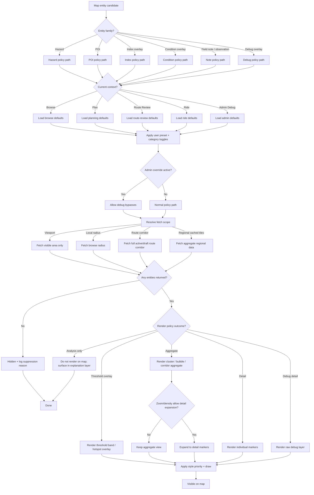

# Lanterne Product Philosophy Context


---


This document contains the philosophical and product framework for Lanterne.

Sources included:

• philosophy
• rider archetypes
• UX principles
• visual language
• iconography
• product guardrails


---

## Source File: docs/01-philosophy/phi-001-lanterne_manifesto.md

# The Lanterne Manifesto

## The Road Is Not Neutral

Cyclists are told that a line on a map is a route.

It is not.

A line on a map hides everything that actually matters.

It hides traffic.
It hides isolation.
It hides dangerous descents.
It hides roads that feel safe and roads that feel wrong.

Two routes may look identical on a map and yet be completely different experiences on the ground.

One is quiet and beautiful.

The other is terrifying.

Cyclists deserve to know the difference.

------

## The Problem With Modern Cycling Software

Most cycling software was built to answer performance questions.

How fast did you ride?
How far did you go?
Who was faster?

Those are interesting questions.

But they are not the questions riders ask when they are alone on a dark road hundreds of miles from home.

Long-distance riders ask different questions.

Is this road safe?
Is there anywhere to stop ahead?
How remote am I right now?
What happens if something goes wrong here?

Existing tools rarely answer these questions.

Lanterne exists to change that.

------

## Intelligence, Not Just Navigation

Lanterne is not simply another route planner.

It is a system designed to reveal the hidden character of roads.

It studies a route and exposes the things a cyclist cannot see on a map:

• traffic exposure
• infrastructure support
• remoteness
• environmental conditions
• fatigue accumulation
• descent risk

The goal is not to overwhelm riders with data.

The goal is to help them make better decisions.

------

## Built for the Riders Who Go Far

Lanterne is designed for cyclists who travel far from home.

Riders who:

• ride through the night
• cross unfamiliar landscapes
• ride alone for hours or days
• commit to roads they have never seen

These riders depend on good judgment.

Lanterne exists to support that judgment.

------

## Calm Technology

Cyclists already face enough noise.

Traffic.
Weather.
Fatigue.
Darkness.

Technology should not add to that noise.

Lanterne is designed to feel calm and quiet.

Complex analysis happens behind the scenes.

The rider sees only what matters.

------

## Respect for the Road

Cycling is not a video game.

It is not a leaderboard.

It is a human being moving through a real landscape under real conditions.

The road deserves respect.

And so do the riders who travel it.

Lanterne was built for them.

------

## A Different Kind of Cycling Tool

Lanterne is not trying to replace existing cycling platforms.

Performance tracking, social networks, and route libraries all have their place.

But something has always been missing.

A system that helps riders understand the road itself.

That is what Lanterne is meant to be.

A lantern on the road ahead.

---

## Source File: docs/01-philosophy/phi-003-analysis_model.md

# Lanterne Analysis Model

## Purpose

This document defines the conceptual analysis model behind Lanterne.

It is intentionally written in product-aware language rather than pure math notation so it can stay useful to both technical and product decisions.

---

## 1. Core Principle

Lanterne analyzes routes in layers:

1. **Route geometry**
2. **Small internal analysis slices**
3. **Index calculations**
4. **Route rollups**
5. **Mode-aware presentation**

Lanterne does not treat a route as one giant average. It evaluates many small parts of a route, then rolls them up into a rider-facing picture.

---

## 2. Atomic Analysis Unit

**Decision:** Indices are computed on **small internal slices** of the route rather than on large visible segments.

**Why:** Large segments smooth away important truth — remoteness dips near a town, traffic variation, lighting changes, weather changes, surface transitions.

**Implication:** The thing Lanterne *calculates on* does not have to be the same thing it *shows in the UI*. Display segments may aggregate many slices for readability.

Typical slice length: 200–500 meters, capped at 750–1,000 meters. See DS-007.

---

## 3. Safety Definition

**Safety Score** is defined narrowly as:

> Likelihood of a rider being struck by a motor vehicle, and severity of the likely outcome.

### Included in Safety
- Traffic Index
- Bike Support Index

### Not included in Safety

These may matter greatly for the ride but are not part of the narrow safety definition. They are modeled separately and must never contaminate the Safety Score:

- Remoteness
- Fatigue
- Temperature
- Wind
- Precipitation
- Moonlight
- UV
- Surface quality
- Descent risk

---

## 4. Index Families

### A. Safety
Contribute to the top-line Safety Score.

| Index | Rider question |
|-------|---------------|
| Safety Score | How safe is this road from a motor vehicle collision standpoint? |
| Traffic Index | How dangerous is the motor vehicle environment? |
| Bike Support Index | How well does this road support cyclists? |

### B. Route Reality
Describe the physical and logistical character of the route.

| Index | Rider question |
|-------|---------------|
| Remoteness Index | How far am I from help, services, and bailout options? |
| Surface Quality Index | How rideable is the surface? |
| Fatigue Index | How much cumulative burden does this section contribute? |
| Descent Risk Index | How risky is this downhill if something goes wrong? |

### C. Conditions
Describe ride-time environmental conditions. Depend on start time and forecast data.

| Signal | Rider question |
|--------|---------------|
| Wind | How much will wind affect this part of the ride? |
| Temperature | Will temperature be a problem here? |
| Precipitation | How much do wet conditions worsen this section? |
| Light | What is the light state when I arrive here? |

### D. Light / Sky Signals
Condition signals rather than major route scores.

- Sun glare warning
- UV halo
- Moon phase
- Cloud overlay

---

## 5. Index Definitions

### 5.1 Traffic Index

**Rider question:** How stressful or dangerous is the motor vehicle environment?

**Typical inputs:** road classification, speed environment, lane count, shoulder absence, connector/highway proximity, intersection density, traffic proxy features, AADT where available.

**Output type:** Stable baseline route analysis.

---

### 5.2 Bike Support Index

**Rider question:** How well does this road support a person riding a bike?

**Typical inputs:** bike lane presence, protected facility presence, paved shoulder width/quality, path/greenway/trail support, continuity of bike-supportive infrastructure.

**Output type:** Stable baseline route analysis.

---

### 5.3 Remoteness Index

**Rider question:** How far am I from help, services, food, water, and bailout options?

**Typical inputs:** settlement proximity, service density, resupply access, bailout opportunities, route isolation, road network sparsity, time-to-help proxy.

**Output type:** Stable-ish route analysis.

**Important:** Remoteness should not be over-smoothed. A route passing through one access point should show a local dip, not flatten the whole region. Longest unbroken remote stretch matters as much as the average.

---

### 5.4 Surface Quality Index

**Rider question:** How rideable is the surface on this part of the route?

**Typical inputs:** paved vs unpaved, surface type, roughness/smoothness proxies, degraded pavement proxy, gravel/dirt/trail character.

**Output type:** Stable-ish route analysis. Especially important for gravel and bikepacking contexts.

---

### 5.5 Fatigue Index

**Rider question:** How much cumulative rider burden does this part of the route contribute?

**Typical inputs:** grade, cumulative climbing, accumulated route distance, repeated rollers, stop/start burden, traffic stress contribution, surface drag contribution. Future: weather burden, personal fatigue arc.

**Output type:** Stable baseline with room for future contextual adjustments.

**Important:** Fatigue is not just climbing. A flat but exposed, windy, rough, stressful, long route can still be highly fatiguing.

---

### 5.6 Descent Risk Index

**Rider question:** How risky is this downhill section if something goes wrong?

**Typical inputs:** negative grade, descent length, curvature, road width, shoulder availability, surface quality. Future: weather interaction, darkness interaction.

**Output type:** Stable baseline with future contextual modifiers.

---

### 5.7 Wind

**Rider question:** How much will wind punish or affect this part of the ride right now?

**Typical inputs:** forecast wind speed, gusts, direction, route bearing, timing estimate, terrain exposure proxy.

**Output type:** Contextual ride-time condition.

---

### 5.8 Temperature

**Rider question:** Will temperature be a problem on this part of the ride?

**Typical inputs:** air temperature, apparent temperature, humidity, timing estimate, exposure duration, extreme threshold flags.

**Output type:** Contextual ride-time condition.

---

### 5.9 Precipitation

**Rider question:** How much do rain, snow, or wet conditions worsen this part of the ride?

**Typical inputs:** precipitation probability, intensity, type, timing estimate, interaction with surface, interaction with descent.

**Output type:** Contextual ride-time condition.

---

## 6. Light and Sky Model

Lanterne models light conditions separately from route safety.

### Light State
Computed from solar altitude: Daylight / Twilight / Night.

### Sun System
Visualized using sun icon, UV halo, optional cloud context, tooltips.

**Sun glare (ADR-010):** Glare warning occurs when sun elevation is between 0–6° above the horizon AND rider bearing is within ±30° of the sun azimuth. This is a condition warning, not a safety score input.

### Moon System
Visualized using moon phase icon and cloud overlay. Communicates whether night conditions feel moonlit or dark — important for randonneurs riding overnight.

---

## 7. Rollups

Indices exist at two main levels:

- **Slice level** — most truthful, most granular
- **Route rollup level** — rider-facing summary across the whole route

**Rollup strategies:**

| Metric | Strategy |
|--------|---------|
| Traffic Index | Weighted mean + 95th percentile emphasis |
| Bike Support Index | Weighted mean |
| Remoteness Index | Longest unbroken stretch + peak isolation |
| Surface Quality | Weighted mean + worst-surface emphasis |
| Fatigue Index | Cumulative burden |
| Descent Risk | Concentrated-risk emphasis |

Rollups must preserve route character — a short dangerous section must not be washed out by many easy miles.

**Windowed rollups (ultra-distance routes):** For routes using the expedition model (ADR-034), rollups are computed per analysis window and assembled into a full-route summary. The active window receives detailed treatment; the full route may be shown in simplified overview form. This is the intended operating model for ultra routes, not a degraded fallback.

---

## 8. Mode and Context Profiles

Indices keep the same meaning across modes. What changes by mode is prominence, weighting, explanation, and UI ordering.

| Profile | Emphasis |
|---------|---------|
| Road | Safety Score, Traffic Index, Bike Support Index, Fatigue |
| Bikepacking / Gravel | Surface Quality, Remoteness, Fatigue, Temperature, Precipitation |

---

## 9. Safety Score Structure

Safety Score remains narrow: **Traffic Index + Bike Support Index**.

Everything else remains visible but separate.

A dangerous segment on a road with no bike infrastructure should score the same whether or not it has a headwind. Weather is a different question with a different answer.

---

## 10. Storage Principles

- Use real columns for core index values
- Use JSON for component breakdowns and confidence signals
- Avoid overgeneralized metric mush — do not reduce core route intelligence to one generic key/value score table
- Stable analysis and ride-time conditions live in separate tables (ADR-023)

---

## 11. Future Expansions

- Rider-specific fatigue modeling
- Light-aware descent warnings
- Stronger route-direction sensitivity
- Mode-specific route profiles
- Confidence / uncertainty scoring
- Service access detail under remoteness
- Traffic behavior dimensions (pass frequency, intensity, driver accommodation) — see ADR-032

---

## 12. Working Principle

Lanterne should not try to collapse the whole ride into one giant abstract number.

It should provide:
- One disciplined Safety Score
- A clear set of route reality indices
- A rich but elegant conditions layer

That is how the system stays both useful and trustworthy.


---

## Source File: docs/01-philosophy/phl-002-product_principles.md

# Lanterne Product Principles

## 1. Built for riders who go long

Lanterne focuses on the realities of long-distance riding:

- randonneuring
- bikepacking
- remote endurance riding

Not short urban rides or fitness tracking.

---

## 2. Route intelligence over route recording

Most cycling apps track rides.

Lanterne analyzes routes before riders leave home.

Goal: help riders understand the road ahead.

---

## 3. Safety is defined narrowly

Safety refers specifically to:

> risk of collision with motor vehicles and injury severity.

Other challenges — fatigue, weather, remoteness — are modeled separately and never contaminate the Safety Score.

---

## 4. Real-world conditions matter

The system accounts for environmental realities including:

- wind
- temperature
- precipitation
- sunlight and sun glare
- moonlight and cloud cover

These factors shape the riding experience and are surfaced as a distinct conditions layer, not mixed into safety.

---

## 5. Simplicity beats data overload

Complex models exist behind the scenes.

The interface surfaces insights through:

- simple icons
- short explanations
- visual cues

Lanterne should never feel like a data cockpit.

---

## 6. Respect the experience of riders

Features should reflect how riders actually experience the road:

- night riding under moonlight
- sun glare in the eyes at dawn
- remote stretches without services or bailout
- the difference between a safe shoulder and none at all

---

## 7. Built for curiosity

Lanterne should encourage riders to explore and understand routes more deeply before they leave home.

---

## 8. Built for the long haul

For multi-day routes and expeditions, continuity matters as much as analysis quality.

A rider who stops for sleep, powers down their phone, or opens the app twelve hours later should return to exactly where they left off in the larger journey — not lose context or have to start over.

Expedition state is durable. Live session state is transient. These are different things and must not be conflated.


---

## Source File: docs/05-product/prod-001-positioning.md

# Product Positioning

Lanterne occupies a unique position within the cycling ecosystem.

It does **not compete directly** with most existing cycling platforms.

Instead, it sits **alongside them**.

------

## Cycling Platform Landscape

| Product      | Core Value                             |
| ------------ | -------------------------------------- |
| Strava       | performance tracking + social network  |
| RideWithGPS  | route planning and sharing             |
| Garmin       | device ecosystem and ride recording    |
| Komoot       | recreational route discovery           |
| **Lanterne** | route intelligence and safety analysis |

------

## The Gap Lanterne Fills

Existing tools answer questions like:

• How fast did I ride?
• How far did I go?
• What route should I follow?

Lanterne answers a different question:

**“What kind of road am I committing to?”**

------

## The Lanterne Layer

Think of Lanterne as an **intelligence layer above the map**.

It reveals things that are otherwise invisible:

• traffic exposure
• infrastructure support
• route remoteness
• environmental context
• fatigue accumulation
• descent risk

These factors matter deeply for long-distance cyclists but are rarely modeled.

------

## The Rider Lanterne Serves

Lanterne is designed for riders who:

• travel far from home
• ride alone frequently
• ride through the night
• explore unfamiliar terrain
• plan multi-day routes

For these riders, route choice is not trivial.

It can be the difference between a great ride and a dangerous one.

---

## Source File: docs/05-product/prod-002-vision.md

# Lanterne — Product Vision

Lanterne is a **route intelligence system for long-distance cyclists**.

It helps riders understand the safety, support, remoteness, and environmental conditions of a route before and during a ride.

Lanterne exists for riders who travel **far, alone, and often at night**.

These riders must constantly answer questions like:

- How dangerous is this road?
- Is there support nearby if something goes wrong?
- How remote am I right now?
- What conditions will I encounter overnight?
- Is this route actually the best choice?

Most cycling apps answer none of these questions.

Lanterne does.

------

## What Lanterne Is

Lanterne is:

• a **route intelligence engine**
• a **decision support tool for endurance riders**
• a **safety-aware navigation companion**

It combines route geometry, infrastructure data, environmental modeling, and rider context to generate actionable insight.

------

## What Lanterne Is Not

Lanterne is **not**:

• a social fitness network
• a training analytics platform
• a leaderboard system
• a performance tracker

Those problems are already well solved.

Lanterne focuses on a different question:

**“Is this a good road to ride right now?”**

------

## Core Belief

Routes are not equal.

Some are safer.

Some are quieter.

Some are more remote.

Some are better at night.

Cyclists deserve to understand these differences before committing to hundreds of miles of road.

---

## Source File: docs/05-product/prod-003-rider_archetypes.md

# Rider Archetypes

Lanterne is optimized for a specific set of cyclists.

Understanding these riders helps guide product decisions.

------

## 1. The Randonneur

The randonneur rides extremely long distances under time limits.

Typical characteristics:

• rides of 200–1200 km
• overnight riding is normal
• self-supported
• rides through rural areas

Needs from Lanterne:

• safety awareness at night
• support availability insight
• fatigue-aware route understanding

------

## 2. The Bikepacker

The bikepacker travels for days or weeks across varied terrain.

Typical characteristics:

• remote routes
• mixed surface riding
• unpredictable conditions

Needs from Lanterne:

• remoteness awareness
• support location awareness
• environmental context

------

## 3. The Endurance Soloist

This rider pushes extreme personal challenges.

Typical characteristics:

• solo rides
• very long distances
• minimal external support

Needs from Lanterne:

• route risk awareness
• infrastructure context
• decision support during rides

------

## 4. The Nocturne Rider

Many endurance cyclists ride heavily at night.

Typical characteristics:

• significant night riding
• changing visibility conditions
• fatigue accumulation

Needs from Lanterne:

• sun/moon modeling
• glare detection
• night safety context

------

## Who Lanterne Is Not Designed For

Lanterne is not optimized for:

• casual fitness riders
• short recreational loops
• group ride coordination
• social activity tracking

Those riders are well served by existing apps.

---

## Source File: docs/05-product/prod-004-guardrails.md

# Product Guardrails

These rules protect Lanterne from drifting away from its core purpose.

They should guide product and UI decisions.

------

## 1. Map First

The map is the primary interface.

Analysis supports the map — it never replaces it.

------

## 2. Calm Interface

Lanterne should feel calm and legible while riding.

The interface must avoid:

• dense dashboards
• flashing alerts
• unnecessary complexity

------

## 3. Progressive Disclosure

Information should appear gradually.

The rider should not be overwhelmed with data.

------

## 4. Safety Before Performance

Lanterne prioritizes safety context over performance metrics.

This means:

• traffic exposure matters more than speed
• infrastructure matters more than KOM segments

------

## 5. The Rider Is Often Alone

The product must assume the rider may be:

• remote
• fatigued
• riding at night
• without immediate assistance

Design decisions should reflect that reality.

------

## 6. Intelligence Should Feel Invisible

Lanterne performs complex analysis behind the scenes.

The rider should experience:

clarity, not complexity.

---

## Source File: docs/05-product/prod-005-ux_principles.md

# UX Principles

These principles guide the design of the Lanterne interface.

------

## Calm Over Clever

The interface should feel stable and trustworthy.

Avoid novelty that distracts from riding.

------

## Visual Before Numeric

Maps, color, and spatial context should communicate meaning before numbers do.

------

## Context Matters

The meaning of a route changes with:

• time of day
• weather
• rider progress

The interface should reflect this.

------

## Reduce Cognitive Load

Cyclists often check navigation while moving.

Information must be readable at a glance.

------

## Encourage Good Decisions

The goal is not to overwhelm riders with data.

The goal is to help them make **better route decisions**.

---

## Source File: docs/05-product/prod-006-anti_features.md

# Anti-Features

These are features Lanterne intentionally avoids.

This document protects the product from feature creep.

------

## No Leaderboards

Competition is not the goal of Lanterne.

------

## No Segments

Segment chasing encourages risky riding behavior.

------

## No Social Feed

Lanterne is a tool, not a social network.

------

## No Kudos

The platform does not exist to validate performance.

------

## No Training Analytics

Training metrics belong in specialized training platforms.

------

## No Gamification

Long-distance cycling is already challenging.

The product should not turn it into a game.

------

## The Guiding Rule

If a feature encourages riders to ride **faster instead of smarter**, it likely does not belong in Lanterne.

---

## Source File: docs/05-product/prod-006-branding.md

# Lanterne In-App Branding Refresh

# **Nocturne Survey**

## Design Philosophy

**Nocturne Survey** defines the visual identity of Lanterne as a field instrument for riders who travel long distances through changing light.

The system combines two visual traditions:

**Night Signal** — a dark, lantern-lit atmosphere inspired by night riding, deep road solitude, and minimal light revealing the terrain ahead.

**Cartographer’s Kit** — the precise language of maps, surveys, and field notebooks: contour lines, elevation marks, coordinate ticks, and sparse annotation.

Together these influences produce a design that feels both **technical and human**. It should evoke the quiet intelligence of a rider studying a route under a lamp — part map room, part expedition notebook.

This aesthetic must never drift toward outdoor-brand nostalgia or decorative vintage styling. Lanterne is not a camping brand or a gear catalog. It is a **navigation and route-intelligence tool** built for riders who go long.

The visual system therefore balances:

- darkness and clarity
- warmth and precision
- exploration and discipline

Light should feel directional and intentional. Amber signals reveal important elements rather than illuminating the entire interface.

The result should feel like **a cartographer’s field notebook opened under lantern light**.

------

# Core Visual Principles

### 1. Darkness is the canvas

The interface emerges from a deep charcoal or near-black background.

Darkness is not merely a theme choice — it reflects the lived reality of long-distance riding, where navigation often happens in low light and focused attention.

UI elements should appear as if revealed by a lantern beam rather than sitting on a uniformly lit surface.

Edges may soften or fade subtly into shadow.

------

### 2. Light is a signal, not decoration

Warm amber acts as the visual “lantern” of the interface.

It highlights:

- key route insights
- active navigation elements
- selected tools
- important alerts

Amber should feel purposeful and restrained. It should not dominate the interface or become a decorative accent.

------

### 3. Cartographic precision

The interface borrows subtle cues from mapping and surveying tools:

- topographic contour lines
- coordinate ticks
- elevation notations
- small grid references
- map annotation marks

These should appear sparingly and lightly, never cluttering the interface.

The goal is to evoke the language of maps without turning the UI into a literal topographic poster.

------

### 4. Field-instrument restraint

The visual system should feel like a **tool**, not an illustration.

Avoid:

- decorative wilderness imagery
- camping iconography
- gear illustrations
- distressed vintage graphics
- heavy textures

The atmosphere should be quiet and precise, closer to a navigation instrument or survey notebook than an outdoor lifestyle brand.

------

# Color System

### Base

Deep charcoal / near-black backgrounds

Examples:

```
#0B0C0E
#121417
#171A1D
```

These should provide depth while avoiding pure black, allowing subtle texture and layering.

------

### Signal (Lantern Amber)

Primary highlight tone.

Examples:

```
#F4B942
#E7A72E
#C78D1A
```

Uses:

- active navigation indicators
- selection highlights
- key UI focus states
- subtle glow effects

Amber should feel warm and slightly muted rather than bright neon.

------

### Earth Accents

Muted tones inspired by terrain and maps.

Examples:

Moss green
 Slate gray
 Muted ochre
 Soft rust / ember

These should appear sparingly in secondary UI states or map-related elements.

------

### Red Shift

The current red accent moves toward a warmer ember tone.

Example direction:

```
#A13A2A
```

This prevents harsh contrast against the darker palette.

------

# Typography

Typography must reinforce the balance between **human narrative and technical precision**.

### Primary Serif — Georgia

Georgia remains the primary typeface for Lanterne.

It provides:

- warmth
- readability
- subtle old-world character
- editorial authority

Georgia should be used for:

- headings
- explanatory text
- narrative UI elements
- brand language

Its tone aligns with the idea that Lanterne is built by riders who think deeply about the road.

------

### Technical Counterweight — JetBrains Mono

JetBrains Mono provides the technical voice of the system.

It should be used for:

- coordinates
- route metrics
- elevation values
- technical labels
- system annotations

This pairing creates a productive tension:

**Georgia → human experience of the ride**
 **JetBrains Mono → instrument precision**

------

# Texture

Texture should be extremely subtle.

Acceptable:

- faint paper grain
- soft ink-bleed edges on drawn lines
- slight topo layering

Unacceptable:

- visible parchment backgrounds
- distressed textures
- coffee-stain effects
- scrapbook-style paper elements

The UI must still feel modern and high-quality.

Texture should only be noticeable when looked for.

------

# Form Language

UI shapes and graphical marks should feel inspired by cartographic notation:

- thin linework
- small ticks
- contour arcs
- measured spacing
- survey marks

Rounded or soft shapes should remain minimal.

Precision and alignment matter more than ornament.

------

# Light Behavior

A defining element of the Nocturne Survey aesthetic is **directional light**.

Design rule:

Elements appear as if emerging from darkness.

Amber light should:

- highlight important areas
- create focus
- subtly illuminate selected objects

Avoid flat, evenly lit surfaces.

The interface should maintain depth and shadow.

## Signal Light Model

In the Nocturne Survey aesthetic, amber is treated as **light**, not simply as a color.

This distinction is critical to the visual identity.

Most dark interfaces apply accent colors as flat fills.
 Lanterne instead uses amber to behave like **lantern light emerging from darkness**.

The goal is to evoke the experience of navigating a road at night where signals appear illuminated rather than painted.

### Design Rule

Amber should appear as **a glowing signal within darkness**, not a solid block of color.

Primary signal elements may use:

- a core amber tone
- a faint outer halo
- subtle blur falloff
- gentle fade into surrounding darkness

Example structure:

Core signal

```
#F4B942
```

Outer glow

```
rgba(244,185,66,0.12)
```

The glow should remain extremely subtle and never appear decorative.

------

## Where Signal Glow Is Appropriate

Glow should only appear on elements that represent **active signals or navigation focus**.

Examples include:

- current rider position marker
- active route highlight
- selected navigation state
- warning indicators
- directional arrows
- key route insight markers

These elements represent information that should visually behave like **beacons in the dark**.

------

## Where Glow Must Not Be Used

Glow must not be applied to:

- paragraph text
- large UI surfaces
- background panels
- long data tables
- general interface chrome

Overuse of glow reduces clarity and creates visual noise.

Most interface elements should remain matte and unlit so that signal elements stand out clearly.

------

## Visual Goal

The interface should feel like **a navigation instrument operating in darkness**, where light is used carefully to reveal important information.

Amber signals should behave like:

- a bicycle tail light
- a lantern on a dark road
- a compass needle catching light

This subtle behavior reinforces the product’s central metaphor and distinguishes Lanterne from conventional dark-mode interfaces.

------

# Why this addition matters

Adding this rule does three important things:

1. **Prevents flat orange UI**
    (the biggest risk in dark themes)
2. **Connects the aesthetic to the product metaphor**
    lantern / night riding / navigation
3. **Creates hierarchy automatically**
    signals glow, everything else stays quiet

That’s how the interface starts feeling **instrument-grade** instead of just “dark themed.”

------

# Visual Reference Canvas

A single canvas should visually express the Nocturne Survey philosophy.

The composition should include:

- deep charcoal background
- faint topographic line structures
- warm amber highlights
- sparse coordinate or survey marks
- minimal typography
- soft edge falloff into darkness

The result should feel like an **abstract map under lantern light**.

This canvas acts as the guiding reference for all subsequent UI work.

------

# Guardrails

The design must **never drift toward**:

- REI catalog styling
- vintage camping posters
- bikepacking gear aesthetics
- rustic outdoors branding

Lanterne is not an outdoor lifestyle brand.

It is a **route intelligence instrument** for riders who travel far and often through darkness.

The interface should reflect **discipline, focus, and quiet exploration**.

---

## Source File: docs/05-product/prod-007-visual_language.md

# Lanterne Visual Language

This document defines the visual signaling rules used across the Lanterne interface.

The goal is a system that riders can interpret instantly — especially in motion, fatigue, darkness, or poor weather.

The visual system should behave more like **aviation instrumentation** than a typical mobile UI.

---

# 1. Design Philosophy

Lanterne is not a decorative interface.

It is a **decision support instrument for long-distance riders**.

Visual signals must therefore be:

• stable  
• predictable  
• interpretable at a glance  
• usable under physical stress and fatigue  

Color and motion must always encode meaning.

Decorative variation is avoided.

---

# 2. Day / Night Mode Rule

Lanterne uses a strict rule for theme inversion.

## Neutral Interface Elements

Neutral interface elements invert between day and night to maintain contrast with the map.

Examples:

• text  
• drawer handles  
• UI chrome  
• compass  
• scale bar  
• neutral icons  

Day mode:
charcoal

Night mode:
white

---

## Semantic Colors

Colors that encode meaning **never change between day and night mode**.

These colors represent real-world meaning and must remain stable to prevent cognitive confusion.

Examples:

• danger indicators  
• caution signals  
• infrastructure signals  
• environmental warnings  

Example rule:

red always means danger  
yellow always means caution  
green always means supportive conditions  

These colors remain identical in both day and night modes.

---


---

## Source File: docs/05-product/prod-008-dynamic-risk-indicators.md

# prod-007 — Dynamic Risk Indicators

## Purpose

Lanterne uses **dynamic visual indicators** to communicate route risk.

These indicators adapt to **light state (day vs night)** so riders can interpret route conditions quickly while riding.

The goal is to maintain:

- strong legibility
- intuitive meaning
- consistent semantics

without forcing riders to interpret complex numeric data.

---

## Core Principle

The **meaning of colors never changes**.

Only the **visual palette** adapts to the surrounding light environment.

Example:

| Risk Level | Meaning | Day Color | Night Color |
|-------------|--------|-----------|-------------|
| Low risk | supportive riding environment | green | green |
| Moderate | caution | amber | amber |
| High risk | elevated danger | red | red |

Hue meaning must remain stable.

What changes between day and night is:

- brightness
- saturation
- contrast tuning

---

## Light-Aware Adaptation

Lanterne models **light state** using solar altitude.

States:

- Daylight
- Twilight
- Night

Dynamic risk indicators respond to this state automatically.

### Day Mode

Palette optimized for:

- bright outdoor viewing
- sun glare conditions
- high ambient light

Characteristics:

- slightly darker base colors
- stronger saturation
- thicker line rendering
- strong contrast against map background

---

### Night Mode

Palette optimized for:

- dark adaptation
- reduced eye strain
- minimal map glare

Characteristics:

- softer saturation
- slightly luminous glow
- reduced visual harshness
- subtle contrast against dark basemap

Night palettes must never appear **neon or overly bright**.

---

## Design Goals

Dynamic risk indicators must:

1. remain readable while riding
2. remain interpretable in peripheral vision
3. avoid overpowering the base map
4. preserve rider mental models
5. adapt automatically without user configuration

---

## Non-Goals

Dynamic risk indicators are **not intended to:**

- represent different risk definitions
- change score meaning
- encode additional data dimensions

They exist solely as a **visual legibility system**.

---

## Relationship to Safety Score

Dynamic risk indicators visualize **segment risk results derived from the Safety Score pipeline**.

They do not replace the Safety Score and do not change how it is calculated.

---

## Implementation Rule

All UI surfaces that display segment risk must use the **same dynamic palette logic**, including:

- route heatmap
- segment highlighting
- cue sheet risk markers
- map overlays

This ensures consistent visual interpretation across the product.

---

## Design Rule

```
Hue = meaning  
Brightness = legibility
```

The hue assigned to a risk level must **never change between day and night**.

Only brightness, contrast, and saturation may adapt to light conditions.

This preserves rider intuition and prevents confusion during long rides.

---

## Future Extensions

Possible future improvements include:

- twilight palette interpolation
- color-blind accessibility palettes
- mode-aware emphasis (road vs gravel contexts)
- adaptive contrast based on ambient brightness

These enhancements must maintain the core rule:

**risk color meaning remains constant.**


---

## Source File: docs/05-product/prod-009-iconography.md

Weight rules
Map POIs: thin
Toolbar / controls / menus: regular
Selected state: fill
Hazards: regular icon inside a colored badge/halo
Admin-only tools: regular, sometimes bold for truly internal/debug stuff

That keeps the map quiet while letting controls and hazards stay legible.

Ship set I’d use
Link tree / main actions
where to → signpost
route to → navigation-arrow
draw → pencil-simple-line
load → tray-arrow-down
vault → vault
saved → bookmark-simple
history → clock-counter-clockwise
analyze → chart-line-up
cues → traffic-sign
stops & layers → stack
dev → wrench
inspect → magnifying-glass
Map buttons
current bearing → navigation-arrow
heatmap on/off → lightbulb
day / night → sun / moon
street / satellite → map-trifold
GPS → gps or crosshair

I’d use gps for state and crosshair for “center / locate me now.”

Drawing / editing
snap on → magnet
points + miles → ruler
elevation → mountains
cancel → x-circle
edit route → pencil-simple-line
hold to peek → eye

POIs: **water** / food / **rest** / **health** / **help**
potable water → drop
natural water crossings / water presence → waves
toilets → toilet
showers → shower
restaurants / food → fork-knife
cafes → coffee
convenience / resupply → storefront
supermarket / grocery → shopping-cart
gas station → gas-pump
lodging → bed
campgrounds → tent
post office → mailbox
hospital → hospital
clinic / medical help → first-aid-kit
pharmacy → pill or prescription
police → shield or police-car
fire station → fire-truck
emergency phone → phone-call

Blunt cut:

use pill, not prescription for map POIs. Faster read.
use storefront, not ten different retail metaphors.
use fork-knife for generic food and keep coffee as the only food sub-type worth separate visual treatment.
**Nature** / tourism
peaks → mountains
viewpoints → binoculars
springs → drop
park / green / shade → tree or park
monuments / memorials / ruins → columns if you insist, but I’d demote this whole bucket
Connectivity / ride computer / future continuity
bluetooth → bluetooth
bluetooth connected → bluetooth-connected
bluetooth unavailable → bluetooth-slash or bluetooth-x
radio / transmission → broadcast or radio
cell service → cell-tower
no cell / weak cell → cell-signal-slash, cell-signal-x
wifi / offline → wifi-slash, wifi-x
speaker on/off → speaker-high, speaker-slash
microphone on/off → microphone, microphone-slash
battery states → battery-high, battery-medium, battery-low, battery-warning
charging → battery-charging
download / offline save → download or cloud-arrow-down

This is where Phosphor really earns its keep. The family gives you continuity across the whole product instead of icon soup. That matches your own product principle of using simple icons and cues rather than turning Lanterne into a data cockpit.

Hazards

Here’s the important part: don’t use raw thin icons for hazards. Lanterne already treats hazards as a distinct rider-facing signal layer, and those need faster recognition than ordinary POIs.

Use these as the base glyphs, but wrap them:

railroad crossing → train
traffic conflict / turning conflict → traffic-sign
closure / obstruction / work / impassable vibe → barricade
remote corridor → road-horizon
cellular dead zone → cell-tower or cell-signal-x
service gap → storefront with custom slash/badge treatment
generic warning tier → warning-circle / warning-diamond / warning-octagon

For the custom ones:

dangerous-angle rail crossing
left turn across traffic
metal grate bridge
pinch point

…use Phosphor as the base language, but compose a Lanterne hazard symbol, not just a naked stock icon. That means regular weight, colored disc/halo, maybe a tiny overlay arrow or grate pattern. Raw stock icons alone will be too polite.


---

## Source File: docs/05-product/prod-010-poi_categories.md

# PROD-010 — POI Categories and Mode-Aware Stop Defaults

Status: Draft  
Owner: Product  
Last Updated: 2026-03-26

## Purpose

Define Lanterne's rider-facing POI catalog for stops and route-support services, including:

- canonical top-level stop categories
- launch subcategories
- category membership rules
- mode-aware default toggle behavior
- user override and persistence behavior
- confidence and truthfulness rules for ambiguous stop types

This document is the product spec for what riders see in the Stops / Layers experience.
It is not an OSM schema dump.

---

## Product intent

Lanterne should help a rider answer a practical question quickly:

**Where can I get what I need next?**

That need may be:

- water
- calories
- caffeine / morale
- a restroom or shower
- a place to sleep or handle logistics

The stop system must reflect how long-distance riders actually think, not how map databases happen to classify amenities.

That means:

1. The user-facing taxonomy stays small and legible.
2. Messy real-world POIs may belong to more than one rider-facing category.
3. Defaults may change by ride mode.
4. Riders can override those defaults.
5. Those overrides persist.
6. Ambiguous stop types must be represented truthfully rather than implied as guaranteed services.

---

## Core design rules

### 1. Keep the rider-facing taxonomy small

Launch with five top-level stop categories:

- Eat
- Drink
- Bio
- Rest
- Boost
- Aid

Do not explode this into a 20-category ontology mess.

### 2. Support multi-category membership

Some POI subcategories are legitimately useful in more than one rider-facing category.

Examples:

- cafe belongs in Food and Boost
- convenience store belongs in Water and Food
- grocery belongs in Water and Food
- gas station belongs in Water and Food

The internal model must support one subcategory being surfaced under multiple parent categories.

### 3. No shadow mode system

POI defaults must attach to the application's canonical ride mode system.

The POI layer must **consume** the main mode/profile identifier already used elsewhere in the product.
It must not create its own parallel set of mode names or logic.

Working examples may include:

- road / normal
- randonneur
- ultra
- bikepacking_gravel

Whatever the final canonical mode IDs are, POI defaults must key off those exact IDs.

### 4. Defaults are a starting point, not a prison

Every mode has standard subcategory defaults.
Those defaults are applied automatically when the rider enters that mode.
But once a rider changes a toggle, that override belongs to them and must persist.

### 5. Be honest about uncertain stop types

Some stop types are useful because riders know they are *often* helpful, not because they are guaranteed.

Examples:

- cemeteries may have exterior spigots or hose access
- freshwater crossings may provide untreated water access

These belong in the system, but they must never be presented as guaranteed potable water.

---

## Canonical top-level categories

## 1. Eat

Use for calories and meaningful resupply.

Examples surfaced here may include:

- restaurants
- fast food
- cafes
- convenience stores
- groceries

---

## 2. Drink

Use for places a rider may reasonably seek in order to refill or obtain water.

Examples surfaced here may include:

- public drinking water
- water taps / fountains
- convenience stores
- groceries
- gas stations
- cemeteries
- freshwater crossings

### Water truth rule

Not all Water items have equal confidence.

- public drinking water = high confidence
- convenience stores / groceries / gas stations = commercial water availability likely
- cemeteries = possible / situational water source
- freshwater crossings = possible untreated water source

The UI must preserve that distinction.

---

## 3. Go

Use for bodily maintenance and hygiene.

Examples surfaced here may include:

- public restrooms
- showers
- camp shower facilities when clearly tagged

------

## 4. Rest

Use for sleep, recovery, shelter, and practical logistics during long rides.

Examples surfaced here may include:

- hostels
- lodging
- shelters where clearly relevant
- post offices

Post offices belong here because for long-distance riders they are logistics anchors, not because they are literally restful.

---

## 5. Boost

Use for quick caffeine, sugar, morale or psychological lift.

Examples surfaced here may include:

- cafes
- coffee shops
- bakeries
- dessert / ice cream
- convenience-store snack stops

This category is intentionally rider-centric rather than ontologically pure.

---

## 6. Aid

A combination of health related locations and municipal services. 

Examples surfaced here may include:

- pharmacies
- hospitals
- police stations
- urgen care facitlies
- fire departments

---

## 

## Launch subcategory registry

The launch model should be defined at the **subcategory** level, not just at the category level.

Suggested launch registry:

| Subcategory ID | Rider label | Parent categories | Notes |
|---|---|---|---|
| public_drinking_water | Drinking water | Water | High-confidence potable source |
| convenience_store | Convenience store | Water, Food, Boost | Commercial resupply / drinks / snacks |
| grocery | Grocery | Water, Food | Meaningful resupply |
| gas_station | Gas station | Water, Food | Drinks, snacks, basic commercial stop |
| cemetery_water_candidate | Cemetery | Water | Possible seasonal / exterior spigot source; not guaranteed |
| freshwater_crossing | Freshwater crossing | Water | Possible untreated water source |
| restaurant | Restaurant | Food | Meal stop |
| fast_food | Fast food | Food | Fast calories |
| cafe | Cafe / coffee | Food, Boost | Canonical dual-category example |
| bakery | Bakery | Boost, Food | Short-stop fuel / morale |
| dessert | Dessert / ice cream | Boost | Psychological lift / sugar stop |
| public_restroom | Restroom | Bio | Core bodily support |
| shower | Shower | Bio | Hygiene / recovery |
| hostel | Hostel | Rest, Bio | Rest anchor; may imply shower but should not auto-assume |
| lodging | Lodging | Rest | Motel / hotel / inn |
| shelter | Shelter | Rest | Only when clearly tagged and truly useful |
| post_office | Post office | Rest | Logistics anchor |

### Deferred from launch

| Subcategory ID | Reason deferred |
|---|---|
| bike_shop | OSM quality too unreliable for rider trust |
| repair_station | Tag coverage inconsistent; evaluate later |
| pharmacy | Useful, but not essential to v1 stop taxonomy |
| laundromat | Useful for expedition use, but not a launch-critical stop type |

Bike shops should not be shipped as a first-class stop layer until Lanterne has a better registry and confidence approach.

---

## Confidence classes

Each subcategory must carry a confidence class that controls language, icon treatment, and future note collection.

| Confidence class | Meaning | Examples |
|---|---|---|
| confirmed_service | Strongly implied by POI type | drinking water, restroom, grocery |
| likely_commercial | Commercial source likely but not guaranteed by metadata | convenience store, gas station |
| rider_inferred | Known rider heuristic; situational | cemetery water candidate |
| untreated_natural | Natural source may exist but requires rider judgment | freshwater crossing |

### UI rule

Confidence class affects:

- detail-card language
- optional info tooltip copy
- future field-note prompts
- future ranking / filtering

Confidence class does **not** create a separate visible top-level category.

---

## Detail-card copy rules for ambiguous sources

### Cemetery

Use language along the lines of:

> Often a possible seasonal water source due to exterior spigots or hose access. Not guaranteed.

### Freshwater crossing

Use language along the lines of:

> Potential untreated water source. Availability and suitability vary.

Do not label either of these as potable by default.

---

## Mode-aware defaults

## Principle

The rider should not have to reconfigure the stop system every time they switch riding context.

A bikepacking rider and a road rider do not need the same default stop mix.

Therefore:

- defaults are defined per **mode x subcategory**
- defaults are loaded automatically when a mode becomes active
- rider overrides are stored per **mode x subcategory**
- effective state = rider override when present, otherwise mode default

---

## Launch default matrix

The table below is the recommended v1 default behavior.

| Subcategory ID | Road / Normal | Randonneur | Ultra | Bikepacking / Gravel |
|---|---:|---:|---:|---:|
| public_drinking_water | on | on | on | on |
| convenience_store | on | on | on | on |
| grocery | on | on | on | on |
| gas_station | on | on | on | on |
| cemetery_water_candidate | off | on | on | on |
| freshwater_crossing | off | off | off | on |
| restaurant | on | on | on | on |
| fast_food | on | on | on | on |
| cafe | on | on | on | on |
| bakery | off | on | on | on |
| dessert | off | off | off | on |
| public_restroom | on | on | on | on |
| shower | off | off | on | on |
| hostel | off | on | on | on |
| lodging | off | on | on | on |
| shelter | off | off | on | on |
| post_office | off | off | off | on |

### Why these defaults

#### Road / Normal

Prioritize conventional, high-confidence support with minimal map clutter.

#### Randonneur

Expose more survival-oriented support for long self-supported brevets without drifting fully into expedition assumptions.

#### Ultra

Bias toward resilience and recovery support for very long efforts and sleep-deprived contexts.

#### Bikepacking / Gravel

Bias toward remote-resource discovery, logistics, and hygiene because riders are more likely to rely on unconventional or distributed support.

---

## User override behavior

## Effective toggle rule

For each subcategory in the active mode:

```text
if user_override exists for (user, mode, subcategory):
    effective_state = user_override.enabled
else:
    effective_state = mode_default.enabled
```

## Persistence rule

Overrides must persist by **mode**.

That means:

- if a rider turns cemeteries on in Bikepacking / Gravel, that preference should persist the next time they return to Bikepacking / Gravel
- that change should not automatically alter Road / Normal defaults

This keeps the system intelligent without becoming confusing.

## Reset controls

Provide both:

- **Restore defaults for this mode**
- **Restore defaults for all modes**

Do not make riders manually untangle a mess once they have customized many toggles.

---

## Persistence architecture

## Logged-out rider

Store POI overrides locally on device.

Recommended storage:

- localStorage for simple UI state, or
- IndexedDB if the app is already centralizing offline/user settings there

Recommended key shape:

```text
poiPrefs:v1
```

Recommended payload shape:

```json
{
  "mode_preferences": {
    "road": {
      "public_drinking_water": true,
      "cemetery_water_candidate": false
    },
    "bikepacking_gravel": {
      "public_drinking_water": true,
      "cemetery_water_candidate": true,
      "freshwater_crossing": true
    }
  },
  "updated_at": "2026-03-26T00:00:00Z"
}
```

## Logged-in rider

Persist preferences to the backend and mirror them locally for resilience.

Recommended relational shape:

### `user_poi_preferences`

| Column | Type | Notes |
|---|---|---|
| id | uuid | primary key |
| user_id | uuid | owner |
| mode_id | text | canonical app mode |
| subcategory_id | text | registry ID |
| enabled | boolean | override state |
| updated_at | timestamptz | last write |

### Behavior

- write-through to backend on change
- mirror locally for fast boot and offline resilience
- on login, merge local and server preferences by most recent `updated_at`
- if merge cannot be resolved cleanly, prefer newest row per `(mode_id, subcategory_id)`

This avoids both data loss and weird cross-device surprises.

---

## Registry model

The product should maintain a canonical POI subcategory registry.

Recommended shape:

### `poi_subcategory_registry`

| Column | Type | Notes |
|---|---|---|
| subcategory_id | text | stable key |
| rider_label | text | UI label |
| icon_key | text | icon mapping |
| confidence_class | text | confirmed_service / likely_commercial / rider_inferred / untreated_natural |
| launch_status | text | launch / deferred / hidden |
| sort_order | integer | drawer ordering |
| active | boolean | kill switch |

### `poi_subcategory_category_membership`

| Column | Type | Notes |
|---|---|---|
| subcategory_id | text | FK to registry |
| category_id | text | water / food / boost / bio / rest |

### `poi_mode_defaults`

| Column | Type | Notes |
|---|---|---|
| mode_id | text | canonical app mode |
| subcategory_id | text | FK to registry |
| default_enabled | boolean | default state |
| sort_order | integer | optional mode-specific ordering |

This is the cleanest shape because it separates:

- what a POI type is
- what categories it belongs to
- how it behaves by mode

Do not hard-code this logic in scattered UI components.

---

## UI behavior

## Stops / Layers drawer

The drawer should present:

1. top-level categories
2. expandable subcategory lists
3. visible on/off state for each subcategory
4. a simple reset action
5. optional info affordance for ambiguous stop types

## Recommended interaction model

- top-level category toggle controls visibility for the category as a whole
- expanding the category reveals its subcategory toggles
- subcategory toggle changes override the default for the active mode only
- mode switch rehydrates the toggles for that mode immediately
- user edits should survive app restart and sign-in state changes where possible

## Category toggle behavior

Top-level category toggles should be treated as a convenience layer in the UI, not as the source of truth.

The source of truth remains the subcategory state.

In practice:

- category ON = at least one subcategory enabled, or all enabled if user explicitly turned category on
- category OFF = all child subcategories disabled for current mode
- mixed child states should show an indeterminate visual state if supported

Do not let category toggles erase subcategory nuance invisibly.

---

## Map rendering rules

1. Mode defaults affect **which POI types are active**, not how map rendering fundamentally works.
2. Existing clustering / batching behavior remains intact.
3. Switching modes should update visible stop layers without requiring app reload.
4. User overrides should not trigger hidden global resets.
5. Ambiguous water sources should be visually distinguishable in their card copy even if they share the Water family.

---

## Field notes and future feedback loop

This document does not require full rider field-note implementation to ship v1.

But the stop model should leave room for it.

Best future candidates for confirmation prompts:

- cemetery water candidate
- freshwater crossing
- shower
- hostel

Future prompt example:

- Did you find water here?
  - Yes
  - No
  - Optional note

That future observational layer should strengthen confidence without polluting the canonical POI registry.

---

## Non-goals

This spec does not require:

- bike shops at launch
- perfect OSM completeness
- a new independent profile system for POIs
- server-side POI preference logic before local persistence exists
- separate top-level categories for uncertain sources

---

## Final decision summary

Lanterne launches with five top-level rider-facing stop categories:

- Water
- Food
- Boost
- Bio
- Rest

Key launch decisions:

- cemeteries are included in Water as a rider-inferred water candidate
- freshwater crossings are included in Water as a possible untreated source
- cafes remain canonical to Food and also appear in Boost
- showers belong in Bio
- hostels and post offices belong in Rest
- bike shops are deferred until data quality improves

POI defaults are mode-aware.
Those defaults derive from the main application mode system.
Riders can override any subcategory toggle.
Those overrides persist by mode and survive app restart.

That gives Lanterne a stop system that is simple on the surface, truthful in the details, and flexible enough to serve very different long-distance riding contexts.


---

## Source File: docs/05-product/prod-011-hazard_severity_model.md

# prod-011 — Hazards System

## Purpose

Lanterne’s hazard system exists to surface **concrete rider decision moments**, not to dump every detected anomaly onto the map.

Hazards must help a rider answer:

- Should I pay attention here?
- Should I slow down here?
- Is this a place where route geometry or infrastructure meaningfully increases risk?

This system must remain **credible, sparse, and legible**.

If hazards become overly frequent, overly generic, or visually repetitive, riders will stop trusting them.

---

## Core Principle

**Hazard markers represent rider-relevant moments, not raw database observations.**

Lanterne may internally detect many route features, but only a subset should be promoted to rider-facing hazards.

The system therefore has three layers:

1. **Detection**  
   Raw internal recognition of route features or risk-relevant conditions.

2. **Qualification**  
   Rules that determine whether a detected feature is meaningful enough to be considered a rider-facing hazard.

3. **Display**  
   Rules that determine whether a qualified hazard should actually appear on the map at the current zoom and context.

Detection alone is not sufficient for display.

---

## Design Goals

The hazard system must:

- remain sparse enough to preserve trust
- surface truly meaningful risk moments
- use consistent visual language
- avoid cluttering the map
- distinguish informational POIs from rider warnings
- favor simple, explainable rules over fragile over-modeling

---

## Non-Goals

The hazard system is **not** intended to:

- represent every route inconvenience
- encode every turn or maneuver
- expose all internal hazard detections directly
- replace broader route-level scoring
- function as a comprehensive traffic simulation

---

## Visual Language

Hazards use a distinct marker grammar from POIs.

### POIs
- circular markers
- neutral styling
- informational only

### Hazards
- diamond markers
- yellow = warning
- red = acute hazard

This creates a fast visual hierarchy:

- **circle** = information
- **diamond** = hazard
- **yellow** = caution
- **red** = danger

Hazard icons should remain visually restrained and map-native.

Generic exclamation markers may be used as an interim system while the hazard taxonomy stabilizes, but the long-term goal is to use hazard-specific internal symbols where helpful.

---

## Hazard Severity Model

Lanterne uses a deliberately simple rider-facing hazard severity model.

### Warning
Yellow diamond.

Used for hazards that require rider attention but are not inherently acute in most contexts.

### Acute Hazard
Red diamond.

Used for hazards where route geometry, infrastructure, or crossing conditions materially elevate rider risk.

### Severity Rule

Hazard severity should be simple, stable, and explainable.

If a rule cannot be easily explained to a rider or implemented consistently, it should not be part of the MVP hazard system.

---

## Display Rules

Not every qualified hazard should appear as an independent map marker.

### 1. Hazard Clustering

Multiple nearby hazards must not create “hazard confetti.”

Within a local route-distance window, only the most important hazard should be shown by default.

Additional nearby hazards should be available through tap / inspect / detail views.

### 2. Minimum Marker Spacing

Hazard markers should only appear as separate markers when they represent distinct rider decision moments.

Back-to-back hazards within a short distance should be suppressed or clustered unless severity escalates.

### 3. Zoom Discipline

At overview zoom levels, the map should show only the most meaningful hazards.

Closer zoom levels may reveal more warnings.

Inspect / admin views may reveal the full internal hazard set.

### 4. Red Must Be Rare

Red markers should remain sparse and high-trust.

If red markers become common, the system loses credibility.

---

## Hazard Taxonomy

The rider-facing hazard system should stay intentionally small.

### Supported Rider-Facing Hazards

- Railroad crossing
- Angled RR tracks
- Metal grate bridge
- Pinch point
- Service gap
- Cellular dead zone
- Remote corridor

Additional hazards may be added later only if they represent a clear rider decision moment and can be explained simply.

---

## Railroad Crossings

Railroad crossings are one of the clearest examples of a meaningful rider-facing hazard.

However, not all railroad crossings are equally risky.

Lanterne therefore distinguishes between:

- **RR Crossing**
- **Angled RR Tracks**

### Base Detection

Any crossing with railroad track interaction may qualify as an RR crossing.

### Angled RR Tracks

Use this label when the rider’s crossing angle relative to the tracks is less than 50 degrees.

This label is descriptive, not interpretive.

It describes a concrete physical condition rather than editorializing about danger.

### Railroad Crossing Severity

Use a simple angle-based rule:

- crossing angle `< 50°` → **acute hazard** (red)
- crossing angle `>= 50°` → **warning** (yellow)

This rule is intentionally simple and should not be overcomplicated in the rider-facing system.

### Recommended Display Labels

Examples:

- `RR Crossing`
- `RR Crossing · Angled RR Tracks`
- `RR Crossing · Triple-track crossing`
- `RR Crossing · Angled RR Tracks | angle=48.1°`

Detailed metadata belongs in the tooltip / drawer / inspect layer, not in the always-on map marker itself.

---

## Left-Turn Policy

Generic left-turn markers are disabled.

Reason:

Normal turning movements are too context-dependent to function as reliable standalone rider-facing hazards.

A turn alone does not create a credible physical hazard marker in the same way that:

- angled tracks
- grate bridges
- pinch points
- service gaps

do.

### Future Exception

A future intersection-conflict model may reintroduce a limited class of left-turn exposure hazards only when supported by robust context such as:

- multiple traffic lanes
- hostile crossing movement
- lack of refuge
- limited protection
- meaningful exposure

Until that model is mature, generic left-turn hazards remain off.

---

## Tooltips and Detail Layer

The map marker should remain simple.

The detail layer is where nuance belongs.

Examples of appropriate detail:

- track count
- crossing angle
- no shoulder
- posted speed
- nearby surface condition
- road classification
- signal presence
- confidence notes

The marker communicates:
- warning vs acute
- hazard location

The detail layer communicates:
- why it matters

---

## Trust and Restraint

Lanterne’s hazard system must preserve rider trust.

That means:

- no over-emitting
- no generic maneuver clutter
- no false sense of precision
- no inflation of ordinary route conditions into hazards

The system should feel selective and credible.

A rider should come to believe:

> If Lanterne marked this, it is worth noticing.

---

## Product Standard

A hazard should only be shown when it meets all three tests:

### 1. Physical Reality
Is this a real, concrete condition on the route?

### 2. Rider Relevance
Does this condition meaningfully affect rider decision-making or safety?

### 3. Display Worthiness
Is this important enough to deserve one of the limited always-on map markers?

If the answer to any of these is no, it should not appear as a rider-facing hazard marker.

---

## Implementation Guidance

The MVP implementation should prioritize:

- simple threshold logic
- sparse display rules
- high marker credibility
- clustering
- stable color semantics

Do not prematurely over-model hazard severity.

The system should first become:

- understandable
- legible
- trustworthy

before becoming more sophisticated.

---

## Guiding Principle

**Hazards should mark decision moments, not observations.**

Lanterne should feel calm, selective, and credible — not alarmist.


---

## Source File: docs/05-product/prod-012-review_surfaces.md

# prod-012 — Review Surfaces

## Purpose

Lanterne exposes route review information differently depending on who is using the system.

A solo rider, an organization-level route editor, and a developer diagnosing internal logic do not need the same level of detail.

This document defines the intent, audience, and display rules for route review surfaces.

The goal is to prevent internal diagnostics from leaking into rider-facing UX.

---

## Core Principle

**Internal granularity, external restraint.**

Lanterne may internally detect, score, and store many route-level observations, anomalies, and hazard signals.

Not all of those belong in every user-facing surface.

Review surfaces must be tailored to the decision-making needs of the audience.

---

## Audience Levels

Lanterne defines three review levels:

1. **Developer / Admin View**
2. **Power User View**
3. **User View**

Each level exists for a different purpose.

---

## 1. Developer / Admin View

### Audience
Internal developers, admins, superusers, and trusted QA operators.

### Purpose
Expose internal route diagnostics, data contradictions, enrichment issues, model oddities, and debugging signals.

This view exists to help diagnose:

- scoring contradictions
- hazard over-emission
- matching issues
- unusual segment boundaries
- enrichment anomalies
- suspicious classification behavior
- false positives / false negatives

### Characteristics
This surface may include:

- raw hazard detections
- anomaly records
- grouped contradiction patterns
- segment boundary oddities
- unusual segment breaks
- bike facility / score mismatches
- exposure diagnostics
- underlying source attributes
- provenance / OSM tags / internal logic traces
- suppressed or hidden rider-facing hazards for QA purposes

### Rules
- This surface is allowed to be dense.
- This surface is allowed to expose internal logic.
- This surface is not required to be simple for ordinary riders.
- This surface should prioritize debugging, validation, and trust-building in the model.

### Examples
Appropriate developer/admin items include:

- Protected bike lane scored risky
- Unusual segment break
- Facility / score mismatch
- Matching discontinuity
- Hidden metal grated bridge detections
- Suppressed hazard clusters
- Internal contradiction groups

---

## 2. Power User View

### Audience
Users creating, editing, curating, or managing routes at scale for an organization.

Examples:
- RUSA route designers
- route librarians
- organization-level route managers
- experienced map editors working across many routes

### Purpose
Surface route conditions that are meaningful for map design, route curation, and route quality control.

This view should help answer:

- Where are the route’s meaningful exposure corridors?
- Where are the rider-facing hazards?
- Which roads may deserve manual spot-checking?
- Which sections may be questionable for organizational routing standards?

### Characteristics
This view should be more selective than developer/admin view.

It should emphasize:
- grouped patterns
- corridor-level concerns
- strong rider-relevant exposures
- severe route warnings
- route-design-relevant exceptions

It should avoid:
- raw segment spam
- low-level internal debugging artifacts
- vague anomalies with no route-design action

### Inclusion Rules
Power users should see:

- everything shown to ordinary users
- any concentrated or grouped route-level hazard pattern
- any corridor with significant rider exposure
- any road or route section with **55 mph+ speed limit**
- any hazard cluster that may alter route design judgment
- any strong contradiction likely to indicate map truth or route suitability issues

### Exclusion Rules
Power users should not see by default:

- unusual segment breaks
- raw matcher oddities
- ungrouped internal exposure records
- low-confidence debug-only diagnostics
- repeated segment-level duplicates of the same issue

### Examples
Appropriate power-user review items include:

- High-speed exposure corridor
- Severe crossing cluster
- 55 mph+ road section
- Facility / score mismatch cluster
- Repeated hazard concentration on one corridor
- Service gap corridor
- Cellular dead zone corridor

---

## 3. User View

### Audience
Individual riders.

### Purpose
Provide a quick, credible surface for rider orientation and hazard awareness.

This view is not for debugging, taxonomy exploration, or route-model inspection.

It should help a rider do two things well:

1. orient themselves quickly on the route
2. jump into a fast real-world check such as Google Street View

### Characteristics
This surface must be sparse, simple, and high-trust.

Users should only see rider-relevant hazards that are concrete and meaningful.

The user view is not a diagnostic panel.

### User-Facing Hazard Scope
Users should see:

- rider-facing hazards
- meaningful hazard markers
- location-based warnings worth checking visually
- quick access to Street View where useful

Users should **not** see:

- left-turn markers
- regular railroad tracks / ordinary RR crossing markers
- raw anomalies
- internal contradiction categories
- unusual segment breaks
- low-level scoring logic
- route-debugging artifacts

### User Intent
For riders, this surface is primarily:

- a quick way to orient where they are
- a quick way to inspect a meaningful hazard
- a quick way to jump into Google Street View

This is not a route-debugging workflow.

---

## Review Surface Hierarchy

### Developer / Admin
Broadest and deepest surface.

Can include:
- raw detections
- grouped diagnostics
- anomalies
- contradictions
- hidden/internal records
- model oddities

### Power User
Curated route-design surface.

Can include:
- grouped exposures
- grouped hazards
- corridor-level concerns
- rider-facing hazards
- speed-based route concerns
- route-quality exceptions

### User
Narrowest and simplest surface.

Can include:
- rider-facing hazards only
- sparse, concrete warnings
- map orientation aids
- quick Street View access

---

## Hazard Visibility Policy by Audience

### Developer / Admin
May see:
- all hazard types
- clustered and uncluttered views
- suppressed hazards
- left-turn detections if still retained internally
- ordinary RR crossings
- internal hazard logic

### Power User
Should see:
- user-facing hazards
- severe route hazards
- grouped hazard patterns
- meaningful route-design risks
- 55 mph+ road sections
- any clustered route concern likely to matter to a route editor

### User
Should see:
- hazards only
- no left turns
- no regular railroad tracks / ordinary RR crossings
- no debug-only categories

User-facing hazards should remain sparse and credible.

---

## Review Surface Design Rules

### 1. Distinct audience, distinct logic
A surface should never expose information simply because it exists internally.

### 2. Group before showing
If multiple adjacent observations represent one meaningful corridor or issue, show the grouped pattern, not the raw instances.

### 3. Favor actionability
If the viewer cannot reasonably act on the information, it probably belongs in a deeper layer.

### 4. Preserve trust
A review surface with too many weak items loses credibility.

### 5. Keep rider view calm
The rider-facing view should remain selective, simple, and confidence-building.

---

## Current Product Interpretation

At present, many items in “Segments Worth Reviewing” behave like developer/admin diagnostics rather than power-user or rider-facing review items.

Examples include:
- Protected bike lane scored risky
- High speed road exposure as repeated raw instances
- Unusual segment break

These may remain valuable internally, but they should not all surface equally across all audiences.

---

## Product Standard

A review item should only appear on a given surface if it passes both tests:

### Relevance Test
Is this meaningful to this audience?

### Actionability Test
Can this audience reasonably do something useful with it?

If the answer to either is no, it should belong in a deeper layer.

---

## Guiding Principle

**Different users need different truths surfaced.**

Lanterne should not expose the same review surface to riders, route curators, and developers.

The system should stay:
- deep internally
- selective externally
- calm for riders
- useful for editors
- diagnostic for admins


---

## Source File: docs/05-product/prod-013-map_visibility_system.md

# prod-010-map_visibility_system.md

## Status
Draft

## Purpose

Define the **Map Visibility System** for Lanterne.

This document governs how hazards, POIs, indices, conditions, and future field-note signals are surfaced on the map across different product contexts.

It is **not** a hazard taxonomy document.
That belongs to hazard policy.
This document is about **surfacing, visibility, precedence, aggregation, and user control**.

---

## 1. Problem Statement

Lanterne now contains multiple kinds of map-visible intelligence:

- hazard markers
- POIs / services
- score and index overlays
- environmental conditions
- future field notes / community signals
- admin/debug inspection layers

These cannot all follow one generic zoom rule.

The old mental model — “POIs appear only when zoomed in enough” — is too crude.
The newer hazard needs also prove that “hazards” are not one visibility behavior either.

Different things matter in different contexts:

- browsing the map casually
- planning a ride before a route exists
- drawing or editing a route
- reviewing an active route
- riding with navigation running
- admin debugging / QA

The system therefore needs a **context-aware visibility engine** rather than scattered, category-specific display hacks.

---

## 2. Design Goals

1. **Future-proof the map layer system** so new categories do not require custom one-off logic.
2. **Separate calculation truth from presentation behavior.**
3. **Allow different visibility defaults by context** while preserving canonical category definitions.
4. **Give riders meaningful control** over map noisiness without turning the app into an unreadable GIS cockpit.
5. **Support both broad awareness and local detail.**
6. **Support route-corridor logic** for route planning and route review.
7. **Support index overlays and threshold warnings** as first-class citizens.
8. **Support future field notes / confidence-backed community signals** cleanly.
9. **Support admin inspection modes** without leaking them into the standard rider experience.
10. **Reduce RouteMap conditional sprawl** by centralizing visibility policy.

---

## 3. Core Product Rule

Lanterne should decide map visibility using four inputs:

1. **What kind of entity is this?**
2. **What context is the rider in?**
3. **What has the rider enabled or disabled?**
4. **At the current scale, should this appear as detail, aggregation, threshold band, or not at all?**

This means visibility is not determined by zoom alone.
It is determined by **entity class + context + user preferences + scale**.

---

## 4. Entity Families

The visibility system will treat map-visible intelligence as belonging to one of these families.

### 4.1 Hazard
Discrete hazard-like route signals.

Examples:
- angled railroad tracks
- metal grate bridges
- regular railroad crossings
- no-shoulder bridges
- pinch points
- covered bridge cautions
- future narrow underpasses / cattle guards / similar

### 4.2 POI
Discrete services, resources, and destinations.

Examples:
- water
- food
- cafes
- gas
- convenience stores
- lodging
- bike shops
- hospitals
- post offices
- showers

### 4.3 Index Overlay
Derived route or segment intelligence rendered as overlay, threshold band, or hotspot layer.

Examples:
- safety risk threshold areas
- remoteness hotspots
- fatigue hotspots
- descent risk hotspots
- future service scarcity warnings

### 4.4 Condition Overlay
Ride-time contextual overlays.

Examples:
- wind impact zones
- precipitation concern zones
- heat / cold alerts
- light / glare windows

### 4.5 Note / Observation Layer
Future rider-contributed or system-curated notes.

Examples:
- field note: seasonal cemetery spigot confirmed
- field note: bridge deck slippery when wet
- field note: store permanently closed
- confidence-backed community signal

### 4.6 Debug Overlay
Internal-only inspection layers.

Examples:
- raw hazard detections
- rejected hazard candidates
- clustering boundaries
- route corridor bounds
- suppression reasons
- fetched-but-hidden entities

---

## 5. View Contexts

The same category may surface differently depending on what the rider is doing.

### 5.1 Browse
No active route. Rider is scanning the map, exploring geography, or loosely scouting options.

### 5.2 Plan
Rider is drawing a new route or editing a route candidate.
This is more route-aware than Browse but less locked than full route review.

### 5.3 Route Review
A route exists and is being inspected as a whole.
This is where corridor-wide aggregation matters most.

### 5.4 Ride
On-bike / live navigation / glanceable mode.
Noise must be reduced aggressively.
High-salience things matter most.

### 5.5 Admin Debug
Internal inspection mode.
This context may bypass normal suppression, show raw layers, and expose reasoning / diagnostics.

---

## 6. Visibility Outcomes

For any category in any context, the system should resolve to one of a small set of render outcomes.

### 6.1 Hidden
Not shown.
May still be calculated or fetched.

### 6.2 Aggregate Bubble / Cluster
Shown as a count bubble, cluster, density marker, or corridor bubble.
Used when broad awareness matters more than exact pinpointing.

### 6.3 Individual Marker
Shown as discrete points.
Used when zoom/detail level supports precise inspection.

### 6.4 Threshold Overlay
Shown as highlighted route slices, shaded segments, or threshold breach regions.
Used mainly for index overlays and some conditions.

### 6.5 Analysis Only
Not shown as a map layer by default.
Available in explanations, summaries, comparisons, or details panels.

### 6.6 Debug Detail
Shown only in admin/debug contexts.

---

## 7. Hazard Surfacing Classes

Hazards are not one display behavior.
They split into four surfacing classes.

### 7.1 Global Persistent Hazards
Important enough to be represented even without an active route.

Examples:
- angled railroad tracks
- metal grate bridges

Behavior:
- eligible in Browse, Plan, Route Review, Ride
- may appear off-route
- broad zooms use cluster / aggregate presentation
- closer zooms may reveal individual markers
- user can still disable them

### 7.2 Route-Persistent Hazards
Important mainly in relation to a current or drafted route.

Examples:
- standard railroad crossings
- no-shoulder bridges
- pinch-point bridges
- covered bridge cautions

Behavior:
- usually not shown globally in casual browse
- shown when relevant to draft route or active route corridor
- broad route view uses route-bubble aggregation
- closer zooms reveal individual markers

### 7.3 Analysis-Only Hazards
Affect scoring or explanation but do not normally appear as persistent map markers.

Examples:
- left-turn exposure
- subtle maneuver penalties
- intersection complexity penalties

Behavior:
- contribute to analysis and explanation
- may appear in route explanation drawer, comparisons, or diagnostics
- not part of default map clutter

### 7.4 Optional Detail Hazards
Valid to surface, but likely default-off due to noise.

Examples:
- some maneuver classes
- lower-severity caution markers
- future advanced hazard categories

Behavior:
- available to users who want a richer map
- typically exposed through advanced toggles or presets
- never hard-coded out of the system entirely

---

## 8. POI Surfacing Classes

POIs should behave differently in different contexts.

### 8.1 Browse POIs
Used when the rider is casually exploring or scouting.

Behavior:
- if the user enables a category, broad-zoom aggregate awareness is allowed
- individual markers should still depend on detail level / zoom
- the system should not assume “no route = show nothing”
- the rider may pan around the map looking for food, water, lodging, etc.

Design rule:
**Browse supports aggregate awareness, not raw clutter.**

### 8.2 Plan POIs
Used while drawing or editing a route.

Behavior:
- stronger emphasis on route-proximate relevance than Browse
- broader corridor and look-ahead logic than Ride
- good context for showing lodging / resupply opportunities well beyond current viewport
- broad route or draft view should show bubbles across the candidate route

### 8.3 Route Corridor POIs
Used when a route is fully engaged / reviewed.

Behavior:
- if a POI category is enabled, the system should consider the entire active route corridor
- broad zoom shows route-level aggregate bubbles / counts
- closer zoom reveals individual markers
- distant corridor POIs should not disappear just because the viewport is broad

Design rule:
**In route contexts, relevance is corridor-based, not purely viewport-based.**

### 8.4 Ride POIs
Used during active navigation.

Behavior:
- only a small subset should matter by default
- favor high-utility categories such as water, food, lodging, bailout options, maybe bike shop / medical depending on mode
- reduce noise aggressively
- surface only near-route, near-future, or explicitly requested items

---

## 9. Index Overlay Surfacing

Indices are first-class map entities.
They should not be treated as fake POIs.

### 9.1 Supported Index Overlay Modes

#### Gradient Overlay
Continuous route or road coloring.
Useful for heatmap-like experiences.

#### Threshold Warning Overlay
Only show where an index crosses a threshold.
Examples:
- remoteness over threshold
- danger above threshold
- descent risk above threshold

#### Hotspot Overlay
Show only meaningful clusters / hotspots / notable stretches.

#### Summary Only
Visible in drawer or route summary but not on the map.

### 9.2 Initial Candidate Index Layers
- safety risk threshold
- remoteness threshold
- fatigue threshold
- descent risk threshold
- future service scarcity / bailout scarcity layer

### 9.3 Product Rule
Indices keep their canonical meaning.
What changes is:
- prominence
- default visibility
- thresholding
- explanation
- ordering by context / mode

---

## 10. Condition Overlay Surfacing

Conditions are contextual and should usually appear more selectively than stable route truth.

Examples:
- wind impact zones
- precipitation concern windows
- glare warnings
- light transitions

Behavior:
- often threshold-based rather than always-on
- strong candidate for Ride and Route Review contexts
- should remain visually lighter than the core hazard / route layer unless severe

---

## 11. Field Notes and Observation Surfacing

Future field notes should plug into this system cleanly.

### 11.1 Note Types
- rider field note
- verified field note
- stale / low-confidence note
- system-curated note

### 11.2 Likely Surfacing Rules
- not all notes should be always visible
- notes may aggregate at broad zoom
- notes may appear only when relevant to a category the rider has enabled
- notes may require confidence / recency rules before surfacing prominently

### 11.3 Design Rule
Notes are not the same thing as canonical hazards or POIs.
They need their own family so future confidence and freshness systems do not contaminate the core entity model.

---

## 12. User Control Model

Riders should be able to tune map noisiness, but the product should not throw them into a 50-toggle cockpit by default.

### 12.1 Rider Controls
Users may control:
- which POI categories are on
- which hazard categories are on
- which overlays are on
- whether they want a minimal vs rich map
- advanced threshold settings for selected overlays later

### 12.2 Presets
The product should support presets such as:
- Minimal
- Planning
- Hazard Aware
- Services / Resupply
- Expedition
- Custom

### 12.3 Rule
Defaults come from context.
Overrides come from user preferences.
Presets provide fast, understandable bundles.

---

## 13. Visibility Precedence Rules

The system must resolve visibility in a stable order.

### 13.1 Precedence Order

1. **Entity existence**
   - does the system actually have this entity / overlay available?
2. **Context eligibility**
   - is this category valid in the current context?
3. **User toggle / preset state**
   - has the rider enabled or disabled it?
4. **Admin override**
   - if admin/debug is active, should normal suppression be bypassed?
5. **Fetch scope**
   - viewport, local radius, route corridor, or broader cached geography?
6. **Render mode selection**
   - hidden, aggregate, marker, threshold overlay, summary only
7. **Scale / density constraints**
   - cluster, cap, or refine into detail
8. **Final style priority**
   - ensure one layer does not visually destroy another

### 13.2 Important Rule
Fetch scope and render scope are separate decisions.

Example:
- a route POI category may fetch the full route corridor
- render broad bubbles at wide zoom
- and render individual markers only when zoomed in

This separation is required to prevent future dead ends.

---

## 14. Fetch Scopes

The visibility engine should support these fetch scopes.

### 14.1 Viewport
Current visible map only.

### 14.2 Local Radius
A user-centered or map-centered radius for local browsing.

### 14.3 Route Corridor
Entire route corridor for active or drafted route.

### 14.4 Cached Regional / Tile Scope
Used mainly for aggregate browse awareness or precomputed cluster data.
This should be handled carefully for performance.

---

## 15. Aggregation Rules

Aggregation is not just a performance hack.
It is the main way the map stays readable.

### 15.1 When to Aggregate
- broad zooms
- dense categories
- route-wide review contexts
- browse contexts with category awareness turned on

### 15.2 Aggregation Types
- map cluster bubble
- category count badge
- route corridor bubble
- hotspot grouping
- threshold band

### 15.3 Product Rule
The system should prefer **truthful awareness over false precision** at broad scale.

---

## 16. Context Defaults

These are product defaults, not hard locks.

### 16.1 Browse
Default emphasis:
- minimal clutter
- aggregate hazard awareness for globally persistent hazards
- aggregate POI awareness if user enables categories
- no route-only hazard spam
- indices mostly off unless intentionally enabled

### 16.2 Plan
Default emphasis:
- route drafting support
- route-proximate hazards
- route-proximate POIs
- some broader look-ahead for lodging / resupply categories
- selected overlays helpful for decision-making

### 16.3 Route Review
Default emphasis:
- corridor-wide hazards and POIs
- score explanation support
- overlay toggles meaningful here
- broad route bubbles at large zoom, detail on zoom-in

### 16.4 Ride
Default emphasis:
- glanceability
- near-future relevance
- major warnings
- minimal clutter
- keep most optional details suppressed unless explicitly requested

### 16.5 Admin Debug
Default emphasis:
- show why things are visible or hidden
- raw markers allowed
- raw detections allowed
- suppression reasons visible
- cluster and fetch diagnostics available

---

## 17. Technical Architecture Shape

This system should be implemented as a **visibility engine**, not scattered conditional logic inside individual map components.

### 17.1 Canonical Category Registry
Each category should define:
- key
- entity family
- surfacing class / default policy
- supported contexts
- whether user-toggleable
- whether aggregate-capable
- whether threshold-capable
- allowed fetch scopes
- default context presets

### 17.2 Context Resolver
A centralized resolver should determine effective visibility using:
- category config
- current context
- user prefs
- active route state
- zoom / density / viewport
- admin flags

### 17.3 Output of Resolver
The resolver should produce something like:
- shouldFetch
- fetchScope
- shouldRender
- renderMode
- aggregateOrDetail
- suppressionReason(s)

### 17.4 Suppression Reason Logging
Especially in admin mode, the system should record why an entity did not show.

Examples:
- category disabled
- invalid in context
- no fetched entities
- route not active
- under zoom threshold for detail
- aggregated instead of detailed
- density cap applied
- threshold not met

This is essential for QA and future sanity.

---

## 18. Non-Goals

This system does **not** define:
- the full hazard taxonomy
- the scoring formulas
- the remoteness model
- note confidence algorithms
- clustering algorithm internals
- styling specifics for every icon

It defines **how already-defined intelligence gets surfaced**.

---

## 19. Acceptance Criteria

This system is correct when:

1. New categories can be added without writing one-off visibility hacks.
2. Hazards no longer all behave like one category.
3. POIs no longer depend on a single simplistic zoom rule.
4. Browse, Plan, Route Review, Ride, and Admin Debug can each have distinct defaults.
5. Route corridor POIs can remain visible in aggregate even when zoomed far out.
6. Index overlays can be surfaced without pretending they are POI markers.
7. Future field notes can plug in without warping hazard or POI logic.
8. Users can tune map density without needing to micromanage every layer by default.
9. Admin mode can explain why something did or did not render.
10. RouteMap complexity decreases or at minimum stops growing through special-case branches.

---

## 20. Recommended Next Steps

1. Convert this document into a canonical registry + resolver design.
2. Refactor existing hazard and POI logic into that system.
3. Add admin suppression-reason inspection.
4. Wire a first index overlay using the same engine.
5. Add rider presets after the engine exists.
6. Add field-note surfacing only after the family model exists.

---

## 21. Simplified Mental Model

```text
Everything visible on the map is an entity.
Every entity belongs to a family.
Every family supports a set of policies.
The current context chooses defaults.
The user can override many of them.
The engine decides whether to hide, aggregate, detail-render, or threshold-render.
Zoom influences the final form, but it does not decide visibility by itself.
```

---

## 22. Mermaid Flowchart



---

## 23. Example Precedence Scenarios

### Scenario A — Browse + Metal Grate Bridges On
- family: hazard
- class: global persistent
- context: browse
- result: aggregate bubbles at broad zoom, individual markers when zoomed in enough

### Scenario B — Browse + Lodging On
- family: POI
- context: browse
- result: aggregate awareness allowed, but raw marker spam suppressed

### Scenario C — Route Review + Lodging On
- family: POI
- context: route review
- fetch scope: full route corridor
- result: route bubbles across whole route, individual markers on zoom-in

### Scenario D — Route Review + Left-Turn Exposure
- family: hazard
- class: analysis-only
- result: explanation layer only unless future advanced-detail toggle explicitly enables map surfacing

### Scenario E — Ride + Remoteness Threshold Overlay
- family: index overlay
- context: ride
- result: only threshold breaches shown, not full noisy overlay

### Scenario F — Admin Debug + Metal Grate Bridge QA
- family: hazard
- context: admin debug
- result: raw markers may be forced on, aggregation may be bypassed, suppression reasons visible

---

## 24. Final Product Rule

Lanterne should not ask:

> “At what zoom do we show this?”

It should ask:

> “In this context, for this kind of thing, with this rider preference state, what is the right form of visibility?”

That is the durable system.


---

## Source File: docs/05-product/prod-013-map_visibility_system_flowchart.md

# prod-010-map_visibility_system_flowchart.md


---

## Source File: docs/05-product/prod-014-lanterne_push_intelligence - Lovable Prompt.md

> - Build a production-grade **Push Intelligence subsystem** for Lanterne.
>
>   This is not a UI feature.
>   This is a **bounded domain module** that must be clean, testable, and extensible.
>
>   ------
>
>   # 🔴 Core Objective
>
>   Enable riders to:
>
>   - plan a push
>   - execute a push
>   - track actual vs plan
>   - project forward outcomes
>   - receive prescriptive guidance
>
>   This system must remain **radically transparent** and must never collapse into a single opaque “ETA.”
>
>   ------
>
>   # 🔴 Core Design Principle (NON-NEGOTIABLE)
>
>   The system must always keep these four layers separate:
>
>   1. **Official Constraints**
>   2. **Rider Plan**
>   3. **Actual Ride State**
>   4. **Guidance / Projection**
>
>   These must exist as separate typed objects and must never be merged into one combined state.
>
>   ------
>
>   # 🔴 Architecture Requirements (CRITICAL)
>
>   Treat this as an **enterprise-style bounded domain module**.
>
>   ## Separation of concerns
>
>   - Business logic MUST NOT exist in React components
>   - Projection math MUST live in pure functions
>   - Database access MUST be isolated in repositories
>   - Planner mode and ride mode MUST use the same engine
>   - No duplication of timing logic across files
>
>   ## Required layers
>
>   ### 1. Domain Layer (types + contracts)
>
>   Defines all core objects:
>
>   - Push
>   - OfficialConstraints
>   - PushPlan
>   - PushRunState
>   - RiderModel
>   - Stop
>   - ProjectionOutput
>
>   ### 2. Engine Layer (pure logic)
>
>   All calculations:
>
>   - projection
>   - required speed
>   - required watts
>   - stop budget
>   - gap calculations
>
>   Pure functions only:
>
>   - no side effects
>   - no DB
>   - no UI
>
>   ### 3. Runtime Layer (orchestration)
>
>   Handles:
>
>   - GPS updates (~15–30 sec cadence)
>   - event handling
>   - state transitions
>   - recalculation triggers
>
>   ### 4. Repository Layer
>
>   Handles:
>
>   - Supabase reads/writes
>   - push state
>   - events
>   - snapshots
>
>   No DB calls outside this layer.
>
>   ### 5. Adapter Layer
>
>   Maps:
>
>   - route slices → engine input
>   - cues → engine input
>   - rider samples → rider model
>   - future Strava data → rider samples
>
>   ### 6. UI Layer (consumer only)
>
>   - renders data
>   - dispatches actions
>   - no calculations
>
>   ------
>
>   # 🔴 Required Folder Structure
>
>   ```text
>   src/lib/push-intelligence/
>     domain/
>       types.ts
>       official-constraints.ts
>       push-plan.ts
>       push-state.ts
>       rider-model.ts
>       stop.ts
>       projection.ts
>   
>     engine/
>       project-push.ts
>       compute-speed.ts
>       compute-watts.ts
>       compute-gap.ts
>       compute-stop-budget.ts
>   
>     runtime/
>       reducer.ts
>       event-handlers.ts
>       recalculation-policy.ts
>   
>     repos/
>       pushes-repo.ts
>       push-plans-repo.ts
>       push-events-repo.ts
>       projection-repo.ts
>   
>     adapters/
>       route-adapter.ts
>       cue-adapter.ts
>       rider-adapter.ts
>   
>     selectors/
>       get-finish-cushion.ts
>       get-required-effort.ts
>       get-stop-budget.ts
>   
>     tests/
>       projection.test.ts
>       stop-logic.test.ts
>       reconciliation.test.ts
>   ```
>
>   ------
>
>   # 🔴 Core Entities
>
>   ## Push
>
>   - id
>   - route_id
>   - start_mile
>   - end_mile
>   - type
>   - status
>
>   ## Official Constraints
>
>   - official_start_time
>   - official_finish_time OR ruleset
>   - control points (optional)
>
>   ## Push Plan (versioned)
>
>   - planned_departure_time
>   - pace_basis (plan / rider_model / hybrid)
>   - planned_flat_speed
>   - rider_model_id
>   - performance_basis_default (last_60_min)
>
>   ## Stops
>
>   - index
>   - label
>   - mile
>   - planned_duration
>   - anchor_type
>
>   ## Push Run State
>
>   - current_mile
>   - moving_time
>   - stopped_time
>   - recent_speed (last 60 min)
>   - active_stop
>
>   ## Projection Output
>
>   - finish_eta
>   - gap_to_plan
>   - gap_to_cutoff
>   - required_speed
>   - required_watts (optional)
>   - stop_budget
>   - explanation
>
>   ------
>
>   # 🔴 Core Logic
>
>   ## Projection Engine (PURE FUNCTION)
>
>   Inputs:
>
>   - route slices (distance + grade)
>   - rider model
>   - plan
>   - actual state
>   - stops
>
>   Steps:
>
>   1. Compute baseline speed per segment
>      - terrain-adjusted
>      - rider-specific if available
>   2. Adjust with observed performance
>      - default: last 60 min
>   3. Simulate forward
>      - accumulate time
>      - inject stop durations
>   4. Output:
>      - finish ETA
>      - cue ETAs
>      - gap to plan
>      - gap to cutoff
>      - required speed
>      - required watts (if available)
>      - stop budget
>
>   ------
>
>   # 🔴 Recalculation Triggers
>
>   Recompute ONLY when:
>
>   - GPS update (15–30 sec cadence)
>   - stop start
>   - stop end
>   - stop skipped
>   - plan changed
>   - ride start
>   - ride end
>
>   DO NOT recompute continuously.
>
>   ------
>
>   # 🔴 Stop Logic
>
>   - detect or confirm stop start
>   - track stop duration
>   - on resume → update projections
>
>   If rider skips stop:
>   Prompt:
>
>   - move stop forward
>   - remove stop
>   - ignore
>
>   ------
>
>   # 🔴 Rider Model
>
>   Rev 1:
>
>   Inputs:
>
>   - distance
>   - moving time
>   - elevation
>   - optional watts
>
>   Outputs:
>
>   - flat speed
>   - terrain slowdown curve
>
>   If watts available:
>
>   - compute required watts
>
>   If not:
>
>   - DO NOT fabricate
>
>   ------
>
>   # 🔴 UI Integration
>
>   Expose data as objects:
>
>   - finish_cushion
>   - required_speed
>   - required_watts
>   - stop_budget
>   - next_control_cushion
>
>   UI tiles consume these.
>
>   Do NOT hardcode UI logic in engine.
>
>   ------
>
>   # 🔴 Defaults
>
>   - performance basis: last 60 min
>   - primary metric: finish cushion
>   - fallback: flat speed
>   - fallback stops: none
>
>   ------
>
>   # 🔴 Constraints
>
>   - All outputs must be explainable
>   - No hidden blending of plan vs actual
>   - No fake precision
>   - Must work with intermittent GPS
>   - Must degrade gracefully
>
>   ------
>
>   # 🔴 Quality Bar
>
>   - deterministic outputs for same inputs
>   - unit-testable logic
>   - no DB calls in components
>   - no projection logic in UI
>   - single source of truth per concept
>
>   ------
>
>   # 🔴 Extensibility (REQUIRED)
>
>   Must support future:
>
>   - Strava ingestion (rider samples)
>   - multi-push expedition logic
>   - power sensor integration
>   - tile-based UI expansion
>
>   These must plug in via adapters, NOT rewrite engine logic.
>
>   ------
>
>   # 🔴 Deliverables
>
>   Implement:
>
>   1. database schema integration
>   2. pure projection engine
>   3. runtime reducer
>   4. stop handling logic
>   5. projection snapshot system
>   6. clean API for UI consumption
>
>   ------
>
>   # 🔴 Final Rule
>
>   This system must answer:
>
>   > “What happens if I keep going like this, and what should I do next?”
>
>   Not:
>
>   > “What numbers can we show on a screen?”

---

## Source File: docs/05-product/prod-014-lanterne_push_intelligence.md

# PROD-014 — Lanterne Push Intelligence

## Lanterne now understands the ride, not just the route

Lanterne was built to answer a simple question:

**What is this road actually like?**

We broke routes into truth:

- traffic
- support
- remoteness
- surface
- environmental conditions

That helped riders understand what they were getting into before they left home.

But once the ride begins, a different question takes over:

**Am I still going to make it?**

Until now, no tool has answered that well.

Cycling computers show what already happened:

- speed
- distance
- power
- heart rate

They do not tell you what happens next.

------

## Introducing Push Intelligence

Lanterne now models a ride as a **push**.

A push is a block of execution:

- a 200K
- a 600K
- a 1200K
- a day in a multi-day crossing
- a “ride until I crack” effort

Instead of treating a ride as one long average, Lanterne now understands:

- what you planned
- what actually happened
- what the rules demand
- what happens next

------

## What Lanterne shows you now

Before the ride:

- When you’ll hit each cue
- When you’ll finish
- How much room you have before the cutoff
- How many stops you can afford
- How hard you’ll need to ride

During the ride:

- Your projected finish time
- Your gap to your plan
- Your gap to the cutoff
- The pace you need from here
- The effort you need from here (watts, if you ride with power)
- How much time you can still afford to stop

After each stop:

- What it cost you
- Whether it matters
- What changed

------

## Not just tracking — guidance

Lanterne does not just tell you what is happening.

It tells you what to do.

If you’re slipping:

- how much faster you need to ride

If you’re ahead:

- how much time you can spend

If you’re on the edge:

- whether you need to change the plan

------

## Stops are part of the ride

Stops aren’t noise.

They’re where rides are won or lost.

Lanterne lets you:

- plan stops
- track them live
- adjust them on the fly

If you skip a stop:

> “Still planning to stop before the next control?”

If you take too long:

> “That cost you 12 minutes. You’re now 18 minutes behind plan.”

No guessing. No pretending.

------

## Built for how riders actually ride

Some riders think in speed.

Some riders think in watts.

Lanterne supports both.

If you ride with power, you’ll see:

- the effort you need to hold
- not just the speed you’ll end up with

Because serious riders don’t chase mph.
They manage effort.

------

## Multi-day rides, finally handled properly

Lanterne doesn’t force you to pretend a 20-day ride is one giant effort.

It breaks rides into pushes.

After each push, it helps you decide:

- Keep the original goal?
- Tighten the next pushes?
- Or adjust the plan and be honest about it?

No silent changes. No fake optimism.

------

## Built for the real world

Lanterne works with:

- intermittent GPS
- imperfect plans
- missed stops
- changing conditions

It doesn’t assume perfection.

It shows you the truth, and helps you decide what to do next.

------

## The next step

Lanterne started as route intelligence.

Now it becomes ride intelligence.

Because the question isn’t just:

> “What is this road?”

It’s:

> “What happens if I keep going like this?”
