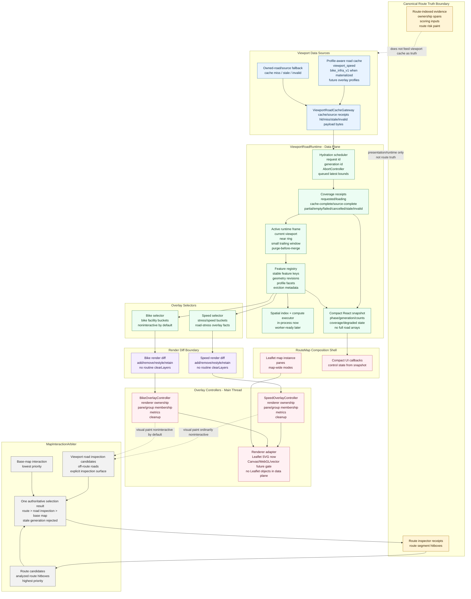

# Lanterne System Architecture Context


---


This document represents the canonical technical architecture of the Lanterne system.

Sources included:

• architecture
• analysis model
• design specifications
• architectural decision records


---

## Source File: docs/02-architecture/arch-001-data_model.md

# Lanterne Data Model

## Core Design Principle

The data model separates four concerns that must never be collapsed:

1. **Canonical identity** — what the route is geometrically
2. **Normalized facts** — what OSM and spatial analysis says about each slice
3. **Analysis outputs** — what Lanterne computed from those facts
4. **Ride-instance conditions** — what the route will feel like at a specific time

See `RECOMMENDED_SCHEMA_SHAPE.md` for the full migrated schema.

---

## Route Identity Layer

### `canonical_routes`
The authoritative geometry record for a route corridor. One row per unique road experience. Sources and variants attach to canonical routes — they do not create new ones.

### `imported_routes`
Source artifacts (RWGPS, GPX, RUSA, manual) resolved to a canonical route. Preserves provenance without polluting canonical identity.

### `external_route_catalog`
Routes fetched from external platforms before import resolution.

### `event_routes`
Ordered references from events onto canonical routes. Implements ADR-031 (multi-day events as ordered references onto canonical geometry).

---

## Analysis Layer

### `route_slices`
The atomic analysis unit (ADR-020). Physical subdivision of a canonical route into ~200–500m segments broken at every scoring-relevant semantic boundary. Ordered, stable, versioned.

### `route_slice_osm_facts`
Normalized OSM variables per slice (ADR-021, ADR-022). One row per slice per OSM extraction pass. Road environment, bike support, surface, terrain, infrastructure flags, and traceability fields.

### `route_slice_support_facts`
Corridor and proximity-derived support context (ADR-019). Settlement proximity, service proximity, water, food, lodging, medical, bailout access.

### `route_analysis_runs`
Container for any scoring pass. Tracks what version of logic ran over which route under which assumptions (stable_route or ride_instance family).

### `route_slice_analysis`
Per-slice analysis outputs for an analysis run. Route Safety Score inputs/trace for road exposure and crossing exposure, plus independent Traffic Index, Bike Support Index, Remoteness Index, Surface Quality Index, Fatigue Index, and Descent Risk Index projections.

### `route_analysis_summary`
Route-level rollup per analysis run. Fast retrieval for cards and summary views.

---

## Expedition Layer

### `route_expeditions`
Durable multi-day progress record for one rider on one route. Survives browser close, app crash, phone restart, GPS disable, and overnight charging. The system of record for where a rider is in a larger journey. See ADR-034 and DS-034.

### `route_expedition_windows`
Bounded detailed-analysis windows for one expedition. Defines what subsection of the full route receives full corridor analysis, heatmap rendering, and navigation context at any given time.

### `route_expedition_events`
Sparse append-only audit trail for expedition transitions and recovery checkpoints. Supports crash recovery and resume debugging without storing every GPS tick.

---

## Comparative Traffic Context Layer (schema exists, canonical mapper not yet built)

### `canonical_segments`
Stable directed segment identity. The long-lived entity that traffic behavior facts, cohort memberships, and future observations attach to. Keyed by surrogate UUID + deterministic identity scaffold. See ADR-033 and DS-013.

### `route_segment_instances`
Route-analysis-local mapping layer. One row per segment occurrence in a specific analysis pass. `canonical_segment_id` is nullable in v1 — set to `unresolved` until the canonical mapper is built.

### `segment_behavior_inputs`
Canonical per-segment traffic behavior facts. Keyed by `canonical_segment_id`. Not yet populated — deferred until canonical mapper exists.

### `traffic_behavior_baselines`
Regional and contextual comparison priors. Starts mostly empty; populates as baseline data is sourced.

### `cohorts`
Typed catalog of comparative groups a canonical segment can belong to. V1 seed rows for geography, urbanicity, and road class are present.

### `segment_cohort_memberships`
Many-to-many association between canonical segments and cohorts. Not yet populated — deferred until canonical mapper exists.

### `segment_observations`
Raw evidence landing zone for future Varia radar and rider-contributed data. Stub table — no ingestion pipeline yet.

---

## Planned (not yet migrated)

### `ride_instance_runs`
A route at a specific start time. Contextual overlay layer.

### `ride_instance_slice_conditions`
Time-aware environmental outputs per slice. Wind, temperature, precipitation, light state, glare flag, sun azimuth, moon phase live here — not in stable analysis tables.

### `route_slice_overrides`
Community/admin corrections to OSM-derived facts.

### `route_slice_effective_facts`
Materialized view combining OSM facts + support facts + approved overrides into current resolved truth for scoring.

---

## Hard Rules

**Do not collapse:**
- Slice geometry and OSM facts (separate tables)
- OSM facts and support/proximity facts (separate tables)
- Stable analysis and ride-time conditions (separate tables)
- Canonical identity and source provenance (separate tables)
- Expedition state and live ride session state (different durability contracts)

**Do not write:**
- Wind, temperature, precipitation into `route_slice_analysis`
- Itinerary or event semantics into `canonical_routes`
- Analysis outputs into `route_slices`
- Raw OSM tags as the only record — always normalize into columns
- Expedition-critical progress only into ephemeral browser memory

---

## Provenance

Routes may come from:
- RWGPS import
- GPX upload
- RUSA permanent routes
- Manual drawing
- Ride history ingestion
- Future external sources

Source provenance is preserved in `imported_routes` and never allowed to determine canonical route identity. Two routes representing the same road corridor resolve to the same canonical route regardless of source.


---

## Source File: docs/02-architecture/arch-002-system_architecture.md

# Lanterne System Architecture

## Overview

Lanterne analyzes cycling routes by combining:

- Route geometry
- OpenStreetMap data
- Elevation data
- Weather forecasts
- Astronomical calculations

The system transforms raw geographic data into **route intelligence for long-distance riders**.

---

## Core System Components

### 1. Route Ingestion

Routes enter the system through several pathways:

- Manual drawing
- RWGPS import
- GPX upload
- RUSA permanent route import
- Ride history ingestion

All routes are normalized into a canonical geometry format and resolved against existing canonical routes to avoid duplication (ADR-026).

---

### 2. Route Storage

Routes are stored with strict separation of:

- Canonical geometry identity
- Source provenance
- Route variants
- Slice-level analysis
- User save relationships

A route is primarily the line on the map and its canonical identity — not the source it came from or the analysis attached to it. See `DATA_MODEL.md`.

---

### 3. Analysis Engine

The analysis engine processes route geometry and generates indices on **small internal slices** (ADR-020), not large averaged segments.

**Stable analysis inputs:**
- OSM road attributes
- Elevation profiles
- Geographic context
- DOT/HPMS traffic data

**Stable analysis outputs:**
- Route Safety Score (raw road-exposure and crossing-exposure risk)
- Route Family Rank projection
- Remoteness Index
- Surface Quality Index
- Fatigue Index
- Descent Risk Index

**Contextual (ride-time) outputs — computed separately:**
- Wind (bearing-relative)
- Temperature
- Precipitation
- Light state (daylight / twilight / night)
- Sun glare risk
- Moonlight conditions

Stable and contextual outputs are never mixed. See ADR-023.

---

### 4. Environmental Modeling

Environmental conditions are modeled along the route timeline using estimated rider arrival time per slice (ADR-024).

Systems include:

- Solar position and sun glare detection (ADR-010)
- Moon phase and cloud cover (ADR-009)
- Weather forecast integration
- Time-of-day traffic multipliers

---

### 5. Expedition Layer

For ultra-distance routes (>400 miles, >8,000 GPX points, or >500 roads/mile density), Lanterne uses a four-layer expedition model (ADR-034):

```text
master route
    ↓
route expedition       ← durable multi-day progress record
    ↓
active analysis window ← bounded working set (default 250 miles)
    ↓
live ride session      ← transient runtime state


---

## Source File: docs/02-architecture/arch-003-project_map.md

# Lanterne Project Map

## Purpose

This document is a high-level map of the product so future work has a stable reference point.

It explains what Lanterne is, how data flows through it, where major systems live, how route intelligence is produced, and how the product should feel.

---

## 1. What Lanterne Is

Lanterne is a route intelligence system for long-distance cyclists.

It is built for people riding in conditions where ordinary route tools break down:

- Long rural routes
- Overnight rides
- Self-supported riding
- Bikepacking and gravel contexts
- Remote areas with no services
- Traffic-stress tradeoffs
- Weather and light transitions
- Multi-day and multi-week expeditions

Lanterne is not mainly a ride recorder. It is a route understanding and pre-ride decision tool — and for ultra-distance riders, a durable expedition companion.

---

## 2. Core User Promise

Before a rider leaves home, Lanterne should help them answer:

- How traffic-safe is this route?
- How remote is it really?
- How hard will it be?
- What will the weather and light feel like?
- Where are the dangerous or notable parts?
- How does this route compare to another option?

During a multi-day ride, Lanterne should also answer:

- Where was I when I stopped?
- What section am I analyzing next?
- How do I resume from here?

---

## 3. System Overview

Lanterne consists of six major layers:

1. **Ingestion**
2. **Storage**
3. **Analysis**
4. **Expedition model** (for ultra-distance routes)
5. **Presentation**
6. **Decision support**

---

## 4. End-to-End Flow

```
Route source
    ↓
Normalization / canonical route resolution
    ↓
Stored route + provenance
    ↓
Windowing decision (full vs expedition model)
    ↓
Stable route analysis (on active window)
    ↓
Ride-time conditions analysis
    ↓
Map / drawer / cue-sheet presentation
    ↓
Rider decision
```

**For ultra-distance routes (>400 miles / >8K GPX points / >500 roads/mile density):**

```
Master route
    ↓
Route expedition (durable multi-day progress)
    ↓
Active analysis window (bounded working set, default 250 miles)
    ↓
Live ride session (transient runtime state)
```

The rider thinks in terms of one route and one expedition. The system manages bounded windows internally without fragmenting route identity.

---

## 5. Ingestion Layer

Routes can enter the system from:

- Manual route drawing
- RWGPS URL import
- GPX upload
- RUSA permanent route import
- Ride-history ingestion
- Future: additional sources

**Ingestion goals:**
- Normalize geometry
- Preserve provenance
- Avoid duplicate routes via canonical resolution (ADR-026)
- Support derivations and saved versions

---

## 6. Storage Layer

The storage layer separates the core route from everything attached to it.

```
canonical_route         ← the line and its identity
    ├ imported_routes   ← where it came from
    ├ route_variants    ← meaningful branches
    ├ route_slices      ← atomic analysis units
    │    ├ osm_facts    ← extracted variables
    │    └ analysis     ← computed intelligence
    ├ rollups           ← rider-facing summaries
    └ user_routes       ← personal relationships
```

A route is primarily the line on the map and its canonical identity. It is not the source it came from, the full analysis payload, or the rider's save record.

---

## 7. Analysis Layer

The analysis engine operates on **small internal slices** (ADR-020), not giant averaged segments, because truth changes along the route.

### Analysis families

**Safety** (narrow definition — motor vehicle risk only)
- Route Safety Score
- Route Family Rank
- Traffic Index
- Bike Support Index

**Route Reality** (stable, not time-dependent)
- Remoteness Index
- Surface Quality Index
- Fatigue Index
- Descent Risk Index

**Conditions** (time-dependent, computed per ride plan)
- Wind
- Temperature
- Precipitation
- Light

**Light / Sky signals**
- UV halo
- Sun glare warning (ADR-010)
- Moon phase (ADR-009)
- Cloud overlay

---

## 8. Stable vs Contextual Analysis

| Layer | Derived from | Cached? |
|-------|-------------|---------|
| **Stable route intelligence** | Geometry, OSM, elevation, geography | Yes — long-lived |
| **Contextual ride-time intelligence** | Start time, pace, forecasts, solar/lunar timing | No — recomputed per ride plan |

This split reduces recomputation and keeps the architecture clean. Stable and contextual outputs live in separate tables and must never be mixed. See ADR-023.

---

## 9. Expedition Layer

For ultra-distance routes, the analysis working set is bounded. The expedition model (ADR-034) separates:

| Layer | Durability | Purpose |
|-------|-----------|---------|
| Master route | Permanent | Full journey identity |
| Route expedition | **Durable** — survives all interruptions | Multi-day progress record |
| Active analysis window | Session-scoped | Bounded working set (default 250 miles) |
| Live ride session | **Transient** | Current outing state |

**Windowing is triggered when any of these are true:**
- Route > 400 miles
- GPX > 8,000 points
- Estimated road density > 500 roads/mile

Expedition progress survives browser close, phone restart, GPS disable, and overnight charging. Live session state does not. These have different durability contracts by design.

---

## 10. Presentation Layer

The UI turns complex route analysis into something riders can read quickly.

**Main UI surfaces:**
- Map overlays and safety heatmap
- Analysis drawer and score explanation
- Cue-sheet / swipe views
- Ride conditions panel
- Saved route and history views
- Expedition resume card (on reopen when active expedition exists)

**Core presentation principles:**
- Show the important thing first
- Let users drill into detail
- Use icons where possible
- Use tooltips for short plain-English meaning
- Never turn the app into a data cockpit

---

## 11. Environmental Light System

One of the most distinctive parts of Lanterne is that it treats sun and moon as part of route intelligence.

**Day:** Sun icon, UV halo, glare detection (ADR-010)

**Night:** Moon phase, cloud cover overlay (ADR-009)

**Why this matters:** Long-distance riders care about darkness timing, glare windows, moonlit riding, exposed all-day sunlight, and overnight route character. This is part of what gives Lanterne its identity.

---

## 12. Product Modes / Profiles

Indices keep the same meaning across profiles. What changes is emphasis, ordering, explanatory framing, and weighting for presentation.

| Profile | Emphasis |
|---------|---------|
| Road | Route Safety Score, Route Family Rank, Traffic Index, Bike Support Index, Fatigue |
| Bikepacking / Gravel | Surface Quality, Remoteness, Fatigue, Temperature, Precipitation |

Urban may be added later but the center of gravity remains long-distance riding.

---

## 13. Decision Support Layer

The ultimate job of the system is to help riders make better choices:

- Choose one route over another
- Adjust start time to avoid glare or poor light
- Identify dangerous sections before encountering them
- Understand whether a route becomes harder at night
- Decide if a route is too remote for the current plan
- Resume a multi-day expedition after an overnight stop

---

## 14. Guiding Architectural Rules

1. Keep Route Safety Score narrow — motor-vehicle road exposure and crossing exposure only
2. Keep indices distinct from one another
3. Compute on small slices, present with human-readable summaries
4. Separate route identity from analysis output
5. Preserve provenance
6. Use structured columns for core concepts; JSON only for bounded flexibility
7. Prefer route intelligence over dashboard clutter
8. Build for riders who go long
9. Expedition state is durable; live session state is transient — never conflate them

---

## 15. Simplified Mental Model

```
A route is the line.
Sources tell where the line came from.
Analyses tell what Lanterne thinks about the line.
Conditions tell what the ride may feel like right now.
An expedition tells where the rider is in the larger journey.
The UI turns all of that into decisions a rider can act on.
```

---

## 16. What Makes Lanterne Special

Lanterne should feel like it was made by someone who has actually ridden:

- Into a brutal headwind
- Under a full moon at 2am
- Through dangerous glare at dawn
- On remote roads with no bailout for 80 miles
- Through the night when ordinary route tools stop helping
- On a TransAm or 1200K where losing context overnight means starting from scratch

That lived truth should remain visible in every major system decision.


---

## Source File: docs/02-architecture/arch-004-system_guide.md

# Lanterne System Guide

_Internal Documentation — Updated 2026-04-04 (v3.1-launch)_

> Superseded for safety scoring by [DS-015](./design/ds-015-safety_scoring_model.md) and the v4 safety update guide. V3.1 references to composite A-F grades, 0-100 score shells, route-level crossing caps, and hazard/time-of-day score modifiers are lineage only.

---

## 1. Overview

### What Lanterne Is

Lanterne is a mobile-first Progressive Web App that provides cyclists with segment-level safety analysis of their routes. Users upload a GPX file or create a route on-map, and the platform analyzes road exposure and crossing exposure — speed, traffic volume, shoulders, bike infrastructure, curvature, and bounded crossing conflicts — producing raw route risk, Route Family Rank, route risk paint, cue sheet, and decision-support surfaces. Railroad crossings and bridge hazards are detected and shown as a separate hazard layer.

### The Problem

Cyclists lack granular, road-level safety data. Existing tools show bike lanes but don't quantify risk. Lanterne answers: "How dangerous is this specific road, given real traffic data, infrastructure, and hazard exposure?"

### Core Workflow

```
GPX Upload → Corridor Fetch → Road Matching → Data Enrichment → Hazard Detection → Safety Scoring → Visualization
```

### What Makes It Unique

1. **Client-side analysis** — all computation runs in the browser; infrastructure cost is ~$0.01 per cold-cache route.
2. **Multi-source data fusion** — OSM road geometry + federal HPMS traffic + state DOT attributes + micro-hazard detection from OSM tags.
3. **Shared geographic tile caching** — every user's analysis warms a global tile cache for future users in the same geography.
4. **Truth-segment scoring** — scoring operates on canonical segments broken at every semantic boundary, not visual approximations.
5. **Two-pass forensic matching** — coarse matching followed by targeted forensic re-analysis of suspicious zones.

---

## 2. Architecture

### Computation Model

All CPU-intensive work — GPX parsing, spatial indexing, road matching, forensic analysis, scoring, heatmap building, cue generation — runs in the browser. The backend is a data-and-proxy layer: it stores caches/user data and proxies rate-limited external APIs. No analysis runs server-side.

### Component Map

```
┌─────────────────────────────────────────────────────────────────┐
│  USER DEVICE (Browser)                                          │
│                                                                 │
│  ┌─ Ingestion ─────────────────────────────────────────────┐    │
│  │  GPX Parser (gpx.ts) → Route Hash (route-cache.ts)      │    │
│  └──────────────────────────────────────────────────────────┘    │
│  ┌─ Corridor Builder ──────────────────────────────────────┐    │
│  │  Tile Keys (corridor.ts) → Cache Lookup → Overpass Fetch│    │
│  │  → CorridorGraph adjacency model (corridor-graph.ts)    │    │
│  └──────────────────────────────────────────────────────────┘    │
│  ┌─ Analysis Engine (Two-Pass) ────────────────────────────┐    │
│  │  Spatial Grid Index → Window Matcher → Pass 1 Capture   │    │
│  │  → Forensic Matcher → Boundary Refinement (Pass 2)      │    │
│  │  → Transition Chain → Matcher Invariant Checks          │    │
│  └──────────────────────────────────────────────────────────┘    │
│  ┌─ Enrichment ────────────────────────────────────────────┐    │
│  │  HPMS Client → DOT Client → Hazard Detector             │    │
│  │  POI Subsystem (independent parallel stream)             │    │
│  └──────────────────────────────────────────────────────────┘    │
│  ┌─ Scoring & Output ─────────────────────────────────────┐     │
│  │  Safety Scoring → Heatmap Builder → Cue Generation      │    │
│  │  → Map Card Store → Corridor Reveal Animation           │    │
│  └──────────────────────────────────────────────────────────┘    │
│  ┌─ Route Editing ─────────────────────────────────────────┐    │
│  │  Detour System → CorridorGraph local pathfinding         │    │
│  │  → OSRM routing → Undo/Redo stack                       │    │
│  └──────────────────────────────────────────────────────────┘    │
│  ┌─ Navigation Engine ─────────────────────────────────────┐    │
│  │  GPS duty cycling → Corridor snapping → Cue detection    │    │
│  │  → Off-route detection                                   │    │
│  └──────────────────────────────────────────────────────────┘    │
│  ┌─ Presentation ─────────────────────────────────────────┐     │
│  │  Leaflet Map │ Safety Card │ Cue Sheet │ Lanterne Orb   │    │
│  │  Analysis Progress │ Drawers │ Inspector Panels          │    │
│  └──────────────────────────────────────────────────────────┘    │
└───────────────────┬─────────────────────────────────────────────┘
                    │ Supabase JS SDK
┌───────────────────▼─────────────────────────────────────────────┐
│  EDGE FUNCTIONS (9 total)                                       │
│  overpass-proxy (dual-server failover)                          │
│  hpms-proxy │ dot-proxy │ dot-aadt-proxy                       │
│  check-subscription │ create-checkout │ customer-portal         │
│  admin-users │ admin-manage                                     │
└───────────────────┬─────────────────────────────────────────────┘
                    │
┌───────────────────▼─────────────────────────────────────────────┐
│  DATABASE (Lovable Cloud / Supabase)                            │
│  ┌─ Cache Layer ───────────────────────────────────────────┐    │
│  │  osm_road_tile_cache (0.05° grid, 2yr TTL)                       │    │
│  │  hpms_osm_road_tile_cache (0.05° grid + state code, 1yr TTL)     │    │
│  │  route_cache (hash-keyed, versioned via data_version)    │    │
│  └─────────────────────────────────────────────────────────┘    │
│  ┌─ User Data ─────────────────────────────────────────────┐    │
│  │  route_history │ profiles │ user_roles                   │    │
│  │  user_events │ user_usage                                │    │
│  └─────────────────────────────────────────────────────────┘    │
│  ┌─ Model & Safety ───────────────────────────────────────┐     │
│  │  safety_model_versions │ safety_model_factors            │    │
│  │  route_hazard_detections │ route_perf_events             │    │
│  └─────────────────────────────────────────────────────────┘    │
│  ┌─ Payments ──────────────────────────────────────────────┐    │
│  │  subscription_grants │ promo_codes │ promo_redemptions    │    │
│  └─────────────────────────────────────────────────────────┘    │
│  Auth (Supabase Auth)                                           │
└─────────────────────────────────────────────────────────────────┘
                    │
┌───────────────────▼─────────────────────────────────────────────┐
│  EXTERNAL APIs                                                  │
│  Overpass API (primary + fallback servers) — OSM road geometry   │
│  HPMS Federal API — traffic volumes (AADT)                      │
│  State DOT APIs (22 verified states) — road attributes          │
│  OSRM (public demo server) — turn-by-turn routing               │
│  Nominatim — geocoding search                                   │
│  Open-Elevation — elevation profiles (unreliable)               │
│  Stripe — subscription payments                                 │
└─────────────────────────────────────────────────────────────────┘
```

### Caching Architecture

| Cache | Key | TTL | Scope | Contents |
|-------|-----|-----|-------|----------|
| `osm_road_tile_cache` | 0.05° lat/lon grid (SW corner) | ~2 years | Global (shared across all users) | OSM road geometry + tags as JSON |
| `hpms_tile_cache` | 0.05° grid + state code | ~1 year | Global | HPMS traffic volume segments |
| `route_cache` | Deterministic hash (start/end coords rounded to ~11m, distance, 5 sampled points) | Until `data_version` bump | Global | Completed scoring results (not road geometry — too large) |

**Version invalidation:** A `data_version` integer (currently 2) is stored with each cache entry. Bumping this constant in `route-cache.ts` transparently invalidates all stale entries without migration.

---

## 3. Analysis Pipeline

### Pre-Analysis: Geometry Scan

Before matching begins, two preparatory scans run:

- **Track Geometry Zones** (`track-geometry-zones.ts`): Identifies curves, grades, and geometric features along the GPX track that affect matching behavior.
- **Cue Hint Zones** (`cue-hint-zones.ts`): Pre-samples areas near turns and intersections for higher-precision matching in cue-relevant regions.

### Step 1 — GPX Ingestion

**Purpose:** Parse raw GPX XML into structured points.
**Input:** `.gpx` file via drag-drop or file picker.
**Output:** `GpxRoute { points[], totalDistanceMi, cuePoints[], bounds }`.
**Code:** `gpx.ts → parseGpx()`.

### Step 2 — Route Hashing & Cache Check

**Purpose:** Generate a deterministic cache key; skip analysis on hit.
**Input:** Parsed points + total distance.
**Output:** Hash string. On cache hit (same hash + current `data_version`), scoring results are returned immediately — skip to Step 12.
**Code:** `route-cache.ts → computeRouteHash()`, `getCachedRoute()`.

### Step 3 — Corridor Tile Generation

**Purpose:** Divide route into a grid of independently fetchable tiles.
**Input:** Route points (sampled every `points.length/500` entries).
**Output:** Array of tile keys (SW corner coordinates at 0.05° intervals).
**Code:** `corridor.ts → routeTileKeys()`.
**Note:** TILE_SIZE of 0.05° ≈ 3.5mi lat × 2.5mi lon at 39°N.

### Step 4 — Tile Cache Lookup

**Purpose:** Batch-query database for already-cached tiles.
**Input:** Tile keys.
**Output:** Cached road geometry for warm tiles; list of cold tile keys.
**Code:** `corridor.ts → getCachedTiles()` (single Supabase batch query).

### Step 5 — Overpass Fetch

**Purpose:** Download OSM road geometry for uncached tiles.
**Input:** Cold tile keys.
**Output:** `SpeedRoad[]` with tags (name, highway type, maxspeed, surface, lanes, cycleway, shoulder).
**Code:** `corridor.ts → fetchTileWithRetry()` via `overpass-proxy` edge function. Dual-server failover with automatic retry. Results upserted to `osm_road_tile_cache` asynchronously. Roads are deduplicated by OSM way ID across tile boundaries.

### Step 5b — Corridor Graph Construction

**Purpose:** Build a client-side adjacency model for local pathfinding.
**Input:** All fetched corridor roads.
**Output:** `CorridorGraph { nodes (intersections), edges (road segments) }`.
**Code:** `corridor-graph.ts → buildCorridorGraph()`. Built once per corridor load; reused for all detour evaluations without external API calls.

### Step 6 — Spatial Indexing

**Purpose:** Enable O(1) road lookups during matching.
**Input:** Deduplicated corridor roads.
**Output:** `RoadGridIndex` — a spatial hash grid with 220m cells.
**Code:** Built inline in `route-analysis.ts`.
**Note:** The indexer interpolates along road segments in sub-cell steps to ensure every cell containing road geometry is populated, preventing "misses" where a segment crosses a cell without a vertex..

### Step 7 — Road Matching (Pass 1: Road Capture)

**Purpose:** Snap each GPX sample to the nearest corridor road.
**Input:** GPX points + spatial index.
**Output:** Ordered sequence of matched road segments with transition points.
**Code:** `route-analysis.ts` (Pass 1), `window-matcher.ts → windowMatchRoads()`.

**Matching rules:**
- Two-tier rejection threshold: **60m** for unnamed roads/paths; **~100m** for named motor roads (secondary, residential, etc.)
- Rejection triggers a metadata-aware null-gap fill that prioritizes named neighbors (Named motor > Unnamed motor > Named path > Unnamed path)
- **Suspicion scan** identifies incoherent zones: non-touching handoffs, null gaps, weak margins, heading discontinuities

### Step 8 — Forensic Re-Analysis

**Purpose:** Surgically re-analyze suspicious zones with dense sub-sampling.
**Input:** Suspicious zone boundaries from Pass 1.
**Output:** Corrected road assignments in those zones.
**Code:** `forensic-matcher.ts → runForensicPipeline()`.
**Note:** Uses reduced continuity bias (0.05) and "Synthetic Sample Anchors" to represent short segments between 200m samples. Only suspicious zones are re-analyzed — not the entire route.

### Step 9 — Boundary Refinement (Pass 2)

**Purpose:** Align road transitions to real intersections; attach traffic data.
**Input:** Matched road sequence from Pass 1 + forensic corrections.
**Output:** Refined transitions, HPMS traffic volumes, DOT road attributes per segment.
**Code:**
- `boundary-refinement.ts → computeBoundaryRefinements()`, `applyBoundaryRefinements()`
- `boundary-snapping.ts → snapBoundaries()`
- `transition-chain.ts → computeTransitionChain()`
- `hpms.ts` (via `hpms-proxy`) — federal traffic volumes
- `dot-enrichment.ts` (via `dot-proxy`/`dot-aadt-proxy`) — state DOT road attributes

**DOT coverage:** State DOT AADT is authoritative; 22 verified states covering ~65% of US miles. Matching uses geometry-aware rules: 50m for line segments, 200m for point-geometry stations.

### Step 10 — Hazard Detection

**Purpose:** Identify micro-hazards from OSM tags (no additional Overpass calls).
**Input:** Corridor roads already in memory.
**Output:** `SegmentHazard[]` with type and severity (1–3).
**Code:** `hazards.ts → detectHazardsFromRoads()`.

**Detected hazard types:**
| Hazard | Severity | Detection |
|--------|----------|-----------|
| Railroad crossing | 2–3 | `railway=level_crossing` |
| Metal grate bridge | 3 | `bridge ∈ {yes, movable} + surface=grate/grid/metal_grid` |
| Metal plate bridge | 2 | `bridge ∈ {yes, movable} + surface=metal/steel` |
| Cattle grid | 2 | `barrier=cattle_grid` |
| Single-lane underpass | 2 | `tunnel=yes + lanes=1 or maxwidth<4` |
| Covered bridge | 1 | `bridge ∈ {yes, movable} + (covered=yes or bridge:structure=covered)` |
| No-shoulder bridge | 2 | `bridge ∈ {yes, movable} + no cycling infra + narrow` |

### Step 11 — Segment Scoring - OUT OF DATE - SEE v4 UPDATE DOC

**Purpose:** Compute per-segment and aggregate route risk.
**Input:** Enriched truth segments.
**Output:** `TotalRouteRisk`, `RouteRiskPerMile`, `CrossingRiskPerEvent`, score trace, confidence, and provenance summary. Legacy `SafetyScore` (0-100) and `LetterGrade` (A+ to F) are not current canonical output.
**Code:** `safety-scoring.ts → computeRouteSafetyScore()`.

**V3.1-Launch Scoring Model:**

The core risk for each continuous segment is:

```
SliceRisk = SliceMiles × (0.60 × SpeedFactor + 0.40 × TrafficFactor) × InfraFactor × ShoulderFactor
```

Where SpeedFactor uses a piecewise-linear breakpoint table (≤20→0.50 through 55+→6.20), TrafficFactor uses a 6-step AADT-per-lane ladder with a fallback evidence chain, InfraFactor is multiplicative (protected 0.50, buffered 0.68, painted 0.82, none 1.00), and ShoulderFactor applies only when speed ≥ 30 and no bike facility exists.

**Crossing risk contribution** replaces the former left-turn penalty: `min(0.75, 0.05 × √(SpeedFactor × TrafficFactor) × Width × Control × Movement)`. Crossing share is diagnostic; it does not cap additive route risk.

**Excluded from headline score:** rail crossings, bridge hazards, time-of-day traffic, critical stretch penalties, weather, surface, fatigue. These are report-only layers.

The aggregate `RouteRiskPerMile` remains raw arithmetic model output. Route Family Rank may summarize it for riders; a 0-100 logistic shell is not canonical.

### Step 11b — Post-Analysis Validation

**Purpose:** Verify matching quality and emit diagnostics.
**Code:**
- `matcher-invariants.ts → runInvariantChecks()` — validates matched sequence consistency
- `analysis-diagnostics.ts → emitAnalysisOutputDiag()` — summary diagnostics
- `divergence-audit.ts → emitDivergenceAudit()` — first-divergence diagnostic, contamination audit

### Step 12 — Cue Sheet Generation

**Purpose:** Produce turn-by-turn navigation instructions.
**Input:** Matched road sequence with heading changes.
**Output:** `CueEntry[]` with road names, distances, turn directions.
**Code:** `topology-cues.ts → generateTopologyCues()`, `cue-hint-zones.ts`.

### Step 13 — Cache Write & History Save

**Purpose:** Persist results for future cache hits and user recall.
**Input:** Scoring result + route hash.
**Output:** Upsert to `route_cache` (if match quality sufficient). Save to `route_history` for authenticated user.
**Code:** `route-cache.ts → setCachedRoute()`.
**Note:** Road geometry is NOT stored in route_cache (was causing 33MB+ payloads). Only scoring results are cached.

### Step 14 — Visualization

**Input:** Truth segments, safety result, cue sheet.
**Output:** route risk paint, viewport speed overlay, Route Family Rank card, cue sheet table, corridor reveal animation.
**Code:** `heatmap/builder.ts`, `RouteMap.tsx`, `useCorridorReveal.ts`.

**Map paint architecture:** Selected-route paint should use canonical route-risk trace once available. The viewport heatmap / road-stress overlay may use speed-band display segments with zoom-banded merging strategies (Low ≤12, Mid 13–14, High ≥15). A Strava-style overlap rule (±1 coordinate extension) eliminates visual seams from browser rasterization.

**Corridor reveal:** After analysis completes, a 2.2-second staged animation illuminates nearby corridor roads (near → far → hold → fade) before leaving only the selected route.

### Parallel: POI Enrichment

POI enrichment is **not sequential** — it runs as an independent parallel streaming pipeline.

**Code:** `pois/index.ts` and submodules.
**Architecture:** Non-blocking, category-independent batching via Overpass with a 90-day tile cache. Uses a Centerline-First Scheduler with two-pass sweep. Categories yielding 0 results after 3 batches are auto-terminated. Max 2 concurrent Overpass requests. POIs are filtered by progress distance to correctly handle out-and-back/loop routes.

### Parallel: IO Metrics

Throughout the pipeline, `IoMetrics` (in `route-analysis.ts`) tracks: corridor tiles total/cached/fetched, enrichment fetch counts, forensic zone counts, HPMS/DOT tile cache hit rates, and log event counts by category. These are emitted as `[IO-BREAKDOWN]` and `[PERF-SUMMARY]` console logs (gated behind `IO_DEBUG` and `PERF_DETAIL` flags).

---

## 4. Data Model

| Table | Purpose | Key Fields |
|-------|---------|------------|
| `osm_road_tile_cache` | Cached Overpass road geometry by 0.05° grid tile | `tile_key`, `roads` (JSONB), `fetched_at` |
| `hpms_tile_cache` | Cached HPMS traffic data by tile + state | `tile_key`, `state_code`, `data` (JSONB) |
| `route_cache` | Cached analysis results by route hash | `route_hash`, `safety_result` (JSONB), `data_version`, `hit_count`, `last_accessed` |
| `route_history` | Per-user saved routes and detours | `user_id`, `route_data`, `name`, `created_at` |
| `safety_model_versions` | Scoring model version history | `id`, `version`, `description`, `created_at` |
| `safety_model_factors` | Per-version factor weights | `version_id`, `factor_name`, `weight` |
| `route_hazard_detections` | Micro-hazard occurrences per analysis | `route_id`, `hazard_type`, `location`, `severity` |
| `route_perf_events` | Analysis performance telemetry | `route_hash`, `stage`, `duration_ms` |
| `profiles` | User profile data | `id` (refs `auth.users`), `email`, `display_name` |
| `user_roles` | Role assignments (admin/moderator/user enum) | `user_id`, `role` |
| `user_events` | Analytics events (fire-and-forget) | `user_id`, `event_type`, `payload`, `created_at` |
| `user_usage` | Monthly usage counters | `user_id`, `month`, `gpx_uploads`, `logins` |
| `subscription_grants` | Manual admin subscription grants | `user_id`, `granted_by`, `tier` |
| `promo_codes` | Promotional codes | `code`, `tier`, `expires_at` |
| `promo_redemptions` | Promo code redemption tracking | `user_id`, `code`, `redeemed_at` |
| `route_expeditions` | Durable multi-day expedition progress per user/route | `user_id`, `route_id`, `expedition_status`, `last_confirmed_route_mile`, `active_window_index` |
| `route_expedition_windows` | Bounded analysis windows per expedition | `expedition_id`, `window_index`, `core_start_mile`, `core_end_mile`, `load_start_mile`, `load_end_mile`, `window_status` |
| `route_expedition_events` | Sparse audit trail for expedition transitions | `expedition_id`, `event_type`, `route_mile`, `point_index` |
| `canonical_segments` | Stable directed segment identity (mapper not yet built) | `id`, `start_anchor_key`, `end_anchor_key`, `semantic_signature`, `is_active` |
| `route_segment_instances` | Route-local segment occurrences (canonical_segment_id unresolved in v1) | `route_id`, `segment_index`, `canonical_segment_id`, `match_method` |
| `cohorts` | Typed comparative group catalog | `cohort_type`, `cohort_key`, `name` |
| `traffic_behavior_baselines` | Regional traffic behavior comparison priors (mostly empty) | `geography_level`, `geography_key`, `baseline_passes_per_mile` |

**Cache sharing:** `osm_road_tile_cache` and `route_cache` are anonymous and global. User A fetching tiles in Austin warms the cache for User B riding through Austin months later. `route_history` is per-user. Expedition tables are per-user.

---

## 5. Features

### Core Analysis

| Feature | Description | Key Code |
|---------|-------------|----------|
| **Safety Scoring** | Independent road-risk and crossing-risk outputs, product-calibrated combined route risk, confidence, provenance, and Route Family Rank projection. Rail, critical stretch, time-of-day traffic, weather, surface, fatigue, and remoteness are report/display layers unless promoted by a future score-model change. | `safety-scoring.ts`, `safety-constants.ts` |
| **Map Paint** | Route Risk Paint for analyzed routes plus speed-colored viewport overlays for surrounding roads | `heatmap/builder.ts`, `RouteMap.tsx` |
| **Corridor Analysis** | Fetches and indexes the broader road network; builds CorridorGraph for local pathfinding | `corridor.ts`, `corridor-graph.ts` |
| **Micro-Hazard Detection** | 7 hazard types from OSM tags (railroad crossings, metal grate bridges, cattle grids, covered bridges, etc.) | `hazards.ts` |
| **Forensic Matching** | Dense sub-sampling re-analysis of suspicious zones | `forensic-matcher.ts` |

### Route Interaction

| Feature | Description | Key Code |
|---------|-------------|----------|
| **Detour Editing** | Drag-to-reroute with ghost handles (0.5mi), 6–8 candidate waypoints, undo/redo, brevet compliance | `detour-routing.ts`, `useDetourHistory.ts`, `DetourDeltaPanel.tsx` |
| **Route Creation** | Tap-to-place waypoints with live OSRM routing, real-time distance/elevation metrics | `useRouteCreation.ts` |
| **Cue Sheet** | Turn-by-turn from topology-based cue generation, with print/export | `topology-cues.ts`, `CueSheet.tsx` |
| **POI Enrichment** | ~20 categories (gas, food, water, bike shops) with detour distances and budget allocation | `pois/index.ts`, `PoiToggles.tsx` |
| **Route History** | Per-user saved/analyzed routes and detours | `RouteHistory.tsx`, `route_history` table |

### Navigation & GPS

| Feature | Description | Key Code |
|---------|-------------|----------|
| **GPS Tracking** | Live blue dot with accuracy circle and cumulative distance | `useGpsTracking.ts` |
| **GPS Look-Ahead** | Predictive road/POI loading ahead of GPS position | `useGpsLookAhead.ts` |
| **Navigation Engine** | Corridor-locked navigation with GPS duty cycling, corridor snapping, cue detection, off-route detection | `navigation/engine.ts` |

### Platform

| Feature | Description | Key Code |
|---------|-------------|----------|
| **Onboarding** | Multi-row swipeable flow with inline auth, safety-summary mockup, feature showcase | `OnboardingGate.tsx` |
| **Subscription Gating** | Free vs Nerd tier with Stripe checkout, admin grants, promo codes | `SubscriptionGate.tsx`, `TierPicker.tsx` |
| **PWA Install** | Home Screen prompt, standalone refresh button (iOS-only) | `AddToHomeScreenPrompt.tsx`, `StandaloneRefreshButton.tsx` |
| **Backend Resilience** | Auth timeout → cached subscription fallback → banner with retry | `AuthContext.tsx`, `BackendUnavailableBanner.tsx` |
| **Brevet Mode** | Randonneuring control checkpoint constraints for detour compliance | `brevet.ts`, `brevet-constraints.ts` |

---

## 6. UI System

### State Architecture

| System | Purpose | Code |
|--------|---------|------|
| **AuthContext** | User session, subscription status, backend-down detection, cached fallback (4hr TTL) | `contexts/AuthContext.tsx` |
| **LayoutContext** | Drawer occupancy state: `leftDrawerOpen`, `rightDrawerOpen`, `bottomDrawerOpen`, `topDrawerOpen`, `anyRightPanelOpen`, `anyDrawerOpen`, `bottomHeight` (collapsed/category/full) | `contexts/LayoutContext.tsx` |
| **UnitsContext** | Imperial/metric preference | `contexts/UnitsContext.tsx` |
| **LanternState** | Visual state machine (idle/analyzing/complete) with one-shot feedback pulses (route-loaded, route-edited, detour-applied, score-complete). Drives CSS glow/flicker classes. | `hooks/useLanternState.ts` |
| **Orb Control Router** | Maps orb gestures to actions — separate from visual state | `lib/orb-control-router.ts` |
| **Map Card Store** | Centralized overlay manager with standardized dismissal and stacking | `lib/map-card-store.ts` |

### Z-Index Layer Model

The UI uses a 5-tier z-index system defined in `ui-layers.ts`:

| Tier | Range | Examples |
|------|-------|---------|
| 0 — Map | 0–100 | Map canvas, MapIdleOverlay |
| 1 — Floating controls | 200–1020 | RoadInfoHud, MapControls, instrument tags, PoiStatusPanel |
| 2 — Drawers | 500–630 | Bottom/side/top drawers and their handles |
| 3 — Elevated floating | 700–800 | DetourDeltaPanel, AnalysisProgress, LanterneOrb |
| 4 — Overlays | 900–950 | Mismatch overlay, InstallNudgeBubble |
| 5 — Modals | 9000–9500 | SpotlightOverlay, AddToHomeScreenPrompt |

### Map System

Built on **Leaflet** via `RouteMap.tsx` (~3,000 lines — see Technical Debt). Layers include: base tiles, speed-colored heatmap overlays, GPX route polyline, POI markers (clustered via `usePoiClustering.ts`), ghost edit handles, detour candidates, GPS blue dot, corridor reveal animation, and road info cards.

### Drawer Architecture

- **TopActionDrawer** — persistent "liquid glass" top bar: road stats, search, upload GPX, create route
- **RouteAndAnalysisDrawer** — primary bottom drawer: analysis results, route history, POI toggles
- **CueDrawer** — cue sheet bottom drawer
- **StopsLayersDrawer** — POI category/layer settings
- **RouteBottomDrawer** — POI peek/expanded (note: operates outside centralized `activeDrawer` state)

### Analysis Progress

`AnalysisProgress.tsx` implements a paced progress engine that decouples UI progress from backend milestones. It enforces minimum dwell times per stage band, runs a burndown animation at completion, and auto-retracts. Designed to feel premium regardless of actual analysis speed.

### Debug/Inspection Panels

`SegmentInspectorDrawer`, `CandidatesDrawer`, `FragmentsDrawer`, `RawRoadsDrawer`, `CandidateAuditPanel`, `TurnPointAuditPanel`, `MatchedRoadSequencePanel`, `RawNearbyRoadsAuditPanel`, `FragmentContinuityPanel` — all gated behind debug flags.

---

## 7. Performance & Scaling

| Lever | Mechanism | Impact |
|-------|-----------|--------|
| **Tile cache reuse** | Global 0.05° grid, ~2-year TTL | Overpass calls approach zero for populated US regions |
| **Route cache reuse** | Hash-keyed, versioned | Popular routes (club rides, Strava segments) analyzed once globally |
| **Client compute** | Zero server CPU for analysis | Cost scales with users' devices, not infrastructure |
| **Spatial hash grid** | 220m cells with segment interpolation | O(1) road lookups; sub-minute analysis on mobile devices |
| **POI streaming** | Non-blocking category-independent batching, auto-termination | No single category blocks others; watchdog timer prevents hangs |
| **Corridor cap** | MAX_CORRIDOR_TILES = 200 | Prevents runaway fetches on transcontinental routes |
| **Adaptive corridor** | Density-based width reduction (250m → 60m) | Urban routes shrink corridor to prevent memory exhaustion; reuses guardrail density logic |
| **Road density guardrail** | 500 roads/mile normalized threshold | Warning-only; never blocks results from rendering |
| **Analysis timeout** | MAX_ANALYSIS_RUNTIME_MS = 120,000 | Client-side watchdog prevents infinite analysis |
| **GPX limit** | MAX_GPX_POINTS = 50,000 | Prevents browser memory exhaustion |

**Cost at scale:**
- Per cold-cache route: ~$0.01 (edge function invocations + Supabase writes)
- 10K MAU: ~$50–80/mo (Supabase Pro + edge function overages)
- 100K MAU: Primary cost is Supabase storage growth (osm_road_tile_cache); self-hosted Overpass eliminates external API dependency

**Primary bottleneck:** Overpass API rate limits for cold geographic regions. Mitigated by tile cache (each tile fetched at most once every ~2 years). Escape valve: self-hosted Overpass instance.

---

## 8. Admin Tools

| Tool | Location | Purpose |
|------|----------|---------|
| **User Management** | `/admin` | List users, grant/revoke subscriptions, manage promo codes |
| **Safety Model Console** | `/admin/safety-model` | Edit scoring factor weights per version, preview impact via Route Simulator |
| **Hazard Dashboard** | `/admin/safety-model` | Track micro-hazard frequency from `route_hazard_detections` for calibration |
| **Model Versioning** | `/admin/safety-model` | Version scoring models via `safety_model_versions` + `safety_model_factors` |
| **Performance Dashboard** | `PerfDashboard.tsx` | Analysis timing telemetry from `route_perf_events` |
| **Dev Tuning Panel** | Floating panel (debug flag gated) | Runtime parameter tuning for developers |
| **Debug Flags** | `localStorage.DEBUG_FLAGS` | 13 flags: `PERF_DETAIL`, `BOUNDARY_DEBUG`, `FORENSIC_DEBUG`, `ROAD_MATCH_DEBUG`, `SHORT_ROAD_DEBUG`, `OVERLAY_DEBUG`, `IO_DEBUG`, `SCORING_DEBUG`, `UI_DEBUG`, `BIKE_INFRA_DEBUG`, `USE_TOPOLOGY_CUES`, `TRANSITION_DEBUG`, `DRY_RUN_SIGNUP` |
| **Dry-Run Signup** | Admin Settings tab | Intercepts auth calls, logs to console instead of committing to database |

---

## 9. Limitations

| Constraint | Value | Notes |
|------------|-------|-------|
| Max GPX points | 50,000 | Hard limit |
| Max route length | 500 miles (soft) | Routes above this trigger windowed expedition mode (ADR-034); hard cap removed |
| Max corridor tiles | 200 | ~550 km² coverage cap |
| Analysis timeout | 120 seconds | Client-side watchdog |
| Overpass API | Public, no SLA | Dual-server failover; tile cache is primary mitigation |
| OSRM | Public demo server, no SLA | Used for detours and route creation only |
| Supabase query limit | 1,000 rows default | Must paginate or use RPC for large result sets |
| HPMS/DOT coverage | ~22 US states | ~65% of US miles; remaining states fall back to OSM speed tags |
| Open-Elevation | Public, unreliable | Elevation data may be unavailable |
| Nominatim | 1 req/sec, requires User-Agent | Geocoding rate limit |

### Known Technical Debt

- `RouteMap.tsx` is a ~3,000-line monolith with 70+ props managing all modes via internal conditionals
- Route registration / Supabase history-save logic is duplicated across 4 callsites
- `RouteBottomDrawer` operates outside the centralized `activeDrawer` / LayoutContext governance
- Right-side panel visibility managed by 6 independent booleans instead of a discriminated union
- `ManualSpanRange` type duplicated in `gpx.ts` and `useRouteCreation.ts`
- Stale root-level `detour-routing.ts` file persists alongside the canonical `src/lib/detour-routing.ts`
- `onReanalyze` prop in `RouteAndAnalysisDrawer` is a dead prop (not wired to a handler)

---

## 10. Future Extensions

| Extension | Architectural Hook |
|-----------|-------------------|
| **AI route optimization** | Scoring engine + CorridorGraph + OSRM are composable; an optimizer can iterate detour candidates against the scoring function without external dependencies |
| **Predictive crash modeling** | `route_hazard_detections` accumulates micro-hazard data globally; ML models can train on this corpus |
| **Community hazard reports** | `hazards.ts` and `_future/hazards.ts` contain schema scaffolding for Waze-style hazard confirmations |
| **Segment analytics** | Truth segments + `route_perf_events` enable per-road aggregate risk statistics across all users |
| **Safety factor tuning** | `safety_model_versions` + `safety_model_factors` + admin console already support versioned weight iteration without code changes |
| **Turn-by-turn navigation** | `navigation/engine.ts` is a full corridor-locked engine with GPS duty cycling, corridor snapping, cue detection, and off-route detection — ready for UI integration |
| **Expedition resume UX** | `route_expeditions` table exists; Phase 1 plumbing shipped; Phase 2 resume card with mismatch handling is next |
| **Windowed long-route analysis** | ADR-034 defines the four-layer model (master route → expedition → window → session); window trigger logic and expedition creation are in Phase 1 |
| **Local rerouting** | `CorridorGraph` adjacency model enables graph-based detour generation without any external API call |
| **International expansion** | Tile-based architecture is geography-agnostic; HPMS/DOT enrichment degrades gracefully to OSM-only outside the US |


---

## Source File: docs/02-architecture/arch-004-system_guide_v4_safety_score_update.md

# Lanterne System Guide

_Internal Documentation — Updated 2026-04-04 (v4, safety-model update)_

---

## 1. Overview

### What Lanterne Is

Lanterne is a mobile-first Progressive Web App that provides cyclists with segment-level safety analysis of their routes. Users upload a GPX file or create a route on-map, and the platform analyzes road exposure and crossing exposure — speed, traffic, shoulder and bike operating space, curvature, and bounded crossing conflicts — producing raw route risk, Route Family Rank, route risk paint, cue sheet, and decision-support surfaces. Route-specific hazards are displayed separately unless promoted by a future score-model change.

### The Problem

Cyclists lack granular, road-level safety data. Existing tools may show bike lanes or route lines, but they do not explain how dangerous a specific road segment or crossing is likely to be.

### Core Workflow

```text
GPX Upload → Corridor Fetch → Road Matching → Data Enrichment → Hazard Detection → Safety Scoring → Visualization
```

### What Makes It Unique

1. **Client-side analysis** — all computation runs in the browser; infrastructure cost stays low because the user’s device is the compute engine.
2. **Multi-source data fusion** — OSM road geometry + federal HPMS traffic + state DOT attributes + imported route-source metadata such as RWGPS surface when available.
3. **Shared geographic tile caching** — every user warms global caches for others in the same geography.
4. **Truth-segment scoring** — scoring operates on canonical internal route slices rather than purely visual map segments.
5. **Two-pass forensic matching** — coarse matching followed by targeted re-analysis in suspicious zones.
6. **Narrow safety definition** — the canonical Route Safety Score is limited to motor-vehicle strike exposure and likely severity, not a kitchen-sink route score.

---

## 2. Architecture

### Computation Model

All CPU-intensive work — GPX parsing, spatial indexing, road matching, forensic analysis, scoring, route paint / viewport overlay building, cue generation — runs in the browser. The backend is a data-and-proxy layer: it stores caches/user data and proxies rate-limited external APIs. No analysis runs server-side.

### Safety-model summary

The launch canonical Route Safety Score has two parts:

1. **Continuous segment exposure risk**
   Built from non-linear speed environment, traffic exposure, and operating-space mitigation.

2. **Bounded crossing risk contribution**
   Built from discrete score-bearing crossing events using speed, traffic, width, control, and movement context.

The canonical score explicitly excludes:
- weather/light conditions
- critical-stretch penalties
- time-of-day bell-curving of AADT
- rail / non-motor-vehicle hazard penalties

Those may still appear in report and explanation layers.

---

## 3. Analysis Pipeline

### Step 1 — GPX Ingestion
Parses route geometry and metadata from GPX, RWGPS, or other supported sources.

### Step 2 — Corridor / route-source enrichment
Builds the route corridor, imports route-source metadata, and preserves provenance.

### Step 3 — Road matching and truth segmentation
Routes are matched to roads and broken into small internal slices / truth runs. This keeps the score tied to real changes in road context rather than only large visual segments.

### Step 4 — Data enrichment
Enriches matched roads and slices with:
- posted speed or speed proxy
- AADT where available
- lane counts and road class
- bike facility / shoulder context
- surface context
- hazard context

### Step 5 — Safety scoring
Canonical Route Safety Score is computed in two layers:

#### A. Continuous segment exposure
For each internal slice:

```text
ContinuousSliceRisk
= SliceMiles
× (0.60 × SpeedFactor + 0.40 × TrafficFactor)
× InfraFactor
× ShoulderFactor
```

#### B. Crossing risk contribution
For each score-bearing crossing event:

```text
CrossingEventContribution_i
= min(E_cap,
      E0 × (SpeedFactor_raw × TrafficFactor_raw)^0.5
         × WidthFactor × ControlFactor × MovementFactor)
```

Launch policy constants:
- `E0 = 0.05 crossing risk points`
- `E_cap = 0.75 crossing risk points`

Each crossing event is bounded by per-event guardrails. Route-level crossing share is diagnostic only; it does not clamp the additive route trace.

### Step 6 — Route rollup

```text
RoadRiskTotal = sum(continuous-road risk points)
CrossingRiskTotal = sum(crossing-event risk points)
TotalRouteRisk = RoadRiskTotal + CrossingRiskTotal
RouteRiskPerMile = TotalRouteRisk / RouteMiles
CrossingRiskPerEvent = CrossingRiskTotal / eligible scored crossing-event count
```

Road and crossing outputs remain independently visible as the detail-level truth. The combined Route Safety Score is a product-calibrated summary, and Route Family Rank may summarize that combined comparison for riders; a 0-100 score or A-F grade is not canonical.

### Step 7 — Report-only interpretive layers
These may appear in the analysis drawer or route explanation but do not modify the canonical score:
- critical stretch / hotspot reporting
- time-of-day contextual traffic interpretation
- rail and other non-motor-vehicle micro-hazards
- weather / light conditions

---

## 4. Data precedence and truth rules

### Surface truth
Rider-facing surface truth should follow this precedence order:
1. RWGPS explicit surface
2. Admin verified surface truth
3. explicit mapped surface tags
4. inferred surface
5. unknown

Brevet-specific official gravel distance is a separate concept and should remain in brevet-specific logic, not in the general surface-truth pipeline.

### Traffic fallback
Traffic truth follows a descending-confidence ladder:
1. official AADT per lane
2. official AADT total + known lane count
3. official AADT total + inferred lane count
4. inferred AADT total from nearby AADT values by highway type
5. generic road-class / highway-type traffic proxy
6. unknown

### Shoulder classes
- none: < 2 ft / 0.6 m
- narrow shoulder: 2 ft to < 4 ft / 0.6 m to < 1.2 m
- normal shoulder: 4 ft to < 8 ft / 1.2 m to < 2.4 m
- wide shoulder: ≥ 8 ft / 2.4 m

Narrow shoulder remains visible to riders but earns no safety credit.

---

## 5. Presentation rules

### Canonical score vs explanation layers
The canonical Route Safety Score answers:

> how much motor-vehicle danger this route exposes a cyclist to

The report / explanation layers answer additional rider questions, such as:
- where danger concentrates
- how ugly the worst crossing is
- what traffic may feel like by time of day
- what hazards are present that do not belong in the headline score

### Public-facing traffic display
Whenever traffic is shown publicly as a daily figure, the UI should also provide at least one rider-readable equivalent:
- cars per hour average
- cars per minute average

---

## 6. Current strategic priorities

- stabilize the DS-015 safety model implementation
- keep stale V2/V3 scoring language from leaking into live docs or UI
- preserve narrow score semantics
- support route-source precedence cleanly (especially RWGPS surface)
- keep guest mode and client-side compute intact

---

## 7. Guiding rules

1. Keep Route Safety Score narrow.
2. Keep route explanation richer than route score.
3. Compute on small slices, present on readable segments.
4. Separate canonical score from contextual interpretation.
5. Use clear precedence ladders for truth and confidence.
6. Do not let unknown silently turn into asserted truth.


---

## Source File: docs/02-architecture/arch-005-recommended_schema_shape.md

# Lanterne Schema — Current State
*Last updated: 2026-03-24*
*Status: Reflects actual migrated database state as of Phase 1 + Expedition + Comparative Traffic Context*

---

## Overview

The schema is organized into five hard separations:

1. **Canonical identity** — what the route is geometrically
2. **Normalized facts** — what OSM and spatial analysis says about each slice
3. **Analysis outputs** — what Lanterne computed from those facts
4. **Expedition state** — durable multi-day rider progress (ADR-034)
5. **Ride-instance conditions** — what the route will feel like at a specific time (Phase 2)

Do not collapse these. The architecture depends on this separation.

---

## Existing Tables (pre-Phase 1)

### `canonical_routes`

The authoritative geometry record for a route corridor.

Columns as migrated:
- `id` uuid PK
- `canonical_name` text
- `geometry` geometry(LineString, 4326) — **authoritative geometry for all downstream analysis**
- `geometry_hash` text
- `geometry_fingerprint` text — direction-normalized, 100-point, SHA-256
- `fingerprint` text
- `distance_km` numeric
- `length_m` numeric
- `elevation_gain_m` numeric
- `created_at` timestamptz

**Notes:**
- `geometry_fingerprint` uses direction normalization (ST_Reverse if needed), 100 resampled points, SHA-256 via pgcrypto
- Both `canonical_routes` and `imported_routes` must use the identical fingerprint formula or matching breaks
- A unique constraint on `geometry_fingerprint` should be added before the next ingestion run
- `distance_km` is stored here; downstream tables use `distance_m` / `length_m` — be consistent when querying across tables

---

### `imported_routes`

Source artifacts that have been resolved to a canonical route.

Key columns:
- `id` uuid PK — **this is the join key**, not `source_route_id`
- `canonical_route_id` uuid FK → `canonical_routes.id`
- `source_route_id` bigint — the external platform integer ID (e.g. RWGPS)
- `source_platform` text
- `geom` geometry — the imported geometry before canonicalization
- `geometry_fingerprint` text
- `geometry` jsonb — legacy field, prefer `geom` for spatial work

**Critical join note:** `organization_published_routes.imported_route_id` stores the UUID of `imported_routes.id`, NOT the integer `source_route_id`. Any join on `source_route_id` will return zero rows.

---

### `external_route_catalog`

Catalog of routes fetched from external platforms before import resolution.

---

### `event_routes`

Ordered references from events onto canonical routes. Partially implements ADR-031. The full event/day model (`events`, `event_days`, `event_route_part_segments`) is not yet migrated..

---

### `app_config`, `dot_tile_cache`, `hpms_tile_cache`

Infrastructure/ops tables. Not part of the route intelligence model.

---

### `hazard_comments`, `hazard_confirmations`

Community-reported hazard layer. Separate from OSM-derived slice facts by design.

---

### `hud_metric_layout`, `map_messages`, `map_message_replies`

UI/ride-mode tables. Not part of the route intelligence model.

---

## Phase 1 Tables (migrated 2026-03-22)

### `route_slices`

The atomic analysis unit (ADR-020, ADR-011).

Columns:
- `id` uuid PK
- `canonical_route_id` uuid NOT NULL FK → `canonical_routes.id`
- `sequence` integer NOT NULL — ordered position, must be > 0
- `start_distance_m` / `end_distance_m` numeric NOT NULL
- `length_m` numeric NOT NULL
- `start_lat` / `start_lng` / `end_lat` / `end_lng` double precision NOT NULL
- `geometry` geometry(LineString, 4326) NOT NULL
- `bearing_deg` numeric — dominant bearing, used for wind calculation
- `slice_boundary_reason` text[] — why this slice boundary was created
- `slice_builder_version` text NOT NULL DEFAULT '1.0'
- `created_at` timestamptz NOT NULL

Constraints: UNIQUE (canonical_route_id, sequence), CHECK sequence > 0, CHECK length_m > 0

**slice_boundary_reason values:** distance_threshold, road_class_change, intersection_boundary, surface_change, bike_infra_change, bridge_tunnel_transition, grade_transition, light_timing_change, remoteness_transition

---

### `route_slice_osm_facts`

Normalized OSM variable registry per slice (ADR-021, ADR-022). One row per slice per OSM extraction pass.

Key columns: road_class, speed_limit_value, speed_environment_class, car_speed_value, car_speed_source, lane_count_value, lane_count_class, bike_facility_type, shoulder_class, shoulder_width_value, surface_type, surface_quality_class, offroad_context_class, elevation_m, grade_percent, descent_flag, curvature_class, bridge_flag, tunnel_flag, rail_crossing_flag, raw_osm_tags_json, normalized_variable_evidence_json, slice_variable_confidence_json.

Constraints: UNIQUE (route_slice_id, osm_snapshot_version)

**Note:** `light_state` is NOT stored here. Light is ride-time-dependent and lives in `ride_instance_slice_conditions` (Phase 2).

---

### `route_slice_support_facts`

Corridor and proximity-derived support context (ADR-019). Split from OSM facts because these come from spatial search, not OSM tag extraction.

Key columns: settlement_proximity_m, service_proximity_m, water_proximity_m, food_proximity_m, lodging_proximity_m, medical_proximity_m, bailout_access_proximity_m, support_context_class, evidence_json, confidence_json.

Constraints: UNIQUE (route_slice_id, support_snapshot_version)

---

### `route_analysis_runs`

Container for any scoring pass (ADR-018). Tracks exactly what version of logic ran over which route under which assumptions.

Key columns: canonical_route_id, analysis_family (stable_route|ride_instance), analysis_version, mode_profile (road|bikepacking_gravel), osm_snapshot_version, support_snapshot_version, weather_snapshot_version, status (pending|running|complete|failed), is_current.

Partial unique index on (canonical_route_id, analysis_family, mode_profile) WHERE is_current = true.

---

### `route_slice_analysis`

Per-slice scoring outputs for an analysis run. Stable indices only.

Key columns: analysis_run_id, route_slice_id, safety_score, traffic_index, bike_support_index, remoteness_index, surface_quality_index, fatigue_index, descent_risk_index, index_breakdown_json, flags_json, confidence_json.

Wind, temperature, precipitation do **not** belong here.

---

### `route_analysis_summary`

Route-level rollup per analysis run. Fast retrieval for cards and drawer summaries.

Key columns: analysis_run_id, canonical_route_id (denormalized for convenience), safety_score through descent_risk_index, worst_mile_json, worst_sections_json, summary_breakdown_json.

---

## Expedition Tables (migrated 2026-03-24 — ADR-034, DS-034)

### `route_expeditions`

Durable multi-day progress record for one rider on one route. The database source of truth for where the rider is in a larger journey. Survives all session and device interruptions.

Key columns: user_id, route_id, expedition_status (planned|active|paused|completed|abandoned), entry_mode, detail_mode (windowed|full), target_detail_miles (default 250), max_detail_miles (default 400), window_overlap_miles (default 10), preload_trigger_miles (default 25), start_route_mile, last_confirmed_route_mile, last_matched_point_index, last_matched_lat/lon, last_match_confidence, last_progress_source, last_progress_at, active_window_index, next_window_index, route_total_miles, route_point_count.

Partial unique index: (user_id, route_id) WHERE expedition_status IN ('planned', 'active', 'paused') — enforces one open expedition per user/route.

**v1 migration note:** References `route_history(id)`, not a canonical route. Future migration should reference `canonical_route_id`.

**Windowing trigger (any condition forces windowed mode):**
- Route distance > 400 miles
- GPX point count > 8,000
- Estimated road density > 500 roads/mile

---

### `route_expedition_windows`

Bounded detailed-analysis windows for one expedition. Core span = rider-visible section. Load span = actual analysis working set including overlap.

Key columns: expedition_id, window_index, core_start_mile, core_end_mile, load_start_mile, load_end_mile, core/load point indexes, window_status (planned|queued|analyzing|ready|active|completed|failed|stale), analysis_cache_key, route_cache_key.

Constraints enforce load span always contains core span.

---

### `route_expedition_events`

Sparse append-only audit trail. Not a GPS log — sparse checkpoints only.

Key columns: expedition_id, event_type (started|resumed|paused|progress_checkpoint|window_queued|window_ready|window_activated|window_failed|manual_reposition|completed|abandoned), source_type, route_mile, point_index, lat/lon, window_index, payload.

**Progress checkpoint cadence:** Write when rider has moved ≥ 2 miles AND ≥ 10 minutes since last checkpoint.

---

## Comparative Traffic Context Tables (migrated 2026-03-24 — ADR-032, ADR-033, DS-013)

> **Note:** These tables exist. The canonical segment mapper is not yet built. `canonical_segment_id` in `route_segment_instances` will be NULL (match_method = 'unresolved') until the mapper is implemented.

### `canonical_segments`

Stable directed segment identity. The long-lived entity that traffic facts, cohort memberships, and observations attach to.

Key columns: network_source, direction, segmentation_schema_version, start_anchor_key, end_anchor_key (5dp snapped coordinates, format `{lat},{lon}`), start/end_anchor_type, start/end_osm_node_id (nullable enrichment), geometry_hash_normalized, semantic_signature, is_active, superseded_by_id.

---

### `route_segment_instances`

Route-analysis-local mapping layer. One row per segment occurrence per analysis pass.

Key columns: route_id, analysis_id, segment_index, local_segment_key, local_geometry, canonical_segment_id (nullable — unresolved in v1), match_method (exact|near_exact|new|unresolved), match_confidence.

---

### `segment_behavior_inputs`

Canonical per-segment traffic behavior facts. Keyed by canonical_segment_id. **Not yet populated** — deferred until canonical mapper exists.

Key columns: inferred_posted_speed_mph, inferred_aadt, inferred_lane_count, inferred_shoulder_width_m, inferred_bike_facility_class, predicted_passes_per_mile, predicted_vehicle_speed_mph, predicted_driver_slowdown_mph, confidence_overall.

---

### `traffic_behavior_baselines`

Regional comparison priors. **Starts mostly empty.** Not used to rescale Route Safety Score.

Key columns: geography_level, geography_key, road_class, urbanicity_class, baseline_passes_per_mile, baseline_vehicle_speed_mph, p25/p50/p75/p90 percentiles.

Unique index uses `coalesce()` expressions — implemented as a unique index, not a table constraint.

---

### `cohorts`

Typed catalog of comparative groups. V1 seed rows for geography (US, HI, NJ, CA, TX, NY), urbanicity, and road class are present.

---

### `segment_cohort_memberships`

Many-to-many canonical segments ↔ cohorts. **Not yet populated** — deferred until canonical mapper exists.

---

### `segment_observations`

Raw evidence landing zone for future Varia radar and rider-contributed data. **Stub table** — no ingestion pipeline yet.

---

## Phase 2 Tables (not yet migrated)

### `ride_instance_runs`
A route at a specific start time. Contextual overlay layer.

### `ride_instance_slice_conditions`
Time-aware environmental outputs per slice. Wind, temperature, precipitation, light_state, glare_flag, sun_azimuth, moon_phase live here — not in stable analysis tables.

### `route_slice_overrides`
Community/admin corrections to OSM-derived facts.

### `route_slice_effective_facts`
Materialized view combining OSM facts + support facts + approved overrides.

### `events` / `event_days` / `event_route_part_segments`
Full multi-day event model per ADR-031. `event_routes` is a partial implementation; this is the full expansion.

---

## Build Order (remaining)

1. Seed `route_analysis_runs` for a small set of canonicals
2. Populate `route_slice_analysis` and confirm indices are believable
3. Populate `route_analysis_summary` and verify rollups
4. Build `route_slice_effective_facts` view
5. Then: `ride_instance_runs` + `ride_instance_slice_conditions`
6. Then: `route_slice_overrides`
7. Then: canonical segment mapper (to populate `canonical_segments` and resolve `route_segment_instances`)
8. Then: `segment_behavior_inputs` + `segment_cohort_memberships` population
9. Then: full `events` / `event_days` / `event_route_part_segments` model per ADR-031

---

## Hard Rules

**Do not collapse:**
- Slice geometry and OSM facts (separate tables)
- OSM facts and support/proximity facts (separate tables)
- Stable analysis and ride-time conditions (separate tables)
- Canonical identity and source provenance (separate tables)
- Expedition state and live ride session state (different durability contracts)

**Do not write:**
- Wind, temperature, precipitation into `route_slice_analysis`
- Itinerary or event semantics into `canonical_routes`
- Analysis outputs into `route_slices`
- Raw OSM tags as the only record (always normalize into columns)
- Expedition-critical progress only into ephemeral browser memory
- Segment-level traffic facts against a free-text route-local segment_id


---

## Source File: docs/02-architecture/arch-006-experience_policy_layer_index.md

# Lanterne Launch Packet — Index and Companion Guide

**Status:** Draft  
**Date:** 2026-03-31  
**Purpose:** Unify the three launch-planning documents into one coherent packet so they can be read and executed as a single system rather than as isolated specs.

---

## What this packet is

This launch packet is the working architecture and implementation stack for Lanterne’s next major build phase.

It is designed to answer three different questions that should not be collapsed into one doc:

1. **What is the architecture and program shape?**  
2. **How do we implement it in sequence?**  
3. **How should it actually behave at runtime?**

Those questions map to three companion documents.

---

## Read order

Read these in this order:

### 1. EXEC-008 v2 — Experience Runtime, Surface Architecture, and Domain Migration Program
Read first.

This is the **master architecture/program plan**.
It defines:
- the core runtime-first architecture
- the major system boundaries
- the separation of mode, audience, and structure
- the three execution programs
- the domain tracks
- the target file/module shape
- the SQL and Lovable sequencing strategy at a high level

This is the answer to:

> What are we actually building, and how is it organized?

---

### 2. EXEC-008 v2 — Master Implementation Manual
Read second.

This is the **execution manual**.
It defines:
- phase order
- dependency fences
- phase goals
- acceptance criteria
- exact SQL sequence
- copy/paste Lovable prompts
- verification checklist
- frozen assumptions that should not drift mid-build

This is the answer to:

> In what order do we build this, and what exactly should we run?

---

### 3. DS-016 — Experience Policy Layer
Read third.

This is the **behavioral operating spec**.
It defines:
- canonical axes
- runtime states and sub-states
- transition rules
- prompt/caption logic
- surface-routing policy
- input request eligibility
- mode differences
- audience-role differences
- public route page behavior
- calmness / anti-spam rules

This is the answer to:

> Once the architecture exists, how should the app behave?

---

## How the three docs relate

### EXEC-008 v2 Program Plan
Owns:
- system boundaries
- architecture shape
- domain decomposition
- overall sequencing philosophy

Does **not** own:
- exact SQL migration code
- final runtime prompt logic
- detailed launch interaction tables

### Master Implementation Manual
Owns:
- execution order
- exact SQL migration sequence
- Lovable prompts
- phase gates
- build discipline

Does **not** own:
- final product behavior policy
- visual design decisions
- score semantics beyond what other specs already define

### DS-016 Experience Policy Layer
Owns:
- runtime behavior model
- surface routing rules
- prompt and caption arbitration
- input request policy
- mode- and audience-sensitive behavior

Does **not** own:
- component implementation details
- SQL migrations
- scoring formula internals
- drawer shell physics internals

---

## Quick use guide

### If you are deciding architecture
Start with:
- EXEC-008 v2 Program Plan

### If you are about to code or migrate schema
Start with:
- Master Implementation Manual

### If you are deciding what should happen in a specific user scenario
Start with:
- DS-016 Experience Policy Layer

### If you are handing work to Lovable
Use:
- Master Implementation Manual first
- DS-016 as behavioral guardrails

### If you are reviewing whether something belongs in map, tiles, lantern, drawer, review, or public page
Use:
- DS-016 first
- then confirm architectural fit in EXEC-008 v2

---

## Launch packet principles

Across all three docs, these principles are fixed:

- active ride is map-first
- drawers are not the center of gravity during motion
- mode is separate from structure
- audience role is separate from mode
- push is first-class
- expedition is the durable parent for multi-push journeys
- canonical route identity is the center of new durable systems
- Vault is curated
- History is personal
- public route pages are first-class launch scope
- Pre-Ride Notes are constrained launch observations, not full Field Notes
- runtime truth must not be buried inside component-local conditionals

---

## Suggested header block to place at the top of each companion doc

Use this block near the top of each document so the packet stays self-reinforcing:

```md
## Launch Packet Companion Note

This document is one part of the Lanterne launch packet.

Companion documents:
1. EXEC-008 v2 — Experience Runtime, Surface Architecture, and Domain Migration Program
2. EXEC-008 v2 — Master Implementation Manual
3. DS-016 — Experience Policy Layer

Use this document for its primary job only:
- Program Plan = architecture and system boundaries
- Implementation Manual = execution order, SQL, prompts, verification
- DS-016 = runtime behavior, prompts, routing, and state policy
```

---

## Recommended next move

Use the packet like this:

1. Freeze the three docs as the current launch architecture stack.
2. Run implementation from the **Master Implementation Manual**.
3. Use **DS-016** whenever a behavior question appears during implementation.
4. Update **EXEC-008 v2** only when a genuine architecture decision changes.
5. Do not let Lovable invent new architecture outside these docs.

---

## Practical bottom line

These three docs now form one coherent launch packet:

- **Program Plan** = what the system is
- **Implementation Manual** = how to build it
- **Experience Policy Layer** = how it behaves

That is enough structure to stop building by thread vibes and start building with an actual operating manual.


---

## Source File: docs/02-architecture/arch-007a-lovable_route_rendering_architecture.md

┌─────────────────────────────────────────────────────────────────┐
│  STAGE 1 — FILE INPUT                                          │
│  File: src/components/GpxUpload.tsx                            │
│  Function: handleFile()                                        │
│  Action: FileReader reads .gpx → raw XML string                │
│  Calls: props.onFileLoad(xmlString, fileName)                  │
└──────────────────────────┬──────────────────────────────────────┘
                           │
                           ▼
┌─────────────────────────────────────────────────────────────────┐
│  STAGE 2 — GPX PARSE                                           │
│  File: src/pages/Index.tsx                                     │
│  Function: handleGpxLoad() → runAnalysis()                     │
│  Calls: parseGpx(xml) from src/lib/gpx.ts                     │
│  Output: GpxRoute { name, points[], cuePoints[], fileType,     │
│          totalDistanceMi }                                     │
│  Also: validateRouteIngest() — guardrails on size/distance     │
└──────────────────────────┬──────────────────────────────────────┘
                           │
                           ▼
┌─────────────────────────────────────────────────────────────────┐
│  STAGE 3 — NORMALIZATION                                       │
│  File: src/pages/Index.tsx → src/lib/normalized-route.ts       │
│  Function: normalizeFromGpxRoute(route, source)                │
│  Action: Produces NormalizedRoute — consistent dense geometry,  │
│          dwell filtering, cue binding, distance recomputation   │
│  Output: NormalizedRoute (used as canonical GpxRoute downstream)│
│  Side effects: setGpxRoute(), setGpxCuePoints(), etc.          │
└──────────────────────────┬──────────────────────────────────────┘
                           │
                           ▼
┌─────────────────────────────────────────────────────────────────┐
│  STAGE 4 — PROGRESSIVE ANALYSIS                                │
│  File: src/pages/Index.tsx → src/lib/route-analysis.ts         │
│  Function: runProgressiveAnalysis() iterates                   │
│            analyzeRouteProgressive() async generator            │
│                                                                │
│  Yields stages in order:                                       │
│    shell      → basic geometry metrics                         │
│    corridor   → OSM road fetch (Overpass)                      │
│    enrichment → HPMS/DOT/railroad data                         │
│    forensic   → forensic zone analysis                         │
│    refinement → boundary refinement                            │
│    scoring    → left turns, risk scoring                       │
│    analysis   → final SafetyResult                             │
│                                                                │
│  MATERIALIZER (inside analysis stage):                         │
│    - truth-map construction (road matching per sample)         │
│    - truthRuns[] emission (one per road segment)               │
│    - PASS 2 boundary refinement                                │
│    - routeSpeedSegments[] (display compaction — legacy)        │
│    - truthSegments[] built from truthRuns                      │
│                                                                │
│  Output: SafetyResult / route-risk artifact { truthRuns,       │
│          truthSegments, routeSpeedSegments, risk rollups, ... }│
│  Side effect: setGpxAnalysis(result)                           │
└──────────────────────────┬──────────────────────────────────────┘
                           │
                           ▼
┌─────────────────────────────────────────────────────────────────┐
│  STAGE 5 — HEATMAP BUILD                                       │
│  File: src/pages/Index.tsx (useEffect) →                       │
│         src/lib/heatmap/builder.ts                             │
│  Function: buildHeatmapLayers({ routeLine, truthRuns })        │
│                                                                │
│  Sub-steps (when DEBUG.OVERLAY_DEBUG is OFF):                  │
│    1. Build truthSegments from truthRuns (1:1)                 │
│    2. ensureCoverage() — gap fill                              │
│    3. suppressNoiseSegments() — absorb micro-segments          │
│    4. mergeForZoom() per zoom band (low/mid/high)              │
│       uses isMeaningfulBoundary() to decide merges             │
│                                                                │
│  When DEBUG.OVERLAY_DEBUG is ON:                               │
│    → bypasses all merging, returns raw 1:1 truthRun segments   │
│                                                                │
│  Output: HeatmapBuildOutput {                                  │
│    truthSegments,                                              │
│    displaySegmentsByZoom: { low, mid, high },                  │
│    animationPath                                               │
│  }                                                             │
│  Side effect: setHeatmapOutput(output)                         │
└──────────────────────────┬──────────────────────────────────────┘
                           │
                           ▼
┌─────────────────────────────────────────────────────────────────┐
│  STAGE 6 — SEGMENT SELECTION                                   │
│  File: src/components/RouteMap.tsx (useEffect ~line 1670)      │
│                                                                │
│  if heatmapOutput exists:                                      │
│    displaySegs = truthMode                                     │
│      ? heatmapOutput.truthSegments        (raw boundaries)     │
│      : heatmapOutput.displaySegmentsByZoom[zoomBand]  (merged) │
│    hitboxSegs = heatmapOutput.truthSegments (always raw)       │
│  else:                                                         │
│    fallback to legacy routeSpeedSegments                       │
└──────────────────────────┬──────────────────────────────────────┘
                           │
                           ▼
┌─────────────────────────────────────────────────────────────────┐
│  STAGE 7 — LEAFLET RENDER                                      │
│  File: src/components/RouteMap.tsx                             │
│         src/lib/heatmap/leaflet-gradient-layer.ts              │
│                                                                │
│  Normal mode (gradient):                                       │
│    renderGradientLayer() — continuous color blending from       │
│    displaySegs onto routeCoords polyline                       │
│                                                                │
│  Truth/HC/debug mode (discrete):                               │
│    forEach segment → L.polyline() with speed-class color       │
│    (halo + casing + core layers)                               │
│                                                                │
│  Hitbox layer: always from truthSegments (invisible polylines  │
│  for click detection → road card)                              │
└─────────────────────────────────────────────────────────────────┘


---

## Source File: docs/02-architecture/arch-007b-cgpt_gpx_to_render_pipeline_and_drift_guide.md

# GPX → Render Pipeline and Drift Correction Guide

## Purpose

This document explains:

1. All known stages of the GPX → render pipeline
2. What issues were previously identified and fixed
3. Where visual drift originates
4. Where drift MUST be corrected to avoid repeating mistakes

---

## Pipeline Overview

The system transforms a GPX route into a rendered, scored, and colored map through several stages.

### Stage 0 — Input Acquisition
- GPX upload
- RWGPS import
- route drawing

Output:
- raw route geometry (user input)

---

### Stage 1 — Normalization

Purpose:
- standardize geometry
- remove noise
- ensure consistent spacing

Key operations:
- resampling / densification
- coordinate cleanup
- interpolation (now unified across sources)

Fixes applied:
- removed source-dependent normalization differences
- ensured Strava and RWGPS are treated consistently

---

### Stage 2 — Pass 1 Matching (Truth Generation)

Purpose:
- map route points onto OSM roads
- generate "truth runs"

Key outputs:
- matched road IDs
- segment boundaries
- per-run attributes

Known issues addressed:
- incumbent cascade instability
- direction-dependent matching
- reconciliation improvements

Remaining behavior:
- produces accurate road sequence but not display-aligned boundaries

---

### Stage 3 — Truth Runs

Definition:
- contiguous segments of the same matched road

Characteristics:
- exist in densified / analysis space
- indexed by sample points

Important:
- NOT aligned to original geometry

---

### Stage 4 — Pass 2 Boundary Reconstruction

Purpose:
- convert truth runs into display-ready boundaries

THIS IS THE CRITICAL STAGE FOR DRIFT

Responsibilities:
- map truth transitions to original route geometry
- determine exact transition locations
- prepare renderable segments

---

### Stage 5 — Rendering

Purpose:
- draw colored segments
- display road names

Consumes:
- display-aligned segments

Important:
- renderer should NOT fix geometry errors

---

## Root Cause of Drift

Drift occurs because:

> Boundaries are computed in truth space but rendered in display space

This causes:
- early transitions
- late transitions
- misaligned road names

---

## Correct Model

All visible geometry must be anchored in:

> **Display geometry (original route)**

NOT:
- densified points
- truth indices

---

## Where Drift MUST Be Fixed

### Only correct location:

> **Pass 2 Boundary Reconstruction**

NOT:
- matcher
- normalization
- renderer

---

## Correct Boundary Algorithm

For each transition:

1. Identify transition in truth space
2. Determine approximate location
3. Project onto original route geometry
4. Snap to intersection if applicable


### Projection
- use nearest-point projection onto polyline
- NOT index-based mapping

### Snapping
- if near intersection
- snap to node or shared endpoint

---

## What Was Fixed

- normalization parity across sources
- canonical identity issues (separate concern)
- token cleanup (B-lite)
- reconciliation improvements

These improved data quality but did not solve drift

---

## What Was NOT Fixed (by design)

- boundary placement precision
- display alignment

These belong to Pass 2

---

## Debugging Tools Required

1. Truth mode (densified view)
2. Display mode (rendered route)
3. Boundary markers
4. Intersection visualization

---

## Debug Workflow

1. Load known route
2. Enable truth mode
3. Compare truth vs display boundaries
4. Identify offset
5. verify projection correctness
6. verify snapping

---

## Success Criteria

- transitions align exactly with intersections
- road names switch at intersections
- no early/late drift
- consistent across all route types

---

## Anti-Patterns to Avoid

Do NOT:
- adjust boundaries in renderer
- apply constant offsets
- rely on indices
- "eyeball" fixes

---

## One Sentence Summary

The system correctly identifies roads — drift exists because boundaries are placed in the wrong coordinate space.


---

## Source File: docs/02-architecture/arch-009-osm_tag_accounting_audit.md

# Plan: OSM Tag Accounting Audit Document

## What this delivers

A single comprehensive markdown file (`docs/osm-tag-accounting.md`) documenting every OSM tag used across Roads, POIs, and Hazards domains, grounded in actual code citations.

## Summary of findings from audit

Based on thorough codebase inspection:

- **Roads**: ~30 unique OSM tags actively consumed
- **POIs**: ~18 unique OSM tags (top-level classification + metadata)
- **Hazards**: ~15 unique OSM tags (many shared with Roads)
- **Cross-domain shared tags**: `highway`, `surface`, `bridge`, `tunnel`, `lanes`, `maxspeed`, `railway`, `name`, `ref`, `cycleway`, `shoulder`, `bicycle`

## Document structure

### Section 1 — Executive summary
Counts, shared tags, dead/stale tag identification.

### Section 2 — Roads tag inventory
Table covering all tags consumed during road parsing/normalization across:
- `src/lib/overpass.ts` (parseRoads, Overpass queries)
- `src/lib/corridor.ts` (parseOverpassRoads, Overpass queries)
- `src/lib/corridor-chunks.ts` (parseOverpassRoads, Overpass queries)
- `src/lib/speed-utils.ts` (isSafePathType, parseShoulder, detectBikeFacility, parseMaxspeed, isSidewalkType)
- `src/lib/heatmap/types.ts` (surfaceToBucket)
- `src/lib/heatmap/admin-verification-overlays.ts` (classifyBikeInfra, classifyShoulder)
- `src/pages/Index.tsx` (roadToSegment)
- `pipeline/src/osm-facts.ts` (all normalization functions)
- `pipeline/src/road-class.ts` (normalizeRoadClass)
- `pipeline/src/speed-utils-node.ts` (mirror of speed-utils.ts)

Tags to document (non-exhaustive):
`highway`, `maxspeed`, `surface`, `lanes`, `cycleway`, `cycleway:right`, `cycleway:left`, `cycleway:right:buffer`, `cycleway:left:buffer`, `cycleway:buffer`, `shoulder`, `shoulder:left`, `shoulder:right`, `shoulder:width`, `shoulder:both:width`, `shoulder:right:width`, `shoulder:left:width`, `bridge`, `tunnel`, `name`, `ref`, `railway`, `man_made`, `bicycle`, `footway`, `sidewalk`, `motor_vehicle`, `motorcar`, `access`, `junction`, `tracktype`, `width`, `maxwidth`, `covered`, `bridge:structure`, `material`, `lcn`, `ncn`, `_hazard_node` (synthetic), `_bridge_outline` (synthetic)

Detailed notes subsections for:
- Bike infrastructure classification (multi-tag logic across 3 files)
- Shoulder parsing (6 tags → ShoulderInfo)
- Speed parsing/defaulting (maxspeed → mph conversion)
- Safe-path logic (highway + bicycle + footway + sidewalk + motor_vehicle/motorcar/access)
- Surface classification (surface + tracktype + highway inference)
- Road class normalization (highway → 7-class enum)

### Section 3 — POI tag inventory
Tags from `src/lib/pois/fetchPoisRaw.ts` (Overpass queries) and `src/lib/pois/parsePois.ts` (classification):

**Query tags**: `tourism`, `amenity`, `shop`, `natural`, `emergency`
**Classification values**: `hotel`, `hostel`, `camp_site`, `post_office`, `restaurant`, `supermarket`, `convenience`, `fuel`, `cafe`, `fast_food`, `bakery`, `drinking_water`, `spring`, `toilets`, `shower`, `hospital`, `clinic`, `pharmacy`, `fire_station`, `police`, `phone`
**Metadata tags**: `name`, `opening_hours`, `phone`, `contact:phone`, `website`, `contact:website`, `url`, `toilets:type`, `portable`

### Section 4 — Hazards tag inventory
Tags from `src/lib/hazards.ts` and Overpass queries:

**Detection tags**: `railway` (level_crossing, crossing, rail, light_rail, narrow_gauge), `barrier` (cattle_grid), `bridge`, `tunnel`, `surface`, `covered`, `bridge:structure`, `material`, `lanes`, `width`, `maxwidth`, `maxspeed`, `highway` (traffic_signals, stop), `cycleway`, `cycleway:left`, `cycleway:right`, `shoulder`, `bicycle`, `man_made` (bridge)

Hazard-specific multi-tag logic:
- Metal grate bridge: bridge ∈ {yes, movable} + surface ∈ {grate, grid, metal_grid, steel_grid, ...}
- Metal plate bridge: bridge ∈ {yes, movable} + surface ∈ {metal, steel, metal_plate, steel_plate}
- No-shoulder bridge: bridge ∈ {yes, movable} + NO (cycleway|shoulder|bicycle=designated) + narrow (lanes=1|width<6|maxwidth<3)
- Covered bridge: bridge ∈ {yes, movable} + (covered=yes | bridge:structure=covered)
- Single-lane underpass: tunnel=yes + (lanes=1 | maxwidth<4)
- Bridge outline inheritance: man_made=bridge ways → surface/material tag → inherits to overlapping road ways

### Section 5 — Transform/function map
Reverse index: function → tags read → output. ~20 key functions across 10 files.

### Section 6 — Gaps / inconsistencies / tech debt
Known items to call out:
1. `roadToSegment()` in Index.tsx duplicates bike facility detection with inline logic instead of calling `detectBikeFacility()` from speed-utils.ts — uses `cycleway:buffer` tag that canonical function doesn't check
2. `corridor-chunks.ts` parseOverpassRoads does NOT extract `man_made=bridge` ways (missing from way filter condition), unlike `corridor.ts` — bridge outline inheritance only works in tile-based fetching, not chunk-based
3. Pipeline `osm-facts.ts` checks `lcn` and `ncn` tags for bike route classification — browser code does not
4. `shoulder:left:width` checked in admin overlay but not in canonical `parseShoulder()`
5. Three near-identical `parseOverpassRoads` functions (overpass.ts, corridor.ts, corridor-chunks.ts) with slight tag handling differences

## Implementation approach

Single file write to `docs/osm-tag-accounting.md` containing all six sections with proper markdown tables, code citations (file:function:line), and explicit status labels for each tag.

Estimated size: ~800-1000 lines of markdown.


mkdir -p ~/lanterne/docs/02-architecture/nuremberg-osm-api
mv ~/Downloads/nuremberg-lanterne-osm-api-server.js ~/lanterne/docs/02-architecture/nuremberg-osm-api/server.js


---

## Source File: docs/02-architecture/arch-010-route_load_architecture.md

# Route Load Architecture

## Purpose

Document the current route-load architecture after the controller/telemetry refactor and the first round of route-load hardening.

This is not the final target architecture. It describes the system as it exists now so future optimization work does not have to rediscover the same boundaries.

## Current Shape

Route load is now split into four layers:

1. `route-analysis.ts`
   - owns the analysis engine
   - yields progressive stages
   - returns the final runtime safety result

2. `src/lib/route-load/`
   - owns route-load orchestration
   - translates analysis stages into telemetry, progress, and road-band state

3. `Index.tsx`
   - owns app-level lifecycle and mode transitions
   - starts route load
   - consumes controller snapshots/events
   - commits canonical analysis state to React

4. `RouteMap.tsx`
   - consumes route, score, road bands, and debug/admin overlays
   - no longer owns as much inline audit/admin rendering logic as before

## Route-Load Modules

### `RouteLoadController.ts`

Responsibilities:
- start/cancel route load
- consume progressive analysis stages
- emit snapshots and stage events
- maintain controller-owned road-band state

Important rule:
- the controller should not block route completion on non-user-critical background work

### `RouteLoadTelemetry.ts`

Responsibilities:
- convert raw analysis stages into a cumulative telemetry snapshot
- expose stable counts for UI and perf logging

Important rule:
- telemetry must remain cheap enough to sit on the hot path

### `RouteLoadProgressModel.ts`

Responsibilities:
- turn telemetry snapshots into smoothed loader presentation
- keep stage labels and percent coherent during long phases

Important rule:
- it can smooth presentation, but it must not lie about completed work

### `RoadBandController.ts`

Owns three road bands:
- `coreScoringRoads`
- `nearbyContextRoads`
- `expandedEditRoads`

Current meaning:
- `coreScoringRoads`: smallest route-relevant road universe for route review/paint
- `nearbyContextRoads`: broader nearby road universe for context/audit/edit support
- `expandedEditRoads`: wider lazy band for edit/detour operations

## Canonical vs Runtime Result

The system now distinguishes between:

- `SafetyResult`
  - canonical persisted/shared analysis shape
  - safe to cache, persist, and hold in ordinary app state

- `RuntimeSafetyResult`
  - analysis result plus ephemeral runtime-only road universes
  - includes fields like `matchedRoads` and `allFetchedRoads`

Current rule:
- canonical app state, route cache, and route persistence should prefer the stripped canonical shape
- large runtime road universes should not be treated as canonical

## Current Critical Path

Current route load still looks like this:

1. shell stage
2. corridor fetch
3. enrichment
4. analysis/scoring
5. final handoff into review UI

Recent hardening changed two important things:

- enrichment can begin earlier instead of waiting for every downstream handoff to finish
- post-pipeline reconciliation/persistence was moved off the user-critical path

## What Was Extracted From `RouteMap`

`RouteMap.tsx` still owns lifecycle and major map wiring, but several rendering slices were extracted:

- admin verification overlay
- raw nearby audit overlay
- candidate audit overlay
- turn audit overlay
- sequence audit overlay
- debug overlay diagnostics
- fragment overlay
- transition debug overlay
- route creation layer
- edit handles layer

This matters because future route-load work should keep map rendering consumption-oriented rather than pushing orchestration back into `RouteMap`.

## Paint Presentation Layer

Route paint now has an explicit controller:

- `src/lib/presentation/route-paint-controller.ts`

Current user-facing modes:
- `normal`
- `high_contrast`

This is the beginning of a route-paint presentation layer rather than one-off rendering switches inside the map.

## What Still Blocks Cold Loads

The main remaining cold-load bottleneck is infrastructure and payload shape, not just React wiring.

Current major pain points:
- corridor cold misses still depend on fragile proxy/public Overpass fallback behavior
- cold runs still build a broader road universe than first-paint route review actually needs
- context/admin/debug needs are not fully separated from first-answer route review

## Architectural Rules Going Forward

1. Route score, route paint, and hazard essentials should be available before admin/context bookkeeping.
2. Canonical persisted analysis must remain smaller than runtime diagnostic/context material.
3. `coreScoringRoads` should remain the first-paint road source.
4. Larger nearby/edit context should hydrate after first usable route review.
5. Admin/debug overlays should never silently re-enter the critical route-load path.

## Files To Read First

- [src/lib/route-analysis.ts](/Users/derekminner/lanterne/src/lib/route-analysis.ts)
- [src/lib/route-load/RouteLoadController.ts](/Users/derekminner/lanterne/src/lib/route-load/RouteLoadController.ts)
- [src/lib/route-load/RouteLoadTelemetry.ts](/Users/derekminner/lanterne/src/lib/route-load/RouteLoadTelemetry.ts)
- [src/lib/route-load/RouteLoadProgressModel.ts](/Users/derekminner/lanterne/src/lib/route-load/RouteLoadProgressModel.ts)
- [src/lib/route-load/RoadBandController.ts](/Users/derekminner/lanterne/src/lib/route-load/RoadBandController.ts)
- [src/lib/route-analysis-canonical.ts](/Users/derekminner/lanterne/src/lib/route-analysis-canonical.ts)
- [src/pages/Index.tsx](/Users/derekminner/lanterne/src/pages/Index.tsx)
- [src/components/RouteMap.tsx](/Users/derekminner/lanterne/src/components/RouteMap.tsx)


---

## Source File: docs/02-architecture/arch-011-route_load_optimization_direction.md

# Route Load Optimization Direction

## Purpose

Capture the next-step optimization model for route load so tuning work does not regress into patching symptoms around the wrong critical path.

## Core Observation

Cold-cache route load is still paying for too much too early.

The system currently answers more than the user asked for on first load:
- broad nearby road context
- edit-oriented context
- admin/debug diagnostics
- canonical identity/persistence support work

For a user opening a route, the immediate question is much smaller:

`Is this route safe, and where is it risky?`

## Target Model

Split route load into three layers.

### 1. Route Core

This is the first-answer payload and the only layer that should block first route review.

Should include:
- route geometry
- core scoring roads only
- safety score and grade
- route speed/risk segments for paint
- hazard essentials
- essential cues
- minimum traffic/speed evidence needed to support scoring

Should not include:
- broad nearby road universe
- edit/detour expansion universe
- admin audit/debug payloads

### 2. Route Context

This is background hydration for ordinary interaction after first paint.

Should include:
- nearby context roads
- expanded edit roads
- detour/edit support context
- richer nearby map context

This should start automatically after the user already has a working route and score. It should not wait for the user to press a heatmap or audit button.

### 3. Route Diagnostics

This is the heavy admin/developer layer.

Should include:
- candidate audit backing data
- sequence audit backing data
- raw nearby audit backing data
- transition diagnostics
- forensic debug
- boundary debug
- left-turn debug

This layer should be opt-in, lazy, and clearly non-critical.

## Cache Strategy Direction

The right long-term model is driftless cache-first behavior:

1. if route-level cache is warm enough, use it
2. if cache is missing, compute only route core
3. once route core is visible, hydrate context and diagnostics later
4. write each layer back into cache separately when possible

This implies a future separation between:
- route core cache
- route context cache
- route diagnostics cache

## Current Infrastructure Reality

The main cold-load bottleneck is still corridor fetch.

What was learned:
- Supabase `overpass-proxy` is a fragile cold-path dependency
- when that fails, fallback to public Overpass is slow and unstable
- browser-direct Nuremberg is not currently viable because the backend does not expose CORS

So the next real infrastructure improvement is not “try direct from browser again.”

It is one of:
- enable CORS on the direct roads backend
- or provide a thinner relay path that does not do heavy edge-function compute

## Practical Optimization Priorities

### Priority 1

Make first paint depend only on route core.

That means:
- score
- hazards
- route paint
- cue essentials

### Priority 2

Hydrate `nearbyContextRoads` in the background automatically after first review is visible.

Not:
- on heatmap button press
- not in the blocking analysis handoff

But:
- immediately after successful route-core load

### Priority 3

Keep all canonical identity reconciliation and turn-event persistence out of the first-review path.

These jobs are useful, but they are bookkeeping, not route-review prerequisites.

### Priority 4

Only load diagnostics when admin/debug features actually require them.

## Rules For Future Changes

Before adding anything to the route-load path, ask:

1. Does this change the score?
2. Does this change the immediate route paint?
3. Does this change the immediate hazard answer?

If the answer is no, it probably does not belong on the first-paint critical path.

## Intended Next Refactor

The likely next architectural module is a background context hydrator under `src/lib/route-load/`.

Likely responsibilities:
- hydrate `nearbyContextRoads` after first paint
- expand `expandedEditRoads` lazily and incrementally
- update road-band state without blocking review mode
- support cancellation if the user loads a different route

Probable name:
- `RouteContextHydrator.ts`

## What “Done Optimally For Now” Looks Like

For this moment in time, the route-load system is in a good place when:

- first review appears without waiting on broad context or diagnostics
- cold loads do not stall after `pipeline_complete`
- heatmap/edit mode usually feel ready because context hydrates in the background
- admin/dev tools remain available, but only when explicitly needed
- canonical persisted results stay much smaller than runtime analysis artifacts

## Related Files

- [src/lib/route-analysis.ts](/Users/derekminner/lanterne/src/lib/route-analysis.ts)
- [src/lib/corridor.ts](/Users/derekminner/lanterne/src/lib/corridor.ts)
- [src/lib/overpass-request.ts](/Users/derekminner/lanterne/src/lib/overpass-request.ts)
- [src/lib/route-load/RoadBandController.ts](/Users/derekminner/lanterne/src/lib/route-load/RoadBandController.ts)
- [src/lib/route-load/RouteLoadController.ts](/Users/derekminner/lanterne/src/lib/route-load/RouteLoadController.ts)
- [src/lib/route-analysis-canonical.ts](/Users/derekminner/lanterne/src/lib/route-analysis-canonical.ts)


---

## Source File: docs/02-architecture/analysis/anal-001-indices_calculation.md

# Lanterne Indices Calculation

## Purpose

This document explains how individual **indices** are calculated.

Indices describe specific aspects of a route and are the building blocks behind route intelligence. Only road-exposure and crossing-exposure inputs feed the Route Safety Score. Others are independent.

---

## Current Implementation vs Planned

The live scoring engine currently models safety primarily through Traffic Exposure and Bike Support. The broader index family (Remoteness, Surface Quality, Fatigue, Descent Risk, Conditions) is architecturally defined and partially implemented.

This document distinguishes:
- **Currently implemented** — running in the live scoring engine
- **Architecturally defined** — specified in ADRs and DS files, being introduced gradually

---

## 1. Route Safety Score (Current DS-015 Contract)

Route Safety Score represents:

> The relative likelihood of a rider being struck by a motor vehicle and the expected severity of the outcome.

The canonical detail-level output keeps road and crossing risk separate, then also provides a combined product-calibrated summary:

- total route risk points
- combined route risk per mile
- road risk per mile
- crossing risk per mile
- crossing risk per scored crossing event

The combined Route Safety Score is a product decision, not a claim that road exposure and crossing exposure have an objectively knowable universal exchange rate. Lanterne weights sustained road exposure as the backbone because crash and severity data support it, but route detail surfaces must expose both independent domain signals. Route Family Rank may simplify the combined result for riders. The prior 0-100 score and A-F grade are legacy projections and are not canonical.

**Current score-driving composition:**
- continuous road exposure
- crossing exposure
- speed, traffic, bike operating space, shoulder, curvature, and crossing inputs only insofar as they shape those two exposure domains

See [DS-015](../design/ds-015-safety_scoring_model.md) for the canonical pipeline.

---

## 2. Traffic Exposure Index (Currently Implemented)

**Rider question:** How dangerous is the motor vehicle environment on this road?

**Major inputs for the road-exposure domain:**
- Road classification
- Speed environment (posted limit → inferred class → observed if available)
- Lane count
- Traffic volume (AADT if available via HPMS/DOT)
- Crossing inputs when the rider crosses, joins, exits, or turns across motor-vehicle roads

Time-of-day traffic, rail crossings, and non-motor-vehicle hazards may be displayed elsewhere, but they do not drive the launch Route Safety Score.

**Output:** Higher value → higher motor-vehicle exposure. Dominant contributor to route risk points.

---

## 3. Bike Support Index (Currently Implemented)

**Rider question:** How much does the road support cyclists?

**Major inputs:**
- Bike lanes
- Protected cycling facilities
- Paved shoulders (width and quality)
- Cycling infrastructure tags

**Output:** Higher value → lower risk. Reduces the Traffic Exposure effect.

---

## 4. Hazard Layers (Display / Report Only)

Micro-hazards are route intelligence, not launch score math.

**Examples:**
- Bridges
- Cattle grids
- Railroad crossings
- Underpasses

Detected hazards may be shown in route context, cue sheets, debug panels, or future hazard models. They must not be silently included in the narrow Route Safety Score unless promoted through a versioned safety-model change.

---

## 5. Time-of-Day Traffic Context (Display / Report Only)

Traffic context may be interpreted based on estimated rider arrival time (`traffic-time.ts`).

**Inputs:** Estimated rider pace, start time, segment distance.

The system may calculate expected arrival hour for cue context, warnings, and future ride intelligence. It does not scale canonical launch route risk.

---

## 6. Remoteness Index (Architecturally Defined — ADR-019, DS-004)

**Rider question:** How far am I from help, services, food, water, and bailout options?

**Inputs:** Settlement proximity, service density, resupply access, bailout road access, route isolation, road network sparsity.

**Rollup strategy:** Longest unbroken remote stretch + peak isolation point. Not a simple average — a short access window should not flatten the remoteness score for the surrounding region.

**Remoteness priority (rider fear order):**
1. No escape roads nearby
2. No people / towns nearby
3. No services nearby

---

## 7. Surface Quality Index (Architecturally Defined — DS-004)

**Rider question:** How rideable is the surface on this part of the route?

**Inputs:** Paved vs unpaved, surface type, roughness/smoothness proxies, degraded pavement proxy, gravel/dirt/trail character.

Especially important for gravel and bikepacking contexts.

---

## 8. Fatigue Index (Architecturally Defined — ADR-025)

**Rider question:** How much cumulative rider burden does this part of the route contribute?

**Inputs:** Grade, cumulative climbing, accumulated distance, repeated rollers, stop/start burden, traffic stress contribution, surface drag. Future: weather burden, personal fatigue arc.

**Rollup strategy:** Cumulative burden across slices — not an average.

**Important:** Fatigue is not just climbing. A flat but exposed, windy, rough, stressful route can still be highly fatiguing. The model is designed to grow more sophisticated over time (ADR-025).

---

## 9. Descent Risk Index (Architecturally Defined — DS-004)

**Rider question:** How risky is this downhill section if something goes wrong?

**Inputs:** Negative grade, descent length, curvature, road width, shoulder availability, surface quality. Future: weather interaction, darkness interaction.

Not currently part of the narrow Route Safety Score unless future evidence justifies it through a versioned model change.

---

## 10. Conditions Indices (Architecturally Defined — ADR-023)

Wind, Temperature, and Precipitation are ride-time contextual conditions — not stable route analysis outputs.

They depend on:
- Rider start time
- Estimated arrival time per slice (DS-003)
- Forecast data

They live in `ride_instance_slice_conditions` (Phase 2 schema), not in stable analysis tables.

**Wind:** Modeled relative to rider bearing, not absolute compass direction.

**Temperature:** Air temperature + apparent temperature + extreme threshold flags.

**Precipitation:** Probability, intensity, type, surface interaction.

---

## 11. Light Signals (Currently Implemented — ADR-008, ADR-009, ADR-010)

Light is modeled as a system of signals, not a major score.

**Light state:** Daylight / Twilight / Night — computed from solar altitude.

**Sun glare:** Flagged when sun elevation is 0–6° above horizon AND rider bearing is within ±30° of sun azimuth. Affects driver visibility, not just rider comfort.

**Moon phase:** Communicates whether night conditions feel moonlit or dark. High value for overnight randonneurs.

---

## 12. Slice-Level Analysis

All indices are calculated on **small internal slices** (ADR-020), not large visible segments. This preserves truth at transitions — remoteness dips near towns, traffic changes at intersections, surface transitions, light changes across the ride.

Display segments aggregate slices for readability. The analysis granularity and the display granularity are independent.

---

## 13. Storage Principles

- Core index values stored as structured columns
- Component breakdowns and confidence signals stored in JSON
- Stable analysis and ride-time conditions in separate tables
- Do not reduce core route intelligence to one generic key/value table

---

## 14. Design Principle

Each index answers a **clear rider question**.

If an index cannot be explained in one sentence to a rider, it should not exist.

| Index | One-sentence answer |
|-------|-------------------|
| Traffic Index | How stressful is the motor vehicle environment? |
| Bike Support Index | How well does the road infrastructure protect me? |
| Remoteness Index | How far am I from help if something goes wrong? |
| Surface Quality Index | How rideable is the pavement? |
| Fatigue Index | How physically demanding is this stretch? |
| Descent Risk Index | How risky is this downhill? |


---

## Source File: docs/02-architecture/analysis/anal-002-score_calculation_v2.md

# Lanterne Score Calculation — V3.1 Launch (superseded)
2026-04-04

> Superseded by [DS-015 - Safety Scoring Model 5.5](../design/ds-015-safety_scoring_model.md). This document remains for lineage only.
>
> Current doctrine: canonical detail-level safety output preserves independent road-risk and crossing-risk values. The combined Route Safety Score is an evidence-informed product calibration, and Route Family Rank is the rider-facing simplification derived from the combined comparison basis. A 0-100 score, A-F grade, route-level crossing-share cap, and nonzero safe-path baseline are legacy V3.1 concepts and must not be treated as current canonical output.

## Purpose

This document explains how rider-facing **scores** were produced from underlying analysis data in the legacy V3.1 launch model.

It reflects the historical **V3.1-launch scoring engine** (`safety-constants.ts`, `safety-scoring.ts`), not the active DS-015 contract.

---

## 1. Score Philosophy

Lanterne does **not** collapse all route intelligence into one number.

- A primary **Safety Score** (narrowly defined as motor-vehicle harm risk)
- Several **indices describing route reality**
- Environmental **conditions**
- A **hazard summary layer** (separate from Safety Score)

In the current DS-015 contract, road risk and crossing risk remain separate detail-level signals. The combined Route Safety Score is a product-calibrated summary, and Route Family Rank is the rider-facing simplification. Other layers remain supporting analysis.

---

## 2. Safety Score Definition

> The relative expected motor-vehicle harm per mile for a bicyclist.

Legacy V3.1 normalized this to a **0-100 scale** and mapped it to letter grades (A+ through F). DS-015 abandons that projection as canonical output.

This is NOT a kitchen-sink danger score. It **excludes** weather, surface, fatigue, rail hazards, time-of-day traffic, and all non-motor-vehicle factors.

---

## 3. Score Pipeline (V3.1-Launch)

```
Route geometry
    ↓
Segment risk modeling
  SliceMiles × (0.60 × SpeedFactor + 0.40 × TrafficFactor) × InfraFactor × ShoulderFactor
    ↓
Crossing risk contribution (bounded per-event model)
    ↓
Continuous RPM + Effective Crossing RPM (legacy V3 cap at 40% of total)
    ↓
Logistic normalization: 100 / (1 + e^(1.4 × (RawRPM - 2.5)))
    ↓
Final Safety Score (0-100, legacy)
    ↓
Letter grade + confidence level
```

---

## 4. Speed Factor (60% weight)

Piecewise-linear breakpoint table:

| Speed (mph) | Factor |
|-------------|--------|
| ≤ 20        | 0.50   |
| 25          | 1.00   |
| 30          | 1.60   |
| 35          | 2.30   |
| 40          | 3.10   |
| 45          | 4.00   |
| 50          | 5.00   |
| 55+         | 6.20   |

Linear interpolation between breakpoints.

---

## 5. Traffic Factor (40% weight)

AADT-per-lane tiered with interpolation:

| AADT/lane    | Factor |
|--------------|--------|
| < 2,000      | 0.60   |
| 2,000–3,999  | 1.00   |
| 4,000–7,999  | 1.50   |
| 8,000–11,999 | 2.00   |
| 12,000–15,999| 2.50   |
| 16,000+      | 3.00   |

### Traffic Fallback Ladder

1. Official AADT per lane (highest confidence)
2. Official total AADT + known lane count → compute per-lane
3. Official total AADT + inferred lane count (default: 2)
4. Inferred AADT total from nearby values by highway type
5. Generic road-class / highway-type traffic proxy
6. Unknown → factor 1.10

---

## 6. Infrastructure Mitigation (InfraFactor)

Multiplicative reduction:

| Facility         | Multiplier |
|------------------|------------|
| Protected track  | 0.50       |
| Buffered lane    | 0.68       |
| Painted lane     | 0.82       |
| Shared lane      | 1.00       |
| No facility      | 1.00       |

Sharrows do NOT count as infrastructure.

---

## 7. Shoulder Mitigation (ShoulderFactor)

Applies ONLY when no dedicated bike facility AND speed ≥ 30 mph:

| Shoulder       | Multiplier |
|----------------|------------|
| Wide (≥ 8 ft)  | 0.78       |
| Normal (4–<8 ft)| 0.88      |
| Narrow (2–<4 ft)| 1.00      |
| None / <2 ft evidence | 1.00 |

---

## 8. Crossing Risk Contribution

Replaces the V2/V3.0 left-turn penalty.

```
CrossingEventContribution = min(E_cap, E0 × √(SpeedFactor × TrafficFactor) × WidthFactor × ControlFactor × MovementFactor)
```

- E0 = 0.05, E_cap = 0.75
- Width: 1.00 (1–2 lanes), 1.25 (3–4), 1.60 (5–6), 2.00 (7+)
- Control: signalized 1.00, stop 1.05, unknown 1.10
- Movement: straight 1.00, right_merge 1.05, left_across 1.20, unknown 1.10

### Crossing Eligibility Gate

A crossing is score-eligible if ANY is true:
- Speed ≥ 30 mph AND effective AADT/lane ≥ 2,000
- Lanes ≥ 3
- Left-across movement AND (speed ≥ 30 OR effective AADT/lane ≥ 2,000)

**Important:** The gate uses the full traffic fallback ladder, not just raw official AADT. This prevents under-scoring obvious crossings in data-poor areas.

### Policy Assumptions in the Crossing Gate

Two design decisions in the gate are **policy-derived**, not benchmark coefficients:

**A. `left_across` + speed ≥ 30 can make a crossing score-bearing even without strong traffic evidence.**
Rationale: A left turn across oncoming traffic on a 30+ mph road is inherently risky regardless of measured volume. This is a product safety judgment, not a literature-derived threshold.

**B. `classProxyFactor → approximateAadtPerLane` is a policy-derived approximation.**
When no official AADT data exists, the gate reverse-engineers an approximate AADT-per-lane from the highway-class traffic proxy factor. This is a best-effort estimate to avoid ignoring obvious major crossings in data-poor areas. It is NOT a benchmark coefficient — it is a policy decision to use available evidence rather than default to zero.

### Crossing Cap

Total crossing risk is capped: `EffectiveCrossingRPM ≤ ContinuousRPM × 0.6667`

This was the legacy V3.1 route-level crossing cap. DS-015 supersedes it: crossing events retain per-event guardrails, route rollup is additive, and crossing share is diagnostic.

---

## 9. What is NOT in the Canonical Safety Score

- Rail crossings (hazard layer only)
- Bridge hazards (hazard layer only)
- Time-of-day traffic adjustments (contextual display only)
- Critical stretch / worst-1km penalties (report-only, does NOT cap score)
- Weather, surface, fatigue
- Left-turn penalties (replaced by crossing risk contribution)

---

## 10. Critical Stretch (Report-Only)

Worst 1km RPM is computed and reported for transparency but does **NOT** modify the canonical Safety Score.

| Worst 1km RPM | Suggested Cap |
|----------------|---------------|
| < 2.5          | no cap        |
| 2.5–3.5        | 89            |
| 3.5–4.5        | 79            |
| 4.5–5.5        | 69            |
| ≥ 5.5          | 59            |

---

## 11. Confidence Output

Each score includes confidence based on data coverage:

| Coverage | Confidence |
|----------|------------|
| ≥ 80%    | high       |
| 50–80%   | medium     |
| < 50%    | low        |

---

## 12. Hazard Layer (separate from Safety Score)

Rail crossings, bridge hazards, cattle grids, and other micro-hazards are detected and displayed but do NOT affect the headline Safety Score.

---

## 13. Safe Path Baseline

Separated paths (bike paths, multi-use trails): 0.05 risk/mile baseline (not zero).

---

## 14. Letter Grades

| Grade | Score Range |
|-------|-------------|
| A+    | 97–100      |
| A     | 93–96       |
| A-    | 90–92       |
| B+    | 87–89       |
| B     | 83–86       |
| B-    | 80–82       |
| C+    | 77–79       |
| C     | 73–76       |
| C-    | 70–72       |
| D     | 60–69       |
| F     | < 60        |

---

## 15. Model Version

`v3.1-launch` — defined in `SCORE_MODEL_VERSION` constant.

---

## 16. Design Rule

Safety Score must remain:
- Narrowly defined (motor-vehicle harm only)
- Explainable
- Grounded in traffic safety research
- Resistant to feature creep

A dangerous road in light rain should not score better than the same road in sunshine. Weather is a different question with a different answer.


---

## Source File: docs/02-architecture/analysis/anal-002-score_calculation_v3_final.md

# Lanterne Score Calculation (V3 final, superseded)
2026-04-04

> Superseded by [DS-015 - Safety Scoring Model 5.5](../design/ds-015-safety_scoring_model.md). This document remains for V3 lineage only.
>
> Current doctrine: canonical detail-level truth preserves road-risk and crossing-risk outputs separately. The combined Route Safety Score is an evidence-informed product calibration, and Route Family Rank is the rider-facing simplification derived from the combined comparison basis. The 0-100 score, letter grades, and route-level crossing-share cap below are legacy concepts.

## Purpose

This document explains how rider-facing scores are produced from underlying analysis data.

It reflects the historical intended launch V3 Safety Score model, not the active DS-015 contract.

The goal is a score that is:
- narrow
- explainable
- benchmark-shaped
- transparent about launch policy choices

---

## 1. Score Philosophy

Lanterne does **not** collapse all route intelligence into one number.

Instead it uses:
- a primary **Safety Score**
- route reality and condition layers outside the headline score
- report and explainer layers that help riders understand context without diluting the canonical score

In the active DS-015 contract, road risk and crossing risk are the clearest detail-level truth. The combined Route Safety Score is a product-calibrated summary, and Route Family Rank is the rider-facing simplification.

---

## 2. Safety Score definition

Safety Score represents:

> the relative expected harm from a bicyclist being struck by a motor vehicle

Legacy V3 normalized the score to a **0-100** scale and mapped it to letter grades. DS-015 no longer treats that as canonical.

It is **not**:
- a crash probability
- a weather score
- a fatigue score
- a hotspot penalty score

---

## 3. Score pipeline

```text
Route geometry
    ↓
Internal truth slices
    ↓
Continuous slice risk modeling
    ↓
Crossing event contribution modeling
    ↓
Route rollup (continuous + legacy bounded crossing contribution)
    ↓
Legacy logistic normalization
    ↓
Safety Score (0-100, legacy)
    ↓
Letter grade (legacy)
```

---

## 4. Continuous slice risk

For each internal slice:

```text
ContinuousSliceRisk
= SliceMiles
× (0.60 × SpeedFactor + 0.40 × TrafficFactor)
× InfraFactor
× ShoulderFactor
```

### 4.1 SpeedFactor
Speed is non-linear.
Launch table:
- ≤20 mph → 0.50
- 25 mph → 1.00
- 30 mph → 1.60
- 35 mph → 2.30
- 40 mph → 3.10
- 45 mph → 4.00
- 50 mph → 5.00
- 55+ mph → 6.20

This is benchmark-shaped and launch-compressed for stability.

### 4.2 TrafficFactor
Traffic uses AADT-per-lane where available.
Launch table:
- <2,000/day/lane → 0.60
- 2,000–3,999/day/lane → 1.00
- 4,000–7,999/day/lane → 1.50
- 8,000–11,999/day/lane → 2.00
- 12,000–15,999/day/lane → 2.50
- 16,000+/day/lane → 3.00

### 4.3 InfraFactor
- protected / fully separated → 0.50
- buffered lane → 0.68
- painted lane → 0.82
- no dedicated facility → 1.00

### 4.4 ShoulderFactor
Shoulder only applies when:
- no dedicated bike facility
- speed ≥ 30 mph

Shoulder classes:
- none: < 2 ft / 0.6 m, including positive-width evidence of no meaningful shoulder
- narrow: 2 ft to < 4 ft / 0.6 m to < 1.2 m
- normal: 4 ft to < 8 ft / 1.2 m to < 2.4 m
- wide: ≥ 8 ft / 2.4 m

Launch values:
- none / narrow → 1.00
- normal → 0.88
- wide → 0.78

---

## 5. Crossing risk contribution

A crossing event is a score-bearing conflict point where the route requires more than simply continuing along the road.

### 5.1 Variables
- **E0** = base crossing risk contribution before context is applied
- **E_cap** = maximum contribution any one crossing may add
- **SpeedFactor_raw** = raw benchmark speed ratio before launch compression
- **TrafficFactor_raw** = raw benchmark traffic ratio
- **WidthFactor** = width / lanes-crossed multiplier
- **ControlFactor** = signalized / stop-controlled / unknown modifier
- **MovementFactor** = straight / right-merge / left-across / unknown modifier

### 5.2 Formula

```text
CrossingEventContribution_i
= min(E_cap,
      E0 × (SpeedFactor_raw × TrafficFactor_raw)^0.5
         × WidthFactor × ControlFactor × MovementFactor)
```

Launch constants:
- E0 = 0.05 crossing risk points
- E_cap = 0.75 crossing risk points

### 5.3 Eligibility
A crossing event enters score math when at least one is true:
- crossed/entered road speed ≥ 30 mph and AADT per lane ≥ 2,000/day/lane
- lanes crossed ≥ 3
- left across traffic on a road that is either speed ≥ 30 mph or AADT per lane ≥ 2,000/day/lane

Signalized and stop-controlled crossings may still be counted and displayed even when not all of them are score-bearing.

### 5.4 Factor tables
#### WidthFactor
- 1–2 lanes → 1.00
- 3–4 lanes → 1.25
- 5–6 lanes → 1.60
- 7+ lanes → 2.00

#### ControlFactor
- signalized → 1.00
- stop-controlled → 1.05
- unknown → 1.10

#### MovementFactor
- straight-across → 1.00
- right / merge → 1.05
- left across traffic → 1.20
- unknown → 1.10

---

## 6. Route rollup

```text
TotalContinuousRisk = Σ ContinuousSliceRisk
ContinuousRPM = TotalContinuousRisk / RouteMiles

TotalCrossingRiskContribution = Σ CrossingEventContribution_i
RawCrossingRiskContributionPerMile = TotalCrossingRiskContribution / RouteMiles

EffectiveCrossingRiskContributionPerMile
= min(RawCrossingRiskContributionPerMile, ContinuousRPM × 0.6667)

RawRPM = ContinuousRPM + EffectiveCrossingRiskContributionPerMile

SafetyScore = 100 / (1 + e^(1.4 × (RawRPM - 2.5)))
```

This route-level crossing cap was a V3 policy. DS-015 supersedes it: crossing events retain per-event guardrails, but route rollup is additive and crossing share is diagnostic only.

---

## 7. What is out of canonical score math

The following are not part of canonical score math:
- critical stretch / hotspot penalties
- time-of-day traffic bell-curving
- rail / grate / cattle-guard / non-motor-vehicle hazard penalties
- weather / light conditions

These may still appear in report and explanation layers.

---

## 8. Report-only layers

### 8.1 Critical stretch
Critical stretch is report-only.
It may appear in the analysis drawer and route explanation, but it does not modify the canonical score.

### 8.2 Contextual traffic
If Lanterne shows public traffic as daily counts, it should also show rider-readable equivalents:
- cars per hour average
- cars per minute average

Time-of-day contextual interpretation may appear in cue sheets and explainers, but not in canonical score math.

---

## 9. Design rule

Route Safety Score must remain:
- explainable
- grounded in traffic safety research
- resistant to feature creep
- honest about what is benchmark-derived vs launch policy


---

## Source File: docs/02-architecture/design/design-doc-index.md

# Lanterne Design Document Index

**Status:** Current as of 2026-06-19
**Maintained by:** Derek

---

## Convention

**ADRs** record architectural decisions — what was decided, why, and what the tradeoffs are. They are immutable once Accepted; supersession creates a new ADR.

**DS files** are design specifications — how something is built, what tables it needs, what the interaction grammar is, what gets deferred. They are living documents that evolve as implementation proceeds.

**Cross-reference rules:**

- Every ADR lists its companion DS file(s) in its header
- Every DS file lists its ADR parent(s) in its header
- Self-contained ADRs are marked "No companion DS required"
- Proposed ADRs with existing DS files note the pending status in the DS header
- Reserved DS numbers are listed for future work

---

## ADR Inventory

| ADR | Title | Status | Companion DS |
|-----|-------|--------|--------------|
| ADR-001 | Route Acquisition Model | Accepted | Self-contained |
| ADR-002 | Vault Concept | Accepted | Self-contained |
| ADR-003 | Mode-Aware Vault Filtering | Accepted | Self-contained |
| ADR-004 | Rider Field Notes (Deferred) | Deferred — post-alpha | DS-016 (not yet written) |
| ADR-005 | Route Analysis Model | Accepted | See DS-001, DS-007 |
| ADR-006 | Safety Definition | Accepted | Self-contained |
| ADR-007 | Index Families | Accepted | Self-contained |
| ADR-008 | Environmental Light System | Accepted | Self-contained |
| ADR-009 | Sun and Moonlight Visualization | Accepted | Self-contained |
| ADR-010 | Sun Glare Detection | Accepted | Self-contained |
| ADR-011 | Route Slice Model | Accepted | DS-007, DS-005, DS-010 |
| ADR-012 | Predicted vs Experienced Conditions | Accepted | See ADR-023, DS-015 |
| ADR-013 | Personalized Emergency Alert Model | Accepted | Self-contained |
| ADR-014 | Ride Narrative Event Model | Accepted | See ADR-016 |
| ADR-015 | Route Vulnerability Feature Model | Accepted | Self-contained |
| ADR-016 | Ride Session Data Model | Accepted | Self-contained (DS may be written later) |
| ADR-017 | Local OSM-Derived Data Strategy | Accepted | DS-010 |
| ADR-018 | Server-Cached Slice Analysis Model | Accepted | DS-010, DS-005 |
| ADR-019 | Route Corridor & Proximity Rules | Accepted | DS-008 |
| ADR-020 | Atomic Route Analysis Unit & OSM Variable Architecture | Accepted | DS-001, DS-002, DS-007, DS-010 |
| ADR-021 | OSM Variable Registry | Accepted | DS-004 (living spec) |
| ADR-022 | Phase 1 Enum Registry | Accepted | Self-contained; enum values in DS-004 |
| ADR-023 | Predicted vs Observed Condition Layers | Accepted | DS-016 |
| ADR-024 | Ride Timeline Plans | Accepted | DS-003 |
| ADR-025 | Fatigue Index as Extensible Model Family | Accepted | Self-contained |
| ADR-026 | Canonical Route Identity | Accepted | DS-005, DS-006, DS-009 |
| ADR-027 | Lantern Screen Model | Accepted | DS-011, DS-012 |
| ADR-028 | Field Note Confirmation Model | Accepted | DS-016 (not yet written) |
| ADR-029 | Ride-Time Situational Awareness Mode | Proposed | DS-011, DS-012 |
| ADR-030 | Ride Mode Display, Power, and Sensor Architecture | Proposed | DS-012 (partial); power/sensor specs not yet written |
| ADR-031 | Multi-Day Events as Ordered References onto Canonical Geometry | Proposed | DS-014 (not yet written) |
| ADR-032 | Comparative Traffic Context and Segment Cohorts | Accepted | DS-013 |
| ADR-033 | Canonical Segment Identity and Route-to-Canonical Mapping | Accepted | DS-013 |
| ADR-034 | Master Route Expeditions and Windowed Long-Route Analysis | Draft | DS-014 |
| ADR-045 | Route-Indexed Evidence Platform | Accepted | DS-031 |
| ADR-054 | RouteIndexedEvidenceLedger No-Leak Architecture | Accepted | DS-055 |
| ADR-055 | Ride Plan Scenario Engine and Planned Ride Risk | Accepted Architecture | DS-056, DS-058, DS-064 accepted component-adaptation contract |
| ADR-056 | Temporal Motor-Vehicle Risk Context and Traffic Volume Split | Proposed; superseded for active temporal model kernel by ADR-057 / DS-062 | DS-057 |
| ADR-057 | Hourly Temporal Motor-Vehicle Risk Model | Accepted for hourly architecture and detached kernel; scenario/scoring integration deferred | DS-062, DS-063 accepted projection contract, DS-064 accepted component-adaptation contract |
| ADR-058 | Viewport Road Data Plane and Overlay Ownership | Proposed | DS-061 |

---

## DS File Inventory

| File | Title | ADR Parent(s) | Status |
|------|-------|---------------|--------|
| DS-001 | Route Intelligence Pipeline | ADR-020, ADR-026 | Draft |
| DS-002 | Analysis Rollup | ADR-020 | Draft |
| DS-003 | Ride Timeline Model | ADR-024 | Draft |
| DS-004 | OSM Variable Registry *(living spec)* | ADR-021, ADR-022 | Draft — living document |
| DS-005 | Canonical Route Schema | ADR-026, ADR-031 | Draft |
| DS-006 | Route Canonicalization | ADR-026 | Draft |
| DS-007 | Route Slice Generation | ADR-020 | Draft |
| DS-008 | Route Corridor Model | ADR-019 | Draft |
| DS-009 | Route Corridor Fingerprint | ADR-026 | Draft |
| DS-010 | Slice Analysis Cache | ADR-020, ADR-017, ADR-018 | Draft |
| DS-011 | Ride-Time Situational Awareness Interface | ADR-029 | Draft (pending ADR-029 acceptance) |
| DS-012 | Ride Computer Tile System | ADR-027, ADR-029, ADR-030 | Draft (pending ADR-029/030 acceptance) |
| DS-013 | Comparative Traffic Context Schema | ADR-032, ADR-033 | Draft |
| DS-014 | Route Expedition State and Windowed Analysis | ADR-034 | Draft |
| DS-015 | Safety Scoring Model | ADR-041, ADR-043, DS-017 | Canonical |
| DS-016 | Predicted vs Observed Conditions Schema | ADR-023 | **Reserved — not yet written** |
| DS-017 | Truth Resolution and Propagation | ADR-042, ADR-043 | Draft |
| DS-018 | Viewport Overlay Hydration and Client Budget | ADR-027, ADR-029, ADR-030 | Draft |
| DS-022 | Speed Prior and Area-Baseline Policy | ADR-042, DS-017 | Draft |
| DS-023 | Government Feed Ingestion and Triage | ADR-042, DS-013, DS-017 | Draft |
| DS-024 | Parallel Bike Facility Capture and Corridor Ownership | ADR-019, ADR-020, ADR-026, DS-008, DS-017 | Draft |
| DS-025 | Transition Candidate, Claim, and Projection Spec | ADR-005, ADR-019, ADR-042 | Draft |
| DS-026 | Keyboard Shortcuts and Map Input | ADR-027, ADR-029, ADR-030 | Draft |
| DS-027 | POI Ingestion, Selection, and Cluster Interaction | ADR-017, ADR-019, ADR-027, DS-008, DS-018 | Draft |
| DS-028 | Hazard Ingestion, Normalization, and Presentation | ADR-017, ADR-019, ADR-020, ADR-027, DS-008 | Draft |
| DS-029 | Provenance, Precedence, Confidence, and Traceability | ADR-042, ADR-043, DS-015, DS-017, DS-022 | Draft |
| DS-030 | Route Analysis Contract | DS-017, DS-024, DS-025, DS-028, DS-029 | Draft |
| DS-031 | Route-Indexed Evidence Layer Spec | ADR-045, DS-029, DS-030 | Draft |
| DS-032 | Worker-Streamed Route Construction and Presentation | ADR-045, DS-031, DS-030 | Draft |
| DS-033 | Route-Line V2 OSM Domain Policy | ADR-045, DS-031, DS-032 | Draft |
| DS-044 | Staged Route Experience Truth and Refinement | DS-029, DS-031, DS-032, DS-033, DS-035, DS-043 | Draft |
| DS-045 | Vault Collection Browser Filter Registry and Matching Routes | ADR-002, ADR-003 | Draft |
| DS-046 | Route-Line V2 Evidence Registry Contract | DS-029, DS-031, DS-032, DS-033, DS-043, DS-044 | Draft |
| DS-047 | Route Experience Artifact | DS-029, DS-031, DS-032, DS-044, DS-046 | Draft |
| DS-048 | Route Topology Archive and Way Intelligence Projection | DS-029, DS-031, DS-035, DS-044, DS-046, DS-047 | Draft |
| DS-049 | First-Paint Worker Handoff and Route Experience Artifact Boundary | DS-029, DS-031, DS-032, DS-044, DS-046, DS-047, DS-048 | Draft |
| DS-050 | Substrate Signal Registry | DS-028, DS-029, DS-034, DS-035, DS-046, DS-047, DS-048, DS-049 | Draft |
| DS-051 | Personal Coverage Ledger and History Heatmap | DS-029, DS-031, DS-045, DS-048, DS-050 | Draft |
| DS-052 | Lanterne Route Units, Route Analysis Summary, Global Units, and Viewport Index | ADR-045, ADR-049, ADR-051, ADR-052, DS-031, DS-047, DS-048, DS-050, DS-051 | Draft |
| DS-053 | Local Prediction Builder | DS-015, DS-017, DS-022, DS-029, DS-031, DS-043, DS-046, DS-048 | Draft |
| DS-054 | Admin Cache Cell Visualizer | DS-031, DS-034, DS-035, DS-050, DS-052, DS-053 | Draft |
| DS-055 | RouteIndexedEvidenceLedger No-Leak Spec | ADR-054, DS-031, DS-043, DS-044, DS-047 | Draft |
| DS-056 | Ride Plan Scenario Engine and Objective Adapter Spec | ADR-055, ADR-045, ADR-054, DS-015, DS-031, DS-055, DS-057, DS-058, DS-059, DS-060, DS-062, DS-063, DS-064 | Draft |
| DS-057 | Temporal Traffic Volume and Nighttime Motor-Vehicle Risk Context Spec | ADR-056, ADR-055, DS-056, DS-015, DS-031 | Draft; superseded for active temporal model kernel by DS-062 hourly temporal spec |
| DS-058 | Planned Ride Risk Contract | ADR-055, ADR-056, DS-015, DS-031, DS-056, DS-057, DS-062, DS-063, DS-064 | Draft; filename retains superseded planned_ride_safety_score wording for link stability |
| DS-059 | Scenario Objective Adapter Contract | ADR-055, DS-056, DS-058, DS-060 | Draft |
| DS-060 | Scenario Sweep Contract | ADR-055, DS-056, DS-058, DS-059 | Draft |
| DS-061 | Viewport Road Runtime, Overlay Lifecycle, and Render Diff Spec | ADR-058, DS-018, DS-031, DS-032, DS-035, DS-052 | Reserved for viewport road-data-plane / overlay-ownership packet; draft |
| DS-062 | Hourly Temporal Exposure and Per-Pass Risk Specification | ADR-057, ADR-055, DS-056, DS-057 lineage, DS-058, DS-063, DS-064 | Accepted for detached model-kernel implementation; scenario/scoring integration deferred |
| DS-063 | Hourly Temporal Scenario Projection Contract | ADR-055, ADR-057, DS-031, DS-056, DS-058, DS-062, EXEC-055, EXEC-056 | Accepted for headless prepared-input projection implementation; runtime not yet implemented |
| DS-064 | Motor-Vehicle Temporal Component Adaptation And Coverage Contract | ADR-055, ADR-057, DS-015, DS-031, DS-056, DS-058, DS-062, DS-063, EXEC-055, EXEC-056 | Accepted for temporal component-adaptation contract only; runtime not implemented; preview, score, presentation, storage, and production deferred |

---

## Lineage Notes

### ADR-011 and ADR-020
ADR-011 is the original route slice model decision record. ADR-020 supersedes and expands it with the full atomic analysis unit architecture and OSM variable architecture. Both are retained for lineage. **ADR-020 is authoritative.**

### ADR-012 and ADR-023
ADR-012 is the original predicted vs experienced conditions decision, focused on ride-time conditions. ADR-023 supersedes and expands it to cover all predicted/observed condition layers. Both are retained for lineage. **ADR-023 is authoritative.**

### ADR-021 and DS-004
ADR-021 governs the existence and rules of the OSM variable registry. DS-004 is the living specification where the actual variable list evolves. **Add new variables and enum values to DS-004, not to ADR-021.**

### DS-008 number collision (resolved)
An earlier draft of the ride computer tile system was incorrectly numbered DS-008. DS-008 is the Route Corridor Model (ADR-019 companion). The ride computer tile system is DS-012. The earlier draft is superseded and should be deleted.

### Hourly temporal model lineage
ADR-057 and DS-062 define the active hourly temporal model architecture and detached model-kernel specification. DS-063 accepts the headless prepared-input scenario projection contract around that kernel. DS-064 accepts the follow-on motor-vehicle temporal component-adaptation and coverage contract as contract-only; it reuses canonical DS-015 scoring seams and authorizes no runtime, preview, score, presentation, storage, or production behavior. ADR-056 and DS-057 remain lineage for the conceptual split between traffic exposure and per-pass/contextual risk; their two-profile curves, broad night buckets, and fixed 1.60 / 2.10 broad-night factors are not runtime authority.

EXEC-056 is the active hourly temporal model implementation plan. EXEC-055 remains lineage and retains the double-counting audit gate before any Planned Ride Risk integration. After accepted Phase 6A, the next gate is deciding whether to authorize a bounded headless road temporal-adaptation proof; complete component runtime, planned-risk preview, score, UI, storage, and production remain blocked.

### DS-061 reservation
DS-061 is reserved for the viewport road-data-plane / overlay-ownership packet tied to ADR-058 and EXEC-057. DS-062 is therefore the hourly temporal model specification.

---

## Gaps to Fill

| Gap | Trigger |
|-----|---------|
| DS-014 — Multi-Day Event Schema | When ADR-031 is accepted |
| DS-016 — Predicted vs Observed Conditions Schema | When conditions persistence work begins |
| DS-017 — Field Note Schema | When field notes implementation begins (post-alpha) |
| ADR-029 → Accepted | When ride-time mode ships |
| ADR-030 → Accepted | When ride mode power/sensor ships |
| ADR-031 → Accepted | When multi-day event work begins |
| Power mode implementation spec | After ADR-030 acceptance |
| Sensor connection lifecycle spec | After ADR-030 acceptance |

---

## Design Principle

ADRs decide. DS files specify. Neither replaces the other.

When a decision changes → write a new ADR.
When an implementation changes → update the DS file.
When a new implementation area opens → check whether it needs an ADR first.


---

## Source File: docs/02-architecture/design/ds-001-route_intelligence_pipeline_spec.md

# DS-001 — Route Intelligence Pipeline Spec

**Status:** Draft  
**Date:** 2026

**ADR parents:** ADR-020 (Atomic Analysis Unit), ADR-026 (Canonical Route Identity)  
**Companion specs:** DS-002 (Analysis Rollup), DS-003 (Ride Timeline Model), DS-004 (OSM Variable Registry), DS-005 (Canonical Route Schema), DS-006 (Route Canonicalization), DS-007 (Route Slice Generation), DS-008 (Route Corridor Model), DS-009 (Route Corridor Fingerprint), DS-010 (Slice Analysis Cache)

---

## Purpose

Define the end-to-end pipeline that transforms an incoming route into **route intelligence**.

Lanterne is not a route file manager and not primarily a ride recorder. Its job is to transform route geometry into rider-facing understanding before the rider leaves home.

---

## Core Principle

```
Route source
    ↓
Normalization
    ↓
Canonical route identity
    ↓
Route corridor model
    ↓
Slice generation
    ↓
Stable analysis
    ↓
Ride timeline modeling
    ↓
Contextual conditions
    ↓
Rollups
    ↓
Presentation
    ↓
Rider decision
```

Route source, stored route identity, stable analysis, ride-time conditions, and rider-facing presentation are **separate concerns** throughout.

---

## Stage 1 — Route Acquisition

**Purpose:** Accept a route from one of Lanterne's supported entry paths.

**Supported inputs:**
- Manual route drawing
- RWGPS import
- GPX upload
- RUSA permanent import
- Ride history ingestion
- Future external sources

**Stored metadata:**

| Field | Description |
|-------|-------------|
| `source_type` | Origin of the route |
| `source_id` | External ID if applicable |
| `source_url` | Source URL if applicable |
| `imported_at` | Ingestion timestamp |
| `raw_name` | Original route name |
| `raw_geometry` | Unmodified source geometry |
| `provenance` | Source-specific metadata |

> **Guiding principle:** Acquisition captures what came in. It does not determine canonical identity.

---

## Stage 2 — Geometry Normalization

**Purpose:** Convert incoming route data into a consistent internal geometry format.

**Normalization tasks:**
- Decode source geometry
- Remove duplicate points
- Normalize coordinate precision
- Simplify GPS noise
- Standardize geometry format
- Compute distance and bounds

> **Guiding principle:** Normalization removes source-specific mess without changing the underlying route experience.

---

## Stage 3 — Canonical Route Resolution

**Purpose:** Determine whether the incoming route represents an existing canonical route or a new one.

**Canonical identity rule:** Identity is based on **experienced corridor geometry**, not on source platform, route title, start location, control placement, file format, or administrative event differences. See ADR-026.

```
normalized route
    ↓
candidate lookup
    ↓
corridor fingerprint filter (DS-009)
    ↓
geometry similarity comparison (DS-006)
    ↓
existing canonical route OR new canonical route
```

**Output:** `canonical_route_id`, `route_source` record, optional `route_variant` record

> **Guiding principle:** Lanterne models route experiences, not file artifacts.

---

## Stage 4 — Route Corridor Construction

**Purpose:** Represent the route as a corridor of real-world space rather than a thin polyline.

**The corridor supports:** hazard lookup, infrastructure detection, service proximity, canonical similarity comparison, and environmental exposure modeling.

**Output:** `corridor_geometry`, `corridor_width`, `spatial_envelope`

See DS-008 for corridor width rules including adaptive density-based sizing.

> **Guiding principle:** The rider experiences a corridor, not an infinitely thin line.

---

## Stage 5 — Slice Generation

**Purpose:** Divide the canonical route into small internal analysis slices — the atomic unit of route intelligence.

**Slice boundary triggers:** distance threshold, road classification change, intersection boundary, surface transition, bike infrastructure transition, bridge/tunnel transition, major grade transition.

See DS-007 for full boundary trigger rules and slice data structure.

> **Guiding principle:** Slices capture meaningful changes in route reality, not arbitrary chunks.

---

## Stage 6 — Stable Route Analysis

**Purpose:** Compute baseline route intelligence that does not depend on ride start time.

**Inputs:** Route geometry, OSM, elevation, geographic context

**Typical stable metrics:**

| Metric | Family |
|--------|--------|
| Traffic Index | Safety |
| Bike Support Index | Safety |
| Remoteness Index | Route Reality |
| Surface Quality Index | Route Reality |
| Fatigue baseline | Route Reality |
| Descent Risk baseline | Route Reality |

**Storage:** Results attach to slices, route rollups, and the canonical route.

**Cache strategy:** Stable slice analysis is cacheable and reusable across routes sharing the same underlying corridor. See DS-010.

> **Guiding principle:** Stable intelligence should be computed once and reused whenever possible.

---

## Stage 7 — Ride Timeline Modeling

**Purpose:** Estimate when the rider reaches each slice.

**Inputs:** Start time, expected rider pace, terrain burden, stop assumptions (including sleep and long rest per ADR-024)

**Output:** Arrival timestamp per slice

Once slice arrival time is known, the system can model ride-time conditions (light, weather, traffic multipliers) instead of static route averages. See DS-003.

> **Guiding principle:** Conditions must be tied to when the rider arrives, not just where the route goes.

---

## Stage 8 — Contextual Conditions Analysis

**Purpose:** Compute conditions that vary by time and depend on the ride plan.

**Typical outputs:**

| Signal | Notes |
|--------|-------|
| Wind | Speed and direction relative to rider bearing |
| Temperature | Thermal exposure per slice |
| Precipitation | Probability and intensity |
| Light state | Daylight / twilight / night |
| Sun glare risk | Bearing vs solar azimuth (ADR-010) |
| Moonlight context | Phase and cloud cover (ADR-009) |

**Separation rule:** Contextual conditions must remain distinct from the Route Safety Score per ADR-006 and ADR-007.

> **Guiding principle:** Show what the ride may feel like at that time, without contaminating the meaning of safety.

---

## Stage 9 — Rollups

**Purpose:** Aggregate slice-level intelligence into rider-facing summaries.

**Rollup strategies by metric:**

| Metric | Strategy |
|--------|---------|
| Traffic Index | Weighted mean + danger-sensitive percentile |
| Bike Support Index | Weighted mean |
| Remoteness Index | Longest remote stretch + peak isolation |
| Surface Quality | Weighted mean with worst-surface emphasis |
| Fatigue Index | Cumulative burden |
| Descent Risk | Concentrated-risk emphasis |

See DS-002 for full rollup strategy definitions.

> **Guiding principle:** Rollups must preserve route character rather than washing important sections away.

---

## Stage 10 — Route Intelligence Assembly

**Purpose:** Assemble the complete rider-facing intelligence object for a route.

```
route_intelligence
 ├ canonical_route
 ├ route_sources
 ├ stable_indices
 ├ contextual_conditions
 ├ hazards
 ├ services
 ├ route_rollups
 ├ timeline_plan
 └ presentation_metadata
```

> **Guiding principle:** Produce a coherent object of understanding, not scattered metrics.

---

## Stage 11 — Presentation Preparation

**Purpose:** Transform route intelligence into UI-ready layers.

**Presentation outputs:** map overlays, heatmap segments, analysis drawer cards, condition icons, tooltips, cue-sheet views, reveal/tutorial sequencing.

**Display rule:** The system may aggregate or simplify for readability, but presentation must remain grounded in slice-level truth.

> **Guiding principle:** The UI should feel like an intelligent reveal of the ride, not a dump of raw data.

---

## Stage 12 — Rider Decision Support

**Purpose:** Support a real rider decision.

**Typical decisions enabled:** route comparison, identifying dangerous sections, adjusting start time, judging remoteness, comparing variants, evaluating detours.

**Final product rule:** Lanterne succeeds when the rider understands *what the route will be like* — not just where it goes.

---

## Stable vs Contextual Boundary

| Layer | Derived from | Cached? |
|-------|-------------|---------|
| **Stable route intelligence** | Geometry, OSM, elevation, geography | Yes — long-lived |
| **Contextual ride-time intelligence** | Start time, pace, forecasts, solar/lunar timing | No — recomputed per ride plan |

See ADR-023 for the full separation decision.

---

## Storage Boundaries

| Entity | Contains |
|--------|---------|
| Canonical route | Experienced corridor identity |
| Route source | Where the route came from |
| Route variant | Meaningful geometry differences |
| Slice analysis | Atomic stable analysis units |
| Ride plan / timeline | Start-time-dependent modeling |
| Rider save relationship | User-specific storage and history |

Do not collapse identity, analysis, source, and ownership into one blob.

---

## Cache Boundaries

**Long-lived cacheable:** canonical route identity, normalized geometry, corridor geometry, slice generation, stable slice analysis, route rollups from stable metrics.

**Recomputed per ride plan:** ride timeline, weather overlays, light conditions, time-of-day traffic effects, user presentation preferences.

---

## Failure / Degradation Rule

If contextual layers fail, the system must still return stable route intelligence. Forecast unavailable, moonlight unavailable, incomplete observed conditions — all degrade gracefully to stable analysis.

---

## Non-Goals

This specification does not define exact canonicalization thresholds (→ DS-006), exact slice generation math (→ DS-007), exact cache table schemas (→ DS-010), exact UI sequencing, or exact fingerprint algorithm internals (→ DS-009).

---

## Guiding Principle

Lanterne transforms route geometry into a layered understanding of what the road is, what the route feels like, what may happen at the chosen time, and what decision the rider should make.


---

## Source File: docs/02-architecture/design/ds-002-analysis_rollup_spec.md

# DS-002 — Analysis Rollup Spec

**Status:** Draft  
**Date:** 2026

**ADR parent:** ADR-020 (Atomic Analysis Unit)  
**Related specs:** DS-001 (Route Intelligence Pipeline), DS-010 (Slice Analysis Cache)

---

## Purpose

Define how slice-level analysis is aggregated into route-level metrics.

Different metrics require different rollup strategies. Using a single strategy (e.g. weighted mean for everything) would hide short dangerous sections and distort route character.

---

## Rollup Strategies

### Weighted Mean

Used for metrics where overall exposure matters along the full route.

```
weight = slice distance / total route distance
result = Σ(slice_value × weight)
```

**Used for:** `traffic_index`, `bike_support_index`

---

### Worst Reasonable Percentile

Used for danger-sensitive metrics where a short terrible section must not be hidden by a long average.

**Used for:** Traffic exposure — 95th percentile ensures that a dangerous mile on a 100-mile route is not averaged away.

---

### Maximum Stretch Detection

Used for metrics representing continuous conditions where the longest unbroken stretch matters more than the average.

**Output values:**
- Longest unbroken stretch (distance)
- Peak isolation point (worst single location)

**Used for:** `remoteness_index`

---

### Cumulative Burden

Used for fatigue modeling where the effect accumulates across the entire route rather than averaging.

```
result = Σ(slice_fatigue_contribution)
```

**Used for:** `fatigue_index`

---

## Rollup Summary Table

| Metric | Strategy | Why |
|--------|---------|-----|
| `traffic_index` | Weighted mean + 95th percentile | Overall exposure + worst section |
| `bike_support_index` | Weighted mean | Overall infrastructure quality |
| `remoteness_index` | Longest stretch + peak isolation | Continuous exposure matters most |
| `surface_quality_index` | Weighted mean + worst-surface emphasis | Overall quality + worst patch |
| `fatigue_index` | Cumulative burden | Accumulates over the whole route |
| `descent_risk_index` | Concentrated-risk emphasis | Short technical descents dominate |

---

## Guiding Principle

Rollups must preserve important route character rather than smoothing everything into averages. A route with one genuinely dangerous mile should not score the same as a uniformly moderate route of the same length.


---

## Source File: docs/02-architecture/design/ds-003-ride_timeline_model_spec.md

# DS-003 — Ride Timeline Model Spec

**Status:** Draft  
**Date:** 2026

**ADR parent:** ADR-024 (Ride Timeline Plans)  
**Related specs:** DS-001 (Route Intelligence Pipeline), DS-007 (Route Slice Generation)  
**Related ADRs:** ADR-023 (Predicted vs Observed Condition Layers), ADR-025 (Fatigue Index as Extensible Model Family)

---

## Purpose

Map route position to time during a ride.

This enables modeling of conditions that vary with time of day — weather, light state, sun glare risk, traffic patterns, and temperature — all of which depend on knowing *when* the rider arrives at each slice.

---

## Inputs

| Input | Description |
|-------|-------------|
| `start_time` | Planned ride start timestamp |
| `estimated_rider_pace` | Base speed assumption |
| `terrain_effects` | Grade and surface adjustments to pace |
| `expected_stop_behavior` | Short stops, control stops |
| `interruption_events` | Sleep breaks, long rest stops (required per ADR-024) |

The model must support interruption events. Predicted arrival times must **not** assume a single uninterrupted pacing function — this is especially critical for overnight brevets and multi-day events.

---

## Slice Arrival Time Calculation

```
slice distance
→ travel time estimate (adjusted for grade and surface)
→ cumulative ride time
→ stop/sleep event insertion at appropriate positions
→ arrival timestamp per slice
```

---

## Stop and Sleep Event Model

The timeline plan may contain an ordered list of interruption events:

**Stop event:**
- Position along route (distance from start)
- Estimated duration

**Sleep event:**
- Position along route
- Sleep start time
- Sleep end time (or duration)

Arrival times for all slices **after** a stop or sleep event are computed by adding the event duration to the cumulative ride time at that position.

---

## Condition Modeling

Once slice arrival time is known, the system computes per-slice contextual conditions:

| Condition | Depends on arrival time |
|-----------|------------------------|
| Traffic exposure multiplier | Time-of-day traffic patterns |
| Wind conditions | Forecast at arrival time |
| Temperature | Forecast at arrival time |
| Precipitation | Forecast at arrival time |
| Light state | Solar position at arrival time and location |
| Sun glare risk | Solar azimuth vs bearing at arrival time (ADR-010) |
| Moonlight | Moon phase + cloud cover at arrival time (ADR-009) |

These are contextual predictions per ADR-023, kept distinct from stable route analysis outputs.

---

## Timeline Adjustment

Riders may adjust timeline parameters:
- Pace
- Start time
- Stop duration
- Sleep location and duration

Any adjustment must **recalculate all slice arrival times** downstream of the changed parameter. Partial recalculation is not acceptable — a changed start time affects every downstream condition.

---

## Guiding Principle

Conditions must reflect when the rider actually arrives at each part of the route, accounting for planned stops and sleep. A pacing model that cannot be interrupted is not a model for long-distance riding.


---

## Source File: docs/02-architecture/design/ds-004-osm_variable_registry_spec.md

# DS-004 — OSM Variable Registry Spec

**Status:** Draft (living document — variable list evolves here)  
**Date:** 2026

**ADR parents:** ADR-021 (OSM Variable Registry), ADR-022 (Phase 1 Enum Registry)  
**Related ADRs:** ADR-020 (Atomic Analysis Unit)  
**Related specs:** DS-001 (Route Intelligence Pipeline), DS-005 (Canonical Route Schema), DS-007 (Route Slice Generation)

> **Note:** This is the **living specification** for the variable registry. ADR-021 governs the existence and rules of the registry. ADR-022 governs the string-enum approach and Phase 1 allowed values. New variables and enum value additions are made **here**, not in the ADRs.

---

## Purpose

Define the OpenStreetMap variables used by the analysis engine and ensure consistent interpretation of OSM tags across the entire system.

---

## Registry Structure

Each variable entry defines:

| Field | Description |
|-------|-------------|
| `osm_tag` | Source OSM tag(s) |
| `normalized_variable` | Internal Lanterne field name |
| `description` | What it represents |
| `analysis_usage` | Which index or system uses it |
| `confidence_class` | observed / explicit / inferred / weak |

**Registry maintenance rule:** New variables may only be added when they answer a clear rider question. All variables must trace to an OSM source tag and carry a confidence class.

---

## A. Road Environment Variables

Support Traffic and Safety analysis.

| Variable | Description |
|----------|-------------|
| `road_class` | Normalized road classification bucket |
| `speed_limit_value` | Posted speed limit (exact value) |
| `speed_limit_confidence` | Confidence in speed limit source |
| `car_speed_value` | Observed or inferred car speed |
| `car_speed_sample_n` | Number of radar samples (if observed) |
| `car_speed_confidence` | Confidence in car speed value |
| `car_speed_source` | osm / radar / inferred |
| `speed_environment_class` | Enum: very_low / low / moderate / high / very_high |
| `lane_count_value` | Exact lane count |
| `lane_count_confidence` | Confidence in lane count |
| `traffic_proximity_class` | Class of nearby traffic environment |
| `intersection_density_value` | Intersections per mile |
| `major_intersection_flag` | Boolean |
| `crossing_complexity_class` | none / minor / caution |
| `ramp_or_interchange_flag` | Boolean |
| `pinchpoint_flag` | Boolean |

**Observed speed hierarchy** — traffic speed variables follow this priority:
1. Observed car speed (radar data with ≥3 samples)
2. Posted speed limit
3. Inferred speed environment

Observed speed overrides other speed values when confidence is sufficient.

---

## B. Bike Support Variables

Describe cycling infrastructure.

| Variable | Description |
|----------|-------------|
| `bike_facility_type` | none / marked_bike_route / painted_bike_lane / protected_bike_lane / bike_path / multiuse_path |
| `bike_facility_confidence` | Confidence in facility classification |
| `shoulder_presence` | Boolean |
| `shoulder_class` | none / narrow / usable / wide |
| `shoulder_width_value` | Exact width when known |
| `shoulder_confidence` | Confidence in shoulder data |

Shoulder width may be stored when known but falls back to `shoulder_class` when uncertain.

---

## C. Surface Variables

Surface type and rideability are stored separately.

| Variable | Description |
|----------|-------------|
| `surface_type` | paved / gravel / dirt / trail / unknown |
| `surface_subtype` | More specific surface descriptor |
| `surface_quality_class` | Rideability classification |
| `surface_confidence` | Confidence in surface data |
| `offroad_context_class` | none / paved_path / gravel_road / forest_road / trail / singletrack |

This allows meaningful distinctions for bikepacking and gravel riding.

---

## D. Remoteness and Support Variables

Remoteness is determined by proximity to multiple forms of support. See ADR-019 for the full proximity model.

| Variable | Description |
|----------|-------------|
| `settlement_proximity_m` | Distance to nearest settlement |
| `service_proximity_m` | Distance to nearest service cluster |
| `water_proximity_m` | Distance to nearest water source |
| `food_proximity_m` | Distance to nearest food source |
| `lodging_proximity_m` | Distance to nearest lodging |
| `medical_proximity_m` | Distance to nearest medical facility |
| `bailout_access_proximity_m` | Distance to nearest bailout road |
| `support_context_class` | Composite support availability classification |

Remoteness scoring considers these variables together rather than collapsing them into a single distance measure.

---

## E. Geometry and Terrain Variables

Support fatigue and descent analysis.

| Variable | Description |
|----------|-------------|
| `elevation_m` | Elevation at slice midpoint |
| `grade_percent` | Average grade across slice |
| `descent_flag` | Boolean — slice is a descent |
| `curvature_class` | straight / gentle / curvy / technical |
| `technical_descent_flag` | Boolean — descent requires active control |

Elevation is a required input for route analysis.

---

## F. Environmental Timing Variables

Capture riding conditions dependent on time of day and forecast. These variables depend on ride start time and are **contextual variables per ADR-023** — not inputs to the core safety model.

| Variable | Description |
|----------|-------------|
| `light_state` | daylight / civil_twilight / night |
| `glare_flag` | Boolean — sun glare risk active |
| `cloud_cover_class` | clear / partly_cloudy / mostly_cloudy / overcast |
| `uv_class` | low / moderate / high / very_high |
| `wind_speed_value` | Wind speed (mph or kph) |
| `wind_gust_value` | Gust speed |
| `wind_bearing_value` | Wind direction (degrees) |
| `relative_headwind_class` | Headwind class relative to rider bearing |
| `temperature_value` | Temperature |
| `apparent_temperature_value` | Feels-like temperature |
| `precip_probability` | Precipitation probability 0..1 |
| `precip_intensity_class` | none / light / moderate / heavy |

---

## G. Traceability Fields

Each slice stores traceability metadata enabling debugging and transparent model behavior.

| Field | Description |
|-------|-------------|
| `raw_osm_tags_json` | Raw OSM tags as received |
| `normalized_variable_evidence_json` | How each variable was derived |
| `slice_variable_confidence_json` | Per-variable confidence signals |
| `community_override_json` | Community corrections if applicable |

---

## Future Variables (Reserved)

Not required for v1 but reserved for future addition:
- Road lighting presence
- Tunnel and bridge flags
- Guardrail presence
- Tree cover proxy
- Commercial artery crossing risk

---

## Guiding Principle

OSM data must be interpreted consistently across the entire system. Variables are the contract between raw map data and route intelligence. Add new variables only when they answer a clear rider question.


---

## Source File: docs/02-architecture/design/ds-005-canonical_route_schema_spec.md

# DS-005 — Canonical Route Schema Spec

**Status:** Draft  
**Date:** 2026

**ADR parents:** ADR-026 (Canonical Route Identity), ADR-031 (Multi-Day Events as Ordered References)  
**Related ADRs:** ADR-020 (Atomic Analysis Unit), ADR-023 (Predicted vs Observed Condition Layers)  
**Related specs:** DS-001 (Route Intelligence Pipeline), DS-006 (Route Canonicalization), DS-007 (Route Slice Generation), DS-009 (Route Corridor Fingerprint), DS-010 (Slice Analysis Cache)

> **Scope note:** This spec covers the canonical route intelligence schema only. Event and multi-day ride tables (`events`, `event_days`, `event_route_parts`) are explicitly out of scope and belong in DS-014.

---

## Purpose

Define the core storage model for canonical routes in Lanterne.

This schema supports:
- Geometry-first route identity
- Provenance tracking
- Route variants
- Slice-based analysis
- Stable reuse of route intelligence

---

## Core Principle

Lanterne stores routes as **experienced route identities**, not as raw file artifacts.

The schema separates:
- The canonical route
- Where the route came from
- Meaningful route variants
- Internal slice structure
- Extracted variables
- Computed analysis outputs
- Rider-specific save relationships

These concerns must not be collapsed into a single table or JSON blob.

---

## Entity Overview

```
canonical_routes
route_sources
route_variants
route_slices
slice_variables
slice_analysis
route_rollups
user_routes
```

---

## 1. `canonical_routes`

Represents the stable geometry-first identity of a route.

| Field | Description |
|-------|-------------|
| `id` | UUID primary key |
| `canonical_name` | Human-readable name |
| `canonical_geometry` | Normalized route line |
| `corridor_geometry` | Buffered route corridor |
| `distance_m` | Route distance in meters |
| `elevation_gain_m` | Total elevation gain |
| `bounding_box` | Geographic bounds |
| `centroid` | Route centroid |
| `fingerprint_hash` | Fast candidate lookup hash (DS-009) |
| `canonicalization_version` | Algorithm version used |
| `created_at` | Creation timestamp |
| `updated_at` | Last update timestamp |
| `status` | active / superseded / review_flagged |

**Rules:**
- Canonical routes are immutable in meaning
- If the route materially changes, create a new canonical route or variant
- Small metadata changes do not alter canonical identity

---

## 2. `route_sources`

Tracks where a route came from. Multiple sources may point to one canonical route.

| Field | Description |
|-------|-------------|
| `id` | UUID primary key |
| `canonical_route_id` | FK to canonical_routes |
| `source_type` | rwgps / gpx / rusa / manual / history_import / future_external |
| `source_id` | External source ID |
| `source_url` | Source URL if applicable |
| `source_name` | Original name at source |
| `raw_geometry` | Incoming artifact geometry — preserved verbatim |
| `normalized_geometry` | Post-normalization geometry before canonical assignment |
| `imported_at` | Import timestamp |
| `provenance_json` | Source-specific metadata |
| `is_primary_source` | Boolean — primary display source |

**Rules:** Source metadata never determines canonical identity by itself. Immutable after import except for metadata backfill.

---

## 3. `route_variants`

Stores meaningful variations of a canonical route — branches that are close enough to belong to the same broader identity but different enough to warrant separate representation.

| Field | Description |
|-------|-------------|
| `id` | UUID primary key |
| `canonical_route_id` | FK to canonical_routes |
| `variant_type` | event_variant / user_detour / construction_detour / alternate_start / extended_version / shortened_version / surface_variant |
| `variant_name` | Human-readable name |
| `variant_geometry` | Variant route geometry |
| `distance_m` | Variant distance |
| `bounding_box` | Geographic bounds |
| `parent_variant_id` | FK to parent variant (nullable) |
| `created_from_source_id` | FK to source that created this variant |
| `created_at` | Creation timestamp |
| `variant_reason` | Why this variant exists |

**A route variant should be created when:** geometry differs meaningfully from the canonical route AND the rider experience changes in a way that matters AND the route should remain grouped under the same broader route identity.

---

## 4. `route_slices`

Stores the ordered internal slices used for route analysis. Slices are the atomic analysis unit per ADR-020.

| Field | Description |
|-------|-------------|
| `id` | UUID primary key |
| `canonical_route_id` | FK to canonical_routes |
| `route_variant_id` | FK to route_variants (nullable) |
| `slice_index` | Ordinal position — must remain ordered |
| `slice_geometry` | Slice geometry |
| `start_distance_m` | Distance from route start |
| `end_distance_m` | Distance from route start |
| `length_m` | Slice length |
| `bearing` | Direction of travel |
| `average_grade` | Average grade across slice |
| `slice_builder_version` | Rules version used to generate boundaries |
| `created_at` | Creation timestamp |

**Rules:** Slices must remain ordered. Slices should be stable across re-analysis unless geometry or slice-building rules change.

---

## 5. `slice_variables`

Stores extracted normalized variables for each slice — the structured result of OSM and related variable extraction. Variable definitions are maintained in DS-004.

| Field | Description |
|-------|-------------|
| `id` | UUID primary key |
| `route_slice_id` | FK to route_slices |
| `osm_registry_version` | Registry version used |
| `road_class` | Normalized road class |
| `surface_type` | Surface classification |
| `bike_infra_type` | Bike facility type |
| `shoulder_type` | Shoulder classification |
| `bridge_flag` | Boolean |
| `tunnel_flag` | Boolean |
| `rail_crossing_flag` | Boolean |
| `intersection_density_class` | Intersection density |
| `lane_count` | Lane count |
| `speed_class` | Speed environment class |
| `traffic_signal_flag` | Boolean |
| `variable_confidence_json` | Per-variable confidence signals |
| `source_tags_json` | Bounded raw tag evidence |
| `created_at` | Creation timestamp |

**Rules:** Every variable must come from DS-004. No ad hoc variables written directly into storage.

---

## 6. `slice_analysis`

Stores computed analysis results for each slice — where extracted variables become rider-relevant intelligence.

| Field | Description |
|-------|-------------|
| `id` | UUID primary key |
| `route_slice_id` | FK to route_slices |
| `analysis_version` | Scoring model version |
| `traffic_index` | 0–100 |
| `bike_support_index` | 0–100 |
| `remoteness_index` | 0–100 |
| `surface_quality_index` | 0–100 |
| `fatigue_baseline` | Cumulative burden contribution |
| `descent_risk_index` | 0–100 |
| `hazard_score` | Composite hazard score |
| `analysis_breakdown_json` | Subcomponents and explanations |
| `computed_at` | Computation timestamp |

**Rules:** Stable slice analysis must remain separate from ride-time conditions (ADR-023). Re-analysis creates new versioned rows rather than mutating history.

---

## 7. `route_rollups`

Stores route-level summaries derived from slice analysis.

| Field | Description |
|-------|-------------|
| `id` | UUID primary key |
| `canonical_route_id` | FK to canonical_routes |
| `route_variant_id` | FK to route_variants (nullable) |
| `analysis_version` | Scoring model version |
| `traffic_index` | Route-level rollup |
| `bike_support_index` | Route-level rollup |
| `remoteness_index` | Route-level rollup |
| `surface_quality_index` | Route-level rollup |
| `fatigue_index` | Cumulative burden |
| `descent_risk_index` | Route-level rollup |
| `rollup_method_version` | Rollup strategy version |
| `rollup_breakdown_json` | Per-metric rollup details |
| `computed_at` | Computation timestamp |

Rollup strategies are defined in DS-002. Rollups summarize routes for rider-facing presentation — they do not replace slice-level truth.

---

## 8. `user_routes`

Stores the rider-specific relationship to a canonical route or route variant. Separates personal ownership from route identity.

| Field | Description |
|-------|-------------|
| `id` | UUID primary key |
| `user_id` | FK to auth.users |
| `canonical_route_id` | FK to canonical_routes |
| `route_variant_id` | FK to route_variants (nullable) |
| `saved_name` | Rider's name for this route |
| `save_source_id` | FK to the source that was saved |
| `saved_at` | Save timestamp |
| `notes` | Rider notes |
| `visibility` | private / shared / public |

This allows multiple users to reference the same canonical route intelligence object without duplicating analysis.

---

## Relationship Model

```
canonical_route
  ├ route_sources         (provenance)
  ├ route_variants        (meaningful branches)
  ├ route_slices
  │    ├ slice_variables   (extracted evidence)
  │    └ slice_analysis    (computed intelligence)
  ├ route_rollups          (rider-facing summaries)
  └ user_routes            (personal relationships)
```

---

## Versioning Strategy

The schema supports independent versioning of:

| Version field | Controls |
|--------------|---------|
| `canonicalization_version` | How routes are deduplicated |
| `slice_builder_version` | How slice boundaries are generated |
| `osm_registry_version` | How OSM tags are normalized |
| `analysis_version` | How indices are scored |
| `rollup_method_version` | How slice results are aggregated |

Using a single blunt version number creates unnecessary recomputation and migration pain when only one component changes.

---

## Mutation Rules

| Entity | Mutation rule |
|--------|--------------|
| `canonical_routes` | Immutable in meaning; metadata updates only |
| `route_sources` | Immutable after import except metadata backfill |
| `route_variants` | Immutable after creation except metadata |
| `route_slices / variables / analysis` | Versioned — create new rows when logic changes |

---

## Non-Goals

This schema spec does not define:
- Exact SQL types or PostGIS implementation details
- Exact fingerprint algorithm → DS-009
- Exact variable registry contents → DS-004
- Exact rollup formulas → DS-002
- Event or multi-day ride tables → DS-014

---

## Guiding Principle

```
canonical route = identity
source          = provenance
variant         = meaningful branch
slice           = atomic truth
variables       = extracted evidence
analysis        = computed intelligence
rollup          = rider-facing summary
user_route      = personal relationship
```

The database should reflect the real structure of the product — not collapse it into a blob.


---

## Source File: docs/02-architecture/design/ds-006-route_canonicalization_spec.md

# DS-006 — Route Canonicalization Spec

**Status:** Draft  
**Date:** 2026

**ADR parent:** ADR-026 (Canonical Route Identity)  
**Related specs:** DS-005 (Canonical Route Schema), DS-009 (Route Corridor Fingerprint), DS-001 (Route Intelligence Pipeline)

---

## Purpose

Define how Lanterne determines whether an imported route corresponds to an existing canonical route.

The goal is to identify routes representing the same real-world road experience while allowing meaningful route variants to exist.

---

## Core Concept

A canonical route represents a unique corridor of roads. Different route files representing the same corridor should map to that canonical route. Variants attach to the canonical route rather than creating duplicates.

Canonical route matching is an identity/reuse decision, not a ride-envelope containment decision. A traversal can be associated with a canonical route while preserving its own source artifact, direction, timestamps, controls, edits, and user-history record. Containment may create links; it must not overwrite route truth or collapse distinct rider artifacts into one indistinguishable record.

---

## Canonicalization Pipeline

```
route import
    ↓
geometry normalization
    ↓
candidate search (using fingerprint from DS-009)
    ↓
similarity measurement
    ↓
canonical match  OR  new canonical route
```

---

## Step 1 — Geometry Normalization

Before comparison, routes are normalized:
- Remove duplicate points
- Resample geometry to uniform spacing
- Simplify extreme GPS noise
- Normalize coordinate precision

This ensures similarity comparisons are stable regardless of source GPS quality.

---

## Step 2 — Candidate Search

Search for existing canonical routes within a geographic bounding box.

**Candidate selection may use:**
- Bounding box intersection
- Route centroid proximity
- Spatial index lookup
- Fingerprint hash pre-filter (DS-009)

This step reduces the comparison cost — only plausible nearby routes are fully compared.

---

## Step 3 — Similarity Measurement

Routes are compared using corridor similarity metrics.

**Possible methods:**
- Fréchet distance
- Hausdorff distance
- Corridor overlap percentage

Practical implementation may use a hybrid approach. Fingerprints (DS-009) are a fast pre-filter; full geometry comparison is the final arbiter.

---

## Corridor Overlap Principle

Two routes are considered equivalent if they share most of the same road corridor.

**Typical threshold:** overlap ≥ 85–90%

Minor deviations are tolerated. This accounts for GPS sampling differences, minor control relocations, and small reroutes around temporary closures.

---

## Start / End Tolerance

Start and end points may shift within a small radius without affecting identity.

**Typical tolerance:** 200–500 meters

This accounts for: different parking lots, control placement changes, start location adjustments.

---

## Direction Handling

Routes that follow the same corridor in opposite directions should generally resolve to the **same canonical route**.

Direction is treated as a variant attribute, not a canonical identity attribute.

---

## Loop Routes

Loop routes may start at any point along the loop.

**Normalization should:**
- Detect loop closure
- Rotate geometry for best alignment before comparison

This prevents multiple canonical entries for the same loop based on different starting points.

---

## Variant Storage

Variants attach to canonical routes:

```
canonical_route
   ├ RWGPS variant
   ├ RUSA variant
   ├ GPX variant
   └ user-edited variant
```

Variants may store: original geometry, source metadata, control locations, user annotations.

---

## New Canonical Route Criteria

A new canonical route is created when:
- Corridor overlap falls below threshold
- Route diverges significantly from all candidates
- Route length differs substantially
- Geometry represents a materially new alignment

**Examples requiring a new canonical:** major detours, alternate highways, gravel vs pavement branch, extended route variants.

---

## Manual Review Cases

Some cases should be flagged for manual review:
- Overlap near threshold (80–90%)
- Highly braided routes
- Dense urban grid routes
- Multi-loop routes

These are stored with `status = 'review_flagged'` on `canonical_routes` and resolved through admin tooling.

---

## Performance Considerations

Canonicalization must remain efficient at scale:
- Spatial indexing for candidate lookup
- Corridor hashing (DS-009) to filter non-candidates early
- Cached canonical geometry envelopes

Comparison should only occur against plausible nearby candidates — never against the full canonical table.

---

## Non-Goals

This spec does not define:
- Exact Fréchet/Hausdorff implementation details
- Exact fingerprint algorithm → DS-009
- The full canonical route schema → DS-005

---

## Guiding Principle

The canonical route represents the experienced road corridor, not the file artifact. Two riders following the same road experience should land on the same canonical route even if their source files differ.


---

## Source File: docs/02-architecture/design/ds-007-route_slice_generation_spec.md

# DS-007 — Route Slice Generation Spec

**Status:** Draft  
**Date:** 2026

**ADR parent:** ADR-020 (Atomic Analysis Unit)  
**Related specs:** DS-001 (Route Intelligence Pipeline), DS-005 (Canonical Route Schema), DS-010 (Slice Analysis Cache), DS-004 (OSM Variable Registry)

---

## Purpose

Define how Lanterne divides routes into **internal analysis slices**.

Slices are the atomic unit of route intelligence and the foundation of the analysis engine. Routes are never analyzed as a single averaged entity — the system evaluates many small sections and aggregates results upward.

---

## Target Slice Length

| Condition | Target length |
|-----------|--------------|
| Default | 200–500 meters |
| Frequent characteristic changes | Shorter — down to ~100m |
| Stable long stretches | Longer — up to maximum |
| **Maximum (hard cap)** | **750–1000 meters** |

---

## Slice Boundary Triggers

A new slice must be created when any of the following occur:

| Trigger | Examples |
|---------|---------|
| **Distance threshold** | Slice length exceeds target range |
| **Road classification change** | tertiary → secondary, residential → trunk |
| **Intersection boundary** | Route transitions across a major intersection node |
| **Surface change** | asphalt → gravel, paved → dirt |
| **Bike infrastructure change** | Bike lane begins, shoulder disappears, protected path starts |
| **Bridge or tunnel transition** | Entering or exiting a bridge or tunnel |
| **Major grade transition** | Grade change ≥ 3–4% |
| **Environmental event boundary** | daylight → twilight, sunrise/sunset glare onset |

---

## Slice Data Structure

Each slice stores:

| Field | Description |
|-------|-------------|
| `slice_id` | UUID |
| `route_id` | FK to canonical_routes |
| `start_distance_m` | Distance from route start |
| `end_distance_m` | Distance from route start |
| `length_m` | Slice length |
| `geometry` | Slice geometry (LineString) |
| `bearing` | Direction of travel |
| `average_grade` | Average grade across slice |
| `osm_way_ids` | Source OSM ways used |
| `road_class` | Normalized road class |
| `surface_type` | Surface classification |
| `infrastructure_tags` | Raw infrastructure tag summary |
| `slice_builder_version` | Rules version used to generate boundaries |

Full schema is in DS-005.

---

## Slice Stability Principle

Slice boundaries should remain **stable** whenever possible.

Slices should only change if:
- Route geometry changes
- Underlying OSM data changes
- Slice generation algorithm version changes

Stable slices allow reuse of cached analysis results (DS-010). Unnecessary regeneration breaks the cache and forces reanalysis.

---

## Relationship to Display Segments

Slices are **not** directly visible to users. The UI aggregates slices into display segments for readability.

```
display_segment
   └ multiple analysis slices
```

This separation means the display granularity can be changed without affecting analysis accuracy.

---

## Expected Slice Density

Typical routes should produce approximately **200–400 slices per 200 km** route.

Denser slicing occurs in: urban areas with frequent intersections, routes with many infrastructure transitions, routes with significant terrain variation.

---

## Guiding Principle

Slices represent meaningful changes in the riding experience rather than arbitrary equal-length segmentation. The slice boundary is where something real changes — not where the distance counter rolls over.


---

## Source File: docs/02-architecture/design/ds-008-route_corridor_model_spec.md

# DS-008 — Route Corridor Model Spec

**Status:** Draft  
**Date:** 2026

**ADR parent:** ADR-019 (Route Corridor & Proximity Rules)  
**Related specs:** DS-001 (Route Intelligence Pipeline), DS-005 (Canonical Route Schema), DS-006 (Route Canonicalization), DS-009 (Route Corridor Fingerprint)

> **Note:** DS-008 is the Route Corridor Model. The Ride Computer Tile System is DS-012. An earlier draft incorrectly assigned the tile system to DS-008; that draft is superseded by DS-012.

---

## Purpose

Define the route corridor concept used throughout Lanterne.

Routes are not treated as infinitely thin lines. Instead they occupy a **corridor of real-world space**, allowing better modeling of hazards, infrastructure, services, and nearby features.

---

## Corridor Geometry

A route corridor is generated by buffering the route polyline.

**Default width:** 50–150 meters (before adaptive adjustment)

Each route stores:
- `corridor_geometry` — the buffered corridor polygon
- `corridor_width` — the active width used

The corridor may be simplified for faster spatial queries.

---

## Adaptive Corridor Width

Corridor width adapts based on **road density** after the initial tile fetch. This prevents urban routes from pulling in excessive OSM ways while ensuring rural routes capture parallel alternatives.

**Density thresholds:**

| Roads per mile | Corridor width |
|---------------|----------------|
| < 100 | 250m |
| 100–250 | 200m |
| 250–400 | 150m |
| 400–600 | 100m |
| > 600 | 60m |

**Rules:**
- Corridor width **only shrinks** during adaptation — never expands
- Density is computed as total roads / route distance in miles after first fetch pass
- Adaptation is logged: `[ADAPTIVE-CORRIDOR] density=340 roads/mi width=200m→150m`

**Rationale:** Urban routes (e.g. through Honolulu) can return 44,000+ nearby roads at a fixed 111m corridor, causing multi-minute processing times and memory exhaustion. Adaptive narrowing reduces the scoring road set to a manageable size without sacrificing accuracy on the roads that actually matter.

---

## Corridor Uses

The corridor model supports:

| Use | Description |
|-----|-------------|
| **Infrastructure detection** | Bike lanes, shoulders, paths near the route |
| **Service detection** | Food, water, bike shops within reasonable reach |
| **Hazard proximity** | Bridges, rail crossings, tunnels adjacent to the route |
| **Environmental exposure** | Wind exposure, terrain context |
| **Canonical similarity** | Corridor overlap used during route deduplication (DS-006) |

---

## Three-Level Proximity Model

The corridor is the first level of the proximity model defined in ADR-019:

| Level | Radius | Purpose |
|-------|--------|---------|
| **Tight route adjacency** | 25–75m | Features that physically affect the ridden road |
| **Route-side POI adjacency** | 100–200 yards | Features visibly close — "I can see it from the road" |
| **Dynamic enrichment horizon** | Varies | Reachable support that expands/contracts by context and remoteness |

See ADR-019 for the full proximity model and dynamic search behavior rules.

---

## Guiding Principle

The corridor represents the experienced road environment, not a mathematical line. Corridor width must adapt to the density of the surrounding road network to remain both accurate and computationally tractable.


---

## Source File: docs/02-architecture/design/ds-009-route_corridor_fingerprint_spec.md

# DS-009 — Route Corridor Fingerprint Spec

**Status:** Draft  
**Date:** 2026

**ADR parent:** ADR-026 (Canonical Route Identity)  
**Related specs:** DS-006 (Route Canonicalization), DS-005 (Canonical Route Schema), DS-008 (Route Corridor Model)

---

## Purpose

Provide a fast method to detect similar or duplicate routes before expensive geometry comparison.

Full geometry comparison (Fréchet distance, Hausdorff distance) is computationally expensive. Route fingerprints allow fast candidate filtering — comparing fingerprint hashes takes microseconds; comparing full geometries takes seconds.

---

## Fingerprint Components

A route fingerprint is derived from five characteristics, each capturing a different aspect of the route experience:

| Component | What it captures |
|-----------|----------------|
| `road_class_sequence` | The sequence of road environments along the route |
| `bearing_signature` | Simplified direction changes — the route's shape |
| `segment_length_signature` | Relative segment length pattern |
| `surface_signature` | Surface transitions along the route |
| `elevation_profile_signature` | Terrain pattern |

---

## Component Definitions

### Road Class Sequence
The normalized sequence of road class transitions.

```
Example: tertiary → tertiary → secondary → residential
```

Captures the road environment without storing full geometry.

### Bearing Signature
Route direction changes represented as simplified bearing buckets.

```
Example: 45° → 60° → 90° → 120°
```

Captures route shape. Two routes with the same shape but different locations will share a similar bearing signature.

### Surface Signature
Surface type transitions along the route.

```
Example: asphalt → asphalt → gravel → asphalt
```

Differentiates road routes from gravel routes following the same corridor. A critical signal for distinguishing route variants.

### Elevation Profile Signature
Terrain pattern in simplified form.

```
Example: climb → climb → flat → descent
```

Captures the route's terrain character without storing full elevation data.

---

## Fingerprint Hash

Fingerprint components are serialized and hashed into a single `fingerprint_hash` value stored on `canonical_routes`.

This hash is used as the first-pass candidate filter in the canonicalization pipeline (DS-006). Routes with sufficiently different fingerprints are excluded from full geometry comparison.

---

## Usage

| Use case | How |
|----------|-----|
| Candidate lookup | Find routes with similar fingerprints in the same geographic area |
| Duplicate detection | Flag near-identical routes for review |
| Clustering | Group similar routes for analysis |
| Canonicalization speed | Eliminate non-candidates before expensive comparison |

---

## Limitations

Fingerprints are **approximate** — they are a fast filter, not a definitive identity test.

- Two different routes may share a similar fingerprint (false positive)
- A route with minor GPS noise may produce a slightly different fingerprint from an otherwise identical route (false negative)

Final canonical route decisions must always use full geometry comparison (DS-006). **Fingerprints eliminate expensive comparisons — they do not replace them.**

---

## Guiding Principle

Fingerprints are a gate before identity, not identity itself. Use them to eliminate candidates quickly. Never use them as the final word on whether two routes are the same.


---

## Source File: docs/02-architecture/design/ds-010-slice_analysis_cache_spec.md

# DS-010 — Slice Analysis Cache Spec

**Status:** Draft  
**Date:** 2026

**ADR parent:** ADR-020 (Atomic Analysis Unit)  
**Related ADRs:** ADR-017 (Local OSM-Derived Data Strategy), ADR-018 (Server-Cached Slice Analysis Model)  
**Related specs:** DS-005 (Canonical Route Schema), DS-007 (Route Slice Generation), DS-001 (Route Intelligence Pipeline)

---

## Purpose

Define how Lanterne caches analysis results at the slice level.

The cache prevents recomputation and enables large-scale route analysis by allowing routes sharing the same corridor to reuse cached slice results. It is the primary defense against Overpass rate limiting and redundant computation.

---

## Cache Scope

Analysis is cached per slice:

```
slice
   └ cached analysis result (keyed by slice_hash + analysis_version)
```

Route analysis is assembled by aggregating slice-level cache hits.

---

## Cache Key

```
cache_key = slice_hash + analysis_version

slice_hash = hash(slice_geometry + osm_tags)
```

If the geometry or OSM tags for a slice change, the hash changes and the cache misses — triggering fresh computation.

---

## Cached Metrics

| Metric | Description |
|--------|-------------|
| `traffic_index` | 0–100 |
| `bike_support_index` | 0–100 |
| `remoteness_index` | 0–100 |
| `surface_quality_index` | 0–100 |
| `fatigue_baseline` | Slice fatigue contribution |
| `descent_risk` | 0–100 |
| `analysis_metadata` | Version, confidence, breakdown |

Optional component breakdown values may also be stored for explainability and debugging.

---

## Cache Invalidation

Slice analysis must be recomputed when:
- `analysis_engine_version` changes
- Slice geometry changes
- OSM data affecting the slice changes (tag changes, way splits, geometry edits)

---

## Tile-Based Road Fetching

Road data is fetched using a **fixed 0.05° grid tile system** rather than route-polyline chunks.

**Benefits of tile-based fetching:**
- Route-independent cache sharing — different routes traversing the same tiles share the same fetched road data
- Per-tile retry logic when Overpass returns errors
- Match quality tracking per tile
- Avoidance of Overpass rate limiting (429/504 errors) by reusing cached tile data

---

## Road Density Guardrail

A guardrail fires when the normalized road density in memory exceeds **500 roads/mile** (total roads ÷ route distance in miles).

**On violation:**
- Log a warning: `[GUARDRAIL] HIGH_ROAD_DENSITY: N roads/mi exceeds 500 limit`
- Attach `highRoadDensity: true` to `analysisWarnings`
- **Never block results from rendering**

The guardrail is **informational only**. It signals that the adaptive corridor (DS-008) should have narrowed the road set further, but it must not suppress output.

**What the guardrail must not do:**
- Return early or throw
- Prevent the results card from showing
- Suppress any downstream analysis output

---

## Cache Storage

Slice cache is stored server-side via Supabase (`tile_cache` table).

The cache layer sits between the analysis engine and Overpass:

```
analysis request
    ↓
tile cache lookup (Supabase tile_cache)
    ↓
cache hit → return cached road data
    ↓
cache miss → fetch from Overpass → store in tile_cache
```

---

## Performance Goal

Once analyzed, a slice should rarely need to be recomputed. Cache hit rate should approach 100% for routes traversing previously analyzed regions.

---

## Guiding Principle

The cache is what makes Lanterne fast after first analysis. Fetch once, cache, reuse. The guardrail warns — it never blocks.


---

## Source File: docs/02-architecture/design/ds-011-ride_time_situational_awareness_interface_spec.md

# DS-011 — Ride-Time Situational Awareness Interface Spec

**Status:** Draft  
**Date:** 2026

**ADR parent:** ADR-029 (Ride-Time Situational Awareness Mode)  
**Related ADRs:** ADR-027 (Lantern Screen Model), ADR-030 (Ride Mode Display, Power, and Sensor Architecture)  
**Related specs:** DS-012 (Ride Computer Tile System)

> **Note:** ADR-029 is currently Proposed. This spec is written against its direction and will be confirmed when ADR-029 is accepted.

---

## Purpose

Define the visual and interaction design for Lanterne's ride-time interface.

Ride-time mode surfaces **environmental and navigational context** while the rider is moving. The interface must be glanceable while riding, readable at arm's length, cognitively minimal, and map-aware.

The interface is intentionally **not a cycling computer dashboard**. Its job is to answer one question:

> *"What is the environment doing to me right now?"*

---

## Relationship to Lanterne Architecture

Ride-time mode exposes data already produced by the Lanterne system. No new data sources are introduced — the interface is a presentation layer over existing outputs.

| Signal type | Source |
|-------------|--------|
| Wind, temperature, precipitation | Environmental modeling layer |
| Sun glare, moonlight | Astronomical modeling (ADR-010, ADR-009) |
| Route bearing, distance to next cue | Navigation context |
| Remoteness, hazard warnings | Slice intelligence layer |

---

## Display Philosophy

**Avoid data cockpit design.** Most bike computers attempt to show many metrics simultaneously. Lanterne does the opposite.

**Rules:**
- Show only a few signals at once
- Make them large
- Eliminate clutter
- Let the map remain visible

---

## Signal Types

### Navigation Signals
- Current speed
- Distance to next turn
- Distance to destination
- Route bearing

### Environment Signals
- Wind direction relative to travel bearing
- Temperature
- Precipitation state
- UV exposure
- Sun glare risk
- Moonlight conditions

### Context Signals
- Remoteness warning
- Upcoming hazard
- Long descent warning

Context signals derive from slice-level route intelligence — they are not live sensor data.

---

## Screen Layout System

The layout adapts to the number of signals shown.

### One signal — large center display
```
        18 mph
```
Used for speed, wind indicator, distance to next turn.

### Two signals — vertical thirds
```
       18 mph
  ────────────
       64°F
```

### Four signals — quadrant layout
```
  18 mph   ↗ wind
  64°F     1.3 mi
```

**Map preservation rule:** Signals must never cover the rider position indicator. If conflict occurs, signals shift upward automatically.

---

## Typography

**Hierarchy:**
- Value: very large
- Unit: small, beneath value
- Label: small, quiet

**Example:**
```
18
mph
```

Large typography prioritizes readability at distance and in motion over information density.

---

## Icon System

Environmental signals prefer **icons** instead of text where possible.

| Signal | Icon |
|--------|------|
| Wind | Directional arrow (↗) — always relative to rider bearing, not compass |
| Sun glare | ☀︎ |
| Moonlight | ☾ |
| Precipitation | ☂︎ |

Icons must remain readable at large scale with a single glance.

---

## Wind Visualization

Wind must always be shown **relative to rider bearing**, not compass direction.

```
↗  =  wind coming from front-right
```

This is more useful than "Wind: NW" — the rider needs to know how it affects them, not its absolute direction.

---

## Map Contrast

| Map style | Text color |
|-----------|-----------|
| Light map | Charcoal |
| Dark map | White |
| Satellite | Dynamic contrast sampling from background |

---

## Lantern Interaction

Screens are navigated using the Lantern control per ADR-027.

| Gesture | Action |
|---------|--------|
| Scroll lantern | Screen scrolls |
| Release lantern | Screen locks |

No tap confirmation required.

---

## Screen Order

**Default sequence:**
1. Lantern home
2. Ride instrumentation (DS-012)
3. Environmental signals
4. Field notes (future)

**Visibility rules:**
- Instrumentation screen activates only when GPS tracking is active
- Navigation signals appear only when a route is engaged
- Controls do not appear if the underlying capability is unavailable

---

## Motion Behavior

Transitions should feel calm and deliberate:
- Smooth horizontal scroll between screens
- No sudden animation
- No flashing alerts
- Signals update quietly

---

## Error Handling

If signal data is unavailable, the signal **simply does not appear**. Do not show placeholder text such as "data unavailable." The interface should remain clean regardless of signal availability.

---

## Safety Rule

The rider should never need to read a paragraph. Every signal must be interpretable in **under one second**.

---

## Strategic Role

Ride-time mode allows Lanterne to function as:
- A **second screen companion** to cycling computers
- A **primary display** for riders who prioritize environmental awareness over instrument data

---

## Design Constraint

```
clarity > density
context > metrics
glanceability > precision
```


---

## Source File: docs/02-architecture/design/ds-012-ride_computer_tile_system_spec.md

# DS-012 — Ride Computer Tile System Spec

**Status:** Draft  
**Date:** 2026

**ADR parents:** ADR-027 (Lantern Screen Model), ADR-029 (Ride-Time Situational Awareness Mode), ADR-030 (Ride Mode Display, Power, and Sensor Architecture)  
**Related specs:** DS-011 (Ride-Time Situational Awareness Interface)

> **Note:** ADR-029 and ADR-030 are currently Proposed. This spec is written against their direction and will be confirmed when those ADRs are accepted. This spec supersedes the earlier DS-008 tile system draft.

---

## Purpose

Define the ride computer tile system used inside Lanterne ride mode.

This system gives riders access to a minimal but credible set of live ride metrics while preserving Lanterne's primary role as a route intelligence system — not a fitness dashboard.

**The tile system must feel:**
- Calm
- Intentional
- Map-first
- Powerful without looking dense

---

## Design Principle

The ride computer is not a separate product inside Lanterne. It is a **live metric layer** within ride mode.

> *"This gives me the few core ride stats I need, plus road intelligence my bike computer doesn't."*

**The system must not drift into:** power dashboard design, workout screen design, tiny-metric grid clutter, or Garmin clone behavior.

---

## Core Concept

Ride mode contains **tiles**. Each tile has:
- A **category**
- One or more **sub-metrics**
- A **front face** default
- Optional alternate faces

A tile is not static text. It is a small, touchable metric object with hidden faces.

---

## V1 Supported Categories and Sub-Metrics

| Category | Sub-Metrics |
|----------|------------|
| **Time** | elapsed time, moving time, total ride time, ETA to destination |
| **Speed** | current speed, average speed |
| **Distance** | distance traveled, distance remaining |
| **Elevation** | elevation gain, current grade |
| **Route** | route progress, distance to next turn, distance to destination |

Categories are intentionally limited. Every category must answer a clear rider question.

---

## Default Curated Layout

Lanterne ships with a polished default. Users are not asked to build their own screen from scratch.

| Position | Default |
|----------|---------|
| Top left | Time → elapsed time |
| Top right | Speed → current speed |
| Bottom left | Distance → distance traveled |
| Bottom right | Route → route progress |

**Rule:** Lanterne owns the first-run layout. After the first user customization, the rider owns the layout.

---

## Persistence Rule

Out-of-box defaults apply only until the rider changes something. After the first edit:
- Tile category choices persist
- Tile sub-metric choices persist
- Tile layout density persists
- Persistence is per user / per device until synced account preferences exist

User customization must survive app relaunch.

---

## Layout Model

Each half of the screen is independently configurable.

| Half | Options |
|------|---------|
| Top | Single tile or double tile |
| Bottom | Single tile or double tile |

**V1 layout combinations:**

| Layout | Tiles |
|--------|-------|
| 1 top / 1 bottom | 2 tiles |
| 2 top / 1 bottom | 3 tiles |
| 1 top / 2 bottom | 3 tiles |
| 2 top / 2 bottom | 4 tiles |

Do not support denser layouts yet. Readability while riding matters more than feature count.

---

## Interaction Grammar

| Gesture | Action |
|---------|--------|
| **Tap tile** | Advance to next category: Time → Speed → Distance → Elevation → Route |
| **Swipe left/right on tile** | Advance through sub-metrics within the current category |
| **Long press tile** | Enter layout edit mode for that half of the screen |
| **Tap lantern** | Clear overlays / return to pure map state |
| **Long press lantern** | Reveal temporary affordances and edit hints |

---

## Animation Model

Tile changes must **not** use generic fades or slides.

| Change type | Animation |
|-------------|-----------|
| Category change | **Vertical flip** — implies the tile is changing topic |
| Sub-metric change | **Horizontal flip** — implies the tile has another face |

The effect should feel like a physical instrument tile turning over — subtle and quick.

---

## Typography Rules

**Font:** Georgia for large display typography.

**Hierarchy:**

| Element | Size |
|---------|------|
| Value | Very large |
| Unit | Small, beneath value |
| Label | Small, quiet |

**Example:**
```
18.4
mph
```

**Sizing rule:** The smaller the conceptual payload, the larger it can appear. Speed and temperature can be huge. Route progress and ETA are smaller.

---

## Color Rules

| Map style | Tile text |
|-----------|----------|
| Light map | Charcoal |
| Dark map | White |
| Satellite | White |

No heavy card chrome. No boxed dashboard panels. Tiles float anchored to the map.

---

## Speed Smoothing Rule

Current speed must feel responsive without jitter. Do not use naïve always-on 3-second smoothing.

| Riding state | Behavior |
|-------------|---------|
| From stop (0→moving) | Near-real-time speed |
| Stable cruising | 3-second smoothing |
| Approaching stop | Reduced smoothing — speed drops quickly |

The rider should feel snappy starts, a stable cruising number, and quick stop recognition.

---

## Ride Mode as "God Mode"

Ride mode is not a locked page. It is the rider's live operational layer and may surface both ride metrics and Lanterne intelligence simultaneously.

Ride mode can coexist with: hazards, stops, weather, route context, navigation state.

**Separation:**
- **Tiles** = local metric objects
- **Lantern** = global ride/overlay controller

---

## Edit Model

**V1 edit model** — fast, in-place, no settings page:
- Tap tile → change category
- Swipe tile → change sub-metric
- Long press half → change half layout
- Long press lantern → reveal edit hints

**V1 non-goals:**
- No drag-and-drop tile editor
- No full layout builder
- No multi-screen settings matrix

---

## Underlying State Model

```typescript
type TileCategory = 'time' | 'speed' | 'distance' | 'elevation' | 'route';

type TimeMetric = 'elapsed_time' | 'moving_time' | 'total_time' | 'eta';
type SpeedMetric = 'current_speed' | 'average_speed';
type DistanceMetric = 'distance_traveled' | 'distance_remaining';
type ElevationMetric = 'elevation_gain' | 'current_grade';
type RouteMetric = 'route_progress' | 'distance_to_next_turn' | 'distance_to_destination';

type HalfLayout = 'single' | 'double';

type MetricTile = {
  category: TileCategory;
  subMetric: string;
};

type RideComputerLayout = {
  topLayout: HalfLayout;
  bottomLayout: HalfLayout;
  topTiles: MetricTile[];
  bottomTiles: MetricTile[];
  customized: boolean;  // default layout applies only when false
};
```

---

## Persistence Requirements

Persist: top layout, bottom layout, tile category per position, tile sub-metric per position, `customized` flag.

Persistence begins with local storage and may move to user profile sync later.

---

## V1 Non-Goals

Do not add: power, cadence, heart rate, lap metrics, workout intervals, training zones, full Karoo-style page editor. These push Lanterne toward fitness-device parity and away from its differentiation.

---

## Guiding Principle

> *"Just enough bike computer, plus the part nobody else has."*

Not: a weaker Garmin clone.


---

## Source File: docs/02-architecture/design/ds-013-comparative_traffic_context_schema_spec.md

# DS-013 — Comparative Traffic Context Schema Spec

**Status:** Draft  
**Date:** 2026-03-23

**ADR parents:**
- [ADR-032 — Comparative Traffic Context and Segment Cohorts](../adrs/adr-032-comparative-traffic-context-and-segment-cohorts.md)
- [ADR-033 — Canonical Segment Identity and Route-to-Canonical Mapping](../adrs/adr-033-canonical-segment-identity.md)

**Related ADRs:** ADR-020 (Atomic Analysis Unit), ADR-026 (Canonical Route Identity)  
**Related specs:** DS-005 (Canonical Route Schema)

---

## Scope

This spec defines the greenfield schema for Lanterne's three-layer comparative traffic context model, incorporating the canonical segment identity model from ADR-033.

**Covers:**
- `canonical_segments` — stable directed segment identity
- `route_segment_instances` — route-analysis-local mapping layer
- `segment_behavior_inputs` — canonical per-segment traffic behavior facts
- `traffic_behavior_baselines` — regional and contextual comparison priors
- `cohorts` — typed catalog of comparative groups
- `segment_cohort_memberships` — many-to-many segment-to-cohort associations
- `segment_observations` — raw evidence landing zone for future sensor and rider data

**Does not cover:**
- Scoring logic changes
- Baseline data population
- Rider-facing relative context UI
- Varia/radar ingestion pipeline (observations table is a stub only)
- Backfilling legacy route analyses to canonical segments

All tables are greenfield. Existing Lanterne tables (`tile_cache`, `route_cache`, `route_history`, etc.) are unaffected.

---

## Naming Discipline

| Prefix | Meaning |
|--------|---------|
| `observed_*` | Measured in the field from real rides or sensors |
| `inferred_*` | Deterministic derivation from known segment truth |
| `predicted_*` | Model output |
| `baseline_*` | Regional or cohort prior — belongs in `traffic_behavior_baselines` |
| `confidence_*` | Evidence strength, 0..1 |
| `score_*` | Normalized Lanterne output — belongs in scoring tables, not here |

Do not mix provenance levels in the same column. Do not use generic names like `traffic_value` or `behavior_metric`.

---

## 1. `canonical_segments`

**Purpose:** Stable, directed segment identity. The long-lived entity that traffic facts, cohorts, and observations attach to. One canonical segment per directed semantic truth segment, independent of any route.

```sql
create table canonical_segments (
  id uuid primary key default gen_random_uuid(),

  -- Identity scaffold
  network_source text not null,              -- osm / dot / custom
  direction text not null,                   -- forward / backward / undirected
  segmentation_schema_version integer not null,

  -- Anchor keys: snapped coordinate string at 5dp, format '{lat},{lon}'
  -- This is the v1 matching key. OSM node IDs are opportunistic enrichment only.
  start_anchor_key text not null,
  end_anchor_key text not null,
  start_anchor_type text not null default 'snapped_coord',  -- snapped_coord / osm_node
  end_anchor_type text not null default 'snapped_coord',

  -- OSM node IDs: nullable, populated opportunistically when analysis emits node refs
  start_osm_node_id text,
  end_osm_node_id text,

  geometry_hash_normalized text not null,    -- hash of simplified directed geometry
  semantic_signature text not null,          -- deterministic hash of: speed bucket,
                                             -- lane count, bike facility class, shoulder class
  map_snapshot_version text,                 -- OSM or source snapshot this was derived from

  -- Geometry
  geometry jsonb,                            -- GeoJSON LineString, directed

  -- Provenance
  country_code text,
  admin1_code text,
  road_class text,
  urbanicity_class text,

  -- Lineage
  is_active boolean not null default true,
  superseded_by_id uuid references canonical_segments(id),

  created_at timestamptz not null default now(),
  updated_at timestamptz not null default now()
);

create index on canonical_segments (network_source, direction, start_anchor_key, end_anchor_key);
create index on canonical_segments (geometry_hash_normalized);
create index on canonical_segments (semantic_signature);
create index on canonical_segments (is_active);
create index on canonical_segments (country_code, admin1_code);
create index on canonical_segments (start_osm_node_id) where start_osm_node_id is not null;
create index on canonical_segments (end_osm_node_id) where end_osm_node_id is not null;
```

**Notes:**
- `semantic_signature` is a deterministic hash of speed bucket + lane count + bike facility class + shoulder class
- `start_anchor_key` / `end_anchor_key` are snapped coordinate strings at 5 decimal places (format: `{lat},{lon}`). 5dp gives ~1.1m grid precision — sufficient to distinguish close urban intersections while surviving GPS noise
- `start_anchor_type` / `end_anchor_type` record whether the key came from a coordinate snap or an OSM node id
- `start_osm_node_id` / `end_osm_node_id` are nullable; populated opportunistically when the analysis pipeline emits boundary node refs; **never a hard matching dependency**
- DOT and non-OSM sources always use `snapped_coord`; OSM node IDs are never assumed available
- `is_active = false` when superseded; `superseded_by_id` points to the replacement
- `geometry` is stored as GeoJSON for portability; spatial index deferred until PostGIS is available

---

## 2. `route_segment_instances`

**Purpose:** Route-analysis-local mapping layer. Preserves per-analysis segment occurrence, order, and the resolved canonical mapping result. One row per segment occurrence in a specific route analysis pass.

```sql
create table route_segment_instances (
  id uuid primary key default gen_random_uuid(),

  route_id uuid not null references route_history(id) on delete cascade,
  analysis_id text,                          -- analysis pass identifier if tracked separately
  segment_index integer not null,            -- ordinal position within this route analysis

  -- Route-local identity from analysis output
  local_segment_key text not null,           -- current matcher output key; preserved for audit only
  local_road_id text,
  local_geometry jsonb,                      -- GeoJSON slice of route geometry for this instance

  -- Canonical mapping result
  canonical_segment_id uuid references canonical_segments(id),
  match_method text,                         -- exact / near_exact / new / unresolved
  match_confidence numeric,                  -- 0..1

  created_at timestamptz not null default now(),

  unique (route_id, segment_index)
);

create index on route_segment_instances (route_id);
create index on route_segment_instances (canonical_segment_id);
create index on route_segment_instances (match_method);
```

**Notes:**
- `canonical_segment_id` is nullable; unresolved until the canonical mapper runs
- `local_segment_key` is preserved for audit and backfill but must **not** be used as a join key in canonical tables
- `match_method = 'unresolved'` is the v1 default for all rows written before the canonical mapper exists
- This is the **only** table where `route_id` appears in the segment schema

---

## 3. `segment_behavior_inputs`

**Purpose:** Canonical per-segment traffic behavior facts, keyed by `canonical_segment_id`. Answers: *what do we know or infer about how vehicles behave around cyclists on this segment?*

```sql
create table segment_behavior_inputs (
  id uuid primary key default gen_random_uuid(),

  canonical_segment_id uuid not null references canonical_segments(id),

  -- Geographic scope (denormalized from canonical_segments for query convenience)
  country_code text,
  admin1_code text,
  metro_key text,
  road_class text,
  urbanicity_class text,

  -- Inferred from segment truth (deterministic)
  inferred_posted_speed_mph numeric,
  inferred_aadt numeric,
  inferred_lane_count integer,
  inferred_shoulder_width_m numeric,
  inferred_bike_facility_class text,         -- none / shared / lane / protected / path
  inferred_oneway boolean,
  inferred_parking_presence boolean,

  -- Predicted traffic behavior (model outputs; nullable until model exists)
  predicted_passes_per_mile numeric,
  predicted_vehicle_speed_mph numeric,
  predicted_driver_slowdown_mph numeric,

  -- Confidence
  confidence_overall numeric,                -- 0..1
  evidence_sources jsonb not null default '[]'::jsonb,

  -- Lineage
  model_version integer,
  created_at timestamptz not null default now(),
  updated_at timestamptz not null default now(),

  unique (canonical_segment_id)
);

create index on segment_behavior_inputs (canonical_segment_id);
create index on segment_behavior_inputs (country_code, admin1_code);
create index on segment_behavior_inputs (road_class, urbanicity_class);
```

**Future columns** *(add when ingestion pipeline or model exists — do not add prematurely):*

```sql
  -- Observed (from real ride data or sensor imports)
  observed_passes_per_mile numeric,
  observed_passes_per_hour numeric,
  observed_vehicle_speed_mph numeric,
  observed_speed_delta_mph numeric,
  observed_driver_slowdown_mph numeric,
  observed_pass_duration_sec numeric,
  observed_sample_count integer,
  observed_ride_count integer,
  observed_distance_miles numeric,

  -- Extended predicted fields
  predicted_passes_per_hour numeric,
  predicted_speed_delta_mph numeric,
  predicted_pass_duration_sec numeric,
  predicted_close_pass_rate numeric,

  -- Extended confidence
  confidence_pass_frequency numeric,
  confidence_vehicle_speed numeric,
  confidence_driver_behavior numeric,
  evidence_summary jsonb not null default '{}'::jsonb,

  -- Extended inferred
  inferred_intersection_density_per_mile numeric,
  inferred_signal_density_per_mile numeric,
  inferred_centerline_class text,
```

**Notes:**
- `route_id` does not appear in this table; it belongs in `route_segment_instances` only
- Geographic fields are denormalized from `canonical_segments` for query performance; keep in sync on insert
- `unique (canonical_segment_id)` enforces one fact row per canonical segment; update in place rather than inserting duplicates

---

## 4. `traffic_behavior_baselines`

**Purpose:** Regional and contextual comparison priors for benchmarking, explanation, Route Family Rank context, and future model calibration. **Not used to rescale the Route Safety Score.**

```sql
create table traffic_behavior_baselines (
  id uuid primary key default gen_random_uuid(),

  baseline_version integer not null default 1,

  geography_level text not null,             -- country / admin1 / metro / custom_region
  geography_key text not null,               -- US / US-HI / US-HI-HONOLULU / etc.

  road_class text,                           -- null = all road classes
  urbanicity_class text,                     -- null = all urbanicity bands
  bike_facility_class text,                  -- null = all facility classes

  sample_ride_count integer,
  sample_distance_miles numeric,

  -- Central tendency
  baseline_passes_per_mile numeric,
  baseline_vehicle_speed_mph numeric,
  baseline_driver_slowdown_mph numeric,

  -- Percentile bands (required; averages alone cannot support relative context explanations)
  p25_passes_per_mile numeric,
  p50_passes_per_mile numeric,
  p75_passes_per_mile numeric,
  p90_passes_per_mile numeric,

  p25_vehicle_speed_mph numeric,
  p50_vehicle_speed_mph numeric,
  p75_vehicle_speed_mph numeric,
  p90_vehicle_speed_mph numeric,

  p25_driver_slowdown_mph numeric,
  p50_driver_slowdown_mph numeric,
  p75_driver_slowdown_mph numeric,
  p90_driver_slowdown_mph numeric,

  confidence_baseline numeric,               -- 0..1
  source_summary jsonb not null default '{}'::jsonb,

  created_at timestamptz not null default now()
);

-- Unique index required (coalesce expressions cannot be used in a table constraint in Postgres)
create unique index traffic_behavior_baselines_scope_uq
on traffic_behavior_baselines (
  baseline_version,
  geography_level,
  geography_key,
  coalesce(road_class, ''),
  coalesce(urbanicity_class, ''),
  coalesce(bike_facility_class, '')
);

create index on traffic_behavior_baselines (geography_level, geography_key);
create index on traffic_behavior_baselines (road_class, urbanicity_class);
```

**Notes:**
- Percentiles are required, not optional — central tendency alone cannot support "higher than typical" explanations
- This table starts mostly empty at v1; populate as baseline data is sourced or computed
- Do **not** import MyBikeTraffic aggregate stats without explicit written permission; treat as inspiration only until rights are confirmed
- p10 omitted from v1 for table cleanliness; add when useful

---

## 5. `cohorts`

**Purpose:** Typed catalog of all comparative groups a canonical segment can belong to.

```sql
create table cohorts (
  id uuid primary key default gen_random_uuid(),

  cohort_type text not null,                 -- geography / urbanicity / road_class / event /
                                             -- route_family / usage / custom
  cohort_key text not null unique,           -- stable machine key,
                                             -- e.g. geo:us-hi / event:ironman-kona / family:rusa-600k
  name text not null,
  description text,

  is_system boolean not null default true,   -- false = user or admin-created cohort
  definition_json jsonb,                     -- optional: geometry, filter rules, membership criteria

  created_at timestamptz not null default now()
);
```

**v1 seed rows** *(geography, urbanicity, road class — required per ADR-032 §8):*

```sql
insert into cohorts (cohort_type, cohort_key, name) values
  -- Geography (expand as routes are analyzed in new states)
  ('geography',   'geo:us',             'United States'),
  ('geography',   'geo:us-hi',          'Hawaii'),
  ('geography',   'geo:us-nj',          'New Jersey'),
  ('geography',   'geo:us-ca',          'California'),
  ('geography',   'geo:us-tx',          'Texas'),
  ('geography',   'geo:us-ny',          'New York'),

  -- Urbanicity
  ('urbanicity',  'urban:urban',        'Urban'),
  ('urbanicity',  'urban:suburban',     'Suburban'),
  ('urbanicity',  'urban:rural',        'Rural'),
  ('urbanicity',  'urban:remote',       'Remote'),

  -- Road class
  ('road_class',  'road:primary',       'Primary Highway'),
  ('road_class',  'road:secondary',     'Secondary Road'),
  ('road_class',  'road:tertiary',      'Tertiary Road'),
  ('road_class',  'road:residential',   'Residential'),
  ('road_class',  'road:path',          'Path / Trail');
```

**Notes:**
- `cohort_key` must be stable — it is referenced by `segment_cohort_memberships` and baselines
- Event and route family cohorts (Ironman, RUSA, etc.) are valid future rows; do not block on them
- `is_system = false` reserved for future admin-curated or user-defined cohorts

---

## 6. `segment_cohort_memberships`

**Purpose:** Many-to-many association layer between canonical segments and cohorts.

```sql
create table segment_cohort_memberships (
  canonical_segment_id uuid not null references canonical_segments(id) on delete cascade,
  cohort_id uuid not null references cohorts(id) on delete cascade,

  membership_source text not null,           -- derived / curated / observed / imported
  membership_weight numeric,                 -- optional; 0..1 for weighted comparisons
  notes text,

  created_at timestamptz not null default now(),

  primary key (canonical_segment_id, cohort_id)
);

create index on segment_cohort_memberships (canonical_segment_id);
create index on segment_cohort_memberships (cohort_id);
```

**Notes:**
- `membership_source = 'derived'` covers automatic assignment from canonical segment attributes (e.g. `country_code → geo:us-hi`, `urbanicity_class → urban:urban`)
- `membership_source = 'curated'` covers manually assigned cohorts (Ironman corridor, RUSA perm, etc.)
- Derived memberships are created when canonical segments are created. Because canonical mapping is deferred in v1, cohort assignment is also deferred — **do not wire this into the analysis path yet**
- `membership_weight` is nullable at v1

---

## 7. `segment_observations`

**Purpose:** Raw evidence landing zone for future rider-contributed or sensor-imported data. Raw evidence must **not** be written directly into `segment_behavior_inputs` — it must pass through this table and a quality/review step first.

```sql
create table segment_observations (
  id uuid primary key default gen_random_uuid(),

  -- Canonical linkage is nullable; observations may land before mapping is complete
  canonical_segment_id uuid references canonical_segments(id),

  observation_type text not null,    -- radar_pass_summary / speed_sign_tap / field_note / imported_fit
  source_type text not null,         -- user / device / import / admin
  source_user_id uuid references auth.users(id),

  observed_at timestamptz not null,
  ride_context jsonb not null default '{}'::jsonb,
  payload jsonb not null,

  quality_score numeric,             -- 0..1; populated by review or ingestion logic
  review_status text not null default 'unreviewed',  -- unreviewed / accepted / rejected

  created_at timestamptz not null default now()
);

create index on segment_observations (canonical_segment_id);
create index on segment_observations (review_status);
create index on segment_observations (observation_type);
```

**Notes:**
- This is a stub at v1 — table exists, no ingestion pipeline required yet
- `canonical_segment_id` is nullable to allow ingestion before canonical mapping resolves
- Varia radar pass summaries are the primary anticipated future input: `observation_type = 'radar_pass_summary'`
- `payload` is intentionally schemaless at this stage; structure will emerge from real ingestion patterns
- `review_status` gate prevents raw observations from affecting analysis until validated

---

## 8. What to Build Now vs Later

### Build now

| Item | Notes |
|------|-------|
| All seven tables with v1 columns | As specified above |
| v1 cohort seed rows | Geography, urbanicity, road class |
| All indexes listed per table | Including partial indexes on OSM node ID fields |

### Defer until canonical mapper exists

| Item | Notes |
|------|-------|
| Canonical segment creation logic | Matching, anchor key generation, semantic signature computation |
| Derived cohort membership auto-assignment | Runs at canonical segment creation time only |
| `segment_behavior_inputs` population | Requires canonical IDs to exist |
| `segment_cohort_memberships` population | Requires canonical IDs to exist |

### Defer indefinitely

| Item | Notes |
|------|-------|
| `observed_*` columns in `segment_behavior_inputs` | Add when ingestion pipeline exists |
| Baseline data population | Data sourcing work |
| Event and route family cohort rows | Future curation |
| `segment_observations` ingestion pipeline | Future sensor work |
| Rider-facing percentile / z-score surfaces | Future UX work |
| Weighted cohort membership logic | Future analytical work |
| `canonical_segment_supersessions` table | `superseded_by_id` on `canonical_segments` is sufficient for v1 |

### v1 analysis path behavior

Route analysis writes `route_segment_instances` immediately on every analysis pass.

**Default values until the canonical mapper is introduced:**

| Field | v1 default |
|-------|------------|
| `canonical_segment_id` | `null` |
| `match_method` | `'unresolved'` |
| `match_confidence` | `null` |

The canonical mapper is introduced as an explicit admin/batch operation. **No synchronous canonical matching in v1.**

---

## 9. Resolved Decisions

### Anchor key format — resolved 2026-03-23

**Decision: hybrid coordinate/node model (Option C)**

| Aspect | Decision |
|--------|----------|
| v1 default key | Snapped coordinate string at 5dp, format `{lat},{lon}` |
| 5dp precision | ~1.1m grid — distinguishes urban intersections, survives GPS noise |
| `anchor_type` field | Records `snapped_coord` or `osm_node` |
| OSM node IDs | Nullable opportunistic enrichment; never a hard matching dependency |
| DOT / non-OSM sources | Always use `snapped_coord` |

### Mapping pass timing — resolved 2026-03-23

**Decision: deferred with explicit trigger (Option C)**

- Route analysis writes `route_segment_instances` immediately on every pass
- `canonical_segment_id = null`, `match_method = 'unresolved'` until the mapper runs
- No canonical matching in the live analysis path in v1
- The canonical mapper is introduced later as an explicit admin/batch operation
- Nothing rider-facing is blocked on canonical IDs in v1

### Backfill strategy — resolved 2026-03-23

**Decision: opportunistic on re-analysis, batch deferred (Option B)**

**Phase 1 (now):**
- When a legacy route is re-analyzed, `route_segment_instances` are written for that pass
- Rows remain unresolved until the canonical mapper exists
- `local_segment_key` and `local_geometry` are preserved for future audit and backfill

**Phase 2 (once canonical mapper is proven stable):**
- Re-analyzed routes become the natural first candidates for canonical mapping
- No forced full-database migration until the matcher is proven on fresh data

**If explicit batch backfill is pursued later:**
- Only accept legacy canonical matches at or above the near-exact reuse floor: **directed overlap ≥ 0.85**
- Lower-confidence candidates remain unresolved pending review or improved matching logic
- Consistent with ADR-033's bias: prefer duplicates over false merges

---

## Design Principle

These tables do not change what Lanterne scores.
They change what Lanterne **knows**, **compares**, and can eventually **explain**.

> Build the schema now. Populate it incrementally. Keep Route Safety Score as raw route-risk truth throughout.
> Route analyses produce occurrences. Canonical segments accumulate knowledge.


---

## Source File: docs/02-architecture/design/ds-014-route_expedition_state_and_windowed_analysis_spec.md

# DS-014 — Route Expedition State and Windowed Analysis Spec

**Status:** Draft  
**Date:** 2026-03-24

**ADR parent:** ADR-034 (Master Route Expeditions and Windowed Long-Route Analysis)  
**Related ADRs:** ADR-026 (Canonical Route Identity), ADR-033 (Canonical Segment Identity), ADR-016 (Ride Session Data Model)  
**Related specs:** DS-005 (Canonical Route Schema), DS-010 (Slice Analysis Cache), DS-008 (Route Corridor Model)

---

## Scope

This spec defines the persistence model for expedition-grade route continuity and bounded long-route analysis.

**Covers:**
- `route_expeditions` — durable multi-day rider progress on a route
- `route_expedition_windows` — per-expedition detailed analysis windows with overlap
- `route_expedition_events` — sparse append-only audit trail for starts, resumes, pauses, and progress checkpoints

**Also defines:**
- Operational defaults for detailed-window sizing
- Resume and mismatch behavior contracts
- What is durable versus what remains transient runtime state

**Does not cover:**
- Canonical segment identity or segment-matching logic
- Full GPS tick storage
- Scoring changes
- Full offline routing of the entire route corpus
- UI pixel design
- Route geometry storage refactors in `route_history`

---

## Assumptions

- `route_history` remains the current per-user route record and is the route foreign key used here
- Route geometry already exists in the current route pipeline; this spec does not require duplicating full route geometry into expedition tables
- Browser/localStorage session continuity may continue to exist, but it is **not** the durable system of record for expedition progress

---

## Operational Policy Defaults

These values should be configurable in code. The schema captures them at expedition creation time so they can vary per expedition without requiring a code change.

| Parameter | Default | Notes |
|-----------|---------|-------|
| `target_detail_miles` | 250 | Target window size |
| `max_detail_miles` | 400 | Hard maximum per window |
| `window_overlap_miles` | 10 | Overlap at each window boundary |
| `preload_trigger_miles` | 25 | Distance before window end to queue next window |

Windowing should be used whenever a route exceeds safe one-shot analysis budgets. The exact trigger may combine distance, point count, tile budget, wall-clock heuristics, corridor complexity, and corridor width. **Adaptive corridor width is a first-class budget lever** and may reduce the working-set cost of a window without changing expedition truth. Mileage alone is an imperfect proxy for cost.

---

## Naming Discipline

| Prefix | Meaning |
|--------|---------|
| `expedition_*` | Durable rider journey state |
| `window_*` | Bounded operational working set |
| `event_*` | Sparse recovery/audit history |

Do not use generic names like `session_state` or `chunk_data` for durable expedition persistence. Do not use window identity as a proxy for route identity.

---

## 1. `route_expeditions`

**Purpose:** The durable multi-day progress record for one rider on one route. One row represents one active or historical expedition. This is the **database source of truth** for where the rider is in the larger journey.

```sql
create table route_expeditions (
  id uuid primary key default gen_random_uuid(),

  user_id uuid not null references auth.users(id) on delete cascade,
  route_id uuid not null references route_history(id) on delete cascade,

  expedition_name text,

  expedition_status text not null default 'planned'
    check (expedition_status in ('planned', 'active', 'paused', 'completed', 'abandoned')),

  entry_mode text not null
    check (entry_mode in (
      'from_beginning',
      'resume_existing',
      'from_current_location',
      'from_custom_mile',
      'from_custom_point'
    )),

  detail_mode text not null default 'windowed'
    check (detail_mode in ('windowed', 'full')),

  -- Operational window policy captured at expedition start
  target_detail_miles numeric not null default 250,
  max_detail_miles    numeric not null default 400,
  window_overlap_miles numeric not null default 10,
  preload_trigger_miles numeric not null default 25,

  -- Route entry point
  start_route_mile     numeric not null default 0,
  start_route_fraction numeric,
  start_point_index    integer,

  -- Durable progress state
  last_confirmed_route_mile     numeric not null default 0,
  last_confirmed_route_fraction numeric,
  last_matched_point_index      integer,
  last_matched_lat              numeric,
  last_matched_lon              numeric,
  last_match_confidence         numeric,
  last_progress_source text
    check (last_progress_source in (
      'gps_match', 'manual_adjustment', 'resume_recovery', 'system'
    )),
  last_progress_at timestamptz,

  -- Active window tracking
  active_window_index integer,
  next_window_index   integer,

  -- Route metadata snapshot for convenience
  route_total_miles  numeric,
  route_point_count  integer,

  -- Bounded freeform metadata
  notes jsonb not null default '{}'::jsonb,

  started_at   timestamptz,
  paused_at    timestamptz,
  completed_at timestamptz,
  abandoned_at timestamptz,

  created_at timestamptz not null default now(),
  updated_at timestamptz not null default now(),

  check (target_detail_miles > 0),
  check (max_detail_miles > 0),
  check (window_overlap_miles >= 0),
  check (preload_trigger_miles >= 0),
  check (
    last_match_confidence is null
    or (last_match_confidence >= 0 and last_match_confidence <= 1)
  )
);

-- Only one open expedition per user/route at a time
create unique index route_expeditions_one_open_per_user_route
on route_expeditions (user_id, route_id)
where expedition_status in ('planned', 'active', 'paused');

create index on route_expeditions (user_id, expedition_status);
create index on route_expeditions (route_id);
create index on route_expeditions (last_progress_at);
create index on route_expeditions (active_window_index);
```

**Notes:**
- This table is **durable expedition state**, not transient runtime session state. Turning GPS off must not delete this row
- `detail_mode = 'full'` is allowed for shorter routes that fit within safe one-shot budgets; ultra routes should use `'windowed'`
- `start_route_mile` and `last_confirmed_route_mile` are route-distance truth. Lat/lon alone is **not** sufficient for resume logic
- A rider may have many historical expeditions on the same route, but only **one open expedition** per user/route should exist at a time (enforced by partial unique index)
- Window policy fields are captured at expedition start so they can vary per expedition
- **v1 migration note:** `route_id` references `route_history(id)`, not a canonical route. When canonical routes exist, a rider uploading the same route twice will get two different `route_id` values and potentially two separate expedition records for the same journey. Future migration should reference `canonical_route_id` instead. This is acceptable for v1.

---

## 2. `route_expedition_windows`

**Purpose:** The bounded detailed-analysis windows for one expedition. These rows define what subsection of the full route receives full corridor analysis, heatmap rendering, and navigation context. Each window has a rider-visible core span and an analysis load span that includes overlap.

```sql
create table route_expedition_windows (
  id uuid primary key default gen_random_uuid(),

  expedition_id uuid not null references route_expeditions(id) on delete cascade,
  window_index  integer not null,

  -- Rider-visible planned span
  core_start_mile numeric not null,
  core_end_mile   numeric not null,

  -- Actual analysis working set including overlap
  load_start_mile numeric not null,
  load_end_mile   numeric not null,

  -- Route point boundaries for deterministic slicing
  core_start_point_index integer,
  core_end_point_index   integer,
  load_start_point_index integer,
  load_end_point_index   integer,

  window_status text not null default 'planned'
    check (window_status in (
      'planned', 'queued', 'analyzing', 'ready',
      'active', 'completed', 'failed', 'stale'
    )),

  analysis_version   integer,
  analysis_cache_key text,
  route_cache_key    text,

  ready_at     timestamptz,
  activated_at timestamptz,
  completed_at timestamptz,
  failed_at    timestamptz,
  failure_reason text,

  created_at timestamptz not null default now(),
  updated_at timestamptz not null default now(),

  unique (expedition_id, window_index),

  check (window_index >= 0),
  check (core_start_mile >= 0),
  check (core_end_mile > core_start_mile),
  check (load_start_mile >= 0),
  check (load_end_mile > load_start_mile),
  check (load_start_mile <= core_start_mile),
  check (load_end_mile >= core_end_mile)
);

create index on route_expedition_windows (expedition_id, window_index);
create index on route_expedition_windows (expedition_id, window_status);
create index on route_expedition_windows (analysis_cache_key);
```

**Notes:**
- `core_*` fields are the **rider-facing planned span**
- `load_*` fields are the **true analysis/rendering span** and must include overlap
- The constraint `load_start_mile <= core_start_mile` and `load_end_mile >= core_end_mile` enforces that the load span always fully contains the core span
- Window identity is expedition-local. It must **not** be reused as canonical route or segment identity
- `analysis_cache_key` / `route_cache_key` are optional linkage points to existing cache artifacts for future per-window materialized analysis results
- `'failed'` status must preserve `failure_reason`; failure to analyze one window must not erase existing expedition progress

---

## 3. `route_expedition_events`

**Purpose:** Sparse append-only audit trail for important expedition transitions and recovery checkpoints.

This table is **intentionally not a full GPS log**. It exists to support auditability, resume debugging, manual recovery, and coarse historical reconstruction.

```sql
create table route_expedition_events (
  id uuid primary key default gen_random_uuid(),

  expedition_id uuid not null references route_expeditions(id) on delete cascade,

  event_type text not null
    check (event_type in (
      'started',
      'resumed',
      'paused',
      'progress_checkpoint',
      'window_queued',
      'window_ready',
      'window_activated',
      'window_failed',
      'manual_reposition',
      'completed',
      'abandoned'
    )),

  source_type text not null default 'system'
    check (source_type in ('system', 'gps', 'manual', 'admin')),

  route_mile     numeric,
  route_fraction numeric,
  point_index    integer,
  lat            numeric,
  lon            numeric,
  window_index   integer,

  payload  jsonb not null default '{}'::jsonb,
  event_at timestamptz not null default now()
);

create index on route_expedition_events (expedition_id, event_at desc);
create index on route_expedition_events (event_type);
create index on route_expedition_events (window_index);
```

**Notes:**
- Do **not** write every GPS sample here — this is a sparse checkpoint table
- Write only: start, resume, pause, meaningful progress save, window transitions, manual position changes, completion, abandonment
- `payload` is bounded metadata only; do not dump large route geometry blobs into it
- The append-only nature supports crash recovery and audit without requiring mutable history

---

## 4. Window Planning Rules

The system should create expedition windows at expedition start or when the rider changes the intended detailed stage length.

**Recommended v1 rule:**
- Clamp chosen detailed span to `max_detail_miles`
- Create sequential core windows from the chosen start mile forward
- Apply overlap to produce load windows
- Allow shorter windows when corridor-cost heuristics indicate the current working-set budget is tight
- Mark the first window `'planned'` or `'queued'`

**Example with `target_detail_miles = 400` and `overlap = 10`:**

| Window | Core span | Load span |
|--------|-----------|-----------|
| 0 | 0–400 mi | 0–410 mi |
| 1 | 400–800 mi | 390–810 mi |
| 2 | 800–1200 mi | 790–1210 mi |

This preserves one clean rider-visible progression while giving the renderer and cue system buffer around seams.

---

## 5. Resume Contract

On app boot or route reopen, resume logic must consult `route_expeditions` first. The runtime session cache is secondary.

**Expected contract:**

| Case | Condition | Behavior |
|------|-----------|---------|
| **A** | Current GPS near last confirmed route progress | Offer one-tap resume; reopen active window; start new live session under same expedition |
| **B** | Current GPS materially far from last confirmed progress | Show mismatch; require explicit rider choice; do not silently advance or rewind |
| **C** | GPS not yet available | Still restore last known route progress and active window context |

**Durable fields required for resume:**
- `last_confirmed_route_mile`
- `last_matched_point_index`
- `last_progress_at`
- `active_window_index`

Do not rely solely on raw latitude/longitude for resume.

---

## 6. What Stays Transient

The following remain runtime or client-state concerns in v1 and do **not** require durable SQL storage here:

| Transient state | Where it lives |
|-----------------|----------------|
| Second-by-second GPS samples | Memory / local storage |
| Current elapsed timer tick | Memory |
| Current screen mode and UI state | Memory |
| Immediate map camera position | Memory |
| Volatile cue-advance internals | Memory |

These are not the expedition system of record.

---

## 7. What to Build Now vs Later

### Build now

| Item | Notes |
|------|-------|
| `route_expeditions` | Full v1 columns and indexes |
| `route_expedition_windows` | Full v1 columns and indexes |
| `route_expedition_events` | Full v1 columns and indexes |
| One-open-expedition partial unique index | Enforces one active expedition per user/route |
| Update path for progress fields | `last_confirmed_route_mile`, `last_matched_point_index`, `active_window_index` |
| Sparse event writes | start / resume / pause / progress_checkpoint / window transitions |

### Defer

| Item | Notes |
|------|-------|
| Cross-device live session sync | Future capability |
| Full-route overview geometry in SQL | Only if not already covered by existing route storage |
| Per-window materialized analysis-result tables | After v1 proven stable |
| Adaptive window sizing from device telemetry | Requires measured performance data |
| Batch analytics over expedition events | Future analytics work |
| Automatic overnight stop inference | Beyond basic persisted progress |

---

## 8. Resolved Decisions

### Window trigger rule — resolved 2026-03-24

**Decision: compound trigger (any condition forces windowed mode)**

| Condition | Threshold | Why |
|-----------|-----------|-----|
| Route distance | > 400 miles | Mileage hard cap |
| GPX point count | > 8,000 points | Memory budget |
| Estimated road density | > 500 roads/mile | Reuses existing guardrail logic |

All three conditions are cheap to evaluate before any analysis runs. The first two require only route metadata. The third reuses the `MAX_ROADS_IN_MEMORY` guardrail already implemented in the analysis pipeline. If any condition is true, `detail_mode = 'windowed'` is set automatically at expedition creation.

This gives v1 a concrete executable rule without requiring measured device telemetry.

### Progress checkpoint cadence — resolved 2026-03-24

**Decision: dual-condition trigger (both must be true)**

| Condition | Value |
|-----------|-------|
| Minimum distance since last checkpoint | 2 miles |
| Minimum time since last checkpoint | 10 minutes |

Both conditions must be met before a `progress_checkpoint` event is written and the `route_expeditions` row is updated. This is a single upsert — not expensive. The 2-mile / 10-minute floor prevents database spam on a 200-mile day while giving useful recovery resolution (worst-case loss: 2 miles of progress).

These values are tunable constants in code. They are not schema-locked.

### Resume mismatch threshold — resolved 2026-03-24

**Decision: 2-mile projected distance threshold**

| GPS distance from last confirmed route mile (projected onto route geometry) | Behavior |
|-----------------------------------------------------------------------------|---------|
| ≤ 2 miles | Offer one-tap resume — no mismatch warning |
| > 2 miles | Show mismatch clearly — require explicit rider choice |

"Distance" here is the rider's current GPS position projected onto the route geometry and compared to `last_confirmed_route_mile` — not raw straight-line distance from last GPS point. This prevents false mismatches from GPS drift while correctly catching genuine position disagreements.

2 miles is a tunable constant. It is not schema-locked.

### Active-window preload policy — resolved 2026-03-24

**Decision: distance-remaining trigger for v1; connectivity/battery deferred**

The next window is queued when the rider is within `preload_trigger_miles` of the current window's `core_end_mile` (default: 25 miles). This is pure distance-based and uses the existing `preload_trigger_miles` field already in the schema.

Connectivity and battery state awareness is deferred to a future version. In v1, the preload trigger fires unconditionally when the distance threshold is crossed. If the preload fails (no connectivity, analysis error), `window_status = 'failed'` is set with `failure_reason` preserved, and the rider is warned before they reach the window boundary.

---

## Design Principle

Persist the journey. Bound the working set. Do not confuse session recovery with expedition continuity.


---

## Source File: docs/02-architecture/design/ds-015-safety_scoring_model-explained.md

# DS-015 - Safety Scoring Methodology, Explained

**Status:** Community-facing methodology manifesto  
**Companion to:** `ds-015-safety_scoring_model.md`  
**Updated:** 2026-04-25

This is the plain-English version of Lanterne's safety scoring methodology.

The canonical spec is where the exact contract lives. This document is the why. It is written for cyclists, route makers, randonneurs, brevet organizers, planners, skeptics, and anyone who has ever looked at a route on a map and wondered whether the line was telling the whole truth.

## Why I Built This

I did not come to this as a transportation engineer sitting safely behind a model.

I came to it as a rider.

I have been the guy in a reflective jacket on a dark road wondering if the next set of headlights was going to give me room. I have been on shoulderless 55 mph roads with semis and dump trucks moving past close enough to change the emotional temperature of the ride. I have ridden into weather I underestimated, cold I did not respect enough, crosswinds that made forward motion feel like negotiation, and rural roads where the route looked simple on paper but felt very different once I was actually there.

I have also had the kind of rides that rearrange you. The ones where a work trip turns into a 200K. The ones where a state line becomes a personal milestone. The ones where a route is not just distance, but memory, marriage, recovery, grief, fear, pride, and whatever else decides to climb into the saddle bag with you.

That is the context for Lanterne.

Not fear.

Not risk avoidance.

Not an attempt to sand the adventure out of cycling.

The point is the opposite: I want riders to keep choosing hard things, but to choose them with better information.

There is a difference between accepting risk and being surprised by it.

There is a difference between saying, "I know this road is ugly, and I am choosing it anyway," and finding out at mile 47, in the dark, that the official-looking route has dumped you onto a no-shoulder truck corridor.

Lanterne exists for that gap.

## The Core Belief

Cyclists do not need a fake promise of safety.

We need context.

We need to know where the route is asking us to share space with fast traffic, where crossings get ugly, where a bike lane actually helps, where a shoulder changes the equation, where a separated path really is separated, and where a route's average comfort is hiding one bad connector that deserves attention.

Risk is not a moral judgment.

Risk is not a scolding.

Risk is not the app saying, "Do not ride this."

Risk is information.

The rider still decides.

## What The Score Is

Lanterne's safety model is intentionally narrow.

It estimates relative motor-vehicle strike risk for a bicyclist.

That means the score is about the interaction between a person on a bike and motor vehicles. It is not trying to be a complete outdoor danger score. It does not claim to know whether you are tired, overtrained, underdressed, dehydrated, descending beyond your skill, riding at midnight, fighting a headwind, or emotionally making questionable choices because a state line is calling your name.

Those things matter. Any rider knows they matter.

But if we put every real thing into one number, the number stops meaning anything.

So the model stays disciplined:

```text
motor-vehicle strike risk, weighted by likely severity
```

That narrowness is not a weakness. It is what makes the score explainable.

## The Whole Model In One Line

The methodology is built on one idea:

```text
Risk = Likelihood x Severity
```

That is the entire philosophy.

The model does not throw speed, traffic, bike lanes, shoulders, crossings, and curves into a blender and call the smoothie "safety."

It asks two different questions:

```text
How likely is a bad interaction here?
If it happens, how severe is it likely to be?
```

Then it applies that logic in two domains:

```text
Road Risk / Mile = Road Risk Total / Route Miles
Crossing Risk / Mile = Crossing Risk Total / Route Miles
Crossing Risk / Event = Crossing Risk Total / scored crossing events
Total Risk = product-calibrated sum(Road Risk, Crossing Risk)
Risk / Mile = Total Risk / Route Miles
```

Road risk and crossing risk are not competing truth systems. They are two places where the same likelihood-versus-severity logic applies. But the single combined score is not magic truth: it depends on Lanterne choosing a relative scale between sustained road exposure and discrete crossing exposure.

That product choice is not arbitrary. It follows crash and severity evidence that sustained road exposure is more common in severe bicycle motor-vehicle outcomes than crossing exposure. Still, the most honest route explanation keeps the two domains visible. A quiet urban path with many crossings and a high-speed rural route with almost no crossings can deserve very different rider decisions even when their combined score is close.

## Road Risk

Road risk is the sustained exposure part of the model.

This is the part that understands that ten miles on a fast, busy, shoulderless road is not the same as ten miles on a quiet local road, even if both are technically "roads."

For road slices:

```text
Road Risk = Road Likelihood x Road Speed Severity
```

Road likelihood is shaped by:

- traffic
- bike facility
- shoulder
- sustained curvature
- distance spent in that environment

Road severity is shaped by:

- speed

That distinction matters.

Traffic mostly answers: how many motor-vehicle interactions am I exposed to?

Speed mostly answers: if one of those interactions goes wrong, how bad is it likely to be?

A no-shoulder road at 25 mph and a no-shoulder road at 55 mph are not the same moral universe. The model should not pretend they are.

## Crossing Risk

Crossing risk is the discrete conflict-event part of the model.

A crossing is not just "more road." It is a different kind of problem. You may be crossing a stream of traffic, joining a faster road, making a left across lanes, exiting a path, or threading through a wide signalized intersection where the map only showed one innocent little node.

For crossings:

```text
Crossing Risk = Crossing Likelihood x Crossed-Road Speed Severity
```

Crossing likelihood is shaped by:

- crossed-road traffic
- lanes / width
- control
- movement

Crossing severity is shaped by:

- speed of the crossed or entered road

This is why a path can be genuinely safe for miles and still have one crossing that deserves attention. A separated trail should not accumulate fake road risk, but the place where that trail crosses a high-speed arterial still matters.

## Why Speed Carries Severity

Speed is the most defensible launch severity variable.

That does not mean speed is the only thing that matters in the real world. A distracted driver, a loaded dump truck, a bad sightline, or a bad mood can all change the story.

But for a national-scale route intelligence tool, speed has three advantages:

- It is strongly connected to outcome severity.
- It is commonly available or inferable.
- Riders understand it immediately.

When I see 55 mph with no shoulder, I do not need a PhD to know what that means in my body. The model should reflect that same common-sense truth, but in a traceable way.

## Why Traffic Cannot Be Flattened Too Early

Traffic is the exposure backbone.

If an official DOT or HPMS source says a road carries a specific AADT, Lanterne should use that number. Not a vague bucket. Not a vibes-based road class. The actual value.

A road with 18,000 vehicles per lane per day is not merely "a little busier" than a road with 3,000. For a cyclist, that difference is lived as repeated exposure.

At ordinary and busy volumes, each additional vehicle still matters. Eventually, traffic becomes more like a continuous stream: platoons, queues, fewer independent gaps, and less new marginal risk from each additional car.  So the model bends the traffic curve only after giving traffic the weight it deserves.

## Why Bike Facilities And Shoulders Matter

Bike lanes and shoulders do not make risk disappear.

They change the likelihood side of the equation by giving the cyclist more operating space.

That is why the model treats facilities and shoulders as likelihood reducers, not severity reducers. A painted bike lane does not make a 45 mph impact gentle. It may reduce the chance of the interaction happening in the first place.

The launch facility factors are intentionally bounded:

| Facility | Likelihood factor |
| --- | ---: |
| fully separated / protected on-road facility | 0.50 |
| buffered bike lane | 0.75 |
| painted bike lane | 0.80 |
| no dedicated bike facility | 1.00 |

And shoulder:

| Shoulder | Likelihood factor |
| --- | ---: |
| none / narrow shoulder | 1.00 |
| normal shoulder | 0.85 |
| wide shoulder | 0.80 |

This is not saying every painted lane is good or every shoulder is clean. Anyone who rides knows a shoulder can be full of glass, rumble strips, gravel, dead animals, storm grates, or whatever came loose from the last landscaping trailer.

The score is not claiming perfection. It is saying operating space matters, and when the data says that space exists, the model should acknowledge it while still preserving confidence and provenance.

## Why Paths And MUPs Are Special

A separated path or MUP should carry zero continuous-road risk.

Not "very low road risk."

Zero road risk.

If you are not riding in the motor-vehicle stream, the model should not invent motor-vehicle stream exposure.

But that does not mean the whole route is magically risk-free. Path-road crossings still count. Driveway crossings can count. Joins and exits can count. The score should treat a trail as a trail and a crossing as a crossing.

That is the whole point of having a model with domains instead of one mushy average.

## Why We Stopped Pretending A 0-100 Score Was Truth

A 0-100 score looks clean.

It also lies by implication.

It makes the result feel more exact than the evidence deserves. It tempts people to ask whether an 82 is meaningfully different from an 84. It hides the comparison universe. It turns a model output into a grade-school emotional reaction.

So the canonical outputs are simpler:

```text
Total Risk
Risk / Mile
Crossing Risk / Event
```

Total Risk tells you how much motor-vehicle risk the route accumulates under Lanterne's declared road-vs-crossing calibration.

Risk / Mile tells you what kind of route it is, mile for mile.

Road Risk / Mile tells you whether the route's risk mainly comes from sustained riding in the motor-vehicle stream.

Crossing Risk / Mile tells you whether the route's risk mainly comes from many discrete crossing conflicts over the route distance.

Crossing Risk / Event tells you whether the route's scored crossings are mostly mild or severe when they occur.

A 200-mile route can accumulate more total risk than a 40-mile route and still be better mile-for-mile. Both truths matter.

## Route Family Rank Is A Comparison, Not Truth

I still believe riders need an interpretation layer.

Most people do not want to stare at raw risk points and reverse-engineer whether a route is a good idea. So Lanterne can show Route Family Rank.

But that is a projection.

Route Family Rank means:

```text
How does this route compare to routes in this selected network?
```

A route can rank very well among one family of routes and poorly among another. That is not a bug. That is honesty. Every route belongs to more than one universe.

## Why Provenance Matters

If the score uses a value, Lanterne needs to know where that value came from.

Was speed directly tagged?

Was traffic imported from DOT?

Was lane count inferred?

Was a shoulder observed, imported, or guessed from weak context?

Was a crossing movement geometry-derived or ambiguous?

This matters because missing data should not quietly become danger, and guessed data should not masquerade as truth.

Confidence is not garnish. It is part of the result.

A route can be risky with high confidence. It can be risky with low confidence. It can appear benign because the data is weak, and that is exactly where the system has to be honest rather than comforting.

## Why Critical Stretches Are Report-Only

Route averages can hide nasty little sections.

Any long-distance rider knows this. You can have 98 miles of pleasant riding and two miles that define the emotional memory of the day.

Lanterne should surface those sections.

It should show the worst rolling stretch. It should show the top road contributors. It should show the top crossings. It should tell the rider, "This is where the route concentrates its ugliness."

But it should not secretly mutate the score.

The canonical score should remain additive and traceable:

```text
Total Risk = Road Risk + Crossing Risk
```

Critical stretch is an explanation layer. It is a detour prompt. It is a rider-respect tool. It is not a hidden punishment.

## Why The Map Has Two Paint Systems

There are two different map questions.

The analyzed route asks:

```text
What is the canonical risk along this route?
```

The viewport asks:

```text
What kind of roads are around me?
```

Those are not the same problem.

A route has direction, continuity, turns, crossings, matched context, chosen inputs, confidence, and provenance. It can use the canonical score trace.

The random roads visible in a map viewport do not have all of that. Scoring every visible road as if it were a full route would be both semantically wrong and computationally abusive. The map would get slower, and the answer would pretend to be more precise than it is.

So Lanterne has:

- Route Risk Paint for analyzed routes.
- Road-Stress Overlay for visible off-route roads.

That is not split-brain. That is two named contracts for two different jobs.

## What This Methodology Promises

Lanterne will not promise that a route is safe.

No tool should.

The promise is narrower and more useful:

- We will show the risk we can defend.
- We will separate likelihood from severity.
- We will distinguish road exposure from crossing exposure.
- We will use exact traffic data when we have it.
- We will not pretend unknown data is certain.
- We will not bury route risk inside a fake-precise 0-100 score.
- We will show where the route concentrates its ugliness.
- We will let riders compare routes against the right universe.
- We will keep the math traceable enough that a skeptical cyclist can challenge it.

## What This Methodology Does Not Promise

It does not know your skill.

It does not know whether you are riding at noon or 2 a.m.

It does not know whether the shoulder is covered in glass today.

It does not know whether the driver coming up behind you is distracted, angry, impaired, or kind.

It does not know whether you are rested enough to make good decisions.

It does not replace judgment.

It is a flashlight, not a force field.

## The Community Ask

The cycling community has always been part data, part folklore.

We share routes. We warn each other about bridges, dogs, coal rollers, bad shoulders, sketchy towns, beautiful roads, gas stations with good food, gas stations with no bathrooms, and the one connector that looks fine on a map but feels like a coin flip in real life.

Lanterne is an attempt to make some of that wisdom structured.

Not to replace the stories.

To support them.

The best version of this tool is not one where the computer gets to be smug. It is one where riders can look at a route and say:

```text
That matches what I know.
That misses something important.
That road changed.
That shoulder is fake.
That crossing deserves a warning.
That path is safer than the model thinks.
That route is hard, but I understand the risk now.
```

That feedback loop is the point.

## The Ethic

I still want adventure.

I still want absurd logistics, state lines, night starts, gas-station calories, headwinds, bad ideas that turn into good stories, and the particular kind of aliveness that only shows up after several hours of voluntary discomfort.

I just no longer believe ignorance makes the adventure purer.

If anything, better information makes the choice more meaningful.

Ride the hard route if you want.

Ride the ugly connector if it is worth it.

Take the shoulderless road if the alternative is worse and you understand what you are accepting.

But do not let a thin blue line on a map hide the stakes from you.

Cyclists deserve better than that.

Lanterne is my attempt to give something back: a tool built from the saddle, shaped by lived risk, disciplined by evidence, and offered to riders who still want to go far without being lied to by the map.

## Rider Context

This methodology was shaped by real ride experience, including public ride writeups from the AmericanXplorer project:

- [Midwest Mulligan](https://derekminner.substack.com/p/midwest-mulligan)
- [Kentucky Roulette](https://derekminner.substack.com/p/kentucky-roulette)
- [Ride of My Life: Part 2](https://derekminner.substack.com/p/ride-of-my-life-part-2)
- [I Wanna Go-ooo To Maine](https://derekminner.substack.com/p/i-wanna-go-ooo-to-maine)
- [Pain, Poke, and Panorama](https://derekminner.substack.com/p/pain-poke-and-panorama)
- [Iron Like A (Mountain) Lion in Zion](https://derekminner.substack.com/p/iron-like-a-mountain-lion-in-zion)

Those stories are not the model. The model still has to stand on defensible methodology. But they explain why the model exists and why it needs to be honest.


---

## Source File: docs/02-architecture/design/ds-015-safety_scoring_model.md

# DS-015 - Safety Scoring Model 5.5

**Status:** Canonical
**Date:** 2026-04-25
**Filename:** `ds-015-safety_scoring_model.md`

## Purpose

This artifact defines Lanterne's safety scoring contract as a complete, standalone model.

The model estimates **relative motor-vehicle strike risk for a bicyclist**, weighted by the severity of the likely outcome if a strike occurs. It is built for pre-ride route intelligence, route comparison, score tracing, and cached corpus analysis. It is not a crash probability model, a weather model, a rider skill model, a fatigue model, a policing model, or a complete all-hazards route danger model.

The canonical score object family is a set of transparent route-risk outputs:

```text
Road Risk Per Mile = Road Risk Total / Route Miles
Crossing Risk Per Mile = Crossing Risk Total / Route Miles
Crossing Risk Per Event = Crossing Risk Total / eligible scored crossing-event count
Total Route Risk = policy-calibrated sum(continuous-road risk points, crossing-event risk points)
Route Risk Per Mile = Total Route Risk / Route Miles
```

The road and crossing breakouts are the most honest detail-level safety signals. Total Route Risk and Route Risk Per Mile are declared product calibrations: they choose how to place continuous-road exposure and crossing-event exposure onto one scale. That choice is evidence-informed by crash and severity patterns that make sustained road exposure the backbone, but it is not a discovered physical law. **Safety Rank** is the selected rider-facing cohort-relative simplification derived from Route Risk Per Mile within a pinned comparison universe. `Route Family Rank` may remain as internal or historical lineage/alias language, but Safety Rank is current rider-facing terminology. A 1-100 score, school-like curve, or A-F band is not canonical.

Directionality:

- higher risk means less safe
- lower risk means safer
- no inversion is allowed in risk fields
- no 0-100 normalized Safety Score is canonical
- no A-F grade is canonical
- "Risk Score" may be a rider-facing label for Route Risk Per Mile
- do not create a second normalized risk-score field unless a later explicit contract authorizes it

## 1. Architectural Decision

Lanterne uses one canonical route-risk model and many possible interpretation layers.

The canonical model answers:

```text
What does Lanterne believe this route accumulates in motor-vehicle strike risk?
```

The comparative layer answers:

```text
How does this route compare with a selected route network?
```

Those are different questions. The system must not collapse them into a single 0-100 shell. A 0-100 number implies false precision, hides the chosen comparison universe, and makes one display value pretend to be both absolute model output and relative rider-facing summary.

The canonical route artifact must therefore preserve:

- `totalRouteRisk`
- `routeRiskPerMile`
- `roadRiskPerMile`
- `crossingRiskPerMile`
- `crossingRiskPerEvent`
- `roadRiskTotal`
- `crossingRiskTotal`
- `eligibleCrossingEventCount`
- `routeMiles`
- `scoreTrace`
- `confidenceSummary`
- `provenanceSummary`
- `modelVersion`
- evidence and cache version metadata

Safety Rank may be computed later from `routeRiskPerMile`, but it is a cohort-relative projection that must carry its own cohort/family and snapshot metadata. A route detail or admin surface may not present the combined risk label or rank without preserving road-vs-crossing breakout values close enough for interpretation.

Projection layers may not compute alternate score truth. They may only interpret the canonical route artifact for a named network, universe, UI context, or cache version.

## 2. Model Scope

The scoring scope is narrow by design:

- Include motor-vehicle exposure along the route.
- Include crossings, joins, exits, and turn conflicts involving motor-vehicle roads.
- Include speed because it is the strongest nationally available proxy for serious outcome severity.
- Include traffic because vehicle volume is the exposure backbone.
- Include operating space because facilities and shoulders reduce interaction opportunity.
- Include horizontal curvature because it is benchmark-backed and measurable from geometry.
- Exclude factors that are real but not launch-defensible as canonical math.

Out of canonical score at launch:

- weather, wind, temperature, daylight, darkness, and seasonal surface state
- fatigue, rider skill, group size, and rider compliance
- remoteness, services, rescue access, and route difficulty
- railroad flangeway risk, metal bridges, gravel, descents, potholes, and other non-motor-vehicle hazards
- driveway density, curb activity, parking, lane width, lighting, heavy-vehicle share, and state-level crash culture until defensible data exists
- time-of-day traffic storytelling
- critical-stretch warnings as score modifiers

Those may appear in companion layers, warnings, cue context, or future models. They do not belong in this narrow launch scoring contract unless promoted through a versioned model change.

## 3. Evidence Grounding

The model is evidence-informed, not an engineering-grade crash prediction system.

The governing evidence shape is:

- Road safety practice commonly separates exposure, likelihood, context adjustments, and outcome severity rather than blending everything into one weighted soup.
- Bicycle safety benchmark families support speed and traffic as core inputs.
- Published speed-factor tables support a steep, non-linear speed curve.
- AADT-per-lane benchmark families provide defensible traffic breakpoints, but Lanterne must extend the high-volume tail because real roads exceed a simple 18,000 AADT ceiling.
- Intersection and crossing research supports width, control, and movement as meaningful factors, but not with nationally stable exact coefficients.
- U.S. fatality and severity patterns support keeping sustained road exposure central while still scoring crossing conflicts explicitly.
- The relative weight between road exposure and crossing exposure is therefore a product calibration, not an externally published coefficient. It must be inspectable through road and crossing breakouts.

Source families used by this contract:

- HSM / HSM2 / NCHRP bicycle modeling family for factorized roadway and intersection structure.
- National Academies / TRB `Pedestrian and Bicycle Safety Performance Functions`, Table 156, attributed to iRAP 2013l, for the speed-factor shape.
- NCHRP 17-84 / HSM2 AADT-per-lane breakpoint family for traffic exposure shape.
- FHWA Bicycle Intersection Safety Index for movement, lanes-to-cross, and control relevance.
- FHWA bicycle treatment CMF direction for operating-space mitigation.
- NHTSA fatality location summaries and NTSB midblock-severity findings for keeping sustained exposure central.
- PBCAT-style crash typing for rider-readable movement categories.

Archived DS-015 V4 and V5 material is not active specification text. The source rationale, benchmark logic, and policy justification from those drafts are consolidated into this artifact so future work does not have to chase archived files to understand why a policy decision exists.

The model uses these sources for structure, shape, and defensible ordering. It does not claim that Lanterne's launch constants are externally published crash-probability coefficients.

## 4. Canonical Route Artifact

A completed route analysis produces one canonical score-bearing artifact.

Minimum required fields:

| Field | Meaning | Required use |
| --- | --- | --- |
| `modelVersion` | Safety model version, e.g. `ds-015-5.5` | cache key, trace, rank eligibility |
| `routeMiles` | Route length in miles | denominator for risk per mile |
| `totalRouteRisk` | Policy-calibrated sum of road and crossing risk points | combined route score |
| `routeRiskPerMile` | `totalRouteRisk / routeMiles` | combined comparison basis |
| `roadRiskTotal` | Sum of continuous-road risk points | independent road-exposure signal |
| `roadRiskPerMile` | `roadRiskTotal / routeMiles` | independent road-exposure comparison basis |
| `crossingRiskTotal` | Sum of crossing-event risk points | independent crossing-exposure signal |
| `crossingRiskPerMile` | `crossingRiskTotal / routeMiles` | crossing burden over route distance |
| `eligibleCrossingEventCount` | Count of scored crossing events | denominator for crossing risk per event |
| `crossingRiskPerEvent` | `crossingRiskTotal / eligibleCrossingEventCount` when count is positive | crossing-event severity / complexity comparison basis |
| `crossingRiskShare` | `crossingRiskTotal / totalRouteRisk` when total is positive | corpus sanity diagnostic |
| `scoreTrace` | Road-slice and crossing-event records | route paint, receipts, audit, cache |
| `confidenceSummary` | Route, road, traffic, crossing, and evidence confidence | caveats and cache status |
| `provenanceSummary` | Evidence mix used by score-bearing fields | receipts and audit |
| `evidenceSnapshotId` | Version of imported / resolved evidence | cache invalidation |
| `routeGeometryHash` | Stable geometry identity | cache invalidation |

No implementation may persist only Route Family Rank, only a combined score, or a legacy score shell and call that a complete safety result.

## 5. Score Trace Contract

The score trace is not debug debris. It is the contract that lets the route line, scorecard, method card, receipt cards, admin views, and cache agree.

### 5.1 Continuous-Road Unit

Each road-slice trace record must include:

- slice id and geometry reference
- slice miles
- selected speed and its provenance / confidence
- selected effective right-lane AADT and its provenance / confidence
- selected lane count basis if AADT was converted from total AADT
- curvature class and derivation
- facility class and derivation
- shoulder class and derivation
- all factor values used in math
- `roadLikelihood`
- `roadRisk`
- any excluded or deferred factors that were visible but not score-bearing

### 5.2 Crossing-Event Unit

Each crossing-event trace record must include:

- event id and geometry reference
- event type: crossing, join, exit, left-across, right / merge, straight-through, path-road crossing, driveway / access-road crossing
- eligibility reason
- crossed or entered road identity
- selected crossed-road speed and provenance / confidence
- selected crossed-road effective right-lane AADT and provenance / confidence
- lanes crossed / width proxy and provenance / confidence
- control type and provenance / confidence
- movement type and provenance / confidence
- all factor values used in math
- `crossingLikelihood`
- `crossingRisk`

If a crossing is shown to riders but not score-bearing, the trace must say why.

## 6. Truth Resolution, Provenance, And Confidence

Every score-bearing input has three separate concepts:

```text
chosen value
provenance
confidence
```

The chosen value feeds score math. Provenance explains where that value came from. Confidence explains how much trust the system has in that value. Confidence must not directly rescale canonical risk.

### 6.1 Provenance Classes

Required provenance classes:

| Class | Meaning |
| --- | --- |
| `observed` | Direct field measurement or validated first-hand evidence |
| `official_imported` | Authoritative agency source such as DOT / HPMS |
| `geometry_derived` | Deterministically derived from route or road geometry |
| `relationship_inferred` | Derived from nearby or related stronger evidence through a documented relationship, such as road continuity, corridor identity, sidepath relationship, facility adjacency, or propagated evidence |
| `predicted` | Model output |
| `baseline` | Generic prior used because stronger evidence is absent |
| `unknown` | No reliable source or derivation available |

The generic label `inferred` is not canonical for DS-015 score-bearing fields. Use `relationship_inferred` when the value is inferred from another observed, official, or derived relationship, and use `predicted` when the value comes from a model.

### 6.2 Evidence Precedence

Default precedence:

1. `observed`
2. `official_imported`
3. `geometry_derived`
4. `relationship_inferred`
5. `predicted`
6. `baseline`
7. `unknown`

Precedence decides which value wins. Confidence decides how much trust the winning value deserves.

### 6.3 Propagation Rule

Resolved truth may propagate along continuous road identity when no stronger conflicting evidence exists.

Propagation follows:

- road name continuity as the primary signal
- geometric continuity as the secondary signal
- directional coherence as the tertiary signal

Propagation stops when:

- road identity changes
- strong conflicting evidence appears
- an explicit override exists

Propagation does not stop merely because OSM split a way, changed a minor surface tag, or used a different highway class on a short continuation.

When a value propagates, the propagated segment must not retain the original direct provenance label. Example:

```text
official_imported speed on source segment -> relationship_inferred speed on propagated segment
observed shoulder on source segment -> relationship_inferred shoulder on propagated segment
```

This prevents UI and receipts from overstating the evidence.

### 6.4 Unknown Handling

Unknowns must not secretly become stronger risk claims than known values.

Rules:

- Unknown control uses the arithmetic mean of known control factors.
- Unknown movement uses the arithmetic mean of known movement factors.
- Unknown traffic uses the best available local prediction or baseline and lowers confidence.
- Unknown shoulder receives no mitigation credit and lowers confidence.
- Unknown facility receives no mitigation credit unless absence is known to be unreliable in that data context; in that case, retain `unknown` provenance and lower confidence.
- Unknown speed must resolve through a road-class / regional baseline rather than becoming zero or disappearing.

Missingness is carried in confidence, receipts, and caveats. It is not hidden inside a fake precise score.

## 7. Core Math

The primary conceptual split is **likelihood versus severity**.

Road risk and crossing risk are score-bearing domains. They are not competing truth systems, but they are different safety signals. Both are derived the same way:

```text
Risk = Likelihood * SeverityWeight
```

This naming discipline matters because it prevents the model from treating "road" and "crossing" as unrelated formulas. They are two places where the same logic is applied:

- Road risk is sustained-exposure likelihood multiplied by speed severity.
- Crossing risk is discrete-event likelihood multiplied by crossed-road speed severity.

The model may add these domains into one Route Safety Score only because Lanterne has made an explicit calibration choice about their relative scale. That choice is grounded in crash evidence that serious and fatal bicycle motor-vehicle patterns more often involve non-intersection / sustained-road contexts than crossing-event contexts, but riders must still be able to inspect the two domains independently. A high-crossing urban path and a high-speed rural road can have similar combined risk for very different reasons.

For each continuous road slice `j`:

```text
RoadRisk_j = RoadLikelihood_j * RoadSpeedSeverityWeight_j
RoadSpeedSeverityWeight_j = SpeedSeverityWeight(speed_j)
RoadLikelihood_j =
  sliceMiles_j
  * TrafficFactor_j
  * CurvatureFactor_j
  * FacilityLikelihoodFactor_j
  * ShoulderLikelihoodFactor_j
```

For each crossing event `i`:

```text
CrossingRisk_i = CrossingLikelihood_i * CrossingSpeedSeverityWeight_i
CrossingSpeedSeverityWeight_i = SpeedSeverityWeight(crossed_or_entered_road_speed_i)
CrossingLikelihood_i =
  capped(
    BaseCrossingLikelihood
    * sqrt(CrossedRoadTrafficFactor_i)
    * WidthFactor_i
    * ControlFactor_i
    * MovementFactor_i
  )
```

Route rollup:

```text
Road Risk Total = Σ RoadRisk_j
Road Risk Per Mile = Road Risk Total / Route Miles
Crossing Risk Total = Σ CrossingRisk_i
Crossing Risk Per Mile = Crossing Risk Total / Route Miles
Crossing Risk Per Event = Crossing Risk Total / eligible scored crossing-event count
Total Route Risk = policy-calibrated sum(Road Risk Total, Crossing Risk Total)
Route Risk Per Mile = Total Route Risk / Route Miles
```

In plain English:

- Traffic, curvature, facilities, and shoulders shape sustained road likelihood.
- Crossed-road traffic, width, control, and movement shape crossing-event likelihood.
- Speed shapes severity in both domains.
- The model computes local risk points from likelihood times severity, keeps road and crossing totals separate, then computes a combined product-calibrated score.
- Longer routes may accumulate more total risk even when their mile-for-mile character is benign.
- `roadRiskPerMile` and `crossingRiskPerMile` explain route character by domain.
- `routeRiskPerMile` is the default combined basis for Route Family Rank; it must be read as a product-weighted comparison basis, not as a pure measurement that eliminates the road-vs-crossing judgment.

## 8. Continuous-Road Risk

### 8.1 Formula

For each road slice:

```text
RoadLikelihood_j =
  0, if the slice is path / MUP domain under Section 8.6
  sliceMiles_j * TrafficFactor_j * CurvatureFactor_j * FacilityLikelihoodFactor_j * ShoulderLikelihoodFactor_j, otherwise
```

Then:

```text
RoadRisk_j = RoadLikelihood_j * RoadSpeedSeverityWeight_j
```

Speed does not appear in `RoadLikelihood` at launch. It appears in `RoadRisk` through `RoadSpeedSeverityWeight`.

### 8.2 Traffic Factor

Traffic is the continuous-road exposure backbone.

Canonical traffic input is **effective one-direction right-lane AADT**. Older code and some trace fields may still call this `aadtPerLane`; in DS-015 terms that means the rider-side motor-vehicle lane exposure, not one-direction whole-road traffic.

When official DOT / HPMS or equivalent AADT is available, Lanterne must use the exact numeric value, convert it to effective one-direction right-lane AADT when needed, and interpolate against the traffic factor table. Real AADT must not be flattened into buckets.

Conversion:

```text
directional lane count = motor-vehicle through-lane count / direction divisor
effective right-lane AADT = total AADT / direction divisor / directional lane count
```

For normal two-way roads where the direction divisor is `2`, this simplifies to:

```text
effective right-lane AADT = total AADT / motor-vehicle through-lane count
```

Therefore, for the same total AADT, a 4-lane road resolves to lower rider-lane traffic exposure than a 2-lane road. Presentation logic must not multiply an already per-lane/class-proxy value by total lane count and then display it as rider exposure.

If lane count is not directly observed or imported, the score may still use the value, but provenance and confidence must say so.

Traffic fallback ladder:

1. official effective right-lane AADT
2. official total AADT plus known lane count
3. official total AADT plus relationship-inferred lane count
4. relationship-inferred total AADT from nearby official values and corridor context
5. `local_area_predicted` traffic
6. generic highway-type baseline
7. unknown

Each fallback step lowers confidence.

Step 5 launch policy:

- Local-area predicted traffic requires at least 2 nearby direct numeric traffic readings of the same broad highway class within the local search radius.
- Eligible contributors must be stronger direct truth only: observed/admin-approved traffic, state DOT traffic, HPMS traffic, or equivalent authoritative imported numeric AADT.
- `relationship_inferred`, `local_area_predicted`, `class_proxy`, baseline, and unknown traffic values must not be contributors.
- A single nearby reading must not promote to score-bearing local-area predicted truth; it falls through to the generic highway-type baseline.
- 2 readings may produce low-confidence `local_area_predicted` traffic.
- 3+ readings with low spread may produce medium-confidence `local_area_predicted` traffic.
- The trace must retain contributor roads, source AADT values, radius, lane-count basis, averaging math, and fallback reasons.

#### Launch TrafficFactor Table

The table is a piecewise-linear anchor table. The implementation interpolates between anchors and clamps only at the launch saturation tail.

| Effective right-lane AADT | TrafficFactor | Why |
| ---: | ---: | --- |
| 500 | 0.35 | Very low vehicle exposure; below the baseline riding environment. |
| 1,000 | 0.50 | Quiet-ish road; still below baseline but not zero. |
| 3,000 | 1.00 | Baseline light-to-moderate exposure. |
| 6,000 | 2.00 | Roughly double baseline exposure; preserves near-independent pass opportunity. |
| 12,000 | 4.00 | Still close to exposure-proportional growth. |
| 18,000 | 5.75 | Prevents very busy roads from being flattened too early. |
| 30,000 | 8.00 | Compression begins as traffic streams become more continuous. |
| 50,000 | 10.00 | High-density traffic; marginal new-car risk starts falling. |
| 75,000 | 11.25 | Platooning / traffic-stream saturation becomes material. |
| 100,000 | 12.00 | Very high traffic remains much worse than 18k, but no longer grows linearly. |
| 150,000+ | 12.50 | Launch saturation tail; incremental vehicles add little new independent exposure. |

Rationale:

- At ordinary and busy-road volumes, each additional vehicle is still a meaningful additional interaction opportunity.
- The model should therefore remain close to exposure-proportional through the lower and middle table.
- A road with 18,000 effective right-lane AADT cannot be treated as only three times the 3,000 baseline if the model is claiming to represent vehicle exposure.
- At very high volume, traffic behaves less like independent isolated cars and more like a continuous stream. The rider's exposure window is bounded by time, gaps, queues, and platoons. Marginal risk per additional vehicle declines and eventually rounds toward zero.
- This high-volume tail is a Lanterne calibration extension beyond the most convenient published breakpoint table. It must be validated against the corpus, not presented as a directly published coefficient.

Rider-facing traffic display may convert AADT into average intensity:

```text
cars per minute average = effective right-lane AADT / 1440
average seconds per vehicle = 86400 / effective right-lane AADT
```

Those translations are explanatory only. AADT is an annual average and does not predict a specific ride hour.

### 8.3 Speed Severity Weight

Speed is the launch severity-weight backbone because posted speed is nationally available and benchmark support for a steep speed curve is strong.

The launch table is normalized so 25 mph equals 1.00.

| Posted speed | SpeedSeverityWeight | Why |
| --- | ---: | --- |
| 0-15 mph | 0.25 | Policy extension for shared-space and trail crossing contexts below the benchmark table floor. |
| <=20 mph | 0.35 | Low-speed environment; Table 156 shape supports a low tail. |
| 25 mph | 1.00 | Baseline. |
| 30 mph | 2.10 | Clear increase above baseline. |
| 35 mph | 3.60 | Major threshold; also aligns with Bike ISI high-speed signal. |
| 40 mph | 5.70 | Fast arterial / rural road regime. |
| 45 mph | 8.50 | Very high consequence environment. |
| 50 mph | 12.00 | Highway-like severity. |
| 55+ mph | 16.30 | Extreme launch severity regime. |

Implementation should interpolate between posted-speed anchors. Posted speed is a proxy for operating speed; provenance and confidence must reflect whether the value is official, tagged, relationship-inferred, predicted, or baseline.

### 8.4 Horizontal Curvature Factor

Curvature is included because it is both benchmark-backed and measurable from matched road geometry.

| Curvature class | Launch definition | CurvatureFactor |
| --- | --- | ---: |
| straight or gently curving | advisory speed >= 60 mph or radius > 2600 ft | 1.00 |
| moderate curvature | advisory speed 45 to <60 mph or radius 1300-2600 ft | 1.81 |
| sharp curve | advisory speed 25 to <45 mph or radius 650-1300 ft | 3.51 |
| very sharp curve | advisory speed <25 mph or radius <=650 ft | 6.02 |

For launch, use geometry-derived radius because advisory-speed truth is not nationally reliable.

Measurement rule:

- Classify by the worst curvature class sustained for at least 50 meters of contiguous slice-aligned geometry.
- Do not let one noisy vertex trigger a sharper class by itself.
- Store curvature derivation and confidence in the trace.

### 8.5 Facility And Shoulder Factors

Facility and shoulder reduce interaction opportunity by improving operating space. They are likelihood factors, not severity factors.

Facility table:

| Facility class | FacilityLikelihoodFactor |
| --- | ---: |
| fully separated / protected on-road facility | 0.50 |
| buffered bike lane | 0.75 |
| painted bike lane | 0.80 |
| no dedicated bike facility | 1.00 |

Shoulder table:

| Shoulder condition | ShoulderLikelihoodFactor |
| --- | ---: |
| none / narrow shoulder | 1.00 |
| normal shoulder | 0.85 |
| wide shoulder | 0.80 |

Application rules:

- Shoulder credit applies only when no dedicated bike facility is already providing operating-space credit.
- Shoulder credit is most meaningful at 30 mph and above; below that, launch scoring may use 1.00 unless the model version explicitly changes.
- A path / MUP is not a protected on-road facility. It is handled by the path / MUP rule below.
- Do not stack facility and shoulder credit in a way that double-counts the same operating space.

### 8.6 Path / MUP Domain

A path, MUP, or similarly separated corridor carries **zero continuous-road risk** when the route slice is functionally outside the motor-vehicle roadway stream.

The same route may still carry **crossing-event risk** where it crosses, joins, exits, or interacts with motor-vehicle roads.

Launch operational rule:

- If a slice is path-like / MUP-like and the relevant motor-vehicle speed context is absent or 15 mph or lower, set `RoadLikelihood = 0`.
- Preserve the slice in the trace with `roadRisk = 0` and a path / MUP explanation.
- Detect path-road crossings, driveway / access-road crossings, road joins, and road exits as crossing events when they meet eligibility.

This prevents the model from inventing road exposure on separated corridors while still acknowledging the crossings that can matter.

## 9. Crossing-Event Risk

Crossings are discrete conflict events. They are not smeared into continuous-road exposure and they are not ignored.

Crossing risk uses the same likelihood-versus-severity structure as road risk:

```text
Crossing Risk = Crossing Event Likelihood * Crossed-Road Speed Severity
```

The crossing likelihood side is where the event's conflict structure lives: crossed-road traffic, lanes / width, control, and movement. The severity side is still speed, because severe crossing outcomes are governed primarily by the speed environment of the crossed or entered road.

The crossing layer first asks:

```text
How conflict-prone is this crossing or join?
```

Then the speed of the crossed or entered road supplies the severity weight.

### 9.1 Event Eligibility

A crossing event enters score math when at least one condition is true:

- crossed or entered road speed is at least 30 mph and effective right-lane AADT is at least 2,000
- lanes crossed is at least 3
- movement is left across traffic on a road that is at least 30 mph or at least 2,000 effective right-lane AADT
- node is signalized on a materially trafficked motor road
- route joins, exits, or crosses a motor road from path / MUP domain
- route crosses a driveway or access-road connection that is materially part of the routed line and carries motor vehicles

Non-eligible crossings may still be counted, displayed, and traced as non-score-bearing events.

### 9.2 Crossing Formula

For each score-bearing crossing:

```text
CrossingLikelihood_i =
  min(
    CrossingLikelihoodCap,
    BaseCrossingLikelihood
      * sqrt(TrafficFactor_cross_i)
      * WidthFactor_i
      * ControlFactor_i
      * MovementFactor_i
  )

CrossingRisk_i = CrossingLikelihood_i * CrossingSpeedSeverityWeight_i
```

Launch constants:

```text
BaseCrossingLikelihood = 0.150
CrossingLikelihoodCap = 0.300
```

These constants are Lanterne calibration constants. They are not copied from FHWA, NCHRP, Bike ISI, or any other external table.

Why these constants exist:

- The base constant gives an ordinary score-bearing crossing a visible but bounded risk contribution.
- At baseline traffic, baseline width, baseline control, baseline movement, and 25 mph, the event contributes `0.150` risk points, comparable to a small fraction of a baseline road mile.
- The per-event cap prevents one uncertain node from becoming unbounded just because traffic, width, control, and movement all stack.
- The cap is applied before speed severity weight, so a high-speed crossing can still be meaningfully worse than a low-speed crossing.
- The constants should be tuned against known-route behavior and the full corpus. A change to either constant is a model-calibration change.

Why the traffic term uses square root:

- Crossed-road traffic should increase crossing likelihood.
- A crossing is a single event, not riding alongside every vehicle for a mile.
- Open data usually lacks turning counts, signal phasing, yielding behavior, and exact rider timing.
- Square-root compression keeps traffic important without pretending the system knows every conflict opportunity at that node.

### 9.3 Width Factor

| Lanes crossed | WidthFactor | Why |
| ---: | ---: | --- |
| 1-2 | 1.00 | Baseline crossing width. |
| 3-4 | 1.10 | More lanes, longer exposure window, more vehicle paths. |
| 5-6 | 1.20 | Wide arterial / highway-like crossing. |
| 7+ | 1.30 | Very wide crossing, still bounded because traffic and speed already do major work. |

Lanes crossed may be tagged, imported, geometry-derived, relationship-inferred, or predicted. The trace must say which.

### 9.4 Control Factor

| Control | ControlFactor | Why |
| --- | ---: | --- |
| stop-controlled | 1.00 | Baseline controllable crossing condition. |
| signalized | 1.05 | Signals often appear where the crossing problem is larger; signal does not automatically mean safer for cyclists without phasing and turning counts. |
| unknown | 1.025 | Arithmetic mean of known launch states; missing control lowers confidence. |

Unknown control is not the same thing as uncontrolled. If uncontrolled is directly known later, it should be introduced as a separate versioned category.

### 9.5 Movement Factor

| Movement | MovementFactor | Why |
| --- | ---: | --- |
| straight-across | 1.00 | Baseline movement. |
| right / merge | 1.05 | Adds conflict complexity, but remains modest without turning counts. |
| left across traffic | 1.20 | Broadest common path conflict and strongest rider-facing concern. |
| unknown / ambiguous | 1.0833 | Arithmetic mean of known launch states; missing movement lowers confidence. |

Unknown movement should be rare. If it is common, the problem is movement classification quality, not the coefficient.

### 9.6 No Route-Level Crossing Clamp

Canonical `Total Route Risk` is a product-calibrated sum of score-bearing road and crossing units. The launch model does not apply a route-level crossing-share clamp after summing, because that would make the combined score no longer equal its declared calibration and trace.

Crossing influence is controlled through:

- event eligibility
- bounded width / control / movement multipliers
- square-root crossed-road traffic compression
- per-event crossing likelihood cap
- corpus-level calibration diagnostics

Expected crossing share ranges are diagnostics, not formula caps. If ordinary long-distance routes routinely show crossing shares far outside expected operating ranges, recalibrate event constants or eligibility instead of hiding the issue with a post-hoc clamp.

## 10. Sustained Exposure And Critical Stretches

Sustained road exposure is the backbone of the model. A long stretch of high-speed, high-traffic, low-space roadway should accumulate risk because the rider spends real distance in that environment.

At the same time, `routeRiskPerMile` can hide short severe segments on long rides. Lanterne must therefore compute a report-only critical-stretch layer from the same trace.

Critical stretch may include:

- worst contiguous kilometer
- worst contiguous mile
- 95th / 99th percentile road-slice risk
- top contributing road slices
- top crossing events

Critical stretch does not modify `totalRouteRisk` in this contract. It explains concentration and detour candidates.

Recommended rider-facing labels:

| Label | Meaning |
| --- | --- |
| notable ugly section | Worse than route background, but not automatically detour-worthy. |
| meaningful pinch point | Likely to deserve attention or timing. |
| detour candidate | Concentrated risk where an alternate may be worth evaluating. |
| avoid if possible | Extreme segment or crossing concentration. |

Each label must be backed by trace evidence, not hand-written vibes.

## 11. Comparative Projections

The canonical model outputs risk. Rider-facing comparison is a projection.

### 11.1 Safety Rank

Safety Rank compares canonical `routeRiskPerMile` against a named cohort or route family and a pinned cohort/corpus snapshot.

```text
Safety Rank = ordinal or percentile position by ascending Route Risk Per Mile within the selected cohort snapshot
```

The safest route in the selected cohort snapshot is rank `#1`.

Safety Rank is:

- cohort-relative
- derived from canonical Route Risk Per Mile
- tied to a named cohort or route family
- tied to a cohort/corpus snapshot
- comparative rather than absolute
- not an A-F grade
- not a transformed substitute for canonical risk

Required conceptual metadata:

- `safetyRank`
- `rankDirection`
- `cohortId`
- `cohortLabel`
- `cohortSnapshotId`
- `cohortSize`
- `rankModelVersion`
- `riskArtifactRef`
- `generatedAt`

Every route may belong to multiple cohorts. The same route can therefore have multiple valid Safety Ranks.

Examples:

- Randonneur Network Rank
- Regional Network Rank
- Rural Route Rank
- Urban Route Rank
- Gravel-adjacent Exclusion Rank
- User-library Rank

Only combined `routeRiskPerMile` is the default Safety Rank basis. `roadRiskPerMile`, `crossingRiskPerMile`, `crossingRiskPerEvent`, and `totalRouteRisk` remain visible because the combined rank is a product-weighted summary and the domain breakouts are often the clearer rider signal. `totalRouteRisk` must not be the default rank basis unless a projection explicitly says it is ranking total accumulated risk.

### 11.2 Route Family Rank Lineage

`Route Family Rank` is legacy/internal lineage for the current rider-facing Safety Rank concept when the cohort is a route family.

Safety Rank may be shown as an ordinal, percentile, or concise cohort-relative label, but it must not use school-like A-F grading and must not imply a universal 1-100 safety scale.

Every Safety Rank must carry:

- cohort name/version or route-family name/version
- model version
- cohort snapshot id
- cohort size
- risk artifact reference
- percentile basis
- whether ties are dense-rank, ordinal, or percentile-smoothed

The product may display Route Family Rank first for readability, but receipts and admin views must preserve `totalRouteRisk`, `routeRiskPerMile`, `roadRiskPerMile`, `crossingRiskPerMile`, and `crossingRiskPerEvent`.

## 12. Map Paint Contract

Lanterne has two map-paint contracts. They are intentionally different.

Required contract names are **Route Risk Paint** for the selected analyzed route and **Road-Stress Overlay** for off-route visible roads. Legacy UI language such as heatmap may remain as a control label only if the implementation and receipts preserve this distinction.

### 12.1 Route Risk Paint

Route Risk Paint applies to an analyzed route.

Default selected-route paint is risk paint.

It uses:

- canonical score-bearing road slices
- canonical crossing events
- score trace factors
- selected inputs
- provenance
- confidence
- cached canonical route artifact when available

It may communicate route risk because the analyzed route has direction, continuity, matched context, turns, crossings, chosen inputs, confidence, and route-specific geometry.

Once a canonical analyzed-route artifact exists, route paint must not silently fall back to viewport proxy coloring.

### 12.2 Road-Stress Overlay

Road-Stress Overlay applies to off-route visible roads in the viewport.

It answers:

```text
What kind of road environment is visible around me?
```

It does not answer:

```text
What is the canonical risk of this route?
```

Default viewport overlay is speed band because it is cheap, stable, and direction/context-neutral enough for first paint. The viewport overlay may use other fast proxies:

- speed band
- road class
- facility class
- traffic availability or coarse traffic prior
- shoulder availability
- simple stress / suitability heuristics

It must follow client budgets:

- degrade overlay fidelity before degrading map responsiveness
- hydrate progressively
- avoid synchronous full-route scoring for every visible road
- avoid recomputing deep risk across dense viewports on overlay toggle
- label itself as road stress, road environment, or proxy overlay unless backed by canonical score-bearing artifacts

Full off-route risk may be computed only by:

- precomputed tile or slice artifacts served from cache
- worker-backed lazy computation for a bounded subset
- explicit user-requested analysis of a candidate route

This is not split-brain architecture. It is two named contracts for two different questions.

Future UI may make paint modes selectable for both route and viewport surfaces, including speed, traffic, risk, elevation gain, remoteness, or other layers. Mode switching must preserve the distinction between canonical route-risk claims and proxy viewport exploration.

## 13. Scorecard, Method, Receipts, And Cache Contract

### 13.1 Scorecard

The scorecard should display:

- Route Family Rank for the selected network or route family
- Combined Route Risk Per Mile
- Road Risk Per Mile
- Crossing Risk Per Mile
- Crossing Risk Per Event when scored crossings exist
- Total Route Risk
- confidence band
- short caveat when important inputs are relationship-inferred, predicted, or baseline

It must not display a legacy 0-100 canonical score.

### 13.2 Method Card

The method card should explain:

- the model estimates motor-vehicle strike risk for bicyclists
- traffic and operating context shape interaction opportunity
- speed shapes likely outcome severity
- crossings are discrete score-bearing events
- missing data affects confidence and receipts
- Route Family Rank is relative to the selected network or route family

### 13.3 Receipt Cards

Receipt cards should show:

- top road-slice contributors
- top crossing contributors
- traffic source and AADT basis
- speed source
- facility / shoulder basis
- crossing width / control / movement basis
- confidence caveats
- benchmark-derived versus Lanterne-calibrated items

### 13.4 Cache

The 4,000-route corpus should be scored into canonical artifacts before user-facing use whenever possible.

Cache key requirements:

- `routeGeometryHash`
- `modelVersion`
- `evidenceSnapshotId`
- traffic data version
- route matching version
- score-trace schema version

Route Family Rank caches additionally require:

- network id
- network version
- inclusion filters
- scoring run id

Route load should prefer cached canonical artifacts. If a route must be scored live, the UI should show provisional status and persist the completed artifact for reuse.

## 14. Calibration, Source, And Provenance Matrix

This matrix is the practical guardrail against future model drift. Every score-bearing item must say what role it plays, what source family or policy decision supports it, whether it is benchmark-derived or Lanterne-calibrated, and why the decision exists.

Source keys:

| Key | Source family / decision basis | Used for |
| --- | --- | --- |
| `S-HSM-NCHRP` | HSM / HSM2 / NCHRP bicycle modeling family | Factorized roadway structure, likelihood-style road factors, effective right-lane AADT, curvature, and deferred lane width / visibility / parking / lighting concepts |
| `S-SPEED-156` | National Academies / TRB `Pedestrian and Bicycle Safety Performance Functions`, Table 156, attributed to iRAP 2013l | Non-linear speed severity shape |
| `S-AADT` | NCHRP 17-84 / HSM2 AADT-derived rider-lane breakpoint family | Traffic exposure anchor family |
| `S-BIKE-ISI` | FHWA Bicycle Intersection Safety Index | Lanes-to-cross, control, and movement relevance for bicyclist intersection conflicts |
| `S-CMF-FACILITY` | FHWA bicycle treatment CMF direction plus HSM / HSM2 facility and shoulder concepts | Directional support for operating-space mitigation |
| `S-LOCATION` | NTSB 2019 bicyclist safety study using 2014-2016 U.S. data, including about 65% of bicycle motor-vehicle crashes at intersections and 56% of bicyclist fatalities at midblock locations; NHTSA 2021 bicyclist fatality location summary, including 62% of bicyclist fatalities at non-intersection locations | Intersection-versus-midblock split, crossing importance, and sustained-exposure severity support |
| `S-PBCAT` | PBCAT-style bicycle crash typing | Rider-readable movement categories and conflict language |
| `P-LANTERNE` | Lanterne launch calibration and route pressure-testing policy | Constants, caps, thresholds, tail behavior, and product choices not published as external coefficients |
| `P-PROVENANCE` | ADR-042, ADR-043, and DS-017 truth-resolution / provenance architecture | Evidence precedence, propagation, confidence, and missing-data behavior |
| `P-PAINT-BUDGET` | DS-018 viewport overlay hydration and client-budget architecture | Route paint versus viewport overlay separation |

| Canonical item | Role in model | Source / decision basis | Status | Why |
| --- | --- | --- | --- | --- |
| Vehicle-strike-only scope | Model boundary | `S-LOCATION`, `P-LANTERNE` | Canonical scope | Keeps the score narrow enough to defend and prevents weather, fatigue, remoteness, and surface hazards from becoming hidden score math. |
| `Risk = Likelihood x SeverityWeight` | Governing score structure | `S-HSM-NCHRP`, `S-LOCATION` | Benchmark-shaped architecture | Separates conflict opportunity from likely outcome severity, which is the clearest and most defensible launch model form. |
| `Road Risk Per Mile = Road Risk Total / Route Miles` | Independent road-exposure signal | `S-LOCATION`, `P-LANTERNE` | Canonical output | Shows whether risk comes from sustained road environment, especially high-speed or high-volume rural and suburban stretches. |
| `Crossing Risk Per Mile = Crossing Risk Total / Route Miles` | Independent crossing-burden signal | `P-LANTERNE` | Canonical output | Shows whether risk comes from many discrete conflicts, especially urban paths and crossing-dense routes. |
| `Crossing Risk Per Event = Crossing Risk Total / eligible scored crossing-event count` | Crossing-event comparison object | `P-LANTERNE` | Canonical output | Lets crossing-heavy routes expose whether their discrete conflict events are mild or severe without hiding total route risk. |
| `Total Route Risk = policy-calibrated sum(road risk, crossing risk)` | Combined score object | `S-LOCATION`, `P-LANTERNE` | Product calibration | Keeps a single sortable summary while making clear that road-vs-crossing weighting is a transparent product decision, not pure empirical truth. |
| `Route Risk Per Mile = Total Route Risk / Route Miles` | Normalized combined comparison object | `P-LANTERNE` | Product-calibrated formula | Compares combined route character without punishing long benign routes solely for length. |
| Projections may not compute alternate score truth | Projection boundary | `P-LANTERNE` | Canonical invariant | Route Family Rank and UI summaries must interpret the canonical artifact, not become competing scoring systems. |
| Intersection versus midblock split | Architecture support | `S-LOCATION` | Supporting empirical evidence | It explains why crossings matter while sustained open-road exposure remains the backbone of severe-outcome route risk. |
| Speed severity shape `sigma(s)` | Conditional severity curve | `S-SPEED-156` | Direct benchmark-derived shape | Speed has the strongest nationally available support for a steep severe-outcome curve. |
| Posted speed as severity proxy | Practical mapping of severity curve to route truth | `S-SPEED-156`, `P-LANTERNE` | Calibration / measurement policy | Posted speed is nationally available and explainable even though it is not literal operating-speed truth. |
| 25 mph normalization baseline | Sets `sigma(25) = 1.0` | `P-LANTERNE` | Calibration choice | A clear baseline is needed to express relative severity cleanly in receipts and code. |
| Rounded launch speed table values | Implementation-friendly severity table | `S-SPEED-156`, `P-LANTERNE` | Benchmark-informed / adapted | The shape stays benchmark-based while remaining usable in product code, traces, and docs. |
| Traffic anchor family | Continuous-road likelihood backbone | `S-AADT`, `S-HSM-NCHRP` | Benchmark-informed / adapted | Effective right-lane AADT is the strongest practical launch exposure backbone. |
| Exact AADT interpolation | Continuous traffic likelihood scaling | `S-AADT`, official DOT / HPMS numeric data | Canonical implementation rule | Exact DOT / HPMS readings should not be crushed into coarse buckets. |
| Expanded high-volume traffic anchors | Realistic heavy-traffic scaling | `P-LANTERNE` | Calibration choice | Traffic risk should continue rising materially through higher-volume regimes before platoon and saturation effects bend the curve. |
| Traffic saturation tail | Marginal traffic behavior | `P-LANTERNE` | Calibration choice | At very high volumes, traffic behaves more like a continuous stream; incremental cars add less new independent exposure. |
| Traffic fallback ladder | Weak-data handling for traffic truth | `P-PROVENANCE`, `P-LANTERNE` | Calibration / provenance policy | The system must stay useful under incomplete data without pretending certainty. |
| Curvature categories and factors | Geometry-driven road likelihood | `S-HSM-NCHRP` | Direct benchmark-derived factor | Sustained curve geometry is one of the few strong, measurable benchmark-backed road-likelihood factors. |
| Radius-based curvature measurement | Practical national curvature method | `S-HSM-NCHRP`, `P-LANTERNE` | Measurement policy | Radius is nationally derivable from geometry; advisory-speed truth is not. |
| 50 m sustained-curve rule | Noisy-vertex suppression | `P-LANTERNE` | Measurement policy | A single geometry blip should not fabricate a sharp-curve penalty. |
| Facility likelihood concept | Operating-space reduction of road likelihood | `S-CMF-FACILITY`, `S-HSM-NCHRP` | Benchmark-informed / adapted | Dedicated space materially reduces conflict opportunity but does not erase the surrounding road context. |
| Facility values `0.50 / 0.75 / 0.80 / 1.00` | Protected / buffered / painted / none | `S-CMF-FACILITY`, `P-LANTERNE` | Calibrated launch constants | Values reflect stronger separation for protected, meaningful benefit for buffered, and modest benefit for painted. |
| Shoulder likelihood concept | Operating-space reduction where no facility exists | `S-CMF-FACILITY`, `S-HSM-NCHRP` | Benchmark-informed / adapted | Shoulder matters as operating space, but should remain secondary to true facility separation. |
| Shoulder values `1.00 / 0.85 / 0.80` | None or narrow / normal / wide | `S-CMF-FACILITY`, `P-LANTERNE` | Calibrated launch constants | A normal shoulder deserves real credit, while still remaining weaker than true dedicated facility separation. |
| Shoulder application gate | Applies only when no facility and speed is at least 30 mph | `P-LANTERNE` | Calibration policy | Shoulder matters most where it actually changes passing-space conditions. |
| Path / MUP zero continuous-road risk | Prevents fake road risk on separated paths | `P-LANTERNE` | Canonical rule | A true path should not accumulate road risk while still carrying crossing risk. |
| 15 mph path-like threshold | Operational proxy for path treatment | `P-LANTERNE` | Measurement policy | Launch needs a workable proxy while staying conservative about safe-path certainty. |
| Non-intersection crossing inclusion | Includes path-road and similar motor-vehicle conflict points | `S-LOCATION`, `S-PBCAT`, `P-LANTERNE` | Supporting evidence plus policy | Real motor-vehicle conflict points are not limited to formal intersections. |
| Crossing structure overall | Width / control / movement crossing logic | `S-BIKE-ISI`, `S-PBCAT` | Benchmark-informed / adapted | These are real crossing shapers, but secondary to traffic and speed. |
| `Lambda_0` | Base crossing-likelihood contribution | `P-LANTERNE` | Calibration constant | Ordinary urban and suburban conflict nodes must register materially instead of vanishing. |
| `Lambda_cap` | Per-event crossing guardrail | `P-LANTERNE` | Calibration constant | One relationship-inferred node must not dominate the route. |
| Square-root crossed-road traffic term | Sublinear crossing-traffic compression | `P-LANTERNE` | Policy regularization | Crossed-road traffic should matter strongly without runaway multiplication. |
| Crossing event eligibility rules | Decides which nodes enter score math | `S-BIKE-ISI`, `S-LOCATION`, `P-LANTERNE` | Calibration policy | Not every mapped node deserves to affect canonical score. |
| Width factor concept | More lanes crossed means more conflict complexity | `S-BIKE-ISI` | Benchmark-informed / adapted | More crossing width increases exposure time and conflict space. |
| Width values `1.00 / 1.10 / 1.20 / 1.30` | 1-2 / 3-4 / 5-6 / 7+ lanes | `S-BIKE-ISI`, `P-LANTERNE` | Calibrated launch constants | Width matters, but remains bounded and secondary. |
| Control factor concept | Stop versus signalized structure matters modestly | `S-BIKE-ISI` | Benchmark-informed / adapted | Signalization changes conflict structure but is not an automatic cyclist safety credit. |
| Control values `1.00 / 1.05 / 1.025` | Stop / signal / unknown | `S-BIKE-ISI`, `P-LANTERNE` | Calibrated launch constants | Unknown should stay neutral; signalized should proxy slightly larger conflict context. |
| Movement factor concept | Straight / right / left movement structure matters modestly | `S-BIKE-ISI`, `S-PBCAT` | Benchmark-informed / adapted | Different movements create different conflict problems, especially left-across traffic. |
| Movement values `1.00 / 1.05 / 1.20 / 1.0833` | Straight / right / left / unknown | `S-BIKE-ISI`, `P-LANTERNE` | Calibrated launch constants | Left is the strongest common conflict class; unknown stays neutral instead of worst-case. |
| Unknown arithmetic-mean fallback rule | Neutral score fallback for missing modifiers | `P-PROVENANCE`, `P-LANTERNE` | Canonical policy | Missingness should lower confidence, not secretly add danger. |
| Confidence separate from risk | Trust model | `P-PROVENANCE` | Canonical policy | A poorly known risky route must not look safer just because data is missing. |
| Provenance family vocabulary | Evidence receipt contract | `P-PROVENANCE` | Canonical vocabulary | `observed`, `official_imported`, `geometry_derived`, `relationship_inferred`, `predicted`, `baseline`, and `unknown` prevent evidence claims from collapsing into one vague confidence score. |
| Propagated truth relabeling | Provenance integrity | `P-PROVENANCE` | Canonical policy | A propagated value from a direct source must not masquerade as directly observed. |
| Crossing share diagnostic | Route-level calibration and explanation signal | `S-LOCATION`, `P-LANTERNE` | Diagnostic only | Crossing share should reveal whether calibration is behaving plausibly without clamping the additive score trace. |
| Critical stretch artifact | Preserves short dangerous sections | `P-LANTERNE` | Report-only | Route averages alone should not hide short ugly connectors, but the artifact should explain concentration rather than mutate score. |
| Route Family Rank by risk per mile | Comparative interpretation basis | `P-LANTERNE` | Projection | Comparative route character should be normalized for length and scoped to a named network or route family. |
| Route Risk Paint | Analyzed-route visualization | Canonical score trace, `P-PAINT-BUDGET` | Canonical projection | The analyzed route should show actual score-bearing route truth, including direction, continuity, crossings, and chosen inputs. |
| Road-Stress Overlay | Off-route viewport visualization | `P-PAINT-BUDGET` | Non-canonical proxy | Visible off-route roads need a fast, budgeted proxy, not full canonical route-risk scoring for every visible road. |

## 15. Implementation Invariants

The implementation is wrong if any of these are true:

- A route has Route Family Rank but no canonical `totalRouteRisk`, `routeRiskPerMile`, `roadRiskPerMile`, `crossingRiskPerMile`, and crossing-event risk summary.
- A rider-facing route detail presents the combined score without making road risk and crossing risk visible as independent signals.
- A 0-100 value is treated as canonical score output.
- A projection layer computes alternate score truth instead of interpreting the canonical route artifact.
- Exact DOT / HPMS AADT is flattened into traffic buckets instead of interpolated.
- A path / MUP slice accumulates continuous-road risk.
- A path / MUP crossing of a motor road disappears from crossing-event detection.
- Confidence directly rescales risk.
- A score-bearing field emits generic `inferred` provenance instead of `relationship_inferred`, `predicted`, `baseline`, or another canonical provenance class.
- Propagated evidence retains a direct provenance label.
- Route paint uses viewport proxy colors after a canonical score trace exists.
- Viewport overlay is labeled as canonical route risk without score-bearing artifacts.
- Route Family Rank is shown without network/family and version metadata.
- Cache keys omit model version, evidence snapshot, or route geometry identity.

## 16. Launch Validation

Before freezing this as production canon:

- Run the full seed corpus through the same scorer.
- Fix route corpus bugs that distort safety inputs before using Route Family Rank.
- Check the traffic tail against known high-AADT routes and rider intuition.
- Check path / MUP routes to confirm zero road risk and preserved crossing risk.
- Check rural long routes to ensure sustained exposure remains the backbone.
- Check suburban / urban crossing-heavy routes to ensure crossings can matter without uncontrolled dominance.
- Compare crossing shares as diagnostics, not caps.
- Verify scorecard, route paint, method card, receipts, admin views, and cache all read from the same canonical artifact.
- Version every calibration table and cache output.

The desired launch state is not a prettier display. It is one score-bearing contract with traceable inputs, explicit projections, and enough provenance to explain why the system believes what it believes.


---

## Source File: docs/02-architecture/design/ds-015-safety_scoring_model_5_4.md

# DS-015 — Safety Scoring Model

**Status:** Superseded historical snapshot
**Updated:** 2026-04-25
**Superseded by:** [DS-015 - Safety Scoring Model 5.5](./ds-015-safety_scoring_model.md)

This document preserves DS-015 5.4 for lineage only. It is not the active authoritative specification for Lanterne's safety model.

If code, admin audit, receipts, scorecard, inspector, analyzed route paint, heatmap, or rider-facing comparative surfaces disagree with the unversioned DS-015 5.5 document, DS-015 5.5 controls until explicitly re-specified.

## 1. Purpose

Define one coherent safety system for Lanterne:

- what safety means
- what inputs are score-bearing
- how canonical truth is resolved
- how route risk is computed
- how confidence and provenance work
- how map paint contracts differ by layer
- how downstream surfaces must project the score
- how rider-facing comparative interpretation works

## 2. Canonical Safety Definition

Lanterne's canonical safety model measures one thing only:

> expected serious motor-vehicle risk to a bicyclist

That risk is expressed as route risk points and risk per mile.

Included in canonical safety:

- motor-vehicle speed environment
- motor-vehicle traffic intensity
- operating space provided by bike facility and shoulder
- sustained roadway geometry that materially changes vehicle-conflict risk
- crossing and turning conflict exposure

Explicitly excluded from canonical safety:

- weather
- wind
- temperature
- fatigue
- remoteness
- route difficulty
- surface comfort / ride quality
- descent challenge
- lighting as a launch score term
- POI convenience
- schedule / event logistics
- scenery
- non-motor-vehicle micro-hazards as canonical score terms

Those may appear elsewhere in the product. They do not belong in canonical Safety Score.

## 3. Canonical Architecture

The system has three layers.

### 3.1 Canonical truth

One chosen truth object per score-bearing field per road slice or crossing event.

### 3.2 Canonical score artifact

One canonical score trace derived only from canonical truth.

### 3.3 Projection surfaces

All downstream surfaces are projections:

- analyzed route paint
- inspector
- scorecard
- method
- receipts
- admin audit
- rider-facing rank and curved grade

Projection surfaces may summarize, suppress, reword, or repackage. They may not compute alternate score truth.

## 4. Canonical Truth Contract

Every score-bearing road slice or crossing event must resolve one chosen truth object for:

- speed
- traffic
- bike facility
- shoulder
- sustained curvature where applicable
- lane count / crossing width where applicable
- crossing control where applicable
- crossing movement where applicable

Each chosen truth field must carry:

- `value`
- `provenance`
- `confidence`
- `is_inferred`
- trace metadata sufficient for explanation and audit

## 5. Provenance and Confidence

### 5.1 Provenance families

Every score-bearing truth field must map honestly into one of:

- `observed`
- `official_imported`
- `geometry_derived`
- `relationship_inferred`
- `predicted`
- `baseline`
- `unknown`

Implementation-specific subtypes are allowed, but they must map honestly to one of these families.

### 5.2 Overclaiming is forbidden

No score-bearing field may overclaim provenance.

Examples:

- OSM-tag-derived posted speed may not be labeled as direct real-world observation
- inferred lane count may not masquerade as exact observed lane truth
- adjacent-road-derived bike-facility semantics may not masquerade as exact segment tagging
- predicted traffic may not be labeled as official traffic

### 5.3 Confidence is separate

Confidence is distinct from provenance and distinct from score.

Confidence affects:

- projection caveats
- inspection trace
- admin diagnostics
- ranking caution
- suppression of fake exactness in rider-facing displays

Confidence does not directly soften or harden canonical score math unless this spec explicitly says so.

### 5.4 Unknown handling

Unknown values must not secretly become worst-case danger.

When the score needs a numeric fallback for an unknown modifier:

- use a bounded neutral fallback
- reduce confidence separately

Missingness should damage confidence more than it damages score.

## 6. Non-Negotiable Truth Rule

Canonical score computation must consume the chosen propagated truth artifact.

It must not compute from:

- raw cue-entry fields
- pre-resolution fallback values
- display shims
- surface-specific ad hoc inference

If scoring uses different truth than inspector, analyzed route paint, or receipts claim, the implementation is wrong.

## 7. Canonical Score Model

The canonical score object is route risk.

The governing decomposition is:

- road risk
- crossing risk

But both of those are just local forms of the same underlying model:

`risk = severity × likelihood`

The key distinction is that road slices and crossing events use different likelihood inputs.

### 7.1 Core decomposition

For continuous road slices:

`road risk = road severity × road likelihood`

At launch:

- road severity is governed by speed
- road likelihood is governed by traffic, facility, shoulder, and sustained curvature

For crossing events:

`crossing risk = crossing severity × crossing likelihood`

At launch:

- crossing severity is governed by the speed of the crossed or entered road
- crossing likelihood is governed by crossed-road traffic, width, control, and movement

So the route-level model is:

`Total Risk = sum(road risk points) + sum(crossing risk points)`

This is the clean conceptual rule that downstream surfaces should understand.

### 7.2 Notation

- `M` = total route miles
- `N` = number of continuous road slices
- `K` = number of scored crossing events
- `j` = continuous road-slice index
- `i` = crossing-event index
- `m_j` = miles in continuous road slice `j`
- `lambda_road_j` = incident-likelihood contribution of road slice `j`
- `lambda_cross_i` = incident-likelihood contribution of crossing event `i`
- `sigma(v)` = conditional severity weight at speed `v`
- `r_road_j` = local road risk points from road slice `j`
- `r_cross_i` = local crossing risk points from crossing event `i`
- `R_road` = total continuous-road risk points
- `R_cross` = total crossing risk points
- `CrossingShare` = diagnostic crossing share of total route risk
- `R_total` = total route risk points
- `R_rpm` = route risk per mile

## 8. Continuous-Road Incident Likelihood

For each continuous road slice:

```text
lambda_road_j =
  0, if the slice is path-like / MUP-like under Section 8.6
  m_j × TF_j × CurvF_j × FF_j × ShF_j, otherwise
```

Where:

- `TF_j` = traffic factor
- `CurvF_j` = horizontal-curvature factor
- `FF_j` = facility likelihood factor
- `ShF_j` = shoulder likelihood factor

This is a likelihood-only equation. Speed does not appear here at launch.

### 8.1 Backbone rule

Continuous-road exposure remains the backbone of route risk.

The system is not allowed to collapse into a crossing-only model.

### 8.2 Traffic factor

Traffic uses AADT per lane as the canonical backbone.

Exact numeric AADT values from DOT or HPMS must be used continuously when available. The system must not bucket precise traffic readings when it has enough information to map them continuously.

Let `v` be the best available AADT-per-lane value for the road slice.

```text
TF(v) = InterpTrafficAnchors(v)
```

Anchor points:

```text
(500, 0.35)
(1000, 0.50)
(3000, 1.00)
(6000, 2.00)
(12000, 4.00)
(18000, 5.75)
(30000, 8.00)
(50000, 10.00)
(75000, 11.25)
(100000, 12.00)
(150000, 12.50)
```

Launch anchor table:

| AADT per lane anchor | TrafficFactor | Why |
| ---: | ---: | --- |
| 500 | 0.35 | very low vehicle exposure; below the baseline riding environment |
| 1,000 | 0.50 | quiet-ish road; still below baseline but not zero |
| 3,000 | 1.00 | baseline light-to-moderate exposure |
| 6,000 | 2.00 | roughly double baseline exposure; preserves near-independent pass opportunity |
| 12,000 | 4.00 | still close to exposure-proportional growth |
| 18,000 | 5.75 | prevents very busy roads from being flattened too early |
| 30,000 | 8.00 | compression begins as traffic streams become more continuous |
| 50,000 | 10.00 | high-density traffic; marginal new-car risk starts falling |
| 75,000 | 11.25 | platooning / traffic-stream saturation becomes material |
| 100,000 | 12.00 | very high traffic remains much worse than 18k, but no longer grows linearly |
| 150,000+ | 12.50 | launch saturation tail; incremental vehicles add little new independent exposure |

Interpolation rule:

- if `v <= 500`, use `0.35`
- if `v >= 150000`, use `12.50`
- otherwise interpolate linearly between surrounding anchors

Why this curve is shaped this way:

- in ordinary and busy-road regimes, per-car conflict opportunity stays close to linear and should not be flattened prematurely
- a road at 18,000 AADT per lane cannot be treated as only three times the 3,000 baseline if the model is claiming to represent vehicle exposure
- only at very high volumes do traffic streams begin to behave more like a coordinated mass, reducing the incremental risk added by each additional car

Traffic fallback ladder, highest confidence to lowest:

1. official AADT per lane
2. official AADT total + known lane count
3. official AADT total + inferred lane count
4. inferred AADT total from nearby official values by road type / corridor context
5. generic road-class / highway-type traffic proxy
6. unknown

Fallback rule:

- if the system has real or derived numeric AADT-per-lane, use continuous interpolation
- if the system only has generic proxy traffic, it may use the nearest anchor instead of pretending to have fine precision
- every weaker fallback step must reduce confidence

Rider-facing display rule for traffic:

- when public surfaces show daily volume, they should also translate it into rider-readable average intensity such as cars/hour or cars/minute average

### 8.3 Horizontal-curvature factor

Horizontal curvature is canonical likelihood, not just a presentation flourish.

Launch categories:

| Horizontal curvature category | Benchmark definition | HorizontalCurvatureFactor |
| --- | --- | ---: |
| straight or gently curving | advisory speed >= 60 mph or radius > 2600 ft | 1.00 |
| moderate curvature | advisory speed 45 mph to < 60 mph or 1300 < r <= 2600 ft | 1.81 |
| sharp curve | advisory speed 25 mph to < 45 mph or 650 < r <= 1300 ft | 3.51 |
| very sharp curve | advisory speed < 25 mph or r <= 650 ft | 6.02 |

For launch, use the radius side of the benchmark because advisory-speed truth is not nationally reliable.

Metric equivalents:

- `2600 ft ≈ 792 m`
- `1300 ft ≈ 396 m`
- `650 ft ≈ 198 m`

Measurement rule:

- derive local curve radius from matched road geometry
- assign a road slice to the worst materially represented curvature category inside that slice
- a single noisy vertex must not trigger a sharper category by itself
- classify by the worst curvature category present for at least `50 m` of contiguous slice-aligned geometry
- if no sustained curve exists, use `1.00`

### 8.4 Facility likelihood factor

Facility reduces continuous-road likelihood through operating space.

Launch table:

| Facility class | FacilityLikelihoodFactor |
| --- | ---: |
| fully separated / protected on-road facility | 0.50 |
| buffered bike lane | 0.75 |
| painted bike lane | 0.80 |
| no dedicated bike facility | 1.00 |

Why:

- protected remains the strongest operating-space reduction
- buffered is materially better than painted, but not as dramatic as full separation
- painted still matters, but not enough to bury the surrounding road environment

Rules:

- buffered remains distinct from painted
- sharrows are not dedicated bike infrastructure
- facility is a bounded operating-space reducer, not a hidden primary driver

### 8.5 Shoulder likelihood factor

Shoulder is a bounded operating-space reducer.

Shoulder only applies when:

- no dedicated bike facility is present
- posted speed is at least `30 mph`

Otherwise:

```text
ShF_j = 1.00
```

Launch table:

| Shoulder condition | ShoulderLikelihoodFactor |
| --- | ---: |
| none / narrow shoulder | 1.00 |
| normal shoulder | 0.85 |
| wide shoulder | 0.80 |

Why:

- a normal shoulder materially improves operating space and should receive real credit
- a wide shoulder is still better than a merely normal one
- shoulder remains weaker than true dedicated facility separation

Shoulder is not a disguised bike-facility class.

### 8.6 Path / MUP rule

When a slice is functionally a bike path or MUP-like facility, the canonical score must not invent continuous road risk that is not really there.

Launch operational proxy:

- if the relevant speed limit is `15 mph` or lower, the slice carries zero continuous-road risk
- that slice still carries crossing risk where it intersects or enters motor-vehicle roads

This means path/MUP mileage contributes zero road risk, but not zero crossing risk.

### 8.7 Weak-evidence path rule

Path-like names or geometry alone do not justify safe-path certainty.

If the system only has weak path-like evidence, it must not:

- invent fake motor-road baseline speed
- invent fake safe-path certainty
- overclaim provenance

### 8.8 Non-intersection conflict events

Crossings are not limited to formal mapped intersections.

If the route:

- crosses a motor road from a path / MUP
- joins a motor road from a path / MUP
- exits a motor road onto a path / MUP
- crosses a driveway-access or access-road connection that is clearly part of the routed line

then it counts as a crossing event when it meets eligibility.

## 9. Conditional Severity

Speed is the dominant launch severity variable.

It is not the only thing that matters in reality. It is the only severity-side variable that is strong enough, measurable enough, and explainable enough to carry canonical launch severity.

Let `s` be posted speed.

```text
BenchmarkSpeedRatio(s) = Interp(Table156, s) / Table156(25 mph)
sigma(s) = BenchmarkSpeedRatio(s)
```

For continuous road slices, use the slice's posted speed.

For crossing events, use the posted speed of the crossed or entered road.

Launch table:

| Posted speed | SeverityWeight | Plain English |
| --- | ---: | --- |
| <= 20 mph | 0.35 | very low-speed outcome severity |
| 25 mph | 1.00 | baseline severity environment |
| 30 mph | 2.10 | clearly above baseline |
| 35 mph | 3.60 | meaningful severity jump |
| 40 mph | 5.70 | high-consequence environment |
| 45 mph | 8.50 | very high-consequence environment |
| 50 mph | 12.00 | extreme consequence environment |
| 55+ mph | 16.30 | maximum launch severity regime |

Rules:

- non-linear speed treatment is required
- interpolation between benchmark points is preferred to arbitrary band jumps
- posted speed is a practical severity proxy, not a claim of measured operating speed truth
- normalization and rounding choices are policy choices and must be treated as such

What stays out of launch severity:

- parking
- driveway density
- curb friction
- lighting
- state
- commercial proxies
- random road-class modifiers

Heavy-vehicle severity remains explicitly deferred pending a defensible measurement layer.

## 10. Crossing-Event Incident Likelihood

Crossings are explicit, discrete, and secondary to the continuous-road backbone.

For each score-bearing crossing event:

```text
lambda_cross_i =
  min(
    Lambda_cap,
    Lambda_0 × (TF_cross_i)^0.5 × WF_i × CF_i × MF_i
  )
```

Launch constants:

```text
Lambda_0 = 0.150
Lambda_cap = 0.300
```

Why these constants exist:

- `Lambda_0` ensures ordinary urban and suburban conflict nodes register materially instead of vanishing inside the route backbone
- `Lambda_cap` prevents any one crossing, especially one built from incomplete open data, from becoming absurdly dominant
- the square-root traffic term keeps crossed-road traffic important while preventing runaway multiplication from uncertain node detail

### 10.1 Event eligibility

A detected crossing event is not automatically a scored crossing event.

Every crossing event must be classified as one of:

- `included`
- `excluded`
- `deduped`

with an explicit reason.

A crossing event enters score math when at least one of the following is true:

- the crossed or entered road has `speed >= 30 mph` and `AADT per lane >= 2,000/day/lane`
- `lanes crossed >= 3`
- the movement is left across traffic
- the node is signalized on a materially trafficked motor road
- the route joins or exits a path / MUP onto a motor road

Signalized and stop-controlled nodes may still be detected and displayed even when excluded from score.

### 10.2 Width factor

| Lanes crossed | WidthFactor |
| --- | ---: |
| 1–2 | 1.00 |
| 3–4 | 1.10 |
| 5–6 | 1.20 |
| 7+ | 1.30 |

Why:

- more lanes means more conflict space and more time exposed in the crossing
- width matters, but remains bounded and secondary

### 10.3 Control factor

| Control | ControlFactor |
| --- | ---: |
| stop-controlled | 1.00 |
| signalized | 1.05 |
| unknown | 1.025 |

Why:

- signalized is not an automatic safety credit for cyclists
- signalized nodes often proxy larger and more conflict-rich conditions
- unknown uses the arithmetic mean of known launch options

### 10.4 Movement factor

| Movement | MovementFactor |
| --- | ---: |
| straight-across | 1.00 |
| right / merge | 1.05 |
| left across traffic | 1.20 |
| unknown / ambiguous | 1.0833 |

Why:

- straight is baseline
- right / merge is meaningfully more complex than straight, but only modestly
- left across traffic is the strongest conflict class at launch
- unknown uses the arithmetic mean of known launch options

### 10.5 Secondary-shaper rule

Width, control, and movement are:

- real
- benchmark-informed
- bounded
- secondary to traffic on the likelihood side and speed on the severity side

Width should matter more than control. Left should matter more than right. Unknown should use bounded neutral fallback plus confidence loss.

## 11. Local Risk and Route Rollup

### 11.0 Conceptual reading

The route-level equation should be read as:

`Total Risk = sum(road risk points) + sum(crossing risk points)`

Where:

- road risk points are produced by:
  - severity = speed
  - likelihood = traffic × curvature × bike facility × shoulder
- crossing risk points are produced by:
  - severity = crossed-road speed
  - likelihood = crossed-road traffic × width × control × movement

This is the clearest way to explain the model without losing the exact formulas below.

### 11.1 Local road risk

```text
r_road_j = lambda_road_j × sigma(v_j)
```

### 11.2 Local crossing risk

```text
r_cross_i = lambda_cross_i × sigma(v_cross_i)
```

### 11.3 Continuous-road route risk

```text
R_road = sum(r_road_j)
```

### 11.4 Crossing route risk

```text
R_cross = sum(r_cross_i)
```

### 11.5 Crossing share diagnostic

```text
CrossingShare = R_cross / (R_road + R_cross), when denominator > 0
```

Crossing share is a calibration and explanation diagnostic. It is not a route-level clamp. Crossing contribution is controlled through event eligibility, square-root crossed-road traffic compression, bounded width/control/movement factors, and the per-event crossing likelihood cap.

### 11.6 Total route risk

```text
R_total = R_road + R_cross
```

### 11.7 Risk per mile

```text
R_rpm = R_total / M
```

Canonical score artifact:

- `Total Risk = R_total`
- `Risk / Mile = R_rpm`

## 12. Critical-Stretch Report

Route averages alone must not hide ugly short sections.

The system must preserve a canonical critical-stretch artifact, but the artifact is report-only. It does not mutate `R_total`, `R_rpm`, rank, or curved grade.

At minimum, the score artifact must include:

- worst rolling critical stretch risk per mile
- the stretch band used for rider-facing explanation

The critical-stretch artifact exists to explain concentration, identify detour candidates, and prevent a benign average from hiding a short ugly connector. It is not a hidden score penalty or hard cap.

## 13. Canonical Outputs

The canonical route output family includes at minimum:

- total continuous-road risk
- crossing risk
- crossing share diagnostic
- total route risk
- route miles
- risk per mile
- road confidence
- route confidence
- score model version
- truth-resolution / propagation version where relevant
- included / excluded / deduped crossing counts
- contribution trace by factor family
- report-only critical-stretch artifact

There is no canonical 0–100 score.

## 14. Rider-Facing Comparative Layer

Comparative interpretation is layered on top of canonical outputs. It does not replace them.

Stable underlying outputs:

- total route risk
- risk per mile
- road confidence
- route confidence

Comparative outputs:

- rank
- curved grade

### 14.1 Comparison basis

Comparative ranking is based on risk per mile, not total route risk alone.

This preserves the distinction between:

- route character per mile
- total accumulated burden over distance

### 14.2 Curved grade bands

Default comparative bands:

| Percentile standing in chosen corpus | Curved Grade |
| --- | --- |
| top 10% | A |
| next 20% | B |
| middle 40% | C |
| next 20% | D |
| bottom 10% | F |

This is school-analogous A–F grading relative to a selected network or universe, not an absolute canonical grade.

### 14.3 Metadata is mandatory

Every comparative output must carry:

- reference network / universe name
- reference network / universe version
- canonical model version
- grade-curve version

Comparative outputs without defined corpus metadata are meaningless.

### 14.4 Public honesty rule

Comparative outputs answer:

`How does this route compare with other routes in the chosen network or universe?`

They do not answer:

`What is the model's canonical truth about this route?`

## 15. Map Paint Contracts

Map paint has two distinct contracts.

### 15.1 Analyzed route paint

The selected/analyzed route paint must be canonical risk-based from the route's scoreTrace and score-bearing units.

It answers:

`What is the canonical risk along this analyzed route?`

### 15.2 Heatmap / viewport road overlay

The heatmap is the viewport road overlay. It is a fast road-stress / suitability proxy layer for visible off-route roads.

It answers:

`What kind of roads are around me?`

It is not canonical route risk.

### 15.3 Explicit separation rule

The problem is not that there are two paint paths. The problem is whether they are named and contracted clearly enough that they do not look like competing truth systems.

Therefore:

- analyzed route paint = canonical score-bearing risk
- heatmap / viewport overlay = budgeted proxy layer

The heatmap / viewport overlay must:

- degrade fidelity before degrading map responsiveness
- remain cheap enough for interactive use
- compute deeper off-route risk only lazily, in a worker, or from precomputed cache/tile artifacts

## 16. Projection Rules

### 16.1 Inspector and analyzed route paint

Inspector and analyzed route paint must project canonical truth, not alternate truth.

### 16.2 Heatmap

Heatmap is not canonical route-risk paint.

Heatmap must project the budgeted viewport overlay contract defined in Section 15.2:

- cheap enough for interactive use
- explicitly proxy in nature
- clearly distinct from canonical analyzed-route paint
- never described as the route's canonical score trace

### 16.3 Scorecard, Method, and Receipts

These surfaces must project canonical score trace.

They may not:

- recompute competing contributions
- label percentages as points
- omit score-bearing factors that the canonical trace actually used

If curvature, crossing risk, or another factor affects score, it must remain explainable downstream.

### 16.4 Admin audit

Admin audit must prefer canonical artifacts over legacy summary fields whenever both exist.

### 16.5 Corpus hydration

Corpus hydration must persist enough canonical artifact to support later comparative and explanation surfaces honestly.

Persisting only thin summaries is acceptable for ranking snapshots, not for full receipts, method, or provenance replay.

## 17. Public Transparency Rules

Public-facing explanation should say:

- the score is a route-risk model, not a crash probability
- traffic, crossings, and operating space shape incident likelihood
- speed shapes conditional severity
- sustained curvature is score-bearing where benchmark-backed and measurable
- hazards may be modeled separately without entering the canonical safety score
- missing data weakens confidence and provenance, not just the rhetoric around the score

## 18. Rider-Facing Display Thresholds

Display thresholds are not the canonical formula, but they are still part of the contract.

### 18.1 Speed paint bands

| Rider-facing display band | Speed range |
| --- | --- |
| blue | `<= 15 mph` |
| green | `16–30 mph` |
| orange | `31–45 mph` |
| red | `> 45 mph` |

These are display-only thresholds. They do not change canonical score math.

## 19. Deferred-But-Supported Factors

The following are real but not active launch canonical score terms:

- driveway / access density
- lane width
- advance visibility of curves
- vehicle parking
- street lighting
- heavy-vehicle exposure

They must remain explicitly named as deferred rather than silently disappearing from the design.

## 20. Implementation Rules

1. Keep the canonical score narrow.
2. Score only from canonical propagated truth.
3. Keep hazards separate unless they directly describe score-bearing motor-vehicle strike pathways already represented in canonical truth.
4. Do not double count speed, traffic, facility, shoulder, curvature, or crossing context.
5. Use honest provenance and confidence instead of fake precision.
6. Preserve the distinction between benchmark-derived terms and Lanterne policy/calibration terms.
7. Keep comparative outputs additive, not substitutive.
8. Keep weak-evidence path semantics from pretending to be either road truth or safe-path truth.
9. Preserve report-only critical-stretch visibility for short dangerous stretches.
10. Make every score-bearing factor traceable enough to audit.

## 21. Provenance and Calibration Matrix

| Canonical item | Role in model | Status | Why |
| --- | --- | --- | --- |
| route risk architecture `risk = likelihood × severity` | canonical score structure | benchmark-shaped architecture | Separating conflict opportunity from outcome severity is the clearest, most defensible model form. |
| intersection vs midblock split used to justify likelihood vs severity separation | architecture support | supporting empirical evidence only | It explains why crossings matter but do not replace the open-road backbone. |
| speed severity shape `sigma(s)` | conditional severity curve | direct benchmark-derived | Speed is the strongest and clearest launch severity variable. |
| posted speed as severity proxy | practical mapping of severity curve to route truth | Lanterne calibration / policy | Posted speed is nationally available and explainable even though it is not literal operating-speed truth. |
| 25 mph normalization baseline | sets `sigma(25) = 1.0` | Lanterne calibration / policy | A clear baseline is needed to express relative severity cleanly. |
| rounded launch speed table values | implementation-friendly severity table | benchmark-informed / adapted | The shape stays benchmark-based while remaining usable in product code and docs. |
| traffic anchor family | continuous-road likelihood backbone | benchmark-informed / adapted | AADT per lane is the strongest practical launch exposure backbone. |
| midpoint interpolation across traffic anchors | continuous traffic likelihood scaling | Lanterne calibration / policy | Exact DOT/HPMS readings should not be crushed into coarse buckets. |
| expanded high-volume traffic anchors | realistic heavy-traffic scaling | Lanterne calibration / policy | Traffic risk should continue rising materially through higher-volume regimes before platoon effects bend the curve. |
| traffic fallback ladder | weak-data handling for traffic truth | Lanterne calibration / policy | The system must stay useful under incomplete data without pretending certainty. |
| curvature categories and factors | geometry-driven likelihood | direct benchmark-derived | Sustained curve geometry is one of the few strong, measurable benchmark-backed road-likelihood factors. |
| radius-based curvature measurement | practical national measurement method | Lanterne calibration / policy | Radius is derivable nationally; advisory-speed truth is not. |
| 50 m sustained-curve rule | noisy-vertex suppression | Lanterne calibration / policy | A single geometry blip should not fabricate a sharp-curve penalty. |
| facility likelihood concept | operating-space reduction of road likelihood | benchmark-informed / adapted | Dedicated space materially reduces conflict opportunity but does not erase the surrounding road context. |
| facility values `0.50 / 0.75 / 0.80 / 1.00` | protected / buffered / painted / none | Lanterne calibration / policy | These values reflect stronger separation for protected, meaningful benefit for buffered, and modest benefit for painted. |
| shoulder likelihood concept | operating-space reduction where no facility exists | benchmark-informed / adapted | Shoulder matters as operating space, but should remain secondary to true facility separation. |
| shoulder values `1.00 / 0.85 / 0.80` | none or narrow / normal / wide | Lanterne calibration / policy | A normal shoulder deserves real operating-space credit, while still remaining weaker than true dedicated facility separation. |
| shoulder application gate | only when no facility and speed >= 30 mph | Lanterne calibration / policy | Shoulder matters most where it actually changes passing-space conditions. |
| path/MUP zero continuous-risk rule | prevents fake road risk on separated paths | Lanterne calibration / policy | A true path should not accumulate road risk while still carrying crossing risk. |
| 15 mph path-like threshold | operational proxy for path treatment | Lanterne calibration / policy | Launch needs a workable proxy while staying conservative about safe-path certainty. |
| non-intersection crossing inclusion | path-road and similar conflict-point inclusion | supporting empirical evidence + policy | Real motor-vehicle conflict points are not limited to formal intersections. |
| crossing structure overall | width / control / movement crossing logic | benchmark-informed / adapted | These are real crossing shapers, but secondary to traffic and speed. |
| `Lambda_0` | base crossing-likelihood contribution | Lanterne calibration / policy | Ordinary urban/suburban conflict nodes must register materially instead of vanishing. |
| `Lambda_cap` | per-event crossing guardrail | Lanterne calibration / policy | One inferred node must not dominate the route. |
| square-root crossed-road traffic term | sublinear crossing-traffic compression | Lanterne calibration / policy | Crossed-road traffic should matter strongly without runaway multiplication. |
| crossing event eligibility rules | decides which nodes enter score math | Lanterne calibration / policy | Not every mapped node deserves to affect canonical score. |
| width factor concept | more lanes crossed means more conflict complexity | benchmark-informed / adapted | More crossing width increases exposure time and conflict space. |
| width values `1.00 / 1.10 / 1.20 / 1.30` | 1–2 / 3–4 / 5–6 / 7+ lanes | Lanterne calibration / policy | Width matters, but remains bounded and secondary. |
| control factor concept | stop vs signalized structure matters modestly | benchmark-informed / adapted | Signalization changes conflict structure but is not an automatic cyclist safety credit. |
| control values `1.00 / 1.05 / 1.025` | stop / signal / unknown | Lanterne calibration / policy | Unknown should stay neutral; signalized should proxy slightly larger conflict context. |
| movement factor concept | straight / right / left structure matters modestly | benchmark-informed / adapted | Different movements create different conflict problems, especially left-across traffic. |
| movement values `1.00 / 1.05 / 1.20 / 1.0833` | straight / right / left / unknown | Lanterne calibration / policy | Left is the strongest conflict class; unknown stays neutral instead of worst-case. |
| unknown = arithmetic-mean fallback rule | neutral score fallback for missing modifiers | Lanterne calibration / policy | Missingness should hurt confidence, not secretly add danger. |
| crossing share diagnostic | route-level calibration and explanation signal | Lanterne calibration / policy | Crossing share should reveal whether calibration is behaving plausibly without clamping the additive score trace. |
| report-only critical-stretch artifact | preserves short dangerous sections | Lanterne calibration / policy | Route averages alone should not hide short ugly connectors, but the artifact should explain concentration rather than mutate score. |
| rank by risk per mile | comparative interpretation basis | Lanterne calibration / policy | Comparative route character should be normalized for length. |
| curved grade bands | relative network/universe grading | Lanterne calibration / policy | Riders need school-like A–F interpretation without pretending absolute precision. |
| analyzed route paint = canonical trace | route paint contract | Lanterne calibration / policy | The analyzed route should show actual score-bearing risk truth. |
| heatmap = viewport overlay proxy layer | off-route paint contract | Lanterne calibration / policy | Visible off-route roads need a fast, budgeted proxy, not full canonical route-risk scoring. |

## 22. Design Rule

Estimate conflict opportunity with the variables that generate incidents. Estimate consequence with the variable that most clearly governs injury severity. Resolve truth honestly. Compute one canonical score artifact. Project outward from that artifact. Layer comparison on top without replacing truth.


---

## Source File: docs/02-architecture/design/ds-016-experience_policy_layer.md

# Experience Policy layer #

2026-03-31

## Launch Packet Companion Note

This document is one part of the Lanterne launch packet.

Companion documents:
1. EXEC-008 v2 — Experience Runtime, Surface Architecture, and Domain Migration Program
2. EXEC-008 v2 — Master Implementation Manual
3. DS-016 — Experience Policy Layer
4. Lanterne Launch Packet — Index and Companion Guide

Use this document for its primary job only:
- Program Plan = architecture and system boundaries
- Implementation Manual = execution order, SQL, prompts, verification
- DS-016 = runtime behavior, prompts, routing, and state policy
- Launch Packet Index = reading order, ownership, and packet framing
------

# 1. Executive summary

The **Experience Policy Layer** is Lanterne’s behavioral operating system.

It answers, at every moment:

- what state the rider/app is in
- what information deserves attention now
- what surface gets first claim on that information
- what is interruptive vs passive
- what is durable truth vs session fluff
- what can be dismissed, snoozed, retried, or blocked

It should sit **above** component state and **below** rendering.

It should **not** own:

- route scoring
- GPS matching internals
- pixel layout
- route geometry storage
- the actual drawer components

It **should** own:

- runtime context classification
- prompt arbitration
- surface routing
- suppression/calmness
- resume/recovery behavior
- input eligibility rules
- mode and audience presentation defaults

The right model is **layered**, not monolithic:

1. **Domain policy layer**
    Durable enums, contracts, identities, push/expedition/window rules.
2. **Runtime orchestration layer**
    Computes the current experience state from route, ride, GPS, analysis, connectivity, and expedition state.
3. **Prompt/caption arbitration layer**
    Chooses whether the rider gets a blocking prompt, elevated prompt, passive caption, chip, or nothing.
4. **Surface adapter layer**
    Translates policy decisions into:
   - map emphasis
   - lantern state
   - tile order/emphasis
   - drawer defaults
   - review surface defaults
   - public page badges/actions

That gets you the goal from the brief: roughly 80% of launch behavior leaves ad hoc component conditionals and becomes durable policy.

A concrete runtime output should look like this:

```
type ExperienceDecision = {
  runtimeContext: RuntimeContext;
  primarySurfaces: SurfaceId[];
  secondarySurfaces: SurfaceId[];
  activePrompt: PromptDecision | null;
  activeCaption: CaptionDecision | null;
  lanternState: LanternAttentionState;
  tileProfile: TileProfileDecision;
  defaultDrawer: DrawerId | null;
  reviewEntryPoint: ReviewEntryPoint | null;
  blockedActions: ActionId[];
  badges: BadgeDecision[];
};
```

------

# 2. Canonical axes

## 2.1 Core axes

| Axis                           | Values                                                       | Rule                                                         |
| ------------------------------ | ------------------------------------------------------------ | ------------------------------------------------------------ |
| `mode`                         | `rando`, `ultra_endurance`, `road`                           | Presentation/defaults only. Never decides structure.         |
| `structure`                    | `single_push`, `expedition`                                  | Journey form. Never inferred from mode.                      |
| `audience_role`                | `user`, `power_user`, `admin_debug`                          | Access depth and diagnostics only. Never changes score truth. |
| `runtime_context`              | `no_route`, `planning`, `analyzing`, `ready`, `active_ride`, `paused_break`, `review`, `public_page` | Top-level behavior context.                                  |
| `ride_state`                   | `not_started`, `armed`, `active_on_route`, `active_off_route`, `paused_short`, `paused_break`, `resume_pending`, `completed`, `abandoned` | Rider execution state.                                       |
| `analysis_state`               | `none`, `analyzing`, `ready_fresh`, `ready_stale`, `partial`, `failed` | Actionability and freshness of analysis.                     |
| `expedition_state`             | `none`, `planned`, `active`, `paused`, `completed`, `abandoned` | Durable multi-push truth.                                    |
| `window_state`                 | `none`, `planned`, `queued`, `analyzing`, `ready`, `active`, `completed`, `failed`, `stale` | Active detailed-analysis window state.                       |
| `connectivity_state`           | `online`, `degraded`, `offline`                              | Controls retries, queueing, and warning style.               |
| `gps_state`                    | `denied`, `unavailable`, `acquiring`, `locked_weak`, `locked_good` | Controls start/resume eligibility and confidence.            |
| `resume_state`                 | `not_applicable`, `eligible`, `mismatch`, `gps_pending`, `blocked` | Recovery/resume behavior.                                    |
| `review_depth`                 | `summary`, `standard`, `deep`, `diagnostic`                  | Controls detail exposure.                                    |
| `note_input_eligibility_state` | `ineligible`, `planning_only`, `stop_only`, `break_only`, `review_only`, `manual_only`, `queued` | Controls structured input access.                            |
| `guidance_state`               | `none`, `on_plan`, `drifting_plan`, `drifting_constraint`, `recovery_required` | Push-intelligence severity state.                            |

## 2.2 Illegal couplings

These are banned:

- `mode` must not select `single_push` vs `expedition`
- `mode` must not alter Route Safety Score semantics
- `audience_role` must not alter route truth or scoring
- `analysis_state` must not be inferred from drawer visibility
- `resume_state` must not be inferred from UI memory alone
- `public_page` must not expose live ride state by default
- `window_state` must not be reused as route identity
- `route_history_id` must not be the long-term center of new durable policy logic when `canonical_route_id` exists

## 2.3 Durable vs transient ownership

### Durable

Lives in domain/persistence:

- canonical route identity
- push plan
- expedition record
- expedition window records
- last confirmed route mile / point index
- structured observation records
- analysis freshness/completeness metadata
- public page publish state

### Transient

Lives in runtime/session:

- current camera position
- current open drawer
- current second-by-second timer tick
- ephemeral caption visibility
- gesture routing
- momentary lantern animation
- non-durable tile ordering state

That matches the docs: expedition state is durable, live session state is transient; stable analysis and contextual ride-time analysis are separate; and the product should not turn into a data cockpit.

------

# 3. Surface inventory

| Surface                  | Primary in                | Role                                                         | Auto-open allowed?    | Policy owner        |
| ------------------------ | ------------------------- | ------------------------------------------------------------ | --------------------- | ------------------- |
| **Map**                  | active ride, planning     | Spatial truth, progress, hazards, route shape, position, corridor/window context | Yes                   | map adapter         |
| **Lantern stack**        | active ride               | Single synthesized attention object                          | Yes                   | lantern adapter     |
| **Ride computer tiles**  | active ride               | Glanceable execution metrics and immediate guidance          | Yes                   | tile adapter        |
| **Drawers**              | planning, break, review   | Deep dive, explanation, edits, route detail, score explanation | Yes outside motion    | drawer adapter      |
| **Review surfaces**      | review                    | Structured summary, comparison, reconciliation, confidence context | Yes                   | review adapter      |
| **Public route page**    | public page               | Durable shareable route view                                 | N/A                   | public-page adapter |
| **Prompt/caption layer** | all contexts              | Interruptive choice, elevated heads-up, passive context      | Yes                   | prompt arbiter      |
| **Modal/overlay**        | recovery/destructive-only | Blocking decisions only                                      | Yes, strictly limited | prompt arbiter      |

## Surface primacy by runtime context

| Runtime context | Primary surfaces           | Secondary surfaces                   |
| --------------- | -------------------------- | ------------------------------------ |
| `no_route`      | map, acquisition controls  | none                                 |
| `planning`      | map + drawer               | caption, chips                       |
| `analyzing`     | map + analysis progress    | lantern pulse, caption               |
| `ready`         | map + drawer               | review CTA, chips                    |
| `active_ride`   | map + lantern + ride tiles | drawers only by user or stop context |
| `paused_break`  | drawer + map               | lantern, tiles                       |
| `review`        | review surface + map       | drawers                              |
| `public_page`   | public route page          | embedded map                         |

### Hard rule

During `active_ride`, drawers are never the center of gravity unless:

- rider is stopped or in break context
- a blocking recovery decision is required
- rider explicitly opens the drawer

That comes straight from the brief and should not be negotiated away later.

------

# 4. Top-level state model

This should be implemented as **four cooperating policy machines**, not one god machine.

## 4.1 Route context machine

- `no_route_loaded`
- `route_loaded_planning`
- `route_loaded_analyzing`
- `route_loaded_ready`
- `public_route_page`

## 4.2 Ride execution machine

- `not_started`
- `armed`
- `active`
- `paused_short`
- `paused_break`
- `resume_pending`
- `completed`
- `abandoned`

## 4.3 Analysis machine

- `none`
- `analyzing`
- `ready_fresh`
- `ready_stale`
- `partial`
- `failed`

## 4.4 Expedition/window machine

- `no_expedition`
- `expedition_planned`
- `expedition_active`
- `expedition_paused`
- `expedition_completed`
- `window_planned`
- `window_queued`
- `window_analyzing`
- `window_ready`
- `window_active`
- `window_failed`
- `window_stale`

## 4.5 Combined user-visible states

### A. No route loaded

Sub-states:

- home idle
- acquisition open (`Route To`, `Draw`, `Open`)
- public page entry

### B. Route loaded / planning

Sub-states:

- unanalyzed route
- analyzed editable route
- push planning
- expedition planning
- pre-ride conditions review
- share prep

### C. Analyzing

Sub-states:

- full-route analysis
- window analysis
- degraded/retrying
- partial-ready pending completion

### D. Analyzed / ready

Sub-states:

- ready fresh
- ready stale
- ready partial
- ready with publish/share available
- ready with low confidence badge

### E. Active ride

Sub-states:

- on route / stable
- drifting vs plan
- drifting vs hard constraint
- off-route
- approaching stop
- approaching window boundary
- recovery required

### F. Paused / break

Sub-states:

- short pause
- planned stop
- unplanned break
- overnight / long stop
- resume check

### G. Review

Sub-states:

- segment review
- route review
- push review
- expedition review
- end-of-push reconciliation
- post-share review

### H. Failed / partial / stale

Sub-states:

- analysis failed
- analysis partial
- window failed
- stale route analysis
- stale window analysis
- degraded connectivity

------

# 5. Transition model

## Transition principles

1. **Route truth first**
    Route/execution transitions never depend on drawer state.
2. **Resume truth first**
    Resume always checks durable expedition state before session memory.
3. **Actionability first**
    `partial` and `stale` can still be usable; `failed` is not.
4. **Interrupt only for decisions**
    Informational changes become chips/captions unless the rider must choose.
5. **Motion demotes detail**
    While moving, explanation slides down from drawer -> tile/chip/caption.

## Primary transitions

| From                        | Trigger                           | Guard                                              | Side effects                                                 | To                                                  | Surfaces affected                     |
| --------------------------- | --------------------------------- | -------------------------------------------------- | ------------------------------------------------------------ | --------------------------------------------------- | ------------------------------------- |
| `no_route_loaded`           | route opened/imported/drawn       | route parse succeeds                               | create route context, clear stale prompts                    | `route_loaded_planning`                             | map, top controls                     |
| `route_loaded_planning`     | analyze requested                 | route valid, budgets acceptable                    | start analysis progress, clear share CTA                     | `route_loaded_analyzing`                            | map, analysis progress, lantern pulse |
| `route_loaded_analyzing`    | analysis success                  | complete enough for use                            | persist analysis metadata, compute badges                    | `route_loaded_ready`                                | map, drawer, chips                    |
| `route_loaded_analyzing`    | analysis partial                  | partial usable                                     | persist partial state, attach confidence warning             | `route_loaded_ready(partial)`                       | map, chip, review                     |
| `route_loaded_analyzing`    | analysis fail                     | no usable result                                   | persist failure state                                        | `failed`                                            | map, drawer, retry CTA                |
| `route_loaded_ready`        | push plan saved                   | route exists                                       | persist push/expedition config                               | `armed`                                             | planner/review                        |
| `armed`                     | start ride                        | route usable; if expedition, expedition row exists | start live session, write `started/resumed`, initialize tiles | `active_ride`                                       | map, lantern, tiles                   |
| `active_ride`               | manual pause or stop criteria met | none                                               | write sparse checkpoint; recalc stop state                   | `paused_break` or `paused_short`                    | drawer may become primary             |
| `paused_break`              | resume                            | GPS acceptable or manual override                  | write resume event, restore primary ride surfaces            | `active_ride`                                       | map, lantern, tiles                   |
| any expedition state        | app reopen                        | open expedition exists                             | consult durable expedition state first                       | `resume_pending` / `eligible` / `mismatch`          | resume card/prompt                    |
| `resume_pending`            | GPS mismatch detected             | materially far from saved progress                 | block silent resume                                          | `resume_mismatch`                                   | blocking prompt                       |
| `active_ride`               | preload threshold crossed         | `detail_mode='windowed'`                           | queue next window                                            | `window_queued`                                     | passive chip/caption                  |
| `active_ride`               | next window ready                 | queued window complete                             | mark ready                                                   | `window_ready`                                      | chip only                             |
| `active_ride`               | window boundary reached           | next window ready                                  | activate next window, write event                            | `window_active(next)`                               | passive caption, map continuity       |
| `active_ride`               | window boundary reached           | next window not ready                              | degrade confidently, surface recovery state                  | `window_failed/stale`                               | lantern + tile + chip/prompt          |
| `active_ride`               | push completed                    | route/push end met                                 | write completion event                                       | `review(push)`                                      | review surface                        |
| `review(push)`              | reconciliation saved              | expedition exists and incomplete                   | update next push assumptions                                 | `route_loaded_ready` or `expedition_active_planned` | review + planner                      |
| `route_loaded_ready/review` | publish/share                     | owner + shareable analysis                         | create/update public page state                              | `public_route_page(owner)`                          | public page                           |
| `public_route_page`         | owner opens planner               | owner rights                                       | restore private planning context                             | `route_loaded_planning`                             | map + drawer                          |

## Recovery-specific transitions

DS-014 already gives you the hard resume contract:

- GPS near saved progress -> one-tap resume
- GPS materially far -> mismatch prompt, no silent resume
- GPS unavailable -> still restore context, but don’t invent certainty

That should be treated as immutable behavior, not optional polish.

------

# 6. Surface routing rules

This is where random local decisions go to die.

## 6.1 Routing matrix

| Info / need                         | First surface                         | Second surface        | Never first during motion |
| ----------------------------------- | ------------------------------------- | --------------------- | ------------------------- |
| live position / off-route state     | map                                   | lantern               | drawer                    |
| push pace / cutoff / required speed | ride tile                             | lantern               | drawer                    |
| synthesized ride attention state    | lantern                               | tile                  | modal                     |
| upcoming cue / turn                 | map + tile                            | caption               | drawer                    |
| hazard ahead                        | map highlight + lantern               | tile                  | modal unless blocking     |
| score explanation                   | drawer                                | review surface        | lantern                   |
| score confidence / missing-data     | chip/tile badge                       | review drawer         | blocking modal            |
| stale analysis / stale window       | chip -> prompt only if action blocked | drawer                | repeated toast            |
| stop planning / stop editing        | drawer                                | map                   | modal                     |
| stop skipped                        | tile/caption                          | drawer                | full-page review          |
| resume mismatch                     | blocking overlay/modal                | map                   | passive chip              |
| approaching window boundary         | caption or tile chip                  | drawer                | modal                     |
| public share invitation             | review surface / public page          | drawer                | active ride prompt        |
| structured note request             | caption -> sheet at stop              | review surface        | forced modal in motion    |
| diagnostics                         | debug drawer                          | review diagnostic tab | rider-facing lantern      |

## 6.2 Surface routing laws

1. **Map owns spatial truth**
    Location, route progress, segment highlights, hazards, off-route, and window boundaries start on the map.
2. **Lantern owns synthesis**
    One sentence of rider-state meaning. Not data soup.
3. **Tiles own execution**
    Pace, constraint gap, next stop/window/cue, immediate route-intelligence snippets.
4. **Drawers own explanation and edit**
    If the rider needs to understand *why* or *change something*, that belongs in a drawer or review surface.
5. **Captions own calm context**
    Useful, non-blocking, low-friction context.
6. **Modals own blocked decisions only**
    Mismatch, destructive actions, impossible-to-continue ambiguity.
7. **Public page owns durable sharing**
    Not live ride state, not private stop plan, not debug.

------

# 7. Prompt and caption policy

## 7.1 Prompt tiers

| Tier       | Meaning                                                      | Examples                                     |
| ---------- | ------------------------------------------------------------ | -------------------------------------------- |
| `blocking` | rider must choose before the system can proceed safely/coherently | resume mismatch                              |
| `urgent`   | action materially affects execution now                      | severe cutoff drift, unusable next window    |
| `elevated` | rider should act soon, but ride can continue                 | stop skipped, approaching boundary with risk |
| `passive`  | informational, calm                                          | share CTA, confidence chip, heads-up caption |

Only one `blocking` prompt may exist at a time.

## 7.2 Launch prompt table

| Prompt / caption                    | Fires when                                                   | Must not fire when                                           | Tone                           | Urgency                                | Suppress / repeat                                 | Dismissal                                   | Follow-up                                  |
| ----------------------------------- | ------------------------------------------------------------ | ------------------------------------------------------------ | ------------------------------ | -------------------------------------- | ------------------------------------------------- | ------------------------------------------- | ------------------------------------------ |
| **Resume mismatch**                 | open expedition + current GPS materially far from last confirmed route progress | GPS unavailable; no open expedition                          | direct, factual                | blocking                               | persists until resolved; no stack                 | no blind dismiss; choose path               | resume saved point / reposition / planning |
| **Stop skipped**                    | planned stop/control passed beyond tolerance without confirmation | stop optional; rider in complex high-attention nav moment; mismatch unresolved | calm, matter-of-fact           | elevated                               | once per stop unless rider changes status         | `mark skipped`, `still stopping`, `later`   | update stop plan and remaining stop budget |
| **Push drift / behind plan**        | projected finish or key checkpoint slips beyond configured plan threshold | no rider plan exists; within first warm-up window; drift unchanged since recent snooze | prescriptive, transparent      | passive -> urgent by severity          | repeat only on escalation tier or cooldown expiry | snooze to next stop/break or timed cooldown | open push guidance drawer                  |
| **Approaching window boundary**     | `detail_mode='windowed'` and boundary/preload threshold crossed | full mode; next boundary already acknowledged and status unchanged | heads-up                       | passive if next ready; elevated if not | once per boundary unless readiness changes        | dismiss until state changes                 | open window status chip/drawer             |
| **Stale route/window recovery**     | active or viewed analysis is stale/failed/needs refresh      | rider already accepted same stale state this session and nothing changed | plain, confidence-aware        | passive unless action blocked          | sticky chip, not spammy                           | `use as-is`, `refresh`, `later`             | queue refresh or continue degraded         |
| **Score confidence / missing-data** | low confidence, missing key inputs, partial analysis         | already visible as same chip and user hasn’t changed context | transparent, not apologetic    | passive                                | persistent badge; no repeated toast               | session-hide only                           | open “why confidence is lower”             |
| **Speed limit confirmation**        | structured input enabled + recent traversed segment has conflicting/weak speed data + rider in eligible context | rider moving; same corridor recently asked; no route context | brief, observational           | passive                                | corridor + time cooldown                          | `yes`, `no`, `unsure`, `later`              | queue structured observation               |
| **Shoulder confirmation**           | same pattern as above for shoulder uncertainty               | same exclusions                                              | brief, observational           | passive                                | same corridor + time cooldown                     | same                                        | queue structured observation               |
| **Caution marker flow**             | rider manually invokes or accepts optional stop-context suggestion | rider moving                                                 | structured, minimal            | passive                                | no auto-repeat                                    | complete / cancel                           | write structured caution marker            |
| **Public route share prompt**       | owner has fresh-enough route and no active publish flow; usually after ready/review | active motion; stale/failed analysis; already dismissed for this route version | invitational, not growth-hacky | passive                                | once per meaningful route version                 | `not now`                                   | open publish sheet/page                    |

## 7.3 Prompt threshold defaults

These should live in config, not components.

Recommended launch defaults:

- `resume_mismatch_distance_miles`: configurable, conservative
- `drift_plan_mild_minutes`: 15
- `drift_plan_severe_minutes`: 30
- `constraint_drift_urgent_minutes`: 10
- `stop_skipped_tolerance_miles`: 0.5 or stop-window-based
- `note_request_cooldown_hours`: 24
- `note_request_cooldown_miles_same_corridor`: 10
- `boundary_preload_trigger_miles`: use expedition default (`25`)
- `stale_chip_only_age_days`: configurable
- `stale_blocking_age_days_for_share`: configurable

------

# 8. Input request policy

Launch rule: **structured inputs only**. No open-ended Field Notes at launch.

## 8.1 Policy table

| Input                         | Eligibility                                                  | Safety constraints                           | Mode sensitivity                                             | Context sensitivity            | Opt-in only?              | During motion?                               | Initiator surface                              | Store / queue / retry                                        |
| ----------------------------- | ------------------------------------------------------------ | -------------------------------------------- | ------------------------------------------------------------ | ------------------------------ | ------------------------- | -------------------------------------------- | ---------------------------------------------- | ------------------------------------------------------------ |
| **Speed limit confirmation**  | recent traversed segment with low/conflicting speed confidence | never ask while moving                       | strongest value in `rando` / `road`; valid everywhere        | planning, stop, break, review  | yes                       | no                                           | caption -> sheet, review drawer, admin tool    | write local queue immediately; sync with route context, route mile, lat/lon, point index |
| **Shoulder confirmation**     | same as above for shoulder uncertainty                       | never ask while moving                       | strongest value in `rando` / `road`; valid everywhere        | planning, stop, break, review  | yes                       | no                                           | caption -> sheet, review drawer                | same queue model                                             |
| **Structured caution marker** | manual rider action only at launch                           | never allow while moving                     | strongest value in `ultra_endurance` / `rando`; valid everywhere | stop, break, review, planning  | effectively yes           | no                                           | map long-press sheet, break drawer, review CTA | queue structured marker with bounded type/severity/position  |
| **Stop confirmation**         | active planned stop/control reached within tolerance         | must prefer stopped / near-stopped contexts  | strongest in `rando`; still valid in `ultra_endurance`       | active ride, break             | no if planned stops exist | low-speed or stopped only                    | tile CTA, stop sheet                           | write immediate session state + durable stop event if expedition/push exists |
| **Stop skipped handling**     | planned stop/control passed without confirmation             | no blocking modal while rider is moving fast | strongest in `rando`; useful in `ultra_endurance`            | active ride -> review fallback | no                        | no blocking; passive only until slow/stopped | tile/caption -> drawer/review                  | update stop status and guidance budgets                      |

## 8.2 Storage contract

Each launch input should capture:

- `canonical_route_id` when available
   fallback: current route record id
- `push_id` / `expedition_id` if present
- `window_index` if windowed
- `route_mile`
- `point_index` if known
- `lat`, `lon`
- `source_context` (`planning`, `stop`, `break`, `review`)
- `created_at`
- `sync_state` (`pending`, `synced`, `failed`)
- `idempotency_key`

## 8.3 Retry model

- Write locally first
- Sync in background if online
- If sync fails, keep pending
- Surface pending state only in review/debug or subtle owner UI
- Never hammer rider mid-ride about sync failure unless it blocks a safety-critical transition

------

# 9. Mode-specific policy differences

Shared law first: **same route truth, same Route Safety Score semantics, same stable/contextual split across all modes.** Only prominence, copy, defaults, and review framing change.

## 9.1 Launch differences

| Dimension           | `rando`                                                 | `ultra_endurance`                                           | `road`                                               |
| ------------------- | ------------------------------------------------------- | ----------------------------------------------------------- | ---------------------------------------------------- |
| planner framing     | official start/close and control logic are prominent    | push continuity and carry-forward state are prominent       | route analysis and route comparison are prominent    |
| tile emphasis       | pace vs close, next control/stop, remaining stop budget | push drift, remoteness/light, next window/break, continuity | safety ahead, cue, effort/fatigue, simplified pace   |
| lantern emphasis    | “on plan / behind plan / close-risk”                    | “stable / drifting / recovery required / boundary risk”     | “clear / caution / hazard ahead”                     |
| copy style          | brevet-aware, constraint-aware                          | push-aware, continuity-aware                                | route-quality and risk-aware                         |
| stop logic          | stronger stop/control awareness                         | stronger optional break/sleep reconciliation                | lighter stop behavior unless rider enabled push plan |
| review emphasis     | stop behavior, cutoff behavior, control timing          | push reconciliation, continuity, drift carry-forward        | route comparison, risk explanation, hazard summary   |
| public page framing | route + eventish utility if owner wants it              | route + expedition-capable credibility, but no live state   | route-analysis-forward                               |
| POI default bias*   | resupply/control-first                                  | resupply/sleep/continuity-first                             | lighter convenience/café/water-first                 |

\* Exact POI ordering should be finalized against `PROD-010`, which was not retrieved here.

## 9.2 Hard no-fake-differences rule

Do **not** invent analytical mode differences that change truth.
 Examples of things mode must **not** do:

- change Route Safety Score meaning
- reinterpret the same shoulder differently
- make stale data acceptable in one mode but not another
- silently disable expedition logic because the mode is `road`

------

# 10. Audience-role policy differences

| Dimension                   | `user`                             | `power_user`                            | `admin_debug`                                       |
| --------------------------- | ---------------------------------- | --------------------------------------- | --------------------------------------------------- |
| default review depth        | `summary` / `standard`             | `standard` / `deep`                     | `diagnostic` available                              |
| score explanation           | plain-English, bounded             | richer breakdown, “why” depth           | raw diagnostics, contradictions, cache/version data |
| hazard visibility           | actionable only                    | more surrounding context                | full raw hazard/debug views                         |
| confidence display          | simple badge and short explanation | badge + why + freshness/version details | raw contributing reasons, thresholds, cache lineage |
| stale/partial details       | concise explanation                | explicit stale/partial reasons          | full failure reasons and retry state                |
| prompt logs                 | hidden                             | optional recent prompt history          | full suppression/arbitration log                    |
| window/expedition internals | mostly hidden                      | status visible                          | full event stream and window states                 |
| public page tools           | owner-only simple controls         | richer publish controls                 | diagnostics overlay, moderation/admin actions       |

## Audience rule

`admin_debug` is a **privileged overlay**, not a different rider experience.
 Nothing in admin/debug may leak into normal rider-facing or public-facing defaults.

------

# 11. Public route page policy

Public route pages are launch scope, but they are **durable route pages**, not live ride dashboards. 

## 11.1 Public page states

- `private_unpublished`
- `owner_preview`
- `public_fresh`
- `public_stale`
- `public_partial`
- `public_unavailable`

## 11.2 What each viewer sees

### Visitor

Sees:

- route title / description
- canonical route map
- stable analysis summary
- major hazard / caution summary
- analysis version badge
- freshness badge
- confidence badge if not high
- owner-approved route metadata

Does **not** see:

- live GPS
- current expedition progress
- private stop plan
- push drift
- unresolved owner prompts
- admin/debug truth

### Owner

Sees visitor view plus:

- publish/unpublish
- refresh analysis CTA
- share link controls
- “open in planner”
- owner-only stale/partial warnings
- optional preview of what is public vs private

### Power user / admin

Sees owner view plus:

- version lineage
- confidence explanation
- partial reasons
- diagnostics overlay (gated)

## 11.3 Shareable vs private

| Data                                      | Default                                                      |
| ----------------------------------------- | ------------------------------------------------------------ |
| route geometry                            | shareable                                                    |
| stable route analysis                     | shareable                                                    |
| stable hazards summary                    | shareable                                                    |
| analysis version / freshness / confidence | shareable                                                    |
| route conditions snapshot                 | shareable only if owner explicitly publishes a dated snapshot |
| live ride position                        | private                                                      |
| active push state                         | private                                                      |
| actual stop behavior                      | private                                                      |
| admin/debug diagnostics                   | private                                                      |

## 11.4 Public page captions and prompts

- `public_stale`: “Analysis may be outdated.”
   Owner gets refresh CTA. Visitor gets informational badge only.
- `public_partial`: “Some sections were analyzed with lower confidence.”
   Visitor sees badge + short explainer; owner sees refresh CTA.
- `share_ready`: owner-only passive CTA in planning/review/public preview.
   Never during active motion.

## 11.5 Owner actions

- publish
- unpublish
- refresh analysis
- open planner
- regenerate share snapshot
- choose stable public summary fields
- view share preview

No public crowd-notes workflow at launch.

------

# 12. Anti-spam / calmness rules

1. **One interruptive prompt at a time.**
2. **Resume mismatch beats everything.**
3. **During motion, prefer tile/chip/caption over drawer/modal.**
4. **Low-value prompts never interrupt active ride.**
5. **Confidence and freshness warnings default to chips, not popups.**
6. **Same corridor should not get repeated speed/shoulder asks aggressively.**
7. **Dismissed prompts only return on material state change or cooldown expiry.**
8. **Prompt escalation requires actual severity escalation, not just time passing.**
9. **Public share prompts never fire in motion.**
10. **Do not show rider-facing debug truth.**
11. **If a prompt is missed in motion, convert it into break/review work, not repeated harassment.**
12. **Every prompt must answer three things fast:** why now, what choice exists, what changes next.
13. **No stacked drawers + modals + captions circus.** One foreground attention channel.
14. **Calm beats clever.** If a rule is technically smart but rider-noisy, demote it.

------

# 13. State tables

## 13.1 Runtime behavior matrix

| State                 | Trigger                        | Guard                       | Action                                     | Surface                         | Next state                          |
| --------------------- | ------------------------------ | --------------------------- | ------------------------------------------ | ------------------------------- | ----------------------------------- |
| `no_route_loaded`     | user opens/imports/draws route | route valid                 | create route context                       | map + acquisition controls      | `planning.unanalyzed`               |
| `planning.unanalyzed` | analyze tapped                 | route valid                 | start analysis, clear stale prompts        | map + analysis progress         | `analyzing`                         |
| `analyzing`           | analysis complete              | fresh enough                | persist metadata, compute badges           | map + drawer                    | `ready.fresh`                       |
| `analyzing`           | analysis complete              | usable but incomplete       | persist partial + confidence               | map + chip + review             | `ready.partial`                     |
| `analyzing`           | analysis failed                | none                        | surface retry/recovery                     | map + drawer                    | `failed.analysis`                   |
| `ready.*`             | push plan saved                | none                        | persist plan/expedition                    | planner / review                | `armed`                             |
| `armed`               | ride started                   | route usable                | write start event, initialize ride profile | map + lantern + tiles           | `active_ride`                       |
| `active_ride`         | drift threshold crossed        | plan exists                 | update guidance state                      | tile + lantern + caption/prompt | `active_ride.drifting`              |
| `active_ride`         | planned stop reached           | stop exists                 | expose stop confirmation CTA               | tile + stop sheet               | `active_ride.stop_context`          |
| `active_ride`         | pause detected/manual pause    | none                        | write sparse checkpoint                    | drawer + map                    | `paused_break` or `paused_short`    |
| `paused_break`        | resume tapped                  | GPS okay or manual override | write resume event                         | map + lantern + tiles           | `active_ride`                       |
| `resume_pending`      | GPS near saved progress        | open expedition             | offer one-tap resume                       | resume card                     | `resume_eligible`                   |
| `resume_pending`      | GPS far from saved progress    | open expedition             | block silent resume                        | mismatch overlay                | `resume_mismatch`                   |
| `active_ride`         | preload trigger crossed        | windowed mode               | queue next window                          | tile/caption                    | `window.queued`                     |
| `window.queued`       | next window analyzed           | none                        | mark ready                                 | chip                            | `window.ready`                      |
| `window.ready`        | boundary crossed               | next window ready           | activate next window                       | map + caption                   | `window.active(next)`               |
| `active_ride`         | boundary crossed               | next window not ready       | degrade and recover                        | lantern + tile + prompt/chip    | `window.failed_or_stale`            |
| `active_ride`         | push completed                 | push end reached            | write completion, freeze guidance state    | review surface                  | `review.push`                       |
| `review.push`         | reconciliation saved           | expedition continues        | update next assumptions                    | review + planner                | `ready` / `expedition_planned_next` |
| `ready/review`        | owner publishes                | shareable analysis exists   | update public page state                   | public page preview             | `public_page.owner`                 |

## 13.2 Prompt arbitration matrix

| State               | Trigger                 | Guard                      | Action                           | Surface                 | Next state                           |
| ------------------- | ----------------------- | -------------------------- | -------------------------------- | ----------------------- | ------------------------------------ |
| `resume_pending`    | mismatch                | GPS materially far         | show blocking mismatch prompt    | overlay/modal           | `resume_mismatch`                    |
| `active_ride`       | stop passed unconfirmed | stop exists                | show stop-skipped prompt/caption | tile/caption            | `active_ride.stop_resolution_needed` |
| `active_ride`       | plan drift mild         | plan exists                | passive drift caption            | tile + lantern          | `active_ride.drifting_plan`          |
| `active_ride`       | constraint drift severe | hard constraint exists     | urgent drift prompt              | lantern + tile + prompt | `active_ride.recovery_required`      |
| `active_ride`       | boundary near           | windowed mode              | heads-up caption                 | tile/caption            | `active_ride.boundary_heads_up`      |
| `ready/review`      | low confidence          | confidence below threshold | show sticky chip                 | chip + drawer detail    | `ready.low_confidence`               |
| `planning/review`   | share eligible          | owner + fresh enough       | passive share CTA                | review/public page      | state unchanged                      |
| `stop/break/review` | input eligible          | request cooldown clear     | offer structured observation     | caption -> sheet        | state unchanged                      |

------

# 14. Open questions / recommended deferrals

| Item                                                     | Launch call                              | Why                                                          | Blocks MVP?                                    |
| -------------------------------------------------------- | ---------------------------------------- | ------------------------------------------------------------ | ---------------------------------------------- |
| full Field Notes                                         | defer                                    | launch brief already constrains inputs to structured observations | no                                             |
| public crowd contributions on route pages                | defer                                    | spam/governance mess on day one                              | no                                             |
| exact ride computer tile roster from `DS-012`            | finalize before UI build                 | policy can define categories now, but not final tile IDs/order blindly | yes for final Lovable UI, no for policy engine |
| exact POI category ordering from `PROD-010`              | finalize before mode polish              | mode defaults need taxonomy truth                            | no for core engine                             |
| exact review surface structure from `PROD-012`           | finalize before review UI build          | policy can define entry points now                           | no for core engine                             |
| exact push-intelligence copy from `ADR-036` / `PROD-014` | validate before copy freeze              | behavior spec can stand without final copy deck              | no                                             |
| automatic caution suggestion                             | defer                                    | too noisy before you have good confidence logic              | no                                             |
| cross-device live session sync                           | defer                                    | DS-014 explicitly keeps this out of v1                       | no                                             |
| power-based required watts guidance                      | keep hook, hide unless real model exists | don’t fake physiology                                        | no                                             |
| public live ride sharing                                 | defer                                    | violates calmness/privacy and complicates public-page contract | no                                             |
| exact drift thresholds                                   | config, not code constants               | needs field tuning                                           | no                                             |
| exact mismatch tolerance                                 | config, tuned after dogfooding           | route geometry/GPS reality will vary                         | no                                             |

------

# Recommended file/module breakdown

Do this as a clean runtime layer, not as drawer logic with a fancy name.

## Domain / contracts

- `src/lib/experience-policy/axes.ts`
  - all enums and illegal-coupling rules
- `src/lib/experience-policy/types.ts`
  - `ExperienceSnapshot`, `ExperienceDecision`, `PromptDecision`, `SurfaceDecision`
- `src/lib/experience-policy/config.ts`
  - thresholds, cooldowns, gating flags
- `src/lib/experience-policy/mode-profiles.ts`
  - `rando`, `ultra_endurance`, `road` defaults
- `src/lib/experience-policy/audience-profiles.ts`
  - `user`, `power_user`, `admin_debug`

## Runtime orchestration

- `src/lib/experience-policy/runtime-snapshot.ts`
  - normalize current app/domain state into one snapshot
- `src/lib/experience-policy/runtime-machine.ts`
  - compute `runtime_context`, `ride_state`, `analysis_state`, `resume_state`, `guidance_state`
- `src/lib/experience-policy/resume-policy.ts`
  - DS-014 resume contract
  - mismatch detection
  - one-tap resume vs manual reposition
- `src/lib/experience-policy/window-policy.ts`
  - window preload, boundary behavior, stale/failed window handling

## Prompt / caption layer

- `src/lib/experience-policy/prompt-policy.ts`
  - per-prompt fire/guard/suppress rules
- `src/lib/experience-policy/prompt-arbiter.ts`
  - single foreground prompt selection
  - severity resolution
  - cooldown handling
- `src/lib/experience-policy/prompt-history.ts`
  - suppression ledger / snooze ledger

## Surface routing

- `src/lib/experience-policy/surface-routing.ts`
  - information-to-surface mapping
- `src/lib/experience-policy/review-routing.ts`
  - review entry point selection
- `src/lib/experience-policy/public-page-policy.ts`
  - visitor/owner/admin public page badges, prompts, allowed actions

## Input policy

- `src/lib/experience-policy/input-policy.ts`
  - eligibility rules for speed/shoulder/caution/stop requests
- `src/lib/experience-policy/input-queue.ts`
  - local-first queue and sync retry

## UI adapters

- `src/adapters/experience/map-adapter.ts`
- `src/adapters/experience/lantern-adapter.ts`
- `src/adapters/experience/tile-adapter.ts`
- `src/adapters/experience/drawer-adapter.ts`
- `src/adapters/experience/public-page-adapter.ts`

These adapters should read `ExperienceDecision` and push state into existing UI systems:

- `LayoutContext`
- `LanternState`
- `Orb Control Router`
- `Map Card Store`

They should **not** recompute policy.

## Hook

- `src/hooks/useExperienceRuntime.ts`
  - one hook to compute snapshot + decision + dispatch adapter outputs

------

# Lovable implementation plan

## First

Build the **policy skeleton** only.

That means:

- enums
- runtime snapshot
- runtime machine
- prompt arbiter
- surface routing
- adapter interfaces

Do **not** start with UI polish. Give the app one brain first.

## Second

Wire **expedition/window/resume** behavior to DS-014.

That means:

- durable expedition reads
- resume eligibility
- mismatch flow
- window preload / boundary / stale handling

This is the hardest launch behavior and the one most likely to rot if left local.

## Third

Wire **launch prompts, structured input requests, and public page behavior**.

That means:

- drift
- stop skipped
- stale/confidence chips
- speed/shoulder/caution input eligibility
- owner share prompts
- audience-depth differences

Then start deleting local conditional logic from `RouteMap`, drawers, and ride overlays.

That’s the right order. Not because it’s pretty. Because it keeps you from building a haunted house of conditionals and calling it architecture.


---

## Source File: docs/02-architecture/design/ds-017-truth_resolution_and_propagation_spec.md

# DS-017 — Truth Resolution & Propagation Specification

Status: Draft (authoritative once implemented)
Date: 2026-04-XX

------

## 1. Purpose

This document defines **exactly how Lanterne determines and propagates truth** for:

- speed
- shoulder
- bike infrastructure
- traffic behavior

This is not conceptual. This is operational.

If ADR-032 defines the ingredients, and ADR-042 defines the rules, this document defines **how the system actually behaves in code**.

------

## 2. Core Principle

The system maintains:

> **one canonical truth per segment, derived deterministically from evidence**

Truth must be:

- explainable
- reproducible
- stable under identical inputs

Raw user contributions do not directly modify truth. Administrator-verified observations may become canonical only through an audited approval path.

------

## 3. Evidence Sources (Ordered by Decreasing Trust)

The following evidence sources define canonical-truth resolution. Reserved measured evidence is documented first because it is strategically important, but it is not part of the active launch precedence order.

Active sources after the reserved measured section are listed in **strict order of precedence**, from most trusted to least trusted.

Higher-priority sources always override lower-priority ones.

------

### Reserved. measured (sensor-derived)

Measured data represents direct, instrumented observations of the road. It is a reserved future category, not an active canonical truth source in the launch resolver.

Examples:

- Varia radar pass data
- DOT speed sensors
- traffic loop detectors

Notes:

- measured data is valuable evidence, but measured vehicle behavior is not the same as posted speed or official traffic truth
- measured data must remain outside canonical score truth until a future DS defines sampling thresholds, bias controls, aggregation method, and provenance/confidence rules

------

### Legacy. observed

`observed` is a legacy/internal alias for directly validated observation. New audited route truth should use `admin_approved`.

------

### 1. admin_approved

Audited admin-approved truth.

Examples:

- manually verified speed sign
- field-reviewed facility or shoulder correction
- source-backed override approved by an admin

Notes:

- strongest active source type
- must retain approval trace and supporting verification
- raw rider submissions do not qualify until reviewed or promoted

------

### 2. authoritative_posted

Official posted values from government or authoritative datasets.

Examples:

- DOT speed limits
- HPMS-derived posted values
- authoritative traffic AADT rows

Notes:

- stronger than mapped community data
- may be outdated or generalized, but carries official source trace

------

### 3. osm_posted (OpenStreetMap Posted)

Posted values derived directly from OpenStreetMap tags.

Examples:

- `maxspeed=35`
- mapped lane/facility attributes

Notes:

- often useful and inspectable
- must retain OpenStreetMap way/tag trace when available

------

### 4. user_observation

User-submitted direct observation.

Examples:

- rider-reported speed sign
- rider-reported shoulder or facility state

Notes:

- weaker than posted authoritative or OpenStreetMap truth
- may support admin review
- field policy decides whether it is display-only or score-admitted

------

### 5. authoritative_inferred

Values inferred, carried, or derived from authoritative datasets.

Examples:

- official AADT carried through a same-road span
- DOT functional class implying typical speed
- HPMS-based estimates

Notes:

- grounded in official source context
- weaker than direct posted authoritative values

------

### 6. osm_inferred (OpenStreetMap Inferred)

Values inferred from OpenStreetMap attributes.

Examples:

- highway type inferred speed
- mapped road attributes used to infer facility or shoulder continuity

Notes:

- weaker than direct OpenStreetMap posted/tagged truth
- must explain the inference or continuity path

------

### 7. observation_inferred

Values propagated from nearby verified observations.

Examples:

- an approved 45 mph segment extends across a continuous road

Notes:

- not directly observed on the segment itself
- must be labeled as inferred and retain anchor trace

------

### 8. local_area_predicted

Predicted values from nearby direct source-backed contributors.

Notes:

- only used when stronger direct and inferred sources are absent
- must retain contributors, rejection reasons, and aggregation math

------

### 9. regional_prior

Regionally derived baseline values.

Notes:

- stronger than generic baseline
- adapts to geography
- detailed admission and limiter rules for speed priors live in [DS-022](./ds-022-speed_prior_and_area_baseline_policy_spec.md)

------

### 10. highway_area_baseline

Fallback derived from highway classification and area context.

Notes:

- better than pure highway baseline
- still a fallback
- detailed admission and limiter rules for speed priors live in [DS-022](./ds-022-speed_prior_and_area_baseline_policy_spec.md)

------

### 11. highway_baseline

Pure highway-type-based default.

Notes:

- used only when no stronger or area-specific source exists
- considered last-resort non-null input

------

### 12. unknown

Explicit missing or unavailable truth.

Notes:

- used when no allowed source can defend a value

------

## Summary

The system always selects the highest-confidence available evidence.

Lower-confidence sources are only used when stronger evidence is absent.

This ordering ensures:

- deterministic behavior
- explainable results
- progressive improvement as better data becomes available

------

## 3.5 Measured Evidence (Reserved Future Category)

Measured evidence represents direct sensor-derived data.

Examples:

- Varia radar pass frequency and speed
- DOT speed sensors
- traffic loop detectors

------

### Characteristics

Measured data is:

- objective
- repeatable
- timestamped
- potentially dense (multiple samples over time)

------

### Priority

Measured evidence is not an active canonical source in the launch truth resolver.

It must not override:

- observed / admin-approved truth
- posted truth
- inferred truth
- baseline truth

unless a future DS/ADR promotes a measured category with explicit sampling, bias, aggregation, precedence, and traceability rules.

------

### Aggregation

Measured data is not used as a single value.

Instead, it is aggregated into:

- median or trimmed mean
- distribution-aware metrics (future)

------

### Propagation

Measured values propagate along the road similarly to observed values but:

- decay more cautiously
- require sufficient sample density to extend influence

------

### Future Use

Measured data may support:

- traffic exposure modeling
- pass frequency estimation
- driver behavior metrics

This may eventually support a transition from inferred traffic behavior to directly measured reality, but that is not near-term product reality.

------

### Design Principle

Measured data represents a sampled view of what happened on the road. It is valuable evidence, but it can reflect sensor deployment patterns as much as true comparative riding reality. The system must not let radar density or sensor availability become hidden score truth.

------

## 3.6 Measured Evidence — Future Aggregation & Promotion

Measured data is reserved future input.

However, a single measurement is not truth.

The system must distinguish between:

- raw measured events
- aggregated measured evidence

------

### Raw Measured Events

A measured event represents a single real-world interaction.

Examples:

- one Varia radar pass
- one DOT sensor reading
- one speed capture

These are stored individually and must NOT directly influence canonical truth.

------

### Aggregated Measured Evidence

Aggregated measured evidence is derived from a sufficient number of measured events.

It represents the **typical real-world behavior** on a segment or road.

------

### Future Promotion Criteria (not active)

Measured data may be promoted to canonical truth only after a future DS/ADR defines active criteria. Any future criteria must address at least:

- minimum event count
- minimum distinct ride sessions
- minimum user/sensor diversity where applicable
- route-context grouping quality
- instability/spread rejection
- sampling-bias controls, including radar-use density bias
- whether the measured value is a separate category rather than a replacement for posted or official truth

------

### Aggregation Method

Measured values are aggregated using:

- median (not mean)
- rounded to nearest 5 mph

Example:

Raw values:
28, 30, 31, 29, 60

→ median = 30
→ aggregated measured evidence = 30 mph

------

### Spread / Stability Guardrail

Measured data must be reasonably consistent.

Do NOT promote if:

- p75 - p25 > 15 mph

This prevents:

- mixed-context contamination
- outlier-driven distortion
- poor segment grouping

------

### Propagation Behavior

No measured propagation behavior is active at launch.

If later promoted:

- measured evidence must retain its own provenance/category rather than masquerading as posted speed or admin-observed truth
- propagation must be separately specified
- downstream segments must be labeled with measured-specific inferred provenance

------

### Naming & Storage

Measured data should be stored as:

- raw events (event-level)
- aggregated value (segment/road-level)

Suggested fields:

- measured_vehicle_speed_mph
- measured_pass_count
- measured_confidence

------

### Important Distinction

Measured vehicle speed is NOT the same as posted speed.

It represents:

> how vehicles actually behave on this road

This may differ significantly from:

- DOT posted limits
- OSM maxspeed tags

------

### Interaction with Other Evidence

Measured evidence is currently display, diagnostic, research, or future-model input only.

It does not override observed, posted, inferred, or baseline truth in the active resolver.

------

### Design Principle

One measurement is an event.

Enough measurements may become governed evidence after the product defines the sampling and bias controls that make that claim defensible.

------

## 4. Persistence Model

For each segment field (speed, shoulder, bikeInfra, traffic), we persist:

- value
- source_type
- confidence (implicit via source_type)
- segment_id

We do NOT persist as primary truth storage:

- propagation chains
- inferred relationships between segments

Propagation is recomputed deterministically.

However, compact lineage, provenance, rejection reasons, and confidence trace are required by DS-029/DS-030 for audit and receipts. The system must not discard the information needed to explain why a propagated value won.

------

## 5. Road Continuity Definition

Propagation operates along **continuous road identity**, not raw OSM segmentation.

Continuity is defined by:

- road name continuity (primary signal)
- geometric continuity (secondary)
- directional coherence (tertiary)

------

### Continuity is broken when:

- road name changes
- strong conflicting evidence appears
- explicit override exists

------

### Continuity is NOT broken by:

- highway type changes alone
- minor OSM segmentation splits
- surface tag differences

------

## 6. Truth Dominance Model

When a strong value exists on a road:

> that value becomes the working truth along that road until contradicted

This is not optional. This is the system behaving like the real world.

------

Example:

- one confirmed 45 mph segment on a rural road
  → assume 45 mph until proven otherwise

## 6.5 Source Labeling During Propagation

Propagation carries value, not source.

When a value propagates from a segment with direct evidence:

- the originating segment retains its source (e.g. admin-approved, DOT posted, OpenStreetMap posted)
- downstream segments are labeled as inferred from that source

Examples:

- observed → observation_inferred
- authoritative_posted → authoritative_inferred
- osm_posted → osm_inferred

This ensures provenance remains accurate and prevents misleading UI.

------

## Rule

No propagated segment may retain a direct evidence label unless it is directly supported by that evidence.

------

## 7. Propagation by Dimension

Each dimension behaves differently. This is intentional.

------

### 7.1 Speed

**Behavior: highly stable**

- propagates long distances
- assumed constant across named road segments
- only breaks on:
  - road name change
  - stronger evidence (DOT/OpenStreetMap posted)
  - explicit override

------

### 7.2 Shoulder

**Behavior: context-dependent**

- rural:
  - propagates long distances
- suburban:
  - propagates moderately
- urban:
  - decays quickly

------

Rule of thumb:

- shoulder is assumed continuous until contradicted
- but is more fragile than speed

------

### 7.3 Bike Infrastructure

**Behavior: discontinuous**

- decays aggressively
- does not propagate far
- resets frequently

------

Example:

- bike lane ends at intersection → do not carry forward

------

### 7.4 Traffic Behavior

**Behavior: semi-stable**

- influenced by:
  - road class
  - geography
  - corridor structure

------

Rules:

- carries across similar road segments
- decays faster in:
  - urban grids
  - high intersection density areas
- reinforced by regional priors

------

## 8. Urbanicity Adjustment

Propagation distance depends on context.

We define three bands:

- rural
- suburban
- urban

------

### Rough heuristics:

- rural:
  - low intersection density
  - long continuous roads
  - long propagation allowed
- suburban:
  - moderate intersections
  - moderate decay
- urban:
  - frequent intersections
  - aggressive decay

------

Urbanicity is inferred from:

- intersection density
- road network density
- classification mix

------

## 9. Regional Priors

Regional priors exist to improve baseline inference.

Examples:

- typical speeds by state
- road-class norms
- traffic patterns

------

Rules:

- stronger than baseline
- weaker than direct evidence
- used when no better signal exists

------

## 9.5 Regional Speed Inference Model

Regional priors improve baseline speed estimation.

------

### Model Structure

For each:

- state
- urbanicity band (rural / suburban / urban)
- highway type

Maintain:

- rolling mean speed
- rounded to nearest 5 mph

------

### Update Rule

Each new observed or promoted value updates:

- rolling mean using weighted averaging
- outliers beyond ±15 mph ignored

------

### Minimum Data Threshold

- fewer than 3 samples → use baseline
- 3+ samples → use regional prior

------

### Priority

Regional prior is:

- stronger than highway baseline
- weaker than inferred or observed values

------

### Purpose

Replace naive highway-type-only inference with geographically realistic values.

------


## 10. Conflict Resolution

When multiple values exist:

1. choose highest-priority evidence
2. if equal:
   - prefer closer segment
   - prefer consistent propagation chain

------

Conflicts do NOT blend.

There is always a single resolved truth.

------

## 11. User Observations

User observations:

- are stored separately
- are session-applied immediately
- do NOT modify canonical truth
- do NOT affect scoring

------

They may:

- override display locally
- be aggregated later

------

## 11.5 Observation Promotion to Canonical Truth

User observations may be promoted to canonical truth only through administrator verification and approval.

------

### Promotion Criteria

An observation or observation set may be promoted when:

- an administrator verifies the real-world condition
- supporting evidence is recorded when available
- conflicts are reviewed rather than automatically averaged
- the approval writes an audited `admin_approved` / observed-family truth value

------

### Aggregation Scope

Observations are aggregated across:

- continuous road identity
- not individual segments

This ensures propagation-consistent counting.

------

### Promotion Result

When promoted:

- source_type becomes `admin_approved` or another observed-family source explicitly defined by DS-029
- value becomes canonical truth
- propagation rules apply from that point
- the raw user observation remains in trace as supporting evidence, not as the canonical source

------

### Constraints

- anonymous observations do not count toward promotion
- conflicting observations delay promotion
- promotion must be audited and reproducible
- raw aggregation alone must not produce canonical truth

------

### Design Principle

User input becomes truth only after governed verification.

Truth is earned, not assumed.


## 12. Presentation Contract

The UI must clearly distinguish:

- canonical value
- source (OSM / DOT / inferred / baseline)
- user observation (if present)

------

Example:

- “35 mph (OSM)”
- “45 mph (your report)”

------

## 13. Scoring Contract

Only canonical truth feeds:

- Route Safety Score
- selected-route risk paint
- route metrics

------

User observations must NOT influence:

- score
- color
- ranking

------

## 14. Non-Goals

This spec does NOT define:

- observation aggregation
- ML prediction
- cohort-based comparison logic
- rider-specific personalization

------

## 15. Test Scenarios (Minimum Set)

The system must behave correctly under:

- single observed speed on long rural road
- conflicting OSM vs DOT speeds
- suburban shoulder appearing/disappearing
- urban bike lane discontinuities
- highway type change with same road name
- road name change with same highway type
- user observation present (no canonical change)

------

## 16. Design Principle

The system should behave like a rider who knows how roads actually work:

- speed doesn’t randomly change every 200 meters
- shoulders usually continue… until they don’t
- bike lanes disappear abruptly
- traffic patterns follow geography, not arbitrary segmentation

------

## 17. Final Rule

> Truth is not averaged.
> Truth is not guessed blindly.
> Truth is derived, propagated, and corrected over time.

------

#### END


---

## Source File: docs/02-architecture/design/ds-018-viewport_overlay_hydration_and_client_budget_spec.md

# DS-018 — Viewport Overlay Hydration and Client Budget Spec

Status: Draft  
Date: 2026-04-11  
ADR Parent(s): ADR-027, ADR-029, ADR-030

## Purpose

This document defines the client-side hydration model for explore-mode and ride-mode road overlays.

The goal is to make overlays:
- responsive on mobile hardware
- truthful about what is currently loaded
- progressively useful after map jumps
- stable under panning and ride-mode movement

This spec exists because the previous hydration model could functionally work while still overwhelming the phone:
- too many retained roads
- too many merged/display candidates
- sluggish touch interaction
- visible lag after major map jumps

## 1. Scope

This spec governs viewport-driven overlay hydration for:
- speed overlay
- bike facilities overlay
- future shoulder overlay
- future traffic overlay

It does not govern:
- route analysis scoring
- canonical route load
- route paint truth generation
- admin/debug payload contracts

## 2. Core Principle

Overlay hydration is a separate client concern from route analysis.

It must be treated as:
- viewport-first
- mode-aware
- budgeted
- progressively hydrating

It must not assume:
- a route already exists
- previously loaded roads can accumulate forever
- the phone can hold an arbitrarily large road universe

## 3. Universal Hydration Behaviors

All major viewport relocations must use the same policy, regardless of trigger source.

Examples:
- search result jump
- GPS recenter jump
- future jump-to-segment actions

These are the same class of event:
- the active viewport world changed materially
- stale prior coverage should no longer dominate
- first visible overlay value must appear quickly

### 3.1 Major jump policy

On a major viewport jump:

1. invalidate the local coverage window
2. keep any route-seeded analysis state separate
3. fetch a small landing zone first
4. hydrate the visible area progressively
5. expand outward afterward

This behavior must be universal.

Search and GPS must not diverge into separate hydration logic.

## 4. Moving Local Window

The client must treat hydrated overlay roads as a moving local window, not an endlessly cumulative history.

### 4.1 Retention rule

Retain only:
- the current viewport
- a near-ring around the viewport
- a very small recent trailing footprint if needed

Evict:
- distant prior windows
- historical overlay roads no longer relevant to the current local view

### 4.2 Why

Without explicit eviction, the client accumulates:
- raw road count
- merged fragment count
- render pressure
- touch/input lag

This is unacceptable on phone hardware.

## 5. Client Budget Policy

The client must operate under explicit budgets.

The budgets are separate for:
- hydrated raw roads
- eligible roads for the current overlay
- merged display roads
- rendered roads

### 5.1 Budget classes

The controller should track at least:

- `hydratedRawRoadCount`
- `eligibleOverlayRoadCount`
- `mergedDisplayRoadCount`
- `renderedRoadCount`
- `evictedRoadCount`

### 5.2 Mobile-first rule

Mobile budgets must be stricter than desktop budgets.

Mobile should use:
- smaller retained radius
- smaller landing-zone fetch
- smaller green-road chunk size
- earlier eviction
- lower maximum rendered road count

### 5.3 Hard rule

Overlay fidelity must degrade before map responsiveness degrades.

That means:
- trim overlay scope first
- drop lower-priority road classes next
- evict distant windows before the app becomes touch-sluggish

## 6. Progressive Hydration Model

The client must not wait for one large viewport fetch to finish before painting.

Hydration should occur incrementally as usable road groups become available.

### 6.1 Landing zone first

After a major jump, the first hydration should prioritize:
- the visible center of the viewport
- the smallest meaningful on-screen coverage

The objective is time-to-first-useful-overlay, not total coverage.

### 6.2 Expansion second

After landing-zone hydration:
- expand outward into the near-ring
- bias toward the movement direction during panning / ride mode

### 6.3 Progressive merge

As road groups arrive:
- merge them immediately into the hydrated cache
- let overlays re-render incrementally
- avoid one giant all-at-once reveal

## 7. Priority-Class Hydration

Hydration should prioritize road classes by rider planning value, not only by geography.

### 7.1 Priority order

Current desired order:

1. `blue`
2. `orange`
3. `red`
4. `green`
5. `unknown`

### 7.2 Why this order

`blue`
- highest route-building value
- safest or most infrastructure-rich roads

`orange` and `red`
- smaller sets
- useful quickly as avoid/constraint structure

`green`
- largest set
- main performance hog
- must be chunked aggressively

### 7.3 Green-road policy

`green` roads must be treated as the bulk class:
- chunked more aggressively
- retained more locally
- evicted sooner than higher-value classes

Outside the immediate viewport neighborhood, the controller may retain:
- blue
- orange
- red

while pruning far more green.

## 8. Geographic Chunking Policy

Chunking should be geographically local.

It should not use large slabs of geography.

Preferred model:
- center-visible roads first
- tiny nearby areas next
- directionally biased continuation afterward

The UX target is:
- smooth trickle from the user’s actual screen area
- not county-scale or neighborhood-scale delayed reveal

## 9. Mode Awareness

### 9.1 Explore mode

Explore mode should:
- always hydrate from current viewport when overlays are active or prewarming is allowed
- support major jump reset
- continue hydration during pan

### 9.2 Ride mode

Ride mode should use:
- larger retained window
- stronger forward bias
- more lateral padding for heading changes

Ride mode must assume:
- the viewport moves continuously
- map rotation exposes corners
- an undersized coverage window will be visually obvious

### 9.2.1 Forward and bearing-adaptive loading

Ride-mode loading must distinguish movement from bearing churn.

Required behavior:
- forward-bearing load may bias the retained window ahead of the rider
- directional movement load should derive heading from actual position/viewport movement when available
- bearing-adaptive mode must not create unbounded hydration work when the rider or map rotates in place
- if retained coverage already contains the current viewport and movement is below threshold, repeated bearing changes should reuse the retained window instead of issuing new loads

This is the missing hard boundary after the original v1 overlay work: bearing can reshape the next retained window, but bearing alone must not let the client spin forever.

### 9.2.2 RouteMap ownership boundary

RouteMap should not own the overlay working set.

RouteMap should receive a stable, already-bounded frame from the viewport policy/provider layer. Request keys, retained windows, purge decisions, caps, and debug counters belong outside the rendering component, preferably behind a small external store or equivalent boundary. React should render snapshots; it should not become the hydration cache.

### 9.2.3 Purge before merge

When leaving an area, the controller must purge stale or distant retained windows before merging newly hydrated roads into the active frame.

This is stricter than simple eviction-after-render. The runtime should avoid growing large arrays of old roads and then asking React to reconcile them away later.

### 9.3 Route creation mode

Route creation must be allowed to suspend background overlay hydration when necessary.

Reason:
- route creation analysis should not compete with non-critical overlay prewarm right before analysis begins

## 10. Separation of Duties

Overlay hydration must remain distinct from:
- loader presentation
- route analysis readiness
- route analysis paint

This means:

### 10.1 Loader

Loader owns:
- progress UI
- narrative
- telemetry presentation

Loader does not own:
- overlay hydration
- route paint visibility

### 10.2 Route analysis paint

Route analysis paint owns:
- analyzed on-route truth display
- route hazards tied to analysis

It does not own:
- off-route speed overlay
- bike facilities explore overlay

### 10.3 Overlay hydration controller

Overlay hydration owns:
- viewport-driven road fetching
- jump reset behavior
- chunk ordering
- progressive merge
- eviction/budget enforcement

## 11. Instrumentation Requirements

The controller must log, behind gated diagnostics:

- reset reason
- landing-zone fetch start
- expansion fetch start
- chunk priority
- chunk size
- hydrated raw road count
- rendered road count
- eviction count
- budget trims

These logs should make it obvious when:
- a jump did not reset
- the client is retaining too much
- green-road accumulation is driving lag

## 12. Current Known Limits

As of this spec:

- the system can now hydrate after jumps more correctly than before
- but first-jump time-to-visible-overlay is still too slow in dense areas
- pan-follow still degrades once too many roads are retained
- blue classification in speed overlay still needs stricter filtering before it deserves premium priority treatment

## 13. Implementation Direction

The next implementation passes should prioritize:

1. explicit client budget enforcement
2. moving-window eviction
3. tighter mobile caps
4. further improvement of first visible landing-zone latency
5. stricter blue-road filtering in speed overlay

## 14. Done For Now

This system is in a good state for the current phase when:

- major jumps hydrate the new area without needing a route hack
- overlays begin appearing quickly in the new area
- panning continues to follow without retaining huge stale universes
- mobile interaction remains responsive
- route analysis paint remains isolated from overlay hydration state

## 15. Route Paint vs Viewport Overlay Risk Semantics

This spec intentionally allows route analysis paint and viewport road overlays to use different computation contracts.

That is not architectural split-brain if the boundary is explicit.

### 15.1 Analyzed route paint

The selected / analyzed route should be grounded in canonical route-analysis truth.

This means:
- the route line uses the route's score-bearing units, trace, rollup, or cached canonical analysis artifact
- route paint is allowed to communicate route risk because the route has direction, continuity, matched context, crossings, chosen inputs, confidence, and provenance
- route paint should not silently fall back to a cheaper viewport overlay proxy once a canonical analyzed-route artifact exists

### 15.2 Viewport road overlays

Viewport overlays are not canonical route scoring.

They answer a different question:

> What kind of road environment is visible around the rider or planner right now?

They may therefore use fast proxy classifications such as speed band, facility class, traffic availability, or road-stress heuristics instead of computing full route risk for every visible road.

Reason:
- full route risk is expensive to compute across every visible road in a dense viewport
- off-route roads do not yet have route direction, maneuver context, route-specific crossing events, continuity, or selected ride intent
- computing canonical-style risk for the entire viewport can make the map unusable

The performance rule is:

> Viewport overlay fidelity must degrade before map responsiveness degrades.

### 15.3 Naming rule

The product and code should avoid calling the viewport proxy a canonical risk heatmap unless it is backed by canonical score-bearing artifacts.

Preferred distinction:
- **route risk paint**: analyzed route, canonical score-bearing truth
- **road-stress overlay** or **road environment overlay**: viewport proxy, budgeted and progressively hydrated

### 15.4 Future direction

If deeper off-route risk is needed later, it should be one of:
- precomputed tile / slice artifacts served from cache
- worker-backed lazy computation for a bounded subset of roads
- explicit user-requested analysis of a candidate alternate route

It should not be recomputed synchronously for every visible road on every overlay activation.


---

## Source File: docs/02-architecture/design/ds-019-score_tracing.md

# DS-019 — Score Tracing

**Status:** Accepted as architectural context / future implementation spec
**Date:** 2026-04-12
**Filename:** `ds-019-score_tracing.md`

## Purpose

This document defines the future **Score Tracing** system for Lanterne.

Score Tracing is not a cosmetic explainer. It is the system by which Lanterne proves:

- what inputs the score used

- where those inputs came from

- how those inputs were transformed

- what segment, crossing, and route-level contributions were produced

- what confidence and fallback assumptions shaped the result

  Score Tracing exists to support:

- reliability

- debugging

- founder auditability

- calibration review

- future change summaries

- rider trust for those who want deeper visibility

  This feature is **not planned for the current implementation pass**. It is included now because the scoring engine should be built with tracing in mind rather than retrofitted later.

## Core principle

Lanterne's Route Safety Score must never become a black box.

If a route receives a score, the system should be able to answer:

> **How was that score made?**

And not with a marketing paraphrase. With the actual derivation.

## What score tracing is

Score Tracing is a **structured derivation artifact** attached to a route analysis.

It records:

1. **input facts**
2. **input provenance**
3. **input confidence**
4. **intermediate transforms**
5. **segment math**
6. **crossing-event math**
7. **route rollup math**
8. **route risk rollup**
9. **warnings, fallbacks, and caveats**

## What score tracing is not

Score Tracing is **not**:

- a simplified rider explainer only
- a screenshot of the score drawer
- a reconstruction generated later from partial output
- a heatmap legend
- a JSON dumpster for arbitrary debug scraps

## Design decision

Score Tracing should be generated from the **canonical scoring pipeline** at analysis time.

It should not require rerunning full analysis when a rider opens the trace view.

### Why

Post-hoc reconstruction is brittle:

- chosen inputs may be lost

- fallback decisions may be unrecoverable

- display segments may not match scoring slices

- later code changes may make an older score hard to fully explain

  The scoring engine should therefore emit trace data while the full derivation context is still in hand.

## Trace scope

Score tracing attaches to the **canonical scored analysis artifact**, not just the current UI session.

That means it belongs conceptually to:

- route version

- analysis version

- scoring model version

  not merely “what is on screen right now.”

## Trace layers

### 1. Route header

Every trace begins with route-level metadata:

- route identifier
- route version
- analysis version
- scoring model version
- computed timestamp
- route miles
- match quality
- route confidence summary
- whether the result is partial, provisional, or complete

### 2. Input summary

A compact summary of what the score was built from:

- miles with official traffic truth
- miles with inferred traffic truth
- miles using baseline traffic proxy
- miles with tagged or official speed truth
- miles with inferred speed truth
- miles with facility truth
- miles with shoulder truth
- count of scored crossings
- count of low-confidence crossings

### 3. Continuous segment trace

For each canonical score-bearing slice:

- segment index
- start / end distance
- slice length
- chosen speed input
- chosen traffic input
- infrastructure state
- shoulder state
- provenance for each
- confidence for each
- speed factor
- traffic factor
- infrastructure factor
- shoulder factor
- resulting continuous slice risk

### 4. Crossing trace

For each score-bearing crossing event:

- event index
- route distance
- crossed or entered road id / name if known
- speed context
- traffic context
- lanes crossed
- control type
- movement type
- provenance for each
- confidence for each
- event formula inputs
- event contribution before cap
- event contribution after cap
- any uncertainty notes

### 5. Route rollup trace

The full route-level derivation:

- total continuous risk
- continuous risk per mile
- total crossing risk
- crossing risk per mile
- crossing risk per event
- combined route risk per mile
- total route risk
- Route Family Rank projection metadata, when shown
- route-level caveats

### 6. Warnings and caveats

An explicit list of what weakened interpretability:

- low match quality
- inferred traffic on important sections
- missing control truth at major crossings
- estimated lanes crossed
- baseline traffic proxy usage
- partial analysis
- stale external data if relevant

## Canonical trace rules

### Rule 1 — Trace canonical scoring slices, not display segments

The trace must anchor to the **actual scoring slices / canonical score-bearing units**, not the merged display segments used for map rendering.

Why:

- display segments may merge multiple truths
- display logic may change by zoom or mode
- score math must remain explainable independent of presentation paint

### Rule 2 — Trace the chosen input, not every discarded candidate

The trace should record:

- the winning chosen value

- provenance

- confidence

- optional fallback note

  It should not dump every discarded candidate unless a deeper debug variant explicitly asks for that.

### Rule 3 — Do not hide fallback usage

If a value was inferred, predicted, baseline-derived, or neutral-filled, the trace must say so.

### Rule 4 — Unknowns must be explicit

Unknown should appear as:

- the score-handling rule used

- provenance class

- confidence effect

  never as a silent substitution only.

## Future UI surfaces

### Rider-level entry point

The analysis drawer may eventually include an entry such as:

- **Score Trace**

- **Scoring Trace**

- **View Score Derivation**

  This should remain clearly secondary to the main ride-planning UI.

### Rider-facing trace view

The rider-facing trace should default to:

- formatted sections
- collapsible groups
- plain-English labels
- visible assumptions
- expandable raw math

### Founder / admin / debug variant

A deeper variant should support:

- raw formulas
- exact constants
- field provenance
- field confidence
- unresolved assumptions
- segment and crossing tables
- exportable JSON

## Trace persistence strategy

### Phase 1

In-memory trace for the currently analyzed route.

### Phase 2

Persist route-level trace summary plus structured trace metadata.

### Phase 3

Persist full trace artifact or bounded trace JSON for route analyses where needed.

The exact storage model may evolve, but the trace schema should be designed now so the scoring engine can emit it consistently.

## Relationship to confidence and provenance

Score Tracing depends on the confidence and provenance model.

Trace must not merely show:

- value used

  It must also show:

- **where it came from**

- **how much the system trusted it**

- **whether it was fallback-derived**

  Without provenance and confidence, the trace is incomplete theater.

## Relationship to future change summaries

Score tracing is the raw material for future **analysis change summaries**.

Later systems may compare:

- prior analysis trace

- new analysis trace

  to produce:

- score delta reason

- traffic coverage improvement notes

- new hotspot notes

- changed crossing interpretation notes

  That comparison layer is future work. Score tracing is the prerequisite.

## Output contract

At minimum, a complete future score trace must answer:

### For continuous exposure

- what speed was used?
- what traffic figure was used?
- where did those come from?
- how were they transformed?
- what slice risk resulted?

### For crossings

- why was this node counted?
- what kind of movement was it?
- what lanes, control, speed, and traffic assumptions were used?
- what event contribution resulted before and after the per-event cap?

### For route rollup

- how much of the total came from continuous exposure?
- how much came from crossings?
- what road risk per mile and crossing risk per mile came out?
- what crossing risk per event came out?
- what combined route risk per mile and total route risk came out?
- what Route Family Rank projection, if any, was derived from that artifact?

## Non-goals

This spec does **not** require:

- implementing the trace UI now
- persisting full raw trace JSON in the current pass
- exposing every debug detail to general riders
- freezing the final storage schema today
- turning the score drawer into a cockpit

## Acceptance test for future implementation

A score tracing implementation is acceptable only if:

1. it can explain a score without rerunning full analysis
2. it uses canonical scoring slices rather than display segments
3. it shows provenance and confidence for every load-bearing input
4. it makes fallback usage explicit
5. it shows crossing contribution before and after per-event guardrails
6. it shows the exact additive rollup and any Route Family Rank projection metadata
7. it can explain why a score changed between analysis versions once change summaries are added

## Design principle

**If Lanterne cannot show how the sausage was made, it has not earned trust.**

Score Tracing is how the product proves that reliability is not branding.
It is architecture.


---

## Source File: docs/02-architecture/design/ds-020-confidence_model_and_tracing.md

# DS-020 — Confidence Model and Tracing

**Status:** Draft for review
**Date:** April 14, 2026
**Filename:** `ds-020-confidence_model_and_tracing.md`

---

## 1. Purpose

This document defines the canonical **confidence model** for Lanterne's narrow Route Safety Score.

It answers a different question than the score itself.

- **Route Safety Score** asks:
  > how risky is this route, given the canonical values the system chose?

- **Confidence** asks:
  > how confident are we that those chosen values, and therefore the resulting score, are trustworthy?

This is not optional polish.

Confidence must become a first-class modeled system because:

- the score now depends on multiple truth inputs with different provenance quality
- those inputs do not contribute equally to route risk
- route-level trust cannot be inferred honestly from flat field counting
- score trace without confidence trace is only half an explanation

This spec is written to prevent the confidence system from becoming a second-rate heuristic sidecar.

---

## 2. Core principle

Confidence must use the **same canonical variable graph** as score.

That means:

- no second heuristic tree
- no independent “confidence-only” variable universe
- no flat counting of unknowns detached from raw risk contribution

Confidence and score are different outputs, but they are derived from the same underlying route truth.

If score uses:

- speed
- traffic
- facility
- shoulder
- crossing inputs

then confidence must evaluate trust using those same inputs, their chosen provenance, and their actual role in local risk.

### Design rule

> **Confidence must follow the same canonical slices, crossing events, chosen inputs, and propagation rules as score.**

If the score is calculated slice-by-slice and event-by-event, confidence must be calculated slice-by-slice and event-by-event too.

---

## 3. Scope

This spec governs confidence for the canonical narrow Route Safety Score only.

It applies to the first five canonical safety input families:

1. **speed**
2. **traffic**
3. **facility**
4. **shoulder**
5. **crossing inputs**
   - crossed-road speed
   - crossed-road traffic
   - crossing width / lanes crossed
   - control
   - movement

It does **not** yet govern confidence for:

- hazards
- weather / conditions
- remoteness
- fatigue
- route difficulty
- comparative / cohort context
- user reports as route-level modifiers

Those may later gain their own confidence handling, but they are outside this launch spec.

---

## 4. What confidence is and is not

### Confidence is

- a modeled estimate of how trustworthy the score-driving chosen inputs are
- sensitive to **provenance**
- sensitive to **propagation / inference depth**
- sensitive to **raw risk contribution**
- computed at:
  - field level
  - slice level
  - crossing-event level
  - route level

### Confidence is not

- a hidden score modifier
- a moral judgment about OSM or any other data source
- a flat count of “unknown fields”
- a claim that the score is exactly right in the scientific sense
- a generic quality score for the whole route independent of what actually drove risk

### Important product interpretation

Riders often experience confidence as:

> **How confident are we that this route is not riskier than the score suggests?**

That is not identical to:

> **How confident are we that the exact numeric score is perfect?**

This spec still models confidence mathematically, but it recognizes that route-level confidence should be most sensitive to uncertainty in the **inputs that materially drove route risk**, not to incidental uncertainty in low-impact fields.

---

## 5. Output representation

Confidence is represented in both numeric and banded form.

At launch, two route-level confidence outputs are canonical:

1. `road_confidence`
2. `route_confidence`

### 5.1 Numeric output

All confidence outputs use a **0–100** scale.

- **0** = no meaningful trust
- **100** = highest launch confidence

### 5.2 Band output

Launch uses five 20-point bands:

| Confidence score | Band |
|---|---|
| 0–19 | very low |
| 20–39 | low |
| 40–59 | medium |
| 60–79 | high |
| 80–100 | very high |

These bands are product-facing summaries of the numeric confidence values, not separate logic systems.

### 5.3 Route-level output split

#### `road_confidence`

This answers:

> how confident are we in the road-domain slices and crossings that materially shaped the score?

This is the audit-side confidence value.

It stays tightly coupled to:

- road-domain continuous slices
- scored crossings
- actual score participation
- actual local risk

#### `route_confidence`

This answers:

> how confident are we in our overall characterization of the route as a whole?

This is the route-understanding confidence value.

It is allowed to reflect:

- confidently identified benign/path-domain mileage
- broad route-domain understanding
- the fact that a route may be mostly well understood even when a few connectors are weaker

---

## 6. The two-part confidence model

Confidence is composed of two parts:

1. **relative source confidence**
2. **raw risk contribution**

This is the backbone of the whole spec.

### 6.1 Relative source confidence

This answers:

> how trustworthy is the chosen value source?

This part comes from provenance and propagation quality.

### 6.2 Actual score impact

This answers:

> how much did this variable actually matter to the local score on this slice or crossing?

This part comes from the same canonical score graph as the score itself.

For launch confidence weighting, this means **actual score participation**, not “deviation from a neutral baseline.”

If a `25 mph` road slice has:

- `localLikelihood > 0`
- `localSeverity = 1.0`
- `localRisk > 0`

then speed is still participating in actual local risk and may not be assigned zero confidence weight simply because `25 mph` is the severity baseline.

### 6.3 Combined idea

Launch confidence should be driven by the simple principle:

> **confidence effect = source confidence × raw risk contribution**

Equivalently, uncertainty burden is:

> **uncertainty burden = (1 - source confidence) × raw risk contribution**

That means:

- a weak source on a variable that barely mattered should barely matter
- a weak source on a variable that materially drove local score should matter a lot
- a non-operative variable with zero score impact should contribute zero confidence penalty

That is the whole point of the model.

---

## 7. Relative source confidence ladder

This section defines the launch source-confidence ladder for score-driving chosen values.

It is aligned to the DS-017 truth resolution and propagation hierarchy, but translated into explicit launch confidence values.

### 7.1 Launch candidate ladder

| Provenance class | Launch confidence |
|---|---:|
| observed | 100 |
| authoritative_posted | 100 |
| osm_posted | 95 |
| observation_inferred | 90 |
| authoritative_inferred | 90 |
| osm_inferred | 85 |
| regional_prior | calculated per 8.3 + 15 |
| highway_area_baseline | calculated per 8.3 + 10 |
| highway_baseline | calculated per 8.3 |

For dominant variables such as **speed** and **traffic**, a true terminal `unknown` state may still exist when the system genuinely has no defensible chosen value. In launch logic, that state should carry **10% confidence** for that field.

For secondary variables such as **facility** and **shoulder**, non-operative or zero-impact unknowns should not automatically create a major confidence penalty. Their burden should depend on raw risk contribution.

### 7.2 Why OSM posted remains high

OSM posted speed is not treated as weak by default.

If:
- a rider or mapper took the time to verify a posted speed
- contributed it
- and it survived community review into OSM

then that is generally strong evidence.

It is weaker than direct authoritative posted truth, but only slightly.

### 7.3 Why inferred classes still matter

Inferred is not the same as unknown.

A value inferred from:
- nearby observed truth
- nearby authoritative truth
- stable road continuity

is clearly better than a last-resort baseline.

This spec therefore preserves meaningful separation between:

- inferred from strong evidence
- inferred from weak heuristics
- generic baseline fallback

---

## 8. Dynamic baseline confidence for chosen speed

This is one of the key launch design rules.

A flat confidence value for `highway_baseline` or similar fallback speed is too dumb.

Why?

Because the confidence impact of a chosen speed baseline depends on how wrong it could be **in score terms**, not just raw mph terms.

### 8.1 The problem with flat baseline confidence

A chosen speed of:

- **55 mph** inside a **45–65 mph** plausible highway range

is not the same confidence story as:

- **25 mph** inside a **15–35 mph** plausible range

Even if both are centered in a 20 mph band.

The reason is that the severity curve is nonlinear. The risk-impact spread at higher speeds is much larger.

### 8.2 Rule

When a chosen speed comes from a baseline class, confidence should be based on the **risk-impact spread around the chosenSpeed**, not just the raw mph width of the class.

### 8.3 Launch model for baseline-derived speed confidence

For any speed value chosen from a baseline class:

1. identify the plausible low/high speed bounds for that class
2. use the actual **chosenSpeed**, not an abstract midpoint label
3. evaluate the risk-impact spread implied by those bounds around the chosenSpeed
4. convert that spread into a relative source-confidence value for `highway_baseline`
5. derive:
   - `highway_area_baseline = highway_baseline + 10`
   - `regional_prior = highway_baseline + 15`

bounded to the 0–100 scale.

This means baseline confidence is tied to **how wrong the score could be**, not just to raw mph spread.

A practical launch implementation may use the severity function itself as the comparison surface. For example:

- compute `σ(chosenSpeed)`
- compute `σ(lowerBound)` and `σ(upperBound)`
- measure the larger of the two risk-impact deviations
- map larger deviation to lower baseline confidence

### 8.4 Consequence

Two baseline-derived speeds with the same raw class width may receive different confidence if one sits in a much steeper risk-impact regime.

This is intentional, and it is one of the main reasons confidence must follow score logic rather than a flat source ladder.

---

## 9. Variable importance weighting

This section defines how much each score-driving variable family should matter **if it is uncertain**.

This is not a second scoring model. It is the confidence-side weighting of uncertainty burden.

### 9.1 Governing principle

A variable’s confidence weight should come from its actual ability to affect the score.

That means:

- speed should generally carry the strongest confidence weight
- traffic should generally carry the next strongest confidence weight
- facility and shoulder should be secondary
- crossing inputs should be weighted according to their actual contribution in crossing score

### 9.2 Launch variable families

#### Speed
- dominant on the severity side
- usually the most load-bearing confidence variable on risk-driving slices

#### Traffic
- dominant on the likelihood side
- especially important when official DOT/HPMS truth exists

#### Facility
- secondary but real
- meaningful when it materially changes localLikelihood

#### Shoulder
- secondary but real
- meaningful when it materially changes localLikelihood

#### Crossing inputs
- should use the same logic as crossing score:
  - crossed-road speed
  - crossed-road traffic
  - width
  - control
  - movement

### 9.2.1 Launch weighting direction

The launch weighting hierarchy should strongly prefer the variables that dominate score-driving risk in practice.

As a launch rule of thumb:

- **speed** should usually carry the strongest confidence weight on continuous slices
- **traffic** should usually carry the second-strongest confidence weight on continuous slices
- **facility** and **shoulder** should be secondary
- for crossings, **crossed-road speed** and **crossed-road traffic** should usually dominate crossing confidence weighting
- **control**, **movement**, and **width** should matter, but usually less than crossed-road speed/traffic

These are not permission to use a flat static weighting table detached from route context. They are launch directionality rules for the dynamic impact system.

The actual confidence effect of each variable must still be computed from its real route-specific risk contribution.

### 9.3 No flat counting

The model may not treat:
- speed unknown
- bike-lane unknown
- shoulder unknown

as if they have equal confidence importance just because they are all fields.

That is explicitly forbidden.

---

## 10. Fully dynamic impact weighting

Confidence weighting is **fully dynamic** at the slice and crossing level.

That means the confidence effect from a variable is based on the actual route circumstances in which it appears and on the raw risk contribution of that variable there.

### 10.1 Slice intuition example

If bike lanes are only relevant on 5 miles of a 125-mile route, and unknown there, their uncertainty should only damage route confidence in proportion to those relevant miles and their raw risk contribution.

If the remaining 120 miles are path-domain and bike-lane availability is irrelevant there, they should contribute **zero** confidence penalty from bike-lane uncertainty.

### 10.2 Path-domain rule

If a slice has:

- `domainType = path`
- `localLikelihood = 0`
- `localRisk = 0`

then that slice contributes **zero confidence penalty** to route confidence, regardless of incidental uncertainty in road-only inputs.

That rule is critical.

---

## 11. Field-level confidence

Each chosen input should carry a confidence record.

Field-level confidence answers:

- what value was chosen
- where it came from
- how trustworthy that source is before route-specific risk weighting

### 11.1 Canonical shape

Suggested launch shape:

```ts
ConfidenceInput<T> = {
  value: T | null
  provenance: ProvenanceClass
  relativeConfidence: number   // 0–100 from source ladder / baseline logic
  confidenceBand: ConfidenceBand
  fallbackNote?: string
  sourceRef?: string
}
```

### 11.2 Required launch fields

For continuous slices:
- chosenSpeed
- chosenTraffic
- chosenFacility
- chosenShoulder
- chosenCurvature

For crossing events:
- chosenCrossedSpeed
- chosenCrossedTraffic
- chosenWidth
- chosenControl
- chosenMovement

---

## 12. Slice-level confidence math

### 12.1 Continuous slices

A continuous slice should compute confidence from the same variables used in its score.

The score side is:

- `localLikelihood = λ_road`
- `localSeverity = σ(speed)`
- `localRisk = λ_road × σ(speed)`

The confidence side should use the same chosen inputs and ask:

- how confident are we in each chosen value source?
- how much did that variable actually contribute to local risk on this slice?

### 12.2 Launch slice-confidence shape

For each score-driving variable on a slice:

- `effectiveConfidence_i = confidenceRate_i × impact_i`

where:

- `confidenceRate_i` is the field’s relative source confidence on a 0–1 scale
- `impact_i` is that variable’s actual risk-contribution share on the slice, also on a 0–1 scale

Equivalently:

- `uncertaintyBurden_i = (1 - confidenceRate_i) × impact_i`

Then:

- `sliceConfidence = 100 × (1 - Σ uncertaintyBurden_i)`

The key point is that `impact_i` is not a static global constant. It is slice-specific and derived from the same canonical score graph.

### 12.3 Important rule

If a variable had negligible raw risk contribution on that slice, its uncertainty burden should also be negligible.

This is why zero-risk path slices contribute zero confidence penalty even if some road-only fields are unknown there.

---

## 13. Crossing-level confidence math

Crossing confidence should mirror crossing score.

### 13.1 Crossing score structure

- `localLikelihood = λ_cross`
- `localSeverity = σ(crossedSpeed)`
- `localRisk = λ_cross × σ(crossedSpeed)`

### 13.2 Crossing confidence structure

Crossing confidence should use the same ingredients:

- crossed-road speed
- crossed-road traffic
- width
- control
- movement

using the same launch confidence shape:

- `confidence_contribution_i = confidence_pct_i × risk_contribution_i`

### 13.3 Weighting intuition

In most cases, crossing confidence should be driven more by:

- crossed-road speed
- crossed-road traffic

than by:
- control
- movement
- width

But all of them should still be part of the same canonical graph.

---

## 14. Route-level confidence aggregation

This is the most important rollup rule.

### 14.1 Governing principle

Route confidence must be driven by **risk-driving uncertainty burden**, not by raw counts of unknown fields or unknown miles.

### 14.2 Consequence

A route may still earn **high** or **very high** confidence even if some minor fields are unknown broadly, so long as the risk-driving slices and events rely on strong truth.

### 14.3 Launch aggregation shape

Launch uses two different route-level rollups:

1. `road_confidence`
2. `route_confidence`

They use the same field/slice/crossing confidence machinery, but answer different questions.

### 14.4 `road_confidence`

`road_confidence` is the rollup of road-domain slices and scored crossings, weighted by their actual local risk.

Conceptually:

- `road_confidence = weighted rollup of road-domain slice confidences and crossing confidences`
- weights are the units' actual `localRisk`

This should answer:

> how confident are we in the score-driving road slices and crossings that produced the route risk?

This is the canonical audit rollup.

### 14.5 `route_confidence`

`route_confidence` is the rollup of overall route characterization confidence.

It should:

- include road-domain slices
- include path-domain slices
- allow confidently identified benign/path-domain mileage to count positively
- avoid letting a few weaker connectors fully overwrite the route-wide characterization when the route is otherwise strongly understood

Conceptually:

- `route_confidence = weighted rollup of route-characterization confidence across the whole route`

At launch:

- road-domain slices may be weighted by miles, with visibility from local risk
- path-domain slices with `localRisk = 0` may still contribute positively through route-characterization confidence
- scored crossings may contribute a small additive characterization weight or may be reported separately in receipts, as long as the implementation choice is explicit

### 14.6 Governing interpretation

`road_confidence` should answer:

> how well do we trust the risk-driving details?

`route_confidence` should answer:

> how well do we trust our overall understanding of the route?

The exact rollup implementation may evolve, but the governing rules are fixed:

- risk-driving slices/events with strong truth should dominate `road_confidence` upward
- low-impact uncertainty should have limited effect
- zero-risk slices should contribute zero penalty
- a route must not be dragged to low confidence merely because many non-score-driving fields are messy
- confidently known benign/path-domain mileage may raise `route_confidence` without softening `road_confidence`

---

## 15. Confidence bands at slice, crossing, and route level

All three levels use the same five launch bands:

| Score | Band |
|---|---|
| 0–19 | very low |
| 20–39 | low |
| 40–59 | medium |
| 60–79 | high |
| 80–100 | very high |

That keeps the system coherent.

---

## 16. Confidence trace contract

Confidence trace is required.

It should parallel score trace.

### 16.1 Confidence trace must show

- chosen input
- provenance class
- relative source confidence
- fallback path / propagation class
- risk_contribution
- confidence_contribution or uncertainty_contribution
- slice or crossing confidence rollup
- route confidence rollup

### 16.2 Why this matters

Without trace, confidence becomes just another opaque number.

The purpose of confidence trace is to let the system explain:

- what value was chosen
- where that value came from
- how confident the system was in that value
- how much that uncertainty mattered to the slice, crossing, and route

In other words, confidence trace is the trust-side equivalent of score trace.

---

## 17. Reporting and presentation contract

Confidence should appear anywhere the system is making meaningful score claims.

### 17.1 analysisReceipt
Should show:
- route confidence score
- route confidence band
- road confidence score
- road confidence band
- short explanation
- fallback summary
- warnings only when uncertainty is materially score-driving

### 17.2 evidenceSummary
Should show:
- route confidence score + band
- road confidence score + band
- miles by provenance class
- crossing counts by provenance class
- fallback counts
- low-confidence slice/event counts
- reasons for lowered confidence

### 17.3 scoreTrace
Should show:
- slice/event-level confidence alongside score derivation
- confidence-aware decomposition language

### 17.4 Warning rule

Use warnings when:
- low-confidence risk-driving slices are materially large
- major crossings are low-confidence
- official traffic coverage is sparse on score-driving segments

Do **not** use warnings for minor incidental uncertainty with negligible route effect.

---


## 18. Worked examples

These examples are not decorative.

They exist to prove that the confidence model behaves the way the score model intends:

- confidence follows the same canonical variable graph as score
- confidence burden is weighted by raw risk contribution
- zero-risk slices contribute zero confidence penalty
- dominant variables such as speed and traffic matter much more than secondary variables when they actually drive route risk
- route-level confidence is driven by risk-driving uncertainty, not flat field ugliness

These examples are behavior checks, not final implementation test fixtures.

### 18.0 Worked-example convention

For the examples below:

- confidence rates are shown on a **0–100** scale
- risk contributions are also shown on a **0–100** scale
- the operative variable risk contributions for a slice or crossing sum to **100**
- `confidence contribution = confidence rate × risk contribution`
- `slice/crossing confidence = sum of confidence contributions`
- equivalently:
  - `uncertainty burden = (100 - confidence rate) × risk contribution`
  - `confidence = 100 - total burden`

For route examples:
- `road_confidence` is the weighted rollup of the score-driving road-slice/crossing confidences
- `route_confidence` is the weighted rollup of whole-route characterization confidence
- zero-risk path-domain slices contribute **0 confidence penalty** to `road_confidence`
- zero-risk path-domain slices may still contribute positively to `route_confidence`

### 18.1 Field-level example — posted speed vs baseline speed

Two otherwise identical risk-driving road slices each give speed an **80%** risk contribution.

#### Slice A
- chosenSpeed = **45 mph**
- source = **authoritative_posted**
- confidence_pct = **100%**
- risk_contribution = **80**

Effective speed confidence contribution:

- `1.00 × 80 = 80.0`

#### Slice B
- chosenSpeed = **45 mph**
- source = **highway_baseline**
- plausible class range = **35–55 mph**
- risk_contribution = **80**

Severity values from the launch score model:
- `σ(35) = 3.6`
- `σ(45) = 8.5`
- `σ(55) = 16.3`

Compute the risk-impact spread around the chosen speed:

- lower-side deviation = `8.5 - 3.6 = 4.9`
- upper-side deviation = `16.3 - 8.5 = 7.8`
- total severity span across the class = `16.3 - 3.6 = 12.7`

Normalized uncertainty ratio:

- `max(4.9, 7.8) / 12.7 = 7.8 / 12.7 = 0.614`

Launch-calculated baseline confidence for this example:

- `1 - 0.614 = 0.386`
- rounded launch `confidence_pct = 40%`

Confidence contribution:

- `0.40 × 80 = 32.0`

#### Interpretation

Both slices use the same chosen speed value, but the baseline-derived slice gets far less confidence credit because the chosen value is much less trustworthy in risk terms.

The difference is:

- `80.0 - 32.0 = 48.0 confidence points`

That is the intended behavior.

### 18.2 Field-level example — official traffic vs weak fallback traffic

Two otherwise identical road slices each give traffic a **20%** risk contribution.

#### Slice A
- chosenTraffic = **official_per_lane**
- confidence_pct = **100%**
- risk_contribution = **20**

Effective traffic confidence contribution:

- `1.00 × 20 = 20.0`

#### Slice B
- chosenTraffic = **class_proxy**
- plausible class-proxy range for this example = **3,000–8,640 AADT/lane**
- chosenTraffic = **6,000 AADT/lane**
- risk_contribution = **20**

TrafficFactor values from the stronger three-zone launch shape:
- `TF(3,000) = 1.2`
- `TF(6,000) = 2.0`
- `TF(8,640) = 3.0`

Compute the risk-impact spread around the chosen traffic value:

- lower-side deviation = `2.0 - 1.2 = 0.8`
- upper-side deviation = `3.0 - 2.0 = 1.0`
- total TrafficFactor span across the class = `3.0 - 1.2 = 1.8`

Normalized uncertainty ratio:

- `max(0.8, 1.0) / 1.8 = 1.0 / 1.8 = 0.556`

Launch-calculated baseline confidence for this example:

- `1 - 0.556 = 0.444`
- rounded launch `confidence_pct = 45%`

Confidence contribution:

- `0.45 × 20 = 9.0`

#### True terminal-unknown traffic case
- chosenTraffic = **unknown**
- confidence_pct = **10%**
- risk_contribution = **20**

Effective traffic confidence contribution:

- `0.10 × 20 = 2.0`

#### Interpretation

Traffic is a dominant likelihood variable. Official traffic truth should therefore contribute much more confidence than weak fallback traffic, and terminal traffic unknown should contribute very little.

### 18.3 Slice-level example — low-impact bike-lane uncertainty

A 125-mile route contains:

- **120 miles** of path-domain slices
- **5 miles** of road-domain slices

Assume bike-lane uncertainty is only relevant on those 5 road miles and that, at the route level, bike-lane uncertainty could affect only **4%** of total route risk.

Let bike-lane confidence on those 5 miles be **0** for this example.

Then:

- confidence contribution from bike-lane = `0.00 × 4 = 0.0`
- uncertainty contribution from bike-lane = `(1.00 - 0.00) × 4 = 4.0`

So the route still lands at:

- route confidence = `(96 / 100) × 100 = 96% confidence`
- band = **very high**

#### Interpretation

This is the intended launch behavior.

Bike-lane uncertainty on a small score-relevant fraction of the route may reduce confidence slightly, but it may not poison the whole route.

### 18.4 Slice-level example — baseline speed on a score-driving road slice

A high-speed road-domain slice has the following launch risk contributions:

- speed = **80%**
- traffic = **15%**
- facility = **3%**
- shoulder = **2%**

Chosen input confidence rates:

- chosenSpeed = **45 mph from highway_baseline** → **45**
- chosenTraffic = **official_per_lane** → **100**
- chosenFacility = **osm_posted / known** → **95**
- chosenShoulder = **observed** → **90**

Compute each confidence contribution:

- speed: `45 × 0.80 = 36.00`
- traffic: `100 × 0.15 = 15.00`
- facility: `95 × 0.03 = 2.85`
- shoulder: `90 × 0.02 = 1.80`

Slice confidence:

- `36.00 + 15.00 + 2.85 + 1.80 = 55.65`

Band:

- **medium**

#### Interpretation

This slice is not low-confidence because every field is bad.
It is medium-confidence because a dominant variable — speed — is only baseline-derived in a score-driving context.

That is the intended behavior.

### 18.5 Slice-level example — shoulder non-stacking

A road-domain slice has:

- painted bike lane present
- shoulder also present
- score uses the bike lane as the operative facility signal

Assume facility carries **12%** of this slice’s score impact and shoulder would otherwise have carried **8%** if it were operative.

Chosen input confidence rates:

- facility confidence = **95**
- shoulder confidence = **unknown**, but shoulder is non-operative

Then:

- facility confidence contribution = `95 × 0.12 = 11.40`
- shoulder confidence contribution = `0 × 0.00 = 0.00`

#### Interpretation

Under the launch anti-double-counting rule:

- shoulder contributes **no additional score effect**
- shoulder contributes **no additional confidence burden**
- the bike lane carries the operating-space role for both score and confidence

### 18.6 Crossing example — strong crossed-road truth, weak control truth

A crossing event uses these launch risk contributions:

- crossed-road speed risk contribution = **45**
- crossed-road traffic risk contribution = **35**
- width risk contribution = **10**
- control risk contribution = **5**
- movement risk contribution = **5**

Chosen input confidence rates:

- crossed-road speed = **authoritative_posted** → **100**
- crossed-road traffic = **official_per_lane** → **100**
- width = **osm_inferred** → **85**
- control = **unknown** → **10**
- movement = **authoritative_inferred** → **90**

Compute each confidence contribution:

- crossed-road speed: `1.00 × 45 = 45.00`
- crossed-road traffic: `1.00 × 35 = 35.00`
- width: `0.85 × 10 = 8.50`
- control: `0.10 × 5 = 0.50`
- movement: `0.90 × 5 = 4.50`

Total crossing risk contribution:

- `45 + 35 + 10 + 5 + 5 = 100`

Crossing confidence:

- `(45.00 + 35.00 + 8.50 + 0.50 + 4.50) / 100 = 0.935`
- `crossing_confidence_pct = 93.50%`

Band:

- **very high**

#### Interpretation

Unknown control does reduce confidence, but it does not overwhelm the crossing because the dominant crossing variables — crossed-road speed and crossed-road traffic — are very strong.

That is the intended launch behavior.

### 18.7 Route-level example — Rockmart-style route

A route contains:

- ~120 path-domain miles with zero local risk
- 5 road-domain score-driving slice groups
- observed/posted speed truth on all risk-driving road miles
- mixed or weaker facility certainty

Assume the 5 score-driving road groups carry the following route-risk shares and slice confidences:

| Slice group | Route-risk share | Slice confidence |
|---|---:|---:|
| 1 | 53% | 94 |
| 2 | 41% | 92 |
| 3 | 2% | 78 |
| 4 | 2% | 76 |
| 5 | 2% | 80 |

All path-domain zero-risk miles contribute **zero confidence penalty** to `road_confidence`.

Road confidence:

- `(0.53 × 94) + (0.41 × 92) + (0.02 × 78) + (0.02 × 76) + (0.02 × 80)`
- `= 49.82 + 37.72 + 1.56 + 1.52 + 1.60`
- `= 92.22%`

Band:

- **very high**

#### Interpretation

This is one of the core launch expectations of the confidence model.

A route should not be dragged to low confidence just because many path-domain miles contain low-impact unknowns if the actual risk-driving road miles are strongly supported.

Route confidence may legitimately land even higher if the route is overwhelmingly confidently identified as benign path-domain mileage.

### 18.8 Route-level example — genuinely low-confidence route

A route contains:

- many score-driving road-domain miles
- speed mostly from highway_baseline
- traffic mostly from weak fallback classes
- several major crossings with inferred or unknown control
- little official or posted truth on the dominant variables

Assume route-risk shares and local confidences simplify to:

| Component | Route-risk share | Local confidence |
|---|---:|---:|
| continuous road slices | 80% | 25 |
| major crossings | 20% | 20 |

Route confidence:

- `(0.80 × 25) + (0.20 × 20)`
- `= 20 + 4`
- `= 24%`

Band:

- **low**

#### Interpretation

This route is low-confidence for the right reason:

the uncertainty sits directly on the variables that materially drive the route’s score.

### 18.9 Design lesson from the examples

These examples all point to the same design rule:

> Confidence does not care how many fields are ugly.
> Confidence cares how uncertain the risk-driving truths are.

That is why:

- zero-risk path slices contribute zero confidence penalty
- observed/posted speed on risk-driving miles pulls confidence up strongly
- bike-lane uncertainty matters only when bike-lane truth materially affects the score
- crossing confidence mirrors crossing score structure
- road confidence is built from weighted uncertainty contribution, not flat counts
- route confidence separately reflects whole-route characterization


## 18. Non-goals

This spec does not yet define:

- final user-facing confidence UI for all app surfaces
- confidence for non-safety index families
- crowd report confidence
- ML-generated uncertainty
- hazard confidence beyond the canonical safety inputs
- comparative-context confidence

---

## 19. Design rules

1. **Confidence must use the same canonical variable graph as score.**
2. **Confidence must be risk-aware.**
3. **Zero-risk slices contribute zero confidence penalty.**
4. **Inferred is not the same as unknown.**
5. **Direct posted truth for dominant variables should pull confidence upward strongly.**
6. **Flat field counting is forbidden.**
7. **Confidence trace is required.**
8. **Reporting must explain not just what the model thinks, but how well it knows it.**

---

## 20. Launch philosophy

Confidence should be strict enough to mean something, but not so harsh that almost every route becomes mediocre by definition.

If:
- score-driving speed truth is strong
- traffic truth is strong enough
- and the remaining uncertainty is mostly secondary

then high route confidence should be achievable.

That is a requirement, not a nice-to-have.

---

## 21. Final rule

> **Confidence is not a sidecar. It is the trust model for the same canonical route truths that produce the score.**


---

## Source File: docs/02-architecture/design/ds-021-profile_based_routing_and_alternate_route_policy_spec.md

# DS-021 — Profile-Based Routing and Alternate Route Policy Spec

**Status:** Accepted  
**Date:** 2026-04-18  
**Related:** [ADR-044](../../../docs/03-adrs/adr-044-profile_based_routing_and_alternate_route_policies.md), [EXEC-013](../../../docs/04-execution/exec-013-profile_based_routing_implementation_plan.md), [ASS-010](../../../docs/assessments/ass-010-phase0_routing_audit.md)

---

## 1. Purpose

This spec defines the Lanterne-owned contract for profile-based routing without prescribing a self-developed routing engine.

Lanterne owns:

- visible route-profile semantics
- edge-cost policy semantics
- alternate comparison and suppression rules
- rider-facing result contract

Lanterne does **not** need to own:

- the low-level routing engine implementation
- preprocessing artifacts
- shortest-path internals

The preferred implementation direction is an external routing engine integration, with GraphHopper as the leading candidate.

---

## 2. Core rule

There may be only **one routing-engine integration contract** for rider-facing route generation.

That contract must serve:

- `Route To`
- draw-leg recompute
- future detour replacement workflows

Visible route differences come from policy and comparison logic, not from multiple unrelated routing stacks.

---

## 3. Launch-visible profiles

Launch rider-facing profiles remain:

- **Direct**
- **Safer**
- **Lower Traffic**
- **Bike Support**

`Balanced` may exist internally for orchestration or experimentation, but it is not a visible launch option.

---

## 4. Integration boundary

Whatever routing engine sits underneath must expose enough stable edge/path attributes for Lanterne to apply:

- profile semantics
- comparison rules
- suppression rules
- “no meaningful alternate” logic

The integration boundary should normalize concepts such as:

- distance
- estimated travel time
- speed burden
- traffic burden
- bike-support burden
- shoulder burden
- hazard burden
- turn / crossing / intersection burden

The boundary must be stable enough that Lanterne can swap routing engines without rewriting product semantics.

---

## 5. Non-goals

This spec does not approve:

- a custom self-hosted routing graph stack as a long-term architecture
- separate engines for Route To vs Draw
- rider-editable policy weights
- giant routing-settings surfaces
- fake alternates created to appear intelligent

---

## 6. Budget and honesty rules

Alternate discovery must be bounded and honest.

The integration must support:

- explicit search/runtime budgets
- explicit extra-distance / extra-time tolerances
- route-size-aware limits
- explicit no-result / no-meaningful-alternate outcomes

If an alternate cannot be found within budget, the product must say so rather than pretending otherwise.

---

## 7. Route Safety Score separation rule

The Route Safety Score remains canonical raw route-risk analysis output.

Routing profiles influence:

- route selection
- alternate comparison

Routing profiles do **not** redefine:

- score semantics
- raw risk meaning
- route-analysis truth

---

## 8. Implementation guidance

The implementation should prefer:

- external engine integration
- one adapter layer
- one policy/comparison layer
- one rider-facing contract

GraphHopper is the preferred future direction, but this spec is written so the policy layer stays valid even if the underlying engine changes.


---

## Source File: docs/02-architecture/design/ds-022-speed_prior_and_area_baseline_policy_spec.md

# DS-022 — Speed Prior and Area-Baseline Policy Specification

**Status:** Draft for review  
**Date:** 2026-04-19  
**Related:** [ADR-042](../../../docs/03-adrs/adr-042-evidence_resolution_and_truth_propagation_model.md), [DS-017](./ds-017-truth_resolution_and_propagation_spec.md), [DS-020](./ds-020-confidence_model_and_tracing.md), [DS-029](./ds-029-provenance_precedence_confidence_and_traceability_spec.md), [ASS-011](../../assessments/ass-011-speed_truth_feed_audit_2026_04_19.md)

---

## 1. Purpose

This spec defines the policy contract for predicted and baseline speed evidence layers below direct/corridor truth:

1. `local_area_predicted`
2. `regional_prior`
3. `highway_area_baseline`

It exists to prevent the speed system from collapsing into blunt class defaults such as:

- `trunk => ~55`
- `primary => ~45`
- `secondary => ~40`

without enough local or contextual evidence.

This document is intentionally prescriptive. It is meant to reduce implementation drift and prevent ad hoc “reasonable guesses” from becoming rider-facing truth.

---

## 2. Core rule

`local_area_predicted`, `regional_prior`, and `highway_area_baseline` are **guarded fallback layers**, not truth shortcuts.

They may influence speed only when all stronger sources are absent:

1. `admin_approved`
2. `authoritative_posted`
3. `osm_posted`
4. `user_observation`
5. `authoritative_inferred`
6. `osm_inferred`
7. `observation_inferred`

They must not override:

- posted speed
- same-road propagated truth
- nearby same-corridor propagated truth
- authoritative segment-level government speed

### No-freelance rule

Implementations must not invent additional prior logic outside this document.

If a caller wants to use a prior dimension not specified here, it must be added to this DS first.

---

## 3. Non-goals

This spec does not:

- define posted-speed parsing
- define same-road propagation mechanics
- define confidence scoring math
- approve rider-facing use of raw statutory maximums as if they were posted truth
- treat research workbook rows as automatically production-safe

---

## 4. Definitions

### 4.1 `local_area_predicted`

A local prediction derived from nearby direct posted or authoritative speed contributors in the route/corridor search space.

It is stronger than `regional_prior` and baseline layers because it uses real nearby speeds, but weaker than direct posted speed and same-corridor propagation because it is not the speed for this exact segment.

Rules:

- It may run only when no direct or corridor-inferred speed won.
- Contributors must be direct `observed`, `authoritative_posted`, or `osm_posted` speeds.
- Inferred, predicted, regional-prior, and baseline contributors are not eligible.
- Contributors must be within `5 mi` of the target in the local route/corridor search space.
- At least 2 eligible contributors are required.
- The target may use equal-or-lower through-road classes: trunk may use trunk/primary/secondary/tertiary; primary may use primary/secondary/tertiary; secondary may use secondary/tertiary; tertiary may use tertiary only.
- Service, residential, unclassified, path, cycleway, footway, private, and safe-path segments are not eligible targets or contributors.
- The exact average must be retained in trace.
- The displayed/resolved mph must round to the nearest 5 mph.
- Trace must retain contributor road names, route refs, source speeds, source types, class relation, distance/radius, aggregation math, rounding, and fallback reasons.

Rider-facing label:

- `Local Speed Prediction · Predicted`

### 4.2 `regional_prior`

A state- and context-sensitive prior derived from official/default rules or validated regional datasets.

It is stronger than a generic area baseline because it reflects real jurisdictional behavior.

Example:

- “New Jersey suburban business/residence district local street defaults are typically around 25–35 mph”

### 4.3 `highway_area_baseline`

A structured but more generic fallback derived from:

- road context
- area context
- facility form

It is weaker than `regional_prior`, but stronger than pure highway class.

Example:

- “rural divided non-interstate arterial roads are generally faster than urban undivided arterials”

### 4.4 `highway_baseline`

The last-resort generic class fallback.

Example:

- `trunk => generic class prior`

This layer must remain the weakest available non-null speed input.

---

## 5. Required decision dimensions

The following dimensions are allowed to influence prior selection.

No other dimensions may change prior selection unless this spec is updated.

### 5.1 State / jurisdiction

Required for `regional_prior`.

State must be carried whenever available from:

- route geography
- cue geography
- segment state lookup
- future authoritative feed coverage

If state is unknown:

- `regional_prior` must not be used
- evaluation falls through to `highway_area_baseline`

### 5.2 Urbanicity

Allowed values:

- `urban`
- `suburban`
- `urban_suburban`
- `rural`
- `unknown`

Urbanicity is a **hard limiter** for prior selection.

#### Rule

Urban/suburban contexts must not inherit rural statutory highs by default.

Specifically:

- a rural `primary` or `secondary` prior must not be reused for an urban/suburban segment
- a rural `trunk`/expressway prior must not be reused for a suburban retail corridor
- a statewide maximum must not be treated as an urban/suburban prior unless the source explicitly says so

If urbanicity is unknown:

- do not upgrade to a rural prior
- prefer a lower-confidence baseline instead

### 5.3 Municipality context

Allowed values:

- `inside_municipality`
- `outside_municipality`
- `unknown`

Municipality status is a first-class limiter because many states structure defaults around:

- inside municipality
- outside municipality

rather than pure land-use-style urbanicity.

#### Rule

If a source is municipality-based and municipality status is unknown:

- the row must not be treated as `regional_prior`
- it may only survive as `highway_area_baseline` if it is otherwise strongly limited and non-risky

### 5.4 District context

Allowed values:

- `business_district`
- `residence_district`
- `school_context`
- `open_highway`
- `general`
- `unknown`

District context outranks generic urbanicity where the source explicitly uses district language.

#### Rule

If a statute explicitly defines:

- `business district`
- `residence district`

those contexts must be preserved as their own prior selectors and must not be flattened into generic “urban”.

### 5.5 Access control

Allowed values:

- `full_control`
- `partial_control`
- `none`
- `unknown`

This dimension is mandatory for higher-order roads.

#### Rule

Higher-order suburban roads must not inherit freeway-like priors unless access control supports it.

Examples:

- `trunk` with `full_control` may justify much higher priors
- `trunk` with `none` in a retail corridor must not inherit freeway-style speeds

### 5.6 Dividedness

Allowed values:

- `divided`
- `undivided`
- `unknown`

Dividedness may influence prior selection, but only after urbanicity / municipality / access control filters pass.

It must not by itself justify high-speed rider-facing assumptions.

### 5.7 Facility class / mapping confidence

Allowed operational groupings:

- `local`
- `collector / tertiary-like`
- `secondary arterial`
- `primary arterial`
- `expressway / trunk-like`
- `freeway / motorway-like`

These mappings must be provenance-preserving and carry a confidence level.

Low-confidence mappings must not feed production priors.

---

## 6. Prescriptive policy by layer

## 6.1 `regional_prior`

### Allowed use

`regional_prior` is allowed only when:

1. state is known
2. source provenance is strong enough for operational use
3. context is sufficiently specific
4. the row does not behave like a broad statutory ceiling

### Typical valid uses

- business/residence district local defaults
- municipal/local street defaults
- clearly scoped suburban or urban local-street defaults
- clearly scoped state-specific rural local-road defaults when the mapping is narrow and operationally trustworthy

### Invalid uses

Do not use `regional_prior` for:

- broad statewide “other roads” or “general highway” rules
- urban/suburban higher-order roads where the source context is too broad
- mixed-class rows like `motorway; trunk` unless explicitly approved
- low-confidence functional-class mapping
- rows marked “review before operational use”

### Urban/suburban rule

Urban/suburban `regional_prior` should generally remain limited to:

- `residential`
- `unclassified`
- `living_street`
- very carefully approved municipal collector contexts

It should **not** be the default path for:

- `tertiary`
- `secondary`
- `primary`
- `trunk`

in urban/suburban areas unless explicit jurisdictional evidence is narrow and strong.

## 6.2 `highway_area_baseline`

### Allowed use

`highway_area_baseline` is allowed when:

1. stronger truth is absent
2. state-specific prior is unavailable, too broad, or not trustworthy enough
3. enough form/context is known to outperform pure highway class

### Typical valid uses

- rural two-lane state/US-numbered roads
- rural county-road defaults
- rural divided non-interstate multilane roads
- freeway/motorway defaults where the source is clearly freeway-specific

### Invalid uses

Do not use `highway_area_baseline` for:

- broad urban/suburban higher-order rows with unclear facility form
- rows whose main support is a statewide statutory maximum
- mixed mappings with low confidence
- contexts that require municipality or district data we do not have

---

## 7. Higher-order road guardrails

This section is the main protection against overstatement.

## 7.1 `trunk` / expressway-like roads

`trunk` must not imply “about 55” by default.

Before a `trunk` prior is allowed to influence speed, the system must check:

1. urbanicity
2. municipality status
3. access control
4. dividedness
5. corridor context if available

### Allowed high-speed prior cases

High-speed `trunk` priors are only acceptable when most of the following are true:

- rural or outside municipality
- access controlled or freeway-like
- divided multilane facility
- state/corridor support exists
- source mapping confidence is high

### Disallowed high-speed prior cases

Do not allow rural/high-speed `trunk` priors to influence:

- suburban retail corridors
- urban state routes
- municipal arterials
- undivided signalized trunk-like roads
- trunk rows whose source is really just a statewide “other highways” ceiling

### Rider-facing caution

Even when a `trunk` prior exists, rider-facing `~speed` should still prefer:

1. propagated same-road truth
2. nearby same-corridor truth
3. authoritative segment speed
4. `local_area_predicted`
5. `regional_prior`
6. `highway_area_baseline`
7. class baseline last

## 7.2 `primary` and `secondary`

Urban/suburban `primary` and `secondary` roads are especially prone to overstatement if rural defaults leak in.

#### Rule

Rural two-lane arterial defaults may only feed:

- rural `highway_area_baseline`

They must not be reused for urban/suburban `primary`/`secondary` approximation unless a stronger local/state rule explicitly supports it.

## 7.3 `tertiary`

`tertiary` is often too heterogeneous for aggressive prioring.

#### Rule

When `tertiary` lacks strong local or corridor evidence:

- prefer lower-confidence, lower-impact fallback
- do not “upgrade” tertiary to arterial-like speed just because a statute has a broad default

---

## 8. Selection algorithm

When stronger speed evidence is absent, prior resolution must follow this order:

1. determine whether same-road or same-corridor propagated truth exists
2. determine whether authoritative segment-level inferred/posting exists
3. if at least 2 eligible direct nearby contributors exist within 5 mi, evaluate `local_area_predicted`
4. if state and constrained context are known, evaluate `regional_prior`
5. if `regional_prior` is absent or blocked, evaluate `highway_area_baseline`
6. if all fail, fall through to `highway_baseline`

### 8.1 `regional_prior` admission checks

A row may be used as `regional_prior` only if all pass:

- `primary_official` provenance or equivalent approved source
- production-use approval exists
- mapping confidence is not low
- required context dimensions for that row are known
- row is not flagged for manual validation
- row does not represent a broad statewide ceiling without enough form/context

### 8.2 `highway_area_baseline` admission checks

A row may be used as `highway_area_baseline` only if all pass:

- mapping confidence is not low
- form/context is specific enough to outperform pure class baseline
- row is not flagged for manual validation
- row does not depend on missing municipality/district context

---

## 9. Provenance requirements

Every prior row used operationally must preserve:

- source title
- source URL
- citation / section
- jurisdiction
- officialness
- confidence
- mapping confidence
- operational recommendation
- production-use classification

The runtime system must retain enough provenance to explain:

- why the row qualified
- which gating dimensions were satisfied
- why stronger sources were absent

---

## 10. Future government-feed integration

This system must assume future speed feeds will arrive separately from AADT.

Therefore:

- prior rows must be replaceable without schema confusion
- feed semantics must distinguish:
  - `posted_speed`
  - `speed_zone`
  - `average_speed`
  - `mixed_or_unclear`
- segment-level authoritative feeds must supersede priors cleanly

The existence of a prior must never make it harder to adopt better government data later.

---

## 11. Launch guidance

For launch-quality behavior:

- be conservative in urban/suburban higher-order contexts
- prefer omission over overstatement
- treat statutory highs as weak rider-facing approximations
- use motorway/freeway priors only where facility form is explicit
- keep `highway_baseline` as the true last resort

If uncertain, the system should choose the lower-confidence, less aggressive fallback rather than displaying an overconfident high speed.

---

## 12. Companion implementation notes

Implementation should be split across:

- shared speed policy tables and helpers
- evidence-layer admission logic
- provenance-preserving prior datasets

But the behavioral rules above are the source of truth.

No implementation convenience may weaken the guardrails in this spec without an explicit DS update.

---

## 13. Rider-facing provenance tooltip contract

The speed source label may remain short:

- `OpenStreetMap posted`
- `Government posted`
- `Regional prior`
- `Area baseline`

But rider-facing surfaces may expose one additional level of detail via hover or click.

That second layer must be structured, not freeform.

### 13.1 Tooltip purpose

The tooltip exists to answer:

1. what source layer produced this speed
2. what real-world source or citation backed that layer
3. why that layer applied here
4. what caveat or limitation still matters

It must increase trust without overstating certainty.

### 13.2 Required fields

When available, the runtime provenance payload should support:

- `sourceLabel`
  - short rider-facing label already shown inline
- `descriptor`
  - short secondary phrase such as:
    - `Arizona statutory default`
    - `HPMS posted speed`
    - `OSM maxspeed tag`
- `title`
  - canonical source/family title
- `citation`
  - exact statute section, rule section, or feed identifier
- `explanation`
  - one concise sentence explaining why this layer applied
- `caveat`
  - one concise sentence explaining any limitation
- `jurisdiction`
  - state / agency / county when relevant
- `sourceUrl`
  - only when available
- `referenceType`
  - one of:
    - `official`
    - `aggregator`
    - `secondary`

### 13.3 Presentation rules

- Do not show long prose inline on the card.
- Do not show a citation if we do not actually have one.
- Do not imply posted truth when the value is inferred, prior-based, or baseline-based.
- Do not hide caveats for priors or baseline layers.
- Do not show ambiguous verification dates in rider-facing provenance.
- If the visible link is not an official government source, label it honestly as an aggregator or secondary reference.

Public-facing provenance must not include fields such as:

- `lastVerifiedDate`
- `verified on`
- `verified by`

because those imply a legal or editorial verification claim that may not actually exist.

Internal records may preserve ingestion, snapshot, or access dates separately, but those are not rider-facing provenance fields.

### 13.4 Layer-specific guidance

#### `authoritative_posted`

Expected tooltip shape:

- label: `Government posted`
- descriptor: `HPMS posted speed` or `State DOT speed feed`
- citation: feed or statute identifier if available
- caveat: none or minimal

#### `osm_posted`

Expected tooltip shape:

- label: `OpenStreetMap posted`
- descriptor: `Matched OpenStreetMap maxspeed tag`
- citation: way id may appear later, but no fake legal citation
- caveat: `OSM tag quality depends on mapper accuracy.`

#### `authoritative_inferred`

Expected tooltip shape:

- label: `Government inferred`
- descriptor: `Government feed or class-derived estimate`
- caveat: `Grounded in government data, but not a directly posted segment limit.`

#### `osm_inferred`

Expected tooltip shape:

- label: `OpenStreetMap inferred`
- descriptor: `Derived from matched OpenStreetMap road attributes`
- caveat: `Estimated from road tags because no posted speed was available.`

#### `local_area_predicted`

Expected tooltip shape:

- label: `Local Speed Prediction`
- descriptor: `Predicted from nearby posted speeds`
- explanation: `Used because no posted or corridor-propagated speed was available for this segment.`
- caveat: contributor math, for example `FM 726 = 50 mph; CR 12 = 55 mph; target = Avg(50, 55) = 52.5 mph; displayed as 55 mph`

#### `regional_prior`

Expected tooltip shape:

- label: `Regional prior`
- descriptor: `${state} statutory/default prior`
- citation: exact statute or administrative citation when available
- explanation: `Used because no posted, propagated, or segment-level government speed was available.`
- caveat: `This is a contextual prior, not a posted segment speed.`

#### `highway_area_baseline`

Expected tooltip shape:

- label: `Area baseline`
- descriptor: `Road-form and area baseline`
- explanation: `Used because stronger local/state prior evidence was unavailable.`
- caveat: `This is a generic fallback, not a posted segment speed.`

#### `highway_baseline`

Expected tooltip shape:

- label: `Class baseline`
- descriptor: `Highway-class fallback`
- explanation: `Used only because no stronger speed source was available.`
- caveat: `Lowest-fidelity speed source.`

### 13.5 Example

Example tooltip for a statutory prior:

- source label: `Regional prior`
- descriptor: `Arizona statutory default`
- title: `Arizona Revised Statutes`
- citation: `§28-701(B)(2)`
- explanation: `Used because no posted or propagated segment speed was available.`
- caveat: `Prima facie rule; this is not the same as a posted segment limit.`

This level of detail is desirable when we truly have the citation. It must not be fabricated when we do not.


---

## Source File: docs/02-architecture/design/ds-023-government_feed_ingestion_and_triage_spec.md

# DS-023 — Government Feed Ingestion and Triage Specification

**Status:** Draft for review  
**Date:** 2026-04-19  
**Related:** [ADR-042](../../../docs/03-adrs/adr-042-evidence_resolution_and_truth_propagation_model.md), [DS-013](./ds-013-comparative_traffic_context_schema_spec.md), [DS-017](./ds-017-truth_resolution_and_propagation_spec.md), [DS-022](./ds-022-speed_prior_and_area_baseline_policy_spec.md), [ASS-011](../../assessments/ass-011-speed_truth_feed_audit_2026_04_19.md)

---

## 1. Purpose

This spec defines how Lanterne evaluates, ingests, and operationalizes government transportation feeds.

It applies to datasets such as:

- speed limits
- speed zones
- AADT / traffic volumes
- lane counts
- bike lanes / bikeways
- shoulder attributes
- curves / curvature warnings
- access control
- route-class or inventory files

This is a triage and operationalization spec, not a source-by-source registry.

---

## 2. Core rule

Government feed presence is not enough for operational use.

Every candidate feed must be classified before ingestion into one of four states:

1. `production_ready`
2. `adapter_required`
3. `inventory_only`
4. `rejected`

No feed may be allowed to affect rider-facing truth or score until it has passed this triage.

---

## 3. Why this exists

State feeds are messy.

The same state may publish separate files for:

- traffic
- posted speed
- speed zones
- bike lanes
- roadway curves
- roadway inventory

Those files may differ in:

- geometry availability
- update cadence
- keying scheme
- semantics
- legal authority
- operational usefulness

This spec exists so feed ingestion is deliberate instead of opportunistic.

---

## 4. Feed families

The system should classify each feed into one or more of these families:

### 4.1 Segment-truth families

- `posted_speed`
- `speed_zone`
- `aadt`
- `lane_count`
- `shoulder`
- `bike_facility`
- `access_control`

These may directly influence canonical route truth once normalized.

### 4.2 Structural / context families

- `curve_inventory`
- `functional_class`
- `road_inventory`
- `route_log`
- `municipal_boundary_reference`

These usually do not act as direct rider-facing truth by themselves, but may improve:

- contextual priors
- hazard inference
- corridor matching
- routing cost models

### 4.3 Reference-only families

- legal speed-order PDFs
- statute digests
- tabular summaries without geometry or stable join keys

These may be useful for provenance or research but are not operational truth feeds by default.

---

## 5. Triage dimensions

Every feed must be scored across the following dimensions.

### 5.1 Source authority

Allowed values:

- `primary_official`
- `official_but_interpreted`
- `secondary_only`

Only `primary_official` feeds may become `production_ready`.

### 5.2 Data semantics

The feed must clearly declare what it contains.

Allowed speed semantics:

- `posted_speed`
- `speed_zone`
- `average_speed`
- `advisory_speed`
- `mixed_or_unclear`

Allowed traffic semantics:

- `aadt`
- `aadt_directional`
- `peak_hour_volume`
- `classification_count`
- `mixed_or_unclear`

If semantics are mixed or unclear, the feed cannot be `production_ready`.

### 5.3 Geometry shape

Allowed values:

- `segment_geometry`
- `point_geometry`
- `route_milepost_table`
- `tabular_no_geometry`

### 5.4 Joinability

Allowed values:

- `direct_segment_join`
- `stable_route_milepost_join`
- `requires_custom_linear_referencing`
- `manual_only`

### 5.5 Update confidence

Allowed values:

- `clear_refresh_cycle`
- `irregular_but_usable`
- `stale_or_unknown`

### 5.6 Operational specificity

Allowed values:

- `segment_specific`
- `corridor_specific`
- `class_or_region_specific`
- `too_broad`

This is critical.

Broad statewide ceilings must not impersonate segment truth.

---

## 6. Triage outcomes

## 6.1 `production_ready`

A feed may be `production_ready` only if:

- source authority is `primary_official`
- semantics are explicit
- geometry or join path is operationally usable
- operational specificity is at least corridor-specific
- provenance can be preserved cleanly

Typical examples:

- state GIS linework with posted segment speed
- joined HPMS-like traffic segments
- official bike-facility geometry

## 6.2 `adapter_required`

Use when the source is valuable but not directly ingestible yet.

Typical examples:

- speed-order tables keyed by route + milepost
- roadway inventory tables needing a custom join
- curve inventories requiring route-log alignment

These feeds are good candidates for future ingestion, but must not silently act as truth yet.

## 6.3 `inventory_only`

Use when the feed is useful to know about but not yet fit for operational use.

Typical examples:

- reference PDFs
- mixed-semantics exports
- weakly keyed tables
- jurisdictional datasets whose geometry cannot yet be aligned

## 6.4 `rejected`

Use when the feed is too weak, unclear, stale, or risky to rely on.

Typical examples:

- non-official mirrors
- ambiguous summary exports
- feeds whose semantics cannot be trusted

---

## 7. Field-family-specific rules

## 7.1 Speed

Segment-level posted speed geometry is the highest-value target.

Priority within government speed ingestion:

1. posted segment speed geometry
2. speed-zone geometry with clear legal semantics
3. route/milepost speed orders that can be normalized reliably
4. statewide class/default tables only as prior inputs

Do not treat:

- average-speed feeds
- advisory-speed feeds
- broad statutory maxima

as if they were posted segment speed.

## 7.2 Traffic

AADT is already operationally useful even when not perfectly segment-specific, but must still preserve:

- source family
- directionality
- lane-count assumptions

Traffic feeds may become `production_ready` sooner than speed feeds if the semantics are clearer.

## 7.3 Bike facilities

Bike-lane and bikeway geometry can be highly valuable, but only if:

- geometry is accurate enough
- facility semantics are explicit
- the feed is not just a planning wishlist or project layer

Planned/future facilities must never be merged into current truth.

## 7.4 Curves

Curve inventories should usually begin as:

- `adapter_required`

unless they already expose clean geometry or stable route-log keys.

Curve data is best treated first as:

- hazard/context enrichment

not as speed truth.

## 7.5 Shoulder / roadway inventory

Roadway inventory fields can be high value, but only if:

- the semantics are current-condition attributes
- the geometry/join is reliable

Inventory files often make strong `adapter_required` candidates.

---

## 8. Provenance rules

Every ingested or inventoried feed must preserve:

- source title
- source owner
- source URL
- reference type
  - `official`
  - `aggregator`
  - `secondary`
- field family
- semantics classification
- geometry type
- join strategy
- triage outcome
- justification

Public-facing provenance must not imply legal verification beyond what the source actually provides.

---

## 9. Implementation guidance

The system should keep three separate layers:

1. `feed_inventory`
   - every discovered feed, even if not operational
2. `feed_triage`
   - readiness classification and justification
3. `feed_adapters`
   - actual normalization logic for production-ready or adapter-required feeds

This prevents “we know the URL exists” from being confused with “the feed is live in scoring.”

---

## 10. Launch guidance

For launch and near-term implementation:

- prefer high-value, high-clarity segment feeds first
- prefer geometry-backed truth over broad defaults
- use priors only where direct feeds are absent
- do not ingest broad, ambiguous state exports just to claim coverage

Coverage is less important than trustworthy semantics.

---

## 11. Practical sequence

Recommended sequence for each new state or feed family:

1. inventory the feed
2. classify semantics
3. classify geometry and joinability
4. assign triage outcome
5. write or reject adapter
6. preserve provenance and source family
7. only then allow it into truth/scoring

This sequence applies equally to:

- speed
- traffic
- bike support
- shoulder
- curves
- other roadway inventory files


---

## Source File: docs/02-architecture/design/ds-024-parallel_bike_facility_capture_and_corridor_ownership_spec.md

# DS-024 — Parallel Bike Facility Capture & Corridor Ownership

Status: Draft
Date: 2026-04-20

Related:
- ADR-019 — Route Corridor & Proximity Rules
- ADR-020 — Atomic Route Analysis Unit & OSM Variable Architecture
- ADR-026 — Canonical Route Identity
- DS-008 — Route Corridor Model
- DS-017 — Truth Resolution & Propagation Specification

---

## 1. Purpose

This document defines how Lanterne should handle the critical case where:

- the GPX geometry rides near a motor road corridor
- a real designated bike facility runs parallel beside that road
- the raw matcher keeps preferring the motor road centerline
- but rider truth should attach to the bike facility

This is the canonical spec for fixing:

- sidecar cycleways that hug arterials
- separated paths that track the same corridor at grade
- curbside or frontage-adjacent bike facilities that are offset from the route line

This document defines two layers:

1. `Parallel Bike Facility Capture`
   Immediate targeted fix. Must ship first.

2. `Corridor Ownership`
   Fast follow. More authoritative corridor-level policy.

The intention is:

- ship `Parallel Bike Facility Capture` now
- ship `Corridor Ownership` next
- keep `Parallel Bike Facility Capture` as a fallback even after `Corridor Ownership` exists

---

## 2. Problem Statement

The current matcher is still fundamentally road-centered.

In corridors where:

- `highway=secondary|primary|trunk`
- and a parallel `highway=cycleway` or designated path runs beside it

the system can:

- see the sidepath in fetched OSM context
- display the blue path line in roads-visible mode
- yet still attach truth runs to the arterial for most of the corridor

This produces rider-visible errors:

- wrong speed truth
- wrong road identity
- wrong bike facility interpretation
- receipts and review surfaces that imply the route is riding the road instead of the sidepath

The failure is not “missing data.”

The failure is:

- route-carrier selection
- corridor ownership
- and over-trusting centerline proximity

---

## 3. Non-Goals

This spec does not attempt to:

- solve all sidewalk/path/road ambiguities globally
- replace the general road matcher
- infer protected facilities from weak tags
- promote `cycleway=lane` on a motor road into separated infrastructure
- reclassify parking aisles, driveways, or service roads as bike facilities

This spec is only for:

- real parallel bike facilities
- that plausibly carry the route
- but are being lost to an adjacent motor-road carrier

---

## 4. Definitions

### 4.1 Parallel Bike Facility

A nearby way is a `parallel bike facility` if all of the following are true:

- it is not the same way as the current motor-road carrier
- it is bike-eligible and non-sidewalk
- it runs in the same corridor direction as the matched road
- it persists for more than a trivial fragment

### 4.2 Designated Facility

A nearby way is `designated` if it satisfies one of:

- `highway=cycleway`
- `bicycle=designated`
- `highway=path` with explicit bike allowance and not sidewalk
- `highway=track` with explicit bike allowance and not sidewalk

### 4.3 Sidewalk-Like

A way is `sidewalk-like` if it matches existing sidewalk exclusion policy, including:

- `footway=sidewalk`
- explicit sidewalk tagging
- connector/crossing-only pedestrian fragments that should not own corridor truth

### 4.4 Corridor Ownership

`Corridor ownership` means:

- for a sustained corridor span,
- the bike facility, not the motor road,
- is treated as the canonical carrier of route truth

This affects:

- truth run identity
- speed source choice
- bike facility class
- receipts and inspect surfaces

---

## 5. Immediate Layer: Parallel Bike Facility Capture

## 5.1 Intent

`Parallel Bike Facility Capture` is the immediate tactical layer.

It must:

- run after raw sample-to-road matching
- run before truth snapshot and truth-run materialization
- be able to override a motor-road carrier with a nearby real bike facility
- be corridor-aware, not single-sample-only

It exists specifically because raw matching alone is not enough.

---

## 5.2 Placement in Pipeline

This pass must execute:

1. after raw road matching and transition stabilization
2. before truth snapshot
3. before truth-run sanitizers that collapse small fragments

Reason:

- it needs the sample-level road map
- it must be able to rewrite that map before truth is frozen

---

## 5.3 Candidate Eligibility

For each matched sample currently attached to a motor road, search the nearby-context road universe for override candidates.

A candidate is eligible only if:

- `road.isSafePath === true`
- highway is one of:
  - `cycleway`
  - `path`
  - `track`
- candidate is not sidewalk-like
- candidate is not private-only access junk
- candidate is not a tiny crossing connector

Higher-confidence eligibility:

- `highway=cycleway`
- or `bicycle=designated`

These should be preferred over generic path/track candidates.

---

## 5.4 Sample-Level Gating Rules

A candidate may override a motor-road sample only if:

- it is within a corridor-local offset threshold
- it is directionally aligned with the route
- it is sufficiently parallel to the current motor-road carrier

Required sample gates:

- maximum offset from route sample
- maximum route-heading difference
- maximum motor-road-to-path bearing difference

Design principle:

- designated cycleways get looser distance tolerance
- generic path/track candidates get stricter tolerance
- sidewalks never qualify

### Target Production Thresholds

The intended production thresholds for this layer are:

- designated `highway=cycleway`
  - soft offset: `<= 18 m`
  - hard maximum offset: `<= 30 m`
- designated `path/track`
  - soft offset: `<= 12 m`
  - hard maximum offset: `<= 20 m`
- route-heading difference:
  - target cap: `<= 30°`
- motor-road-to-facility parallelism:
  - target cap: `<= 20°`

Meaning:

- within the soft offset, the facility is plausibly sidecar and eligible
- beyond the hard maximum offset, it must never be force-promoted

The hard cap exists specifically to prevent:

- nearby unrelated trails
- frontage/internal circulation paths
- off-corridor greenways
from being stolen by this rule.

---

## 5.5 Sustained Run Requirement

No single sample may be promoted on its own.

Promotion only applies if the override candidate sustains as a run:

- minimum sample count threshold
  or
- minimum mileage threshold

This is required to prevent:

- one-point blue blips
- lane-divider noise
- driveway/path adjacency false positives

Immediate launch rule:

- a promotion run must persist for at least `2` samples
  or
- at least `0.02 mi`

This threshold can be tuned, but the sustained-run rule is mandatory.

### Target Production Thresholds

The intended production thresholds for this layer are:

- minimum sustained mileage: `>= 0.08 mi`
- minimum sustained samples: `>= 4`

If we need to be stricter in suburban arterial contexts, `0.10 mi` is acceptable.

Rationale:

- `0.02 mi` is too small and invites chatter
- the floor should be closer to the length of a city block
- the rule must prefer sustained corridor truth over tiny tactical fragments

---

## 5.6 Winner Selection Policy

If multiple eligible bike facilities compete:

prefer in this order:

1. `highway=cycleway`
2. `bicycle=designated`
3. lower offset from route
4. better heading alignment
5. longer sustained continuity

Do not break ties using road name alone.

Bike facility truth must not depend on whether the sidepath happens to share the arterial’s name.

---

## 5.7 Output of Parallel Bike Facility Capture

When a sustained override run is accepted:

- rewrite the affected sample-road map entries to the bike facility
- preserve the original motor-road match only in debug/audit traces
- allow later truth layers to treat the bike facility as the substrate

This means:

- the corridor becomes blue/safe-path where appropriate
- speed truth falls to path/domain logic instead of arterial speed
- receipts reflect the bike facility as the carrier

---

## 5.8 Failure Modes This Layer Must Avoid

It must not:

- steal routes onto sidewalks
- steal routes onto parking-lot perimeter paths
- steal routes onto random nearby trails that only briefly approach the corridor
- steal routes onto crosswalk or connector fragments
- turn `cycleway=lane` on a motor road into a separated path

If uncertain, fail closed and keep the road.

---

## 5.9 Acceptance Criteria

`Parallel Bike Facility Capture` is acceptable only if it fixes:

- sustained sidecar cycleway corridors beside arterials
- without creating obvious sidewalk theft
- without increasing tiny blue fragment noise

Required test corridors:

- suburban arterial with hugging `highway=cycleway`
- path beside a major road but offset from centerline
- sidewalk beside a road that must not win
- parking-lot/service adjacency that must not win
- short crossing connector that must not win

---

## 6. Fast Follow Layer: Corridor Ownership

## 6.1 Intent

`Corridor Ownership` is the authoritative version of the same idea.

Instead of promoting sample-by-sample, it determines:

- which substrate owns a corridor span
- road or bike facility

This is the desired long-term architecture.

`Parallel Bike Facility Capture` remains as fallback for edge cases and transitional safety.

---

## 6.2 Corridor Ownership Problem

Raw matching is inherently local.

But rider truth for this use case is corridor-level:

- “the route is on the sidepath beside Volunteer Boulevard”

not:

- “some samples are on the road, some on the path, depending on centerline geometry”

So corridor ownership must be decided across a span, not per point.

---

## 6.3 Corridor Ownership Candidate Set

For each motor-road corridor run, identify candidate parallel facilities from nearby-context roads.

Candidate families:

- designated cycleway
- designated path
- designated track

Reject:

- sidewalks
- crossing-only connectors
- private access junk
- service/parking fragments

---

## 6.4 Ownership Signals

Ownership should be decided from corridor signals, not one score.

Signals include:

- percentage of samples with eligible parallel facility nearby
- mean and max offset
- mean and max heading deviation
- continuity of the facility along the run
- facility designation strength:
  - cycleway > designated path/track > weaker path
- contradiction signals:
  - route obviously departs onto road
  - facility disappears
  - large separation or heading mismatch

---

## 6.5 Ownership Decision Rule

A corridor span should transfer from motor road to bike facility only if:

- the facility is present for a high share of the corridor span
- it remains geometrically parallel
- it is designated strongly enough
- contradiction signals stay below threshold

Ownership is binary at the span level:

- either the bike facility owns the span
- or the motor road owns the span

Do not alternate ownership every few samples.

If evidence is mixed, split into explicit subspans.

---

## 6.6 Relationship to Parallel Bike Facility Capture

Once corridor ownership exists:

- it becomes the primary authoritative layer
- `Parallel Bike Facility Capture` stays enabled as fallback

Fallback should only act when:

- corridor ownership did not fire
- but a local sustained designated facility is still clearly the right carrier

This avoids indefinite dependence on the tactical layer.

---

## 6.7 Why Keep the Tactical Layer

We should keep `Parallel Bike Facility Capture` even after ownership ships because:

- local geometry can still fail corridor grouping
- short but real bike-facility spans still exist
- some facilities may be too fragmented for full ownership logic

So the architecture should be:

- corridor ownership first
- targeted capture second
- road-centered truth last

---

## 7. Implementation Sequence

## Phase 1

Ship `Parallel Bike Facility Capture`.

Requirements:

- sample-map override pass
- nearby-context search
- designated cycleway preference
- sustained-run requirement
- strong sidewalk exclusion
- debug logs for accepted promotions

### Phase 1 Implementation Note

Phase 1 should intentionally begin with a broad-brush rule set.

The goal of Phase 1 is:

- prove the seam is correct
- verify that the system can capture obvious hugging cycleways
- observe the real failure modes before hardening

So Phase 1 should not begin with every target threshold above fully enforced.

Recommended Phase 1 posture:

- keep candidate families narrow
  - `cycleway`
  - designated `path/track`
- keep sidewalk exclusion hard
- keep sustained-run logic present
- keep the implementation explainable
- avoid introducing too many coupled thresholds in the first pass

Then, once the seam is proven:

- add soft offset caps
- add hard maximum offset caps
- tighten sustained-run thresholds toward the target production values
- add more explicit contradiction handling

Reason:

- too many variables in step 1 will create reverse-debugging of our own complexity
- the first job is to prove that the layer works at all
- the second job is to harden it

## Phase 2

Ship `Corridor Ownership`.

Requirements:

- corridor-span grouping
- candidate facility aggregation
- ownership signals
- explicit transfer decision
- subspan splitting when mixed

## Phase 3

Demote `Parallel Bike Facility Capture` to fallback.

Requirements:

- ownership first
- capture second
- explicit audit logs indicating which layer won

---

## 8. Debug / Audit Requirements

Both layers must emit structured diagnostics.

For capture:

- candidate road id
- highway type
- designation strength
- offset
- heading diff
- sustained run length
- accepted / rejected reason

For ownership:

- corridor span
- candidate facility ids
- ownership signals
- final owner
- contradiction reason when rejected

These diagnostics are mandatory because this class of bug is otherwise visually obvious but hard to localize in code.

---

## 9. Product Outcome

When this policy is working:

- routes that truly ride a sidecar cycleway will show as riding that facility
- arterial speed and road identity will stop leaking into those spans
- receipts and inspect will tell the same story as the visible bike path
- short tactical fragments will no longer be the only correctly-blue portion of a long sidepath corridor

That is the acceptance bar.


---

## Source File: docs/02-architecture/design/ds-025-transition_candidate_claim_and_projection_spec.md

# DS-025 — Transition Candidate, Claim, and Projection Spec

**Status:** Draft  
**Date:** 2026-04-21  
**ADR Parent(s):** [ADR-005](../../03-adrs/adr-005-route_analysis_model.md), [ADR-019](../../03-adrs/adr-019-route_corridor_and_proximity_rules.md), [ADR-042](../../03-adrs/adr-042-evidence_resolution_and_truth_propagation_model.md)  
**Related:** [DS-017](./ds-017-truth_resolution_and_propagation_spec.md), [EXEC-005](../../04-execution/exec-005-debugging_logs.md), `src/lib/route-boundary-geometry.ts`

---

## 1. Purpose

This document defines the architectural replacement for Lanterne’s current seam ownership model.

It exists because the current route pipeline has repeatedly allowed multiple modules to act as if they independently own the answer to:

> “Where does this route transition actually happen?”

That led to recurring drift and contradiction between:

- truth / road-name transitions
- color / display transitions
- cue / transition anchors
- debug markers

The replacement model separates three things that were previously conflated:

1. **Candidate**
   - a possible physical locus on the route
2. **Claim**
   - a subsystem asserting that something important changes near that locus
3. **Zone**
   - the resolver-owned container that clusters nearby claims and candidates into one bounded decision surface
4. **Transition**
   - the canonical route event resolved from a zone

Consumers then project seams from transitions. They do not own transitions.

---

## 2. Core rule

**Burn down seam ownership, not corner detection.**

The shared geometry-first resolver is the right backbone, but it is not the final model.

The final model must be:

- geometry-first for candidate discovery
- claim-based for subsystem inputs
- zone-based for clustering and ambiguity handling
- centrally resolved for canonical transitions
- projection-based for truth, display, cues, and debug

No downstream consumer may invent or relocate physical transition ownership.

---

## 3. Why the old model failed

Different modules were re-deciding the route seam:

- `route-analysis.ts`
  - moved truth boundaries
- `heatmap/builder.ts`
  - suppressed / merged display boundaries
- `display-continuity.ts`
  - suppressed / merged presentation boundaries and later re-snapped them
- `transition-chain.ts`
  - derived corrected cue/debug boundaries again
- debug overlays
  - reconstructed alternative seam interpretations

That layering was the core bug.

The issue was not only bad point selection.

The issue was that the system had multiple seam owners.

---

## 4. Empirical baseline

The best debugging baseline so far has been the pure geometry overlay:

- white dots with black outlines
- one at every meaningful route corner
- derived from GPX geometry only
- no truth logic
- no road logic
- no color logic

The empirical result, especially in Vegas, was:

- white dots consistently caught almost every meaningful corner
- green/cyan evidence was useful secondary corroboration
- geometry appeared to be the right backbone for physical transition loci

That finding governs this design.

---

## 5. First-principles constraints

The model must preserve these truths:

1. A strong geometric corner is **not always** a true transition.
2. A true transition is **not always** at a geometric corner.
3. Different consumers may project the same physical event differently, but they should not default to independent transition ownership.
4. Presentation continuity / zoom suppression is not physical transition discovery.

---

## 6. Canonical objects

## 6.1 `TransitionCandidate`

A `TransitionCandidate` is a possible physical locus on the route.

It is usually geometry-derived, but the type system must allow future non-corner candidate classes.

```ts
export interface TransitionCandidate {
  candidateId: string;
  idx: number;
  measureM: number;
  lat: number;
  lon: number;
  supportStartIdx: number;
  supportEndIdx: number;
  kind: 'geometry_corner' | 'mid_edge_exception';
  angleDeg?: number;
  strength: number;
  reasonCode: CandidateReasonCode;
  nearbyCandidateIds: string[];
}
```

### Rules

- A candidate is not a transition.
- A candidate may be explicitly dismissed by the resolver.
- The white-dot layer is the canonical initial source of `geometry_corner` candidates.
- A candidate exposes a support window, not a zone.

---

## 6.2 `TransitionClaim`

A `TransitionClaim` is a subsystem saying:

> “I believe something materially changes near this route location.”

Claims do not move seams directly.

They must include both **where** the subsystem thinks something happens and **what changed**.

```ts
export interface TransitionStateSnapshot {
  identity?: {
    roadId?: number;
    roadName?: string;
    matchedEdgeIds?: string[];
    corridorRunId?: string;
    functionalClass?: string;
  };
  semantic?: {
    infraBucket?: string;
    speedClass?: 'low' | 'medium' | 'high' | 'unknown' | 'safepath';
    mode?: string;
    accessClass?: string;
  };
  display?: {
    colorToken?: string;
    styleToken?: string;
    widthToken?: string;
  };
  cue?: {
    cueContext?: string;
    maneuverType?: string;
    exitNumber?: string;
  };
}

export interface TransitionDelta {
  domainsAffected: TransitionDomain[];
  before: TransitionStateSnapshot;
  after: TransitionStateSnapshot;
}

export interface TransitionClaim {
  claimId: string;
  source:
    | 'truth_name'
    | 'display_color'
    | 'cue'
    | 'matcher'
    | 'hazard';
  nominalIdx: number;
  measureM: number;
  captureStartIdx: number;
  captureEndIdx: number;
  confidence: number;
  anchorPreference: 'prefer_candidate' | 'allow_mid_edge';
  reasonCode: ClaimReasonCode;
  delta: TransitionDelta;
  auditPayload?: Record<string, unknown>;
}
```

### Rules

- Claims may be emitted by upstream systems.
- Claims may not mutate truth runs, display runs, or cues directly.
- Claims must include explicit delta state.

### Delta field presence semantics

This contract must be interpreted strictly:

- omitted field
  - means **not asserted by this claim**
- explicit `unknown`
  - means the source asserts the field exists but does not know the value
- explicit `not_applicable`
  - means the field does not apply to this transition domain
- unchanged
  - must be represented by identical explicit before/after values when the
    source is asserting that no change occurred in that field

The claim normalizer is responsible for converting source-specific ambiguity
into these explicit semantics. The resolver and projectors may not infer their
own meaning from missing fields.

That explicitly answers the requirement that the model consider more than geometry alone:

- existing road
- future road
- prior state
- next state

must all be visible to the resolver.

---

## 6.3 `TransitionZone`

A `TransitionZone` is the resolver-owned clustering container produced by the
zone builder before canonical transition resolution begins.

It is the bounded surface within which claims are grouped, candidates are attached,
and ambiguity is preserved for later resolution.

```ts
export interface TransitionZone {
  zoneId: string;
  zoneStartIdx: number;
  zoneEndIdx: number;
  startMeasureM: number;
  endMeasureM: number;
  candidateIds: string[];
  claimIds: string[];
  classification: 'simple' | 'complex' | 'dismissed';
  reasonCodes: ResolutionReasonCode[];
}
```

### Rules

- Zones are owned by the resolver, not by candidates or claims.
- Zones exist before canonical transitions.
- Zones do not carry transition ids or post-resolution status.

---

## 6.4 `ResolvedTransitionZone`

A `ResolvedTransitionZone` is the post-resolution record tying one zone to its
resolution outcome.

```ts
export interface ResolvedTransitionZone {
  zoneId: string;
  resolutionStatus: 'resolved' | 'split' | 'ambiguous' | 'dismissed';
  transitionIds: string[];
  dismissedClaimIds: string[];
  dismissedCandidateIds: string[];
  reasonCodes: ResolutionReasonCode[];
}
```

### Rules

- The resolver emits this object after transition resolution.
- A zone may resolve to zero, one, or many canonical transitions.
- A complex intersection is modeled as a complex zone, not as a transition kind.

---

## 6.5 `CanonicalTransition`

A `CanonicalTransition` is the resolved route event.

It is the single object every consumer should read.

```ts
export interface CanonicalTransition {
  transitionId: string;
  zoneId: string;
  anchorIdx: number;
  anchorMeasureM: number;
  anchorLat: number;
  anchorLon: number;
  candidateId?: string;
  kind:
    | 'shared_event'
    | 'identity_change'
    | 'display_only'
    | 'non_corner_transition';
  domainsAffected: TransitionDomain[];
  resolutionStatus: 'resolved' | 'split' | 'ambiguous';
  ambiguityLevel?: 'low' | 'medium' | 'high';
  confidence: number;
  delta: TransitionDelta;
  claimIds: string[];
  supportingSources: TransitionClaimSource[];
  reasonCodes: ResolutionReasonCode[];
  projectionConstraints: {
    baseLocus: 'anchor' | 'zone';
    zoneReference?: 'start' | 'center' | 'end';
    projectionAnchorMeasureM?: number;
    allowDisplaySuppression: boolean;
    allowCueOffset: boolean;
    maxCueOffsetM?: number;
  };
}
```

### Rules

- A transition is the canonical route event.
- Consumers may project differently from it.
- Consumers may not invent a second physical transition by default.
- A transition belongs to exactly one zone.
- The projector-facing canonical model may not embed raw claim objects.

---

## 7. Pipeline

## 7.1 Candidate discovery

One module discovers route candidates.

Primary source:

- route geometry corners (`white dots`)

Later extensions may add:

- junction complexes
- explicit mid-edge exceptions

Candidate discovery must not depend on display or cue logic.

---

## 7.2 Claim emission

Each subsystem emits claims, not seams.

Initial claim sources:

- truth/name analysis
- display/color analysis
- cue analysis
- matcher / road identity evidence

Debug systems may emit claims only in shadow mode for evaluation.

They are not canonical inputs in production logic.

---

## 7.3 Zone construction

The resolver first constructs zones.

Its job is to:

1. cluster nearby claims into bounded decision surfaces
2. attach candidate neighborhoods to those surfaces
3. preserve complex or ambiguous areas without prematurely collapsing them into one point

Zone construction must happen before canonical transition resolution.

---

## 7.4 Transition resolution

The resolver is the only place where clustering and ownership happen.

Its job is to:

1. resolve zones into zero, one, or many canonical transitions
2. associate transitions to candidates where appropriate
3. preserve non-corner transitions with explicit reason codes
4. produce ordered `CanonicalTransition` objects

This is the architectural center of gravity.

---

## 7.5 Projection

Projections are derived from canonical transitions:

- truth/name projection
- display/color projection
- cue projection
- debug projection

These are consumer-specific views.

They must not redetermine physical transition ownership.

### Projection rule

Projectors may not choose a location inside a zone using local heuristics.

They may only use:

- the canonical transition anchor
- the resolver-provided `zoneReference`
- or an explicitly bounded offset allowed by `projectionConstraints`

---

## 7.6 Presentation suppression

Presentation suppression belongs **after** transition resolution.

It may:

- hide seams visually
- merge adjacent visible segments at certain zooms
- simplify map readability

It may not:

- create a new physical transition
- move a physical transition
- silently erase a canonical transition from the debug substrate

---

## 8. Clustering model

The next deep cut should cluster **claims into transition zones**, not collapse truth seams directly.

That is the key architectural change.

## 8.1 Why claims, not seams

If truth clusters its seams first and display clusters its seams later, the system still has multiple seam owners.

That is the old disease in a cleaner wrapper.

Clustering must happen centrally on claims into zones.

---

## 8.2 Clustering invariants

1. **Monotonic order**
   - transitions remain strictly ordered along the route
2. **No silent deletion of meaningful intermediate state**
   - clustering may not erase a material short intermediate run without explicit reason
3. **No clustering across a stronger intervening candidate**
   - if two claims straddle a stronger distinct candidate, they likely belong to different zones
4. **Provenance must survive**
   - every canonical transition retains the full list of attached claims
5. **Non-corner transitions require explicit reason**
   - no silent fallback
6. **Complex intersections may require zones, not points**
   - roundabouts, ramp bundles, and stacked turns may contain multiple subevents inside one complex zone
7. **Every claim ends attached or dismissed**
   - no silent orphaned claims
8. **Projection may not exit zone unless explicitly allowed**
   - cue offsets and other projected deviations must stay bounded and justified

---

## 9. Truth vs display authority

Truth/name and display/color should usually share the same canonical transition object.

They should not be forced to share the same projected seam point in every case.

### Default

- one canonical transition object
- multiple projections from that object

### Legitimate divergence cases

- straight rename with no corner
- display attribute change mid-edge
- cue timing offset from physical seam
- unresolved ambiguity inside a complex zone

### Rule

If truth and display differ, they still belong to the same transition object unless an explicit reason says otherwise.

Accidental drift is not a valid reason.

---

## 10. Initial module layout

The recommended new module family is:

- `src/lib/transitions/transition-types.ts`
  - shared interfaces and enums
- `src/lib/transitions/transition-candidates.ts`
  - geometry-first candidate builder
- `src/lib/transitions/transition-claim-adapters/`
  - source-specific claim emitters
- `src/lib/transitions/transition-claim-normalizer.ts`
  - maps source-specific claims into normalized claim semantics
- `src/lib/transitions/transition-zone-builder.ts`
  - central zone construction from claims + candidate neighborhoods
- `src/lib/transitions/transition-resolver.ts`
  - canonical transition resolution from zones
- `src/lib/transitions/projectors/truth.ts`
- `src/lib/transitions/projectors/display.ts`
- `src/lib/transitions/projectors/cue.ts`
- `src/lib/transitions/transition-audit.ts`
  - machine-readable traces and review artifacts

The current `route-boundary-geometry.ts` should become the seed of `transition-candidates.ts`.

---

## 11. Migration posture

This system should be introduced in **shadow mode first**.

That means:

- current truth/display/cue outputs still run
- the new transition system runs alongside them
- logs and overlays compare:
  - candidate
  - claim
  - canonical transition
  - projected seam
  - legacy seam

Only after shadow mode is stable should truth, display, and cue ownership move fully.

---

## 12. Tests and invariants

The new abstraction should add tests for:

- every rendered seam maps to exactly one canonical transition id
- every canonical transition belongs to exactly one zone id
- every resolved transition zone maps back to exactly one pre-resolution zone id
- every canonical transition is visible in debug
- every non-corner transition has an explicit reason
- every strong corner is either claimed or explicitly dismissed
- every claim is either attached or dismissed with a reason
- every dismissed strong candidate has a reason
- route reversal preserves transition structure within tolerance
- GPX resampling does not move anchors beyond tolerance
- presentation suppression does not mutate physical transition ownership
- projectors cannot read raw claims or raw candidates directly
- projectors cannot choose an in-zone seam location independently

Golden corpus cases must include:

- same-road bend with no transition
- straight rename with no corner
- color-only change
- one true corner with shared truth/display/cue event
- two legitimate transitions in one complex intersection
- roundabout
- ramp merge/diverge
- tiny spurious intermediate segment
- out-and-back overlapping geometry

---

## 13. Do not reintroduce

Do not:

- add another display-only seam forcing rule
- cluster based only on proximity without state change awareness
- let presentation continuity remain a physical seam owner
- treat “nearest white dot” as the whole model
- allow fallback paths to stay silent
- reconstruct canonical seam logic inside debug overlays
- implement `complex_zone` as a transition kind
- let audit payloads become new normative logic inputs
- compare only seam indices in shadow mode; compare candidates, claims, zones, transitions, and projections

---

## 14. Immediate design conclusion

The geometry-first deep cut was still worthwhile.

It should be understood as:

- **Pass 1**
  - prove that geometry-first corner discovery is the right backbone

This document defines:

- **Pass 2**
  - centralize transition ownership using candidates, claims, and canonical transitions

That is the path out of recurring seam drift.


---

## Source File: docs/02-architecture/design/ds-026-keyboard_shortcuts_and_map_input_spec.md

# DS-026 — Keyboard Shortcuts and Map Input Spec

**Status:** Draft  
**ADR Parent(s):** ADR-027, ADR-029, ADR-030  
**Last Updated:** 2026-04-21

---

## Purpose

Define the canonical keyboard shortcut contract for route planning and map navigation.

This spec exists to prevent keyboard behavior from turning into scattered `keydown`
handlers across drawers, map layers, and edit surfaces.

The core rule is:

- `Index.tsx` owns shortcut intent and mode gating
- `RouteMap.tsx` owns the live Leaflet map instance
- top-drawer workflows remain the source of truth for search/load actions

Keyboard shortcuts must trigger the same underlying actions as visible UI controls.

---

## Shortcut Scope

Shortcuts are active only when:

- no modifier keys are held (`meta`, `ctrl`, `alt`)
- focus is not inside:
  - `input`
  - `textarea`
  - `select`
  - `contenteditable`

This prevents map/navigation shortcuts from stealing keystrokes from search boxes,
URL fields, or future text-entry surfaces.

---

## Canonical Shortcut Map

### Global Map Navigation

- `ArrowUp` → pan map north
- `ArrowDown` → pan map south
- `ArrowLeft` → pan map west
- `ArrowRight` → pan map east
- `F` → zoom out
- `G` → zoom in

### Primary Creation / Acquisition

- `D` → start route drawing
- `S` → open top drawer to `where to?` / search
- `U` → open top drawer to GPX upload
- `R` → open top drawer to RideWithGPS URL entry

`D` must route through the same guarded create-route path as the visible draw control.
If a route is already loaded, the existing create-route guard remains authoritative.

These acquisition shortcuts must route through the same top-drawer actions as the visible UI.
They must not create alternate ingestion paths.

### Route Editing / Creation

- `E` → enter route edit mode when a route is currently being viewed
- `C` → invoke the currently active workflow cancel action
- `Backspace`
  - in route creation mode: undo last waypoint
  - in detour edit mode: undo last detour history step
- `Enter`
  - in route creation mode: `Done — Analyze`
  - in detour edit mode with active detours: save detour route

The bottom red cancel surface is the canonical cancel affordance for:

- analysis loading
- route drawing
- route edit sessions

Mode-specific mini cancel buttons must not proliferate when a shared cancel surface exists.

---

## Ownership Rules

### `Index.tsx`

Responsible for:

- mode-aware shortcut dispatch
- deciding whether a shortcut is allowed in current route state
- bridging shortcuts into:
  - orchestrator mode changes
  - route creation actions
  - detour history actions
  - top-drawer shortcut requests
  - map imperative actions

### `RouteMap.tsx`

Responsible for:

- exposing imperative map controls through `mapActionsRef`
- pan / zoom execution against the live Leaflet instance

It must not own global keyboard policy.

### `TopActionDrawer.tsx`

Responsible for:

- interpreting shortcut requests such as:
  - `search`
  - `gpx`
  - `rwgps`
- opening the correct subpanel using the same internal state transitions as button clicks

It must not register global shortcut listeners itself.

---

## Behavioral Invariants

1. Shortcuts must never fire while the user is typing into a text field.
2. Keyboard actions must call the same action paths as the visible UI.
3. Map panning/zooming must target the live Leaflet map, not stale center state.
4. Top-drawer shortcuts must open the drawer into a deterministic subpanel.
5. Route editing shortcuts must respect current mode and available history.
6. No shortcut may silently create a second implementation path for upload/search/edit.
7. `C` must always target the same currently active cancel action shown by the bottom red cancel surface.

---

## Non-Goals

This spec does **not** yet define:

- configurable user remapping
- accessibility keymaps distinct from the default map
- platform-specific alternatives
- Vim-style continuous camera movement

Those can be added later, but only as extensions to this contract.

---

## Future Extensions

Possible future additions:

- `?` to open a shortcut cheat sheet
- mode badges showing currently active shortcut family
- command palette integration

Any future shortcut must be added here before implementation.


---

## Source File: docs/02-architecture/design/ds-027-poi_ingestion_selection_and_cluster_interaction_spec.md

# DS-027 — POI Ingestion, Selection, and Cluster Interaction Spec

Status: Draft
Date: 2026-04-22

Related:
- ADR-017 — Local OSM-Derived Data Strategy
- ADR-019 — Route Corridor & Proximity Rules
- ADR-027 — Lantern Screen Model
- DS-008 — Route Corridor Model
- DS-018 — Viewport Overlay Hydration and Client Budget

---

## 1. Purpose

This document defines the canonical architecture for POIs in Lanterne.

It exists because the current POI stack still reflects the original prototype:

- raw fetch and cache semantics are mixed with category inference
- route-distributed selection is partially present but undone later by global pruning
- cluster counts and cluster-open behavior do not share one truth model
- map rendering, cluster interaction, and selection budgeting are coupled too tightly

The goal of this spec is to make POIs follow the same architecture pattern already used successfully for speed and traffic:

1. multiple raw inputs
2. one canonical normalized POI object
3. one canonical selection and budgeting layer
4. one canonical cluster/reveal interaction model
5. many subscribers

---

## 2. Current Failure Modes

Observed prototype failures:

- POIs concentrated in one or two dense pockets on long routes
- bubble counts that do not match what becomes visible after opening a cluster
- cluster click behaving like incremental zoom rather than reveal
- custom OMS responses causing category or name loss
- cached tiles preserving stale `unknown` category/type data

These are not separate bugs. They are consequences of missing ownership boundaries.

---

## 3. Canonical Layers

### 3.1 Raw Source Layer

Inputs may include:

- Overpass / custom OMS tile responses
- cached tile records
- future government or commercial service feeds

Raw inputs must not be treated as UI-ready POIs.

### 3.2 Canonical POI Object

Every raw record must normalize into one canonical object:

```ts
interface CanonicalPoi {
  id: string;
  sourceType: 'osm_node' | 'osm_way' | 'osm_relation' | 'feed';
  sourceId: string;
  lat: number;
  lon: number;
  canonicalType: PoiType;
  displayName?: string;
  hours?: string;
  phone?: string;
  website?: string;
  category: PoiCategory;
  provenance: {
    queryType?: string;
    rawTags?: Record<string, string>;
    tileKey?: string;
    cacheAgeMs?: number;
  };
}
```

Rules:

- raw query intent may be used as a fallback when tag-based type inference fails
- name fallback chain must be explicit
- `unknown` is allowed internally but should be rare and observable

### 3.3 Route Selection Layer

Route selection must own:

- corridor filtering
- route-distance relevance
- route-distributed budgeting
- per-category balancing

It must not globally rank by nearest-to-route and then cap from the top.

The selector must allocate along the route by chunks / mile bands so a 100+ mile loop cannot collapse into one town.

### 3.4 Cluster Interaction Layer

Cluster bubbles and revealed leaves must come from the same POI universe.

Required rule:

- if a bubble says `N`, a single cluster-open action must be able to reveal all `N` members at the current zoom

Allowed implementations:

- spiderfy / fan-out reveal at current zoom
- local expanded-cluster rendering state

Disallowed default:

- “click cluster, zoom a little, maybe reveal some”

### 3.5 Presentation Layer

Subscribers must consume canonical POI presentation data:

- label
- category
- icon
- marker color
- route context fields

Map popups, cards, and future POI lists must not each invent their own fallback naming logic.

---

## 4. Non-Negotiable Invariants

1. Category truth must survive cache reads.
2. Cluster counts must match revealable membership.
3. Route distribution beats dense-pocket nearest sorting.
4. Rendering caps may limit work, but they may not lie about cluster membership.
5. Query intent may rescue malformed raw tags, but provenance must record that fallback.

---

## 5. Immediate Implementation Direction

The next implementation pass must:

1. keep canonical type fallback from query intent
2. normalize cached `unknown` category/type records on read
3. replace global nearest-to-route pruning with route-band allocation
4. replace cluster click incremental zoom with reveal-all-at-current-zoom behavior
5. move POI label/category/icon formatting into a shared presentation helper

---

## 6. Deferred Work

- POI trust levels and provenance badges
- route-time aware POI availability filtering by opening hours
- bidirectional route-phase aware service relevance
- ride-mode POI presentation surfaces

---

## 7. Success Criteria

A long loop should show:

- POIs spread around the route
- cluster counts that match revealable items
- meaningful names instead of `Unknown`
- one-click cluster reveal semantics

If any one of those fails, the subsystem is still behaving like the prototype.


---

## Source File: docs/02-architecture/design/ds-028-hazard_ingestion_normalization_and_presentation_spec.md

# DS-028 — Hazard Ingestion, Normalization, and Presentation Spec

Status: Draft
Date: 2026-04-22

Related:
- ADR-017 — Local OSM-Derived Data Strategy
- ADR-019 — Route Corridor & Proximity Rules
- ADR-020 — Atomic Route Analysis Unit & OSM Variable Architecture
- ADR-027 — Lantern Screen Model
- DS-008 — Route Corridor Model

---

## 1. Purpose

This document defines the canonical hazard architecture for Lanterne.

It exists because the hazard stack still reflects the original prototype:

- different fetch/parser paths do not ingest the same hazard-supporting OSM elements
- hazard normalization is mixed into corridor parsing and route-analysis export
- labels and marker semantics are duplicated in subscribers
- some hazards are route-truth facts, others are rider-facing presentation artifacts, and the system does not cleanly separate those roles

This spec moves hazards toward the same model already used for speed and traffic:

1. multiple raw inputs
2. one canonical normalized hazard object
3. one presentation helper
4. many subscribers

---

## 2. Hazard Families

Current detector-backed hazards:

- railroad crossings
- controlled crossings
  - signals
  - stop-controlled nodes
- bridge and span hazards
  - metal grate bridge
  - metal plate bridge
  - dismount bridge
  - covered bridge
  - no-shoulder bridge
  - narrow underpass
- weather / water hazards
  - ford / low-water crossing
- node hazards
  - cattle grid

Future hazard families may include rider reports, agency feeds, and surface incidents, but they must normalize into the same canonical contract.

### 2.1 Clear Taxonomy

Hazards should be organized by the rider action they imply, not by the OSM
object class that happened to reveal them.

| Category | Role |
|----------|------|
| Road Surface | General pavement and surface conditions, usually recurring or common features such as potholes, cracks, cobbles, loose sand, or shoulder debris. |
| Metal Surface | Metal, track, grate, plate, or cattle-grid surfaces where traction and wheel angle matter. |
| Wheel Grabbers | Specific acute features that can trap, deflect, or stop a bicycle wheel. These are individual severe cases, not broad surface families. |
| Dynamic Hazards | Moving or unpredictable threats such as loose dogs, pedestrians, wildlife, or parked door swing. |
| Conflict Points | Interaction-heavy locations with other traffic or infrastructure. |
| Pinch Points | Physical narrowing, restricted escape room, or places where the rider feels squeezed. |
| Surroundings | Environmental, edge, and sightline exposures around the roadway. |

The important distinction is:

- God Filter answers whether a raw object or report exists
- rider-facing hazards answer whether that object or report affects the route
- hazard toggles are display/reporting controls, not score controls

The same raw source may feed both scoring-adjacent crossing facts and
rider-facing hazard display, but hazard toggles must not change scoring math.
Rider-facing hazards still pass route-association and presentation policy.

### 2.2 Rider-Facing Hazard Categories

Hazards should follow the same two-level control model as POIs / Stops:

- top-level categories are what riders switch on/off quickly
- exact hazard kinds are the durable source of truth
- expanding a category reveals the exact hazard toggles inside it
- category gate state and child hazard-kind state are stored separately; effective visibility is derived from both

Launch category gates:

| Category ID | Rider label | Purpose | Implemented child toggles | Planned / reportable child toggles |
|-------------|-------------|---------|---------------------------|------------------------------------|
| `road_surface` | Road Surface | General pavement and surface conditions, usually recurring or common. | none | `loose_sand_gravel`, `shoulder_debris`, `asphalt_cracks`, `cobbles`, `potholes`, `concrete_gaps` |
| `metal_surface` | Metal Surface | Metal, track, plate, bridge, or cattle-grid surfaces where traction and wheel angle matter. | `metal_bridge`, `steel_plates`, `railroad_tracks`, `cattle_grid` | none |
| `wheel_grabbers` | Wheel Grabbers | Specific acute features that can trap, deflect, or stop a bicycle wheel. | none | `bad_angle_railroad_tracks`, `gapped_storm_grate`, `deep_pothole`, `deep_concrete_gap` |
| `dynamic_hazards` | Dynamic Hazards | Moving or unpredictable threats. | none | `wildlife_crossing`, `loose_dog`, `pedestrians`, `parked_door_swing` |
| `conflict_points` | Conflict Points | Interaction-heavy locations with other traffic or infrastructure. | `left_turn`, `signed_crossing`, `signaled_crossing` | none |
| `pinch_points` | Pinch Points | Physical narrowing, restricted escape room, or places where the rider feels squeezed. | `narrow_bridge`, `covered_bridge`, `one_lane_bridge_underpass` | `tight_guardrail`, `shoulder_ends` |
| `surroundings` | Surroundings | Environmental, edge, and sightline exposures around the roadway. | `ford_crossing` | `cliff_edge`, `falling_rocks`, `blind_turn`, `large_wildlife_advisory`, `weather_exposure_zone`, `flood_prone_low_road` |

Category toggle behavior mirrors the POI subcategory model:

- category state is a parent visibility gate, not merely a batch edit over child toggles
- effective visibility is `category_enabled && hazard_kind_enabled`
- category OFF suppresses all child hazard kinds for the active mode/profile without deleting their saved child-toggle state
- a child hazard kind may remain ON underneath a category that is OFF; it still does not render until the parent category is ON
- category ON restores the rider's previous child choices when possible; if no child state exists yet, it enables the category defaults
- child hazard toggles persist independently by hazard kind
- subscribers must filter by the resolved hazard-kind set, not by ad hoc category logic

Effective toggle resolution:

| Category gate | Child hazard toggle | Effective result |
|---------------|---------------------|------------------|
| ON | ON | Hazard kind is visible, subject to route qualification and surface context. |
| ON | OFF | Hazard kind is hidden. |
| OFF | ON | Hazard kind is hidden, but the saved child preference remains ON. |
| OFF | OFF | Hazard kind is hidden. |

Planned / reportable toggle behavior:

- a planned toggle may appear in the UI before Lanterne has automated data for it
- planned toggles must be visually distinct from implemented detector-backed toggles
- planned toggles may drive "report this hazard" or "watch for reports" affordances
- planned toggles must not create fake map markers, cue-sheet rows, analysis counts, or score inputs
- when a rider reports a planned hazard, the report stores the category ID, toggle ID, route distance, location, confidence, timestamp, reporter provenance, and confirmation state
- once a planned toggle gets a trusted feed or detector, it can move to implemented without changing the rider-facing toggle ID

### 2.3 Canonical Hazard Registry

The table below is the canonical toggle registry. Implemented rows map directly
to current `HazardKind` values and may emit V2 `hazard_events`. Planned rows are
product-visible / reportable toggle IDs, but they do not emit detector-backed
hazards until a trusted user-report, feed, or detector source exists.

| Category | Toggle ID | Rider label | Data today | Expected source | Qualification / evidence | Route qualification | Score treatment |
|----------|-----------|-------------|------------|-----------------|--------------------------|---------------------|-----------------|
| Road Surface | `loose_sand_gravel` | Loose sand / gravel | No - planned | Rider reports first; later road surface feeds and OSM surface hints | Report or feed identifies loose sand, gravel, chip, or drifted material on an otherwise rideable route surface. | Time-sensitive point or interval; should expire or require reconfirmation. | Non-scoring display/report toggle. |
| Road Surface | `shoulder_debris` | Shoulder debris | No - planned | Rider reports; municipal service requests where available | Report identifies debris, glass, branches, trash, or obstacles in the rideable shoulder or bike operating space. | Time-sensitive point or interval; should expire quickly unless confirmed. | Non-scoring display/report toggle. |
| Road Surface | `asphalt_cracks` | Asphalt cracks | No - planned | Rider reports; agency pavement condition feeds | Report or feed identifies repeated cracks, heaves, or longitudinal seams that affect line choice. | Usually interval-based; requires freshness or persistent-condition confidence. | Non-scoring display/report toggle. |
| Road Surface | `cobbles` | Cobbles | No - planned | OSM surface tags, rider reports, route-source notes | `surface=cobblestone|sett|paving_stones` or report-backed cobbled section when it materially affects bicycle handling. | Interval-based route attachment. | Non-scoring display/report toggle. |
| Road Surface | `potholes` | Potholes | No - planned | Rider reports first; later municipal pavement feeds | Recurring or common pothole presence that affects comfort or line choice, but is not necessarily a single wheel-trapping hole. | Point cluster or interval; needs freshness / confirmation. | Non-scoring display/report toggle. |
| Road Surface | `concrete_gaps` | Concrete gaps | No - planned | Rider reports; agency pavement / bridge maintenance feeds | Repeated concrete seams, expansion gaps, slab separation, or utility cuts that affect ride line. | Point or interval; should preserve orientation where known. | Non-scoring display/report toggle. |
| Metal Surface | `steel_plates` | Steel plates | Yes - limited detector | Current `metal_plate_bridge`; future rider reports and work-zone feeds | Current detector catches road ways with `bridge=yes|movable`, rider road class, and normalized `surface=metal`; future reports should capture temporary road plates. | Accepted if the current bridge projects within normal route snap, or if `osmWayId` is an accepted matched route way. Future reports attach as point or interval. | Non-scoring display/report toggle. |
| Metal Surface | `metal_bridge` | Metal bridge | Yes - detector | Current `metal_grate_bridge`; owned OSM road corridor | Road way with `bridge=yes|movable`, rider road class, and normalized `surface=metal_grid`. | Accepted if the bridge projects within normal route snap, or if `osmWayId` is an accepted matched route way. | Non-scoring display/report toggle. |
| Metal Surface | `railroad_tracks` | Railroad tracks | Yes - detector | Current `rail_crossing`; owned OSM road corridor | Explicit node with `railway=level_crossing|crossing`, or geometric fallback where `railway=rail` intersects a road way. | Accepted only after railroad-specific topology/crossing proof: same-level shared node on a traversed matched route way, or route-axis/rail segment intersection at the crossing node when topology is unavailable. Normal snap or matched-way proximity alone is not enough. Popups report measured rail/road angle only for accepted crossings. | Non-scoring display/report toggle. |
| Metal Surface | `cattle_grid` | Cattle grid | Yes - detector | Current `cattle_grid`; owned OSM road corridor plus raw owned OSM supplement | `barrier=cattle_grid` on an OSM node or way. | Uses strict route gate: accepted only within 8 m of the route polyline or accepted matched route way. Nearby unmatched objects are rejected. | Non-scoring display/report toggle. |
| Wheel Grabbers | `bad_angle_railroad_tracks` | Bad-angle railroad tracks | Yes - derived from detector | Current `rail_crossing` angle metadata; rider reports for missing/incorrect cases | Railroad crossing with measured relative rail/road angle sharp enough to create wheel-trap concern. | Must be accepted railroad-track evidence with same-level route-crossing proof and measured angle, or confirmed report. | Non-scoring display/report toggle. |
| Wheel Grabbers | `gapped_storm_grate` | Gapped storm grate | No - planned | Rider reports first; municipal stormwater / asset feeds later | Report or feed identifies a grate slot orientation or gap large enough to trap a bicycle wheel. | Point-located and route-proximate; requires confirmation or high-confidence report. | Non-scoring display/report toggle. |
| Wheel Grabbers | `deep_pothole` | Deep pothole | No - planned | Rider reports; municipal pavement feeds | Individual pothole severe enough to stop, deflect, or trap a wheel. Distinct from general `potholes`. | Point-located, recent, route-proximate, and preferably confirmed. | Non-scoring display/report toggle. |
| Wheel Grabbers | `deep_concrete_gap` | Deep concrete gap | No - planned | Rider reports; agency pavement / bridge maintenance feeds | Individual concrete gap or slab separation severe enough to catch a wheel. Distinct from general `concrete_gaps`. | Point-located or short interval; preserve gap orientation where known. | Non-scoring display/report toggle. |
| Dynamic Hazards | `wildlife_crossing` | Wildlife crossing | No - planned | Rider reports; agency wildlife crossing feeds where available | Repeated or known wildlife crossing location, not a one-off animal sighting unless recently reported. | Point or short interval with freshness and recurrence confidence. | Non-scoring display/report toggle. |
| Dynamic Hazards | `loose_dog` | Loose dog | No - planned | Rider reports | Reported loose dog or recurring dog chase location. | Time-sensitive unless repeatedly confirmed; must attach to route point/segment. | Non-scoring display/report toggle. |
| Dynamic Hazards | `pedestrians` | Pedestrians | No - planned | Rider reports; future land-use / trail conflict feeds | Known pedestrian conflict area that affects cycling line choice or speed. | Bounded interval or point cluster; should avoid flagging ordinary pedestrian presence. | Non-scoring display/report toggle. |
| Dynamic Hazards | `parked_door_swing` | Parked door swing | No - planned | Rider reports; parking lane / curbside activity feeds where available | Report or feed identifies repeated door-zone exposure on the route. | Interval-based; needs persistence or repeated confirmation. | Non-scoring display/report toggle. |
| Conflict Points | `left_turn` | Left-turn conflict | Yes - crossing model | Canonical crossing/conflict evidence | Route event where the rider turns left across or through conflicting traffic. | Route-owned crossing or turn event. Hazard visibility toggle does not alter scoring inputs. | Non-scoring display toggle; score math is independent. |
| Conflict Points | `signed_crossing` | Signed crossing | Yes - detector/crossing evidence | Current `stop_crossing`; owned OSM road corridor | Explicit hazard node with `highway=stop`, represented as a displayable signed crossing/control. | Accepted if the node projects within normal route snap. Hazard visibility toggle does not alter scoring inputs. | Non-scoring display toggle; score math is independent. |
| Conflict Points | `signaled_crossing` | Signaled crossing | Yes - detector/crossing evidence | Current `signal_crossing`; owned OSM road corridor | Explicit hazard node with `highway=traffic_signals`, excluding pedestrian-only / crosswalk-signal patterns. | Accepted if the node projects within normal route snap. Hazard visibility toggle does not alter scoring inputs. | Non-scoring display toggle; score math is independent. |
| Pinch Points | `tight_guardrail` | Tight guardrail | No - planned | Rider reports; future roadway edge/barrier feeds | Report identifies a guardrail pinch with little escape room or poor passing margin. | Point or interval; must attach to route and carry confirmation/freshness. | Non-scoring display/report toggle. |
| Pinch Points | `narrow_bridge` | Narrow bridge | Yes - detector | Current `no_shoulder_bridge`; owned OSM road corridor | Bridge with no cycleway/designated bicycle infrastructure, explicit no-shoulder evidence, and explicit narrowness evidence. | Accepted if the bridge projects within normal route snap, or if `osmWayId` is an accepted matched route way. | Non-scoring display/report toggle. |
| Pinch Points | `shoulder_ends` | Shoulder ends | No - planned | Rider reports; future shoulder continuity model | Report or model identifies abrupt loss of shoulder or bike operating space. | Point or short interval tied to route direction where possible. | Non-scoring display/report toggle. |
| Pinch Points | `covered_bridge` | Covered bridge | Yes - detector | Current `covered_bridge`; owned OSM road corridor | Road way with `bridge=yes|movable` plus explicit `bridge:structure=covered`. Generic `covered=yes` does not qualify. | Accepted if the bridge projects within normal route snap, or if `osmWayId` is an accepted matched route way. | Non-scoring display/report toggle. |
| Pinch Points | `one_lane_bridge_underpass` | One-lane bridge / underpass | Yes - partial detector | Current `single_lane_underpass`; future bridge lane detector and rider reports | Current detector catches narrow underpasses with `tunnel=yes` and explicit single-lane/width evidence. Future detector should include one-lane bridges. | Accepted if the feature projects within normal route snap, or if `osmWayId` is an accepted matched route way. | Non-scoring display/report toggle. |
| Surroundings | `ford_crossing` | Ford / low-water crossing | Yes - detector | Current `ford_crossing`; owned OSM road corridor plus raw owned OSM supplement | `highway=ford`, or any `ford=*` value except `ford=no`, on an OSM node or way. | Uses strict route gate: accepted only within 8 m of route polyline or accepted matched route way. Nearby unmatched objects are rejected. | Non-scoring display/report toggle. |
| Surroundings | `cliff_edge` | Cliff edge | No - planned | Rider reports; future terrain/edge exposure model | Report or model identifies exposed edge, drop-off, or route-adjacent cliff that changes rider margin. | Interval-based; should include side-of-road when known. | Non-scoring display/report toggle. |
| Surroundings | `falling_rocks` | Falling rocks | No - planned | Rider reports; agency rockfall warning feeds | Report or feed identifies rockfall exposure, active falling rocks, or signed rockfall zone. | Point or interval; needs freshness or persistent-sign/source confidence. | Non-scoring display/report toggle. |
| Surroundings | `blind_turn` | Blind turn | No - planned | Rider reports first; later curvature + sightline model | Turn or bend with materially poor sightline around the route edge or traffic approach. | Point or interval; should attach to route direction where possible. | Non-scoring display/report toggle. |
| Surroundings | `large_wildlife_advisory` | Large wildlife advisory | No - planned | Official wildlife advisories, park/agency notices, event organizer notes, repeated rider reports | Advisory for recurring large-wildlife activity that may affect rider attention or stopping behavior. Do not model broad predator habitat as a hazard. | Area or interval-based; must carry source, effective dates when known, and confidence. | Non-scoring display/report toggle. |
| Surroundings | `weather_exposure_zone` | Weather exposure zone | No - planned | Route terrain/exposure model, rider reports, event organizer notes | Persistent route feature that amplifies weather exposure, such as exposed ridge, desert exposure, high-wind bridge, or long shade gap. This is not live weather. | Interval-based; route feature may persist while live condition comes from weather layer. | Non-scoring display/report toggle. |
| Surroundings | `flood_prone_low_road` | Flood-prone low road | No - planned | Floodplain/road elevation data, agency flood-prone road lists, rider reports | Road section known to flood or hold water after rain, distinct from current active flooding. | Point or interval; should carry recurrence evidence and optionally link to live/weather status. | Non-scoring display/report toggle. |

### 2.4 Route Qualification Policy

Hazard existence and route applicability are separate decisions.

| Policy | Rule |
|-------|------|
| Normal route snap | Most hazards must project within the configured V2 hazard snap threshold, currently 60 m, before they become `hazard_events`. |
| Strict object gate | `cattle_grid` and `ford_crossing` use a stricter 8 m gate against either the route polyline or accepted matched route ways. This prevents a nearby but unrelated ford/cattle-grid node from showing on the route. |
| Accepted matched-way escape hatch | Way-anchored hazards are accepted when their `osmWayId` or `sourceRoadWayId` belongs to an accepted matched route way, even if the GPX polyline is offset beyond the normal snap threshold. This is required for source-backed bridge parity on imperfect GPX traces. Railroad crossings do not use this as a standalone acceptance rule. |
| Railroad crossing topology gate | Railroad crossings must prove the route actually traverses the same-level rail crossing before becoming rider-facing hazards. Accepted proof is either a shared crossing node on a matched route way that is locally traversed by the route, or a route-axis/rail segment intersection within the crossing-node tolerance when topology is unavailable. Bridge/tunnel/layer separation rejects the candidate. Nearby rail nodes, nearby road nodes, or route projection distance alone must not produce map markers, cue rows, or rider-facing angle values. Rejected candidates may keep diagnostic angle/projection fields in admin debug only. |
| Report-backed planned hazards | A planned toggle becomes rider-facing only after a user report, feed row, or detector candidate attaches to a route point or interval and passes the toggle-specific freshness / confidence policy. |
| Empty planned toggles | Planned toggles with no data may appear as reportable controls, but they must not create map markers, cue rows, analysis counts, or false "0 hazards found" claims. |
| Central evidence registry | V2 publishes rider-facing hazards as route-indexed `hazard_events` with `distM`, `routeMile`, `startDistM`, `endDistM`, source IDs, provenance, semantic presentation token, and `scoreBearing=false`. |
| Subscriber rule | Map, cue sheet, analysis drawer, overlays, and review surfaces subscribe to `hazard_events` and shared presentation helpers. They may filter or group hazards for visibility, but they may not reinterpret hazard category, toggle, kind, label, route distance, or source meaning. |

### 2.5 Registry Admission Rule

The toggle registry may include hazards before Lanterne has automated data for
them, but only when the item is reportable and actionable.

To add a planned toggle:

- the rider-facing label must describe a concrete thing a rider can recognize
- the hazard must plausibly change line choice, speed choice, route choice, or rider attention
- the source path must be named, even if it is initially only user reports
- the route attachment policy must be explicit
- freshness / expiry must be defined for temporary hazards
- the toggle ID must be stable enough to preserve user preferences and reports

Do not add vague toggle IDs for generic dislike, ordinary hills, ordinary turns,
ordinary roughness, or unverified reputation. Those may belong in notes or route
reviews, but not in the canonical hazard toggle registry.

### 2.6 Adjacent Future Layers

Some rider-important risks are intentionally not hazard toggles.

| Future layer | Belongs there | Do not add to hazards |
|--------------|---------------|-----------------------|
| Remote / Rescue Context | remote area, poor cell coverage, long bailout distance, low traffic, difficult evacuation, service gaps | `remote_area` |
| Live Weather Conditions | current or forecast extreme heat, cold, wind, lightning, precipitation, ice risk, flood alerts | `extreme_weather` |

Hazards may reference those layers when a route feature amplifies the condition.
For example, `weather_exposure_zone` belongs in Surroundings because it is a
persistent place characteristic; live wind, heat, storm, or flood state belongs
in the weather layer. Likewise, `large_wildlife_advisory` is allowed when it is
source-backed and actionable, while broad predator habitat is not a hazard
toggle.

### 2.7 What “Exact Tag” Means Here

When this spec says “exact tag,” it means:

- the OSM key/value or explicit rule that currently triggers normalization
- not a fuzzy UI label
- not a broad nearby-object heuristic

Examples:

- `barrier=cattle_grid` is a canonical cattle-guard trigger
- `bridge:structure=covered` is a canonical covered-bridge trigger
- `highway=traffic_signals` is only canonical after pedestrian-signal exclusions are applied
- `railway=rail` alone is not a rider-facing hazard; it only participates in railroad-crossing geometric fallback

---

## 3. Canonical Layers

### 3.1 Raw Ingestion Layer

Hazard-relevant OSM elements may arrive from:

- corridor tile fetch
- legacy overpass fetch
- user-submitted hazard reports
- future observation/feed systems

All live fetch paths must request the same minimum hazard-supporting elements:

- `railway=level_crossing|crossing`
- `barrier=cattle_grid`
- `ford=*`
- `highway=ford`
- `highway=traffic_signals`
- `highway=stop`
- `railway=rail`
- `bridge=yes|movable`
- `man_made=bridge`
- road ways carrying hazard-relevant bridge/tunnel/surface tags

For clarity:

- road-shaped hazard context should come from the owned/self-hosted roads server first
- raw object hazards may be supplemented by a raw Overpass-compatible source where freshness matters
- rider-facing hazard parity requires both sources to normalize into one canonical hazard object model

Any parser that omits one of these is non-canonical.

### 3.2 Canonical Hazard Object

Every raw hazard candidate must normalize into one canonical object:

```ts
interface CanonicalHazard {
  id: string;
  categoryId: string;
  toggleId: string;
  kind?: HazardKind;
  severity: 1 | 2 | 3;
  lat: number;
  lon: number;
  spanEntry?: [number, number];
  spanExit?: [number, number];
  sourceType: 'osm_node' | 'osm_way' | 'bridge_outline' | 'user_report' | 'agency_feed' | 'feed';
  osmWayId?: number;
  osmNodeId?: number;
  routeSnap?: {
    distM: number;
    routeMile: number;
  };
  provenance: {
    rawTags?: Record<string, string>;
    inheritedFromOutline?: boolean;
    detectionMode?: 'explicit_node' | 'line_intersection' | 'way_tags';
    reportId?: string;
    reporterConfidence?: 'low' | 'medium' | 'high';
    observedAt?: string;
    expiresAt?: string;
  };
}
```

Rules:

- ingestion and normalization own hazard truth
- implemented detector-backed hazards set `kind` to a current `HazardKind`
- planned report-backed hazards may use `toggleId` before they have a detector-backed `HazardKind`
- downstream consumers may project or filter hazards, but may not reinterpret category, toggle, kind, or label semantics

### 3.3 Route Attachment Layer

Route-analysis owns:

- route snapping
- attachment to route distance
- on-route filtering thresholds
- export to canonical analysis payload

This layer must not invent new hazard kinds.

### 3.4 Presentation Layer

One shared hazard presentation helper must own:

- rider-facing label
- emoji / icon semantics
- marker family
- severity-facing styling hooks

Route map, ride overlay, and future cards must subscribe to that helper instead of duplicating strings or marker choices.

---

## 4. Current Failure Modes

Prototype-shaped failures already observed:

- some hazard-supporting node types requested in one fetch path but not another
- parser drift between corridor and legacy overpass code
- duplicate label dictionaries inside map rendering
- hazard disappearance caused by ingestion mismatch rather than detector logic
- debug/user divergence where God Filter can see a raw object but rider-facing hazards cannot, because they are not using the same raw object semantics before route gating

These failures are architectural, not just bug-level.

---

## 5. Non-Negotiable Invariants

1. All analysis fetch paths must ingest the same hazard-supporting OSM primitives.
2. Hazard category, toggle, and detector-kind normalization happens once.
3. Presentation labels happen once.
4. Subscribers may choose visibility policy, but not invent new hazard meaning.
5. Route snapping thresholds must be explicit and auditable.

---

## 6. Immediate Implementation Direction

The next implementation pass must:

1. unify corridor and legacy fetch hazard-node coverage
2. keep `detectHazardsFromRoads()` as the canonical raw detector
3. centralize rider-facing label/icon decisions in a hazard presentation helper
4. remove duplicated hazard label dictionaries from subscriber surfaces
5. preserve provenance about explicit-node vs geometry-fallback detection
6. preserve source lineage on hazard objects:
   - `self_hosted_roads`
   - `raw_overpass`
   - `merged`
7. keep route association separate from source existence:
   - source answers “does the object exist?”
   - route policy answers “does it affect this route?”

### 6.1 Current Source Policy

Current intended source routing:

- self-hosted roads server is primary for road-shaped hazards and road-context tags
- raw Overpass-compatible fetch is supplement/fallback for raw object hazards and fresh edits
- cattle grids and fords use this split explicitly today

This means:

- God Filter may surface raw objects without rider gating
- rider-facing hazard layers may only surface those objects after route association and hazard-family policy

---

## 7. Deferred Work

- hazard confidence/trust display
- hazard provenance receipts
- rider-report hazard integration
- hazard-specific inspect surfaces
- canonical hazard feed persistence

---

## 8. Success Criteria

The hazard subsystem is considered healthy when:

- the same route yields the same hazard families regardless of fetch path
- Road Surface, Metal Surface, Wheel Grabbers, Dynamic Hazards, Conflict Points, Pinch Points, and Surroundings use the same toggle registry shape
- implemented detector-backed hazards and planned report-backed hazards remain distinguishable in UI and analysis surfaces
- map and overlay surfaces agree on labels and marker meaning
- hazard regressions are diagnosable at the canonical object layer, not by chasing duplicated UI logic


---

## Source File: docs/02-architecture/design/ds-029-provenance_precedence_confidence_and_traceability_spec.md

# DS-029 - Provenance, Precedence, Confidence, and Traceability Specification

**Status:** Draft, partially implemented  
**Date:** 2026-05-05  
**Filename:** `ds-029-provenance_precedence_confidence_and_traceability_spec.md`  
**Related:** [DS-015](./ds-015-safety_scoring_model.md), [DS-017](./ds-017-truth_resolution_and_propagation_spec.md), [DS-020](./ds-020-confidence_model_and_tracing.md), [DS-022](./ds-022-speed_prior_and_area_baseline_policy_spec.md), [DS-028](./ds-028-hazard_ingestion_normalization_and_presentation_spec.md), [DS-030](./ds-030-route_analysis_contract.md), [DS-053](./ds-053-local_prediction_builder_spec.md)

## 1. Purpose

This document is the single archival reference for how Lanterne must handle:

- provenance families
- concrete source types
- precedence
- field-level confidence anchors
- confidence traceability
- traceability requirements
- fallback math for predicted and baseline values

It exists because the current system is split across several partially overlapping documents:

- `DS-015` defines the canonical provenance families.
- `DS-020` defines launch confidence behavior, but does so partly at the source-type layer.
- `DS-022` defines speed prior policy, but not the full cross-field provenance contract.

This document resolves that ambiguity by defining one hierarchy:

```text
DS-015 provenance family
  -> concrete source type
    -> source-specific math / eligibility
      -> required trace payload
        -> rider-facing explanation
```

It also defines the symmetry rule that older documents and implementations have
blurred:

```text
every score-driving truth input must have a matching confidence treatment
every provenance rule must apply symmetrically to traffic and speed unless this spec explicitly says otherwise
every inspectable explanation must exist at route, road, and input levels
```

## 2. Architectural Decision

Lanterne must use one canonical provenance architecture for both traffic and speed.

Traffic and speed may differ in:

- direct source availability
- field-specific math
- fallback datasets

They may not differ in:

- provenance family semantics
- precedence semantics
- confidence downgrade logic
- confidence traceability expectations
- traceability expectations
- parity between analysis-time truth and inspect-time truth

Risk and confidence are peer systems.

This means:

- anything that materially affects canonical risk must materially affect canonical confidence
- confidence must be computed from the same chosen inputs, provenance, and fallback structure as risk
- no field may have a richer provenance model for risk than it has for confidence
- no surface may explain risk in more detail than it can explain the confidence implications of the same chosen inputs

The canonical ordering is:

1. family
2. concrete source type
3. derivation and trace payload
4. presentation text

No presentation surface may invent provenance semantics independently.

## 2.1 Symmetry invariant

The following symmetry invariant is mandatory:

```text
if traffic and speed both participate in risk,
then traffic and speed must both participate in:
  provenance
  precedence
  confidence
  receipts
  inspectability
  score trace export
```

No implementation may justify asymmetry merely because one field historically
had richer treatment than the other.

## 3. Canonical Provenance Families

These are the only canonical DS-015 provenance families for score-bearing truth:

| Family | Meaning |
| --- | --- |
| `observed` | Administrator-verified field observation or validated first-hand evidence |
| `official_imported` | Authoritative agency source such as DOT, HPMS, or equivalent |
| `geometry_derived` | Deterministic derivation from route or road geometry / OSM explicit tag truth |
| `relationship_inferred` | Inferred from stronger nearby or related evidence through continuity or other documented relationship |
| `predicted` | Model output from local or contextual evidence |
| `baseline` | Generic fallback prior used because stronger evidence is absent |
| `unknown` | No reliable source or derivation available |

## 4. Canonical Source-Type Table

The following table is authoritative for source-type semantics, precedence, confidence anchors, and trace requirements.

### 4.1 Active source types

This table defines source order, labels, confidence anchors, and trace
requirements. Field policy may still exclude a source type from a specific
score path. For example, raw `user_observation` can appear in the source ladder
and review surfaces while a field resolver requires admin promotion before it
affects canonical score truth.

| Precedence | Source type | Family | Launch source-confidence anchor | Canonical confidence band | Trace requirements |
| ---: | --- | --- | ---: | --- | --- |
| 1 | `admin_approved` | `observed` | 100 | `very_high` | admin identity, timestamp, approval ref, supporting verification links; for speed, include the Street View link used to verify the sign |
| 2 | `authoritative_posted` | `official_imported` | 100 | `very_high` | agency, feed id, record id or statute ref, public source URL when available |
| 3 | `osm_posted` | `geometry_derived` | 95 | `very_high` | OpenStreetMap way id, tag key/value, matched road identity, OpenStreetMap or lat/lon link |
| 4 | `user_observation` | `observed` | 90 | `high` | observation id, observer class, timestamp, anchor segment, source links when available |
| 5 | `authoritative_inferred` | `relationship_inferred` | 90 | `high` | agency/feed id, propagation path, continuity reason, decay / distance context, source links when available |
| 6 | `osm_inferred` | `relationship_inferred` | 85 | `high` | matched road identity or anchor source identity, propagation / derivation path, continuity or inference reason, decay / distance context, OpenStreetMap or lat/lon link |
| 7 | `observation_inferred` | `relationship_inferred` | 85 | `high` | anchor source identity, propagation path, continuity reason, decay / distance context, source links when available |
| 8 | `local_area_predicted` | `predicted` | 80 | `high` | source trace, contributors, aggregation math, rejection reasons, fallback reasons, source links for contributors when available |
| 9 | `regional_prior` | `baseline` | 65 | `medium` | agency, dataset row id or lookup key, jurisdiction, context selectors, default value, source document link |
| 10 | `highway_area_baseline` | `baseline` | 55 | `low_medium` | agency or governing table identity, lookup dimensions, table/version key, exact row or generic context rule, source document link |
| 11 | `highway_baseline` | `baseline` | 40 | `low` | agency or governing table identity, highway class lookup key, table/version key, source document link |
| 12 | `unknown` | `unknown` | 20 | `low` | explicit missingness reason where possible |

### 4.2 Non-score-bearing or reserved source types

These may exist operationally, but they are not currently canonical score-bearing truth:

| Source type | Status | Notes |
| --- | --- | --- |
| `measured` | reserved future category | Valuable sensor/radar/loop evidence, but not yet canonical truth; future promotion must address sampling bias, aggregation, provenance, and whether measured values remain separate from posted/official truth |
| `observed` | legacy alias | Older internals may still emit direct validated observation as `observed`; new audited route truth should use `admin_approved` |
| `community_reported` | reserved / pending policy | If later promoted, it must receive its own family mapping, precedence, confidence anchor, and trace requirements rather than being folded into `geometry_derived` |

### 4.2.1 `admin_approved` scope

`admin_approved` is a canonical observed-family source type, but it is not a
free-form escape hatch.

It must represent one of these audited cases:

1. manual validation of a directly observed real-world condition
2. manual confirmation of a clearly visible mapped or source-backed condition
3. explicit admin override of the chosen value where other sources are judged
   wrong or stale

Trace requirements must distinguish:

- internal admin identifier
- public display label if shown in rider-facing surfaces
- approval timestamp
- supporting verification artifact
- whether the admin action confirmed an existing source or replaced it

`admin_approved` may override value, provenance, and confidence treatment, but
the overridden source should remain visible in audit trace when available.

### 4.2.2 Operational source lineage vs DS-015 source type

This spec now distinguishes two different things that earlier drafts blurred:

1. DS-015 provenance family / concrete source type
2. operational source lineage

The first is canonical for score-bearing truth. The second is canonical for
transport, freshness, and hazard/object traceability.

Examples:

- `authoritative_posted`
- `osm_posted`
- `local_area_predicted`
- `highway_area_baseline`

are concrete source types.

By contrast:

- `self_hosted_roads`
- `raw_overpass`
- `merged`

are operational lineage values. They answer:

- where the object or hazard record came from
- whether it came from the owned normalized roads service, a raw OSM object
  supplement, or both

They do **not** replace DS-015 provenance families for score-bearing truth.

Current rule:

- score-bearing traffic, speed, facility, shoulder, and crossing truth must
  still resolve through the DS-015 family/source-type architecture
- object-level hazard and debug/God Filter records must preserve operational
  lineage in addition to any provenance-facing semantics they carry

### 4.2.3 Current live operational lineage values

The live system currently uses these operational lineage values where object- or
hazard-level source routing matters:

| Lineage | Meaning |
| --- | --- |
| `self_hosted_roads` | came from the owned normalized roads/corridor service first |
| `raw_overpass` | came from raw OSM object semantics via raw Overpass-compatible query path |
| `merged` | same logical object/hazard was observed from both owned normalized and raw object sources |

These lineage values are currently most important for:

- raw hazard supplements such as `barrier=cattle_grid` and `ford=*`
- God Filter object inspection
- rider-facing hazard parity debugging

They are traceability fields, not score precedence rungs.

### 4.3 Score-driving field matrix

This matrix defines which score-driving fields must participate in the full
provenance, precedence, confidence, and traceability contract.

| Field | Route-level trace | Road-level trace | Input-level trace | Predicted allowed? | Baseline allowed? | Precision retention requirement |
| --- | --- | --- | --- | --- | --- | --- |
| Speed | yes | yes | yes | yes | yes | preserve exact mph when known |
| Traffic | yes | yes | yes | yes | yes | preserve exact AADT total, AADT/lane, lane count, factor inputs when known |
| Bike lane / facility | yes | yes | yes | no | no | preserve exact facility class and side context when known |
| Shoulder | yes | yes | yes | no | no | preserve exact width basis, side, and bucket thresholds when known |
| Crossing control | yes | yes | yes | no | no | preserve exact control type, not just generic risk label |
| Crossing width | yes | yes | yes | no | no | preserve exact lane count / width basis when known |
| Crossing movement | yes | yes | yes | no | no | preserve exact movement classification when known |

Rule of thumb:

- if we know the number, show the number in trace and receipts
- if we know the selector, keep the selector
- summaries may compress presentation, but canonical trace may not throw out precision

### 4.4 Non-score-bearing hazard and object traceability

Not every route artifact participates in DS-015 scoring, but non-score-bearing
objects still require canonical traceability.

Current live examples include:

- bridge surface hazards
- cattle grids
- low-water crossings / fords
- God Filter object inspection results

For these non-score-bearing objects, the canonical trace contract is:

| Field | Requirement |
| --- | --- |
| hazard/object kind | must be explicit and stable |
| location | must preserve canonical coordinate |
| `osmNodeId` / `osmWayId` | preserve when known |
| raw tags | preserve when useful for audit/debug |
| source lineage | preserve `self_hosted_roads`, `raw_overpass`, or `merged` |
| route association outcome | preserve whether the object merely exists or was accepted as route-affecting |

Important distinction:

- God Filter answers: "does the raw object exist in source?"
- rider-facing hazard rendering answers: "does the object affect this route?"

Those are not the same question, even when they share the same raw source.

## 5. Confidence Model Rules

### 5.1 Field-level confidence anchors

This spec distinguishes:

- provenance family
- source-confidence anchor
- route-level confidence rollup

The table in Section 4 defines the field-level source-confidence anchors. Those anchors are the canonical starting points for `DS-020` style confidence math.

### 5.1.1 Confidence is a first-class canonical output

Confidence is not a presentation afterthought and not a rider-facing caveat
layer bolted on after risk.

Confidence must be modeled with the same seriousness as risk:

- route-level confidence is canonical
- road-level confidence is canonical
- input-level confidence is canonical

The confidence graph must consume the same:

- chosen inputs
- source types
- provenance families
- fallback steps
- propagation outcomes
- missingness states

used by risk.

At route and road levels, confidence must be weighted by actual score
participation rather than flat source averaging.

Conceptually:

```text
confidence burden of an input
= source uncertainty * risk contribution of that input
```

This preserves the original DS-020 intuition that rough approximations on
higher-severity, higher-risk roads should hurt confidence more, without
distorting provenance semantics.

### 5.1.2 Canonical confidence bands

Unless a future DS explicitly revises them, canonical confidence bands are:

| Confidence anchor / rollup | Canonical band |
| ---: | --- |
| 90-100 | `very_high` |
| 75-89 | `high` |
| 60-74 | `medium` |
| 40-59 | `low_medium` |
| 0-39 | `low` |

Bands are presentation projections of numeric confidence. They do not alter
precedence and do not replace exact numeric confidence in trace.

### 5.1.3 Route and road confidence rollup

The canonical route/road confidence model must be executable, not merely
conceptual.

Definitions:

```text
sourceUncertainty = 1 - (sourceConfidenceAnchor / 100)
normalizedRiskShare_i = riskContribution_i / totalRelevantRisk
uncertaintyBurden_i = sourceUncertainty_i * normalizedRiskShare_i
confidencePenalty = sum(uncertaintyBurden_i)
confidenceScore = 100 * (1 - confidencePenalty)
```

Rules:

- `riskContribution_i` is the canonical local score contribution of the chosen
  input, slice, or crossing input under the same score graph used by risk
- `totalRelevantRisk` is the sum of the relevant road and crossing
  contributions in the scope being scored
- if `totalRelevantRisk <= 0`, confidence falls back to the chosen-value mix
  summary rather than dividing by zero
- zero-risk or non-operative inputs contribute zero confidence burden
- route confidence includes both road and crossing domains
- road-domain confidence may be computed separately from route confidence for
  audit and UX needs
- unknown or missing score-driving inputs contribute using their `unknown`
  anchor and the same risk-weighting rule

This formula is canonical for phase 1 unless superseded by a future DS revision.

### 5.2 Confidence downgrade rule

Confidence must step down monotonically as provenance weakens:

```text
observed / official_imported > geometry_derived > relationship_inferred > predicted > baseline > unknown
```

Within a family, more specific or less lossy sources must score higher than more generic ones.

### 5.3 Confidence is not precedence

Precedence decides which value wins.

Confidence explains how trustworthy the winning value is.

No implementation may use confidence alone to overrule the precedence ladder.

### 5.4 Confidence symmetry rule

Every source-type row in Section 4 carries both:

- a risk-facing provenance meaning
- a confidence-facing trust anchor

No source type is complete unless both are specified.

This is especially important for:

- `local_area_predicted`
- `regional_prior`
- `highway_area_baseline`
- `highway_baseline`

because these are exactly the sources most likely to accumulate asymmetry
between risk treatment and confidence treatment.

## 6. Field-Specific Precedence Ladders

This section is organized by DS-015 family first and concrete source type
second. If a field has no rung in a family, the ladder proceeds to the next
family rather than inventing symmetry where none exists.

### 6.1 Speed

- `observed`
  - `admin_approved`
- `official_imported`
  - `authoritative_posted`
- `geometry_derived`
  - `osm_posted` (OpenStreetMap Posted)
- `observed`
  - `user_observation`
- `relationship_inferred`
  - `authoritative_inferred`
  - `osm_inferred` (OpenStreetMap Inferred)
  - `observation_inferred`
- `predicted`
  - `local_area_predicted`
- `baseline`
  - `regional_prior`
  - `highway_area_baseline`
  - `highway_baseline`
- `unknown`

### 6.2 Traffic

- `official_imported`
  - `authoritative_posted`
- `relationship_inferred`
  - `authoritative_inferred`
- `predicted`
  - `local_area_predicted`
- `baseline`
  - `highway_baseline`
- `unknown`

Implementation note:

- the traffic truth object may still carry internal confidence labels such as `official_per_lane` or `class_proxy`
- those are not rider-facing semantic families
- they must map through this spec before presentation, receipts, or score trace export
- `observed`, `admin_approved`, OpenStreetMap sources, `user_observation`,
  `regional_prior`, and `highway_area_baseline` are not active traffic ladder
  rungs in the current canonical model even though several remain global source
  types in the master source table

### 6.3 Bike Lane / Facility

- `observed`
  - `observed`
  - `admin_approved`
- `official_imported`
  - authoritative imported facility truth when such a feed exists
- `geometry_derived`
  - explicit mapped facility truth from OSM or equivalent geometry-linked tags
- `relationship_inferred`
  - continuity-based carried facility truth where allowed by DS-017
- `unknown`

No `predicted` or `baseline` ladder exists for bike facility at this time.

### 6.4 Shoulder

- `observed`
  - `observed`
  - `admin_approved`
- `official_imported`
  - authoritative imported shoulder truth when such a feed exists
- `geometry_derived`
  - explicit mapped shoulder width / presence truth from OSM or geometry-linked tags
- `relationship_inferred`
  - continuity-based carried shoulder truth where allowed by DS-017
- `unknown`

No `predicted` or `baseline` ladder exists for shoulder at this time.

### 6.5 Crossing Control

- `observed`
  - `observed`
  - `admin_approved`
- `official_imported`
  - authoritative imported control truth
- `geometry_derived`
  - explicit mapped control truth from OSM or geometry-linked network tags
- `unknown`

### 6.6 Crossing Width

- `observed`
  - `observed`
  - `admin_approved`
- `official_imported`
  - authoritative imported lane / width truth
- `geometry_derived`
  - lane count, crossed width, or width proxy derived from mapped geometry
- `unknown`

### 6.7 Crossing Movement

- `geometry_derived`
  - route geometry / topology movement classification
- `unknown`

Crossing movement is included for parity, but it is currently geometry-derived
only.

### 6.9 Current live source-routing policy

The current live implementation uses a split source-routing model:

1. self-hosted normalized roads data is primary for road-shaped truth
2. raw Overpass-compatible object fetch is supplement/fallback for raw object
   semantics and freshness

This applies today as follows:

| Domain | Primary | Supplement / fallback | Notes |
| --- | --- | --- | --- |
| speed / traffic / facility / shoulder / route matching | `self_hosted_roads` | none by default | canonical road-shaped truth |
| rider-facing cattle grids | `self_hosted_roads` | `raw_overpass` | same raw semantics as God Filter, then route-gated |
| rider-facing fords | `self_hosted_roads` | `raw_overpass` | same raw semantics as God Filter, then route-gated |
| God Filter road-shaped queries | `self_hosted_roads` first when plausible | `raw_overpass` fallback when needed | object inspection path, not score truth |
| God Filter raw object queries | query-classified; may go raw first or fall back raw | `raw_overpass` | uses owned proxy entrypoint, not browser-direct public Overpass |

Additional live rule:

- operational source routing should prefer the owned/self-hosted roads service
  first where the owned normalized payload can answer the question
- raw object fetch should be used where object-level semantics or edit freshness
  are required
- direct browser dependency on public Overpass is non-canonical; raw fetches
  should go through an owned proxy entrypoint

### 6.8 Master field/source matrix

This table is the compact execution reference for score-driving fields. It is
redundant with the ladders above on purpose. The ladders explain the model. This
table makes implementation and audit faster.

| Field | Family rung | Concrete source types / truth forms | Predicted allowed? | Baseline allowed? | Resolved options / classification | Precision and trace expectations |
| --- | --- | --- | --- | --- | --- | --- |
| Speed | `observed` | `admin_approved`, `user_observation` | yes | yes | exact posted or observed mph | retain exact mph; trace source link; for admin-approved speed, retain Street View verification link |
| Speed | `official_imported` | `authoritative_posted` | yes | yes | exact posted mph | retain exact mph plus agency/feed/statute link |
| Speed | `geometry_derived` | `osm_posted` (OpenStreetMap Posted) | yes | yes | exact mapped maxspeed mph | retain exact mph plus OpenStreetMap way/tag and OpenStreetMap or lat/lon link |
| Speed | `relationship_inferred` | `authoritative_inferred`, `osm_inferred` (OpenStreetMap Inferred), `observation_inferred` | yes | yes | exact carried or inferred mph | retain exact mph plus propagation/derivation path, continuity reason, decay/distance context |
| Speed | `predicted` | `local_area_predicted` | yes | yes | exact predicted mph, rounded to nearest 5 only where the method requires it | retain exact mph, contributors, radius, aggregation math, rounding, fallback reasons |
| Speed | `baseline` | `regional_prior`, `highway_area_baseline`, `highway_baseline` | yes | yes | exact default mph from the selected row/table | retain exact lookup key, table/version, default mph, source document link, concrete lookup path |
| Traffic | `official_imported` | `authoritative_posted` | no | yes | exact AADT/lane or exact AADT total + lane count | retain exact AADT total, AADT/lane, lane count, factor math, agency/feed link |
| Traffic | `relationship_inferred` | `authoritative_inferred` | no | yes | official total AADT with inferred lane basis or carried official traffic | retain exact AADT inputs, lane inference basis, propagation path, factor math |
| Traffic | `predicted` | `local_area_predicted` | yes | yes | nearby same-class AADT average converted to right-lane AADT and factor | retain contributor roads, source AADT values, radius, lane-count basis, aggregation math, fallback reasons |
| Traffic | `baseline` | `highway_baseline` | no | yes | generic class-proxy AADT/lane and resulting factor | retain class-proxy AADT/lane, highway lookup key, factor math, governing table/document link |
| Bike lane / facility | `observed` | `observed`, `admin_approved` | no | no | `path / MUP`, `protected`, `buffered`, `painted`, `shared`, `none` | retain exact facility class, side context if relevant, source or Street View verification link |
| Bike lane / facility | `official_imported` | authoritative imported facility truth | no | no | `path / MUP`, `protected`, `buffered`, `painted`, `shared`, `none` | retain exact facility class and source link |
| Bike lane / facility | `geometry_derived` | explicit mapped OSM / geometry-linked facility truth | no | no | `path / MUP`, `protected`, `buffered`, `painted`, `shared`, `none` | retain exact facility class, tag basis, OSM or lat/lon link |
| Bike lane / facility | `relationship_inferred` | continuity-carried facility truth | no | no | `path / MUP`, `protected`, `buffered`, `painted`, `shared`, `none` | retain facility class plus propagation path and continuity reason |
| Shoulder | `observed` | `observed`, `admin_approved` | no | no | `none`, `narrow`, `regular`, `wide` | retain exact width basis, side, threshold bucket, source or Street View verification link |
| Shoulder | `official_imported` | authoritative imported shoulder truth | no | no | `none`, `narrow`, `regular`, `wide` | retain exact width / shoulder truth and source link |
| Shoulder | `geometry_derived` | explicit mapped width/presence truth | no | no | `none`, `narrow`, `regular`, `wide` | retain exact width basis or mapped bucket plus OSM/lat-lon link |
| Shoulder | `relationship_inferred` | continuity-carried shoulder truth | no | no | `none`, `narrow`, `regular`, `wide` | retain width/bucket plus propagation path and continuity reason |
| Crossing control | `observed` | `observed`, `admin_approved` | no | no | `none`, `signed`, `signaled` | retain exact control type and visual/source verification link |
| Crossing control | `official_imported` | authoritative imported control truth | no | no | `none`, `signed`, `signaled` | retain exact control type and source link |
| Crossing control | `geometry_derived` | explicit mapped control truth | no | no | `none`, `signed`, `signaled` | retain exact control type, tag basis, OSM/lat-lon link |
| Crossing width | `observed` | `observed`, `admin_approved` | no | no | exact crossed lane count and exact width basis when known | retain exact lane count / width and visual/source verification link |
| Crossing width | `official_imported` | authoritative imported lane/width truth | no | no | exact crossed lane count and exact width basis when known | retain exact lane count / width and source link |
| Crossing width | `geometry_derived` | mapped lane count / width proxy / crossed width derivation | no | no | exact crossed lane count and exact width basis when known | retain exact lane count, width proxy, and derivation math |
| Crossing movement | `geometry_derived` | route geometry / topology movement classification | no | no | `straight`, `left_across`, `right_merge`, `join`, `exit`, `path_crossing`, `unknown` | retain exact movement classification and derivation basis |

## 7. Explicit Math Contracts

This section is intentionally prescriptive. It exists to replace ambiguous prose with explicit calculation contracts.

Reusable `local_area_predicted` builder mechanics, contributor caps,
field-specific aggregation, and field-specific rounding live in
[DS-053](./ds-053-local_prediction_builder_spec.md). This section records the
DS-029 provenance and trace contract that the builder must satisfy.

### 7.1 `local_area_predicted` speed

Eligibility:

- no stronger speed source won
- target is a motor-road through class: `trunk`, `primary`, `secondary`, or `tertiary`
- eligible contributors are equal-or-lower through-road classes:
  - trunk target may use trunk, primary, secondary, tertiary
  - primary target may use primary, secondary, tertiary
  - secondary target may use secondary, tertiary
  - tertiary target may use tertiary only
- same urbanicity when available and urban/rural context must not cross-match
- within local search radius and within corridor-bounded search space
- minimum 2 eligible contributors
- contributors must be direct stronger truth only:
  - `observed`
  - `admin_approved`
  - `authoritative_posted`
  - `osm_posted`

Search radius:

- `5 mi` for all urbanicity bands

The route-analysis implementation only has a route/corridor-local contributor
pool today, but the explicit cap remains `5 mi` so predicted speed does not
become a broad regional prior in disguise.

Computation:

```text
broadClass = highwayType with `_link` stripped
contributors = nearest eligible nearby speed readings within radius, capped by DS-053 field config
valueRaw = appropriateAggregate(contributor speeds)
valueFinal = roundToLocalUnit(valueRaw)
```

Confidence anchor:

- `80`

Required stored trace:

- radius used
- class context
- area / urbanicity context
- contributor count
- capped contributor identities and values
- aggregation method
- raw result
- rounding rule
- reasons stronger sources did not win
- source links for each contributor when available
- source document / Street View links when applicable

### 7.2 `local_area_predicted` traffic

Eligibility:

- no stronger traffic source won
- same broad highway class
- same urbanicity when available and urban/rural context must not cross-match
- within local search radius and within corridor-bounded search space
- minimum 2 eligible contributors
- contributors must be direct stronger truth only:
  - `observed`
  - `admin_approved`
  - authoritative imported numeric traffic truth

Concrete contributor rule:

- eligible traffic contributors are direct numeric traffic truths whose resolved
  family/source maps to `observed`, `admin_approved`, or `official_imported`
- `relationship_inferred`, `local_area_predicted`, and `baseline` traffic
  truths are not eligible contributors

Search radius:

- `5 mi`

Computation:

```text
broadClass = highwayType with `_link` stripped
contributors = nearest eligible nearby total AADT readings within radius, capped by DS-053 field config
expectedAADTTotal = roundToLocalUnit(appropriateAggregate(contributor AADT totals))
lanes = known lane count if available, else inferred lane count
aadtPerLane = expectedAADTTotal / lanes
trafficFactor = ds015TrafficFactorFromAADTPerLane(aadtPerLane)
```

Confidence anchor:

- `80`

Required trace:

- same as speed, plus the lane-count basis used to convert total AADT into per-lane truth

### 7.3 `regional_prior`

This is a dataset or jurisdiction-backed contextual default, not a local estimate.

Speed math:

```text
lookupKey = (state, urbanicity, highwayType)
valueFinal = dataset defaultMph for best matching row
```

Traffic math:

`regional_prior` is not currently a separate canonical traffic fallback in the active DS-015 ladder. If later introduced for traffic, it must be specified here first and may not appear ad hoc in code.

Required trace:

- source document link when one exists
- dataset name/version
- agency
- row id or effective lookup key
- jurisdiction
- dimensions matched
- default value

### 7.4 `highway_area_baseline`

This is a structured generic fallback driven by road form and surrounding area context. It is weaker than `regional_prior` because it is less jurisdiction-specific and weaker than `local_area_predicted` because it is not built from nearby empirical contributors.

Speed math:

```text
if state-specific area-baseline row exists for (state, urbanicity, highwayType):
  valueFinal = row.defaultMph
else:
  valueFinal = generic area-context table(highwayType, urbanicity, metricRegion)
```

Traffic math:

```text
not currently active for traffic unless a real highway-type + area-context AADT table exists
```

Current traffic fallback uses `local_area_predicted` for nearby same-class AADT
averaging and `highway_baseline` for the generic DS-015 highway-type class
proxy. Do not label nearby AADT averaging as `highway_area_baseline`, and do
not emit `highway_area_baseline` for traffic from the generic class-proxy table
alone.

Required trace:

- source document link
- agency or governing table identity
- lookup dimensions
- table/version key
- whether the result came from a state-specific row or generic context row
- exact baseline value used
- what concrete lookup produced the chosen value

### 7.5 `highway_baseline`

This is the final non-null generic fallback.

Speed math:

```text
valueFinal = generic highway-class baseline(highwayType)
```

Traffic math:

```text
classProxyAadtPerLane = DS015 highway-type proxy table(highwayType)
trafficFactor = ds015TrafficFactorFromAADTPerLane(classProxyAadtPerLane)
```

For traffic, `highway_baseline` is the active generic class-proxy fallback. It
is used only when no authoritative posted, authoritative inferred, or
local-area predicted traffic value can be defended.

Required trace:

- source document link
- agency or governing table identity
- highway class
- table/version key
- baseline value
- what concrete lookup produced the chosen value

## 8. Canonical Traceability Contract

Every score-bearing chosen value must be inspectable. The system must be able to answer:

1. what value won
2. what source type won
3. what provenance family it belongs to
4. what stronger sources were absent or ineligible
5. what concrete math or lookup produced the chosen value
6. what exact inputs contributed if the value was derived

Traceability is required at three levels, not one.

### 8.0 Traceability levels

| Level | Canonical question | Required surfaces |
| --- | --- | --- |
| Route trace | Why did this route score and land in this confidence band the way it did overall? | scorecard, route summary, route receipt, admin audit |
| Road trace | Why did this stretch get this road risk, local confidence, and displayed receipt math? | inspect panel, segment receipt, road card expansion |
| Input trace | Why did this field resolve to this chosen value and confidence anchor? | confidence dropdowns, audit panels, expanded receipts |

These levels must link to each other:

- route trace must summarize road traces
- road trace must summarize input traces
- input trace must explain the exact source or derivation

### 8.1 Required trace depth by source type

| Source type | Minimum stored trace |
| --- | --- |
| `admin_approved` | conditions, admin identity, timestamp, approval ref, supporting verification links; for speed, include the Street View verification link |
| `authoritative_posted` | conditions, agency/feed/statute ref, matched segment or record id, source URL if public |
| `osm_posted` | conditions, OpenStreetMap way id plus tag key/value, OpenStreetMap or lat/lon link |
| `user_observation` | conditions, anchor observation ref, who/what observed it, where it applies, source links when available |
| `authoritative_inferred` | conditions, agency/feed id, propagation path, continuity reason, decay / distance context, source links when available |
| `osm_inferred` | conditions, matched road or anchor source identity, propagation / derivation path, continuity or inference reason, decay / distance context, OpenStreetMap or lat/lon link |
| `observation_inferred` | conditions, anchor source identity, propagation path, continuity reason, decay / distance context |
| `local_area_predicted` | conditions, contributor list, radius, aggregation, rounding, rejection reasons, fallback reasons, source links for contributors |
| `regional_prior` | conditions, dataset row / lookup key, agency, matched context, default value, source document link |
| `highway_area_baseline` | conditions, governing table / context row, matched dimensions, exact lookup used, source document link |
| `highway_baseline` | conditions, highway-class baseline key, exact lookup used, source document link |
| `unknown` | explicit missingness reason when available |

### 8.1.4 Non-score-bearing hazard trace contract

For rider-facing but non-score-bearing hazards, expanded trace must still be
able to answer:

1. what hazard kind this is
2. where it is on the route
3. what route mile it occurs near
4. whether it came from `self_hosted_roads`, `raw_overpass`, or `merged`
5. which OSM object it came from when known
6. whether it merely exists in source or passed rider-facing route association

Current rider-facing popup contract is consistent with this:

- concise rider popup body
- route mile shown where available
- richer admin/debug detail may remain available separately

### 8.1.1 Route-level trace contract

The route-level trace must be able to explain:

- total route risk
- route risk per mile
- route confidence
- road-domain confidence
- provenance-family miles by contribution
- provenance-family risk contribution
- provenance-family confidence burden
- fallback burden summaries for speed, traffic, facility, and shoulder
- top contributing road and crossing records
- what concrete math or lookup produced the chosen value for the route-level top contributors
- exact resolved values when known rather than collapsed labels

Route-level trace must preserve precision. Examples:

- show exact AADT or AADT-per-lane when known, not only `Moderate`
- show lane counts when known
- show exact movement and width descriptors such as `Left turn across 6 lanes`
- show exact control types such as `Traffic light`

### 8.1.2 Road-level trace contract

The road-level trace must be able to explain:

- chosen speed, traffic, facility, shoulder, and curvature
- chosen provenance family and source type for each field
- factor math
- local likelihood
- local severity
- local risk
- local confidence contribution
- direct links or embedded summaries of the underlying input traces
- what concrete math or lookup produced the chosen value for each chosen input

Road-level trace must also preserve precision. Examples:

- `25,829 AADT total, 7 lanes, 3,690 AADT/lane`
- `55 mph`
- `Traffic light`
- `Left turn across 6 lanes`
- `Straight across 4 lanes`

Road-level trace is the canonical basis for inspector math and receipts. Those
two surfaces may differ in layout, but they may not differ in truth.

### 8.1.3 Input-level trace contract

The input-level trace must be able to explain:

- conditions that made the source eligible
- what concrete math or lookup produced the chosen value
- exact resolved values and selectors
- source links
- visual verification links when the field is visually inspectable

### 8.2 Source trace schema

`SourceTrace` is the common structured trace payload family for score-bearing
chosen inputs.

- `DerivationTrace` is the `SourceTrace` subtype for modeled or computed values
  such as `local_area_predicted`
- lookup-backed baseline sources may use a narrower lookup-style `SourceTrace`
  without pretending to be contributor-derived predictions

For `local_area_predicted`, the system must store a compact machine-readable
`DerivationTrace` payload rather than only prose.

Recommended canonical shape:

```text
SourceTrace {
  version
  field
  family
  sourceType
  method
  valueRaw
  valueFinal
  units
  radiusMi
  classContext
  areaContext
  candidateCount
  contributors[]
  aggregation
  rejectedStrongerEvidence[]
  fallbackReason[]
}
```

Contributor payload:

```text
Contributor {
  roadId
  roadName
  value
  units
  distanceMi
  sourceType
  family
  highwayType
}
```

Aggregation payload:

```text
Aggregation {
  op
  inputCount
  rawResult
  rounding { mode, increment, result }
}
```

### 8.3 Storage rules

Store:

- compact machine fields
- capped contributors
- symbolic rejection and fallback reasons
- route-level provenance and confidence rollups
- road-level chosen-input and local-confidence summaries

Do not store:

- full candidate geometry
- unbounded rejected candidate lists
- repeated giant prose strings

Generate prose at presentation time.

## 9. Presentation Contract

Rider-facing surfaces must not improvise provenance semantics.

All of the following must render from the same canonical truth and trace payload:

- inspector confidence tab
- field dropdowns
- road cards
- overlays
- receipts
- scorecard
- admin audit views

### 9.1 Summary vs expanded trace

Compact surfaces may show:

- value
- source label
- family label
- confidence band

Expanded surfaces must be able to show:

- why this source won
- what it was derived from
- what math was applied
- why stronger sources did not apply
- how the chosen input affected both risk and confidence

Visible inspectable fields that benefit from visual verification should expose a
Google Street View link with the proper bearing where feasible. This applies in
particular to:

- bike lane / facility
- shoulder
- crossing width
- crossing control
- admin-approved speed verification

Rider-facing non-score hazards should also expose concise route-local context
without forcing admin/debug detail into the default popup. Current live
expectation:

- hazard type
- route mile
- object/road name where available
- Street View / OSM inspect affordances where supported

Source-backed fields should also expose the underlying source link in the field
confidence dropdown itself when one exists, including OSM-backed fields.

### 9.2 Risk-confidence explanation parity

If a surface explains:

- why a road is risky

it must also be able to explain:

- why the system is confident or not confident in that risk explanation

This applies at:

- route level
- road level
- input level

## 10. Performance and Payload Guardrails

Full inspectability is required. Full artifact bloat is not.

Required guardrails:

- compute local-area predictions once per analysis-time pass, not per UI consumer
- cap stored contributors to 3-5
- store candidate counts separately from displayed contributor list
- store ids and values, not geometry
- dedupe identical trace payloads route-wide if repeated often
- render human-readable prose lazily from stored machine trace
- do not create separate risk-only and confidence-only trace universes

Phase-1 rule:

- `local_area_predicted` must be fully inspectable
- all other source types must at least meet the minimum trace depth in Section 8.1
- route-, road-, and input-level confidence traces must remain aligned to the
  same chosen truths used by risk

## 11. Reconciliation Rules for DS-015, DS-020, and DS-022

### 11.1 `DS-015`

`DS-015` remains the canonical family hierarchy.

### 11.2 `DS-020`

`DS-020` must be treated as a confidence projection of `DS-015`, not as an independent semantic truth model.

That means:

- `DS-020` should not define provenance meaning directly at the concrete source-type layer without first mapping through `DS-015`
- `highway_area_baseline` and `regional_prior` are concrete source types, not semantic families
- `local_area_predicted` must live in `predicted`, not baseline
- any earlier highway-confidence intuition about rough approximations hurting more on dangerous roads should be preserved through risk-weighted confidence burden, not through ad hoc provenance distortion

### 11.3 `DS-022`

`DS-022` governs speed-specific prior policy, but it must defer to this document for:

- family assignment
- precedence semantics
- confidence anchors
- traceability requirements

## 12. Implementation Scope

This section defines the intended execution scope for the next implementation pass.

### 12.1 Canonical truth and mapping layer

- [src/lib/evidence/types.ts](/Users/derekminner/lanterne/src/lib/evidence/types.ts)
- [src/lib/evidence/resolver.ts](/Users/derekminner/lanterne/src/lib/evidence/resolver.ts)
- [src/lib/evidence/local-area-predicted.ts](/Users/derekminner/lanterne/src/lib/evidence/local-area-predicted.ts)
- [src/shared/scoring/ds015-contract.ts](/Users/derekminner/lanterne/src/shared/scoring/ds015-contract.ts)

Required outcomes:

- traffic and speed align to the same family/source model
- speed gains the same local-area predicted layer
- precedence and confidence stay monotonic
- traffic uses its compact ladder: `authoritative_posted`,
  `authoritative_inferred`, `highway_area_baseline`, `highway_baseline`,
  `unknown`
- speed and traffic remain comparable through shared families and confidence
  treatment without requiring identical source ladders

### 12.2 Route-analysis and artifact layer

- [src/lib/route-analysis.ts](/Users/derekminner/lanterne/src/lib/route-analysis.ts)
- [src/lib/canonical-analysis-artifact.ts](/Users/derekminner/lanterne/src/lib/canonical-analysis-artifact.ts)
- `heatmap` and route-cache types that serialize chosen truth

Required outcomes:

- exported truth and inspector truth agree
- chosen input provenance and trace payload survive serialization
- receipts can render from stored truth rather than re-inventing derivations
- scorecard, road receipt, and confidence surfaces consume the same trace stack

### 12.3 Presentation layer

- [src/lib/presentation/provenance-labels.ts](/Users/derekminner/lanterne/src/lib/presentation/provenance-labels.ts)
- `semantic-tokens`, inspectable field presentation, speed presentation controller
- inspector, road card, overlay, receipt, and admin audit consumers

Required outcomes:

- predicted does not disappear into baseline wording
- compact surfaces stay compact
- expanded surfaces become auditable
- any risk explanation can be paired with its corresponding confidence explanation

### 12.4 Tests

Required test families:

- resolver precedence
- traffic reclassification
- speed local-area predicted ordering
- route-analysis vs inspector parity
- receipt / inspector / road-card label parity
- artifact serialization

## Appendix A. Field vocabularies

This appendix lists the canonical resolved option sets for the score-driving
fields. Thresholds, tag mappings, and derivation rules belong in Appendix C and
the field-specific DS references.

### A.1 Bike lane / facility

- `path / MUP`
- `protected`
- `buffered`
- `painted`
- `shared`
- `none`

`path / MUP` belongs to the facility truth vocabulary but still triggers the
separate path-domain scoring rule under `DS-015`.

### A.2 Shoulder

- `none`
- `narrow`
- `regular`
- `wide`

### A.3 Crossing control

- `none`
- `signed`
- `signaled`

### A.4 Crossing width

- exact crossed lane count when known
- exact crossed width basis when known
- width proxy only when direct width is unavailable

### A.5 Crossing movement

- `straight`
- `left_across`
- `right_merge`
- `join`
- `exit`
- `path_crossing`
- `unknown`

## Appendix B. Source-link and Street View policy

### B.1 Source links

Whenever a stable source URL or document link exists, the field-confidence
dropdown should expose it directly.

This includes:

- authoritative feeds and statutes
- regional-prior dataset or policy rows
- baseline source documents
- OSM-backed source types through an OSM object or lat/lon link

### B.2 Street View links

Where a field is visually verifiable from roadway imagery, the field-confidence
dropdown should expose a Street View link with the best available bearing.

This especially applies to:

- admin-approved speed verification
- bike lane / facility
- shoulder
- crossing control
- crossing width

## Appendix C. Classification and predicate mapping

This appendix is the bridge from archival policy to code predicates. The first
pass is intentionally limited to the highest-ambiguity categories.

### C.1 Path / MUP

Canonical intent:

- classify as `path / MUP` when the resolved facility is a separated riding
  space rather than an ordinary on-road lane treatment

Implementation mapping:

- explicit safe-path or MUP classification from the existing path-domain logic
- explicit mapped path/cycleway truth from OSM or equivalent source
- where geometry rules are used, preserve the exact predicate or distance test
  in code comments and trace payloads

### C.2 Bike lane / facility classes

Canonical intent:

- `protected`, `buffered`, `painted`, `shared`, `none`

Implementation mapping:

- preserve the exact OSM tags, side-specific tags, and continuity predicates
  used to reach the resolved class
- if multiple tags collapse into the same rider-facing class, keep the exact
  tags in input trace

### C.3 Shoulder classes

Canonical intent:

- `none`, `narrow`, `regular`, `wide`

Implementation mapping:

- preserve the exact width basis and threshold rule used to assign the bucket
- if width was mapped rather than measured, keep the exact tags or geometry
  basis in input trace

### C.4 Crossing control

Canonical intent:

- `none`, `signed`, `signaled`

Implementation mapping:

- derive from observed truth, authoritative truth, or mapped control geometry
- do not use a `relationship_inferred` rung for crossing control
- preserve the exact tags or control predicates used in trace

### C.5 Crossing width

Canonical intent:

- exact crossed lane count when known
- exact width basis when known
- width proxy only when direct width is unavailable

Implementation mapping:

- derive from observed truth, authoritative truth, or crossed-road geometry
- do not use a `relationship_inferred` rung for crossing width
- preserve the exact lane tags, width proxy rule, and concrete derivation math
  in trace

## Appendix D. Canonical source-type matrix by field

This appendix records whether a source type is active, inactive, or not allowed
for a given field in the current model.

| Field | Source type / truth form | Status | Notes |
| --- | --- | --- | --- |
| Speed | `admin_approved`, `authoritative_posted`, `osm_posted`, `user_observation`, `authoritative_inferred`, `osm_inferred`, `observation_inferred`, `local_area_predicted`, `regional_prior`, `highway_area_baseline`, `highway_baseline`, `unknown` | active | full ladder |
| Traffic | `authoritative_posted`, `authoritative_inferred`, `local_area_predicted`, `highway_baseline`, `unknown` | active | compact traffic ladder |
| Traffic | `observed`, `admin_approved`, `osm_posted`, `user_observation`, `osm_inferred`, `observation_inferred`, `regional_prior`, `highway_area_baseline` | inactive | retained globally but not active traffic rungs |
| Bike lane / facility | `observed`, `admin_approved`, authoritative imported facility, geometry-derived mapped facility, continuity-carried facility, `unknown` | active | no predicted/baseline |
| Shoulder | `observed`, `admin_approved`, authoritative imported shoulder, geometry-derived shoulder, continuity-carried shoulder, `unknown` | active | no predicted/baseline |
| Crossing control | `observed`, `admin_approved`, authoritative imported control, geometry-derived control, `unknown` | active | no relationship_inferred |
| Crossing width | `observed`, `admin_approved`, authoritative imported width, geometry-derived width, `unknown` | active | no relationship_inferred |
| Crossing movement | geometry-derived movement, `unknown` | active | geometry/topology derived only |

## Appendix E. Derivation trace schema and enums

### E.1 Canonical `DerivationTrace` enums

Allowed values in phase 1:

- `field`: `speed_mph`, `aadt_total`, `aadt_per_lane`, `traffic_factor`
- `method`: `local_area_predicted`, `regional_prior_lookup`, `highway_area_baseline_lookup`, `highway_baseline_lookup`
- `units`: `mph`, `vehicles_per_day`, `vehicles_per_day_per_lane`, `factor`
- `aggregation.op`: `mean`
- `rejectedStrongerEvidence.reason`: `missing`, `ineligible`, `too_far`, `class_mismatch`, `urbanicity_mismatch`, `outside_corridor`, `not_direct_truth`
- `fallbackReason`: `no_direct_truth`, `no_relationship_truth`, `no_local_candidates`, `fell_to_baseline`

### E.2 Required fields by source type

| Source type | Required derivation fields |
| --- | --- |
| `local_area_predicted` | full `DerivationTrace`, contributors, aggregation, radius, classContext, areaContext |
| `regional_prior` | method, lookup key, jurisdiction, valueFinal, source document link |
| `highway_area_baseline` | method, lookup key, table/version, valueFinal, source document link |
| `highway_baseline` | method, lookup key, table/version, valueFinal, source document link |

## Appendix F. Confidence rollup notes

The confidence rollup formula in Section 5.1.3 is canonical, but implementations
should also follow these notes:

- cap confidence score to `[0, 100]`
- preserve exact numeric confidence in trace and artifact
- bands are derived after numeric confidence is computed
- route summaries may highlight only top contributors by confidence burden
- the same materiality threshold used for risk trace surfacing may also cap
  route-level confidence detail surfaces

## Appendix G. Local-area lookup policy

### G.1 Broad road class

For phase 1, `BroadRoadClass` is defined as:

- strip `_link` suffix when present
- treat the remaining highway type as the broad class key
- exclude rail, path, sidewalk, crossing-connector-only, and safe-path-only
  objects from local-area speed and traffic contributors unless a future DS
  explicitly promotes them

This intentionally avoids broader class-family grouping in phase 1.

### G.2 Corridor-bounded search

For phase 1, corridor-bounded search means:

- candidate contributors must already belong to the fetched route corridor
  evidence universe
- candidate distance is then evaluated from the target segment within that
  corridor-bounded universe

This is narrower than an unconstrained radial search and broader than strict
same-road continuity.

### G.3 Urbanicity context

For phase 1:

- use per-segment urbanicity
- allowed values are `urban`, `suburban`, `rural`
- if urbanicity is unknown on the target segment, do not promote to a broader
  cross-context match
- urban/rural mismatches are not eligible contributors

## Appendix H. Baseline lookup policy

### H.1 State-specific vs generic area baseline order

For `highway_area_baseline` speed:

1. if state, urbanicity, and highway type are known and a state-specific row
   exists, use that row
2. otherwise use the generic area-context table keyed by highway type and
   urbanicity
3. if no area-context value exists, fall to `highway_baseline`

### H.2 Traffic class proxy order

For traffic baseline:

1. use `local_area_predicted` when eligible nearby same-class AADT contributors satisfy section 7.2
2. otherwise use the DS-015 highway-type class proxy AADT/lane table as `highway_baseline`
3. do not emit `highway_area_baseline` for traffic unless a separate highway-type + area-context AADT table exists and is documented
4. derive factor from canonical DS-015 traffic-factor math
5. if no class proxy exists, fall to `unknown`

All baseline lookups must carry table identity, version, and source document
link.

## Appendix I. Source-link policy

| Source type | Link policy |
| --- | --- |
| `observed` | optional when a stable external reference exists |
| `admin_approved` | required supporting verification link when one exists; audit-only refs may remain internal |
| `authoritative_posted` / `authoritative_inferred` | required when a stable public or internal authoritative link exists |
| `osm_posted` / `osm_inferred` | generated OpenStreetMap object link or lat/lon link |
| `local_area_predicted` | contributor links when available |
| `regional_prior` / `highway_area_baseline` / `highway_baseline` | source document or governing table link required |

## Appendix J. Street View policy

| Field | Street View policy | Notes |
| --- | --- | --- |
| admin-approved speed | required when sign-visible verification exists | preserve verification bearing where feasible |
| bike lane / facility | optional but preferred | degrade gracefully if no pano exists |
| shoulder | optional but preferred | degrade gracefully if not visible |
| crossing control | optional but preferred | bearing should face the relevant approach |
| crossing width | optional but preferred | bearing should face the crossing approach |

Street View is an audit/verification capability. Exact UI placement may vary by
surface.

## Appendix K. Artifact serialization and rollout phases

### K.1 Phase table

| Item | Phase 1 | Phase 2+ |
| --- | --- | --- |
| `local_area_predicted` trace | fully required | remains required |
| other source-type minimum trace identity | required | remains required |
| full route/road/input trace architecture | required schema | remains required |
| full derivation trace for non-predicted sources | schema reserved | complete as source-specific phases land |
| broad audit UX parity across all surfaces | partial rollout acceptable | required completion path |

Phase 1 is sequencing, not permission to leave the rest asymmetrical.

### K.2 Serialization shape

Canonical artifacts should support either:

- inline per-field trace payloads, or
- route-level trace table plus per-field `traceId` references

Required properties:

- trace payload versioning
- compatibility with legacy artifacts that lack full trace
- capped contributor storage
- no full geometry duplication inside trace payloads

## 13. Canonical Rule of Interpretation

If any older doc, implementation comment, or UI string conflicts with this document on provenance family, precedence, confidence anchor, or traceability requirement:

1. this document governs
2. `DS-015` governs family semantics where this document references it
3. implementation must be updated to match before adding new exceptions

This document is intended to eliminate half-measures in provenance handling. Any future source type or fallback layer must be added here first, with:

- family assignment
- precedence
- confidence anchor
- explicit math
- traceability requirements


---

## Source File: docs/02-architecture/design/ds-030-route_analysis_contract.md

# DS-030 - Route Analysis Contract

**Status:** Draft for implementation  
**Date:** 2026-04-27  
**Filename:** `ds-030-route_analysis_contract.md`  
**Related:** [DS-017](./ds-017-truth_resolution_and_propagation_spec.md), [DS-024](./ds-024-parallel_bike_facility_capture_and_corridor_ownership_spec.md), [DS-025](./ds-025-transition_candidate_claim_and_projection_spec.md), [DS-028](./ds-028-hazard_ingestion_normalization_and_presentation_spec.md), [DS-029](./ds-029-provenance_precedence_confidence_and_traceability_spec.md)


## 0. Governing Principle

Lanterne must prefer “unknown” over “incorrectly certain.” No pipeline stage may invent score-bearing identity or downgrade evidence to produce a complete-looking result. “Invent” means assigning identity, speed, traffic, or confidence without the minimum candidate, geometry, topology, or provenance support required by the invariant that owns that field.

## 1. Purpose

This document defines the canonical route analysis invariants discovered across
the DC, TX-LA, Cape May, and T&H diagnostic audits.

It is a contract for route-analysis correctness. It does not introduce product
design, fallback heuristics, or implementation patches.

The contract separates ownership across these branches:

- Ghost truth cleanup
- Evidence propagation
- DS-029 provenance
- Presentation parity
- Hazard

## 2. Invariants

| Invariant | Owning pipeline stage | Branch bucket |
| --- | --- | --- |
| Detached path/cycleway identity must remain path identity unless adjacent motor-road inheritance is locally proven by close, parallel geometry across multiple samples. Parent-road inheritance requires:<br/>\- bounded offset distance using an explicit, tested threshold<br/>\- bounded angular difference using an explicit, tested threshold<br/>\- consecutive sample support, never a single-sample claim<br/>\- topology-valid adjacency, never crossing, underpass, or grade-separated proximity<br/>The threshold values may live in implementation config, but they must be named, testable, and traceable in diagnostics. | Matcher / parallel cycleway reclassification | Ghost truth cleanup |
| Passing under, crossing, diverging by angle, or separating beyond threshold must break parent-road inheritance at the first unsupported sample or the first projected boundary generated from that unsupported sample. | Matcher / boundary refinement | Ghost truth cleanup |
| Traffic signals, stop nodes, crossings, and other control nodes may affect hazard/crossing evidence only; they must never become `roadName`, `highwayType`, speed source, traffic source, or clickable segment identity. | Candidate classification / truth materialization | Ghost truth cleanup |
| Broad nearby-road retrieval must not override local path/cycleway candidates. “Local” means the candidate set inside the primary matcher radius before fallback expansion. Long-distance fallback identity requires explicit local geometry support: bounded distance, bounded angular agreement, and consecutive sample support at the chosen identity. | Nearby candidate retrieval / matcher | Ghost truth cleanup |
| Truth boundaries must land at the physical transition. Boundary placement precedence is: route departure point when the route leaves one geometry for another; otherwise intersection apex when a true intersection exists; otherwise closest approach when the transition is supported by sampled route geometry. Boundaries must not lag through a turn or fire early before the rider leaves the current road. | Boundary refinement / transition projection | Ghost truth cleanup |
| Same-path -> road -> same-path crossings are invalid unless the route geometry is aligned to the motor road and motor-road candidates dominate path candidates for consecutive samples between two distinct path segments. A single crossing, underpass, bridge, or nearest-road sample does not prove that the rider rode the motor road. | Truth materialization | Ghost truth cleanup |
| Named road continuity must survive short OSM way splits unless there is positive evidence of a real identity change. “Short” must be defined by an explicit distance or sample-count threshold. Positive evidence requires more than a way ID change: it requires supported name/ref/highway change, route-geometry alignment, or topology evidence. Matcher owns identity assignment. Materializer may collapse runs but must not modify or replace identity fields (roadId, roadName, highwayType, scoreDomainType). | Matcher / truth materialization | Ghost truth cleanup |
| Named -> unnamed -> same named road requires proof of a true unnamed segment; otherwise preserve continuity or mark uncertain, not low-confidence named truth. Proof requires stable unnamed way identity, consecutive sample support, absence of a stronger same-name continuation candidate, and no topology evidence that the unnamed run is only a connector or artifact. If named continuity is supported, preserve named continuity; if unnamed truth is supported, keep unnamed truth; if neither is supported, mark unresolved. | Truth materialization / sanitizer | Ghost truth cleanup |
| Unresolved/off-network GPX mileage must remain unknown or uncertain. Unresolved means no score-bearing road identity, no baseline speed, no baseline traffic, and exclusion from matched-mile totals. It must not become unnamed 15mph/25mph area-estimate road truth. | Matcher null-fill / truth materialization | Ghost truth cleanup |
| Match quality must measure pre-fill candidate support, not post-fill availability of any road-like assignment. The measured state is the matcher candidate/support state before null-fill, sanitizer, materializer collapse, or evidence fallback. | Matcher diagnostics / route quality rollup | Ghost truth cleanup |
| Official speed or traffic evidence must not be lost merely because a truth segment boundary or OSM way split occurs. | Evidence resolution / propagation | Evidence propagation branch |
| Relationship-inferred official evidence outranks baseline fallback when geometry/name continuity is intact. Evidence resolution must consider both local truth-run evidence and adjacent corridor evidence. “Continuity” must be represented by explicit distance, sample-count, name/ref, and geometry-alignment criteria. Short gaps in local evidence must not trigger fallback while those criteria remain satisfied. Baseline is eligible only after relationship continuity fails or stronger propagated evidence is explicitly rejected. | Evidence resolver | Evidence propagation branch |
| Speed and traffic must use symmetric DS-029 provenance, precedence, confidence, receipts, and inspect traces. | Evidence resolver / confidence graph | DS-029 provenance branch |
| Resolver recomputation per truth segment is allowed only if it preserves upstream evidence lineage or records a specific rejection reason. Minimum lineage is: source type, selected value, source identifier when available, segment span, propagation reason when accepted, and rejection reason when rejected. | Evidence resolver | DS-029 provenance branch |
| Baseline, regional prior, and local-area estimates may fill only after stronger official/posted/OSM/relationship evidence has been rejected with traceable cause. Rejection causes must be explicit categories such as missing field, spatial mismatch, identity mismatch, stale/conflicting source, failed continuity, or below-threshold support. | Evidence resolver | DS-029 provenance branch |
| Provenance resets at segment boundaries are invalid; the trace must show whether evidence was direct, propagated, rejected, or unavailable. | Provenance trace export | DS-029 provenance branch |
| Risk scoring must not use provenance/confidence as a risk multiplier. Provenance affects confidence and explanation, not hazard/risk magnitude. The dependency is one-way: chosen score-driving inputs feed confidence burden; confidence and provenance do not feed risk magnitude. | Safety scoring | DS-029 provenance branch |
| Confidence must be computed from the same chosen score-driving inputs as risk. No surface may explain risk with richer source detail than confidence can trace. | Confidence graph / artifact export | DS-029 provenance branch |
| Route-level truth, inspect truth, receipts, clickable segments, and debug panels must agree on chosen speed, traffic, source type, confidence, and rejection path after accounting for aggregation or summarization. They may differ in display text, but not in canonical chosen inputs or provenance lineage. | Export / inspect surfaces | DS-029 provenance branch |
| Paint colors must project canonical truth; paint modes must not create, merge, or reinterpret truth identity. Debug modes may display non-canonical intermediate states only when the state is labeled as non-canonical and cannot be mistaken for canonical paint or truth. | Paint projection | Presentation parity branch |
| Traffic badge severity and total paint severity must be explicitly distinguishable when traffic is low but total risk is medium/high due to speed, shoulder, or infrastructure. The inspect payload must separately represent per-factor traffic severity and total-risk severity. | Presentation / semantic tokens | Presentation parity branch |
| Risk bucket thresholds must be consistent between truth export, route paint, inspect panels, and receipts. Debug-only alternate thresholds are allowed only when labeled non-canonical and not used for rider-facing or score-bearing truth. | Presentation / scoring export | Presentation parity branch |
| Hazard detection must be independent of road-name truth success when raw corridor geometry/tag evidence exists. Detection may not require a successful `roadName`, but attachment still requires route-geometry proximity, intersection, or span support. | Hazard detection / attachment | Hazard branch |
| Metal grate bridges must fire when corridor data contains bridge plus grate/grid/metal surface tags and that qualifying evidence intersects or spans the route geometry. | Hazard detection | Hazard branch |
| Railroad hazards must fire when corridor data contains explicit crossing nodes or rail-road geometric intersections and that qualifying evidence intersects the route geometry. | Hazard detection | Hazard branch |
| Left-turn debug must be derived from route movement geometry at transitions, not from final road-name materialization alone. Turn classification must use an explicit, tested bearing-delta threshold owned by transition debug config. | Transition debug / hazard-debug presentation | Hazard branch |
| Debug/inspect surfaces must distinguish real truth bugs from projection artifacts: geometry truth, source truth, confidence trace, canonical paint, and labeled non-canonical debug states are separate layers. | Debug tooling / admin surfaces | Presentation parity branch |

## 4. Must Nots

The system must not:
\- assign road identity to control nodes (traffic_signal, stop_sign, etc.)
\- treat crossings as adjacency
\- convert unresolved segments into baseline roads
\- drop authoritative evidence due to segment boundaries or OSM way splits
\- recompute evidence per segment without lineage
\- use provenance/confidence to alter risk magnitude

## 5. Implementation Order

1. Ghost truth cleanup should go first. It owns the substrate invariants: path collapse, boundary lag, unnamed/off-network truth, candidate overreach, and false road continuity.
2. Evidence propagation and DS-029 should follow once truth identity is stable. Otherwise official speed/traffic propagation will continue to be debugged against moving or false truth segments.
3. Presentation parity and hazard work should stay separate. They expose real problems, but they should not be used to compensate for matcher/materializer drift.


---

## Source File: docs/02-architecture/design/ds-031-route_indexed_evidence_layer_spec.md

# DS-031 - Route-Indexed Evidence Layer Spec

**Status:** Draft for implementation  
**Date:** 2026-05-10  
**Filename:** `ds-031-route_indexed_evidence_layer_spec.md`  
**ADR Parent:** [ADR-045](../../03-adrs/adr-045-route_indexed_evidence_platform.md)  
**Related:** [DS-030](./ds-030-route_analysis_contract.md), [DS-029](./ds-029-provenance_precedence_confidence_and_traceability_spec.md), [DS-028](./ds-028-hazard_ingestion_normalization_and_presentation_spec.md), [DS-025](./ds-025-transition_candidate_claim_and_projection_spec.md), [DS-017](./ds-017-truth_resolution_and_propagation_spec.md)

---

## 1. Purpose

This specification defines how Lanterne attaches evidence to a route.

The route polyline is the canonical measurement axis. Evidence layers attach to that axis by distance, not by sampled matcher index, OSM way id, raw GPX point index, or presentation segment.

This spec is intentionally broader than road ownership. Road ownership is the first V2 layer, but the same pattern must support:

- speed
- traffic
- shoulder
- bike infrastructure
- hazards
- surface quality
- grade and elevation
- weather
- wind
- sunlight
- effort metrics such as calories and watts

Breadth of attachment is not breadth of launch scoring. Under DS-015, the launch Route Safety Score is driven only by road exposure and crossing exposure. Future/non-safety layers may attach to the route axis for display, diagnostics, effort, or separate route-reality models, but they are not score-driving for the narrow safety model unless a future versioned DS explicitly promotes them.

---

## 2. Core Model

### 2.1 Route measure

```ts
type RouteMeasure = number; // meters from route start
```

Route measure is the canonical key for route evidence.

### 2.2 Route point event

Use point events for evidence that occurs at one route location.

Examples:

- traffic signal
- stop sign
- railroad crossing
- cattle grid
- low-water crossing node
- cue point
- sharp turn apex

```ts
interface RouteIndexedPointEvent<TValue = unknown> {
  id: string;
  layerId: RouteIndexedLayerId;
  distM: number;
  lat: number;
  lon: number;
  value: TValue;
  source: RouteEvidenceSourceLineage;
  provenance: RouteEvidenceProvenance;
  confidence: RouteEvidenceConfidence;
  diagnostics?: RouteEvidenceDiagnostics;
}
```

### 2.3 Route span

Use spans for evidence that applies over a route interval.

Examples:

- road identity
- speed limit
- AADT / traffic
- shoulder presence
- bike lane
- surface type
- grade band
- wind exposure band
- forecast weather band

```ts
interface RouteIndexedSpan<TValue = unknown> {
  id: string;
  layerId: RouteIndexedLayerId;
  startDistM: number;
  endDistM: number;
  value: TValue;
  source: RouteEvidenceSourceLineage;
  provenance: RouteEvidenceProvenance;
  confidence: RouteEvidenceConfidence;
  diagnostics?: RouteEvidenceDiagnostics;
}
```

Spans are half-open:

```text
[startDistM, endDistM)
```

### 2.4 Route sampled series

Use sampled series for values naturally produced at repeated points.

Examples:

- elevation samples
- grade samples
- wind samples
- temperature samples
- modeled watts

```ts
interface RouteIndexedSample<TValue = unknown> {
  distM: number;
  value: TValue;
  source: RouteEvidenceSourceLineage;
  provenance: RouteEvidenceProvenance;
  confidence: RouteEvidenceConfidence;
}

interface RouteIndexedSampleSeries<TValue = unknown> {
  id: string;
  layerId: RouteIndexedLayerId;
  nativeResolutionM?: number;
  samples: RouteIndexedSample<TValue>[];
  diagnostics?: RouteEvidenceDiagnostics;
}
```

---

## 3. Layer Registry

Every route-indexed layer must be registered.

```ts
interface RouteIndexedLayerDefinition {
  layerId: RouteIndexedLayerId;
  title: string;
  geometryType: 'point' | 'span' | 'series';
  valueKind: 'identity' | 'numeric' | 'categorical' | 'boolean' | 'object';
  units?: string;
  sourcePriority: RouteEvidenceSourceKind[];
  conflictPolicy: RouteLayerConflictPolicy;
  displayEligibility: 'rider' | 'admin' | 'debug' | 'hidden';
  scoreEligibility: 'score_driving' | 'confidence_only' | 'display_only' | 'diagnostic_only';
  requiresRouteTime?: boolean;
  workerRequired: boolean;
}
```

Initial layer ids:

| Layer | Geometry | Score eligibility | Notes |
| --- | --- | --- | --- |
| `road_ownership` | span | confidence_only / substrate | Canonical V2 road/path identity |
| `speed_limit` | span | score_driving | Posted/official/derived by DS-029 rules |
| `traffic_aadt` | span | score_driving | Official or inferred traffic context |
| `shoulder` | span | score_driving | Shoulder width/presence/quality |
| `bike_infra` | span | score_driving | Bike lanes, cycletracks, paths |
| `surface` | span | display_only / future route-reality | Surface quality and type; not DS-015 launch safety scoring |
| `hazard` | point/span | display_only / diagnostic_only | Presentation and optional future hazard model; not DS-015 launch safety scoring |
| `elevation` | series | diagnostic_only / effort input | Base layer for effort and grade; not DS-015 launch safety scoring |
| `grade` | span/series | effort/display | Derived from elevation; not DS-015 launch safety scoring |
| `wind` | span/series | effort/display | Requires route time |
| `precipitation` | span/series | display_only | Requires route time |
| `temperature` | span/series | display / effort | Requires route time |
| `sunlight` | span/series | display_only | Requires route time and heading |
| `effort_watts` | series | derived display | Derived from speed/grade/wind/rider model |
| `calories` | series/span | derived display | Derived from effort model |

---

## 4. Source Lineage

Source lineage records operational origin.

```ts
type RouteEvidenceSourceKind =
  | 'self_hosted_roads'
  | 'raw_overpass'
  | 'government_feed'
  | 'weather_forecast'
  | 'elevation_model'
  | 'sensor'
  | 'user_observation'
  | 'cache'
  | 'fixture'
  | 'derived_model'
  | 'merged';

interface RouteEvidenceSourceLineage {
  kind: RouteEvidenceSourceKind;
  id?: string;
  fetchedAt?: string;
  sourceUpdatedAt?: string;
  freshness?: 'fresh' | 'cached' | 'stale' | 'unknown';
  windowId?: string;
  upstreamIds?: string[];
  warnings?: string[];
}
```

Source lineage does not decide score precedence by itself.

---

## 5. Provenance

Provenance records why evidence is allowed to drive score, confidence, or explanation.

This must remain compatible with DS-029.

Raw user observations are explanation/display evidence only. They may become canonical score-bearing observed-family truth only after administrator verification and approval, at which point the provenance must be represented as `admin_approved`, not raw `user_observed`.

```ts
type RouteEvidenceProvenanceKind =
  | 'official_imported'
  | 'posted'
  | 'osm_derived'
  | 'relationship_inferred'
  | 'geometry_derived'
  | 'model_derived'
  | 'admin_approved'
  | 'user_observed'
  | 'baseline_fallback'
  | 'unknown';

interface RouteEvidenceProvenance {
  kind: RouteEvidenceProvenanceKind;
  reason: string;
  selected?: boolean;
  rejectedReasons?: string[];
}
```

Example:

- `source.kind = raw_overpass`
- `provenance.kind = osm_derived`

These two fields answer different questions and must not be collapsed.

---

## 6. Confidence

```ts
type RouteEvidenceConfidenceLevel = 'high' | 'medium' | 'low' | 'unresolved';

interface RouteEvidenceConfidence {
  level: RouteEvidenceConfidenceLevel;
  reason: string;
  factors?: Record<string, number | string | boolean>;
}
```

`unresolved` is a valid output.

The system must prefer unresolved over incorrectly certain.

---

## 7. Temporal Binding

Some layers require estimated route time as well as distance.

Examples:

- wind
- precipitation
- temperature
- sunlight
- calories
- watts

Temporal layers must bind to:

```ts
interface RouteTimeBinding {
  distM: number;
  elapsedSec: number;
  estimatedClockTime?: string;
  speedAssumption?: string;
}
```

V2 route ownership must not require temporal data. Temporal data attaches after the route axis exists.

---

## 8. Execution Contract

Route-indexed evidence projection is worker-first.

Worker-owned phases:

- route axis construction for route-scale work
- anchor detection
- evidence window planning
- source fetch orchestration where practical
- raw response parsing
- projection to route
- layer conflict resolution
- diagnostics/report construction
- future ownership resolution
- future adapter generation

Main-thread code may:

- start work
- cancel work
- render progress
- render completed layers
- display diagnostics

Main-thread code must not synchronously build route-scale evidence reports.

---

## 9. Budgets

Every route-indexed layer must define budgets before runtime integration:

- max windows
- max bbox area
- max raw fetches
- max source timeout
- max candidates per window
- max serialized payload size
- max worker message frequency
- cancellation behavior

Debug/admin mode may widen budgets, but may not remove them.

---

## 10. Adapter Boundary

Route-indexed evidence layers feed downstream systems through adapters.

Adapters may produce:

- legacy truth-run compatibility output
- route paint display segments
- heatmap segments
- DS-015 scoring inputs for road exposure and crossing exposure only
- hazard markers
- inspection receipts
- admin diagnostics

Adapters must not mutate canonical layer evidence.

Downstream consumers must not reach into V2 internals to compensate for missing adapter fields.

---

## 11. Required Diagnostics

Every layer should be able to answer:

- where does this evidence apply?
- what source produced it?
- what provenance allowed or rejected it?
- what confidence was assigned?
- what competing evidence existed?
- what was unresolved and why?
- what fetch/window/cache produced it?
- what budget limited it, if any?

For road evidence specifically, diagnostics must answer:

- is a given OSM way id present?
- is a given road name present?
- which source provided it?
- was it absent because the source failed, returned zero, was not queried, or was filtered?

---

## 12. Initial Implementation Guidance

The first implementation sequence should be:

1. V2 route axis and contracts.
2. V2 road evidence sources.
3. V2 worker-first evidence planner.
4. V2 road ownership resolver.
5. V2 diagnostic overlays.
6. V2 adapter to legacy truth-run shape.
7. V2 route paint adapter.
8. V2 scoring/heatmap/hazard adapters.
9. Production route-by-route migration behind explicit acceptance gates.

Do not move to scoring or presentation migration until road ownership spans are stable and auditable.

---

## 13. Must Nots

The system must not:

- use legacy truth runs as V2 evidence
- use OSM way id as the canonical route join key
- use raw GPX point index as the canonical route join key
- silently convert unresolved spans into score-bearing truth
- mark surface, weather, elevation/grade, remoteness, hazards, or effort layers as DS-015 launch `score_driving` without a versioned safety-model change
- collapse source lineage into DS-029 provenance
- perform route-scale evidence projection on the main thread
- let debug/admin mode remove all fetch and payload budgets
- make derived metrics such as watts or calories mutate base evidence layers


---

## Source File: docs/02-architecture/design/ds-032-worker_streamed_route_construction_and_presentation_spec.md

# DS-032 - Worker-Streamed Route Construction and Presentation Spec

**Status:** Draft for implementation  
**Date:** 2026-05-12  
**Filename:** `ds-032-worker_streamed_route_construction_and_presentation_spec.md`  
**ADR Parent:** [ADR-045](../../03-adrs/adr-045-route_indexed_evidence_platform.md)  
**Related:** [DS-031](./ds-031-route_indexed_evidence_layer_spec.md), [DS-030](./ds-030-route_analysis_contract.md), [DS-029](./ds-029-provenance_precedence_confidence_and_traceability_spec.md), [DS-028](./ds-028-hazard_ingestion_normalization_and_presentation_spec.md), [DS-024](./ds-024-parallel_bike_facility_capture_and_corridor_ownership_spec.md)

---

## 1. Purpose

This specification defines the V2 route construction pipeline and its streamed presentation contract.

The route identity layer must be built from an ordered OSM graph path, not from "best nearby road per span" ownership. Presentation may run in parallel with identity, enrichment, and scoring, but it is a subscriber to streamed facts and progress events. Presentation must never become a source of route truth.

The goals are:

- make route identity deterministic and topology-first
- keep initial route construction minimal and fast enough to run in a Worker
- reject cross-streets unless the route actually traverses their OSM edges
- expose meaningful progressive loading instead of a fake percent bar
- allow enrichment and scoring to lazy-load after identity is stable

---

## 2. Architectural Rule

Route analysis V2 is staged:

```text
route axis -> minimal topology graph -> ordered route path -> identity spans
  -> enrichment spans -> scoring spans -> final presentation
```

Presentation is allowed to stream in parallel:

```text
identity worker   -> presentation stream
enrichment worker -> presentation stream
scoring worker    -> presentation stream
```

But presentation remains read-only:

```text
facts drive presentation
presentation does not drive facts
```

---

## 3. Minimal Route Construction Graph

The first route-construction pass must hydrate only the fields needed to build an ordered path:

```ts
interface RouteLineV2TopologyWay {
  osmWayId: number;
  nodeIds: number[];
  coords: Array<[number, number]>;
  name?: string;
  ref?: string;
  familyKey: string;
  displayLabel: string;
  highway?: string;
  domain: 'motor_road' | 'safe_path';
  oneway?: 'yes' | '-1' | 'no' | 'unknown';
  source: 'self_hosted_roads';
}
```

Excluded from this pass:

- hazards
- POIs
- stops
- HPMS
- traffic
- speed limits
- shoulder attributes
- bike-lane attributes beyond path/domain classification
- scoring fields
- full debug alternatives
- non-route viewport context

Those layers attach later by route distance under DS-031.

---

## 4. Topology Edge Model

Each OSM way segment becomes one or two directed edges.

```ts
interface RouteLineV2TopologyEdge {
  edgeId: string;
  osmWayId: number;
  fromNodeId: number;
  toNodeId: number;
  a: [number, number];
  b: [number, number];
  familyKey: string;
  displayLabel: string;
  highway?: string;
  domain: 'motor_road' | 'safe_path';
  lengthM: number;
  headingDeg: number;
  oneWayLegal: boolean;
  routeProjection: {
    midpointDistM: number;
    midpointOffsetM: number;
    headingDeltaDeg: number;
  };
}
```

One-way handling is required. A wrong-way ramp may exist near the route, but it must not be accepted as the traversed path unless the route geometry and legal direction support it.

---

## 5. Ordered Path Construction

The path builder must solve for a connected sequence of topology edges.

It must not emit cue-looking output unless continuity is satisfied.

Required algorithm shape:

1. Sample the GPX route at fixed spacing.
2. Build plausible edge candidates per sample using distance, heading, domain, and one-way legality.
3. Run constrained dynamic path construction over the sample sequence.
4. Penalize discontinuity, backtracking, wrong-way travel, cross-streets, and large route offsets.
5. Prefer continuity over local nearest-road wins.
6. Keep short connectors only when they connect the chosen path sequence.
7. Emit blockers when continuity cannot be proven.

The builder must not search the whole road graph. Candidate generation is route-windowed and spatial-indexed.

---

## 6. Cue Sheet Contract

Cue output is derived from the ordered path, not independently from nearby nodes.

```ts
interface RouteLineV2CueHandoff {
  distM: number;
  lat: number;
  lon: number;
  osmNodeId: number;
  fromFamilyKey: string;
  toFamilyKey: string;
  fromLabel: string;
  toLabel: string;
  fromWayIds: number[];
  toWayIds: number[];
  confidence: 'high' | 'medium' | 'low';
  osmLink: string;
  warnings: string[];
}
```

Acceptance rules:

- Every accepted handoff must be `shared_osm_node`.
- `previous.toFamilyKey === next.fromFamilyKey` is enforced by construction.
- Same-family changes are not emitted.
- Same-ref/name variants may merge by explicit identity policy.
- Directional prefixes, such as East/West Piney Hollow, remain distinct unless a future DS explicitly says otherwise.
- Short link/connector families may be absorbed only inside the ordered path.
- Cross-streets are rejected unless the ordered path traverses their edges.
- Any remaining discontinuity is a blocker, not guessed output.

---

## 7. Blocker Contract

Blockers are first-class outputs.

```ts
interface RouteLineV2PathBlocker {
  startDistM: number;
  endDistM: number;
  lat: number;
  lon: number;
  reason:
    | 'no_candidate_edges'
    | 'path_discontinuity'
    | 'missing_shared_osm_node'
    | 'oneway_conflict'
    | 'ambiguous_parallel_edges'
    | 'domain_conflict';
  fromLabel?: string;
  toLabel?: string;
  candidateWayIds: number[];
  diagnostics: string[];
}
```

Blockers are not failures of the UI. They are the correct result when topology cannot be proven.

---

## 8. Streamed Worker Events

Workers emit compact events. React state must not receive full road arrays or full graph objects.

```ts
type RouteLineV2WorkerPhase =
  | 'route_axis'
  | 'topology_fetch'
  | 'topology_graph'
  | 'path_solve'
  | 'identity_spans'
  | 'enrichment'
  | 'scoring'
  | 'complete'
  | 'failed'
  | 'cancelled';
```

Core event types:

```ts
type RouteLineV2StreamEvent =
  | { type: 'phase'; phase: RouteLineV2WorkerPhase; elapsedMs: number }
  | { type: 'route_draw'; startDistM: number; endDistM: number }
  | { type: 'candidate_node'; distM: number; lat: number; lon: number; status: 'candidate' | 'accepted' | 'rejected' }
  | { type: 'road_label'; startDistM: number; endDistM: number; label: string; status: 'candidate' | 'accepted' }
  | { type: 'cue_handoff'; handoff: RouteLineV2CueHandoff }
  | { type: 'blocker'; blocker: RouteLineV2PathBlocker }
  | { type: 'enrichment_span'; layerId: string; startDistM: number; endDistM: number; compactValue: unknown }
  | { type: 'score_span'; startDistM: number; endDistM: number; riskBucket: string; confidence: string }
  | { type: 'summary'; summary: RouteLineV2BuildSummary };
```

---

## 9. Progressive Presentation

The presentation controller subscribes to streamed events and renders transient construction overlays.

Desired sequence:

1. Draw the GPX route line immediately with a pencil/stroke animation.
2. As topology nodes resolve, place small dots at candidate and accepted nodes.
3. As identity spans lock, show temporary name plates on the route.
4. As bike/path/shoulder enrichment resolves, draw temporary facility marks.
5. As speed/traffic/HPMS resolves, show transient speed badges and traffic indicators.
6. As scoring completes, fade transient construction marks into final route risk paint.
7. Leave unresolved areas gray or hatched with blocker markers.

Presentation requirements:

- animations must be cancellable
- route state must survive animation interruption
- animation progress is not analysis progress
- stale worker events must be ignored by request id
- reduced-motion users get static staged updates

---

## 10. Performance Budget

Cold Cape May-scale target after optimization:

```text
10-20s route identity cold
3-8s route identity warm
```

Prototype tolerance:

```text
10-30s for correctness validation
```

Rejected:

```text
unbounded whole-route graph search
multi-minute normal route identity builds
large graph objects in React state
presentation blocking worker progress
```

The route builder may be more expensive than V1 only if it provides streamed progress and deterministic correctness. Performance must be measured as:

- fetch time
- graph construction time
- candidate generation time
- path solve time
- cue extraction time
- enrichment time
- scoring time
- presentation event count

---

## 11. Regression Bar

The Cape May reviewed nodes remain hard fixtures for route identity.

The path builder must prove:

- known-to-known handoffs are shared-node handoffs
- cue sheet continuity holds
- cross-streets such as Juliustown and Sooy do not own route spans unless traversed
- short connectors do not appear as rider-facing road names when they only bridge to a named road
- NJ/CR 50 to Main Street uses the one-way-safe connector path
- missed route-changing nodes become tests, not review notes

No scoring, HPMS, heatmap, hazard, save/history, or production V1 migration work should depend on V2 identity until this regression bar is met.

---

## 12. Non-Goals

This spec does not:

- replace V1 production route paint
- migrate scoring to V2
- define DS-029 provenance details for every enrichment source
- define hazard scoring policy
- require route saving or Supabase writes
- require deployment

It defines the route identity substrate and how the app presents streamed construction progress while workers build facts.


---

## Source File: docs/02-architecture/design/ds-033-route_line_v2_osm_domain_policy.md

# DS-033: Route-Line V2 OSM Domain Policy

Date: 2026-05-14
Status: Draft

## Scope

Route-Line V2 identity must classify route participation by rider-relevant domain before scoring or enrichment consumes the result. This document records the current policy for distinguishing motor-road riding from bike-appropriate safe paths and from non-bike-friendly footway/sidewalk artifacts.

This is limited to `/v2-review` route identity. It does not migrate scoring, HPMS, shoulder data, hazards, heatmap, save/history, or production V1 behavior.

## Rules

- `cycleway` and explicit bicycle-designated path/trail evidence can be treated as `safe_path`.
- `path` can be treated as `safe_path` only when tags support bicycle use, such as `bicycle=yes`, `bicycle=designated`, `bicycle=permissive`, or an existing proven V1 safe-path classification.
- `footway`, `sidewalk`, and concrete pedestrian links are not automatically bike-friendly. `surface=concrete` is not sufficient evidence.
- `bicycle=no`, `access=no`, and private/no-access tags reject a path as a route candidate unless later policy explicitly models legal exceptions.
- Separated cycleways and bicycle-supported paths are treated as bidirectional unless `oneway:bicycle`, `bicycle:oneway`, or equivalent bicycle-specific one-way evidence says otherwise.
- Motor-road and safe-path domains must not merge by name/ref alone. A transition between them needs accepted topology-path evidence.

## Rationale

Domain classification is not cosmetic. A path/trail segment should not carry continuous traffic exposure, while a motor road does. Conversely, accidentally treating a pedestrian sidewalk as a safe path would understate rider risk and create false confidence.

The V2 topology path solver should therefore reuse proven V1 bike/path interpretation through a narrow V2 policy interface, but it must not import old point-first matcher ownership assumptions as route truth.

## Review Expectations

- Safe-path display should use the V1 pathway blue visual language.
- Road/path signs should describe the accepted topology path, not nearby OSM context.
- Path-vs-road mistakes are golden-harness failures when they affect visible route identity or future scoring semantics.
- Blockers are preferable to inventing a confident path or road identity when OSM topology cannot prove the route.


---

## Source File: docs/02-architecture/design/ds-034-cyclist_mobility_substrate_specification.md

# DS-034 — Cyclist Mobility Substrate Specification

**Status:** Draft for implementation
**Date:** 2026-05-19
**Related:** ADR-046, ADR-045, DS-031, DS-032

---

# 1. Purpose

This specification defines the Cyclist Mobility Substrate.

The substrate is a precomputed regional cyclist-oriented network layer used for:

- low-zoom presentation
- instant first paint
- hydration continuity
- runtime prioritization
- future routing acceleration

The substrate is:

- continuity-aware
- cyclist-salience-aware
- multi-zoom simplified
- globally scalable

---

# 2. Architectural Shape

```text
raw OSM graph
    -> cyclist-relevant graph
    -> corridor continuity solving
    -> corridor importance scoring
    -> multi-zoom simplification
    -> substrate tiles
    -> runtime viewport presentation
```

The substrate is generated offline.

Runtime systems consume precomputed substrate tiles.

---

# 3. Cyclist-Relevant Graph

The substrate graph is NOT the full OSM graph.

It includes:

- cycleway
- separated path with bike designation
- protected infrastructure
- secondary roads
- tertiary roads
- low-stress residential continuity
- cyclist-relevant connectors
- selected primaries

It excludes:

- driveway
- parking aisle
- sidewalk-only footways
- inaccessible trunk/freeway infrastructure
- construction/proposed
- local-only noise fragments

---

# 4. Corridor Continuity Solving

Raw OSM ways are insufficient.

The substrate must solve for:

- corridor continuity
- regional movement structure
- meaningful long-distance flow

Requirements:

- merge fragmented same-corridor ways
- preserve continuity through crossings/intersections
- absorb tiny interruptions where appropriate
- suppress disconnected micro-fragments
- preserve separated-path continuity near parallel roads

---

# 5. Corridor Importance Scoring

Each corridor receives:

```ts
interface CyclistCorridorImportance {
  continuityScore: number;
  connectivityScore: number;
  cyclistUtilityScore: number;
  separationScore: number;
  regionalReachScore: number;
  alternateScarcityScore: number;
  fragmentationPenalty: number;
  localNoisePenalty: number;
  finalImportanceScore: number;
}
```

Signals may include:

- connected component length
- graph centrality
- bridge scarcity
- town connectivity
- route continuity
- bike designation
- protected infrastructure
- path separation
- corridor reach
- continuity persistence across simplification

The system must remain globally generalizable.

No US-specific hardcoding.

---

# 6. Multi-Zoom Simplification

The substrate is multi-resolution.

## z10–11

Only highest-salience cyclist corridors survive.

## z12

Expanded cyclist mobility structure.

## z13

Transition into runtime hydration.

## z14+

Full runtime traversable network.

Simplification requirements:

- preserve continuity
- preserve corridor identity
- aggressively reduce geometry complexity
- preserve cyclist narrative structure

---

# 7. Tile Model

Suggested tile shape:

```ts
interface CyclistSubstrateTile {
  tileId: string;
  zoomBand: number;
  generatedAt: string;
  corridors: CyclistSubstrateCorridor[];
}
```

```ts
interface CyclistSubstrateCorridor {
  corridorId: string;
  geometry: Array<[number, number]>;
  salienceTier: number;
  corridorType:
    | 'safe_path'
    | 'protected_corridor'
    | 'secondary'
    | 'tertiary'
    | 'resi_continuity'
    | 'primary';
  continuityClass: string;
  simplificationLevel: number;
  estimatedStressLevel?: string;
  estimatedBikeSupportLevel?: string;
}
```

---

# 8. Runtime Interaction

Runtime viewport behavior:

```text
skeleton substrate paints first
    -> runtime viewport hydration progressively enriches
    -> canonical evidence replaces substrate presentation
```

Substrate must:

- never block runtime truth
- never overwrite canonical evidence
- remain visually subordinate once hydration finalizes

---

# 9. Caching

Substrate tiles should be:

- globally reusable
- aggressively browser cacheable
- CDN cacheable
- low payload
- simplified

The substrate is intended to reduce:

- viewport fetch pressure
- runtime topology solving
- raw geometry churn

---

# 10. Performance Targets

## Warm

```text
first substrate paint <250–500ms
```

## Cold

```text
first substrate paint <1–2s
```

Payload targets:

```text
50–300KB compressed preferred
<1MB compressed soft limit
```

Telemetry required:

- substratePayloadBytes
- substrateCompressedBytes
- substrateFeatureCount
- substrateMergedCorridorCount
- substrateFirstPaintMs
- substrateRenderMs

---

# 11. Global Scalability

The substrate must scale globally.

All importance heuristics must derive from:

- graph structure
- topology
- connectivity
- bike semantics
- continuity

not:

- manually curated country logic
- US-only road assumptions

---

# 12. Non-Goals

This system does not:

- replace canonical evidence
- replace scoring truth
- replace DS-029 provenance
- replace viewport hydration
- replace route ownership
- require manual regional curation

---

# 13. Design Principle

The substrate should reveal:

> the meaningful cyclist movement structure of a region

not:

> all raw traversable geometry.


---

## Source File: docs/02-architecture/design/ds-035-profile_aware_hydration_cache_and_cyclist_mobility_substrate_runtime_spec.md

# DS-035 - Profile-Aware Hydration Cache and Cyclist Mobility Substrate Runtime Spec

**Status:** Draft for implementation
**Date:** 2026-05-20
**Related:** ADR-047, ADR-046, DS-034, DS-031, DS-032, EXEC-029, EXEC-028

---

# 1. Purpose

This design specification defines the finalized three-cache plus substrate runtime architecture after the substrate and viewport-runtime work.

The spec covers:

- cache system boundaries
- three levels of road intelligence
- hot path and cold path responsibilities
- presentation continuity and canonical continuity
- profile-aware exact hydration
- substrate runtime role
- priority-drip hydration
- zoom hysteresis
- server-authorized writes
- current source/test snapshots
- migration from legacy broad cache
- road descriptor field governance based on the read-only field/source audit

The descriptor guidance is based on `.tmp/road-descriptor-audit/` and current code. It does not invent unsupported fields.

## Design Decision

Base substrate remains structural and compact. Viewport overlays are profile-hydrated and configurable. Speed is nationally prehydrated as the compact `viewport_speed` common profile, not baked into base substrate. Route scoring uses route evidence profile hydration over owned canonical source evidence. HPMS/DOT/AADT are owned-source hydration in production, not normal external hydration. External calls are fallback/import paths. Traffic is a first-class common overlay candidate.

---

# 2. System Model

```text
route request / viewport request
        |
        +--> route cache
        |       route-specific completed analysis
        |       canonical route-result reuse
        |
        +--> profile-aware exact hydration cache
        |       profile_key + stage_key + schema_version + source_version
        |       exact-ish road/evidence hydration for runtime overlays
        |
        +--> cyclist mobility substrate cache
                precomputed regional cyclist structure
                non-canonical presentation/planning/acceleration layer
```

Runtime layering:

```text
low zoom  -> substrate first
mid zoom  -> progressive exact hydration enrichment
high zoom -> full traversable local detail
```

The runtime is allowed to be fast because it is not required to carry every source field in the hot path. It remains correct because the cold path can still hydrate exact source evidence.

The Cyclist Mobility Substrate has two related but different runtime use cases:

1. quick-load national/full-map heatmapping and exploration without a route loaded
2. quick-load route identity, route evidence attachment, and future V2S+S scoring

These use cases share source refs and substrate acceleration, but they do not share truth ownership. Full-map overlays use viewport profiles. V2S+S route scoring uses route evidence profiles after RouteLine identity produces accepted ownership spans and source-way contributions.

---

# 3. Three Levels of Road Intelligence

The road model has three levels. They are related, but they are not interchangeable.

## 3.1 Raw Source Evidence

Raw source evidence is the source-of-record layer.

It includes:

- full OSM/source tags
- authoritative source fields
- owned HPMS/DOT/AADT source fields
- owned spatial source fields
- exact source geometry
- OSM/source way ids
- member ids where available
- provenance-bearing source metadata

It is retained on the spatial/owned-road side.

It must be hydratable on demand by:

- way id
- tile
- corridor member
- route window

It is required for:

- scoring
- provenance
- exact legality
- RouteLine truth
- detailed inspection
- conflict resolution
- source-of-record hydration

## 3.2 Exact Hydration Descriptor

The exact hydration descriptor is the normalized hot-path runtime layer.

It contains normalized fields used by:

- viewport overlays
- profile hydration
- progressive rendering
- low-latency mobile interaction

It is optimized for:

- speed
- payload size
- stable rendering
- predictable mobile/runtime behavior

It is versioned by:

- `schema_version`
- `source_version`

It is not a replacement for raw source evidence.

## 3.3 Substrate Descriptor

The substrate descriptor is the cyclist mobility structure layer.

It contains:

- cyclist corridor identity
- salience
- continuity
- zoom eligibility
- planning metadata
- presentation metadata
- cache metadata

It is explicitly non-canonical.

It exists to make low-zoom and planning surfaces meaningful before exact local detail is loaded.

## 3.4 Principle

```text
Fast normalized fields are indexes and summaries, not replacements for source evidence.
```

Normalized descriptors are lossy by design. Scoring, provenance, RouteLine truth, detailed inspection, and conflict resolution must be able to hydrate exact source evidence later.

---

# 4. Hot Path and Cold Path

## 4.1 Hot Path

The hot path is optimized for interaction latency.

Hot path systems include:

- viewport hydration
- rendering
- overlays
- progressive interaction
- profile-aware cache payloads
- low-latency mobile/runtime behavior

The hot path can use normalized descriptors when the descriptor has explicit source, consumer, exactness, payload cost, and risk classification.

## 4.2 Cold Path

The cold path preserves source authority.

Cold path systems include:

- full OSM/source tags
- exact provenance
- detailed inspection
- scoring
- RouteLine truth
- conflict resolution
- source-of-record hydration

The cold path must remain able to hydrate precise source evidence. A hot descriptor can say enough to render or prioritize; it cannot be the only evidence available for proving route truth.

Production source posture:

- `owned_canonical_source_hydration` is the normal source-of-record path for OSM, HPMS, DOT, and AADT data owned on the Nuremberg server.
- `owned_viewport_profile_hydration` is the normal path for viewport profile payloads.
- `owned_route_evidence_profile_hydration` is the normal path for V2S+S route evidence bundles.
- `external_fallback_only` means external APIs are fallback/bootstrap/import paths when owned source is missing, stale, unavailable, or not yet imported.

---

# 5. Presentation Continuity and Canonical Continuity

Presentation continuity and canonical continuity are separate concepts.

## 5.1 Presentation Continuity

Presentation continuity groups multiple OSM/source ways into one logical cyclist corridor.

It is used for:

- substrate
- cache grouping
- rendering
- interaction
- prioritization
- planning

It supports Mullica/Fleming-style corridor identity.

It must preserve:

- real member geometries
- source way ids
- member-level inspection
- source evidence hydration paths

Presentation continuity may say:

> these source ways read as one cyclist corridor

## 5.2 Canonical Continuity

Canonical continuity is owned by:

- RouteLine
- topology
- provenance
- scoring
- route truth

Canonical continuity determines what a route actually traversed.

Canonical continuity must still prove:

> the route actually traverses these exact members

It does not inherit substrate corridor grouping as fact.

This separation preserves the core boundary:

```text
regional presentation confidence != route truth confidence
```

---

# 6. Cache Contracts

## 6.1 Route Cache

Contract:

- route-specific
- completed analysis cache
- canonical route-result cache
- exact truth result reuse

Current payload:

- route hash
- data version
- canonical-compatible safety result
- route-indexed evidence outputs
- route scoring outputs
- hit/access metadata

Explicit non-goals:

- not raw road geometry
- not substrate
- not viewport hydration
- not a low-zoom presentation cache

## 6.2 Profile-Aware Exact Hydration Cache

Contract:

- tile/profile/stage keyed
- exact-ish road/evidence hydration
- profile-specific payloads
- runtime overlay support
- excludes junk upstream
- server-authorized writes
- schema/source versioned rollback

Current database key:

```text
(tile_key, profile_key, stage_key, schema_version, source_version)
```

Current cache row metadata:

- `roads_json`
- `fetched_at`
- `road_count`
- `payload_bytes`
- `class_counts`

Current and intended profile taxonomy:

Viewport profiles:

- `viewport_speed`
- `viewport_traffic_v1`
- `viewport_bike_infra_v1`
- `viewport_shoulder_v1`
- `viewport_surface_v1`
- `viewport_hazard_control_v1`

Route evidence profiles:

- `route_evidence_core_v1`
- `route_evidence_scoring_v1`
- `route_traffic_v1`
- `route_hazard_events_v1`

Admin/debug profiles:

- `admin_broad_debug_v1`

Historical/reserved concept:

- `route_truth_v1`

`route_truth_v1` is a reserved concept only. Route evidence profiles are not route truth. Route truth remains owned by DS-032 RouteLine identity and route-distance evidence attachment. Route evidence profiles hydrate accepted route evidence after identity; they do not decide what the route traversed.

## 6.3 Cyclist Mobility Substrate Cache

Contract:

- precomputed regional cyclist structure
- continuity-aware
- salience-scored
- multi-zoom simplified
- non-canonical
- presentation/cache/planning only

Current substrate record families:

- candidate ways
- corridors
- scored corridors
- simplified zoom-band corridors
- cache candidate preview records
- logical corridors and member geometries

Explicit boundary:

```text
SUBSTRATE IS NOT ROUTE TRUTH
```

Substrate can:

- prioritize
- suggest
- accelerate
- render
- group for presentation

Substrate cannot:

- score
- assign route ownership
- replace DS-029 provenance
- erase exact source evidence
- replace RouteLine/topology proof

---

# 7. Profile Cache Key Semantics

## 7.1 `profile_key`

The profile describes the consumer-specific payload.

Examples:

- `viewport_speed`: staged road/speed hydration for viewport overlays
- `viewport_traffic_v1`: staged owned traffic/AADT hydration for viewport overlays
- `viewport_bike_infra_v1`: bike-infrastructure overlay payload
- `viewport_shoulder_v1`: shoulder overlay payload
- `viewport_surface_v1`: surface overlay payload
- `viewport_hazard_control_v1`: hazard/control overlay payload
- `route_evidence_core_v1`: route/span/source-way keyed core source evidence for V2S+S
- `route_evidence_scoring_v1`: route/span/source-way keyed score-driving evidence for V2S+S
- `route_traffic_v1`: route/span/source-way keyed traffic/AADT evidence when split profile freshness or payload warrants it
- `route_hazard_events_v1`: route-indexed hazard/crossing/bridge/event evidence
- `admin_broad_debug_v1`: broad inspection and migration payload

Profiles must not silently share payload shapes.

Viewport profiles support full-map exploration and display/planning overlays. Route evidence profiles support V2S+S enrichment after identity. Neither profile family is RouteLine truth.

## 7.2 `stage_key`

The stage describes when a profile payload should be loaded/rendered.

Stage names and ordering are implementation details. Current values are documented in the source/test snapshot section.

## 7.3 `schema_version`

The schema version describes payload shape.

Bump it when:

- a hot descriptor field is added/removed/renamed
- a field changes type
- derived field semantics change in a way that affects consumers

## 7.4 `source_version`

The source version describes upstream source semantics.

Bump it when:

- owned-road source changes materially
- profile filters change materially
- source authority changes
- a backfill should not reuse old rows

Current `viewport_speed` source version:

```text
owned_roads_v1
```

---

# 8. Road Descriptor Field Governance

Do not invent cached fields because they sound useful.

Every cached or normalized field must have:

- source
- consumer
- exactness classification
- payload cost
- risk if wrong
- hot/cold placement decision

The read-only audit recommends a minimal hot descriptor for `viewport_speed`.

Required hot fields:

- OSM way id
- geometry
- highway
- name
- ref
- speed mph
- speed source
- speed class
- safe-path flag
- score domain type
- stage key
- priority group
- start zoom
- min-visible zoom
- selected OSM tags for admission, display, and trace

Selected hot tags:

- `highway`
- `maxspeed`
- `name`
- `ref`
- `access`
- `vehicle`
- `motor_vehicle`
- `motorcar`
- `bicycle`
- `foot`
- `surface`
- `tracktype`
- `cycleway`
- `cycleway:left`
- `cycleway:right`
- `cycleway:both`
- `cycleway:buffer`
- `cycleway:left:buffer`
- `cycleway:right:buffer`
- `cycleway:both:buffer`

Keep these out of the hot speed payload for now:

- full raw OSM tags
- official traffic/AADT fields
- official lane truth
- relation membership ids
- route ownership spans
- route-indexed truth runs
- route scoring fields
- substrate corridor ids
- substrate salience tiers
- grade/curvature without an owned source contract

Fields requiring source pipeline changes:

- relation membership ids
- `nodeIds` on `SpeedRoad` or an equivalent viewport descriptor
- official traffic/lane/shoulder fields in generic viewport hydration
- server-side profile cache write authority

Governance rule:

- hot descriptors may summarize
- raw OSM/source evidence remains hydratable
- scoring/provenance can always hydrate exact source tags later

## 8.1 Cache/Profile Responsibility

Base cyclist substrate:

- structural cyclist mobility layer
- corridor identity
- salience
- continuity
- zoom eligibility
- constituent refs
- source/version metadata
- maybe highway/domain where already core
- not route truth
- not score truth
- not a giant all-fields road table

Viewport profile hydration:

- profile-specific map exploration overlays
- tile/viewport/zoom keyed
- user/default selectable
- display/planning payloads
- not RouteLine truth

Route evidence profile hydration:

- route/span/source-way keyed evidence payloads for V2S+S
- accepted ownership spans and source-way contributions are the input
- emits route-indexed evidence layers for scoring/inspection
- should batch multiple fields where possible
- not route cache
- not route truth

Raw owned source evidence:

- source of record
- full OSM/source tags
- owned HPMS/DOT/AADT
- exact geometry
- provenance
- conflict resolution
- legality/exact inspection
- scoring authority when descriptor confidence is insufficient

## 8.2 Field Ownership Matrix

| Field | base_substrate_descriptor | viewport_profile_hydration | route_evidence_profile_hydration | owned_canonical_source_hydration | model_inference_policy | derived_scoring_output | external_fallback_only | default map overlay eligible | route scoring eligible | nationally prehydrated | lazy hydrated | freshness sensitivity | payload risk |
| --- | --- | --- | --- | --- | --- | --- | --- | --- | --- | --- | --- | --- | --- |
| `highway` / `road_class` | yes | yes | yes | yes | no | no | no | yes | yes | yes | yes | low | low |
| `maxspeed` / `speed_limit` | no | yes | yes | yes | yes | no | yes | yes | yes | yes - nationally as compact `viewport_speed`, not base substrate | yes | medium | low/medium |
| `speed_class` / inferred speed environment | no | yes | yes | no | yes | no | no | yes | yes | regionally | yes | low | low |
| `traffic_aadt` | no | yes | yes | yes | yes | no | yes | yes | yes | regionally | yes | medium/high | medium |
| `shoulder` | no | yes | yes | yes | yes | no | yes | yes | yes | regionally | yes | medium | medium |
| `bike_infra` / `cycleway` / `bicycle` | yes | yes | yes | yes | yes | no | yes | yes | yes | regionally | yes | medium | medium |
| `lane_count` / `lanes` | no | yes | yes | yes | yes | no | yes | yes | yes | regionally | yes | medium | medium |
| `surface` | no | yes | yes | yes | yes | no | yes | yes | no | regionally | yes | low | low/medium |
| hazard flags | no | yes | yes | yes | yes | no | yes | yes | no | no | yes | high | medium/high |
| `time_of_day_traffic_multiplier` | no | no | yes | no | yes | no | no | no | no | no | yes | high | low |
| heatmap risk fields | no | no | no | no | no | yes | no | yes | no | no | yes | depends on inputs | medium |

Notes:

- Speed is nationally prehydrated as `viewport_speed` because it is the best single-field approximation of road risk and its compact payload is small. It is not baked into base substrate.
- Traffic/AADT is a common overlay candidate because owned HPMS/DOT/AADT source control makes it viable.
- Heatmap risk fields are derived scoring/display output, not source evidence, not RouteLine truth, and not base substrate.
- Hazard flags can come from source facts or detected route-indexed events; lineage must distinguish those cases.
- Under DS-015, launch route scoring eligibility is limited to road exposure and crossing exposure. Surface, hazards, time-of-day traffic, weather, remoteness, elevation/grade, and effort fields may be hydrated for display, diagnostics, route-reality layers, or future models, but they must not silently mutate the narrow Route Safety Score.

## 8.3 Default Overlay Selection

Speed may be the initial default viewport overlay. The architecture must allow traffic, bike infrastructure, shoulder, surface, or another profile to become the default later.

The default overlay is a product/user setting, not a substrate schema assumption. The base substrate should not become speed-shaped.

Recommended compact `viewport_speed` payload:

- `substrateSpanId` or source way ref
- `speedMph` or `speedKph` when known
- `speedBucket` / `speedClass`
- `speedSource`: `posted`, `official_imported`, `osm_tag`, `inferred`, or `unknown`
- `confidence`
- `sourceVersion`
- `schemaVersion`

Do not store full raw source tags in `viewport_speed`. Exact raw/owned source evidence remains required for scoring provenance, legal/source inspection, conflict resolution, and high-confidence scoring.

Runtime substrate surfaces may expose a bounded candidate-grid speed fallback for first paint or QA, but that fallback must be labeled as grid/source fallback and must not be presented as central evidence resolver truth. HPMS/DOT/OSM precedence decisions belong upstream in the bounded `viewport_speed` profile payload or route evidence profile payload. A viewport subscriber may join materialized `viewport_speed` rows by OSM way/source-way reference; it must not perform raw HPMS/OSM/source scans to resolve provenance at hover time.

The `viewport_speed` profile write boundary is a pure server/backfill contract over already-resolved evidence. It accepts compact road geometry plus the winning resolved speed/provenance fact, emits bounded `osm_road_profile_tile_cache` rows, and records `scoreBearing=false`, `rawSignalRead=false`, and `rawSourceRead=false` in the write-plan receipt. It must not decide HPMS-vs-OSM precedence itself.

`osm_road_profile_tile_cache.source_version` identifies the cache bundle/read version requested by bounded clients. Per-road evidence provenance such as an OSM snapshot, HPMS source table, or DOT feed version is stored inside the compact road record, for example `_viewport_profile_source_version=HPMS_FULL_NJ_2024`. This keeps cache lookup stable while preserving hover/inspector provenance.

Profile tile writes are service-role/server-authorized only. The upsert boundary must reject browser-like callers, oversized row sets, non-`viewport_speed` rows, raw source payload tags, raw signal reads, raw source reads, and any `scoreBearing=true` payload. Dry-run must be available for generated write plans before any Supabase write.

The `viewport_speed` hydration planner is dry-run first and source-neutral. It reads owned road geometry plus already-resolved speed/provenance facts, joins by OSM/source-way id, and emits the bounded write-plan JSON consumed by the guarded upsert boundary. It may defensively pick the strongest duplicate resolved fact for a way, but it must not fetch raw HPMS/OSM/source records or decide source-family precedence from unresolved inputs. Roads without a resolved speed fact are skipped instead of promoted from candidate-grid `maxspeed` fallback tags.

V2S+S diagnostic/scoring artifacts may be converted into planner-ready resolved speed facts only through selected evidence output. The export bridge reads `segmentInputPreview.selectedEvidenceByField.speed_limit` plus `productEvidenceRequest.ownershipSpans` / `sourceWayContributions`, emits source-way-scoped `resolvedSpeedFacts`, and records `rawSignalRead=false`, `rawSourceRead=false`, and `scoreBearing=false`. By default it exports source-backed speed selections only; baseline/fallback selections require an explicit option for broader first-paint hydration.

The owned-road extraction bridge can derive planner geometry from bounded candidate-grid cells for requested resolved OSM/source-way ids. This is a build/backfill utility, not a runtime source scan. Candidate-grid cell arrays are GeoJSON-style lon/lat and must be normalized into the profile writer's lat/lon `SpeedRoad.coords` before any `viewport_speed` plan is accepted.

Operator path:

```bash
npx tsx scripts/route-line-v2/write-v2ss-diagnostic-scoring-lane.ts \
  --mode medford_speed_diagnostic_route \
  --out .tmp/v2ss-diagnostic-lane.json
npx tsx scripts/substrate/export-viewport-speed-facts-from-scoring-preview.ts \
  --artifact .tmp/v2ss-diagnostic-lane.json \
  --out .tmp/resolved-speed-facts.json
npx tsx scripts/substrate/extract-candidate-grid-owned-roads.ts \
  --grid-dir public/substrate/south-jersey/candidate-grid \
  --speed-facts .tmp/resolved-speed-facts.json \
  --out .tmp/owned-roads.json
npx tsx scripts/substrate/plan-viewport-speed-profile-tiles.ts \
  --roads .tmp/owned-roads.json \
  --speed-facts .tmp/resolved-speed-facts.json \
  --out .tmp/viewport-speed-plan-report.json \
  --plan-out .tmp/viewport-speed-plan.json
node scripts/substrate/upsert-viewport-speed-profile-tiles.mjs --plan .tmp/viewport-speed-plan.json
```

These commands perform no Supabase writes unless the final upsert command is rerun with explicit `--write` plus service-role credentials. The report path is for inspection; `--plan-out` is the raw guarded write-plan consumed by the upsert boundary.

## 8.4 Batching And Round Trips

Separate logical profiles do not require one network round trip per field.

The runtime should support batched profile hydration requests:

- for viewport exploration, batch requested profiles by tile/viewport/zoom
- for V2S+S route scoring, batch requested evidence by accepted ownership spans, source-way ids, source refs, and route windows

The evidence worker should stream layer readiness:

- `speed_layer_ready`
- `traffic_layer_ready`
- `shoulder_layer_missing`
- `bike_infra_layer_ready`
- `surface_layer_ready`
- equivalent layer-specific blocked/missing statuses

## 8.5 V2S+S Route Scoring Boundary

V2S+S identity produces ownership spans and source-way contributions. The evidence worker requests route evidence profiles for those accepted spans/source ways. Evidence attaches by route distance.

OSM/source way ids remain metadata and hydration references. They are not the primary route join key. The route-distance evidence bundle is the scoring worker input.

The scoring worker consumes the route-indexed evidence bundle and emits score spans, route rollups, route-paint input spans, traces, and missing-field diagnostics. Missing fields remain explicit. No score-driving field may be fabricated silently.

## 8.6 Owned-Source Production Posture

In production, OSM plus HPMS/DOT/AADT are expected to be owned on the Nuremberg server.

Owned source hydration is the normal path. External APIs are fallback/bootstrap/import paths, not the expected per-route scoring path.

This should improve route scoring and hydration latency versus V1's public Overpass / edge-proxy / corridor-fetch posture. It does not mean zero-ms fetch nationally; provider/profile reads still have read, decode, query, and cache-miss costs.

## 8.7 Spec Ownership Cross-References

- DS-032 owns the staged route pipeline: identity -> enrichment -> scoring -> presentation.
- DS-031 owns route-distance evidence attachment.
- DS-036 owns durable route relation and progressive route enrichment boundaries.
- DS-035 owns cache/profile/substrate runtime boundaries.

Preserved boundaries:

- substrate is not route truth
- viewport profiles are not RouteLine truth
- heatmap/display payloads do not feed topology truth
- raw owned source evidence remains authority for scoring, provenance, and conflict resolution
- route cache stores completed route analysis, not raw road geometry
- route evidence profiles are not route cache
- normalized descriptors are indexes/summaries, not replacements for source evidence

---

# 9. Current Source/Test Snapshot

This section records current implementation details for reader orientation.

It is not timeless architecture doctrine.

Source and tests remain authoritative when stage names, priority groups, z-band membership, track placement, or category examples change.

## 9.1 Exact Hydration: `viewport_speed`

Current `viewport_speed` stage order:

1. `z10_substrate_references`
2. `z11_secondary`
3. `z12_tertiary_residential`
4. `z13_local_detail`
5. `exact_fallback` only when priority-drip hydration returns no roads

Current priority order:

1. `z10_trunks`
2. `z10_primaries`
3. `z10_paths_cycleways`
4. `z10_tracks`
5. `z11_secondaries`
6. `z11_tertiaries`
7. `z12_named_local_ge_0_5mi`
8. `z12_named_local_0_25_0_5mi`
9. `z12_unnamed_long_continuity`
10. `z12_short_named_residential_fragments`
11. `z13_remaining_local_detail`
12. `exact_fallback`

Finalized cache split policy, expressed with current source-test group names:

Central/warm cache:

- `z10_trunks`
- `z10_primaries`
- `z10_paths_cycleways`
- `z10_tracks`
- `z11_secondaries`
- `z11_tertiaries`
- `z12_named_local_ge_0_5mi`
- `z12_named_local_0_25_0_5mi`
- `z12_unnamed_long_continuity`

Viewport/on-demand hydration:

- `z12_short_named_residential_fragments`
- `z13_remaining_local_detail`
- broad residential/unclassified local fabric

The system centrally caches regional structure and connective tissue. Neighborhood-scale local detail hydrates progressively and on demand.

Current stage details:

- z10 exact hydration includes trunk/primary references, protected/separated cycle semantics, safe paths, cycleways, and tracks as the first speed-profile bands.
- z11 exact hydration includes secondaries and tertiaries.
- z12 exact hydration includes named/ref or continuous residential, unclassified, and living-street detail.
- z13 exact hydration includes remaining local residential/unclassified/living-street detail plus eligible track/path/footway/pedestrian/bridleway detail.

The z10 source query currently has conservative clauses for some bike-legal path/footway/pedestrian/track fetches, while the runtime classifier and tests still define `z10_tracks` and `z10_paths_cycleways` as first-priority groups for already-loaded/admitted roads.

## 9.2 Zoom Philosophy and Hysteresis

Zoom level controls:

- density
- visual familiarity
- how much local fabric is loaded and shown

Cyclist salience controls:

- styling
- loading order
- prioritization
- substrate importance

Zoom should not be treated as a pure cyclist priority ranking.

Current hysteresis rule:

```text
eligible at start zoom
visible one zoom level below start zoom
not visible two zoom levels below start zoom
```

Current metadata:

- z10 groups: `startZoom=10`, `minVisibleZoom=9`
- z11 groups: `startZoom=11`, `minVisibleZoom=10`
- z12 groups: `startZoom=12`, `minVisibleZoom=11`
- z13 and `exact_fallback`: `startZoom=13`, `minVisibleZoom=12`

Examples:

- z10 band appears at z10 and remains visible at z9.
- z11 band appears at z11 and remains visible at z10.
- z12 band appears at z12 and remains visible at z11.
- z13 band appears at z13 and remains visible at z12.

Non-examples:

- z11 does not show at z9.
- z12 does not show at z10.
- z13 does not show at z11.

Runtime purpose:

- prevent flicker/blanking
- preserve visual continuity during adjacent zoom transitions
- avoid full layer clears
- allow progressive replacement by newly eligible bands

Implementation behavior:

- previous paint can be retained during adjacent zoom transitions
- retained roads are filtered by `isViewportSpeedRoadVisibleAtZoom(..., 'hysteresis')`
- newly arrived roads merge over retained eligible roads

Post-proof note:

- A regression showed old V1 admission logic could still veto retained V2 profile roads.
- The final runtime treats V2 hysteresis eligibility as authoritative for retained V2 profile paint.

## 9.3 Priority-Drip Hydration

The runtime should use priority-drip hydration:

- visible-first fetch
- priority group ordering
- microbatch streaming
- stages are not rendered as giant blobs
- no giant payload flashes
- no final full-blob flash
- no blanking between stages
- no full clears during adjacent zoom transitions
- lower-priority roads never block higher-priority visible roads
- retained lower-band paint until replacement arrives

Current microbatch behavior:

- fresh roads are grouped by `ViewportSpeedPriorityGroup`
- groups are emitted in priority order
- default microbatch size is 10 in the current viewport context path
- high-priority diagnostics treat z10 and z11 groups as high priority

The intended user-visible behavior is progressive enrichment:

```text
substrate skeleton -> exact high-value roads -> exact connective roads -> local detail
```

## 9.4 Substrate Z-Band Snapshot

Substrate z-bands are separate from exact hydration stages.

Current cache-preview and simplification behavior:

### z10

Low-zoom cyclist anchors and references:

- safe paths
- protected cycle corridors
- gravel tracks
- primary connectors

### z11

z10 structure plus:

- secondary roads
- exceptional/named high-salience tracks
- top safe/protected corridors in simplified output

### z12

Broader connective network:

- tertiary roads
- long residential continuity
- selected or critical primary connectors
- useful gravel tracks
- bike anchors

### z13

Higher-density cyclist-relevant fabric:

- accepted local residential detail
- unclassified detail in cache preview
- scored z13 corridors in simplified output

### z14

Preview and sizing layer:

- broad traversable cyclist-relevant street universe
- excludes service, driveway, parking aisle, sidewalk-only footway, private/no-access, and construction/proposed junk
- not currently the central simplified substrate serving contract

Current policy:

- z-level controls density and visual familiarity
- cyclist salience controls styling, loading order, and prioritization

---

# 10. Server-Authorized Write Model

Profile cache writes must be authorized by a server/spatial cache service.

Browser anonymous writes are not acceptable because:

- shared cache rows are shared infrastructure
- payload validation must be central
- profile filtering must be consistent
- `schema_version` and `source_version` must be trusted
- bad rows can degrade all users

Current RLS posture:

- public read policy on `osm_road_profile_tile_cache`
- anon/authenticated have `SELECT`
- service role has full access
- browser profile-cache write path logs and refuses writes unless a server write authority is configured

Finalized runtime outcome:

- browser no longer directly mutates profile cache rows
- browser requests hydration
- same-origin/server authority validates and persists cache rows
- RLS remains enforced against direct anon writes
- preferred future owner is the spatial/cache service, not browser runtime

Future write owner responsibilities:

- validate descriptor schema
- apply profile filters
- enforce payload size limits
- stamp schema/source versions
- record payload metrics
- support backfill
- support rollback
- own object/CDN publication if introduced

---

# 11. Legacy Broad Cache Migration

Current legacy cache:

- `osm_road_tile_cache`
- broad `SpeedRoad[]` payload
- browser write path still exists
- read path remains usable for rollback

Migration path:

1. Default V2 speed hydration to profile cache.
2. Keep explicit rollback to legacy broad cache.
3. Refresh stage misses/stale/invalid rows from owned source.
4. Write profile rows only through server authority.
5. Keep broad debug/admin profile for comparisons.
6. Monitor hit rate, payload bytes, invalid rows, stale rows, and rejected records.
7. Disable browser broad writes after server profile writes and backfill are stable.

Rollback:

- switch speed adapter to legacy
- bump profile `schema_version`
- bump profile `source_version`
- fall back to `exact_fallback` if staged rows are empty

---

# 12. Substrate Evolution Requirements

The substrate generator must continue to support:

- graph filtering
- corridor continuity
- salience scoring
- multi-zoom simplification
- cache candidate preview
- golden corridors
- Wharton golden territory
- Mullica/Fleming continuity lessons
- named track continuity
- path/track bridge rules
- corridor identity vs member geometry preservation

Specific continuity rules:

- preserve source-way member geometry for inspection
- aggregate logical corridor identity across source ways
- allow named path/track bridges where source evidence supports it
- preserve variant names and refs for audit
- promote long-corridor junction connectors when they materially connect accepted corridors
- keep rejected reasons and suppression reasons visible for diagnostics

---

# 13. Cache Sizing Policy

Current findings:

- z10-z12 central cache is viable.
- curated z13 central cache is viable.
- all-z14 residential/local fabric is not ideal centrally.
- z14 local fabric should hydrate on demand.
- central substrate cache and viewport-on-demand exact hydration should remain separate.

The substrate cache should optimize for:

- regional continuity
- high-value cyclist salience
- low payload density
- stable first paint

Exact hydration should optimize for:

- viewport specificity
- profile specificity
- exact-ish evidence
- high-zoom local completeness

Rationale for not centrally caching all z14 local fabric:

- payload explosion
- residential cul-de-sac tax
- z14 broad residential payload dominates cache size
- cyclist travel speed allows on-demand local hydration
- ride-mode hydration can progressively fill local detail later

The central/warm cache should carry regional structure and connective tissue. Broad neighborhood-scale local fabric should remain viewport/on-demand hydration.

---

# 14. Runtime Proof Findings

The post-commit runtime proof demonstrated:

- no Page Unresponsive behavior
- no giant blanking
- no full-blob flash
- no hazard/control/service/driveway/sidewalk pollution
- staged/profile-keyed cache reads and writes
- successful rollback path
- Mullica/Fleming continuity preserved
- Church Rd global merge regression fixed

These findings confirm the runtime architecture. Remaining telemetry refinements do not indicate instability in the cache split, priority-drip hydration, or substrate/profile/route separation.

---

# 15. Telemetry Follow-Up

Remaining observability work:

- `firstHighPriorityPaintMs` semantics
- cap-complete vs all-visible-complete
- retained/capped-state distinctions
- continuously retained views

This is telemetry semantics work, not runtime architecture instability.

---

# 16. Future Roadmap

Future directions:

- substrate-assisted route loading
- candidate narrowing for RouteLine V2
- hydration query planning
- detour/reroute acceleration
- relation-aware continuity
- gravel/adventure intelligence
- global cyclist mobility substrate
- object/CDN tile serving
- profile-aware overlay ecosystem
- server-owned spatial cache service


---

## Source File: docs/02-architecture/design/ds-036-durable_lanterne_route_relations_and_progressive_route_enrichment_spec.md

# DS-036 - Durable Lanterne Route Relations and Progressive Route Enrichment Spec

**Status:** Draft for implementation
**Date:** 2026-05-20
**Related:** ADR-048, ADR-047, ADR-045, DS-035, DS-031, DS-030, DS-029, EXEC-030, EXEC-029

---

# 1. Purpose

This design specification defines the future V2 architecture for Lanterne Route Relations.

A Lanterne Route Relation is a durable computed route structure object created from an imported, planned, optimized, or manually drawn route. It stores the ordered mixed-member structure produced by route construction so future loads can avoid reconstructing route ownership from scratch when version gates match.

A relation may accelerate reload only when relation schema version, source version, RouteLine algorithm version, route geometry hash, and invalidation state all match. Even on a relation hit, source evidence must remain hydratable, unresolved gaps must remain explicit, and RouteLine validation must still approve the reused structure.

This spec defines:

- object boundaries
- mixed member chain architecture
- progressive enrichment
- versioning and invalidation
- reload flow
- hot/cold storage shape
- relationship to substrate, route cache, RouteLine, scoring, and provenance

It does not define final database migrations or change RouteLine runtime behavior by itself.

---

# 2. System Model

```text
Raw Route Artifact
        |
        v
Lanterne Route Relation
        |
        +--> evidence hydration
        +--> scoring/provenance refresh
        +--> route cache result reuse
```

Candidate narrowing may use substrate:

```text
substrate -> candidate hints / prioritization / acceleration
```

But the route relation remains route-specific computed structure. It does not inherit substrate corridor grouping as route truth.

---

# 3. Object Boundaries

## 3.1 Raw Route Artifact

The raw route artifact is the immutable route input.

Examples:

- uploaded GPX
- uploaded FIT
- uploaded TCX
- RWGPS route
- free-draw geometry
- manual route geometry
- optimized/planned route geometry

Responsibilities:

- preserve source coordinate truth
- preserve source metadata
- preserve original route identity where available
- remain available for reconstruction

Non-responsibilities:

- matched road ownership
- scoring
- evidence provenance
- substrate continuity
- route cache result reuse

## 3.2 Lanterne Route Relation

The route relation is computed from a raw route artifact.

Responsibilities:

- store ordered route construction structure
- store mixed member chain
- store route intervals
- store way spans
- store node anchors
- store coordinate anchors
- store coordinate spans
- store blockers/gaps
- store transitions/handoffs
- store confidence metadata
- store source/version metadata
- support progressive enrichment
- accelerate reload

Non-responsibilities:

- final route score
- completed analysis/scoring result reuse
- DS-029 provenance replacement
- RouteLine truth replacement
- substrate corridor identity
- OSM relation replacement

## 3.3 Route Cache

The route cache stores completed analysis/scoring reuse.

Responsibilities:

- reuse compatible completed analysis results
- store derived result cache payloads
- support exact route-result reuse

Non-responsibilities:

- durable route structure
- ordered mixed-member chains
- way spans
- node anchors
- coordinate spans
- blockers
- transitions
- relation confidence/version gates
- raw route artifact storage
- substrate continuity
- source-of-record road geometry

---

# 4. Route Relation Object Model

The first durable relation should use a structured object payload.

Recommended top-level shape:

```ts
interface LanterneRouteRelationV1 {
  relation_schema_version: 'lanterne_route_relation_v1';
  route_relation_id: string;
  source_artifact: RawRouteArtifactRef;
  route_spine: RouteSpineRef;
  versions: RouteRelationVersions;
  enrichment: RouteRelationEnrichmentState;
  ordered_members: RouteRelationMember[];
  ownership_spans: RouteRelationOwnershipSpan[];
  transitions: RouteRelationTransition[];
  blockers: RouteRelationBlocker[];
  source_member_refs: RouteRelationSourceMemberRef[];
  confidence: RouteRelationConfidenceSummary;
  lifecycle: RouteRelationLifecycle;
}
```

This is the route construction durability object. It is not the canonical score artifact.

## 4.1 Source Artifact Reference

```ts
interface RawRouteArtifactRef {
  source_artifact_id: string;
  source_type: 'gpx_upload' | 'fit_upload' | 'tcx_upload' | 'rwgps' | 'free_draw' | 'manual' | 'planned' | 'optimized';
  source_entity_id?: string;
  file_name?: string;
  created_at?: string;
  updated_at?: string;
}
```

The source artifact reference identifies where the route came from. The raw artifact remains the fallback for reconstruction.

## 4.2 Route Spine

```ts
interface RouteSpineRef {
  route_geometry_hash: string;
  route_reverse_hash?: string;
  route_length_m: number;
  point_count: number;
  coordinate_precision: number;
  geometry_source: 'raw_artifact' | 'normalized_route' | 'planned_geometry';
}
```

The route spine is the route geometry. It remains valid even when source way ownership is partial.

## 4.3 Versions

```ts
interface RouteRelationVersions {
  source_version: string;
  route_line_algorithm_version: string;
  relation_schema_version: string;
  route_spine_normalization_version: string;
  confidence_policy_version: string;
}
```

Lookup and reuse require compatible versions.

---

# 5. Mixed Member Chain

The route relation uses an ordered mixed-member chain.

It may include:

- OSM way references
- OSM node references
- owned-source way references
- owned-source node references
- coordinate anchors
- unmatched coordinate spans
- inferred spans
- transition markers
- blocker/gap markers

The system must not force every route point into exact node ownership.

The route geometry is the spine. Ways and nodes annotate spans of that spine. Coordinates remain valid when exact source ownership is unavailable, unnecessary, or intentionally deferred.

## 5.1 Member Types

```ts
type RouteRelationMemberKind =
  | 'source_way_span'
  | 'source_node_anchor'
  | 'coordinate_anchor'
  | 'coordinate_span'
  | 'unmatched_span'
  | 'inferred_span'
  | 'transition_marker'
  | 'blocker_marker';
```

## 5.2 Source Way Span

```ts
interface RouteRelationSourceWaySpan {
  member_id: string;
  member_index: number;
  kind: 'source_way_span';
  route_interval: RouteInterval;
  source: 'self_hosted_roads' | 'raw_overpass' | 'owned_spatial' | string;
  osm_way_id?: number;
  owned_way_id?: string;
  from_node_id?: number | string;
  to_node_id?: number | string;
  direction: 'forward' | 'reverse' | 'unknown';
  geometry_interval?: SourceGeometryInterval;
  confidence: RouteRelationConfidence;
  reason: string;
}
```

## 5.3 Coordinate Span

```ts
interface RouteRelationCoordinateSpan {
  member_id: string;
  member_index: number;
  kind: 'coordinate_span' | 'unmatched_span' | 'inferred_span';
  route_interval: RouteInterval;
  coordinate_start: [number, number];
  coordinate_end: [number, number];
  confidence: RouteRelationConfidence;
  reason: string;
}
```

Coordinate spans are first-class members. They are not failures by default. They represent route structure that is unresolved, not source-owned, or not worth exact ownership on the initial pass.

## 5.4 Partial Relation Is Valid

A partial relation is a valid relation.

These member states are not failures by themselves:

- coordinate spans
- unmatched spans
- inferred spans
- explicit blocker markers
- explicit unresolved gap markers

Free-draw routes, imperfect imports, partially matched routes, and non-OSM-perfect geometry can all produce valid partial relations. The relation is valid when it honestly records what is source-owned, what remains coordinate-owned, what is inferred, and what is unresolved.

Progressive enrichment can improve a partial relation later by adding source way spans, node anchors, refined transitions, source-member hashes, and stronger confidence.

## 5.5 Transition and Blocker Markers

Transitions and blockers are explicit.

```ts
interface RouteRelationTransition {
  transition_id: string;
  dist_m: number;
  lat: number;
  lon: number;
  from_member_id?: string;
  to_member_id?: string;
  osm_node_id?: number;
  method: 'shared_osm_node' | 'shared_geometry_point' | 'coordinate_boundary' | 'inferred_boundary' | 'unknown';
  confidence: RouteRelationConfidence;
  warnings: string[];
}

interface RouteRelationBlocker {
  blocker_id: string;
  route_interval: RouteInterval;
  lat?: number;
  lon?: number;
  reason:
    | 'no_candidate_edges'
    | 'path_discontinuity'
    | 'missing_shared_osm_node'
    | 'unmatched_geometry'
    | 'source_unavailable'
    | 'algorithm_rejected';
  candidate_way_ids: Array<number | string>;
  diagnostics: string[];
}
```

No route relation should hide unresolved ownership. If the system does not know, it must represent that explicitly.

---

# 6. Progressive Enrichment

Route relations support revisioned enrichment.

## 6.1 Initial Construction

Initial load should optimize for fast, honest route construction:

- route spine created from raw artifact
- partial ownership acceptable
- coordinate and way members may coexist
- blockers/gaps explicit
- scoring runs immediately with confidence limits
- relation revision recorded

Initial construction does not need to fully solve every source way/node membership.

It should not over-enrich first load. First load prioritizes:

- usable route
- honest confidence
- fast scoring
- explicit gaps

Node/way specificity can improve in background enrichment.

## 6.2 Background Enrichment

Background enrichment may:

- replace coordinate spans with source way spans
- add node anchors
- add source member hashes
- refine transition markers
- resolve blockers
- attach substrate/corridor candidate hints
- attach OSM relation hints as non-canonical continuity evidence
- raise or lower confidence
- reduce unmatched route distance

## 6.3 Revision Rules

Every enrichment update creates a new relation revision or explicitly updates revision metadata.

Required revision metadata:

- `enrichment_revision`
- `parent_revision`
- `enrichment_reason`
- `enriched_at`
- `enrichment_algorithm_version`
- changed member ids
- whether score-bearing ownership changed

If score-bearing ownership changes, existing completed analysis results must not silently inherit the new relation. Scoring/provenance must refresh or stay pinned to the previous relation revision.

Initial relation revisions and enriched relation revisions must be distinguishable. Completed scoring results must record or resolve the relation revision they were generated from and must remain pinned to that revision unless scoring refreshes.

## 6.4 Relation Quality Metrics

Every persisted or diagnostic relation should expose quality metrics:

- percent distance matched to source ways
- percent distance represented by coordinates
- unresolved distance
- blocker count
- transition confidence
- member confidence distribution
- enrichment revision count
- score-bearing-change flag count

These metrics are route construction quality signals. They are not final route scores.

---

# 7. Versioning and Invalidation

## 7.1 Required Versions

Every relation must carry:

- relation schema version
- source version
- RouteLine algorithm version
- route spine normalization version
- confidence policy version
- enrichment algorithm version

## 7.2 Reuse Gate

A relation can be reused for ownership reload only when:

- route geometry hash matches
- source version matches
- RouteLine algorithm version matches
- relation schema version matches a supported schema
- invalidation state is clear
- required source members are hydratable

This reuse gate accelerates construction reload. It does not bypass RouteLine validation, scoring refresh, or DS-029 provenance.

Even on a relation hit:

- exact source evidence must remain hydratable
- unresolved gaps must remain explicit
- source-owned spans must remain inspectable
- RouteLine must be able to reject or downgrade the relation

## 7.3 Rebuild Triggers

Rebuild or invalidate when:

- route geometry changes
- source artifact changes
- source snapshot changes
- source way geometry changes
- source way id disappears
- source node sequence changes
- access/private/bicycle legality tags change
- RouteLine algorithm changes
- confidence policy changes
- relation schema changes
- enrichment policy changes
- required source evidence cannot hydrate

The fallback is full route construction from the raw route artifact.

Partial hydrate is allowed only when missing or stale spans remain explicit. A stale source member must not be silently treated as valid route ownership.

---

# 8. Hot Fields and Cold Fields

## 8.1 Hot Fields

Hot fields support fast reload and route interaction:

- `route_relation_id`
- `route_geometry_hash`
- `source_artifact_id`
- `relation_schema_version`
- `source_version`
- `route_line_algorithm_version`
- `enrichment_revision`
- member order
- member kind
- route intervals
- source way/node refs
- direction
- confidence
- invalidation state
- blocker/gap summaries

## 8.2 Cold Fields

Cold fields support audit, inspection, scoring refresh, and provenance:

- full source tags
- exact source geometry
- full raw artifact payload
- exact source provenance
- detailed enrichment diagnostics
- rejected candidate sets
- conflict resolution traces
- source member dictionaries beyond hot refs

Cold fields should be hydratable by source member id, tile, route window, or artifact id. They should not be copied into every hot payload unless a snapshot policy explicitly requires it.

---

# 9. Storage Shape

Use JSONB/object-style structured relation payloads for v1.

Do not use CSV strings, delimited member lists, or untyped arrays as the source of truth.

The v1 relation payload should avoid copying full raw OSM/source blobs into every route relation. Store source references, relation-specific intervals, hashes, confidence, and version gates in the relation payload. Hydrate full tags, exact geometry, and detailed source provenance from the cold source path when needed.

Recommended initial storage shape:

```text
route_relations
  id
  source_artifact_id
  source_type
  route_geometry_hash
  relation_schema_version
  source_version
  route_line_algorithm_version
  enrichment_revision
  relation_payload jsonb
  confidence_summary jsonb
  invalidation_state
  invalidation_reason
  created_at
  updated_at
  expires_at
```

Indexes should prioritize:

- route geometry + source version + algorithm version
- source artifact id
- invalidation state
- updated timestamp

---

# 10. Relationship to Existing Systems

## 10.1 Substrate

Substrate provides:

- cyclist geography
- continuity hints
- salience
- prioritization
- cache planning
- future route candidate narrowing

Substrate may help RouteLine look in better places first.

Substrate cannot assign route ownership, score, replace provenance, or erase exact source evidence.

## 10.2 Route Relation

Route Relation provides:

- durable route structure
- reusable ownership mapping
- mixed member chain
- reload acceleration
- progressive enrichment history

It is route-specific.

## 10.3 Route Cache

Route cache provides:

- completed analysis reuse
- scoring result reuse
- derived result caching

It does not replace the route relation.

## 10.4 RouteLine, Scoring, and Provenance

RouteLine remains authoritative for route truth.

Scoring remains authoritative for route risk.

DS-029 provenance remains authoritative for why score-driving evidence is allowed to drive confidence and explanation.

Exact source evidence remains hydratable.

---

# 11. Future Reload Flow

Current:

```text
raw route artifact
  -> reconstruct route ownership
  -> hydrate evidence
  -> score
```

Future:

```text
raw route artifact
  -> route relation lookup
  -> validate schema/source/algorithm/geometry/invalidation gates
  -> hydrate source evidence
  -> RouteLine validation
  -> hydrate changed volatile evidence
  -> reuse compatible ownership mapping
  -> refresh scoring when needed
```

On relation miss or invalidation:

```text
raw route artifact
  -> full RouteLine construction
  -> serialize relation
  -> validate relation
  -> persist relation
  -> score
```

Substrate can narrow candidates during full construction or enrichment, but it remains a hint layer.

Reload cannot bypass RouteLine validation. If source members no longer hydrate, route geometry does not match, source/algorithm/schema versions are incompatible, invalidation state is not clear, or unresolved gaps would be hidden, the system must miss, partially hydrate with explicit gaps, or fall back to full reconstruction.

---

# 12. Free Draw and Imperfect Geometry

Lanterne Route Relations must support:

- free draw
- imperfect imports
- partially matched routes
- sparse route points
- international variability
- non-OSM-perfect geometry
- off-network connectors
- private route segments that cannot be treated as public source truth

The relation model is not OSM-node-hostage.

Coordinates remain valid route members. Source ownership can be added progressively where it is useful and supported.

---

# 13. Validation Rules

Every relation payload must validate:

- ordered members are route ordered
- route intervals are finite and within route length
- intervals do not overlap unless explicitly modeled
- unresolved route distance is represented as coordinate, unmatched, inferred, or blocker members
- transitions reference valid adjacent members when known
- source way/node references identify hydratable source members when marked exact
- confidence values are explicit
- relation version metadata is present
- enrichment revision metadata is present
- score-bearing changes are flagged

Validation failure blocks persistence and forces full reconstruction.

---

# 14. Non-Goals

This spec does not:

- create final database migrations
- create route relation UI
- replace RouteLine truth
- replace DS-029 provenance
- replace route scoring
- become a final score cache
- clone OSM relations
- turn substrate into route truth
- become substrate corridor identity
- turn OSM relations into route ownership
- require every route point to map to an OSM node
- require full enrichment before first score
- fully solve every route on first load


---

## Source File: docs/02-architecture/design/ds-037-route_relation_progressive_enrichment_spec.md

# DS-037 - Route Relation Progressive Enrichment Spec

**Status:** Draft for Phase 6 implementation planning
**Date:** 2026-05-20
**Related:** ADR-048, DS-036, DS-029, DS-031, DS-035, EXEC-030

---

# 1. Purpose

This specification defines the progressive enrichment contract for Lanterne Route Relations.

Progressive enrichment improves an initial or diagnostic route relation over time. It may replace coordinate or unresolved structure with better source-backed structure, refine anchors, resolve blockers, and improve confidence. It must not silently change analyzed truth.

The current implementation has a diagnostic `LanterneRouteRelationV1Candidate` with:

- route spine geometry and geometry hash
- ordered RouteLine V2 topology members
- matched spans
- transitions/handoffs
- blockers
- quality summaries
- explicit runtime/cache/scoring exclusions
- a placeholder `enrichmentRevision` at revision `0`

This document defines the future enrichment contract. It does not implement the worker, persistence, reload lookup, source snapshot gate, invalidation system, route cache writes, scoring refresh, or UI behavior.

---

# 2. Non-Goals

Progressive enrichment is not:

- final route scoring truth
- DS-029 provenance replacement
- RouteLine validation replacement
- route cache storage
- substrate corridor truth
- a production reload path by itself
- a browser runtime mutation path
- a way to erase unresolved gaps without evidence
- a way to mutate previous analyzed revisions in place

Route relation enrichment may improve route structure. It may not bypass RouteLine, scoring, provenance, or source evidence.

---

# 3. System Boundaries

## 3.1 Route Relation

The route relation stores durable computed route structure:

- route spine
- ordered mixed-member chain
- way spans
- coordinate spans
- unmatched spans
- inferred spans
- node anchors
- coordinate anchors
- transitions/handoffs
- blockers/gaps
- confidence and quality metadata
- relation revision metadata

The route relation is not a completed analysis result.

## 3.2 Route Cache

The route cache stores completed analysis/scoring reuse. It does not own route structure and should not be written by enrichment.

Completed analysis results must remain pinned to the relation revision they used unless scoring refreshes.

## 3.3 RouteLine

RouteLine remains authoritative for route structure validation.

Any accepted enriched revision must pass:

- relation parser/validator
- relation-derived RouteLine ownership validation
- handoff/ownership consistency checks
- coverage honesty checks

Enrichment may propose structure. RouteLine validation decides whether that structure is acceptable.

## 3.4 DS-029 Provenance and Scoring

DS-029 remains authoritative for provenance and scoring evidence traceability.

Enrichment may change route structure in a way that requires scoring refresh. It must flag those changes; it must not directly update scoring truth.

## 3.5 Substrate

Substrate may provide candidate hints, corridor continuity hints, salience hints, or query planning acceleration.

Substrate is not route truth. Substrate hints may be attached only as non-canonical candidate metadata and must never replace source refs, RouteLine validation, or DS-029 provenance.

---

# 4. Enrichment Job Model

Progressive enrichment should run as a worker-owned job. The job accepts a relation candidate or accepted relation revision and returns either a new proposed revision or a structured failure.

Recommended future shape:

```ts
interface RouteRelationEnrichmentJobV1 {
  jobId: string;
  relationId?: string;
  parentRevisionId: string;
  inputRelation: LanterneRouteRelationV1Candidate | LanterneRouteRelationRevisionV1;
  routeSpine: {
    geometryHash: string;
    totalDistM: number;
    segments: Array<{
      startDistM: number;
      endDistM: number;
      start: { lat: number; lon: number };
      end: { lat: number; lon: number };
    }>;
  };
  sourceArtifact: {
    id?: string;
    sourceType?: string;
    fileName?: string;
    externalSourceId?: string;
    routeGeometryHash: string;
  };
  sourceSnapshot: {
    sourceVersion?: string;
    sourceSnapshotVersion?: string;
    routeLineAlgorithmVersion: string;
  };
  enrichmentPolicyVersion: string;
  requestedModes: RouteRelationEnrichmentMode[];
  budgets: RouteRelationEnrichmentBudgets;
  cancellation: {
    signal?: AbortSignal;
    deadlineMs?: number;
  };
}
```

Recommended modes:

```ts
type RouteRelationEnrichmentMode =
  | 'source_way_span_match'
  | 'node_anchor_hydration'
  | 'transition_refinement'
  | 'blocker_resolution'
  | 'confidence_refinement'
  | 'substrate_hint_attachment';
```

Recommended budgets:

```ts
interface RouteRelationEnrichmentBudgets {
  maxElapsedMs?: number;
  maxSourceHydrationRequests?: number;
  maxCandidateWaysPerSpan?: number;
  maxSpanSplits?: number;
  maxChangedIntervals?: number;
}
```

Recommended output:

```ts
type RouteRelationEnrichmentJobResultV1 =
  | {
      ok: true;
      parentRevisionId: string;
      proposedRevision: LanterneRouteRelationRevisionV1;
      validation: RouteRelationEnrichmentValidationSummary;
      diagnostics: RouteRelationEnrichmentDiagnostics;
    }
  | {
      ok: false;
      parentRevisionId: string;
      failureCode: string;
      diagnostics: RouteRelationEnrichmentDiagnostics;
    };
```

The job may be cancelled. Cancellation should produce no accepted revision. The parent revision remains usable.

---

# 5. Relation Revision Model

The current diagnostic candidate only has:

```ts
enrichmentRevision: {
  revision: 0;
  status: 'not_enriched';
  scoreBearingChangeCount: 0;
  previousRevisionId?: string;
}
```

Phase 6B should add a pure TypeScript revision builder before any worker or persistence implementation. The future revision model should distinguish the initial relation from enriched revisions.

Recommended future shape:

```ts
interface LanterneRouteRelationRevisionV1 {
  relationId?: string;
  revisionId: string;
  parentRevisionId?: string;
  revisionNumber: number;
  createdAt: string;
  revisionReason: RouteRelationRevisionReason;
  enrichmentPolicyVersion: string;
  sourceSnapshotVersion?: string;
  routeLineAlgorithmVersion: string;
  routeGeometryHash: string;
  changedMemberIds: string[];
  changedSpanIds: string[];
  changedTransitionIds: string[];
  changedBlockerIds: string[];
  scoreBearingChangeFlags: RouteRelationScoreBearingChangeFlag[];
  relation: LanterneRouteRelationV1Candidate;
  validation: RouteRelationEnrichmentValidationSummary;
  quality: RouteRelationEnrichmentQualitySummary;
}
```

Recommended reasons:

```ts
type RouteRelationRevisionReason =
  | 'initial_candidate'
  | 'source_way_span_enrichment'
  | 'node_anchor_enrichment'
  | 'transition_refinement'
  | 'blocker_resolution'
  | 'confidence_refinement'
  | 'metadata_hint_attachment'
  | 'manual_rebuild'
  | 'algorithm_rebuild';
```

Revision rules:

- Revisions are append-only.
- Previous revisions must not be mutated.
- A completed analysis result must record the relation revision it used.
- If enrichment creates score-bearing changes, completed analysis reuse must miss or trigger scoring refresh.
- A failed enrichment creates no accepted child revision.
- The raw route artifact and full reconstruction path remain available.

---

# 6. Allowed Enrichment Operations

Allowed operations are structural improvements with validation and revision metadata.

Allowed:

- replace a `coordinate_span` with a `way_span` when source evidence supports it
- replace an `unmatched_span` with an `inferred_span` or source-backed `way_span`
- add OSM/source node anchors to an existing source-backed span
- refine coordinate anchors without changing route geometry
- refine a transition/handoff distance when source/node evidence supports it
- resolve a blocker into explicit owned route structure
- split a span into smaller validated intervals
- merge compatible adjacent spans when family key, display identity, domain, and source evidence support it
- add source refs to spans that were previously coordinate-only, unmatched, or inferred
- improve confidence when evidence supports it
- attach substrate/corridor hints as non-canonical candidate metadata only

Allowed enrichment must preserve the route spine. The route geometry is the spine; source members annotate the spine.

---

# 7. Forbidden Enrichment Operations

Forbidden:

- silently changing completed scoring truth
- writing route cache rows
- making substrate corridor grouping canonical
- replacing DS-029 provenance
- bypassing RouteLine validation
- removing unresolved gaps without source or coordinate evidence
- rewriting route geometry as part of enrichment
- using speed, traffic, AADT, HPMS, heatmap, or scoring evidence as road identity authority
- mutating a previous revision in place
- creating a reloadable production relation without version gates and invalidation state
- hiding failed enrichment by returning an apparently successful revision
- copying full raw OSM/source blobs into every relation revision

Full source tags and geometry remain cold-path hydratable by source refs.

---

# 8. Change Classification

Every accepted revision should classify each change.

Recommended classes:

```ts
type RouteRelationChangeClass =
  | 'non_score_bearing_structure_change'
  | 'score_bearing_ownership_change'
  | 'confidence_only_change'
  | 'metadata_only_change'
  | 'blocker_resolution'
  | 'blocker_introduction'
  | 'source_refinement'
  | 'invalidating_change';
```

Examples:

| Change | Class |
| --- | --- |
| Add coordinate anchor precision without source identity change | `non_score_bearing_structure_change` |
| Add node ids to an already source-owned span with same way ids and boundaries | `source_refinement` |
| Increase span confidence without changing ownership | `confidence_only_change` |
| Attach substrate corridor hint | `metadata_only_change` |
| Convert unresolved blocker interval to owned source spans | `blocker_resolution` and likely `score_bearing_ownership_change` |
| Change motor road span to safe path span | `score_bearing_ownership_change` |
| Introduce a new unresolved blocker | `blocker_introduction` and likely `invalidating_change` |
| Change route geometry hash | `invalidating_change` |

---

# 9. Score-Bearing Change Policy

Enrichment must flag scoring refresh when a change can alter downstream score, provenance, or evidence selection.

Required score-bearing flags:

- source-owned span changes road/path identity
- source way ids change in a way that may alter evidence
- span domain changes between `motor_road`, `safe_path`, `other`, or `unresolved`
- ownership interval boundary changes beyond the configured tolerance
- unresolved, coordinate, or unmatched span becomes a score-bearing source span
- blocker resolves into owned route structure
- new blocker is introduced
- transition/handoff change alters adjacent ownership families
- source refs change in a way that may affect speed, traffic, shoulder, bike infrastructure, hazard, or access evidence
- source snapshot or RouteLine algorithm version changes under an existing analyzed result

Recommended flag shape:

```ts
interface RouteRelationScoreBearingChangeFlag {
  flagId: string;
  class: 'score_bearing_ownership_change' | 'blocker_resolution' | 'blocker_introduction' | 'invalidating_change';
  reason: string;
  affectedSpanIds: string[];
  affectedMemberIds: string[];
  affectedTransitionIds: string[];
  affectedBlockerIds: string[];
  startDistM?: number;
  endDistM?: number;
  requiresScoringRefresh: true;
}
```

Completed analysis results must remain pinned to the relation revision they used unless scoring refreshes against the new revision.

---

# 10. Validation Requirements

An enriched revision is accepted only if all required validation passes.

Required validation:

- parse/validate the relation object shape
- validate monotonic route spine segments
- validate route-distance bounds for spans, transitions, and blockers
- validate source refs for source-owned spans
- validate coordinate/unmatched/inferred spans as first-class members
- validate explicit unresolved gaps
- reject hidden gaps
- reject forbidden score/speed/traffic/heatmap/cache/viewport/substrate runtime payload fields
- project relation to RouteLine validation DTO
- run ownership coverage checks
- run handoff/ownership consistency checks
- compare parent and child revisions to classify changes
- verify previous revision was not mutated
- verify all score-bearing changes are flagged
- verify substrate hints remain non-canonical metadata

Validation output should be structured:

```ts
interface RouteRelationEnrichmentValidationSummary {
  valid: boolean;
  errorCount: number;
  errorCodes: string[];
  errors: Array<{
    code: string;
    path: string;
    message: string;
  }>;
  routeLineValidation: {
    ownershipCoverageDiagnostics: string[];
    rejectedHandoffDiagnostics: unknown[];
  };
  scoreBearingChangeFlagCount: number;
  hiddenMutationDetected: boolean;
}
```

---

# 11. Quality Metrics

Each relation revision should expose route-structure quality metrics. These are not final route score metrics.

Required metrics:

- percent distance matched to source ways
- percent distance represented by coordinate spans
- percent distance represented by unmatched spans
- percent distance represented by inferred spans
- unresolved distance
- blocker count by reason
- transition confidence distribution
- member/span confidence distribution
- changed member count
- changed span count
- changed transition count
- changed blocker count
- score-bearing change flag count
- enrichment revision count

Recommended shape:

```ts
interface RouteRelationEnrichmentQualitySummary {
  routeLengthM: number;
  matchedDistancePct: number;
  coordinateDistancePct: number;
  unmatchedDistancePct: number;
  inferredDistancePct: number;
  unresolvedDistanceM: number;
  blockerCountByReason: Record<string, number>;
  transitionConfidence: Record<string, number>;
  memberConfidence: Record<string, number>;
  changedMemberCount: number;
  changedSpanCount: number;
  changedTransitionCount: number;
  changedBlockerCount: number;
  scoreBearingChangeFlagCount: number;
  enrichmentRevisionCount: number;
}
```

---

# 12. Rollback and Failure Behavior

Failure rules:

- failed enrichment creates no new accepted revision
- parent relation remains usable
- diagnostics explain the failure
- cancellation creates no accepted revision
- full reconstruction fallback remains available
- completed scoring remains pinned to the previous relation revision
- route cache is not written
- source evidence can still be hydrated from the cold path

If enrichment partially succeeds but validation fails, the proposed revision remains diagnostic output only. It must not become the accepted relation revision.

---

# 13. Phase 6B Test Plan

Phase 6B should implement a minimal pure TypeScript revision builder/test harness. It should not implement a worker, persistence, reload lookup, route cache integration, scoring refresh, UI, or substrate runtime behavior.

Required tests:

- coordinate span to source way span revision
- unmatched span to source-backed or inferred span revision
- blocker resolved revision
- blocker introduced revision
- added node anchor revision
- refined transition handoff revision
- confidence-only revision
- metadata-only substrate hint revision remains non-canonical
- score-bearing ownership change is flagged
- unflagged score-bearing ownership change is rejected
- previous revision remains unchanged
- failed enrichment leaves parent usable
- validation rejects hidden unresolved gap
- validation rejects source-owned span without source refs
- validation rejects forbidden runtime/cache/scoring fields
- completed analysis pinning model records parent revision and requires refresh on score-bearing child revision

Suggested first test slice:

1. Build parent diagnostic candidate with one `coordinate_span`.
2. Produce child revision replacing that span with a source-backed `way_span`.
3. Record `parentRevisionId`, `revisionId`, changed span id, and score-bearing flag.
4. Validate child relation with parser and RouteLine projection.
5. Assert parent object is unchanged.

---

# 14. Current Type Gaps To Address Later

Current diagnostic types intentionally do not yet include production enrichment fields.

Future implementation gaps:

- no stable `relationId`
- no stable `revisionId`
- no `parentRevisionId` requirement
- no revision creation timestamp
- no enrichment policy version
- no source snapshot version requirement
- no changed member/span/transition/blocker id arrays
- no structured score-bearing change flag array
- no accepted revision status
- no invalidation state
- no storage or persistence shape
- no completed analysis pinning contract in code
- no worker job/result type

Phase 6A does not fill these gaps in source code. It defines them for Phase 6B and later implementation.

---

# 15. Implementation Sequence Recommendation

Recommended sequence:

1. Phase 6B: add pure TypeScript revision builder and validator tests.
2. Phase 6C: add diagnostic enrichment artifacts only, still no persistence or reload.
3. Phase 6D: add medium no-network relation fixture for broader revision equivalence.
4. Phase 7: design persistence schema and revision storage.
5. Phase 8: design reload lookup with schema/source/algorithm/geometry/invalidation gates.
6. Later: worker scheduling, source hydration budgets, and route cache/scoring pinning integration.

The next implementation slice should be deliberately small:

```text
parent diagnostic candidate -> pure enrichment revision builder -> child diagnostic revision -> validation and change classification tests
```

That slice should not write databases, route cache, scoring, heatmap, viewport, substrate, UI, or route save/history state.


---

## Source File: docs/02-architecture/design/ds-038-route_relation_enrichment_worker_contract_spec.md

# DS-038 - Route Relation Enrichment Worker Contract Spec

**Status:** Draft for Phase 6F implementation planning
**Date:** 2026-05-21
**Related:** ADR-048, DS-037, DS-036, DS-031, DS-029, EXEC-030

---

# 1. Purpose

This specification defines the future worker-owned contract for progressive enrichment of Lanterne Route Relations.

The worker contract exists to orchestrate the pure enrichment revision builder introduced in Phase 6B and hardened in Phase 6C. It defines how a caller will submit a parent diagnostic relation, requested enrichment modes, deterministic revision metadata, budgets, cancellation state, source snapshot metadata, and proposed operations or operation-planning inputs. It also defines how the worker will return accepted or rejected revision results with validation summaries, diagnostics, budget usage, timing, and source freshness metadata.

This is a contract/specification only. It does not implement an enrichment worker.

The contract goals are:

- make enrichment cancellable,
- make enrichment budgeted,
- make enrichment inspectable,
- isolate failure from parent relation state,
- keep source and version gates explicit,
- keep score-bearing ownership changes explicit,
- prepare for a fake in-memory worker test harness in Phase 6F.

---

# 2. Non-Goals

Phase 6E does not define or implement:

- production worker runtime code,
- persistence,
- Supabase writes,
- route relation lookup,
- production reload,
- route cache writes,
- scoring refresh,
- heatmap behavior,
- viewport behavior,
- substrate runtime behavior,
- UI behavior,
- route save/history behavior,
- source hydration implementation,
- invalidation implementation,
- telemetry implementation,
- completed-analysis pinning implementation.

The worker contract must not turn a route relation into final scoring truth. A route relation remains durable computed route structure. Route cache remains completed analysis reuse. RouteLine remains authoritative for route structure validation. DS-029 remains authoritative for scoring evidence/provenance. Full reconstruction remains the fallback.

---

# 3. System Boundary

```text
caller
  |
  v
route relation enrichment worker contract
  |
  +--> validate parent relation
  +--> plan operations or accept proposed operations
  +--> optional future source hydration placeholder
  +--> pure enrichment revision builder
  +--> relation parser validation
  +--> relation-derived RouteLine validation
  |
  v
accepted/rejected worker result envelope
```

The worker may orchestrate enrichment. It may not mutate relations directly. The pure enrichment revision builder remains the only operation applier.

The worker may use substrate or corridor hints only as non-canonical hints. Substrate is not route truth. Substrate output cannot become route ownership without future explicit source evidence and RouteLine validation.

---

# 4. Worker Job Envelope

The future worker job should be a structured, serializable envelope.

Recommended shape:

```ts
interface RouteRelationEnrichmentWorkerJobV1 {
  requestId: string;
  jobId: string;
  createdAt: string;

  parent: {
    relationId?: string;
    parentRevisionId?: string;
    parentRevisionNumber?: number;
    parentRelationCandidate?: LanterneRouteRelationV1Candidate;
    parentRelationRevision?: LanterneRouteRelationRevisionV1;
  };

  routeSpine: {
    geometryHash: string;
    totalDistM: number;
    pointCount: number;
    segmentCount: number;
  };

  sourceArtifact: {
    id?: string;
    sourceType?: string;
    fileName?: string;
    externalSourceId?: string;
    routeGeometryHash?: string;
  };

  sourceSnapshot: {
    sourceVersion?: string;
    sourceSnapshotVersion?: string;
    routeLineAlgorithmVersion: string;
  };

  revision: {
    revisionId?: string;
    parentRevisionId?: string;
    revisionNumber?: number;
    createdAt?: string;
    enrichmentPolicyVersion: string;
    revisionReason: string;
  };

  requestedModes: RouteRelationEnrichmentMode[];

  operationInput:
    | {
        kind: 'explicit_operations';
        operations: LanterneRouteRelationV1EnrichmentOperation[];
      }
    | {
        kind: 'planner_input';
        plannerInput: RouteRelationEnrichmentPlannerInputV1;
      };

  budgets: RouteRelationEnrichmentBudgetsV1;
  cancellation: RouteRelationEnrichmentCancellationV1;
  debug: RouteRelationEnrichmentDebugOptionsV1;
}
```

Allowed modes:

```ts
type RouteRelationEnrichmentMode =
  | 'source_way_span_match'
  | 'source_refinement'
  | 'node_anchor_hydration'
  | 'transition_refinement'
  | 'blocker_resolution'
  | 'confidence_refinement'
  | 'metadata_hint_attachment';
```

Rules:

- `requestId` identifies the caller-visible request.
- `jobId` identifies a single worker job attempt.
- Callers must ignore stale `requestId` or `jobId` results.
- A job should include either a parent candidate or a future parent revision, not both.
- The worker must validate the parent before planning or applying operations.
- Revision metadata should be deterministic for tests and caller-supplied where possible.

---

# 5. Operation Planning Boundary

The worker may eventually build proposed operations. The worker must not directly edit route relation objects.

Allowed future planning inputs:

```ts
interface RouteRelationEnrichmentPlannerInputV1 {
  targetSpanIds?: string[];
  targetBlockerIds?: string[];
  targetTransitionIds?: string[];
  candidateSourceRefs?: Array<{
    targetSpanId?: string;
    targetBlockerId?: string;
    source: 'osm' | 'owned_spatial' | 'diagnostic';
    sourceWayIds: number[];
    sourceNodeIds?: number[];
    confidence: 'high' | 'medium' | 'low';
  }>;
  nonCanonicalHints?: Array<{
    hintId: string;
    hintType: string;
    source: 'substrate' | 'corridor' | 'manual' | 'diagnostic';
    payload: Record<string, unknown>;
  }>;
}
```

Rules:

- The pure builder remains the operation applier.
- Operation planning must preserve coordinate, unmatched, and inferred spans as first-class relation members.
- Missing source evidence cannot silently create source-owned truth.
- A substrate/corridor hint may become only non-canonical metadata unless a future explicit evidence path promotes it through source refs and RouteLine validation.
- Planning failures return rejected worker results, not partial accepted revisions.

---

# 6. Worker Result Envelope

The worker result should be a compact, structured envelope.

```ts
type RouteRelationEnrichmentWorkerStatus =
  | 'accepted_revision'
  | 'rejected_revision'
  | 'cancelled'
  | 'budget_exceeded'
  | 'validation_failed'
  | 'source_unavailable'
  | 'failed';

interface RouteRelationEnrichmentWorkerResultV1 {
  requestId: string;
  jobId: string;
  status: RouteRelationEnrichmentWorkerStatus;

  parent: {
    relationId?: string;
    parentRevisionId?: string;
    parentRevisionNumber?: number;
    parentUsableAfterFailure: boolean;
  };

  acceptedChild?: {
    relationId?: string;
    revisionId: string;
    revisionNumber: number;
    relation: LanterneRouteRelationV1Candidate;
  };

  rejectedChild?: {
    diagnosticOnly: true;
    relation?: LanterneRouteRelationV1Candidate;
  };

  validation?: RouteRelationEnrichmentValidationSummary;
  changeClassifications: RouteRelationChangeClassification[];
  scoreBearingChangeFlags: RouteRelationScoreBearingChangeFlag[];

  changedIds: {
    memberIds: string[];
    spanIds: string[];
    transitionIds: string[];
    blockerIds: string[];
  };

  diagnostics: RouteRelationEnrichmentDiagnostic[];
  budgetUsage: RouteRelationEnrichmentBudgetUsageV1;
  timing: RouteRelationEnrichmentTimingV1;
  sourceFreshness: RouteRelationSourceFreshnessSummaryV1;
  warnings: string[];
}
```

Rules:

- `acceptedChild` appears only with `accepted_revision`.
- Cancelled, failed, budget-exceeded, and validation-failed jobs produce no accepted child.
- A rejected child may be included only as diagnostic output.
- Result envelopes must not include raw source blobs, route cache payloads, scoring payloads, heatmap payloads, viewport payloads, or full runtime graphs.

---

# 7. Worker Phases

The worker phase model should be explicit and observable.

```ts
type RouteRelationEnrichmentWorkerPhase =
  | 'receive_job'
  | 'validate_parent_relation'
  | 'plan_enrichment'
  | 'optional_source_hydration_placeholder'
  | 'build_operations'
  | 'apply_revision_builder'
  | 'validate_child_relation'
  | 'route_line_validation_projection'
  | 'classify_changes'
  | 'emit_result'
  | 'cancelled'
  | 'failed';
```

Required phase behavior:

- `receive_job`: check request/job identity and basic envelope shape.
- `validate_parent_relation`: run the existing relation parser/validator.
- `plan_enrichment`: create operation proposals or validate explicit operations.
- `optional_source_hydration_placeholder`: reserve future source lookup without implementing it in Phase 6E.
- `build_operations`: produce pure-builder operations.
- `apply_revision_builder`: call the pure builder and do not mutate the parent.
- `validate_child_relation`: inspect builder validation output.
- `route_line_validation_projection`: preserve RouteLine validation as authoritative.
- `classify_changes`: surface builder classifications and score-bearing flags.
- `emit_result`: emit the compact result envelope.
- `cancelled`: produce no accepted child.
- `failed`: produce no accepted child and preserve parent usability.

---

# 8. Cancellation Behavior

Cancellation may happen:

- before planning,
- during operation planning,
- during the future source hydration placeholder,
- before revision application,
- after revision builder failure but before result emission,
- before completion events are emitted.

Rules:

- Cancelled jobs produce no accepted child revision.
- Parent relation remains usable.
- Diagnostics must include the cancellation phase.
- Budget usage and timing should be included when known.
- Callers must ignore stale `requestId` or `jobId` results.
- Cancellation must not write persistence, route cache, scoring, heatmap, viewport, substrate, UI, or route save/history state.

Recommended cancellation shape:

```ts
interface RouteRelationEnrichmentCancellationV1 {
  cancelled?: boolean;
  reason?: string;
  deadlineMs?: number;
  staleRequestPolicy: 'ignore_stale_result';
}
```

---

# 9. Budget Behavior

Budgets prevent a worker job from turning enrichment into an unbounded route reconstruction pass.

Recommended shape:

```ts
interface RouteRelationEnrichmentBudgetsV1 {
  maxOperations: number;
  maxChangedSpans: number;
  maxChangedMembers: number;
  maxChangedTransitions: number;
  maxChangedBlockers: number;
  maxSourceWindows: number;
  maxRawFetches: number;
  maxElapsedMs: number;
  maxSerializedPayloadBytes: number;
  maxDiagnosticsBytes: number;
  maxWorkerMessages: number;
  maxValidationErrorsReturned: number;
}

interface RouteRelationEnrichmentBudgetUsageV1 {
  operationCount: number;
  changedSpanCount: number;
  changedMemberCount: number;
  changedTransitionCount: number;
  changedBlockerCount: number;
  sourceWindowCount: number;
  rawFetchCount: number;
  elapsedMs: number;
  serializedPayloadBytes: number;
  diagnosticsBytes: number;
  workerMessageCount: number;
  validationErrorsReturned: number;
  exceeded: Array<keyof RouteRelationEnrichmentBudgetsV1>;
}
```

Budget failure behavior:

- Budget-exceeded jobs produce no accepted child unless a future reviewed policy explicitly allows partial acceptance.
- Parent relation remains usable.
- Diagnostics must identify the exceeded budget.
- The result status should be `budget_exceeded`.
- Completed analysis remains pinned to the previous relation revision.

---

# 10. Source Hydration Placeholder

Phase 6E only specifies the shape for future source hydration. It does not implement source hydration.

Future source summary:

```ts
interface RouteRelationSourceFreshnessSummaryV1 {
  sourceRefsRequested: number;
  sourceRefsHydrated: number;
  sourceRefsMissing: number;
  sourceSnapshotVersion?: string;
  sourceFreshness:
    | 'not_requested'
    | 'current'
    | 'partial'
    | 'missing'
    | 'stale'
    | 'unknown';
  sourceWarnings: string[];
}
```

Rules:

- Missing source evidence cannot silently create source-owned truth.
- Source hydration failure may produce `source_unavailable`, `rejected_revision`, or a no-change result.
- Source hydration failure must leave the parent usable.
- Full reconstruction remains fallback.
- Raw OSM/source blobs should not be copied into relation revision payloads; source refs should remain cold-path hydratable.

---

# 11. Validation Requirements

The worker must run validation before accepting any child revision.

Required validation:

- parent relation parser validation,
- parent diagnostic/durability boundary validation,
- child relation parser validation,
- relation-derived RouteLine validation projection,
- ownership coverage validation,
- handoff/ownership consistency validation,
- hidden gap validation,
- source-owned span ref validation,
- blocker bounds validation,
- forbidden field contamination validation,
- score-bearing flag validation,
- non-canonical hint validation,
- parent immutability check.

The worker should rely on the pure builder for operation application and child validation, then wrap the result in worker-level status, budget, timing, and source freshness metadata.

Rejected revisions must not be persisted and must not become reload inputs.

---

# 12. Failure Isolation

Failure isolation is a core contract requirement.

Rules:

- A failed job creates no accepted child revision.
- Parent relation remains usable.
- Diagnostics explain the failure.
- Completed scoring remains pinned to the previous relation revision.
- No route cache mutation occurs.
- No persistence write occurs.
- No route save/history write occurs.
- Full reconstruction remains fallback.

Failure statuses:

- `rejected_revision`: operation or child validation failed.
- `validation_failed`: parent validation or required child validation failed.
- `cancelled`: cancellation was observed.
- `budget_exceeded`: budget was exceeded.
- `source_unavailable`: required future source evidence was not available.
- `failed`: unexpected worker failure.

---

# 13. Event and Progress Contract

Future worker events should be compact and keyed by `requestId` and `jobId`.

```ts
type RouteRelationEnrichmentWorkerEventV1 =
  | { type: 'phase'; requestId: string; jobId: string; phase: RouteRelationEnrichmentWorkerPhase; elapsedMs: number }
  | { type: 'budget_update'; requestId: string; jobId: string; usage: Partial<RouteRelationEnrichmentBudgetUsageV1> }
  | { type: 'diagnostic'; requestId: string; jobId: string; diagnostic: RouteRelationEnrichmentDiagnostic }
  | { type: 'operation_planned'; requestId: string; jobId: string; operationType: string; targetId?: string }
  | { type: 'operation_rejected'; requestId: string; jobId: string; operationType: string; reason: string }
  | { type: 'validation_summary'; requestId: string; jobId: string; valid: boolean; errorCount: number; errorCodes: string[] }
  | { type: 'revision_summary'; requestId: string; jobId: string; changedIds: RouteRelationChangedIds; scoreBearingFlagCount: number }
  | { type: 'cancelled'; requestId: string; jobId: string; phase: RouteRelationEnrichmentWorkerPhase; reason?: string }
  | { type: 'failed'; requestId: string; jobId: string; phase: RouteRelationEnrichmentWorkerPhase; errorCode: string }
  | { type: 'complete'; requestId: string; jobId: string; status: RouteRelationEnrichmentWorkerStatus };
```

Rules:

- Events must be compact.
- Events must not include full raw graph arrays.
- Events must not include raw source blobs.
- Events must not include route cache, scoring, heatmap, viewport, substrate runtime, or UI payloads.
- Callers must ignore stale `requestId` or `jobId` events.
- Large diagnostics should be summarized and capped by budget.

---

# 14. Metrics and Telemetry Shape

Phase 6E does not implement telemetry. The future worker should expose metric fields that can be logged by a caller.

Recommended fields:

```ts
interface RouteRelationEnrichmentTelemetryV1 {
  enrichmentWorkerTimeMs: number;
  enrichmentOperationCount: number;
  acceptedRevisionCount: number;
  rejectedRevisionCount: number;
  validationFailureCount: number;
  budgetExceededCount: number;
  cancellationCount: number;
  scoreBearingFlagCount: number;
  changedSpanCount: number;
  changedMemberCount: number;
  changedTransitionCount: number;
  changedBlockerCount: number;
  blockerResolutionCount: number;
  sourceUnavailableCount: number;
  parentUsableAfterFailure: boolean;
}
```

These metrics are enrichment orchestration metrics. They are not route score metrics.

---

# 15. Completed Analysis Pinning Boundary

The worker contract must preserve the future completed-analysis pinning rule:

- An analysis result is pinned to the relation revision it used.
- A score-bearing enriched child revision must not silently update that completed analysis result.
- If scoring refresh is needed, the refresh is a separate system action.
- Route cache remains completed analysis reuse, not route structure storage.

Phase 6E does not implement completed-analysis pinning. It only requires the worker result to surface score-bearing flags and parent/child revision references so a future pinning layer can make correct reuse decisions.

---

# 16. Phase 6F Recommendation

The next slice should be **Phase 6F: fake in-memory worker test harness**.

Phase 6F should:

- define TypeScript job/result/event types in `src/lib/route-relations`,
- accept a worker job envelope,
- validate the parent relation,
- call the existing pure enrichment revision builder,
- emit compact fake events,
- simulate cancellation,
- simulate budget exceeded results,
- return accepted or rejected result envelopes,
- keep parent relations usable after failure,
- avoid source hydration implementation,
- avoid persistence,
- avoid reload lookup,
- avoid route cache writes,
- avoid scoring refresh,
- avoid heatmap, viewport, substrate, UI, and route save/history behavior.

Do not implement a production worker yet. The first implementation should be a deterministic in-memory harness used by tests.

---

# 17. Boundary Statement

At the end of Phase 6E:

- No production reload exists.
- No persistence exists.
- No Supabase writes exist.
- No enrichment worker exists.
- No relation lookup exists.
- No source hydration exists.
- No route cache integration exists.
- No scoring or heatmap integration exists.
- No viewport or substrate runtime behavior exists.
- No UI behavior exists.
- No route save/history behavior exists.
- No completed-analysis pinning implementation exists.
- No telemetry implementation exists.

Route relations remain diagnostic/pure module artifacts plus design specs. Full reconstruction remains fallback.


---

## Source File: docs/02-architecture/design/ds-039-route_relation_persistence_spec.md

# DS-039 - Route Relation Persistence Spec

**Status:** Draft for Phase 7 persistence planning
**Date:** 2026-05-21
**Related:** ADR-048, DS-036, DS-037, DS-038, DS-029, DS-031, EXEC-030

---

# 1. Purpose

This specification defines the persistence boundary for durable Lanterne Route Relations.

A persisted route relation stores computed route structure:

- the route geometry identity,
- an ordered mixed-member chain,
- source-backed way spans,
- coordinate, unmatched, and inferred spans,
- node and coordinate anchors,
- blockers/gaps,
- transitions/handoffs,
- validation metadata,
- quality metrics,
- revision metadata,
- version gates required for safe reuse.

Persistence exists so future route loads can avoid reconstructing route ownership from scratch when all required gates match. It does not make a route relation scoring truth, route cache truth, or RouteLine truth.

---

# 2. Non-Goals

Route relation persistence is not:

- final scoring truth,
- DS-029 provenance replacement,
- RouteLine validation replacement,
- route cache storage,
- raw route artifact storage,
- substrate corridor identity,
- source hydration implementation,
- relation lookup implementation,
- reload implementation,
- invalidation implementation,
- Supabase implementation,
- SQL or migration design,
- UI or route history behavior,
- Strava-style ridden heatmap,
- route recommendation layer,
- proof that a route is good, safe, recommended, or curated.

Persisting a route relation records a validated computed route structure. It does not complete analysis, score the route, hydrate volatile evidence, or bypass full reconstruction fallback.

---

# 3. System Boundary

```text
raw route artifact
  |
  v
RouteLine V2 construction and validation
  |
  v
validated route relation candidate/revision
  |
  v
route relation persistence boundary
```

The persistence boundary accepts only validated route relation artifacts. It stores enough structure and version metadata to decide whether future reuse is possible.

It must not write `route_cache`. It must not persist completed analysis output as route relation structure. It must not copy full raw OSM/source blobs into every route relation payload.

---

# 4. Storage Object Shape

The persisted route relation object should be structured and versioned. This section defines conceptual fields only; it is not a SQL schema.

Recommended top-level shape:

```ts
interface PersistedLanterneRouteRelationV1 {
  relationId: string;
  relationSchemaVersion: string;
  relationKind: 'lanterne_route_relation';

  routeGeometryHash: string;
  routeDistanceM: number;

  sourceArtifactRef: {
    sourceArtifactId?: string;
    sourceType: 'gpx' | 'fit' | 'tcx' | 'rwgps' | 'manual' | 'free_draw' | 'unknown';
    externalSourceId?: string;
    artifactHash?: string;
  };
  sourceArtifactVersion: string;
  sourceSnapshotVersion: string;
  routeLineAlgorithmVersion: string;
  enrichmentPolicyVersion: string;

  currentRevisionId: string;
  invalidationState: RouteRelationInvalidationStateV1;

  quality: RouteRelationPersistenceQualitySummaryV1;
  relationPayloadRef?: {
    storageKind: 'inline_json' | 'object_ref';
    objectKey?: string;
    payloadHash?: string;
    payloadBytes?: number;
  };
  relationPayload?: LanterneRouteRelationPayloadV1;

  createdAt: string;
  updatedAt: string;
}
```

The first persistence implementation may use an object-style payload, such as JSONB or an object reference, if validation and size controls are explicit. It should not use CSV strings or untyped blobs for ordered members, spans, blockers, or transitions.

## 4.1 Quality Metrics

Persisted metadata should include route-structure quality metrics, not final route score metrics:

```ts
interface RouteRelationPersistenceQualitySummaryV1 {
  routeDistanceM: number;
  matchedDistancePct: number;
  coordinateDistancePct: number;
  unmatchedDistancePct: number;
  inferredDistancePct: number;
  unresolvedDistanceM: number;
  blockerCount: number;
  blockerCountByReason: Record<string, number>;
  transitionConfidence: Record<string, number>;
  memberConfidence: Record<string, number>;
  revisionCount: number;
  scoreBearingChangeFlagCount: number;
}
```

Quality metrics are diagnostic and operational. They are not cyclist safety scores, route scores, or cache-hit correctness proofs.

---

# 5. Relation Payload Shape

The persisted relation payload should preserve the diagnostic route relation model as durable computed structure:

- route spine summary,
- ordered members,
- source way spans,
- source node anchors when available,
- coordinate spans,
- unmatched spans,
- inferred spans,
- blockers/gaps,
- transitions/handoffs,
- confidence metadata,
- explicit exclusions,
- non-canonical hints,
- validation summary,
- revision metadata.

The route geometry remains the spine. Source ways and nodes annotate spans of that spine. Coordinate, unmatched, and inferred spans are valid persisted structure when exact source ownership is unavailable, unnecessary, or intentionally deferred.

The payload must keep unresolved gaps explicit. Persistence must reject artifacts that hide route gaps by omitting coverage.

---

# 6. Revision Model

Route relation persistence should be append-only by revision. Previous accepted revisions must not be mutated in place.

Recommended revision shape:

```ts
interface PersistedLanterneRouteRelationRevisionV1 {
  relationId: string;
  revisionId: string;
  parentRevisionId?: string;
  revisionNumber: number;
  revisionReason:
    | 'initial_candidate'
    | 'source_way_span_enrichment'
    | 'source_refinement'
    | 'node_anchor_enrichment'
    | 'transition_refinement'
    | 'blocker_resolution'
    | 'confidence_refinement'
    | 'metadata_hint_attachment'
    | 'manual_rebuild'
    | 'algorithm_rebuild';

  relationSchemaVersion: string;
  routeGeometryHash: string;
  sourceArtifactVersion: string;
  sourceSnapshotVersion: string;
  routeLineAlgorithmVersion: string;
  enrichmentPolicyVersion: string;

  changedMemberIds: string[];
  changedSpanIds: string[];
  changedTransitionIds: string[];
  changedBlockerIds: string[];
  scoreBearingChangeFlags: RouteRelationScoreBearingChangeFlagV1[];

  validation: RouteRelationPersistenceValidationSummaryV1;
  quality: RouteRelationPersistenceQualitySummaryV1;
  payloadRef?: {
    storageKind: 'inline_json' | 'object_ref';
    objectKey?: string;
    payloadHash?: string;
    payloadBytes?: number;
  };

  createdAt: string;
}
```

Revision rules:

- Revision numbers increase monotonically within a relation.
- `parentRevisionId` must be present for enriched revisions.
- The current revision pointer changes only after validation and write acceptance.
- Score-bearing changes do not silently upgrade completed analysis results.
- Completed analysis results must remain pinned to the relation revision they used unless scoring refreshes.

---

# 7. Version Gates

Persistence must record enough gates for future reload lookup to be conservative.

Required gates:

- `relationSchemaVersion`
- `relationKind`
- `routeGeometryHash`
- `sourceArtifactRef`
- `sourceArtifactVersion`
- `sourceSnapshotVersion`
- `routeLineAlgorithmVersion`
- `enrichmentPolicyVersion`
- `invalidationState`

Future reload may accelerate route construction only when the required gates match. A relation hit must still leave source evidence hydratable, unresolved gaps explicit, and RouteLine validation available. Persistence must not imply that reload can bypass RouteLine, DS-029 provenance, scoring refresh, or source freshness checks.

---

# 8. Invalidation State

Persistence should make invalidation inspectable rather than implicit.

Recommended shape:

```ts
interface RouteRelationInvalidationStateV1 {
  state: 'valid' | 'stale' | 'invalid' | 'rebuild_required' | 'unknown';
  reasons: RouteRelationInvalidationReasonV1[];
  checkedAt?: string;
  invalidatedAt?: string;
}

type RouteRelationInvalidationReasonV1 =
  | 'route_geometry_changed'
  | 'source_artifact_changed'
  | 'source_artifact_version_changed'
  | 'source_snapshot_changed'
  | 'source_member_missing'
  | 'source_geometry_changed'
  | 'source_way_id_disappeared'
  | 'source_node_sequence_changed'
  | 'access_or_bicycle_legality_changed'
  | 'route_line_algorithm_changed'
  | 'relation_schema_changed'
  | 'enrichment_policy_changed'
  | 'validation_failed'
  | 'manual_invalidation';
```

Invalid or stale relations should miss reload or fall back to full reconstruction. A partial diagnostic relation can remain inspectable, but it must not be treated as an accepted reload source.

---

# 9. Validation Before Write

Only validated relation artifacts may persist as accepted revisions.

Required validation before write:

- parser/validator passes,
- route spine is present and monotonic,
- route coverage is represented,
- unresolved gaps are explicit,
- blockers are within route bounds,
- source-owned spans include source refs,
- coordinate, unmatched, and inferred spans remain first-class,
- forbidden score/speed/traffic/heatmap/cache/viewport/substrate-runtime fields are absent,
- relation-derived RouteLine validation projection passes where applicable,
- ownership coverage validation passes where applicable,
- handoff/ownership consistency validation passes where applicable,
- score-bearing ownership changes are flagged,
- non-canonical hints remain metadata only,
- previous revision is not mutated.

Recommended validation summary:

```ts
interface RouteRelationPersistenceValidationSummaryV1 {
  valid: boolean;
  errorCount: number;
  errorCodes: string[];
  warningCount: number;
  warningCodes: string[];
  routeCoverageRepresented: boolean;
  unresolvedGapsExplicit: boolean;
  routeLineValidationApplied: boolean;
  forbiddenFieldContaminationFound: boolean;
  scoreBearingChangeFlagCount: number;
}
```

Failed validation means no accepted persistence write. Diagnostic output may be retained outside the accepted relation path only if it is clearly marked rejected/diagnostic and cannot become a reload input.

---

# 10. Raw Source Hydration Boundary

Persisted route relations should store source references, not full raw source blobs.

Allowed in relation payload:

- source system identifiers,
- source way ids,
- source node ids when needed,
- source member intervals,
- coordinate anchors,
- source snapshot/version metadata,
- compact source confidence metadata.

Not allowed as routine payload:

- full raw OSM tag blobs for every way,
- full source geometry blobs for every member when source refs can hydrate them,
- traffic/speed/HPMS payloads,
- scoring evidence payloads,
- route cache payloads,
- substrate runtime graph payloads.

Exact source evidence must remain cold-path hydratable by source refs. If future reload cannot hydrate required source evidence, it should miss, return partial diagnostics, or fall back to full reconstruction. Missing source evidence must not silently create source-owned truth.

---

# 11. Route Cache Separation

Route relation persistence and route cache are separate systems.

Route relation persistence stores:

- route structure,
- ordered members,
- spans,
- blockers,
- transitions,
- confidence,
- version gates,
- revision metadata.

Route cache stores:

- completed analysis reuse,
- scoring output,
- derived route result payloads,
- cache metadata for exact completed result reuse.

Rules:

- Route relation persistence must not write `route_cache`.
- `route_cache` must not become route relation storage.
- A route relation revision may be referenced by a future completed analysis result, but completed analysis remains separately pinned to the revision it used.
- If an enriched relation revision has score-bearing changes, route cache reuse must miss or require scoring refresh.

---

# 12. Route Relation Member Index and Way Participation

The relation payload remains the complete durable route structure. A separate queryable member index may be derived from accepted relation revisions so Lanterne can answer questions such as:

- which Lanterne Route Relations include this OSM way,
- how many accepted current relation revisions include this way,
- how often a way appears in created, analyzed, saved, selected, or curated route structures,
- whether privacy-safe created-route or planned-route heatmaps can be computed separately from ridden heatmaps.

The member index is a query/index surface. It is not route truth. The accepted relation revision payload remains authoritative over the index, and rebuilding index rows from accepted revisions must always be possible.

Index rows should be derived from source-backed way, node, and member spans in accepted revisions. Coordinate, unmatched, and inferred spans may be indexed for route coverage accounting, but they do not contribute to OSM way participation counts. Source-way spans may contribute to way participation counts. Source-node anchors may contribute to node participation counts.

## 12.1 Conceptual Member Index Shape

This is a conceptual model only, not a SQL schema:

```ts
interface RouteRelationMemberIndexRowV1 {
  relationId: string;
  revisionId: string;
  memberSpanId: string;
  memberKind: 'source_way' | 'source_node' | 'coordinate' | 'unmatched' | 'inferred';

  osmWayId?: number;
  osmNodeId?: number;
  sourceKind: 'osm' | 'owned_spatial' | 'coordinate' | 'diagnostic' | 'unknown';
  sourceMemberId?: string;

  familyKey?: string;
  displayLabel?: string;
  domain?: string;
  startDistM: number;
  endDistM: number;
  spanDistanceM: number;
  confidence: string;

  accessScope: 'global_public' | 'user_private' | 'aggregate_only';
  sourceSnapshotVersion: string;
  routeGeometryHash: string;
  relationSchemaVersion: string;
  routeLineAlgorithmVersion: string;
  isCurrentRevision: boolean;
}
```

Rules:

- `source_way` rows contribute to OSM way participation counts.
- `source_node` rows may contribute to node participation counts.
- `coordinate`, `unmatched`, and `inferred` rows may support relation coverage diagnostics, but they do not imply way participation.
- `isCurrentRevision` must be maintained or derivable so stale revision rows do not inflate current-revision counts.
- Index rows should carry enough version metadata to be rebuilt, audited, and excluded when relation gates change.

## 12.2 Way Participation Aggregate

A derived aggregate or view may summarize member index rows by OSM way:

```ts
interface RouteRelationWayParticipationAggregateV1 {
  osmWayId: number;
  relationCount: number;
  uniqueRouteGeometryCount: number;
  publicRelationCount: number;
  privateAggregateRelationCount: number;
  savedRouteCount: number;
  analyzedRouteCount: number;
  curatedRouteCount: number;
  selectedDetourCount: number;
  rejectedDetourCount: number;
  totalRelationDistanceM: number;
  confidenceDistribution: Record<string, number>;
  sourceDistribution: Record<string, number>;
  lastSeenAt: string;
  privacyThresholdMet: boolean;
}
```

This aggregate can support a Lanterne created-route or planned-route heatmap. It is not a ridden heatmap unless future ride telemetry is explicitly added. It is not a safety endorsement, route recommendation, or proof that a route is good, safe, or curated.

## 12.3 Privacy and Access-Scope Rules

Way participation must respect relation access scope:

- `global_public` relations may contribute to public counts.
- `user_private` relations may contribute only to owner-visible stats unless aggregation consent and privacy thresholds allow aggregate contribution.
- Contribution consent may allow private uploads to contribute to aggregate counts after privacy filtering.
- No single-user or private route should be revealable from way participation.
- Exact private route geometry must not leak through way-level counts.
- `accessScope` must participate in every aggregation policy.

Loaded, analyzed, or saved does not mean public. Aggregation policy must distinguish private optimization from shareable contribution.

## 12.4 Relationship To ADR-031 Cohorts

Way participation is a many-to-many analytical context layer, similar to segment cohort membership. It must not alter canonical segment facts. It must not rescale Route Safety Score. Popularity, created-route frequency, planned-route demand, or curated-route participation belongs in explanation and analytics surfaces, not the core safety score.

## 12.5 Relationship To Route Cache And Scoring

Way participation does not write `route_cache`. It does not complete analysis. It does not decide speed, traffic, provenance, or scoring.

Route relation source refs are route-structure lineage metadata. They are not DS-029 scoring provenance. Scoring and provenance must hydrate and validate exact evidence through their own authoritative paths.

## 12.6 Rebuild And Failure Behavior

The member index can be rebuilt from accepted current relation revisions. A failed index update does not invalidate the relation payload. Stale index rows must not become reload truth. Index rows should be versioned or tied to `revisionId` and `isCurrentRevision` so stale revisions can be excluded.

If the index and payload disagree, the accepted relation revision payload wins. The index should be repaired or rebuilt, not used to rewrite relation truth.

---

# 13. Privacy and Sharing

Route relations can be global/shareable or user-specific/private depending on source artifact and route visibility.

## 13.1 Shareable Relation Candidates

Shared/global relation candidates may be appropriate when:

- the route geometry is public or derived from a public route,
- source artifacts are public/shareable,
- source refs are public road/source identifiers,
- no private user metadata is embedded in the payload,
- storage policy explicitly allows shared reuse.

Global candidates should still be version gated and validation gated. Shared does not mean canonical scoring truth.

## 13.2 Private Relation Records

Private/user-specific relation records are required when:

- the input route artifact is private,
- the route geometry is private,
- the artifact came from a user's private upload or manual/free-draw session,
- access policy does not allow global reuse,
- user-specific metadata is needed to interpret the relation.

Private records must not leak raw route geometry, source artifact identifiers, or relation payloads across users.

## 13.3 Write Authority

Future persistence should prefer service-owned or controlled-write paths.

Recommended direction:

- client/browser may request relation persistence,
- service validates relation artifact and write policy,
- service writes accepted relation and revision records,
- direct anonymous writes are rejected,
- RLS or equivalent access policy enforces private/global boundaries if database storage is used.

This mirrors the route relation boundary: validation and write authority live outside ad hoc browser mutation.

---

# 14. Persistence Trigger Policy

Route relations may be created often, but persisted selectively.

## 14.1 Candidate Creation Versus Persistence

Every completed RouteLine V2 analysis may produce an in-memory route relation candidate. Candidate creation does not imply persistence.

Persistence requires all of the following:

- candidate validation,
- write policy acceptance,
- consent and access-scope decision,
- version gates,
- duplicate/thumbprint check,
- source artifact policy compatibility,
- privacy policy compatibility.

If any required trigger gate is absent, the candidate remains diagnostic/in-memory and full reconstruction remains fallback.

## 14.2 Open-Source Route Behavior

For Open, GPX, RWGPS, Vault, and History sources:

- Public RWGPS routes, public curated routes, and Vault routes may create global/shareable relation candidates when validated, policy-allowed, and no compatible relation exists.
- Private RWGPS routes must persist only as `user_private` unless an explicit sharing policy permits broader use.
- GPX uploads default to `user_private` persistence when optimization consent allows persistence for user benefit.
- GPX uploads may become global/shareable only with explicit contribution consent and after stripping user metadata.
- Anonymous uploads should not create server-persisted relations unless a later consent/account flow permits it.

Loaded, analyzed, imported, or opened does not mean public.

## 14.3 Create, Generate, And Edit Behavior

For Draw, Route To, and Detours:

- Do not persist route relations for previews, drafts, drag experiments, or generated candidates.
- Persist only after explicit save, finalize, apply, or equivalent user action.
- Detours create a relation candidate only when applied/saved as a route version or accepted route derivative.
- Rejected detours may contribute only to future aggregate analytics if policy allows, and must not become durable reload structure.

Draft route exploration should remain cheap and disposable.

## 14.4 Duplicate And Thumbprint Behavior

Before writing, the service should look up a future relation geometry fingerprint/thumbprint plus the required source/version gates.

Rules:

- If a compatible relation already exists, do not duplicate the persisted relation.
- Record usage/reference only when allowed by access policy.
- Do not blindly reuse `route_cache.route_hash` as the relation geometry hash.
- Route relation geometry hash needs its own future fingerprint policy.
- Duplicate detection must include source/version gates, not geometry alone.

The relation geometry fingerprint identifies durable route structure candidates. `route_cache` hashes identify completed analysis reuse and are not relation identity.

## 14.5 Consent Model

Persistence should distinguish two consent levels:

- `optimization_consent`: permits private relation persistence for user benefit.
- `contribution_consent`: permits shareable/global relation candidate creation where source and geometry policy allow.

Analyzed does not mean public. Saved does not mean contributed. Optimization consent does not imply contribution consent.

## 14.6 Quality And Access Gates

Accepted persistence requires validation. Global/shareable persistence should require stricter quality and access policy than `user_private` persistence.

Partial relations with explicit blockers may be valid persisted structures, especially for private optimization and diagnostics. Global reuse may require quality thresholds such as minimum matched distance, maximum unresolved distance, acceptable blocker classes, public/shareable source artifacts, and stable source/version gates.

Persisted relation quality metrics are operational route-structure metrics. They are not route recommendations, cyclist safety scores, or safety endorsements.

## 14.7 Explicit Non-Endorsement

A persisted relation means the route structure was computed and validated under recorded gates. It does not mean the route is safe, good, recommended, popular, official, curated, or appropriate for a specific rider.

## 14.8 Route Cache Separation

This trigger policy must not write `route_cache`. Completed analysis reuse remains separate. Persisting a relation does not imply scoring, completed analysis reuse, reload, or route recommendation.

---

# 15. Failure and Rollback

Failure behavior must preserve route analysis correctness.

Rules:

- Failed writes do not affect route analysis.
- Invalid artifacts do not persist as accepted revisions.
- Parent revision remains usable if enrichment write fails.
- Current revision pointer changes only after successful accepted write.
- Full reconstruction remains fallback.
- Rejected/diagnostic artifacts must not become reload inputs.
- Completed analysis remains pinned to the revision it used.

Rollback should be pointer-based when possible: keep prior accepted revisions immutable and move `currentRevisionId` only after validation and write success. If a new revision is later invalidated, callers can continue to use the previous accepted revision when gates permit, or fall back to full reconstruction.

---

# 16. Future Lookup and Reload Boundary

This spec does not implement lookup or reload, but persistence must prepare for conservative lookup.

Future reload candidate lookup should require:

- route geometry hash match,
- relation schema version match,
- source artifact/version match,
- source snapshot/version match,
- RouteLine algorithm version match,
- enrichment policy/version compatibility,
- invalidation state is acceptable,
- required source evidence remains hydratable.

Even on a relation hit:

- unresolved gaps remain explicit,
- RouteLine validation remains available,
- scoring/provenance are not bypassed,
- volatile evidence may refresh,
- completed analysis reuse remains a separate route cache decision.

If any required gate fails, reload should miss, partially diagnose, or fall back to full reconstruction.

---

# 17. Phase 7B Recommendation

Phase 7B should produce storage schema and migration design only, not implementation.

Recommended Phase 7B scope:

- define candidate table/object boundaries,
- define relation/revision separation,
- define indexes and lookup keys conceptually,
- define idempotency constraints,
- define payload size limits,
- define privacy/RLS direction,
- define service-write boundary,
- define validation-before-write gate,
- define migration rollout and rollback plan.

Do not implement writes in Phase 7B. Do not add route cache integration, reload lookup, Supabase client code, UI, or route save/history behavior. If existing migration conventions are ready after Phase 7B design review, a later phase may produce an idempotent SQL plan.

---

# 18. Boundary Statement

After this spec:

- no persistence implementation exists,
- no Supabase code exists,
- no SQL or migration exists,
- no route relation write path exists,
- no reload path exists,
- no route cache integration exists,
- no UI behavior exists.

Lanterne Route Relations remain diagnostic/pure-module artifacts plus design specifications until later reviewed implementation phases.


---

## Source File: docs/02-architecture/design/ds-040-route_relation_reload_and_reuse_spec.md

# DS-040 - Route Relation Reload and Reuse Spec

**Status:** Draft for EXEC-030 Phase 8A reload design
**Date:** 2026-05-21
**Related:** ADR-048, ADR-045, DS-031, DS-036, DS-037, DS-038, DS-039, EXEC-030

---

# 1. Purpose

This specification defines the future reload/reuse contract for durable Lanterne Route Relations.

A route relation reload hit may accelerate route construction by reusing a previously validated route structure:

- ordered mixed-member chain,
- source-backed way spans,
- coordinate, unmatched, and inferred spans,
- transitions/handoffs,
- blockers/gaps,
- route-distance intervals,
- validation and quality metadata,
- version gates.

The purpose is to avoid reconstructing route ownership from scratch when all required gates match and the relation still validates. Route relation reuse is structure reuse only. It does not make the relation scoring truth, DS-029 provenance truth, `route_cache` truth, source evidence truth, or final route analysis truth.

RouteLine remains the validation authority. Full reconstruction remains fallback.

---

# 2. Non-Goals

This spec does not implement:

- reload,
- relation lookup,
- persistence writes,
- Supabase or SQL execution,
- `route_cache` reads or writes,
- scoring refresh,
- source hydration,
- UI behavior,
- route save/history behavior,
- production V1 behavior.

It also does not finalize:

- route geometry fingerprint policy,
- rotational loop identity policy,
- source snapshot/version semantics,
- completed-analysis pinning storage,
- telemetry implementation,
- route family schema.

---

# 3. Reload Decision Pipeline

Future route relation reuse should follow a conservative decision pipeline:

1. Receive route load request.
2. Compute or receive route geometry fingerprint.
3. Identify source artifact metadata.
4. Build the candidate relation lookup key.
5. Look up matching relation headers and current revisions.
6. Evaluate version and access gates.
7. Evaluate relation status and invalidation state.
8. Hydrate or verify required source evidence.
9. Parse persisted relation payload.
10. Validate relation payload.
11. Project relation into RouteLine validation DTOs.
12. Run RouteLine validation gates.
13. Accept relation reuse or reject and fall back.
14. If accepted, produce a route construction seed and diagnostic reuse result.
15. If rejected, run full reconstruction.

Every accept path must be inspectable. Every reject path must include the gate or validation reason that forced fallback.

---

# 4. Lookup Key Contract

Relation lookup is a gate proposal, not an acceptance decision.

Lookup inputs should include:

- `accessScope`,
- `routeGeometryHash` or future route geometry fingerprint,
- `sourceArtifactRef`,
- `sourceArtifactVersion`,
- `sourceSnapshotVersion`,
- `relationSchemaVersion`,
- `routeLineAlgorithmVersion`,
- `enrichmentPolicyVersion`,
- `invalidationState`,
- direction and loop identity placeholders where applicable.

The lookup key must be conservative enough to avoid reusing route structure across incompatible route geometry, source, schema, algorithm, or access contexts.

Rules:

- `route_cache.route_hash` must not be blindly reused as route relation geometry identity.
- Route relation geometry identity needs its own reviewed fingerprint policy.
- Loop routes need future rotational identity policy.
- Start point and direction are route-use properties for loops, not necessarily root loop identity.
- Forward and reverse routes may eventually share a route family or root geometry identity, but directional relation reuse remains separate until a canonical bidirectional policy exists.
- Duplicate lookup matches are ambiguous unless one result is clearly current, valid, access-eligible, and version-compatible.

---

# 5. Required Gates

All gates must pass before relation reuse is accepted.

## 5.1 Relation Header Gates

- `relationKind` must be `lanterne_route_relation` or reviewed compatible successor.
- `relationSchemaVersion` must match the parser/reuse contract.
- `routeGeometryHash` or future fingerprint must match the loaded route under the reviewed fingerprint algorithm.
- `accessScope` and visibility must allow the requesting actor to read/reuse the relation.
- `sourceArtifactVersion` must match the source artifact contract for this route load.
- `sourceSnapshotVersion` must match the source evidence snapshot required for safe ownership reuse.
- `routeLineAlgorithmVersion` must match the RouteLine validation/reuse contract.
- `enrichmentPolicyVersion` must match or be explicitly compatible.
- `invalidationState` must be `valid`.
- `relationStatus` must permit reload.
- `currentRevisionId` must be present.

## 5.2 Revision Gates

- Current revision must exist.
- Current revision must belong to the same relation.
- Current revision must have `revisionStatus = accepted`.
- Current revision must have `reloadEligible = true`.
- Current revision must not be diagnostic or rejected.
- Current revision validation summary must be valid.
- Current revision payload hash must match the persisted payload.
- Current revision payload bytes must be within reviewed limits.
- Score-bearing change flags must be visible to completed-analysis pinning and scoring-refresh policy.

## 5.3 Privacy And Consent Gates

- `user_private` relation reuse is owner-scoped unless a future authorization policy allows otherwise.
- `global_public` relation reuse can be shared when source, schema, and validation gates pass.
- Organization and group scopes remain future-compatible and must not be collapsed into public/private.
- `diagnostic_only` relations cannot be reload input.
- Aggregate privacy thresholds do not authorize private payload reuse.
- Loaded or analyzed does not mean public.

---

# 6. Source Hydration Boundary

Persisted route relations store source references and route-distance structure. They must not copy full raw OSM/source blobs into every relation payload.

Reload must hydrate or verify required source evidence when reuse depends on source-owned spans. Required evidence may include:

- OSM/source way ids,
- node ids where needed for handoffs,
- source member geometry or version metadata,
- access/private/bicycle legality fields,
- source snapshot metadata,
- cold raw source tags for exact inspection or legality.

Rules:

- Missing required source evidence causes reject/fallback unless the affected route interval is explicitly represented as coordinate, unmatched, inferred, or blocker coverage.
- Source hydration failure must not create source-owned truth.
- A relation payload can preserve coordinate/unmatched/inferred coverage without exact source ownership.
- Raw source evidence remains hydratable from the cold source path.
- Volatile evidence such as speed, traffic, HPMS, shoulder, bike infrastructure, hazards, and scoring evidence is not restored by relation reload unless refreshed by proper route-indexed evidence layers.
- DS-029 provenance remains the authority for evidence/scoring eligibility.

---

# 7. Relation Validation Before Reuse

A persisted relation payload must be parsed and validated before reuse.

Required validation:

- relation object kind and schema version,
- route spine geometry presence,
- route spine monotonicity,
- route distance bounds,
- ordered member shape,
- matched span bounds,
- explicit unresolved gaps,
- blockers/gaps bounds,
- transition/handoff fields,
- source refs for source-owned spans,
- coordinate/unmatched/inferred spans accepted as first-class structure,
- forbidden field contamination,
- non-canonical hints remain metadata,
- current revision accepted/reload-eligible state,
- payload hash and payload size checks.

Validation failure rejects reuse and triggers full reconstruction.

---

# 8. RouteLine Validation Projection

Relation reuse cannot bypass RouteLine validation.

The relation payload should be projected into small RouteLine validation DTOs:

- ownership spans,
- handoffs/transitions,
- blockers/gaps,
- unresolved intervals,
- route coverage summary,
- confidence and source-ref summaries.

RouteLine validation must confirm:

- ownership span coverage is coherent,
- handoffs are consistent with ownership spans,
- blockers and unresolved intervals remain explicit,
- source-owned spans have source refs,
- coordinate/unmatched/inferred spans do not become source-owned truth,
- relation-derived structure remains route-distance-first,
- relation hints or substrate/corridor metadata remain non-canonical.

If the relation-derived projection mismatches RouteLine expectations, reload must reject and fall back to full reconstruction. Diagnostics should record the failed projection path, expected value, actual value, and fallback reason where possible.

---

# 9. Reload Result Shape

Future reload evaluation should return a compact result envelope.

Recommended status values:

- `relation_reuse_accepted`,
- `relation_reuse_rejected`,
- `relation_lookup_miss`,
- `version_gate_failed`,
- `source_hydration_failed`,
- `validation_failed`,
- `fallback_reconstruction_required`.

Recommended fields:

```ts
interface RouteRelationReloadReuseResultV1 {
  status:
    | 'relation_reuse_accepted'
    | 'relation_reuse_rejected'
    | 'relation_lookup_miss'
    | 'version_gate_failed'
    | 'source_hydration_failed'
    | 'validation_failed'
    | 'fallback_reconstruction_required';

  relationId?: string;
  revisionId?: string;

  gateSummary: RouteRelationReloadGateSummaryV1;
  validationSummary: RouteRelationReloadValidationSummaryV1;
  hydratedSourceSummary: RouteRelationReloadSourceSummaryV1;

  staleReasons: string[];
  invalidReasons: string[];
  fallbackReason?: string;
  diagnostics: RouteRelationReloadDiagnosticV1[];

  timing?: {
    lookupMs?: number;
    gateEvaluationMs?: number;
    sourceHydrationMs?: number;
    validationMs?: number;
    estimatedConstructionTimeSavedMs?: number;
  };
}
```

The result envelope must remain diagnostic and compact. It must not include full raw source blobs, route cache payloads, scoring output, heatmap payloads, full substrate graphs, or UI presentation objects.

---

# 10. Completed Analysis Pinning

Completed analysis results must remain pinned to the relation revision they used.

Rules:

- Relation reuse may accelerate route structure only.
- Relation reuse does not silently upgrade completed analysis.
- If a newer relation revision has score-bearing change flags, scoring refresh is required before completed analysis can move to that revision.
- If completed analysis was generated from revision `A`, it remains associated with revision `A` unless scoring refresh explicitly produces a new completed result.
- Enrichment revisions are structure revisions, not scoring output.

This keeps route relation reuse separate from final score/cache reuse.

---

# 11. Route Cache Boundary

`route_cache` and route relations are separate systems.

Route relations store route structure:

- route spine,
- source/member spans,
- coordinate/unmatched/inferred spans,
- blockers/gaps,
- transitions,
- version gates,
- validation metadata.

`route_cache` stores completed analysis reuse:

- completed scoring/analysis output,
- route evidence results as defined by the route cache contract,
- cache invalidation separate from relation structure gates.

Rules:

- Phase 8 does not read or write `route_cache`.
- A relation hit is not a route cache hit.
- A route cache hit is not a relation hit.
- Future integration must keep separate telemetry, invalidation, version gates, and pinning.
- `route_cache` must not become durable route structure storage.

---

# 12. Fallback Behavior

Full reconstruction is required for:

- relation lookup miss,
- duplicate or ambiguous lookup result,
- access or consent failure,
- relation schema/version gate failure,
- relation kind mismatch,
- route geometry fingerprint mismatch,
- source artifact/version mismatch,
- source snapshot/version mismatch,
- RouteLine algorithm version mismatch,
- enrichment policy version mismatch,
- invalidation state `stale`, `invalid`, `rebuild_required`, or `unknown` unless future policy explicitly allows partial diagnostics,
- missing or unsafe `currentRevisionId`,
- rejected, diagnostic, non-reload-eligible, or validation-invalid current revision,
- payload hash mismatch,
- payload size violation,
- payload parse failure,
- relation validation failure,
- source hydration failure,
- RouteLine validation projection failure,
- privacy threshold or visibility failure.

Fallback must not mutate existing relation state. It should preserve the user experience by running normal construction and returning diagnostics that explain why reuse was not allowed.

---

# 13. Telemetry Shape

Future telemetry should distinguish lookup, gate evaluation, validation, hydration, and fallback.

Recommended fields:

- `relationLookupAttempted`,
- `relationLookupStatus`,
- `relationLookupMs`,
- `relationReuseAcceptedCount`,
- `relationReuseRejectedCount`,
- `relationLookupMissCount`,
- `versionGateFailureReason`,
- `sourceHydrationFailureCount`,
- `relationValidationFailureCount`,
- `routeLineValidationFailureCount`,
- `fallbackReconstructionCount`,
- `estimatedConstructionTimeSavedMs`,
- `relationRevisionUsed`,
- `completedAnalysisPinnedRevision`,
- `scoreBearingChangeFlagCount`.

Telemetry semantics must not imply that relation reuse is route truth, score truth, safety endorsement, or route recommendation.

---

# 14. Privacy And Access Behavior

Reload must enforce access scope before payload reuse.

Rules:

- `user_private` relation reuse is limited to the owner or future authorized private scope.
- `global_public` relation reuse is allowed across users only when all gates pass.
- `org_private`, `group_private`, and aggregate-only scopes remain future-compatible.
- `diagnostic_only` relations cannot be reload input.
- Public way participation aggregates cannot reveal private route geometry.
- Access to aggregate counts does not authorize access to private relation payloads.
- Route visibility and aggregate contribution remain separate permissions.
- Start/home obfuscation policy remains separate but relevant to future geometry fingerprint and sharing policy.

---

# 15. Strategic Guardrails

Phase 8 reload design must preserve the Phase 7B.1 strategic guardrails:

- route relation is not route family,
- no route-family implementation is introduced,
- no single-parent route hierarchy assumption is introduced,
- loop identity remains unresolved and future-compatible,
- no social/feed implementation is introduced,
- no temporal overlay implementation is introduced,
- no recommendation implementation is introduced,
- route demand does not mutate Route Safety Score,
- behavior signals do not collapse into one popularity count,
- unresolved/rejected observations do not become accepted route truth,
- bad-but-necessary connectors remain explanation/intelligence context, not Route Safety Score mutation,
- substrate remains non-canonical candidate reduction and hint metadata,
- RouteLine remains the route-structure validator.

---

# 16. Phase 8B Recommendation

Proceed next with **EXEC-030 Phase 8B: pure relation reload gate evaluator/test harness**.

Phase 8B should be:

- pure TypeScript,
- test-only,
- no Supabase,
- no runtime reload,
- no `route_cache`,
- no scoring,
- no heatmap,
- no UI,
- no production V1 behavior.

Expected Phase 8B harness:

- accepts mock route load request metadata,
- accepts mock persisted relation headers/revisions/payloads,
- evaluates lookup and version gates,
- validates current revision safety,
- validates payload parse/hash/size placeholders,
- models source hydration success/failure as input,
- projects relation payload into RouteLine validation DTOs where available,
- returns accepted/rejected gate result,
- covers every gate failure reason listed in this spec,
- confirms fallback remains the default on any uncertainty.

Phase 8B should not implement relation lookup, reload, persistence, source hydration, scoring refresh, or route cache integration.

---

# 17. Boundary Statement

At the end of Phase 8A:

- no production persistence exists,
- no reload exists,
- no relation lookup exists,
- no SQL has been executed,
- no Supabase code exists for Route Relation reload,
- no `route_cache` coupling exists,
- no scoring behavior changes,
- no heatmap behavior changes,
- no UI behavior changes,
- no viewport/substrate runtime behavior changes,
- no route save/history behavior changes,
- full reconstruction remains fallback.


---

## Source File: docs/02-architecture/design/ds-041-route_relation_invalidation_and_versioning_spec.md

# DS-041 - Route Relation Invalidation and Versioning Spec

**Status:** Draft for EXEC-030 Phase 9A invalidation/versioning design
**Date:** 2026-05-21
**Related:** DS-039, DS-040, EXEC-030 Phase 7, EXEC-030 Phase 8, EXEC-030 Phase 7B.1

---

# 1. Purpose

This specification defines invalidation and versioning policy for persisted Lanterne Route Relations.

The purpose is to decide when a persisted relation or revision is safe for future reuse and when it must be treated as stale, invalid, rebuild-required, diagnostic-only, or unknown. The policy must make invalidation inspectable and deterministic so reload cannot accidentally trust stale source, algorithm, schema, geometry, access, or privacy assumptions.

Route Relation invalidation protects:

- route structure reuse,
- relation lookup,
- relation-derived RouteLine validation,
- source hydration requirements,
- completed-analysis pinning,
- member index rebuilds,
- aggregate rebuilds,
- full reconstruction fallback.

Full reconstruction remains fallback whenever invalidation state is not safe for reuse.

---

# 2. Non-Goals

This spec does not implement:

- invalidation evaluation,
- relation lookup,
- reload,
- persistence writes,
- SQL migration changes,
- Supabase client or service code,
- `route_cache` integration,
- scoring changes,
- heatmap changes,
- viewport/substrate runtime changes,
- UI behavior,
- route save/history behavior,
- source hydration,
- production V1 behavior.

It also does not finalize:

- route geometry fingerprint algorithm,
- rotational loop identity,
- forward/reverse reuse policy,
- source snapshot semantics,
- RLS/service-write implementation,
- telemetry implementation.

---

# 3. Version Dimensions

Route Relation versioning must keep separate dimensions separate. These dimensions should not collapse into one generic `data_version`.

Required dimensions:

- `relationSchemaVersion`: version of the persisted relation payload and parser contract.
- `relationKind`: semantic object kind, currently `lanterne_route_relation`.
- `routeGeometryFingerprint` / `routeGeometryHash`: identity of the loaded route spine under a reviewed fingerprint policy.
- `routeGeometryFingerprintAlgorithm`: algorithm used to compute the geometry fingerprint.
- `sourceArtifactVersion`: version of the user/source route artifact.
- `sourceSnapshotVersion`: version of the source evidence universe used for source-owned spans.
- `routeLineAlgorithmVersion`: RouteLine construction/ownership algorithm version.
- `enrichmentPolicyVersion`: progressive enrichment operation/classification policy version.
- `invalidationPolicyVersion`: policy version used to evaluate invalidation state and reason severity.
- `memberIndexVersion`: version of derived member index row policy.
- `aggregatePolicyVersion`: version of privacy-filtered aggregate/way participation policy.
- `routeLineValidationPolicyVersion`: version of relation-derived RouteLine validation requirements.

They remain separate because they answer different safety questions:

- Schema version answers whether the payload can be parsed.
- Geometry fingerprint version answers whether this relation describes the same route spine.
- Source artifact/version answers whether the loaded route artifact is the same source route input.
- Source snapshot answers whether source-owned way/node refs still mean the same thing.
- RouteLine algorithm version answers whether ownership construction/validation semantics changed.
- Enrichment policy version answers whether revision changes and score-bearing flags were classified under compatible rules.
- Invalidation policy version answers whether stale/invalid/rebuild decisions were made under current safety rules.
- Member index and aggregate policy versions answer whether derived query surfaces need rebuild, not whether the relation payload is route truth.
- RouteLine validation policy version answers whether relation-derived validation checks are still current.

One generic version would hide which gate failed and make fallback, rebuild, or diagnostic actions less inspectable.

---

# 4. Invalidation State Model

Persisted relation headers should expose an invalidation state. Revisions may also carry validation and reload eligibility fields that participate in the same decision.

Recommended states:

```ts
type RouteRelationInvalidationStateV1 =
  | 'valid'
  | 'stale'
  | 'invalid'
  | 'rebuild_required'
  | 'diagnostic_only'
  | 'unknown';
```

## 4.1 `valid`

Meaning:

- Required version gates are compatible.
- Required source snapshot and source evidence gates are compatible.
- Current revision is accepted, reload eligible, and validation-valid.
- No reload-blocking invalidation reason is present.

Effects:

- Reload may proceed to lookup, source hydration, parser validation, RouteLine projection validation, and final gate evaluation.
- Lookup may expose candidates according to access/privacy policy.
- Diagnostics may display normal relation state.
- Member index rows may be used as query/index surfaces if their versions match.
- Aggregate rows may be used as analytics surfaces if their versions and privacy thresholds match.
- Full reconstruction remains fallback if later reload gates fail.

## 4.2 `stale`

Meaning:

- Relation may describe useful old structure, but one or more gates are out of date.
- Examples include source snapshot drift, policy version drift, or old member index policy.

Effects:

- Production reload should be blocked unless a future explicit diagnostic reuse policy allows limited inspection.
- Lookup may hide the candidate or return it as rejected diagnostic context.
- Diagnostics may display stale reasons.
- Member index and aggregate use depends on reason severity.
- Full reconstruction is required for route construction.

## 4.3 `invalid`

Meaning:

- Relation/revision is known unsafe for reuse.
- Examples include route geometry mismatch, payload hash mismatch, hidden gap, forbidden contamination, current revision invalidity, or missing required source-owned evidence.

Effects:

- Reload is blocked.
- Lookup must not return it as a reload candidate.
- Diagnostics may display invalid reasons.
- Member index rows tied to invalid current revision must not be query truth.
- Aggregate rows derived from invalid structure should be removed or rebuilt according to aggregate policy.
- Full reconstruction is required.

## 4.4 `rebuild_required`

Meaning:

- Relation may have been valid under old conditions, but the correct action is to rebuild relation structure.
- Examples include RouteLine algorithm changes, relation schema changes, route geometry fingerprint algorithm changes, source member disappearance, or source geometry changes.

Effects:

- Reload is blocked.
- Lookup may return only diagnostic context.
- Member index and aggregate rows should be treated as stale until rebuilt from a new accepted revision.
- Full reconstruction is required.

## 4.5 `diagnostic_only`

Meaning:

- Artifact is retained for inspection or testing only.
- It is not reload input and not accepted route truth.

Effects:

- Reload is always blocked.
- Lookup must not expose it as a reload candidate.
- Diagnostic visibility may be restricted.
- Member index and aggregate updates must not treat it as accepted truth.
- Full reconstruction remains fallback.

## 4.6 `unknown`

Meaning:

- Invalidation state was not evaluated, was evaluated under an unknown policy, or cannot be trusted.

Effects:

- Production reload should fall back.
- Debug/test harnesses may inspect unknown state only when explicitly allowed.
- Member index and aggregate use should be conservative.
- Full reconstruction remains fallback.

---

# 5. Invalidation Reasons

Invalidation reports should use stable reason codes. Reason codes may be expanded, but the initial families should include the following.

## 5.1 Route Geometry

- `route_geometry_changed`
- `route_geometry_fingerprint_algorithm_changed`
- `loop_identity_policy_changed`
- `direction_policy_changed`
- `start_offset_policy_changed`

## 5.2 Source

- `source_artifact_changed`
- `source_artifact_version_changed`
- `source_snapshot_changed`
- `source_member_missing`
- `source_geometry_changed`
- `source_way_id_disappeared`
- `source_node_sequence_changed`
- `source_access_or_bicycle_legality_changed`
- `source_domain_changed`
- `source_name_or_ref_identity_changed`

## 5.3 Algorithm And Policy

- `route_line_algorithm_changed`
- `relation_schema_changed`
- `enrichment_policy_changed`
- `invalidation_policy_changed`
- `route_line_validation_policy_changed`
- `member_index_policy_changed`
- `aggregate_policy_changed`

## 5.4 Revision And Validation

- `current_revision_missing`
- `current_revision_not_accepted`
- `current_revision_reload_ineligible`
- `current_revision_validation_failed`
- `relation_payload_hash_mismatch`
- `relation_payload_size_limit_exceeded`
- `hidden_gap_detected`
- `forbidden_field_contamination_detected`

## 5.5 Access And Privacy

- `access_scope_changed`
- `owner_scope_changed`
- `privacy_consent_changed`
- `visibility_policy_changed`

## 5.6 Manual And Admin

- `manual_invalidation`
- `admin_invalidation`
- `diagnostic_only_artifact`
- `superseded_by_rebuild`

---

# 6. Invalidation Severity

Each reason should have a severity. Severity determines the safe action.

Recommended severities:

```ts
type RouteRelationInvalidationSeverityV1 =
  | 'reload_blocking'
  | 'reuse_warning'
  | 'diagnostic_only'
  | 'aggregate_rebuild_only'
  | 'member_index_rebuild_only';
```

## 6.1 `reload_blocking`

Prevents relation reuse and triggers full reconstruction for route construction.

Examples:

- route geometry changed,
- route geometry fingerprint algorithm changed,
- source snapshot changed for source-owned spans,
- source member missing,
- RouteLine algorithm changed,
- relation schema changed,
- current revision missing/not accepted/reload ineligible/validation failed,
- payload hash mismatch,
- hidden gap detected,
- forbidden field contamination detected,
- privacy/access gates fail.

## 6.2 `reuse_warning`

Does not by itself block diagnostic display, but should be visible to users/admins and may block production reload unless explicitly allowed by future policy.

Examples:

- source name/ref identity changed without source-owned geometry change,
- enrichment policy changed with no score-bearing ownership changes,
- unknown low-risk metadata drift.

## 6.3 `diagnostic_only`

Marks artifacts retained for inspection but forbidden as reload input.

Examples:

- rejected relation candidate,
- diagnostic-only artifact,
- superseded failed enrichment candidate.

## 6.4 `aggregate_rebuild_only`

Requires aggregate rebuild but does not invalidate accepted relation payload.

Examples:

- aggregate policy changed,
- private aggregate threshold changed,
- aggregate version drift.

## 6.5 `member_index_rebuild_only`

Requires member index rebuild but does not invalidate accepted relation payload.

Examples:

- member index policy changed,
- member index version drift,
- current index rows missing or stale while accepted revision payload remains valid.

---

# 7. Reload Eligibility Policy

A relation revision is reload eligible only if all of the following are true:

- relation invalidation state is `valid`,
- current revision exists,
- current revision status is `accepted`,
- current revision `reloadEligible` is true,
- current revision validation summary is valid,
- relation kind is reload-compatible,
- relation schema version matches the parser/reuse contract,
- route geometry fingerprint/hash and fingerprint algorithm match,
- source artifact/version gates match,
- source snapshot/version gates match,
- RouteLine algorithm version matches,
- enrichment policy version is compatible,
- routeLine validation policy is compatible,
- source hydration requirements can be satisfied for source-owned spans,
- no `reload_blocking` invalidation reason exists,
- access/privacy gates pass.

Rules:

- `stale` usually blocks production reload unless a future policy explicitly allows diagnostic-only reuse.
- `diagnostic_only` never reloads.
- `invalid` never reloads.
- `rebuild_required` never reloads.
- `unknown` should fall back unless explicitly allowed in debug/test mode.
- Reload acceptance still requires parser validation and relation-derived RouteLine validation.
- Reload is structure reuse, not final scoring truth.

---

# 8. Member Index Invalidation

Member index rows are derived/rebuildable query surfaces. They are not route truth.

Rules:

- Member index rows derive from accepted current revision payloads.
- Stale member index rows must not become reload truth.
- Accepted relation payload remains authoritative over member index rows.
- Index rows should tie to:
  - `relationId`,
  - `revisionId`,
  - `isCurrentRevision`,
  - `relationSchemaVersion`,
  - `routeLineAlgorithmVersion`,
  - `sourceSnapshotVersion`,
  - member index policy/version.
- `member_index_rebuild_only` should trigger member index rebuild, not necessarily relation rebuild.
- Failed member index rebuild should not mutate accepted relation payload.
- Rebuild from accepted revisions must remain possible.

Source-backed behavior:

- `source_way` rows contribute to OSM way participation.
- `source_node` rows may contribute to node participation.
- `coordinate`, `unmatched`, and `inferred` rows may represent coverage but do not contribute to OSM way counts.

---

# 9. Aggregate Invalidation

Way participation aggregates are privacy-filtered analytics. They are not route truth and not Route Safety Score truth.

Rules:

- Aggregate invalidation does not invalidate accepted relation payload by itself.
- Aggregate policy/version changes require aggregate rebuild.
- Private aggregate threshold changes require aggregate rebuild.
- Aggregate rows must remain tied to aggregate policy/version and privacy threshold state.
- Aggregate rows are never reload truth.
- Route demand aggregate invalidation does not touch Route Safety Score.
- Failed aggregate rebuild should not mutate accepted relation payload.
- Rebuild from accepted member index rows and accepted current revisions must remain possible.

Aggregate rebuild should be triggered by:

- `aggregate_policy_changed`,
- aggregate version drift,
- privacy threshold policy changes,
- access/contribution policy changes that affect aggregate eligibility,
- accepted current revision changes that affect source way participation.

---

# 10. Source Snapshot Policy

Source snapshot versioning describes the source evidence universe used by source-owned spans.

Conceptual source snapshot inputs may include:

- OSM/self-hosted roads extract id,
- source database version,
- RWGPS route version,
- GPX artifact hash,
- manual/free-draw revision,
- future substrate hint version as diagnostic/hint metadata only.

Rules:

- Source-owned spans require source refs and matching source snapshot policy.
- Source-owned way/node refs must remain hydratable or verified.
- Coordinate, unmatched, and inferred spans may remain valid without source-owned refs.
- Source hydration failure blocks source-owned reuse.
- Source hydration failure must not invent source-owned truth.
- Future substrate hint version may explain candidate selection, but substrate remains non-canonical hint metadata and not relation truth.
- Volatile evidence such as speed, traffic, HPMS, shoulder, bike infrastructure, hazards, and scoring evidence is not restored by relation reload unless refreshed through proper route-indexed evidence layers.

---

# 11. Route Geometry Fingerprint Policy Placeholder

Production reload is blocked until a reviewed route geometry fingerprint policy exists.

The future policy must address:

- why `route_cache.route_hash` is not route relation geometry identity,
- direction,
- reverse routes,
- loops,
- rotational loop identity,
- start offset,
- coordinate precision,
- simplification and densification,
- distance tolerance,
- elevation inclusion or exclusion,
- source artifact variation,
- route edits,
- geometry fingerprint algorithm version.

Until this policy is finalized:

- lookup should treat `routeGeometryHash` as provisional,
- production reload should remain blocked,
- mock harnesses may use deterministic hashes only to test decision mechanics,
- full reconstruction remains fallback.

---

# 12. Forward, Reverse, And Loop Policy

Forward and reverse relations may eventually share a route family or root route identity, but directional relation reuse remains separate unless a future policy explicitly allows otherwise.

Rules:

- Forward relation and reverse relation may have different handoffs.
- One-way legality and traversal direction can differ.
- Scoring/evidence projection can differ by direction.
- Loops should eventually use rotationally invariant root identity.
- Uploaded file start point should not be assumed to define canonical loop identity.
- Start point belongs to route use, activity, or request metadata unless the final fingerprint policy says otherwise.
- Current implementation must not assume fixed start point identity is final.
- Reverse-direction reuse remains rejected or diagnostic-only until a reviewed bidirectional/canonical policy exists.

---

# 13. Completed-Analysis Pinning

Completed analyses remain pinned to the relation revision used.

Rules:

- Invalidating a relation revision does not silently mutate completed analysis.
- A newly accepted relation revision does not silently upgrade completed analysis.
- Score-bearing revision changes require scoring refresh.
- Reload acceleration is structure reuse, not completed analysis reuse.
- `route_cache` remains a separate completed-analysis reuse system.
- A route relation hit is not a `route_cache` hit.
- A `route_cache` hit is not a route relation hit.

---

# 14. Invalidation Inspection And Reporting

Future invalidation evaluation should produce a compact report.

Recommended shape:

```ts
interface RouteRelationInvalidationReportV1 {
  relationId: string;
  revisionId?: string;
  evaluatedAt: string;
  invalidationPolicyVersion: string;
  state:
    | 'valid'
    | 'stale'
    | 'invalid'
    | 'rebuild_required'
    | 'diagnostic_only'
    | 'unknown';
  reasons: Array<{
    code: string;
    severity:
      | 'reload_blocking'
      | 'reuse_warning'
      | 'diagnostic_only'
      | 'aggregate_rebuild_only'
      | 'member_index_rebuild_only';
    path: string;
    message: string;
  }>;
  gateFailures: string[];
  sourceSnapshotSummary: {
    expected?: string;
    actual?: string;
    missingSourceRefs?: string[];
    changedSourceRefs?: string[];
  };
  geometryFingerprintSummary: {
    expected?: string;
    actual?: string;
    algorithm?: string;
    algorithmChanged?: boolean;
  };
  recommendedAction:
    | 'allow_reload'
    | 'fallback_reconstruction'
    | 'rebuild_relation'
    | 'rebuild_member_index'
    | 'rebuild_aggregates'
    | 'diagnostic_only';
  diagnostics: Array<{
    code: string;
    path: string;
    message: string;
    severity: 'info' | 'warning' | 'error';
  }>;
}
```

The report should be deterministic for identical inputs and policy versions.

---

# 15. Telemetry Fields

Future telemetry should be compact and should not include full relation payloads, route geometry arrays, raw source blobs, scoring payloads, heatmap payloads, `route_cache` payloads, Supabase payloads, or UI state.

Recommended fields:

- `invalidationCheckAttempted`
- `invalidationCheckStatus`
- `invalidationReasonCodes`
- `invalidationSeverityCounts`
- `relationInvalidatedCount`
- `relationStaleCount`
- `relationRebuildRequiredCount`
- `memberIndexRebuildNeededCount`
- `aggregateRebuildNeededCount`
- `reloadBlockedByInvalidationCount`
- `fallbackReconstructionFromInvalidationCount`

---

# 16. Strategic Guardrails

The Phase 7B.1 strategic guardrails remain binding:

- Route relation is not route family.
- No route family implementation is introduced by invalidation policy.
- No social/feed implementation is introduced.
- No temporal overlay implementation is introduced.
- No recommendation implementation is introduced.
- Route demand does not mutate Route Safety Score.
- Unresolved or rejected observations do not become accepted route truth.
- Bad-but-necessary connector remains explanation/intelligence, not safety mutation.
- `diagnostic_only` relations cannot be reload input.
- `route_cache` is not structure truth.
- Full reconstruction remains fallback.

---

# 17. Phase 9B Recommendation

Proceed next with **EXEC-030 Phase 9B: pure invalidation policy evaluator/test harness**.

Expected Phase 9B scope:

- pure TypeScript,
- no Supabase,
- no SQL execution,
- no runtime reload,
- no real relation lookup,
- no persistence writes,
- no `route_cache`,
- no scoring,
- no heatmap,
- no UI,
- evaluates mock relation/revision/source/version inputs,
- returns invalidation state, reasons, severities, recommended action, and compact diagnostics,
- tests all invalidation reason families.

Phase 9B should prove deterministic policy mechanics before any production invalidation, lookup, or reload implementation.


---

## Source File: docs/02-architecture/design/ds-042-route_relation_geometry_fingerprint_policy_spec.md

# DS-042 - Route Relation Geometry Fingerprint Policy Spec

**Status:** Draft for EXEC-030 Phase 10A geometry fingerprint policy design
**Date:** 2026-05-21
**Related:** DS-039, DS-040, DS-041, EXEC-030 Phase 7, EXEC-030 Phase 8, EXEC-030 Phase 9

---

# 1. Purpose

This specification defines the route geometry fingerprint policy required before durable Lanterne Route Relation lookup and reload can be considered safe.

The purpose is to decide what "same route" means for relation lookup and reuse while preserving the distinction between:

- exact source artifact identity,
- normalized route-spine identity,
- directional route relation identity,
- future root or family-level route identity,
- post-RouteLine member-chain equivalence.

The policy must support non-loop routes, reverse routes, loops, trims, near-identical GPS tracks, noisy uploads, manual/free-draw routes, and route edits without collapsing unsafe matches. It also provides versioned gates for reload and invalidation.

This spec exists because Route Relation persistence, reload lookup, and invalidation repeatedly identified route geometry identity as a blocker. Production reload must remain blocked until this policy is implemented and tested.

---

# 2. Non-Goals

This spec does not implement:

- fingerprint computation,
- hashing code,
- SQL or migration changes,
- persistence writes,
- relation lookup,
- reload,
- `route_cache` integration,
- scoring changes,
- heatmap changes,
- viewport/substrate runtime changes,
- UI behavior,
- route save/history behavior,
- production V1 behavior.

It also does not finalize:

- numeric tolerance values,
- exact hash serialization format,
- exact loop rotation algorithm,
- exact near-match similarity algorithm,
- production privacy behavior for geometry matching.

---

# 3. Why `route_cache.route_hash` Is Insufficient

`route_cache` stores completed analysis reuse. Route Relations store durable computed route structure.

Those are different identities:

- A `route_cache` hit means completed analysis output may be reusable under the route cache contract.
- A Route Relation hit means route structure may be reusable only after relation lookup, invalidation, source hydration, parser validation, and RouteLine projection gates pass.

`route_cache.route_hash` was not designed as durable route-structure identity. Route Relation geometry fingerprinting must account for:

- traversal direction,
- reverse routes,
- loops and rotational start offsets,
- coordinate noise,
- source artifact variation,
- start/end trims,
- simplification and densification,
- near-identical versus meaningfully edited routes,
- route versions and detours,
- privacy/access boundaries.

Therefore:

- `route_cache.route_hash` must not be accepted as a substitute for Route Relation geometry identity.
- A route cache hit and a Route Relation hit remain different concepts.
- Future telemetry must keep cache hit/miss and relation lookup hit/miss separate.

---

# 4. Fingerprint Layers

Route identity needs multiple conceptual layers. They should not collapse into one hash.

## 4.1 `uploadedArtifactHash`

Exact input artifact identity.

Examples:

- GPX file hash,
- RWGPS route id plus route version,
- Vault/source artifact id plus version,
- manual/free-draw route revision id.

Use:

- duplicate artifact detection,
- source lineage,
- access/privacy decisions,
- source artifact version gates.

Non-use:

- It is not enough to decide that two routes have the same geometry.
- It is not a substitute for route-spine identity.

Required now:

- Conceptually required as source artifact metadata, but exact hashing policy can remain source-type specific.

## 4.2 `routeSpineFingerprint`

Normalized route geometry identity for the route polyline.

It should represent the route's distance-ordered spine after reviewed normalization. It is the primary pre-RouteLine geometry lookup key.

Required now:

- Yes, as the central Phase 10 policy target.

## 4.3 `directionalRelationFingerprint`

Route structure identity for a specific traversal direction.

It should preserve:

- route order,
- start/end for non-loops,
- traversal direction,
- direction-sensitive relation reuse gates.

Required now:

- Yes, at least as a conceptual lookup/reload gate.

## 4.4 `rootRouteFingerprint`

Future route-root identity for loops, reverse routes, and near-equivalent variants.

It may eventually associate:

- forward and reverse non-loop variants,
- loop rotations with different uploaded start points,
- near-identical routes that should share a route family/root context.

Required now:

- No. It is a future placeholder. It must not be treated as route-family implementation.

## 4.5 `relationMemberFingerprint`

Optional future fingerprint of the matched member chain after RouteLine construction.

It may include:

- ordered source way/member spans,
- coordinate/unmatched/inferred span structure,
- transition sequence,
- blocker structure,
- route-distance intervals.

Required now:

- No. It may become a post-construction equivalence check, not a pre-RouteLine lookup key.

---

# 5. Non-Loop Route Policy

For non-loop routes, directional identity should preserve start and end.

Conceptual policy:

- Normalize the route spine into a deterministic route-distance representation.
- Preserve traversal order for `directionalRelationFingerprint`.
- Preserve start and end for non-loop directional relation identity.
- Use a reviewed coordinate precision before hashing.
- Use a reviewed route-distance resampling interval.
- Apply simplification/densification only under a versioned algorithm.
- Treat tiny start/end trims as possible related candidates, not automatic exact matches.
- Treat GPS noise as tolerance-compatible only if the full route remains within reviewed distance/shape thresholds.
- Treat meaningful route shape deviation as a separate relation candidate.

Near-match behavior:

- Exact match may be a reload candidate.
- Near-match may be an associated/related candidate.
- Related candidates must remain diagnostic unless a future explicit equivalence policy accepts them.
- Associated candidates must not bypass RouteLine validation, source gates, or invalidation gates.

Required decisions before implementation:

- coordinate rounding precision,
- route-distance resampling interval,
- distance tolerance,
- heading tolerance,
- shape similarity metric,
- trim tolerance,
- duplicate/noisy point handling,
- snapped versus unsnapped point treatment.

---

# 6. Reverse Route Policy

Forward and reverse routes may share future root identity, but directional Route Relation reuse remains separate by default.

Reverse traversal can differ in:

- handoff sequence,
- one-way legality,
- side-of-road evidence,
- intersection traversal,
- cueing and turn context,
- grade and rider effort,
- glare, lighting, and timing context,
- scoring/evidence projection.

Rules:

- Forward and reverse `directionalRelationFingerprint` values should differ.
- Forward and reverse may eventually map to a shared `rootRouteFingerprint`.
- Reverse-direction reuse must not be accepted unless a future reviewed bidirectional policy explicitly allows it.
- Lookup may return a related reverse candidate as diagnostic context.
- A related reverse candidate must not become reload input by itself.

---

# 7. Loop Route Policy

Loop root identity should be rotationally invariant. Uploaded start point should not define canonical root identity.

Rules:

- `rootRouteFingerprint` for loops should eventually be independent of arbitrary uploaded start point.
- Start offset belongs to route use, activity, load request, or directional relation metadata.
- A directional loop relation may still preserve traversal direction and chosen start offset.
- Clockwise and counterclockwise loop traversal should remain separate directional relation identities unless a future policy explicitly allows reuse.

Loop fingerprinting must handle:

- start/end closure tolerance,
- near-loop GPX tracks that do not perfectly close,
- rotation of sampled points,
- clockwise versus counterclockwise traversal,
- repeated subloops,
- figure-eight ambiguity,
- routes with overlapping segments,
- routes that begin with a spur before entering a loop,
- routes that end with a spur after leaving a loop.

Production loop reuse remains blocked until these cases have explicit fixtures and pass a reviewed policy harness.

---

# 8. Route Edits And Versions

Route edits must not be collapsed into one canonical relation unless geometry policy proves equivalence.

Policy classes:

- Exact same route: may be a reuse candidate when all gates pass.
- Near-identical route: may be an associated candidate, not an automatic exact match.
- Meaningful route edit: creates a new relation candidate.
- Detour: may become an event, child relation, or route version under future policy.
- Trimmed route: may share root/family context but not necessarily directional relation identity.
- Extension: likely a separate relation with association.
- Shortcut: likely a separate relation with association.
- Route version: preserves lineage while keeping structure/version gates explicit.

Rules:

- User edits must remain visible as route versions or related relation candidates.
- A route extension or shortcut must not reuse the original directional relation unless exact interval reuse is explicitly supported by a future partial-relation policy.
- Detour acceptance must not silently mutate prior accepted relation truth.
- Full reconstruction remains fallback for ambiguous edits.

---

# 9. Coordinate Precision And Tolerance

Phase 10A does not set final numeric values, but implementation must define them before production use.

Required decisions:

- coordinate rounding precision,
- route-distance resampling interval,
- point deduplication policy,
- duplicate/noisy point smoothing policy,
- simplification algorithm and tolerance,
- densification algorithm and interval,
- distance tolerance,
- heading tolerance,
- shape-similarity metric such as Hausdorff/Frechet-style comparison,
- start/end trim tolerance,
- loop closure tolerance,
- reverse comparison policy,
- treatment of elevation,
- treatment of GPX `z`, `m`, time, cadence, and sensor fields,
- treatment of snapped versus unsnapped route points,
- treatment of source-provided cues or route steps.

Elevation policy:

- Elevation should not be part of the initial geometry fingerprint unless explicitly reviewed.
- Elevation may be a future evidence layer or route-use context.
- Including elevation would require source, smoothing, and vertical tolerance decisions.

Time/sensor policy:

- Time and sensor fields should not affect route geometry identity.
- They may be future activity or evidence metadata, not route structure identity.

---

# 10. Source Artifact Variation

Source artifact identity is separate from route spine identity.

Examples:

- Two users may upload slightly different GPX files for the same route.
- RWGPS public and private routes may have the same geometry but different access and source versions.
- Manual/free-draw routes may have route geometry without source-owned refs.
- A Vault route and an imported GPX may share route shape while preserving separate source lineage.

Rules:

- Same geometry from different artifacts may associate to the same route/root context.
- Source artifact references and versions must remain separate gates.
- Private artifacts must not leak through public fingerprint matching.
- Access scope must participate in lookup before payload exposure.
- Contribution consent may affect aggregate participation, not private reload eligibility.
- Manual/free-draw routes may produce coordinate/unmatched/inferred relation structure without source-owned refs.

Privacy:

- A public lookup must not reveal that a private route with matching geometry exists.
- Private geometry matching may occur only inside authorized scope.
- Public aggregate matching must not reveal private route geometry.

---

# 11. Relationship To RouteLine Relation Members

Geometry fingerprinting is a pre-RouteLine lookup key. It is not final route truth.

RouteLine remains the route-structure validator.

Rules:

- Geometry fingerprint can propose candidate relation lookup.
- Relation member chain can provide stronger post-construction equivalence.
- A future `relationMemberFingerprint` may help confirm reuse after RouteLine validation.
- OSM way ids are not the primary geometry join key.
- Source way ids can change under source updates, splits, merges, or map corrections.
- Member fingerprint must not replace route-distance spine truth.
- Member index rows remain derived query surfaces, not accepted relation truth.

Reload still requires:

- persisted relation parsing,
- relation validation,
- source refs for source-owned spans,
- invalidation gates,
- RouteLine projection validation,
- fallback on mismatch.

---

# 12. Privacy And Access

Geometry fingerprints can be sensitive. They must not become a public side channel for private routes.

Rules:

- `access_scope` participates in lookup before payload exposure.
- `user_private` routes may share an internal geometry fingerprint only inside authorized scope.
- `global_public` relation candidates may be reused when all gates pass.
- Organization and group scopes must remain future-compatible.
- Home/start obfuscation is separate from geometry fingerprint, but may affect route-use metadata and sharing behavior.
- Public aggregate matching must not reveal private geometry.
- Contribution consent affects aggregate participation, not automatic public relation creation.
- Loaded or analyzed does not mean public.

The fingerprint itself should be treated as metadata with access implications. It should not be exposed in ways that let callers probe whether private route geometry exists.

---

# 13. Invalidation And Versioning Integration

Geometry fingerprint policy participates directly in DS-041 invalidation.

Version dimensions:

- `routeGeometryFingerprint`
- `routeGeometryFingerprintAlgorithm`
- future `rootRouteFingerprintAlgorithm`
- future `directionalRelationFingerprintAlgorithm`
- future `loopIdentityPolicyVersion`
- future `directionPolicyVersion`
- future `startOffsetPolicyVersion`

Rules:

- Fingerprint mismatch is reload-blocking.
- `routeGeometryFingerprintAlgorithm` changes may require `rebuild_required`.
- Loop identity policy changes may require `rebuild_required`.
- Direction policy changes may require `rebuild_required`.
- Start-offset policy changes may require `rebuild_required`.
- Unresolved fingerprint policy blocks production reload.
- Derived member index or aggregate rebuilds do not make a geometry mismatch safe.

The invalidation evaluator may model these as pure harness inputs, but production invalidation remains unimplemented until storage, lookup, and policy wiring exist.

---

# 14. Lookup And Reload Integration

Lookup must use Route Relation geometry fingerprint fields, not `route_cache` hash.

Lookup result classes:

- exact candidate,
- related candidate,
- ambiguous candidates,
- miss,
- access-rejected candidate,
- invalidated candidate,
- diagnostic-only candidate.

Rules:

- Exact candidate can proceed to the reload gate evaluator.
- Related candidate is diagnostic unless a future explicit policy accepts it.
- Near-match must not be accepted silently.
- Duplicate ambiguity must not select arbitrarily.
- Access scope must be enforced before payload exposure.
- Diagnostic-only and invalidated relations cannot become reload input.
- Reload gate evaluator remains the final gate after lookup.
- Full reconstruction remains fallback for miss, ambiguity, near-match, access failure, invalidation, source mismatch, validation failure, or RouteLine projection failure.

---

# 15. Test Fixture Requirements

Implementation must begin with fixtures before production use.

Required fixture classes:

- exact same GPX,
- same route with GPS noise,
- same route forward and reverse,
- non-loop route with tiny start trim,
- non-loop route with tiny end trim,
- route with small detour,
- route with meaningful reroute,
- route extension,
- route shortcut,
- out-and-back,
- loop with different start points,
- loop clockwise and counterclockwise,
- near-loop GPX that does not perfectly close,
- figure-eight or repeated overlap,
- route with a spur into a loop,
- private GPX versus public RWGPS same geometry,
- manual/free-draw coordinate-only route,
- snapped route versus unsnapped GPS track,
- duplicated/noisy point route,
- source artifact version change with same geometry.

Fixture expectations should classify each case as:

- exact directional relation match,
- related root candidate,
- related reverse candidate,
- associated near-match only,
- ambiguous,
- miss,
- rebuild required,
- fallback required.

No fixture should use `route_cache.route_hash` as the accepted relation identity.

---

# 16. Strategic Guardrails

The Phase 7B.1 guardrails remain binding:

- Route relation is not route family.
- `rootRouteFingerprint` is not route-family implementation.
- No route-family tables are introduced.
- No social/feed implementation is introduced.
- No temporal overlay implementation is introduced.
- No recommendation implementation is introduced.
- Route demand does not mutate Route Safety Score.
- `route_cache` is not structure truth.
- Unresolved or rejected observations do not become accepted route truth.
- Substrate remains non-canonical candidate reduction and hint metadata.
- RouteLine remains the route-structure validator.
- Full reconstruction remains fallback.

Fingerprint policy may preserve future family/root identity options, but it must not implement route-family graph behavior.

---

# 17. Phase 10B Recommendation

Proceed next with **EXEC-030 Phase 10B: pure geometry fingerprint policy fixture/harness work**.

Preferred Phase 10B scope:

- either fixture design only, or pure TypeScript mechanics tests if existing geometry utilities make that safe,
- no runtime lookup,
- no reload,
- no persistence,
- no SQL execution,
- no Supabase client/service code,
- no `route_cache`,
- no scoring changes,
- no heatmap changes,
- no UI behavior,
- no production V1 behavior.

Phase 10B should prove the fixture classifications before any production integration. Production lookup/reload must remain blocked until the geometry fingerprint policy is implemented, fixture-tested, and integrated with invalidation and lookup gates.

---

# 18. Boundary Statement

After Phase 10A:

- no fingerprint implementation exists,
- no production invalidation exists,
- no production reload exists,
- no real relation lookup exists,
- no production persistence exists,
- no SQL has been executed,
- `route_cache` remains separate,
- scoring behavior is untouched,
- heatmap behavior is untouched,
- UI behavior is untouched,
- viewport/substrate runtime behavior is untouched,
- route save/history behavior is untouched,
- production V1 behavior is untouched,
- full reconstruction remains fallback.


---

## Source File: docs/02-architecture/design/ds-043-hpms_multifield_route_indexed_evidence_spec.md

# DS-043 — HPMS Multi-Field Route-Indexed Evidence Specification

**Status:** Draft for EXEC-030 Phase 16V-C planning
**Date:** 2026-05-26
**Related:** DS-031, DS-032, DS-017, DS-020, DS-015, DS-035, ADR-045, EXEC-024, EXEC-030 Phase 16V-B, RES-008

---

## 1. Purpose

This design specification defines HPMS as a multi-field, route-indexed evidence source family for Lanterne V2 route analysis.

HPMS is not only a traffic source. It can provide source-backed values and diagnostics for traffic, speed, lane count, functional class, route/source identity, heavy vehicle traffic, pavement condition, access/facility metadata, and future comparative context.

The central rule is unchanged from the route-indexed evidence platform:

```text
The route polyline is the canonical evidence axis.
```

HPMS records become route evidence only after their source geometry projects onto the canonical route axis and the projected value is policy-eligible for the target evidence layer.

## 2. Status

Draft planning spec. This document defines policy and implementation boundaries. It does not implement runtime behavior, scoring changes, heatmap changes, receipt changes, source fetch changes, database writes, or UI changes.

## 3. Related Documents

- [DS-031 - Route Indexed Evidence Layer Spec](./ds-031-route_indexed_evidence_layer_spec.md)
- [DS-032 - Worker Streamed Route Construction and Presentation Spec](./ds-032-worker_streamed_route_construction_and_presentation_spec.md)
- [DS-017 - Truth Resolution and Propagation Spec](./ds-017-truth_resolution_and_propagation_spec.md)
- [DS-020 - Confidence Model and Tracing](./ds-020-confidence_model_and_tracing.md)
- [DS-015 - Safety Scoring Model](./ds-015-safety_scoring_model.md)
- [DS-035 - Profile-Aware Hydration Cache and Cyclist Mobility Substrate Runtime Spec](./ds-035-profile_aware_hydration_cache_and_cyclist_mobility_substrate_runtime_spec.md)
- [ADR-045 - Route Indexed Evidence Platform](../../03-adrs/adr-045-route_indexed_evidence_platform.md)
- [EXEC-024 - Route Line Interval Ownership Program](../../04-execution/exec-024-route_line_interval_ownership_program.md)
- [EXEC-030 Phase 16V-B - Debug Inspect Detail Adapters](../../04-execution/exec-030-phase-16v-b-debug-inspect-detail-adapters.md)
- [RES-008 - Lanterne HPMS Field Dictionary](../../research/res-008-lanterne_hpms_field_dictionary.md)

## 4. Problem Statement

The current V2 HPMS path grew from traffic/AADT coverage work. That is too narrow for the fields now visible in HPMS records. A single HPMS row may contain AADT, speed limit, lane count, functional class, source identifiers, facility/access metadata, heavy vehicle values, pavement diagnostics, and precise source geometry.

Treating HPMS as traffic-only causes three problems:

- Route load can miss authoritative speed/lane/class values that should be eligible evidence.
- Inspect can show richer HPMS truth than scoring and heatmap used, creating split-brain evidence.
- Debug surfaces cannot explain why a projected HPMS record was selected, rejected, propagated, or kept diagnostic-only.

HPMS needs a formal route-indexed evidence model that keeps field governance explicit.

## 5. Executive Decision

HPMS is a multi-field authoritative source family. HPMS fields may become route-indexed evidence only after projection to the route axis and field-specific policy checks.

HPMS may provide score-driving values for:

- `aadt` -> `traffic_aadt`
- `speed_limit` -> `speed_limit`
- `through_lanes` -> `lane_count`, with interpretation diagnostics
- `f_system` -> functional class / road class candidate, not automatic OSM identity
- source metadata -> provenance, confidence, and source display
- `geom_wkt` -> projection geometry, not a score input itself

HPMS does not decide route ownership, road identity, presentation identity, or substrate truth.

## 6. Non-Goals

DS-043 does not implement or authorize:

- scoring math changes
- heatmap semantic changes
- receipt math changes
- HPMS deciding road ownership
- HPMS overwriting OSM road identity
- HPMS as substrate truth
- production database writes
- `route_cache` writes
- `route_history` writes
- `hpms_tile_cache` mutation
- `hpms-proxy` usage
- hidden inspect-time mutation of selected truth
- standalone HPMS panels or one-off HPMS tooltips
- RouteMap-local HPMS toggles
- RouteMap-owned raw HPMS payload rendering
- making every HPMS field score-driving immediately
- hallucinating unknown HPMS field meanings

## 7. Core Architectural Rules

1. The route polyline is the canonical evidence axis.
2. HPMS evidence attaches by route distance.
3. HPMS `geom_wkt` and source geometry must project onto route ownership spans before values are score-eligible.
4. HPMS row IDs, route IDs, object IDs, and source IDs are provenance references, not route join keys.
5. HPMS may supply values for multiple evidence layers.
6. HPMS must not decide road ownership.
7. HPMS must not overwrite OSM road identity.
8. Official HPMS/DOT traffic, speed, and lane evidence may override weaker value evidence after projection and policy checks.
9. Unknown or unsupported HPMS fields remain diagnostic until RES-008 and a DS policy classify them.
10. Raw HPMS payloads must remain inspectable.
11. Inspect is presentation. It may display selected evidence and raw citations, but it must not upgrade score-driving truth after route load.
12. Substrate remains noncanonical and can narrow source acquisition only.

## 8. HPMS As Multi-Field Source Family

HPMS may contribute to these families:

- traffic / AADT
- speed limit
- lane count
- functional system / road class
- route/source identity
- heavy vehicle counts
- surface and pavement diagnostics
- access/facility metadata
- future comparative context
- raw payload inspection

Each family has separate readiness and policy status. A field being present in HPMS does not make it score-driving.

## 9. Source Record Model

An HPMS source record should preserve at least:

- raw payload
- source backend
- source agency
- source dataset
- source state
- source layer
- data year
- HPMS row ID
- source object ID
- route ID
- route labels
- begin/end station points
- section length
- source geometry
- source query context

IDs such as `hpms_row_id`, `gid`, `source_objectid`, `route_id`, and `sample_id` are source references. They must not replace route-distance projection.

## 10. Route-Indexed Projection Model

Projection produces route-indexed evidence candidates:

- `startDistM`
- `endDistM`
- `coverageM`
- `coveragePct`
- projected route windows
- average/max distance from route if available
- ownership span IDs
- applied OSM way IDs when available
- selected/rejected status
- selection/rejection/propagation reason
- confidence and provenance

Projection must block broad leakage. A nearby HPMS row is not score-eligible merely because it is in the route bbox or shares a route number. It must geometrically project to the relevant route span.

## 10A. Projection Eligibility Policy Gate

Implementation cannot select HPMS fields as score-driving until projection eligibility is explicit and test-backed.

The projection eligibility gate must evaluate:

- `overlapM`
- `coveragePct`
- `avgDistM`
- `maxDistM`
- `route_id` compatibility when available
- `routenumber` compatibility when available
- `routename` compatibility when available
- road family compatibility when available
- road ref compatibility when available
- short HPMS segment on long route span behavior
- nearby parallel-road rejection
- rejection reason taxonomy

The policy must specifically prevent a short HPMS segment from being smeared across a long route span. It must also prevent nearby parallel roads from being accepted merely because they are spatially close or share a broad bbox.

Required rejection reason taxonomy:

- `projection_overlap_below_threshold`
- `projection_coverage_below_threshold`
- `projection_avg_distance_too_high`
- `projection_max_distance_too_high`
- `route_id_mismatch`
- `routenumber_mismatch`
- `routename_mismatch`
- `road_family_mismatch`
- `road_ref_mismatch`
- `parallel_road_candidate_rejected`
- `short_segment_long_span_requires_windowing`
- `geometry_missing`
- `unsupported_geometry`
- `field_policy_not_score_eligible`
- `source_version_missing`
- `code_table_missing`
- `conflicting_official_source_unresolved`

Any selected score-driving HPMS field must retain the projection metrics and the accepted eligibility reason in trace/debug artifacts.

## 11. Field Governance Model

Each HPMS field or field family must be classified with one of these governance statuses:

- `score_driving_now`
- `score_candidate_requires_policy`
- `route_reality_now`
- `inspect_debug_only`
- `future_route_reality_layer`
- `future_comparative_context`
- `future_heavy_vehicle_layer`
- `future_directional_shoulder_layer`
- `pavement_quality_diagnostic`
- `requires_code_table`
- `unknown_pending_definition`
- `ignore_for_now`

The classification controls whether a field is normalized into route evidence, retained only in raw payload, used for display, reserved for future layers, blocked pending a code table, or ignored.

RES-008 is the governing field dictionary for these classifications. If RES-008 does not define a field or code meaning, the implementation must not invent one.

## 12. Score-Driving Fields Now

The following are current score-driving or score-adjacent candidates when projected and policy-eligible:

| HPMS field | Route evidence layer | Status | Notes |
| --- | --- | --- | --- |
| `aadt` | `traffic_aadt` | `score_driving_now` | Official imported traffic value after projection. |
| `speed_limit` | `speed_limit` | `score_driving_now` | Official speed value after projection and freshness/source checks. |
| `through_lanes` | `lane_count` | `score_candidate_requires_policy` | Requires interpretation diagnostics for directionality and total lanes. |
| `shoulder_type` | shoulder / Bike Support evidence | `score_driving_now` | Day-one score-driving only when projected, code-table-valid, and policy-eligible. |
| `shoulder_width_r` | shoulder width / Bike Support evidence | `score_driving_now` | Day-one score-driving only when projected and interpretation-valid. |
| `f_system` | functional class / road class candidate | `score_candidate_requires_policy` | Does not become OSM highway identity. |
| source metadata | provenance/confidence/source display | `route_reality_now` | Drives source labels and confidence trace. |
| `geom_wkt` | projection geometry | `route_reality_now` | Used to attach values to route; not a score input itself. |

These fields are not score-driving without projection, field policy, and confidence/provenance trace.

## 13. Diagnostic / Future-Layer Fields

The following launch exclusions are diagnostic or future-layer until coverage, policy, side/direction semantics, and code tables are ready:

- `facility_type`
- `access_control`
- `surface_type`
- `iri`
- `rutting`
- `cracking_percent`
- `shoulder_width_l` by default
- heavy vehicle fields
- median fields
- directionality fields
- signal/stop/intersection environment fields
- travel-time/sample/expansion context fields

They may appear in Inspect and debug artifacts as raw/source-backed fields, but they must not silently change scoring.

Launch shoulder governance:

| HPMS field | Launch governance | Score policy |
| --- | --- | --- |
| `shoulder_type` | `score_driving_now` when projected, code-table-valid, and policy-eligible | May provide Bike Support / shoulder evidence. |
| `shoulder_width_r` | `score_driving_now` when projected and interpretation-valid | May provide shoulder width evidence. |
| `shoulder_width_l` | `inspect_debug_only`, `future_directional_shoulder_layer` | Not score-driving by default. May become score-driving only after side/direction semantics and state coverage are proven. |

Launch surface/pavement governance:

| HPMS field | Launch governance | Score policy |
| --- | --- | --- |
| `surface_type` | `route_reality_now` or `future_route_reality_layer` | Not Route Safety Score by default. Eligible for lazy Surface Quality / Tire Guidance. |
| `iri` | `future_route_reality_layer`, `pavement_quality_diagnostic` | Not Route Safety Score by default. |
| `rutting` | `future_route_reality_layer`, `pavement_quality_diagnostic` | Not Route Safety Score by default. |
| `cracking_percent` | `future_route_reality_layer`, `pavement_quality_diagnostic` | Not Route Safety Score by default. |

This launch split follows the HPMS coverage audit from `hpms_2024_not_null_pct_pivot_10_per_state.csv`:

- `shoulder_type`: `22.12%` overall not-null
- `shoulder_width_r`: `20.19%` overall not-null
- `shoulder_width_l`: `8.46%` overall not-null, only 3 states at `>=50%`, and 0 states at `>=80%`
- `surface_type`: `42.88%` overall not-null
- `iri`: `39.04%` overall not-null
- `rutting`: `35.38%` overall not-null
- `cracking_percent`: `38.08%` overall not-null

`shoulder_width_l` is too sparse for day-one score-driving use, while explicit `shoulder_type` and `shoulder_width_r` can provide useful source-backed Bike Support evidence when projected and policy-valid.

## 14. Field Dictionary Dependency on RES-008

RES-008 (`docs/research/res-008-lanterne_hpms_field_dictionary.md`) governs field-level readiness and interpretation. DS-043 delegates code meanings and field readiness to RES-008 unless this document explicitly classifies a field family.

Implementation must preserve these states:

- normalized into route evidence now
- retained in raw payload only
- display/inspect only
- reserved for future layer
- blocked pending code table / policy

Unknown fields must be labeled `unknown_pending_definition` or equivalent.

## 15. Source Labeling and State DOT Naming

HPMS source labeling must be precise when source metadata exists.

Examples:

- `source_state=NJ` and `source_layer=HPMS_FULL_NJ_2024` -> `NJDOT / HPMS 2024`
- `source_state=MA` -> `MassDOT / HPMS 2024`
- `source_state=PA` -> `PennDOT / HPMS 2024`
- `source_state=NY` -> `NYSDOT / HPMS 2024`

Do not show vague `USDOT` when state/source metadata supports a more precise label.

The source model should include:

- `selectedSourceAgency`
- `selectedSourceDataset`
- `selectedSourceDisplay`
- `federalProgram`
- `sourceBackend`
- `sourceState`
- `sourceLayer`
- `dataYear`

If a source-label helper already exists, implementation should reuse it rather than creating a parallel label policy.

## 15A. HPMS Source-Version Object

Every normalized HPMS candidate and selected HPMS evidence item must carry a source-version object:

```ts
{
  sourceLayer: string;
  dataYear: number | string;
  sourceState: string;
  sourceTable?: string;
  fetchedAt?: string;
  sourceUpdatedAt?: string;
  schemaVersion: "hpms_multifield_v1";
}
```

`sourceLayer`, `dataYear`, `sourceState`, and `schemaVersion` are required. `sourceTable`, `fetchedAt`, and `sourceUpdatedAt` should be retained when available.

If the required source-version object is missing, the HPMS record may remain inspectable as raw/debug payload, but its fields must not become score-driving.

## 15B. Official-Source Conflict Policy

HPMS and state/local DOT datasets are both authoritative source families. The resolver must not blindly rank state DOT over HPMS or HPMS over state DOT.

Official-source conflicts must resolve by:

- geometry/projection confidence
- field specificity
- source year/freshness
- `route_id` / `routenumber` compatibility
- source layer
- selected field type

Examples:

- A better-projected HPMS AADT record may beat a broader DOT candidate for `traffic_aadt`.
- A more specific DOT speed record may beat an HPMS speed if the DOT record has stronger geometry and fresher source metadata.
- A stale or weakly projected official record must not override a better projected, fresher official record only because of source family name.

OSM and mapped estimates remain weaker than projected official traffic/speed sources. If official-source conflict cannot be resolved, the candidate must remain blocked or diagnostic with `conflicting_official_source_unresolved`.

## 16. Traffic / AADT Semantics

`aadt` is official annual average daily traffic. It maps to `traffic_aadt` after route projection.

Inspect may display derived vehicles per minute, but the selected evidence value remains AADT unless the score/display contract explicitly carries both units.

Conversion guidance:

```text
vehicles_per_minute_all_directions = aadt / 1440
vehicles_per_minute_directional = aadt / 1440 / 2
```

The directional divisor is allowed only when bidirectional interpretation is justified. The trace must explain the divisor.

## 17. Speed Limit Semantics and Precedence

`speed_limit` is an official HPMS/DOT speed candidate. After route projection and policy checks, it may override weaker speed evidence such as OSM posted speed, same-road propagation, local prediction, regional prior, or highway baseline.

Precedence must remain explicit:

1. Direct authoritative / HPMS / DOT speed after projection.
2. Direct OSM posted speed after projection.
3. Same-road or same-corridor propagation when policy permits.
4. Local prediction / regional prior.
5. Highway or highway-area baseline.

Estimated speeds must be labeled as fallback or predicted, not posted truth.

## 18. Lane Count and Directionality Semantics

`through_lanes` may become lane count evidence/candidate after projection, but it requires interpretation diagnostics:

- total through lanes versus directional lanes
- divided road implications
- one-way/two-way route context
- relation to `dir_through_lanes`
- relation to managed/peak/counter-peak lanes

Directionality fields remain diagnostic until policy defines score-driving use.

## 19. Functional System / Road Class Semantics

`f_system` is an HPMS functional class candidate. It is useful route reality, but it is not OSM road identity.

If RES-008 maps `f_system=3` to Principal Arterial - Other, the value may be displayed as HPMS functional class and used as a road-class evidence candidate where policy accepts it. It must not overwrite OSM `highway`, OSM name/ref, or ownership spans.

## 20. Heavy Vehicle Fields

Heavy vehicle fields include:

- `aadt_single_unit`
- `aadt_single_unit_vt`
- `aadt_single_unit_vd`
- `aadt_combination`
- `aadt_combination_vt`
- `aadt_combination_vd`
- `pct_dh_single`
- `pct_dh_combination`

These fields are `future_heavy_vehicle_layer` unless a later DS and scoring policy make them score-driving.

## 21. Surface Quality / Tire Guidance

Surface and pavement fields include:

- `surface_type`
- `iri`
- `iri_vt`
- `iri_vd`
- `psr`
- `psr_vt`
- `psr_vd`
- `rutting`
- `rutting_vt`
- `rutting_vd`
- `faulting`
- `faulting_vt`
- `faulting_vd`
- `cracking_percent`
- `cracking_percent_vt`
- `cracking_percent_vd`
- `year_last_improvement`
- `year_last_construction`
- `last_overlay_thickness`
- `thickness_rigid`
- `thickness_flexible`
- `base_type`
- `base_thickness`
- `soil_type`

HPMS surface and pavement fields may support a future or lazy route-reality layer, not the narrow Route Safety Score by default.

Potential product outputs:

- any road tires / high pressure
- wider road tires / medium pressure
- gravel tires recommended
- rough pavement caution
- degraded pavement / comfort penalty
- unknown surface confidence

This layer:

- is not part of the narrow Route Safety Score by default
- may contribute to a Surface Quality Index
- may contribute to a Fatigue Index later
- may contribute to Descent Risk later only after separate model policy
- may be lazy-loaded after first paint
- must preserve confidence, provenance, and source state

Launch governance:

- `surface_type` is `route_reality_now` or `future_route_reality_layer`, but not Route Safety Score by default.
- `iri` is `future_route_reality_layer` and `pavement_quality_diagnostic`.
- `rutting` is `future_route_reality_layer` and `pavement_quality_diagnostic`.
- `cracking_percent` is `future_route_reality_layer` and `pavement_quality_diagnostic`.
- `psr` and `faulting` follow the same lazy route-reality / diagnostic path when present.

Raw payload and pavement details are inspect/admin payloads. They are not required for initial risk paint.

## 22. Access / Facility Metadata

Access and facility metadata includes:

- `access_control`
- `facility_type`
- `structure_type`
- `ownership`
- `maintenance_operations`
- `is_restricted`
- `toll_id`
- `median_type`
- `median_width`
- `shoulder_type`
- `shoulder_width_r`
- `shoulder_width_l`
- `peak_parking`
- `turn_lanes_r`
- `turn_lanes_l`
- `signal_type`
- `pct_green_time`
- `number_signals`
- `stop_signs`
- `at_grade_other`

These fields may help future facility, access, shoulder, crossing, or comparative context layers.

Launch exception:

- `shoulder_type` may become score-driving Bike Support / shoulder evidence when explicit, projected, code-table-valid, and policy-eligible.
- `shoulder_width_r` may become score-driving shoulder width evidence when explicit, projected, and interpretation-valid.
- `shoulder_width_l` remains inspect/debug only at launch and is reserved for a future directional shoulder layer.

Missing shoulder fields remain unknown/unavailable. Missing shoulder data is not explicit no-shoulder.

## 23. Raw Payload Inspection Contract

Raw HPMS records must remain inspectable through the unified Admin/Inspect debug surface.

Inspect details should expose:

- full raw HPMS payload
- source label
- source state/layer/data year
- HPMS row ID / `gid` / source object ID
- AADT, speed limit, through lanes, functional system
- access/facility/surface/pavement fields when present
- geometry summary or `geom_wkt`
- projected route windows
- selected/rejected/propagated status
- applied ownership spans
- applied OSM way IDs
- traffic math
- speed/lane selected truth
- confidence and provenance
- RES-008 field classification

Large raw payloads should be collapsed by default in Inspect. RouteMap must not render raw payloads.

## 24. Admin / Inspect Debug Surface Contract

HPMS debug uses the unified debug surface introduced in EXEC-030 Phase 16V-A and Phase 16V-B.

Admin drawer owns toggles:

- `hpms_all_candidates`
- `hpms_selected`
- `hpms_rejected`
- `hpms_propagated_spans`
- `hpms_speed`
- `hpms_lane_count`
- `hpms_surface_diagnostic`
- `hpms_pavement_condition_diagnostic`
- `hpms_functional_class`

`hpms_surface_diagnostic` and `hpms_pavement_condition_diagnostic` are explicitly diagnostic overlay IDs unless a later DS and RES-008 policy promote those layers. If implementation temporarily keeps legacy labels such as `hpms_surface`, the UI label and contract must qualify them as diagnostic and non-score-driving.

Inspect drawer owns selected feature details:

- full raw HPMS payload
- source label
- projection stats
- selected/rejected/propagated status
- applied route windows
- applied ownership spans
- applied OSM way IDs
- traffic math
- speed/lane selected truth
- RES-008 field classification

RouteMap may only:

- render prepared overlay geometry
- apply style tokens supplied by overlay models
- emit `InspectableFeatureRef`

RouteMap must not:

- own HPMS toggle state
- render raw HPMS payload
- mutate evidence
- decide truth

## 25. Confidence / Provenance / Traceability

Every selected HPMS value must carry:

- selected evidence ID
- source agency/dataset/display label
- source backend
- source state/layer/data year
- route projection stats
- selected/rejected reason
- confidence
- provenance class
- field governance status

ScoreTrace, receipt trace, Inspect, and debug overlays must explain the same selected route-indexed truth. Presentation cannot create a second truth.

## 26. Cache and Hydration Boundaries

HPMS may be acquired through allowed read-safe source paths such as `hpms-read-proxy` and owned/source hydration paths when available. DS-043 does not authorize:

- `hpms-proxy` use
- `hpms_tile_cache` mutation
- Supabase writes
- `route_cache` writes
- `route_history` writes
- local persistence writes

Substrate and route candidate caches may narrow acquisition, but they remain noncanonical. They cannot become HPMS truth, OSM truth, or route ownership truth.

## 26A. Runtime Budget Requirements

HPMS multi-field hydration must have explicit runtime budgets before implementation is enabled in the app path.

Budgets must cover:

- maximum HPMS records per route
- maximum raw HPMS payload bytes retained in app state
- maximum overlay feature count
- maximum projected route windows
- maximum source timeout
- maximum worker message size
- maximum worker message frequency
- cancellation behavior when the route, engine, or candidate set changes
- separate debug/admin budget versus normal route-load budget

Normal route-load mode should carry only selected evidence, rejected summaries, projection stats, source version, and bounded raw excerpts needed for traceability. Admin/debug mode may request richer raw payloads and overlay detail, but it must remain bounded and cancellable.

If runtime budgets are exceeded:

- route scoring must not silently use partial HPMS truth as final without diagnostics
- overlay/debug payloads should degrade first
- selected score-driving evidence must report truncation or blocking reasons
- Inspect may show `payload_truncated_by_budget`

## 26B. Loading Policy for Safety Fields and Lazy Route Reality

Safety-critical HPMS fields hydrate before scoring:

- `aadt`
- `speed_limit`
- `through_lanes`
- `shoulder_type`
- `shoulder_width_r`
- projected/source metadata needed to prove eligibility

Non-safety route-reality fields may hydrate after first paint:

- `surface_type`
- `iri`
- `rutting`
- `cracking_percent`
- `psr`
- `faulting`
- raw pavement payload details

Surface Quality / Tire Guidance must not block first paint and must not change the Route Safety Score. It may populate later route-reality, comfort, tire guidance, or admin/inspect diagnostics.

Raw payload and pavement details are inspect/admin payloads, not requirements for initial risk paint.

## 27. Route 206 Regression Scenario

Route 206 is the normative regression scenario for HPMS multi-field evidence.

Sample HPMS payload:

- `hpms_row_id`: `2024:NJ:67459`
- `source_state`: `NJ`
- `source_layer`: `HPMS_FULL_NJ_2024`
- `data_year`: `2024`
- `route_id`: `00000206__`
- `routename`: `US 206`
- `routenumber`: `206`
- `begin_point`: `5.2`
- `end_point`: `5.3`
- `f_system`: `3`
- `through_lanes`: `2`
- `aadt`: `11380`
- `aadt_single_unit`: `645`
- `aadt_combination`: `154`
- `speed_limit`: `50`
- `access_control`: `3`
- `facility_type`: `2`
- `surface_type`: `7`
- `iri`: `61`
- `rutting`: `0.15`
- `cracking_percent`: `0`
- `sectionlength`: `0.1`
- `geom_wkt`: `MULTILINESTRING(...)`
- query point near `39.71669, -74.7427`
- distance from point: `189.12m`

Expected behavior if the geometry projects to the route span:

- `traffic_aadt` selected = `11380`
- vehicles/minute all directions = `11380 / 1440 = 7.90`
- vehicles/minute directional = `11380 / 1440 / 2 = 3.95` when the bidirectional divisor is justified
- `speed_limit` selected = `50`
- speed source label = `NJDOT / HPMS 2024` or a precise equivalent
- `through_lanes=2` becomes lane count evidence/candidate with interpretation caveat
- shoulder fields are selected only if explicit projected HPMS shoulder values exist
- `shoulder_width_l` is not required and must not be score-driving by default
- `surface_type=7` is retained in debug / Surface Quality artifact, not Route Safety Score
- `iri=61` is retained in debug / Surface Quality artifact, not Route Safety Score
- `rutting=0.15` is retained in debug / Surface Quality artifact, not Route Safety Score
- `cracking_percent=0` is retained in debug / Surface Quality artifact, not Route Safety Score
- `f_system=3` is retained as Principal Arterial - Other or dictionary equivalent, but does not automatically become OSM highway truth
- raw payload is inspectable
- HPMS source geometry is inspectable as evidence overlay
- Inspect cannot mutate traffic, speed, or lane selected truth after route load

If the geometry does not project to the route span, the payload remains a nearby diagnostic candidate and must not drive scoring.

## 28. Minimum Field Coverage

DS-043 covers the following HPMS fields at minimum.

Identity / source:

- `hpms_row_id`
- `gid`
- `source_objectid`
- `source_state`
- `source_layer`
- `data_year`
- `state_id`
- `route_id`
- `begin_point`
- `end_point`
- `sectionlength`
- `shape_length`
- `geom_wkt`

Route identity / classification:

- `f_system`
- `routenumber`
- `routename`
- `routequalifier`
- `routesigning`
- `nhs`
- `strahnet_type`
- `nn`
- `nhfn`
- `urban_id`
- `facility_type`
- `structure_type`
- `ownership`
- `county_id`
- `maintenance_operations`
- `is_restricted`

Traffic / lanes:

- `through_lanes`
- `dir_through_lanes`
- `managed_lanes_type`
- `managed_lanes`
- `peak_lanes`
- `counter_peak_lanes`
- `aadt`
- `aadt_vt`
- `aadt_vd`
- `aadt_single_unit`
- `aadt_single_unit_vt`
- `aadt_single_unit_vd`
- `aadt_combination`
- `aadt_combination_vt`
- `aadt_combination_vd`
- `pct_dh_single`
- `pct_dh_combination`
- `k_factor`
- `dir_factor`
- `future_aadt`
- `future_aadt_vd`

Road environment:

- `speed_limit`
- `access_control`
- `toll_id`
- `lane_width`
- `median_type`
- `median_width`
- `shoulder_type`
- `shoulder_width_r`
- `shoulder_width_l`
- `peak_parking`
- `turn_lanes_r`
- `turn_lanes_l`
- `signal_type`
- `pct_green_time`
- `number_signals`
- `stop_signs`
- `at_grade_other`

Pavement / surface:

- `iri`
- `iri_vt`
- `iri_vd`
- `psr`
- `psr_vt`
- `psr_vd`
- `surface_type`
- `rutting`
- `rutting_vt`
- `rutting_vd`
- `faulting`
- `faulting_vt`
- `faulting_vd`
- `cracking_percent`
- `cracking_percent_vt`
- `cracking_percent_vd`
- `year_last_improvement`
- `year_last_construction`
- `last_overlay_thickness`
- `thickness_rigid`
- `thickness_flexible`
- `base_type`
- `base_thickness`
- `soil_type`

Geometry / operating context:

- `widening_potential`
- `widening_potential_vt`
- `curves_a`
- `curves_b`
- `curves_c`
- `curves_d`
- `curves_e`
- `curves_f`
- `terrain_type`
- `grades_a`
- `grades_b`
- `grades_c`
- `grades_d`
- `grades_e`
- `grades_f`
- `pct_pass_sight`
- `travel_time_code`
- `sample_id`
- `expansion_factor`

## 29. Open Questions

- Which HPMS code tables from RES-008 are sufficiently complete to normalize `facility_type`, `access_control`, `surface_type`, and `f_system` in the first implementation pass?
- Should `through_lanes` initially populate lane count only when directionality is unambiguous?
- What minimum projection overlap should be required for short HPMS segments on long route spans?
- Should heavy vehicle fields become a separate route risk modifier or remain comparative context?
- Which pavement/surface fields should ship first in lazy tire guidance versus remain long-term infrastructure diagnostics?
- How should source freshness and state-specific HPMS release years affect confidence?

## 30. Acceptance Criteria

DS-043 is accepted when:

- It describes HPMS as multi-field route-indexed source evidence.
- It references RES-008 as field governance.
- It separates score-driving, diagnostic, and future fields.
- It defines Route 206 regression expectations.
- It defines day-one shoulder governance and excludes left shoulder width from launch score-driving by default.
- It defines lazy Surface Quality / Tire Guidance separate from Route Safety Score.
- It defines source label precision.
- It defines projection eligibility and official-source conflict gates.
- It defines HPMS source-version requirements.
- It defines HPMS runtime budgets.
- It defines Admin/Inspect debug surface requirements.
- It preserves no runtime behavior changes.


---

## Source File: docs/02-architecture/design/ds-044-staged_route_experience_truth_and_refinement_spec.md

# DS-044 - Staged Route Experience Truth and Refinement Spec

**Status:** Draft for EXEC-039 Phase 17A planning
**Date:** 2026-05-29
**Related:** DS-029, DS-031, DS-032, DS-033, DS-035, DS-043, ASS-019, EXEC-039

---

## 1. Purpose

This design specification defines the V2 route builder model for balancing fast product usability with the fuller route-truth vision behind `/v2-review`.

The core product goal is:

```text
Load a useful substrate-backed route quickly, then refine toward the complete experienced route in the background.
```

V2 must not become V1 corridor analysis with a new label. It must remain route-line-first:

- the uploaded GPX polyline is the route axis
- candidate ways, nodes, coordinates, and off-map connectors describe the experienced ride
- evidence attaches by route distance
- score-driving values require source-backed evidence and provenance
- national cyclist substrate coverage is the product foundation for first load
- substrate accelerates and stabilizes initial load but does not become canonical truth
- `/v2-review` supplies the pure refinement lineage, not a separate downstream product path

## 2. Executive Decision

V2 route construction is substrate-first for product use. The practical product path is:

```text
national substrate -> quickBuilder -> routeTruth -> evidenceBuilder -> scoreBuilder -> displayBuilder
```

The robust `/v2-review` lineage remains essential, but its product role is background refinement, QA, and substrate backfill. It should improve and expand the substrate over time; it should not be treated as an equivalent live first-load product path for normal users.

V2 route construction has two truth stages:

1. **Initial Usable Truth**
   - Fast enough for first product load.
   - Normally built from cyclist substrate hints, strong geometry transitions, partial topology, exact source closure for gaps, and route-derived hints.
   - Can drive first presentation and provisional scoring only when evidence confidence, missingness, and provenance are explicit.

2. **Refined Route Experience Truth**
   - Slower background refinement toward an ordered node/way/coordinate route-experience tape.
   - Uses the `/v2-review` lineage: route-windowed candidates, topology graph, continuity solve, blockers, and off-OSM connectors.
   - May take minutes on difficult or uncached routes.
   - Produces route-derived hint candidates for future substrate/cache improvement.

Both stages must converge into one downstream contract. Evidence, enrichment, scoring, heatmap, inspect, cues, hazards, and debug surfaces must not each invent their own route representation.

The implementation vocabulary is:

```text
quickBuilder or robustBuilder -> routeTruth -> evidenceBuilder -> scoreBuilder
```

- `quickBuilder` creates the fastest honest initial route truth from substrate/cache hints and bounded source reads.
- `robustBuilder` creates or refines ordered route truth from the `/v2-review` lineage, primarily for background refinement, QA, and substrate improvement.
- `routeTruth` is the ordered lived path artifact: ways, nodes, route coordinates, connectors, blockers, and route-distance spans.
- `evidenceBuilder` attaches source-backed facts to route truth without changing the route itself.
- `scoreBuilder` converts route truth plus evidence truth into risk, paint, scorecard, and score diagnostics.

`truthBuilder` is intentionally not used as a current component name. Truth is an output of the staged system, not one single builder process.

`RouteExperiencePath` remains the code-facing contract name for now because it describes the artifact without overclaiming that every segment is already durable, score-ready truth. When a `RouteExperiencePath` reaches promotion policy, it becomes saved route truth.

## 3. Definitions

### 3.1 Route Axis

The route axis is the GPX-derived polyline with cumulative route distance. It is the measurement axis for evidence, display spans, hazards, cues, and scoring handoff.

### 3.2 Source-Backed Evidence Truth

Source-backed evidence truth is a score-eligible value from an evidence source such as OSM, HPMS, DOT, or another governed provider.

Evidence truth requires:

- route-distance attachment
- source lineage
- DS-029 provenance family
- confidence or selection status
- explicit unknown/unavailable handling

### 3.3 Route Experience Truth

Route experience truth is the broader description of what the rider actually traversed. It may include:

- OSM ways
- OSM nodes
- route coordinates
- implied connectors where the GPX traverses missing OSM topology
- unresolved gaps/blockers when continuity cannot be proven

This is the bigger product truth. It describes the experienced ride, including places where the route goes off the mapped network.

Today, off-OSM connectors are not automatically score-driving source evidence. In the end-state product, they may become evidence-eligible after user/community/source validation.

In implementation discussions, this broader artifact may be called `routeTruth`. That term means the lived route path, not the score-ready evidence set. A route-truth segment can be real experience truth while still having unknown speed, shoulder, bike, traffic, hazard, or surface evidence.

### 3.4 Initial Usable Truth

Initial usable truth is the first product-grade route representation. It is allowed to be imperfect, but it must be honest. For normal product use, initial usable truth is expected to be substrate-backed.

It may use:

- full substrate cache candidates
- partial substrate cache candidates
- route-windowed source closure
- topology fragments
- clear geometry handoffs
- route-derived hints
- explicit experience connectors

It must not:

- silently run the V1 corridor builder when V2 is selected
- treat substrate as canonical truth
- hide missing evidence
- invent speed, shoulder, bike, traffic, hazard, or surface values
- produce cue-looking topology output when continuity is not satisfied

When no substrate coverage exists, the app may run robustBuilder as a diagnostic or degraded fallback, but it should not present the result as equivalent to a substrate-backed product route unless the route experience path and evidence coverage meet explicit product-quality gates.

### 3.5 Refined Route Experience Truth

Refined route experience truth is the slow, high-fidelity route path. It should be built using the `/v2-review` approach:

- sample the GPX route at fixed spacing
- build plausible edge candidates per sample
- solve a connected ordered path over samples
- prefer continuity over nearest-road wins
- penalize discontinuity, backtracking, wrong-way travel, cross-streets, and route offsets
- keep short connectors only when they connect the chosen path sequence
- emit blockers where continuity cannot be proven

Refinement may improve presentation, evidence attachment, future scoring readiness, cue transitions, and future route hints.

## 4. Route Experience Path Contract

The shared output of initial usable truth and refined truth should be a `RouteExperiencePath`.

Illustrative shape:

```ts
type RouteExperienceStage =
  | 'initial_usable'
  | 'refining'
  | 'refined'
  | 'partial_with_blockers';

type RouteExperienceSegmentKind =
  | 'osm_way'
  | 'osm_node'
  | 'experience_connector'
  | 'unresolved_gap';

interface RouteExperiencePath {
  routeFingerprint: string;
  stage: RouteExperienceStage;
  routeDistanceM: number;
  routeAxis: RouteAxisSummary;
  topologyStatus: 'complete' | 'complete_with_connectors' | 'partial' | 'blocked';
  identityConfidence: 'high' | 'medium' | 'low' | 'unavailable';
  evidenceConfidence: 'source_backed' | 'mixed' | 'insufficient' | 'unavailable';
  segments: RouteExperienceSegment[];
  blockers: RouteExperienceBlocker[];
  sourceWayContributions: SourceWayContribution[];
  acquisitionSummary: RouteExperienceAcquisitionSummary;
  refinement: RouteExperienceRefinementState;
}

interface RouteExperienceSegment {
  segmentId: string;
  kind: RouteExperienceSegmentKind;
  startDistM: number;
  endDistM: number;
  osmWayId?: string;
  osmNodeIds?: string[];
  coordinates?: Array<{ lat: number; lon: number }>;
  domain?: 'motor_road' | 'cycleway' | 'path' | 'service' | 'connector' | 'unknown';
  experienceTruth: true;
  sourceBacked: boolean;
  scoreEligibleNow: boolean;
  futureEvidenceEligible: boolean;
  confidence: 'high' | 'medium' | 'low' | 'unavailable';
  reason: string;
}
```

The contract is intentionally broader than source-backed evidence. A rider can traverse an experience connector even when the connector is not currently score-driving source truth.

## 5. Route-Experience Tape

The refined path should be serializable as a JSON-like tape that preserves ordered traversal:

```json
[
  { "type": "node", "id": "n1001", "distM": 0 },
  { "type": "way", "id": "w2001", "startNode": "n1001", "endNode": "n1002", "domain": "secondary" },
  { "type": "node", "id": "n1002", "distM": 420 },
  { "type": "connector", "from": "n1002", "toCoord": [36.01215, -114.79430], "reason": "off_osm_experience" },
  { "type": "coord", "lat": 36.01215, "lon": -114.79430, "distM": 455 },
  { "type": "coord", "lat": 36.02365, "lon": -114.79749, "distM": 1210 },
  { "type": "way", "id": "w101595484", "domain": "cycleway" },
  { "type": "node", "id": "n3002", "distM": 1840 }
]
```

This tape is not only a scoring input. It is the durable description of the route experience. Source-backed evidence can attach to parts of it today; future user/community/source validation may attach evidence to currently unmapped connectors.

## 6. Four Runtime Modes

### 6.1 Full Substrate Cache

Full substrate is the preferred V2 product path. It provides fast candidate hints, stable first-load identity, and low-zoom presentation context.

Required behavior:

- substrate seeds candidate acquisition
- selected ways still require exact source hydration before score-driving evidence
- missing substrate fields remain unavailable until another source confirms them
- downstream handoff uses `RouteExperiencePath`, not raw substrate candidates

### 6.2 Partial Substrate Cache

Partial substrate is expected to be common.

Required behavior:

- substrate covers what it knows
- exact source closure fills gaps where budget allows
- `/v2-review`-style refinement is queued for unresolved windows
- first load may proceed when there is sufficient initial usable truth
- gaps remain explicit in trace, inspect, and debug

Partial substrate must not split the route into multiple truth systems. Once initial usable truth is emitted, all downstream consumers must read the same route experience path.

The product standard is to make partial substrate good enough for first load where coverage is substantial, then use robustBuilder refinement to fill deficits and produce route-derived hint candidates for future substrate expansion.

### 6.3 No Substrate Cache

No substrate is not the target first-load product experience. It is a diagnostic, QA, coverage-gap, or explicitly degraded fallback mode.

Required behavior:

- no-substrate routes may run the route-windowed source/review path
- no-substrate routes do not block forever waiting for substrate
- no-substrate routes do not silently downgrade to V1 corridor analysis
- first load may use a lower-confidence initial path only if evidence, missingness, and degraded status are explicit
- background refinement continues toward the ordered route-experience tape
- product UI must not make no-substrate output look as trustworthy as a substrate-backed route unless quality gates prove it
- no-substrate runs should produce coverage-gap diagnostics and route-derived hint candidates

### 6.4 `/v2-review`

`/v2-review` remains the purest existing expression of the ordered topology builder.

Required behavior:

- its path construction logic should become the refinement engine lineage
- its output must be adapted into the shared route experience path
- it must not become a separate product handoff
- its slower runtime is acceptable for background refinement, not for blocking the whole first product experience
- its successful refinements should inform future substrate coverage when a later write policy exists

## 7. Stage Pipeline

The intended V2 pipeline is:

```text
GPX upload
  -> route axis
  -> substrate-backed candidate acquisition plan
  -> initial usable route experience path from quickBuilder
  -> source-backed evidence hydration
  -> first presentation / first score when eligible
  -> background route-experience refinement from robustBuilder
  -> refined evidence reattachment
  -> refined presentation / score refresh when policy allows
  -> route-derived hint candidate artifact
```

The first presentation path and the refined path must share the same downstream evidence/scoring/presentation contract.

## 8. Evidence And Scoring Policy

Initial usable truth may drive first score only if:

- route-distance spans cover the scored route windows
- score-driving fields are source-backed or explicitly unavailable
- DS-029 provenance is present for selected evidence
- unknown values do not present as selected source truth
- confidence/missingness is visible in diagnostics
- unresolved topology blockers are not hidden

Refined route truth may later replace or amend initial spans. Promotion must be traceable. It must not silently change truth without explaining which spans were promoted, rejected, or left provisional.

## 9. Enrichment Policy

V2 enrichment should port existing V1 enrichment capabilities into route-indexed adapters, not run V1 in parallel.

Targets include:

- hazards projected to route distance
- rail crossings
- bus/airport context
- cues and cue transitions
- surface/path context
- future off-map connector annotations

The output should attach to the route experience path and become cue-sheet/presentation-ready where appropriate.

## 10. Runtime Trace Requirements

The V2 runtime trace must distinguish these phases:

- `route_axis_ready`
- `initial_candidate_acquisition_start`
- `initial_candidate_acquisition_ready`
- `initial_route_experience_build_start`
- `initial_route_experience_ready`
- `initial_evidence_hydration_start`
- `initial_evidence_hydration_ready`
- `first_presentation_ready`
- `first_score_ready` or `first_score_blocked`
- `refinement_queued`
- `refinement_source_fetch_start`
- `refinement_graph_build_start`
- `refinement_path_solve_start`
- `refinement_path_solve_ready`
- `refinement_blockers_ready`
- `refined_route_experience_ready`
- `refined_evidence_hydration_ready`
- `route_hint_candidate_ready`

The trace must show which acquisition mode was used:

- `full_substrate`
- `partial_substrate`
- `no_substrate`
- `review_refinement`

It must also show when evidence or scoring is blocked by source unavailability, topology blockers, or budget caps.

For no-substrate and low-substrate routes, the trace must also show that the route is a coverage-gap/degraded mode rather than a normal product-ready substrate path.

## 11. Hint Candidate Policy

Refined routes can produce route-derived hint candidates for future substrate improvement.

For now, route-derived hints are diagnostic artifacts only unless a later product policy explicitly enables writes.

Hint artifacts should include:

- route fingerprint
- route experience tape summary
- candidate ways/nodes/connectors
- confidence
- blockers
- source evidence coverage
- regions/tile keys affected
- whether the hint is reusable
- privacy/safety status

No `route_cache`, `route_history`, Supabase, or substrate write is authorized by this spec.

## 12. Guardrails

This spec does not authorize:

- a V3 engine
- scoring math changes
- heatmap semantic changes
- HPMS deciding route identity
- substrate becoming canonical truth
- no-substrate robustBuilder output being presented as equivalent to substrate-backed first-load product output without quality gates
- viewport overlays becoming route truth
- hidden V1 execution when V2 is selected
- duplicate downstream scoring handoffs
- route_cache writes
- route_history writes
- Supabase writes
- production deployment
- fake source-backed evidence
- fake route continuity
- cue-looking output when continuity is not satisfied

## 13. Acceptance Standard

The implementation is on target when:

- full substrate, partial substrate, no substrate, and `/v2-review` refinement converge into the same route experience path contract
- US substrate coverage becomes the default product foundation for V2 route load
- non-substrate routes can run as degraded/diagnostic/refinement paths without blocking or masquerading as product-equivalent output
- substrate improves speed, first-load quality, and user trust while remaining noncanonical
- `/v2-review` logic improves background truth without blocking first product usability
- hazards/cues/transit context can be attached by route distance without V1 running in parallel
- route-derived hints can be emitted as artifacts for future cache improvement
- debug output explains initial truth, refinement truth, blockers, and evidence eligibility separately

## 14. Recommended Execution

Implement through EXEC-039 Phase 17A.

The first implementation step should define the shared route experience path contract and audit current main-app and `/v2-review` outputs against it before moving runtime code.


---

## Source File: docs/02-architecture/design/ds-045-vault_collection_browser_filter_registry_and_matching_routes_spec.md

# DS-045 - Vault Collection Browser, Filter Registry, and Matching Routes Spec

**Status:** Draft for ADR-050 and EXEC-041 planning
**Date:** 2026-05-31
**Related:** ADR-001, ADR-002, ADR-003, ADR-005, ADR-006, ADR-007, ADR-019, ADR-032, ADR-045, ADR-048, ADR-050, DS-031, DS-036, EXEC-041

---

## 1. Purpose

This specification defines the Vault Collection Browser and Matching Routes model.

It covers:

- Vault collection metadata
- Collection Card presentation contract
- selected-collection browser behavior
- shared filter/sort capability registry
- collection-specific filter profiles
- route catalog/search facts
- collection-route membership facts
- proximity/access facts
- master filter and sort capability catalog
- query and URL-state contracts
- initial RUSA Permanents and RUSA Events profiles

The core product grammar is:

```text
Vault -> Collection -> Matching Routes
```

---

## 2. Vocabulary

| Term | Meaning |
| --- | --- |
| Vault | Lanterne's curated route library. |
| Collection | Rider-facing group of curated routes or event-linked routes. |
| Collection Card | Overview card for one collection. |
| Collection Browser | Selected-collection surface containing filters, sorts, and matching routes. |
| Matching Routes | The route results inside a selected collection after filters/sorts are applied. |
| Filter capability | A reusable filter primitive such as distance range, states touched, or date range. |
| Sort capability | A reusable ordering primitive such as soonest first, safest first, or closest airport. |
| Collection profile | A curated selection of filter/sort/route-row capabilities for one kind of collection. |
| Route family | Internal taxonomy/comparative language only. Not rider-facing Vault copy. |
| Cohort | Analytics/modeling context only. Not rider-facing Vault copy. |

---

## 3. Data Model Shape

The Vault browser needs queryable facts. It must not derive list filters by loading every route and analyzing it in the browser.

### 3.1 `vault_collections`

Stores rider-facing collection metadata.

Required fields:

- `id`
- `slug`
- `title`
- `subtitle`
- `description`
- `collection_kind`
- `mode_keys`
- `filter_profile_key`
- `route_card_profile_key`
- `default_sort_key`
- `route_count`
- `total_distance_mi`
- `curator_label`
- `source_label`
- `icon_key`
- `graphic_asset_ref`
- `sort_order`
- `is_featured`
- `created_at`
- `updated_at`

Presentation fields such as `icon_key` and `graphic_asset_ref` do not define route truth.

### 3.2 `vault_collection_routes`

Stores collection membership and collection-specific route facts.

Required fields:

- `collection_id`
- `route_id` or canonical route reference
- `membership_kind`
- `source_record_id`
- `display_title`
- `display_subtitle`
- `event_start_at`
- `event_end_at`
- `organizer_label`
- `permanent_id`
- `official_distance_km`
- `curator_note`
- `sort_order`
- `metadata`
- `created_at`
- `updated_at`

Event dates, registration metadata, permanent IDs, collection display labels, organizer labels, and curation notes belong here unless another source-specific spec promotes them.

### 3.3 `vault_route_catalog_facts`

Stores route-level browse/search facts.

Minimum fields:

- `route_id`
- `name`
- `name_search`
- `distance_mi`
- `climbing_ft`
- `start_label`
- `start_city`
- `start_state`
- `start_lat`
- `start_lon`
- `end_label`
- `end_city`
- `end_state`
- `end_lat`
- `end_lon`
- `shape_type`
- `shape_confidence`
- `states_touched`
- `state_count`
- `has_unpaved`
- `unpaved_distance_mi`
- `unpaved_pct`
- `safety_score`
- `safety_rank`
- `traffic_index`
- `bike_support_index`
- `remoteness_index`
- `surface_quality_index`
- `fatigue_index`
- `descent_risk_index`
- `analysis_coverage_pct`
- `catalog_freshness`
- `updated_at`

These are route-level rollups fed by route identity, route analysis, route-indexed evidence, and source metadata.

### 3.4 `vault_route_proximity_facts`

Stores reusable access and logistics facts.

Required fields:

- `route_id`
- `anchor_type`
- `target_type`
- `target_id`
- `target_label`
- `target_lat`
- `target_lon`
- `distance_mi`
- `route_point_dist_m`
- `distance_method`
- `source_lineage`
- `confidence`
- `updated_at`

Initial `anchor_type` values:

- `route_start`
- `route_end`
- `closest_route_point`

Deferred `anchor_type` values:

- `control`
- `most_remote_point`
- `highest_risk_segment`
- `overnight_segment`

Initial `target_type` values:

- `address`
- `airport`
- `train_station`
- `bus_terminal`

Deferred `target_type` values:

- `lodging`
- `parking`
- `bike_shop`
- `food`
- `water`
- `hospital`
- `campground`
- `ferry_terminal`
- `car_rental`

Straight-line distance is acceptable for v1 if the UI does not imply routable travel time. Routeable distance and travel time are later enhancements.

---

## 4. Collection Card Contract

Collection Cards appear in the Vault overview.

Required display:

- title
- subtitle
- route or event count
- total miles
- primary badge

Optional display:

- curator/source label
- updated/freshness label
- icon
- cover graphic
- tiny route-shape or map-trace preview

Rules:

- one Collection Card per Vault Collection
- cards launch profiles; cards do not own filters
- icons/graphics are presentation-only
- avoid showing advanced metrics on the card unless coverage is high and meaning is clear

---

## 5. Browser Interaction Contract

### 5.1 Overview State

The Vault overview shows the collection grid.

Behavior:

- 1-2 collections: height hugs content
- 3-6 collections: grid expands naturally
- larger sets: grid caps height and scrolls internally
- mobile may use a horizontal rail or compact grid to keep route browsing reachable

### 5.2 Selected Collection State

Selecting a card changes the surface to the Collection Browser.

The overview grid collapses into:

- back affordance
- selected collection title
- route/event count
- total miles
- selected collection badge/source context

The freed space becomes:

- filter/sort controls
- active filter chips
- Matching Routes list
- Matching Routes map, when the active result set has preview geometry

### 5.2.1 Matching Routes Map

The Collection Browser supports two synchronized result views:

- List view for scanning facts, narrowing candidates, and sorting
- Map view for spatial recognition and route comparison

The map view must render the same filtered and sorted Matching Routes result set as the list. It is not a separate discovery mode with a different query model.

Map behavior:

- draw lightweight route preview polylines from stored geometry
- do not run route analysis, scoring, enrichment, or the Lanterne route engine just to preview many routes
- visually preserve result ordering with stable colors, opacity, labels, or numbered markers
- allow selecting a route from the map to focus the corresponding row or route detail
- cap or simplify rendered geometry when result sets are large
- show an unavailable-map state when route preview geometry is not present

Preview geometry source:

- preferred: precomputed route preview geometry or simplified polyline attached to the route catalog/search facts
- acceptable first pass: stored route points or normalized external route catalog geometry simplified for display
- not acceptable: recomputing analysis geometry or hydrating scoring artifacts for every route in the result set

The map is a candidate-review surface. Opening a route remains the explicit transition into the full Lanterne route experience.

### 5.3 URL State

Selected collection state must be serializable in the URL.

Required URL state:

- selected collection slug
- filter values
- sort key
- page or cursor
- result view preference when needed, such as `list` or `map`

Benefits:

- back button works
- reload works
- QA links are stable
- filtered route sets are shareable later

---

## 6. Filter Capability Registry

Every filter capability declares:

- `key`
- label
- control type
- source family
- target field or resolver
- supported operators
- unit
- default value
- profile visibility
- coverage requirement
- query mapper
- URL serializer

Control types:

- text
- number range
- date range
- state multi-select
- single select
- multi-select
- boolean
- location
- proximity

Source families:

- collection metadata
- collection membership fact
- route catalog fact
- route-indexed evidence rollup
- proximity fact
- contextual condition
- user-personal fact
- admin/provenance fact

Coverage behavior:

- hide capability if the profile marks it hidden
- hide or disable capability if required facts are not present
- show unavailable state only when it helps rider trust
- never expose a precise-looking control backed by weak coverage

---

## 7. Sort Capability Registry

Every sort capability declares:

- `key`
- label
- source family
- target field or resolver
- default direction
- tie-breaker
- coverage requirement
- query mapper
- URL serializer

Sorts must be deterministic. If two routes tie, use profile-specific stable tie-breakers such as title, event date, permanent ID, or collection sort order.

Safety sort should appear as "Safest first" or "Safety score" in rider-facing UI. "Safety rank" can remain internal.

---

## 8. Initial Profiles

### 8.1 `default_route_collection_v1`

Primary filters:

- name includes
- distance
- climbing
- start state
- states touched

Sorts:

- collection default
- name
- distance shortest
- distance longest
- climbing least
- climbing most

Route row metrics:

- start/end
- distance
- climbing
- states touched

### 8.2 `rusa_permanent_v1`

Primary filters:

- starting location
- ending location
- distance
- climbing
- shape
- within or through states
- contains unpaved
- name includes
- distance from address

Initial shape values:

- loop
- out and back
- point-to-point
- unknown

Sorts:

- starting location
- distance shortest
- distance longest
- climbing least
- climbing most
- safest first, when coverage allows
- most unpaved
- most states included
- distance from major airport

Route row metrics:

- permanent ID
- start/end
- distance
- climbing
- shape
- states touched
- unpaved distance, when present
- safety score, when coverage allows

State filtering rule:

- "within or through" maps to `states_touched` contains any selected state
- "all selected states" is deferred but should be supported by the query mapper later

### 8.3 `rusa_event_v1`

Primary filters:

- date range
- starting location
- distance
- states touched
- event distance class
- name includes
- distance from address

Sorts:

- soonest first
- latest first
- starting location
- distance shortest
- distance longest
- safest first, when coverage allows
- distance from major airport

Route row metrics:

- event date
- event type or distance class
- start location
- distance
- climbing
- states touched
- linked/schedule-only state

Event date is a collection membership fact. The same route geometry can appear in multiple event instances.

---

## 9. Master Filter Capability Catalog

This catalog is intentionally larger than v1 UI. It exists so future filters fit the same architecture.

### 9.1 Identity, Text, and Provenance

- name includes
- official route ID
- permanent ID
- organizer or club
- curator
- source platform
- source confidence
- official source
- Lanterne curated
- imported by user
- route tags
- mode
- collection membership
- featured
- last updated
- analysis freshness
- has full analysis
- has partial analysis
- has unresolved sections

### 9.2 Start, Finish, and Geography

- starting location
- ending location
- start state
- end state
- states touched
- states entirely within
- states crossed
- state count
- counties touched
- countries/provinces touched
- region
- metro area
- starts within distance of place
- ends within distance of place
- route passes within distance of place

### 9.3 Shape and Topology

- loop
- out and back
- point-to-point
- lollipop
- figure-eight
- clover leaf
- unknown shape
- start and finish within distance
- ferry segment
- unpaved segment
- separated bike path/trail segment
- complex urban transitions
- unresolved topology

### 9.4 Distance, Climbing, and Terrain

- distance range
- official distance
- actual route distance
- distance class
- climbing range
- climbing per mile
- longest climb
- steepest sustained climb
- total descent
- descent density
- flatness
- rolling terrain
- high point
- low point

### 9.5 Surface

- paved only
- contains unpaved
- unpaved distance
- unpaved percentage
- gravel/dirt/trail distance
- surface confidence
- unknown surface distance
- rough surface warning
- road-bike suitable
- gravel-bike recommended
- bikepacking suitable

### 9.6 Safety and Traffic

- safety score
- safety rank within collection
- risk per mile
- worst-stretch safety
- miles below safety threshold
- high-risk road miles
- traffic index
- bike support index
- shoulder coverage
- no-shoulder high-speed miles
- high-AADT miles
- major road exposure
- left-turn burden
- railroad crossing count
- bridge hazard count
- hazard density
- urban stress
- rural highway exposure

### 9.7 Remoteness and Services

- remoteness index
- worst remote stretch
- longest stretch without services
- longest stretch without food
- longest stretch without water
- distance to town
- distance to medical help
- bike shop proximity
- lodging proximity
- camping proximity
- restroom proximity
- service density
- bailout density
- 24-hour services, future
- cell-service confidence, future

### 9.8 Access and Proximity

Use the proximity primitive:

- route anchor: start, end, closest route point, any route point, control, most remote point, highest-risk segment
- target: address, current location, airport, train, bus, lodging, parking, food, water, bike shop, hospital, campground, ferry, car rental
- operator: within distance, nearest first, farthest first, has at least one nearby, none within distance

Initial examples:

- start within 25 miles of airport
- closest route point within 5 miles of train station
- sort by closest airport to start
- sort by closest bus/train to route

### 9.9 Event and Calendar

- date range
- start date
- start time
- registration state
- registration deadline
- event series
- organizer
- club
- event distance class
- sanctioned type
- weekday/weekend
- likely night riding
- nearby airport
- nearby train
- nearby lodging
- weather window, future
- sunrise/sunset overlap, future
- moonlight overlap, future

### 9.10 Randonneuring-Specific

- permanent ID
- official distance km
- owner/organizer
- RUSA region
- RBA/club region
- states touched
- state count
- new states for rider, future
- control count, future
- start flexibility
- airport proximity
- train/bus proximity
- hotel proximity
- parking proximity
- night riding likely
- unpaved included
- SR 600K route
- inactive route inclusion

### 9.11 Gravel and Adventure

- unpaved percentage
- surface confidence
- remoteness index
- service gap
- water gap
- food gap
- bailout access
- transit bailout proximity
- parking/trailhead access
- camping/lodging nearby
- technicality, future
- singletrack present, future
- unknown surface risk
- climbing density
- descent risk
- heat exposure
- wind exposure
- commitment level composite, future

### 9.12 Weather, Light, and Ride Time

These are contextual overlays, not stable route facts.

- start time
- estimated rider pace
- daylight percentage
- twilight percentage
- night percentage
- moon illumination
- cloud-adjusted moonlight
- sun glare risk
- UV exposure
- heat exposure
- cold exposure
- headwind burden
- tailwind benefit
- crosswind exposure
- precipitation risk
- storm risk
- weather confidence

### 9.13 Personal Goals

- ridden before
- not ridden before
- saved
- favorited
- planned
- completed
- new state for me
- new county for me
- completes collection
- near upcoming trip
- near home
- near work/family location
- best weekend fit
- best after-work fit
- can finish before flight
- pairs with nearby route

### 9.14 Quality, Confidence, and Admin

- analysis complete
- geometry confidence
- road ownership confidence
- surface confidence
- traffic coverage
- elevation coverage
- POI/service coverage
- official metadata present
- stale source metadata
- unresolved spans
- unknown surface
- missing traffic coverage
- missing elevation
- recently refreshed

---

## 10. Master Sort Capability Catalog

### 10.1 Basic

- collection default
- relevance
- name
- newest
- recently updated
- distance shortest
- distance longest
- climbing least
- climbing most
- start location
- end location
- official distance

### 10.2 Event

- soonest first
- latest first
- registration closing soon
- closest event to address
- shortest travel burden, future
- event distance class
- organizer/club
- best weather window, future
- most daylight, future
- least night riding, future

### 10.3 Safety and Route Reality

- safest first
- lowest risk per mile
- least high-risk mileage
- best worst-stretch score
- least traffic exposure
- most bike support
- lowest fatigue
- highest challenge
- least remote
- most remote
- shortest service gap
- longest service gap
- best surface quality
- most unpaved
- least unpaved
- lowest descent risk
- most bailout options

### 10.4 Logistics

- closest start to address
- closest finish to address
- closest route point to address
- closest start to airport
- closest finish to airport
- closest route to airport
- closest start to train
- closest route to train
- closest start to bus
- closest route to bus
- best loop logistics
- best fly-in/fly-out fit, future
- best transit bailout, future

### 10.5 Personal Achievement

- most states included
- most new states for me
- most states per mile
- completes collection
- closest to completing collection
- not yet ridden
- favorite first
- recently viewed
- recommended for me

### 10.6 Confidence and Curation

- highest analysis confidence
- most complete evidence
- recently refreshed
- official metadata first
- Lanterne curated first
- lowest unknown surface
- lowest unresolved ownership
- best POI coverage
- best traffic coverage
- best elevation confidence

---

## 11. Query Contract

Vault route browsing must be query-backed.

Required behavior:

- validate filter state against the active profile
- map filters to route catalog, membership, proximity, contextual, or personal facts
- apply collection membership before route filters
- paginate or cursor results
- return total result count when feasible
- include enough route-row facts to render the selected profile
- avoid full collection fetches for large catalogs
- avoid raw route-indexed evidence reads in the browser hot path

The query layer may use Supabase table queries for early phases, but a stable RPC/query service should own complex filters such as proximity, state overlap, personal goals, and contextual overlays.

---

## 12. Failure and Empty States

Collection overview:

- no collections: "No collections yet."
- loading collections: skeleton cards or restrained loading state
- collection load error: retry affordance

Selected collection:

- no matching routes: keep filters visible and show clear reset action
- unavailable profile: fall back to `default_route_collection_v1`
- unavailable facts: hide or disable dependent filters
- schedule-only events: show schedule state and prevent route open until linked
- partial analysis: show safety/surface/remoteness only when coverage rules allow
- missing route preview geometry: keep the route in the list and omit or disable it in the Matching Routes map

---

## 13. Non-Goals

This spec does not implement:

- full personal achievement system
- routable travel-time proximity
- weather-aware Vault ranking
- community comments
- public route pages
- social collection sharing
- final database migrations for every future fact table
- every master filter in v1 UI

---

## 14. Definition of Done

The first production-ready Vault browser is done when:

- the Vault overview shows Collection Cards, not route-file groups
- selecting a collection collapses the card grid and opens Matching Routes
- RUSA Permanents has the initial filter/sort profile
- RUSA Events has the initial date-first profile
- active filters and sort are URL-serializable
- Matching Routes can be reviewed as a list and, where preview geometry exists, as lightweight map polylines
- large collections are paginated or virtualized
- safety sort appears only when coverage is sufficient
- source/provenance and collection membership boundaries remain explicit


---

## Source File: docs/02-architecture/design/ds-046-route_line_v2_evidence_registry_contract.md

# DS-046 - Route-Line V2 Evidence Registry Contract

**Status:** Draft for route-line-v2 hardening
**Date:** 2026-05-30
**Related:** DS-029, DS-031, DS-032, DS-033, DS-043, DS-044, ASS-022

---

## 1. Purpose

This specification defines the Route-Line V2 evidence registry contract.

The registry is the shared vocabulary that keeps V2 extensible as Lanterne adds more:

- builders
- sources
- evidence fields
- display modes
- inspect rows
- debug overlays
- score inputs
- route-experience refinement paths

The registry must prevent every surface from inventing its own meaning for source, provenance, field, layer, confidence, or display color.

This is not a V3. It is the contract-hardening layer for the current V2 architecture:

```text
quickBuilder / robustBuilder / review refinement
  -> routeTruth
  -> evidenceBuilder
  -> scoreBuilder
  -> displayBuilder
  -> inspect / debug / receipts / map overlays
```

## 2. Problem

V2 currently has useful pieces, but the pieces can drift:

- route builders can produce different handoff shapes
- source fetch plans can use different notions of accepted source ways
- HPMS, OSM, baselines, and inferred evidence can be classified differently by different consumers
- display overlays can show a field as `unknown` even when inspect or score has selected evidence
- lane count can exist as a helper for traffic without being registered as first-class evidence
- future fields such as hazards, wind, grade, elevation, rail, bus, airports, surface quality, and controls could multiply the drift

The evidence registry exists so this stops scaling by copy-paste.

## 3. Architectural Decision

Route-Line V2 must use one registry-backed contract for evidence field identity, DS-029 source classification, route-indexed layer mapping, score eligibility, display eligibility, and diagnostic presentation.

The registry is not allowed to decide route truth. It describes how evidence can attach to route truth.

The route axis remains the GPX-derived route distance axis from DS-031. Builders produce route experience/path truth. Evidence attaches to that truth by route distance.

The registry answers:

- What field is this?
- What route-indexed layer feeds it?
- What source types are allowed?
- Is it score-bearing, display-only, confidence-only, or diagnostic-only?
- Is predicted or baseline evidence allowed?
- What trace payload must exist?
- What visualization group owns it?
- What operational lineage values are allowed?
- How should source labels and source-filter rows be classified?

It must not answer:

- Which OSM way is the route?
- Which HPMS feature overlaps the route?
- Which value wins for a specific road span?
- Whether a route segment is safe, risky, or complete
- Whether substrate should be accepted as truth

Those decisions belong to routeTruth, evidenceBuilder, and scoreBuilder.

## 4. Canonical Registry Shape

Every evidence field must have a registry definition.

Illustrative shape:

```ts
interface RouteLineV2EvidenceFieldDefinition {
  registryVersion: string;
  fieldId: RouteLineV2EvidenceFieldId;
  label: string;
  resolvedValueType: RouteLineV2ResolvedValueType;
  allowedSources: RouteLineV2EvidenceFieldSource[];
  predictedAllowed: boolean;
  baselineAllowed: boolean;
  scoreBearing: boolean;
  diagnosticOnly: boolean;
  requiredTraceFields: string[];
  visualization: RouteLineV2EvidenceVisualizationMetadata;
  operationalLineage: {
    allowed: RouteLineV2OperationalSourceLineage[];
    note: string;
  };
}
```

Every registered source type must map to DS-029 semantics.

Illustrative shape:

```ts
interface RouteLineV2SourceTypeDefinition {
  sourceType: RouteLineV2Ds029SourceType;
  family: RouteLineV2Ds029ProvenanceFamily;
  precedence: number;
  confidenceAnchor: number;
  confidenceBand: RouteLineV2ConfidenceBand;
  requiredTraceFields: string[];
  allowedScopes?: Array<'route_indexed' | 'viewport_context'>;
  scoreBearingAllowed?: boolean;
}
```

The registry code currently lives at:

```text
src/lib/route-line-v2/evidence-registry.ts
```

## 5. Field Registry

Initial V2 fields are:

| Field id | Layer id | Score bearing | Notes |
| --- | --- | --- | --- |
| `speed_mph` | `speed_limit` | yes | Posted, authoritative, inferred, predicted, and baseline speed handling. |
| `traffic_aadt_total` | `traffic_aadt` | yes | Total traffic volume. |
| `traffic_aadt_per_lane` | `traffic_aadt` plus `lane_count` | yes | Normalized traffic exposure. |
| `lane_count` | `lane_count` | yes | First-class evidence because it materially affects traffic normalization. |
| `bike_facility` | `bike_infra` | yes | Bike lane, separated path, protected path, none, unknown. |
| `shoulder_class` | `shoulder` | yes | Shoulder presence/quality/width class. |
| `surface_type` | `surface` | no, diagnostic/display until promoted | Future surface quality route-reality field. |
| `road_ownership` | `road_class` | no, confidence/context | Identity and attachment context, not itself speed or traffic truth. |
| `corridor_label` | presentation-only | no, diagnostic/display | Label/display helper, not score truth. |

Future fields must be added here before becoming score, inspect, debug, receipt, or display inputs.

Expected future field families include:

- hazards
- crossings
- rail exposure
- bus/truck/airport proximity
- elevation
- grade
- wind
- weather
- sunlight
- surface quality
- pavement condition
- effort/watts
- cue and control events

## 6. Source-Type Registry

The source-type registry is a V2 implementation of DS-029 source semantics.

Core source types:

| Source type | Family | Expected use |
| --- | --- | --- |
| `admin_approved` | observed | Audited admin approval. |
| `authoritative_posted` | official_imported | HPMS, DOT, USDOT, agency-posted data. |
| `osm_posted` | geometry_derived | Explicit OpenStreetMap tag evidence. |
| `user_observation` | observed | User-submitted direct observation. |
| `authoritative_inferred` | relationship_inferred | Inferred from authoritative source through documented continuity. |
| `osm_inferred` | relationship_inferred | Inferred from OpenStreetMap source through documented continuity. |
| `observation_inferred` | relationship_inferred | Inferred from observation through documented continuity. |
| `local_area_predicted` | predicted | Local area estimate. |
| `viewport_area_predicted` | predicted | Viewport-only diagnostic context, not route truth. |
| `regional_prior` | baseline | Regional fallback prior. |
| `highway_area_baseline` | baseline | Highway class plus area context fallback. |
| `highway_baseline` | baseline | Generic highway class fallback. |
| `unknown` | unknown | Explicit missing or unavailable evidence. |

Presentation must not invent source type names outside the registry.

When legacy source types appear, the registry may normalize them. For example:

```text
measured -> observed
observed -> admin_approved for new audited truth; older traces may retain observed
```

The normalization is a compatibility bridge. It is not permission to bypass DS-029.

Field-specific active ladders are intentionally not symmetric:

- speed uses the full active ladder: `admin_approved`, `authoritative_posted`,
  `osm_posted`, `user_observation`, `authoritative_inferred`,
  `osm_inferred`, `observation_inferred`, `local_area_predicted`,
  `regional_prior`, `highway_area_baseline`, `highway_baseline`, `unknown`
- traffic uses the compact traffic ladder: `authoritative_posted`,
  `authoritative_inferred`, `highway_area_baseline`, `highway_baseline`,
  `unknown`

## 7. Layer-to-Field Mapping

Route-indexed layers and evidence fields are related but not identical.

Examples:

| Layer id | Field id |
| --- | --- |
| `speed_limit` | `speed_mph` |
| `traffic_aadt` | `traffic_aadt_total` |
| `lane_count` | `lane_count` |
| `shoulder` | `shoulder_class` |
| `bike_infra` | `bike_facility` |
| `surface` | `surface_type` |
| `road_class` | `road_ownership` |

A single layer can support multiple fields. For example `traffic_aadt` supports total AADT, and total AADT plus lane count supports per-lane traffic.

The layer-to-field mapping must be centralized so source overlays, debug panels, inspect rows, receipts, and display modes do not each maintain private mappings.

## 8. Builder Responsibilities

### 8.1 quickBuilder

quickBuilder may use substrate/cache hints to produce fast initial route experience truth.

It must emit the same evidenceBuilder input shape as robustBuilder where possible:

- route fingerprint
- route distance axis
- accepted source way ids when truly accepted
- route experience segments
- blockers
- source candidates
- provenance-ready route windows

It must not mark substrate hints as canonical evidence truth.

### 8.2 robustBuilder

robustBuilder may use the `/v2-review` topology lineage to produce or refine route experience truth.

It must emit the same evidenceBuilder input shape as quickBuilder:

- no private route display-only contract
- no separate scoring handoff
- no bypass around evidenceBuilder

### 8.3 review refinement

Review refinement may take longer and may produce a more complete node/way/coordinate route-experience tape.

It must still converge into the same registry-backed evidenceBuilder contract.

## 9. evidenceBuilder Responsibilities

evidenceBuilder is where source-backed facts attach to route truth.

It must:

- consume one canonical route-experience handoff
- attach values by route distance
- preserve source lineage separately from DS-029 source type
- select values using DS-029 precedence
- distinguish direct, inferred, predicted, baseline, and unknown values
- preserve trace payloads
- emit selected and rejected evidence
- expose enough diagnostics for source overlay QA

It must not:

- change route identity
- smear evidence across direct conflicting evidence
- use operational lineage as provenance
- invent display-only source labels
- hide unknowns behind confident-looking fallback values

## 10. scoreBuilder Responsibilities

scoreBuilder consumes only resolved evidence from evidenceBuilder.

It must not fetch, infer, or classify source types independently.

It may:

- compute risk
- compute confidence effects
- produce score trace rows
- produce heatmap/paint inputs

It may not:

- promote unknown to baseline without registry permission
- promote display-only fields into score-bearing fields
- reinterpret HPMS or OSM source precedence

## 11. displayBuilder Responsibilities

displayBuilder consumes resolved evidence and registry metadata.

It owns presentation:

- map paint
- placards
- cue overlays
- source overlays
- inspection summaries
- debug visibility
- display mode matrices

It does not own evidence truth.

DisplayBuilder must ask the registry:

- which field this layer belongs to
- which display group owns the field
- whether the field is score-bearing or diagnostic-only
- what source type label to show
- whether a source-filter row should exist even when count is zero

The same resolved evidence must render the same source/color/risk regardless of whether the route came from quickBuilder, robustBuilder, or review refinement.

## 12. Inspect, Debug, and Receipts

Inspect, debug, and receipts are consumers of the same resolved evidence stream.

They must not each re-resolve source precedence.

Expected contract:

```text
resolved route evidence
  -> selected evidence snapshots
  -> inspect rows
  -> debug feature detail
  -> receipts
  -> evidence overlays
```

The `/v2-review` evidence overlay panel remains important because it visualizes this contract. Moving similar views into the main dev panel is correct only if they consume the registry-backed route evidence stream rather than a parallel diagnostic blob.

## 13. Display Modes and Visualization Registry

Risk is only one display mode.

The system must support future modes without hardcoding each mode across RouteMap, inspect, debug, receipts, and controls.

Expected display modes include:

- risk
- traffic
- speed
- bike facility
- shoulder
- source type
- confidence
- provenance family
- hazards
- wind
- grade
- elevation gain
- surface
- route identity

Each mode should define:

- field or fields consumed
- default color matrix
- unknown/unavailable color
- score-bearing status
- inspector row behavior
- source overlay behavior
- whether route truth, evidence truth, or display-only context drives it

The display mode registry may be separate from the evidence registry, but it must reference evidence registry fields rather than invent its own field ids.

## 14. Central Geometry Guards

The registry does not perform geometric matching, but it depends on central geometry guards being applied before evidence becomes selected truth.

For HPMS, OSM, hazards, and future sources, selected evidence should require:

- route-distance overlap
- field-specific minimum overlap
- heading or continuity sanity where relevant
- domain compatibility where relevant
- no stronger direct conflict on the same route interval
- explicit direct vs inferred classification

Examples:

- A caddy-corner HPMS span must not attach to Carranza Road only because it is near the route.
- A track crossing Blue Diamond Road must not steal identity or bike facility truth from the road.
- A sidepath can be selected as route experience truth, but road speed/traffic should not follow it unless evidence explicitly applies to the sidepath.

These guards belong in routeTruth/evidenceBuilder, not in RouteMap.

## 15. Source Overlay Diagnostics

The evidence overlay panel should be a registry-backed QA surface.

It should answer:

- Which source types are present?
- Which fields are present?
- Which selected route intervals use each source type?
- Which selected route intervals use direct vs inferred evidence?
- Which route intervals are predicted or baseline?
- Which route intervals are unknown?
- Which selected evidence records lack trace payloads?
- Which builders produced equivalent or divergent evidence input contracts?

The panel should not show a giant repeated list of layer ids as a substitute for source semantics.

Useful display:

```text
Authoritative Posted: 42 spans
OSM Posted: 58 spans
Authoritative Inferred: 12 spans
Highway Area Baseline: 4 spans
Unknown: 10 spans
```

Then selecting a row should highlight the matching route intervals.

## 16. Extensibility Rules

Adding a new evidence field requires:

1. Add a registry field definition.
2. Map any route-indexed layer ids to the field.
3. Define allowed DS-029 source types.
4. Define whether predicted and baseline values are allowed.
5. Define whether the field is score-bearing, display-only, confidence-only, or diagnostic-only.
6. Define required trace fields.
7. Define display visualization group metadata.
8. Add tests proving the field is included in registry-derived groups.
9. Add evidenceBuilder tests proving selected/rejected evidence obeys the registry.
10. Add displayBuilder/inspect tests proving consumers do not bypass the registry.

Adding a new source type requires:

1. Add DS-029 source-type definition.
2. Map it to a provenance family.
3. Assign precedence and confidence anchor.
4. Define trace requirements.
5. Decide route-indexed vs viewport-context scope.
6. Add it to allowed field source lists only where valid.
7. Add source overlay tests.

## 17. Required Tests

Registry-level tests:

- every score-bearing field has at least one allowed source
- every allowed source maps to a DS-029 family
- every source has precedence, confidence anchor, and confidence band
- every score-bearing field includes `unknown`
- future reserved fields appear in visualization groups without hardcoded UI switches
- layer ids map to field ids centrally

Handoff tests:

- quickBuilder and robustBuilder produce equivalent evidenceBuilder input shape for the same accepted route interval
- source overlay rows are derived from selected evidence, not raw provider records
- HPMS speed, traffic, lane, and shoulder records classify consistently
- OpenStreetMap posted fields classify consistently
- baseline and predicted fields remain explicit and visible

Golden route tests:

- Medford-Tabernacle: OpenStreetMap 25 mph direct evidence blocks HPMS 45 mph spillover.
- Carranza: caddy-corner HPMS evidence does not attach without true route overlap.
- Blue Diamond: crossing tracks/side streets do not steal identity or evidence.
- Dam Ride: cycleway/path intervals render safe path semantics without road speed/traffic leakage.
- Batsto: quickBuilder and robustBuilder converge to the same evidenceBuilder handoff where source coverage is available.

## 18. Current Implementation Status

Implemented or partially implemented:

- V2 evidence registry exists.
- DS-029 source type definitions exist in the V2 registry.
- Route-indexed fields exist for speed, traffic, shoulder, bike facility, surface, road ownership, and labels.
- Lane count is now first-class V2 evidence registry field.
- Source overlay classification has been moved toward registry-backed helpers.
- Display handoff can consume selected evidence snapshots for source overlay rows.

Still incomplete:

- Not every builder path is proven to emit equivalent evidenceBuilder input.
- Not every display/debug/inspect surface consumes the same resolved evidence stream.
- Source overlays still need stronger field-level and source-type visual QA.
- Hazards, wind, elevation, rail, bus, airport, surface, and future fields are not yet registry-hardened.
- DS-029 conformance diagnostics still show that operational lineage and provenance can blur.

## 19. Non-Goals

This spec does not:

- replace DS-029
- replace DS-031
- invent V3
- make substrate truth
- make viewport overlays score-bearing
- make HPMS route identity
- require all future fields to be score-bearing
- require route refinement to finish before first product display

## 20. Next Implementation Direction

The next implementation phase should:

1. Inspect current source request construction paths.
2. Gate accepted source truth through the route-experience evidence handoff.
3. Make quickBuilder, robustBuilder, and review refinement produce one evidenceBuilder input contract.
4. Move source overlay rows onto selected/resolved evidence by registry field and source type.
5. Add focused quickBuilder vs robustBuilder evidence handoff tests.
6. Run targeted tests and type check.
7. Commit narrowly.

The product goal is not more debug UI. The product goal is one evidence contract that makes the debug UI, inspect panel, map paint, score trace, receipts, and future display modes boringly consistent.


---

## Source File: docs/02-architecture/design/ds-047-route_experience_artifact_spec.md

# DS-047 - Route Experience Artifact Spec

**Status:** Draft for Route-Line V2 canonical artifact hardening
**Date:** 2026-06-01
**Related:** DS-029, DS-031, DS-032, DS-044, DS-046, EXEC-039
**Code:** `src/lib/route-line-v2/route-experience-artifact.ts`

---

## 1. Purpose

`RouteExperienceArtifact` is the durable wrapper around a `RouteExperiencePath`.

It exists so the app can treat route construction as a stable artifact instead of a transient UI side effect. The route can be loaded quickly, refined in the background, cached in the browser, and later written to a saved route record without inventing a new shape each time.

The artifact answers:

- Which route fingerprint does this route experience belong to?
- Which builder produced it?
- Is it provisional, canonical, or blocked?
- Which `RouteExperiencePath` is inside?
- Can this artifact drive route truth and score handoff?
- Is it safe to reuse from browser cache or a saved route record?

It does not answer:

- Which evidence value wins for speed, traffic, shoulder, bike, or surface.
- Whether HPMS, OSM, observed, predicted, or baseline evidence is selected.
- How route risk is scored.
- Whether debug/audit artifacts are complete.

Those decisions belong to the evidence resolver, DS-029/DS-046 evidence registry, and score/display builders.

## 2. Pipeline Position

The intended V2 flow is:

```text
quickBuilder or robustBuilder
  -> RouteExperiencePath
  -> RouteExperienceArtifact
  -> evidence handoff
  -> evidence resolver
  -> score/display/inspect
```

`RouteExperiencePath` is the ordered route experience: segments, members, ways, nodes, fallback coordinates, route-owned controls, handoffs, blockers, route-distance spans, and associated observations.

Controls are route-owned because brevet/permanent/event instructions can define the route experience itself. POIs, hazards, services, rider field notes, media, and detour reasons are associated observations. They travel with RXON for context and audit, but they are not canonical route-path truth and should be revalidated against owned OSM, source snapshots, or observation policy before being promoted into display, cue, substrate, or score-bearing surfaces.

`RouteExperienceArtifact` is the storage and reuse envelope around that path.

## 3. Readiness States

The artifact has one of three readiness values.

| Readiness | Meaning | Can drive reload? | Can drive score directly? |
| --- | --- | --- | --- |
| `provisional_first_paint` | Fast quickBuilder output. Useful for first visual route, but not canonical. | No, unless a caller explicitly accepts provisional output. | No. Evidence must still pass admission and resolver gates. |
| `canonical_refinement` | robustBuilder output that can drive route truth and evidence handoff. | Yes, after route fingerprint and schema checks. | It can provide the route-experience path, but evidence still resolves separately. |
| `blocked` | Builder did not produce a usable handoff. | No. | No. |

Current code marks a path as `canonical_refinement` only when:

```text
builderRole == robustBuilder
canDriveRouteTruth == true
evidenceHandoffReady == true
```

Current code marks a path as `provisional_first_paint` when:

```text
builderRole == quickBuilder
segments.length > 0
```

Everything else is `blocked`.

## 4. Storage Scopes

`storageScopes` describes where the artifact is intended to live.

| Scope | Meaning |
| --- | --- |
| `browser_local_cache` | In-app/browser-side cache for quick reload and continuity across a session. |
| `saved_route_record` | Durable saved route storage, written only after the user saves or updates a route. |
| `diagnostic_export` | Debug/export payload for QA, review, or fixture work. |

Storage scope is not proof of trust. A cached artifact must still pass schema, fingerprint, path ID, builder, stage, and readiness checks before use.

## 5. Field Glossary

| Field | Meaning |
| --- | --- |
| `artifactKind` | Constant discriminator. Must be `route_experience_artifact`. |
| `schemaVersion` | Artifact schema version. Current value is `route-experience-artifact.v2`. |
| `artifactId` | Stable human/debug identifier derived from route fingerprint, builder, stage, and path ID. |
| `cacheKey` | Storage key derived from schema version, route fingerprint, builder, stage, and path ID. |
| `routeFingerprint` | Identity of the imported route axis this artifact belongs to. |
| `routeExperiencePathId` | ID of the wrapped `RouteExperiencePath`. Must match `routeExperience.pathId`. |
| `routeExperienceStage` | Stage from the wrapped path, such as `full_substrate_initial` or `review_refinement`. |
| `builderRole` | `quickBuilder` or `robustBuilder`. Must match `routeExperience.builderRole`. |
| `readiness` | Reuse/readiness state. See section 3. |
| `storageScopes` | Intended storage destinations. See section 4. |
| `createdAt` | ISO timestamp for artifact creation. |
| `sourceLineage` | Builder and app/system steps that produced the artifact. Operational lineage, not evidence provenance. |
| `routeExperience` | The complete wrapped `RouteExperiencePath`. |
| `summary` | Count and capability summary for quick inspection. |
| `diagnostics` | Artifact-level diagnostics, not full evidence audit output. |

## 6. Validity Rules

An artifact is usable only if all required checks pass:

- `artifactKind` is `route_experience_artifact`.
- `schemaVersion` matches the expected schema version.
- `routeFingerprint` matches the current route fingerprint.
- `routeExperience` exists.
- `routeExperiencePathId` matches `routeExperience.pathId`.
- `routeExperience.routeFingerprint`, when present, matches the artifact route fingerprint.
- `builderRole` matches `routeExperience.builderRole`.
- `routeExperienceStage` matches `routeExperience.stage`.
- If the caller requires canonical output, `readiness` must be `canonical_refinement`.

These checks are implemented by:

```text
isUsableRouteExperienceArtifact(...)
```

## 7. Example Artifact

This is a shortened JSON-like example. Real artifacts may include many more segments, members, handoffs, controls, associated observations, and diagnostics.

```json
{
  "artifactKind": "route_experience_artifact",
  "schemaVersion": "route-experience-artifact.v2",
  "artifactId": "route-experience:_04880_-_Medford_Batsto.gpx:1445:39.86934:-74.84410:39.86934:-74.84410:robustBuilder:review_refinement:rex-9f3a",
  "cacheKey": "route-experience-artifact.v2:_04880_-_Medford_Batsto.gpx:1445:39.86934:-74.84410:39.86934:-74.84410:robustBuilder:review_refinement:rex-9f3a",
  "routeFingerprint": "_04880_-_Medford_Batsto.gpx:1445:39.86934:-74.84410:39.86934:-74.84410",
  "routeExperiencePathId": "rex-9f3a",
  "routeExperienceStage": "review_refinement",
  "builderRole": "robustBuilder",
  "readiness": "canonical_refinement",
  "storageScopes": ["browser_local_cache"],
  "createdAt": "2026-06-01T12:00:00.000Z",
  "sourceLineage": [
    "robustBuilder",
    "review_refinement",
    "main_app_v2",
    "browser_artifact_cache"
  ],
  "summary": {
    "segmentCount": 34,
    "memberCount": 71,
    "blockerCount": 2,
    "handoffCount": 24,
    "controlCount": 0,
    "associatedObservationCount": 2,
    "poiObservationCount": 1,
    "hazardObservationCount": 1,
    "canDriveRouteTruth": true,
    "canDriveScore": true
  },
  "routeExperience": {
    "pathId": "rex-9f3a",
    "stage": "review_refinement",
    "builderRole": "robustBuilder",
    "routeFingerprint": "_04880_-_Medford_Batsto.gpx:1445:39.86934:-74.84410:39.86934:-74.84410",
    "routeDistanceM": 102473,
    "segments": [
      {
        "segmentId": "rex-seg-000",
        "kind": "osm_way",
        "startDistM": 0,
        "endDistM": 585,
        "displayLabel": "Tuckerton Road",
        "domain": "motor_road",
        "sourceWayIds": [1388406931, 1388406932],
        "sourceNodeIds": [101, 102, 103],
        "confidence": "high",
        "reason": "topology_path",
        "metadata": {
          "ref": "CR 620"
        }
      },
      {
        "segmentId": "rex-seg-001",
        "kind": "experience_connector",
        "startDistM": 585,
        "endDistM": 612,
        "displayLabel": "route connector",
        "domain": "connector",
        "sourceWayIds": [],
        "fallbackCoordinates": [
          { "lat": 39.87011, "lon": -74.84441 },
          { "lat": 39.87032, "lon": -74.84472 }
        ],
        "confidence": "medium",
        "reason": "off_osm_experience_connector"
      }
    ],
    "members": [
      {
        "memberId": "member-segment-rex-seg-000",
        "kind": "segment",
        "startDistM": 0,
        "endDistM": 585,
        "routeExperienceSegmentId": "rex-seg-000"
      },
      {
        "memberId": "member-handoff-000",
        "kind": "handoff",
        "startDistM": 585,
        "endDistM": 612,
        "metadata": {
          "from": "Tuckerton Road",
          "to": "Heath Road"
        }
      }
    ],
    "blockers": [
      {
        "blockerId": "blocker-000",
        "startDistM": 87120,
        "endDistM": 87240,
        "reason": "topology_continuity_not_proven"
      }
    ],
    "handoffs": [],
    "controls": [],
    "associatedObservations": [
      {
        "observationId": "poi:rwgps-53626932-water-1",
        "kind": "poi",
        "label": "Water",
        "category": "water",
        "routeDistM": 45122,
        "lat": 39.7551,
        "lon": -74.6214,
        "sourceLineage": "rwgps_route_import",
        "provenance": "source_route_poi",
        "validationStatus": "unvalidated",
        "matchedFeatureRef": {
          "source": "unknown",
          "featureType": "poi"
        }
      },
      {
        "observationId": "hazard:rail-1",
        "kind": "hazard",
        "label": "Rail crossing",
        "category": "rail_crossing",
        "startDistM": 78110,
        "endDistM": 78110,
        "sourceLineage": "hazard_detector",
        "provenance": "route_indexed_hazard",
        "validationStatus": "unvalidated",
        "matchedFeatureRef": {
          "source": "unknown",
          "featureType": "hazard"
        }
      }
    ],
    "continuityStatus": "continuous_with_blockers",
    "sourceBudgetPolicy": {
      "class": "refinement_expanded",
      "allowWholeRouteWindowFanout": true,
      "reason": "robustBuilder refinement may expand source hydration after initial experience is available"
    },
    "evidenceHandoffReady": true,
    "scoringHandoffReady": true,
    "canDriveRouteTruth": true,
    "canDriveScore": true,
    "diagnostics": [
      "topology_edges=3102",
      "topology_handoffs=24",
      "topology_blockers=2"
    ],
    "summary": {
      "segmentCount": 34,
      "memberCount": 71,
      "blockerCount": 2,
      "handoffCount": 24,
      "resolvedSegmentCount": 32,
      "unresolvedSegmentCount": 2,
      "sourceWayIdCount": 88,
      "sourceNodeIdCount": 740
    }
  },
  "diagnostics": [
    "artifact_readiness=canonical_refinement",
    "route_experience_path=rex-9f3a",
    "candidate_overlay_status=ready",
    "substrate_cache_status=ready"
  ]
}
```

## 8. Relationship to Evidence

The artifact can say:

```text
The rider traversed this ordered route experience.
```

It cannot say:

```text
The speed limit is 50 mph because this artifact says so.
```

Evidence values still attach through route-indexed evidence records and pass through the central resolver. This protects the system from letting a cached route artifact become a shortcut around provenance, precedence, confidence, or source admissibility.

## 9. Browser Cache Policy

The browser-side canonical RouteExperience artifact cache is the **RouteX Cache**. It may store canonical robustBuilder artifacts for faster reload and continuity.

Initial cache policy:

- Write only `canonical_refinement` artifacts.
- Skip `provisional_first_paint` artifacts.
- Read only when route fingerprint and schema match.
- Require canonical readiness before using the artifact as a reload source.
- Do not let browser cache bypass evidence resolver admission.

The helper code currently lives at:

```text
src/lib/route-line-v2/route-experience-artifact-browser-cache.ts
```

## 10. Future Promotion Policy

Saved-route promotion is intentionally separate from the browser cache. The local cache can speed reloads, but it is not a durable writer and must not write route records, topology revisions, or way-intelligence projections.

The code boundary for preparing a future saved-route write is:

```text
src/lib/route-line-v2/route-experience-artifact-saved-route-promotion.ts
```

That helper only builds a promotion draft. It requires a saved route ID, validates the canonical artifact contract, adds the `saved_route_record` storage scope to the draft copy, and prepares the way-intelligence projection payload. It does not call `saveRoute()`, Supabase, browser cache helpers, or any DB writer.

Before an artifact can be written into durable saved route storage, the app should record:

- route fingerprint
- artifact schema version
- route experience path ID
- builder role and stage
- readiness
- source lineage
- evidence handoff readiness
- blocker count
- unresolved segment count
- user/save action or server-side authorization event

Saved artifacts should be invalidated or demoted when:

- route geometry changes
- schema version changes
- substrate/provider version changes in a way that invalidates identity
- robustBuilder emits a better canonical refinement
- a user edits the route
- a saved route relation is superseded

## 11. Open Questions

- Should `artifactId` eventually use a short hash rather than the full route fingerprint?
- Should the browser cache retain multiple canonical artifacts per route or only the latest?
- Should route-owned controls and mutable associated observations have independent revision IDs inside the artifact?
- Should server persistence store the full artifact JSON, a compressed artifact, or a normalized table set plus artifact manifest?
- When robustBuilder runs as a slow background drip, should partial improvements produce intermediate artifacts or only final canonical artifacts?


---

## Source File: docs/02-architecture/design/ds-048-route_topology_archive_and_way_intelligence_projection_spec.md

# DS-048 - Route Topology Archive and Way Intelligence Projection Spec

**Status:** Draft for substrate and route-experience backend planning
**Date:** 2026-06-01
**Related:** DS-029, DS-031, DS-035, DS-044, DS-046, DS-047, DS-050

---

## 1. Purpose

This specification defines how Lanterne turns route-level experience artifacts into queryable way-first intelligence.

The product goal is:

```text
many imported/ridden routes
  -> canonical route experience artifacts
  -> projected way observations
  -> aggregate way intelligence
  -> better substrate, routing, recommendations, QA, and priors
```

`RouteExperienceArtifact` remains the portable route genome. The backend must also explode that artifact into relational/PostGIS projections so the system can ask way-level questions without scanning proprietary JSON blobs.

The product/backend-facing name for this route topology archive path is **RouteX**:

- **RouteX Cache**: browser-side canonical `RouteExperienceArtifact` cache.
- **RouteX Archive**: backend immutable route topology revision plus projection rows.
- **RouteX projection/write plan**: pure app-side payload prepared for a server-authorized writer.

## 2. Core Decision

Store both shapes:

1. **Immutable route topology archive**
   - Full artifact JSON.
   - Schema version, route fingerprint, source platform, OSM snapshot, artifact hash.
   - Optimized for reassembly, audit, forward compatibility, and exact route history.

2. **Queryable way intelligence projection**
   - Ordered route path steps.
   - Per-way route observations.
   - Transitions and handoffs.
   - Synthetic connectors.
   - Aggregate way rollups by OSM snapshot/profile/region.

The artifact is not the query engine. The projection is.

## 3. Conceptual Flow

```text
raw source archive
  -> route topology revision
      -> route path steps
      -> route way observations
  -> route transitions
  -> synthetic segments
  -> cyclist substrate feedback signals
  -> way intelligence rollups
  -> substrate and routing improvements
```

## 4. Archive Tables

### 4.1 `route_topology_revisions`

One immutable best-known route topology artifact for a route/source/snapshot.

```sql
create table route_topology_revisions (
  id uuid primary key,
  route_id uuid,
  source_platform text not null,
  source_route_id text,
  route_fingerprint text not null,
  schema_version text not null,
  route_experience_path_id text,
  builder_role text,
  readiness text,
  osm_snapshot_date timestamptz,
  route_distance_m numeric,
  topology_status text,
  artifact_json jsonb not null,
  artifact_hash text not null,
  created_at timestamptz default now()
);
```

Expected `topology_status` values:

- `complete`
- `complete_with_connectors`
- `partial`
- `coordinate_only`
- `blocked`

## 5. Projection Tables

### 5.1 `route_path_steps`

Ordered route-experience tape, suitable for route reconstruction and display.

```sql
create table route_path_steps (
  id uuid primary key,
  revision_id uuid references route_topology_revisions(id),
  step_index int not null,
  kind text not null,
  start_dist_m numeric,
  end_dist_m numeric,
  osm_way_id bigint,
  osm_node_id bigint,
  synthetic_segment_id uuid,
  display_label text,
  domain text,
  confidence text,
  geometry geometry(LineString, 4326),
  raw_step jsonb not null
);
```

Expected `kind` values:

- `route_anchor`
- `osm_way_run`
- `osm_node_handoff`
- `coordinate_run`
- `synthetic_connector`
- `unresolved_blocker`
- `control`
- `poi`
- `hazard`

### 5.2 `route_way_observations`

Per-route observation that a way was traversed, rejected, avoided, or otherwise related to the route.

```sql
create table route_way_observations (
  id uuid primary key,
  revision_id uuid references route_topology_revisions(id),
  route_id uuid,
  osm_way_id bigint not null,
  osm_snapshot_date timestamptz,
  disposition text not null,
  start_dist_m numeric,
  end_dist_m numeric,
  offset_m numeric,
  heading_delta_deg numeric,
  confidence text,
  source_reason text,
  route_profile text,
  tags_snapshot jsonb,
  node_ids bigint[],
  geometry_hash text,
  geometry geometry(LineString, 4326)
);
```

Expected `disposition` values:

- `traversed`
- `rerouted_through`
- `rerouted_around`
- `nearby_not_selected`
- `candidate_rejected`
- `parallel_ambiguous`
- `blocked_unresolved`

Disposition is route-intelligence metadata. It is not DS-029 evidence provenance.

### 5.3 `route_transitions`

Handoffs between route path steps, especially way-to-way transitions.

```sql
create table route_transitions (
  id uuid primary key,
  revision_id uuid references route_topology_revisions(id),
  from_way_id bigint,
  to_way_id bigint,
  osm_node_id bigint,
  transition_kind text not null,
  dist_m numeric,
  confidence text,
  geometry geometry(Point, 4326),
  diagnostics jsonb
);
```

Expected `transition_kind` values:

- `shared_osm_node`
- `same_way_continuation`
- `synthetic_connector`
- `coordinate_handoff`
- `unresolved_gap`

### 5.4 `synthetic_segments`

Synthetic route experience segments are first-class route citizens. They preserve real route experience that is not cleanly represented as one OSM way.

```sql
create table synthetic_segments (
  id uuid primary key,
  revision_id uuid references route_topology_revisions(id),
  synthetic_key text not null,
  kind text not null,
  start_dist_m numeric,
  end_dist_m numeric,
  from_way_id bigint,
  to_way_id bigint,
  confidence text,
  geometry geometry(LineString, 4326),
  reason text,
  raw_coords jsonb
);
```

Expected `kind` values:

- `off_osm_cutthrough`
- `unknown_connector`
- `offroad`
- `ferry`
- `private_path`
- `parking_lot_connector`
- `source_gap`
- `map_missing_path`

Synthetic segments are not bad data. Repeated synthetic segments are substrate improvement signals.

### 5.5 `way_intelligence_rollups`

Corpus-level aggregate intelligence for an OSM way at a snapshot.

```sql
create table way_intelligence_rollups (
  osm_way_id bigint,
  osm_snapshot_date timestamptz,
  route_profile text,
  route_count int,
  traversed_count int,
  rerouted_through_count int,
  rerouted_around_count int,
  rejected_candidate_count int,
  synthetic_connector_nearby_count int,
  avg_route_offset_m numeric,
  confidence text,
  evidence jsonb,
  updated_at timestamptz,
  primary key (osm_way_id, osm_snapshot_date, route_profile)
);
```

This rollup can later feed routing, recommendations, substrate ranking, QA, and priors.

Phase 8 v0 keeps this rollup bounded to RouteX-affected ways. The RouteX writer refreshes only the OSM ways touched by the written topology revision, plus adjacent ways referenced by synthetic segments. The rollup includes traversed, rerouted, rejected-candidate, nearby-not-selected, blocked-unresolved, and synthetic-connector-nearby counts. Synthetic connector evidence is preserved as first-class aggregate context, not discarded as bad route data.

### 5.6 `cyclist_substrate_feedback_signals`

This is the direct bridge from route experience projection into the cyclist substrate cache.

```sql
create table cyclist_substrate_feedback_signals (
  id uuid primary key,
  revision_id uuid references route_topology_revisions(id),
  signal_kind text not null,
  osm_way_id bigint,
  synthetic_segment_id uuid,
  start_dist_m numeric,
  end_dist_m numeric,
  confidence text,
  consumers text[] not null,
  reason text,
  diagnostics jsonb,
  created_at timestamptz default now()
);
```

Expected `signal_kind` values:

- `traversed_way`
- `synthetic_connector`
- `blocked_gap`
- `candidate_rejected`
- `nearby_not_selected`

Expected `consumers` values:

- `route_line_cache`
- `viewport_heatmap`
- `routing_prior`
- `substrate_qa`

These signals let the same route artifact improve route-line matching, viewport heatmap context, and future routing/recommendation priors without treating aggregate intelligence as raw evidence truth.

## 6. OSM Snapshot Policy

OSM IDs are not enough.

Every way observation should preserve:

- `osm_way_id`
- `osm_snapshot_date`
- `node_ids`
- `geometry_hash`
- `tags_snapshot`
- source/version metadata

This prevents future OSM way splits, merges, retagging, or geometry edits from corrupting old route truth.

### 6.1 Canonical Way-Family Identity

Phase 8.1 promotes the v2-review road-family merge behavior into shared substrate identity code. The helper is pure and bounded: it accepts already-known OSM way candidates plus explicit connector/continuity evidence and returns canonical way-family identities. It does not read raw substrate signals, query Supabase, or infer traversal from nearby geometry.

The family identity result carries:

- canonical family key;
- canonical representative way id;
- constituent OSM way ids;
- source feature ids;
- route fingerprints;
- synthetic connector keys;
- merge reasons;
- blockers and diagnostics;
- `sourceVisibility=identity_only`;
- `scoreBearing=false`.

Merge evidence may include same normalized name/ref, source aliases, shared OSM nodes, adjacent way ids, route-span vicinity, and synthetic connector continuity. Non-merge blockers include different named roads, domain conflicts, ramp/service boundaries, ambiguous opposite one-way carriageways, parallel roads without topology evidence, large gaps without connector evidence, and unnamed fragments without strong source evidence.

Synthetic connectors are first-class identity context. A synthetic connector may join same-family fragments when other identity evidence agrees, and orphaned connector evidence remains diagnostic instead of being discarded as bad data.

## 7. Projection From `RouteExperienceArtifact`

Projection rules:

- Every route-experience segment becomes one or more `route_path_steps`.
- Every accepted OSM way segment becomes a `route_way_observation` with `disposition=traversed`.
- Every handoff becomes a `route_transition`.
- Every connector or coordinate-only route segment becomes a `synthetic_segments` row and a `route_path_steps` row.
- Every blocker becomes a `route_path_steps` row with `kind=unresolved_blocker`.
- Every traversed way, synthetic connector, and blocker emits a cyclist substrate feedback signal.
- Candidate/rejected/nearby ways may become `route_way_observations` when the artifact or worker diagnostics explicitly preserve them.

The projection must not infer a way was traversed just because it was near the GPX. Traversal requires routeExperience identity acceptance.

## 7.1 RouteX Saved-Route Promotion Flow

Saved-route promotion is a three-step boundary:

1. The browser/in-app path reads a canonical RouteX Cache artifact.
2. `buildSavedRouteExperienceArtifactPromotionDraft(...)` validates the artifact against the route fingerprint and saved-route id, then creates a durable saved-route payload plus way-intelligence projection.
3. `buildRouteXTopologyArchiveWritePlan(...)` converts that payload into RouteX Archive table rows for the server-authorized writer.

This write plan is pure and deterministic. It does not call Supabase, write browser cache, mutate route history, or save route records by itself.

The backend writer accepts the write plan through the `routex-topology-writer` Edge Function. That function validates the caller and shape, allows either admins or the owner of the saved `route_history` row, then calls `insert_routex_topology_archive_write_plan(...)` with the service role so the route topology revision and projection rows are inserted transactionally. Way rollups remain asynchronous substrate work.

The app dispatches RouteX Archive promotion best-effort after the base `route_history` save succeeds. If the robustBuilder canonical artifact arrives after the base save, the active saved route id and artifact id trigger the same idempotent promotion path later.

After the RouteX Archive write succeeds, DS-050 RouteX substrate signals are built from the canonical `RouteExperienceArtifact` itself. The artifact is revalidated as canonical before route-derived substrate inputs are emitted, so provisional quickBuilder substrate hints cannot become route-derived substrate signals.

```text
RouteX Cache artifact
  -> saved-route promotion draft
  -> RouteX topology archive write plan
  -> best-effort save-route dispatch
  -> server-authorized writer
  -> route_topology_revisions + projection rows
  -> way_intelligence_rollups
```

Guardrail: RouteX Archive rows are route-derived intelligence. They may improve route-line cache, viewport heatmap context, routing priors, and substrate QA. They must not bypass DS-029 evidence admission for speed, traffic, shoulder, bike, surface, or other score-bearing source facts.

RouteX Archive substrate feedback is also one producer for the broader DS-050 Substrate Signal Registry. RouteX owns route topology truth; DS-050 owns generalized multi-source substrate learning from field notes, personal experiences, external safety records, media, detour intent, and institutional status records.

## 8. Way Intelligence Semantics

Way intelligence is aggregate network learning. It can answer:

- Do cyclists actually use this way?
- Is this way frequently nearby but avoided?
- Is this way repeatedly rejected by topology solve?
- Do many routes require a synthetic connector near this way?
- Does this way behave differently by route profile?
- Is this region missing mapped infrastructure?

Way intelligence is not direct source evidence for speed, traffic, shoulder, bike facility, or surface. Those values still require DS-029/DS-046 evidence admission.

## 9. Routing and Recommendation Uses

Future consumers:

- route recommendation ranking
- profile-aware route generation
- substrate cache warming
- missing-map QA
- preferred cycling corridor detection
- avoided-road detection
- synthetic connector clustering
- baseline/prior improvement
- manual review queues

Golden harness substrate cache warming uses route-buffered region planning before any broad regional import. The planner can derive a cache area from explicit bounds, source-projection bounds/geometry, or canonical RouteExperience geometry, then emit bounded source-build commands for those regions. A Vault-domain adapter maps the actual golden harness route descriptors into that planner without making Vault a substrate dependency. This does not make source projections route truth: source projections can help choose where to warm OSM/source cache, while RouteX/DS-050 signal emission still requires canonical RouteExperience artifacts.

Rollups should be profile-aware once profiles exist:

- road/rando
- gravel
- commuter
- family/low-stress
- event route
- unknown/imported

## 10. Guardrails

- Do not use route cache as evidence truth.
- Do not treat a candidate way as traversed unless routeExperience accepted it.
- Do not overwrite immutable topology revisions.
- Do not mutate old OSM snapshot observations when OSM changes.
- Do not delete synthetic connectors because they look like gaps.
- Do not let aggregate way intelligence bypass DS-029 source/provenance gates.
- Do not let cyclist substrate feedback directly become score-bearing road evidence.
- Do allow cyclist substrate feedback to improve route-line candidate selection, viewport heatmap context, routing priors, and QA queues.

## 11. Open Questions

- Should `route_profile` be nullable, `unknown`, or a separate join table?
- Should rollups be per OSM way, per directed way, or per way segment between nodes?
- How should old OSM snapshot rollups be bridged to newer OSM snapshots?
- Which route sources are eligible for aggregate way intelligence by default?
- When does repeated synthetic connector evidence become a substrate candidate?
- When should repeated way traversal become a routing prior versus merely route-line cache guidance?


---

## Source File: docs/02-architecture/design/ds-049-first_paint_worker_handoff_and_route_experience_artifact_boundary_spec.md

# DS-049 - First-Paint Worker Handoff and Route Experience Artifact Boundary Spec

**Status:** Draft for route-load worker isolation planning
**Date:** 2026-06-01
**Related:** DS-029, DS-031, DS-032, DS-044, DS-046, DS-047, DS-048

---

## 1. Purpose

This specification defines the boundary between first-paint route loading, background route-experience refinement, and debug/audit artifacts.

The product problem is:

```text
The map must keep animating and render a useful route quickly,
but route construction must still produce durable route experience truth.
```

The key decision is to split worker outputs into three channels:

1. **First-paint contract**
   - Small, fast, map-ready.
   - Must not include full debug artifacts or large source payloads.

2. **Route experience artifact**
   - Rich, durable route genome.
   - Can arrive after first paint.
   - Can be cached and later saved.

3. **Debug/audit payloads**
   - Heavy QA artifacts.
   - Lazy, dev-triggered, or idle-built.

## 2. Architectural Rule

Do not move the entire current V2 production result across the worker boundary.

The first-paint worker result must be a compact paint contract, not a cloned object graph containing:

- raw HPMS rows
- full OSM responses
- full resolved evidence maps
- DS-029 audits
- HPMS consistency audits
- HPMS overlay debug models
- selected-evidence alignment audits
- kernel-binding audit payloads
- routeExperience artifact JSON

Those may be requested later through separate channels.

## 3. Runtime Flow

```text
main thread
  -> worker: route input + source plan + compact settings

worker
  -> normalize/admit/resolve enough for first paint

main thread
  <- firstPaintRouteContract

map renders

worker/background
  <- optional source/debug requests
  -> robustBuilder refinement
  <- routeExperienceArtifact

dev panel/debug
  -> audit request
  <- debugAuditPayload
```

## 4. First-Paint Input

Main thread sends only what the worker needs to build the first visible route state.

Illustrative shape:

```ts
interface FirstPaintWorkerInput {
  requestId: string;
  routeFingerprint: string;
  schemaVersion: string;
  route: {
    pointCount: number;
    coords: Float64Array | Float32Array;
  };
  routeLabel?: string;
  sourcePlan: {
    planId: string;
    candidateWayIds?: Int32Array;
    sourceBudget: 'initial_load_bounded' | 'refinement_expanded';
    allowWholeRouteFanout: boolean;
  };
  flags: {
    includeDebugArtifacts: false;
    reducedMotion: boolean;
  };
}
```

The route coordinate buffer should be transferable when possible.

## 5. First-Paint Contract

The first-paint contract is the smallest output needed to draw the route and inspect basic readiness.

Illustrative shape:

```ts
interface FirstPaintRouteContract {
  contractKind: 'first_paint_route_contract';
  schemaVersion: 'first-paint-route-contract.v1';
  requestId: string;
  routeFingerprint: string;
  readiness: 'ready' | 'partial' | 'blocked' | 'failed';
  routeDistanceM: number;
  timing: {
    workerMs: number;
    sourceFetchMs?: number;
    normalizeMs?: number;
    resolveMs?: number;
  };
  display: {
    routeLine: RouteLinePaintBuffer;
    segments: RoutePaintSegmentBuffer;
    hitboxes?: RouteHitboxBuffer;
  };
  scoreSummary?: {
    score?: number;
    confidence: 'high' | 'medium' | 'low' | 'unavailable';
    blockerCount: number;
    unknownCount: number;
  };
  acceptedIdentity?: {
    acceptedWayIds: Int32Array;
    ownershipSpanCount: number;
  };
  trace: string[];
}
```

The contract can use typed arrays or compact records. The main thread should not need to rehydrate large source objects to draw first paint.

## 6. Compact Paint Buffers

Preferred first-paint output:

```ts
interface RouteLinePaintBuffer {
  coords: Float32Array;
}

interface RoutePaintSegmentBuffer {
  startDistM: Float32Array;
  endDistM: Float32Array;
  colorIndex: Uint8Array;
  confidenceIndex: Uint8Array;
  fieldMask: Uint32Array;
}

interface RouteHitboxBuffer {
  startDistM: Float32Array;
  endDistM: Float32Array;
  segmentIndex: Int32Array;
}
```

`colorIndex`, `confidenceIndex`, and `fieldMask` are presentation indexes. They are not source provenance.

The central color policy maps `colorIndex` to actual colors on the main thread.

## 7. Route Experience Artifact Channel

The rich route artifact arrives separately.

Illustrative event:

```ts
interface RouteExperienceArtifactWorkerEvent {
  type: 'route_experience_artifact';
  requestId: string;
  routeFingerprint: string;
  artifactSchemaVersion: 'route-experience-artifact.v2';
  readiness: 'canonical_refinement' | 'provisional_first_paint' | 'blocked';
  artifact: RouteExperienceArtifact;
}
```

Rules:

- First paint must not wait for this event.
- `canonical_refinement` artifacts may be cached after validity checks.
- `provisional_first_paint` artifacts may be inspected but should not become reload truth.
- The artifact must remain projectable into DS-048 backend tables.
- A cached artifact must never bypass evidence admission or resolver gates.

## 8. Debug/Audit Channel

Debug artifacts are request/response, not first-paint payload.

Illustrative request:

```ts
interface DebugAuditWorkerRequest {
  type: 'debug_audit_request';
  requestId: string;
  routeFingerprint: string;
  auditIds: Array<
    | 'ds029_conformance'
    | 'hpms_consistency'
    | 'hpms_kernel_binding'
    | 'selected_evidence_alignment'
    | 'artifact_label_contamination'
    | 'hpms_overlay_model'
  >;
}
```

Debug artifacts can be built:

- after first paint
- during idle time
- when the dev/debug panel opens
- when a URL/debug flag requests eager audits
- inside tests and diagnostic runners

## 9. Request Identity and Cancellation

Every worker event must include:

- `requestId`
- `routeFingerprint`
- `schemaVersion` or event-specific version

Main thread must ignore events when:

- request ID is stale
- route fingerprint does not match current route
- schema version is unsupported
- the route was cleared or replaced

Cancellation is required. A cancelled route load must not keep streaming paint, artifacts, or debug payloads into the next route.

## 10. What Stays on the Main Thread

Main thread owns:

- React state
- map layers
- animation lifecycle
- central color policy
- dev panel visibility
- URL/debug flags
- storage/cache authorization
- deciding whether a worker result is current

The worker owns heavy compute. It does not own the app.

## 11. Worker Boundary Performance Rules

- Prefer typed arrays for coordinates, segment bounds, indexes, masks, and accepted IDs.
- Transfer buffers when possible.
- Do not structured-clone large nested route/source/debug objects for first paint.
- Keep worker warm when possible.
- Stream progress sparingly.
- Do not emit high-volume progress events directly into React state.
- Defer audits and overlay models.
- Return artifact JSON only on the artifact channel, not the first-paint channel.

## 12. Relationship to DS-032

DS-032 defines the broader worker-streamed route construction and presentation concept.

DS-049 narrows the implementation boundary for the current route-load problem:

- first-paint payload must be compact
- routeExperience artifact is a separate later channel
- debug/audit payloads are lazy
- typed arrays/transferables are preferred
- main thread remains the presentation and storage authority

## 13. Open Questions

- Should first-paint scoring return full score spans or only paint buckets?
- Should cue presentation be first-paint or artifact/refinement channel?
- Which fields belong in `fieldMask` for the first version?
- Should artifact channel stream partial artifacts or emit only complete canonical artifacts?
- How much normalized evidence, if any, should be returned to the main thread before debug panels request it?


---

## Source File: docs/02-architecture/design/ds-050-substrate_signal_registry_spec.md

# DS-050 - Substrate Signal Registry Spec

**Status:** Draft for substrate, RouteX, field-note, media, and external-record planning
**Date:** 2026-06-01
**Related:** DS-028, DS-029, DS-034, DS-035, DS-046, DS-047, DS-048, DS-049

---

## 1. Purpose

This specification defines the generalized substrate signal registry.

RouteX Archive is the route-topology archive. It tells Lanterne which ways, connectors, handoffs, blockers, and route spans a canonical `RouteExperienceArtifact` produced.

The substrate signal registry is broader. It stores normalized signals that may later affect the cyclist substrate, viewport heatmaps, routing priors, route recommendations, QA queues, and rider-facing notes.

The registry must support signals from:

- RouteX route topology projection.
- Rider field notes.
- Personal ride experiences.
- External safety records from hospitals, police, DOTs, nonprofit groups, or advocacy groups.
- External media and linked documents.
- Detour reasons and destination POIs.
- Institutional status records like closures, construction, and event detours.

The registry is intentionally extensible. The substrate will get richer over time, and the schema cannot assume that today's speed, traffic, shoulder, bike, surface, hazard, and way-traversal fields are the only future inputs.

## 2. Core Decision

Use a three-layer model:

```text
raw source payload
  -> substrate signal registry
      -> substrate signal attachments
      -> substrate signal media
  -> bounded rollups by way/intersection/tile/corridor/profile/time
  -> route-line cache, viewport heatmap, routing prior, QA, and rider-note consumers
```

Raw signals are preserved as event-like records. Rollups are recomputable serving summaries, not the source of truth.

RouteX is one producer of registry signals. It is not the whole registry.

## 3. Signal Families

The first registry families are:

- `route_behavior`
  - Traversed ways, avoided/rejected candidates, synthetic connectors, blocked gaps, repeated route detours, abandoned route spans.
- `field_note`
  - Rider-entered notes such as pothole, oil slick, loose gravel, porta potty, water, cafe, hotel, construction note, hostile dog, or useful landmark.
- `personal_experience`
  - Rider outcomes such as flatted, crash, close call, bonk, mechanical, abandoned, wrong turn, railroad-track crash, or unsafe pass.
- `external_safety_record`
  - Hospital, police, DOT, nonprofit, advocacy, insurance, or public-record incidents tied to a coordinate, intersection, corridor, or way.
- `media_evidence`
  - Photo, video, audio, article, document, or external link tied to a signal, POI, route span, or substrate attachment.
- `detour_intent`
  - Destination or reason for leaving a route: hotel, cafe, store, water, restroom, scenic bypass, construction bypass, safety avoidance.
- `institutional_status`
  - Closure, construction, official detour, event route, seasonal gate, ferry status, access change.

Families are coarse. Specific signal kinds remain open strings, for example:

- `field_note.oil_slick`
- `field_note.porta_potty`
- `personal.crash_railroad_tracks`
- `external_safety.police_crash_report`
- `detour.destination_cafe`
- `routex.synthetic_connector`

## 4. Geometry And Attachment Model

Signals may be observed at different spatial scales. The registry supports these geometry kinds:

- `point`
- `route_span`
- `way`
- `intersection`
- `corridor`
- `polygon`
- `tile`
- `poi`

Signals are then attached to queryable substrate objects:

- OSM way
- OSM node
- Intersection key
- Route span
- Route topology revision
- Synthetic segment
- POI
- Tile
- Corridor

This two-step shape is important. A police crash record may arrive as a coordinate, attach to an intersection and two nearby ways, and later roll up into a corridor risk summary. A rider note may arrive on a route span, attach to one way today, and reattach after an OSM split tomorrow.

## 5. Privacy And Visibility

The registry must support privacy before aggregate intelligence grows.

Visibility values:

- `private`
- `route_owner`
- `anonymized_aggregate`
- `public`

Defaults:

- `personal_experience` defaults to `private`.
- `route_behavior` defaults to `anonymized_aggregate`.
- `external_safety_record` defaults to `anonymized_aggregate`.
- `field_note`, `media_evidence`, and `detour_intent` default to `route_owner`.
- `institutional_status` defaults to `public`.

Rollups may use private or route-owner records only through privacy-safe aggregation rules. Raw personal experience should not become public simply because it is useful.

## 6. Suggested Tables

### 6.1 `substrate_signals`

```sql
create table substrate_signals (
  id uuid primary key,
  schema_version text not null,
  family text not null,
  kind text not null,
  source_actor_type text not null,
  source_org text,
  source_record_id text,
  route_id uuid,
  route_fingerprint text,
  geometry_kind text not null,
  point geometry(Point, 4326),
  geometry geometry(Geometry, 4326),
  start_dist_m numeric,
  end_dist_m numeric,
  severity text,
  utility text,
  confidence text not null,
  visibility text not null,
  observed_at timestamptz,
  happened_at timestamptz,
  valid_from timestamptz,
  valid_to timestamptz,
  normalized_tags jsonb not null default '{}',
  raw_payload jsonb,
  consumers text[] not null,
  created_at timestamptz default now()
);
```

### 6.2 `substrate_signal_attachments`

```sql
create table substrate_signal_attachments (
  id uuid primary key,
  signal_id uuid references substrate_signals(id),
  attachment_kind text not null,
  osm_way_id bigint,
  osm_node_id bigint,
  intersection_key text,
  route_id uuid,
  revision_id uuid,
  synthetic_key text,
  poi_id text,
  tile_key text,
  corridor_id text,
  start_dist_m numeric,
  end_dist_m numeric,
  distance_m numeric,
  confidence text,
  reason text,
  created_at timestamptz default now()
);
```

### 6.3 `substrate_signal_media`

```sql
create table substrate_signal_media (
  id uuid primary key,
  signal_id uuid references substrate_signals(id),
  media_kind text not null,
  storage_path text,
  external_url text,
  content_hash text,
  captured_at timestamptz,
  visibility text not null,
  metadata jsonb,
  created_at timestamptz default now()
);
```

### 6.4 `substrate_signal_rollups`

```sql
create table substrate_signal_rollups (
  id uuid primary key,
  attachment_kind text not null,
  attachment_key text not null,
  route_profile text,
  time_bucket text,
  family text not null,
  kind text,
  signal_count int not null,
  unique_source_count int,
  severity_counts jsonb,
  utility_counts jsonb,
  confidence text,
  privacy_floor text,
  evidence jsonb,
  updated_at timestamptz default now()
);
```

Rollups should be compact and bounded. The hot runtime path should read rollups or tiles, not scan raw signal history.

## 6.5 Write Boundary

The app builds a pure `substrate_signal_write_plan` before any remote write.

```text
SubstrateSignal[]
  -> substrate signal write plan
  -> substrate-signal-writer
  -> insert_substrate_signal_write_plan(...)
  -> substrate_signals + attachments + media
```

The write plan is deterministic and side-effect free. It must not call Supabase, route persistence, browser cache, or local storage.

The deployed writer is responsible for authorization:

- route-scoped writes require route owner or admin;
- unscoped writes require admin;
- table inserts happen through the service-role RPC;
- RLS grants read access to admins and owning route users.

RouteX promotion currently emits DS-050 `route_behavior` signals only after RouteX Archive promotion succeeds. This keeps route-derived substrate learning downstream of canonical route topology, rather than letting raw candidates become substrate truth.

## 6.6 Route-Behavior Rollup V0

The first rollup is intentionally narrow:

- family: `route_behavior`
- affected attachments only: `osm_way`, `synthetic_segment`, and `route_span`
- grouping: attachment key, route profile, family, and signal kind
- counts: signal count, unique source count, severity counts, utility counts
- policy: recompute only keys present in the current write plan

The writer refreshes these rollups after the raw signal upsert. If refresh fails, the raw signal write can still succeed and report the rollup failure in the response. Field notes, personal experiences, media, external safety records, and institutional status are deliberately excluded from this first rollup.

## 6.7 Rollup Read Boundary

Runtime consumers read compact rollups through `substrate-rollup-reader`.

```text
attachment keys
  -> substrate signal rollup read request
  -> substrate-rollup-reader
  -> read_substrate_signal_rollups(...)
  -> substrate_signal_rollups rows only
```

The read request must include bounded attachment keys. Unbounded rollup reads are rejected. The v0 read family is `route_behavior` only. Clients do not scan `substrate_signals` or `substrate_signal_attachments` for runtime use.

The first viewport heatmap consumer derives a bounded set of visible OSM way attachment keys from the already-hydrated viewport road overlay, reads only route-behavior rollups, and renders RouteX aggregate signal accents without changing the core road-stress/risk color policy.

Phase 8.1C adds a pure regional heatmap hydration plan. Region manifests define the first test regions, source families, route profiles, public aggregate enablement, attachment caps, and cache TTL. The planner emits bounded viewport rollup requests, cache keys, and debug receipts for requested ways, capped/dropped attachments, returned rollup rows, stale cache state, and dominant signal mix. The focused hook around this planner honors cache hits and reads only through `substrate-rollup-reader`; it does not read raw substrate signal history.

Golden harness route-buffered regional hydration manifests are also pure plans. They take bounded route envelopes, apply a route-area buffer, cluster overlapping envelopes into regional manifests, and keep public aggregate reads disabled by default because golden harness source visibility is `vault_internal`. These manifests feed regional source-cache building and admin/owner rollup hydration around harness routes; they do not fetch OSM, write DS-050 signals, scan raw signal history, or hydrate all routes into a client.

The golden harness region hydration runner wraps those manifests in an executable command packet. It derives route envelopes from explicit bounds, source-projection route bounds, source-projection geometry, or canonical `RouteExperienceArtifact` geometry, then emits bounded `scripts/substrate/build-region-substrate.ts --bounds south,west,north,east` commands per region. Source projections may define cache areas only; they remain `canonicalTruth=false` and `substrateSignalEligible=false` until promoted through robust RouteExperience artifacts. Dynamic source-build regions must use explicit bounds and an explicit source path or Overpass opt-in, so they cannot silently fall back to unrelated fixture geometry.

The Vault golden harness adapter sits outside substrate internals. It maps Vault route descriptors to the region hydration runner and may attach source-projection artifacts for cache-area planning or canonical RouteExperience artifacts for geometry. Attached RouteExperience artifacts are rechecked with canonical usability rules before use. This keeps Vault inventory, source projection, and RXON attachment concerns out of the generic substrate planner.

The operational command report script writes these plans to `.tmp` for review. It may load explicit source-projection/RXON artifact directories and can derive local demo harness cache envelopes from bundled GPX files, but it does not run source builds unless `--run-first-region` is supplied. The report is an ops artifact: it contains counts, skipped-route diagnostics, and bounded command lines, not raw substrate signal history.

Public aggregate read policy v0:

- Admin/owner reads use `readScope=admin_or_owner` and keep the existing owner-or-admin server boundary.
- Non-admin viewport heatmap reads may use `readScope=public_aggregate` only for bounded `osm_way` attachment keys.
- Public aggregate reads are authenticated, capped at 250 attachment keys in the app read model, Edge Function, and SQL reader, must not be saved-route scoped, and expose only rollups with `privacy_floor in ('public', 'anonymized_aggregate')` and at least 3 unique sources.
- Public aggregate responses strip raw rollup evidence such as signal ids and return policy metadata instead.
- Runtime consumers still read `substrate_signal_rollups` only; no raw signal or attachment scans are allowed in the hot path.

## 6.8 Corpus Backfill And Rollup Version Contracts

Phase 8.1 treats substrate as the durable signal ledger plus rollup cache, not the map runtime itself. Corpus imports for permanents, events, USBRS, golden harness routes, RouteX archive, and later institutional corpora must enter through explicit contracts:

- `SubstrateBackfillRun`: resumable job envelope with source family, route ids, status, counts, errors, retry state, write caps, and cursor.
- source policy matrix: source visibility, DS-050 signal visibility, public aggregate eligibility, minimum public aggregate source count, and raw-signal-id exposure policy.
- corpus adapter dry run: bounded, idempotent plan summary with stable source route keys, affected OSM way ids, synthetic connector keys, expected signal counts, and no direct DB writes.
- backfill execution planner: pure route work-item and rollup-key planner with retry ledger, per-job write caps, per-job rollup caps, and no raw signal runtime reads.
- write/rollup bridge: pure intent planner that requires separately materialized DS-050 signals before write planning and emits affected-key rollup refresh intent only.
- job safety policy: corpus manifests are server-paged, client-side all-route hydration is disallowed, write intents require stable dedupe keys, retry ledgers travel with work items, and write/rollup caps are checked again before writer boundaries.
- rollup version metadata: `rollup_schema_version`, `algorithm_version`, `source_family`, `source_window`, and `generated_at`.

Every corpus path should follow:

```text
corpus route
  -> canonical RouteExperienceArtifact
  -> DS-050 signals
  -> affected-key rollup refresh
  -> bounded consumer
```

Synthetic connectors remain first-class affected keys and diagnostics. They must not be flattened into bad-route noise during adapter dry runs, backfills, rollup generation, or heatmap hydration.

Phase 8.1 operational observability is count-only. Backfill/write receipts may report routes parsed/queued/skipped, provisional artifacts skipped, rows planned/written, rollup keys planned/refreshed, write/rollup intent counts, runtime duration, and slow-runtime flags. Public aggregate read observations may report region, read scope, request status, rejection reason, attachment count, returned rollup rows, returned OSM-way count, duration, and slow-read flags. Summaries may aggregate rejection reasons and slow reads by region and attachment count. These receipts must not expose raw signal ids, raw rollup evidence payloads, raw source records, or score-bearing source truth.

Phase 8.1 also defines shared canonical way-family identity for aggregate consumers. The helper takes bounded candidate way identities plus explicit topology evidence and emits identity-only, non-score-bearing family summaries. It may merge split OSM ways when name/ref/source aliases and continuity evidence agree, including continuity through a synthetic connector. It must not merge across hard blockers such as different named roads, domain conflicts, ramp/service boundaries, ambiguous opposite one-way carriageways, or parallel same-name roads without topology evidence. Unnamed fragments require strong adjacency plus source evidence before they can merge.

These family summaries are serving identities for rollups, heatmap hydration, cache hints, QA, and future macro intelligence. They are not DS-029 evidence facts and must not expose raw signal ids or score-bearing source truth.

## 6.9 External Hint Feeds And Overlay Context

Future overlay context sources such as trail-network maps, ArcGIS web maps, ArcGIS feature services, state DOT bike-facility layers, regional planning overlays, and municipal open data must enter substrate through the existing RouteLine V2 source registry/resolver vocabulary before any runtime surface consumes them. Substrate must not create a parallel source resolver.

The initial contract is `SubstrateHintSourceAdapterDryRun`:

- `sourceFamily`: `trail_network`, `dot_bike_facility`, `regional_planning_overlay`, `municipal_open_data`, or `institutional_status`.
- `provenance`: an existing V2S+S `EvidenceSourceRegistryEntry`, optional `EvidenceSourceVersion`, region key, ArcGIS item/layer/service identifiers when applicable, and retrieved timestamp.
- feature summary: stable source feature key, source record id, layer id, feature kind, geometry kind, lifecycle status, confidence, bounded attachment keys, affected OSM way ids, affected synthetic segment keys, and expected signal count.
- caps: maximum features per run, maximum attachment keys per feature, and maximum geometry vertices per feature.
- policy fields: public read mode, source visibility, default DS-050 signal family/visibility, public aggregate eligibility, public aggregate minimum source count, raw-signal-id exposure, source-attribution requirement, license-review requirement, and runtime raw-source-read allowance.

All hint-feed dry runs must declare:

```text
direct_db_writes=false
runtime_raw_source_reads_allowed=false
raw_signal_ids_publicly_exposed=false
score_bearing=false
pipeline_role=source_adapter_only
central_evidence_builder_required=true
central_display_builder_required=true
central_score_builder_required=true
viewport_subscriber_only=true
central_semantic_tokens_required=true
raw_colors_allowed=false
```

Matched source features may write DS-050 `institutional_status` signals only through a server-side adapter after dry-run review, attachment-key capping, V2S+S source registry checks, provenance checks, and license/source-attribution policy checks. Unmatched features remain `needs_matching` and cannot hydrate rider runtime views directly.

Hint feeds are source-adapter inputs, not display or scoring pipelines. Accepted signals and rollups must feed the central `evidenceBuilder -> displayBuilder -> scoreBuilder` contract. Viewport heatmaps and overlays are subscribers to bounded builder/rollup output and must not own an alternate evidence/display/scoring lane.

Hint-feed plans may expose semantic state only. Any visual rendering must resolve through the central semantic presentation token registry (`src/lib/presentation/semantic-tokens.ts`). Risk colors remain reserved for rider-operational risk, not source availability or institutional-overlay confidence.

Public institutional/open-data overlays are distinct from anonymized rider-derived aggregates. A public source-attributed rollup may have `public_aggregate_min_unique_sources=1` only when the source itself is public, attribution is required in policy metadata, license review passes, and raw signal ids remain hidden. Anonymized or private-derived aggregate rollups keep the stricter privacy threshold used by the public aggregate rollup reader.

Synthetic connectors remain first-class hint attachments. They may participate in matching, QA, regional hydration, and synthetic-segment rollups, but public viewport rollup reads stay bounded by the read policy that is active for that consumer.

## 6.10 Viewport Provider Frames

Viewport substrate consumers must use a provider frame instead of assembling ad hoc evidence, display, or score state inside the map. The provider frame is a pure contract that joins:

- bounded visible OSM way candidates
- canonical way-family identity summaries
- synthetic connector continuity evidence
- region manifest policy
- bounded substrate rollup read requests
- aggregate rollup response summaries
- debug receipts

The provider frame must declare:

```text
central_evidence_builder_required=true
central_display_builder_required=true
central_score_builder_required=true
viewport_subscriber_only=true
runtime_consumers=bounded_rollups_only
raw_signal_runtime_reads=false
raw_signal_ids_publicly_exposed=false
raw_rollup_evidence_payload_consumed=false
central_semantic_tokens_required=true
raw_colors_allowed=false
score_bearing=false
```

Canonical way-family identity runs before rollup request construction. This lets split OSM ways, semi-fragmented chains, and synthetic-connector continuity collapse into stable family summaries for debug and rendering while the actual rollup request remains bounded by attachment-key policy.

Public viewport provider frames must keep rollup requests OSM-way-only, unscoped to saved routes, capped by public aggregate limits, and privacy-filtered by the server-side rollup reader. Synthetic connectors remain visible in identity/debug receipts but are not public aggregate attachment keys unless a future public policy explicitly allows synthetic-segment aggregate reads.

The frame may summarize aggregate counts by family and way, but it must not expose raw signal ids or consume raw rollup evidence payloads. Visual output is semantic state only; actual colors must resolve through `src/lib/presentation/semantic-tokens.ts`.

The RouteMap subscriber consumes the provider frame's bounded `rollupsByWayId` output when a frame is available. Compatibility rollup maps may remain at hook boundaries during migration, but provider frames must filter any returned aggregate rows to the requested way-family set before runtime rendering can see them.

Hydrated viewport road records may feed the provider frame as identity-only way-family candidates. This adapter may use OSM way id, name/ref aliases, highway/domain, one-way metadata, and bounded endpoint-continuity hints from the already-hydrated road set. It must not fetch raw source payloads, scan raw substrate signals, or create a separate source resolver. Endpoint-derived synthetic connector evidence is first-class identity evidence, remains capped to the viewport attachment limit, and carries `score_bearing=false`.

Admin/dev viewport debug surfaces may subscribe to a count-only provider-frame receipt published by the viewport hook. This receipt is observability, not a data source: it can expose status, gate/load decision, requested/capped/dropped attachment counts, returned rollup counts, canonical family merge counts, synthetic connector counts, privacy/no-data counts, and explicit policy booleans. It must not expose raw signal ids, raw rollup evidence payloads, raw source records, alternate display state, or score-bearing inputs. RouteMap may publish and clear this receipt, but RouteMap must not own retained windows, hydration queues, raw signal reads, or aggregate recomputation.

## 6.11 Viewport Load Policy

Phase 8.1C adds a pure viewport load policy contract for substrate-backed regional hydration. This policy does not read substrate signals, source records, or rollups. It decides only whether the viewport should load, reuse a retained window, suppress bearing spin, or purge old retained windows before loading.

The policy covers:

- ride-mode forward-bearing load
- directional movement load derived from actual position/viewport movement
- bearing-adaptive anti-spin gating when heading changes but movement stays below threshold
- retained-window TTL, distance purge, and max retained window caps
- stable request keys for unchanged retained coverage
- a RouteMap ownership boundary where RouteMap receives bounded frames instead of owning the overlay working set

The contract must declare:

```text
raw_signal_runtime_reads=false
runtime_consumers=bounded_rollups_only
viewport_subscriber_only=true
score_bearing=false
route_map_owns_working_set=false
react_cumulative_raw_road_arrays_allowed=false
purge_before_merge_required=true
```

This policy is intentionally upstream of the viewport provider frame. It decides the bounded area and retained-window lifecycle; the provider frame then builds bounded rollup requests and aggregate-only display summaries for the active area.

The focused viewport heatmap hook must pass through a request gate before calling `substrate-rollup-reader`. The gate preserves legacy bounded reads when no load policy is supplied, but can return `reuse_retained` or `suppress_bearing_spin` without building a rollup read request. It must derive stable request keys from normalized OSM way ids and load-policy retained-window keys so recreated React arrays do not trigger repeat reads by identity alone.

The viewport frame store owns retained windows, recent bearing-load events, and previous/current motion samples outside RouteMap. It exposes a subscribe/getSnapshot boundary suitable for `useSyncExternalStore` or an equivalent hook. RouteMap must not own retained road arrays, hydration queues, or bearing-spin counters.

The viewport store hook is layer-neutral. A subscriber declares a `subscriberKey`, semantic domains, and bounded read kinds such as `provider_frame`, `rollup`, or `tile`. Today that subscriber may be a route-behavior heatmap; later it may be shoulder, wind, watts, surface, services, or another macro overlay. The contract is the same:

```text
central_evidence_builder_required=true
central_display_builder_required=true
central_score_builder_required=true
viewport_subscriber_only=true
raw_signal_runtime_reads=false
raw_source_runtime_reads=false
route_map_owns_working_set=false
score_bearing=false
```

New viewport domains must not create alternate evidence, display, color, or scoring paths. They enter through source adapters or substrate signals, flow through the central builder/display/score contracts, and surface as bounded provider frames, rollups, or tiles.

RouteMap may pass raw viewport inputs into the frame-store hook: current bounds, viewport center, movement-derived center changes, GPS/compass heading when available, reset key, and subscriber identity. RouteMap must not retain substrate windows, recent bearing events, raw rollup evidence, or source payloads. The hook returns the precomputed load-policy plan that bounded rollup/tile subscribers consume.

## 7. Cost And Scalability Rules

- Keep raw signal rows append-friendly and audit-friendly.
- Store media assets separately from hot rollups.
- Update only affected attachment keys when new signals arrive.
- Roll up by profile, region, tile, way, intersection, and corridor only where there is consumer value.
- Keep viewport summaries tile-friendly.
- Keep route-line cache summaries way/corridor-friendly.
- Keep routing priors profile-aware.
- Keep RouteX-derived way intelligence in `way_intelligence_rollups`, including traversed, rejected, nearby-not-selected, blocked-unresolved, and synthetic-connector-nearby counts.
- Let route-line cache and routing-prior consumers use aggregate-only hints, never score-bearing source truth. Route-line cache hints derived from aggregate way intelligence are identity-only and must not trigger source reads.
- Keep viewport heatmap rollup objects sanitized for rendering: aggregate counts, dominant signal, privacy/confidence metadata, and summary rows only. Raw signal ids, raw rollup evidence payloads, and source records must not survive into render-facing rollup objects.
- Make rollups recomputable from the registry so product policy can change without losing source data.
- Avoid global recomputation on every note or external record.
- Cap corpus jobs and viewport requests before DB writes or reads.
- Dedupe corpus routes by stable source route key before write planning.
- Never hydrate all routes into the client.

## 8. Evidence Guardrails

Substrate signals are not DS-029 selected source truth by default.

They may guide:

- route-line candidate selection
- viewport context
- heatmap overlays
- routing priors
- QA queues
- rider notes
- recommendation ranking

They must not directly set score-bearing road facts such as speed limit, traffic AADT, shoulder, bike facility, surface, or lane count unless those facts pass through the proper evidence registry, source resolver, provenance, and confidence gates.

Risk and utility also remain separate. A porta potty, cafe, or hotel detour is valuable substrate intelligence, but it is not the same kind of signal as a crash, close call, or oil slick.

## 9. RouteX Relationship

RouteX Archive emits route-derived `route_behavior` signals such as:

- `routex.traversed_way`
- `routex.synthetic_connector`
- `routex.blocked_gap`
- `routex.candidate_rejected`
- `routex.nearby_not_selected`

Those signals can feed route-line cache, viewport heatmap, routing prior, and substrate QA consumers.

RouteX remains responsible for route topology truth. The substrate signal registry is responsible for generalized multi-source substrate learning.

## 10. Open Questions

- What minimum aggregation threshold is required before private/personal signals affect public routing priors?
- Which source organizations are trusted enough for higher-confidence external safety records?
- Should some field-note kinds expire automatically?
- How should temporary institutional status override stale route-derived signals?
- Should rollups be per directed way segment, whole OSM way, corridor, or all three?
- When should repeated detour intent become an amenity recommendation rather than a route deviation penalty?


---

## Source File: docs/02-architecture/design/ds-051-personal_coverage_ledger_and_history_heatmap_spec.md

# DS-051 - Personal Coverage Ledger and History Heatmap Spec

**Status:** Draft for Phase 7B architecture scaffold
**Date:** 2026-06-01
**Related:** DS-029, DS-031, DS-045, DS-048, DS-050

---

## 1. Purpose

This specification defines the Personal Coverage Ledger: Lanterne's future user-level riding-history model for whole-history heatmaps, exploration progress, ridden/unridden road intelligence, and private personal route memory.

The product goal is:

```text
user activity archives and device syncs
  -> activity normalization
  -> way/edge map matching
  -> per-activity way coverage evidence
  -> per-user merged way/edge coverage ledger
  -> privacy-safe vector tiles, aggregates, achievements, and Vault overlays
```

This is not a raw GPX overlay system. Raw GPX/FIT/Strava/RWGPS blobs are archive and evidence payloads only. The map-serving shape is way/edge coverage ranges and future vector tiles.

## 2. Core Decision

Store user riding history as coverage over canonical ways or edges, not as thousands of raw activity polylines.

The ledger must answer:

- Which canonical ways or edges has this user ridden?
- What ranges of each way or edge were covered?
- Which activities and sources support that claim?
- What OSM snapshot, geometry hash, and source lineage were used?
- What confidence does the match have?
- When was the way first and last seen by the user?
- How many activities have traversed it?
- What privacy rules govern raw evidence, detailed private display, aggregate sharing, and public achievements?

This keeps the future history heatmap scalable. Large user histories and national route collections should be served as vector tiles or tile-like metadata, not as a single browser payload.

## 3. Boundary With RouteX

RouteX and the Personal Coverage Ledger are separate systems that may share canonical way identity.

| System | Owns | Does not own |
| --- | --- | --- |
| RouteX | Route artifact topology, intended path, route revisions, traversed route ways, synthetic route connectors, route-derived substrate signals. | Private user history, activity archives, personal achievements, personal heatmaps. |
| Personal Coverage Ledger | Private user activity history, actually ridden way/edge coverage, source/device lineage, per-user coverage rollups, privacy-safe history tiles. | Canonical route artifact truth, saved-route topology revisions, intended path topology. |

RouteX may say: "This saved route intends to traverse these ways."

Coverage Ledger may say: "This user actually rode these ranges of these ways on these activities."

Do not mix these into one table. RouteX projection rows can be used as matching hints or QA evidence, but coverage rows remain user-private activity-derived facts.

## 4. Vocabulary

| Term | Meaning |
| --- | --- |
| Activity | A ride, run, route recording, race, commute, or imported historical track associated with one user. |
| Activity source | The platform, device, archive, or upload path that supplied activity evidence. |
| Raw activity blob | FIT, GPX, TCX, JSON, Strava export record, RWGPS export, or device payload stored as evidence only. |
| Canonical way | Stable way-level identity in Lanterne's way-centric database, usually derived from OSM with snapshot lineage. |
| Canonical edge | Routable/directional or split edge identity derived from one or more way geometries. |
| Covered range | One or more intervals along a canonical way or edge that an activity or user has covered. |
| Activity way match | Per-activity evidence that a track covered a range of a canonical way or edge. |
| User way coverage | Merged per-user coverage over a canonical way or edge across activities and sources. |
| Coverage tile | Generated or cached serving artifact for private heatmap, aggregate heatmap, or achievement views. |

## 5. Source And Privacy Model

### 5.1 Ingest methods

Expected ingest methods:

- `archive_upload`
- `api_sync`
- `file_upload`
- `device_sync`
- `manual_import`
- `first_party_recording`

Expected source platforms:

- `strava`
- `garmin`
- `wahoo`
- `coros`
- `karoo`
- `rwgps`
- `fit_file`
- `gpx_file`
- `tcx_file`
- `manual`
- `lanterne`

### 5.2 Policy classes

Expected source policy classes:

- `api_restricted`
- `user_archive`
- `open_file`
- `device_export`
- `first_party`
- `unknown`

Important rule: a user-uploaded Strava archive is `source_platform = 'strava'` and `ingest_method = 'archive_upload'`. It should not be laundered into generic GPX. Lanterne can treat the user archive differently from API-fetched Strava data, but the provenance still matters for privacy, retention, support, and shareability.

### 5.3 Visibility tiers

The ledger must support four visibility tiers:

- `private_user_view`
  - Detailed user-specific road coverage, activity links, timestamps, and private heatmap.
- `shareable_aggregate`
  - Privacy-safe aggregate rollups with thresholds, no raw user track reconstruction, and no single-user detailed disclosure.
- `achievement_only_public`
  - Public badges, totals, state/county completion, year summaries, or collection progress without street-level source disclosure.
- `admin_support`
  - Restricted operational visibility for debugging ingestion or match failures.

### 5.4 Default privacy rules

| Source | Default detailed view | Aggregate eligibility | Public eligibility |
| --- | --- | --- | --- |
| Strava API sync | Private user view only. | Only through policy-checked aggregate thresholds. | Achievement-only unless policy permits more. |
| Strava user archive upload | Private user view by default. | Eligible for privacy-safe aggregate after policy review. | Achievement-only by default. |
| Garmin API/device export | Private user view by default. | Eligible for privacy-safe aggregate if user grants permission. | Achievement-only by default. |
| Wahoo/COROS/Karoo sync | Private user view by default. | Eligible for privacy-safe aggregate if user grants permission. | Achievement-only by default. |
| RWGPS import/export | Private user view by default unless route is explicitly public/owned. | Eligible for aggregate if user grants permission. | Achievement-only by default. |
| GPX/FIT/TCX file upload | Private user view by default. | Eligible for aggregate if user grants permission. | Achievement-only by default. |
| Lanterne first-party recording | Private user view by default. | Eligible for aggregate according to Lanterne consent. | Achievement-only unless user opts into public detail. |

No raw personal activity blob becomes public because a derived rollup is useful.

## 6. Proposed Tables

These are proposed schema contracts only. Do not implement migrations from this DS until a separate execution phase is approved.

### 6.1 `activity_sources`

Stores the user/platform/source relationship and policy classification.

```sql
create table activity_sources (
  id uuid primary key,
  user_id uuid not null,
  source_platform text not null,
  ingest_method text not null,
  source_policy_class text not null,
  provider_account_id text,
  provider_display_name text,
  auth_connection_id uuid,
  archive_upload_id uuid,
  default_visibility text not null,
  aggregate_consent boolean not null default false,
  public_achievement_consent boolean not null default false,
  raw_retention_policy text not null,
  raw_retention_until timestamptz,
  last_sync_at timestamptz,
  revoked_at timestamptz,
  metadata jsonb not null default '{}',
  created_at timestamptz not null default now(),
  updated_at timestamptz not null default now()
);
```

Required indexes:

- `(user_id, source_platform, ingest_method)`
- `(user_id, revoked_at)`
- `(source_policy_class)`

### 6.2 `user_activities`

Stores one normalized activity row and references raw archive/evidence payloads.

Raw blobs are archive/evidence only. They are not map-render payloads.

```sql
create table user_activities (
  id uuid primary key,
  user_id uuid not null,
  activity_source_id uuid not null references activity_sources(id),
  provider_activity_id text,
  title text,
  activity_type text,
  started_at timestamptz,
  timezone text,
  duration_s numeric,
  moving_duration_s numeric,
  distance_m numeric,
  elevation_gain_m numeric,
  start_point geometry(Point, 4326),
  end_point geometry(Point, 4326),
  raw_blob_storage_path text,
  raw_blob_content_hash text,
  normalized_track_storage_path text,
  normalized_track_hash text,
  source_lineage jsonb not null default '[]',
  source_policy_class text not null,
  visibility text not null,
  match_status text not null default 'pending',
  match_version text,
  match_error text,
  privacy_redactions jsonb not null default '{}',
  metadata jsonb not null default '{}',
  created_at timestamptz not null default now(),
  updated_at timestamptz not null default now()
);
```

Expected `match_status` values:

- `pending`
- `matched`
- `partial`
- `failed`
- `skipped_private`
- `superseded`

Required indexes:

- `(user_id, started_at desc)`
- `(activity_source_id, provider_activity_id)`
- `(user_id, match_status)`
- `(raw_blob_content_hash)`
- `gist(start_point)`

### 6.3 `activity_way_matches`

Stores per-activity evidence that a track covered specific ranges of a canonical way or edge.

This is evidence, not the merged user ledger.

```sql
create table activity_way_matches (
  id uuid primary key,
  user_id uuid not null,
  activity_id uuid not null references user_activities(id),
  canonical_way_id uuid,
  canonical_edge_id uuid,
  osm_way_id bigint,
  osm_snapshot_id text not null,
  osm_snapshot_date timestamptz,
  geometry_hash text not null,
  covered_ranges jsonb not null,
  range_basis text not null,
  direction text,
  matched_distance_m numeric,
  activity_start_dist_m numeric,
  activity_end_dist_m numeric,
  confidence text not null,
  confidence_score numeric,
  matcher_version text not null,
  source_lineage jsonb not null default '[]',
  source_policy_class text not null,
  visibility text not null,
  evidence jsonb not null default '{}',
  created_at timestamptz not null default now()
);
```

Constraints:

- At least one of `canonical_way_id` or `canonical_edge_id` must be present.
- `covered_ranges` must be expressed against the stated `osm_snapshot_id` and `geometry_hash`.
- Ranges must not be reused across geometry versions without remapping.

Expected `range_basis` values:

- `measure_m`
- `normalized_fraction`

Expected `direction` values:

- `forward`
- `reverse`
- `bidirectional`
- `unknown`

Example `covered_ranges` shape:

```json
[
  {
    "start_m": 0,
    "end_m": 148.2,
    "direction": "forward",
    "confidence": "high"
  }
]
```

Required indexes:

- `(user_id, canonical_way_id)`
- `(user_id, canonical_edge_id)`
- `(activity_id)`
- `(osm_way_id, osm_snapshot_id)`
- `(geometry_hash)`
- `(confidence)`

### 6.4 `user_way_coverage`

Stores the merged per-user coverage ledger across activities and sources.

This is the primary query source for history heatmaps, road completion, repeated roads, and personal exploration features.

```sql
create table user_way_coverage (
  id uuid primary key,
  user_id uuid not null,
  canonical_way_id uuid,
  canonical_edge_id uuid,
  osm_way_id bigint,
  osm_snapshot_id text not null,
  osm_snapshot_date timestamptz,
  geometry_hash text not null,
  merged_covered_ranges jsonb not null,
  range_basis text not null,
  coverage_distance_m numeric not null,
  coverage_pct numeric,
  activity_count int not null default 0,
  source_count int not null default 0,
  source_platforms text[] not null default '{}',
  source_policy_classes text[] not null default '{}',
  first_seen_at timestamptz,
  last_seen_at timestamptz,
  last_activity_id uuid,
  confidence text not null,
  confidence_score numeric,
  privacy_floor text not null,
  aggregate_eligible boolean not null default false,
  public_achievement_eligible boolean not null default false,
  source_lineage jsonb not null default '[]',
  evidence_activity_match_ids uuid[] not null default '{}',
  coverage_version text not null,
  created_at timestamptz not null default now(),
  updated_at timestamptz not null default now()
);
```

Constraints:

- At least one of `canonical_way_id` or `canonical_edge_id` must be present.
- `merged_covered_ranges` must be merged by canonical identity, snapshot, geometry hash, user, and privacy policy.
- Coverage from different geometry hashes must not be merged until remapped.

Required indexes:

- `(user_id, canonical_way_id)`
- `(user_id, canonical_edge_id)`
- `(user_id, last_seen_at desc)`
- `(user_id, coverage_pct)`
- `(osm_way_id, osm_snapshot_id)`
- `(aggregate_eligible)`
- `(public_achievement_eligible)`

### 6.5 `user_coverage_tiles`

Stores generated tile metadata or cached tile references for private, aggregate, and achievement views.

The tile payload may live in object storage, an edge cache, or a future tile service. This table tracks invalidation, versioning, and policy.

```sql
create table user_coverage_tiles (
  id uuid primary key,
  user_id uuid,
  tile_scope text not null,
  tile_z int not null,
  tile_x int not null,
  tile_y int not null,
  tile_key text not null,
  profile text,
  mode text,
  source_policy_class text,
  osm_snapshot_id text not null,
  coverage_version text not null,
  privacy_tier text not null,
  payload_format text not null,
  storage_path text,
  content_hash text,
  feature_count int,
  min_seen_at timestamptz,
  max_seen_at timestamptz,
  expires_at timestamptz,
  invalidated_at timestamptz,
  metadata jsonb not null default '{}',
  created_at timestamptz not null default now(),
  updated_at timestamptz not null default now()
);
```

Expected `tile_scope` values:

- `private_user_coverage`
- `private_user_heatmap`
- `shareable_aggregate`
- `achievement_summary`
- `admin_debug`

Expected `payload_format` values:

- `mvt`
- `geojson`
- `pmtiles`
- `json_metadata`

Required indexes:

- `(user_id, tile_z, tile_x, tile_y, tile_scope)`
- `(tile_scope, tile_z, tile_x, tile_y)`
- `(coverage_version)`
- `(invalidated_at, expires_at)`
- `(privacy_tier)`

## 7. Derived Products

The ledger should support these products without new raw-activity rendering paths:

- private personal history heatmap
- ridden roads
- unridden nearby roads
- ridden this year
- ridden by source/platform
- ridden by mode
- repeated/favorite roads
- state/county/region progress
- new-to-me miles
- Vault overlays showing which collection routes include already-ridden or new roads
- personal safety exposure history
- personal route recommendations based on known/unknown roads

Each product consumes `user_way_coverage`, derived rollups, or generated tiles. None should scan raw GPX/FIT/Strava/RWGPS blobs at render time.

## 8. Matching And Remapping Requirements

The matcher must record:

- canonical way or edge identity
- OSM way ID when available
- OSM snapshot ID/date
- geometry hash
- source lineage
- matcher version
- confidence and confidence score
- covered ranges
- activity distance ranges
- direction
- privacy policy class

OSM changes must be handled explicitly:

- If geometry hash changes, existing coverage is stale for that geometry.
- Remapping may project old coverage ranges onto new canonical ways/edges.
- Until remapped, old coverage remains evidence but should not be silently merged into current geometry.
- Tile generation must include coverage version and OSM snapshot to avoid displaying mixed-snapshot coverage as exact truth.

## 9. Vector Tile Strategy

History maps should be served as tiles, not as one giant user history payload.

Initial tile strategy:

- Generate private user coverage tiles from `user_way_coverage`.
- Include simplified line features by zoom.
- Include feature properties needed for styling only, such as coverage class, last seen bucket, activity count bucket, and confidence.
- Do not include raw activity IDs, exact timestamps, or raw source payload paths in public or aggregate tiles.
- Cache private tiles per user and invalidate by `coverage_version`.
- Generate aggregate tiles only when privacy thresholds are met.

The Vault can later use the same tile family for:

- large collection previews
- personal "new roads on this route" overlays
- state/county exploration overlays
- private "I have ridden this" route matching

## 10. Privacy Gates

Before any detailed coverage leaves private user view:

1. Check source policy class.
2. Check user consent.
3. Check privacy tier requested by the caller.
4. Apply minimum aggregation thresholds for aggregate tiles.
5. Strip raw activity evidence and precise timestamps.
6. Prefer achievement totals over street-level public detail by default.
7. Retain source lineage internally for audit and deletion.

Deletion and revocation requirements:

- Removing an activity source must mark future sync disabled.
- User-requested deletion must delete or tombstone raw blobs according to retention policy.
- Coverage derived only from deleted activities must be removed or recomputed.
- Coverage derived from mixed sources must be recomputed from remaining eligible evidence.
- Tiles must be invalidated after deletion, revocation, or remap.

## 11. Non-Goals For Phase 7B

This phase does not:

- create migrations
- write edge functions
- modify RouteX runtime paths
- modify Phase 8 substrate runtime paths
- modify `Index.tsx`
- modify `RouteMap.tsx`
- render history heatmaps
- implement Strava, Garmin, Wahoo, COROS, Karoo, or RWGPS sync
- implement GPX/FIT ZIP parsing
- replace Vault route preview behavior

## 12. Implementation Sequence

Recommended future phases:

1. Approve this DS and align with the way-centric database architecture.
2. Add migrations for source, activity, match, coverage, and tile metadata tables.
3. Build an offline parser for user archive uploads.
4. Build a map-matching worker that emits `activity_way_matches`.
5. Build a deterministic coverage merge worker that emits `user_way_coverage`.
6. Build private vector tile generation from coverage rows.
7. Add a private user history map surface.
8. Add privacy-safe aggregate and achievement-only public views.
9. Add Vault overlays that compare collection routes against user coverage.

## 13. Phase 7B TypeScript Scaffold Status

Status: Implemented as a pure TypeScript model scaffold on 2026-06-01.

Implemented under `src/lib/personal-coverage/`:

- typed contracts for `ActivitySource`, `UserActivity`, `ActivityWayMatch`, `UserWayCoverage`, `CoverageRange`, `SourcePolicyClass`, and `CoverageVisibilityTier`
- deterministic covered-range merge helpers
- privacy policy evaluator for private user view, shareable aggregate, achievement-only public, and admin support requests
- write-plan style ingestion contract that prepares rows without remote writes
- focused tests for range merging, Strava archive provenance, raw evidence-only payload boundaries, public-detail gating, and runtime isolation

Guardrails preserved:

- no DB migrations
- no Supabase writes or client coupling
- no `Index.tsx` or `RouteMap.tsx` edits
- no raw GPX/FIT/Strava/RWGPS history overlays
- no RouteX runtime/table coupling

## 14. Acceptance Criteria

Phase 7B is complete when:

- DS-051 exists and documents the Personal Coverage Ledger.
- Proposed tables cover activity sources, user activities, activity-way matches, user way coverage, and coverage tile metadata.
- Raw activity blobs are explicitly archive/evidence only.
- The model uses canonical way/edge identity, OSM snapshot/version, geometry hash, covered ranges, confidence, source lineage, first/last seen, activity count, and privacy policy.
- RouteX separation is explicit.
- Strava/Garmin/RWGPS/GPX privacy tiers are explicit.
- Checklist entries exist.
- No migrations or runtime code paths are changed.


---

## Source File: docs/02-architecture/design/ds-052-lanterne_route_units_summary_global_units_and_viewport_index_spec.md

# DS-052 - Lanterne Route Units, Route Analysis Summary, Global Units, and Viewport Index Spec

**Status:** Draft for architecture contract
**Date:** 2026-06-07
**Related:** ADR-045, ADR-049, ADR-051, ADR-052, DS-031, DS-047, DS-048, DS-050, DS-051

---

## 1. Purpose

This specification defines the route unit and route intelligence contracts needed to connect current client-side route analysis to future saved route summaries, RXON compaction, global unit coverage, and instant viewport/corpus maps.

It covers:

- Lanterne Route Units
- Route Analysis Summary
- Lanterne Global Units
- Route Unit Coverage
- viewport and country-wide map indexes
- storage boundaries for client-only analysis, saved summaries, RXON receipts, Vault/RUSA indexes, and future ride-history coverage

This is a contract spec only. It does not implement global units, viewport heatmaps, migrations, production writes, RXON runtime loading, route_cache replacement, score model changes, or server-side route analysis workers.

## 2. Current Foundations

Current pure contracts and adapters:

- `src/lib/route-line-v2/route-units.ts`
- `src/lib/route-line-v2/route-analysis-summary.ts`
- `src/lib/route-line-v2/route-indexed-evidence-persistence.ts`
- `src/lib/route-line-v2/route-analysis-evidence-repository.ts`
- `src/lib/route-line-v2/rxon-compiled-route-receipt.ts`
- `src/lib/route-line-v2/rxon-artifact-validator.ts`
- `src/lib/route-load/HistoryReloadPlan.ts`
- `src/lib/evidence/receiptBuilder.ts`
- `src/lib/route-line-v2/v2ss-active-display-handoff.ts`

Current runtime guardrails:

- Active route analysis remains client-side.
- `route_history` reload remains geometry-first.
- `route_cache` remains fenced and non-canonical.
- RXON is write-only receipt material and cannot drive runtime loading.
- Display and heatmap segments remain presentation outputs.
- Clicked-span receipts consume prepared receipt objects.
- Route-local evidence is keyed by route distance.
- External source IDs are metadata, not route join keys.

## 3. Vocabulary

| Term | Meaning |
| --- | --- |
| Route Analysis Identity | Parent identity for one route analysis run, including geometry hash, analysis version, evidence contract version, scoring version, generated time, and diagnostics. |
| Lanterne Route Unit | A route-local atomic analysis slice on the route distance axis. |
| Route Analysis Summary | A bounded route-level rollup derived from Route Units. |
| Lanterne Global Unit | A reusable physical road/path/evidence-stable interval independent of any one route. |
| Route Unit Coverage | A bridge row linking a route-local unit to a global unit. |
| Viewport Index | A tile-like or bounded-query read model that can render evidence, safety, and coverage overlays without opening many route artifacts. |
| RXON Compiled Receipt | A compact saved/exported RouteXperience receipt, not runtime truth. |

## 4. Lanterne Route Unit Contract

The current pure contract is `LanterneRouteUnit` in `route-units.ts`.

Route Units are route-local. Their canonical interval key is route distance.

### 4.1 Identity And Version Fields

Each Route Unit should carry:

- `unitId`
- `unitIndex`
- `routeAnalysisId`
- `routeGeometryHash`
- `unitContractVersion`
- `analysisEngineFamily`
- `analysisVersion`
- `evidenceContractVersion`
- `scoringVersion`

Route Unit identity must not depend on OSM way ID, HPMS ID, DOT ID, API row ID, raw GPX point index, sample matcher index, display segment index, or `spanId` text.

### 4.2 Route Interval

Each Route Unit should carry:

- `startDistM`
- `endDistM`
- `lengthM`
- `intervalSemantics = route_distance_half_open`
- optional `startIdx`
- optional `endIdx`
- optional `direction`

Half-open route-distance semantics mean `[startDistM, endDistM)`.

### 4.3 Ownership Fields

Each Route Unit should carry:

- `ownershipSpanId`
- `ownershipReceiptId`
- `familyKey`
- `displayLabel`
- `routeRef`
- `domain`
- `sourceWayIds`
- `confidence`
- `reason`
- `unresolved`
- `warnings`

Ownership comes from canonical route ownership, not from traffic, speed, AADT, HPMS, DOT, OSM evidence overlays, heatmap display, or inspector parsing.

### 4.4 Safety Input Fields

Each Route Unit should carry current production safety inputs where available:

- speed value/bucket/source/provenance/confidence/resolution state
- traffic/AADT value/source/provenance/confidence/resolution state
- lane count value/source/provenance/confidence/resolution state
- shoulder value/bucket/source/provenance/confidence/resolution state
- bike infrastructure value/bucket/source/provenance/confidence/resolution state
- surface value/source/provenance/confidence/resolution state
- hazard event summaries
- crossing connector status and crossing count

Current first-contract evidence layers are:

- `traffic_aadt`
- `speed_limit`
- `shoulder`
- `bike_infra`
- `lane_count`
- `surface`
- `hazard_events`

### 4.5 Score Contribution Fields

Each Route Unit should carry score fields where available:

- `scoreBucket`
- `riskLevel`
- `rawRisk`
- `normalizedRisk`
- `riskContribution`
- `riskPerMile`
- `roadRiskContribution`
- `crossingRiskContribution`
- `hazardRiskContribution`
- `trafficExposureComponent`
- `bikeSupportMitigation`
- `hazardCrossingPenalty`
- `scoreTraceSliceIds`

Safety Score remains narrow. Route Reality and Conditions facts must not silently become Safety Score inputs.

### 4.6 Evidence State Fields

Each Route Unit should carry explicit evidence state groups:

- selected
- rejected
- missing
- fallback
- unavailable
- unresolved

Each evidence summary should include:

- `layerId`
- `value`
- `resolutionState`
- `sourceLineage`
- `provenance`
- `provenanceKinds`
- `confidence`
- `confidenceReason`
- `sourceMetadata`
- `diagnostics`

Missing or unresolved evidence must remain explicit. It must not be silently converted into confident fallback.

### 4.7 Source Lineage, Provenance, And Confidence

Source lineage and provenance are separate.

Source lineage identifies where the record came from:

- source record ID
- upstream IDs
- source feature ID
- fetched time
- source update time
- freshness
- warnings

Provenance explains the kind of truth claim:

- official imported
- posted
- OSM-derived
- geometry-derived
- relationship-inferred
- model-derived
- baseline fallback
- unknown

Confidence should carry:

- value such as high, medium, low, unknown, or unresolved
- reason

### 4.8 Route Reality Hooks

Route Units may carry route reality hooks that do not automatically participate in Safety Score:

- remoteness band
- service access band
- surface quality index
- fatigue baseline
- descent risk
- climb distance
- descent distance
- elevation gain/loss
- climb count
- max grade
- max sustained climb
- intersection count
- crossing count
- railroad crossing count
- POI category counts
- largest POI diversion
- control count

### 4.9 Logistics And Access Hooks

Route Units and summaries should support nearest-service facts such as:

- nearest airport: name/code, distance, route distance, routeable distance, travel time, source, provenance, confidence
- nearest train station: name/code, distance, route distance, routeable distance, travel time, source, provenance, confidence
- nearest rail access: name/code, distance, route distance, routeable distance, travel time, source, provenance, confidence
- nearest bus stop/service: name/code, distance, route distance, routeable distance, travel time, source, provenance, confidence
- nearest transit access
- nearest resupply
- nearest water
- nearest food
- nearest lodging
- nearest medical access
- nearest bike shop
- nearest bailout

These are Route Reality and logistics facts unless a later scoring ADR explicitly adds them to Safety Score.

### 4.10 Diagnostics And Split Reasons

Each Route Unit should carry:

- split reasons
- merged-from unit IDs
- source ownership span IDs
- source ownership receipt IDs
- evidence record IDs
- score trace slice IDs
- heatmap segment IDs
- display merge status
- warnings
- partial flag
- unresolved flag

## 5. Route Analysis Summary Contract

The current pure contract is `LanterneRouteAnalysisSummary` in `route-analysis-summary.ts`.

The summary is derived from Route Units. It is not a replacement for route units, clicked-span receipts, runtime evidence resolution, or canonical ownership.

### 5.1 Version Markers

Each summary should carry:

- `summaryVersion`
- `unitContractVersion`
- `analysisEngineVersion`
- `evidenceContractVersion`
- `scoringVersion`
- `routeGeometryHash`
- `generatedAt`

### 5.2 Coverage

Coverage should include:

- total distance
- analyzed distance
- unit count
- resolved ownership distance
- unresolved ownership distance
- partial analysis flag
- coverage percent
- ownership coverage percent

### 5.3 Safety Rollups

Safety rollups should include:

- total risk
- risk per mile
- road risk
- crossing risk
- hazard risk
- traffic exposure
- bike support mitigation
- high-risk distance
- high-risk miles
- worst unit
- worst mile window
- worst five-mile window
- shoulderless high-speed distance
- high-traffic no-shoulder distance

Letter grades and 1-100 scores are not required by this contract. Current product language is road risk plus crossing risk equals route risk, risk per mile, and relative safety rank where applicable.

### 5.4 Evidence Quality

Evidence quality should include:

- official evidence distance and percent
- direct evidence distance and percent
- fallback evidence distance and percent
- missing evidence distance and percent
- unavailable evidence distance and percent
- low-confidence evidence distance and percent
- traffic fallback distance
- speed fallback distance
- bike infrastructure missing distance
- shoulder missing distance
- resolution distance by state
- source lineage
- provenance
- provenance kinds
- confidence summary
- missing evidence by layer
- fallback evidence by layer

### 5.5 Route Reality Summary

Route Reality summary should include:

- surface summary
- remoteness summary
- service gap summary
- airport/train/rail/bus/transit/resupply/water/food/lodging/medical/bike shop/bailout access summaries
- climb and descent summary
- network summary

These fields are queryable route intelligence, not automatic Safety Score inputs.

### 5.6 POI And Control Summary

POI and control summary should include:

- control count
- POI category counts
- largest POI diversion
- max service gap
- availability
- `safetyScoreParticipation = false`

### 5.7 Diagnostics And Guardrails

Summary diagnostics should include:

- warnings
- partial reasons
- fallback reasons
- missing evidence by layer
- confidence summary
- rollup completeness

Summary guardrails should assert:

- derives from route units
- route_cache not used
- RXON not used as truth
- heatmap display not used as truth
- database writes not performed by the pure builder
- RouteMap not used
- route units not mutated
- controls and POIs excluded from Safety Score

## 6. Lanterne Global Unit Contract

Global Units are route-independent physical intervals over stable road/path/substrate geometry.

They are future contract objects and are not implemented by this spec.

Expected fields:

- `globalUnitId`
- substrate family/key
- substrate source and source version
- global geometry ID
- start offset on global geometry
- end offset on global geometry
- interval semantics
- direction where needed
- display label
- refs
- domain
- source way IDs and node IDs
- evidence fingerprint
- topology version markers
- geometry checksum
- evidence checksum
- viewport/index geometry
- cohort membership hooks
- freshness
- provenance
- confidence
- diagnostics

Global Units support reusable network queries and viewport map indexes. They must not replace route-local Route Units.

## 7. Route Unit Coverage Contract

Route Unit Coverage links route-local Route Units to route-independent Global Units.

Expected fields:

- `routeAnalysisId`
- `routeUnitId`
- `globalUnitId`
- route `startDistM`
- route `endDistM`
- global `startOffsetM`
- global `endOffsetM`
- direction
- `coverageM`
- confidence
- match reason
- membership context
- source route ID where applicable
- user/activity ID where applicable and privacy policy allows it
- generated time
- version markers
- diagnostics

Membership context values should include:

- analyzed
- saved
- planned
- ridden
- shared
- Vault
- RUSA

The bridge lets Lanterne answer cross-route questions without opening every GPX, RXON, or route_history row.

## 8. Viewport And Country-Wide Map Index

Viewport and corpus map indexes should support rendering:

- instant viewport overlays
- all RUSA permanents on one map
- Vault collection maps
- personal coverage maps
- future evidence and heatmap overlays

The read path should be tile-like or bounded-query:

```text
viewport bounds + zoom + layer request
  -> index read
  -> compact global unit or coverage rows
  -> map overlay
```

It should not be:

```text
viewport bounds
  -> open thousands of GPX files
  -> open thousands of RXON files
  -> hydrate full route analysis for each route
  -> draw map
```

### 8.1 Index Inputs

Expected inputs:

- Global Units
- Route Unit Coverage
- substrate signal rollups
- route discovery facts
- saved route summaries
- user coverage ledger rows
- corpus membership rows

### 8.2 Index Outputs

Expected outputs:

- geometry suitable for viewport display
- layer ID
- bucket/value
- count/coverage metrics
- route membership counts
- cohort membership
- route references or bounded sample references
- freshness
- provenance
- confidence
- diagnostics

### 8.3 Map Types

RUSA and Vault maps should read corpus membership and route/global coverage summaries.

Personal coverage maps should read private user coverage over global units or canonical way/edge ranges.

Instant evidence overlays should read evidence substrate/global unit facts, not rerun per-route client analysis for the viewport.

## 9. Storage Strategy

### 9.1 Client-Only Active Analysis

Client-only active analysis can produce:

- ownership spans
- route-indexed evidence
- scoring traces
- heatmap/display output
- clicked-span receipts
- Route Units
- Route Analysis Summary

No production writes are implied.

### 9.2 Saved Route Summary

Saved route summary storage may persist bounded route-level findings for saved/shared/Vault/RUSA/ride-history routes:

- structured sortable values
- bounded JSON breakdowns
- version markers
- pointers to RXON or route experience archive where explicitly saved

### 9.3 RXON Export Or Receipt

RXON may contain:

- compact route summary
- ownership receipt summaries
- evidence summaries
- route unit summaries where size allows
- controls
- POIs
- diagnostics
- checksums

RXON must omit:

- raw external API payloads
- full corridor roads
- full substrate candidates
- full graph objects
- full POI tile caches
- durable evidence tables

### 9.4 Vault/RUSA Corpus Index

Vault/RUSA corpus indexes should persist enough to sort and draw collection maps:

- route discovery facts
- route risk per mile
- route distance
- controls
- service access fields such as nearest airport/train/bus where available
- route/global unit coverage references
- corpus membership

### 9.5 Future Ride-History Coverage

Future ride-history coverage should primarily serve maps from private coverage over global units or canonical way/edge ranges, not from raw activity polylines.

Raw GPX/FIT/TCX/activity data remains archive/evidence payload, not the main map-serving shape.

## 10. Existing Schema Object Classification

| Object | Current Classification | Notes |
| --- | --- | --- |
| `route_history` | current saved route foundation | Geometry/provenance/user relationship. Not a full analysis warehouse. |
| `route_analysis_runs` | existing scaffold/older corpus storage | Used by older comparative/corpus hydration paths. Needs reconciliation before new writes. |
| `route_analysis_summary` | existing scaffold/future candidate | Can become the bounded route summary table after storage decision. |
| `route_slices` | legacy/older route slice model | Not the same as current Route Unit contract unless migrated. |
| `route_slice_analysis` | legacy/older route slice analysis | Not current Route Unit storage by default. |
| `route_discovery_facts` | corpus projection scaffold | Useful for sortable route discovery facts, not full route analysis truth. |
| `canonical_segments` | older cross-route segment concept | Related to future Global Units, but not current Route Unit identity. |
| `way_intelligence_rollups` | substrate/global rollup scaffold | Candidate support for future Global Units and viewport indexes. |

## 11. Non-Goals

This spec does not implement server-side route analysis workers.

This spec does not create a production evidence ledger for every route analysis.

This spec does not enable RXON runtime loading.

This spec does not replace `route_cache`.

This spec does not implement global units.

This spec does not implement viewport heatmaps.

This spec does not change scoring.

This spec does not add migrations.

This spec does not add database writes.

This spec does not put giant raw JSON dumps in any table.

This spec does not put a full POI cache inside RXON.

## 12. Future Slices

Recommended implementation sequence:

1. 8D: integrate route units and summary into RXON compact receipt.
2. 8E: decide the `route_analysis_summary` storage boundary.
3. 9A: define and test Global Unit and Route Unit Coverage contracts.
4. 9B: design the viewport index read model.
5. 9C: design the RUSA/Vault corpus map index.
6. Later: climb, descent, remoteness, service access, airport/train/bus, and route reality feature indexes.

## 13. Acceptance Rules

Any implementation based on this spec must preserve these rules:

- route distance is canonical for route-local evidence and route units
- source IDs are metadata
- Route Units are route-local
- Global Units are route-independent
- Route Unit Coverage bridges local route units to global units
- Safety Score remains narrow
- Route Reality and Conditions stay separate from Safety Score
- RXON remains a receipt unless a future read-path ADR changes it
- `route_cache` remains fenced
- `route_history` reload remains geometry-first
- client-side analysis remains the default scaling model


---

## Source File: docs/02-architecture/design/ds-053-local_prediction_builder_spec.md

# DS-053 - Local Prediction Builder Spec

**Status:** Draft for implementation planning
**Date:** 2026-06-13
**Related:** DS-015, DS-017, DS-022, DS-029, DS-031, DS-043, DS-046, DS-048

---

## 1. Purpose

This specification defines `LocalPredictionBuilder`, the reusable policy engine
for `local_area_predicted` values.

The builder exists so Lanterne does not create one-off prediction rules for
traffic, speed, surface, or future road-condition fields. It defines:

- the bounded candidate pool used for local predictions
- field-specific contributor eligibility
- minimum and maximum contributor counts
- optional target contributor counts for early-stop fields
- field-specific aggregation and rounding
- required trace payloads
- the separation between predicted output provenance and contributor source

`LocalPredictionBuilder` produces a predicted value. It does not fetch new
source data by itself, and it does not change source precedence. DS-029 remains
the canonical provenance and precedence spec.

---

## 2. Core Formula

The generic contract is:

```text
predicted(data) =
  roundToLocalUnit(
    appropriateAggregate(
      nearestEligibleCandidates(data, minCount, maxCount)
    )
  )
```

Terms:

| Term | Meaning |
| --- | --- |
| `data` | Candidate records already available to the route/evidence pipeline. |
| `nearestEligibleCandidates` | Candidate values that pass source, field, value, geometry, class, context, and distance checks, sorted by distance/quality/recency and capped at `maxCount`. |
| `minCount` | Minimum accepted contributors required before a prediction may be emitted. |
| `maxCount` | Maximum contributors used after sorting, to keep dense places bounded. |
| `targetCount` | Optional contributor count at which a field may stop early after sorting, while still recording omitted eligible contributors. |
| `appropriateAggregate` | Field-specific aggregation function, such as mean, median, mode, trimmed mean, or weighted categorical score. |
| `roundToLocalUnit` | Field- and locale-specific rounding function. |

`maxCount` is a contributor cap after eligibility sorting, not a cap on raw
records fetched from a source. It prevents places such as New York City or Los
Angeles from letting thousands of same-class candidates dominate runtime and
trace payloads.

`targetCount` is also not a fetch cap. It is an optional post-sort early-stop
threshold for fields where the nearest few contributors are enough to defend a
prediction. When used, the builder must still record how many eligible
contributors were omitted because of the early stop.

---

## 3. Candidate Pool Policy

The builder consumes a bounded candidate pool that was already fetched for route
analysis or evidence hydration.

It must not synchronously perform:

- a new raw HPMS/DOT/OpenStreetMap search around every missing segment
- a true 360-degree 5-mile source fetch during route load
- a second blocking route-load round trip after discovering missing values

For traffic/AADT, the preferred launch pool is:

```text
HPMS/DOT candidate records already polled for the route
  -> records with valid positive AADT
  -> records with usable geometry
  -> not necessarily selected for a route span
```

This is intentionally broader than cue-sheet-only values and narrower than a
fresh 5-mile world fetch.

Current cue-sheet-derived AADT readings are an interim fallback only. They are
not the target architecture, because they ignore useful HPMS/DOT candidates that
were fetched but not selected for the route.

For speed, the preferred short-term launch pool is different:

```text
cyclist substrate candidate-grid / road-skeleton cache
  -> compact road records with retained OSM maxspeed tags
  -> parsed into SpeedRoad.speedLimit when maxspeed is usable
  -> source type mapped as osm_posted for parseable OSM maxspeed
  -> not accepted as direct route truth without RouteLine ownership proof
```

This is the best near-term option for the RUSA route corpus before a separate
evidence cache exists. The candidate-grid cache is already broad local road
fabric rather than cue-sheet-only context, and current cache projection retains
`maxspeed` as an allowlisted tag.

Speed may use a true local 360-degree search when that search is backed by
bounded candidate-grid / road-skeleton cache cell reads around the target
window or radius. This is allowed because the cache is precomputed road fabric,
not a raw runtime source scan. Reads must still be bounded by cell keys, region,
timeout, max cell count, max road count, and contributor caps.

`viewport_speed` profile-cache rows are also an allowed contributor pool when
they exist, and they should outrank candidate-grid `maxspeed` fallback because
they represent already-resolved speed/provenance facts. However, this DS must
not assume national `viewport_speed` coverage until the deployment can prove
profile row counts and geographic coverage. The current repo proves the table,
reader, writer plan, and upsert boundary exist; it does not by itself prove that
national `viewport_speed` rows are populated.

The speed cache path must still avoid raw runtime source scans. It may read
candidate-grid / road-skeleton cache cells or materialized `viewport_speed`
profile-cache records around a target window or radius, but it must not call raw
OpenStreetMap, Overpass, HPMS, or DOT APIs to fill each missing speed span
during route load.

When the candidate-grid cache and profile cache are unavailable, speed may fall
back to already available route-indexed contributors and explicitly provided
surrounding-speed evidence. That fallback is less complete than cache-backed
local search and must be clear in trace.

Current implementation proof points:

- `projectRawRoadToCyclistSubstrateRecord` retains `maxspeed` in cyclist
  substrate records.
- `compactRecordToSpeedRoad` parses retained `tags.maxspeed` into
  `SpeedRoad.speedLimit` and marks parseable values as `source: posted`.
- `loadLocalSubstrateCandidateRoadsForBounds` reads bounded candidate-grid
  cells and returns these speed-bearing `SpeedRoad` records.
- Local checkout sample on 2026-06-13:
  `public/substrate/**/candidate-grid/*.json` contains 635,006 candidate
  records, including 135,128 parseable `maxspeed` values.

Future evidence cache work may provide an indexed local aggregate pool. When it
does, `LocalPredictionBuilder` may consume that cache instead of raw candidate
records, as long as the cache preserves enough trace to explain source family,
field, candidate count, area/class context, aggregate function, and source
freshness.

---

## 4. Provenance Semantics

Prediction output provenance and contributor provenance are separate.

Example:

```text
output source type: local_area_predicted
contributor source: authoritative_posted
field: traffic_aadt
```

or:

```text
output source type: local_area_predicted
contributor source: osm_posted
field: speed_limit
```

The builder must never relabel contributor data as if it directly applies to the
target segment. A predicted value remains `local_area_predicted`, even when all
contributors are authoritative.

Contributor values may only come from source types allowed by that field's
configuration. Inferred, predicted, baseline, unknown, and unavailable values
must not contribute unless a future DS explicitly allows them for a field.

---

## 5. Eligibility Pipeline

The builder applies filters in this order:

1. **Field support:** candidate contains the requested field.
2. **Source support:** candidate source type is allowed for the field.
3. **Value validity:** candidate value parses, is non-null, and passes field-specific validity.
4. **Geometry usability:** candidate has enough geometry or anchor position to compute distance.
5. **Context compatibility:** candidate matches configured road class, urbanicity, route domain, or other field-specific context.
6. **Distance limit:** candidate lies within the configured local search distance.
7. **Deduplication:** duplicate source records or duplicate route projections are collapsed according to field config.
8. **Sorting:** candidates are sorted by distance, then source quality, then recency when available.
9. **Contributor cap:** the sorted list is truncated to `maxCount`.
10. **Minimum count:** prediction emits only when accepted contributors are at least `minCount`.

If fewer than `minCount` contributors survive, the builder must emit no
prediction and must retain rejection diagnostics when possible.

---

## 6. Generic Builder Output

`LocalPredictionBuilder` returns either `null` or:

```ts
interface LocalPredictionResult<TValue> {
  field: string;
  sourceType: 'local_area_predicted';
  contributorSourceTypes: string[];
  valueRaw: TValue;
  valueFinal: TValue;
  units: string;
  aggregateMethod: string;
  roundingRule: string;
  confidence: 'medium' | 'low';
  contributorsUsed: LocalPredictionContributor[];
  rejectedCandidates: LocalPredictionRejectedCandidate[];
  minCount: number;
  targetCount?: number;
  maxCount: number;
  candidateCountBeforeCap: number;
  candidateCountAfterCap: number;
  searchRadiusM: number;
  trace: LocalPredictionTrace;
}
```

The exact TypeScript names may differ, but the persisted trace must preserve the
same concepts.

---

## 7. Trace Requirements

Every emitted prediction must retain:

- field id
- output source type: `local_area_predicted`
- contributor source type(s)
- candidate pool identity, such as `hpms_route_candidate_pool`
- route/evidence profile version when available
- target road class and normalized class
- target area or urbanicity context when available
- search radius
- `minCount`
- `targetCount` when used
- `maxCount`
- accepted contributor count before cap
- accepted contributor count after cap
- accepted contributor ids, values, distances, classes, and source labels
- values ignored because of `maxCount`
- values omitted because of `targetCount` early stop
- rejected candidate reasons
- aggregate function
- raw aggregate result
- rounding rule
- final predicted value
- reasons stronger sources did not win when available

Trace payloads should cap verbose rejected candidates, but the cap must be
visible in trace.

---

## 8. Field Configurations

### 8.1 Traffic AADT

Launch configuration:

```ts
{
  field: 'traffic_aadt',
  contributorSources: ['authoritative_posted'],
  sourcePool: 'hpms_dot_route_candidate_pool',
  minCount: 2,
  maxCount: 10,
  maxDistanceM: 8047,
  context: ['same_broad_highway_class', 'same_urbanicity_when_available'],
  aggregate: 'appropriate_aadt_aggregate',
  initialAggregate: 'mean',
  roundToLocalUnit: 'nearest_100_aadt',
}
```

Rules:

- Use positive numeric AADT only.
- Prefer HPMS/DOT candidates already fetched for the route.
- Candidates do not need to be selected for a route span.
- Candidates rejected for missing, zero, invalid, or unusable geometry must not contribute.
- Same broad highway class is required.
- Urbanicity must match when both target and candidate have it.
- At least 2 contributors are required.
- Use at most the nearest 10 eligible contributors.
- Initial aggregation may be mean, but the field config owns the aggregate so a later trimmed mean can replace it without changing builder semantics.
- Convert total AADT to DS-015 effective right-lane AADT using known or inferred lane count after prediction.

Output:

```text
sourceType = local_area_predicted
family = predicted
contributor source = authoritative_posted
```

### 8.2 Speed

Launch configuration:

```ts
{
  field: 'speed_limit',
  contributorSources: ['osm_posted', 'authoritative_posted', 'admin_approved'],
  sourcePool: 'cyclist_substrate_candidate_grid_or_viewport_speed_profile_cache',
  minCount: 2,
  targetCount: 3,
  maxCount: 5,
  maxDistanceM: 8047,
  context: ['compatible_through_road_class', 'same_urbanicity_when_available'],
  aggregate: 'appropriate_speed_aggregate',
  initialAggregate: 'mean',
  roundToLocalUnit: 'nearest_5_mph_us',
}
```

Rules:

- Use directly posted speed values only.
- Do not use inferred, predicted, baseline, or unknown speed values as contributors.
- Prefer resolved `viewport_speed` profile-cache contributors when available and
  coverage is proven for the target area.
- Otherwise prefer bounded cyclist substrate candidate-grid / road-skeleton
  contributors with parseable OSM `maxspeed`.
- The cache-backed speed provider may search around the target in all directions,
  provided the read is bounded to cached cells/profile tiles and not raw source APIs.
- Route-indexed speed spans and explicitly provided surrounding-speed evidence
  remain valid fallback contributor pools when profile-cache hydration is absent.
- Use compatible through-road class rules from DS-022 unless superseded here.
- At least 2 contributors are required.
- Prefer the nearest/best 3 contributors after sorting by precedence,
  compatibility, proximity, and freshness.
- Use at most 5 eligible contributors for the initial implementation.
- Speed should round to the local posted increment: nearest 5 mph in US contexts, nearest 10 km/h where metric speed limits are active.
- The trace must identify whether contributors came from OpenStreetMap Posted, Authoritative Posted, or Admin Approved.
- The trace must identify whether contributors came from route-indexed spans,
  surrounding-speed evidence, cyclist substrate candidate-grid cache, or
  `viewport_speed` profile-cache hydration.

Output:

```text
sourceType = local_area_predicted
family = predicted
contributor source = osm_posted / authoritative_posted / admin_approved
```

### 8.3 Surface / Gravel Index Future Field

Future configuration:

```ts
{
  field: 'surface_gravel_index',
  contributorSources: ['osm_posted', 'authoritative_posted', 'admin_approved'],
  sourcePool: 'route_candidate_pool_or_evidence_cache',
  minCount: 2,
  maxCount: 15,
  maxDistanceM: 8047,
  context: ['same_broad_highway_class', 'similar_route_domain'],
  aggregate: 'appropriate_surface_aggregate',
  initialAggregate: 'mode_or_weighted_categorical_score',
  roundToLocalUnit: 'surface_bucket',
}
```

Surface is categorical, so it must not average raw labels. It should convert
source attributes such as `surface`, `smoothness`, `tracktype`, or authoritative
pavement condition into a numeric or ordinal gravel/roughness index, aggregate
that value, then map back to a rider-facing bucket.

---

## 9. Confidence

Default confidence:

- `medium` when contributor count is at least 3 and spread is low by field config
- `low` when contributor count is exactly 2 or spread is high

The builder must expose the spread metric used by each field. Examples:

- AADT: coefficient of variation, interquartile spread, or trimmed spread
- speed: disagreement count after local rounding
- surface: category entropy or dominant-category share

`local_area_predicted` keeps DS-029's source-type confidence anchor unless the
field config supplies a lower field-specific cap.

---

## 10. Non-Goals

This DS does not:

- implement evidence cache
- require a blocking second fetch for missing route values
- require a true 360-degree 5-mile raw source query at route load
- replace DS-029 source precedence
- allow predicted values to contribute to other predicted values
- allow baseline values to contribute to predictions
- define UI copy beyond trace facts needed for explainers

---

## 11. Implementation Notes

Initial implementation should:

1. Add a pure `LocalPredictionBuilder` module.
2. Add field configs for `traffic_aadt` and speed.
3. Feed traffic AADT from the HPMS/DOT route candidate pool, not just cue-sheet selected values.
4. Keep cue-sheet-derived readings as a fallback only when the richer candidate pool is unavailable.
5. Update DS-029 trace references to point to this DS for builder mechanics.
6. Update receipt and inspector details to expose candidate cap, aggregate method, min/max contributor values, and accepted/rejected contributor counts.


---

## Source File: docs/02-architecture/design/ds-054-admin_cache_cell_visualizer_spec.md

# DS-054 - Admin Cache Cell Visualizer Spec

**Status:** Draft for implementation planning
**Date:** 2026-06-15
**Related:** DS-031, DS-034, DS-035, DS-050, DS-052, DS-053, EXEC-026

---

## 1. Purpose

This specification defines an admin-only cache cell visualization tool for Lanterne.

The tool shows geographic cache cells on a map, colored by readiness/status, with click-through metadata in a side panel. Day one focuses on the road cache / cyclist substrate layer. The same surface should later support evidence cache layers and Lanterne Global Unit cache layers without rewriting the interaction model.

The visualizer is an operational observability tool. It is not route truth, not route paint, not scoring input, and not a rider-facing evidence overlay.

## 2. Goals

- Show road-cache cell coverage across the United States and future international regions.
- Color cells by status so operators can quickly see live, partial, missing, blocked, stale, and failed areas.
- Let an admin click a cell to inspect metadata, source lineage, route/corpus associations, blocker text, counts, timestamps, and freshness.
- Support multiple cache layers through one common map interaction contract.
- Provide enough visibility to debug hydration gaps, stuck tiles, duplicate work, verified-empty cells, and broad region readiness.
- Keep the tool in the admin console backend, with service credentials remaining server-side.
- Let an admin select specific high-return cells/blocks and generate a copy/paste terminal hydration command for those cells.
- Avoid raw JSON dumps as the primary UI.
- Keep current RouteMap, scoring, heatmap, route_cache, route_history, and RXON behavior untouched.

## 3. Non-Goals

- No rider-facing raw evidence overlay.
- No score or heatmap cutover.
- No RouteMap rewrite.
- No route_cache, route_history, or RXON promotion to truth.
- No production writes directly from the map view itself in the initial design.
- No browser-executed bulk hydration trigger from clicking a map cell; selected-cell hydration is command-generation only until a later execution phase explicitly adds a server-side operator action.
- No direct browser access to Nuremberg credentials, Supabase service-role credentials, or private source endpoints.
- No claim that a cache cell being live means a route is fully analyzable or scored.

## 4. Layer Model

The visualizer uses one map shell with selectable cache layers.

| Layer | Day | Meaning | Primary Source | Notes |
| --- | --- | --- | --- | --- |
| Road cache | 1 | Cyclist substrate / road-candidate cell coverage | Nuremberg cyclist substrate store, with legacy/proving summaries as fallback diagnostics | First implementation target. |
| Evidence cache | Later | HPMS, DOT, speed, shoulder, lane, surface, hazards, or other evidence-cell readiness | Evidence cache repositories | Must distinguish evidence categories and vintages. |
| Lanterne Global Unit cache | Later | Global-unit coverage and evidence-stable intervals | Global Unit repository / viewport index | Must support route-independent road/evidence units. |

Layer switching changes the data source, status legend, and detail panel schema. It does not change the base map interaction.

## 5. Cell Status Contract

Every visible cell should normalize into a common status envelope.

```ts
export type AdminCacheCellLayer =
  | 'road_cache'
  | 'evidence_cache'
  | 'lanterne_global_unit_cache';

export type AdminCacheCellStatus =
  | 'live'
  | 'partial'
  | 'missing'
  | 'blocked'
  | 'failed'
  | 'stale'
  | 'verified_empty'
  | 'unknown';

export interface AdminCacheCellFeature {
  layer: AdminCacheCellLayer;
  cellKey: string;
  bounds: {
    south: number;
    west: number;
    north: number;
    east: number;
  };
  status: AdminCacheCellStatus;
  completenessPct: number;
  recordCount: number;
  routeCount?: number;
  blockerCount: number;
  lastHydratedAt?: string;
  lastValidatedAt?: string;
  sourceStore: 'nuremberg' | 'supabase_legacy' | 'static_pack' | 'local_checkpoint' | 'unknown';
  diagnostics: readonly string[];
}
```

Status meaning:

| Status | Meaning |
| --- | --- |
| `live` | Cell has validated cache coverage for the selected layer. |
| `partial` | Some expected coverage exists, but one or more expected records, subcells, or route assignments are missing. |
| `missing` | Cell is expected by a selected route/corpus/region but no live record exists. |
| `blocked` | Hydration or validation cannot proceed until an explicit blocker is resolved. |
| `failed` | Last attempt failed and is not known to be safely resumable. |
| `stale` | Coverage exists but is past the layer freshness policy. |
| `verified_empty` | Source was queried successfully and no relevant records exist for this cell. |
| `unknown` | The visualizer cannot classify this cell yet. |

`verified_empty` is a first-class success state for operational coverage. It must not be displayed as a road candidate.

## 6. Color Policy

The first legend should be simple and stable.

| Status | Color Intent |
| --- | --- |
| `live` | Green |
| `partial` | Yellow/amber |
| `missing` | Gray |
| `blocked` | Orange |
| `failed` | Red |
| `stale` | Blue-gray |
| `verified_empty` | Pale blue |
| `unknown` | Dark gray |

The map must support opacity and zoom-dependent thinning so dense regions do not become unreadable.

Color is status-only. It must not imply safety, comfort, scoring, official source quality, traffic risk, or route truth.

## 7. Admin UI Shape

The page should live under the admin console, for example:

```text
/admin/cache-cells
```

The admin landing page should link to it near the route corpus / road-cache operator surfaces.

Primary layout:

- full-viewport map
- top toolbar with layer selector, status filters, corpus/region filter, search, and refresh
- right side detail panel
- bottom optional summary strip

Required controls:

- layer selector: Road cache, Evidence cache, Global Unit cache
- status filter checkboxes
- corpus filter, initially All / RUSA / selected run bucket / selected state
- state/region filter
- freshness filter
- "show only expected cells" toggle
- "show live cells" toggle
- "show blockers" toggle
- selection mode: click cells, draw rectangle/lasso, clear selection
- "copy hydrate selected cells command" button
- selected cell count and estimated request count
- refresh button

The tool should avoid explanatory wall text in the working interface. Short labels, tooltips, and a compact legend are enough.

## 8. Detail Panel

Clicking a cell opens a side panel.

Day-one road-cache fields:

- cell key
- status
- bounds
- source store
- record count
- compact candidate count if available
- route associations
- RUSA bucket/run associations if available
- expected route count
- live route count
- missing route count
- last hydrated timestamp
- last validated timestamp
- hydration run IDs
- source lineage summary
- blocker list
- diagnostics
- verified-empty marker, if applicable

Future evidence-cache fields:

- evidence type
- provider/source
- vintage
- record count
- route-projection count
- rejected/off-route count
- stale reason
- confidence/freshness diagnostics

Future Global Unit fields:

- global unit count
- families/corridors represented
- evidence-stable intervals
- version/fingerprint
- dependent evidence layers
- freshness and invalidation status

## 9. Backend Contract

The browser should call an admin backend endpoint. The browser must not call Nuremberg, Supabase service-role endpoints, or raw storage credentials directly.

Suggested read endpoints:

```text
GET /admin/cache-cells/api/summary
GET /admin/cache-cells/api/cells?layer=road_cache&bbox=...&status=...
GET /admin/cache-cells/api/cell/:layer/:cellKey
POST /admin/cache-cells/api/selection-command
```

The backend adapter should:

- query only bounded bbox/tile ranges
- page or stream large responses
- return compact GeoJSON or vector-tile-compatible features
- sanitize blockers and diagnostics
- cap detail payloads
- expose raw JSON only through explicit download/debug affordances
- include data-generation timestamp and source-store diagnostics
- generate selected-cell manifests and terminal command blocks without executing the write

## 10. Selected Cell Hydration Command Generator

The visualizer should support a selected-cell workflow for filling high-return gaps outside curated route corridors.

This workflow is intentionally cell/block-specific, not RUSA-route-specific. It is meant for:

- filling gaps for viewport heatmapping
- warming likely GPX upload/draw/route-to areas
- covering state corridors that are not yet touched by RUSA routes
- debugging isolated missing/blocked cells
- proving a selected region before broader state/country hydration

The admin selects cells on the map. The backend converts that selection into a durable selection manifest and a terminal command.

The browser does not hydrate the cells directly.

### 10.1 Selection Input

Supported selection sources:

- individual clicked cells
- rectangle/bbox selection
- lasso/polygon selection
- current viewport missing cells
- current filter result, capped by an explicit max cell count

The UI must show:

- selected cell count
- already-live cells
- missing cells
- partial cells
- blocked/failed cells
- estimated request count
- source store
- command guardrails

### 10.2 Selection Manifest

The backend should write or download a manifest with explicit cells.

```ts
export interface AdminCacheCellHydrationSelectionManifest {
  manifestVersion: 'admin-cache-cell-selection.v1';
  createdAt: string;
  layer: 'road_cache';
  selectionId: string;
  sourceStore: 'nuremberg';
  selectionSource: 'clicked_cells' | 'bbox' | 'lasso' | 'viewport_filter' | 'imported_manifest';
  cellKeys: readonly string[];
  bounds?: {
    south: number;
    west: number;
    north: number;
    east: number;
  };
  statusFilter?: readonly AdminCacheCellStatus[];
  excludedLiveCells: readonly string[];
  includedMissingCells: readonly string[];
  includedPartialCells: readonly string[];
  includedBlockedCells: readonly string[];
  guardrails: {
    browserExecutedWrites: false;
    terminalCommandRequired: true;
    publicOverpassFallback: false;
    routeCacheTruth: false;
    routeHistoryTruth: false;
    rxonRuntimeTruth: false;
  };
}
```

For local admin-console use, the manifest can live under:

```text
.tmp/substrate/cache-cell-selections/<selection-id>.json
```

For production admin-console use, the page can instead offer a downloaded manifest and a command that references the downloaded path after the operator moves it into the repo.

### 10.3 Proposed Terminal Command

The generated command should be equivalent to the RUSA cell-delta loop, but keyed by cell manifest.

Suggested mode:

```sh
npx tsx scripts/substrate/run-curated-corpus-substrate-hydrator.ts hydrate-selected-road-cache-cells-until-complete \
  --selection-file .tmp/substrate/cache-cell-selections/<selection-id>.json \
  --run-id selected-road-cells-<selection-id> \
  --max-requests-per-pass 200 \
  --max-passes 20 \
  --sleep-ms-between-passes 3000 \
  --write-output \
  --i-understand-this-writes-production-substrate
```

If the selection is small enough, the command may support explicit keys:

```sh
npx tsx scripts/substrate/run-curated-corpus-substrate-hydrator.ts hydrate-selected-road-cache-cells-until-complete \
  --cell-keys -2474_780,-2474_781,-2475_781 \
  --run-id selected-road-cells-california-coast-gap \
  --max-requests-per-pass 200 \
  --max-passes 20 \
  --sleep-ms-between-passes 3000 \
  --write-output \
  --i-understand-this-writes-production-substrate
```

For anything larger than a handful of cells, prefer `--selection-file` to avoid fragile shell commands.

### 10.4 Loop Semantics

The selected-cell hydrator should:

- dedupe selected cell keys before work starts
- subtract live cells before each pass
- hydrate only missing/partial/eligible blocked cells
- treat `verified_empty` as complete coverage
- preserve blockers per cell
- keep looping until all selected cells are live/verified-empty, blocked, or max passes are exhausted
- report `READY` only when every selected cell is live or verified-empty
- report `PARTIAL` when max passes end with remaining retryable cells
- report `BLOCKED` only for non-retryable guardrail/source failures
- never depend on RUSA route lists, route geometry, route checkpoint state, route_cache, route_history, or RXON

### 10.5 Command Output

The terminal command should emit machine-readable progress similar to the cell-delta controller:

```json
{
  "mode": "hydrate-selected-road-cache-cells-until-complete",
  "selectionId": "california-coast-gap-001",
  "status": "PARTIAL",
  "cellsSelected": 180,
  "cellsLive": 120,
  "cellsVerifiedEmpty": 4,
  "cellsMissing": 56,
  "cellsBlocked": 0,
  "passesRun": 3,
  "recordsWritten": 12345,
  "nextRecommendedCommand": "..."
}
```

The admin UI can paste this command into a copyable code block but should not execute it from the browser.

## 11. Data Sources

Day-one road-cache source priority:

1. Nuremberg cyclist substrate cell summary/readback endpoint.
2. Local checkpoint summaries for operator-only reconciliation diagnostics.
3. Legacy Supabase `cyclist_substrate_records` only as a migration/proving fallback if still configured.
4. Static bootstrap candidate-grid packs only as bootstrap artifact diagnostics.

Static candidate-grid packs are bootstrap runtime artifacts. They are not final canonical substrate storage.

The admin visualizer must label source store clearly:

- `nuremberg`
- `supabase_legacy`
- `static_pack`
- `local_checkpoint`
- `unknown`

## 12. Map Implementation

The map should be separate from RouteMap.

Preferred implementation:

- use a standalone admin map component
- use Leaflet only if it matches existing admin stack and is cheap to wire
- use MapLibre/vector tiles later if cell counts become too large for GeoJSON
- render cells as rectangles/polygons from bounds
- update cells by bbox and zoom
- keep detail panel state in the admin page only

Do not source cell status from RouteMap, heatmap layers, display segments, SegmentInspector payloads, route_cache, route_history, or RXON.

## 13. Scale Strategy

Initial RUSA-scale GeoJSON can be simple if bounded:

- request viewport cells only
- cap max features returned per request
- aggregate at low zoom
- expand to individual cells at higher zoom
- cache admin API responses server-side briefly if useful

Country-scale/global-scale path:

- use precomputed tile status summaries
- serve vector tiles or quadkey buckets
- aggregate by zoom
- keep detail lookup cell-specific

## 14. Metadata And Freshness

Each cell should support:

- `cellKey`
- `layer`
- `status`
- `sourceStore`
- `schemaVersion`
- `dataVersion`
- `hydrationRunIds`
- `lineageMethods`
- `recordCount`
- `candidateCount`
- `verifiedEmpty`
- `freshnessDays`
- `lastHydratedAt`
- `lastValidatedAt`
- `blockers`
- `diagnostics`

Freshness should be layer-specific. Road-cache geometry may age differently than HPMS/DOT/evidence records or Global Unit validity.

## 15. Guardrails

The visualizer must preserve these boundaries:

- route_cache remains completed-output cache only
- route_history remains geometry/history context only
- RXON remains receipt/export material only
- RouteMap remains a consumer, not a cache-status source
- heatmap remains a consumer, not a cache-status source
- scoring is not called by the visualizer
- no writes from day-one map interactions
- selected-cell hydration requires an explicit terminal command and production write confirmation
- no raw service credentials in browser
- no public Overpass fallback from the admin page
- cache-cell status does not imply safety, success paint, route intelligence completeness, or official evidence quality

## 16. First Implementation Slice

Phase A: read-only road-cache coverage map

- add admin route `/admin/cache-cells`
- add admin link from `/admin`
- implement backend read endpoint for road-cache cell status
- query Nuremberg cell summary/readback by bbox
- render cells colored by status
- add legend and filters
- add click detail panel
- add tests for auth, sanitization, status mapping, and source-store labels

Phase B: route/corpus overlays

- add RUSA bucket / route filter
- show expected cells for selected corpus
- show missing cells for selected corpus
- support "unprocessed left / live right" style lists only as summaries, not map truth

Phase C: selected-cell command generator

- add cell selection mode
- add selection manifest generation
- add copyable terminal command block
- add selected-cell status summary
- add source/guardrail labels
- do not execute writes in the browser

Phase D: evidence and Global Unit expansion

- add evidence-cache layer contract
- add Global Unit cache layer contract
- add zoom aggregation
- add vector tile option if GeoJSON becomes too heavy

## 17. Acceptance Criteria

- Admin-only route exists.
- Road-cache cells render on a map.
- Cells are colored by normalized status.
- Clicking a cell opens a metadata/detail panel.
- Source store is labeled.
- Nuremberg-backed road-cache status can be shown without exposing credentials.
- Admin can select cells/blocks and generate a terminal command to hydrate those exact road-cache cells until complete.
- Generated selected-cell commands are cell-specific and do not depend on RUSA route buckets.
- Generated selected-cell commands use explicit guardrails and production write confirmation.
- Static packs and local checkpoints are labeled as diagnostics/proving artifacts, not canonical storage.
- No RouteMap, scoring, heatmap, route_cache, route_history, or RXON behavior changes.
- Future evidence-cache and Global Unit cache layers can reuse the same cell/status/detail shell.


---

## Source File: docs/02-architecture/design/ds-055-route_indexed_evidence_ledger_no_leak_spec.md

# DS-055 - RouteIndexedEvidenceLedger No-Leak Spec

**Status:** Draft for implementation
**Date:** 2026-06-16
**ADR Parent:** [ADR-054](../../03-adrs/adr-054-route_indexed_evidence_ledger_no_leak_architecture.md)
**Related:** DS-031, DS-043, DS-044, DS-047

---

## 1. Purpose

This specification makes the ledger-first architecture executable.

The route-distance axis is the canonical coordinate system. `RouteIndexedEvidenceLedger` is the only upstream source boundary for route-indexed evidence. Every later layer consumes selected or composed truth from the immediately prior boundary.

## 2. Package Boundaries

| Layer | Package | Allowed upstream reads |
| --- | --- | --- |
| RouteAxis / LinearRef | `src/lib/route-line`, `src/lib/route-line-v2/axis.ts` | route inputs |
| Source Projection Workers | `src/lib/source-projection` | RouteAxis and raw external source facts |
| RouteIndexedEvidenceLedger | `src/lib/route-evidence` | RouteAxis and source projection outputs |
| Truth Selection Builders | `src/lib/truth-selection` | RouteIndexedEvidenceLedger only |
| RouteSurfaceTruthBundle | `src/lib/route-surface-truth` | selected truth snapshots only |
| Ride Context / Temporal Binding | `src/lib/route-time` | RouteAxis and ride context |
| Temporal Projector | `src/lib/temporal-projection` | selected truth baseline and route-time binding |
| ActiveTruthView | `src/lib/active-truth` | selected stable truth and ride-context temporal ledger state |
| Presentation | `src/components`, `src/pages` | ActiveTruthView only |

## 3. No-Leak Invariant

RouteIndexedEvidenceLedger is the only upstream source boundary for route-indexed evidence.

Truth builders may consume the ledger.
TruthBundle may snapshot selected evidence.
ActiveTruthView may compose selected truth with allowed temporal/context evidence.
Presentation may read ActiveTruthView only.

Presentation may not query raw HPMS.
Presentation may not inspect legacy truthRuns as evidence.
Presentation may not recompute traffic exposure independently.
Presentation may not promote candidates.

## 4. HPMS AADT Proof Layer

HPMS AADT enters through source projection:

```text
HPMS source record
  -> source projection worker
  -> RouteIndexedSpan<TrafficAadtEvidenceValue>
  -> RouteIndexedEvidenceLedger.spans.traffic_aadt
```

The canonical join key is route distance:

- `distM`
- `startDistM`
- `endDistM`

HPMS row IDs, route IDs, object IDs, tile IDs, OSM way IDs, and presentation segment IDs are metadata only.

## 5. Unresolved Is First-Class

Missing HPMS coverage must remain unresolved:

- emit an unresolved ledger span, or
- emit a ledger diagnostic gap

Do not invent AADT.
Do not infer AADT from road class in this first proof layer.
Do not convert unresolved spans into score-bearing traffic truth.

## 6. Truth Selection

Stable traffic baseline selection consumes the ledger only.

The selector may:

- choose selected HPMS AADT spans
- compute coverage
- carry unresolved distance
- preserve diagnostics

The selector may not:

- query HPMS
- inspect legacy truth runs
- infer missing AADT
- apply time-of-day multipliers

## 7. Stable Surface Truth Output

Route-surface stable outputs consume selected truth snapshots only.

For the traffic POC, the stable output is explicitly traffic-only and partial:

```text
StableTrafficBaselineSnapshot
  -> RouteSurfaceStableTrafficOutput
  -> future RouteSurfaceTruthBundle traffic slot
```

`RouteSurfaceStableTrafficOutput` must declare:

- `artifactKind = route_surface_stable_traffic_output`
- `compatibilityTarget = RouteSurfaceTruthBundle`
- `completeness.scope = partial_layer_output`
- `isCompleteRouteTruthBundle = false`

The stable traffic output may carry:

- selected HPMS AADT baseline spans
- unresolved and conflict spans
- coverage percentage
- unresolved and conflict distance
- selected value snapshots
- selected source refs
- rejected, conflict, and unresolved evidence refs
- source, provenance, and confidence summaries
- receipt summaries or receipt pointers

The stable traffic output may not carry:

- planned start time
- current rider speed
- actual GPS progress
- live ETA drift
- route-time binding
- temporal traffic multipliers
- effective time-adjusted traffic exposure
- scoring outputs
- presentation or display fields

Future mapping:

- `selectedEvidenceSnapshots` maps to `RouteSurfaceTruthBundle.selectedEvidenceSnapshots`
- `receiptTraces` maps to `RouteSurfaceTruthBundle.receiptTraces`
- `rejectedEvidenceRefs` maps to `RouteSurfaceTruthBundle.rejectedEvidenceRefs`
- `unresolvedSpans` maps to `RouteSurfaceTruthBundle.unresolvedSpans`
- `conflictSpans` maps to `RouteSurfaceTruthBundle.unresolvedSpans` or diagnostics, depending future policy
- `stable.trafficAadtBaseline.coverage` maps to `RouteSurfaceTruthBundle.quality.trafficCoverage`

Intentionally absent until later layers are ready:

- primary ownership spans
- speed snapshots
- bike infra snapshots
- shoulder snapshots
- surface snapshots
- full score inputs
- temporal/context overlays

## 8. Route-Time Binding

`RouteTimeBinding` is ride-context state, not stable route truth.

It maps canonical route distance to expected or observed clock time:

```text
RouteAxis
  x planned start time
  x simple speed model
  x optional actual GPS progress
  -> RouteTimeBinding
```

Route-time binding may carry:

- planned `distM -> elapsedSec -> estimatedClockTimeIso` points
- observed past/current route-time points
- actual-adjusted future route-time points
- half-open route-time basis spans
- typed actual-progress update decisions
- time-binding update traces
- update policy and throttling diagnostics

Route-time binding may not carry:

- ledger source facts
- selected traffic baseline values
- temporal traffic multipliers
- effective AADT
- scoring output
- presentation/display fields

Route-time binding uses meters, seconds, and `speedKph` in canonical contracts. Miles, mph, raw GPS coordinates, matched roads, presentation geometry, HPMS, traffic, shoulder, bike infra, speed limit, and heatmap segments are outside this boundary.

All planned and observed clock inputs must include an explicit ISO timezone offset or `Z`. Route-time code must not depend on environment-local clock interpretation and must not call local-time APIs such as `Date.getHours()`, `Date.getDay()`, or `getTimezoneOffset()`.

## 9. Temporal Projection

Temporal traffic exposure is downstream context:

```text
selected traffic_aadt baseline
  x RouteTimeBinding
  x traffic-time multiplier
  -> temporal overlay for ActiveTruthView
```

Temporal projection must not mutate the ledger or the stable truth bundle.

For the traffic POC, temporal projection lives in `src/lib/temporal-projection/traffic-temporal-exposure.ts`.

It may consume:

- `StableTrafficBaselineSnapshot`
- `RouteSurfaceStableTrafficOutput`
- `RouteTimeBinding`
- `TrafficTimeMultiplierModel`

The traffic-time multiplier model must accept explicit local-hour input derived from `RouteTimeBinding.clockContext`. Temporal projection must not call `Date.getHours()`, `Date.getDay()`, `getTimezoneOffset()`, or any browser/system-local clock path.

It emits `traffic_temporal_exposure` route-indexed temporal spans and receipts for downstream session/view composition. These spans use canonical `startDistM` and `endDistM`, preserve selected baseline span refs, carry arrival start/end/representative clock time, route-time basis, local-hour bucket, multiplier model id/version, and `aadtEquivalent`.

Use `aadtEquivalent`, not `effectiveAadt`. This is a time-adjusted AADT-equivalent exposure estimate, not durable selected traffic truth.

Temporal exposure span envelopes must use derived-model source/provenance. HPMS lineage remains inside baseline refs and receipts; HPMS must not become the temporal span source.

Given valid stable baseline truth and valid `RouteTimeBinding`, the temporal projection output must partition `[0,totalDistM)` into computed, unresolved baseline, conflict baseline, missing time binding, or missing multiplier intervals.

`traffic_temporal_exposure` must not be added to the route-version evidence ledger layer registry. It is contextual overlay state for ActiveTruthView/RideContext composition, not candidate source truth.

Temporal projection may not accept raw `traffic_aadt` candidate spans, query raw HPMS, read source-projection internals, inspect legacy `truthRuns`, select/promote candidates, mutate `StableTrafficBaselineSnapshot`, mutate `RouteSurfaceStableTrafficOutput`, mutate `RouteTimeBinding`, create new route-time revisions, or use presentation/scoring adapters.

## 10. Ride Context Temporal Ledger

`RideContextTemporalLedger` is writable session/context state. It is not route-version source evidence and it is not stable route truth.

For the traffic POC, it lives in `src/lib/ride-context/ride-context-temporal-ledger.ts` rather than `src/lib/route-time` so route-time remains traffic-agnostic.

It is a reducer-owned ledger, not a mutable object that components may poke. State changes enter through typed reducer functions:

- `createRideContextTemporalLedger(input)`
- `applyRouteTimeBindingRevision(ledger, newBinding, options)`
- `acceptTrafficTemporalExposureProjection(ledger, projection, options)`
- `markTemporalLayerStale(ledger, layerId, options)`
- `recordObservedTiming(ledger, observedTiming, options)`
- `validateRideContextTemporalLedger(ledger)`

The intended traffic transition is:

```text
planned binding
  -> temporal projection
  -> ledger accepts projection

actual progress changes route-time binding
  -> ledger marks temporal layer stale
  -> projector recomputes
  -> ledger accepts new projection if revision matches
  -> ActiveTruthView reads current ledger state later
```

It stores:

- session id and route identity
- route axis id/revision and total distance
- ledger id/kind/version/revision/lifecycle
- stable truth refs by artifact id and digest only
- planned `RouteTimeBinding`
- current `RouteTimeBinding`
- binding history summaries
- observed timing summaries keyed by `startDistM` and `endDistM`
- `traffic_temporal_exposure` layer state with status `empty`, `current`, `stale`, or `invalid`
- accepted temporal projection id/digest, spans, receipts, coverage, source stable artifact id/digest, and source binding id/revision
- typed event log
- diagnostics
- budgets for event log, binding history, observed timings, spans, receipts, and diagnostics
- created/updated timestamps

It may replace session view evidence by creating a new ledger revision. Accepted writes increment the ledger revision and append a typed event. Rejections may append diagnostics and rejection events without promoting candidate state.

`applyRouteTimeBindingRevision` accepts only valid non-stale route-time revisions. When the current binding changes, any dependent current temporal traffic layer becomes stale. The ledger does not recompute temporal exposure itself.

`acceptTrafficTemporalExposureProjection` is the only path that can make `traffic_temporal_exposure` current. It must reject projections when route axis, total distance, session id, stable artifact id, stable artifact digest, current binding id, or current binding revision do not match. It must also reject hidden route-distance holes, missing receipts, span/receipt budget overflows, raw HPMS payloads, legacy truth-run payloads, scoring fields, and presentation fields.

`recordObservedTiming` stores route-distance keyed timing summaries only. It must not store raw GPS coordinates, browser GPS payloads, polyline indices, route point indices, or snapped point payloads.

It must not mutate:

- `RouteIndexedEvidenceLedger`
- `StableTrafficBaselineSnapshot`
- `RouteSurfaceStableTrafficOutput`
- future `RouteSurfaceTruthBundle`
- `RouteTimeBinding`
- `TrafficTemporalExposureProjection`

It may not query raw HPMS, run source projection, run truth selection, build stable truth, compose `ActiveTruthView`, score, heatmap, render presentation, read browser GPS APIs, or inspect legacy `truthRuns`.

It stores stable traffic artifact IDs/digests and temporal projection refs only. Stable selected traffic truth remains owned by the stable truth boundary.

## 11. ActiveTruthView

`ActiveTruthView` is the presentation firewall. It is not a source boundary, selector, projector, scorer, heatmap builder, RouteMap adapter, or mutable ride-context state.

For the traffic POC, it lives in `src/lib/active-truth/active-truth-view.ts`.

It may consume:

- `RouteSurfaceStableTrafficOutput`
- `RideContextTemporalLedger`
- selected traffic baseline snapshot types

It may expose:

- `viewId`, `viewKind`, `schemaVersion`, `generatedAt`, and deterministic `contentDigest`
- route/session/axis metadata
- source refs for stable traffic, ride-context ledger, route-time binding, and accepted temporal projection
- stable `traffic_aadt_baseline` spans
- current/stale/empty `traffic_temporal_exposure` layer state
- route-time summaries
- typed receipt index for stable traffic, temporal traffic, and ActiveTruthView composition receipts
- diagnostics
- `presentation.trafficOverlay`
- quality summary
- explicit capabilities showing it cannot promote candidates, fetch raw evidence, recompute traffic exposure, or mutate stable truth

It must validate that:

- stable artifact id/digest matches the ride-context stable truth refs
- route axis and total distance match
- current temporal traffic exposure derives from the stable traffic artifact in the view
- current temporal traffic exposure matches the current route-time binding id/revision
- presentation overlay spans are a complete half-open route partition when paintable
- policy budgets are not exceeded

If temporal traffic exposure is missing, the default view may expose a stable-only traffic overlay and must mark temporal paint unavailable. If temporal traffic exposure is stale, the stale layer may remain inspectable in the view, but it must not be painted as current temporal exposure. Any blocking route/source/payload/budget error seals the presentation overlay as invalid.

It may not import or call route evidence ledger builders, source projection workers, HPMS projection, truth selection builders, route-time builders, temporal projection functions, traffic-time models, scoring, heatmap, React, Supabase, browser GPS APIs, presentation components, `RouteMap`, or legacy `truthRuns`. It may import selected-truth types for stable input normalization, but it must not run selectors.

## 12. Enforcement

The executable architecture manifest lives in:

```text
src/lib/route-architecture/route-intelligence-architecture.ts
```

Tests should treat violations as architecture failures, not product polish issues.


---

## Source File: docs/02-architecture/design/ds-056-ride_plan_scenario_engine_and_objective_adapter_spec.md

# DS-056 - Ride Plan Scenario Engine and Objective Adapter Spec

**Status:** Draft for planning
**Date:** 2026-06-17
**ADR Parent:** [ADR-055](../../03-adrs/adr-055-ride_plan_scenario_engine_and_planned_ride_safety.md)
**Related:** ADR-006, ADR-023, ADR-045, ADR-054, DS-015, DS-031, DS-055, DS-057, DS-058, DS-059, DS-060, DS-062, DS-063, DS-064, exec-052, exec-053, exec-054, exec-056

> 2026-06-19 temporal update: future scenario temporal-risk adapters should use ADR-057 / DS-062 hourly temporal risk as the active detached kernel and DS-063 as the accepted headless prepared-input scenario projection contract. DS-064 owns the accepted contract-only motor-vehicle temporal component-adaptation contract between DS-063 projections and any later DS-058 Planned Ride Risk layer; it reuses canonical DS-015 scoring seams and does not redefine road or crossing math. Planned Ride Risk remains under DS-058 and later gates. The earlier DS-057 two-profile traffic and broad nighttime factor shape remains lineage only for the traffic-exposure versus per-pass-risk separation.

---

## 1. Purpose

This specification defines the extensible architecture for scenario variables, route-time binding, condition adapters, objective adapters, scenario scoring, scenario sweeps, and scenario views.

The engine answers:

```text
What happens if the rider rides this stable route under this scenario?
```

It does not answer:

```text
What new route geometry should we generate?
```

Route geometry optimization and rerouting are out of scope.

---

## 2. Architecture

The canonical flow is:

```text
Stable route truth
  + RidePlanScenarioContext
  + ScenarioRouteTransform
  + RouteTimeBinding
  + ScenarioDomainAdapters
  + ScenarioObjectiveAdapters
  -> RidePlanScenarioView
```

Stable route truth remains keyed to the canonical route axis.

Scenario outputs may carry both:

- `canonicalDistM`
- `scenarioDistM`

Scenario layers do not mutate stable truth, route geometry, the evidence ledger, or `RouteIndexedTruthCache`.

Hourly temporal scenario projection belongs to DS-063. Motor-vehicle temporal component adaptation belongs to DS-064. Planned score or preview rollup belongs to DS-058. Objective adapters may consume only approved outputs by reference; they do not compute temporal projections, adapt motor-vehicle components, redefine DS-015 math, or create planned scores.

---

## 3. RidePlanScenarioContext

`RidePlanScenarioContext` is the scenario input envelope.

The Phase 1 expanded context contract is:

```text
docs/04-execution/reports/exec-054-phase-1-ride-plan-scenario-context-contract.md
```

That contract is docs-only and defines the sealed context envelope, draft/edit semantics, consumer rules, validation requirements, and no-storage boundaries.

Draft scenario context may be edited by UI/editor surfaces. Sealed `RidePlanScenarioContext` is immutable for one evaluation and is the only form consumed by `ScenarioRouteTransform`, `RouteTimeBinding`, scenario domain adapters, objective ranking, and future planned scoring.

Fields:

- `scenarioId`
- `scenarioRevision`
- `scenarioContextDigest`
- `routeId`
- `routeVersionId`
- `routeHash`
- `routeAxisDigest`
- `routeAxisId`
- `routeAxisRevision`
- `totalDistM`
- `plannedStartTimeIso`
- `clockContext`
- `startOffsetDistM`
- `direction`
- `expectedPaceProfile`
- `stopModel`
- `objectiveProfile`
- `source`
- `generatedAt`
- `assumptions`
- `warnings`
- `diagnostics`

`clockContext` must be explicit:

- fixed timezone, or
- fixed UTC offset

Do not derive scenario-local hour from environment-local `Date.getHours()`, `Date.getDay()`, or `getTimezoneOffset()`.

Cue sheet start-time and speed controls may edit a `RidePlanScenarioDraft` that seals into `RidePlanScenarioContext`. They do not own the sealed context.

`RidePlanScenarioContext` references route identity and route-axis identity. It does not embed selected stable truth payloads, scenario outputs, planned ride scores, RouteMap props, cue-sheet presentation rows, raw external source responses, or durable storage handles.

`scenarioContextDigest` is a canonical digest of scenario-relevant inputs. It excludes volatile fields such as `generatedAt`, validation diagnostics, render timestamps, and transient UI warnings. `scenarioId` may identify an instance or run, but semantic equality and memoization use canonical scenario inputs.

Route identity must support saved and unsaved routes. `routeId` and `routeVersionId` may exist for saved routes, but unsaved GPX/manual routes must remain scenario-plannable through `routeHash`, `routeAxisDigest`, `routeAxisId`, or an equivalent deterministic route-axis identity. Scenario evaluation must not require `route_history`, `route_cache`, or database persistence.

---

## 4. PaceProfile

`PaceProfile` must not live only in the cue sheet drawer.

Fields:

- `profileId`
- `profileKind`
- `expectedMovingSpeedKph`
- `elapsedSpeedKph`
- `stopPenaltyModel`
- `source`
- `confidence`
- `warnings`

Allowed `profileKind` values:

- `manual_constant_elapsed_speed`
- `manual_constant_moving_speed`
- `user_default`
- `inferred_from_past_rides`
- `route_type_default`
- `actual_adjusted_later`

POC scope:

```text
manual_constant_elapsed_speed only
```

For the POC, `elapsedSpeedKph` drives `RouteTimeBinding`. `expectedMovingSpeedKph` may be supporting/display context, but it does not drive binding unless paired with an explicit `StopModel`. If moving speed exists without a stop model, timing outputs must warn that arrival estimates may be optimistic.

Future scope:

- past ride inferred speed
- route type speed
- actual GPS progress adjustment
- moving speed versus elapsed speed distinction

---

## 5. ScenarioRouteTransform

`ScenarioRouteTransform` maps canonical route distance to scenario route distance.

It handles:

- alternate start point
- reverse direction
- loop rotation
- out-and-back behavior where possible
- canonical distance to scenario distance conversion
- scenario distance to canonical distance conversion

Rules:

- Do not mutate route geometry.
- Do not create a new route version because a rider chooses a different start point.
- Scenario transform is contextual.
- Stable route truth remains keyed to canonical route axis.
- Scenario outputs may carry both canonical and scenario distance.
- `startOffsetDistM` must be bounded and validated before sealing context.

Minimum fields:

- `transformId`
- `routeAxisId`
- `routeAxisDigest`
- `routeAxisRevision`
- `totalDistM`
- `direction: forward | reverse`
- `startOffsetDistM`
- `endOffsetDistM`
- `loopPolicy`
- `segments`
- `warnings`

`ScenarioRouteTransform` or a derived `ScenarioRouteKinematics` view must expose scenario-direction-aware bearing/heading by distance.

Rules:

- forward and reverse direction must produce different scenario bearing where appropriate
- `routeAxisRevision` is required when a persisted route-axis revision exists
- wind, glare, and directional exposure adapters must consume scenario bearing, not canonical forward-only bearing
- reversing a route does not mutate stable route truth
- scenario bearing is contextual output of the transform/kinematics layer

---

## 6. RouteTimeBinding

`RouteTimeBinding` maps scenario distance to estimated clock time.

Fields:

- `scenarioDistM`
- `canonicalDistM`
- `elapsedSec`
- `estimatedClockTimeIso`
- `basis`
- `paceProfileId`
- `clockContext`
- `warnings`

Allowed `basis` values:

- `planned`
- `actual_adjusted`
- `observed`

Rules:

- Planned bindings are immutable inputs until the scenario changes.
- Actual-adjusted bindings later update future spans only.
- Route-time binding must use explicit timezone or offset.
- Actual-adjusted and observed modes are future scope unless separately approved.
- Route-time binding must not read raw traffic, weather, RouteMap state, score state, source candidates, or evidence candidates.

---

## 7. ScenarioDomainAdapter

`ScenarioDomainAdapter` is the downstream adapter contract for scenario-derived outputs.

The Phase 2 expanded registry contract is:

```text
docs/04-execution/reports/exec-054-phase-2-scenario-domain-adapter-registry.md
```

That contract is docs-only and defines adapter registration, output families, lifecycle status, calibration status, source-provider boundaries, receipt requirements, coverage requirements, and registry stubs. It does not implement adapter runtime.

Each adapter declares:

- `adapterId`
- `displayName`
- `domain`
- `outputFamily`
- `scoreEligibility`
- `lifecycleStatus`
- `requiredStableLayers`
- `requiredScenarioInputs`
- `requiredPreparedSourceInputs`
- `routeTimeRequired`
- `bearingRequired`
- `sourceProviderBoundaryRequired`
- `modelVersion`
- `calibrationStatus`
- `defaultEnabledForPoc`
- `defaultEnabledForProduction`
- `outputLayerId`
- `produces`
- `consumes`
- `forbiddenReads`
- `forbiddenWrites`
- `receiptsRequired`
- `diagnosticsRequired`
- `warnings`

Allowed `domain` values:

- `traffic`
- `temporal_motor_vehicle_risk_context`
- `light`
- `uv`
- `weather`
- `temperature`
- `wind`
- `service_access`
- `transport_access`
- `remoteness`
- `fatigue`
- `climb_timing`
- `poi_open_status`
- `other`

Allowed `scoreEligibility` values:

- `baseline_safety_score_input`
- `planned_ride_risk_input`
- `planned_ride_safety_score_input` (legacy alias; superseded by `planned_ride_risk_input`)
- `route_reality_index`
- `condition_index`
- `objective_only`
- `display_only`
- `diagnostic_only`

Default eligibility rules:

- no scenario adapter becomes `baseline_safety_score_input` by default
- traffic temporal volume may be `planned_ride_risk_input` for Planned Ride Risk only after DS-058 allows it
- temporal motor-vehicle risk context may be `planned_ride_risk_input` only after calibration/research gate
- light, UV, weather, temperature, and wind are `condition_index` by default
- service access and transport access are `route_reality_index` or `objective_only` by default
- POI likely-open status is logistics, objective, or display by default
- fatigue and climb timing are `route_reality_index` or `objective_only` by default
- remoteness remains route reality unless a later scoring ADR explicitly changes it

Allowed `outputFamily` values:

- `scenario_traffic_projection`
- `scenario_temporal_motor_vehicle_risk_projection`
- `scenario_condition_projection`
- `scenario_access_projection`
- `scenario_service_projection`
- `scenario_route_reality_projection`
- `scenario_diagnostic_projection`

Output family describes output type. It does not grant score authority.

Allowed `lifecycleStatus` values:

- `registry_stub`
- `contract_ready`
- `poc_allowed`
- `implementation_ready`
- `production_allowed`
- `deprecated`

Allowed `calibrationStatus` values:

- `neutral`
- `default_prior_poc`
- `modeled_unvalidated`
- `calibrated`
- `disabled`

No adapter is `implementation_ready` or `production_allowed` in exec-054 Phase 2.

Adapters produce scenario outputs.

`ScenarioDomainAdapter` consumes selected stable truth, prepared scenario context, route-time binding, and approved prepared source inputs. It does not own external source fetching.

If a future domain requires external source retrieval, define a separate `ScenarioSourceProvider` or equivalent source-acquisition boundary before the adapter. Weather, UV, wind, POI hours, and live-like external data must not be fetched ad hoc from a domain adapter in exec-054.

OSM `opening_hours` may be absent, stale, incomplete, contradictory, or ambiguous. `unknown` is a valid POI open/closed output. Live business status is not fetched in exec-054 Phase 2.

Adapters must not:

- mutate stable truth
- mutate `RouteIndexedTruthCache`
- write `route_cache`
- write `route_history`
- write durable scenario output
- read draft scenario context
- read raw HPMS
- read raw `RouteIndexedEvidenceLedger` candidates
- read legacy `truthRuns`
- read RXON as truth
- read RouteMap props
- read cue-sheet local state as authority
- read `route_history` as truth
- read completed-analysis `route_cache` as truth
- read scoring output as projection input
- become objective ranking logic

Adapters return pure `ScenarioDomainOutput`-like objects only.

Time-dependent adapters must consume `RouteTimeBinding` and must not independently estimate arrival time from cue-sheet state, map state, or browser-local date APIs. Direction-dependent adapters must declare `bearingRequired` and consume scenario-direction-aware bearing/heading from `ScenarioRouteTransform` or `ScenarioRouteKinematics`.

Traffic and temporal risk remain separate:

- `TrafficTemporalVolumeProfile` estimates volume or exposure opportunity.
- `TemporalMotorVehicleRiskContext` estimates contextual risk per interaction or severity context.
- They must not collapse into one generic traffic multiplier.
- Combined Planned Ride Risk contribution belongs to DS-058, not inside either adapter.

Phase 2 registry stubs:

- `traffic_temporal_volume_v1`
- `temporal_motor_vehicle_risk_context_neutral_v1`
- `light_context_v1`
- `uv_context_v1`
- `weather_context_v1`
- `temperature_context_v1`
- `wind_context_v1`
- `service_access_v1`
- `transport_access_v1`
- `poi_open_status_v1`
- `climb_timing_v1`
- `fatigue_timing_v1`
- `remoteness_context_v1`

### ScenarioDomainOutput Envelope

Every domain adapter output must fit a shared conceptual envelope:

```ts
interface ScenarioDomainOutput {
  outputLayerId: string;
  domain: string;
  modelVersion: string;
  scenarioId: string;
  scenarioContextDigest: string;
  routeTransformDigest: string;
  routeTimeBindingDigest?: string;
  generatedAt: string;
  basis: 'planned' | 'actual_adjusted' | 'observed' | 'modeled';
  canonicalCoverage: unknown;
  scenarioCoverage: unknown;
  confidence: unknown;
  receipts: unknown[];
  assumptions: string[];
  warnings: string[];
  diagnostics: unknown[];
}
```

Rules:

- every domain output must be traceable to scenario context and model version
- every score-bearing output must carry receipts or explanation refs
- route-positioned outputs may carry both `canonicalDistM` and `scenarioDistM`
- outputs must not carry raw evidence, RouteMap props, or durable storage handles
- `generatedAt` may appear in outputs and receipts, but it must not be part of `scenarioContextDigest` semantic equality
- missing coverage must not be silently treated as safe, low-risk, or zero

---

## 8. ScenarioObjectiveAdapter

`ScenarioObjectiveAdapter` ranks scenario outputs for a chosen planning objective.

The canonical objective adapter contract is DS-059:

```text
docs/02-architecture/design/ds-059-scenario_objective_adapter_contract.md
```

Each objective declares, at minimum:

- `objectiveId`
- `objectiveFamily`
- `allowedScenarioVariables`
- `allowedCandidateGenerationRole`
- `hardConstraints`
- `softPreferences`
- `tieBreakers`
- `requiredDomainOutputs`
- `requiredScoreOrPreviewOutputs`
- `rankingPolicy`
- `explanationPolicy`
- `receiptPolicy`
- `unknownHandlingPolicy`

Allowed `objectiveFamily` values:

- `safety`
- `access`
- `logistics`
- `conditions`
- `fatigue`
- `climbing`
- `service_timing`
- `bailout`
- `custom`

Examples:

- `optimize_safety`
- `optimize_access_rail`
- `optimize_access_air`
- `optimize_service_gap_early`
- `optimize_climbing_early`
- `optimize_night_avoidance`
- `optimize_wind_exposure`

Rules:

- Objective adapters may propose candidate scenario drafts before evaluation.
- Objective adapters may declare which scenario variables they are allowed to vary.
- Objective adapters may rank evaluated `RidePlanScenarioView` outputs after domain outputs and planned-risk outputs are produced.
- Objective adapters may return rankings, explanations, hard-constraint failures, soft-preference reasons, and tie-break decisions.
- Objective adapters consume evaluated scenario outputs and output refs; they do not evaluate projections themselves.
- Objective adapters may not mutate stable truth.
- Objective adapters may not directly alter scoring formulas.
- Objective adapters may not become domain projection logic.
- Objective adapters may not compute `RouteTimeBinding`.
- Objective adapters may not compute `ScenarioTrafficProjection`.
- Objective adapters may not compute `ScenarioTemporalMotorVehicleRiskProjection`.
- Objective adapters may not compute Planned Ride Risk.
- Objective adapters may not alter domain adapter outputs, rewrite scenario projections, or patch Planned Ride Risk to make a candidate rank better.
- Objective adapters may not mutate route geometry, RouteMap state, cue-sheet state, stable route truth, route caches, or scoring formulas.
- Phase 5 is docs-only; no runtime objective adapter is approved.

Airport access is one objective adapter example. It is not a special architecture case.

### Objective Examples

`optimize_safety`:

- primary objective: minimize `plannedRouteRiskPerMile`
- hard constraints: no blocked route-indexed traffic truth if policy requires; no temporal model calibration blockers
- soft preferences: shorter dark exposure; better bailout density
- tie breakers: earlier service access; lower unresolved distance

`optimize_access_air`:

- primary objective: minimize airport start/end logistics friction
- hard constraints: Planned Ride Risk must remain below the approved risk threshold
- soft preferences: rail access; service availability; lower night exposure
- tie breakers: lower traffic temporal exposure

`optimize_service_gap_early`:

- primary objective: place longest no-service gap earlier in scenario distance
- hard constraints: avoid remote gap after dark where possible
- soft preferences: improve bailout spacing
- tie breakers: lower traffic exposure

---

## 9. ScenarioPlannedRiskScorer

`ScenarioPlannedRiskScorer` is the only planned risk combination layer named by this spec.

The Planned Ride Risk contract is defined by DS-058:

```text
docs/02-architecture/design/ds-058-planned_ride_safety_score_contract.md
```

`ScenarioPlannedRiskScorer` may compute Planned Ride Risk only after that contract and later gates approve runtime behavior.

Inputs:

- stable scoring truth
- scenario traffic volume projection
- temporal motor-vehicle risk context projection
- bike support, speed, railroad-crossing hazard, and other approved stable safety inputs as applicable
- approved contextual modifiers only

Rail transport access is not a Planned Ride Risk input by default. It belongs to `ScenarioAccessProjection`, route reality, or objective scoring unless a later ADR explicitly says otherwise.

Score eligibility declared by a scenario adapter does not grant risk authority. It only says that an output may be consumed by `ScenarioPlannedRiskScorer` after the Planned Ride Risk contract, double-counting audit, and calibration gates approve that use.

Outputs:

- `plannedRoadRiskTotal`
- `plannedCrossingRiskTotal`
- `plannedTotalRouteRisk`
- `plannedRoadRiskPerMile`
- `plannedCrossingRiskPerMile`
- `plannedRouteRiskPerMile`
- `deltaRoadRiskTotal`
- `deltaCrossingRiskTotal`
- `deltaTotalRouteRisk`
- `deltaRouteRiskPerMile`
- `percentDeltaFromBaselineRouteRiskPerMile`
- scenario traffic volume contribution
- temporal motor-vehicle risk context contribution
- explanation receipts
- warnings

Implementation may choose final field names later, but names must follow existing naming discipline:

- `observed_*` for direct measurements
- `inferred_*` for deterministic known truth
- `predicted_*` for model output
- `baseline_*` for priors/defaults
- `confidence_*` for evidence strength
- `score_*` for normalized Lanterne output

Avoid `effectiveAadt` as durable truth. Avoid `liveTraffic`, `actualTraffic`, and `observedFlow` for POC modeled estimates.

Critical rule:

```text
Do not multiply a normalized display value directly.
```

Preferred model:

- recompute motor-vehicle risk contribution at slice level using stable route truth, `RouteTimeBinding`, `ScenarioTrafficProjection`, and `ScenarioTemporalMotorVehicleRiskProjection`.
- apply traffic temporal volume to traffic exposure.
- apply temporal motor-vehicle risk context to motor-vehicle collision/injury or severity context.
- roll up with the same aggregation policy or an explicitly versioned scenario aggregation policy.

Forbidden:

- producing normalized 0-100 planned score or A-F grade.
- taking a normalized display value and multiplying it by traffic or night factors.
- applying one opaque route-level final risk multiplier when slice-level recomputation is possible.
- combining `TrafficTemporalVolumeProfile` and `TemporalMotorVehicleRiskContext` inside either adapter.

Any POC simplification must be:

- labeled POC
- versioned
- receipt-backed
- limited to stable motor-vehicle slice risk
- warning-backed when component-level separation is unavailable
- excluded from production scoring policy until a later gate

---

## 10. TrafficTemporalVolumeProfile

`TrafficTemporalVolumeProfile` distributes selected stable AADT baseline across hours.

The Phase 3 expanded traffic/time split contract is:

```text
docs/04-execution/reports/exec-054-phase-3-temporal-traffic-and-safety-split.md
```

That contract is docs-only and defines `TrafficTemporalVolumeProfile`, `TemporalMotorVehicleRiskContext`, the POC profile ids, the neutral/default risk context, calibration gates, clock requirements, missing coverage behavior, and the Planned Ride Risk boundary. It does not implement traffic projection or scoring.

The hourly temporal scenario projection contract is:

```text
docs/02-architecture/design/ds-063-hourly_temporal_scenario_projection_contract.md
```

DS-063 governs the authorized ADR-057 / DS-062 hourly projection adapter. It requires `ScenarioFoundationResult` plus a prepared `ScenarioTemporalStableInputBundle`, preserves the scenario digest trio, derives route-local clock time from `RouteTimeBinding` and explicit clock context, and emits separate `ScenarioTrafficProjection` and `ScenarioTemporalMotorVehicleRiskProjection` envelopes. It does not authorize scoring, planned-risk preview, UI, fetching, storage, or durable truth writes.

POC nighttime motor-vehicle risk coefficients are specified separately by ADR-056 and DS-057:

```text
docs/03-adrs/adr-056-temporal-motor-vehicle-risk-context-and-traffic-volume-split.md
docs/02-architecture/design/ds-057-temporal-traffic-volume-and-nighttime-risk-context-spec.md
```

Fields:

- `profileId`
- `profileFamily`
- `modelVersion`
- `sourceBasis`
- `calibrationStatus`
- `hourlyShares`
- `localHourPolicy`
- `routeContextApplicability`
- `assumptions`
- `warnings`
- `diagnostics`

Initial profile ids:

- `urban_suburban_commute_v1`
- `rural_distributed_v1`

Rules:

- `hourlyShares` length is 24.
- `hourlyShares` sum is 1.0 within a documented tolerance.
- `sourceBasis` may be `legacy_traffic_time_curve`, `default_prior_poc`, `modeled_unvalidated`, `calibrated_external_later`, `observed_external_later`, or `disabled`.
- `legacy_traffic_time_curve` refers to the verified fixed 24-hour multiplier curve in `src/lib/traffic-time.ts`; it is a legacy/default-prior source, not calibrated truth.
- `urban_suburban_commute_v1` is a POC assumption id for commute-shaped AM/PM peaks and lower overnight traffic.
- `rural_distributed_v1` is a POC assumption id for a flatter rural/default distribution.
- DS-057 defines exact 24-hour arrays for `urban_suburban_commute_v1` and `rural_distributed_v1` as POC/default-prior or modeled-unvalidated constants.
- Production calibration and additional profile arrays remain implementation-gated.
- POC traffic profiles are hour-of-day only. Day-of-week modeling is deferred unless later approved.
- POC profiles are not live traffic.
- POC profiles are not observed traffic.
- POC profiles are not empirical crash certainty.
- Missing or unresolved stable AADT coverage remains unknown/unresolved, not zero or safe.

Outputs:

- hourly share
- hourly vehicle estimate
- vehicles per minute estimate
- volume multiplier versus average hour

This changes pass frequency and exposure estimate.

`ScenarioTrafficProjection` is scenario output, not stable route truth. It carries scenario context, route transform, route-time binding, profile id/version, local hour derivation, selected stable AADT reference, canonical/scenario coverage, predicted vehicles/hour or vehicles/minute, receipts, assumptions, warnings, and diagnostics. It must not write `RouteIndexedTruthCache`, `route_cache`, `route_history`, RouteMap state, cue-sheet state, or durable traffic truth.

Any vehicles/hour or vehicles/minute output must label whether it is total two-way road volume, estimated rider-direction volume, right-lane/pass-opportunity display estimate, or another explicit POC assumption. Any two-way-to-one-direction conversion must be named, versioned, receipt-backed, and labeled as POC/default-prior unless supported by directional source data. `traffic-time.ts` display assumptions must not become stable traffic truth.

---

## 11. TemporalMotorVehicleRiskContext

`TemporalMotorVehicleRiskContext` models time-dependent motor-vehicle risk context independent of volume.

Phase 3 defines the neutral/default context:

```text
temporal_motor_vehicle_risk_context_neutral_v1
```

ADR-056 and DS-057 may define POC modeled-unvalidated non-neutral nighttime motor-vehicle risk context factors.

Factors:

- daylight/twilight/night
- visibility state
- low-light rider detection risk
- driver fatigue or impairment prior by hour
- glare if sun angle aligns with rider or driver bearing
- confidence
- calibration version
- source refs or TODO placeholders

Rules:

- Do not bake production coefficients without calibration/research gate.
- `temporal_motor_vehicle_risk_context_neutral_v1` has `calibrationStatus = neutral`.
- Neutral context may expose receipts/diagnostics but cannot increase or decrease Planned Ride Risk.
- Neutral context cannot be used as a hidden multiplier.
- Neutral context cannot imply empirical crash certainty.
- Non-neutral variants require ADR-056/DS-057 receipt policy.
- Non-neutral variants are not production calibrated.
- Score eligibility does not grant Planned Ride Risk authority.
- Any non-neutral factor must pass Phase 4 planned-risk approval and a later calibration/research gate before production risk influence.
- Light, glare, darkness, and visibility must not directly enter Planned Ride Risk by default.
- They may affect Planned Ride Risk only through an explicitly approved `TemporalMotorVehicleRiskContext` model with versioned assumptions, receipts, and calibration/research gate.
- Do not claim empirical crash certainty without backing data.

This changes risk per vehicle interaction or severity context. It is not traffic volume.

Traffic temporal volume and temporal motor-vehicle risk context remain separate. DS-058 may combine them outside the adapters for Planned Ride Risk after road and crossing completeness gates are satisfied. The combined planned risk contribution happens in `ScenarioPlannedRiskScorer`, not inside either adapter. No generic traffic multiplier may combine volume and risk context, and no route-level opaque final risk multiplier is approved.

Phase 3 does not implement or authorize Planned Ride Risk computation. `TrafficTemporalVolumeProfile` may become `planned_ride_risk_input` only after Phase 4 approval. `TemporalMotorVehicleRiskContext` may become `planned_ride_risk_input` only after calibration/research gate plus Phase 4 approval. Baseline DS-015 risk artifacts and durable Safety Rank remain unchanged.

---

## 12. Scenario Outputs

### RidePlanScenarioView

Fields:

- scenario context
- scenario route transform
- route time binding
- domain outputs
- planned ride safety score
- baseline safety score reference
- deltas
- objective rankings
- assumptions
- receipts
- diagnostics

### ScenarioTrafficProjection

Fields:

- selected stable AADT baseline reference
- hourly traffic estimate
- vehicles per minute estimate
- volume profile id
- arrival time
- basis
- receipts

### ScenarioTemporalSafetyProjection

Fields:

- light/darkness context
- temporal motor-vehicle risk factor
- whether factor is neutral, POC, or calibrated
- explanation

### ScenarioAccessProjection

Fields:

- rail, bus, air, and service nodes
- nearest access by scenario position/time
- distance/time to access
- mode-specific caveats
- open/closed/unknown for POIs when available

Access/transport mode semantics:

- rail is generally the strongest bailout / return-logistics mode
- bus may be useful bailout, but service frequency and bike policy may be uncertain
- air is usually trip logistics / start-end optimization, not roadside bailout
- services/resupply are route reality and service-gap inputs
- emergency/support access is a future domain and is not implied by public transit proximity alone

Access/transport may affect Objective Score or Route Reality Index. It does not automatically affect baseline DS-015 risk artifacts, Safety Rank, or Planned Ride Risk.

POI open/closed caveats:

- OSM `opening_hours` may be absent, stale, incomplete, or ambiguous
- `unknown` is a valid output
- do not hide POIs because hours are unknown
- do not promise actual availability
- do not fetch live business status in exec-054
- POI open/closed status is display, objective, or logistics by default, not durable route truth

### ScenarioConditionProjection

Future condition outputs:

- light
- UV
- weather
- temperature
- wind

---

## 13. Scenario Sweeps

The canonical sweep contract is DS-060:

```text
docs/02-architecture/design/ds-060-scenario_sweep_contract.md
```

Scenario sweeps reuse one stable route foundation and evaluate bounded scenario overlays.

DS-060 owns:

- candidate generation and sealing.
- progressive 60/30/15 departure lattice.
- direction and loop start-offset sweep bounds.
- candidate budgets and deterministic degradation.
- cancellation and debounce contracts.
- worker-first orchestration.
- local memoization and structural reuse.
- objective-ranking orchestration.
- ranked-window output policy.

Rules:

- A sweep must not perform full stable route analysis once per candidate.
- Selected stable truth, baseline DS-015 risk artifacts/reference, route geometry, and route axis are reused.
- Objective adapters rank evaluated views only.
- Domain adapters and Planned Ride Risk evaluation remain single-scenario contracts.
- Sweep results stay in memory or local ephemeral cache unless a later persistence gate approves otherwise.
- Do not store 96 durable route analyses for a 15-minute daily sweep.
- Do not place every full slice-heavy candidate view in presentation state.

---

## 14. Persistence Policy

Allowed:

- user preferred scenario settings
- pinned ride plan later
- local ephemeral scenario results
- diagnostics fixture snapshots

Not allowed:

- storing every scenario as durable route truth
- storing scenario outputs in `RouteIndexedTruthCache`
- storing temporal exposure as stable traffic truth
- storing planned ride score as baseline route score
- storing scenario outputs in old completed-analysis `route_cache` as truth
- storing scenario outputs in `route_history` as truth authority

Future selected stable layers such as `speed_limit`, `bike_infra`, `shoulder`, `surface`, and access/service baselines may become `RouteIndexedTruthCache` sibling layers after their own selection contracts exist. Scenario outputs derived from those layers still remain outside the cache.

---

## 15. No-Leak Rules

Scenario adapters may consume selected stable truth and route-time context.

They may not read:

- raw HPMS
- raw `RouteIndexedEvidenceLedger` candidates
- legacy `truthRuns`
- RXON
- RouteMap props
- `route_history` as truth
- completed-analysis `route_cache` as truth

Presentation reads:

- `RidePlanScenarioView`, or
- future `ActiveScenarioView`

Presentation must not run the optimizer, fetch evidence, select candidates, or recompute contextual projections independently.

---

## 16. POC Boundaries

Exec-054 may plan traffic/time as the first dynamic safety domain.

It must keep separate:

- `TrafficTemporalVolumeProfile`
- `TemporalMotorVehicleRiskContext`

Exec-054 may scaffold access/transport objectives.

It must not:

- implement route geometry optimization
- implement rerouting
- implement durable scenario storage
- wire RouteMap directly
- make cue sheet the owner of start time/speed
- change baseline DS-015 risk artifacts or durable Safety Rank
- mutate `RouteIndexedTruthCache`
- claim live traffic
- claim night-risk coefficients are production-calibrated


---

## Source File: docs/02-architecture/design/ds-057-temporal-traffic-volume-and-nighttime-risk-context-spec.md

# DS-057 — Temporal Traffic Volume and Nighttime Motor-Vehicle Risk Context Spec

**Status:** Draft for implementation planning
**Date:** 2026-06-17
**ADR Parent:** ADR-056
**Related:** ADR-055, DS-056, DS-058, DS-062, EXEC-054, DS-015, DS-031, ADR-045, ADR-031

> 2026-06-18 update: DS-062 — Hourly Temporal Exposure and Per-Pass Risk Specification supersedes this spec for the active detached temporal model kernel. DS-057 remains useful lineage for the separation between traffic exposure and per-interaction motor-vehicle risk, but runtime code must use the hourly four-cohort model and workbook-derived values from DS-062.

---

## 1. Purpose

This spec defines the first concrete temporal safety model that plugs into the Ride Plan Scenario Engine.

It implements two separate scenario adapters:

1. `traffic_temporal_volume_v1`
2. `temporal_motor_vehicle_risk_context_v1`

The adapters feed a planned ride risk preview or future Planned Ride Safety Score. They do not affect Baseline Safety Score or stable route truth.

DS-058 defines the planned score contract and remains authoritative for whether projections may later combine with baseline motor-vehicle risk. DS-062 defines the active hourly model values and detached kernel behavior.

---

## 2. Core Rule

Traffic volume and nighttime motor-vehicle risk context are separate.

Traffic volume answers:

How many vehicles are likely present when the rider reaches this slice?

Nighttime motor-vehicle risk context answers:

How much worse is the motor-vehicle interaction/severity context at this time, independent of vehicle count?

They must not collapse into one generic traffic multiplier.

---

## 3. Inputs

### 3.1 Stable inputs

- stable route axis
- selected stable route safety truth
- selected stable AADT or fallback traffic baseline
- road class / highway class
- urbanicity or contextual road setting where available
- baseline bike infrastructure, shoulder, speed, crossing, and hazard facts already used by the steady-state safety model

### 3.2 Scenario inputs

- sealed `RidePlanScenarioContext`
- `ScenarioRouteTransform`
- `RouteTimeBinding`
- local planned arrival time for each slice
- scenario direction and start offset
- model version ids

### 3.3 Forbidden inputs

- live traffic
- raw HPMS reads inside the adapter
- raw evidence ledger candidates
- RouteMap state
- cue-sheet local state as authority
- `route_history` as truth
- completed-analysis `route_cache` as truth
- durable writes

---

## 4. TrafficTemporalVolumeProfile

A profile contains 24 hourly shares of daily traffic.

The shares sum to 1.0.

The average hour is 1/24 = 0.041667 of AADT.

For each hour:

- hourly vehicles = selected AADT × hourly share
- vehicles per minute = hourly vehicles / 60
- volume multiplier = hourly share / 0.041667

The multiplier is relative to the average hour implied by AADT.

---

## 5. Profile Selection

### 5.1 Choose `urban_suburban_commute_v1` when

Use this profile when the slice is urban or suburban, or when available stable truth indicates the road behaves like a commute-exposure corridor.

Signals include:

- urbanicity band is urban or suburban
- road is inside or near a settlement boundary
- OSM highway type is residential, living_street, service, tertiary, secondary, primary, trunk, or similar in built-up context
- nearby land use is residential, commercial, retail, industrial, campus, or mixed-use
- high intersection density or dense local road network
- road is likely to have commuter peaking

### 5.2 Choose `rural_distributed_v1` when

Use this profile when the slice is rural or when stable truth indicates a distributed rural travel pattern.

Signals include:

- urbanicity band is rural
- road is outside settlement boundary
- road is a rural primary, secondary, tertiary, county, state, or farm-market style road
- low intersection density
- low nearby building / POI density
- long spacing between towns or services
- road likely carries through-travel rather than dense commuter peaks

### 5.3 Unknown or mixed context

If context is unknown:

- prefer the profile implied by road class and nearby settlement evidence.
- if still unresolved, use `urban_suburban_commute_v1` for residential / service / local roads.
- use `rural_distributed_v1` for primary / secondary / trunk / county-style roads outside obvious built-up context.
- emit low confidence and a receipt warning.

Do not silently choose a profile without receipt.

---

## 6. Exact Hourly Traffic Profiles

These numeric arrays are POC/default-prior or modeled-unvalidated assumptions.

They are not observed hourly counts, live traffic, or production-calibrated traffic truth.

### 6.1 `urban_suburban_commute_v1`

This profile represents a double-peak commute curve with a deep overnight trough.

| Hour | Share | Percent of AADT | Multiplier vs average hour |
|---|---:|---:|---:|
| 00:00–01:00 | 0.007 | 0.7% | 0.17x |
| 01:00–02:00 | 0.005 | 0.5% | 0.12x |
| 02:00–03:00 | 0.004 | 0.4% | 0.10x |
| 03:00–04:00 | 0.004 | 0.4% | 0.10x |
| 04:00–05:00 | 0.008 | 0.8% | 0.19x |
| 05:00–06:00 | 0.022 | 2.2% | 0.53x |
| 06:00–07:00 | 0.055 | 5.5% | 1.32x |
| 07:00–08:00 | 0.080 | 8.0% | 1.92x |
| 08:00–09:00 | 0.075 | 7.5% | 1.80x |
| 09:00–10:00 | 0.055 | 5.5% | 1.32x |
| 10:00–11:00 | 0.045 | 4.5% | 1.08x |
| 11:00–12:00 | 0.045 | 4.5% | 1.08x |
| 12:00–13:00 | 0.054 | 5.4% | 1.30x |
| 13:00–14:00 | 0.050 | 5.0% | 1.20x |
| 14:00–15:00 | 0.055 | 5.5% | 1.32x |
| 15:00–16:00 | 0.065 | 6.5% | 1.56x |
| 16:00–17:00 | 0.080 | 8.0% | 1.92x |
| 17:00–18:00 | 0.085 | 8.5% | 2.04x |
| 18:00–19:00 | 0.070 | 7.0% | 1.68x |
| 19:00–20:00 | 0.050 | 5.0% | 1.20x |
| 20:00–21:00 | 0.035 | 3.5% | 0.84x |
| 21:00–22:00 | 0.025 | 2.5% | 0.60x |
| 22:00–23:00 | 0.015 | 1.5% | 0.36x |
| 23:00–00:00 | 0.011 | 1.1% | 0.26x |

### 6.2 `rural_distributed_v1`

This profile represents flatter rural arterial traffic with tempered peak effects and a less severe evening-to-night collapse than dense urban commuter corridors.

| Hour | Share | Percent of AADT | Multiplier vs average hour |
|---|---:|---:|---:|
| 00:00–01:00 | 0.015 | 1.5% | 0.36x |
| 01:00–02:00 | 0.011 | 1.1% | 0.26x |
| 02:00–03:00 | 0.009 | 0.9% | 0.22x |
| 03:00–04:00 | 0.009 | 0.9% | 0.22x |
| 04:00–05:00 | 0.013 | 1.3% | 0.31x |
| 05:00–06:00 | 0.025 | 2.5% | 0.60x |
| 06:00–07:00 | 0.050 | 5.0% | 1.20x |
| 07:00–08:00 | 0.060 | 6.0% | 1.44x |
| 08:00–09:00 | 0.060 | 6.0% | 1.44x |
| 09:00–10:00 | 0.055 | 5.5% | 1.32x |
| 10:00–11:00 | 0.054 | 5.4% | 1.30x |
| 11:00–12:00 | 0.054 | 5.4% | 1.30x |
| 12:00–13:00 | 0.056 | 5.6% | 1.34x |
| 13:00–14:00 | 0.056 | 5.6% | 1.34x |
| 14:00–15:00 | 0.058 | 5.8% | 1.39x |
| 15:00–16:00 | 0.062 | 6.2% | 1.49x |
| 16:00–17:00 | 0.064 | 6.4% | 1.54x |
| 17:00–18:00 | 0.064 | 6.4% | 1.54x |
| 18:00–19:00 | 0.058 | 5.8% | 1.39x |
| 19:00–20:00 | 0.051 | 5.1% | 1.22x |
| 20:00–21:00 | 0.042 | 4.2% | 1.01x |
| 21:00–22:00 | 0.032 | 3.2% | 0.77x |
| 22:00–23:00 | 0.024 | 2.4% | 0.58x |
| 23:00–00:00 | 0.018 | 1.8% | 0.43x |

---

## 7. TemporalMotorVehicleRiskContext

This adapter produces a motor-vehicle interaction/severity context factor by local arrival time and light/night classification.

It is a nighttime factor, not merely a darkness factor.

It intentionally bundles the research-supported nighttime environment:

- low visibility
- low cyclist conspicuity
- driver detection challenge
- driver fatigue environment
- driver/rider impairment environment
- general nighttime motor-vehicle safety context

The adapter does not infer actual intoxication, fatigue, crash cause, or vehicle speed for any specific driver or rider.

---

## 8. POC Risk Context Factors

These are POC modeled priors, not production-calibrated coefficients.

| Context id | Local condition | Factor | Confidence | Notes |
|---|---|---:|---|---|
| `daylight_neutral_v1` | Sun above horizon | 1.00 | high | Neutral baseline. |
| `twilight_transition_v1` | Dawn or dusk twilight | 1.15 | low-medium | Transitional visibility; not strongly calibrated. |
| `late_evening_night_v1` | End of dusk to midnight | 1.60 | medium | Anchored primarily by Twisk/Reurings late-evening motor-vehicle serious-injury evidence; supported by IIHS evening fatality concentration. |
| `early_morning_night_v1` | Midnight to dawn | 2.10 | medium | Anchored by Twisk/Reurings early-morning motor-vehicle serious-injury evidence; treated as combined nighttime/fatigue/impairment context. |
| `unknown_light_state_v1` | Light state unavailable | 1.00 | unresolved | Do not assume increased risk; emit warning. |

Important:

- This factor applies to motor-vehicle planned ride safety only.
- Non-motor surface/perception risk is out of scope for this adapter.
- Early-morning non-motor risk from Twisk/Reurings should inform a future surface/perception adapter, not this motor-vehicle adapter.

### 8.1 Factor Policy

Factors are dimensionless multiplicative POC modeled priors.

Rules:

- Factors apply only to motor-vehicle planned ride risk context.
- Factors do not apply to non-motor surface/perception risk.
- Factors do not apply to remoteness, fatigue, weather, UV, wind, temperature, service access, transport access, or POI status.
- Factors do not mutate stable route truth.
- Factors do not mutate Baseline Safety Score.
- Factors require receipts per slice.
- Factors are versioned.
- Factors must carry `sourceBasis` and `calibrationStatus`.
- `calibrationStatus` must be `modeled_unvalidated` or `default_prior_poc`, not `calibrated`.
- Unknown light state uses `unknown_light_state_v1 = 1.00` with unresolved warning. It must not be labeled safe or low-risk.

---

## 9. Planned Slice Calculation

DS-058 is authoritative for planned score or planned risk preview calculation.

DS-062 is authoritative for the active hourly model kernel. This section remains lineage for temporal traffic and nighttime motor-vehicle risk projection boundaries that later contracts may consume.

For each scenario slice:

1. determine scenario midpoint distance.
2. bind midpoint to local arrival time using `RouteTimeBinding`.
3. select traffic profile.
4. look up hourly traffic share and volume multiplier.
5. determine light/night context.
6. look up temporal motor-vehicle risk context factor.
7. apply both factors to the stable baseline slice risk or to the traffic component of the stable slice risk, depending on scoring contract.

Preferred calculation:

- apply volume multiplier to the traffic exposure component.
- apply nighttime risk context to the motor-vehicle collision/injury component.
- do not multiply non-motor hazard or route reality outputs unless a later ADR approves that.

POC calculation if component separation is not available:

- apply both factors to the stable motor-vehicle slice risk.
- label as POC approximation.
- emit a warning that component-level separation is pending.
- set `calculationMode` to a POC approximation value.
- include `baselineSliceRiskRef`.
- include `deltaFromBaselineSliceRisk`.

Calculation boundaries:

- Preferred calculation applies traffic volume multiplier only to the traffic exposure component.
- Preferred calculation applies nighttime risk context factor only to the motor-vehicle collision/injury component.
- Do not multiply non-motor hazard, surface/perception, remoteness, access, service, or route reality outputs unless a later ADR approves that.
- The POC fallback may apply both factors to stable motor-vehicle slice risk only when component separation is unavailable and the output carries warning receipts.

---

## 10. Double-Counting Rule

Current `traffic-time.ts` performs a time-of-day traffic adjustment for legacy rider-facing temporal estimates.

The implementation must audit current `traffic-time.ts` before planned-risk integration.

If the stable baseline risk already includes a time-of-day multiplier, the scenario scorer must not multiply by another traffic curve on top of it.

Phase 6 double-counting audit is required before any planned-risk integration.

Accepted POC options:

1. use a neutral-time stable baseline when computing planned scenario risk.
2. remove or neutralize legacy time-of-day traffic factor before applying scenario volume profile.
3. compute scenario risk from stable selected AADT and stable road factors rather than from already-timed route score output.

Do not ship a scenario output where `traffic-time.ts` and `TrafficTemporalVolumeProfile` both affect the same traffic exposure value.

---

## 11. Output Fields

### 11.1 ScenarioTrafficProjection

Required fields, aligned with the DS-056 `ScenarioDomainOutput` envelope:

- `outputLayerId`
- `domain`
- `modelVersion`
- `scenarioId`
- `scenarioContextDigest`
- `routeTransformDigest`
- `routeTimeBindingDigest`
- `generatedAt`
- `basis`
- `profileId`
- `profileSelectionReason`
- `profileSelectionConfidence`
- `canonicalDistM`
- `canonicalCoverage`
- `scenarioDistM`
- `scenarioCoverage`
- `estimatedClockTimeIso`
- `localHour`
- `hourlyShare`
- `hourlyVehicleEstimate`
- `vehiclesPerMinuteEstimate`
- `vehicleRateBasis`
- `directionalityAssumptionId`
- `volumeMultiplierVsAverageHour`
- `selectedAadt`
- `selectedAadtSourceRef`
- `sourceBasis`
- `calibrationStatus`
- `confidence`
- `isObservedTraffic = false`
- `isLiveTraffic = false`
- `receipts`
- `assumptions`
- `warnings`
- `diagnostics`

### 11.2 ScenarioTemporalMotorVehicleRiskProjection

Required fields, aligned with the DS-056 `ScenarioDomainOutput` envelope:

- `outputLayerId`
- `domain`
- `modelVersion`
- `scenarioId`
- `contextId`
- `generatedAt`
- `basis`
- `canonicalDistM`
- `canonicalCoverage`
- `scenarioDistM`
- `scenarioCoverage`
- `estimatedClockTimeIso`
- `localHour`
- `lightState`
- `nightWindow`
- `temporalMotorVehicleRiskFactor`
- `factorConfidence`
- `sourceBasis`
- `calibrationStatus`
- `isProductionCalibrated = false`
- `scenarioContextDigest`
- `routeTransformDigest`
- `routeTimeBindingDigest`
- `receipts`
- `assumptions`
- `warnings`
- `diagnostics`

`generatedAt` may appear in outputs and receipts. It must not be part of `scenarioContextDigest` semantic equality.

### 11.3 ScenarioPlannedSafetyContribution

Required fields:

- `baselineSliceRiskRef`
- `trafficVolumeMultiplier`
- `temporalMotorVehicleRiskFactor`
- `scenarioSliceRisk`
- `deltaFromBaselineSliceRisk`
- `calculationMode`
- `receipts`
- `warnings`

---

## 12. Receipts

Each score-bearing slice must be able to explain:

- which AADT value was used.
- selected AADT source reference.
- which traffic profile was selected and why.
- which local hour was used.
- what hourly share and multiplier were applied.
- light/night class.
- context id.
- which nighttime context factor was applied.
- factor confidence.
- source basis.
- calibration status.
- whether the factor is POC, modeled-unvalidated, or calibrated.
- whether any fallback or unknown condition was used.
- whether a double-counting guard was triggered.
- why the output is modeled planned risk, not live observed risk.

---

## 13. Warnings

Required warnings include:

- planned output is modeled and scenario-specific.
- profile selection low confidence.
- light state unavailable.
- unknown light state factor used.
- selected AADT unavailable.
- scenario clock context missing or ambiguous.
- route crosses timezone but timezone crossing is deferred.
- daylight-saving ambiguity is present but deferred.
- POC factor used.
- factor is modeled-unvalidated, not production calibrated.
- scenario calculation used whole stable slice risk because component-level motor-vehicle separation was unavailable.
- old `traffic-time.ts` factor risk of double-counting detected.
- double-counting audit pending or guard triggered.

---

## 14. Non-Goals

- No live traffic.
- No observed hourly counts.
- No time-specific speed estimate.
- No driver impairment measurement.
- No rider impairment assumption.
- No crash-cause inference.
- No production-calibrated night-risk coefficient.
- No Baseline Safety Score change.
- No stable truth mutation.
- No scenario storage.
- No RouteMap computation.


---

## Source File: docs/02-architecture/design/ds-058-planned_ride_safety_score_contract.md

# DS-058 - Planned Ride Risk Contract

**Status:** Draft for planning
**Date:** 2026-06-17
**ADR Parent:** [ADR-055](../../03-adrs/adr-055-ride_plan_scenario_engine_and_planned_ride_safety.md)
**Related:** DS-015, DS-031, DS-056, DS-057, DS-059, DS-062, DS-063, DS-064, ADR-045, ADR-054, ADR-056, ADR-057, EXEC-054, EXEC-055, EXEC-056

> Filename note: this file retains `ds-058-planned_ride_safety_score_contract.md` for link stability. The active title and authority are **DS-058 - Planned Ride Risk Contract**. The earlier "Planned Ride Safety Score" filename wording is legacy/superseded terminology.

> 2026-06-18 temporal update: the active detached temporal model kernel is ADR-057 / DS-062 hourly temporal risk. DS-063 owns the headless scenario projections. Planned Ride Risk may consume hourly temporal outputs only after a separate scenario projection gate, the exec-055 double-counting audit, and this planned-risk contract approve integration. It must not use DS-057's earlier two-profile / broad-night-bucket runtime assumptions.
>
> 2026-06-19 double-counting audit update: EXEC-056 Phase 5 / EXEC-055 Phase 6 owner decision is `approve_neutral_aadt_component_recompute_path_contract_only`. Current baseline DS-015 risk double-counting was not detected, but future Planned Ride Risk composition remains blocked beyond this contract-only approval. The approved path recomputes score-bearing DS-015 traffic components from explicit neutral all-day AADT using `ScenarioTrafficProjection.hourlyAADTEquivalent`. `ScenarioTemporalMotorVehicleRiskProjection.normalizedPerPassMultiplier` is a separate future contextual input whose component placement remains unresolved. `combinedHourlyFactorDiagnosticOnly` is diagnostic only and is not a scoring input. This update does not authorize Planned Ride Risk runtime, UI, storage, or production runtime.
>
> 2026-06-19 component-adaptation update: DS-064 accepts the motor-vehicle temporal component-adaptation and planned-risk coverage contract as contract-only. It treats `normalizedPerPassMultiplier` as `motor_vehicle_local_risk_product_v1`, a POC modeled-unvalidated harm-context multiplier applied exactly once after canonical DS-015 road/crossing seams produce motor-vehicle local risk. DS-064 authorizes no component runtime, planned-risk preview, score, rollup, UI, storage, formula fork, or production behavior.

---

## 1. Purpose

This spec defines the contract between canonical DS-015 baseline risk artifacts and future **Planned Ride Risk**.

It does not implement scoring. It defines inputs, boundaries, receipts, fallback policy, warnings, and test gates for later implementation.

The core rules are:

```text
Road Risk Total = sum of canonical continuous-road risk contributions
Crossing Risk Total = sum of eligible canonical crossing-event risk contributions
Total Route Risk = policy-calibrated sum of Road Risk Total and Crossing Risk Total
Road Risk Per Mile = Road Risk Total / Route Miles
Crossing Risk Per Mile = Crossing Risk Total / Route Miles
Route Risk Per Mile = Total Route Risk / Route Miles
```

Higher risk means less safe. Lower risk means safer. No inversion is allowed in risk fields. No normalized 0-100 Safety Score or A-F grade is canonical. A rider-facing "Risk Score" label may refer to Route Risk Per Mile, but it must not create a second normalized risk-score field.

Scenario factors apply only to approved raw or component-level motor-vehicle risk seams. Planned Ride Risk rolls up through the canonical DS-015 risk model and remains a risk output, not a normalized score.

The active audit recommendation further narrows the traffic-volume seam:

```text
selected stable all-day AADT
  -> verify baselineTemporalBasis = all_day_aadt_neutral
  -> ScenarioTrafficProjection.hourlyAADTEquivalent
  -> basis-aware DS-015 traffic-input adapter
  -> resolveDs015TrafficFactor exactly once
  -> recompute scenario traffic-dependent likelihood component
```

Do not multiply an existing DS-015 traffic factor, stable segment risk, crossing risk, route risk, cached risk, or normalized score by `hourlyTrafficFactor`. Cached risk is reference-only unless temporal basis and component decomposition are explicit.

Active temporal authority:

- ADR-057 / DS-062 own the active hourly temporal model and detached kernel.
- DS-063 owns the headless prepared-input scenario projections.
- DS-064 owns the accepted contract-only motor-vehicle temporal component-adaptation contract and coverage requirements.
- DS-057's two-profile traffic curves are lineage only.
- DS-057's old `1.15`, `1.60`, and `2.10` broad nighttime factors are lineage only.
- `hourlyAADTEquivalent` is the future traffic-volume input, not a score multiplier.
- `normalizedPerPassMultiplier` is a separate contextual input. DS-064 accepts `motor_vehicle_local_risk_product_v1` placement for a later POC; runtime remains blocked.
- `combinedHourlyFactorDiagnosticOnly` is not a scoring input.

---

## 2. Risk Concepts

### 2.1 Baseline Route Risk

Baseline Route Risk is the durable stable route analysis artifact.

It answers:

```text
What is the stable motor-vehicle risk profile of this route?
```

Rules:

- It is based on selected stable route truth.
- It is the stable risk artifact for saved route analysis and route-to-route comparison.
- It does not depend on planned start time, pace, direction, start offset, route-time binding, weather forecast, UV forecast, wind forecast, or scenario objective.
- It exposes Road Risk Total, Crossing Risk Total, Total Route Risk, Route Risk Per Mile, and related DS-015 fields.
- It may carry a durable Safety Rank tied to a named cohort snapshot.
- It must not be renamed, overwritten, replaced, or mutated by Planned Ride Risk.
- It remains separate from scenario outputs.

### 2.2 Planned Ride Risk

Planned Ride Risk is scenario-specific.

It answers:

```text
How does this same route's motor-vehicle risk change under a sealed ride scenario?
```

Allowed scenario dimensions include:

- start time
- pace
- direction
- start offset
- `RouteTimeBinding`
- `TrafficTemporalVolumeProfile`
- approved `TemporalMotorVehicleRiskContext`

Rules:

- It is derived from sealed `RidePlanScenarioContext`, `ScenarioRouteTransform`, `RouteTimeBinding`, selected stable truth, and approved scenario domain outputs.
- It may change when start time, pace, direction, or start offset changes.
- It is not durable route truth.
- It must carry assumptions, receipts, warnings, model versions, and deltas from baseline.
- It must be labeled planned, modeled, and scenario-specific.
- It remains narrowly scoped to motor-vehicle collision/injury risk unless a later ADR explicitly expands it.
- It must not overwrite baseline risk or durable Safety Rank.
- It must not produce normalized 0-100 score, A-F grade, `scorePlannedRideSafety`, or `deltaFromBaselineSafetyScore`.

### 2.3 Complete-Coverage Requirement

Planned Ride Risk is valid only when both score-bearing domains are successfully recomputed:

```text
road complete + crossing complete -> Planned Ride Risk may resolve
road complete + crossing incomplete -> Planned Ride Risk blocked
crossing complete + road incomplete -> Planned Ride Risk blocked
```

Required blocker examples:

- `crossing_temporal_recompute_unavailable`
- `crossing_candidate_universe_incomplete`
- `crossing_route_location_unresolved`
- `crossing_traffic_basis_unresolved`
- `road_temporal_recompute_unavailable`
- `motor_vehicle_coverage_incomplete`

A blocked result:

- is treated as a system/data contract failure
- is not rider-facing Planned Ride Risk
- does not produce Risk Per Mile
- does not produce a percent delta
- does not participate in optimal-start ranking

Admin/debug diagnostics may expose the blocker and intermediate road-only evidence, but road-only temporal output must not be exposed as Planned Ride Risk, partial Planned Risk, headline risk, Safety Rank, or modeled optimal-start input.

### 2.4 Objective Ranking Use

DS-059 defines how scenario objectives may rank Planned Ride Risk outputs.

Objective adapters may consume approved Planned Ride Risk by reference, but they must not compute, mutate, rename, or redefine baseline DS-015 risk artifacts, Safety Rank, or Planned Ride Risk.

---

## 3. Normalized Score Boundary

Normalized 0-100 Safety Score, letter grades, and "Planned Ride Safety Score" are legacy/superseded terminology for this active scenario path.

Active policy:

- Apply scenario modifiers to raw or component-level motor-vehicle risk.
- Roll up scenario risk through the canonical DS-015 aggregation policy or an explicitly versioned scenario aggregation policy.
- Emit Planned Ride Risk fields with normal risk direction: positive deltas are riskier, negative deltas are less risky.
- Keep Safety Rank separate as cohort-relative interpretation over baseline Route Risk Per Mile.

Forbidden:

- producing normalized 0-100 Planned Safety Score.
- producing A-F planned grade.
- producing `scorePlannedRideSafety`.
- producing `deltaFromBaselineSafetyScore`.
- taking any normalized display value and multiplying it by traffic or night factors.
- applying one opaque route-level final score multiplier when slice-level recomputation is possible.
- using a display delta without showing the risk basis behind it.

---

## 4. Preferred Slice-Level Model

The preferred model recomputes scenario motor-vehicle risk at slice level.

For each scoring slice:

1. Resolve selected stable motor-vehicle safety truth.
2. Bind the slice to scenario time using `RouteTimeBinding`.
3. Consume `ScenarioTrafficProjection`.
4. Consume `ScenarioTemporalMotorVehicleRiskProjection`.
5. Recompute the DS-015 traffic factor from neutral all-day AADT using `ScenarioTrafficProjection.hourlyAADTEquivalent` and the approved traffic-volume basis/lane/directional policy.
6. Defer `ScenarioTemporalMotorVehicleRiskProjection.normalizedPerPassMultiplier` application until a later runtime gate authorizes component recompute under DS-064.
7. Recompute scenario slice risk.
8. Roll up scenario slice risk using a documented aggregation policy.
9. Produce Planned Ride Risk with deltas and receipts.

This model is preferred because it keeps traffic volume, temporal motor-vehicle context, and baseline road risk visible instead of hiding them inside a final multiplier.

`combinedHourlyFactorDiagnosticOnly` is diagnostic only. It must not be used as score input.

Crossings require a separate component policy because DS-015 crossing risk uses `sqrt(trafficFactor)` and a cap. Planned Ride Risk remains blocked until continuous road and crossing component coverage are both accepted.

The road traffic recompute seam is contract-ready only for the traffic component:

```text
scenarioBaseLikelihood =
  intervalLength
  * scenarioDs015TrafficFactor
  * stableBikeInfrastructureFactor
  * stableShoulderFactor
  * stableCurvatureFactor

stableSpeedSeverity =
  DS-015 speed severity from stable speed input
```

Final scenario risk remains undefined until DS-064's accepted contract-only per-pass component placement and coverage contract is implemented in a reviewed headless component runtime.

---

## 5. Historical Unauthorized POC Fallback Lineage

The old POC fallback is documented lineage only. It is not authorized by the Phase 5 double-counting audit, DS-064, or this Planned Ride Risk contract.

Historical shape, not current permission:

- Apply the traffic volume multiplier and temporal motor-vehicle risk factor only to stable motor-vehicle slice risk.
- Label `calculationMode` as a POC approximation.
- Emit a warning that component-level separation is pending.
- Include `baselineSliceRiskRef`.
- Include `deltaFromBaselineSliceRisk`.
- Include a receipt showing why fallback mode was used.

Current active rule:

- component recomputation from explicit stable inputs is the only active path
- multiplying stable motor-vehicle slice risk, crossing risk, route risk, cached risk, or normalized score remains unauthorized
- road-only rider-facing output remains unauthorized
- preview-style Planned Ride Risk remains blocked

Still forbidden:

- multiplying non-motor hazards.
- multiplying surface/perception risk.
- multiplying remoteness, fatigue, weather, UV, wind, temperature, services, access, or POI status.
- treating fallback output as production scoring.

The POC fallback is excluded from production scoring and remains unauthorized for the current temporal integration gate. It must not be read as implementation permission.

---

## 6. Approved Inputs

Approved inputs:

- sealed `RidePlanScenarioContext`
- `ScenarioRouteTransform`
- `RouteTimeBinding`
- selected stable route risk truth
- selected stable AADT / traffic baseline
- `ScenarioTrafficProjection`
- `ScenarioTemporalMotorVehicleRiskProjection`
- versioned traffic profile ids
- versioned temporal motor-vehicle risk context ids
- model/profile config passed through an approved registry
- receipts and coverage metadata

Forbidden inputs:

- draft scenario context
- RouteMap props/state
- cue-sheet local state as authority
- raw HPMS rows
- raw `RouteIndexedEvidenceLedger` candidates
- legacy `truthRuns` as evidence
- RXON as truth
- `route_history` as truth
- completed-analysis `route_cache` as truth
- browser-local `Date` APIs as hidden clock authority
- `traffic-time.ts` output stacked with `ScenarioTrafficProjection`
- `combinedHourlyFactorDiagnosticOnly` as a score input
- cached risk fields without neutral temporal-basis and component-decomposition receipts
- scoring output as an input for projection
- external source fetches inside scorer

---

## 7. PlannedRideRiskOutput

Planned Ride Risk must emit an output envelope with at least:

- `outputLayerId`
- `modelVersion`
- `scenarioId`
- `scenarioContextDigest`
- `routeTransformDigest`
- `routeTimeBindingDigest`
- `plannedRoadRiskTotal`
- `plannedCrossingRiskTotal`
- `plannedTotalRouteRisk`
- `plannedRoadRiskPerMile`
- `plannedCrossingRiskPerMile`
- `plannedRouteRiskPerMile`
- `baselineRoadRiskTotalRef`
- `baselineCrossingRiskTotalRef`
- `baselineTotalRouteRiskRef`
- `baselineRouteRiskPerMileRef`
- `deltaRoadRiskTotal`
- `deltaCrossingRiskTotal`
- `deltaTotalRouteRisk`
- `deltaRouteRiskPerMile`
- `percentDeltaFromBaselineRouteRiskPerMile`
- `calculationMode`
- `aggregationPolicyId`
- `isProductionCalibrated`
- `sourceBasis`
- `calibrationStatus`
- `roadComponentCoverage`
- `crossingComponentCoverage`
- `coverage`
- `confidence`
- `receipts`
- `assumptions`
- `warnings`
- `diagnostics`
- `generatedAt`

Rules:

- `generatedAt` may appear in outputs and receipts.
- `generatedAt` must not be part of `scenarioContextDigest` semantic equality.
- Outputs are not durable route truth.
- Outputs must not be written to `RouteIndexedTruthCache`, `route_cache`, or `route_history` as truth.
- positive risk delta means riskier.
- negative risk delta means less risky.
- zero means unchanged under model precision.
- `percentDeltaFromBaselineRouteRiskPerMile = ((plannedRouteRiskPerMile - baselineRouteRiskPerMile) / baselineRouteRiskPerMile) * 100`.
- if baseline risk is zero, missing, blocked, or unresolved, percentage delta is unavailable and must carry a typed unresolved reason.
- do not divide by zero.

---

## 8. ScenarioPlannedSafetyContribution

Each slice-level contribution must expose enough detail to explain the planned risk movement.

Required fields:

- `contributionId`
- `canonicalDistM` or `canonicalCoverage`
- `scenarioDistM` or `scenarioCoverage`
- `baselineSliceRiskRef`
- `baselineMotorVehicleSliceRisk` if available
- `trafficProjectionRef`
- `temporalMotorVehicleRiskProjectionRef`
- `trafficVolumeMultiplier`
- `temporalMotorVehicleRiskFactor`
- `scenarioMotorVehicleSliceRisk`
- `deltaFromBaselineSliceRisk`
- `calculationMode`
- `confidence`
- `receipts`
- `assumptions`
- `warnings`
- `diagnostics`

---

## 9. Traffic And Risk Combination Policy

`TrafficTemporalVolumeProfile` estimates exposure opportunity or vehicle volume.

`TemporalMotorVehicleRiskContext` estimates contextual risk per interaction or severity.

Rules:

- They remain separate inputs.
- Neither adapter combines them internally.
- a future Planned Ride Risk component/rollup layer combines them only after the road and crossing completeness gates are satisfied.
- Combination must be visible in receipts.
- No generic traffic multiplier may combine volume and risk context.
- No opaque route-level final score multiplier is approved.

---

## 10. Temporal Coefficient Policy

The old DS-057 coefficients are lineage only for the active hourly-temporal path. ADR-057 / DS-062 replace them with the hourly detached kernel, and DS-063 owns scenario projection. The old values below may remain useful for historical comparison, but they are not authorized runtime inputs for Planned Ride Risk.

Approved POC ids:

- `daylight_neutral_v1 = 1.00`
- `twilight_transition_v1 = 1.15`
- `late_evening_night_v1 = 1.60`
- `early_morning_night_v1 = 2.10`
- `unknown_light_state_v1 = 1.00` with unresolved warning

Lineage rules:

- Coefficients are dimensionless risk factors on motor-vehicle planned risk only.
- Coefficients are not production calibrated.
- Coefficients are not pure darkness risk.
- Coefficients do not infer actual intoxication, fatigue, crash cause, or vehicle speed for a specific rider or driver.
- `unknown_light_state_v1` is neutral but unresolved; it must not be labeled safe or low-risk.
- Production use requires a later calibration/research gate and a current model authority.

---

## 11. Double-Counting Gate

Planned-score integration must not proceed until a double-counting audit proves exactly one traffic-volume time adjustment.

Rules:

- Do not stack `traffic-time.ts` and `TrafficTemporalVolumeProfile` on the same traffic exposure component.
- Planned output must show exactly one traffic-volume time adjustment for any resolved planned traffic component.
- Planned output must show zero per-pass applications until `normalizedPerPassMultiplier` component placement is explicitly approved.
- Planned output must show zero `combinedHourlyFactorDiagnosticOnly` applications.
- Planned output must show zero normalized score multipliers.
- Receipts must say where the time-volume factor was applied.
- Tests must prove no duplicate time-volume multiplier.

Accepted POC paths:

1. Use neutral-time stable baseline.
2. Remove or neutralize legacy time-of-day traffic factor before applying `ScenarioTrafficProjection`.
3. Compute scenario risk from stable selected AADT and stable road factors rather than from already-timed route score output.

Current audit recommendation:

```text
approve_neutral_aadt_component_recompute_path_contract_only
```

That decision approves only the neutral AADT to hourly AADT-equivalent to DS-015 traffic recompute architecture. It does not approve per-pass application, road risk output, crossing temporalization, road-only preview, route rollup, normalized score, UI, dogfood, default-on behavior, or production.

DS-064 is the accepted contract-only follow-on contract for temporal component adaptation around canonical DS-015 seams. Until a later runtime gate is approved and implemented, per-pass application, road risk output, crossing temporalization, and coverage claims remain blocked.

---

## 12. Missing And Unknown Behavior

Missing or unknown data must stay unresolved. It must not become safe by accident.

Rules:

- Missing traffic projection blocks traffic-adjusted planned risk or degrades with explicit warning.
- Missing `RouteTimeBinding` blocks time-dependent planned risk.
- Missing clock context blocks time-dependent planned risk.
- Missing stable AADT remains unknown/unresolved, not zero or safe.
- Missing temporal risk calibration defaults to neutral or blocks non-neutral factor use.
- Unknown light state uses `unknown_light_state_v1 = 1.00` with unresolved warning.
- Unresolved coverage must not be treated as safe, low-risk, zero, or harmless.

---

## 13. Receipt Requirements

Every Planned Ride Risk result or blocked diagnostic must explain:

- scenario context consumed
- route transform consumed
- route-time binding consumed
- selected stable truth consumed
- baseline risk reference
- traffic profile id and version
- selected AADT source ref
- local hour derivation
- hourly traffic share
- traffic volume multiplier
- temporal motor-vehicle risk context id
- risk factor value
- factor confidence
- source basis
- calibration status
- calculation mode
- coverage
- unresolved spans
- double-counting decision/path
- `trafficVolumeBasis`
- source AADT
- `hourlyAADTEquivalent`
- lane count basis and directional conversion policy
- DS-015 traffic input mode and confidence
- traffic-volume adjustment count
- per-pass adjustment count
- legacy traffic-time adjustment count
- combined diagnostic factor application count
- normalized score multiplier count
- why output is planned, modeled, scenario-specific, and not live or observed

Cached risk policy:

- `cachedRawRisk`, `cachedNormalizedRisk`, `cachedRiskLevel`, `totalRouteRisk`, `routeRiskPerMile`, completed `route_cache` scores, `route_history` scores, and legacy score traces lacking component temporal basis are reference-only.
- No cached normalized score may become planned-risk input.
- No cached `localRisk` may become planned-risk input merely because its model version is known.
- Component values may be reused only when temporal basis and stable semantics are explicit.
- Selected stable inputs are preferred over reverse-engineering cached risk.

---

## 14. Warning Requirements

Required warnings include:

- planned/model output, not live observed risk.
- POC factor used.
- modeled-unvalidated factor, not production calibrated.
- component-level separation unavailable.
- whole stable motor-vehicle slice risk used as POC approximation.
- double-counting audit pending or selected double-counting path.
- unknown light state.
- missing or low-confidence traffic profile selection.
- missing AADT coverage.
- scenario clock context missing or ambiguous.
- route crosses timezone but timezone crossing is deferred.
- daylight-saving ambiguity is deferred or flagged.
- route-time binding coverage incomplete.

---

## 15. UI And Product Copy Rules

This spec defines copy constraints only. It does not implement UI.

Rules:

- Planned output must be labeled planned.
- Planned output must be labeled modeled.
- Planned output must be labeled scenario-specific.
- Never call it live traffic.
- Never call it observed traffic.
- Never call POC nighttime coefficients production calibrated.
- Never imply empirical crash certainty.
- Always preserve baseline Road Risk, Crossing Risk, Total Route Risk, Route Risk Per Mile, and durable Safety Rank as stable route artifacts.
- If baseline and planned risk appear together, explain that baseline risk is stable route truth and Planned Ride Risk changes with ride timing.
- Do not call positive risk delta "percent safer."
- Do not derive any planned percentage from Safety Rank.

---

## 16. Future Test Requirements

Runtime implementation must not proceed without tests proving:

- Baseline DS-015 risk artifacts are unchanged when planned start time changes.
- durable Safety Rank is unchanged when planned start time changes.
- Stable route truth is unchanged when planned start time changes.
- `RouteIndexedTruthCache` is unchanged after scenario planning.
- Changing start time changes `RouteTimeBinding`.
- Changing start time can change `ScenarioTrafficProjection`.
- Changing start time can change `ScenarioTemporalMotorVehicleRiskProjection`.
- The same route can show lower traffic but higher nighttime context risk.
- Unknown light state stays neutral with warning.
- Missing traffic coverage is unresolved, not zero/safe.
- No scenario output writes to `route_cache`.
- No scenario output writes to `route_history`.
- No scenario output writes to `RouteIndexedTruthCache`.
- RouteMap does not compute Planned Ride Risk.
- Cue sheet does not own scenario context.
- `traffic-time.ts` is not stacked with `TrafficTemporalVolumeProfile`.
- Planned Ride Risk carries receipts and deltas.
- No normalized 0-100 score is directly multiplied.
- no normalized Planned Safety Score is produced.
- no A-F grade is produced.
- no `scorePlannedRideSafety` or `deltaFromBaselineSafetyScore` field is produced.
- positive risk delta is riskier and negative risk delta is less risky.
- percentage delta is unavailable when baseline Route Risk Per Mile is zero, missing, blocked, or unresolved.
- DS-015 traffic-basis adapter matrix blocks ambiguous basis and hidden conversion.
- `combinedHourlyFactorDiagnosticOnly` cannot be used as a score input.
- Cached risk without temporal basis and component decomposition is reference-only.
- Crossings cannot remain baseline while output claims complete Planned Ride Risk coverage.
- road-only temporal evidence blocks rider-facing Planned Ride Risk.
- candidates with incomplete motor-vehicle coverage cannot participate in risk ranking.
- `normalizedPerPassMultiplier` is not applied before component placement is approved.

---

## 17. Implementation Gates

Phase 4 approves only this contract.

Before runtime Planned Ride Risk integration:

- DS-058 must be accepted or revised.
- ADR-057 / DS-062 must be accepted or revised for the hourly model architecture and detached kernel.
- Phase 6 double-counting audit must be complete.
- DS-064 or a successor must be accepted for component recompute, coverage, and per-pass placement.
- Planned Ride Risk requires accepted road and crossing temporalization and coverage receipts.
- Non-neutral temporal motor-vehicle risk coefficients must pass the calibration/research gate before production scoring use.
- Tests must prove baseline DS-015 risk artifacts, durable Safety Rank, and stable route truth remain unchanged.

---

## 18. Non-Goals

- No runtime scoring implementation.
- No DS-015 canonical risk formula change.
- No normalized Planned Safety Score runtime implementation.
- No Planned Ride Risk runtime implementation.
- No scenario Safety Rank.
- No UI implementation.
- No RouteMap behavior change.
- No cue-sheet behavior change.
- No `traffic-time.ts` behavior change.
- No Supabase migration.
- No scenario storage.
- No `RouteIndexedTruthCache` write.
- No `route_cache` write.
- No `route_history` scenario truth.


---

## Source File: docs/02-architecture/design/ds-059-scenario_objective_adapter_contract.md

# DS-059 - Scenario Objective Adapter Contract

**Status:** Draft for planning
**Date:** 2026-06-17
**ADR Parent:** [ADR-055](../../03-adrs/adr-055-ride_plan_scenario_engine_and_planned_ride_safety.md)
**Related:** DS-015, DS-031, DS-056, DS-057, DS-058, DS-060, ADR-045, ADR-054, EXEC-054

---

## 1. Purpose

This spec defines how `ScenarioObjectiveAdapter` contracts rank evaluated ride plan scenarios.

It does not implement objective adapters. It defines the objective shape, allowed roles, constraints, preferences, tie-breakers, outputs, receipts, storage boundaries, presentation boundaries, and future test gates.

Objective adapters answer:

```text
Which evaluated scenario best serves the chosen planning objective, and why?
```

The chosen planning objective, hard constraints, and priorities come from rider-selected policy. Objective output is a modeled result under selected inputs and assumptions; it is not prescriptive real-world advice.

They do not answer:

```text
What is this route?
What are the domain projections for this scenario?
What is the Planned Ride Risk?
What route geometry should we create?
```

---

## 2. Architecture Boundary

Stable route truth answers:

```text
What is this route?
```

`RidePlanScenario` answers:

```text
What happens if the rider rides this same route from this start point,
in this direction,
at this start time,
at this expected pace,
under these assumptions?
```

`ScenarioDomainAdapter` answers:

```text
What bounded scenario output exists for this sealed scenario?
```

`ScenarioPlannedRiskScorer` answers:

```text
What is the Planned Ride Risk for this sealed scenario, if approved?
```

`ScenarioObjectiveAdapter` answers:

```text
Which evaluated scenario best serves the chosen planning objective, and why?
```

Rules:

- Objective adapters are not scoring engines.
- Objective adapters are not route geometry engines.
- Objective adapters are not domain projection engines.
- Objective adapters are not RouteMap controllers.
- Objective adapters are not cue-sheet state.

---

## 3. ScenarioObjectiveAdapter Contract

A `ScenarioObjectiveAdapter` declares the semantics needed for later implementation.

Conceptual fields:

- `objectiveId`
- `displayName`
- `objectiveFamily`
- `lifecycleStatus`
- `defaultEnabledForPoc`
- `defaultEnabledForProduction`
- `allowedScenarioVariables`
- `allowedCandidateGenerationRole`
- `requiredScenarioContextFields`
- `requiredDomainOutputs`
- `requiredScoreOrPreviewOutputs`
- `requiredRouteRealityOutputs`
- `requiredConditionOutputs`
- `hardConstraints`
- `softPreferences`
- `tieBreakers`
- `rankingPolicy`
- `explanationPolicy`
- `receiptPolicy`
- `unknownHandlingPolicy`
- `budgetPolicyRef`
- `forbiddenReads`
- `forbiddenWrites`
- `forbiddenMutations`
- `warnings`
- `diagnostics`

These names are conceptual. Later TypeScript names may differ, but the semantics must remain intact.

---

## 4. Objective Families

Allowed `objectiveFamily` values:

- `safety`
- `access`
- `logistics`
- `conditions`
- `fatigue`
- `climbing`
- `service_timing`
- `bailout`
- `custom`

Adding another objective family requires an explicit spec update or later ADR if it changes score, source, storage, or route-geometry authority.

---

## 5. Lifecycle

Allowed lifecycle statuses:

- `registry_stub`
- `contract_ready`
- `poc_allowed`
- `implementation_ready`
- `production_allowed`
- `deprecated`

Phase 5 leaves objective adapters at `contract_ready` or `registry_stub` only.

No objective adapter becomes `implementation_ready` or `production_allowed` in Phase 5.

---

## 6. Candidate Generation Versus Ranking

Objective adapters may have two separate roles.

Candidate generation role:

- may propose candidate `RidePlanScenarioDraft` values before evaluation.
- may declare which variables it is allowed to vary.
- may suggest start-time windows, direction candidates, start offsets, or pace variants only when those variables are supported by the scenario contract.
- may provide hints to DS-060 sweep orchestration when the sweep request allows that objective.
- may not seal scenario context as authority.
- may not own sweep enumeration runtime, budgets, cancellation, or worker orchestration.

Ranking role:

- ranks evaluated `RidePlanScenarioView` values after scenario context, route transform, route-time binding, domain outputs, and approved planned-risk outputs are produced.
- produces explanations, reasons, constraint failures, and tie-break decisions.
- consumes output refs and receipts rather than recomputing domain values.

Not allowed:

- Objective adapters may not seal scenario context themselves as authority.
- Objective adapters may not compute `RouteTimeBinding`.
- Objective adapters may not call `ScenarioDomainAdapters` directly as authority.
- Objective adapters may not fetch external sources.
- Objective adapters may not compute `ScenarioTrafficProjection`.
- Objective adapters may not compute `ScenarioTemporalMotorVehicleRiskProjection`.
- Objective adapters may not compute Planned Ride Risk.
- Objective adapters may not mutate evaluated domain outputs.
- Objective adapters may not mutate Planned Ride Risk.
- Objective adapters may not mutate stable route truth.
- Objective adapters may not change route geometry.
- Objective adapters may not reroute.
- Objective adapters may not patch a scenario output just to improve rank.

---

## 7. Hard Constraints

Hard constraints are pass/fail gates.

Examples:

- max planned motor-vehicle risk threshold.
- no scenario with unresolved required traffic coverage above allowed threshold.
- no scenario with missing `RouteTimeBinding`.
- no scenario with missing clock context.
- no scenario with blocked stable route truth.
- no scenario with calibration blocker when objective requires Planned Ride Risk.
- no scenario with POI/service open status claimed as known when source says unknown.
- no scenario that requires unsupported reverse/start-offset transform.
- no scenario that requires source fetching not approved in the current phase.
- no scenario that violates rider-specified time window.
- no scenario that violates explicit max ride duration if provided.
- no scenario that violates explicit minimum bailout/service confidence if provided.

Rules:

- Hard constraints cannot silently degrade into soft preferences.
- Hard constraint failures must produce explanation receipts.
- Unknown can block, warn, or degrade only according to the objective's `unknownHandlingPolicy`.
- Missing coverage must not be treated as safe, low-risk, zero, or favorable.

---

## 8. Soft Preferences

Soft preferences influence rank but do not automatically block.

Examples:

- lower planned motor-vehicle risk.
- shorter dark exposure.
- lower traffic-volume exposure.
- lower nighttime motor-vehicle risk exposure.
- earlier service access.
- shorter distance to rail bailout.
- lower unresolved coverage.
- lower profile-selection uncertainty.
- place longest service gap earlier.
- place major climbing earlier.
- avoid high wind exposure later.
- prefer better POI/service confidence.
- prefer lower access friction at start/end.

Rules:

- Soft preferences must be weighted or ordered by a named `rankingPolicy`.
- Soft preference weights must be versioned if numeric.
- Soft preferences cannot mutate source outputs.
- Soft preferences cannot redefine Safety Score.

---

## 9. Tie-Breakers

Tie-breakers resolve near-equal candidates.

Examples:

- lower unresolved distance.
- fewer warnings.
- higher receipt confidence.
- shorter total elapsed time.
- fewer unsupported/deferred assumptions.
- earlier service access.
- better rail/transport proximity.
- lower route-time ambiguity.
- simpler scenario transform.
- lower compute cost.
- lower number of enabled domain adapters.

Tie-breakers must appear in receipts when used.

---

## 10. Objective Output

Minimum conceptual output:

- `objectiveOutputId`
- `objectiveId`
- `objectiveFamily`
- `modelVersion`
- `scenarioSetId`
- `generatedAt`
- `rankedScenarioIds`
- `topRankedScenarioId`
- `rejectedScenarioIds`
- `blockedScenarioIds`
- `rankingPolicyId`
- `hardConstraintResults`
- `softPreferenceScores`
- `tieBreakerResults`
- `requiredDomainOutputRefs`
- `plannedSafetyOutputRef` if used
- `routeRealityOutputRefs` if used
- `conditionOutputRefs` if used
- `receipts`
- `assumptions`
- `warnings`
- `diagnostics`

Rules:

- `generatedAt` may appear in output and receipts.
- `generatedAt` must not be part of `scenarioContextDigest` semantic equality.
- Objective output is not durable route truth.
- Objective output must not be written to `RouteIndexedTruthCache`, `route_cache`, or `route_history` as truth.
- Objective output must not be presented as baseline DS-015 risk.
- Objective output must not be presented as Planned Ride Risk.

---

## 11. Per-Candidate Explanation

Each ranked, rejected, or blocked candidate should explain:

- `scenarioId`.
- `scenarioContextDigest`.
- key scenario variables: start time, direction, start offset, and pace profile.
- required domain outputs consumed.
- hard constraints passed or failed.
- soft preferences contributing to rank.
- tie-breakers used.
- unresolved data.
- warnings.
- why the candidate ranked above or below alternatives.

---

## 12. Required Current Objectives

### 12.1 `optimize_safety`

Purpose:

Rank evaluated scenarios by planned motor-vehicle risk.

Allowed inputs:

- complete Planned Ride Risk if DS-058 permits.
- `ScenarioTrafficProjection`.
- `ScenarioTemporalMotorVehicleRiskProjection`.
- baseline DS-015 risk artifact reference.
- unresolved coverage and confidence.

Rules:

- Must not compute Planned Ride Risk itself.
- Must not multiply any normalized display value.
- Must not mutate Planned Ride Risk.
- Must preserve baseline DS-015 risk artifacts and durable Safety Rank.
- Ranks complete candidates from lowest to highest `plannedRouteRiskPerMile`.
- A candidate with incomplete motor-vehicle coverage, including incomplete crossing temporal recomputation, is blocked for risk ranking.
- No road-only temporal output may rank as if complete.

Example hard constraints:

- no Planned Ride Risk output missing when objective requires it.
- no double-counting audit blocker if Planned Ride Risk output is used.
- no crossing coverage blocker when ranking by risk.
- no production-calibration claim for POC nighttime coefficients.

Example soft preferences:

- lower `plannedRouteRiskPerMile`.
- less high-risk nighttime exposure.
- lower unresolved traffic/risk coverage.

Example tie-breakers:

- fewer warnings.
- lower unresolved distance.
- earlier service access.

### 12.2 `optimize_access_rail`

Purpose:

Rank scenarios by rail bailout/return-logistics usefulness.

Allowed inputs:

- `ScenarioAccessProjection` or future transport access output.
- route reality/access outputs.
- scenario time if service timing is later approved.
- Planned Ride Risk output only as constraint or secondary preference, not as access truth.

Rules:

- Rail access is logistics/access, not Planned Ride Risk input by default.
- Do not infer train frequency or bike policy unless a prepared source input exists.
- Unknown service/bike policy must remain unknown.
- Do not fetch live transit data in Phase 5.
- Do not treat rail proximity as emergency access by default.

Example hard constraints:

- require access projection available if objective is selected.
- no claimed rail availability without source.
- Planned Ride Risk must remain below rider-specified threshold if provided.

Example soft preferences:

- shorter scenario distance/time to rail nodes.
- more frequent bailout opportunities if modeled.
- better confidence.
- less unresolved access coverage.

Example tie-breakers:

- lower Planned Ride Risk.
- earlier bailout availability.
- fewer access warnings.

### 12.3 `optimize_access_air`

Purpose:

Rank scenarios by start/end airport logistics friction.

Allowed inputs:

- `ScenarioAccessProjection`.
- transport access outputs.
- route start/end or scenario start-offset context.
- Planned Ride Risk output as constraint or secondary preference.

Rules:

- Air access is trip logistics, not roadside bailout.
- Do not fetch live flight data.
- Do not infer flight suitability or airline bike policy.
- Do not mutate route geometry to reach an airport.
- Airport access may rank scenario start offsets or directions if those scenario variables are supported.

Example hard constraints:

- candidate must have valid route transform.
- candidate must satisfy Planned Ride Risk threshold if provided.
- no unsupported start-offset/direction candidate.

Example soft preferences:

- lower start/end access friction.
- better rail-to-air connection if modeled.
- lower planned risk.
- lower unresolved logistics coverage.

Example tie-breakers:

- shorter transfer distance.
- higher access confidence.
- fewer assumptions.

### 12.4 `optimize_service_gap_early`

Purpose:

Rank scenarios so the longest or riskiest service/resupply gap occurs earlier in scenario distance/time.

Allowed inputs:

- `ScenarioServiceProjection`.
- POI likely-open status when available.
- remoteness/service-gap outputs.
- `RouteTimeBinding`.
- Planned Ride Risk as constraint or secondary preference.

Rules:

- Unknown POI open status is valid and must not be hidden.
- Do not fetch live business status in Phase 5.
- Do not promise actual service availability.
- Do not treat unknown POI hours as closed or open.
- Do not make service availability a Safety Score input by default.

Example hard constraints:

- no scenario that places a rider-defined critical service gap after a rider-defined latest acceptable time, if such constraint is explicitly set.
- no claimed POI open status without source/receipt.

Example soft preferences:

- longest service gap earlier.
- more service confidence before night.
- shorter distance between reliable services.
- lower unresolved service coverage.

Example tie-breakers:

- lower Planned Ride Risk.
- better bailout access.
- fewer unknown POI statuses.

### 12.5 `optimize_climbing_early`

Purpose:

Rank scenarios to place major climbing earlier in the ride.

Allowed inputs:

- elevation/grade/climb timing outputs.
- `RouteTimeBinding`.
- `ScenarioRouteTransform`.
- condition outputs only if later approved.
- Planned Ride Risk as constraint or secondary preference.

Rules:

- Does not change route geometry.
- May rank direction or start offset only if supported by `ScenarioRouteTransform`.
- Does not create reroutes to avoid climbs.
- Climb burden is route reality/fatigue by default, not narrow Safety Score.

Example hard constraints:

- required grade/elevation output must be available.
- unsupported reverse/start-offset candidates cannot be ranked as if valid.

Example soft preferences:

- higher share of climbing earlier.
- avoid major climbs after dark if light/time output exists.
- avoid high-climb sections during worse condition windows if condition outputs are available later.
- lower unresolved grade coverage.

Example tie-breakers:

- lower planned motor-vehicle risk.
- better service access before/after climb.
- fewer timing warnings.

---

## 13. Weighting Policy

Rules:

- Ranking policy must be named and versioned.
- Numeric weights, if any, must be `default_prior_poc` or `modeled_unvalidated` unless later calibrated.
- Objective ranking must not rewrite domain output values.
- Objective ranking must not normalize unrelated domains into fake precision.
- If using ordinal/rule-based ranking, document priority order.
- If using weighted scoring, document units and normalization.
- Unknown/low-confidence penalties must be explicit.

Preferred POC:

- Use rule-based or lexicographic ranking first.
- Avoid fake numeric precision where domains are not calibrated together.

---

## 14. Unknown Handling

Required behavior:

- Unknown traffic coverage does not become low risk.
- Unknown rail/service availability does not become available.
- Unknown POI hours do not become open or closed.
- Unknown light state remains neutral/unresolved per DS-057.
- Missing, blocked, or incomplete Planned Ride Risk blocks `optimize_safety` unless a non-risk objective mode is explicitly selected.
- Unresolved coverage must appear in objective output warnings and receipts.
- Objective adapter may rank an unresolved candidate lower, block it, or mark it inconclusive, but it must say which.

---

## 15. Storage And Persistence

Objective outputs:

- are scenario outputs, not stable route truth.
- may be local ephemeral results.
- may be diagnostics fixture snapshots.
- must not be written to `RouteIndexedTruthCache`.
- must not be written to `route_cache`.
- must not be written to `route_history` as truth.
- must not create durable route analyses for every candidate.
- may support pinned ride plans in future persistence work, but not in Phase 5.

## 15.1 Sweep Orchestration Boundary

DS-060 defines scenario sweep orchestration.

Objective adapters:

- may propose bounded candidate drafts.
- may rank evaluated views.
- may explain hard constraints, soft preferences, and tie-breakers.

Objective adapters do not:

- own sweep budgets.
- own progressive departure lattice evaluation.
- own worker orchestration.
- own cancellation/debounce.
- erase or soften degradation disclosures.
- claim requested-grid or global optimality for degraded effective sweeps.

Partial sweep results must not become final objective results.

Degraded-but-complete sweep results may be ranked and surfaced only within the effective evaluated candidate set.

Objective result explanations must include effective resolution and degradation receipts. Objective adapters cannot claim requested-grid, full 15-minute-grid, or global optimality when the sweep result is degraded.

---

## 16. Presentation Rules

This spec defines presentation constraints only. It does not implement UI.

Allowed future presentation:

- UI may display modeled optimum, top-ranked candidate, ranking, reasons, hard-constraint failures, and warnings.
- UI may show "best start window" or "best direction" only after scenario sweep contract and implementation gates.
- UI may show objective-specific explanations.

Not allowed:

- RouteMap computes objective ranking.
- Cue sheet computes objective ranking.
- SegmentInspector computes objective ranking.
- UI local state becomes objective authority.
- Objective output is shown as baseline DS-015 risk.
- Objective output is shown as Planned Ride Risk unless it actually references complete approved DS-058 output.

Terminology rules:

- use `topRankedScenarioId` for the top modeled candidate.
- use modeled optimum, top-ranked candidate, comparison result, or objective result.
- avoid victory/contest language for rider-facing authority.
- "optimal" always means optimal under the selected model, inputs, objective, and constraints.
- do not say "you should leave at this time," "take this route," or "this is the correct choice."

---

## 17. Future Test Requirements

Runtime implementation must not proceed without tests proving:

- objective adapter cannot mutate domain outputs.
- objective adapter cannot mutate Planned Ride Risk.
- objective adapter cannot mutate baseline DS-015 risk artifacts or durable Safety Rank.
- objective adapter cannot change route geometry.
- objective adapter cannot call source fetchers.
- objective adapter cannot compute `RouteTimeBinding`.
- `optimize_safety` ranks lower `plannedRouteRiskPerMile` above higher `plannedRouteRiskPerMile` when constraints equal.
- `optimize_safety` blocks when Planned Ride Risk is missing, blocked, or motor-vehicle coverage is incomplete.
- `optimize_access_rail` does not treat rail access as safety input.
- `optimize_access_air` does not treat airport access as roadside bailout.
- `optimize_service_gap_early` preserves unknown POI status.
- `optimize_climbing_early` does not reroute.
- hard constraints beat soft preferences.
- tie-breakers are receipt-backed.
- unresolved coverage is not treated as favorable.
- objective output carries scenario ids, digests, receipts, warnings, and diagnostics.
- no objective output writes to `RouteIndexedTruthCache`, `route_cache`, or `route_history`.

---

## 18. Implementation Gates

Phase 5 approves only this contract.

Before runtime objective implementation:

- DS-059 must be accepted or revised.
- DS-058 must remain authoritative for Planned Ride Risk semantics.
- Phase 6 scenario sweep contract must define candidate budgets and sweep behavior.
- Required domain outputs must have approved adapters or explicit fixture inputs.
- Tests must prove objective adapters cannot mutate source outputs, Planned Ride Risk, baseline risk artifacts, Safety Rank, stable truth, route geometry, or storage.

---

## 19. Non-Goals

- No runtime objective adapter implementation.
- No scenario sweep runtime implementation.
- No RouteMap changes.
- No cue-sheet changes.
- No scoring code changes.
- No Planned Ride Risk runtime implementation.
- No route geometry optimization.
- No rerouting.
- No source fetching for rail, air, services, POI hours, weather, UV, wind, or live traffic.
- No Supabase migration.
- No `RouteIndexedTruthCache` writes.
- No `route_cache` writes.
- No `route_history` scenario truth.


---

## Source File: docs/02-architecture/design/ds-060-scenario_sweep_contract.md

# DS-060 - Scenario Sweep Contract

**Status:** Draft for planning
**Date:** 2026-06-17
**ADR Parent:** [ADR-055](../../03-adrs/adr-055-ride_plan_scenario_engine_and_planned_ride_safety.md)
**Related:** DS-015, DS-031, DS-056, DS-057, DS-058, DS-059, ADR-045, ADR-054, EXEC-054, EXEC-055

---

## 1. Purpose

This spec defines the contract for bounded scenario sweeps.

A scenario sweep is one shared route foundation plus a bounded collection of scenario overlays.

It is not:

- N route analyses.
- route reanalysis.
- route geometry generation.
- rerouting.
- stable truth selection.
- evidence acquisition.
- source fetching.
- a domain adapter.
- a scoring model.
- an objective adapter.
- a persistence system.
- a claim of globally optimal truth.

The sweep contract orchestrates:

```text
Stable selected route truth, loaded once
  -> bounded scenario candidate generation
  -> semantic deduplication
  -> shared transform/time-binding preparation
  -> single-scenario evaluation through existing contracts
  -> objective-adapter ranking
  -> ranked windows and explanations
```

Every evaluated candidate must become a sealed `RidePlanScenarioContext` before evaluation.

---

## 2. Architecture Roles

### 2.1 ScenarioSweepCoordinator

Owns:

- sweep planning and orchestration.
- candidate generation orchestration.
- semantic deduplication.
- budget planning.
- candidate evaluation orchestration.
- objective-ranking orchestration.
- ranked-window construction.
- diagnostics and performance accounting.

Does not own:

- route truth.
- domain logic.
- Planned Ride Risk formulas.
- objective ranking policy.
- presentation.
- source fetching.

### 2.2 ScenarioCandidateGenerator

Owns:

- deterministic bounded candidate specifications.
- candidate dimension enumeration under the request policy.
- semantic candidate identity inputs.

Does not:

- evaluate candidates.
- inspect domain outputs.
- use scoring results to rewrite candidates in the POC.
- silently perform adaptive optimization.

### 2.3 RidePlanScenarioEngine

Evaluates one sealed scenario.

Rules:

- It remains the single-scenario authority.
- It must not gain sweep-specific ranking logic.
- It must not own objective ranking.

### 2.4 ScenarioObjectiveAdapter

Ranks evaluated scenario views.

Rules:

- It does not enumerate an unbounded search space.
- It does not evaluate scenarios.
- It does not mutate domain outputs.
- It does not mutate Planned Ride Risk outputs.

### 2.5 Presentation

Receives a sealed `ScenarioSweepView` or equivalent.

Presentation does not:

- run loops.
- call adapters.
- compute scores.
- rank results.
- own sweep authority.

---

## 3. Performance Invariant

A sweep must not perform full stable route analysis once per candidate.

Required shared work:

- selected stable route truth is resolved once per sweep.
- baseline DS-015 risk artifact/reference is resolved once per sweep.
- route geometry and route axis are reused.
- no raw source or evidence selection runs per candidate.
- no HPMS, OSM, weather, POI, or external source fetch occurs per candidate.
- no completed route analysis is written per candidate.

Recommended factoring:

- stable input bundle: once per sweep.
- `ScenarioRouteTransform`: once per unique direction/start-offset transform.
- elapsed route-binding template: once per unique transform plus pace profile.
- absolute clock binding: derived per departure candidate.
- time-dependent domain outputs: evaluated per candidate.
- Planned Ride Risk: evaluated per candidate if approved.
- objective ranking: after candidate evaluation.

```text
A 96-bucket departure sweep is not 96 route analyses.
```

---

## 4. ScenarioSweepRequest

Conceptual fields:

- `schemaVersion`
- `sweepRunId`
- `sweepRequestDigest`
- `baseScenarioContext` or base sealed scenario reference
- `routeIdentity`
- `stableInputDigest`
- `objectiveId`
- `objectivePolicyVersion`
- `sweepMode`
- `dimensions`
- `enabledAdapterIds`
- `enabledAdapterVersions`
- `plannedSafetyContractVersion`
- `rankingPolicyId`
- `budgets`
- `source`
- `requestedAt`
- `assumptions`
- `warnings`

Rules:

- `requestedAt` and `generatedAt` must not define semantic equality.
- `sweepRequestDigest` must include all ranking/evaluation-relevant model and policy versions.
- one sweep uses exactly one objective.
- multiple objectives require separate sweep requests.
- pace is fixed for the Phase 6 POC.
- changing pace creates a new sweep request.
- changing `stableInputDigest` invalidates the sweep.

---

## 5. POC Sweep Modes

Explicit POC modes:

- `departure_time_only`
- `departure_time_and_direction`
- `direction_only`
- `loop_start_offset_only`
- `bounded_custom_later`

Rules:

- Do not activate every axis automatically.
- At most two varying axes are allowed in the POC.
- Pace-profile sweep is deferred.
- Multi-objective sweep is deferred.
- Full departure x direction x every loop offset Cartesian product is not a default POC mode.
- A requested combination must fit the candidate budget before evaluation.

---

## 6. Departure-Time Sweep

POC daily sweep:

- one explicit local calendar date.
- one explicit `clockContext`.
- default target resolution: 15 minutes.
- full daily target: 96 departure buckets.
- bucket alignment: local-day quarter hours.
- long rides may finish on the following day; `RouteTimeBinding` handles arrival times.
- the selected/current scenario may be retained as a comparison reference without silently changing the canonical 96-bucket grid.

Do not use browser/system-local `Date` APIs as hidden clock authority.

POC clock gate:

- fixed UTC offset is allowed.
- fixed IANA timezone is allowed only when the sweep day has no unresolved DST transition under the approved clock policy.
- DST-transition ambiguity is blocked or explicitly deferred.
- route crossing timezones remains deferred.
- do not force 96 local buckets onto a 23-hour or 25-hour DST-transition day while pretending it is ordinary.

### 6.1 Progressive Lattice

The 15-minute daily sweep is one deterministic candidate lattice evaluated in stages.

Stage 1:

- 60-minute anchors.
- 24 total departure candidates for a full day.

Stage 2:

- add 30-minute midpoints.
- 48 total departure candidates.

Stage 3:

- add 15-minute and 45-minute candidates.
- 96 total departure candidates.

Rules:

- final Stage 3 candidate set is the full deterministic 15-minute grid.
- evaluation order may be progressive.
- progressive evaluation must not change the final candidate set or final ranking.
- do not use top-K adaptive refinement as the only search method in the POC, because it could miss unevaluated windows.
- if execution stops before the effective planned candidate set is complete, `executionStatus` is `partial`.
- partial output must declare effective resolution.
- partial output must not claim the final best 15-minute window.
- a degraded 30-minute or 60-minute effective grid can still have `executionStatus = complete` if every effective candidate was evaluated.
- the full 96-candidate result must match direct evaluation of the same 96 candidate contexts regardless of evaluation order.

### 6.2 Quarter-Hour Result Presentation

The exact 15-minute lattice is evaluated at local quarter-hour starts:

- `:00`
- `:15`
- `:30`
- `:45`

The main planning card may display one exact modeled optimum, for example:

```text
Modeled Optimal Start: 7:15 AM
```

Equivalent wording may be used, but "optimal" always means optimal under the selected model, inputs, objective, and constraints. It is not prescriptive real-world advice.

The main planning card also carries:

- Planned Risk / Route Risk Per Mile.
- percent delta from Baseline Risk Per Mile.
- confidence/coverage state.

Drill-down presentation lists every evaluated start time and shows:

- Planned Risk Per Mile.
- absolute delta.
- percent delta.
- road/crossing breakouts.
- confidence/coverage.
- modeled drivers/tradeoffs.

Pending owner decision:

- whether adjacent equivalent quarter-hour candidates receive a plateau/window label on the main card.

Risk ranking rules:

- every risk-ranked candidate must have complete Planned Ride Risk before ranking.
- blocked crossing coverage blocks that candidate.
- rank from lowest to highest `plannedRouteRiskPerMile`.
- no candidate with incomplete motor-vehicle coverage may become the modeled optimum or rank as if complete.
- "optimal" means lowest modeled risk under rider-selected inputs, objective, and constraints, not prescriptive advice.

---

## 7. Direction Sweep

POC candidates:

- forward
- reverse

Rules:

- maximum direction candidates = 2.
- reverse is included only when `ScenarioRouteTransform` supports it.
- illegal or unresolved reverse traversal, including applicable one-way conflicts, becomes blocked/unresolved rather than silently valid.
- direction candidates use scenario-direction-aware bearings.
- direction changes do not mutate route geometry or stable truth.
- semantically equivalent transforms must deduplicate by transform/context digest.
- departure-time-and-direction sweep may contain up to 96 x 2 = 192 candidates.

---

## 8. Loop Start-Offset Sweep

Rules:

- start-offset sweep is permitted only for a route classified as a loop under an approved route-shape policy.
- open-route start-offset sweep is blocked unless a later contract defines its traversal semantics.
- offset candidates are route-axis distances in meters.
- current start offset 0 is always available.
- candidate sources may include explicit user-selected/pinned route positions.
- candidate sources may include existing approved controls or access anchors.
- candidate sources may include deterministic evenly spaced fallback candidates for diagnostics/POC.
- no source fetching occurs to create offset candidates.
- do not generate one candidate per meter.
- maximum POC start-offset candidates = 8.
- normalize and deduplicate candidates by `ScenarioRouteTransform` digest.
- retain explicit/pinned candidates before generated fallback candidates when budget reduction is required.
- a start-offset sweep uses fixed direction and departure time by default.
- combined departure/start-offset sweeps must fit the global candidate cap and may require coarser departure buckets.

---

## 9. Hard POC Count Budgets

Contract limits:

- `maxDepartureBuckets = 96`
- `maxDirectionCandidates = 2`
- `maxStartOffsetCandidates = 8`
- `maxScenarioCandidatesPerSweep = 192`
- `defaultEnabledDomainAdapters = 2`
- `maxEnabledDomainAdaptersPerSweep = 4`
- `paceVariantCandidates = 1`
- `objectiveAdaptersPerSweep = 1`

These are contract limits, not performance claims.

Rules:

- raw Cartesian count is calculated before evaluation.
- semantically duplicate candidates are removed before budget enforcement.
- planned candidate count must be reported.
- no sweep starts while over hard budget.
- no dimension is silently truncated.
- budget reduction/degradation must be deterministic and receipt-backed.
- debug/admin mode may not remove hard bounds.
- measured work budgets, once approved, are hard gates.
- if planned work exceeds measured budgets, the sweep must block or deterministically degrade before candidate evaluation begins.

Route-length-aware work estimates must be reported before evaluation. Candidate count alone is not enough.

Required work estimate fields:

- `routeSliceCount`
- `routeTimeSampleCount`
- `uniqueTransformCount`
- `routeTimeBindingPointEvaluations`
- `domainSpanEvaluations`
- `plannedSafetySliceEvaluations`
- `estimatedRetainedFullViewBytes`
- `estimatedWorkerTransferBytes`

---

## 10. Deterministic Degradation

When requested candidates exceed budget:

1. remove semantic duplicates.
2. retain explicitly requested/pinned offsets before generated offsets.
3. preserve every requested legal direction or block and require separate sweeps; do not silently bias toward forward.
4. coarsen departure resolution from 15 to 30 to 60 minutes when needed.
5. reduce generated loop offsets deterministically when needed.

Never silently change:

- pace.
- objective.
- hard constraints.
- model versions.
- stable truth.

Required reporting:

- requested dimensions.
- effective dimensions.
- every degradation reason.
- `fidelityStatus = degraded` when effective dimensions differ from requested dimensions.
- `objectiveResultStatus` limits when degradation narrows the effective candidate set.
- requested work estimates.
- effective work estimates after degradation.

Do not claim full-grid optimality after degradation.

---

## 11. ScenarioSweepPlan

The plan must be produced before evaluation begins.

Conceptual fields:

- `sweepRunId`
- `sweepRequestDigest`
- `stableInputDigest`
- `requestedDimensions`
- `effectiveDimensions`
- `progressiveStages`
- `rawCartesianCandidateCount`
- `deduplicatedCandidateCount`
- `plannedCandidateCount`
- `estimatedWorkUnits`
- `routeSliceCount`
- `routeTimeSampleCount`
- `uniqueTransformCount`
- `routeTimeBindingPointEvaluations`
- `domainSpanEvaluations`
- `plannedSafetySliceEvaluations`
- `estimatedRetainedFullViewBytes`
- `estimatedWorkerTransferBytes`
- `enabledAdapterIdsAndVersions`
- `objectiveIdAndVersion`
- `candidateGenerationPolicyId`
- `degradationPolicyId`
- `degradations`
- `blockers`
- `warnings`
- `assumptions`
- `candidatePlanDigest`

---

## 11.1 Structural Candidate Admissibility

Structural candidate admissibility is separate from objective hard constraints.

Structural admissibility runs before candidate evaluation and answers:

```text
Can this candidate legally and coherently be evaluated?
```

Examples:

- requested dimensions fit hard count budgets.
- requested dimensions fit measured work budgets or deterministic degradation succeeds.
- clock context is valid.
- DST ambiguity is blocked or explicitly deferred.
- route crossing timezones is not required.
- reverse transform is supported and not structurally illegal.
- loop start-offset sweep is requested only for an approved loop route.
- open-route start-offset sweep is blocked unless a later contract defines traversal semantics.
- stable input digest is available.
- enabled adapter/model versions are recognized.

Objective hard constraints run after evaluation and answer:

```text
Does this evaluated candidate satisfy the chosen objective?
```

Rules:

- Objective hard constraints must not make a structurally inadmissible candidate valid.
- Structural blockers must be reported separately from objective hard-constraint failures.
- Structural admissibility must not inspect domain output values to rewrite candidates in the POC.
- Missing coverage is not structurally admissible just because an objective could rank it lower later.

---

## 12. ScenarioSweepCandidate

Conceptual fields:

- `candidateId`
- `candidateOrdinal`
- `progressiveStage`
- `dimensionValues`
- `scenarioId`
- `scenarioContextDigest`
- `routeTransformDigest`
- `paceProfileDigest`
- `routeTimeBindingDigest` after binding
- `evaluationStatus`
- `exclusionReason`
- `blockers`
- `warnings`

Rules:

- every evaluated candidate uses a sealed `RidePlanScenarioContext`.
- candidate semantic equality is based on canonical digests, not `candidateOrdinal` or `generatedAt`.
- duplicate `scenarioContextDigest` candidates are evaluated once.
- candidate order is deterministic.

---

## 13. Worker Ownership

Phase 6 runtime implementation must be worker-first.

Worker owns:

- sweep planning after validated request input.
- candidate generation.
- semantic deduplication.
- budget planning.
- candidate orchestration.
- single-scenario evaluation calls.
- objective-ranking orchestration.
- result-window construction.
- diagnostics and performance accounting.

Main thread may:

- create a request.
- start work.
- cancel work.
- display progress.
- display partial results.
- display final results.

Main thread must not:

- synchronously loop through scenario candidates.
- call domain adapters candidate-by-candidate.
- compute Planned Ride Risk candidate-by-candidate.
- rank results.
- retain every full candidate view in React state.

---

## 14. Progress Events

Conceptual stages:

- `planning`
- `deduplicating`
- `evaluating_stage_60m`
- `evaluating_stage_30m`
- `evaluating_stage_15m`
- `ranking`
- `building_windows`
- `complete`
- `partial`
- `blocked`
- `cancelled`
- `failed`

Progress fields:

- `sweepRunId`
- `requestId`
- `stage`
- `candidatesPlanned`
- `candidatesEvaluated`
- `candidatesBlocked`
- `candidatesRemaining`
- `effectiveResolutionMinutes`
- `elapsedMs`
- `currentBestTierSummary` if allowed
- `warnings`

Rules:

- stale events from an older `sweepRunId`/`requestId` are ignored.
- worker messages are coalesced; do not emit one large full view per candidate.
- progress events must not include full `RidePlanScenarioView` payloads.
- progress events must not include slice-heavy arrays, route-positioned span arrays, raw domain outputs, or raw source/evidence payloads.
- progress event frequency must be explicitly bounded before implementation.
- presentation progress is not proof of final ranking completeness.

---

## 15. Cancellation

Required cancellation triggers:

- changing base scenario inputs.
- changing pace.
- changing objective.
- changing enabled adapter versions.
- explicit user cancellation.

Rules:

- cancellation token is checked between candidates and inside chunked route-position evaluation.
- after cancellation, no stale candidate result may enter the next run.
- cancelled results may exist for diagnostics but cannot be presented as final objective result.
- partial best-so-far must be labeled provisional.
- cancellation must not write storage or mutate stable truth.

---

## 16. Debounce And Coalescing

POC policy:

- cancel current work immediately when an authoritative sweep input changes.
- do not launch a new sweep continuously while the rider is actively dragging a control.
- launch after the input is stable for a documented debounce interval.
- pointer-up/commit may trigger a shorter final debounce.
- identical `sweepRequestDigest` requests reuse or join in-flight local work.
- debounce belongs to the sweep controller boundary, not RouteMap or cue sheet as authority.

Do not implement the UI in Phase 6.

---

## 17. Local Memoization And Structural Reuse

Allowed:

- session-local memory.
- bounded local ephemeral memoization.
- in-flight request deduplication.
- deterministic diagnostic fixture snapshots.

Forbidden:

- durable candidate storage.
- `RouteIndexedTruthCache` scenario writes.
- `route_cache` scenario writes.
- `route_history` scenario truth.
- one stored route analysis per candidate.
- cross-user scenario cache.
- persistence disguised as memoization.

Recommended memo layers:

- stable input bundle keyed by `stableInputDigest`.
- transform keyed by route identity plus direction/start offset.
- elapsed binding template keyed by transform plus pace profile.
- candidate evaluation keyed by `scenarioContextDigest` plus `stableInputDigest` plus adapter/model/scoring versions.
- ranking keyed by evaluated candidate digests plus objective policy version.

Rules:

- `generatedAt` does not enter semantic cache keys.
- any stable truth/model/profile/policy version change invalidates affected memo entries.
- local memoization must be bounded/LRU-like.
- candidate summaries may be retained more broadly than full `RidePlanScenarioView` values.
- retain only a bounded number of full candidate views, such as the selected candidate and top/bottom representatives.
- the POC hard cap for retained full `RidePlanScenarioView` payloads is 8 per sweep.
- do not place 96 full slice-heavy scenario views in React state.

---

## 18. Candidate Evaluation Flow

For each unique candidate:

1. derive and seal candidate `RidePlanScenarioContext`.
2. resolve or reuse `ScenarioRouteTransform`.
3. resolve or reuse elapsed route-binding template.
4. bind candidate absolute start time.
5. run approved `ScenarioDomainAdapters`.
6. consume complete Planned Ride Risk only if DS-058 and later gates allow it.
7. produce `RidePlanScenarioView`.
8. hand evaluated view by reference to the Phase 5 objective adapter.
9. never allow objective ranking to mutate the evaluated view.

---

## 19. Objective Ranking

Rules:

- exactly one objective adapter ranks one sweep.
- hard constraints run as pass/fail/unresolved gates.
- soft preferences rank eligible candidates.
- tie-breakers are deterministic and receipt-backed.
- objective adapter consumes evaluated scenario views by reference.
- objective adapter does not recompute domain outputs or Planned Ride Risk.
- no hidden scalar blender across unrelated domains.
- POC ranking remains rule-based or lexicographic unless DS-059 explicitly approves another policy.
- blocked or unresolved candidates remain visible with reasons.
- missing data is not treated as favorable.

---

## 20. Deferred Ranked Windows / Plateaus

Exact quarter-hour candidate evaluation and exact top-ranked modeled-candidate output are active. Adjacent equivalent-window or plateau presentation remains a pending rider/product decision in the EXEC-058 Rider Judgment Register.

If a later owner decision accepts adjacent-window presentation, departure-time sweeps may group adjacent candidates that are materially equivalent under the objective policy into `ScenarioWindowResult` objects.

Conceptual fields:

- `windowId`
- `localStartTime`
- `localEndTime`
- `representativeScenarioId`
- `memberScenarioIds`
- `rankTier`
- `eligibilityStatus`
- `materialEquivalencePolicyId`
- `primaryDrivers`
- `trafficContributionSummary`
- `temporalRiskContributionSummary`
- `unresolvedCoverage`
- `confidence`
- `comparisonToBaseScenario`
- `receipts`
- `assumptions`
- `warnings`
- `diagnostics`

Rules:

- distinguish rank tier from exact scalar score.
- materially indistinguishable candidates share a tier.
- material equivalence must be governed by a versioned `materialEquivalencePolicyId`.
- window grouping must not cross material discontinuities such as hard-constraint pass/fail changes, blocked/unresolved status changes, light-state/night-window transitions, temporal risk factor changes, traffic profile/profile-version changes, clock-day/DST ambiguity boundaries, or objective primary-driver changes.
- do not claim 10:45 is meaningfully better than 11:00 when the model cannot support that precision.
- do not replace the exact top-ranked quarter-hour candidate with a rider-facing window or plateau until that later presentation decision is accepted.
- result must say "best within the evaluated candidate set and assumptions," not globally optimal.
- result must disclose requested and effective resolution.
- result must disclose unresolved/blocked candidate coverage.
- worst windows may be shown, but with the same modeled/uncertainty language.

---

## 21. Execution, Fidelity, And Objective Result Status

Execution status describes whether the effective candidate set finished evaluating.

Allowed `executionStatus` values:

- `complete`
- `partial`
- `blocked`
- `cancelled`
- `failed`

Fidelity status describes whether the effective sweep dimensions match the requested dimensions.

Allowed `fidelityStatus` values:

- `exact`
- `degraded`

Objective result status describes whether a result can become a modeled objective result.

Allowed `objectiveResultStatus` values:

- `final_within_effective_set`
- `provisional`
- `none`

Rules:

- exact and complete means every requested/effective candidate was evaluated and may produce a final objective result within the requested candidate set.
- degraded and complete means every effective candidate was evaluated, but effective dimensions differ from requested dimensions.
- degraded and complete may produce a final objective result only within the effective evaluated candidate set.
- degraded and complete must disclose degradation, effective resolution, candidate coverage, and assumptions.
- degraded and complete must not claim requested-grid, full 15-minute-grid, or global optimality.
- degraded and complete copy may say "Best within the evaluated 30-minute departure windows and current assumptions."
- degraded and complete copy must not say "Best 15-minute departure window."
- partial means evaluation did not complete the effective planned candidate set.
- partial results may show best-so-far only as provisional.
- partial results must not become final objective results.
- blocked, cancelled, and failed results must not produce automatic modeled optima.
- blocked results explain the blocker.

---

## 22. ScenarioSweepResult

Conceptual fields:

- `outputLayerId`
- `schemaVersion`
- `sweepRunId`
- `sweepRequestDigest`
- `candidatePlanDigest`
- `stableInputDigest`
- `objectiveId`
- `objectivePolicyVersion`
- `executionStatus`
- `fidelityStatus`
- `objectiveResultStatus`
- `requestedDimensions`
- `effectiveDimensions`
- `requestedCandidateCount`
- `plannedCandidateCount`
- `evaluatedCandidateCount`
- `blockedCandidateCount`
- `unresolvedCandidateCoverage`
- `blockedCandidateCoverage`
- `deduplicatedCandidateCount`
- `progressiveStagesCompleted`
- `rankedWindows`
- `rankedCandidateSummaries`
- `bestWindow`
- `worstWindows`
- `baseScenarioComparison`
- `retainedFullViewRefs`
- `performanceSummary`
- `budgetSummary`
- `degradations`
- `receipts`
- `assumptions`
- `warnings`
- `diagnostics`
- `generatedAt`

Rules:

- `generatedAt` is not semantic equality.
- output is not stable route truth.
- output is not durable scenario truth.
- output must not be written to `RouteIndexedTruthCache`, `route_cache`, or `route_history`.
- result must not contain raw evidence or source responses.
- base scenario is comparison-only unless explicitly added as a budgeted candidate in the sweep request.
- adding the base scenario as a candidate consumes candidate budget and must appear in `plannedCandidateCount`.
- retained full view refs must contain at most 8 full `RidePlanScenarioView` references per sweep in the POC.

---

## 23. Temporal Precision Policy

DS-057 uses:

- 24 hourly traffic shares.
- POC/default-prior traffic profiles.
- modeled-unvalidated temporal risk factors.

Therefore:

- 15-minute evaluation resolution is useful for route arrival-time shifts and light transitions.
- 15-minute evaluation resolution does not imply 15-minute empirical traffic calibration.
- ranking copy must distinguish evaluation resolution from source/model resolution.
- small modeled differences must not be presented as scientific certainty.
- adjacent equivalent-window or plateau presentation remains pending and is not required for the first exact-quarter-hour result.

---

## 24. No-Leak Rules

Sweep orchestration may consume:

- selected stable truth.
- sealed scenario contexts.
- approved route transforms.
- route-time binding.
- approved domain outputs.
- approved complete Planned Ride Risk output.
- Phase 5 objective adapter.

It may not consume:

- raw HPMS.
- raw `RouteIndexedEvidenceLedger` candidates.
- legacy `truthRuns` as evidence.
- RXON as truth.
- RouteMap props.
- cue-sheet local state as authority.
- `route_history` as truth.
- completed-analysis `route_cache` as truth.
- raw external source responses.
- browser-local `Date` APIs silently.

---

## 25. POC Fixture Requirements

Required fixtures:

- Medford/Batsto.
- John's Waterfall.
- one deterministic synthetic loop fixture for start-offset testing.
- one fixed-offset synthetic date fixture.
- one timezone/DST-blocked fixture.

Required assertions:

- 60-minute stage produces 24 unique departure candidates.
- 30-minute cumulative stage produces 48.
- 15-minute cumulative stage produces 96.
- progressive full result equals direct 96-candidate result.
- departure-plus-direction produces at most 192 candidates.
- duplicate context digests are evaluated once.
- fixed pace is reused.
- stable truth is resolved once.
- baseline DS-015 risk artifacts and durable Safety Rank remain unchanged.
- `RouteIndexedTruthCache` remains unchanged.
- `route_cache` remains unchanged.
- `route_history` remains unchanged.
- no source fetch occurs per candidate.
- no route geometry analysis occurs per candidate.
- changing start time can change temporal projections.
- same route may have lower traffic but higher nighttime context risk.
- adjacent equivalent candidate windowing remains deferred unless the later plateau/window presentation decision is accepted.
- partial results are labeled provisional.
- cancellation prevents stale events/results.
- DST-transition ambiguity blocks or warns according to contract.
- non-loop start-offset sweep is blocked.
- reverse candidate with unresolved/illegal traversal is blocked, not silently accepted.

---

## 26. Implementation Budgets

Phase 6 approves count/work budgets only.

Before runtime implementation:

- measure single-scenario evaluation cost.
- measure 24/48/96 candidate stages on Medford/Batsto and John's Waterfall.
- document reference browser/device/hardware.
- document elapsed time, memory, worker payload size, progress event count, and cancellation behavior.
- approve explicit local performance budgets from measured evidence.
- do not invent product SLA numbers before measurement.

---

## 27. Implementation Gates

Phase 6 approves only this contract.

Before runtime sweep implementation:

- DS-060 must be accepted or revised.
- DS-058 and DS-059 must remain authoritative for Planned Ride Risk and objective ranking.
- `RidePlanScenarioEngine` must evaluate one sealed scenario cleanly.
- worker-first orchestration must be designed.
- fixture tests and measured performance gates must pass.
- no storage contamination tests must pass.

---

## 28. Non-Goals

- No runtime implementation.
- No worker implementation.
- No UI work.
- No RouteMap changes.
- No cue-sheet changes.
- No scoring code changes.
- No Planned Ride Risk runtime implementation.
- No domain adapter runtime.
- No source fetching.
- No route geometry optimization.
- No rerouting.
- No Supabase migrations.
- No `RouteIndexedTruthCache` writes.
- No `route_cache` writes.
- No `route_history` scenario truth.


---

## Source File: docs/02-architecture/design/ds-061-viewport_road_runtime_architecture_diagram.md

# DS-061 Diagram - Viewport Road Runtime Architecture

**Status:** Illustrative companion diagram
**Date:** 2026-06-18
**Related:** ADR-058, DS-061, EXEC-057, ASS-031



## Reading Notes

- The runtime data plane is not route truth. It consumes viewport cache/source data for presentation.
- React receives compact snapshots only. Full road universes, indexes, and renderer registries remain outside React state.
- Overlay controllers own Leaflet rendering cost and cleanup. Disabling an overlay releases its renderer cost.
- Normal updates flow through stable-key render diffs rather than whole-layer clears.
- `MapInteractionArbiter` owns click outcomes. Visual paint does not independently own final selection.
- The compute executor is worker-ready, but a worker is not required until nonzero-road benchmarks prove computation dominates.


---

## Source File: docs/02-architecture/design/ds-061-viewport_road_runtime_overlay_lifecycle_and_render_diff_spec.md

# DS-061 - Viewport Road Runtime, Overlay Lifecycle, and Render Diff Spec

**Status:** Draft for implementation
**Date:** 2026-06-18
**Owner:** Derek Minner
**Filename:** `ds-061-viewport_road_runtime_overlay_lifecycle_and_render_diff_spec.md`
**ADR Parent:** [ADR-058](../../03-adrs/adr-058-viewport_road_data_plane_and_overlay_ownership.md)
**Related:** ASS-031, DS-018, DS-031, DS-032, DS-035, DS-052, ADR-047, ADR-052, EXEC-057
**Diagram:** [DS-061 Viewport Road Runtime Architecture Diagram](./ds-061-viewport_road_runtime_architecture_diagram.md)

---

## 1. Purpose

This specification makes ADR-058 implementable.

It defines the viewport road runtime, request model, feature identity, active frame, overlay lifecycle, render diff contract, renderer adapter, interaction arbiter, React snapshot boundary, diagnostics, budgets, and must-not rules needed to move viewport-road logic out of RouteMap incrementally.

This spec refines and extends DS-018. DS-018 continues to govern moving viewport windows, progressive hydration, purge-before-merge, and client budgets.

---

## 2. Scope

In scope:

- `ViewportRoadRuntime`
- source/cache adapters
- compute executor
- feature registry
- spatial index
- profile selector
- render-diff builder
- speed overlay controller
- bike overlay controller
- renderer adapter
- map interaction arbiter
- React snapshot adapter
- RouteMap composition shell
- diagnostics collector

Out of scope:

- route scoring
- route ownership resolver
- canonical route evidence
- HPMS/DOT/OSM selection policy
- RXON runtime loading
- `route_cache`
- `route_history`
- database writes and migrations
- mandatory workerization
- mandatory renderer migration
- broad RouteMap rewrite

---

## 3. Responsibility Model

| Component | Responsibilities | Forbidden responsibilities |
| --- | --- | --- |
| `ViewportRoadRuntime` | generation, active profiles, coverage, moving-window retention, budgets, feature registry, compact snapshots | Leaflet objects, route truth, scoring, drawers, popups |
| source/cache adapters | profile-aware cache reads, owned fallback reads, cache/source receipts | renderer timing claims, shared-cache browser authority, score selection |
| compute executor | index build, candidate lookup, clipping, simplification, dedupe, display bucketing | Leaflet mutation, DOM/SVG/Canvas/WebGL mutation |
| feature registry | stable feature keys, geometry revisions, profile facets, eviction metadata | joined all-road-ID invalidation strings |
| spatial index | bounded active-frame lookup by bbox and zoom | route ownership resolution |
| profile selector | active overlay profile requirements and fetch policy | visual rendering or click ownership |
| render-diff builder | stable-key add/remove/geometry/style/retain diffs | direct Leaflet object mutation |
| speed overlay controller | speed style, diff application, renderer lifecycle, metrics | independent viewport scheduler, route scoring, direct click competition |
| bike overlay controller | bike-infra style, diff application, renderer lifecycle, metrics | independent viewport scheduler, route scoring, default interactive paint |
| renderer adapter | mount, apply, clear, destroy, metrics | data-plane state, cache access, route evidence authority |
| map interaction arbiter | click candidate arbitration and one selection result | visual paint ownership of final selection |
| React snapshot adapter | compact immutable status for UI controls and diagnostics | full road arrays, geometry universes, Leaflet registries |
| RouteMap shell | map creation, panes, controller mounting, compact callbacks | viewport road universes, cache coverage, overlay request machines |
| diagnostics collector | bounded counts/timings/hashes | raw route/user data, full geometry, unbounded logs |

---

## 4. Current Code Findings That Shape This Spec

The current viewport acquisition code is speed-centric:

- `fetchViewportRoadContextIncremental` accepts `profile?: 'speed' | 'all'`.
- profile-cache reads use `VIEWPORT_SPEED_PROFILE`.
- `RoadTileProfile` declares `bike_infra_v1`, but non-speed profile filtering currently returns broad rows.
- `VIEWPORT_OVERLAY_REGISTRY` declares `bike_lanes` with `evidenceProfileKey: 'bike_infra_v1'`.
- schema/migration checks allow `bike_infra_v1`, and some draft docs mention `viewport_bike_infra_v1`.

Conclusion:

```text
bike_infra_v1 is currently a declared/incomplete profile, not a proven bounded hot-path materialized profile.
```

Therefore EXEC-057 must include a dedicated phase to make bike-infra profile materialization real, bounded, and measurable before using it as proof of bike overlay runtime performance.

---

## 5. Runtime Layer Model

```text
Profile caches and owned-road fallback
                  |
                  v
        ViewportRoadRuntime
  generation / coverage / retention /
  budgets / feature registry / index
                  |
                  v
        Overlay-specific selectors
                  |
                  v
          Compact render diffs
                  |
                  v
 SpeedOverlayController / BikeOverlayController
                  |
                  v
       Leaflet renderer on main thread

Road and route candidates
                  |
                  v
      MapInteractionArbiter
                  |
                  v
       One authoritative selection result
```

Boundary rules:

- viewport cache descriptor != route truth
- cache record != active runtime feature
- runtime feature != Leaflet layer
- Leaflet paint != click ownership
- presentation != evidence authority

---

## 6. Stable Runtime Feature Identity

Do not use joined all-road-ID strings as the core invalidation mechanism.

The same source road may appear in multiple tiles, serve multiple overlay profiles, carry schema/source-version changes, receive geometry revisions, or become ineligible outside the retained window. Identity must support these cases.

Illustrative contract:

```ts
type ViewportFeatureKey = string;

interface GeoBounds {
  south: number;
  west: number;
  north: number;
  east: number;
}

interface LatLon {
  lat: number;
  lon: number;
}

interface ViewportRoadFeature {
  featureKey: ViewportFeatureKey;
  sourceRoadId: string;
  sourceVersion: string;
  schemaVersion: string;
  geometryRevision: string;
  bbox: GeoBounds;
  geometry: readonly LatLon[];
  pointCount: number;
  firstSeenGeneration: number;
  lastTouchedGeneration: number;
  facets: {
    speed?: ViewportSpeedFacet;
    bikeInfra?: ViewportBikeFacet;
  };
}

interface ViewportSpeedFacet {
  profileKey: 'viewport_speed';
  stageKey: string;
  styleBucket: string;
  confidence: 'high' | 'medium' | 'low' | 'unknown';
}

interface ViewportBikeFacet {
  profileKey: 'bike_infra_v1' | 'viewport_bike_infra_v1';
  facilityClass: string;
  styleBucket: string;
  confidence: 'high' | 'medium' | 'low' | 'unknown';
}
```

`featureKey` should be derived from stable source ID, source version, schema version, geometry revision, and profile facet identity. Style-only changes must not create new geometry identity.

---

## 7. Request Contract

Every viewport acquisition request must carry:

```ts
type ViewportRequestTrigger =
  | 'initial_activation'
  | 'pan_completion'
  | 'zoom_completion'
  | 'major_jump'
  | 'overlay_profile_change'
  | 'route_mode_reset'
  | 'retry';

type ViewportDeviceBudgetClass = 'mobile_low' | 'mobile' | 'desktop' | 'desktop_dense';

interface ViewportRuntimeRequest {
  requestId: number;
  generationId: number;
  bounds: GeoBounds;
  zoom: number;
  trigger: ViewportRequestTrigger;
  movementBias?: { lat: number; lon: number };
  activeProfiles: readonly string[];
  deviceBudgetClass: ViewportDeviceBudgetClass;
  cancellationSignal: AbortSignal;
  cacheSourcePolicy: 'cache_first' | 'source_refresh' | 'cache_only' | 'source_only';
  maximumOutputBudget: {
    retainedFeatures: number;
    renderedFeatures: number;
    vertices: number;
  };
}
```

Requests may include profile-specific options, but those options must not change route truth.

---

## 8. Generation and Cancellation Rules

The runtime is latest-generation-wins.

Rules:

1. Material viewport changes create a new generation.
2. Superseded requests are cancelled where the adapter supports cancellation.
3. Adapters that cannot abort must still be stale-rejected before commit.
4. Queued-latest bounds coalescing is allowed.
5. Cleanup must happen in `finally` or equivalent completion code.
6. No busy flag may remain permanently stuck after success, failure, cancellation, or destruction.
7. No result may commit after controller destruction.
8. Coverage must not advance based only on request initiation.

An old request must be both:

- ignored if it returns stale
- cancelled where the underlying adapter supports cancellation

---

## 9. Coverage Contract

Coverage state must distinguish:

- `requested`
- `loading`
- `cache_complete`
- `source_complete`
- `partial`
- `explicitly_empty`
- `failed`
- `cancelled`
- `stale`
- `invalid`

Illustrative contract:

```ts
interface ViewportCoverageReceipt {
  generationId: number;
  boundsHash: string;
  activeProfiles: readonly string[];
  state:
    | 'requested'
    | 'loading'
    | 'cache_complete'
    | 'source_complete'
    | 'partial'
    | 'explicitly_empty'
    | 'failed'
    | 'cancelled'
    | 'stale'
    | 'invalid';
  tileCounts: {
    requested: number;
    cacheHit: number;
    cacheMiss: number;
    stale: number;
    invalid: number;
    sourceFetched: number;
  };
  zeroRoadReason?: 'valid_empty_area' | 'cache_miss' | 'source_unavailable' | 'profile_not_materialized' | 'superseded' | 'unknown';
}
```

A failed request or ambiguous zero-road result must not mark a viewport as authoritatively covered.

Tile/profile completeness rolls up into viewport coverage only when all required active profiles have either complete cache/source coverage, explicit valid empty receipts, or documented partial/degraded state.

---

## 10. Cache Integration

The runtime consumes:

- `viewport_speed`
- `bike_infra_v1` after it is proven materialized
- `viewport_bike_infra_v1` if the profile-cache storage contract standardizes that name
- future overlay profiles
- stale cache rows
- misses
- invalid schema/source versions
- owned-source fallback
- partial profile hydration

The runtime must preserve server-authorized shared-cache writes.

The browser may read shared cache data but must not publish unvalidated shared profile rows.

Profile integration requirements:

- stale rows may be renderable only when policy says stale-usable
- invalid schema/source versions must not silently render as current
- partial profiles must be visible in diagnostics and UI state
- `bike_infra_v1` requires a dedicated implementation phase if current inspection shows broad or incomplete runtime behavior

---

## 11. Active Runtime Frame

The active runtime frame is separate from persistent cache and React.

It contains:

- current viewport
- near retention ring
- optional small trailing window
- feature registry
- per-profile eligibility
- eviction metadata
- current generation
- coverage receipts
- compact status snapshot

Major pans use purge-before-merge:

1. classify old retained features by current viewport, near ring, and trailing window
2. purge stale/distant features before merging newly hydrated features
3. preserve active route hitboxes and selected inspection targets separately
4. merge incoming features under the active generation
5. emit compact snapshot and render diffs

---

## 12. Runtime State Machine

```text
idle
  -> activating
  -> loading
  -> ready
  -> refreshing
  -> ready
  -> degraded
  -> failed
  -> destroying
  -> destroyed
```

Allowed transitions:

- `idle -> activating`: first overlay/profile demand or prewarm.
- `activating -> loading`: scheduler starts generation request.
- `loading -> ready`: required coverage is cache/source complete.
- `loading -> degraded`: partial, stale-only, or budget-limited coverage.
- `loading -> failed`: no usable data and no valid fallback.
- `ready -> refreshing`: pan, zoom, major jump, profile change, or retry.
- `refreshing -> ready/degraded/failed`: completion with coverage receipt.
- any non-destroyed state -> `destroying`: map unload or controller teardown.
- `destroying -> destroyed`: all layers/listeners/timers/requests cleaned.

Cleanup obligations:

- cancel active requests
- clear timers and animation frames
- detach listeners
- reject stale callbacks
- release controller-owned references

---

## 13. Overlay State Machine

```text
disabled
  -> enabling
  -> rendering
  -> visible
  -> updating
  -> visible
  -> disabling
  -> disabled
```

Rules:

- disabling during fetch releases renderer cost but does not necessarily destroy shared runtime data if another overlay remains active
- if one overlay remains active, shared runtime acquisition continues for required profiles only
- if both overlays are disabled, runtime may shut down or retain a bounded warm frame by explicit policy
- re-enable must produce equivalent output to first enable without hard refresh
- map destroy forces `destroying/destroyed` on all overlay controllers
- superseded requests cannot commit overlay diffs
- renderer partial failure moves overlay to degraded and records recovery action

---

## 14. Render Diff Contract

```ts
interface RenderFeature<TStyle> {
  featureKey: ViewportFeatureKey;
  geometryRevision: string;
  geometryRef?: string;
  geometry?: readonly LatLon[];
  style: TStyle;
  interactive: boolean;
  priority: number;
}

interface OverlayRenderDiff<TStyle> {
  generationId: number;
  frameId: number;
  added: RenderFeature<TStyle>[];
  removedKeys: ViewportFeatureKey[];
  geometryChanged: RenderFeature<TStyle>[];
  styleChanged: Array<{
    featureKey: ViewportFeatureKey;
    style: TStyle;
  }>;
  unchangedCount: number;
  fullResetReason?: string;
}
```

Requirements:

- stable-key ownership
- idempotent apply
- stale-diff rejection
- chunked application for large diffs
- per-frame work budget
- generation check before each batch
- rollback or recovery after partial failure

Full reset is allowed only for:

- map replacement
- renderer replacement
- pane reconstruction
- incompatible schema/version transition
- unrecoverable runtime corruption
- test setup/teardown

Routine pan, zoom, cache arrival, profile change, or toggle is not a full-reset event.

---

## 15. Renderer Contract

```ts
interface RenderReceipt {
  generationId: number;
  added: number;
  removed: number;
  geometryChanged: number;
  styleChanged: number;
  unchanged: number;
  durationMs: number;
  partial: boolean;
}

interface OverlayRendererMetrics {
  activeRenderObjectCount: number;
  activeInteractiveObjectCount: number;
  activeLayerCount: number;
  lastApplyMs: number;
  longestFrameApplyMs: number;
}

interface ViewportOverlayRenderer<TStyle> {
  mount(map: L.Map, pane: string): void;
  apply(diff: OverlayRenderDiff<TStyle>): Promise<RenderReceipt>;
  clear(reason: string): void;
  destroy(): void;
  getMetrics(): OverlayRendererMetrics;
}
```

The renderer interface must not leak Leaflet objects into the data plane.

Leaflet SVG, Leaflet Canvas, custom Canvas, WebGL, or vector-grid renderers can satisfy this contract if they provide the same lifecycle, diff, metrics, and deterministic selection integration.

---

## 16. Main-Thread Frame Budgeting

Large diffs must not monopolize the event loop.

Apply policy:

- use `requestAnimationFrame` or equivalent frame-yielding scheduler
- prefer elapsed-time budgets over fixed feature counts alone
- check cancellation between batches
- check generation before each batch
- prioritize currently visible/high-value roads
- yield before map input becomes unresponsive

Do not use arbitrary delays as a substitute for lifecycle correctness.

---

## 17. Interaction Contract

There is one map interaction arbiter.

Required policy:

- analyzed route hitbox precedence
- route edit/detour hitbox precedence where active
- off-route viewport-road inspection precedence after route hitboxes
- visual overlays noninteractive by default
- explicit pointer/touch tolerance by device class
- deterministic overlapping-road tie-breaking
- pan/drag suppression
- stale hit geometry cleanup after viewport updates
- selected-road details obtained independently of the paint layer

Illustrative contract:

```ts
interface InteractionCandidate {
  candidateKey: string;
  owner: 'route_hitbox' | 'route_edit' | 'viewport_road_inspection' | 'visual_overlay' | 'base_map';
  generationId: number;
  distancePx: number;
  priority: number;
  targetHash: string;
}

interface InteractionArbitrationResult {
  requestId: number;
  clickGenerationId: number;
  winner: InteractionCandidate | null;
  rejected: readonly InteractionCandidate[];
  reason: 'winner_priority' | 'distance_tiebreak' | 'stale_generation' | 'drag_suppressed' | 'no_candidate';
}
```

---

## 18. React Contract

React may consume a compact runtime snapshot:

```ts
interface ViewportRuntimeReactSnapshot {
  phase: 'idle' | 'activating' | 'loading' | 'ready' | 'refreshing' | 'degraded' | 'failed';
  generationId: number;
  pending: boolean;
  coverageState: ViewportCoverageReceipt['state'];
  activeProfiles: readonly string[];
  retainedFeatureCount: number;
  renderedFeatureCount: number;
  interactiveFeatureCount: number;
  firstPaintMs?: number;
  warningCount: number;
  errorCount: number;
}
```

This snapshot may drive:

- loading indicators
- overlay availability
- diagnostics
- coverage warnings
- error state
- control state

It must not expose:

- full road arrays
- full geometry universes
- spatial indexes
- Leaflet objects
- renderer registries
- request internals

---

## 19. Error and Degradation Policy

Principle:

```text
overlay fidelity degrades before map responsiveness degrades
```

Degradation states:

- cache unavailable -> source fallback or degraded cache warning
- owned source unavailable -> stale cache if allowed, otherwise partial/failed
- stale cache only -> degraded with freshness warning
- partial viewport -> material coverage warning
- feature budget exceeded -> drop lower-priority features and record budget trim
- renderer overload -> chunk diff, reduce feature budget, or degraded renderer state
- worker unavailable -> in-process compute executor fallback
- worker crash -> cancel generation, fall back or fail visibly
- profile schema mismatch -> invalid profile coverage and no silent render as current

The rider must be told when the shown overlay is materially partial or stale.

---

## 20. Diagnostics

Carry forward ASS-031 diagnostics and add:

- runtime generation
- active profile set
- per-profile cache hit/miss/stale/invalid
- coverage state
- feature-registry count
- active render-object count
- added/removed/restyled counts
- stale diffs rejected
- cancelled requests
- worker/in-process computation timing
- renderer apply timing
- per-frame apply duration
- interaction-layer count
- click receiver/arbitration result
- memory trend
- RouteMap render count

Diagnostics must remain bounded, gated, and count/timing/hash-only.

Forbidden diagnostics:

- raw route geometry
- raw road names
- user/private route data
- full road arrays
- full cache payloads
- unbounded console logs
- `JSON.stringify` of full payloads on the interaction path

---

## 21. Provisional Performance Budgets

These budgets are provisional because ASS-031 did not obtain a nonzero-road eye-overlay benchmark.

| Budget | Target | Basis |
| --- | ---: | --- |
| ordinary overlay operation long task | 0 tasks over 50ms | browser responsiveness threshold |
| render batch frame budget | target <= 8ms, hard stop <= 12ms | leave frame time for input/paint |
| speed toggle lifecycle | zero net growth after 20 toggles | ASS-031 regression gate |
| bike toggle lifecycle | zero net growth after 20 toggles with nonzero fixture roads | ASS-031 + fixture repair gate |
| stale generation commits | 0 | correctness invariant |
| warm pan-to-updated-paint | provisional <= 250ms first visible diff | must be remeasured on fixtures |
| warm toggle-to-first-paint | provisional <= 250ms first visible diff | must be remeasured on fixtures |
| maximum retained features, mobile | provisional <= 4,000 | DS-018 mobile-first policy; refine with fixtures |
| maximum retained features, desktop | provisional <= 12,000 | below current old hook max; refine with fixtures |
| maximum rendered features, mobile SVG | provisional <= 750 | SVG/path-count caution |
| maximum rendered features, desktop SVG | provisional <= 1,500 | SVG/path-count caution |
| disable/destroy cleanup | requests/listeners/timers/layers return to baseline | lifecycle invariant |
| deterministic click success | 100% inside documented tolerance on fixtures | interaction correctness |

Budgets must be adjusted only with measured evidence and updated docs.

---

## 22. Must-Nots

DS-061 explicitly prohibits:

- full viewport road universes in React state
- Leaflet objects in worker messages
- Leaflet objects in data-plane state
- browser-authoritative writes to shared road caches
- routine all-layer clears
- all-road joined render keys
- independent speed-overlay click handlers
- duplicate speed and bike viewport schedulers
- coverage claims derived only from requested bounds
- silent stale-result commits
- a worker that simply copies enormous arrays back and forth
- route truth contamination by viewport descriptors

---

## 23. Acceptance Criteria

DS-061 is satisfied when:

- speed and bike overlays share one viewport data plane
- `bike_infra_v1` or its chosen successor is proven as a real bounded hot-path profile before being treated as such
- full viewport road universes are outside React state
- profile-aware cache metrics are distinct from renderer metrics
- normal pan/zoom/toggle uses stable-key render diffs
- every layer/listener/timer/request/animation frame/hitbox has an owner record
- superseded viewport requests are cancellable where supported
- stale generations cannot commit
- deterministic road selection works under overlapping overlays
- diagnostics are bounded and safe
- RouteMap is smaller by responsibility, not merely by line count
- route truth, scoring, ownership, RXON runtime, `route_cache`, `route_history`, and DB boundaries are preserved


---

## Source File: docs/02-architecture/design/ds-062-hourly_temporal_exposure_and_per_pass_risk_spec.md

# DS-062 — Hourly Temporal Exposure and Per-Pass Risk Specification

Status: Accepted for detached model-kernel implementation; scenario/scoring integration deferred
Date: 2026-06-18
Parent ADR: ADR-057 — Hourly Temporal Motor-Vehicle Risk Model
Related: ADR-055, DS-056, DS-057 lineage, DS-058 planned-score contract, DS-063, DS-064, EXEC-056
Primary source artifact: Lanterne_Temporal_Risk_Model_2022_2024_Hourly.xlsx

Owner decision: accept_hourly_model_architecture_and_kernel_only, recorded 2026-06-19

> Numbering note: the originally imported hourly spec used number DS-058, which collided with the existing DS-058 Planned Ride Safety Score Contract. DS-061 is already committed for viewport-road runtime architecture, so this spec is renumbered to DS-062 in this consolidation pass.

> Authority note: DS-062 is active for the detached hourly temporal model kernel only. It does not authorize ScenarioTrafficProjection, ScenarioTemporalMotorVehicleRiskProjection, Planned Ride Safety Score integration, planned-risk preview, UI, storage, or stable-truth writes.

> Projection note: DS-063 defines the accepted headless prepared-input scenario projection contract around this kernel. DS-062 remains the kernel authority; DS-063 owns prepared scenario inputs, route-local clock conversion, output envelopes, semantic digests, unresolved/fallback behavior, and no-write/no-leak rules for the scenario adapter.

> Component note: DS-064 owns any future motor-vehicle component application of `normalizedPerPassMultiplier`. DS-062 does not authorize direct scenario risk application behind DS-064.

> First-slice fallback note: DS-062 lists the detached kernel fallback surface. DS-063 narrows the first scenario projection slice to no fallback, `route_majority`, `explicit_urban_proxy`, or `explicit_rural_proxy`; `max_combined_factor_for_hour` is deferred from that first projection slice.

Authority summary:

- DS-062 is authoritative for the four cohort IDs `rural_weekday`, `rural_weekend`, `urban_weekday`, and `urban_weekend`.
- DS-062 is authoritative for 24 hourly cells per cohort, StationBalanced24h traffic-share basis, cyclist exposure factor 1.00, hourly traffic factor, normalized per-pass multiplier, combined diagnostic factor, confidence/provenance, NHTSA weekend boundary, source manifest/reproducibility policy, and the detached model-kernel contract.
- ADR-056 and DS-057 remain lineage for the conceptual separation of traffic exposure and per-pass/contextual risk.
- The old two-profile bell curves, old broad night buckets, and old 1.60 / 2.10 broad-night factors are superseded for runtime temporal modeling.
- DS-058 Planned Ride Safety Score Contract remains authoritative for any later score integration.
- DS-062 does not itself authorize score integration.
- DS-063 projection acceptance does not authorize score integration.

## 1. Purpose

This specification defines the hour-level temporal model used by the detached temporal-risk model kernel.

The model converts stable all-day road risk into planned-time risk by separating:

- hourly vehicle exposure
- normalized temporal per-pass risk

This keeps the implementation simple and defensible:

Timed motor-vehicle risk = stable motor-vehicle risk x hourly traffic factor x normalized temporal per-pass multiplier.

Any later scenario adapter must prove that the stable motor-vehicle baseline is all-day AADT-neutral before applying the hourly traffic factor.

## 2. Model Cohorts

The v1 model has four cohorts:

- Rural weekday
- Urban weekday
- Rural weekend
- Urban weekend

Each cohort has 24 rows, one for each local clock hour.

Weekend follows the NHTSA definition:

- Friday 18:00 through Monday 05:59
- all other hours are weekday

## 3. Source Inputs

### 3.1 Fatality inputs

Fatality inputs come from FARS 2022–2024 ACCIDENT and PBTYPE files.

The workbook joins the files by year and ST_CASE, filters PBTYPE to:

- Bicyclist
- Other Pedalcyclist

The raw joined sheet is included as `Raw Cyclist Records`.

Because the supplied files do not include the FARS PERSON table, the raw table uses aggregate fatality calibration weights to reconcile to the validated 3,393 fatality total and to the validated cohort/time-block counts.

### 3.2 Traffic inputs

Traffic inputs come from NYSDOT 2022 Continuous Count data across all 11 regions.

The workbook provides three traffic-share bases:

- StationBalanced24h
- ObservationWeighted24h
- NHTSAPeriodVolume

The default v1 model uses StationBalanced24h.

### 3.3 Cyclist exposure input

CyclistShare equals TrafficShare multiplied by CyclistExposureFactor.

The default CyclistExposureFactor is 1.00.

This means the model assumes cyclists are present at the same hourly share as traffic. The assumption is model-supporting and intentionally simple. Product or docs must not call any urban/rural fallback conservative unless that specific fallback choice has been tested for the chosen hour and factor.

## 4. Required Data Structure

The implementation should store a table equivalent to:

- model_version
- cohort_id
- urbanicity
- day_type
- hour
- hour_label
- fatality_share
- traffic_share
- hourly_traffic_factor
- cyclist_exposure_factor
- cyclist_share
- raw_per_pass_index
- normalized_per_pass_multiplier
- combined_hourly_factor
- calibrated_fatality_count
- raw_pedalcyclist_record_count
- confidence

The implementation may store this in TypeScript constants, JSON, or a database seed table. It must be versioned.

## 5. Computation

For each cohort and hour:

TrafficShare = selected hourly NYSDOT traffic share.

HourlyTrafficFactor = TrafficShare × 24.

CyclistShare = TrafficShare × CyclistExposureFactor.

ExposureProduct = TrafficShare × CyclistShare.

RawPerPassIndex = FatalityShare ÷ ExposureProduct.

NormalizationFactor = sum of ExposureProduct for the cohort across all 24 hours.

NormalizedPerPassMultiplier = RawPerPassIndex × NormalizationFactor.

CombinedHourlyFactor = HourlyTrafficFactor × NormalizedPerPassMultiplier.

The exposure-weighted mean of NormalizedPerPassMultiplier must equal 1.00 for each cohort.

## 6. Detached Kernel Contract

Input:

- route-local calendar date in `YYYY-MM-DD`
- route-local hour as integer `0..23`
- route-local minute as integer `0..59`
- segment urbanicity classification, exactly `rural` or `urban`
- explicit urbanicity fallback policy, if the caller approves one
- model version

The kernel must not accept an ambiguous timestamp as proof of route-local time. A future scenario adapter owns `RouteTimeBinding` plus `RidePlanScenarioContext.clockContext` to produce the route-local date/hour/minute passed to this kernel.

Urbanicity behavior:

- exact `rural` or `urban` selects the cohort
- unknown urbanicity blocks by default
- explicit fallback policies may be `route_majority`, `explicit_urban_proxy`, `explicit_rural_proxy`, or `max_combined_factor_for_hour`
- every fallback emits `unknown_urbanicity` and `fallback_profile_used`
- no fallback is described as conservative unless separately proven for the chosen hour/day/factor

Application precondition:

- applying factors to motor-vehicle risk requires `baselineTemporalBasis = all_day_aadt_neutral`
- `legacy_time_adjusted` blocks to avoid stacking with legacy `traffic-time.ts`
- `unknown` blocks until the baseline basis is resolved

Scenario composition authority:

- DS-063 Phase 4 projections remain scoreless.
- `temporalMotorVehicleRiskContribution` and `applyHourlyTemporalRiskToMotorVehicleContribution` are detached-kernel lineage/test/application-helper surfaces only.
- They are not the active scenario composition seam and must not bypass DS-064.
- DS-064 owns any future component application of `normalizedPerPassMultiplier`.

Output:

- selected cohort/hour row
- hourlyTrafficFactor
- hourlyAADTEquivalent
- normalizedPerPassMultiplier
- temporalMotorVehicleRiskContribution, detached-kernel lineage/test helper only
- model-kernel receipt object
- confidence metadata
- deterministic warnings

Runtime steps:

1. Select cohort by urbanicity and NHTSA day type.
2. Select hour from explicit route-local arrival hour.
3. Read traffic share and normalized per-pass multiplier.
4. Compute HourlyAADTEquivalent as stable AADT multiplied by HourlyTrafficFactor.
5. Application helpers may apply NormalizedPerPassMultiplier only to a motor-vehicle risk contribution in detached-kernel tests or lineage examples; active scenario component application is deferred to DS-064.
6. Emit receipt.

The detached kernel must not claim to produce ScenarioTrafficProjection, ScenarioTemporalMotorVehicleRiskProjection, Planned Ride Safety Score, planned-risk preview, RidePlanScenarioView, RouteMap props, durable truth, or storage writes.

## 7. Receipt Shape

Each kernel output must include:

- temporal_model_version
- source_manifest
- source_extract_sha256
- cohort_id
- local_calendar_date
- local_arrival_hour
- local_arrival_minute
- nhtsa_day_type
- urbanicity
- urbanicity_fallback_policy, when used
- baseline_temporal_basis, when applying factors
- traffic_volume_time_adjustment, when applying factors
- source_basis
- traffic_proxy_geography
- traffic_share_basis
- hourly_traffic_share
- hourly_traffic_factor
- cyclist_exposure_factor
- normalized_per_pass_multiplier
- combined_hourly_factor
- calibrated_fatality_count
- raw_pedalcyclist_record_count
- fatality_share
- calibration_method
- confidence
- proxy_model_confidence
- warnings
- blockers, when unresolved

Warnings should include:

- sparse_fatality_cell
- zero_fatality_cell
- nysdot_proxy_not_national_ground_truth
- cyclist_exposure_assumed_equal_to_traffic_share
- unknown_urbanicity
- fallback_profile_used
- baseline_temporal_basis_unresolved
- legacy_time_adjustment_detected
- baseline_score_unchanged
- modeled_relative_factor_not_absolute_probability

## 8. Confidence

The workbook uses count confidence:

- high: calibrated fatality count >= 30
- medium: calibrated fatality count >= 10 and < 30
- low: calibrated fatality count > 0 and < 10
- zero-count / sparse: no calibrated fatalities in that hour

The product should surface low confidence as uncertainty, not as false precision. A zero-count cell means zero observed/calibrated fatalities in that source cell; it does not mean zero risk, safe, or low-risk by definition.

## 9. Validation Rules

Required tests:

- every traffic curve has 24 hours
- every traffic curve sums to 1.00
- every cohort has 24 normalized multiplier values
- every cohort's exposure-weighted normalized multiplier mean is 1.00
- Friday 17:59 is weekday
- Friday 18:00 is weekend
- Monday 05:59 is weekend
- Monday 06:00 is weekday
- temporal model does not mutate Baseline Safety Score
- temporal multiplier is applied only to motor-vehicle risk contribution
- model reproduces the spreadsheet values for representative hours
- three-hour rollups approximately match validation rows
- source manifest/checksum matches generated constants
- unknown urbanicity blocks without explicit fallback
- explicit fallback emits warning and receipt
- `legacy_time_adjusted` and `unknown` baseline temporal bases block factor application

## 10. Non-Goals

Do not implement:

- day-of-week coefficients
- rider-purpose weighting
- recreational-only denominators
- separate intoxication coefficients
- separate fatigue coefficients
- time-specific speed changes
- dooring or intersection complexity time coefficients
- absolute probability claims

Those may be researched later, but they are not part of this implementation.

## 11. Migration from Older Drafts

Replace the earlier two-bell-curve model with the hourly version.

Do not keep runtime three-hour night buckets.

Do not use the older 1.60 or 2.10 nighttime factor constants.

Do not use the earlier 60% cyclist-volume heuristic.

Do not use the earlier 5.1% / 7.4% drafted nighttime traffic shares.

The source of truth is the committed workbook, normalized 96-row extract, source manifest, and this DS. Production runtime must not parse XLSX.


---

## Source File: docs/02-architecture/design/ds-063-hourly_temporal_scenario_projection_contract.md

# DS-063 — Hourly Temporal Scenario Projection Contract

Status: Accepted for headless prepared-input projection implementation; scoring, presentation, persistence, and production deferred
Date: 2026-06-19
Parent ADRs: ADR-055, ADR-057
Related: DS-031, DS-056, DS-058, DS-062, EXEC-055, EXEC-056
Owner decision: approve_headless_hourly_temporal_projection_with_prepared_inputs_only
Owner decision by: Derek Minner
Owner decision date: 2026-06-19

## 1. Purpose

This specification defines the contract for a future headless hourly temporal scenario projection and authorizes implementation of that projection contract only.

It connects the accepted ride-plan scenario foundation to the accepted detached hourly temporal model kernel:

```text
ScenarioFoundationResult
  + ScenarioTemporalStableInputBundle
  + HourlyTemporalProjectionPolicy
  + detached hourlyTemporalRiskV1 kernel
  -> HourlyTemporalScenarioProjectionBundle
     -> ScenarioTrafficProjection
     -> ScenarioTemporalMotorVehicleRiskProjection
```

The projection contract exists so the next implementation slice can be reviewed before runtime enters the scenario engine. This document authorizes the exact Phase 4 headless prepared-input projection slice, but it does not describe that runtime as already implemented.

Authorized capability:

```text
headless_hourly_temporal_scenario_projection
```

Authorized scope:

```text
prepared_inputs_projection_only
```

This document authorizes implementation of:

- `ScenarioTemporalStableInputBundle` types and validation
- complete traffic-span partition validation
- complete urbanicity-span partition validation
- `stableInputDigest`
- route-local clock conversion from the accepted planned `RouteTimeBinding`
- deterministic temporal-boundary inversion
- deterministic atomic interval planning
- shared immutable cohort/hour kernel selection
- `ScenarioTrafficProjection`
- `ScenarioTemporalMotorVehicleRiskProjection`
- `HourlyTemporalScenarioProjectionBundle`
- `trafficProjectionContentDigest`
- `riskProjectionContentDigest`
- `projectionBundleContentDigest`
- compact receipts and receipt references
- coverage, fidelity, confidence, warnings, diagnostics, and typed blockers
- prepared deterministic fixtures
- pure headless tests
- in-memory output only
- default-off diagnostic harness contract
- worker-compatible plain cloneable data

This document does not authorize:

- Planned Ride Safety Score integration
- planned-risk preview
- application of temporal factors to stable risk
- score deltas
- objective adapters
- scenario sweeps
- RouteMap, cue sheet, or UI wiring
- presentation
- React or Leaflet integration
- source fetching
- raw HPMS reads
- raw evidence candidate reads
- stable truth selection
- stable truth writes
- storage, Supabase, migrations, `route_cache`, or `route_history`
- `RouteIndexedTruthCache` writes
- legacy `traffic-time.ts` behavior changes
- dogfood
- default-on behavior
- production release

## 2. Authority Boundary

DS-062 remains authoritative for the detached hourly temporal model kernel:

- four cohorts
- 24 hourly cells per cohort
- StationBalanced24h traffic share basis
- NHTSA weekend boundary
- normalized per-pass multiplier
- combined hourly factor as kernel diagnostic
- source manifest and checksum policy

DS-063 is authoritative only for the accepted headless prepared-input scenario adapter contract around that kernel:

- accepted scenario foundation input
- prepared stable input envelope
- route-local clock derivation policy
- route-indexed atomic interval policy
- two separate projection output envelopes
- semantic digest policy
- unresolved and fallback policy
- no-write/no-leak boundary
- implementation-readiness tests

DS-058 remains authoritative for any later Planned Ride Safety Score or planned-risk preview consumption. Score eligibility in a projection envelope is not score authority.

## 3. Core Projection Boundary

The only accepted scenario foundation input is `ScenarioFoundationResult`.

The projection adapter must not accept:

- `RidePlanScenarioDraft`
- unsealed scenario context
- RouteMap props
- cue-sheet state
- presentation rows
- raw route-time estimates
- selected stable truth candidates
- source-provider responses

The projection adapter must not rebuild or reseal:

- `RidePlanScenarioContext`
- `ScenarioRouteTransform`
- `RouteTimeBinding`

The adapter consumes the foundation result's semantic digest trio:

- `scenarioContextDigest`
- `routeTransformDigest`
- `routeTimeBindingDigest`

It must not substitute `RouteTimeBinding.bindingId` for `routeTimeBindingDigest`. Binding id is runtime/instance identity; the digest is semantic binding identity.

## 4. Foundation Preconditions

The proof-of-concept headless projection may proceed only when all preconditions hold:

- `ScenarioFoundationResult.executionBasis = planned`
- scenario context, route transform, and route-time binding digests agree with the foundation result
- route-time binding basis is `planned`
- route transform direction is `forward`
- `startOffsetDistM = 0`
- scenario distance equals canonical distance for the full route
- `scenarioDistM = canonicalDistM` for POC projection spans
- stable input route axis id, route axis digest, route axis revision, and total distance match the foundation result
- stable input route identity is semantically equivalent to the foundation route identity
- `generatedAt` is treated as trace metadata only

Any mismatch blocks the projection.

Deferred until separate approval:

- reverse route projections
- loop rotation
- nonzero start offsets
- actual-adjusted route-time binding
- observed route-time binding
- GPS progress adjustment
- route crossing multiple time zones

## 5. Prepared Stable Input Contract

`ScenarioTemporalStableInputBundle` is a prepared, read-only stable input envelope.

It is the only stable-data input accepted by the projection adapter. It contains selected or explicitly unresolved stable read-model outputs, not raw source candidates.

Required top-level fields:

- `schemaVersion`
- `stableInputBundleId`
- `stableInputDigest`
- `routeId`, when saved route identity exists
- `routeVersionId`, when saved route-version identity exists
- `routeHash`
- `routeAxisId`
- `routeAxisDigest`
- `routeAxisRevision`
- `totalDistM`
- `intervalSemantics = half_open`
- `selectedTrafficArtifactRef`
- `selectedTrafficArtifactDigest`
- `trafficSpans`
- `urbanicitySpans`
- `sourceLineageRefs`
- `provenanceRefs`
- `confidenceSummary`
- `coverageSummary`
- `receipts`
- `assumptions`
- `warnings`
- `diagnostics`
- `generatedAt`

`stableInputDigest` includes semantic stable inputs, source-artifact digests, selected/unresolved span semantics, assumptions, and explicit fallback inputs. It excludes `stableInputBundleId`, `generatedAt`, warnings, diagnostics, trace ids, presentation copy, and UI provenance.

`stableInputDigest` must include every output-affecting stable semantic:

- route identity and route-axis semantic identity
- route-axis digest and revision policy
- total distance
- interval semantics
- traffic span boundaries, selected/unresolved/conflict status, AADT value, AADT units, traffic volume basis, temporal baseline basis, directional conversion policy, selected evidence reference, source artifact digest, confidence, and material assumptions
- urbanicity span boundaries, selected/unresolved/conflict status, selected urbanicity value, selected evidence reference, source artifact digest, confidence, and material assumptions
- prepared majority-urbanicity fallback input, when present
- any versioned stable-input selection policy that can change output

It must exclude:

- `stableInputBundleId`
- `generatedAt`
- trace-only ids
- run ids
- transient warning text
- diagnostic text
- presentation labels
- UI provenance that only describes where editing occurred

The bundle must not contain:

- raw HPMS rows
- raw ledger candidates
- raw workbook rows
- legacy `truthRuns`
- RouteMap props
- cue-sheet state
- `route_history` truth
- `route_cache` truth
- source-fetching handles

### 5.1 Prepared Partition Rules

`trafficSpans` must exactly partition `[0,totalDistM)` using half-open canonical intervals.

`urbanicitySpans` must exactly partition `[0,totalDistM)` using half-open canonical intervals.

For each span family:

- the first span starts at `0`
- the last span ends at `totalDistM`
- spans are sorted by `canonicalStartDistM`
- every span has `canonicalEndDistM > canonicalStartDistM`
- adjacent spans meet exactly within the deterministic snap epsilon
- overlaps block the bundle
- hidden gaps block the bundle
- every interval is typed as `selected`, `unresolved`, or `conflict`
- unresolved and conflict spans are explicit output-affecting states, not omitted spans

### 5.2 Traffic Span Fields

Each traffic span contains:

- `stableSpanId`
- `canonicalStartDistM`
- `canonicalEndDistM`
- `status: selected | unresolved | conflict`
- `aadt`
- `aadtUnits = vehicles_per_day`
- `trafficVolumeBasis: total_two_way_aadt | same_direction_aadt | per_lane_aadt | right_lane_display_estimate | unknown`
- `baselineTemporalBasis: all_day_aadt_neutral | legacy_time_adjusted | unknown`
- `directionalConversionPolicyId`, optional
- `directionalConversionAssumptions`
- `selectedStableArtifactRef`
- `selectedStableArtifactDigest`
- `selectedEvidenceRef`
- `sourceLineageRef`
- `provenanceRef`
- `confidence`
- `warnings`

No silent divide-by-two, lane reinterpretation, or same-direction conversion is permitted. If the selected source is total two-way AADT and the output wants rider-direction or right-lane display estimates, the conversion must use a named `directionalConversionPolicyId`, versioned assumptions, receipts, and digest inputs. Unknown basis remains unresolved for directional outputs.

`all_day_aadt_neutral` is required before the traffic projection may apply the hourly traffic factor.

`legacy_time_adjusted` blocks traffic projection because applying hourly factors would double count traffic-time adjustment.

`unknown` remains unresolved. It must not be treated as zero, safe, neutral, or silently acceptable.

### 5.3 Urbanicity Span Fields

Each urbanicity span contains:

- `stableSpanId`
- `canonicalStartDistM`
- `canonicalEndDistM`
- `status: selected | unresolved | conflict`
- `urbanicity: rural | urban | null`
- `selectedEvidenceRef`
- `sourceLineageRef`
- `provenanceRef`
- `confidence`
- `warnings`

Unknown or conflicted urbanicity blocks temporal motor-vehicle risk projection by default and blocks traffic projection where the same atomic interval needs an hourly cohort. Fallback is allowed only through explicit policy.

## 6. Local Clock Policy

The scenario adapter owns conversion from the planned `RouteTimeBinding` estimated absolute instant plus `RidePlanScenarioContext.clockContext` into route-local calendar date, hour, and minute for the detached hourly kernel.

The adapter should use `estimateClockTimeIsoAtDistM` or an approved route-time seam. `estimatedClockTimeIso` is an absolute instant.

Do not:

- parse the lexical hour out of an ISO string as local route hour
- use browser-local `Date.getHours()`
- use browser-local `Date.getDay()`
- use browser-local `Date.getTimezoneOffset()`
- infer route timezone from the device timezone
- accept bare local wall time as proof of an instant

### 6.1 Fixed UTC Offset

For `fixed_utc_offset` clock context:

- apply the explicit offset to the absolute instant
- derive local calendar, weekday, hour, and minute from the shifted instant using UTC getters or equivalent deterministic arithmetic
- preserve the resolved UTC offset in receipts
- include the offset in content digests
- remain independent of browser/device timezone

### 6.2 Fixed IANA Time Zone

For `fixed_time_zone` clock context:

- use the explicit IANA time zone through `Intl.DateTimeFormat.formatToParts` or an approved equivalent
- validate runtime support for the zone
- derive local calendar, weekday, hour, minute, and resolved offset from the absolute instant
- preserve the IANA zone and resolved offset in receipts
- include the IANA zone policy and resulting offset semantics in content digests
- remain independent of browser/device timezone

DST behavior:

- instant-to-IANA conversion is authoritative
- spring skipped local hours do not occur because the input is an instant
- fall repeated local hours must carry resolved offset
- fixed-IANA DST tests are required if this mode is authorized for implementation
- ambiguous local user input is prohibited
- routes crossing time zones remain deferred

## 7. Atomic Interval Policy

Outputs are route-indexed half-open intervals.

Atomic interval boundaries are the sorted union of:

- `0`
- route total distance
- scenario route-transform segment boundaries
- selected traffic span boundaries
- urbanicity span boundaries
- `RouteTimeBinding` basis span boundaries
- local clock-hour boundaries
- NHTSA Friday 18:00 boundary
- NHTSA Monday 06:00 boundary
- timezone-offset transition boundaries, when fixed IANA time zones are authorized

Projection must not create per-coordinate or per-meter output.

Temporal boundaries must be located by inverting the monotonic `RouteTimeBinding` time-to-distance relation for the relevant basis span. The adapter must not accept the nearest `RouteTimeBinding` sample point, nearest 500-meter sample, or `sampleEveryM` artifact as the semantic boundary. Changing `sampleEveryM` must not materially alter semantic partitions.

Boundary resolution requirements:

- `maxTemporalBoundaryTimeErrorMs = 1000`
- `maxTemporalBoundaryDistanceErrorM = 1`
- `snapEpsilonM = 0.001` for route-distance dedupe and equality
- block zero-length spans after tolerance application
- block hidden gaps and overlaps
- preserve canonical and scenario coverage summaries
- keep boundaries sorted and deterministic
- include boundary-finding errors in typed failures

Each atomic interval carries:

- `scenarioStartDistM`
- `scenarioEndDistM`
- `canonicalStartDistM`
- `canonicalEndDistM`
- `representativeScenarioDistM`
- `representativeCanonicalDistM`

The representative-distance policy is deterministic. The first-slice policy is interval midpoint in scenario distance, mapped to canonical distance through `ScenarioRouteTransform`. A later policy may replace midpoint only if it is versioned, digest-backed, and test-covered.

Adjacent intervals may merge only when all semantic fields match:

- traffic baseline status and selected traffic evidence
- traffic `baselineTemporalBasis`
- AADT and units
- urbanicity cohort and selected evidence
- route-time basis
- local calendar date/hour/minute bucket
- NHTSA day type
- resolved clock offset
- kernel cohort id
- fallback policy
- confidence level and confidence inputs
- unresolved/conflict state
- model version
- projection policy version

## 8. Projection Outputs

The projection produces two separate outputs.

It must not combine traffic exposure and temporal motor-vehicle risk context into one generic multiplier. `combinedHourlyFactor` may appear only as a diagnostic copied from the detached kernel receipt. The scenario adapter must not call a kernel helper that directly applies traffic and risk factors to a score or risk contribution.

Phase 4 is explicitly forbidden from calling, wrapping, re-exporting, or indirectly using:

- `applyHourlyTemporalRiskToMotorVehicleContribution`
- any helper that calculates a motor-vehicle risk contribution
- any score helper
- any planned-risk helper

Traffic and per-pass projections must share one immutable cohort/hour kernel-selection result per atomic interval. The selection result is computed from representative route-local time, NHTSA day type, urbanicity/fallback policy, model version, and projection policy. Both output families reference the same selection receipt; neither output family may independently choose a different cohort or local-hour cell for the same atomic interval.

### 8.1 ScenarioTrafficProjection

`ScenarioTrafficProjection` models hourly traffic exposure opportunity only.

It may include:

- `hourlyTrafficShare`
- `modeledVehiclesPerHour = AADT x hourlyTrafficShare`
- `modeledVehiclesPerMinute = modeledVehiclesPerHour / 60`
- `hourlyTrafficFactor = hourlyTrafficShare x 24`
- `hourlyAADTEquivalent = AADT x hourlyTrafficFactor`
- exposure opportunity fields
- `trafficVolumeBasis`
- `aadtUnits = vehicles_per_day`
- directional conversion policy and assumptions, when used
- traffic baseline status
- traffic coverage
- receipts
- assumptions
- warnings
- diagnostics

It must not include:

- normalized per-pass risk multiplier
- motor-vehicle risk contribution
- traffic risk
- planned score contribution
- planned-risk preview contribution
- stable traffic truth writes

`modeledVehiclesPerHour` and `modeledVehiclesPerMinute` are modeled exposure-opportunity estimates. `hourlyAADTEquivalent` is normalized exposure versus the all-day average. It is not actual observed vehicles during that hour and must be labeled as normalized modeled exposure, not observation.

`ScenarioTrafficProjection` must not silently divide two-way AADT by two, rename total two-way traffic as rider-direction traffic, or claim live or observed traffic.

### 8.2 ScenarioTemporalMotorVehicleRiskProjection

`ScenarioTemporalMotorVehicleRiskProjection` models per-pass temporal motor-vehicle risk context only.

It may include:

- `normalizedPerPassMultiplier`
- `combinedHourlyFactorDiagnosticOnly`
- `calibratedFatalityCount`
- `rawPedalcyclistRecordCount`
- `fatalityShare`
- `calibrationMethod`
- temporal model confidence
- proxy/model confidence
- provenance
- warnings
- receipts
- assumptions
- diagnostics

It must not include:

- hourly AADT equivalent
- traffic exposure estimate
- `temporalMotorVehicleRiskContribution`
- `totalRiskContribution`
- planned risk
- risk per mile
- score delta
- Planned Ride Safety Score
- normalized 0-100 score
- planned score contribution
- planned-risk preview contribution
- stable risk writes

`combinedHourlyFactorDiagnosticOnly` remains diagnostic only.

### 8.3 Bundle Envelope

`HourlyTemporalScenarioProjectionBundle` contains:

- `bundleSchemaVersion`
- `bundleId`
- `scenarioId`
- `scenarioContextDigest`
- `routeTransformDigest`
- `routeTimeBindingDigest`
- `stableInputDigest`
- `modelVersion`
- `projectionPolicyVersion`
- `trafficProjection`
- `temporalMotorVehicleRiskProjection`
- `executionStatus`
- `coverageStatus`
- `fidelityStatus`
- `receipts`
- `assumptions`
- `warnings`
- `diagnostics`
- `generatedAt`

Status dimensions are separate:

- `executionStatus: complete | partial | blocked | failed`
- `coverageStatus: full | partial | none`
- `fidelityStatus: exact | degraded`

Execution status is:

- `complete` when both output families cover the authorized route interval set without blocking diagnostics
- `partial` when one family resolves and the other has explicit unresolved spans
- `blocked` when required preconditions, stable inputs, clock derivation, or fallback policy are missing
- `failed` when an unexpected implementation/runtime failure prevents typed output construction

Coverage status is:

- `full` when the output family covers the full authorized route interval set, including explicit unresolved/conflict spans where permitted
- `partial` when only part of the authorized route interval set has typed output
- `none` when no authorized interval has typed output

Fidelity status is:

- `exact` when no fallback or degraded source policy is used
- `degraded` when an explicit fallback, proxy, unresolved span carry-through, or degraded source policy is used

Full coverage with fallback is `executionStatus = complete`, `coverageStatus = full`, and `fidelityStatus = degraded`, not `exact`.

Confidence is structured:

- `stableTrafficConfidence`
- `urbanicityConfidence`
- `temporalModelCellConfidence`
- `proxyModelConfidence`
- `fallbackConfidence`
- `overallConfidence`
- `overallConfidenceReason`

Fallback output cannot be high confidence, even when route coverage is full.

Receipt structure is compact:

- one projection-run receipt records model version, source manifest refs, projection policy, digest trio, `stableInputDigest`, fallback policy, clock policy, cap policy, and source/checksum metadata
- shared cohort/hour selection receipts record model cell selection per atomic interval or merged equivalent interval group
- span receipts reference projection-run and cohort/hour selection receipt ids
- spans must not repeat full source strings, calibration prose, source manifest bodies, or model metadata when a receipt reference is sufficient
- compact receipt ids are trace-only and excluded from content digests unless the referenced receipt semantic content changes

## 9. Output Envelope And Digest Policy

Each output envelope includes:

- `schemaVersion`
- `outputLayerId`
- `domain`
- `outputFamily`
- `adapterId`
- `adapterVersion`
- `modelVersion`
- `projectionPolicyVersion`
- `scenarioId`
- `scenarioContextDigest`
- `routeTransformDigest`
- `routeTimeBindingDigest`
- `stableInputDigest`
- `contentDigest`
- `generatedAt`
- `basis = planned_modeled`
- `executionStatus`
- `coverageStatus`
- `fidelityStatus`
- `canonicalCoverage`
- `scenarioCoverage`
- `spans`
- `receipts`
- `assumptions`
- `warnings`
- `diagnostics`

`contentDigest` includes:

- scenario digest trio
- `stableInputDigest`
- model version
- source checksum
- clock policy version
- boundary policy version
- projection policy version
- fallback policy
- fallback input
- confidence/provenance semantics
- local-clock policy
- route-indexed interval semantics
- output span semantic content

Separate semantic digests are required:

- `trafficProjectionContentDigest`
- `riskProjectionContentDigest`
- `projectionBundleContentDigest`

The bundle digest includes the two output content digests plus bundle-level semantic policy. It does not collapse traffic and risk context into one multiplier or one score-driving identity.

`contentDigest` excludes:

- `scenarioId`
- `evaluationId`
- `generatedAt`
- warnings
- diagnostics
- trace ids
- presentation copy
- source/UI provenance that only describes where editing occurred

`scenarioId` is trace metadata only. It is not semantic equality.

## 10. Scenario Digest Compatibility

`scenarioContextDigest` remains the semantic digest of scenario-relevant inputs accepted by the foundation.

It excludes:

- source/UI provenance when it only describes where editing occurred
- `scenarioId`
- edit revision
- `generatedAt`
- warnings
- diagnostics
- validation text

It includes:

- planned start instant
- explicit clock context
- pace profile inputs that affect route-time binding
- stop model inputs that affect route-time binding
- direction
- start offset
- route axis semantic identity
- material assumptions
- semantic objective-profile inputs when `objectiveProfile` is carried in the sealed context

It includes only versioned and material assumptions.

Equivalent saved and unsaved route-axis references remain semantically identical when they resolve to the same route axis digest, route-axis id policy, route-axis revision policy, and total distance under the documented foundation policy. Saved-route persistence handles must not become required semantic inputs.

`routeTransformDigest` and `routeTimeBindingDigest` retain the reviewed foundation inclusion/exclusion rules. `generatedAt` is injected once per foundation build for traceability and remains excluded from semantic digests.

## 11. Unresolved And Fallback Policy

Default fallback policy is `none`.

Unresolved behavior:

- missing AADT blocks traffic projection for the affected interval; `hourlyAADTEquivalent = null`
- missing AADT does not automatically block temporal motor-vehicle risk context if route time and urbanicity resolve
- `legacy_time_adjusted` blocks traffic projection and emits warning; risk context may still resolve
- `unknown` traffic baseline temporal basis blocks traffic projection
- unknown urbanicity blocks both output families by default
- conflicted urbanicity blocks both output families by default
- missing route time blocks both output families
- zero-count fatality cells carry uncertainty and never mean safe
- sparse fatality cells carry uncertainty and never mean high confidence

Allowed fallback policies, only when explicitly selected:

- `route_majority`, requiring a prepared majority urbanicity value in `ScenarioTemporalStableInputBundle`
- `explicit_urban_proxy`
- `explicit_rural_proxy`

Fallback requirements:

- fallback choice enters `contentDigest`
- fallback source enters receipts
- fallback cannot scan raw route state at projection time
- fallback cannot fetch or parse source data
- fallback cannot claim high confidence by default
- `max_combined_factor_for_hour` is deferred from the first Phase 4 implementation slice
- `max_combined_factor_for_hour` must not be described as empirically conservative if a later gate authorizes it

### 11.1 Failure Model

Expected input and contract failures are typed diagnostics, not generic exceptions:

- `invalid_foundation_digest`
- `invalid_transform_digest`
- `invalid_binding_digest`
- `route_axis_mismatch`
- `total_distance_mismatch`
- `non_planned_binding`
- `invalid_prepared_partition`
- `unsupported_clock_context`
- `invalid_model_version`
- `invalid_projection_policy`
- `atomic_interval_budget_exceeded`

Span-level missing/conflict states remain typed outputs:

- missing AADT produces a traffic span with unresolved status and null traffic estimates
- conflict AADT produces a traffic span with conflict status and null traffic estimates unless a later explicit policy says otherwise
- `legacy_time_adjusted` baseline blocks traffic projection for the affected span
- unknown `baselineTemporalBasis` blocks traffic projection for the affected span
- unknown/conflict urbanicity produces typed blocked or unresolved risk-context spans by default
- missing route-time coverage produces typed blocked spans for both output families
- sparse/zero model cells produce typed warnings and lower confidence, not exceptions

Expected incomplete data must not become generic exceptions, zero, safe, or low-risk.

Typed failures may block the bundle, but they must preserve enough diagnostics for review. Generic exceptions are reserved for unexpected implementation failures and map to `executionStatus = failed`.

## 12. Double-Counting Boundary

Phase 3 and any later Phase 4 headless projection do not complete EXEC-055 Phase 6.

The traffic output may apply hourly traffic factor only to traffic spans marked `baselineTemporalBasis = all_day_aadt_neutral`.

Traffic projection must not apply hourly factors to:

- traffic already time-adjusted
- `legacy_time_adjusted` traffic
- unknown temporal-basis traffic
- modeled risk contribution
- Planned Ride Safety Score

Temporal motor-vehicle risk projection outputs normalized per-pass multiplier only. It must not compute total route risk, 0-100 score deltas, or final planned safety adjustments.

Any future planned-risk or score integration must separately prove:

- exactly one traffic-volume time adjustment is applied
- legacy `traffic-time.ts` is not stacked with scenario traffic projection
- traffic exposure and temporal per-pass risk remain distinguishable in receipts
- Baseline Safety Score and stable route truth remain unchanged

## 13. No-Write / No-Leak Boundary

The projection adapter must not import from or write to:

- `RouteIndexedTruthCache`
- `route_cache`
- `route_history`
- Supabase clients
- migrations
- stable-input mutation APIs
- foundation mutation APIs
- Baseline Safety Score mutation APIs
- HPMS source clients
- FARS source clients
- workbook/XLSX parsers
- raw ledger candidate selectors
- RouteMap modules
- cue-sheet components
- scoring modules
- React
- presentation components
- persistence layers

The adapter may consume only cloneable prepared data and approved pure helpers.

## 14. Worker And Performance Posture

The projection should be worker-compatible:

- plain cloneable input and output data
- no DOM dependency
- no React dependency
- no Leaflet dependency
- no source clients
- no raw workbook parsing
- no full route geometry unless separately justified
- no per-coordinate output
- no per-meter output

First-slice cap policy:

- `maxAtomicIntervals = 4096`
- exceeding the cap blocks with `atomic_interval_budget_exceeded`
- no silent truncation
- no best-effort partial output after over-cap
- no output per coordinate
- no output per meter

Implementation must measure:

- input traffic span count
- input urbanicity span count
- route-time basis span count
- boundary count before dedupe
- atomic interval count and configured `maxAtomicIntervals`
- output span count
- receipt count
- elapsed milliseconds
- approximate serialized output bytes

No production SLA is accepted in this draft.

Required measurement fixtures:

- small synthetic fixed-offset route
- Medford/Batsto
- John's Waterfall
- long overnight route crossing midnight
- interval crossing Friday 18:00
- interval crossing Monday 06:00
- fixed-IANA DST transition fixture, if fixed IANA time zones are authorized

## 15. Temporal Projection Precedent Audit

`src/lib/temporal-projection/traffic-temporal-exposure.ts` is useful precedent but not DS-063 authority.

Useful patterns:

- selected stable traffic input validation
- `assertRouteSurfaceStableTrafficOutputIntegrity`
- `validateStableTrafficBaselineSnapshot`
- `validateRouteTimeBinding`
- `estimateClockTimeIsoAtDistM`
- `getRouteTimeBasisAtDistM`
- half-open route-indexed intervals
- hidden gap and overlap diagnostics
- coverage accounting
- receipt-backed projection output
- no-write projection posture

Not authoritative for DS-063:

- `TrafficTimeMultiplierModel`
- legacy two-profile traffic-time multiplier
- broad time-of-day multiplier semantics
- `RouteTimeBinding.bindingId` and revision as semantic identity
- old envelope shape without the scenario digest trio and `stableInputDigest`
- actual-adjusted route-time behavior
- `scoreUsePolicy = view_only_poc`
- direct stable traffic plus route-time input instead of `ScenarioFoundationResult + ScenarioTemporalStableInputBundle`

## 16. Required Phase 4 Tests

A future implementation must include focused tests before owner acceptance:

- rejects drafts and accepts only `ScenarioFoundationResult`
- blocks foundation digest mismatches
- blocks route-axis id/digest/revision/total-distance mismatches
- proves one injected `generatedAt` flows through trace fields and is excluded from semantic digests
- proves `routeTimeBindingDigest` is not `RouteTimeBinding.bindingId`
- proves `stableInputDigest` changes for all output-affecting stable semantics and excludes generatedAt, trace ids, warning text, diagnostics text, and presentation copy
- derives fixed-offset local date/hour/minute from an absolute instant
- does not call browser-local `Date.getHours`, `Date.getDay`, or `getTimezoneOffset`
- covers Friday 17:59 weekday and Friday 18:00 weekend
- covers Monday 05:59 weekend and Monday 06:00 weekday
- covers midnight crossing
- covers fixed-IANA DST behavior if fixed IANA is authorized
- partitions on traffic span, urbanicity span, route-time basis, local hour, NHTSA boundary, and offset-transition boundaries
- validates traffic and urbanicity prepared spans exactly partition `[0,totalDistM)` with no hidden gaps or overlaps
- verifies temporal boundaries are found by monotonic time-to-distance inversion, not nearest sample or nearest 500-meter point
- verifies maximum time error, maximum distance error, deterministic snap epsilon, and zero-length-span rejection
- proves `sampleEveryM` changes do not materially alter semantic partitions
- verifies representative scenario and canonical distances use the deterministic midpoint policy
- blocks hidden gaps, overlaps, zero-length intervals, and over-cap interval counts
- verifies `maxAtomicIntervals = 4096`, over-cap blocking, and no silent truncation
- preserves half-open interval semantics
- verifies AADT units and traffic volume basis, including no silent divide-by-two or directional reinterpretation
- verifies traffic output formula separation for `hourlyTrafficShare`, `modeledVehiclesPerHour`, `modeledVehiclesPerMinute`, `hourlyTrafficFactor`, and `hourlyAADTEquivalent`
- verifies `hourlyAADTEquivalent` is labeled normalized modeled exposure, not observed hourly vehicles
- traffic projection resolves only with `all_day_aadt_neutral`
- traffic projection blocks `legacy_time_adjusted` and `unknown`
- temporal risk projection resolves independently of missing AADT when route time and urbanicity resolve
- unknown urbanicity blocks by default
- first-slice fallbacks are limited to none, `route_majority`, `explicit_urban_proxy`, and `explicit_rural_proxy`
- verifies `max_combined_factor_for_hour` is deferred
- explicit fallbacks enter content digests and receipts
- verifies full coverage with fallback is complete/full/degraded, not exact
- verifies fallback output cannot be high confidence
- verifies structured confidence fields and `overallConfidenceReason`
- verifies one immutable cohort/hour selection result is shared by traffic and risk projections per atomic interval
- sparse and zero-count cells warn and do not imply safety
- traffic projection contains no normalized per-pass risk contribution
- temporal risk projection contains no hourly AADT equivalent
- verifies separate `trafficProjectionContentDigest`, `riskProjectionContentDigest`, and `projectionBundleContentDigest`
- verifies content digests exclude trace ids, `scenarioId`, `evaluationId`, `generatedAt`, warning text, and diagnostic text
- verifies compact projection-run, shared selection, and per-span receipt-reference structure
- verifies typed expected failures and typed span-level missing/conflict outputs
- bundle contains no score, planned-risk preview, durable truth, storage handle, source-client output, RouteMap state, or UI state
- proves Phase 4 does not call, wrap, re-export, or indirectly use `applyHourlyTemporalRiskToMotorVehicleContribution`, any motor-vehicle risk contribution helper, or any score/planned-risk helper
- no imports from scoring, React, RouteMap, cue-sheet components, Supabase, migrations, `route_cache`, or `route_history`

## 17. Owner Decision

Accepted owner decision:

```text
approve_headless_hourly_temporal_projection_with_prepared_inputs_only
```

Decision by: Derek Minner.

Decision date: 2026-06-19.

Phase 3 is complete. Phase 4 is authorized for the headless prepared-input projection slice, but runtime is not yet implemented.

The exact next implementation slice is:

```text
Implement a headless, worker-compatible hourly temporal scenario projection that consumes only ScenarioFoundationResult, ScenarioTemporalStableInputBundle, HourlyTemporalProjectionPolicy, and the detached hourlyTemporalRiskV1 kernel; emits separate ScenarioTrafficProjection and ScenarioTemporalMotorVehicleRiskProjection envelopes; preserves semantic digest policy; blocks unresolved inputs by default; and performs no scoring, UI, fetching, storage, or durable truth writes.
```


---

## Source File: docs/02-architecture/design/ds-064-motor_vehicle_component_recompute_and_coverage_contract.md

# DS-064 — Motor-Vehicle Temporal Component Adaptation And Coverage Contract

**Status:** Accepted — Temporal Component Adaptation Contract Only; Canonical DS-015 Math Reused; Runtime, Preview, Score, Presentation, And Production Deferred
**Date:** 2026-06-19
**ADR Parents:** ADR-055, ADR-057
**Related:** DS-015, DS-031, DS-056, DS-058, DS-062, DS-063, EXEC-055, EXEC-056

---

## 1. Purpose

This design specification defines the contract for a future headless motor-vehicle temporal component adaptation layer.

It is the missing gate between:

- DS-063's headless hourly temporal projections, and
- DS-058's future planned ride safety score or preview.

The contract exists because future planned-risk composition must not multiply a cached route score, cached crossing risk, cached road risk, stable `localRisk`, or normalized 0-100 Safety Score by a temporal multiplier. It must adapt prepared scenario traffic inputs into existing canonical DS-015 road and crossing scoring seams, then apply owner-approved temporal context exactly once with receipts.

This document does not authorize runtime implementation. It only defines the contract that a future owner decision may approve.

---

## 2. Non-Goals

This contract does not authorize:

- component adaptation runtime
- production component runtime
- road-only runtime
- crossing runtime
- planned-risk preview
- Planned Ride Safety Score
- score delta
- normalized 0-100 planned score
- route risk per mile
- route rollup
- normalization
- letter grade
- objective adapters
- scenario sweeps
- UI, React, Leaflet, RouteMap, cue-sheet, or presentation work
- source fetching
- stable-truth selection
- writes to Supabase, migrations, storage, `route_cache`, `route_history`, RXON, or `RouteIndexedTruthCache`
- `traffic-time.ts` changes
- durable route truth mutation
- dogfood
- production release or default-on behavior

---

## 3. Authority

Authoritative predecessors:

- DS-015 owns the stable motor-vehicle scoring formulas and thresholds.
- DS-031 owns route-indexed evidence discipline.
- DS-056 owns scenario engine boundaries.
- DS-058 owns future planned score or preview output.
- DS-062 owns the detached hourly temporal kernel.
- DS-063 owns prepared-input hourly temporal projections.
- EXEC-055 / EXEC-056 Phase 5 owns the double-counting audit and the contract-only neutral AADT recompute path.

Canonical road scoring remains owned by:

- `src/lib/safety-scoring.ts`
- `computeSegmentRisk`
- `src/shared/scoring/ds015-contract.ts`
- approved shared DS-015 helpers and constants

Canonical crossing scoring remains owned by:

- `src/lib/safety-scoring.ts`
- `computeCrossingRisk`
- `isDs015CrossingScoreEligible`
- approved shared DS-015 crossing helpers and constants

DS-064 owns only the temporal component-adaptation contract between DS-063 projection outputs and a later DS-058 planned-score or preview layer. DS-064 does not invent road risk math, invent crossing risk math, fork DS-015, create a second scorer, authorize copied or independently maintained formulas, or approve changes to `safety-scoring.ts`.

Any duplicated equations in this document are non-authoritative illustration. They must remain behaviorally identical to canonical DS-015, and implementation must call approved shared seams rather than copy formulas.

DS-064 owns:

- prepared stable component inputs
- route-distance alignment
- scenario traffic adaptation
- basis-aware AADT/lane conversion
- mirror-baseline recomputation
- temporal projection joins
- per-pass semantic placement
- crossing candidate-universe completeness
- crossing route-location requirements
- baseline/scenario crossing eligibility comparison
- coverage status
- adjustment ledgers
- receipts and digests
- runtime budgets

DS-064 does not own:

- canonical road formula
- canonical crossing formula
- DS-015 thresholds
- DS-015 traffic anchors
- DS-015 speed severity
- crossing likelihood cap
- crossing width/control/movement factors
- route normalization or score rollup

No-fork invariant:

- no Phase 6B implementation may duplicate or independently maintain canonical DS-015 road or crossing equations
- allowed: call an existing canonical function, call an extracted shared canonical component helper, or adapt prepared inputs into an existing canonical function
- forbidden: copy formulas into `src/lib/ride-plan-scenario/`, maintain parallel traffic anchors, maintain parallel crossing caps/constants, create scenario-only versions of DS-015 equations, or let scenario and baseline scoring drift

Canonical future flow:

```text
ScenarioFoundationResult
  + ScenarioMotorVehicleStableInputBundle
  + ScenarioTrafficProjection
  + ScenarioTemporalMotorVehicleRiskProjection
  + MotorVehicleTemporalComponentAdaptationPolicy
  + canonical DS-015 scoring seams
  -> ScenarioMotorVehicleComponentRecomputeOutput
     -> road motor-vehicle contributions
     -> crossing motor-vehicle contributions
     -> coverage and adjustment receipts
```

The output is headless, in-memory, route-indexed, immutable, and scoreless. It is not durable truth.

---

## 4. Owner Posture

Owner decision:

```text
approve_motor_vehicle_component_recompute_contract_only
```

Owner decision by: Derek Minner.

Owner decision date: 2026-06-19.

Authorized capability:

```text
motor_vehicle_temporal_component_adaptation_contract
```

Authorized scope:

```text
contract_only_reuse_canonical_ds015_no_runtime
```

Evaluated commit:

```text
dfee8c2f4cf55392279d1e691be7ab7cc9c1d281
```

Plain-language decision:

```text
Approve the temporal adapter architecture that feeds scenario traffic inputs into existing canonical DS-015 road and crossing scoring seams and places the modeled harm-context multiplier exactly once. Do not approve, redefine, copy, or fork the existing DS-015 road or crossing formulas.
```

Decision alternatives:

- `approve_motor_vehicle_component_recompute_contract_only`
- `keep_contract_only_and_fix_blockers`
- `defer_until_crossing_route_location_exists`
- `defer_until_crossing_candidate_universe_exists`
- `defer_until_per_pass_semantics_are_revised`
- `defer_until_stable_component_input_bundle_exists`
- `reject_component_recompute_scope`

Architecture verdict:

```text
accepted as a temporal component-adaptation contract-only gate
```

This owner decision accepts the DS-064 temporal component-adaptation contract around the existing canonical DS-015 scoring authority. It does not approve new road or crossing formulas and does not authorize Phase 6B runtime, planned-risk preview, score, rollup, UI, storage, production, or `traffic-time.ts` changes.

---

## 5. Required Inputs

The future temporal adaptation layer may consume only:

- `ScenarioFoundationResult`
- `ScenarioMotorVehicleStableInputBundle`
- `ScenarioTrafficProjection`
- `ScenarioTemporalMotorVehicleRiskProjection`
- `MotorVehicleTemporalComponentAdaptationPolicy`
- canonical DS-015 functions or extracted shared canonical component helpers required to adapt prepared inputs into existing road and crossing scoring seams

It must not consume:

- `RidePlanScenarioDraft`
- RouteMap or cue-sheet state
- raw HPMS rows
- raw evidence candidates
- mutable route-analysis controller state
- cached normalized scores
- cached route risk as planned-risk input
- `traffic-time.ts`
- `combinedHourlyFactorDiagnosticOnly` as a score input
- stable truth selectors or source clients

---

## 6. ScenarioMotorVehicleStableInputBundle

The stable input bundle is a prepared, immutable, route-indexed input envelope. It is not produced by this contract.

Minimum fields:

- `schemaVersion`
- `stableMotorVehicleInputBundleId`
- `routeAxisId`
- `routeAxisDigest`
- `routeAxisRevision`, when available
- `totalDistM`
- `intervalSemantics = half_open`
- `scoreModelVersion`
- `stableSelectionDigest`
- `roadSpans`
- `crossingEvents`
- `sourceModelVersions`
- `assumptions`
- `warnings`
- `diagnostics`
- `preflightWorkEstimate`, when a future runtime is authorized

Semantic digest:

```text
stableMotorVehicleInputDigest
```

The digest includes stable output-affecting semantics and excludes `generatedAt`, trace-only ids, human-readable warning text, diagnostics text, and presentation labels.

---

## 7. Road Stable Spans

Road spans must exactly partition `[0,totalDistM)` using half-open intervals.

Every road span must carry:

- `stableRoadSpanId`
- `canonicalStartDistM`
- `canonicalEndDistM`
- `status = selected | unresolved | conflict`
- `scoreDomainType = road | path`
- `lengthM`
- stable speed input and provenance
- stable traffic input and provenance
- `aadt`
- `aadtUnits = vehicles_per_day`
- `trafficVolumeBasis`
- `baselineTemporalBasis`
- lane count and lane-count basis
- directional conversion policy and assumptions, when supplied
- bike facility likelihood factor input
- shoulder likelihood factor input
- curvature likelihood input
- curvature subspans, when material
- selected stable artifact references and digests
- confidence
- warning codes

Allowed `trafficVolumeBasis` values:

- `total_two_way_aadt`
- `same_direction_aadt`
- `per_lane_aadt`
- `right_lane_display_estimate`
- `unknown`

Allowed `baselineTemporalBasis` values:

- `all_day_aadt_neutral`
- `legacy_time_adjusted`
- `unknown`

Only `all_day_aadt_neutral` may proceed to planned traffic recompute. `legacy_time_adjusted` and `unknown` block the affected traffic recompute span.

No silent divide-by-two or rider-direction reinterpretation is allowed. Any conversion from total two-way AADT to an accepted DS-015 traffic input must be explicit, versioned, and receipted.

Path-domain spans remain route-covered stable inputs, but their continuous road motor-vehicle likelihood is zero under DS-015 unless a future scoring contract changes that rule.

Path-domain rules:

- path-domain motor-vehicle road likelihood remains zero
- no harm-context multiplier turns zero motor-road likelihood into positive road risk
- temporal motor-vehicle risk must not be applied to non-motor path hazards
- a motor-vehicle crossing event on or across a path may remain a crossing candidate if its event contract independently supports it
- crossing events must not be globally deleted merely because an adjacent road span is path-domain

---

## 8. Crossing Stable Events

Crossings are discrete route-indexed events, not road spans.

The prepared crossing input must contain the full stable candidate universe needed to evaluate both baseline and scenario eligibility. It must not contain only:

- events already included in the baseline score
- events already marked `scoreEligible`
- events surviving a presentation filter
- events available only through `crossingDetails` output

Candidate universe receipt fields:

- `candidateUniverseId`
- `candidateUniverseDigest`
- `candidateCount`
- `locatedCandidateCount`
- `unlocatedCandidateCount`
- `excludedUpstreamCount`
- `upstreamCandidatePolicyId`
- source/provenance summary
- `completenessStatus = complete | partial | unknown`

Complete crossing temporalization requires `completenessStatus = complete`. A partial or unknown candidate universe blocks complete crossing coverage. No candidate may disappear silently.

Every prepared crossing candidate must carry:

- `stableCrossingEventId`
- `canonicalDistM`
- `scenarioDistM`, after transform
- `routeAxisId`
- `routeAxisDigest`
- route-location confidence
- projection method
- location receipt
- `eventType`
- `candidateUniversePolicyId`
- `candidateState = candidate_resolved | candidate_unresolved | candidate_conflict`
- `baselineEligibilityState = included | excluded | blocked`
- `scenarioEligibilityState = included | excluded | blocked`, after scenario projection joins
- baseline score eligibility and reason
- scenario eligibility recompute inputs
- crossed or entered road speed input and provenance
- crossed or entered road traffic input and provenance
- `aadt`
- `aadtUnits = vehicles_per_day`
- `trafficVolumeBasis`
- `baselineTemporalBasis`
- lane or width input and provenance
- traffic-lane basis, when distinct from width lanes
- control input and provenance
- movement input and provenance
- stable artifact references and digests
- confidence
- warning codes

Route-location rules:

- latitude/longitude alone is not enough
- segment index alone is not enough
- presentation identity is not enough
- array position is not enough
- a crossing joins to the unique half-open Phase 4 projection span containing `canonicalDistM`
- route-end events use one explicit endpoint policy
- ambiguous, duplicate, out-of-range, or unlocated events remain typed blockers or unresolved events
- no crossing may snap to a temporal span by nearest array index

The candidate universe must include score-bearing and non-score-bearing candidates that could become score-bearing under scenario traffic recompute. A future implementation must not use a baseline-filtered `crossingConflicts` array as the only crossing universe.

Scenario crossing eligibility must be recomputed from accepted scenario inputs. It must not silently inherit baseline eligibility when scenario `hourlyAADTEquivalent` changes an eligibility threshold.

Baseline eligibility:

- recompute with stable all-day neutral traffic
- use the accepted DS-015 eligibility model version

Scenario eligibility:

- recompute with scenario hourly AADT-equivalent traffic
- use the same DS-015 eligibility model version

Eligibility receipts:

- `baselineScoreEligible`
- `scenarioScoreEligible`
- `baselineEligibilityInputs`
- `scenarioEligibilityInputs`
- `eligibilityModelVersion`
- `eligibilityThresholds`
- `eligibilityChanged`
- `eligibilityChangeReason`

Rules:

- never reuse baseline eligibility as scenario eligibility
- never evaluate only baseline-eligible events
- threshold entry and threshold exit are explicit and may create discontinuous deltas
- do not add hysteresis silently
- any future union or hysteresis policy requires its own versioned contract
- a prepared crossing candidate exists independently of whether it contributes under one scenario
- an excluded contribution must not be encoded as a missing candidate

If a crossing candidate lacks route-axis location, lane/AADT basis, baseline temporal basis, or selected stable references, the crossing recompute coverage is incomplete. A planned output may not claim complete motor-vehicle coverage while such events are unresolved.

---

## 9. Road Temporal Adaptation

For a selected road span with `baselineTemporalBasis = all_day_aadt_neutral`:

```text
prepared stable road input
selected stable neutral AADT
  -> ScenarioTrafficProjection.hourlyAADTEquivalent
  -> basis-aware DS-015 traffic input
  -> existing DS-015 traffic resolver
  -> existing canonical road component seam
  -> motorVehicleHarmContextMultiplier exactly once
  -> scenarioRoadContextualMotorVehicleRisk
```

The scenario adapter changes only the traffic input and later contextual multiplier. Stable DS-015 infrastructure, shoulder, curvature, path-domain, and speed-severity behavior remain canonical and unchanged.

The following is non-authoritative explanatory pseudocode. It must remain behaviorally identical to canonical DS-015 and must not be copied as scenario-only formula code:

```text
scenarioDs015TrafficInput =
  basis-aware conversion from ScenarioTrafficProjection.hourlyAADTEquivalent

scenarioRoadLikelihood =
  path domain ? 0 :
    sum over stable curvature subspans:
      lengthMiles
      * scenarioDs015TrafficFactor
      * stableFacilityLikelihoodFactor
      * stableShoulderLikelihoodFactor
      * stableCurvatureFactor

stableRoadSeverity =
  DS-015 speed severity from stable speed input

scenarioRoadBaseMotorVehicleRisk =
  scenarioRoadLikelihood * stableRoadSeverity

scenarioRoadContextualMotorVehicleRisk =
  scenarioRoadBaseMotorVehicleRisk * motorVehicleHarmContextMultiplier
```

If the current public API does not expose a safe reusable road component seam, Phase 6B must identify the missing seam and recommend extracting a shared canonical helper later. It must not copy `computeSegmentRisk` into the temporal module and must not authorize runtime until parity can be guaranteed.

The adaptation must not multiply:

- existing stable traffic factor
- stable `localRisk`
- stable road risk
- route risk
- cached risk
- normalized score
- `hourlyTrafficFactor` directly onto likelihood or risk

A multiplier of `1.0` is neutral. Negative, non-finite, missing, or unsupported harm-context multipliers block the component. Do not add undocumented clipping, smoothing, or caps.

---

## 10. Mirror Baseline Recompute

Scenario deltas must not compare newly recomputed scenario components against cached `localRisk`, cached route risk, or normalized scores.

Mirror baseline exists to provide an apples-to-apples scenario comparison using the same canonical DS-015 seams. It is not a new baseline scorer.

The mirror baseline uses:

- canonical DS-015 functions
- the exact same stable component inputs
- the exact same DS-015 model version
- stable all-day neutral AADT
- the exact same lane/basis adapter policy
- no scenario traffic adjustment
- `motorVehicleHarmContextMultiplier = 1.0`
- the same stable speed, infrastructure, shoulder, curvature, width, control, and movement facts

Required mirror baseline fields:

- `baselineDs015TrafficFactor`
- `baselineLocalLikelihood`
- `baselineLocalSeverity`
- `baselineBaseMotorVehicleRisk`
- `baselineContextualMotorVehicleRisk`
- `baselineComponentContentDigest`

Required scenario fields:

- `scenarioDs015TrafficFactor`
- `scenarioLocalLikelihood`
- `stableLocalSeverity`
- `scenarioBaseMotorVehicleRisk`
- `scenarioContextualMotorVehicleRisk`
- `scenarioComponentContentDigest`
- `deltaFromMirrorBaselineComponentRisk`

Rules:

- cached risk may be carried as a comparison reference only
- cached risk does not define the mathematical baseline
- a delta is valid only when baseline and scenario use matching stable inputs, DS-015 version, traffic/lane basis policy, and component policy
- mirror baseline must reproduce canonical component behavior within an exact declared tolerance
- if mirror baseline cannot reproduce canonical behavior, runtime blocks and reports a parity failure
- do not create compensating scenario math for parity failure
- no normalized score delta is authorized

---

## 11. Per-Pass Placement

The accepted semantic placement for later POC review is:

```text
perPassComponentApplication = motor_vehicle_local_risk_product_v1
```

Semantic alias:

```text
motorVehicleHarmContextMultiplier =
  ScenarioTemporalMotorVehicleRiskProjection.normalizedPerPassMultiplier
```

`motorVehicleHarmContextMultiplier` is a versioned POC motor-vehicle harm-context multiplier applied exactly once after canonical local likelihood and stable speed severity have produced canonical motor-vehicle local risk.

It is not called:

- a pure likelihood multiplier
- a pure severity multiplier
- a rewrite of speed severity
- a crash probability
- a darkness factor
- a traffic factor
- production-calibrated

Interpretation:

- modeled time-dependent motor-vehicle fatal-harm context
- POC / modeled-unvalidated
- applies only to motor-vehicle local risk
- applies exactly once
- accepting this contract approves a modeling interpretation for a later headless POC
- accepting this contract does not establish empirical causal decomposition or production calibration
- Derek decided this semantic placement, not DS-015's existing formulas
- does not apply to surface, weather, wind, fatigue, remoteness, services, access, non-motor hazards, route rollup, or normalized score

Road contextual placement illustration:

```text
scenarioRoadMotorVehicleComponentRisk =
  scenarioRoadBaseMotorVehicleRisk
  * motorVehicleHarmContextMultiplier
```

Crossing contextual placement illustration:

```text
scenarioCrossingMotorVehicleComponentRisk =
  scenarioCrossingBaseMotorVehicleRisk
  * motorVehicleHarmContextMultiplier
```

The multiplier must be applied at most once per resolved motor-vehicle component. Receipts must expose `perPassAdjustmentCount`.

`combinedHourlyFactorDiagnosticOnly` remains diagnostic only. It must never be used for component recompute, planned risk, route rollup, score delta, or normalized score.

---

## 12. Crossing Temporal Adaptation

For a selected crossing event with `baselineTemporalBasis = all_day_aadt_neutral`:

```text
prepared route-located crossing candidate
selected stable neutral crossing AADT
  -> ScenarioTrafficProjection.hourlyAADTEquivalent
  -> basis-aware DS-015 traffic input
  -> existing DS-015 traffic resolver
  -> existing crossing eligibility policy
  -> existing canonical crossing risk seam
  -> motorVehicleHarmContextMultiplier exactly once
  -> scenarioCrossingContextualMotorVehicleRisk
```

The temporal contract does not alter sqrt traffic-factor behavior, crossing lambda base, crossing likelihood cap, width factor, control factor, movement factor, speed severity, or existing eligibility thresholds.

The missing crossing work is complete candidate universe, `canonicalDistM`, route-axis identity, explicit traffic/lane/temporal basis, deterministic projection join, baseline and scenario eligibility receipts, and coverage completeness.

The following is non-authoritative explanatory pseudocode. It must remain behaviorally identical to canonical DS-015 and must not be copied as scenario-only formula code:

```text
scenarioCrossingTrafficInput =
  basis-aware conversion from ScenarioTrafficProjection.hourlyAADTEquivalent

scenarioCrossingLikelihood =
  min(
    CrossingLikelihoodCap,
    BaseCrossingLikelihood
      * sqrt(scenarioDs015TrafficFactor)
      * stableWidthFactor
      * stableControlFactor
      * stableMovementFactor
  )

crossedRoadSpeedSeverity =
  DS-015 speed severity from stable crossed or entered road speed input

scenarioCrossingBaseMotorVehicleRisk =
  scenarioCrossingLikelihood * crossedRoadSpeedSeverity

scenarioCrossingContextualMotorVehicleRisk =
  scenarioCrossingBaseMotorVehicleRisk * motorVehicleHarmContextMultiplier
```

Rules:

- crossing traffic recompute uses the crossing's own traffic basis, not the nearest road span unless a versioned point-to-span join policy explicitly says so
- scenario eligibility is recomputed before contribution status is finalized
- non-eligible events may be emitted as traced unresolved or non-contributing events with receipts
- no baseline crossing risk may be multiplied by traffic or temporal factors
- no crossing can remain silently baseline while output claims complete planned motor-vehicle coverage
- apply the harm-context multiplier after the DS-015 crossing likelihood cap
- do not apply the harm-context multiplier before the cap
- do not alter stable crossed-road speed severity
- do not apply the harm-context multiplier again during route rollup
- preserve `sqrt(scenarioDs015TrafficFactor)`, `DS015_CROSSING_LAMBDA_BASE`, `DS015_CROSSING_LAMBDA_CAP`, stable width factor, stable control factor, stable movement factor, and stable speed severity
- do not reuse the generic road formula for crossings
- crossing traffic basis adaptation must follow the accepted Phase 5 matrix
- if the current public API does not expose a safe reusable crossing component seam, Phase 6B must identify the missing seam and recommend extracting a shared canonical helper later

---

## 13. Component Interval Atomization

Road component calculations must not assign one temporal value to a long stable road span by midpoint alone.

The future component interval planner must split at the sorted union of:

- stable road-span boundaries
- `ScenarioTrafficProjection` boundaries
- `ScenarioTemporalMotorVehicleRiskProjection` boundaries
- stable curvature-subspan boundaries
- path/motor-road domain boundaries
- traffic-basis boundaries
- lane-basis boundaries
- confidence/provenance boundaries
- scenario transform boundaries
- route start and end

Rules:

- final road component intervals are half-open
- intervals exactly partition `[0,totalDistM)`
- no overlap
- no hidden gap
- unresolved/conflict coverage remains explicit
- one traffic span and one risk-context span must uniquely cover every resolved component interval
- do not join by array index
- do not join by presentation segment
- do not rely on midpoint selection before material boundaries are split
- both `scenarioDistM` and `canonicalDistM` remain explicit
- no output per coordinate or meter

---

## 14. Merge Rules

Adjacent road contributions may merge only when all material semantics match:

- stable input identity
- traffic projection content
- risk-context projection content
- traffic/lane basis
- DS-015 factors
- harm-context multiplier
- confidence
- provenance
- adjustment ledger
- model/policy versions
- coverage/fidelity status

Do not merge across:

- traffic changes
- local-hour changes
- temporal model-cell changes
- curvature changes
- infrastructure changes
- shoulder changes
- lane/basis changes
- unresolved/conflict boundaries

Crossing events do not merge.

---

## 15. Point-To-Span Join Policy

Traffic and temporal projections are span outputs. Crossing events are point outputs.

Future recompute must define a deterministic point-to-span join:

- join key is canonical route distance
- half-open span semantics apply
- `canonicalDistM = totalDistM` snaps to the final material endpoint only for receipt purposes
- snap epsilon is explicit and versioned
- no hidden nearest-neighbor by coordinate
- no cue-sheet row identity as semantic truth
- joined projection refs are included in receipts and semantic digests

If a crossing event cannot join exactly one traffic projection span and exactly one temporal risk projection span, the event is unresolved.

---

## 16. Execution Budgets

Because road spans, projection spans, and curvature/provenance boundaries are intersected client-side, Phase 6B requires explicit work limits before runtime authorization.

Required future budget policy:

- `maxFinalRoadComponentIntervals`
- `maxPreparedCrossingCandidates`
- `maxAdjustmentLedgerEntries`
- `maxCompactReceiptReferences`
- serialized output byte measurement
- preflight work estimate
- elapsed-time measurement
- over-budget typed blocker
- no silent truncation
- no silent coarsening
- no output per coordinate or meter
- worker-compatible plain cloneable output

No product SLA is approved.

Phase 6B runtime is blocked until conservative POC caps are approved from measured fixtures. The contract-only owner decision may still proceed while runtime budgets remain an explicit implementation gate.

---

## 17. Coverage Model

The output must carry independent coverage dimensions:

- `roadCoverageStatus`
- `crossingCandidateCoverageStatus`
- `crossingEligibilityCoverageStatus`
- `trafficProjectionCoverageStatus`
- `perPassProjectionCoverageStatus`
- `overallMotorVehicleComponentCoverageStatus`

Allowed coverage values:

- `complete`
- `partial`
- `none`
- `blocked`

Complete motor-vehicle component coverage requires:

- complete road span partition
- complete crossing candidate universe
- route-axis identity consistency
- all required stable road and crossing inputs selected or explicitly unresolved
- all selected traffic inputs marked `all_day_aadt_neutral`
- exact projection joins
- no unresolved required crossing route locations
- no missing scenario eligibility inputs for candidate events that could affect coverage
- full road traffic coverage
- full road per-pass coverage
- complete crossing candidate universe
- all crossing candidates route-located or explicitly resolved under approved policy
- full crossing traffic coverage
- full crossing per-pass coverage

Partial output may exist, but it must say which component family is incomplete. It must not present itself as full planned safety.

If crossings are incomplete:

- `overallMotorVehicleCoverage` cannot be full
- output must say `partial_motor_vehicle_coverage`
- no output may be called Planned Ride Safety Score
- no road-only preview is authorized by this contract
- no route rollup is authorized

---

## 18. Adjustment Ledger

Every output must expose a deterministic adjustment ledger.

Maintain separate baseline and scenario ledgers.

Required counters in both ledgers:

- `trafficVolumeAdjustmentCount`
- `perPassAdjustmentCount`
- `legacyTrafficTimeAdjustmentCount`
- `combinedDiagnosticFactorApplicationCount`
- `normalizedScoreMultiplierCount`
- `cachedRiskMultiplierCount`

Mirror baseline invariants:

- `trafficVolumeAdjustmentCount = 0`
- `perPassAdjustmentCount = 0`
- `legacyTrafficTimeAdjustmentCount = 0`
- `combinedDiagnosticFactorApplicationCount = 0`
- `normalizedScoreMultiplierCount = 0`
- `cachedRiskMultiplierCount = 0`

Resolved scenario contextual component invariants:

- resolved traffic-adjusted components have `trafficVolumeAdjustmentCount = 1`
- resolved temporal harm-context components have `perPassAdjustmentCount = 1`
- unresolved components have zero adjustment counts for the unresolved part
- `legacyTrafficTimeAdjustmentCount = 0`
- `combinedDiagnosticFactorApplicationCount = 0`
- `normalizedScoreMultiplierCount = 0`
- `cachedRiskMultiplierCount = 0`
- traffic projection is the one volume adjustment
- harm-context multiplier is the one per-pass/context adjustment
- route aggregation must not increment either count

Duplicates block. Unknown basis blocks. Legacy plus scenario adjustment blocks. Any violation blocks planned score or preview integration.

---

## 19. Output Envelope

Future output type:

```text
ScenarioMotorVehicleComponentRecomputeOutput
```

Minimum fields:

- `schemaVersion`
- `outputId`
- `scenarioId`
- `scenarioContextDigest`
- `routeTransformDigest`
- `routeTimeBindingDigest`
- `stableInputDigest`
- `trafficProjectionContentDigest`
- `riskProjectionContentDigest`
- `componentRecomputeContentDigest`
- `mirrorBaselineRoadContributionContentDigest`
- `scenarioRoadContributionContentDigest`
- `mirrorBaselineCrossingContributionContentDigest`
- `scenarioCrossingContributionContentDigest`
- `routeAxisId`
- `routeAxisDigest`
- `totalDistM`
- `policyVersion`
- `scoreModelVersion`
- `roadContributions`
- `crossingContributions`
- coverage statuses
- execution status
- fidelity status
- baseline adjustment ledger
- scenario adjustment ledger
- compact receipts
- assumptions
- warning codes
- diagnostics
- generatedAt

It must not include:

- planned score
- route risk per mile
- normalized 0-100 score
- score delta
- presentation copy
- storage handles
- source-fetch handles

---

## 20. Contribution Envelopes

Road contribution spans must carry:

- canonical and scenario coverage
- stable road span refs
- traffic projection refs
- temporal risk projection refs
- stable traffic basis
- scenario traffic input after basis conversion
- scenario DS-015 traffic factor
- stable facility, shoulder, curvature, and speed inputs
- baseline DS-015 traffic factor
- baseline local likelihood
- baseline local severity
- baseline base motor-vehicle risk
- baseline contextual motor-vehicle risk
- scenario DS-015 traffic factor
- scenario local likelihood
- stable local severity
- scenario base motor-vehicle risk
- `motorVehicleHarmContextMultiplier`
- scenario contextual motor-vehicle risk
- delta from mirror baseline component risk
- component risk after the accepted DS-064 temporal placement
- adjustment counters
- confidence
- receipts
- warning codes

Crossing contribution events must carry:

- canonical and scenario event distance
- stable crossing event refs
- traffic projection refs
- temporal risk projection refs
- baseline and scenario eligibility
- eligibility receipts
- scenario DS-015 crossing traffic factor
- stable width/control/movement/speed inputs
- baseline crossing likelihood
- baseline crossed-road speed severity
- baseline base motor-vehicle risk
- baseline contextual motor-vehicle risk
- scenario crossing likelihood
- stable crossed-road speed severity
- scenario base motor-vehicle risk
- `motorVehicleHarmContextMultiplier`
- scenario contextual motor-vehicle risk
- delta from mirror baseline component risk
- component risk after the accepted DS-064 temporal placement
- adjustment counters
- confidence
- receipts
- warning codes

---

## 21. Receipts

Use compact receipts:

- one component recompute run receipt
- shared projection input refs
- per-road-span receipt refs
- per-crossing-event receipt refs

The run receipt includes:

- scenario digest trio
- stable input digest
- projection content digests
- score model version
- recompute policy version
- DS-015 formula identifiers
- traffic basis adapter version
- per-pass placement policy
- mirror baseline policy
- crossing candidate universe digest
- crossing eligibility policy
- adjustment policy
- source manifest refs
- generatedAt

Per-contribution receipt refs include only:

- contribution id
- stable input refs
- projection span refs
- formula ids
- adjustment counts
- status
- warning codes

Do not repeat full source manifests, calibration strings, or long provenance text in every contribution.

---

## 22. Semantic Digests

Required digests:

```text
mirrorBaselineRoadContributionContentDigest
scenarioRoadContributionContentDigest
mirrorBaselineCrossingContributionContentDigest
scenarioCrossingContributionContentDigest
componentRecomputeContentDigest
```

They include:

- scenario digest trio
- stable motor-vehicle input digest
- traffic projection content digest
- risk projection content digest
- DS-015 score model version
- recompute policy versions
- traffic basis adapter version
- lane policy
- crossing candidate-universe digest
- crossing eligibility policy
- per-pass placement policy
- adjustment policy
- formula identifiers
- coverage semantics
- coverage/fidelity semantics
- contribution semantics
- semantic contribution values
- confidence/provenance semantics that affect output

It excludes:

- `scenarioId`
- `evaluationId`
- output instance ids
- `generatedAt`
- warning text
- diagnostics text
- trace-only ids
- presentation copy

Identical semantic inputs must produce identical content digests even when generated at different times or for different output instances.

---

## 23. Cached Artifact Policy

Current canonical score traces, cached risk values, completed-analysis scores, route-cache records, route-history records, RXON, and `RouteIndexedTruthCache` views are reference-only unless a future adapter proves neutral temporal basis and component decomposition.

Allowed reference uses:

- cite baseline score/risk ids
- cite stable score model version
- compare future output after recompute
- use score trace as audit evidence for what current runtime emits

Forbidden uses:

- multiply cached road `localRisk`
- multiply cached crossing `localRisk`
- multiply `totalRouteRisk`
- multiply `routeRiskPerMile`
- multiply `cachedRawRisk`
- multiply `cachedNormalizedRisk`
- multiply a 0-100 Safety Score
- infer crossing candidate completeness from score-bearing crossing details only

Selected stable inputs are preferred over reverse-engineering cached risk.

---

## 24. Confidence

Each contribution must carry structured confidence:

- stable traffic confidence
- stable speed confidence
- stable facility/shoulder/curvature confidence for road spans
- stable width/control/movement confidence for crossing events
- projection traffic confidence
- temporal model cell confidence
- proxy model confidence
- fallback confidence
- overall confidence
- overall confidence reason code

Rules:

- unresolved inputs remain unresolved, not safe or low risk
- fallback cannot produce high overall confidence
- unknown traffic basis cannot be silently treated as per-lane or same-direction traffic
- baseline-filtered crossing universe cannot produce complete crossing coverage
- confidence semantics enter content digests; human-readable confidence copy does not

---

## 25. Typed Failures

Whole-run blockers must include:

- invalid foundation digest
- invalid traffic projection digest
- invalid risk projection digest
- invalid stable motor-vehicle input digest
- route-axis mismatch
- total-distance mismatch
- invalid road span partition
- invalid crossing candidate universe
- missing crossing route location
- invalid traffic basis
- unsupported baseline temporal basis
- invalid point-to-span join
- invalid recompute policy
- unsupported per-pass placement policy
- component interval budget exceeded
- prepared crossing candidate budget exceeded
- adjustment ledger budget exceeded
- receipt reference budget exceeded
- invalid mirror baseline
- duplicate temporal adjustment
- invalid harm-context multiplier

Span/event states remain typed outputs:

- missing AADT
- conflict AADT
- legacy time adjusted baseline
- unknown baseline temporal basis
- unresolved traffic projection
- unresolved temporal projection
- missing crossing route location
- missing crossing eligibility input
- crossing candidate universe incomplete
- baseline eligibility blocked
- scenario eligibility blocked
- over budget

Expected incomplete data must not become generic exceptions, zero, safe, or low risk.

---

## 26. Runtime Readiness

Use separate readiness dimensions:

- `roadComponentRuntime = potentially_implementation_ready_after_owner_decision_and_budget_approval`
- `crossingComponentRuntime = blocked_until_complete_candidate_universe_and_canonical_route_location_exist`
- `completeComponentRuntime = blocked`
- `roadOnlyDiagnosticRuntime = deferred_to_separate_owner_decision`
- `plannedRiskPreview = blocked`
- `fullPlannedRideSafetyScore = blocked`

The Phase 6A owner decision approves only this contract.

---

## 27. Future Test Contract

Runtime must not proceed without tests proving:

- stable road span split at traffic boundary
- stable road span split at risk-context boundary
- stable road span split at curvature boundary
- exact half-open coverage
- no midpoint leakage
- no hidden gap or overlap
- road spans exactly partition `[0,totalDistM)`
- road path-domain likelihood remains zero under current DS-015 rules
- harm-context multiplier does not turn path-domain road likelihood into positive road risk
- selected neutral AADT recomputes traffic factor exactly once
- `legacy_time_adjusted` blocks traffic recompute
- unknown traffic basis blocks or remains explicitly unresolved
- no divide-by-two occurs without explicit conversion policy
- mirror baseline uses the same stable inputs and DS-015 version
- mirror baseline has no temporal adjustments
- cached risk is ignored as calculation authority
- delta from mirror baseline is apples-to-apples
- traffic volume adjustment count is exactly one for resolved traffic components
- `motorVehicleHarmContextMultiplier` applies after base local risk
- crossing cap applies before harm-context multiplier
- multiplier `1.0` is neutral
- duplicate multiplier application is rejected
- negative or non-finite multiplier is blocked
- `combinedHourlyFactorDiagnosticOnly` is never used
- cached `localRisk`, route risk, and normalized score are never multiplied
- crossing candidates include non-score-bearing baseline events where scenario eligibility could change
- baseline-filtered candidate universe is rejected
- crossing route location is required
- correct half-open point-to-span join is required
- route-end endpoint policy is tested
- crossing eligibility recomputes under scenario traffic input
- baseline and scenario eligibility are independently recomputed
- threshold entry and exit are receipted
- crossing traffic uses sqrt traffic factor and cap
- missing candidate universe blocks complete coverage
- road and crossing coverage statuses are independent
- complete planned motor-vehicle coverage is blocked when crossings are incomplete
- complete roads plus blocked crossings remains partial overall
- no complete score claim is emitted
- no road-only preview is emitted
- output is immutable and structured-clone compatible
- no cached risk math
- no `traffic-time.ts`
- no combined diagnostic factor
- no normalized score multiplier
- no non-motor multiplier
- no UI, storage, source-fetch, route-cache, route-history, Supabase, or `RouteIndexedTruthCache` writes occur

---

## 28. Implementation Gate

Phase 6A is complete. Derek approved this contract-only temporal component-adaptation gate on 2026-06-19.

The next possible gate is a separate owner decision on whether to implement a bounded headless road temporal-adaptation proof using canonical DS-015 seams, mirror-baseline parity, explicit crossing blockers, and approved client-side budgets. Even if approved, that slice must stop at component outputs and must not roll up to planned risk, planned score, score delta, preview, UI, storage, or production.


---

## Source File: docs/03-adrs/adr-000-README.md

# Architecture Decision Records

ADRs capture the historical decisions that shaped Lanterne's architecture.

Architecture documents describe the system as it exists today.

When conflicts appear, architecture documents reflect the current system. ADRs provide historical context.

---

## Source File: docs/03-adrs/adr-001-route_acquisition_model.md

# ADR-001 — Route Acquisition Model

**Status:** Accepted  
**Date:** 2026

**Related ADRs:** ADR-002 (Vault Concept), ADR-026 (Canonical Route Identity)  
**No companion DS required** — this ADR is self-contained.

---

## Context

Routes enter Lanterne through several different paths. The UI must reflect a mental model that maps to how route geometry actually appears on the map, rather than mixing user intent with data source labels.

---

## Decision

Lanterne recognizes three ways a route enters the system:

| Action | Label | Meaning |
|--------|-------|---------|
| `generate` | **Route To** | Generate a route to a destination |
| `create` | **Draw** | Draw a route manually |
| `open` | **Open** | Open an existing route |

**Open** includes the following sources:

- Vault
- RWGPS
- GPX
- History

---

## Rationale

This model maps directly to how route geometry appears on the map. It avoids mixing user intent (generate vs draw) with data provenance (RWGPS vs GPX), keeping the UI coherent and predictable.

---

## Consequences

**Advantages:**
- UI labels match user mental model
- Data sources are grouped under a single "Open" action rather than cluttering the top-level UI
- Extensible — new sources (Komoot, Strava, etc.) slot cleanly under Open

**Tradeoffs:**
- "Route To" implies navigation which may need clarification as the product evolves

---

## Design Principle

Route acquisition labels should reflect what the rider is doing, not where the data came from.


---

## Source File: docs/03-adrs/adr-002-vault_concept.md

# ADR-002 — Vault Concept

**Status:** Accepted  
**Date:** 2026

**Related ADRs:** ADR-001 (Route Acquisition Model), ADR-003 (Mode-Aware Vault Filtering)  
**No companion DS required** — this ADR is self-contained.

---

## Context

Lanterne serves riders who participate in curated events and permanent routes — RUSA brevets, gran fondos, bikepacking routes, and similar. These routes should be available natively inside the app as a first-class collection, distinct from personally imported files.

---

## Decision

Lanterne contains a **Vault** representing curated route collections.

```
Vault
 ├ RUSA 2026 Events
 ├ Randonneurs Canada
 ├ TransVA Grand Depart
 └ Endless Gravel PA
```

**Vault contains collections, not files.**

Collections are:
- Curated by Lanterne
- Mode-aware (see ADR-003)
- Native to the Lanterne experience

External ingestion (RWGPS / GPX) is **not** part of the Vault. Those live under Open in the acquisition model (ADR-001).

---

## Rationale

A Vault of curated collections gives Lanterne a native content layer that no generic file importer can replicate. It creates a reason to open Lanterne even before a rider has their own route file — and it aligns with the randonneuring community's culture of organized, named events.

---

## Consequences

**Advantages:**
- Native content layer distinct from personal imports
- Supports community-facing product positioning
- Collections can carry metadata (event dates, controls, organizer info) that raw GPX cannot

**Tradeoffs:**
- Requires curation effort to keep collections current
- Scope of Vault content needs governance as the library grows

---

## Design Principle

The Vault is Lanterne's native route library. It is curated, not crowd-sourced, and it is never just a file browser.


---

## Source File: docs/03-adrs/adr-003-mode_aware_vault_filtering.md

# ADR-003 — Mode-Aware Vault Filtering

**Status:** Accepted  
**Date:** 2026

**Related ADRs:** ADR-002 (Vault Concept), ADR-007 (Index Families)  
**No companion DS required** — this ADR is self-contained.

---

## Context

Lanterne supports multiple riding modes — randonneuring, gravel, bikepacking, and potentially others. Each mode influences analysis weighting, graph presentation, and POI emphasis. The Vault should reflect the active mode rather than presenting all collections at once regardless of context.

---

## Decision

Vault collections may be filtered by **Mode**.

```
Randonneuring
 ├ RUSA 2026 Events
 └ Randonneurs Canada

Gravel
 └ Endless Gravel PA

Bikepacking
 └ TransVA Grand Depart
```

---

## Rationale

Mode already controls analysis weighting, graphs, and POI visibility throughout the app. Applying the same lens to Vault collections keeps the UI coherent — a rider in randonneuring mode sees RUSA events surfaced, not bikepacking routes. The Vault becomes an extension of the mode experience rather than a separate context switch.

---

## Consequences

**Advantages:**
- Vault content stays relevant to the rider's current context
- Reduces cognitive load — fewer irrelevant collections surfaced
- Consistent with mode-aware behavior elsewhere in the app

**Tradeoffs:**
- Collections must be tagged with mode(s) during curation
- A route that fits multiple modes (e.g. a gravel permanent) needs explicit multi-mode assignment

---

## Design Principle

The Vault should feel like it understands what kind of riding you are planning. Mode filtering is the mechanism that makes that possible.


---

## Source File: docs/03-adrs/adr-004-rider_field_notes_deferred.md

# ADR-004 — Rider Field Notes (Deferred)

**Status:** Deferred — explicitly post-alpha  
**Date:** 2026

**Related ADRs:** ADR-028 (Field Note Confirmation Model)  
**No companion DS required** — DS-016 will cover implementation when deferred status is lifted.

---

## Context

A Field Notes feature was discussed during early product design. The feature would allow riders to attach geolocated observations to routes and locations — hazards, water sources, dogs, construction, unofficial amenities, and similar.

The feature was explicitly deferred until post-alpha to keep the initial scope manageable.

---

## Decision

Field Notes are **deferred until post-alpha**.

When implemented, the intent is:

```
route
 └ field notes
      └ rider observations
```

**Key design principles for when implementation begins:**
- Notes are **structured**, not freeform text blobs
- **Optional mile markers** may be attached
- **No threaded comments** — this is observational, not conversational
- Notes are observational in nature, not social

---

## Rationale

Field Notes are a meaningful long-term feature for the randonneuring community, where ground-truth observations about water sources, hazards, and services have real value. However, they require a trust model, a confirmation model, and UI surface area that is premature for alpha.

The design principles are recorded here so the feature is implemented correctly when the time comes, rather than being designed from scratch under time pressure.

The confirmation and trust model is specified in ADR-028.

---

## Consequences

**When implemented:**
- Enables community-sourced route intelligence
- Ground-truth observations can upgrade confidence on OSM-derived data
- Rider reports can eventually feed the segment observation layer (DS-013)

**Tradeoff of deferral:**
- No community intelligence layer at alpha
- Some early riders may expect a notes or hazard reporting feature

---

## Design Principle

Field Notes are observations, not conversations. When the time comes, build them structured and trust-aware — not as a comment thread.


---

## Source File: docs/03-adrs/adr-005-route_analysis_model.md

# ADR-005 — Route Analysis Model

**Status:** Accepted  
**Date:** 2026

**Related ADRs:** ADR-011 (Route Slice Model), ADR-020 (Atomic Analysis Unit)  
**No companion DS required** — see DS-001 (Route Intelligence Pipeline) and DS-007 (Route Slice Generation) for implementation.

---

## Context

Route analysis must capture how conditions change along a route — traffic, remoteness, lighting, surface quality, and similar. The choice of analysis unit determines how accurately those changes are captured.

---

## Decision

Route analysis is performed on **small internal slices of the route**, not large segments.

Display segments may later aggregate these slices for readability, but the underlying analysis always operates at slice granularity.

---

## Rationale

Large segments smooth over critical changes:

- A dangerous half-mile disappears inside a 10-mile average
- Remoteness dips near towns are invisible
- Traffic variation across an intersection is lost
- Lighting and weather changes have sub-mile timing windows that large segments cannot represent

Small slices allow indices to reflect real-world conditions along the route. The display layer can always aggregate upward for readability — but aggregation can never recover truth that was never captured.

---

## Consequences

**Advantages:**
- Accurate modeling of route variation
- Short dangerous sections are preserved rather than averaged away
- Environmental conditions can be mapped to precise arrival windows
- Future analytics (fatigue accumulation, worst-mile detection) require this granularity

**Tradeoffs:**
- Higher storage requirements than large-segment approaches
- Requires aggregation logic for display

---

## Design Principle

Analyze small. Display aggregated. Never let display granularity determine analysis granularity.


---

## Source File: docs/03-adrs/adr-006-safety_definition.md

# ADR-006 — Safety Definition

**Status:** Accepted (updated for v3.1-launch)  
**Date:** 2026  
**Updated:** 2026-04-04

**Related ADRs:** ADR-007 (Index Families), ADR-032 (Comparative Traffic Context), ADR-039 (Bounded Crossing Risk)  

---

## Context

Safety is a word that means different things to different people. Without a precise definition, the Route Safety Score risks absorbing unrelated factors — weather discomfort, rough surfaces, fatigue — that dilute its meaning and undermine trust.

Lanterne must define safety narrowly and defend that definition as the product evolves.

---

## Decision

**Safety is defined narrowly as:**

> The likelihood of a rider being struck by a motor vehicle, and the severity of the resulting injury.

**The Route Safety Score is derived from:**

- **Continuous road exposure risk**: speed, traffic, operating space, shoulder, and other DS-015 road-exposure inputs
- **Crossing exposure risk**: bounded per-event crossing model using crossed/entered road speed, traffic, width, control, and movement

The detail-level truth keeps road exposure and crossing exposure visible as separate outputs: road risk per mile, crossing risk per mile, crossing risk per event, and the underlying totals. The combined Route Safety Score is an evidence-informed product calibration that weights sustained road exposure as the backbone because serious and fatal bicycle motor-vehicle crash patterns more often involve non-intersection / sustained-road contexts than crossing-event contexts. Route Family Rank may simplify the combined result for riders; a 0-100 score or A-F grade is not canonical.

**Explicitly excluded from the canonical Route Safety Score:**

- Wind, temperature, precipitation
- Light state, UV
- Surface quality
- Rail crossings, cattle grids, metal grates (hazard overlay only)
- Time-of-day traffic adjustments (contextual layer only)
- Critical stretch / hotspot penalties (report-only)
- Fatigue, navigation difficulty

These belong in other index families (see ADR-007) and may be presented alongside safety, but they must never contaminate the Route Safety Score itself.

---

## Rationale

Keeping safety narrowly defined does three things:

1. **Preserves alignment with traffic safety research.** The core safety question for a cyclist on a public road is about motor vehicle interaction. That is what the research literature measures and what the score should reflect.

2. **Prevents score dilution.** A safety score that includes weather, surface, and fatigue becomes an averaged comfort score — not a safety score. A rider in light rain on a protected bike path should score differently from a rider in sunshine on a 55mph highway shoulder.

3. **Maintains trust.** Riders who understand what the score means will trust it. A score that seems to go up and down based on unrelated factors quickly loses credibility.

---

## Consequences

**Advantages:**
- Route Safety Score is meaningful and defensible
- Score is stable across weather and conditions that don't affect motor vehicle risk
- Aligns with the broader architecture principle of keeping index families separate (ADR-007)

**Tradeoffs:**
- Some riders may expect a broader "overall risk" score that includes weather
- The system must clearly communicate what the Route Safety Score does and does not include

---

## Design Principle

Safety means motor vehicle risk. Everything else is a different question with a different answer.


---

## Source File: docs/03-adrs/adr-007-index_families.md

# ADR-007 — Index Families

**Status:** Accepted  
**Date:** 2026

**Related ADRs:** ADR-006 (Safety Definition), ADR-025 (Fatigue Index as Extensible Model Family)  
**No companion DS required** — this ADR is self-contained.

---

## Context

Lanterne computes many different kinds of route intelligence. Without explicit grouping, these indices risk being treated as interchangeable or averaged together in ways that destroy their meaning — particularly the Route Safety Score, which must remain narrow and uncontaminated.

---

## Decision

Indices are grouped into **three conceptual families**.

### Safety Family
Inputs and projections for the core Route Safety Score. These reflect motor-vehicle road exposure and crossing exposure only (per ADR-006 / DS-015).

| Index | Role |
|-------|------|
| Route Safety Score | Independent road-risk and crossing-risk truth, plus product-calibrated combined route risk and Route Family Rank projection |
| Route Family Rank | Rider-facing simplification scoped to a named route family or network |
| Traffic Index | Motor vehicle exposure |
| Bike Support Index | Infrastructure protection from traffic |

### Route Reality Family
Stable route characteristics independent of time and conditions.

| Index | Role |
|-------|------|
| Remoteness Index | Distance from services, civilization, and bailout options |
| Surface Quality Index | Rideability of the surface |
| Fatigue Index | Cumulative physical burden of the route |
| Descent Risk Index | Technical descent exposure |

### Conditions Family
Time-dependent overlays computed from forecast and astronomical data.

| Index / Signal | Role |
|----------------|------|
| Wind | Speed and direction relative to rider bearing |
| Temperature | Thermal exposure along route timeline |
| Precipitation | Rain/hail/snow probability and intensity |
| Light | Daylight, twilight, night state per slice |

---

## Rationale

Separating these families prevents unrelated factors from contaminating safety metrics. A rider choosing between two routes needs to know the safety difference independently of which one has headwinds or rough gravel — those are real concerns but they are different questions.

The family structure also gives the UI a natural organization: safety first, then route reality, then conditions overlay.

---

## Consequences

**Advantages:**
- Route Safety Score stays clean and defensible
- Riders can evaluate safety, route character, and conditions independently
- Index families provide a natural UI organization
- New indices slot into an existing family rather than floating unanchored

**Tradeoffs:**
- Some indices could reasonably belong to more than one family (e.g. surface quality affects fatigue)
- Family boundaries must be maintained as new indices are added

---

## Design Principle

Keep index families separate. Mixing safety with comfort produces neither a safety score nor a comfort score — just noise.


---

## Source File: docs/03-adrs/adr-008-environmental_light_system.md

# ADR-008 — Environmental Light System

**Status:** Accepted  
**Date:** 2026

**Related ADRs:** ADR-007 (Index Families), ADR-009 (Sun and Moonlight), ADR-010 (Sun Glare Detection)  
**No companion DS required** — this ADR is self-contained.

---

## Context

Cycling conditions change dramatically with light — sunrise and sunset introduce glare hazards, twilight reduces visibility, and nighttime riding on rural roads with only moonlight is a materially different experience from daytime riding. Lanterne needs a system for modeling and surfacing these conditions in a way riders intuitively understand.

---

## Decision

Lanterne models riding light conditions using a **sun/moon visual system**.

**Daytime:**
- Sun icon representing current solar position
- UV intensity halo indicating exposure level
- Sun glare detection for segments where bearing approaches the sun (see ADR-010)

**Night:**
- Moon phase icon indicating available natural illumination
- Cloud cover overlay modifying effective moonlight
- Tooltips providing simple plain-language explanations

---

## Rationale

Riders intuitively understand sun and moon conditions without needing numeric output. A sun icon with a glare warning communicates danger faster than "solar azimuth 87°, bearing delta 12°." A moon phase icon immediately conveys whether a nighttime stretch will have natural illumination.

This system sits in the Conditions family (ADR-007) — it is a contextual overlay, not part of the Route Safety Score.

---

## Consequences

**Advantages:**
- Intuitively legible without numeric clutter
- Sun and moon icons are universally understood
- Glare detection adds safety-relevant context for dawn/dusk riding
- Moonlight visibility is directly relevant to randonneurs riding overnight

**Tradeoffs:**
- Icon-based system requires careful design to avoid ambiguity
- Cloud cover interaction with moonlight adds modeling complexity

---

## Design Principle

Light conditions should be communicated visually and intuitively. Riders glancing at the app while planning should understand the light story without reading numbers.


---

## Source File: docs/03-adrs/adr-009-sun_and_moonlight.md

# ADR-009 — Sun and Moonlight Visualization

**Status:** Accepted  
**Date:** 2026

**Related ADRs:** ADR-008 (Environmental Light System), ADR-010 (Sun Glare Detection), ADR-007 (Index Families)  
**No companion DS required** — this ADR is self-contained.

---

## Context

Long-distance cycling frequently involves riding at night, especially in randonneuring where overnight riding is the norm rather than the exception. The amount of natural illumination available dramatically affects the riding experience — a full moon on a clear night provides meaningful visibility; a new moon with heavy cloud cover means near-total darkness on rural roads without streetlights.

---

## Decision

Lanterne represents moonlight and sunlight conditions using a visual icon system:

**Sun:**
- Sun icon with UV intensity representation
- Solar position modeled per slice based on rider arrival time
- Feeds into sun glare detection (ADR-010)

**Moon:**
- Moon phase icon (crescent through full)
- Cloud cover overlay modifying effective illumination
- Tooltips providing plain-language context when needed

**Effective illumination model:**

| Moon Phase | Clear Sky | Partly Cloudy | Overcast |
|------------|-----------|---------------|----------|
| Full | High | Moderate | Low |
| Gibbous | Moderate | Low | Very low |
| Quarter | Low | Very low | Dark |
| Crescent | Very low | Dark | Dark |
| New | Dark | Dark | Dark |

---

## Rationale

Moonlight dramatically changes the night riding experience and is especially relevant to randonneurs completing 200–1200km events that span multiple nights. A waxing gibbous on a clear night on open farmland roads is a qualitatively different ride from a new moon under cloud cover on forested roads.

This information is free to compute (astronomical calculations are deterministic) and is genuinely useful to the target audience. No other cycling app surfaces it meaningfully.

---

## Consequences

**Advantages:**
- Directly relevant to the randonneuring audience
- Astronomical calculations are deterministic — no external data dependency for the moon phase model
- Cloud cover interaction requires forecast data but degrades gracefully if unavailable

**Tradeoffs:**
- Moon phase is a "treat" feature — high value for overnight riders, minimal value for day riders
- Icon design must communicate phase and cloud cover clearly at small sizes

---

## Design Principle

For riders spending nights on the road, the moon is infrastructure. Model it accordingly.


---

## Source File: docs/03-adrs/adr-010-sun_glare_detection.md

# ADR-010 — Sun Glare Detection

**Status:** Accepted  
**Date:** 2026

**Related ADRs:** ADR-008 (Environmental Light System), ADR-009 (Sun and Moonlight Visualization), ADR-011 (Route Slice Model)  
**No companion DS required** — this ADR is self-contained.

---

## Context

One of the most dangerous conditions for cyclists on public roads is not rain or darkness — it is low sun glare. When the sun is near the horizon at sunrise or sunset, drivers approaching from behind or from the side may be effectively blinded. A rider traveling eastward at dawn or westward at dusk may be nearly invisible to overtaking traffic during a glare window that lasts only 20–40 minutes but represents a materially elevated collision risk.

Lanterne can predict this condition for any route given a start time and pace, because solar position is deterministic and rider bearing per slice is known.

---

## Decision

Lanterne will detect and flag **sun glare risk windows** along the route based on the intersection of:

1. **Solar position** — sun azimuth and elevation computed per slice using rider estimated arrival time and slice location
2. **Rider bearing** — direction of travel on each slice
3. **Glare threshold** — sun elevation within a defined window above the horizon where glare is most dangerous to drivers

**Glare risk is flagged when all three conditions are met:**
- Sun elevation is between approximately **0° and 6° above the horizon** (peak blind-driver zone)
- The sun azimuth is within approximately **±30° of the rider's direction of travel** (driver approaching from behind is facing the sun) or within **±30° of the opposite bearing** (oncoming traffic is sun-blinded)
- The rider is estimated to be on that slice during the relevant glare window

**Output per slice:**
- `glare_flag` boolean
- `glare_direction` — `behind` (drivers overtaking) / `oncoming` / `both`
- `glare_severity` — based on sun elevation within the window and bearing alignment tightness

---

## Rationale

This is a computable prediction that no other cycling app surfaces. The calculation requires only:
- Slice geometry (bearing)
- Rider estimated arrival time (from the timeline model)
- Astronomical solar position (deterministic, no external API needed)

The risk is real and well-documented in road safety research — dawn and dusk are disproportionately dangerous times for pedestrians and cyclists precisely because of driver glare.

For randonneurs, this is especially relevant: a 300km route starting at 6am will have riders on exposed roads during the evening glare window, and a rider starting a 200km at 3pm will hit the morning glare window the following day. Knowing which segments fall in that window before the ride is genuinely useful planning information.

---

## Glare Window Definition

| Parameter | Value | Rationale |
|-----------|-------|-----------|
| Sun elevation lower bound | 0° (horizon) | Below horizon = no glare |
| Sun elevation upper bound | ~6° | Above ~6° drivers can look away; glare diminishes |
| Bearing delta threshold | ±30° | Tighter alignment = higher severity |
| Peak danger zone | 1°–3° elevation | Sun fully in windshield zone |

These values may be tuned based on real-world validation. The 6° upper bound is a starting point derived from traffic safety research on glare-related incidents.

---

## Consequences

**Advantages:**
- Fully computable from existing data — no new external dependencies
- Surfaces a real, underappreciated risk that other apps ignore
- Particularly valuable for long-distance riders whose routes cross dawn/dusk windows
- Integrates naturally with the slice model and timeline model

**Tradeoffs:**
- Requires accurate rider arrival time estimates — error in the timeline model propagates to glare prediction
- Cloud cover modifies glare risk (overcast sky eliminates it) — integration with forecast data adds complexity
- Must degrade gracefully when forecast data is unavailable (flag potential glare, note cloud cover unknown)

---

## Design Principle

Sun glare is a driver behavior problem that creates a cyclist safety problem. Lanterne can predict it. Flag it.


---

## Source File: docs/03-adrs/adr-011-route_slice_model.md

# ADR-011 — Route Slice Model

**Status:** Accepted  
**Date:** 2026

**Related ADRs:** ADR-005 (Route Analysis Model), ADR-020 (Atomic Analysis Unit), ADR-023 (Predicted vs Observed Condition Layers)  
**Companion specs:** DS-007 (Route Slice Generation), DS-005 (Canonical Route Schema), DS-010 (Slice Analysis Cache)

> **Note:** ADR-020 supersedes and expands the slice model detail from this ADR. ADR-011 is the original decision record. ADR-020 is the authoritative technical specification of the atomic analysis unit. Both are retained for lineage.

---

## Context

Lanterne analyzes cycling routes using multiple indices:

- Traffic Index
- Bike Support Index
- Remoteness Index
- Surface Quality Index
- Fatigue Index
- Descent Risk Index
- Environmental conditions (wind, temperature, light)

These characteristics change frequently along a route:

- A quiet rural road suddenly entering a town
- A safe shoulder disappearing on a bridge
- A remote stretch interrupted by a service stop
- A sunrise glare window appearing for a short section

Traditional route analysis divides routes into large segments, which smooths away this variation. Lanterne needs a finer unit.

---

## Decision

Routes are internally divided into **fixed-length analysis slices**.

Slices are the **atomic unit of route intelligence**. All indices and environmental conditions are calculated at the slice level.

Slices are later aggregated into:
- Display segments for visualization
- Route-level rollups for summary scores

---

## Slice Characteristics

**Typical slice length:** ~200–500 meters  

**Slice boundaries are determined by:**
- Distance thresholds
- Road transitions
- Intersection boundaries
- Surface changes
- Infrastructure changes
- Environmental timing changes (lighting, glare windows)

---

## What Each Slice Stores

**Geometry and road attributes:**
- Distance, bearing, road classification
- Surface type, infrastructure attributes, hazard flags

**Derived indices:**
- Traffic Index, Bike Support Index, Remoteness Index
- Surface Quality Index, Fatigue contribution, Descent Risk

**Environmental state (when modeled):**
- Wind, temperature, precipitation, light state, sun glare risk

**Derived metadata:**
- Expected arrival time, traffic-time multiplier, confidence signals

---

## Three Distinct Units

| Unit | Purpose | Rider-visible? |
|------|---------|----------------|
| Slice | Internal analysis unit | No |
| Display segment | UI visualization | Yes |
| Route rollup | Rider-facing summary | Yes |

Slices remain invisible to riders but enable accurate modeling. The display layer aggregates slices for readability.

---

## Storage Strategy

Slices are stored in a dedicated table: `route_slices`

Each slice references: `route_id`, `slice_index`, `geometry`, `distance`, `bearing`, `road_id`

Associated analysis data lives in related tables:
- `route_slice_indices`
- `route_slice_conditions`
- `route_slice_hazards`

This prevents slice rows from becoming overly wide while allowing indices to evolve independently.

---

## Predicted vs Observed Data

Slices may contain two parallel data layers per ADR-023:

**Predicted layer** — derived from OSM, DOT data, weather forecasts, astronomical models  
**Observed layer** — derived from ride uploads, telemetry, radar observations, rider reports

Observed data does not overwrite predicted data. Both layers remain available for calibration and model refinement.

---

## Rollup Strategies

Slices are aggregated to produce rider-facing metrics. Different metrics use different strategies:

| Strategy | Used for |
|----------|---------|
| Weighted mean | Traffic Index, Bike Support Index |
| Percentile emphasis | Worst-section exposure |
| Worst-stretch weighting | Remoteness, Descent Risk |
| Cumulative | Fatigue Index |

This prevents short dangerous sections from being hidden by route averages.

---

## Rationale

Using slices preserves the true shape of the ride experience. Large segments introduce truth smoothing, environmental drift errors, rollup distortion, and limit future extensibility. Slices unlock the entire analysis model.

---

## Consequences

**Advantages:**
- High-resolution route intelligence
- Accurate environmental modeling along the ride timeline
- Future ride-time telemetry comparison
- More meaningful detour and variant scoring
- Advanced analytics such as fatigue accumulation

**Tradeoffs:**
- Increased storage volume
- Additional aggregation logic
- More complex queries

---

## Design Principle

The rider does not experience a route as a single average condition. They experience a sequence of changing conditions along the road. Route slices are the system's representation of that reality.


---

## Source File: docs/03-adrs/adr-012-predicted_vs_experienced_conditions.md

# ADR-012 — Predicted vs Experienced Conditions

**Status:** Accepted  
**Date:** 2026-03-17

**Related ADRs:** ADR-023 (Predicted vs Observed Condition Layers), ADR-016 (Ride Session Data Model), ADR-011 (Route Slice Model)  
**No companion DS required** — see ADR-023 for the expanded decision and DS-015 for the canonical safety model spec.

> **Note:** ADR-023 supersedes and expands this ADR. ADR-012 is the original decision record focused on ride-time conditions. ADR-023 covers the broader predicted/observed separation across all condition layers.

---

## Context

Lanterne models ride conditions such as wind, temperature, precipitation, light state, and glare windows. These conditions are both:

1. **Predicted** before the ride — computed from forecasts, solar position, and the rider's planned start time
2. **Experienced** during the ride — recorded from actual conditions encountered

Treating these as the same data would make it impossible to accurately record the rider's experience or compare what was predicted against what actually happened.

---

## Decision

The system separates conditions into **two layers**.

### Predicted Ride Conditions

Derived from:
- Forecast weather
- Solar position calculations
- Rider start time
- Estimated arrival time along route slices

Conditions are calculated in **~15-minute time buckets** aligned to the rider's expected arrival at each slice.

Predictions may be recalculated if forecasts are updated before the ride.

### Experienced Ride Conditions

During a ride session, Lanterne records **snapshots** of actual conditions encountered.

**Snapshot contents:**

| Field | Description |
|-------|-------------|
| `timestamp` | When the snapshot was taken |
| `location` | lat/lon at time of snapshot |
| `wind` | Speed and direction |
| `temperature` | Actual temperature |
| `precipitation` | Active precipitation |
| `light_state` | Daylight / twilight / night |
| `uv` | UV index |
| `glare_flag` | Active glare condition |
| `moon_phase` | Phase at time of snapshot |
| `cloud_cover` | Cloud cover class |

**Snapshots occur:**
- Every 10–15 minutes
- When major conditions change
- When significant events occur

These snapshots form the **ride log timeline**.

---

## Rationale

This separation keeps the system honest:

- A rider planning a route needs the **best available prediction**
- A system improving over time needs the **historical observed truth**
- Comparisons between predicted and actual conditions are only meaningful if both are preserved independently

Merging them would contaminate the prediction model with outlier observations and destroy the ride history record.

---

## Consequences

**Advantages:**
- Accurate ride history
- Enables narrative ride summaries (ADR-014)
- Enables comparison between predicted and actual conditions
- Supports shareable ride experiences
- Provides data for future model calibration

**Tradeoffs:**
- Requires additional ride session storage
- Snapshot logic must handle cases where conditions don't change (avoid redundant writes)

---

## Design Principle

What was predicted before the ride and what was experienced during the ride are different kinds of truth. Never merge them.


---

## Source File: docs/03-adrs/adr-013-personalized_emergency_alerts.md

# ADR-013 — Personalized Emergency Alert Model

**Status:** Accepted  
**Date:** 2026-03-17

**Related ADRs:** ADR-015 (Route Vulnerability Feature Model), ADR-016 (Ride Session Data Model), ADR-019 (Route Corridor & Proximity Rules)  
**No companion DS required** — this ADR is self-contained. Alert logic implementation is part of the ride session layer.

---

## Context

Severe weather alerts are often generic and location-wide. For a cyclist on a long route, the danger depends heavily on the specific route environment — not just whether a warning has been issued in the general area.

**Examples of why generic alerts fail cyclists:**
- A flash flood warning covers a county, but the rider may be on a ridge, not a flood-prone low area
- A crosswind advisory covers a region, but only the exposed bridge section of the route is actually dangerous
- A lightning warning covers the area, but the rider is 40 miles away from the exposed ridgeline and won't reach it for 3 hours

Generic alerts cause alert fatigue. Route-aware alerts are actionable.

---

## Decision

Emergency alerts will use a **personalized alert model** based on three inputs:

```
hazard signal
×
route vulnerability
×
rider ETA
→ personalized alert
```

### Hazard Signal

Live weather alerts including:
- Severe thunderstorm warning
- Tornado warning
- Lightning risk
- Hail warning
- Flash flood warning
- Extreme wind warning

### Route Vulnerability

Route features that amplify the specific hazard (see ADR-015):
- Flood-prone low areas
- Exposed bridges
- Open ridgelines
- Remote stretches with limited shelter
- Steep descents in weather-sensitive conditions

### Rider Timing

Alerts are only triggered when the rider will encounter the vulnerable segment soon:
- Current rider location
- ETA to vulnerable segment
- Hazard timing window overlap

---

## Example Alert

**Generic alert (what Lanterne does not do):**
> Flash flood warning in your area.

**Personalized alert (what Lanterne does):**
> Flash flood warning. Flood-prone low area ahead in 5 miles. You are expected to reach it in approximately 20 minutes.

---

## Consequences

**Advantages:**
- Alerts are relevant and actionable rather than generic noise
- Avoids alert fatigue from warnings that don't apply to the rider's current route segment
- Improves rider safety by surfacing real timing-specific risks

**Tradeoffs:**
- Requires route vulnerability detection (ADR-015)
- Requires periodic server-side hazard monitoring during active rides
- Alert timing accuracy depends on rider pace estimates

---

## Design Principle

An alert that doesn't tell the rider when and where the danger applies is just noise. Personalized alerts answer: *what hazard, which segment, how soon.*


---

## Source File: docs/03-adrs/adr-014-ride_narrative_event_model.md

# ADR-014 — Ride Narrative Event Model

**Status:** Accepted  
**Date:** 2026-03-17

**Related ADRs:** ADR-012 (Predicted vs Experienced Conditions), ADR-016 (Ride Session Data Model)  
**No companion DS required** — event schema is defined in ADR-016 and the ride session data model.

---

## Context

Typical cycling apps record only telemetry: speed, heart rate, power, GPS track. This produces a data record of a ride but not a *story* of a ride.

Long-distance cycling — especially randonneuring — involves meaningful environmental and experiential moments that are worth preserving:
- A climb beginning at golden hour before darkness settles
- Moonlit riding on open rural roads at 2am
- A glare window on an exposed stretch at dawn
- A severe weather alert triggering 20 miles from a flood-prone crossing
- A control stop at a familiar diner

These moments make a brevet memorable and are exactly what riders talk about afterward. Lanterne should capture and surface them.

---

## Decision

Lanterne will store **ride events** during ride sessions.

Events represent meaningful moments along the ride timeline. They are used to generate ride narratives and summaries.

### Event Structure

```
ride_event
  ride_id
  timestamp
  distance
  lat
  lon
  event_type
  metadata
```

### Supported Event Types

| Event Type | Trigger |
|------------|---------|
| `ride_start` | Session begins |
| `ride_end` | Session ends |
| `climb_start` | Grade threshold exceeded |
| `climb_end` | Climb concludes |
| `descent_warning` | Technical descent ahead |
| `sunset` | Solar position crosses horizon |
| `sunrise` | Solar position crosses horizon |
| `moonlit_segment` | Moon phase + cloud cover produces meaningful illumination |
| `glare_window` | Sun elevation + bearing alignment triggers glare risk |
| `poi_stop` | Rider pauses at a known POI |
| `control_point` | Brevet control reached |
| `severe_weather_alert` | Personalized hazard alert triggered |

---

## Example Narrative Output

Events are assembled into a ride narrative that can be shared or reviewed:

> *You began riding under warm evening light. A long climb started at mile 28 before sunset. Darkness settled by mile 60, and the waxing moon illuminated the rural road ahead. A control stop at mile 82 before the final push to finish.*

---

## Consequences

**Advantages:**
- Enables automatic ride storytelling without manual input
- Produces compelling ride logs that reflect the actual experience
- Events are derived from stored ride data — no additional recording required
- Narratives are shareable and meaningful to the randonneuring community

**Tradeoffs:**
- Requires event detection logic running during the ride
- Narrative quality depends on event detection accuracy

---

## Design Principle

A brevet is not a data file. Capture the story of the ride, not just the movement of the bike.


---

## Source File: docs/03-adrs/adr-015-route_vulnerability_feature_model.md

# ADR-015 — Route Vulnerability Feature Model

**Status:** Accepted  
**Date:** 2026-03-17

**Related ADRs:** ADR-013 (Personalized Emergency Alert Model), ADR-011 (Route Slice Model), ADR-019 (Route Corridor & Proximity Rules)  
**No companion DS required** — vulnerability features are stored at the slice level per the slice schema (DS-005, DS-007).

---

## Context

Lanterne needs to personalize route intelligence and emergency alerts based not only on weather or route geometry, but on what kinds of route environments make certain hazards worse.

**Examples:**
- Heavy rain is more dangerous in flood-prone low areas
- Severe crosswinds are more dangerous on exposed bridges
- Lightning is more dangerous on open ridgelines
- Hail is more dangerous on exposed descents far from shelter
- Remote stretches change the seriousness of all emergency conditions

Without route vulnerability features, the system can only issue generic warnings. Generic warnings cause alert fatigue and erode trust.

---

## Decision

Lanterne will define and store a set of **route vulnerability features** attached to analysis slices and rolled up to route-level summaries.

These features are **not top-level rider-facing scores** by default. They are internal route traits used to power:
- Personalized emergency alerts (ADR-013)
- Remoteness interpretation
- Shelter and bailout awareness
- Hazard amplification logic
- Future rerouting and decision support

---

## Initial Vulnerability Feature Set

### Water / Flooding

| Feature | Type |
|---------|------|
| `is_flood_prone` | boolean |
| `is_low_lying_area` | boolean |
| `has_underpass_flood_risk` | boolean |
| `has_low_water_crossing` | boolean |
| `near_watercourse` | boolean |

### Wind Exposure

| Feature | Type |
|---------|------|
| `is_exposed_bridge` | boolean |
| `is_exposed_ridgeline` | boolean |
| `is_open_exposed_terrain` | boolean |
| `is_high_crosswind_exposure` | boolean |

### Shelter / Support

| Feature | Type |
|---------|------|
| `has_limited_shelter_access` | boolean |
| `has_limited_bailout_access` | boolean |
| `is_remote_stretch` | boolean |

### Terrain / Control Risk

| Feature | Type |
|---------|------|
| `is_descent_sensitive` | boolean |
| `is_weather_sensitive_descent` | boolean |
| `is_visibility_sensitive_segment` | boolean |

These may be stored as booleans or low/medium/high classifications as the model matures.

---

## Spatial Model

Route vulnerability features are computed and stored at the **analysis slice level**.

They may be rolled up into:
- Route summaries
- Rider warnings
- Display layers
- Narrative events

Storing at slice level avoids over-smoothing — vulnerability can spike locally even when the rest of the route is benign.

---

## Alert Model Dependency

These features combine with live hazard signals and rider ETA to generate personalized alerts (ADR-013):

```
hazard signal
×
route vulnerability
×
ETA overlap
→ personalized alert
```

**Generic alert:**
> Heavy rain warning in your area.

**Lanterne personalized alert:**
> Flash flood warning. Flood-prone low area ahead in 4 miles. You are expected to reach it in about 18 minutes.

---

## Consequences

**Advantages:**
- Route-aware safety alerts that are actionable
- Smarter ride guidance with local context
- More useful remoteness interpretation
- Reusable feature layer across multiple systems

**Tradeoffs:**
- Requires feature extraction logic from OSM and route context
- Some features will begin as heuristics before becoming more refined

---

## Design Principle

Route vulnerability features should be specific, explainable, spatially local, and useful across multiple systems. They are not a dumping ground for every possible route fact.


---

## Source File: docs/03-adrs/adr-016-ride_session_data_model.md

# ADR-016 — Ride Session Data Model

**Status:** Accepted  
**Date:** 2026-03-17

**Related ADRs:** ADR-012 (Predicted vs Experienced Conditions), ADR-013 (Personalized Emergency Alerts), ADR-014 (Ride Narrative Event Model), ADR-015 (Route Vulnerability Feature Model)  
**No companion DS required** — this ADR defines the core schema. A dedicated DS may be written when ride session implementation begins.

---

## Context

Lanterne analyzes routes before a ride and predicts conditions along them. During an actual ride the rider experiences real conditions that may differ from forecasts. Additionally, the system generates meaningful ride events — sunrise/sunset transitions, moonlit segments, climbs, descents, POI stops, severe weather alerts.

These moments should be preserved as part of ride history.

Traditional cycling apps focus on raw telemetry: speed, power, heart rate. Lanterne instead focuses on recording the **environmental and experiential context** of the ride.

A dedicated ride session model is required to separate:
- Route intelligence (stable, pre-computed)
- Predicted conditions (forecast-based)
- Actual ride experience (recorded during the ride)

---

## Decision

Lanterne introduces a **Ride Session layer** representing a specific traversal of a route.

Ride sessions are separate from routes and route analysis. A single route may have many ride sessions across different riders and different conditions.

---

## Core Entities

### `ride_sessions`

Represents one ride instance.

| Field | Description |
|-------|-------------|
| `id` | Unique session identifier |
| `user_id` | Rider |
| `route_id` | Route being ridden |
| `start_time` | Ride start timestamp |
| `end_time` | Ride end timestamp |
| `start_location` | Actual start lat/lon |
| `total_distance` | Recorded distance |
| `total_duration` | Total elapsed time |
| `ride_mode` | Active ride mode |

---

### `ride_condition_snapshots`

Captures environmental conditions experienced during the ride.

**Snapshots are recorded:**
- Approximately every 10–15 minutes
- When major conditions change
- When significant ride events occur

| Field | Description |
|-------|-------------|
| `ride_session_id` | Parent session |
| `timestamp` | Snapshot time |
| `lat` / `lon` | Location |
| `distance` | Distance from start |
| `wind_speed` | Actual wind speed |
| `wind_direction` | Wind direction |
| `temperature` | Actual temperature |
| `precipitation` | Precipitation state |
| `cloud_cover` | Cloud cover class |
| `uv_index` | UV index |
| `light_state` | Daylight / twilight / night |
| `glare_flag` | Active glare condition |
| `moon_phase` | Moon phase at snapshot time |

---

### `ride_events`

Represents meaningful moments detected during the ride. Forms the basis of the ride narrative (ADR-014).

| Field | Description |
|-------|-------------|
| `ride_session_id` | Parent session |
| `timestamp` | Event time |
| `lat` / `lon` | Event location |
| `distance` | Distance from start |
| `event_type` | See event type table below |
| `metadata` | Event-specific payload |

**Supported event types:**

| Event Type | Trigger |
|------------|---------|
| `ride_start` | Session begins |
| `ride_end` | Session ends |
| `climb_start` | Grade threshold exceeded |
| `climb_end` | Climb concludes |
| `descent_warning` | Technical descent ahead |
| `sunset` | Solar crossing |
| `sunrise` | Solar crossing |
| `moonlit_segment` | Meaningful lunar illumination |
| `glare_window` | Sun glare risk active |
| `poi_stop` | Rider pauses at POI |
| `control_point` | Brevet control reached |
| `severe_weather_alert` | Personalized hazard alert triggered |

---

### `alert_events`

Records emergency or advisory alerts triggered during a ride.

| Field | Description |
|-------|-------------|
| `ride_session_id` | Parent session |
| `timestamp` | Alert time |
| `lat` / `lon` | Rider location at alert |
| `alert_type` | Alert category |
| `severity` | Alert severity level |
| `message` | Rider-facing alert text |

**Example alert types:** `lightning_warning`, `flash_flood_warning`, `extreme_wind_alert`, `hail_warning`

---

## Narrative Generation

Ride narratives are generated from the combination of:
- Ride events
- Condition snapshots
- Route features
- POI interactions

**Example narrative:**
> *You began riding just before sunset. A steady climb began around mile 28 before darkness settled over the farmland. The waxing moon illuminated the next stretch of road before a stop at the diner in Centerville.*

Narratives are derived from stored ride data — they do not require additional recording during the ride.

---

## Consequences

**Advantages:**
- Enables rich ride storytelling and shareable summaries
- Captures the environmental experience of long rides, not just movement
- Supports comparison between predicted and actual conditions
- Enables future insights and analytics across rides

**Tradeoffs:**
- Requires additional ride session storage
- Event detection logic must run during rides without draining battery

---

## Design Principles

Ride sessions should record meaningful environmental context and key ride moments. They should **not** record excessive raw telemetry unless required for specific features.

The goal is to preserve the **experience** of the ride, not just the movement of the bike.


---

## Source File: docs/03-adrs/adr-017-local_osm_derived_data_strategy.md

# ADR-017 — Local OSM-Derived Data Strategy

**Status:** Accepted  
**Date:** 2026-03-17

**Related ADRs:** ADR-018 (Server-Cached Slice Analysis Model), ADR-011 (Route Slice Model), ADR-020 (Atomic Analysis Unit)  
**Companion specs:** DS-010 (Slice Analysis Cache)

---

## Context

Live OpenStreetMap queries (Overpass / API) are too slow and unreliable for runtime route analysis. During development, route loading took 3–5 minutes and triggered IP throttling at scale.

Lanterne must analyze routes quickly and repeatedly without depending on live OSM queries during normal operation.

However, fully ingesting and maintaining a complete national or global OSM mirror at launch would add unnecessary infrastructure complexity.

The system needs a strategy that:
- Avoids repeated live OSM queries
- Allows incremental expansion of geographic coverage
- Supports reusable map intelligence
- Supports fast route analysis after first load

---

## Decision

Lanterne will maintain a **local OSM-derived feature store** combined with a **route-level derived cache**.

The system uses three layers:

```
regional feature tiles
       ↓
route corridor extraction
       ↓
route-level derived cache
```

---

## Layer 1 — Regional Feature Store

Geographic regions touched during route analysis are stored locally as reusable **feature tiles**.

Tiles contain extracted OSM features relevant to route intelligence:
- Road network geometry and classifications
- Bike infrastructure tags
- Surface types
- Bridges, tunnels, rail crossings
- POIs and services
- Water features and other hazard-relevant map features

**If a region is analyzed once, it is persisted and reused for future routes.** The tile-based system uses a fixed 0.05° grid, enabling route-independent cache sharing between different routes traversing the same tiles.

---

## Layer 2 — Route Corridor Extraction

When a route is analyzed, the system extracts a **corridor dataset** around the route from the regional feature store.

The corridor includes:
- Route geometry
- Nearby roads
- Nearby services
- Environmental context
- Hazard-relevant features

Corridor radius varies by feature type and remoteness level per ADR-019.

---

## Layer 3 — Route-Level Derived Cache

Once a route is enriched, Lanterne stores results as a derived cache:
- Canonical route geometry
- Analysis slices
- Slice-level indices
- Vulnerability features
- Route rollups
- Analysis version metadata

Subsequent loads of the same route use the cached analysis instead of repeating OSM extraction.

---

## First-Time Route Analysis

New routes touching uncached geographic regions require initial enrichment:
1. OSM features are fetched from Overpass
2. The regional feature store is populated
3. Route analysis is computed
4. Derived route data is cached

First-time analysis may take longer than subsequent loads. This is acceptable — it happens once per region.

---

## Refresh Strategy

OSM-derived data should be refreshed when:
- Routes are explicitly reanalyzed
- Underlying analysis logic changes
- Cached regional data exceeds a staleness threshold

Refreshes occur only for regions already stored locally.

---

## Consequences

**Advantages:**
- Eliminates dependency on live OSM queries during normal operation
- Fast route loading after first analysis
- Reusable geographic intelligence across routes sharing the same corridor
- Supports future multi-country expansion incrementally

**Tradeoffs:**
- Requires maintaining a local feature store
- Initial route analysis is slower for uncached regions
- Tile cache must be managed for size and staleness

---

## Design Principle

Lanterne should own its derived map intelligence rather than relying on live external queries during normal operation. Fetch once, cache, reuse.


---

## Source File: docs/03-adrs/adr-018-server_cached_slice_analysis_model.md

# ADR-018 — Server-Cached Slice Analysis Model

**Status:** Accepted  
**Date:** 2026-03-17

**Related ADRs:** ADR-017 (Local OSM-Derived Data Strategy), ADR-011 (Route Slice Model), ADR-020 (Atomic Analysis Unit)  
**Companion specs:** DS-010 (Slice Analysis Cache), DS-005 (Canonical Route Schema)

---

## Context

Route analysis involves expensive geospatial calculations:
- Traffic exposure estimation
- Bike infrastructure detection
- Remoteness analysis
- Hazard detection
- Terrain analysis

These computations operate on analysis slices derived from route geometry.

Recomputing these on the client for every route load would cause:
- High device battery usage
- Inconsistent results across devices
- Slower route loading
- Duplicated logic across platforms

---

## Decision

Lanterne will **compute and cache slice-level analysis results on the server**.

Clients consume cached slice data and perform only lightweight presentation logic.

---

## Server Responsibilities

The server performs all heavy route analysis:
- Generating analysis slices
- Computing slice-level indices
- Computing vulnerability features
- Computing route rollups
- Storing analysis version metadata

Results are persisted in the route-level derived cache.

---

## Client Responsibilities

Clients are responsible for **presentation only**:
- Rendering route heatmaps
- Grouping slices into display segments
- Mapping ride-time conditions onto slices
- Smoothing visualization
- Generating tooltips and UI explanations

Clients do **not** recompute the core analysis model.

---

## Contextual Overlays

Ride-time conditions (wind, temperature, precipitation, solar position, glare windows) may be computed dynamically using:
- Cached slice geometry
- Forecast data
- Rider start time
- Estimated arrival time

These overlays **do not require recomputing** the underlying route analysis — they use the stable cached slice geometry as the substrate.

---

## Reanalysis

Slice-level indices may be recomputed when:
- The scoring model changes
- OSM-derived features are updated
- Route geometry changes
- Analysis version increments

Previous analysis results may be retained for comparison.

---

## Consequences

**Advantages:**
- Consistent analysis results across all devices
- Fast route loading after first computation
- Reduced client battery consumption
- Easier debugging and version control — truth lives in one place

**Tradeoffs:**
- Increased server storage requirements
- Need for analysis version management
- Server becomes a dependency for analysis quality

---

## Design Principle

**Server computes truth. Client composes experience.**

The server owns the canonical route intelligence model. Clients focus on visualization and interaction.


---

## Source File: docs/03-adrs/adr-019-route_corridor_and_proximity_rules.md

ADR-019 — Route Corridor & Proximity Rules

Status: Accepted
Date: 2026-03-17

Companion spec: DS-008 (Route Corridor Model)

⸻

Context

Lanterne must interpret not only the road itself, but also the surrounding environment.

However, "nearby" does not mean one universal radius.

Examples:
	•	a bridge hazard must be attached tightly to the route
	•	a toilet visible from the road is immediately useful
	•	a motel 8 miles away may matter in remote country but not in a city
	•	a bailout turn matters if it heads toward civilization, not just if it exists

The system therefore needs a proximity model that distinguishes:
	•	route-adjacent truths
	•	visible roadside points of interest
	•	reachable off-route support
	•	broader area context

Decision

Lanterne will use a three-level corridor and proximity model.

tight route adjacency
↓
route-side POI adjacency
↓
dynamic enrichment horizon

⸻

1. Tight route adjacency

Used for features that physically affect the ridden road segment itself.

Examples:
	•	road class
	•	bike support
	•	surface changes
	•	bridges
	•	tunnels
	•	rail crossings
	•	underpasses
	•	flood-prone dips on the route
	•	exposed bridges
	•	direct hazard geometry

Rule

These features use tight geometry-based matching with a small route buffer.

Typical tolerance:
	•	approximately 25–75 meters
	•	feature-specific tuning allowed later

Purpose

To answer:

does this feature directly affect the rider on this stretch of road?

⸻

2. Route-side POI adjacency

Used for POIs that are not literally on the route geometry but are close enough to be immediately visible or obviously useful from the road.

Examples:
	•	toilets
	•	water
	•	convenience stores
	•	cafes
	•	small shelters
	•	roadside services

Rule

A POI is considered route-side adjacent if it lies within roughly:
	•	100–200 yards of the route

Human rule of thumb:

"I can see the porto potty over there."

Purpose

To answer:

would a rider experience this as right there, without meaningfully leaving the route?

⸻

3. Dynamic enrichment horizon

Used for reachable but non-adjacent support and context.

Examples:
	•	food
	•	water
	•	toilets
	•	lodging
	•	urgent care / hospital
	•	bike shops
	•	transit stops
	•	police / fire
	•	controls / brevet-relevant services
	•	bailout options
	•	service clusters

Rule

Search horizons expand or contract per analysis slice / segment depending on context.

Searches are:
	•	feature-specific
	•	context-aware
	•	capped at a maximum distance
	•	ideally based on network-access distance

Straight-line distance may also be stored for explanatory purposes.

Purpose

To answer:

what useful support exists that the rider could realistically reach from here?

⸻

4. Dynamic search behavior

Search radius should not be fixed for the entire route.

It may grow or shrink per slice depending on:
	•	urban vs rural context
	•	current remoteness
	•	service density
	•	feature type

Examples:
	•	city slices may need only a small service search horizon
	•	remote slices may require searches extending several miles
	•	urgent care may justify a larger horizon than cafes

This allows the system to adapt to routes that pass through both dense and remote areas.

⸻

5. Cached subset vs full POI universe

Lanterne distinguishes between:

A. Cached corridor POIs

A curated subset stored locally for:
	•	route analysis
	•	remoteness
	•	alerts
	•	narratives
	•	fast route loading

B. Full POI universe

The complete live set returned when the rider explicitly opens POI browsing / POI search in the app.

This may still query public OSM or other live sources.

Design principle

Lanterne caches the POIs needed for route intelligence.
It does not assume its cached subset is the entire world.

⸻

6. POI categories

Current rider-facing categories include:
	•	water
	•	food
	•	bio
	•	rest
	•	tourism
	•	nature
	•	health
	•	help

Internally, richer subtypes may exist under these categories.

First-class cached/enriched classes for v1:
	•	toilets / bio
	•	water
	•	cafes / food
	•	convenience stores / gas stations
	•	lodging / rest
	•	urgent care / hospital / health
	•	bike shops
	•	transit stops
	•	police / fire / help
	•	controls / brevet-relevant services

Grocery / supermarket rule

Grocery is not a primary food class but may be used as a fallback food source if no stronger food options are found within the current search horizon.

⸻

7. Confidence tiers for POIs

Some useful amenities are explicit in map data; others are inferred.

Lanterne will support confidence-based POI interpretation.

Example: water

High confidence:
	•	explicit drinking water
	•	public tap
	•	fountain

Medium confidence:
	•	gas station
	•	convenience store
	•	restaurant
	•	cafe

Low confidence:
	•	cemetery
	•	fire station
	•	police station
	•	park
	•	church
	•	school

Example: toilets

High confidence:
	•	public toilet
	•	explicit restroom

Medium confidence:
	•	gas station
	•	restaurant
	•	convenience store

Low confidence:
	•	park
	•	campground
	•	church
	•	community facility

Future versions may support:
	•	community-confirmed POIs
	•	confidence upgrades based on rider reports

⸻

8. Town / civilization model

A town is not defined purely by map labels or formal boundaries.

Decision

For Lanterne purposes, civilization = service cluster

This means a slice is closer to civilization when it has access to a cluster of useful amenities rather than a single isolated POI.

Examples of amenities contributing to a service cluster:
	•	food
	•	convenience / gas
	•	water
	•	lodging
	•	health / urgent care
	•	help services
	•	bike shop
	•	transit

This concept is used in remoteness and bailout logic.

⸻

9. Bailout definition

Decision

A bailout option is:

any turn which heads toward civilization

This means bailout logic should prefer roads that plausibly improve the rider's odds of reaching:
	•	settlement
	•	services
	•	pickup access
	•	support

Routing preference

When choosing among bailout options, the system should prefer:
	•	shortest path toward civilization
	•	excluding interstates / motorways

Later versions may also exclude other non-bike-safe limited-access roads.

⸻

10. Remoteness structure

Remoteness should not be defined only by nearest POI distance.

Decision

Remoteness should prioritize:
	1.	bailout scarcity
	2.	civilization scarcity
	3.	service scarcity

This reflects rider concern more accurately than a simple nearest-amenity model.

Rider fear order

Locked priority from user research / product direction:
	1.	No escape roads nearby
	2.	No people / towns nearby
	3.	No services nearby

⸻

11. Enrichment timing

Dynamic amenity enrichment may occur after initial core scoring analysis.

Core scoring should focus first on:
	•	route safety
	•	infrastructure
	•	direct route traits

Then enrichment can add:
	•	support context
	•	service access
	•	remoteness detail
	•	narrative POIs
	•	alert personalization

This helps keep initial route analysis manageable.

⸻

12. Consequences

Advantages:
	•	proximity logic matches rider reality
	•	supports both dense and remote routes
	•	enables intelligent remoteness modeling
	•	enables route-aware emergency alerts
	•	supports narrative and POI-rich ride logs

Tradeoffs:
	•	more complex than one fixed radius
	•	requires confidence-aware POI interpretation
	•	requires careful performance tuning for dynamic searches

⸻

Design principle

Lanterne should distinguish between:
	•	what is on the road
	•	what is right beside the road
	•	what is reachable from the road
	•	what indicates civilization or escape

These are different questions and should not be forced into one radius.


---

## Source File: docs/03-adrs/adr-020-atomic_analysis_unit.md

- # ADR-020 — Atomic Route Analysis Unit

  **Status:** Accepted  
  **Date:** 2026  
  **Owner:** Lanterne Architecture

  ---

  ## Context

  Lanterne analyzes cycling routes to generate safety, environmental, and logistical insights for long-distance riding.

  The system must compute route intelligence with enough granularity to reflect real changes along the route without exploding complexity or storage. Large road segments smooth away meaningful variation. Fixed-distance chunks are too blunt and often ignore the things riders actually experience.

  The system therefore needs a stable internal analysis unit that supports:
  
  - traffic variation
  - bike facility changes
  - shoulder changes
  - surface changes
  - remoteness shifts
  - major intersection and ramp complexity
  - environmental timing transitions
  - later rolling-window and route-character analysis
  
  ---
  
  ## Decision
  
  Route analysis will operate on **bounded dynamic slices**.
  
  Slices are internal analysis units created from:
  
  - meaningful route/context changes
  - maximum length limits
  - environmental event boundaries
  
  Internal slices may be aggregated for display. The UI does not need to expose raw slice granularity.
  
  ---
  
  ## Slice boundary rules
  
  A slice boundary occurs when a meaningful change happens in:
  
  - road classification
  - traffic environment
  - bike facility presence
  - shoulder condition
  - surface type
  - settlement / service proximity
  - bailout access proximity
  - major intersections or ramps
  
  Slices may also split when time-aware conditions change, such as:
  
  - daylight → twilight → night
  - sunrise/sunset glare conditions
  - significant remoteness dips
  - future ride-timeline interruptions governed by the ride timeline model

  Even if no meaningful change occurs, slices are capped at approximately **750–1000 meters**.
  
  ---

  ## Expected slice density

  Typical routes should produce approximately:

  **200–400 slices per 200 km route**

  This provides:

  - sufficient precision for route intelligence
  - manageable computational load
  - stable support for future rolling-window analysis

  ---
  
  ## Normalization rule

  Raw source data must not be used directly in scoring logic.

  OpenStreetMap and related source inputs are translated into **normalized Lanterne variables** before index computation.
  
  The architecture therefore follows this model:
  
  ```text
  Raw source inputs
          ↓
  Normalized Lanterne variables
          ↓
  Index computations


---

## Source File: docs/03-adrs/adr-021-osm_variable_registry.md

ADR-021 — OSM Variable Registry

Status: Accepted
Date: 2026

Related ADRs: ADR-020 (Atomic Analysis Unit), ADR-022 (Phase 1 Enum Registry)
Living spec: DS-004 (OSM Variable Registry Spec)

⸻

Context

ADR-020 established that OSM tags must be translated into normalized Lanterne variables
rather than used directly in scoring logic.

This ADR governs the registry that defines those variables.

⸻

Decision

Lanterne will maintain a canonical OSM Variable Registry.

The registry defines the normalized variables stored for each route slice.

Governance rules:
	•	New variables may only be added when they answer a clear rider question
	•	Variables must be traceable to their OSM source tags
	•	Each variable must carry a confidence class
	•	The registry is versioned; analysis outputs reference the registry version used

The living variable specification — including the current variable list, allowed values,
confidence rules, and OSM tag mappings — is maintained in DS-004.

ADR-021 governs the existence and rules of the registry.
DS-004 contains the actual registry contents.

⸻

Variable categories

The registry is organized into the following categories:

A. Road Environment Variables
Support Traffic and Safety analysis.
Examples: road_class, speed_limit_value, lane_count_value, intersection_density_value

B. Bike Support Variables
Describe cycling infrastructure.
Examples: bike_facility_type, shoulder_class, shoulder_width_value

C. Surface Variables
Capture surface type and rideability.
Examples: surface_type, surface_quality_class, offroad_context_class

D. Remoteness and Support Variables
Proximity to services, bailout options, and civilization markers.
Examples: settlement_proximity_m, bailout_access_proximity_m, support_context_class

E. Geometry and Terrain Variables
Support fatigue and descent analysis.
Examples: elevation_m, grade_percent, descent_flag, curvature_class

F. Environmental Timing Variables
Capture ride conditions dependent on time of day and forecast.
Examples: light_state, wind_speed_value, temperature_value, precip_probability

G. Traceability Fields
Metadata enabling debugging and model transparency.
Examples: raw_osm_tags_json, normalized_variable_evidence_json, community_override_json

⸻

Observed speed hierarchy

Traffic speed variables follow this priority:
	1.	observed car speed (radar data with ≥3 samples)
	2.	posted speed limit
	3.	inferred speed environment

Observed speed overrides other speed values when confidence is sufficient.

⸻

Environmental variables

Environmental timing variables depend on ride start time and forecast data.

They are treated as contextual variables rather than inputs to the core safety model.

This boundary is established in ADR-023.

⸻

Consequences

Advantages:
	•	consistent OSM interpretation across the entire system
	•	transparent scoring logic
	•	robust handling of incomplete OSM data
	•	ability to incorporate future data sources

Tradeoffs:
	•	normalization logic must be maintained as OSM evolves
	•	registry versioning adds migration overhead

⸻

Design principle

OSM data must be interpreted consistently across the entire system.
The registry is the contract between raw map data and route intelligence.


---

## Source File: docs/03-adrs/adr-022-phase_1_enum_registry.md

ADR-022 — Phase 1 Enum Registry

Status: Accepted
Date: 2026

Related ADRs: ADR-020 (Atomic Analysis Unit), ADR-021 (OSM Variable Registry)
Living spec: DS-004 (OSM Variable Registry Spec)

Note: This ADR is self-contained. No separate companion DS is required.
      Enum values that evolve over time are maintained in DS-004.

⸻

Context

ADR-020 and ADR-021 established that OSM tags are translated into normalized Lanterne
variables before use in scoring logic.

This ADR defines the string-valued enum system used for those normalized variables
in Phase 1 of the registry.

⸻

Decision

Lanterne will use string-valued enums for normalized phase-1 variables.

Enums are intended to be:
	•	human-readable
	•	debuggable
	•	stable across ingestion and scoring pipelines
	•	easy to inspect in SQL, admin tooling, and evidence trails

Where exact values are known and trustworthy, they may be stored alongside enums.
Where data is weak or incomplete, the enum acts as the normalized fallback.

Traffic volume is explicitly treated as an externally sourced operational variable
rather than an OSM-derived enum.

Reason

String enums improve transparency and debugging, which is important for:
	•	model trust
	•	community review
	•	future tuning
	•	fast iteration during schema evolution

This architecture avoids fake precision while preserving the ability to use more
exact values where available.

⸻

Phase 1 Enum Definitions

1. road_class
Allowed values:
	•	path
	•	local_road
	•	collector
	•	arterial
	•	highway_adjacent
	•	service_road
	•	track

2. speed_environment_class
Allowed values:
	•	very_low
	•	low
	•	moderate
	•	high
	•	very_high

Associated exact values when available:
	•	speed_limit_value
	•	car_speed_value

3. lane_count_class
Allowed values:
	•	single_lane_each_direction
	•	multilane
	•	divided_multilane

Associated exact value when available:
	•	lane_count_value

4. shoulder_class
Allowed values:
	•	none
	•	narrow
	•	usable
	•	wide

Associated exact value when available:
	•	shoulder_width_value

5. bike_facility_type
Allowed values:
	•	none
	•	marked_bike_route
	•	painted_bike_lane
	•	protected_bike_lane
	•	bike_path
	•	multiuse_path

6. surface_type
Allowed values:
	•	paved
	•	gravel
	•	dirt
	•	trail
	•	unknown

7. offroad_context_class
Allowed values:
	•	none
	•	paved_path
	•	gravel_road
	•	forest_road
	•	trail
	•	singletrack

8. crossing_complexity_class
Allowed values:
	•	none
	•	minor
	•	caution

9. curvature_class
Allowed values:
	•	straight
	•	gentle
	•	curvy
	•	technical

10. light_state
Allowed values:
	•	daylight
	•	civil_twilight
	•	night

11. uv_class
Allowed values:
	•	low
	•	moderate
	•	high
	•	very_high

12. cloud_cover_class
Allowed values:
	•	clear
	•	partly_cloudy
	•	mostly_cloudy
	•	overcast

13. precip_intensity_class
Allowed values:
	•	none
	•	light
	•	moderate
	•	heavy

Associated parallel value:
	•	precip_probability

14. confidence_class
Allowed values:
	•	observed
	•	explicit
	•	inferred
	•	weak

15. effective_value_source
Allowed values:
	•	osm
	•	radar
	•	inferred
	•	community_unverified
	•	community_verified
	•	admin_verified

16. Operational traffic variables

Traffic volume is not primarily normalized from OSM.

It is treated as an externally sourced operational variable with fields such as:
	•	traffic_volume_value
	•	traffic_volume_unit
	•	traffic_volume_source
	•	traffic_volume_confidence

Current sources may include:
	•	HPMS
	•	state DOT APIs
	•	radar observations (future)

Traffic volume feeds Traffic Index but is distinct from the OSM normalization layer.

⸻

Design principle

String enums keep scoring logic transparent and debuggable.
Exact values supplement enums where precision is justified.
Fake precision is worse than an honest enum.


---

## Source File: docs/03-adrs/adr-023-observed_conditions_layers.md

## ADR-023 — Predicted vs Observed Condition Layers

Status: Accepted

Decision:
Lanterne will store predicted and observed ride conditions as separate data layers.

Predicted conditions are generated from:
- forecast weather
- astronomical calculations
- modeled traffic conditions
- route timing estimates

Observed conditions are generated from:
- activity uploads
- rider device telemetry
- future radar integrations
- future community-confirmed observations

Predicted layers are used for route planning.
Observed layers are used for historical truth, model validation, and future model improvement.

Observed values do not overwrite predicted values directly.
Instead, both are preserved and linked by:
- route
- slice
- ride/activity
- timestamp

Reason:
This keeps the system honest.

A rider planning a route needs the best available prediction.
A system improving over time needs the historical observed truth.

Separating the two prevents:
- forecast values from contaminating historical observations
- observed outliers from overwriting planning defaults
- confusion about what was known before the ride vs what actually happened during the ride


---

## Source File: docs/03-adrs/adr-024-ride_timeline_plans.md

ADR-024 — Ride Timeline Plans

Status: Accepted
Date: 2026

Companion spec: DS-003 (Ride Timeline Model Spec)
Related ADRs: ADR-020 (Atomic Analysis Unit), ADR-023 (Predicted vs Observed Condition Layers),
              ADR-025 (Fatigue Index as Extensible Model Family)

⸻

Context

Lanterne computes time-aware overlays per slice — weather, light conditions, traffic
patterns, glare, and similar factors. These all depend on knowing when the rider
arrives at each slice.

A naive model assumes a single uninterrupted pacing function from start to finish.

That model is insufficient for long-distance riding, where riders regularly plan:
	•	long rest stops
	•	sleep breaks (especially on overnight brevets and multi-day events)
	•	control stops of variable duration
	•	fueling stops

Without the ability to model interruptions, the arrival-time estimates for the second
half of a long overnight ride will be wrong, causing all time-aware overlays
(light, traffic, temperature, glare) to be materially incorrect.

⸻

Decision

Time-aware ride overlays must support future timeline interruptions such as sleep
and long rest stops.

Predicted arrival times must not be modeled as a single uninterrupted pacing function.

The architecture must allow future timeline plans that modify slice arrival times
through inserted stop and sleep events.

This constraint applies to:
	•	the ride timeline model
	•	slice arrival time calculations
	•	all time-aware environmental overlays
	•	fatigue modeling that incorporates rest

⸻

Implications

The ride timeline model (DS-003) must be structured to accept:
	•	a base pace assumption
	•	an ordered list of stop events with location and duration
	•	sleep events with location, start, and end time

Arrival time at each slice is computed by applying the pacing function with stop
and sleep events inserted at the appropriate positions along the route.

This does not require full implementation immediately.
It requires that the timeline data model not assume interruptions are impossible.

⸻

Consequences

Advantages:
	•	arrival time estimates remain accurate for long-distance and overnight rides
	•	all time-aware overlays remain meaningful throughout the full route
	•	fatigue modeling can incorporate rest without architectural rework

Tradeoffs:
	•	timeline model requires more structure than a simple pace × distance formula
	•	UI must eventually support stop / sleep event editing

⸻

Design principle

Conditions must be tied to when the rider actually arrives at each part of the route,
accounting for planned stops and sleep.
A pacing model that cannot be interrupted is not a model for long-distance riding.


---

## Source File: docs/03-adrs/adr-025-fatigue_index_as_extensible.md

ADR-025 — Fatigue Index as Extensible Model Family

Status: Accepted
Date: 2026

Related ADRs: ADR-020 (Atomic Analysis Unit), ADR-024 (Ride Timeline Plans)
Pending spec: DS file not yet required; fatigue model details will be specced
              when implementation moves beyond the basic route-burden model

Note: This ADR is self-contained at the decision level.

⸻

Context

Lanterne computes a Fatigue Index as one of its core route intelligence indices.

In its initial form, the Fatigue Index is a route-burden model based primarily on
accumulated elevation gain, distance, and grade.

Long-distance cycling fatigue is multidimensional. A simple route-burden model
is a reasonable starting point but will become inadequate as the product matures
toward advanced planning use cases.

The system must not be architected in a way that would require a schema rewrite
or product rename to evolve the fatigue model.

⸻

Decision

Fatigue Index is a stable user-facing concept but must support richer internal
models over time.

The system must allow fatigue to evolve from a simple route-burden model into more
complex formulations incorporating:
	•	terrain
	•	duration
	•	environmental stress
	•	stop / sleep planning
	•	fueling and hydration assumptions
	•	potentially athlete-specific data

Fatigue outputs must preserve:
	•	top-line value (rider-facing summary score)
	•	component breakdowns (for explainability and debugging)
	•	model versioning (so historical outputs remain interpretable)

⸻

Implications

The Fatigue Index storage schema must support:
	•	a versioned model identifier
	•	a top-line score
	•	a component breakdown (jsonb or structured columns)

New fatigue model versions should produce new versioned outputs rather than
overwriting existing ones.

The rider-facing name "Fatigue Index" is stable regardless of internal model evolution.

⸻

Consequences

Advantages:
	•	fatigue modeling can grow in sophistication without product disruption
	•	component breakdowns enable transparency and coaching use cases
	•	versioning preserves historical comparability

Tradeoffs:
	•	model versioning adds schema complexity
	•	richer inputs (fueling, athlete data) require additional data collection

⸻

Design principle

The rider-facing name is stable.
The internal model is extensible.
Output versioning is required.


---

## Source File: docs/03-adrs/adr-026-canonical_route_identity.md

ADR-026 — Canonical Route Identity

Status: Accepted
Date: 2026-03-18

Companion specs: DS-005 (Canonical Route Schema), DS-006 (Route Canonicalization),
                 DS-009 (Route Corridor Fingerprint)
Related ADRs: ADR-031 (Multi-Day Events as Ordered References onto Canonical Geometry)

⸻

Context

Routes can enter Lanterne through multiple ingestion paths:
	•	RWGPS import
	•	GPX upload
	•	RUSA permanent import
	•	manual route drawing
	•	future external sources

Different sources frequently represent the same real-world route with small variations:
	•	start/end moved slightly
	•	GPS sampling differences
	•	file simplification differences
	•	event controls adjusted
	•	minor detours around construction

If each import becomes a new route record, the system accumulates large numbers of
near-duplicate routes.

This creates several problems:
	•	analysis duplication
	•	slice cache fragmentation
	•	inconsistent user experience
	•	cluttered route discovery

Lanterne is designed as a route intelligence system, not a route file repository.

Therefore the system must treat routes primarily as experienced road corridors,
not as file artifacts.

⸻

Decision

Lanterne will maintain a canonical route identity for routes that represent the same
underlying road experience.

Route identity is determined primarily by geometry similarity, not by metadata.

If two routes represent the same corridor of roads with only minor variation, they
should resolve to the same canonical route.

Sources and variants are attached as provenance or versions, not as separate
canonical routes.

⸻

Core mental model

A route is the line.
Sources tell where the line came from.
Analyses tell what Lanterne thinks about the line.

⸻

Implications

A canonical route may have multiple associated inputs:

canonical_route
 ├ RWGPS import
 ├ RUSA permanent
 ├ GPX upload
 ├ user edits
 └ event variant

Analysis and slice calculations attach to the canonical route, allowing reuse
of computation across multiple sources.

Canonical route identity is not the same as ride envelope containment. A ride, event, file, or user traversal may be linked to a canonical route when it fits the same corridor, but the traversal-specific artifact remains distinct for provenance, controls, direction, timing, edits, and history. Containment may associate; it must not silently merge route truth or erase the rider's actual artifact.

Metadata such as:
	•	start location
	•	control placement
	•	naming differences
	•	source platform

do not determine route identity.

⸻

Examples

Example 1 — Start location moved

A 200 km permanent route begins at a McDonald's.
An event organizer shifts the start to a Burger King one block away.
The road corridor remains identical.
Result: same canonical route.

Example 2 — GPS sampling differences

Two GPX files represent the same route with different point densities.
Result: same canonical route.

Example 3 — Meaningful reroute

A route detours around a town and uses a different highway alignment for 15 miles.
Result: new canonical route.

⸻

Non-Goals

This ADR does not define:
	•	exact similarity algorithms
	•	geometric tolerance thresholds
	•	canonicalization pipeline details

These are specified in DS-006 (Route Canonicalization Spec).

⸻

Consequences

Advantages:
	•	prevents duplicate route explosion
	•	enables slice analysis reuse
	•	stabilizes route intelligence
	•	keeps discovery clean

Tradeoffs:
	•	canonicalization requires geometric comparison
	•	some edge cases may require manual review

⸻

Design principle

Two riders following the same road experience should land on the same canonical
route even if their files differ.
The canonical route is the experienced corridor, not the file artifact.


---

## Source File: docs/03-adrs/adr-027-lantern_screen_model.md

ADR-027 — Lantern Screen Model

Status: Accepted
Date: 2026

Companion specs: DS-011 (Ride-Time Situational Awareness Interface),
                 DS-012 (Ride Computer Tile System)
Related ADRs: ADR-029 (Ride-Time Situational Awareness Mode),
              ADR-030 (Ride Mode Display, Power, and Sensor Architecture)

⸻

Context

The Lanterne lantern interaction originally exposed a fixed set of route intelligence
layers (e.g., hazards, cues, stops, weather).

As the interaction evolved, the lantern became a mode selector driven by gesture,
displaying large center text confirmation rather than chip buttons.

Because the lantern selector no longer occupies fixed UI slots, the constraint of equal
layer counts across ride modes is no longer necessary.

Different ride contexts (e.g., randonneuring, commuting, bikepacking) require different
sets of glanceable information.

Additionally, riders are accustomed to configuring screens on cycling head units
(Garmin, Karoo), though those systems typically expose raw data fields rather than
meaningful riding views.

⸻

Decision

Lantern selector items will represent Lantern Screens, not fixed map layers.

A Lantern Screen represents a glanceable riding view optimized for a single type
of information.

Examples include:
	•	hazards
	•	cues
	•	controls
	•	stops
	•	weather
	•	remoteness
	•	surface quality
	•	traffic metrics
	•	filtered POI types (e.g., food, toilets)

Lantern Screens are organized into a Lantern Stack.

The Lantern Stack is:
	•	defined by ride mode defaults
	•	user-overridable per mode
	•	variable length
	•	ordered by importance for quick glance interaction

The lantern gesture interaction itself remains mode-agnostic:
	•	pull upward to scroll through screens
	•	center text confirms selection
	•	release activates the selected screen

⸻

Consequences

Advantages:
	•	ride contexts can surface only relevant information
	•	the lantern interaction remains consistent while content adapts
	•	the system can support future screen types without redesigning the lantern control

Tradeoffs:
	•	lantern thresholds must be computed dynamically from stack length
	•	UI must support configuration of Lantern Screens per ride mode

⸻

Future evolution

The Lantern Screen model enables future customization such as:
	•	user-configured screen ordering
	•	filtered POI screens (e.g., food vs toilets)
	•	multi-metric riding screens
	•	traffic and environmental intelligence views

These capabilities are not required for initial implementation.

⸻

Design principle

The lantern is the anchor and selector.
Screens are the content.
The interaction model is stable; the content adapts to context.


---

## Source File: docs/03-adrs/adr-028-field_note_confirmation_model.md

ADR-028 — Field Note Confirmation Model

Status: Accepted
Date: 2026

Pending spec: DS-016 (Field Note Schema and Confirmation Model) — not yet written
Related ADRs: ADR-026 (Canonical Route Identity)

Note: This ADR is self-contained at the decision level.
      DS-016 will define the schema and interaction model when field notes are implemented.

⸻

Context

Lanterne allows riders to submit Field Notes, which are geolocated observations tied
to a route or location.

Examples include:
	•	hazards
	•	dogs
	•	construction
	•	water sources
	•	food stops
	•	bathrooms
	•	unofficial amenities

Because these notes may appear in remote areas with very low rider traffic, the system
must distinguish between:
	•	an initial report
	•	independent rider confirmation

This distinction is important for trust and for long-term route intelligence.

⸻

Decision

Field Notes will use a report + confirmation model.

A Field Note consists of:
	•	an initial report
	•	optional independent confirmations from other riders

Confirmations are displayed as +1 increments.

Example:

dogs here
reported
+3

Meaning:
	•	1 rider reported the observation
	•	3 additional riders confirmed it

The original report does not automatically count as a +1 confirmation.

Confirmations must be submitted by other riders.

⸻

Reactions

Riders can interact with a Field Note using lightweight reactions.

Initial supported reactions:
	•	+1 → confirm observation
	•	cleared / gone → invalidate observation

These reactions update the note's confidence signals.

⸻

Rationale

This model preserves a clear distinction between claims and independent verification.

Automatic confirmation (e.g., the original report counting as +1) was explicitly
rejected because it creates misleading confidence signals.

The confirmation model favors accuracy and rider trust over popularity scoring.

⸻

Consequences

Advantages:
	•	preserves semantic integrity of confirmations
	•	avoids inflated confidence scores
	•	supports future hazard reliability scoring
	•	supports promotion of rider-reported POIs through independent verification

Tradeoffs:
	•	new notes will initially display with zero confirmations
	•	trust signals accumulate more slowly in low-traffic regions

⸻

Non-Goals

This decision does not define:
	•	ranking algorithms for Field Notes
	•	moderation systems
	•	promotion rules for POI candidates

Those will be defined in DS-016.

⸻

Design principle

A claim is not a confirmation.
Independent verification is the only honest basis for trust signals.


---

## Source File: docs/03-adrs/adr-029-ride_time_situational_awareness_mode.md

ADR-029 — Ride-Time Situational Awareness Mode

Status: Proposed
Date: 2026-03-22

Companion specs: DS-011 (Ride-Time Situational Awareness Interface),
                 DS-012 (Ride Computer Tile System)
Related ADRs: ADR-027 (Lantern Screen Model),
              ADR-030 (Ride Mode Display, Power, and Sensor Architecture)

Note: Status remains Proposed pending feature deployment.
      DS-011 and DS-012 are forward-looking specs written against this ADR's direction.

⸻

Context

Lanterne was originally conceived as a route intelligence system for long-distance cyclists.

The core architecture focuses on:
	•	route geometry normalization
	•	slice-level route analysis
	•	index calculation (traffic, remoteness, fatigue, etc.)
	•	environmental modeling (weather, sun, moon)

These systems allow riders to understand a route before a ride begins.

However, many of the environmental systems Lanterne computes are time-dependent and
become most meaningful during the ride itself:
	•	wind direction vs rider bearing
	•	temperature exposure
	•	precipitation
	•	sun position and glare
	•	moon phase and night visibility
	•	real-time navigation context

Traditional cycling computers display instrument data — speed, distance, heart rate,
power, navigation — but do not meaningfully communicate the environmental context
of the ride.

This creates an opportunity for Lanterne to function as a ride-time environmental
awareness system, complementing or replacing traditional bike computer displays.

⸻

Decision

Lanterne will support a Ride-Time Situational Awareness Mode.

This mode presents a minimal, glanceable interface that surfaces environmental and
navigational context relevant to the rider's current position and direction of travel.

The goal is not to replicate a cycling computer dashboard, but to communicate:
	•	what the environment is doing to the rider
	•	what is immediately ahead
	•	what conditions will affect the next stretch of the route

⸻

Interface principles

Large value-first presentation

Signals should be presented as large, legible values or icons.

Examples:
	•	speed
	•	temperature
	•	wind direction relative to route bearing
	•	distance to next turn
	•	distance remaining to destination

Adaptive layout grid

The display layout adjusts depending on the number of signals shown.

Examples:
	•	1 signal → centered on screen
	•	2 signals → vertical thirds
	•	4 signals → screen quadrants

The layout must avoid covering the map tracking position indicator.

Map-aware contrast

Text and icons must adapt to map theme:
	•	light map → charcoal
	•	dark map → white
	•	satellite → contrast sampled from background

Minimalist iconography

Where appropriate, signals may use minimalist icons instead of text.

Examples:
	•	wind direction arrow
	•	sun glare indicator
	•	moon visibility indicator
	•	precipitation icon

Icons must remain readable at large scale and low glance time.

⸻

Interaction model

Ride-time screens will be navigated through the Lantern control.

Key behaviors:
	•	screens scroll horizontally via lantern movement
	•	release of the lantern thumb selects the current screen
	•	tapping to confirm selection is not required

⸻

Mode visibility

Ride-time screens should appear only when appropriate conditions exist.

Examples:
	•	navigation screens appear only when a route is active
	•	ride instrumentation screens appear only when GPS tracking is active

Controls should not appear in the interface if the underlying capability is unavailable.

⸻

Environmental context signals

Ride-time situational awareness may include:
	•	wind direction relative to route bearing
	•	temperature exposure
	•	precipitation probability or active precipitation
	•	sun glare risk
	•	UV intensity
	•	moon phase and night illumination

These signals come from the contextual environmental modeling layer already present
in the architecture.

⸻

Strategic position

This feature positions Lanterne as both a route intelligence system and a ride-time
environmental awareness tool.

Rather than competing directly with cycling computers, Lanterne functions as:
	•	a second screen companion, or
	•	a primary display for riders who prioritize environmental awareness over instrument data

⸻

Consequences

Advantages:
	•	leverages Lanterne's environmental modeling strengths
	•	creates a differentiated product category
	•	provides value both before and during rides
	•	avoids competing directly with cycling computer hardware

Tradeoffs:
	•	requires careful UI design to maintain glanceability
	•	introduces additional interface complexity if not constrained

⸻

Design principle

Ride-time mode answers one question:

"What is the environment doing to me right now?"

Not: how many metrics can we display?


---

## Source File: docs/03-adrs/adr-030-ride_mode_power_and_sensor_architecture.md

ADR-030 — Ride Mode Display, Power, and Sensor Architecture

Status: Proposed
Date: 2026-03-22

Companion spec: DS-012 (Ride Computer Tile System)
Related ADRs: ADR-027 (Lantern Screen Model), ADR-029 (Ride-Time Situational Awareness Mode)

Note: Status remains Proposed pending implementation.
      DS-012 is the implementation spec for the ride computer tile layer.
      Power mode and sensor architecture implementation specs are not yet written.

⸻

Context

Lanterne's broader architecture already separates:
	•	route geometry and normalization
	•	slice-level route analysis
	•	route intelligence indices
	•	environmental modeling
	•	ride-time presentation

That separation allows heavy route understanding to happen before the ride while keeping
ride mode focused on fast, glanceable context during the ride.

The current direction already includes key ride-time primitives:
	•	a GPS tracking position indicator / blue dot
	•	a color-coded heatmap route overlay
	•	a navigation engine built around GPS duty cycling, corridor snapping,
	  cue detection, and off-route detection

ADR-027 establishes that the lantern selector represents Lantern Screens organized
into a variable-length Lantern Stack. ADR-029 establishes that ride-time mode is a
situational-awareness mode surfacing environmental and navigational context.

If Lanterne is to be considered a serious bike-computer replacement by committed cyclists,
ride mode must eventually support local sensor inputs such as heart rate, cadence,
power, and radar.

Battery behavior is therefore not a side concern. It is part of the product definition.

⸻

Decision

Ride mode is implemented as a lantern-centered, extensible ride-time screen framework.

The lantern is:
	•	the home anchor
	•	the screen selector
	•	the gesture control surface
	•	the entry point into the ride-time Lantern Stack

Ride mode is a variable-length Lantern Stack, not a fixed sequence of pages.

⸻

Lantern Stack

Initial screen families may include:
	•	Ride Computer
	•	Hazards
	•	Stops
	•	Weather
	•	Controls
	•	Cues
	•	Field Notes
	•	future Lanterne-defined screens
	•	future partner-defined screens

Different ride contexts surface different stacks:
	•	road navigation → hazards, cues, weather, controls, ride computer
	•	bikepacking/gravel → remoteness, water, weather, surface, ride computer
	•	future partner integrations → injected screens without changing the interaction model

⸻

Traversal model

Upward traversal

Swiping or pulling upward traverses the primary situational-awareness stack:
	•	Hazards
	•	Stops
	•	Weather
	•	Controls
	•	Cues

Downward traversal

Swiping or pulling downward traverses the ride instrumentation stack:
	•	Ride Computer
	•	(future instrumentation screens)

In-screen flipping

Individual screen elements may support lateral flip gestures to reveal alternate faces
(e.g., switching between sub-metrics on a tile).

⸻

Power modes

Ride mode supports four power modes:

Standard
Normal GPS and screen refresh cadence.

Battery Saver
Reduced GPS duty cycle and screen refresh. Appropriate for long rides with charging risk.

Ultra
Maximum battery conservation. Minimum viable GPS and display.

Dynamic
A policy engine that automatically selects among the other three modes based on:
	•	current battery level
	•	battery outlook relative to route distance remaining
	•	charging opportunities along the route
	•	rider behavior patterns
	•	defined energy horizon thresholds

Dynamic mode is the most sophisticated power mode and is a future implementation target.

⸻

Sensor architecture

Ride mode supports a local sensor architecture for serious cycling hardware.

Initial sensor targets:
	•	heart rate (BLE/ANT+)
	•	cadence (BLE/ANT+)
	•	power (BLE/ANT+)
	•	radar (Garmin Varia or equivalent)

Stable route intelligence and live ride-time telemetry remain separate domains.
Sensor data feeds ride-time display and recording. It does not alter route analysis outputs.

⸻

Map behavior in ride mode

The map becomes quieter but does not disappear.
The route heatmap remains visually dominant.
OLED-aware map styles minimize battery draw on compatible displays.

⸻

Consequences

Product consequences:
	•	moves Lanterne closer to bike-computer replacement territory
	•	combines route intelligence, ride-time awareness, navigation, and sensor support

Engineering consequences:
	•	requires a clean Lantern Stack config model
	•	requires a power-policy engine
	•	requires OLED-aware map styles
	•	requires a ride-time sensor manager
	•	requires strong compute discipline to meet battery targets

Data model consequences:
	•	stable route intelligence and live ride-time telemetry remain separate domains

⸻

Non-Goals

This ADR does not define:
	•	exact SQL schema for ride-time telemetry
	•	exact BLE implementation details
	•	exact GPS cadence per power mode
	•	exact redraw thresholds
	•	exact battery projection formulas
	•	exact radar UI shape

Those belong in implementation specs.

Required follow-on specs:
	•	DS-012 covers the ride computer tile system (written)
	•	Power mode implementation spec (not yet written)
	•	Sensor connection lifecycle spec (not yet written)

⸻

Design principle

Ride mode is not a separate product inside Lanterne.
It is the live operational layer of the wider Lanterne system.
The lantern is the anchor. Screens are the content. Power is a first-class concern.


---

## Source File: docs/03-adrs/adr-031-model_multi_day_events_as_ordered_references_onto_canonical_geometry.md

# ADR-031: Model Multi-Day Events as Ordered References onto Canonical Geometry

- **Status:** Proposed
- **Date:** 2026-03-22
- **Deciders:** Lanterne
- **Supersedes:** None
- **Related:** ADR-001 Route Acquisition Model, ADR-005 Route Analysis Model, ADR-011, ADR-020

## Context

Lanterne’s route model is built around a core architectural rule:

> **Canonical routes represent stable reusable geometry.**
> Event structure, source artifacts, and rider-facing presentation are separate concerns.

This becomes critical for multi-day events, especially **cloverleaf formats** where multiple days start and end at the same hub location (for example, the same hotel) and may partially overlap one another.

A cloverleaf exposes a structural weakness in any model that assumes a canonical route is always a single linear itinerary. In practice, a multi-day event may consist of:

- multiple loop days sharing a common hub
- multiple source route files per day
- partial corridor overlap between days
- alternate packaging of the same geometry as a 1-day, 2-day, 3-day, or full-series ride

If itinerary structure is allowed to define canonical route identity, the model breaks down fast.

That failure mode is not subtle.

## Problem

The architecture must support multi-day events without corrupting canonical identity.

The specific failure to avoid is:

> **Baking itinerary structure into canonical route identity.**

Examples of the wrong direction:

- treating a 3-day cloverleaf as a single canonical route because the event says it is one thing
- storing `Day 1`, `Day 2`, and `Day 3` semantics inside the canonical route itself
- making canonical identity depend on event packaging rather than reusable geometry
- turning the canonical model into an itinerary container, segment manifest, and network object all at once

If we do that, we create a mess:

- canonical identity stops meaning geometric truth
- deduplication and overlap logic become fragile
- the same physical roads get multiple incompatible identities
- future reuse across events, vaults, and ride formats gets harder instead of easier
- slice-based analysis becomes subordinate to human packaging decisions

That is the architecture mistake that will absolutely destroy multi-day events.

## Decision

**Multi-day events SHALL be modeled as ordered references onto canonical geometry, not as canonicals defined by itinerary structure.**

### Core rule

- **Canonical routes** represent reusable geometry.
- **Events** represent itinerary/grouping.
- **Event days or event parts** represent ordered references onto canonical routes or slice ranges within canonical routes.

### Therefore

For cloverleaf and other multi-day formats:

1. **Each day loop SHOULD normally be its own canonical route**
   when it is independently meaningful, analyzable, and reusable as geometry.

2. The overall multi-day ride SHALL be represented by an **event parent record**.

3. Each day/part of the event SHALL reference:
   - a canonical route, or
   - an ordered list of canonical route slice ranges

4. Day ordering, labels, hotel/hub semantics, overnight structure, optional participation, and packaging SHALL live in the **event layer**, not in `canonical_routes`.

5. A canonical route SHALL NOT be upgraded into a multi-geometry itinerary/network container solely to express multi-day event structure.

## Rationale

### 1. Preserves canonical identity as stable geometric truth

Canonical routes need to stay as close as possible to “this is the reusable road corridor / loop / line” rather than “this is how one organizer packaged it one year.”

That keeps matching, deduplication, enrichment, and reuse sane.

### 2. Keeps slice-based analysis clean

Lanterne’s analysis model is based on computing on small internal units and rolling those up later. That only stays clean if itinerary packaging references geometry rather than redefining it.

A day is a view onto geometry.
It is not the geometry itself.

### 3. Supports reuse across many ride formats

The same geometry may later appear as:

- a single event day
- part of a 1200k series
- a compressed 2-day variant
- an optional day for riders joining late
- a permanent
- a vault route
- a rider’s saved route

Those uses should all point to the same underlying canonical geometry where appropriate.

### 4. Avoids false complexity in the canonical layer

A multi-geometry canonical with internal day manifests sounds powerful, but right now it would force `canonical_routes` to carry too many jobs:

- geometry identity
- event packaging
- ordering semantics
- day boundaries
- network topology
- source-file composition

That is bad architecture. One object doing five jobs is how systems get “clever” and then rot.

### 5. Handles hub-based cloverleaf ambiguity correctly

In a hotel cloverleaf, several days may start and end at the same place. Shared hubs make traversal and ordering ambiguous if modeled as one giant network canonical.

That ambiguity belongs in the **itinerary definition**, where ordered day/part references can describe exactly what happens.
It does **not** belong in canonical identity.

## Chosen Option

### Option A — One canonical per loop/day plus a parent event record

This ADR adopts **Option A** as the current architecture.

For a multi-day cloverleaf:

- each loop/day is typically its own canonical route
- the event ties those loops together
- day order is stored explicitly
- overlapping roads are handled by shared geometry, slice analysis, and overlap logic
- multiple imported source files for a single day are handled in ordered event-part composition

This fits the existing architecture and does not require expanding canonical routes into a network model prematurely.

## Rejected Option

### Option B — A multi-geometry canonical with a segment manifest

This option is rejected **for now**.

Reason:

It moves itinerary semantics into the canonical layer too early and makes the route identity model carry responsibilities that belong to events and event parts.

This may become useful in the future if Lanterne intentionally introduces a first-class **network canonical** concept for complex route systems. But that is a separate architectural move and should not be smuggled in through multi-day event support.

## Data Model Guidance

This ADR does not lock exact table names, but the schema should follow this shape.

### `canonical_routes`

Represents stable reusable geometry.

Suggested fields:

- `id`
- `geometry`
- `fingerprint`
- `geometry_fingerprint`
- `distance_m`
- `start_anchor`
- `end_anchor`
- `is_loop`
- `canonical_name`

### `route_slices` (or equivalent ADR-020 slice table)

Represents atomic internal analysis units for a canonical route.

Suggested fields:

- `id`
- `canonical_route_id`
- `slice_index`
- `start_m`
- `end_m`
- `geometry`
- stable analysis outputs / indices

### `events`

Represents the human/organizational container.

Suggested fields:

- `id`
- `name`
- `series_name`
- `event_type`
- `start_date`
- `base_location`
- `source`
- `notes`

### `event_days` or `event_route_parts`

Represents ordered itinerary components.

Suggested fields:

- `id`
- `event_id`
- `part_order`
- `label`
- `canonical_route_id`
- `start_slice_index`
- `end_slice_index`
- `overnight_location`
- `returns_to_hub`
- `is_optional`

Use a full-slice-span reference when the day corresponds to a whole canonical route.

### `event_route_part_segments` (only when needed)

Used when one event day is composed of multiple source artifacts or multiple canonical references in sequence.

Suggested fields:

- `id`
- `event_route_part_id`
- `sequence`
- `canonical_route_id`
- `start_slice_index`
- `end_slice_index`

This solves the “one day, multiple RWGPS files” problem without pretending the day itself is a canonical geometry object.

## Rules

### Rule 1
A **canonical route SHALL NOT encode event day semantics**.

### Rule 2
An **event day SHALL reference canonical geometry by canonical route and optional slice range**.

### Rule 3
If an event day is composed of multiple route files or route portions, composition SHALL be modeled in the **event layer**, not by inventing a special canonical.

### Rule 4
Shared hubs, repeated starts/ends, and organizer packaging SHALL be modeled as itinerary semantics, not canonical identity.

### Rule 5
Future support for graph/network canonicals, if ever introduced, MUST be a deliberate architectural expansion with its own ADR rather than an ad hoc extension to solve cloverleaf events.

## Consequences

### Positive

- preserves canonical route identity
- keeps deduplication and overlap logic stable
- supports slice-based analysis cleanly
- allows the same geometry to be reused across multiple event formats
- handles cloverleaf hubs without canonical ambiguity
- keeps future options open

### Negative

- multi-day event assembly requires explicit event/day modeling
- some events will need additional composition tables for ordered parts
- this does not yet provide a first-class route-network abstraction

These are acceptable tradeoffs. They are the cost of not doing something stupid in the canonical layer.

## Implementation Notes

1. Continue treating `canonical_routes` as reusable geometry units.
2. Build `route_slices` as the atomic analysis layer.
3. Add an event/day referencing model that points onto canonicals by slice range.
4. For cloverleaf events, ingest each meaningful day loop as its own canonical when appropriate.
5. Where a single day consists of multiple imported route files, model that as ordered event-part composition.
6. Do not introduce multi-geometry canonicals unless and until Lanterne explicitly decides to support first-class network canonicals via a separate ADR.

## Final Statement

Lanterne will model multi-day events as **ordered itinerary references onto canonical geometry**.

The system will not allow event packaging to redefine what a canonical route is.

---

## Source File: docs/03-adrs/adr-032-comparative_traffic_context_and_segment_cohorts.md

ADR-032 — Comparative Traffic Context and Segment Cohorts


See ADR-042 for how canonical truth is derived from these evidence layers.

Status: Accepted
Date: 2026-03-23

Companion spec: DS-013 (Comparative Traffic Context Schema)
Related ADRs: ADR-033 (Canonical Segment Identity), ADR-020 (Atomic Analysis Unit),
              ADR-026 (Canonical Route Identity)

Context

Lanterne's core Route Safety Score is defined narrowly: the likelihood of a rider being struck by a motor vehicle and the severity of the likely outcome.

That definition is intentional and must remain stable.

However, safety analysis produces richer signal than a single raw route-risk artifact.

Two related problems emerged:

First, traffic behavior has multiple dimensions that the current model largely collapses:
	•	pass frequency — how often vehicles interact with the rider
	•	pass intensity — how fast and forceful those interactions are
	•	driver accommodation — whether drivers slow and give space

These dimensions vary meaningfully across geographies and road contexts and deserve distinct representation.

Second, a single road segment can belong to many overlapping comparative contexts at once.

Example:

A segment on a busy city street in Honolulu may simultaneously be:
	•	a Hawaii segment
	•	a major US city segment
	•	a city-limits segment
	•	an Ironman World Championship corridor
	•	a RUSA permanent route corridor
	•	a 600K-associated segment

A single discrete classification tree cannot represent that reality cleanly.

The system therefore needs a model that distinguishes:
	•	canonical segment facts
	•	comparative baselines
	•	cohort membership


Decision

Lanterne will use a three-layer model for segment traffic context.

canonical segment facts
↓
comparative traffic baselines
↓
segment cohort memberships


⸻

1. Canonical segment facts

The source of truth for what is known or inferred about a segment.

Contains:
	•	road and infrastructure characteristics
	•	observed traffic behavior (when available)
	•	inferred traffic behavior (deterministic from known inputs)
	•	predicted traffic behavior (model outputs)
	•	confidence and provenance metadata

Rule

Canonical facts are absolute.

They describe the segment as it is, not relative to anywhere else.

Purpose

To answer:

what do we know or infer about this segment?

⸻

2. Comparative traffic baselines

Regional and contextual averages used for benchmarking, priors, and explanatory context.

Examples:
	•	country-level pass frequency
	•	state-level vehicle speed distributions
	•	metro-level driver accommodation norms
	•	road-class-level traffic intensity bands
	•	urbanicity-stratified passing behavior

Rule

Baselines are used for:
	•	initializing predicted traffic-behavior fields when direct evidence is absent
	•	generating relative context for rider-facing explanations
	•	calibrating and auditing model outputs
	•	future model training slices

Baselines are not used to rescale the Route Safety Score.

A dangerous segment does not become safer because it is average for its region.

Purpose

To answer:

how does this segment compare to similar places and riding contexts?

⸻

3. Segment cohort membership

A many-to-many model allowing a segment to belong to multiple overlapping comparative groups simultaneously.

Cohort types include:
	•	geography (country, state, metro, locality)
	•	urbanicity band
	•	event ecosystem (Ironman, Gran Fondo, etc.)
	•	route family (RUSA permanents, 600Ks, bikepacking classics)
	•	rider-usage patterns
	•	curated product collections

Rule

A segment may belong to any number of cohorts.

Cohort membership is not intrinsic to the segment fact row.
It is an analytical context layered on top of the segment.

Core, stable facts — posted speed, lane count, AADT, shoulder class, observed behavior — belong in structured columns.

Cohort membership belongs in a separate many-to-many table.

Purpose

To answer:

which comparative lenses apply to this segment?

⸻

4. Traffic behavior dimensions

Traffic behavior is not one thing.

Lanterne distinguishes three dimensions:

Exposure
How often vehicles interact with the rider.
Example inputs: predicted_passes_per_mile, predicted_passes_per_hour

Intensity
How forceful or fast those interactions are.
Example inputs: predicted_vehicle_speed_mph, predicted_speed_delta_mph

Courtesy / accommodation
Whether drivers slow and give space.
Example inputs: predicted_driver_slowdown_mph, predicted_pass_duration_sec

These dimensions may be scored independently and combined into a traffic behavior composite.

They feed the safety scoring subsystem. They do not replace it.

⸻

5. Raw score vs relative context

The Route Safety Score remains a narrow route-risk artifact. Its road and crossing components remain independently visible; the combined score is a product-calibrated summary used for comparison and rank.

It is not graded on a national or regional curve and is not projected into a universal 0-100 shell.

Relative context belongs in the explanation layer or Route Family Rank projection, not the score itself.

Examples of valid relative context:
	•	"Passing speed is higher than typical for roads like this in Hawaii."
	•	"Driver accommodation is lower than the regional norm for this road class."
	•	"Unusually high pass frequency for a suburban arterial."

Examples of invalid score manipulation:
	•	Raising a segment's score because it is average for Brazil.
	•	Softening a danger rating because similar roads in the region are also dangerous.

Design principle

Route Safety Score: how risky is this segment or route for the rider?
Comparative context: how unusual is this segment relative to a chosen cohort?

These are different questions and must not be collapsed.

⸻

6. Naming discipline

Field naming must communicate provenance.

	•	observed_* — measured in the field
	•	inferred_* — deterministic from known segment truth
	•	predicted_* — model output
	•	baseline_* — regional or cohort prior
	•	confidence_* — evidence strength
		•	score_* — Lanterne model output, not necessarily normalized

Examples:
	•	observed_passes_per_mile
	•	inferred_posted_speed_mph
	•	predicted_driver_slowdown_mph
	•	baseline_country_passes_per_mile
	•	confidence_traffic_behavior_model
	•	score_traffic_exposure

This naming scheme must be applied consistently across all traffic behavior tables.

⸻

7. Evidence precedence

When inputs conflict, apply this order:

		1.	observed — administrator-verified observation
	2.	inferred — deterministic from segment truth
	3.	predicted — model output
	4.	baseline — geographic or cohort prior

Lower-confidence inputs downweight their influence rather than silently overwrite stronger evidence.

⸻

8. Geography and road class cohorts are v1

Most cohort population can be deferred.

Geography and road class cohorts must not be deferred.

These are the baseline comparison inputs the scoring model already implicitly depends on. Without formalizing them as cohort rows, the relative context layer has no anchor and remains permanently deferred in practice.

Minimum v1 cohort scaffold:
	•	country
	•	state / province
	•	road class
	•	urbanicity band

All other cohort types may be populated later.

⸻

9. Raw observations are separate from inputs

Raw rider-contributed or sensor-imported evidence must not be written directly into the segment behavior inputs table.

A separate observations layer absorbs raw evidence and feeds the inputs layer through a quality and provenance review step.

This keeps the inputs table clean and prevents provenance from becoming ambiguous.

Note: This is where future Varia radar data belongs. Measured/sensor evidence is valuable but remains a separate future category until sampling-bias, aggregation, and provenance rules are specified.

⸻

10. Consequences

Advantages:
		•	preserves trust in the route-risk artifact
	•	supports richer traffic behavior modeling without coupling it to the headline score
	•	cleanly handles segments that belong to multiple comparative contexts
	•	keeps the fact model structured and queryable
	•	prevents premature score hard-baking
	•	enables future rider-facing relative context without score dilution

Tradeoffs:
	•	introduces a third conceptual layer beyond facts and scores
	•	requires governance of cohort definitions to prevent tag soup
	•	increases schema complexity modestly
	•	relative context UX must be kept disciplined to avoid undermining score trust

⸻

Non-Goals

This ADR does not require:
	•	building all comparative baselines immediately
	•	populating all cohort types at launch
	•	implementing rider-facing percentile or z-score displays now
		•	changing the current Route Safety Score definition or weights

This ADR establishes the model direction.
Implementation is phased.

⸻

Design principle

A segment has one canonical fact profile.

A segment may have many comparative contexts.

The Route Safety Score answers: how risky is this for the rider?
Comparative context answers: how unusual is this relative to its peers?

These are different questions and must stay that way.


---

## Source File: docs/03-adrs/adr-033-canonical_segment_identity.md

ADR-033 — Canonical Segment Identity and Route-to-Canonical Mapping

Status: Accepted
Date: 2026-03-23

Companion spec: DS-013 (Comparative Traffic Context Schema)
Related ADRs: ADR-032 (Comparative Traffic Context and Segment Cohorts),
              ADR-026 (Canonical Route Identity), ADR-020 (Atomic Analysis Unit)

Context

Lanterne needs segment-level persistence that can do two things at once:
	•	preserve route-analysis-local truth, order, and lineage for a specific analyzed route
	•	accumulate stable segment knowledge across many routes, many analyses, and future rider and device observations

Those are not the same problem.

The comparative traffic context schema (spec-032) assumes canonical per-segment facts, but leaves two critical questions open:
	•	what key identifies a segment across analyses
	•	whether the segment fact layer is route-local or canonical across routes

If those questions are deferred, ingestion code will either:
	•	write route-local identifiers into tables that are supposed to be canonical, or
	•	collapse distinct route occurrences into a fake shared identity

Both outcomes create expensive cleanup later.

OSM also drifts over time:
	•	ways get split
	•	tags change
	•	directionality changes
	•	geometry is edited

Canonical segment identity therefore cannot be defined as "whatever the latest OSM way is," and cannot rely on a brittle raw geometry hash alone.

Decision

Lanterne will introduce a canonical segment layer that is distinct from route-analysis-local segment instances.

A route analysis pass produces segment instances.

Lanterne's long-lived traffic facts, cohort memberships, and future observations attach to canonical segments.

route analysis pass
↓
route_segment_instances (route-local truth, order, lineage)
↓
canonical_segments (stable, directed, semantic, cross-route)
↓
segment_behavior_inputs / segment_cohort_memberships / segment_observations


⸻

1. What a canonical segment is

A canonical segment is the smallest directed truth segment Lanterne uses for scoring and segment-level reasoning.

It is broken at every scoring-relevant semantic boundary, not at arbitrary display boundaries.

Segmentation boundaries include:
	•	road identity changes
	•	directionality changes
	•	posted speed changes
	•	lane-count changes
	•	bike-facility changes
	•	shoulder class changes
	•	access or classification changes
	•	other rules explicitly defined by the active segmentation schema version

A canonical segment is therefore:
	•	directed
	•	semantic
	•	scoring-aligned
	•	stable by design
	•	independent of any one uploaded route

⸻

2. What does not define a canonical segment

Canonical identity will not be defined by any one of these alone:

	•	road_id + direction — too coarse; one road can contain multiple safety-relevant transitions
	•	raw OSM way id — not stable under map edits
	•	geometry hash alone — too brittle for minor edits; carries no semantic meaning
	•	route-local segment index — an analysis artifact, not global identity
	•	route-local matcher output key — same as above

⸻

3. Canonical segment identifier strategy

The primary key of a canonical segment is a surrogate UUID:

canonical_segments.id uuid primary key

That UUID is the only durable foreign key used by:
	•	segment_behavior_inputs
	•	segment_cohort_memberships
	•	segment_observations (nullable until resolved)
	•	future segment-level aggregate tables

The UUID is backed by a deterministic identity scaffold.

Each canonical segment must store enough identity material to support deterministic matching, auditing, and controlled drift handling.

Required identity scaffold fields:
	•	network_source — e.g. osm, dot, custom
	•	direction — forward / backward / undirected
	•	segmentation_schema_version — integer; which set of boundary rules produced this segment
	•	start_anchor_key — stable node or coordinate anchor at segment start
	•	end_anchor_key — stable node or coordinate anchor at segment end
	•	geometry_hash_normalized — hash of simplified directed geometry after normalization
	•	semantic_signature — deterministic hash of scoring-relevant attributes: speed bucket, lane count, bike facility class, shoulder class; captures what makes this segment distinct for safety purposes
	•	map_snapshot_version — which OSM or source snapshot this was derived from
	•	is_active — boolean; false when superseded
	•	superseded_by_id — nullable uuid; points to replacement canonical segment when applicable

The UUID is stable for joins.
The identity scaffold explains why that UUID exists and how new route analyses should match to it.

⸻

4. Route analysis output is instance data, not canonical identity

Every route analysis pass writes a route-local mapping layer: route_segment_instances.

One row per segment occurrence in a specific route analysis.

This table preserves:
	•	analysis_id
	•	route_id
	•	segment_index
	•	route order
	•	local geometry slice
	•	canonical_segment_id (the resolved mapping result)
	•	match_method (exact / near_exact / new)
	•	match_confidence

This table is the bridge between what happened in one analysis pass and what segment Lanterne believes it corresponds to globally.

A route analysis pass must never write its local segment key directly into canonical fact tables.

⸻

5. Matching flow: route-local to canonical

When a route analysis emits local truth segments, Lanterne maps each one to a canonical segment in order.

Step 1 — Exact deterministic match

Match on active segmentation schema plus directed identity scaffold:
	•	same network_source
	•	same direction
	•	same anchor pair
	•	same geometry_hash_normalized
	•	same semantic_signature
	•	compatible map snapshot or approved lineage rule

Step 2 — Near-exact reuse

If exact match fails, attempt controlled geometric reuse against active canonical segments:
	•	endpoint proximity within tolerance
	•	directed overlap ≥ 85%
	•	semantic compatibility (matching semantic_signature or explicit override)
	•	road class and access sanity checks pass

This is not a fuzzy free-for-all. It is a bounded reconciliation step with a high overlap threshold.

If directed overlap is below 85%, do not reuse. Create new.

Step 3 — Create new canonical segment

If neither exact nor near-exact reuse is valid, create a new canonical segment row.

⸻

6. Bias in ambiguous cases

When mapping is ambiguous, Lanterne will bias toward creating a new canonical segment rather than silently merging.

False merges are worse than duplicates.

A duplicate can be reconciled later with explicit lineage.

A false merge contaminates facts, baselines, cohorts, and future observations with no clean recovery path.

⸻

7. OSM drift policy

Canonical segments are stable by design.

They are not mutated in place to chase every underlying OSM edit.

When OSM changes materially affect segment identity, Lanterne will:
	•	create a new canonical segment row
	•	mark the old canonical segment inactive when appropriate
	•	connect the lineage using superseded_by_id

Examples of material change requiring a new canonical segment:
	•	a segment is split into multiple safety-relevant parts
	•	directionality changes
	•	facility class changes
	•	speed, lane, or access semantics change enough to alter segmentation
	•	geometry realignment breaks deterministic identity

This is a versioned lineage model, not an in-place mutation model.

Minor OSM edits that do not alter the semantic_signature or anchor pair do not require a new canonical segment.

⸻

8. How facts, cohorts, and observations attach

Canonical facts

segment_behavior_inputs is keyed by canonical_segment_id.

It does not store route_id.

It describes what Lanterne knows or infers about the canonical segment itself, independent of which route traversed it.

Cohort memberships

segment_cohort_memberships is keyed by canonical_segment_id.

Cohorts apply to canonical segments, not to one route pass.

Observations

segment_observations may be ingested with canonical_segment_id nullable.

This allows ingestion to happen before canonical mapping is complete, while preventing raw unresolved data from polluting canonical fact tables.

Once resolved and accepted, observations may be attached to a canonical segment.

⸻

9. Required new tables

This ADR requires:
	•	canonical_segments
	•	route_segment_instances

Deferred but anticipated:
	•	canonical_segment_supersessions as a separate lineage table if split/merge history needs to stay queryable beyond the superseded_by_id field on the main table

⸻

10. Implementation rule

No ingestion or schema work may write segment-level traffic facts or cohort memberships against a free-text route-local segment_id.

Canonical tables require canonical_segment_id uuid referencing canonical_segments.

Route-local analysis output belongs in route_segment_instances.

⸻

11. What is safe to build before this ADR is implemented

Safe to build now:
	•	cohorts table and seed rows
	•	traffic_behavior_baselines
	•	segment_observations stub with nullable canonical_segment_id

Do not build yet:
	•	segment_behavior_inputs
	•	segment_cohort_memberships
	•	any ingestion logic that treats today's route-local matcher key as a durable segment identity

⸻

12. Consequences

Advantages:
	•	prevents route-local ids from leaking into canonical tables
	•	allows many routes to accumulate knowledge on the same real-world segment
	•	gives future observations a proper long-lived join target
	•	handles OSM drift without corrupting historical lineage
	•	keeps route-order and analysis-local truth intact in route_segment_instances
	•	makes cohorting and traffic baselines structurally honest

Tradeoffs:
	•	adds at least one required mapping table
	•	requires a deterministic segment construction contract
	•	introduces reconciliation and supersession logic
	•	increases migration and ingestion complexity
	•	makes "shove the current matcher key in a text column" impossible — which is correct even when inconvenient

⸻

Non-Goals

This ADR does not require:
	•	solving global cross-provider segment identity beyond the current road network source
	•	perfect automatic reconciliation of all future map edits
	•	backfilling all legacy route analyses immediately
	•	rider-facing UI changes
	•	changes to the headline Route Safety Score

⸻

Design principle

Route analyses produce occurrences.
Canonical segments accumulate knowledge.
Map drift creates lineage, not silent mutation.


---

## Source File: docs/03-adrs/adr-034-master_route_expeditions_and_windowed_analysis.md

# ADR-034 — Master Route Expeditions and Windowed Long-Route Analysis

**Status:** Draft  
**Date:** 2026-03-24

**Companion spec:** DS-034 (Route Expedition State and Windowed Analysis Spec)  
**Related ADRs:** ADR-026 (Canonical Route Identity), ADR-033 (Canonical Segment Identity), ADR-016 (Ride Session Data Model), ADR-020 (Atomic Analysis Unit)

---

## Context

Lanterne's route analysis model currently assumes a bounded working set:
- One uploaded route
- One analysis pass
- One active rendered result
- One live ride session

That assumption is acceptable for ordinary rides and many brevets. It is not sufficient for ultra-distance use cases.

**Three related problems emerged.**

### Problem 1 — Route upload size and analysis size are different problems

A rider may reasonably want to load a 600K, a multi-day bikepacking route, or a 3,000-mile race route as one coherent journey. But analyzing and rendering that entire corridor as one monolithic client-side working set creates failure risk:
- Too many GPX points in memory
- Too many corridor tiles fetched or indexed
- Too many roads held in memory
- Too much wall-clock analysis time
- Too much heatmap geometry to render on a phone

### Problem 2 — A live ride session is not the same as durable route progress

Crash recovery and browser-session continuity are useful, but they do not solve the multi-day case:
- Rider stops for sleep
- Phone powers down to recharge
- GPS is intentionally turned off
- App is reopened many hours later

At that point the system must remember where the rider was in the larger journey — not merely whether one browser session can be resumed.

### Problem 3 — Chunking is a delivery strategy, not a truth model

The rider should think in terms of one route and one expedition. The system may internally analyze and preload bounded windows, but that must not fragment route identity or canonical segment identity.

---

## Decision

Lanterne will support ultra-long routes through a **four-layer model**:

```
master route
    ↓
route expedition
    ↓
active analysis window
    ↓
live ride session
```

The uploaded route remains one coherent route. Detailed analysis and heatmap rendering operate on bounded windows. Durable route progress is stored independently from live ride session state.

---

## 1. Master Route

The master route is the rider's full uploaded or created route. It may be much larger than what the client can safely analyze in one pass.

**Rules:**
- The master route remains a single route identity
- The rider is never required to manually split a GPX file into multiple uploads just to make the system work
- Route chunking must not create fake route identities or fake canonical-segment boundaries
- Full-route overview rendering may use simplified geometry and reduced visual detail

> **Purpose:** Answer the question — *what is the full journey the rider intends to undertake?*

---

## 2. Route Expedition

A route expedition is the **durable, multi-day progress record** for one rider on one master route.

It is not the same thing as a live GPS session.

**It stores:**
- Where the rider started within the route
- Where the rider last confidently progressed to along the route
- Which detailed analysis window is currently active
- Which next window should be loaded or preloaded
- Whether the expedition is active, paused, completed, or abandoned

**Rules:**
- A rider may start from mile 0, from current location, from a chosen route mile, or by resuming prior progress
- Expedition progress must survive browser close, app crash, phone restart, GPS disable, and overnight charging
- Expedition progress does not expire on a short timer
- Expedition progress is matched to route distance and route point index — not just raw latitude/longitude

> **Purpose:** Answer the question — *where is this rider in the larger route journey, even if the live session has ended?*

---

## 3. Active Analysis Window

The active analysis window is the bounded route subsection that receives full detailed treatment:
- Corridor fetch
- Road matching
- Cue generation
- Detailed heatmap
- Near-route POI and navigation context

The active analysis window is an **operational working set**. It is not the rider's whole route identity.

**Rules:**
- A route may be accepted in full while only a bounded window is analyzed in detail
- Window boundaries are based on route distance and route point index
- Windows must overlap so the rider does not experience a hard seam at handoff
- The next window may be preloaded before the rider reaches the end of the current one
- Detailed window sizing is governed by working-set budget, not mileage alone
- Adaptive corridor width is an allowed and encouraged budget lever

**Default policy:**

| Parameter | Default | Hard max |
|-----------|---------|----------|
| Target detailed window | 250 miles | 400 miles |
| Window overlap | 10 miles | — |
| Preload trigger | 25 miles before window end | — |

These defaults are operational policy, not canonical route truth. They may be revised without changing route identity. A shorter window on a dense corridor may be safer than a longer window on a sparse one.

> **Purpose:** Answer the question — *what bounded part of the route should the phone fully analyze and render right now?*

---

## 4. Live Ride Session

A live ride session is the **transient runtime state** for the current outing:
- Active GPS tracking
- Elapsed and moving time
- Current on-screen mode
- Recent position samples
- Immediate cue progression

**Rules:**
- Live ride session continuity is useful but subordinate to expedition continuity
- Ending or losing a live ride session must not erase expedition progress
- Reopening the app may create a new live ride session attached to the same expedition
- Multi-day expeditions may contain many live ride sessions

> **Purpose:** Answer the question — *what is happening in the rider's current active outing right now?*

---

## 5. Start Modes

Lanterne will support the following expedition start modes:

| Mode | When used |
|------|-----------|
| `from_beginning` | Rider starts at mile 0 |
| `resume_existing` | Rider reopens a paused expedition |
| `from_current_location` | Rider joins at their current GPS position |
| `from_custom_mile` | Rider specifies a route mile to start from |
| `from_custom_point` | Rider selects a specific point on the route |

The system must not assume that every meaningful route use begins at mile 0.

---

## 6. Resume Behavior

On app reopen, Lanterne should first recover **expedition state**, not just browser-session state.

Resume logic should prefer the rider's last confidently matched route progress using: last confirmed route mile, last confirmed route fraction, last matched route point index, and current active window. Raw GPS coordinates are supporting evidence, not the sole source of truth.

**Case A — Current location is near last known route progress:**
- Offer one-tap resume
- Reopen the same active window
- Restore route progress
- Start a new live ride session under the same expedition

**Case B — Current location is materially far from last known route progress:**
- Show the mismatch clearly
- Allow the rider to choose between resuming from prior progress or joining at current location
- Do not silently advance or rewind expedition progress

**Case C — GPS not yet available:**
- Still show the last known route progress and current active window
- Allow the rider to reopen that route context before GPS lock

---

## 7. Chunking and Overlap

Windowing exists to constrain analysis and rendering cost. It does not change the meaning of the route.

Each expedition window has:
- A **core span** — the rider-visible planned section
- A **load span** — extends beyond the core span to include overlap

**Design rule:** Window overlap must be large enough to prevent abrupt heatmap, cue, or POI discontinuities at handoff boundaries. A slightly redundant working set is preferable to a brittle seam.

---

## 8. Full-Route Overview vs Detailed Analysis

Lanterne distinguishes between:

| Mode | Rendering |
|------|-----------|
| **Full-route overview** | Simplified geometry, reduced detail, possibly greyscale |
| **Detailed active-window analysis** | Full safety heatmap, detailed interaction, navigation context |

This distinction is required for ultra-long routes. It is **not** a degraded fallback — it is the intended operating model.

---

## 9. Persistence Model

| State type | Durability |
|------------|-----------|
| Expedition state | **Durable** — must survive all session/device interruptions |
| Live ride session state | **Transient** — useful for continuity within a session |

**Implementation rule:** No expedition-critical progress may exist only in ephemeral browser memory.

**Minimum durable fields:**
- `route_id`, `user_id`
- Expedition status
- Start mode
- Last confirmed route mile
- Last confirmed route point index
- Last progress timestamp
- Active window identity

Append-only expedition events are recommended for auditability and crash recovery.

---

## 10. Non-Goals

This ADR does not require:
- Full offline analysis of an entire 3,000-mile route in one shot
- Storing every GPS tick in the database
- Forcing the rider to plan every overnight stop up front
- Replacing canonical segment identity with expedition-window identity
- Changing the definition of the Route Safety Score

---

## 11. Consequences

**Advantages:**
- Supports multi-day and multi-week route continuity
- Lets Lanterne accept very long routes without pretending phones have infinite memory
- Preserves one coherent rider mental model: one route, one expedition, many sessions
- Separates durable progress from ephemeral browser runtime state
- Reduces the chance that a crash or overnight stop erases operational context
- Creates a clean future foundation for expedition-grade navigation and state recovery

**Tradeoffs:**
- Introduces new persistent state beyond `route_history`
- Requires explicit resume and mismatch UX
- Adds window-planning and preload logic
- Requires care so chunking does not leak into canonical segment identity or route truth
- Creates more state transitions to test under fatigue and poor connectivity

---

## Design Principle

One route. One expedition. Many bounded windows. Many live sessions.

The rider's journey stays whole even when the analysis working set does not.


---

## Source File: docs/03-adrs/adr-035-turn_event_canonical_vs_history_linking.md

# **Turn Event Persistence — Canonical vs Route History Linking**

**Status:** Accepted (Phase 0 / Builder Mode)
 **Date:** 2026-03-28
 **Owner:** Lanterne Core

------

## **1. Context**

Turn event persistence has been successfully implemented with the following flow:

- Route analysis runs client-side
- Canonical route is resolved via:
  - imported route match
  - canonical route match (geometry hash)
  - name fallback
- If no match exists → canonical route row is auto-created
- Turn events are written to `route_turn_events` using `canonical_route_id`

Example confirmed behavior:

- Canonical route auto-created
- Prior events deleted
- 14 turn events written successfully

------

## **2. Problem**

Each turn event row includes:

- `canonical_route_id` ✅ (required, working)
- `route_history_id` ⚠️ (currently `null`)

Question:

> Should turn events be tied to a specific user route (`route_history_id`), or only to the canonical route?

------

## **3. Decision**

### **Primary Relationship**

Turn events are **anchored to canonical routes**, not user route history.

```
route_turn_events
  → canonical_route_id (required)
  → route_history_id (optional / nullable)
```

### **Rule**

- `canonical_route_id` = **required**
- `route_history_id` = **nullable, optional provenance only**

------

## **4. Rationale**

### 4.1 Canonical route is the true identity

A route’s geometry defines its identity.

Turn events are:

- derived from geometry
- stable across users
- reusable across analyses

Therefore:

> Turn events belong to the canonical route, not to a specific user.

This aligns with the broader system principle:

- route identity (geometry)
- analysis outputs
- user ownership

are **separate concerns** 

------

### 4.2 Avoid premature coupling

Making `route_history_id` required would:

- force persistence to wait for `saveRoute()`
- break anonymous / pre-save analysis
- tightly couple analysis to user flows
- increase failure points

This violates the current architecture:

> Analysis should run independently of user persistence 

------

### 4.3 Turn events are analysis artifacts

Turn events are:

- deterministic outputs of route analysis
- comparable across runs
- tied to analysis version, not user

They behave more like:

- segment data
- scoring outputs

than user-owned records

------

## **5. Current Implementation (Accepted)**

### Behavior

- Resolve or create `canonical_routes` row
- Delete prior turn events for that canonical route
- Insert new turn events
- Write:

```
{
  "canonical_route_id": "...",
  "route_history_id": null,
  ...
}
```

### Guarantees

- Canonical route always exists before insert
- Turn events always attach to canonical route
- No dependency on user save flow

------

## **6. Future Enhancement (Not Required Now)**

### Goal

Allow optional linkage to the specific route instance that produced the analysis.

### Required Change

Update `saveRoute()`:

```
return { id: routeHistoryId, ... }
```

Then pass through:

```
persistTurnEvents(canonicalRouteId, turnEvents, routeHistoryId)
```

### Result

```
canonical_route_id → always present
route_history_id   → present when available, null otherwise
```

------

## **7. When to Implement Route History Linking**

Only implement when one of the following becomes necessary:

- UI: “open this saved route and show its exact turn events”
- Debugging: trace which analysis run produced which events
- Versioning: compare multiple analyses of same route
- User-specific derived routes need distinct event sets

Until then:

> Do not prioritize this work.

------

## **8. Anti-Patterns (Do Not Do)**

❌ Require `route_history_id` for insert
 ❌ Block turn persistence on `saveRoute()`
 ❌ Treat turn events as user-owned data
 ❌ Duplicate turn events per user instead of per route

------

## **9. Architectural Position**

This decision reinforces:

- Canonical-first architecture
- Shared analysis artifacts
- Separation of identity vs ownership vs computation

It is consistent with:

- route identity separation
- analysis reuse across users
- future versioned analysis model 

------

## **10. Current Status**

✅ Turn persistence working
 ✅ Canonical route auto-create working
 ✅ Canonical linkage correct
 ⚠️ Route history linkage intentionally deferred

------

## **11. Next Step**

Do **not** touch this further right now.

Move to:

- canonical route dedup validation
- rerun idempotency check
- slice-level scoring / OSM ingestion work

------

## **One-line summary**

> Turn events belong to the route, not the user.
>  User linkage is optional metadata, not a requirement.

---

## Source File: docs/03-adrs/adr-036-push_based_ride_intelligence.md

# ADR-036 — Push-Based Ride Intelligence

Status: Proposed
Date: 2026-03-30

Companion ADRs:
ADR-029 (Ride-Time Situational Awareness Mode)
ADR-030 (Ride Mode Display, Power, and Sensor Architecture)

Related specs:
DS-001 (Route Intelligence Pipeline)
DS-012 (Ride Computer Tile System)

------

## Context

Lanterne currently provides **route intelligence**.

It answers:

- What is this route?
- How dangerous is it?
- How remote is it?
- What conditions will shape it?

However, once a rider begins a ride, a different class of questions emerges:

- Am I still on track?
- What happens if I keep riding like this?
- How much time do I have left before I miss the cutoff?
- What do I need to do right now to stay within my goal?

Existing cycling computers provide instrumentation:

- speed
- distance
- power
- heart rate

They do not provide **forward-looking execution intelligence**.

This creates a gap between:

- understanding a route
- executing a ride

------

## Decision

Lanterne will introduce a **Push-Based Ride Intelligence system**.

This system models a ride as a sequence of **pushes**, where:

A push is:

> a bounded execution block of riding, defined by a rider-approved start point, end point, and timing constraints.

The earlier 1200 km language is experience-derived lineage, not a hard product ceiling. Rider-approved push boundaries are authoritative. Lanterne may suggest push boundaries later, but it must not silently enforce a fixed maximum push distance.

The push becomes the primary unit for:

- pacing
- stop planning
- execution tracking
- forward projection
- decision support

------

## Core Model

Each push consists of four distinct layers:

### 1. Official Constraints

These represent reality that does not change:

- official start time (when applicable)
- official close times or time limits
- route distance
- route terrain
- rule-based adjustments (brevets, ultra events, etc.)

These constraints are **immutable**.

They do not adjust based on rider behavior.

------

### 2. Rider Plan

This represents intent:

- planned moving behavior (speed and/or effort)
- planned stops (location + duration)
- optional rider overrides
- optional terrain-aware assumptions

The plan is:

- editable before and during the ride
- versioned
- never silently mutated by the system

EXEC-058 refines this layer into `OriginalPlan` and `CurrentPlan`. `OriginalPlan` is sealed pre-ride intent retained for comparison and postmortem. `CurrentPlan` is the active rider-approved plan revision used for future projection.

------

### 3. Actual Ride State

This represents what has actually happened:

- current route position
- moving time
- stopped time
- observed performance history, when an accepted future policy uses it
- confirmed stops
- skipped stops

This layer is:

- event-driven
- durable across sessions
- derived from sparse updates (not continuous logging)

V1 future timing uses static rider-supplied Current Plan speed. Last-60-minute automatic pace adaptation, automatic pace decay, and automatic elevation adjustment are deferred and must not be inherited silently from this Proposed ADR.

------

### 4. Guidance Layer

This represents forward-looking intelligence:

- projected finish time
- projected cue/control arrival times
- gap to plan
- gap to cutoff
- required moving speed
- required average watts (when power data exists)
- remaining stop budget

This layer is:

- continuously recomputed
- explicitly derived from the other three layers
- never treated as a single opaque value

Control lateness and DNF/cutoff risk do not block scenario computation or prevent the rider from continuing. EXEC-058 records informational plan deficit before caution thresholds, individual-control caution within 15 minutes before closing, individual-control warning when projected late, final-cutoff caution within 60 minutes before cutoff regardless of ride length, and final-cutoff warning when projected finish is late.

------

## Separation Principle

These four layers must remain separate.

EXEC-058 further names the operational layers as `OfficialConstraints`, `OriginalPlan`, `CurrentPlan`, `ActualRideState`, and `Guidance`. Those concepts remain separate; guidance is derived and must not silently mutate the plan, actual history, or official constraints.

The system must never collapse them into:

> a single “smart ETA”

Every output must be explainable as:

- official reality
- planned intent
- actual behavior
- forward requirement

------

## Rider Model

The system introduces a **rider model**.

The rider model estimates:

- how terrain impacts moving performance
- optional effort (watts) required for a given outcome

Rev 1 characteristics:

- uses rider-provided sample rides (distance, time, elevation, optional watts)
- derives a continuous terrain-performance relationship
- supports both:
  - speed-based riders
  - power-based riders

Important constraints:

- no fake precision
- no inferred watts without actual data
- all outputs must include confidence

------

## Stop Model

Stops are first-class objects.

Each stop includes:

- location (mile, cue, control, POI)
- planned duration
- actual duration (when completed)

System behavior:

- may later detect stop start/end, or may confirm stop start/end from rider action
- updates projections after each stop
- prompts when planned stops are skipped
- allows stop relocation or removal

Stops influence:

- elapsed time
- future projections
- stop budget calculations

EXEC-058 refines stop behavior:

- a passed planned stop must not remain silently in the future schedule
- if a passed-stop prompt remains unresolved for five additional scenario miles after the stop anchor, it auto-resolves as skipped with an explanation/receipt and later correction path
- unplanned stops contribute to actual elapsed/stopped history but never delete, replace, relocate, shorten, or otherwise modify future planned stops automatically
- V1 does not prompt the rider to match an unplanned stop to a future planned stop
- the rider manually edits Current Plan when lived experience changes future stop intentions

Automatic stop detection is future direction, default-on during Ride Mode after more than five stationary minutes, but not DS-065 runtime scope. It may create provisional `ActualStopEvent` records later, but it must not create or mutate `PlannedStopEvent`, `OriginalPlan`, or `CurrentPlan` records. Route-distance movement tolerance, GPS accuracy, jitter handling, background/iOS behavior, false-positive dismissal, and notification timing remain pending owner decisions. Generic stop priors are not approved for V1.

Controls and timed stops are separate: a control is a checkpoint or official-constraint event, while a stop is a duration-bearing timeline event. A control may be passed or checked in without stopping, and a control and stop may be linked while remaining separate objects.

Stops do not inherently create push boundaries. A stop strictly greater than 3 hours automatically creates a provisional push transition, with Undo/override. Stops at or below 3 hours remain in-push by default. A short sleep may remain inside a push. In Ride Mode, a default transition becomes effective when riding resumes after the stop.

------

## Projection Engine

The projection engine simulates forward from current state.

It:

- uses terrain-aware rider model
- uses static rider-supplied Current Plan speed for V1
- does not use automatic pace decay or automatic elevation adjustment in V1
- incorporates planned or actual stops
- computes arrival times and finish projections
- evaluates against official constraints

The engine operates on:

- route slices
- cumulative distance
- event-driven updates

It does not require:

- continuous GPS tracking
- second-by-second recomputation

------

## Live Execution Model

Ride mode uses:

- intermittent GPS updates (~15–30 seconds)
- event-driven recalculation

Recalculation triggers:

- ride start
- GPS update
- stop start/end
- planned stop passed
- user adjustments
- push completion

Default live basis:

> V1 uses static rider-supplied Current Plan speed. Optional observed-pace adaptation, last-60-minute behavior, automatic pace decay, and automatic elevation adjustment are deferred.

------

## Ride Mode Integration

Push intelligence integrates into the Lantern Stack.

It does not replace the ride computer.

Instead, it provides **data objects** that can be rendered as tiles.

Examples of push-derived signals:

- finish cushion
- required pace
- required watts
- stop budget
- next control cushion

These are treated as:

> first-class ride-time signals, alongside environmental and navigation signals

This aligns with:

- ADR-029 (situational awareness)
- ADR-030 (tile-based ride computer architecture)

------

## Expedition Model

An expedition is a sequence of pushes.

Pushes are:

- independently executable
- linked through shared state

At the end of a push, the system enters a reconciliation moment.

The rider is presented with:

- actual vs planned outcome
- impact on overall goal

Options include:

- maintain original goal (tighten future pushes)
- shift goal
- defer decision

The system must:

- never auto-adjust silently
- allow optional future push detail levels
- preserve rider control

------

## Design Principle

Push Intelligence answers:

> “What happens if I keep going like this, and what choices do I have next?”

Not:

> “What metrics can we display?”

------

## Consequences

Advantages:

- introduces execution intelligence into cycling
- differentiates from traditional bike computers
- builds naturally on Lanterne’s existing architecture
- supports both brevets and expedition riding
- enables explainable forward guidance

Tradeoffs:

- increases system complexity
- requires careful UX discipline
- requires strong separation of concerns to maintain trust

------

## Non-Goals

This ADR does not include:

- full physiological modeling
- training recommendations
- calorie or fueling systems
- full Strava dependency
- perfect prediction accuracy

------

## Summary

Push-Based Ride Intelligence is the time-domain extension of Lanterne.

Route intelligence answers:

> what the road is

Push intelligence answers:

> what the ride becomes


---

## Source File: docs/03-adrs/adr-036b-execution_moments_and_interaction_model.md

## Ride State and Performance Model

Push Intelligence models the rider as a **changing system over time**, not a fixed average.

Performance is not constant across a push.
It evolves based on:
- duration
- terrain
- stops
- fueling
- recovery
- rider-specific behavior

The system represents this using two layers:

1. **Fatigue curve** (continuous)
2. **Ride state model** (discrete)

These are internal models that drive projections and guidance.
They are not directly exposed as raw values.

---

### Fatigue Curve

The fatigue curve represents how performance changes across the push.

It is:
- anchored to a baseline (plan, rider model, or default)
- shaped across the duration of the push
- adjusted by recovery events (stops, rest)

Key characteristics:

- Early push: near-baseline performance
- Mid push: gradual decline
- Late push: increased variability and degradation risk

The curve is:
- simple
- explainable
- designed to be replaced by observed data as quickly as possible

It is never treated as precise physiology.

---

### Ride State Model

The ride state model represents the rider’s **current operational condition**.

States:

- Fresh
- Settling In
- Settled
- Fatigued
- Degraded

These states are:

- dynamic (can move left or right)
- based on observed behavior vs expected behavior
- influenced by stops, recovery, and recent performance

They are not strictly distance-based.

---

### State Transitions

The system updates ride state based on:

- sustained deviation from expected pace
- stop behavior (frequency, duration, recovery quality)
- recent performance relative to model
- recovery signals (improved pace after rest or fueling)

Transitions must:

- require sustained evidence (no rapid oscillation)
- support recovery (movement back toward earlier states)
- avoid false precision

---

### Recovery

Recovery is explicitly modeled.

After meaningful rest or fueling, the system allows:

- partial return toward earlier states
- improvement in projected performance
- narrowing of negative drift

Recovery is:

- inferred from observed behavior
- optionally reinforced by rider input (future phase)

---

### Instability Detection

The system detects when a rider is no longer behaving like a stable continuation of the push.

This includes:

- sustained underperformance relative to expected pace
- worsening projections across multiple updates
- ineffective recovery after stops

When instability is detected:

- projections widen
- guidance becomes more conditional
- confidence is reduced

---

### Stop Behavior Model

Stops are part of performance, not noise.

The system models stops as:

- planned (explicit)
- inferred (observed)
- prior-based (default when unknown)

Stop behavior influences:

- elapsed time
- recovery
- projection accuracy

When no plan exists, the system uses distance-based priors and replaces them with observed behavior as quickly as possible.

---

### Integration with Projection Engine

At any point in the push:

Projected performance is a function of:

- baseline (plan, rider model, or default)
- fatigue curve position
- ride state
- recent observed performance
- stop behavior

The projection engine uses these to compute:

- arrival times
- finish time
- required pace
- required effort

---

### Design Principle

The system models:

> how the rider is actually evolving over the ride

Not:

> what the rider “should” be doing in theory


## Execution Moments and Interaction Model (Draft)

Push Intelligence is not continuously conversational.

It does not behave like an assistant that is always speaking.
It behaves like a system that understands when something meaningful has happened.

Interaction is reserved for **execution moments**.

### Definition

An execution moment is a point in the ride where:

- the rider’s trajectory meaningfully changes, or
- the rider’s plan diverges from reality, or
- a decision has material downstream impact

These are the only times Lanterne should:
- interrupt
- prompt
- recommend
- acknowledge

Outside of these moments, the system should remain quiet and observational.

### Categories of Execution Moments

Execution moments fall into three broad categories:

#### 1. Orientation

Moments where the rider is establishing or recalibrating context.

Examples:
- push start
- early ride (first meaningful performance signal)

Goal:
- ground the rider in reality
- establish expectations

#### 2. Drift and Correction

Moments where the rider’s behavior diverges from plan or expectation.

Examples:
- first meaningful stop
- skipped planned stop
- sustained pace drift
- transition into fatigued or degraded state
- recovery after rest or fueling

Goal:
- make divergence visible
- preserve optionality
- enable correction without forcing it

#### 3. Consequence

Moments where outcomes are now materially affected.

Examples:
- approaching cutoff thresholds
- loss of meaningful buffer
- end-of-push reconciliation
- expedition carry-forward impact

Goal:
- clearly show consequences
- present decisions explicitly
- never silently adjust outcomes

### Interaction Rules

1. **No constant chatter**

   The system must not provide continuous commentary.
   It only speaks when something meaningful changes.

2. **No silent mutation**

   The system must never adjust plans, stops, or projections without:
   - surfacing the change
   - allowing the rider to confirm or override

3. **Facts first, guidance second**

   All interactions must:
   - present reality (what changed)
   - then optionally present guidance (what to do)

4. **Consent-based guidance**

   Prescriptive behavior (recommendations or encouragement) must be optional.

   Riders may enable or disable:
   - in-ride recommendations
   - encouragement

   The system must function fully with both disabled.

5. **Explain why, not just what**

   Any meaningful change in projection should include a brief explanation of cause.

   Examples:
   - pace drift
   - stop duration
   - skipped stop
   - recovery

### Design Principle

Push Intelligence answers:

> “What just changed, and what does it mean for the rest of this push?”

Not:

> “What can we say right now?”

---

## Source File: docs/03-adrs/adr-037-canonical_route_identity_vs_ride_envelope_containment.md

# ADR: Canonical Route Identity vs Ride Envelope Containment

## Status
Proposed

## Date
2026-04-01

## Context

Lanterne currently tries to use canonical route matching as the main mechanism for deciding whether an uploaded ride is "the same route." That has proven too brittle for real long-distance cycling behavior.

Recent debugging and instrumentation established several important facts:

- Exact or near-exact matched OSM way sequence is too strict for the equivalence class we care about.
- Reverse-order uploads, source variance (for example RWGPS vs Strava), midpoint starts, and route-expression differences can all produce different substrates even when a rider would reasonably consider the route the same.
- Dual-pass reconciliation, endpoint trimming, source normalization parity, and B-lite token cleanup improved the substrate but did not make equality-based canonical matching robust enough for real-world usage.
- Pass 2 is the wrong seam for this problem. Pass 2 is boundary refinement, not canonical identity or ride association.

At the same time, the actual domain behavior of randonneurs is broader than "upload equals route":

- Riders may start at home and ride 20, 30, or 50 miles to the route.
- Riders may enter a route at any point.
- Riders may ride the route in either direction when allowed.
- Riders may leave course briefly for food, rest, lodging, or other practical reasons.
- A long uploaded ride may contain the perm without being equal to the perm.

This means the product must serve two truths at once:

1. **Canonical route truth**: the perm itself must remain stable, strict, and geometry-first.
2. **Rider truth**: a rider can meaningfully have ridden the perm without uploading a route that is geometrically equal to it.

## Problem

The existing equality-based model is trying to answer multiple different questions with one mechanism:

- What is the canonical route?
- What exactly did the rider upload?
- Did the uploaded ride include the canonical route?
- Is this part of a larger expedition?

Those are different questions and should not be collapsed into a single canonical-equality test.

## Decision

Lanterne will adopt a layered model:

### 1. Canonical Route
The canonical route remains a strict, stable, geometry-first identity object.

This object represents the route itself, not the full variability of how riders may approach, leave, or embed it inside larger rides.

Canonical route identity should remain:

- strict
- versioned
- source-independent
- geometry/corridor-based
- separate from ride uploads and rider ownership

### 2. Ride Envelope
An uploaded ride is treated as a **ride envelope**.

A ride envelope represents what the rider actually did that day. It may include:

- ride-to-start miles
- the canonical route
- ride-home miles
- small detours for food, lodging, or practical needs
- route-expression differences that do not change the core route intent

A ride envelope is not assumed to be a canonical route candidate by equality.

### 3. Containment Association
Association between a ride envelope and a canonical route is based on **containment**, not equality.

The core question becomes:

**Does this ride envelope contain this canonical route as an ordered subpath of the rider-experienced corridor?**

Containment must support:

- entry at any point on the route
- traversal in either direction
- extra prefix and suffix miles without penalty
- tolerance for small local deviations and connector noise
- rejection of rides that merely share segments without actually containing the route

### 4. Expedition
An expedition is a durable higher-order journey layer above ride envelopes and canonical routes.

An expedition may be represented as an ordered series of ride envelopes, each of which may contain one or more canonical routes.

Expedition logic must not replace canonical identity.

## Rationale

This model cleanly separates concerns:

- **Canonical route** answers: what is the route?
- **Ride envelope** answers: what did the rider actually do?
- **Containment association** answers: did this ride include that route?
- **Expedition** answers: how do multiple rides roll up into a durable journey?

This matches both:

- the real rules and behavior of randonneurs
- Lanterne's broader architectural principle that source, identity, analysis, ride-time context, and rider-facing state should be separate concerns

## Containment Resolver Direction

The containment resolver should not rely on exact token equality.

The intended matching representation is:

- normalized route spine
- buffered corridor geometry
- sparse ordered anchor signature

### Why not exact matched way-id sequence?
Because it is too brittle across:

- reverse direction
- midpoint entry
- source normalization differences
- tiny connector differences
- fragmented OSM way splits
- harmless ride-expression changes

### Why not pure overlap only?
Because overlap alone can over-merge routes that share large common stretches.

### Why normalized spine + corridor + ordered anchors?
Because together they provide:

- subpath matching
- tolerance for noise
- order sensitivity
- protection against false positives on shared corridors

### Controls
Controls may serve as high-value anchors, especially for perm-oriented workflows, but controls alone are not sufficient for route identity or containment. They should be treated as important anchor features, not the only rule.

## Data Model Direction

No new top-level shadow object is introduced at this stage.

Instead, the minimum production addition is a first-class association relation between ride envelopes and canonical routes.

### Proposed association model
A future table or equivalent relation should capture:

- uploaded ride identifier
- canonical route identifier
- association type (`exact`, `contains`, `partial_overlap`, `ambiguous`)
- direction (`forward`, `reverse`)
- entry fraction
- exit fraction
- canonical coverage
- distance/offset metrics
- unmatched interior metrics
- anchor hit metrics
- confidence
- resolver version
- review/ambiguity flags

This preserves strict canonical identity while supporting rider-realistic containment behavior.

## Alternatives Considered

### A. Keep equality-based canonical matching as the main model
Rejected.

Reason:
It is too brittle for long-distance cycling behavior and failed repeated real-world equivalence tests.

### B. Loosen canonical identity itself
Rejected.

Reason:
This would weaken the route object and blur the distinction between the route and the rider's actual uploaded ride.

### C. Push remaining fixes into Pass 2
Rejected.

Reason:
Pass 2 is boundary refinement. This problem belongs in identity, containment, and resolver architecture, not boundary snapping.

### D. Introduce a new shadow canonical object immediately
Deferred.

Reason:
A shadow object may still be warranted later, but it risks moving fuzziness into a new matching layer before the containment model has been properly defined. The current decision is to first separate canonical identity from ride containment without inventing a second top-level route identity object.

## Consequences

### Positive

- Preserves strict perm identity.
- Matches real rider behavior.
- Handles home-to-route and route-to-home scenarios cleanly.
- Supports midpoint entry and reverse traversal.
- Creates a natural foundation for expedition logic.
- Avoids forcing all uploaded rides into fake equality tests.

### Negative / Risks

- Containment detection is more complex than equality.
- Shared-corridor false positives must be controlled.
- Thresholds and confidence need careful tuning.
- Additional schema and resolver complexity will be introduced.

## Out of Scope

This ADR does not define the final containment algorithm in detail.

It does not finalize:

- exact containment thresholds
- anchor selection algorithm
- final candidate shortlist strategy
- review/ambiguity workflow
- expedition table design

Those will follow in implementation-focused ADRs or design notes.

## Immediate Next Steps

1. Design the minimum containment resolver.
2. Define the ride-to-route association schema.
3. Validate the containment model on a representative rando test set:
   - exact perm
   - reverse traversal
   - midpoint start
   - home -> perm -> home
   - small off-course food detour
   - overlapping but different route
4. Keep canonical route identity strict.
5. Keep Pass 2 out of this work.

## Decision Summary

Lanterne will stop treating uploaded ride equality as the primary mechanism for recognizing that a rider rode a route.

Instead:

- **Canonical route identity remains strict.**
- **Uploaded rides are modeled as ride envelopes.**
- **Route recognition for uploaded rides is based on containment.**
- **Expedition is a higher-order layer above ride envelopes and canonical routes.**


---

## Source File: docs/03-adrs/adr-038-route_defined_vs_constraint_defined_activities.md

# ADR-0398: Route-Defined vs Constraint-Defined Activities

## Status
Proposed

## Date
2026-04-01

---

## Context

Lanterne supports multiple types of cycling experiences, including:
- Randonneur permanents (perms)
- Brevets
- Ultra-distance events
- User-created routes and GPX uploads
- Multi-day journeys (expeditions)

Initial implementations implicitly treated all activities as variations of a single concept: "a route defined by geometry." However, real-world usage revealed that this assumption does not hold.

There are fundamentally different types of activities:

1. Activities defined by a **specific route line**
2. Activities defined by **constraints (rules), not a fixed route**

Trying to force both into the same model leads to:
- brittle canonical matching
- incorrect identity assumptions
- poor representation of rider behavior
- confusion in downstream logic (containment, scoring, expedition tracking)

---

## Problem

The system currently lacks a clear distinction between:

- Activities where the **route itself is the identity**
- Activities where the **rules of the journey define the identity**

Examples:

### Route-defined
- Perms
- Fixed GPX routes
- Curated route libraries

### Constraint-defined
- Point-to-point ultras
- Checkpoint-based events
- Start/finish + mandatory controls
- Self-routed challenges

These require different logic for:
- identity
- matching
- validation
- rider association

---

## Decision

Introduce a first-class distinction between activity types:

### 1. Route-Defined Activities

Definition:
Activities where the route geometry is the primary identity.

Examples:
- Perms
- Fixed brevet routes
- Curated routes

Properties:
- Canonical route exists
- Geometry-first identity
- Matching via containment or equality
- Variants represent meaningful alternate geometries

Core question:
> Did the rider follow or contain this route?

---

### 2. Constraint-Defined Activities

Definition:
Activities where the rules define the experience, not the exact route line.

Examples:
- Ultra races with checkpoints
- Start-to-finish challenges
- Self-routed events

Properties:
- No single canonical geometry
- Defined by:
  - start/end
  - controls/checkpoints
  - time constraints
  - optional route hints
- Multiple valid geometries can satisfy the same activity

Core question:
> Did the rider satisfy the constraints?

---

### 3. Shared Concepts

Both activity types use:

- Ride Envelope (what the rider actually did)
- Association layer (relationship between ride and activity)
- Expedition layer (multi-ride journeys)

---

## Rationale

This separation allows:

- Clean canonical route identity for perms
- Flexible representation of ultras
- Correct containment logic
- Avoiding forcing arbitrary rides into incorrect equality models
- Alignment with real-world cycling behavior

It also prevents architectural confusion such as:
- treating constraint-defined events as canonical routes
- polluting canonical route identity with non-route semantics

---

## Alternatives Considered

### A. Single unified route model
Rejected

Reason:
Cannot accurately represent both route-defined and constraint-defined activities

---

### B. Encode constraints inside canonical route
Rejected

Reason:
Violates separation of concerns and corrupts route identity

---

### C. Separate “ultra object” entirely
Deferred

Reason:
Constraint-defined activities can be modeled as a subtype rather than a separate system

---

## Consequences

### Positive

- Cleaner domain model
- Better alignment with real-world use
- Enables correct containment and validation logic
- Supports future features like expeditions

### Negative / Risks

- Increased conceptual complexity
- Requires branching logic in resolver and UI
- Needs careful schema design

---

## Implementation Notes

Introduce field:

```text
course_model = route_defined | constraint_defined
```

Used to route logic paths for:
- canonical matching
- containment
- validation
- UI behavior

---

## Decision Summary

Lanterne will explicitly support two activity models:

- Route-defined: identity = geometry
- Constraint-defined: identity = rules

All downstream systems will respect this distinction.


---

## Source File: docs/03-adrs/adr-039-bounded_crossing_risk_and_report_only_critical_stretch.md

# ADR-039: Bounded Crossing Risk Contribution + Report-Only Critical Stretch

**Status:** Superseded for score rollup by DS-015; retained for crossing-event lineage
**Date:** 2026-04-04
**Model Version:** v3.1-launch

## Context

The V3.0 crossing-conflict penalty model used a flat base penalty (0.12 risk points) with speed/traffic/width gate multipliers. This produced unbounded penalties for crossing-dense urban routes and did not account for crossing control type or movement type.

The V3.0 model also applied critical-stretch caps to the canonical Safety Score shell, which conflated route-average risk with localized risk exposure.

## Decision

### Crossing Risk Contribution

Replace the V3.0 crossing-conflict penalty with a bounded crossing risk contribution model:

```
CrossingEventContribution = min(E_cap,
    E0 × sqrt(SpeedFactor × TrafficFactor)
       × WidthFactor × ControlFactor × MovementFactor)
```

**Launch constants:**
- **E0** = 0.05 — base crossing risk contribution in risk points. This is a policy-derived constant representing the baseline risk of a single motor-vehicle conflict crossing, calibrated against the continuous risk scale where ~1.0 RPM represents a residential road.
- **E_cap** = 0.75 — maximum risk contribution any single crossing can produce, preventing outlier crossings from dominating the score.

**WidthFactor** (lanes crossed):
| Lanes | Factor |
|-------|--------|
| 1–2   | 1.00   |
| 3–4   | 1.25   |
| 5–6   | 1.60   |
| 7+    | 2.00   |

**ControlFactor**:
| Type | Factor |
|------|--------|
| Signalized | 1.00 |
| Stop-controlled | 1.05 |
| Unknown | 1.10 |

**MovementFactor**:
| Movement | Factor |
|----------|--------|
| Straight | 1.00 |
| Right/merge | 1.05 |
| Left across traffic | 1.20 |
| Unknown | 1.10 |

**Crossing scoring eligibility** (at least one must be true):
- Crossed road speed ≥ 30 mph AND AADT per lane ≥ 2,000/day/lane
- Lanes crossed ≥ 3
- Left across traffic on a road with speed ≥ 30 mph or AADT per lane ≥ 2,000/day/lane

**Route-level crossing cap (superseded):**
The V3.1 route-level crossing-share cap is no longer canonical. DS-015 keeps per-event crossing guardrails but preserves additive route traceability:

```text
Total Route Risk = product-calibrated sum(road risk points, crossing-event risk points)
```

Crossing share remains a diagnostic and calibration signal, not a post-hoc score clamp. The combined score's road-vs-crossing weight is a product calibration backed by crash and severity evidence; road risk and crossing risk must remain independently visible.

### Critical Stretch: Report-Only

The critical-stretch mechanism (worst-1km RPM → score cap) is retained for transparency and report-only purposes but does **NOT** modify the canonical Route Safety Score.

The legacy V3.1 Safety Score was derived from:
```
RawRPM = ContinuousRPM + EffectiveCrossingRPM
SafetyScore = 100 / (1 + e^(1.4 × (RawRPM - 2.5)))
```

The current DS-015 contract does not use the 0-100 logistic shell as canonical output. The detail-level truth preserves road risk and crossing risk separately, then exposes a combined Route Safety Score as an evidence-informed product summary.

## Consequences

1. Crossing risk is bounded per-event; route-level crossing share is diagnostic only under DS-015
2. Canonical score is raw risk-derived with no 0-100 shell and no hotspot overrides
3. Critical stretch remains useful for rider awareness
4. Urban crossing-dense routes are no longer disproportionately penalized
5. Control type and movement type are captured for future refinement

## Explicit Exclusions from Canonical Score

- Critical stretch / hotspot penalties
- Time-of-day traffic adjustments
- Rail / grate / cattle-guard hazard penalties
- Weather / light conditions
- Signalized/stop-controlled crossing counts alone


---

## Source File: docs/03-adrs/adr-040-user-observations-as-overlay-evidence-not-canonical-truth.md

# ADR-040 — User Observations as Overlay Evidence, Not Canonical Truth

Status: Accepted
Date: 2026-04-03

## Context

Lanterne now supports rider-submitted observations for safety-relevant facts such as:

- speed
- shoulder
- bike infrastructure

These observations may be submitted without authentication.

The product intent is to let riders contribute what they see on the road while preserving the integrity of Lanterne’s deterministic safety model.

Recent implementation work introduced a session observation layer, a fire-and-forget persistence path, and a UI submission flow. During that work, user observations were temporarily being injected into canonical truth resolution.

That behavior was architecturally incorrect.

It violated several core system principles:

- canonical truth must remain deterministic
- Route Safety Score must remain explainable from model inputs
- user observations are evidence, not truth
- the heatmap must not become crowd-voted or silently user-modified

This ADR formalizes the correction.

## Problem

If user observations are allowed to enter the canonical truth resolver directly, then:

- scoring provenance becomes ambiguous
- heatmap colors may change due to unreviewed user input
- deterministic truth becomes contaminated by ad hoc evidence
- guest submissions could silently influence the model
- future moderation and override workflows become harder to design cleanly

In other words, the system begins to collapse the distinction between:

- canonical truth
- rider evidence
- reviewed overrides

Those are different layers and must remain separate.

## Decision

Lanterne will treat user observations as a **presentation-layer evidence overlay**, not as a canonical truth input.

### Final rule

**User observations do not participate in canonical truth resolution.**

They do not appear in:

- `collectSpeedEvidence`
- `collectShoulderEvidence`
- `collectBikeInfraEvidence`
- or any equivalent canonical resolver input path

They do not affect:

- Route Safety Score
- heatmap colors
- risk calculations
- canonical inspector truth
- any other deterministic scoring or truth output

Instead, user observations are applied only as:

- immediate session/UI overlays
- persisted evidence records for future review

Reviewed observations may later support canonical truth only after administrator verification and approval. In that case, the canonical source is the audited approval (for example `admin_approved` in the observed family), not the raw user observation.

## Architectural Model

### 1. Canonical path

Deterministic sources only:

- OSM
- HPMS / DOT
- deterministic inference

These feed:

- canonical truth resolver
- scoring engine
- heatmap builder
- canonical truth display

### 2. Observation path

User-submitted observations feed:

- session-local immediate UI feedback
- persisted evidence storage
- presentation-layer overlays

They do **not** feed:

- canonical truth resolver
- scoring
- heatmap logic
- risk calculations

### 3. Current UI behavior

User observations are rendered in `TruthSection` as display-only overlays, labeled explicitly with:

- `"(your observation)"`
- `user_observation` source badge

The underlying canonical truth remains visible and deterministic.

## Rationale

### 1. Trust in the score depends on deterministic provenance

Lanterne’s free safety promise only works if riders can trust that the model is grounded in deterministic inputs rather than raw crowd edits.

### 2. Evidence and truth are not the same thing

A rider-submitted observation may be useful, timely, and directionally correct. That still does not make it canonical truth.

Observations are evidence. Truth is the result of governed resolution.

### 3. This preserves a clean future moderation path

By keeping observations out of the resolver now, Lanterne retains the ability to later build:

- moderation workflows
- corroboration rules
- trusted-source weighting
- reviewed override layers

without contaminating the live scoring path.

### 4. It protects guest-mode contributions without weakening the model

Unauthenticated riders can still contribute useful field intelligence. Those contributions can be acknowledged immediately in the UI and stored for later use, without granting them direct influence over canonical truth.

### 5. It prevents the heatmap from becoming a crowd-edited surface

The heatmap must remain the output of the deterministic model. It must not become a blended artifact of live user submissions.

## Consequences

### Positive

- canonical truth remains deterministic
- Route Safety Score provenance remains explainable
- heatmap trust is preserved
- guest contributions remain possible
- UI can acknowledge rider input immediately
- future moderation / override workflows stay cleanly separable

### Tradeoffs

- user observations do not immediately improve the score
- riders may see a mismatch between their observation and canonical truth
- additional future work is required if approved evidence is later allowed to influence model inputs

These tradeoffs are acceptable and intentional.

## Non-Goals

This ADR does **not** define:

- moderation workflow
- corroboration thresholds
- auth-weighted evidence classes
- reviewed override governance
- aggregation logic that upgrades observations into stronger factual signals

Those may come later.

This ADR defines only the current architectural boundary.

## Future Direction

A future governed system may allow reviewed evidence to produce Lanterne-specific overrides that supersede upstream source values.

If that happens, the architecture must remain:

raw observation
→ review / moderation
→ administrator-approved override
→ canonical resolver input

Not:

raw observation
→ canonical resolver input

That distinction is mandatory.

## Implementation Notes

The canonical truth resolver has already been corrected so that user observations no longer participate in:

- `collectSpeedEvidence`
- `collectShoulderEvidence`
- `collectBikeInfraEvidence`

Current behavior:

- scoring, heatmap colors, and risk calculations are unaffected by user input
- observations render only as display overlays in `TruthSection`
- overlays are explicitly marked as `user_observation`

## Design Principle

**User observations are evidence overlays, not canonical truth inputs.**

## Decision Summary

Lanterne accepts rider observations as useful field evidence.

But those observations do not alter canonical truth, scoring, or heatmap behavior.

Canonical safety outputs remain fully explainable from deterministic model inputs only.


---

## Source File: docs/03-adrs/adr-041-crossing_risk_contribution_and_critical_stretch.md

# ADR-041 — Bounded Crossing Risk Contribution and Report-Only Critical Stretch

Status: Superseded for score rollup by DS-015; retained for crossing-event lineage
Date: 2026-04-04

## Context

Lanterne's Route Safety Score is intentionally narrow:

> relative expected harm from a bicyclist being struck by a motor vehicle

That definition remains stable.

Recent research and implementation pressure-testing established several important truths:

1. **Continuous segment exposure from speed and motor-vehicle volume over distance must remain the backbone of the score.** National bicycle fatality patterns and bicycle safety modeling frameworks do not support treating intersections as the dominant story by default. Most bicyclist fatalities occur away from intersections, and midblock motor-vehicle bicycle crashes are more likely to be fatal or serious than intersection motor-vehicle bicycle crashes. [1]

2. **Crossing and turn conflicts matter, but they are structurally different from riding along a segment.** They should be modeled as bounded discrete events, not smeared into segment exposure and not allowed to overwhelm long-route segment risk. [1][2]

3. **Open data supports some crossing inputs well, some partially, and some not at all.** Nationally feasible launch inputs include posted speed, some AADT coverage, lane count, turn direction from route geometry, and some signal/stop control tagging. Nationally infeasible launch inputs include turning counts, signal phasing, and reliable yielding behavior everywhere. [1][2]

4. **Critical stretch is useful as an explanation layer but not defensible enough to remain in canonical score math at launch.** It belongs in the analysis drawer and explainer surfaces, not in the narrow canonical score.

5. **Time-of-day contextual traffic interpretation is useful, but not canonical.** AADT bell-curving and ride-time traffic storytelling belong in cue sheet context, explainers, and future push intelligence—not in the canonical score.

## Decision

### 1. Canonical Route Safety Score structure
The canonical Route Safety Score family is built from:

- continuous segment exposure risk
- bounded crossing risk contribution

Road and crossing risk must remain separately visible. A single combined score is a product-calibrated summary that chooses a relative scale between sustained road exposure and discrete crossing exposure. That choice is defensible because crash and severity evidence supports sustained road exposure as the backbone, but it is not a pure empirical fact that riders should be forced to accept without the breakout.

### 2. Continuous segment exposure remains the backbone
Continuous segment exposure is computed on small internal slices using:

- a non-linear speed factor
- a traffic factor
- infrastructure mitigation
- shoulder mitigation

### 3. Crossing conflict is modeled as a bounded event contribution
Crossing and turn conflicts are modeled as discrete events using only launch-feasible inputs:

- speed environment of crossed/entered road
- traffic intensity of crossed/entered road
- crossing width / lanes crossed
- control type when available
- movement type when derivable

These events are added as a bounded secondary contribution rather than replacing the segment backbone.

### 4. Scored crossing-event eligibility
A crossing event enters score math when at least one of the following is true:

- the crossed or entered road has **speed ≥ 30 mph** **and** **AADT per lane ≥ 2,000/day/lane**
- the crossing requires **3 or more lanes** to be crossed
- the movement is **left across traffic** on a road that is either **≥ 30 mph** or **≥ 2,000 AADT/day/lane**

Signalized and stop-controlled crossings may still be counted and reported even when not every one is score-bearing.

### 5. Route-level crossing share is diagnostic, not a score cap
The older V3.1 route-level crossing-share cap is superseded.

Under DS-015, crossing events retain per-event guardrails, but route rollup remains additive:

```text
Total Route Risk = product-calibrated sum(road risk points, crossing-event risk points)
```

Crossing share should be reported as a diagnostic and calibration signal. It must not clamp the canonical score trace.

### 6. Critical stretch is report-only
Critical stretch remains a report and explanation layer only.

It may appear in:
- analysis drawer
- route explanation surfaces
- cue / push intelligence context

It does not modify the canonical Route Safety Score.

### 7. Time-of-day traffic context is report-only
AADT bell-curving / time-of-day traffic contextualization is not part of canonical score math.

It may appear in:
- cue sheet context
- score explanation surfaces
- future push-intelligence surfaces

### 8. Comparative / endurance-route context is separate
Road risk per mile, crossing risk per mile, and crossing risk per event remain the strongest detail-level truth. The combined Route Safety Score remains a useful product summary only when its domain breakouts are retained.

Route Family Rank may be shown separately as a rider-facing simplification scoped to a named route family or network. It must not rescale, replace, or masquerade as the canonical score.

## Rationale

This keeps the score:
- narrow
- explainable
- benchmark-shaped
- honest about data limitations

It also separates **benchmark-derived structure** from **launch policy safeguards**:

- benchmark-derived: speed non-linearity, traffic flow relevance, factorized intersection structure, lanes-to-cross relevance
- policy-derived: crossing event cap, crossing-share diagnostics, compression exponents, launch calibration constants

## Consequences

### Positive
- better alignment with benchmarked safety logic
- fewer black-box intersection claims
- better suitability for long endurance routes
- cleaner separation between canonical score and interpretation layers

### Tradeoffs
- some launch constants remain explicit policy choices
- crossing math is intentionally simplified relative to engineering-grade intersection prediction
- critical stretch and time-of-day traffic move out of the headline score

These tradeoffs are accepted.

## Design principles

1. Continuous road exposure and crossing exposure are the only launch score domains.
2. Crossings are bounded per-event contributions and remain additive in route rollup.
3. Critical stretch explains the route; it does not define the canonical score.
4. Public docs must distinguish benchmark-derived structure from launch policy values.
5. Unknown values must remain unknown rather than being silently promoted to truth.

## References

[1] `ass-005-lanterne_safety_model_pressure_test.md` — production-oriented pressure test of Lanterne’s intersection crossing risk, bounded contributions, hotspot logic, and public transparency.
[2] `ass-006-defensible_math_for_crossings_and_speed.md` — defensible production math shapes for Lanterne crossings and speed.


---

## Source File: docs/03-adrs/adr-042-evidence_resolution_and_truth_propagation_model.md

# ADR-042 — Evidence Resolution & Truth Propagation Model

This ADR operates on the evidence layers defined in ADR-032.

Status: Accepted
Date: 2026-04-XX

------

## 1. Purpose

Define how Lanterne determines **canonical segment truth** for:

- speed
- shoulder
- bike infrastructure
- traffic behavior

This ADR governs:

- evidence precedence
- propagation behavior
- decay rules
- separation of observations vs canonical inputs

------

## 2. Core Principle

A segment has:

- one canonical truth
- multiple possible evidence sources

Truth is derived deterministically from governed evidence.

Raw user-submitted observations are **not canonical truth**. Administrator-approved observations may become canonical observed-family truth after review.

------

## 3. Evidence Precedence

When multiple sources exist:  

1. admin_approved
2. authoritative_posted (DOT / HPMS)
3. osm_posted (OpenStreetMap Posted)
4. user_observation
5. authoritative_inferred
6. osm_inferred (OpenStreetMap Inferred)
7. observation_inferred
8. local_area_predicted
9. regional_prior
10. highway_area_baseline
11. highway_baseline
12. unknown

Lower-confidence sources must not overwrite higher-confidence ones.

**Measured** evidence is reserved for a future governed category. It does not supersede active canonical evidence in the launch resolver.

------

## 4. Truth Dominance Along a Road

If a reliable value is known for a road:

That value becomes the **dominant truth** along that road.

It propagates forward and backward until contradicted.

------

### Propagation continues until:

- road name changes
- strong conflicting evidence appears
- explicit override exists

------

### Propagation does NOT stop on:

- highway type changes alone
- minor OSM segmentation differences

------

## 5. Propagation Model

Propagation operates along continuous road identity.

Segments inherit upstream truth when:

- no stronger evidence exists
- continuity is maintained

------

## 6. Decay Rules by Dimension

### Speed

- highly stable
- propagates long distances
- primary driver of safety

------

### Shoulder

- context-dependent
- rural: long propagation
- suburban/urban: short propagation

------

### Bike Infrastructure

- discontinuous
- strict decay
- resets frequently

------

### Traffic Behavior

- semi-stable
- influenced by regional context
- decays moderately

------

## 7. Regional Inference

Regional priors improve baseline inference.

Examples:

- state-level speed norms
- road-class-specific behavior

Regional priors:

- stronger than baseline
- weaker than direct evidence

------

## 8. User Observations

User observations:

- are stored in a separate observations layer
- do not directly modify canonical truth
- may be applied as session-level overlays
- may support future admin review / approval workflows

An approved observation can enter canonical truth only as an audited observed-family source such as `admin_approved`; the raw observation itself remains supporting evidence.

------

## 9. Separation of Concerns

Canonical truth is used for:

- scoring
- heatmap
- analysis

Observations are used for:

- UI overlays
- review / moderation pipelines
- future inference upgrades after explicit DS/ADR promotion

------

## 10. Determinism Requirement

Given identical inputs:

- resolver must produce identical outputs

User observations must not affect deterministic resolution.

------

## 11. Design Principle

Truth is not crowdsourced in real time.

Truth is derived from evidence.

Evidence accumulates and is validated before influencing the model.

------

END


---

## Source File: docs/03-adrs/adr-043-confidence_and_provenance_model.md

# ADR-043 — Confidence and Provenance Model

**Status:** Accepted
**Date:** April 12, 2026
**Filename:** `ADR-043-confidence_and_provenance.md`

## Context

Lanterne's canonical Route Safety Score is intentionally narrow:

> **relative expected harm from a bicyclist being struck by a motor vehicle**

That definition must remain stable.

At the same time, the system relies on a mix of:

- directly observed data

- official imported data

- geometry-derived truth

- inferred values

- predicted values

- generic baselines and fallbacks

- incomplete or unknown tags

  Those inputs do **not** deserve equal trust.

  If Lanterne collapses them into one flat pool of “truth,” the product becomes less explainable, less auditable, and less trustworthy. A route can appear precise when it is actually standing on weak assumptions. For a product built on rider trust, that is not acceptable.

  This is not only a scoring concern. Confidence and provenance affect:

- route matching quality

- speed and traffic truth

- facility and shoulder truth

- crossing control and movement truth

- fallback handling

- route-level trustworthiness

- UI caveats and diagnostics

- future score tracing and change summaries

  They therefore need first-class architectural treatment.

## Decision

Lanterne will use a three-part trust model:

1. **Provenance**  
   Where a fact came from.

2. **Confidence**  
   How strongly the system believes that fact is correct.

3. **Evidence precedence**  
   Which fact wins when multiple candidate values disagree.

   These signals will be modeled throughout the system, but they will **not** be folded directly into the canonical Route Safety Score formula.

   The canonical score answers:

> **How risky is this route or segment, given the best available modeled inputs?**

Confidence answers:

> **How much should the rider trust that those inputs are grounded in strong evidence rather than weak inference or fallback?**

Provenance answers:

> **Why does the system believe what it believes?**

Those questions must remain separate.

## Provenance model

Every load-bearing scoring input should carry a provenance class.

### Required provenance classes

- **observed**  
  Administrator-verified field observation or equivalent approved first-hand truth.

- **official_imported**  
  Imported from an authoritative public or agency dataset.

- **geometry_derived**  
  Deterministically derived from route or map geometry.

- **inferred**  
  Deterministically inferred from nearby or related known truths.

- **predicted**  
  Model output.

- **baseline**  
  Generic prior used when stronger evidence is absent.

- **unknown**  
  No reliable source or derivation available.

### Design rule

A field’s provenance must never be hidden. If the score uses a value, the system must know **what class of evidence produced it**.

## Confidence model

Confidence is a separate field family from value and provenance.

Confidence is not “good” or “bad.” It is a bounded signal describing evidence strength.

### Allowed confidence representations

Internally, Lanterne may use either:

- numeric confidence, typically `0.0–1.0`, or

- discrete bands such as:

  - **high**

  - **medium**

  - **low**

  - **unknown**

    Numeric storage is preferred. Presentation may simplify it into bands later.

## Required confidence layers

Confidence must exist at multiple layers.

### 1. Field-level confidence

Examples:

- posted speed confidence
- AADT confidence
- facility confidence
- shoulder confidence
- movement classification confidence
- control classification confidence

### 2. Segment-level confidence

A segment’s confidence should reflect the quality of the facts feeding it.

### 3. Crossing-event confidence

Crossing events must carry their own confidence, especially where:

- movement is ambiguous
- control truth is missing
- lanes crossed are estimated
- speed or traffic truth is inferred rather than directly imported

### 4. Route-level confidence

A route-level confidence summary should reflect:

- proportion of route scored from strong evidence
- proportion using inference, prediction, or baseline fallback
- route matching quality
- number and importance of low-confidence hotspots

## Evidence precedence

When candidate facts conflict, Lanterne will apply this default order:

1. **observed**
2. **official_imported**
3. **geometry_derived**
4. **inferred**
5. **predicted**
6. **baseline**
7. **unknown**

### Important distinction

Precedence decides **which value wins**.

Confidence decides **how much trust that winning value deserves**.

Those are related, but not identical.

## Canonical score rule

Confidence must **not** be folded directly into canonical Route Safety Score math.

### Why

If confidence is fused into the score:

- a dangerous route can look safer just because the system knows less
- missing data can silently soften danger
- riders cannot distinguish “low risk” from “poorly known”
- the score becomes harder to explain and easier to distrust

### Therefore

Canonical score math should use:

- the **best available chosen input**

- with **provenance and confidence tracked separately**

  Confidence should instead affect:

- UI caveats

- trace output

- ranking caution

- diagnostics

- future route-comparison warnings

- whether some exact-looking displays should be suppressed

## Unknown handling rule

Unknown values should not secretly become stronger danger claims than all known values.

When a score modifier needs a value and only unknown is available:

- the canonical score should use a **bounded neutral fallback**
- uncertainty should be reflected through **confidence loss**
- provenance must explicitly say **unknown**

### Example

If known control states are:

- stop-controlled = `1.00`

- signalized = `1.05`

  then unknown control may use the arithmetic mean:

$$
\text{UnknownControlFactor} = \frac{1.00 + 1.05}{2} = 1.025
$$

The score remains bounded and neutral. The real penalty is carried in confidence and trace metadata.

## What confidence should influence

Confidence should influence:

- route-level confidence badges or caveats
- trace and inspector displays
- whether a route is marked mixed-confidence or limited-confidence
- future comparison and ranking warnings
- whether partial or low-confidence results are cached as provisional
- whether exact-looking public numbers are suppressed when they overstate certainty

## What confidence should not influence

Confidence should not:

- directly rescale the canonical Route Safety Score
- silently change Route Family Rank thresholds or labels
- hide missingness
- overwrite stronger provenance with weaker provenance
- exist only as cosmetic UI garnish

## Output requirements

Every score-bearing artifact should eventually preserve enough provenance and confidence to explain itself.

### Segment-level

At minimum:

- chosen values
- provenance for each chosen value
- confidence for each chosen value
- segment confidence summary

### Crossing-level

At minimum:

- movement, control, lanes crossed, speed, traffic
- provenance for each
- confidence for each
- event confidence summary

### Route-level

At minimum:

- match quality
- observed / official / inferred / predicted / baseline proportions
- route confidence band
- count of low-confidence contributors
- fallback summary

## UI implications

Confidence must be visible, but not noisy.

### Rider-facing principle

Prefer concise, plain-English cues such as:

- **High confidence**

- **Mixed confidence**

- **Limited confidence**

  Optional helper copy may include:

- “Most of this route is based on direct or official data.”

- “Parts of this route rely on estimated traffic or missing crossing detail.”

- “This result is usable, but several important inputs are inferred.”

### Inspector / trace principle

Detailed provenance and confidence belong in deeper surfaces:

- score tracing
- inspector
- diagnostics
- admin tuning tools

## Storage implications

Confidence and provenance are not temporary debug junk. They are part of the canonical analysis record.

Core route-level and segment-level trust signals should be stored in structured form where practical. Detailed breakdowns may live in bounded JSON artifacts.

At minimum, route-level analysis outputs should preserve:

- route confidence summary
- fallback counts
- evidence mix
- match quality

## Relationship to ADR-031

ADR-031 already establishes naming discipline and evidence precedence for future traffic-behavior facts. ADR-043 generalizes that same discipline across the broader scoring system.

Examples of aligned field names include:

- `observed_*`

- `official_*` or `official_imported_*`

- `inferred_*`

- `predicted_*`

- `baseline_*`

- `confidence_*`

- `score_*`

  ADR-043 does not replace ADR-031. It extends the same trust logic to canonical scoring inputs and outputs.

## Non-goals

This ADR does **not** require:

- immediate implementation of a full confidence UI

- changing the canonical Route Safety Score formula

- blocking launch until every input has perfect confidence scoring

- defining every numeric confidence formula today

- building all provenance tables before V4 scoring lands

  This ADR establishes the governing rule set. Implementation can phase in.

## Consequences

### Advantages

- strengthens trust without diluting the score
- keeps uncertainty explicit
- prevents missingness from masquerading as safety truth
- creates a stable foundation for score tracing
- supports future observed / predicted traffic-behavior work

### Tradeoffs

- increases schema and implementation complexity
- requires cross-system discipline
- demands consistency between scoring, UI, and diagnostics
- removes a number of tempting but misleading shortcuts

## Design principle

**A dangerous route should not look safer because the system knows less.**

The score answers **risk**.  
Confidence answers **trust**.  
Provenance answers **why**.

Those must remain separate.


---

## Source File: docs/03-adrs/adr-044-profile_based_routing_and_alternate_route_policies.md

# ADR-044 — Profile-Based Routing and Alternate Route Policies

**Status:** Accepted  
**Date:** 2026-04-17  
**Related:** ADR-001, ADR-002, ADR-005, ADR-032, [DS-021](../02-architecture/design/ds-021-profile_based_routing_and_alternate_route_policy_spec.md), [EXEC-013](../04-execution/exec-013-profile_based_routing_implementation_plan.md), [ASS-010](../assessments/ass-010-phase0_routing_audit.md)

---

## 1. Context

Lanterne’s current pre-ride contract is meaningful but still narrow:

- upload or create a route
- analyze it
- inspect risk and truth
- manually adjust the route if needed

That is useful, but it does not fully answer the practical rider question:

> “I know where I want to go. Can Lanterne offer a better way to get there?”

The existing Route To and draw/edit surfaces already prove that routing is within reach. The problem is not capability in the abstract. The problem is that the current routing-related code is fragmented across multiple overlapping systems:

- Route To / route creation via OSRM waypoint routing
- live detour editing via `src/lib/detour-routing.ts`
- hidden optimizer concepts and preview scoring via `src/lib/routing.ts` and `RouteOptimizer.tsx`
- separate local detour exploration via `realtime-detour.ts`

This fragmentation creates architectural risk:

1. **Score drift**
   - Route Safety Score must remain narrow route-risk truth with road and crossing components independently visible.
   - Routing preferences may not redefine score semantics.

2. **RouteMap bloat**
   - routing policy may not accumulate inside `RouteMap.tsx`

3. **Split-brain routing behavior**
   - Route To, draw-leg recompute, detours, and any future optimizer work may not each invent a separate policy model

4. **Fake alternatives**
   - nearly identical routes may not be shown as distinct rider-facing choices just to create the appearance of intelligence

5. **Unbounded search**
   - alternate discovery must be budgeted and honest about failure/no-result outcomes

6. **Loss of niche value**
   - old optimizer ideas such as brevet-safe distance constraints may still matter, even if the implementation does not survive

---

## 2. Decision

Lanterne will implement a **shared profile-based routing preference engine**.

This engine will:

- use one underlying routing-engine contract with one normalized edge / cost model at the Lanterne boundary
- support multiple routing policies through different edge-cost functions
- be reusable across:
  - `Route To`
  - draw-mode leg recomputation

Launch rider-facing route choices are:

- **Direct**
- **Safer**
- **Lower Traffic**
- **Bike Support**

`Direct` is the default contract.  
The other three are alternates.

`Balanced` may exist internally if it is useful for engineering orchestration, but it is **not** a visible launch option.

---

## 3. Product contract

### 3.1 Route To

When a rider searches for a destination:

- compute **Direct** first
- treat Direct as the comparison baseline
- offer **Safer**, **Lower Traffic**, and **Bike Support** only when they are meaningfully different

### 3.2 Draw

When a rider has created a route with anchor points:

- the same routing-preference engine must be usable to recompute an individual leg between anchors
- this is not a second routing architecture
- this is the same policy engine applied to a narrower working scope

### 3.3 Non-goals

This decision does not introduce:

- freeform rider preference sliders
- rider-editable route-policy weights
- giant routing-settings panels
- “AI optimizer” positioning
- a second policy system just for Draw mode

Launch emphasis is:

- understandable choices
- honest compute limits
- real route tradeoffs
- clear architectural ownership

---

## 4. Core routing principle

### 4.1 One graph, many policies

All visible route profiles must use:

- the same underlying routing engine for a given request
- the same normalized edge attributes at the Lanterne integration boundary
- the same route-comparison and suppression rules

Visible route differences come from **policy**, not from separate hidden routing stacks.

Implementation note:

- this ADR does **not** require Lanterne to own or self-develop the underlying routing engine
- the preferred long-term shape is an external engine integration, with GraphHopper as the leading candidate
- Lanterne owns profile semantics, comparison rules, suppression rules, and presentation contract

### 4.2 Shared edge attributes

The policy engine should reason over normalized edge attributes such as:

- distance
- estimated travel time
- speed burden
- traffic burden
- bike-support burden
- shoulder burden
- hazard burden
- turn / crossing / intersection burden

### 4.3 Shared route comparison rules

All alternates must be compared against Direct using a common contract.
Alternates that are too similar, too weakly differentiated, or too costly for the gain must be suppressed.

---

## 5. Route Safety Score separation rule

The detail-level Route Safety Score remains:

> motor-vehicle collision likelihood and resulting severity, expressed as independent road-risk and crossing-risk outputs plus a product-calibrated combined route-risk summary.

That meaning is fixed.

Routing profiles influence:

- pathfinding preference
- route selection
- Route Family Rank comparison context

Routing profiles do **not** influence:

- the semantic meaning of Route Safety Score
- canonical risk interpretation
- independent road and crossing risk plus combined route risk

Examples:

- a dangerous road does not become safe because it is common locally
- a route chosen under `bike_support` still receives the same canonical score logic as any other route

---

## 6. Visible launch profiles

### 6.1 Direct

The most direct reasonable route.

Use when:

- the rider primarily wants straightforward travel
- alternates are comparisons against a familiar baseline

### 6.2 Safer

A route willing to spend modest extra distance or time to reduce absolute rider risk.

### 6.3 Lower Traffic

A route more strongly biased away from stressful motor-vehicle context, even when overall risk and bike-support considerations do not fully overlap.

### 6.4 Bike Support

A route that more strongly prefers bike-supportive roads where the system has meaningful truth.

This includes known infrastructure / shoulder context where available. It does **not** promise continuous bike lanes.

---

## 7. Brevet policy preservation

The old optimizer’s brevet-aware concept is strategically valuable and should not be discarded as generic legacy clutter.

Lanterne will preserve **brevet-safe routing constraints** as a specialized policy / constraint capability.

### 7.1 Launch posture

Brevet is **not** a default visible Route To button at launch.

### 7.2 Preservation rule

Brevet remains a specialized policy / constraint family for:

- brevet-aware route optimization
- route-adjustment workflows where shortening the route could invalidate the rider’s effort
- future event/control-aware routing work

### 7.3 Constraint rule

A brevet-aware mode may not shorten a qualifying route below the applicable route-distance floor unless explicitly allowed by the rider or by the surrounding workflow contract.

The old implementation does not need to survive for this rule to survive.

Preserve the concept.  
Refactor or reimplement the mechanics if needed.

---

## 8. Search-budget rule

Alternate-route discovery must be **bounded**.

The routing engine may not grind indefinitely in pursuit of tiny marginal improvements.

The system must support:

- explicit search budgets
- explicit extra-distance / extra-time tolerances
- route-size-aware limits
- profile-aware early-stop logic
- honest “no better route found within current limits” behavior

This is a launch requirement, not an optional optimization.

---

## 9. Display corridor vs routing-search corridor

The display corridor and the routing search horizon are not the same thing.

Lanterne may continue using display-oriented constraints for:

- map responsiveness
- heatmap rendering
- bounded overlay cost

But alternate-route discovery may not be silently crippled by those same limits.

A distinct routing-search horizon / budget policy is required.

---

## 10. Legacy routing audit rule

Existing routing, detour, and optimizer code must be audited before implementation continues.

For each major legacy path, classify it as:

- `reuse_directly`
- `reuse_with_refactor`
- `do_not_reuse`
- `remove`

The required Phase 0 audit is captured in [ASS-010](../assessments/ass-010-phase0_routing_audit.md).

---

## 11. Repo-specific audit notes

The current repo audit does **not** change the product contract above, but it sharpens implementation posture:

- `src/lib/detour-routing.ts` may be reusable with refactor for diverge/merge/splice concepts
- `useDetourHistory` may survive as an integration surface
- root-level `detour-routing.ts` is a stale duplicate and is a removal candidate
- `RouteOptimizer.tsx` should not survive as the launch routing architecture
- `realtime-detour.ts` and `useRealtimeDetour.ts` are not the launch profile-routing foundation
- preview scorers and old optimizer modes may not become canonical routing truth

---

## 12. Consequences

### Positive

- clearer rider-facing route choices
- one routing policy family instead of multiple hidden ones
- easier comparison and suppression of weak alternates
- cleaner reuse between Route To and Draw
- stronger basis for future specialized policies such as brevet constraints

### Costs

- legacy routing code will need quarantine or removal
- search budgets and stop rules must be implemented explicitly
- a new routing-policy layer must be introduced outside `RouteMap.tsx`

### Explicit non-consequence

This ADR does **not** redefine Route Safety Score semantics.


---

## Source File: docs/03-adrs/adr-045-route_indexed_evidence_platform.md

# ADR-045 — Route-Indexed Evidence Platform

**Status:** Accepted  
**Date:** 2026-05-10  
**Related:** [DS-031](../02-architecture/design/ds-031-route_indexed_evidence_layer_spec.md), [DS-030](../02-architecture/design/ds-030-route_analysis_contract.md), [DS-029](../02-architecture/design/ds-029-provenance_precedence_confidence_and_traceability_spec.md), [DS-017](../02-architecture/design/ds-017-truth_resolution_and_propagation_spec.md), [EXEC-024](../04-execution/exec-024-route_line_interval_ownership_program.md), ADR-042, ADR-043

---

## 1. Context

Lanterne is moving from point-first route matching toward route-line ownership.

That reset started as a fix for road identity and boundary placement, but the same architectural issue appears across future evidence domains:

- speed limits
- traffic / AADT
- shoulders
- bike infrastructure
- hazards
- surface quality
- elevation and grade
- wind
- precipitation
- temperature
- sunlight / glare
- calories, watts, and other derived effort metrics

These layers must not each invent their own geometry join, index model, confidence rules, cache shape, and debug story.

The route polyline is the strongest common reference. Every evidence domain should attach to the rider's actual route as a distance-indexed layer.

---

## 2. Decision

Lanterne will treat the route polyline as a **route-indexed evidence platform**.

The canonical join key for route evidence is route distance:

```ts
type RouteMeasure = number; // meters from route start
```

Evidence attaches to the route as either:

- point events at `distM`
- half-open spans `[startDistM, endDistM)`
- sampled series keyed by distance, and optionally time

Road ownership is the first major V2 layer, but it is not the only layer. It is the substrate that many downstream layers depend on.

This platform is intentionally broader than launch safety scoring. Under DS-015, only road exposure and crossing exposure drive the Route Safety Score. Surface, weather, wind, sunlight, elevation/grade, remoteness, effort, and non-motor-vehicle hazard layers may attach to the route axis, but they are display, diagnostic, route-reality, effort, or future-model layers unless a versioned safety-model change promotes them.

The target model is:

```text
route axis
  -> anchors / ownership spans
  -> evidence layers projected to route
  -> layer normalization / conflict resolution
  -> derived metrics
  -> display / scoring / inspection adapters
```

---

## 3. Consequences

### 3.1 Distance-first contracts

All canonical route evidence must be expressed in route-distance terms.

Raw GPX indices, densified point indices, sampled matcher indices, OSM way ids, HPMS segment ids, and API row ids are external references. They may be preserved as metadata, but they are not the primary route join key.

### 3.2 Layer architecture

Each evidence domain becomes a route-aligned layer with:

- layer id
- value type
- units
- source lineage
- provenance
- confidence
- native resolution
- route distance coverage
- conflict-resolution rules
- display/scoring eligibility

### 3.3 Source lineage is not scoring provenance

Operational source lineage answers:

> Where did this evidence come from?

Examples:

- `self_hosted_roads`
- `raw_overpass`
- `noaa_forecast`
- `usgs_elevation`
- `user_observation`
- `fixture`
- `cache`

DS-029 provenance answers:

> Why is this value allowed to drive confidence, scoring, or explanation?

Examples:

- official imported
- posted
- OSM-derived
- relationship-inferred
- geometry-derived
- model-derived
- fallback / baseline

These concepts must remain separate.

### 3.4 Worker-first execution

Route-scale evidence projection is worker-owned.

Main-thread code may schedule work, render progress, and display results. It must not perform route-scale fetching, parsing, projection, merge, scoring, or diagnostic report building synchronously.

### 3.5 Adapters, not contamination

Downstream scoring, route paint, viewport overlays, hazards, receipts, inspection panels, and presentation surfaces consume route-indexed layers through adapters.

They may not reach backward into V2 internals, and V2 may not absorb scoring/presentation rules.

---

## 4. Non-Goals

This ADR does not:

- replace production V1 route analysis immediately
- define the full V2 ownership resolver
- define a scoring rewrite
- define weather, elevation, wind, or power models in detail
- require every layer to have the same spatial or temporal precision
- require raw public API calls for every route load

This ADR defines the architectural shape that those future systems must fit.

---

## 5. Required Properties

Any new route evidence layer must define:

1. **Geometry binding**
   - point, span, or sampled series
   - route distance keys
   - whether route time is required

2. **Source lineage**
   - external source
   - cache layer
   - freshness metadata where available

3. **Provenance**
   - DS-029 scoring/explanation provenance
   - whether the layer can drive score, confidence, display only, or diagnostics only

4. **Resolution**
   - native spatial/temporal resolution
   - conflict policy
   - merge policy
   - unknown/unavailable behavior

5. **Execution**
   - worker ownership
   - cancellation
   - progress reporting
   - budget limits

6. **Inspectability**
   - human-readable diagnostics
   - source/failure visibility
   - confidence explanation

---

## 6. Migration Policy

V1 remains production until V2 route ownership and route-indexed evidence layers beat it on golden routes.

The migration path is:

1. Build V2 route axis and ownership as independent localhost/admin infrastructure.
2. Build V2 road evidence acquisition with owned-source-first and raw supplement support.
3. Add route-indexed layer contracts.
4. Adapt one downstream surface at a time.
5. Compare V1 and V2 on golden routes.
6. Promote V2 outputs only when they are more correct and more inspectable.

Legacy truth may be used for comparison only. It must not become V2 evidence.

---

## 7. Rationale

This decision prevents Lanterne from solving road identity one way, speed another way, weather another way, and hazards another way.

The rider rode one route. The system should maintain one canonical route axis and attach evidence to it.

That makes future ingestion easier because each new domain answers the same questions:

- where on the route does this apply?
- over what distance or point?
- from what source?
- with what confidence?
- at what native resolution?
- can it drive score, display, both, or neither?

This gives Lanterne a route evidence substrate instead of a collection of special-case joins.


---

## Source File: docs/03-adrs/adr-046-cyclist_mobility_substrate_platform.md

# ADR-046 — Cyclist Mobility Substrate Platform

**Status:** Proposed
**Date:** 2026-05-19
**Related:** ADR-045, DS-031, DS-032, EXEC-024, EXEC-025

---

# 1. Context

Lanterne's viewport/runtime systems have recently evolved from:

- point-first route truth
- raw OSM viewport hydration
- fragment-oriented rendering

Toward:

- route-indexed evidence
- provenance-aware overlays
- worker-streamed presentation
- viewport/runtime separation
- visible-first rendering
- merged corridor presentation

Those changes improved correctness and runtime behavior.

However, a new issue emerged:

Low-zoom viewport experiences remain visually empty, fragmented, or psychologically unhelpful.

The current runtime viewport hydration model still begins from:

> raw nearby OSM geometry

rather than:

> cyclist-relevant regional movement structure

This creates several problems:

- fragmented low-zoom rendering
- weak continuity
- poor cold-start perception
- over-fetching low-value roads
- runtime hydration pressure
- weak cyclist orientation at regional scale
- psychologically dead maps during hydration

The issue is architectural.

Lanterne currently hydrates:

> roads that exist

when low zooms actually require:

> corridors that matter to cyclists

---

# 2. Decision

Lanterne will introduce a new platform layer:

```text
Cyclist Mobility Substrate
```

The Cyclist Mobility Substrate is:

- precomputed
- cyclist-oriented
- continuity-aware
- multi-zoom simplified
- aggressively cacheable
- presentation-first
- non-score-bearing
- non-canonical

It represents:

> the meaningful cyclist movement structure of a region

rather than raw road geometry.

The substrate is separate from:

- route truth
- route-indexed evidence
- scoring truth
- ownership spans
- DS-029 provenance authority

The substrate exists to:

- improve perceived responsiveness
- improve regional cyclist orientation
- improve runtime hydration prioritization
- reduce low-value hydration pressure
- support future routing and optimization systems

---

# 3. Core Principle

At low zoom:

```text
continuity matters more than local fragment correctness
```

At high zoom:

```text
full traversable truth matters more than abstraction
```

This creates a dual-mode spatial model:

```text
low zoom  -> cyclist mobility structure
high zoom -> full traversable cyclist network
```

---

# 4. Zoom Philosophy

## z10–11

Regional cyclist mobility structure.

Show:

- major separated bike corridors
- greenways
- rail trails
- protected urban bike corridors
- high-importance cyclist connectors

Do not show generic residential fabric.

Goal:

> reveal the hidden rideable geography of the region

---

## z12

Cyclist structure plus important connective road hierarchy.

Show:

- bike corridors
- secondaries
- tertiaries
- high-continuity residential corridors
- selected primaries

Goal:

> allow regional route imagination and corridor understanding

---

## z13

Transition zone.

Skeleton substrate remains visible while viewport hydration progressively enriches the network.

Goal:

> seamless transition from substrate to runtime detail

---

## z14+

Full traversable cyclist-relevant street network.

At this scale:

- local residential fabric matters
- neighborhood threading matters
- small connectors matter
- alternate routing matters

Goal:

> operational navigation and route editing

---

# 5. Cyclist Salience Hierarchy

The substrate does not follow standard DOT hierarchy.

Instead it follows:

```text
cyclist salience hierarchy
```

Initial conceptual ordering:

1. separated cycleways / rail trails / greenways
2. long separated paths
3. protected urban bike corridors
4. secondary roads
5. tertiary roads
6. residential corridors with strong continuity
7. selected primaries
8. local-only residential fragments (suppressed at low zoom)

This hierarchy reflects:

- route desirability
- movement utility
- cyclist continuity
- regional navigability

rather than car infrastructure importance.

---

# 6. Substrate Is Not Canonical Truth

The substrate is:

- presentation-first
- simplified
- approximate
- cacheable
- continuity-oriented

It must never:

- become score-bearing truth
- override DS-029 provenance
- override route ownership
- become canonical route evidence
- replace viewport hydration

Canonical route evidence remains owned by:

- route-indexed evidence layers
- viewport-context evidence providers
- topology ownership
- scoring adapters

---

# 7. Runtime Interaction

The substrate becomes:

- immediate first paint
- hydration prioritization guide
- routing relevance guide
- candidate narrowing prior
- low-zoom continuity layer

Viewport hydration still owns:

- exact truth
- provenance
- scoring eligibility
- inspection detail
- runtime freshness

---

# 8. Consequences

## Advantages

- dramatically improved perceived responsiveness
- meaningful low-zoom cyclist orientation
- lower viewport hydration pressure
- smaller runtime fetch universes
- improved future routing graph prioritization
- scalable global architecture
- stronger product differentiation

## Tradeoffs

- introduces another spatial abstraction layer
- requires offline preprocessing
- requires continuity heuristics
- increases cache-generation complexity
- low zoom becomes intentionally non-literal

---

# 9. Non-Goals

This ADR does not:

- replace route truth
- replace viewport hydration
- replace DS-029 provenance
- replace scoring systems
- define routing algorithms
- define detour optimization
- require all geographies to be manually curated
- require rider popularity telemetry

---

# 10. Design Principle

Lanterne should not first show riders:

> all roads

It should first show:

> the meaningful ways a cyclist can move through the world.


---

## Source File: docs/03-adrs/adr-047-profile_aware_hydration_cache_and_cyclist_mobility_substrate_runtime_architecture.md

# ADR-047 - Profile-Aware Hydration Cache and Cyclist Mobility Substrate Runtime Architecture

**Status:** Proposed
**Date:** 2026-05-20
**Related:** ADR-046, ADR-045, DS-035, DS-034, DS-031, DS-032, EXEC-029, EXEC-028

---

# 1. Context

The recent substrate and viewport-runtime work split a single overloaded idea of "cached roads" into several systems with different truth contracts.

The old runtime model blurred:

- route-specific completed analysis reuse
- broad road tile reuse
- viewport overlay hydration
- low-zoom cyclist presentation
- future routing acceleration

That blur created avoidable risk:

- raw broad road cache rows could be mistaken for exact route truth
- substrate corridors could be mistaken for canonical evidence
- viewport overlays could inherit too much junk from upstream OSM
- low-zoom maps could either blank during hydration or overload the browser with local detail
- browser-written shared cache rows could become an integrity boundary problem

The current architecture is three separate cache systems, three levels of road intelligence, and a layered runtime.

---

# 2. Decision

Lanterne will treat the runtime architecture as three distinct cache systems:

1. Route cache
2. Profile-aware exact hydration cache
3. Cyclist mobility substrate cache

These systems have different identities, payloads, owners, and truth contracts.

The runtime will layer them by zoom:

```text
low zoom  -> substrate first, cyclist geography
mid zoom  -> progressive exact hydration enrichment
high zoom -> full traversable local detail
```

The core boundary is explicit:

```text
SUBSTRATE IS NOT ROUTE TRUTH
```

DS-035 defines the detailed "Three Levels of Road Intelligence" model. This ADR adopts that model as the architecture boundary.

---

# 3. Three Levels of Road Intelligence

The architecture distinguishes three levels of road intelligence.

## 3.1 Raw Source Evidence

Raw source evidence is the source-of-record layer.

It includes:

- full OSM/source tags
- authoritative source fields
- owned spatial source fields
- exact source geometry and way/member identity
- source provenance needed for scoring, RouteLine truth, and inspection

It is retained on the spatial/owned-road side and must remain hydratable on demand by way id, tile, or corridor member.

Raw source evidence is required for:

- scoring
- provenance
- exact legality
- RouteLine truth
- conflict resolution
- detailed inspection

## 3.2 Exact Hydration Descriptor

The exact hydration descriptor is the normalized hot-path runtime layer.

It contains profile-specific fields optimized for:

- viewport hydration
- rendering
- overlays
- progressive interaction
- mobile/runtime latency

It is versioned by `schema_version` and `source_version`.

It is not a replacement for raw source evidence.

## 3.3 Substrate Descriptor

The substrate descriptor is the cyclist mobility structure layer.

It contains:

- cyclist corridor identity
- salience
- continuity
- zoom eligibility
- planning/presentation/cache metadata

It is explicitly non-canonical.

Key principle:

```text
Fast normalized fields are indexes and summaries, not replacements for source evidence.
```

---

# 4. Hot Path and Cold Path

The hot path optimizes for low-latency interaction.

Hot path systems include:

- viewport hydration
- rendering
- overlays
- progressive interaction
- profile-aware cache payloads
- mobile runtime behavior

The hot path may use normalized descriptors because it needs compact, predictable payloads.

The cold path preserves source authority.

Cold path systems include:

- full OSM/source tags
- exact provenance
- detailed inspection
- scoring
- RouteLine truth
- conflict resolution
- source-of-record hydration

The cold path must remain able to hydrate precise source evidence. The exact hydration descriptor can speed rendering, but it cannot become the only copy of the evidence needed to prove truth.

---

# 5. Cache Contracts

## 5.1 Route Cache

The route cache is route-specific.

It stores completed analysis for exact result reuse:

- route hash
- data version
- canonical-compatible safety result
- route-indexed evidence outputs
- route scoring outputs
- presentation outputs derived from route truth

It does not store raw road geometry as its primary purpose.

It does not store substrate.

It does not define the viewport hydration payload.

The route cache answers:

> Have we already analyzed this exact route under the current analysis version?

It does not answer:

> What roads exist in this viewport?

It does not answer:

> What cyclist corridors matter at regional scale?

## 5.2 Profile-Aware Exact Hydration Cache

The profile-aware exact hydration cache is a tile/profile/stage cache for runtime evidence hydration.

Key shape:

- `tile_key`
- `profile_key`
- `stage_key`
- `schema_version`
- `source_version`

Example profile keys:

- `viewport_speed`
- `bike_infra_v1`
- `hazard_control_v1`
- `admin_broad_debug_v1`

Reserved future profile:

- `route_truth_v1`

`route_truth_v1` is not currently in the TypeScript union or database check constraint. If introduced, it must be route-scoped or route-window-scoped and governed by RouteLine/canonical provenance contracts.

The profile-aware cache stores exact-ish road/evidence hydration for runtime overlays. It is not substrate. It is not the route cache. It is not the raw source evidence store.

## 5.3 Cyclist Mobility Substrate Cache

The cyclist mobility substrate cache is a precomputed regional cyclist structure.

It is:

- non-canonical
- presentation-oriented
- cache/planning-oriented
- continuity-aware
- salience-scored
- multi-zoom simplified
- suitable for low-zoom cyclist geography
- suitable for future prioritization and acceleration

It answers:

> What cyclist movement structure matters in this region?

It does not answer:

> What did this route exactly traverse?

---

# 6. Runtime Layering and Zoom Philosophy

## 6.1 Low Zoom

Low zoom uses substrate first.

Goal:

> show meaningful cyclist geography before exact local detail is available

Low zoom should not wait for every local residential street in the viewport.

## 6.2 Mid Zoom

Mid zoom progressively enriches substrate with exact hydration.

Goal:

> keep cyclist structure visible while exact road evidence arrives

## 6.3 High Zoom

High zoom uses full traversable local detail.

Goal:

> render the local fabric needed for close inspection and route interaction

At high zoom, exact hydration should dominate. The substrate can remain as context or acceleration metadata, but canonical evidence and RouteLine ownership continue to define truth.

## 6.4 Zoom Philosophy

Zoom level controls:

- density
- visual familiarity
- how much local fabric is loaded and shown

Cyclist salience controls:

- styling
- loading order
- prioritization
- substrate importance

Zoom should not be treated as a pure cyclist priority ranking. A lower-zoom band means "appropriate density and familiarity for this zoom," not "more true" or "more important for scoring."

---

# 7. Presentation Continuity and Canonical Continuity

The architecture separates presentation continuity from canonical continuity.

Presentation continuity may say:

> these source ways read as one cyclist corridor

It is used for:

- substrate
- cache grouping
- rendering
- interaction
- prioritization
- planning

It supports Mullica/Fleming-style corridor identity while preserving real member geometries and source way ids.

Canonical continuity must still prove:

> the route actually traverses these exact members

Canonical continuity is owned by:

- RouteLine
- topology
- provenance
- scoring
- route truth

Canonical continuity does not inherit substrate corridor grouping as fact.

This separation protects the existing invariant:

```text
regional presentation confidence != route truth confidence
```

---

# 8. Strengthened Substrate Boundary

Substrate can:

- prioritize
- suggest
- accelerate
- render
- group for presentation
- identify regional cyclist structure
- help choose what to hydrate first

Substrate cannot:

- score
- assign route ownership
- replace DS-029 provenance
- erase exact source evidence
- declare that a route traversed a member way
- replace RouteLine/topology proof
- become a source-of-record evidence table

Substrate fields such as corridor id, salience tier, zoom eligibility, and continuity explanation remain substrate fields. They must not overwrite RouteLine ownership, DS-029 provenance, route scoring, or canonical route truth.

---

# 9. Road Descriptor Field Governance

Profile-aware descriptors are intentionally lossy hot-path summaries.

Do not invent cached fields because they sound useful.

Every cached or normalized field must have:

- source
- consumer
- exactness classification
- payload cost
- risk if wrong
- hot/cold placement decision

Raw OSM/source evidence must remain hydratable. Scoring, provenance, RouteLine truth, detailed inspection, and conflict resolution must be able to hydrate exact source tags later.

---

# 10. Current Source/Test Snapshot

This section records the current implementation/source-test snapshot so readers can understand the state of the system at the time of this ADR.

It is not timeless product doctrine.

Source and tests remain authoritative when stage names, priority groups, z-band membership, or track placement changes.

## 10.1 Exact Hydration: `viewport_speed`

Current stages:

- `z10_substrate_references`
- `z11_secondary`
- `z12_tertiary_residential`
- `z13_local_detail`
- `exact_fallback`

Current priority groups:

- `z10_trunks`
- `z10_primaries`
- `z10_paths_cycleways`
- `z10_tracks`
- `z11_secondaries`
- `z11_tertiaries`
- `z12_named_local_ge_0_5mi`
- `z12_named_local_0_25_0_5mi`
- `z12_unnamed_long_continuity`
- `z12_short_named_residential_fragments`
- `z13_remaining_local_detail`
- `exact_fallback`

Finalized cache split policy, expressed with current source-test group names:

Central/warm cache:

- `z10_trunks`
- `z10_primaries`
- `z10_paths_cycleways`
- `z10_tracks`
- `z11_secondaries`
- `z11_tertiaries`
- `z12_named_local_ge_0_5mi`
- `z12_named_local_0_25_0_5mi`
- `z12_unnamed_long_continuity`

Viewport/on-demand hydration:

- `z12_short_named_residential_fragments`
- `z13_remaining_local_detail`
- broad residential/unclassified local fabric

The system centrally caches regional structure and connective tissue. Neighborhood-scale local detail hydrates progressively and on demand.

Current naming note:

- `z11_secondary` currently includes secondaries and tertiaries.
- `z12_tertiary_residential` is historical naming; current code uses it for named/ref or continuous residential, unclassified, and living-street detail.
- `z10_substrate_references` is exact hydration for low-zoom references. It is not the substrate cache.

## 10.2 Zoom Hysteresis

Current rule:

- A road/cache band becomes eligible at its start zoom.
- It remains visible one zoom level below that start zoom.
- It is not visible two zoom levels below that start zoom.

Examples:

- z10 appears at z10 and remains visible at z9.
- z11 appears at z11 and remains visible at z10.
- z12 appears at z12 and remains visible at z11.
- z13 appears at z13 and remains visible at z12.

Non-examples:

- z11 does not show at z9.
- z12 does not show at z10.
- z13 does not show at z11.

Purpose:

- prevent blanking
- prevent flicker
- preserve visual continuity during adjacent zoom transitions
- avoid full layer clears
- allow progressive replacement by newly eligible bands

Post-proof note:

- A regression showed old V1 admission logic could still veto retained V2 profile roads.
- The final runtime treats V2 hysteresis eligibility as authoritative for retained V2 profile paint.

## 10.3 Substrate and Cache Preview Bands

Current substrate/cache-preview policy is separate from exact hydration.

Current implementation snapshot:

- z10: safe paths, protected cycle corridors, gravel tracks, and primary connectors
- z11: z10 structure plus secondary roads and exceptional/named high-salience tracks
- z12: broader connective network including tertiary roads, long residential continuity, selected/critical primary connectors, useful gravel, and bike anchors
- z13: accepted local/residential/unclassified detail and higher-density cyclist-relevant fabric
- z14: preview-only broad traversable street universe, excluding service/driveway/sidewalk/private/construction junk

The simplified central substrate currently emits z10-z13. z14 exists as cache-candidate preview and sizing evidence, not as the central substrate serving contract.

---

# 11. Priority-Drip Hydration

Profile-aware hydration uses priority-drip hydration.

Runtime goals:

- visible-first rendering
- high-value cyclist structure first
- roads stream in microbatches
- stages are not rendered as giant blobs
- lower-priority roads never block higher-priority visible roads
- no giant payload flashes
- no final full-blob flash
- no blanking during refills
- no full layer clears during adjacent zoom transitions
- microbatch streaming
- retained paint while newly eligible bands arrive

Current microbatch behavior groups fresh roads by priority group and emits small batches. Runtime retention then filters by zoom hysteresis and merges previous eligible paint with newly arrived paint.

This gives the runtime a progressive replacement model rather than a clear-and-repaint model.

---

# 12. Server-Authorized Profile Cache Writes

Profile-cache writes must be server-authorized.

Browser anonymous writes are rejected because shared cache rows are infrastructure, not user-owned state. Anonymous browser writes would allow:

- poisoned shared cache records
- stale schema/version drift
- oversized payload abuse
- inconsistent profile filtering
- bypass of owned source validation

Current database policy allows public reads and service-role writes.

Finalized runtime outcome:

- browser no longer directly mutates profile cache rows
- browser requests hydration
- same-origin/server authority validates and persists cache rows
- RLS remains enforced against direct anon writes
- preferred future owner is the spatial/cache service, not browser runtime

The production write owner should be a server/spatial cache service that:

- validates profile payload shape
- applies profile filters
- stamps `schema_version` and `source_version`
- records payload metrics
- owns backfill and refresh
- can roll back by source/schema version

Rollback strategy:

- switch V2 speed hydration to the legacy broad adapter
- bump `schema_version` for payload shape changes
- bump `source_version` for upstream source changes
- keep `exact_fallback` for empty staged rows
- preserve legacy broad reads until profile cache hit rates and payload validation are stable

---

# 13. Substrate Evolution

The substrate has evolved beyond a simple road filter.

Current pieces:

- graph filter
- corridor continuity
- salience scoring
- multi-zoom simplification
- cache candidate preview
- golden corridor tests
- Wharton golden territory audit
- Mullica/Fleming continuity lessons
- named track continuity
- path/track bridge rules
- corridor identity separate from member geometry

Important lessons:

- Raw OSM ways are not meaningful low-zoom cyclist geography.
- Named gravel/forest corridors can split across `track` and `path` members.
- A bridge member may be semantically part of a corridor even if its geometry remains a distinct source way.
- Corridor identity should aggregate source members, but inspection must preserve member geometries.
- Golden corridors and golden territories are required to prevent regressions in places like Wharton, Mullica River Road, and Fleming Pike.

---

# 14. Cache Sizing Findings

Current sizing evidence supports a split:

- z10-z12 central cache is viable.
- curated z13 central cache is viable.
- all-z14 residential/local fabric is not ideal as a central cache default.
- z14 local fabric should hydrate on demand.
- substrate central cache and viewport-on-demand exact hydration should remain separate.

Local South Jersey artifacts show the expected shape:

- simplified substrate z10-z13 is much smaller than cache-candidate preview payloads
- cache-candidate z13/z14 broad local fabric becomes large quickly
- z14 is useful for preview and sizing, but should not define the default central substrate serving layer

Rationale for not centrally caching all z14 local fabric:

- payload explosion
- residential cul-de-sac tax
- z14 broad residential payload dominates cache size
- cyclist travel speed allows on-demand local hydration
- ride-mode hydration can progressively fill local detail later

The central/warm cache should carry regional structure and connective tissue. Broad neighborhood-scale fabric should remain viewport/on-demand hydration.

---

# 15. Runtime Proof Findings

The post-commit runtime proof demonstrated:

- no Page Unresponsive behavior
- no giant blanking
- no full-blob flash
- no hazard/control/service/driveway/sidewalk pollution
- staged/profile-keyed cache reads and writes
- successful rollback path
- Mullica/Fleming continuity preserved
- Church Rd global merge regression fixed

These findings confirm the architecture direction: priority-drip hydration, server-authorized profile-cache writes, and the substrate/profile/route cache split are runtime-stable.

---

# 16. Telemetry Follow-Up

Remaining observability work:

- `firstHighPriorityPaintMs` semantics
- cap-complete vs all-visible-complete
- retained/capped-state distinctions
- continuously retained views

This is telemetry semantics work, not runtime architecture instability.

---

# 17. Consequences

Benefits:

- route truth remains protected
- low zoom becomes meaningful before exact hydration completes
- profile-specific hydration avoids legacy broad-cache bloat
- priority-drip hydration improves perceived runtime stability
- server-authorized writes create a clean RLS boundary
- substrate becomes reusable for future acceleration without becoming canonical truth
- raw source evidence remains available for scoring, provenance, and inspection

Costs:

- profile schemas require version discipline
- field governance must be enforced as profiles expand
- backfill and write authority must exist server-side
- substrate and exact hydration require separate observability
- RouteLine and scoring boundaries must be documented and enforced
- docs must be refreshed when source/test snapshots change

---

# 18. Future Direction

Future work should build on this separation:

- substrate-assisted route loading
- candidate narrowing for RouteLine and hydration
- detour and reroute acceleration
- relation-aware continuity
- gravel/adventure intelligence
- global cyclist mobility substrate
- object/CDN tile serving
- profile-aware overlay ecosystem
- dedicated spatial/cache service ownership


---

## Source File: docs/03-adrs/adr-048-durable_lanterne_route_relations_and_progressive_route_enrichment.md

# ADR-048 - Durable Lanterne Route Relations and Progressive Route Enrichment

**Status:** Proposed
**Date:** 2026-05-20
**Related:** ADR-047, ADR-045, DS-036, DS-035, DS-031, DS-030, DS-029, EXEC-030, EXEC-029

---

# 1. Context

RouteLine V2 is moving Lanterne from point-first route matching toward route-line ownership and route-indexed evidence.

Today, an imported or planned route can require expensive reconstruction work on each load:

- build the route axis
- fetch owned/raw road evidence
- reconstruct route-aligned inventory
- solve topology/ownership spans
- infer transitions and blockers
- hydrate evidence
- score and render

The current route cache solves a different problem. It can reuse a completed analysis/scoring result for an exact route/version, but it is not the durable route structure itself.

The cyclist mobility substrate also solves a different problem. It represents regional cyclist geography, corridor continuity, salience, and prioritization. It may help narrow candidates, but it is not route truth and it cannot replace route ownership proof.

Lanterne needs a third route-specific durability object:

```text
raw route artifact -> computed route relation -> refreshed evidence/scoring
```

This object must support GPX/FIT/TCX imports, RWGPS routes, free draw, imperfect geometry, partial matches, international data variability, and routes that are not perfectly explainable as an OSM node chain.

---

# 2. Decision

Lanterne will introduce **Lanterne Route Relations** as durable computed route structure objects.

A Lanterne Route Relation stores the ordered mixed-member chain produced by route construction:

- matched OSM/source way spans
- optional OSM/source node anchors
- coordinate anchors
- unmatched spans
- inferred spans
- transition markers
- blocker/gap markers
- confidence metadata
- version and invalidation metadata

It is a route construction durability object. It is not a final score cache, not substrate corridor continuity, not an OSM relation replacement, and not RouteLine truth replacement.

The route geometry remains the spine. Source way/node references annotate spans of that spine where ownership is known or useful. Coordinates remain valid where exact source ownership is unavailable, unnecessary, or intentionally deferred.

Lanterne Route Relations are therefore:

```text
not OSM-node-hostage
```

A relation may accelerate route construction reload only when all reload gates match:

- relation schema version
- source version
- RouteLine algorithm version
- route geometry hash
- invalidation state

Even on a relation hit, source evidence must remain hydratable, unresolved gaps must remain explicit, and RouteLine validation must still decide whether the reused structure is acceptable for the current run.

---

# 3. Raw Route Artifact, Route Relation, and Route Cache

These three systems are separate.

## 3.1 Raw Route Artifact

The raw route artifact is the immutable source input.

Examples:

- uploaded GPX
- uploaded FIT
- uploaded TCX
- RWGPS route
- manual/free-draw geometry
- optimized/planned route geometry

It owns raw coordinate truth.

It does not own matched road identity, route scoring, or evidence hydration.

## 3.2 Lanterne Route Relation

The Lanterne Route Relation is computed from a raw route artifact.

It owns durable route construction structure:

- ordered mixed-member chain
- route intervals
- way spans
- node anchors
- coordinate anchors
- coordinate spans
- transition/handoff markers
- blocker/gap markers
- confidence metadata
- version gates

It answers:

> What route structure did RouteLine compute for this artifact under this source and algorithm version?

It does not answer:

> What is the final safety score for this route?

## 3.3 Route Cache

The route cache stores completed analysis/scoring reuse.

It is a derived result cache.

It answers:

> Have we already analyzed this exact route under the current analysis/scoring version?

It does not store the durable mixed-member route structure as its primary purpose.

It should not be described as durable route structure. It stores completed analysis/scoring result reuse, not the ordered mixed-member chain, way spans, node anchors, coordinate spans, blockers, transitions, confidence, or version gates that define a route relation.

---

# 4. Mixed Member Chain

A route relation may contain mixed member types:

- OSM way references
- OSM node references
- owned-source way references
- owned-source node references
- coordinate anchors
- unmatched coordinate spans
- inferred spans
- transition markers
- blocker/gap markers

The relation must not force every route point into exact node ownership.

The route geometry remains authoritative as the rider/planner spine. Way and node references annotate spans of that spine. They explain known ownership and improve reload, inspection, enrichment, and candidate narrowing, but they do not replace the route geometry.

This matters because real routes include:

- free-drawn geometry
- imperfect imported files
- sparse points
- snapped and unsnapped sections
- off-network or private connectors
- international tagging differences
- source ways split or merged after import
- routes that intentionally do not align to OSM perfectly

Coordinates remain valid route structure where exact ownership is unavailable, unnecessary, or intentionally deferred.

## 4.1 Partial Relation Is Valid

A partial relation is a valid relation.

The following are not failures by themselves:

- coordinate spans
- unmatched spans
- inferred spans
- explicit blockers
- explicit unresolved gaps

Free-draw routes and imperfect imports can produce valid partial relations. The relation is honest when it says which spans are source-owned, which spans are coordinate-owned, and which spans remain unresolved.

Progressive enrichment can improve a partial relation later by adding way spans, node anchors, transition confidence, and source-member stability metadata.

---

# 5. Progressive Route Relation Enrichment

Route relations evolve over time.

Initial route load should prioritize fast construction:

- build a usable route spine
- accept partial ownership
- mix coordinates and matched way spans
- mark blockers/gaps explicitly
- score immediately with available evidence and confidence limits

First load should not over-enrich. It should prioritize:

- usable route
- honest confidence
- fast scoring
- explicit gaps

Background enrichment can later improve node and way specificity.

Background enrichment can then improve the relation:

- replace coordinate spans with matched way spans
- add node anchors
- refine transition points
- improve confidence
- attach relation/corridor hints
- reduce unmatched geometry
- add source member hashes
- improve reload readiness

Enrichment must be versioned. It cannot silently alter analyzed truth.

If enrichment changes score-bearing route ownership or evidence eligibility, downstream analysis must either:

- remain tied to the previous relation revision, or
- refresh scoring/provenance under the new revision.

The initial relation revision and enriched relation revisions must be distinguishable. Completed scoring results must stay pinned to the relation revision they were generated from unless scoring refreshes.

---

# 6. Versioning and Invalidation

A route relation is durable computed structure, not immutable truth.

Every relation must carry:

- `relation_schema_version`
- raw route artifact identity
- route geometry hash
- source version
- RouteLine algorithm version
- enrichment revision
- created/updated timestamps
- invalidation state

Invalidation is required when:

- raw route geometry changes
- source artifact changes
- source snapshot changes
- OSM/source way geometry changes
- source way id disappears
- source node sequence changes
- access or bicycle legality changes
- relevant source tags or access rules change
- RouteLine ownership algorithm changes
- relation schema changes
- enrichment policy changes
- confidence policy changes

The safe fallback is always full route reconstruction.

---

# 7. Relationship to Existing Systems

## 7.1 Substrate

Substrate owns cyclist geography:

- regional continuity
- salience
- prioritization
- low-zoom presentation
- future candidate narrowing
- future acceleration hints

Substrate may suggest and prioritize candidate corridors.

Substrate is not route truth.

## 7.2 Route Relation

Route Relation owns durable computed route structure:

- route member chain
- ownership mapping
- route intervals
- reload acceleration
- enrichment history

It can reuse ownership mapping when version gates match.

It cannot score, replace provenance, or override exact source evidence.

## 7.3 Route Cache

Route cache owns completed analysis/scoring reuse.

It is downstream of route construction and evidence selection.

It is not the route relation.

## 7.4 RouteLine, Scoring, and Provenance

RouteLine remains the owner of canonical route truth.

Scoring and DS-029 provenance remain authoritative for score-bearing decisions and explanations.

Exact source evidence must remain hydratable.

---

# 8. Future Reload Flow

Current flow:

```text
raw route -> reconstruct ownership -> hydrate evidence -> score
```

Future flow:

```text
raw route
  -> route relation lookup
  -> validate schema/source/algorithm/geometry/invalidation gates
  -> hydrate source evidence
  -> RouteLine validation
  -> hydrate changed evidence
  -> refresh scoring when needed
```

Substrate can help narrow route construction candidates, especially when a relation is missing or partially invalid.

The route relation avoids repeating expensive ownership construction only when its relation schema version, source version, RouteLine algorithm version, route geometry hash, and invalidation state all match.

Scoring still refreshes volatile evidence when needed.

Relation reload must not bypass RouteLine validation. If required source members no longer hydrate, unresolved gaps are hidden, or relation validation fails, the reload path must miss, partially hydrate with explicit gaps, or fall back to full reconstruction.

---

# 9. Storage Direction

The first durable storage shape should be JSONB/object-style structured payload, not CSV strings or ad hoc serialized lists.

Required payload concepts:

- ordered members
- route intervals
- directionality
- confidence
- blockers/gaps
- transition markers
- geometry references
- source member references
- metadata/versioning
- enrichment revisioning

The v1 payload should avoid copying full raw OSM/source blobs into every route relation. Store source references, hashes, and relation-specific route intervals in the hot payload. Hydrate full tags, exact geometry, and detailed provenance from the cold source path when needed.

Hot fields support reload and routing decisions quickly:

- relation id
- route geometry hash
- schema/source/algorithm versions
- ordered member ids
- route intervals
- source way/node refs
- confidence and invalidation state

Cold fields support inspection and audit:

- full source tags
- exact source geometry
- source provenance details
- enrichment diagnostics
- raw artifact payload

Cold source evidence must remain hydratable instead of being copied into every hot relation payload.

---

# 10. Relation Quality Metrics

Relation quality must be measured explicitly.

Track:

- percent distance matched to source ways
- percent distance represented by coordinates
- unresolved distance
- blocker count
- transition confidence
- member confidence distribution
- enrichment revision count
- score-bearing-change flag count

These metrics describe route construction confidence. They are not route scores.

---

# 11. Consequences

Positive consequences:

- repeated route loads can avoid reconstructing ownership from scratch
- route construction becomes inspectable as a durable artifact
- free-draw and partial-match routes can be represented honestly
- background enrichment can improve routes over time
- RouteLine V2 can preserve expensive topology work without freezing score truth

Costs:

- new schema/version governance
- new invalidation rules
- new reload equivalence tests
- storage and privacy review
- careful separation from route cache and substrate

The central invariant remains:

```text
Route relation structure is reusable only when version gates match.
Route scoring truth still belongs to RouteLine/scoring/provenance.
```

---

# 12. Non-Goals

This ADR does not:

- replace RouteLine truth
- replace DS-029 provenance
- become a final score cache
- replace scoring
- create an OSM relation clone
- become substrate corridor identity
- make substrate route truth
- require every route point to map to an OSM node
- require first load to produce perfect ownership
- fully solve every route on first load
- define final database migrations
- implement route relation UI


---

## Source File: docs/03-adrs/adr-049-segment-level-analysis-storage-model.md

# ADR-049 — Segment-Level Analysis Storage Model

Status: Accepted
Date: 2026-04-03

------

## Context

Lanterne performs detailed route analysis by evaluating many small internal slices of a route.

These slices capture real-world variation in:

- traffic exposure
- speed environment
- shoulder presence
- bike infrastructure
- hazards

This slice-level computation is essential to avoid smoothing over critical changes along a route.

However, a key architectural question emerged:

> Should segment-level analysis be persisted in the database?

------

## Decision

Lanterne will **NOT persist segment-level analysis in the database**.

Segment-level data is:

- computed client-side
- stored only in memory during analysis
- optionally cached inside `route_cache.safety_result` as JSON
- never stored in structured database tables

------

## Rationale

### 1. Segment data is derived, not canonical

Segment-level risk is:

- computed from inputs
- dependent on scoring model version
- subject to change

It is not a stable fact.

Storing it would incorrectly elevate derived data to canonical status.

------

### 2. The system is designed for client-side computation

Lanterne’s architecture is intentionally:

- browser-first
- compute-on-demand
- server-light

> All analysis runs in the user's device.

Persisting segment-level data would introduce unnecessary backend coupling.

------

### 3. Storage adds complexity without rider value

Persisting segment-level data would require:

- schema design
- migrations
- versioning
- invalidation logic
- synchronization

These add engineering cost but do not improve the rider’s experience for the core use case.

------

### 4. Caching already solves performance

The system already uses:

- tile-level caching (OSM roads)
- route-level caching (analysis results)

These eliminate redundant computation without requiring persistent segment storage.

------

### 5. Product focus is route-level decision support

Lanterne’s core promise is:

> Help riders understand a route before they ride it.

It is not intended to be:

- a global segment analytics platform
- a shared road intelligence database

------

## Implications

### What is stored

- route geometry
- route-level analysis results
- cached tiles
- user data

------

### What is NOT stored

- segment-level risk
- segment-level scoring
- segment-level presentation tokens

------

### Where segment data exists

Segment-level data exists only as:

```txt
in-memory during analysis
+
JSON inside route_cache.safety_result
```

------

### System behavior

- segment truth is recomputed when needed
- updates to scoring models automatically apply
- no backfill or migration is required

------

## Consequences

### Advantages

- simpler architecture
- faster iteration
- no schema drift
- no invalidation complexity
- lower infrastructure cost
- consistent with client-side compute model

------

### Tradeoffs

- no cross-route segment querying
- no persistent segment analytics
- no server-side reuse of segment outputs

These are acceptable given current product goals.

------

## Future Considerations

This decision may be revisited if:

- server-side compute becomes necessary
- cross-route analytics becomes a core product feature
- segment-level community data requires structured storage

Until then, segment-level persistence is explicitly out of scope.

------

## Design Principle

> Segment-level analysis is derived, not stored.

------

## Final Rule

Lanterne computes truth on demand.

It does not store derived segment data.

##


---

## Source File: docs/03-adrs/adr-050-vault_collection_profiles_and_matching_route_browsing.md

# ADR-050 - Vault Collection Profiles and Matching Route Browsing

**Status:** Proposed
**Date:** 2026-05-31
**Related:** ADR-001, ADR-002, ADR-003, ADR-005, ADR-006, ADR-007, ADR-019, ADR-032, ADR-045, ADR-048, DS-031, DS-045, EXEC-041

---

# 1. Context

The Vault is already defined as Lanterne's curated route collection system. ADR-002 decides that the Vault contains curated collections, not loose files. ADR-003 decides that Vault collections are mode-aware.

The next product problem is route discovery inside those collections.

The current app has a temporary Vault surface in the top drawer with:

- QA route shortcuts
- a placeholder for RUSA Permanents
- a RUSA Rides list backed by event rows

That temporary model does not yet capture the intended product shape:

- one rider-facing card per curated collection
- collection-specific browsing logic
- matching route lists with useful filters and sorts
- RUSA Permanents and RUSA Events as different browsing profiles
- future gravel, bikepacking, logistics, safety, remoteness, and personal-goal filters

The product naming also needs to stay disciplined. "Route family" is useful internal language in comparative/cohort contexts, but it is too taxonomic for rider-facing Vault browsing. Riders should browse collections and matching routes, not families.

---

# 2. Decision

Lanterne will model Vault browsing as:

```text
Vault -> Collection -> Matching Routes
```

The rider-facing terms are:

- Vault
- Collection
- Collection Card
- Collection Browser
- Matching Routes

The implementation will use one shared filter/sort capability registry and many collection-specific profiles.

In other words:

- filters and sorts are reusable capabilities
- a collection profile decides which capabilities appear
- the same query engine serves every collection profile
- profile-specific UI decides which controls are primary, secondary, advanced, or hidden

The Vault must not hardcode separate filter systems per collection, and it must not force every collection into one universal rider-facing filter panel.

---

# 3. Interaction Model

The Vault has two primary states.

## 3.1 Collection Overview

The overview shows one Collection Card per Vault Collection.

Each card must support:

- title
- short subtitle
- route or event count
- total miles
- primary mode or source badge
- optional curator/source label
- future icon key or graphic asset slot

The top collection area should expand to fit a small number of cards, then cap height and scroll internally for larger libraries.

## 3.2 Selected Collection Browser

When a Collection Card is selected, the card grid collapses into a compact selected-collection header and the Matching Routes area expands in its place.

The selected browser contains:

- back affordance to all collections
- selected collection title and summary metrics
- filter/sort controls
- active filter chips
- paginated or virtualized Matching Routes list

The filters must sit at the top of the Matching Routes area, because the rider is no longer choosing among collections. They are now choosing a route inside one collection.

---

# 4. Collection Profiles

Each Vault Collection has a profile key.

Initial profiles:

- `default_route_collection_v1`
- `rusa_permanent_v1`
- `rusa_event_v1`

Deferred profiles:

- `gravel_adventure_v1`
- `bikepacking_v1`
- `personal_anthology_v1`
- `admin_curation_v1`

Profiles control:

- visible filters
- visible sorts
- default sort
- route row metric emphasis
- empty/loading/error copy
- coverage gates for low-confidence capabilities

Profiles do not define route truth. They only determine how existing route, collection, proximity, contextual, and personal facts are browsed.

---

# 5. Filter Registry Decision

Lanterne will maintain a master filter/sort capability registry.

The registry is not a master UI.

The registry answers:

> What can Lanterne filter or sort by when the required facts exist?

A collection profile answers:

> Which of those capabilities should this rider see for this collection?

Every capability must declare its data source family:

- collection metadata
- collection membership fact
- route catalog/search fact
- route-indexed evidence rollup
- proximity/access fact
- ride-time contextual condition
- user-personal fact
- admin/provenance fact

Capabilities with insufficient data coverage must be hidden, disabled, or marked unavailable. Lanterne must prefer honest absence over fake precision.

---

# 6. Fact Boundary Decision

Vault browsing consumes queryable rollups, not raw route-indexed evidence directly.

The fact layers are:

- canonical route identity and raw source provenance
- route catalog/search facts
- collection metadata
- collection-route membership facts
- route-level evidence rollups
- proximity/access facts
- contextual ride-time facts
- user-personal facts
- admin/provenance facts

Event date is a collection membership fact, not a canonical route fact.

Permanent ID and official distance are collection membership facts unless they are promoted by a source-specific import spec.

Safety Score remains narrow. Remoteness, surface quality, fatigue, descent risk, weather, moonlight, transit access, airport access, service gaps, and personal achievements are separate capabilities. They may be used in the Vault, but they must not dilute the meaning of the narrow Route Safety Score.

---

# 7. Rationale

The shared registry plus collection-profile model gives Lanterne flexibility without creating one-off filter code.

RUSA Permanents, RUSA Events, gravel adventures, bikepacking classics, and personal anthologies are not browsed the same way:

- Permanents are inventory.
- Events are calendars.
- Gravel routes are adventure/logistics decisions.
- Personal collections are memory and goal surfaces.

But they can still share one capability engine.

This aligns with ADR-003 and ADR-007: index meanings remain stable, while mode and profile change presentation, prominence, and explanatory framing.

It also aligns with ADR-045: detailed route evidence attaches to the route axis, while product browsing consumes rollups and queryable summaries.

---

# 8. Consequences

## 8.1 Advantages

- keeps Vault naming rider-facing and clear
- supports collection-specific route discovery
- prevents hardcoded filter systems per collection
- leaves room for icon/graphic-rich Collection Cards
- allows safety, remoteness, surface, logistics, and personal filters to mature independently
- keeps event/permanent facts out of canonical route identity
- makes filtered Vault URLs shareable and testable

## 8.2 Tradeoffs

- requires a registry and profile layer before the UI feels complete
- requires route catalog/search facts before large collections can browse well
- requires coverage metadata before advanced filters can be safely exposed
- requires query-backed filtering instead of simple client-side arrays

---

# 9. Non-Goals

This ADR does not:

- define final database migrations
- require all master filters in v1
- require proximity routing by travel time in v1
- require personal achievement filters in v1
- turn the Vault into an import source
- turn Collection Cards into route truth containers
- change Safety Score scope
- replace RouteLine, route relations, route cache, or route-indexed evidence contracts

---

# 10. Design Principle

The Vault should feel like a curated route library with useful judgment, not a file browser and not a data cockpit.

The product hierarchy is:

```text
Vault -> Collection -> Matching Routes
```

Everything else - route family, cohort, source provenance, evidence coverage, contextual overlays, and personal achievement - stays behind the product surface until the rider needs it.


---

## Source File: docs/03-adrs/adr-051-durable_evidence_persistence_is_deferred.md

# ADR-051 - Durable Evidence Persistence Is Deferred

Status: Accepted
Date: 2026-06-07
Related: ADR-045, ADR-048, ADR-049, DS-031, DS-047

------

## Context

Lanterne has route-indexed evidence contracts for current-engine analysis evidence, including traffic, speed, shoulder, bike infrastructure, surface, and hazards.

Those contracts are useful because they define how evidence should attach to a route by distance, preserve source lineage and provenance, and keep selected, rejected, missing, fallback, and unavailable states explicit.

However, having a contract for durable evidence records does not mean every route analysis should produce production database writes.

Lanterne's current runtime model remains browser-first and client-side. The system should avoid converting derived route evidence into accidental runtime truth or creating backend storage volume before the product needs it.

------

## Decision

Lanterne will not persist route-indexed evidence records for every analysis by default.

Runtime route analysis remains client-side.

Durable storage remains limited to:

- route geometry and provenance
- user save relationships
- global source caches
- validated RXON artifacts where explicitly saved or exported
- future opt-in route experience archives

Route-indexed evidence persistence contracts exist for future use, but they are not production writes.

------

## Rationale

This preserves Lanterne's zero-server-compute scaling model.

It avoids backend storage bloat from saving derived evidence spans for every ad hoc route analysis.

It avoids turning RXON or evidence persistence into accidental runtime truth.

It keeps Builder Mode focused on fast, local route understanding rather than production archive management.

It leaves room for future saved/shared RouteXperience history without forcing that archive model onto every analysis.

------

## Implications

Route-indexed evidence may still be computed at runtime and used by scoring, heatmap, cue sheets, receipts, and inspector surfaces.

Prepared receipts and RXON artifacts may summarize evidence where explicitly saved, exported, or promoted by a future archive path.

The durable route-indexed evidence contract remains valuable as a boundary for future opt-in persistence, tests, migrations, and repository design.

Production runtime must not treat route-indexed evidence persistence, RXON, or route_cache as canonical first-paint, route reload, or inspector truth unless a future ADR explicitly changes this decision.

------

## Non-Goals

This ADR does not disable runtime route-indexed evidence.

This ADR does not remove the route-indexed evidence persistence contract.

This ADR does not prohibit global source caches.

This ADR does not prohibit future opt-in saved/shared route experience archives.

This ADR does not enable RXON runtime loading.

This ADR does not make route_cache current-engine truth.

------

## Future Reconsideration

This decision can be revisited if durable saved/shared RouteXperience history becomes a core product requirement, if server-side analysis becomes intentional product infrastructure, or if route-level archive value clearly outweighs storage, invalidation, and runtime-truth risks.


---

## Source File: docs/03-adrs/adr-052-route_intelligence_storage_and_unit_architecture.md

# ADR-052 - Route Intelligence Storage and Unit Architecture

Status: Accepted
Date: 2026-06-07
Related: ADR-045, ADR-048, ADR-049, ADR-051, DS-031, DS-047, DS-048, DS-050, DS-051, DS-052

------

## Context

Lanterne now has several current-engine foundations that make route intelligence explainable without making the inspector, map, RXON, or cache layers into canonical truth:

- `HistoryReloadPlan` reloads saved route history from geometry first.
- `RouteOwnershipSpan` remains the canonical current route road/path identity.
- Active display handoff carries ownership receipts derived from canonical ownership spans.
- `ClickedSpanSafetyReceipt` is centralized through `receiptBuilder`.
- Route-indexed evidence persistence has a pure, disabled contract.
- Route analysis evidence repository boundaries are memory/test-only.
- RXON can emit and validate write-only compiled receipts.
- Lanterne Route Units and Route Analysis Summary now exist as pure builders.

These contracts create a useful route intelligence spine, but they do not imply that every ad hoc analysis should write a durable evidence ledger, route unit archive, or RXON runtime cache.

The architecture needs a layered storage model so saved routes, route summaries, reusable substrate facts, RXON receipts, route-local units, global units, and future viewport indexes do not collapse into one ambiguous warehouse.

------

## Decision

Lanterne will use a layered route intelligence storage and unit model.

The layers are:

1. `route_history`
2. `route_analysis_summary`
3. road/path substrate cache
4. evidence substrate cache
5. RXON compiled RouteXperience receipt
6. Lanterne Route Units
7. Lanterne Global Units
8. Route Unit Coverage bridge
9. viewport and corpus map indexes

Each layer has a narrow responsibility and must not become canonical truth for another layer without a later ADR.

------

## Layer Responsibilities

### route_history

`route_history` stores basic saved-route facts:

- user relationship
- route name
- encoded geometry
- source and provenance
- saved date
- optional future pointers to summaries, RXON artifacts, or route experience archives

`route_history` must not become the full route analysis warehouse.

History reload remains geometry-first. Saved analysis blobs, stale `full_analysis`, RXON-shaped payloads, and `route_cache` entries must not replace a current-engine rerun from saved geometry.

### route_analysis_summary

`route_analysis_summary` stores bounded, queryable route-level findings for saved/shared/Vault/RUSA/ride-history routes.

Core sortable values should be structured columns where a table is used:

- total risk
- risk per mile
- road risk
- crossing risk
- high-risk miles
- worst stretch
- evidence quality
- analysis, scoring, and evidence version markers

Bounded JSON may hold breakdowns:

- remoteness summary
- service gaps
- airport, train, rail, bus, transit, resupply, water, food, lodging, medical, bike shop, and bailout access
- intersection and crossing counts
- climb and descent summaries
- POI and control summaries
- diagnostics and partial reasons

The pure current contract is `src/lib/route-line-v2/route-analysis-summary.ts`. Durable writes are a future storage decision.

### Road/path substrate cache

The road/path substrate cache stores the reusable physical skeleton:

- road/path geometry
- topology
- `familyKey`
- display label
- refs
- source way IDs and node IDs
- domain
- geometry and version checksums

This layer supports road/path identity hints and global substrate reuse. It does not decide route-local ownership by itself. Current ownership remains route-distance-first through `RouteOwnershipSpan`.

### Evidence substrate cache

The evidence substrate cache stores reusable descriptors and facts:

- speed
- traffic/AADT
- shoulder
- bike infrastructure
- lane count
- surface
- hazards
- provenance
- confidence
- freshness

This is the future basis for instant viewport evidence and heatmap overlays. It should be source-agnostic where the problem is span selection, propagation, selected/rejected/missing state, freshness, or viewport indexing. HPMS-specific parsing stays in HPMS-specific source adapters.

Evidence source IDs such as OSM way IDs, HPMS IDs, DOT IDs, API row IDs, and tile IDs are metadata. They are not canonical route join keys.

### RXON

RXON is a compiled RouteXperience receipt. It may summarize:

- route summary
- ownership receipt summaries
- evidence summaries
- route units and route analysis summary where appropriate
- controls
- POIs
- diagnostics
- substrate and evidence checksums

RXON remains a receipt, not runtime truth.

RXON runtime loading remains disabled until a separate read-path ADR. RXON must not drive first paint, history reload, route_cache truth, or clicked-span inspector truth.

### Lanterne Route Units

Lanterne Route Units are route-local atomic analysis slices.

They are used for:

- rollups
- route summaries
- RXON compaction
- receipts
- detour comparison
- POI diversion analysis
- future saved route history insights

Route Units are keyed by route distance and a route analysis identity. They are not global road/path identity.

The current pure contract is `src/lib/route-line-v2/route-units.ts`.

### Lanterne Global Units

Lanterne Global Units are reusable network/substrate units independent of any one route.

They are used for:

- personal coverage maps
- RUSA, Vault, and corpus maps
- route traversal counts for a physical spot
- hardest climb, steepest climb, longest descent, and similar cross-route queries
- repeated dangerous segment detection
- cohort membership

Global Units are defined on stable substrate geometry and evidence fingerprints, not on a specific route's distance axis.

### Route Unit Coverage Bridge

The Route Unit Coverage bridge links route-local units to global units.

It enables cross-route aggregation without opening thousands of GPX or RXON files.

The bridge records:

- route analysis identity
- route unit identity
- global unit identity
- route start and end distance
- global start and end offset
- direction
- coverage length
- confidence
- membership context such as analyzed, saved, planned, ridden, shared, Vault, or RUSA

### Viewport And Corpus Map Indexes

Viewport and corpus map indexes serve map-scale questions without opening route artifacts one by one.

They support:

- instant viewport overlays
- all RUSA permanents on one map
- Vault collection maps
- personal coverage maps
- future evidence and heatmap overlays

These indexes should read from global units, route unit coverage, substrate rollups, and bounded route summaries. They should not require thousands of GPX files, RXON files, or route_history blobs to be opened in the browser.

------

## Current Foundation Classification

| Object | Classification | Current Use | Boundary |
| --- | --- | --- | --- |
| `route_history` | safe current foundation | saved route relationship, geometry, source/provenance | not full analysis truth |
| `HistoryReloadPlan` | safe current foundation | geometry-first reload planning | does not read RXON or route_cache as truth |
| `route-units.ts` | safe current pure contract | route-local unit construction | no production writes |
| `route-analysis-summary.ts` | safe current pure contract | route-level rollups from route units | no production writes |
| `route-indexed-evidence-persistence.ts` | safe current contract scaffold | persistence-ready route-distance evidence records | no production writes |
| `route-analysis-evidence-repository.ts` | safe current repository boundary | memory/test-only save/read/classify | not runtime truth |
| `rxon-compiled-route-receipt.ts` | safe current receipt emitter | write-only compact receipt | not runtime loading |
| `rxon-artifact-validator.ts` | safe current validator | classifies RXON artifacts | runtime loading remains disabled |
| `receiptBuilder.ts` | safe current inspector contract | clicked-span safety receipt | inspector consumes prepared receipt |
| `v2ss-active-display-handoff.ts` | safe current display adapter | ownership receipt handoff | display is not canonical |
| `route_analysis_runs` | existing scaffold/older corpus storage | comparative/corpus hydration code references | not current runtime parent by default |
| `route_analysis_summary` | existing scaffold/future candidate | admin/corpus read paths and older scoring summaries | must be reconciled before new writes |
| `route_slices` | older ADR/storage idea | historical route slice concept | not current Route Unit contract unless migrated |
| `route_slice_analysis` | older scaffold | older slice analysis storage | not current Route Unit contract unless migrated |
| `route_discovery_facts` | RouteX/corpus projection scaffold | route discovery facts and sortable projections | not full analysis warehouse |
| `canonical_segments` | older canonical segment architecture | cross-route canonical segment idea | not route-local Route Unit identity |
| `way_intelligence_rollups` | substrate/global rollup scaffold | future global unit/viewport support | not route-local evidence truth |

------

## Preserved Rules

Client-side analysis remains the default scaling model.

There is no automatic durable evidence ledger for every anonymous analysis.

Rich artifacts and summaries should be stored only for saved, shared, Vault, RUSA, ride-history, or explicitly archived routes unless a later ADR justifies broader writes.

Safety Score remains narrow.

Route Reality and Conditions stay separate from Safety Score.

`route_cache` remains a fenced legacy/operational cache.

RXON runtime loading remains disabled until a separate read-path ADR.

`route_history` reload remains geometry-first.

Route Units are route-local.

Global Units are route-independent.

Evidence source IDs are metadata, not canonical route join keys.

Route-distance spans are canonical for route-local evidence.

------

## Storage Strategy

Lanterne separates:

- client-only active analysis
- saved route summary
- RXON export or receipt
- Vault/RUSA corpus index
- future ride-history coverage

Client-only active analysis may compute full route units, evidence, scoring traces, heatmap display, receipts, and summaries without durable writes.

Saved route summary may store bounded route-level values for sorting, filtering, and collection maps.

RXON export may store a compact compiled route receipt for explicit saved/shared/exported route experiences.

Vault/RUSA corpus index may store route discovery facts, route unit coverage, and global unit references for collection-scale map rendering.

Future ride-history coverage may store user-private global unit coverage, not raw activity polylines as primary map-serving data.

------

## Non-Goals

This ADR does not implement server-side route analysis workers.

This ADR does not create a production evidence ledger for every route analysis.

This ADR does not enable RXON runtime loading.

This ADR does not replace `route_cache`.

This ADR does not implement global units.

This ADR does not implement viewport heatmaps.

This ADR does not change the score model.

This ADR does not add giant raw JSON dumps.

This ADR does not put a full POI cache inside RXON.

This ADR does not add migrations or database writes.

------

## Future Implementation Slices

Recommended next slices:

- 8D: integrate route units and summary into RXON compact receipt.
- 8E: decide the `route_analysis_summary` storage boundary.
- 9A: define and test the global unit contract and coverage bridge.
- 9B: design the viewport index read model.
- 9C: design the RUSA/Vault corpus map index.
- Later: climb, descent, remoteness, service access, and route reality feature indexes.

------

## References

Current code references:

- `src/lib/route-line-v2/route-units.ts`
- `src/lib/route-line-v2/route-analysis-summary.ts`
- `src/lib/route-line-v2/route-indexed-evidence-persistence.ts`
- `src/lib/route-line-v2/route-analysis-evidence-repository.ts`
- `src/lib/route-line-v2/rxon-compiled-route-receipt.ts`
- `src/lib/route-line-v2/rxon-artifact-validator.ts`
- `src/lib/route-load/HistoryReloadPlan.ts`
- `src/lib/evidence/receiptBuilder.ts`
- `src/lib/route-line-v2/v2ss-active-display-handoff.ts`

Schema and scaffold references:

- `route_history`
- `route_analysis_runs`
- `route_analysis_summary`
- `route_slices`
- `route_slice_analysis`
- `route_discovery_facts`
- `canonical_segments`
- `way_intelligence_rollups`


---

## Source File: docs/03-adrs/adr-053-geometry_first_route_reality_cut.md

# ADR-053 - Geometry-First Route Reality Cut

Status: Accepted
Date: 2026-06-13
Related: ADR-019, ADR-026, ADR-037, ADR-045, ADR-048, ADR-052

------

## Context

The route-line engine is moving away from v1-style "nearest plausible road" behavior toward a v2 architecture where the initial route identity is a faithful read of the submitted geometry.

That distinction matters when a GPX line follows awkward or newly changed infrastructure:

- a pedestrian-only footway
- a no-bicycles path
- steps
- a tunnel
- a separated bike path that wanders away from the adjacent road
- an imperfect topology handoff to the next road

In these cases the old behavior could rescue the route to a nearby motor road, or to a road that looked more plausible for cycling, even when that road did not share the route geometry. This made the route easier to score, but it also hid the thing the rider or route owner actually submitted.

The Silver Lake to Hueneme route near Marvin's Beach Bike Path and Roosevelt Tunnel is the reference failure. The current GPX geometry follows a sequence of footway/path/steps/tunnel features before reaching West Channel Road. A nearby tertiary link and Pacific Coast Highway are plausible motor-road candidates, but they are not the route reality in that window.

Alaska separated-path routes show the same architectural problem from the opposite direction: the GPX can alternate between road and path because the separated path winds away from the road. The initial cut must say that clearly instead of smoothing it into one assumed intent.

------

## Decision

Lanterne's initial route identity cut will be geometry-first and non-rescuing.

The route-line engine must identify the physical OSM geometry that the submitted route actually follows, even when that geometry is undesirable, illegal for bicycles, pedestrian-only, stair-stepped, unnamed, or inconsistent with normal cycling intent.

The initial cut must not silently replace that reality with a nearby plausible motor road, safer bike route, or cleaner cue narrative.

Warnings and repairs are separate downstream layers:

- The identity layer says what the geometry follows.
- The warning layer says what may be unsafe, illegal, discontinuous, or operationally suspect.
- The repair layer proposes explicit alternate transformations, such as keeping the route on legal roads or snapping a corridor onto separated paths.

------

## Required Invariants

1. Exact or strongly route-aligned geometry wins over nearby plausible ownership.
2. Named motor roads do not steal ownership from route-aligned footways, paths, steps, pedestrian ways, tunnels, or separated paths unless the motor-road fit is materially and locally better.
3. The initial cut may include no-bicycle paths, pedestrian footways, stairs, tunnels, and mixed road/path/road alternation.
4. The engine must preserve source way IDs and node IDs for the reality cut so receipts can explain what happened.
5. Presentation simplification may happen only after the precise identity receipt exists.
6. Cue simplification must not rewrite inspector or receipt truth.
7. Repair options must be explicit and reversible. They are not silent corrections to the canonical identity cut.
8. Bike-unknown or bike-prohibited footways, pedestrian ways, stairs, and tunnels may be literal route identity, but they must remain unknown/other safety semantics unless bicycle access or facility tags prove safe-path treatment.

------

## Silver Lake Reference Behavior

For route `03576 - Silver Lake to Hueneme`, in the window from approximately `34.02831, -118.52036` to `34.02848, -118.51905`, the expected identity sequence is:

1. Marvin's Beach Bike Path into OSM way `1486400598`, a footway marked `bicycle=no`.
2. OSM way `68083900`, a path.
3. OSM way `701188645`, steps.
4. Roosevelt Tunnel, OSM way `67975205`, a footway tunnel.
5. An imperfect transition toward West Channel Road.

The initial cut should not identify this window as Pacific Coast Highway or OSM way `42379843`, even though those roads are nearby and more plausible for scoring.

The product should instead surface warnings such as:

- route may enter a no-bicycles path
- route includes steps
- route includes a pedestrian tunnel
- transition to the next road is imperfect or unresolved

Repair can then offer an explicit "keep this on legal roads" option.

------

## Alaska Reference Behavior

For separated-path corridors where a GPX alternates between the road and a parallel path, the initial cut should preserve that alternation when the geometry shows it.

The warning layer can then say the GPX switches between roadway and path. Repair can offer choices such as:

- snap the whole corridor to the separated path
- keep the whole corridor on the road
- preserve the submitted mixed geometry

------

## Consequences

This decision makes some first-pass route identities look messier. That is intentional. Messy truth is preferable to a clean but false road identity.

Scoring, warnings, receipts, and repair UX must tolerate route-owned spans that are anonymous connectors, footways, paths, stairs, tunnels, or unresolved gaps.

Future performance work should optimize this architecture rather than collapsing back to broad nearest-road rescue. Route load efficiency should be measured against the number of candidates loaded, retained, and rejected, with diagnostics that distinguish raw nearby-road load from canonical route-aligned candidates.

------

## Implementation Notes

The route-line v2 topology builder should:

- keep strict ownership admission enabled by default
- retain strong route-overlap candidates even when they are anonymous non-motor features
- protect route-aligned non-motor geometry from nearby named motor-road candidates
- keep non-bikeable and bike-unknown non-motor spans grey/unknown rather than blue safe-path
- attach access and facility warnings to ownership spans without changing span identity
- keep tiny-gap smoothing as a presentation or continuity aid, not as ownership rescue


---

## Source File: docs/03-adrs/adr-054-route_indexed_evidence_ledger_no_leak_architecture.md

# ADR-054 - RouteIndexedEvidenceLedger No-Leak Architecture

Status: Accepted
Date: 2026-06-16
Related: ADR-045, ADR-052, ADR-053, DS-031, DS-043, DS-044, DS-047, DS-055

------

## Context

Lanterne has accumulated route evidence mechanisms across route loading, HPMS/DOT traffic, V2 route-line evidence, legacy truth runs, heatmap/presentation adapters, inspection, scoring, and diagnostic tools.

The long-term architecture cannot allow source facts, selected truth, receipts, inspection, temporal overlays, and presentation to query or promote evidence independently. That creates circular truth and makes every new surface a potential source boundary.

The corrected architecture is ledger-first and no-leak.

------

## Decision

Lanterne will enforce `RouteIndexedEvidenceLedger` as the only upstream source boundary for route-indexed evidence.

The required end-state architecture is:

1. Route Inputs
   GPX / Manual / RWGPS / RUSA / edits

2. RouteAxis / LinearRef
   canonical route-distance coordinate system
   `distM` / `startDistM` / `endDistM`

3. Source Projection Workers
   project external facts onto RouteAxis
   HPMS traffic is first proof layer

4. RouteIndexedEvidenceLedger
   route-version-scoped evidence ledger
   candidate source facts
   source lineage
   provenance
   confidence
   diagnostics
   unresolved gaps
   layer registry

5. Truth Selection Builders
   Quick Builder / Robust Builder
   consume the ledger only
   select stable truth snapshots

6. RouteSurfaceTruthBundle
   durable selected truth
   selected HPMS AADT baseline snapshots
   stable score-driving evidence
   receipts
   rejected evidence refs
   unresolved spans

7. Ride Context / Temporal Binding
   planned start time
   expected pace
   actual GPS progress later
   `distM -> estimatedClockTime`

8. Temporal Projector
   selected `traffic_aadt` baseline
   x route-time binding
   x traffic-time multiplier

9. ActiveTruthView
   TruthBundle
   + allowed temporal/context overlays
   + receipts
   + presentation-ready adapters

10. Presentation
    reads ActiveTruthView only

------

## No-Leak Invariant

RouteIndexedEvidenceLedger is the only upstream source boundary for route-indexed evidence.

Truth builders may consume the ledger.
TruthBundle may snapshot selected evidence.
ActiveTruthView may compose selected truth with allowed temporal/context evidence.
Presentation may read ActiveTruthView only.

Presentation may not query raw HPMS.
Presentation may not inspect legacy truthRuns as evidence.
Presentation may not recompute traffic exposure independently.
Presentation may not promote candidates.

------

## Consequences

### Source projection is upstream only

HPMS, DOT, OSM, weather, sunlight, hazards, and future evidence sources may be fetched, parsed, normalized, and projected only in source projection workers or source projection modules.

Those workers emit route-distance-keyed candidate facts into the ledger. They do not select truth for presentation.

### Ledger is candidate evidence, not selected truth

The ledger stores candidate facts, unresolved gaps, source lineage, provenance, confidence, diagnostics, and layer definitions. It is route-version scoped and route-axis scoped.

The ledger does not become a presentation API. It is the input to truth selection.

### Truth selection is a separate boundary

Quick Builder and Robust Builder consume the ledger only. They may select stable truth snapshots and preserve rejected evidence refs, but they may not query raw HPMS, inspect legacy truth runs, or discover source candidates themselves.

### RouteSurfaceTruthBundle is selected truth

`RouteSurfaceTruthBundle` carries durable selected truth, selected HPMS AADT baseline snapshots, stable score-driving evidence, receipts, rejected refs, and unresolved spans.

It may snapshot selected evidence. It must not become a raw source reader.

For the traffic proof layer, the Phase 1.4 bridge is `RouteSurfaceStableTrafficOutput`: a traffic-only, partial, RouteSurfaceTruthBundle-compatible stable artifact that consumes `StableTrafficBaselineSnapshot` only. It preserves selected AADT value snapshots, unresolved and conflict spans, receipts, refs, coverage, and future bundle mapping. It is not the whole `RouteSurfaceTruthBundle`, and it must not carry ride-session state, temporal traffic exposure, scoring output, or presentation fields.

### Temporal traffic is contextual

Temporal traffic exposure is not source truth. It is derived later from:

- selected stable `traffic_aadt` baseline
- route-time binding
- traffic-time multiplier

`RouteTimeBinding` is ride-context state that maps canonical route distance to planned, observed, or actual-adjusted clock time. It uses meters, seconds, `speedKph`, absolute ISO instants, and explicit clock context. It must not read the evidence ledger, selected traffic output, traffic multipliers, scoring, heatmap, presentation modules, browser GPS APIs, or environment-local clock APIs.

Temporal projection may feed `ActiveTruthView`, but it must not mutate the stable truth bundle or ledger.

The traffic temporal projection POC is `src/lib/temporal-projection/traffic-temporal-exposure.ts`. It consumes selected stable traffic truth, route-time binding, and an explicit `TrafficTimeMultiplierModel`, then emits route-indexed `traffic_temporal_exposure` spans plus receipts. This is contextual overlay state, not a route-version evidence ledger layer. The output uses `aadtEquivalent` for time-adjusted view exposure; it must not rename that estimate into durable effective AADT truth. Temporal spans use derived-model source/provenance, while HPMS lineage remains inside selected baseline refs and receipts. The projector must not query raw HPMS, source-projection internals, truth selection runtime selectors, legacy `truthRuns`, scoring, heatmap, presentation modules, browser GPS APIs, or environment-local clock APIs.

`RideContextTemporalLedger` is the writable session/context ledger for route-time bindings and temporal overlays. The traffic POC implementation is `src/lib/ride-context/ride-context-temporal-ledger.ts` so `src/lib/route-time` remains traffic-agnostic. It is reducer-owned state, not a mutable object for components to poke. The clean transition is planned binding -> temporal projection -> ledger accepts projection; actual progress changes route-time binding -> ledger marks dependent temporal layer stale -> projector recomputes -> ledger accepts the new projection only if the current binding revision still matches. It may store planned/current `RouteTimeBinding`, binding history summaries, route-distance keyed observed timing summaries, `traffic_temporal_exposure` projection spans/receipts/coverage, projection id/digest refs, stable artifact id/digest refs, diagnostics, budgets, and a typed event log. It stores stable traffic artifact refs only; it must not mutate the evidence ledger, selected stable traffic truth, route-time bindings, temporal projections, future truth bundles, scoring, heatmap, presentation state, browser GPS payloads, or legacy truth runs.

`ActiveTruthView` is the presentation firewall for the POC. The traffic implementation is `src/lib/active-truth/active-truth-view.ts`. It composes `RouteSurfaceStableTrafficOutput` with current `RideContextTemporalLedger` state, validates stable artifact id/digest, route axis, total distance, current route-time revision, route partition coverage, and policy budgets, then emits a sealed read model with `stable.trafficAadtBaseline`, `temporal.routeTime`, optional `temporal.trafficTemporalExposure`, `presentation.trafficOverlay`, `inspection.receiptIndex`, diagnostics, quality, capabilities, and deterministic content digest. It does not fetch, project, select, score, heatmap, render UI, promote candidates, query raw sources, inspect legacy `truthRuns`, couple to `RouteMap`, or recompute temporal traffic exposure. Missing temporal traffic may produce stable-only overlay. Stale temporal overlays may remain inspectable, but they must not be painted as current temporal exposure. Blocking route/source/payload/budget errors seal the presentation overlay as invalid.

### Presentation is downstream-only

Presentation reads `ActiveTruthView` only. Presentation adapters can format, filter, and render already-selected truth and allowed overlays.

Presentation cannot:

- query raw HPMS
- inspect legacy truth runs as evidence
- recompute traffic exposure independently
- promote candidates
- decide score-driving truth

------

## Implementation Direction

The codebase should keep these packages separate:

- `src/lib/route-evidence`: ledger contracts, layer registry, evidence types
- `src/lib/source-projection`: source projection workers/modules, starting with HPMS AADT
- `src/lib/truth-selection`: stable truth selection builders that consume ledgers
- `src/lib/route-surface-truth`: durable selected truth bundles
- `src/lib/route-time`: ride context and route-time binding
- future `src/lib/temporal-projection`: temporal/context projectors
- future `src/lib/active-truth-view`: presentation-ready active truth composition
- presentation components: ActiveTruthView consumers only

Any code path that violates these package responsibilities is architectural debt and should be removed, not normalized.

------

## Migration Rule

Legacy truth runs may be used for comparison, diagnostics, or compatibility adapters only.

They must not be treated as RouteIndexedEvidenceLedger source facts. If an HPMS value exists only inside legacy truth runs, the V2 ledger must report an architectural gap or unresolved span rather than laundering that value into evidence.

------

## Future Scenario Evaluation And Start-Time Optimization

This ADR also reserves a future socket for scenario evaluation and route-time optimization. This is an architectural seam only. It is not implemented by exec-052, which remains a traffic-only hard cutover for stable selected AADT.

Future Lanterne product work should be able to compare and optimize scenarios across:

- planned start time
- planned pace or speed model
- actual ride progress
- starting at the route beginning
- starting at an offset such as mile 35
- full route vs partial route
- normal direction vs reverse/counterclockwise direction
- planned stops and controls
- weather at arrival
- light, darkness, and twilight
- sun glare
- wind
- temporal traffic exposure
- hazard freshness
- route alternatives

That future system must preserve the same no-leak architecture. Scenario evaluation may consume stable truth and allowed contextual projections, but it must not become a shortcut back to raw sources, route-version candidate evidence, legacy truth runs, or presentation-side recomputation.

### Stable route truth

`RouteSurfaceTruthBundle` is durable selected route truth. It may contain:

- road ownership
- selected `traffic_aadt_baseline`
- speed
- bike infrastructure
- shoulder
- surface
- stable hazards
- receipts
- unresolved and conflict spans

It must not contain mutable ride-time context, planned start time, actual progress, scenario overlays, forecast state, or optimization output.

### TraversalPlan

`TraversalPlan` defines how a rider intends to traverse a route. It is a scenario input, not route truth.

It may include:

- `direction: forward | reverse`
- `startCanonicalDistM`
- `endCanonicalDistM`
- full route vs partial route vs loop-from-offset
- `plannedStartTimeIso`
- pace model
- planned stops and controls
- clock context

### TraversalAxis

`TraversalAxis` is derived from `RouteAxis + TraversalPlan`.

It maps:

```text
traversalDistM -> canonicalRouteDistM
```

Reverse direction, offset starts, partial routes, and loop-from-offset traversal must be represented here. They must not be faked by mutating the canonical route axis.

### RouteTimeBinding

`RouteTimeBinding` is derived from:

```text
TraversalAxis
+ planned start time
+ pace model
+ actual progress
```

It maps:

```text
traversalDistM / canonicalDistM -> estimatedClockTime
```

`RouteTimeBinding` may update during a ride. It must not mutate stable route truth.

### ContextProjection

`ContextProjection` is derived from:

```text
stable selected truth
+ TraversalAxis
+ RouteTimeBinding
+ contextual sources/models
```

Examples include:

- `traffic_temporal_exposure`
- `weather_at_arrival`
- `wind_at_arrival`
- `light_state_at_arrival`
- `sun_glare_at_arrival`
- darkness exposure
- precipitation exposure
- temperature exposure

Context projections are scenario/view evidence. They are not durable HPMS, OSM, weather, hazard, or route truth.

### ScenarioEvaluation

`ScenarioEvaluation` consumes:

```text
RouteSurfaceTruthBundle
+ TraversalPlan
+ RouteTimeBinding
+ ContextProjections
```

It may produce:

- scenario risk profile
- ride-time warnings
- temporal overlays
- scenario receipts
- summary metrics

It must not:

- fetch HPMS
- read raw source evidence
- inspect legacy truth runs as truth
- mutate `RouteIndexedEvidenceLedger`
- mutate `RouteSurfaceTruthBundle`
- become presentation logic

### ScenarioOptimizer

`ScenarioOptimizer` runs many `ScenarioEvaluation` instances.

Examples:

- compare 2 AM, 5 AM, and 8 AM starts
- compare forward vs reverse direction
- compare starting at mile 35 vs mile 0
- compare planned average speeds
- compare control-stop strategies

The optimizer is an orchestrator. It does not create truth. It ranks scenario outputs.

### Score boundary

Baseline Safety Score remains narrow unless a future ADR explicitly changes it.

Temporal and contextual scenario outputs may affect:

- Ride-Time Risk Profile
- Start-Time Optimization
- contextual warnings
- route planning recommendations

They must not silently mutate:

- stable Safety Score
- stable `traffic_aadt_baseline`
- `RouteSurfaceTruthBundle`
- `route_cache` durable truth

If future work wants temporal or contextual factors to influence a production score, it requires a separate scoring ADR and gate.

### Cache rule

Stable route truth may be cached by route/version.

Scenario evaluations must be keyed by:

- stable truth artifact digest
- `TraversalPlan` digest
- context model versions
- forecast/source timestamps
- `generatedAt` and freshness policy

Scenario results must not be cached as durable route truth.

### Presentation rule

Presentation reads:

- `ActiveTruthView`
- future `ScenarioTruthView` or `ScenarioView`

Presentation must not run the optimizer, fetch evidence, select candidates, or recompute contextual projections independently.


---

## Source File: docs/03-adrs/adr-055-ride_plan_scenario_engine_and_planned_ride_safety.md

# ADR-055 - Ride Plan Scenario Engine and Planned Ride Risk

Status: Accepted Architecture, Implementation Deferred To exec-054 Gates
Date: 2026-06-17
Companion DS: [DS-056](../02-architecture/design/ds-056-ride_plan_scenario_engine_and_objective_adapter_spec.md)
Related: ADR-006, ADR-023, ADR-045, ADR-054, DS-015, DS-031, DS-055, exec-052, exec-053, exec-054

------

This ADR approves the scenario-engine architecture. It does not approve runtime wiring, scoring changes, RouteMap integration, cue-sheet ownership changes, storage, dogfood, or default-on behavior.

## Context

Exec-052 established the local/dev route-indexed stable traffic cutover. Exec-053 then corrected the cache target: selected stable route truth belongs in `RouteIndexedTruthCache`, not in the old completed-analysis `route_cache`, `route_history`, RXON, or a future US-wide evidence cache.

That closes the stable route-indexed traffic vertical enough to plan the next layer: scenario evaluation.

Lanterne should eventually answer questions such as:

- What start time produces the lowest modeled Planned Ride Risk for this route?
- Should I ride clockwise or counterclockwise?
- What if I start from a different point on a loop?
- What start time minimizes traffic risk?
- What start point improves rail bailout?
- What plan optimizes access to air travel?
- Can I cover the service gap earlier in the ride?
- Can I do the climbing earlier rather than late?
- Which sections become bad after dark?
- How do UV, light, weather, temperature, and wind change by start time and pace?
- Which POIs are likely open when the rider reaches them?

This cannot be owned by the cue sheet, RouteMap, airport access, traffic, or any single product surface. Those are editors, consumers, or objective adapters. They are not the scenario engine.

------

## Decision

Lanterne will distinguish durable stable route truth from scenario-specific planned ride views.

Stable route truth answers:

```text
What is this route?
```

RidePlanScenario answers:

```text
What happens if the rider rides this route
from this start point,
in this direction,
at this start time,
at this expected pace,
under these assumptions?
```

The architecture shape is:

```text
Stable route truth
  + RidePlanScenarioContext
  + ScenarioRouteTransform
  + RouteTimeBinding
  + ScenarioDomainAdapters
  + ScenarioObjectiveAdapters
  -> RidePlanScenarioView
```

This is scenario optimization over the same route geometry. It may vary:

- start time
- start offset
- direction
- expected pace
- later stop model
- later actual progress

It is not route geometry optimization. Rerouting, route alternatives, and automatic geometry generation are separate future systems.

------

## Risk And View Concepts

### 1. Baseline Route Risk

Baseline Route Risk is the durable baseline risk artifact from stable route truth.

It does not depend on:

- planned start time
- route direction
- expected speed or pace
- weather forecast
- UV forecast
- wind forecast
- scenario objective
- rider start offset
- actual ride progress

It is suitable for route comparison, saved route analysis, and stable route records.

Canonical baseline fields include Road Risk Total, Crossing Risk Total, Total Route Risk, and Route Risk Per Mile. Higher risk means less safe and lower risk means safer. No 0-100 normalized Safety Score or A-F grade is canonical.

Safety Rank is separate: it is a cohort-relative interpretation derived from canonical Route Risk Per Mile and tied to a named cohort/corpus snapshot. Safety Rank never replaces Road Risk, Crossing Risk, Total Route Risk, or Route Risk Per Mile.

### 2. Planned Ride Risk

Planned Ride Risk is scenario-specific.

It may change with:

- start time
- start point
- direction
- expected pace
- route-time-derived traffic conditions
- approved temporal motor-vehicle safety context

It is not durable route truth.

Before a date/time scenario is set, canonical baseline risk is primary and Safety Rank may provide cohort-relative context. After a date/time scenario is sealed and complete, Planned Ride Risk may become primary in planning mode, but it must be labeled as scenario-based. It must carry scenario context, assumptions, and receipts.

Planned Ride Risk remains limited to motor-vehicle collision/injury risk unless a later ADR explicitly expands it.

Light state, sun glare, darkness, and visibility do not directly enter Planned Ride Risk by default. They may influence Planned Ride Risk only through an explicitly approved `TemporalMotorVehicleRiskContext` model with versioned assumptions, receipts, and a calibration/research gate.

Planned Ride Risk must never overwrite, rename, or replace baseline risk or durable Safety Rank in stored route analysis. Any planning mode that elevates Planned Ride Risk must still preserve Baseline Route Risk Per Mile as the visible stable route comparison value. Planned Ride Risk remains scenario-labeled and receipt-backed.

Planned Ride Risk should use the same confidence vocabulary/system and provenance discipline as baseline risk, with scenario-specific temporal coverage, clock confidence, traffic projection confidence, harm-context model confidence, road component coverage, crossing component coverage, route-time assumption receipts, and unresolved blockers. It must not invent an unrelated cosmetic confidence scale.

Planned Ride Risk is valid only when both road temporal recomputation and crossing temporal recomputation complete. Road-only temporal evidence is a blocked/admin diagnostic, not rider-facing Planned Ride Risk, Safety Rank, or modeled optimal-start input.

### 3. Condition / Route Reality Indices

Condition and route reality indices may include:

- access
- remoteness
- services
- weather
- UV
- wind
- temperature
- light
- fatigue
- climb timing
- POI open/closed likelihood

These may influence objective optimization and planning guidance. They do not automatically become narrow risk inputs.

### 4. Objective Score

Objective Score is a ranking value for a chosen planning objective.

Examples:

- optimize safety
- optimize access: rail
- optimize access: air
- optimize service gap early
- optimize climbing early
- optimize night avoidance
- optimize wind exposure

Objective output is not the same as baseline risk, Safety Rank, or Planned Ride Risk.

------

## Traffic Nuance

Traffic is the first and hardest scenario domain because time affects traffic in at least two separate ways.

### A. TrafficTemporalVolumeProfile

`TrafficTemporalVolumeProfile` distributes selected stable AADT baseline across hours.

It estimates:

- hourly traffic volume
- vehicles per hour
- vehicles per minute
- volume multiplier versus average hour

This changes pass frequency and exposure volume.

It is not live traffic. It is not observed traffic. It is a model-backed estimate unless later source data proves otherwise.

### B. TemporalMotorVehicleRiskContext

`TemporalMotorVehicleRiskContext` describes time-dependent motor-vehicle risk context independent of volume.

It may include:

- daylight, twilight, and night
- visibility state
- low-light rider detection risk
- driver fatigue or impairment prior by hour
- glare where sun angle aligns with rider or driver bearing
- confidence
- calibration version

This changes the risk per interaction or severity context. It is not the same thing as traffic volume and must not be collapsed into a generic traffic multiplier.

------

## Planned Ride Risk Policy

Planned Ride Risk may incorporate:

- time-dependent traffic exposure
- approved time-dependent motor-vehicle safety context

Time-dependent volume and time-dependent motor-vehicle risk context must remain separable and explainable.

Do not apply an opaque final route-level risk multiplier if slice-level recomputation is possible.

Preferred model:

```text
scenario route slice
  + selected stable truth
  + arrival time
  + traffic temporal volume
  + temporal motor-vehicle risk context
  -> recomputed scenario slice risk
  -> explicit rollup policy
  -> Planned Ride Risk
```

A temporary POC may use simplified factors only when they are:

- explicitly labeled as POC
- versioned
- receipt-backed
- excluded from production scoring policy unless later approved

Coefficients for night, darkness, driver fatigue, and intoxication context require a calibration/research gate before production scoring policy.

Lanterne must not claim live traffic, observed traffic, or empirical crash certainty unless backed by actual data.

Night-risk coefficients in exec-054 are not production-calibrated.

`traffic-time.ts` is the existing production time-of-day traffic adjustment. `RidePlanScenarioEngine` does not treat `traffic-time.ts` as the scenario engine. `traffic-time.ts` may be audited or adapted as one implementation input, but scenario context, route transform, objective adapters, access projections, and future condition adapters must live outside `traffic-time.ts`.

------

## No-Leak Rule

Scenario evaluation may consume:

- selected stable truth
- route-time context
- approved contextual projection outputs
- explicit forecast or model inputs after those sources are gated

Scenario evaluation may not read:

- raw HPMS
- raw `RouteIndexedEvidenceLedger` candidates
- legacy `truthRuns`
- RXON as truth
- RouteMap props
- `route_history` as truth
- completed-analysis `route_cache` as truth

Presentation reads `RidePlanScenarioView` or future `ActiveScenarioView`, not raw adapters.

RouteMap, cue sheet, SegmentInspector, and planning panels may edit or display scenario context, but they must not become source readers, candidate selectors, scoring engines, or optimizers.

------

## Persistence Rule

Stable route truth may be cached by route/version.

Scenario outputs are not durable route truth.

Allowed persistence:

- user preferred scenario settings
- pinned ride plan later
- local ephemeral scenario results
- diagnostics fixture snapshots

Not allowed:

- storing every scenario as durable route truth
- storing scenario outputs in `RouteIndexedTruthCache`
- storing temporal exposure as stable traffic truth
- storing Planned Ride Risk as baseline route risk or Safety Rank

Future selected stable layers such as `speed_limit`, `bike_infra`, `shoulder`, `surface`, and access/service baselines may become `RouteIndexedTruthCache` sibling layers after their own selection contracts exist. Scenario outputs derived from those layers still remain outside the cache.

Scenario evaluation cache keys, if later allowed, must include:

- stable truth artifact digest
- scenario context digest
- scenario route transform digest
- domain model versions
- forecast/source timestamps
- generatedAt/freshness policy

------

## Non-Goals

- Do not implement all domains now.
- Do not store scenario outputs as durable route truth.
- Do not mutate `RouteIndexedTruthCache` with temporal data.
- Do not change canonical DS-015 baseline risk definitions.
- Do not make weather, UV, or wind part of narrow motor-vehicle risk without a later ADR.
- Do not build route geometry optimization.
- Do not implement automatic rerouting.
- Do not wire RouteMap directly to raw scenario logic.
- Do not replace stable route analysis.
- Do not call this live traffic.
- Do not treat night-risk coefficients as production-calibrated in exec-054.

------

## Consequences

Scenario planning becomes a first-class architecture layer, not a cue sheet feature.

Baseline route analysis remains stable and durable.

Planned Ride Risk can become richer without corrupting baseline risk, durable Safety Rank, or selected route truth.

Traffic scenario work must split volume estimation from temporal motor-vehicle risk context.

Objective optimization can grow without turning every objective into a new risk model.

The next implementation plan is exec-054. It must be planning-first and must not mutate stable route truth, scoring policy, route cache, RouteIndexedTruthCache storage, RouteMap, or cue sheet ownership until gated.


---

## Source File: docs/03-adrs/adr-056-temporal-motor-vehicle-risk-context-and-traffic-volume-split.md

# ADR-056 — Temporal Motor-Vehicle Risk Context and Traffic Volume Split

**Status:** Proposed
**Date:** 2026-06-17
**Related:** ADR-055, DS-056, EXEC-054, DS-015, DS-031, ADR-045, ADR-031
**Companion DS:** DS-057 — Temporal Traffic Volume and Nighttime Motor-Vehicle Risk Context Spec
**Companion EXEC:** EXEC-055 — Temporal Traffic Volume and Nighttime Risk Context Implementation Plan

> 2026-06-18 update: ADR-057 — Hourly Temporal Motor-Vehicle Risk Model and DS-062 supersede this ADR for the active detached temporal-risk model kernel. ADR-056 remains as lineage for the earlier split between traffic exposure and temporal motor-vehicle risk context, but the old two-profile traffic model, broad night buckets, and fixed 1.60 / 2.10 nighttime constants are not authoritative for runtime implementation.

---

## 1. Context

Status remains Proposed until explicitly accepted by the architecture owner.

Lanterne already distinguishes durable stable route truth from scenario-specific planned ride views.

Stable route truth answers: what is this route?

RidePlanScenario answers: what happens if the rider rides this route from this start point, in this direction, at this start time, at this expected pace, under these assumptions?

ADR-055 and DS-056 already establish the correct architectural slots for this work:

- `TrafficTemporalVolumeProfile` distributes selected stable AADT across hours and estimates pass-frequency / exposure opportunity.
- `TemporalMotorVehicleRiskContext` models time-dependent motor-vehicle risk context independent of volume.
- Both may feed Planned Ride Safety Score only through approved scenario adapters, receipts, and calibration gates.
- Neither mutates Baseline Safety Score, stable route truth, `RouteIndexedTruthCache`, `route_cache`, or `route_history`.

This ADR proposes the temporal safety model direction and narrows the first implementation to what the current evidence can support.

---

## 2. Decision

Lanterne will model planned-ride temporal motor-vehicle risk as two separable scenario factors:

1. **Traffic temporal volume**
   - estimates how many motor vehicles are likely present when the rider reaches a slice.
   - implemented through one of two default hourly AADT distribution profiles:
     - `urban_suburban_commute_v1`
     - `rural_distributed_v1`

2. **Nighttime motor-vehicle risk context**
   - estimates risk per vehicle interaction or severity context by time and light condition.
   - this is not a pure darkness factor.
   - it is a combined nighttime factor reflecting the research-supported bundle of low visibility, low conspicuity, driver fatigue environment, and driver/rider impairment environment.
   - it is independent of traffic volume.

The planned ride slice model is:

Timed scenario risk for a slice equals stable baseline slice risk, adjusted by the selected hourly traffic volume multiplier, then adjusted by the temporal motor-vehicle risk context factor.

The traffic-volume adapter and temporal motor-vehicle risk-context adapter remain separate. Any combination happens outside the adapters in a planned-risk preview or Planned Ride Safety Score layer after the relevant gates.

This is a planned-ride scenario calculation only. It does not replace or mutate Baseline Safety Score.

This ADR approves model shape for POC planning only after acceptance. It does not approve production calibration.

---

## 3. Research Grounding

### 3.1 IIHS / FARS

IIHS Fatality Facts 2023, based on FARS, shows that U.S. bicyclist deaths in motor-vehicle crashes are concentrated in evening and night windows. In 2023, bicyclist deaths peaked from 6 p.m. to 9 p.m. at 21%, with 9 p.m. to midnight at 20%.

Use in Lanterne:

- U.S. fatality timing context.
- Supports treating evening / night as score-relevant in planned ride mode.
- Does not by itself provide cyclist exposure or vehicle exposure denominators.

Source: IIHS Fatality Facts 2023 Bicyclists, posted July 2025.

### 3.2 Twisk and Reurings, Accident Analysis & Prevention, 2013

Twisk and Reurings analyzed 128,000 seriously injured cyclists admitted to Dutch hospitals from 1993–2008. They calculate injury risk per distance traveled by light condition, crash type, and age group.

Their framing separates motor-vehicle crashes and non-motor crashes to reason about conspicuity, visibility, fatigue, and alcohol use. Late evening darkness is associated with higher injury rates than daylight for both crash types. Early morning darkness is much higher.

Use in Lanterne:

- Primary evidence base for nighttime motor-vehicle risk context.
- Supports separating late-evening darkness from early-morning darkness.
- Supports treating nighttime as a combined risk context, not only a darkness/lighting variable.
- Does not directly provide U.S.-specific road-class coefficients.

Source: Twisk and Reurings, “An epidemiological study of the risk of cycling in the dark: The role of visual perception, conspicuity and alcohol use,” Accident Analysis & Prevention 60, 2013.

### 3.3 Wessel, PNAS Nexus, 2022

Wessel uses German automated bicycle counter data to estimate how daylight, twilight, and darkness change bicycle ridership. Evening daylight increased ridership versus full darkness by about 21% for utilitarian counters, 34% for mixed counters, and 97% for recreational counters.

Use in Lanterne:

- Supports the claim that cycling exposure falls in darkness.
- Helps interpret fatality shares and injury rates.
- Does not directly produce crash or fatality risk coefficients.
- Does not directly give U.S. 9 p.m.–midnight cyclist-mile exposure.

Source: Wessel, “Cycling in the dark — the impact of Standard Time and Daylight Saving Time on bicycle ridership,” PNAS Nexus, 2022.

### 3.4 Beckers, Casier, and Witlox, Transport Policy, 2024

The Flanders study uses an 842-person survey plus 26 interviews to understand who cycles in the dark and why. It supports product and behavior design: route familiarity, lighting, bike type, perceived safety, and willingness to choose different routes after dark all matter.

Use in Lanterne:

- Product design and rider-behavior evidence.
- Supports night-aware route planning and explanation.
- Does not set core temporal risk coefficients.

Source: Beckers, Casier, and Witlox, “Shedding light on cycling in the dark: Some evidence from Flanders,” Transport Policy 154, 2024.

---

## 4. Model Boundary

This ADR approves the temporal model shape, not production calibration.

Approved for POC:

- traffic-volume adjustment by hour
- two default traffic-volume profiles
- route-time binding from sealed scenario context
- planned ride risk preview or Planned Ride Safety Score only behind scenario gates
- receipt-backed nighttime motor-vehicle risk context factors marked as POC / modeled-unvalidated

Not approved by this ADR:

- changing Baseline Safety Score
- mutating stable route truth
- storing scenario outputs as durable route truth
- claiming live traffic or observed hourly traffic
- claiming empirically certain per-pass risk
- claiming production-calibrated night coefficients
- adding unobserved variables such as time-specific vehicle speed, driver turn behavior, or crash-reason-specific factors

The model must stay inside the data we actually have.

---

## 5. Consequences

Lanterne will stop treating time of day as a cosmetic condition and will treat it as planned-ride scenario evidence.

The planned-ride model remains simple:

- stable road risk from existing safety model
- traffic-volume curve for expected number of vehicles
- nighttime motor-vehicle risk context for risk per interaction / severity context
- route-time binding determines which factors apply to each slice

The model remains explainable:

- traffic curve changed vehicle exposure
- nighttime factor changed interaction/severity context
- stable road truth stayed unchanged

This supports the rider-facing statement:

“This route has a baseline safety profile. Your selected ride time changes the expected traffic exposure and nighttime motor-vehicle risk context.”

---

## 6. Non-Goals

- No route geometry optimization.
- No rerouting.
- No live traffic.
- No production-calibrated night coefficient.
- No per-road time-of-day speed estimate.
- No crash-cause-specific inference.
- No rider intoxication assumption.
- No durable scenario storage.
- No overwrite of Baseline Safety Score.
- No direct RouteMap computation.
- No cue-sheet ownership of scenario context.

---

## 7. Acceptance Criteria For Future Production Approval

Before production scoring use, Lanterne must have:

1. reviewed receipts for the selected traffic-volume profiles.
2. a documented calibration note for nighttime motor-vehicle risk factors.
3. a no-double-counting audit against any existing `traffic-time.ts` behavior.
4. scenario slice receipts showing arrival time, selected profile, hourly share, volume multiplier, light/nighttime class, risk-context factor, and model version.
5. user-facing language that calls the output planned, modeled, and scenario-specific.
6. tests proving Baseline Safety Score and stable route truth remain unchanged.
7. explicit planned-score contract approval for whether the output is a preview or Planned Ride Safety Score.
8. documentation that scenario outputs are not durable route truth and are not written to `RouteIndexedTruthCache`, `route_cache`, or `route_history`.
9. tests proving no legacy `traffic-time.ts` adjustment stacks with `TrafficTemporalVolumeProfile` on the same traffic exposure component.
10. receipts proving every non-neutral temporal factor is modeled-unvalidated or calibrated by a later accepted gate.


---

## Source File: docs/03-adrs/adr-057-hourly-temporal-motor-vehicle-risk-model.md

# ADR-057 — Hourly Temporal Motor-Vehicle Risk Model

Status: Accepted - Hourly Model Architecture And Detached Kernel Only; Integration Deferred
Date: 2026-06-18
Owner: Derek Minner
Related: ADR-055, DS-056, DS-057 draft lineage, DS-062, EXEC-056, NYSDOT 2022 hourly traffic analysis, Lanterne Temporal Risk Model 2022-2024 Hourly workbook

ownerDecision: accept_hourly_model_architecture_and_kernel_only
ownerDecisionBy: Derek Minner
Decision recorded: 2026-06-19
authorizedCapability: hourly_temporal_model_architecture_and_detached_kernel
authorizedScope: hourly_temporal_model_architecture_and_kernel_only
acceptedKernelCommit: f1e7a33d4a375be3f3c7fa47c1811a93c459a56f
acceptedKernelPath: src/domain/temporalRisk/hourlyTemporalRiskV1.ts
acceptedKernelTestPath: src/domain/temporalRisk/hourlyTemporalRiskV1.test.ts

Review recommendation: accept_hourly_model_architecture_and_kernel_only

Decision envelope:

- Derek accepts the four-cohort, 24-hour hourly temporal architecture.
- Derek accepts the detached model kernel represented by commit `f1e7a33d4a375be3f3c7fa47c1811a93c459a56f`.
- This is not production calibration approval.
- This is not scenario-projection approval.
- This is not scoring-integration approval.
- This is not UI or presentation approval.
- This is not dogfood, default-on, or production approval.
- The model remains POC / modeled-unvalidated.
- The workbook-derived factors remain relative modeled factors, not absolute crash probabilities.
- Baseline Safety Score remains unchanged.
- Stable route truth remains unchanged.

## 1. Context

Lanterne's Baseline Safety Score describes the stable road condition: speed, traffic exposure, facility, shoulder, road class, and other route evidence. That baseline is intentionally not tied to a rider's planned start time.

The planned-ride scenario engine needs a separate temporal layer because the same road does not present the same motor-vehicle exposure at every hour. Rush-hour roads carry more vehicles. Late-night roads carry fewer vehicles but show a much higher fatality concentration relative to exposure.

Earlier temporal drafts used a small number of broad traffic bell curves and broad night buckets. That was useful as a scaffold, but the available evidence now supports an hourly model:

- FARS 2022–2024 fatality records can be joined and summarized by hour, urbanicity, and NHTSA weekday/weekend.
- NYSDOT 2022 Continuous Count data provides hourly traffic profiles across rural and urban functional classes, with weekday and weekend variants.
- The Utrecht hourly exposure study supports the qualitative shape: cyclist and motor-vehicle volume follow related daily rhythms, but cyclist volume falls away faster from peak periods.
- Existing cycling-at-night literature supports treating night as a combined temporal risk context, not merely an illumination toggle.

## 2. Decision

Lanterne should use an hourly temporal motor-vehicle risk model for the planned-ride temporal-risk architecture, beginning with a detached model kernel.

The model uses four cohorts:

- Rural weekday
- Urban weekday
- Rural weekend
- Urban weekend

For each cohort, the model stores 24 hourly values for:

- traffic share
- traffic factor versus average hour
- calibrated FARS fatality share
- raw per-pass temporal index
- normalized per-pass temporal multiplier
- combined hourly factor for diagnostics and explanation

Runtime scoring integration is not authorized by this ADR. The current implementation may select and apply model-kernel factors only when called with explicit route-local calendar/hour/minute and an all-day AADT-neutral baseline precondition.

The model remains detached from stable route truth. It does not rewrite stable route truth, mutate the Baseline Safety Score, write storage, fetch source data, or create scenario/scoring outputs by itself.

The accepted kernel may:

- expose the 96 versioned cohort/hour rows
- validate model invariants
- classify NHTSA weekday/weekend
- select explicit cohort/hour rows
- calculate hourly traffic factor
- calculate normalized per-pass multiplier
- calculate modeled hourly AADT equivalent
- apply factors only behind the explicit neutral all-day baseline precondition
- emit model-kernel receipts and warnings

The accepted kernel may not:

- consume RidePlanScenarioContext directly
- consume RouteTimeBinding directly
- produce ScenarioTrafficProjection
- produce ScenarioTemporalMotorVehicleRiskProjection
- produce RidePlanScenarioView
- compute Planned Ride Safety Score
- mutate Baseline Safety Score
- read `traffic-time.ts` output as a neutral baseline
- write storage
- drive UI

## 3. Core Formula

For each cohort and hour:

FatalityShare = calibrated fatality count in that hour divided by total fatalities in that cohort.

TrafficShare = NYSDOT hourly traffic share for that hour and cohort.

CyclistShare = TrafficShare × CyclistExposureFactor.

For v1, CyclistExposureFactor = 1.00.

RawPerPassIndex = FatalityShare divided by TrafficShare × CyclistShare.

RawPerPassIndex is then normalized within each cohort so the all-day exposure-weighted mean equals 1.00.

NormalizedPerPassMultiplier = RawPerPassIndex divided by its all-day exposure-weighted mean.

HourlyTrafficFactor = 24 × TrafficShare.

CombinedHourlyFactor = HourlyTrafficFactor × NormalizedPerPassMultiplier.

A future production scoring path may use HourlyTrafficFactor to create the hourly AADT equivalent, then apply NormalizedPerPassMultiplier only to the motor-vehicle risk contribution, after DS-058 planned-score gates and the exec-055 double-counting audit approve integration.

## 4. Why All-Day Normalization

The Baseline Safety Score is based on all-day AADT.

Therefore the temporal model must normalize back to all-day exposure, not to a chosen daytime hour. Daytime is useful for explanation, but it is not the mathematical baseline of the existing score.

All-day normalization keeps the model compatible with existing AADT-based traffic exposure.

## 5. Cyclist Exposure Assumption

The model currently assumes cyclist hourly share equals traffic hourly share.

This is a simplified v1 exposure assumption. Utrecht and other count-based evidence suggest cyclist volume may drop more sharply than motor traffic away from peak periods. If true, the v1 assumption overstates nighttime cyclist exposure and understates inferred individual nighttime risk, but that does not make every fallback policy conservative.

A future model may replace CyclistExposureFactor with an empirical cyclist exposure curve, but v1 will not invent that curve.

## 6. Day Type

The model uses NHTSA-style weekday and weekend:

- Weekday: Monday 6:00 AM through Friday 5:59 PM
- Weekend: Friday 6:00 PM through Monday 5:59 AM

This keeps fatality numerators and traffic exposure denominators aligned.

The model does not use individual day-of-week coefficients in v1. Three years is enough for hourly cohort curves, but individual day-of-week rural overnight cells would create fake precision.

## 7. Urbanicity

The model uses rural and urban groupings from FARS and NYSDOT functional-class mapping.

NYSDOT traffic curves are used as a lower-48 proxy because New York contains very dense urban, suburban, small-city, and rural upstate road contexts under one consistent data system.

This is not a claim that New York exactly represents every U.S. roadway. It is a practical and reproducible proxy.

## 8. Detached Kernel Application

For every kernel call:

1. Receive route-local calendar date, hour, and minute from an authorized future scenario adapter.
2. Determine NHTSA weekday/weekend using those explicit route-local calendar values.
3. Determine rural/urban profile from segment context or block until an explicit fallback policy is supplied.
4. Read the cohort-hour traffic share and normalized per-pass multiplier.
5. Convert steady-state AADT to hourly AADT equivalent using HourlyTrafficFactor only when the input baseline declares `baselineTemporalBasis = all_day_aadt_neutral`.
6. Block `legacy_time_adjusted` or `unknown` baseline temporal basis to prevent double-counting legacy `traffic-time.ts`.
7. Apply NormalizedPerPassMultiplier to the motor-vehicle risk contribution only.
8. Emit a receipt showing traffic factor, temporal multiplier, cohort, hour, source manifest, calibrated fatality count, raw record count, warnings, and model version.

The kernel does not infer timezone, read browser-local time, treat `Z` timestamps as local wall time, or own DST/route-crossing-timezone policy. A future scenario adapter owns `RouteTimeBinding` and `RidePlanScenarioContext.clockContext`.

## 9. Non-Goals

This ADR does not:

- create an absolute fatality probability model
- apply temporal multipliers to surface hazards, remoteness, fatigue, or non-motor risks
- personalize coefficients by rider type, gender, equipment, or purpose
- infer actual intoxication, fatigue, or driver behavior for a specific road user
- use individual day-of-week coefficients in v1
- replace the Baseline Safety Score
- authorize ScenarioTrafficProjection, ScenarioTemporalMotorVehicleRiskProjection, Planned Ride Safety Score, planned-risk preview, UI, storage, or stable-truth writes
- authorize dogfood, default-on behavior, or production release

## 10. Consequences

Benefits:

- uses available FARS and NYSDOT hourly data instead of discarding it into three-hour buckets
- preserves all-day AADT compatibility
- explains why the same road changes materially by planned arrival time
- keeps model receipts auditable
- avoids unsupported cyclist-volume precision

Tradeoffs:

- rural overnight hours can still be sparse and require confidence metadata
- New York traffic curves are a proxy, not national ground truth
- cyclist exposure remains simplified and may understate individual night risk if actual cyclist exposure falls faster than motor traffic
- raw multipliers can look large and require careful product explanation

## 11. Acceptance

The architecture and detached kernel may be accepted when:

- four 24-hour traffic curves are available
- four 24-hour normalized per-pass multiplier curves are available
- all cohort curves normalize to an all-day exposure-weighted mean of 1.00
- runtime uses hourly values, not three-hour buckets
- three-hour rollups remain available for validation only
- the workbook, normalized 96-row extract, source manifest, and drift verifier are committed
- the detached kernel takes explicit route-local calendar/hour/minute rather than ambiguous timestamp strings
- unknown urbanicity blocks unless an explicit fallback policy is supplied
- factor application blocks unless the baseline temporal basis is `all_day_aadt_neutral`
- the kernel does not mutate Baseline Safety Score
- every kernel result contains a receipt with cohort, hour, traffic factor, multiplier, source version, calibrated counts, raw counts, confidence, warnings, and blockers where unresolved

Scenario projection, scoring, UI, and production integration remain separate future decisions.


---

## Source File: docs/03-adrs/adr-058-viewport_road_data_plane_and_overlay_ownership.md

# ADR-058 - Viewport Road Data Plane and Overlay Ownership

**Status:** Proposed
**Date:** 2026-06-18
**Owner:** Derek Minner
**Related:** ASS-031, ADR-045, ADR-047, ADR-052, DS-018, DS-031, DS-032, DS-035, DS-052, DS-061, EXEC-057

**Diagram:** [DS-061 Viewport Road Runtime Architecture Diagram](../02-architecture/design/ds-061-viewport_road_runtime_architecture_diagram.md)

---

## 1. Context

ASS-031 and `docs/diagnostics/viewport-performance-audit.md` found that repeated map interaction degradation is primarily a viewport runtime and rendering lifecycle problem, not a route truth problem.

Measured evidence:

- Medford/Batsto route load produced a 4,923ms main-thread long task.
- Stable analyzed route state held roughly 332-337 SVG paths and 149-150 interactive paths.
- Repeated zoom/toggle flows reached 493 SVG paths.
- Ten speed overlay toggles produced 240 `layeradd` events and 115 `layerremove` events.
- Viewport hydration is request-ID guarded, but superseded requests are not cancellable.
- Speed overlay paint is interactive and can compete with analyzed-route hitboxes.
- The eye/bike overlay heavy nonzero-road path was not reproduced locally because hydration returned zero source roads, but static code shows O(roads * coords) filtering and per-road `L.polyline` construction.

Current code also shows a material profile-cache fact: `bike_infra_v1` exists as a declared profile key in schema/types and as a viewport overlay registry key, but the active viewport road acquisition path still exposes only `profile: 'speed' | 'all'`, reads `VIEWPORT_SPEED_PROFILE`, and falls back to broad rows for non-speed profile filtering. Therefore `bike_infra_v1` must be treated as a declared/incomplete profile until a bounded hot-path materialization phase proves otherwise.

The current `RouteMap` owns too many responsibilities:

- viewport road universe state
- viewport request state machines
- cache coverage interpretation
- speed and bike road filtering loops
- all-road render keys
- Leaflet layer groups and registries
- visual overlay click handlers
- route hitbox click handling
- listener and timer cleanup
- diagnostics and render counters

This concentration makes it hard to fix responsiveness without accidentally changing route scoring, route ownership, route-indexed evidence, RXON runtime loading, `route_cache`, `route_history`, or database behavior.

---

## 2. Decision

Lanterne will introduce one coordinated viewport-road runtime outside `RouteMap` and outside large React state.

Working name:

```text
ViewportRoadRuntime
```

The runtime owns:

- current viewport generation
- bounds and zoom inputs
- active overlay profile requirements
- cache reads and owned/source fallback
- request scheduling
- cancellation
- stale-generation rejection
- coverage state
- moving-window retention
- eviction and budgets
- feature identity
- geometry deduplication
- spatial index
- overlay-ready selectors
- compact runtime status snapshots

The runtime does not own:

- Leaflet map instances
- Leaflet panes
- Leaflet LayerGroups
- DOM, SVG, Canvas, or WebGL objects
- popups and drawers
- route scoring
- route ownership
- canonical route evidence
- road-click UI presentation

RouteMap becomes a composition shell. It creates or receives the Leaflet map, establishes panes, mounts controllers, wires compact UI callbacks, and coordinates map-wide modes. It must progressively stop owning viewport road universes, overlay request machines, cache coverage, road filtering loops, all-road render keys, per-overlay Leaflet registries, and click competition between visual overlays.

---

## 3. Target Architecture

```text
Profile caches and owned-road fallback
                  |
                  v
        ViewportRoadRuntime
  generation / coverage / retention /
  budgets / feature registry / index
                  |
                  v
        Overlay-specific selectors
                  |
                  v
          Compact render diffs
                  |
                  v
 SpeedOverlayController / BikeOverlayController
                  |
                  v
       Leaflet renderer on main thread

Road and route candidates
                  |
                  v
      MapInteractionArbiter
                  |
                  v
       One authoritative selection result
```

Conceptual layer distinctions:

```text
route risk paint != viewport road overlay
viewport cache descriptor != route truth
cache record != active runtime feature
runtime feature != Leaflet layer
Leaflet paint != click ownership
presentation != evidence authority
```

---

## 4. Relationship To Existing Architecture

| Existing document | Continues to govern |
| --- | --- |
| ADR-045 / DS-031 | Canonical route-indexed evidence and route truth. |
| DS-032 | Worker-streaming patterns for route construction and route-scale presentation. |
| ADR-047 / DS-035 | Profile-cache, substrate, profile descriptor, and hydration-source semantics. |
| DS-018 | Moving viewport window, progressive hydration, purge-before-merge, and client budgets. |
| ASS-031 | Measured viewport lifecycle and rendering failure evidence. |
| ADR-058 | Runtime ownership boundaries between data, render, interaction, React, and RouteMap. |
| DS-061 | Concrete runtime contracts, state machines, lifecycle rules, diff rules, and budgets. |
| EXEC-057 | Safe strangler migration and acceptance gates. |

ADR-058 and DS-061 refine and extend DS-018. They do not replace it. DS-018 remains the viewport hydration and client-budget policy. ADR-058 adds ownership boundaries and a RouteMap strangler direction that DS-018 anticipated but did not fully specify.

ADR-047 and DS-035 remain the source of truth for profile-aware cache semantics. ADR-058 does not invent a parallel cache architecture.

ADR-045 and DS-031 remain the source of truth for route-indexed evidence. Viewport runtime descriptors are presentation/runtime features and cannot become route evidence authority.

---

## 5. Responsibility Ownership

| Responsibility | Target owner | Forbidden owner |
| --- | --- | --- |
| viewport road request scheduling | `ViewportRoadRuntime` | `RouteMap` effect loops |
| profile-aware cache reads | cache/source adapter | overlay renderer |
| moving-window retention | runtime active frame | React component state |
| spatial index and candidate lookup | runtime compute executor | Leaflet layer groups |
| speed display selection | speed overlay selector/controller | route scoring pipeline |
| bike display selection | bike overlay selector/controller | route scoring pipeline |
| Leaflet layer registry | overlay controller/renderer adapter | data plane |
| click arbitration | `MapInteractionArbiter` | visual paint layer handlers |
| route hitbox truth | route inspection owner | speed/bike paint |
| renderer object cleanup | overlay controller | cache adapter |
| compact control state | React snapshot adapter | full road arrays in React state |

Every extraction must move a complete responsibility:

- state
- requests
- subscriptions
- Leaflet objects
- cleanup
- diagnostics
- tests

Moving an existing effect unchanged into a hook does not count as architectural extraction.

---

## 6. Cache Role

The profile-aware road cache is an upstream data source for the runtime.

It should improve:

- warm viewport acquisition
- coverage continuity
- time to first useful data
- dependence on live source queries
- repeated-session reuse

It does not solve:

- Leaflet layer churn
- per-road path creation
- React rerendering
- hitbox conflict
- stale listeners
- retained render objects
- expensive renderer paint

A fully hydrated cache may expose renderer bottlenecks more clearly by delivering many roads quickly. Therefore diagnostics must report cache-hit improvements separately from render/apply improvements.

The browser may read shared cache data. It must not become the authority that publishes unvalidated shared profile rows. Server-authorized shared-cache writes remain governed by ADR-047/DS-035 and existing profile-cache authority contracts.

---

## 7. React State Boundary

Large road arrays, geometry collections, indexes, and renderer registries must not live in React state.

React may consume compact immutable snapshots:

- phase
- generation
- pending state
- coverage state
- counts
- degraded/error state
- first-paint timing
- active profile state
- diagnostics summary
- stable controller handle

The implementation may use `useSyncExternalStore`, a controller subscription, or an equivalent external store boundary. The architectural requirement is that React subscribes to compact snapshots instead of becoming the hydration cache.

---

## 8. Overlay Controller Ownership

Each overlay controller exclusively owns:

- its renderer adapter
- pane/group membership
- Leaflet object registry
- style calculation from approved runtime facts
- render diff application
- frame-budget scheduling
- clear/destroy behavior
- overlay-specific metrics

Disabling an overlay must release all of its Leaflet rendering and interaction cost. The bounded runtime data plane may retain reusable data independently, especially when another overlay still needs it.

Re-enabling an overlay must produce output equivalent to first activation without requiring a hard refresh.

---

## 9. Differential Rendering

Normal pan, zoom, cache arrival, profile change, and style change must use stable-key diffs.

The default update operation is:

- add changed features
- remove expired features
- restyle changed features
- retain unchanged features

The default update operation is not:

- `clearLayers()`
- recreate every road

Full reset is allowed only for explicit lifecycle events:

- map replacement
- renderer replacement
- pane reconstruction
- incompatible schema/version transition
- unrecoverable runtime corruption

A routine pan or toggle is not automatically a full-reset event.

---

## 10. Interaction Ownership

Visual speed and bike paint must not independently compete for clicks.

Lanterne will define one explicit map interaction arbitration policy:

```text
canonical analyzed-route hitbox
    has precedence over
off-route viewport-road inspection
    has precedence over
base-map interaction
```

Visual overlay paint should ordinarily be noninteractive. Selection should be resolved through a dedicated inspection surface/controller using stable geometry and an explicit pointer/touch tolerance policy.

Click diagnostics must record:

- click generation
- receiver owner
- arbitration winner
- rejected candidate owners
- target kind
- target ID hash
- counts only

---

## 11. Worker Policy

The architecture boundary is the data plane, not the worker.

The runtime must define a replaceable compute executor boundary with:

- an in-process implementation
- a future Web Worker implementation

Worker-eligible work:

- spatial-index creation
- bounds candidate lookup
- geometry clipping
- geometry simplification
- deduplication
- profile classification
- display bucketing
- compact diff construction

Main-thread-only work:

- Leaflet
- map events
- panes
- layer mutation
- DOM/SVG/Canvas/WebGL integration
- popup and drawer presentation

A worker is not mandatory until a nonzero-road benchmark proves computation is the dominant remaining cost. "Not mandatory yet" must not become an excuse to create an interface that cannot later move behind a worker.

---

## 12. Renderer Policy

Lanterne will not prematurely mandate SVG, Leaflet Canvas, custom Canvas, WebGL, vector-grid, or vector tiles.

The runtime requires a renderer adapter boundary. Lifecycle, data flow, and differential updates come first.

Decision rule after nonzero-road profiling:

- computation-dominant -> move compute executor to worker
- path creation / DOM count / paint / compositing dominant -> change renderer
- both dominant -> do both
- neither dominant after lifecycle repair -> keep simpler implementation

Any renderer migration must preserve interaction arbitration and route hitbox semantics.

---

## 13. RouteMap Strangler Policy

Use a strangler migration. Do not authorize a big-bang RouteMap rewrite.

RouteMap should progressively become responsible for:

- creating or receiving the Leaflet map
- establishing panes
- mounting controllers
- wiring compact UI callbacks
- coordinating map-wide mode changes

RouteMap should no longer own:

- viewport road universes
- overlay request state machines
- cache coverage
- road filtering loops
- all-road render keys
- per-overlay Leaflet object registries
- click competition between visual overlays

Extraction order:

1. runtime boundary and owner inventory
2. cache/source adapter metrics
3. external viewport road store
4. cancellable scheduler and coverage receipts
5. shared speed/bike data plane
6. speed overlay controller
7. bike overlay controller and real bounded `bike_infra_v1` materialization
8. map interaction arbiter
9. RouteMap responsibility deletion
10. worker and renderer decision gates

---

## 14. Rejected Alternatives

Continue patching RouteMap effects:

- rejected because it preserves unclear ownership and repeated regressions.

Big-bang RouteMap rewrite:

- rejected because it risks route truth, inspector, route paint, and map lifecycle regressions.

Blindly add a worker:

- rejected because ASS-031 did not prove computation is the dominant cost after renderer/lifecycle churn.

Assume cache hydration fixes rendering:

- rejected because fast cache hits can feed more roads into the renderer and expose SVG/Leaflet bottlenecks.

Place all viewport roads in context/React state:

- rejected because it repeats the large-payload React churn identified by ASS-031 and DS-018.

Clear and rebuild every overlay on each update:

- rejected because routine pan/zoom/toggle should use stable-key diffs.

Let every visual overlay own click handlers:

- rejected because road selection must be deterministic and route inspection has precedence.

Immediately rewrite the map in WebGL without benchmarks:

- rejected because renderer selection must follow measured post-lifecycle costs.

---

## 15. Consequences and Tradeoffs

Benefits:

- clear ownership for every mutable viewport resource
- measurable cache, compute, render, and interaction phases
- shared acquisition for speed and bike overlays
- deterministic road selection
- RouteMap responsibility reduction without a rewrite
- future worker and renderer flexibility

Costs:

- more architecture before visible fixes
- transitional adapters while old RouteMap effects remain
- test burden for owners, cancellation, diffs, and selection
- nonzero-road fixtures are required before valid promotion gates

---

## 16. Non-Goals

ADR-058 does not:

- change route scoring
- change ownership resolver behavior
- change HPMS/DOT/OSM evidence selection
- change route-indexed evidence truth
- enable RXON runtime loading
- change `route_cache`
- change `route_history` reload
- add database writes
- add migrations
- require a worker
- require a renderer migration
- rewrite RouteMap

---

## 17. Acceptance Implications

The architecture is satisfied only when:

- one viewport data plane feeds speed and bike overlays
- no full viewport road universe enters React state
- every Leaflet layer, listener, timer, request, animation frame, and hitbox has an owner
- superseded requests cannot commit and are cancelled where supported
- coverage distinguishes loading, cache-complete, source-complete, partial, empty, failed, cancelled, stale, and invalid
- routine updates do not clear and rebuild entire road overlays
- road selection is deterministic under all overlay combinations
- disabling an overlay releases its renderer cost
- cache-hit improvements are measured separately from render/apply improvements
- worker and renderer decisions are backed by nonzero-road measurements
- route risk paint, scoring, ownership, route inspection truth, RXON runtime, `route_cache`, `route_history`, and DB boundaries remain unchanged

